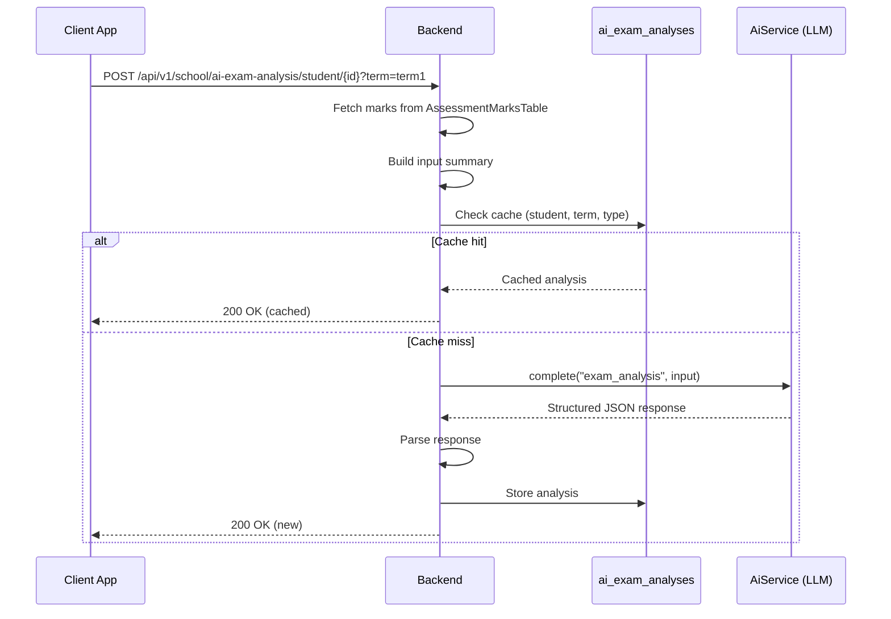
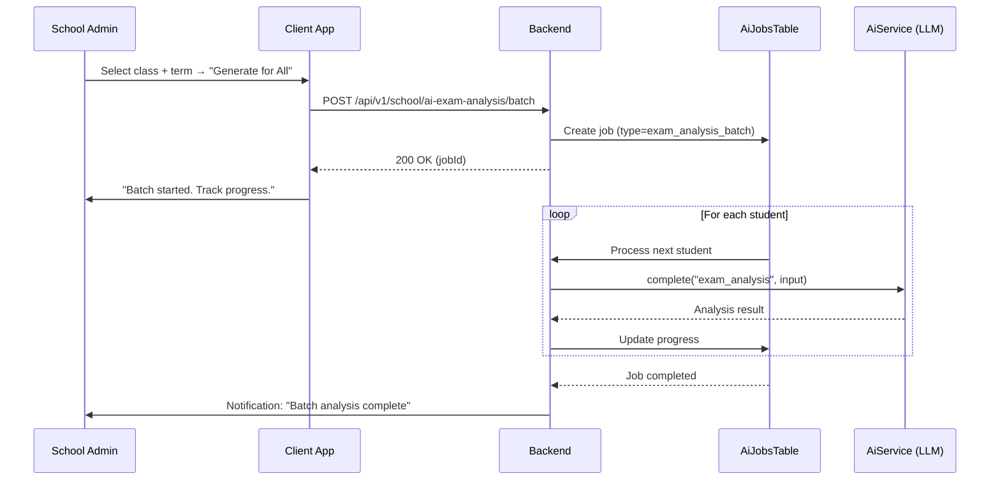
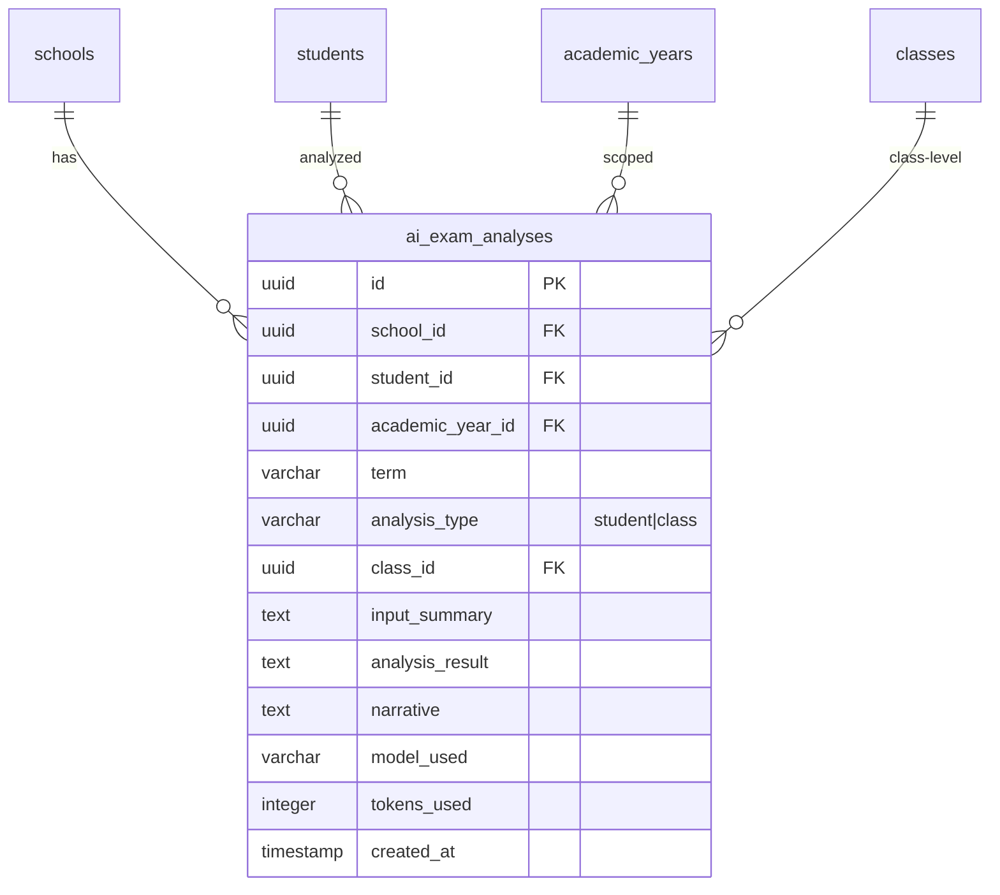

# AI Exam Analysis — Technical Specification

> **Document status:** Implementation-ready blueprint
> **Last updated:** 2026-06-27
> **Prerequisites:** `AI_INFRASTRUCTURE_SPEC.md`
> **Template:** `_SPEC_TEMPLATE.md` v1 (25 mandatory + 6 optional sections)

---

## 1. Feature Overview

AI-powered analysis of exam results that identifies weak subjects, performance trends, class-level insights, and generates personalized feedback for students and parents. Uses the shared `AiService` to call LLM providers with assessment data.

### Goals

- Per-student AI analysis: weak subjects, improvement areas, trend (improving/declining)
- Per-class AI analysis: subject-wise performance distribution, common weak areas
- Personalized narrative feedback for report cards
- Predictive insight: "at risk" students flagged based on trend
- Parent-friendly summary with actionable recommendations

### Non-goals

- [ ] Automated grading or mark entry (handled by existing assessment system)
- [ ] Real-time AI chat about exam performance (separate AI tutor feature)
- [ ] Predictive modeling beyond trend analysis (future enhancement)
- [ ] Multi-language narrative generation (future enhancement)

### Dependencies

- `AI_INFRASTRUCTURE_SPEC.md` — `AiService`, `AiJobsTable`, prompt template system
- `AssessmentsTable` + `AssessmentMarksTable` — existing assessment data
- `AcademicYearsTable` — term/year scoping

### Related Modules

- `server/.../feature/ai/AiService.kt` — shared AI service
- `server/.../feature/assessments/` — existing assessment data
- `AI_REPORT_CARD_SPEC.md` — uses narrative feedback from this analysis
- `DIFFERENTIATING_FEATURES.md` §1.4 — AI Exam Analysis feature definition

---

## 2. Current System Assessment

### Existing Code

- `AssessmentsTable` + `AssessmentMarksTable` — typed marks with `maxMarks`, `marks`, `isAbsent`, `remark`, `status`
- `feature_audit.csv` L107: Report Cards stub at 20%
- No AI analysis exists (`feature_audit.csv` L158: AI Tutoring missing)
- `DIFFERENTIATING_FEATURES.md` §1.4: AI Exam Analysis, effort M, data readiness: marks data exists

### Existing Database

- `AssessmentsTable` — assessment definitions (subject, max marks, term)
- `AssessmentMarksTable` — individual student marks per assessment
- `AcademicYearsTable` — academic year and term definitions
- `StudentsTable` — student records
- `ClassesTable` — class definitions

### Existing APIs

- `GET /api/v1/school/students/{id}/marks` — student marks
- `GET /api/v1/school/classes/{id}/marks` — class marks
- No AI analysis APIs exist

### Existing UI

- `ReportCardScreen.kt` — existing report card view (stub at 20%)
- No AI analysis screens exist

### Existing Services

- `AssessmentService` — marks management
- `AiService` — shared AI service (per `AI_INFRASTRUCTURE_SPEC.md`)

### Existing Documentation

- `feature_audit.csv` references gaps at L107 and L158
- `DIFFERENTIATING_FEATURES.md` §1.4 defines the feature

### Technical Debt

| # | Gap | Details |
|---|---|---|
| TD-1 | No AI analysis of exam results | Marks data exists but no analysis |
| TD-2 | Report cards at 20% | No narrative feedback generation |
| TD-3 | No at-risk student identification | No predictive insights |

### Gaps

| # | Gap | Impact | Severity |
|---|---|---|---|
| G1 | No per-student AI analysis | Teachers lack insights for personalized feedback | **High** |
| G2 | No per-class AI analysis | Admins lack class-level performance insights | **Medium** |
| G3 | No at-risk identification | At-risk students not flagged early | **High** |
| G4 | No narrative feedback for report cards | Report cards lack personalized comments | **Medium** |

---

## 3. Functional Requirements

### FR-001
| Field | Value |
|---|---|
| **Title** | Per-Student AI Analysis |
| **Description** | Generate per-student AI analysis: strengths, weaknesses, trend, recommendations |
| **Priority** | Critical |
| **User Roles** | School Admin, Teacher, Parent |
| **Acceptance notes** | Analysis includes strengths (≥75%), weaknesses (<50%), trend, 3 recommendations |

### FR-002
| Field | Value |
|---|---|
| **Title** | Per-Class AI Analysis |
| **Description** | Generate per-class AI analysis: subject distribution, common weak areas, top performers |
| **Priority** | High |
| **User Roles** | School Admin, Teacher |
| **Acceptance notes** | Class-level aggregation across all students |

### FR-003
| Field | Value |
|---|---|
| **Title** | At-Risk Student Identification |
| **Description** | Identify "at risk" students (declining trend + below-average marks) |
| **Priority** | High |
| **User Roles** | School Admin, Teacher |
| **Acceptance notes** | Flagged when declining trend AND below 50% in 2+ subjects |

### FR-004
| Field | Value |
|---|---|
| **Title** | Report Card Narrative |
| **Description** | Generate personalized feedback paragraph for report cards |
| **Priority** | Medium |
| **User Roles** | School Admin, Teacher |
| **Acceptance notes** | 2-3 sentence paragraph suitable for report card inclusion |

### FR-005
| Field | Value |
|---|---|
| **Title** | Parent-Friendly Summary |
| **Description** | Parent-friendly summary with actionable recommendations |
| **Priority** | Medium |
| **User Roles** | Parent |
| **Acceptance notes** | Simplified language, actionable steps for parents |

### FR-006
| Field | Value |
|---|---|
| **Title** | Batch Analysis |
| **Description** | Support batch analysis for entire class (async job via `AiJobsTable`) |
| **Priority** | High |
| **User Roles** | School Admin, Teacher |
| **Acceptance notes** | Async job; status polled via `GET /api/v1/school/ai/jobs/{jobId}` |

### FR-007
| Field | Value |
|---|---|
| **Title** | Analysis Caching |
| **Description** | Analysis cached per (student, term) — re-generated only when new marks added |
| **Priority** | Medium |
| **User Roles** | System |
| **Acceptance notes** | Cache invalidated when new marks added for that student/term |

---

## 4. User Stories

### School Admin
- [ ] Generate AI analysis for a class to see subject-wise performance distribution
- [ ] View at-risk students flagged by AI analysis
- [ ] Trigger batch analysis for all students in a class
- [ ] Include AI narrative feedback in report cards

### Teacher
- [ ] View AI analysis for my class to identify common weak areas
- [ ] View per-student AI analysis to personalize teaching
- [ ] See which students are flagged as at-risk
- [ ] Include AI narrative in student report cards

### Parent
- [ ] View AI analysis of my child's exam performance
- [ ] See strengths and weaknesses with actionable recommendations
- [ ] Understand if my child is at-risk and what to do

### System
- [ ] Fetch marks data and build input summary for LLM
- [ ] Call `AiService` with exam analysis prompt template
- [ ] Parse structured AI response
- [ ] Cache analysis results per (student, term)
- [ ] Process batch analysis jobs asynchronously

---

## 5. Business Rules

### BR-001
**Rule:** Strengths are subjects where student scored ≥75%.
**Enforcement:** Input summary includes percentage; LLM instructed to flag ≥75% as strengths.

### BR-002
**Rule:** Weaknesses are subjects where student scored <50%.
**Enforcement:** Input summary includes percentage; LLM instructed to flag <50% as weaknesses.

### BR-003
**Rule:** At-risk flag is set when declining trend AND below 50% in 2+ subjects.
**Enforcement:** LLM prompt includes rule; structured response includes `at_risk` boolean.

### BR-004
**Rule:** Analysis is cached per (school, student, academic_year, term, analysis_type).
**Enforcement:** UNIQUE constraint on `ai_exam_analyses` table; cache check before LLM call.

### BR-005
**Rule:** Cache is invalidated when new marks are added for that student/term.
**Enforcement:** `AssessmentMarksTable` insert triggers cache invalidation (or version check).

### BR-006
**Rule:** Batch analysis runs as async job via `AiJobsTable`.
**Enforcement:** `batchAnalyzeClass()` creates job entry; job processor calls `analyzeStudent()` for each student.

### BR-007
**Rule:** Narrative feedback is 2-3 sentences, suitable for report card inclusion.
**Enforcement:** LLM prompt specifies length; response parsed for `narrative` field.

---

## 6. Database Design

### 6.1 Entity Relationship Summary

New `ai_exam_analyses` table with FKs to `schools`, `students`, `academic_years`, and optionally `classes`. Unique constraint ensures one analysis per (student, term, type).

### 6.2 New Tables

```sql
CREATE TABLE ai_exam_analyses (
    id              UUID PRIMARY KEY DEFAULT gen_random_uuid(),
    school_id       UUID NOT NULL,
    student_id      UUID NOT NULL,
    academic_year_id UUID NOT NULL,
    term            VARCHAR(16) NOT NULL,
    analysis_type   VARCHAR(16) NOT NULL,          -- student | class
    class_id        UUID,                          -- for class-level analysis
    input_summary   TEXT NOT NULL,                 -- JSON: aggregated marks data sent to LLM
    analysis_result TEXT NOT NULL,                 -- JSON: structured AI response
    narrative       TEXT,                          -- plain-text feedback paragraph
    model_used      VARCHAR(64),
    tokens_used     INTEGER,
    created_at      TIMESTAMP NOT NULL DEFAULT now(),
    UNIQUE(school_id, student_id, academic_year_id, term, analysis_type)
);
CREATE INDEX idx_ai_exam_school_term ON ai_exam_analyses(school_id, term, created_at DESC);
```

### 6.3 Modified Tables

N/A — no existing tables modified.

### 6.4 Indexes

- `idx_ai_exam_school_term` — `(school_id, term, created_at DESC)` for school-wide queries
- Unique index on `(school_id, student_id, academic_year_id, term, analysis_type)` for cache

### 6.5 Constraints

- `ai_exam_analyses.school_id` — NOT NULL
- `ai_exam_analyses.student_id` — NOT NULL
- `ai_exam_analyses.academic_year_id` — NOT NULL
- `ai_exam_analyses.term` — NOT NULL
- `ai_exam_analyses.analysis_type` — NOT NULL (`student` or `class`)
- UNIQUE: `(school_id, student_id, academic_year_id, term, analysis_type)`

### 6.6 Foreign Keys

- `ai_exam_analyses.school_id` → `schools.id` (ON DELETE CASCADE)
- `ai_exam_analyses.student_id` → `students.id` (ON DELETE CASCADE)
- `ai_exam_analyses.academic_year_id` → `academic_years.id` (ON DELETE CASCADE)
- `ai_exam_analyses.class_id` → `classes.id` (nullable, ON DELETE SET NULL)

### 6.7 Soft Delete Strategy

N/A — analysis records are immutable once created. Cache invalidation creates a new record (upsert or delete+insert).

### 6.8 Audit Fields

- `created_at` — timestamp when analysis was generated
- `model_used` — which LLM model was used
- `tokens_used` — token count for cost tracking

### 6.9 Migration Notes

Migration: `docs/db/migration_039_ai_exam_analysis.sql`
- Creates `ai_exam_analyses` table with indexes
- No data backfill needed (analyses generated on demand)

### 6.10 Exposed Mappings

```kotlin
object AiExamAnalysesTable : UUIDTable("ai_exam_analyses", "id") {
    val schoolId       = uuid("school_id")
    val studentId      = uuid("student_id")
    val academicYearId = uuid("academic_year_id")
    val term           = varchar("term", 16)
    val analysisType   = varchar("analysis_type", 16)
    val classId        = uuid("class_id").nullable()
    val inputSummary   = text("input_summary")
    val analysisResult = text("analysis_result")
    val narrative      = text("narrative").nullable()
    val modelUsed      = varchar("model_used", 64).nullable()
    val tokensUsed     = integer("tokens_used").nullable()
    val createdAt      = timestamp("created_at")
    init {
        uniqueIndex("ux_ai_exam_unique", schoolId, studentId, academicYearId, term, analysisType)
        index("idx_ai_exam_school_term", false, schoolId, term, createdAt)
    }
}
```

### 6.11 Seed Data

N/A — no seed data. Prompt templates seeded per `AI_INFRASTRUCTURE_SPEC.md`.

---

## 7. State Machines

### Analysis Generation State Machine

```
REQUESTED ──> FETCH_MARKS ──> BUILD_INPUT ──> CHECK_CACHE ──> CACHE_HIT ──> RETURN_CACHED
CHECK_CACHE ──> CACHE_MISS ──> CALL_LLM ──> PARSE_RESPONSE ──> STORE_RESULT ──> RETURN_NEW
CALL_LLM ──> LLM_ERROR ──> RETURN_ERROR
```

| Current State | Event | Next State | Guard / Condition |
|---|---|---|---|
| `requested` | Start analysis | `fetch_marks` | — |
| `fetch_marks` | Marks retrieved | `build_input` | Marks exist for student/term |
| `fetch_marks` | No marks found | `return_error` | Student has no marks for term |
| `build_input` | Input summary built | `check_cache` | — |
| `check_cache` | Cache hit | `return_cached` | Existing analysis found |
| `check_cache` | Cache miss | `call_llm` | No existing analysis or invalidated |
| `call_llm` | LLM response received | `parse_response` | Valid response |
| `call_llm` | LLM error | `return_error` | API error or timeout |
| `parse_response` | Response parsed | `store_result` | Valid JSON structure |
| `parse_response` | Parse error | `return_error` | Invalid JSON |
| `store_result` | Stored in DB | `return_new` | — |

### Batch Analysis Job State Machine

```
JOB_CREATED ──> PROCESSING ──> STUDENT_ANALYZED ──> ... ──> ALL_COMPLETE ──> JOB_COMPLETED
PROCESSING ──> STUDENT_FAILED ──> CONTINUE_NEXT ──> ... ──> JOB_COMPLETED_WITH_ERRORS
```

| Current State | Event | Next State | Guard / Condition |
|---|---|---|---|
| `job_created` | Job processor picks up | `processing` | — |
| `processing` | Student analysis succeeds | `student_analyzed` | — |
| `processing` | Student analysis fails | `student_failed` | Error logged; continue |
| `student_analyzed` | More students remaining | `processing` | — |
| `student_analyzed` | All students done | `job_completed` | — |
| `student_failed` | More students remaining | `processing` | — |
| `student_failed` | All students done | `job_completed_with_errors` | Some failures |

---

## 8. Backend Architecture

### 8.1 Component Overview

New `ExamAnalysisService` handles student and class analysis, batch processing, and caching. Uses shared `AiService` for LLM calls. `ExamAnalysisRouting` exposes API endpoints.

### 8.2 Design Principles

1. **Cache-first** — Check cache before calling LLM to minimize cost
2. **Async batch** — Batch analysis runs as background job
3. **Structured output** — LLM returns structured JSON for consistent parsing
4. **Cost tracking** — Model and tokens recorded for each analysis

### 8.3 Core Types

```kotlin
class ExamAnalysisService(
    private val aiService: AiService,
    private val marksRepository: AssessmentMarksRepository
) {
    suspend fun analyzeStudent(
        schoolId: UUID, studentId: UUID, academicYearId: UUID, term: String
    ): AiExamAnalysisDto {
        // 1. Fetch all marks for student in term
        val marks = marksRepository.getByStudentAndTerm(studentId, term)
        // 2. Build input summary (subject, marks, maxMarks, percentage, grade, rank)
        val inputSummary = buildStudentInputSummary(marks)
        // 3. Check cache (ai_exam_analyses)
        // 4. Call AiService with "exam_analysis" template
        val result = aiService.complete(
            schoolId, null, "exam_analysis", "student_analysis_v1",
            mapOf(
                "student_name" to studentName,
                "class_name" to className,
                "marks_data" to inputSummary,
                "term" to term
            )
        )
        // 5. Parse structured response
        // 6. Store in ai_exam_analyses
        // 7. Return DTO
    }

    suspend fun analyzeClass(
        schoolId: UUID, classId: UUID, academicYearId: UUID, term: String
    ): AiExamAnalysisDto

    suspend fun batchAnalyzeClass(
        schoolId: UUID, classId: UUID, term: String
    ): UUID  // returns AI job ID
}
```

### 8.4 Prompt Template

**System prompt:**
```
You are an experienced education analyst. Analyze the student's exam performance and provide:
1. Strengths: subjects where student excels (≥75%)
2. Weaknesses: subjects needing improvement (<50%)
3. Trend: compare with previous term if available (improving/declining/stable)
4. At-risk: flag if declining trend AND below 50% in 2+ subjects
5. Recommendations: 3 actionable suggestions for improvement
6. Narrative: 2-3 sentence feedback paragraph for report card
```

**User prompt template:**
```
Student: {{student_name}}, Class: {{class_name}}, Term: {{term}}
Marks: {{marks_data}}
Previous term marks: {{previous_marks}}
```

### 8.5 Structured Response

```json
{
  "strengths": ["Mathematics (87%)", "Science (82%)"],
  "weaknesses": ["Hindi (42%)", "Social Studies (48%)"],
  "trend": "improving",
  "at_risk": false,
  "recommendations": [
    "Focus on Hindi vocabulary building with daily 15-min practice",
    "Use map-based learning for Social Studies",
    "Continue strong performance in Math and Science"
  ],
  "narrative": "Aarav has shown commendable improvement this term, particularly in Mathematics and Science. With focused effort in Hindi and Social Studies, he can achieve balanced excellence across all subjects."
}
```

### 8.6 Repositories

- `AiExamAnalysisRepository` — CRUD for `ai_exam_analyses` table
- `AssessmentMarksRepository` — existing; used to fetch marks data

### 8.7 Mappers

- `AiExamAnalysisMapper` — maps DB row to `AiExamAnalysisDto`

### 8.8 Permission Checks

- Parent: can only view analysis for own children
- Teacher: can view analysis for students in own class
- School admin: can view analysis for all students in school
- Batch analysis: school admin and teacher only

### 8.9 Background Jobs

| Job | Trigger | Description |
|---|---|---|
| `BatchExamAnalysisJob` | `POST /api/v1/school/ai-exam-analysis/batch` | Processes per-student analysis for entire class |

Job uses `AiJobsTable` for tracking. Each student analyzed sequentially; failures logged but don't stop the batch.

### 8.10 Domain Events

- `ExamAnalysisGenerated` — emitted when analysis is stored
- `BatchExamAnalysisCompleted` — emitted when batch job finishes
- `AtRiskStudentFlagged` — emitted when at-risk flag is set

### 8.11 Caching

- Analysis cached in `ai_exam_analyses` table (persistent cache)
- Cache key: `(school_id, student_id, academic_year_id, term, analysis_type)`
- Cache invalidated when new marks added for student/term
- No in-memory cache (DB lookup is sufficient)

### 8.12 Transactions

- Analysis storage: single INSERT (upsert on unique constraint)
- Batch job: each student analysis in independent transaction

---

## 9. API Contracts

### 9.1 Student Analysis

```
GET /api/v1/parent/ai-exam-analysis/{childId}?term=term1
POST /api/v1/school/ai-exam-analysis/student/{studentId}?term=term1
```

**Response 200:**
```json
{
  "success": true,
  "data": {
    "id": "uuid",
    "student_id": "uuid",
    "term": "term1",
    "analysis_type": "student",
    "strengths": ["Mathematics (87%)", "Science (82%)"],
    "weaknesses": ["Hindi (42%)", "Social Studies (48%)"],
    "trend": "improving",
    "at_risk": false,
    "recommendations": ["...", "...", "..."],
    "narrative": "Aarav has shown commendable improvement...",
    "created_at": "2026-06-27T10:30:00Z"
  }
}
```

### 9.2 Class Analysis

```
POST /api/v1/school/ai-exam-analysis/class/{classId}?term=term1
```

### 9.3 Batch Analysis

```
POST /api/v1/school/ai-exam-analysis/batch
{
  "class_id": "uuid",
  "term": "term1"
}
```

Returns AI job ID. Status polled via `GET /api/v1/school/ai/jobs/{jobId}`.

---

## 10. Frontend Architecture

### 10.1 Screens

| Screen | Platform | Role | Description |
|---|---|---|---|
| `AiExamAnalysisScreen` | All | Parent | View child's AI exam analysis |
| `ClassAnalysisScreen` | All | School Admin, Teacher | View class-level AI analysis |
| `AtRiskStudentsScreen` | All | School Admin, Teacher | View at-risk students list |

### 10.2 Navigation

- Parent portal → Academics → Exam Analysis → `AiExamAnalysisScreen`
- Admin portal → Academics → Class Analysis → `ClassAnalysisScreen`
- Admin portal → Academics → At-Risk Students → `AtRiskStudentsScreen`

### 10.3 UX Flows

#### Parent Views Child Analysis

1. Parent navigates to Academics → Exam Analysis
2. Selects child and term
3. `AiExamAnalysisScreen` loads with analysis (cached or generated)
4. Displays strengths, weaknesses, trend, recommendations, narrative
5. At-risk badge shown if flagged

#### Admin Triggers Batch Analysis

1. Admin navigates to Class Analysis
2. Selects class and term
3. Clicks "Generate Analysis for All Students"
4. Batch job starts; progress shown
5. Results available per student

### 10.4 State Management

```kotlin
data class ExamAnalysisState(
    val analysis: AiExamAnalysisDto?,
    val isLoading: Boolean,
    val isGenerating: Boolean,
    val error: String?,
    val selectedTerm: String,
)
```

### 10.5 Offline Support

N/A — AI analysis requires server-side LLM call. Cached results can be viewed offline if previously loaded.

### 10.6 Loading States

- Initial load: skeleton card
- Generating (cache miss): progress indicator with "Analyzing exam performance..."
- Batch: progress bar with "Analyzing 30 of 45 students..."

### 10.7 Error Handling (UI)

- No marks found: "No exam marks available for this term."
- LLM error: "Analysis could not be generated. Please try again later."
- Batch partial failure: "Analysis completed for 42 of 45 students. 3 failed."

### 10.8 Component Integration Guidelines

| Rule | Description |
|---|---|
| **R1** | Strengths displayed as green chips; weaknesses as red chips |
| **R2** | Trend shown as arrow icon (up=improving, down=declining, right=stable) |
| **R3** | At-risk badge prominently displayed if flagged |
| **R4** | Narrative displayed in highlighted card for report card context |
| **R5** | Recommendations displayed as numbered list |

---

## 11. Shared Module Changes (KMP)

### 11.1 DTOs

```kotlin
data class AiExamAnalysisDto(
    val id: UUID,
    val studentId: UUID,
    val term: String,
    val analysisType: String,
    val strengths: List<String>,
    val weaknesses: List<String>,
    val trend: String,
    val atRisk: Boolean,
    val recommendations: List<String>,
    val narrative: String?,
    val createdAt: Instant,
)

data class BatchAnalysisRequest(
    val classId: UUID,
    val term: String,
)
```

### 11.2 Domain Models

```kotlin
data class ExamAnalysis(
    val id: UUID,
    val schoolId: UUID,
    val studentId: UUID,
    val academicYearId: UUID,
    val term: String,
    val analysisType: AnalysisType,
    val strengths: List<String>,
    val weaknesses: List<String>,
    val trend: Trend,
    val atRisk: Boolean,
    val recommendations: List<String>,
    val narrative: String?,
    val modelUsed: String?,
    val tokensUsed: Int?,
    val createdAt: Instant,
)
```

### 11.3 Repository Interfaces

```kotlin
interface ExamAnalysisRepository {
    suspend fun get(schoolId: UUID, studentId: UUID, term: String, analysisType: String): AiExamAnalysisDto?
    suspend fun insert(analysis: ExamAnalysisEntity): Unit
    suspend fun getByClass(schoolId: UUID, classId: UUID, term: String): List<AiExamAnalysisDto>
}
```

### 11.4 UseCases

- `GetStudentAnalysisUseCase`
- `GetClassAnalysisUseCase`
- `TriggerBatchAnalysisUseCase`
- `GetAtRiskStudentsUseCase`

### 11.5 Validation

- Term: must be valid term identifier (`term1`, `term2`, etc.)
- Student ID: must be valid UUID
- Class ID: must be valid UUID

### 11.6 Serialization

Standard Kotlinx serialization for DTOs. `analysisResult` is JSON string parsed to structured fields.

### 11.7 Network APIs

Added to `ExamAnalysisApi.kt`:
- `GET /api/v1/parent/ai-exam-analysis/{childId}` — parent view
- `POST /api/v1/school/ai-exam-analysis/student/{studentId}` — admin/teacher trigger
- `POST /api/v1/school/ai-exam-analysis/class/{classId}` — class analysis
- `POST /api/v1/school/ai-exam-analysis/batch` — batch analysis

### 11.8 Database Models (Local Cache)

N/A — analysis data is server-side only. No local caching needed.

---

## 12. Permissions Matrix

| Action | Super Admin | School Admin | Teacher | Parent |
|---|---|---|---|---|
| View own child's analysis | ❌ | ❌ | ❌ | ✅ |
| View student analysis | ✅ | ✅ | ✅ (own class) | ❌ |
| View class analysis | ✅ | ✅ | ✅ (own class) | ❌ |
| Trigger student analysis | ✅ | ✅ | ✅ (own class) | ❌ |
| Trigger batch analysis | ✅ | ✅ | ✅ (own class) | ❌ |
| View at-risk students | ✅ | ✅ | ✅ (own class) | ❌ |

---

## 13. Notifications

### Analysis-Related Notifications

| Type | Trigger | Channel | Message |
|---|---|---|---|
| Batch Analysis Complete | Batch job finishes | In-app | "Exam analysis completed for {className}. View results." |
| At-Risk Alert | Student flagged at-risk | In-app + Push | "Alert: {studentName} has been flagged as at-risk based on exam performance." |
| Analysis Failed | LLM call fails | In-app (admin) | "Exam analysis could not be generated for {studentName}. Please retry." |

---

## 14. Background Jobs

| Job | Schedule | Description |
|---|---|---|
| `BatchExamAnalysisJob` | On-demand (triggered by API) | Processes per-student analysis for entire class |

**Implementation:**
1. Job created in `AiJobsTable` with `type = "exam_analysis_batch"`
2. Job processor fetches all students in class
3. For each student, calls `ExamAnalysisService.analyzeStudent()`
4. Failures logged but don't stop batch
5. Job status updated: `processing` → `completed` or `completed_with_errors`

---

## 15. Integrations

### AiService (Shared)
| Field | Value |
|---|---|
| **System** | AiService (per `AI_INFRASTRUCTURE_SPEC.md`) |
| **Purpose** | LLM calls for exam analysis |
| **API / SDK** | `AiService.complete()` |
| **Auth method** | Internal service call |
| **Fallback** | None — LLM is required for analysis |

### AssessmentMarksRepository
| Field | Value |
|---|---|
| **System** | Existing assessment system |
| **Purpose** | Fetch student marks data |
| **API / SDK** | `AssessmentMarksRepository.getByStudentAndTerm()` |
| **Auth method** | Internal service call |
| **Fallback** | None — marks data is required input |

### AiJobsTable
| Field | Value |
|---|---|
| **System** | AI job tracking (per `AI_INFRASTRUCTURE_SPEC.md`) |
| **Purpose** | Track batch analysis jobs |
| **API / SDK** | `AiJobsTable` CRUD |
| **Auth method** | Internal |
| **Fallback** | None |

---

## 16. Security

### Authentication
- All API endpoints require valid JWT
- Parent JWT scoped to own children only
- Teacher JWT scoped to own classes

### Authorization
- Parent: can only view analysis for children linked to their account
- Teacher: can view/trigger analysis for students in own classes
- School admin: can view/trigger analysis for all students in school

### Encryption
- `input_summary` and `analysis_result` stored as plaintext JSON (non-sensitive aggregated marks data)
- LLM API calls use TLS (handled by `AiService`)

### Audit Logs
- Analysis generation logged via `AuditService` (action: `CREATE`, entity: `ai_exam_analysis`)
- Batch job creation logged (action: `BULK_IMPORT`, entity: `ai_exam_analysis`)

### PII Handling
- Student name included in LLM prompt for personalized narrative
- Marks data is not PII but is sensitive educational record
- `input_summary` contains aggregated marks (not raw PII)

### Data Isolation
- All queries filtered by `school_id` from JWT
- Parent queries filtered by child link verification
- Teacher queries filtered by class assignment

### Rate Limiting
- Per-student analysis: standard API rate limiting
- Batch analysis: limited to 1 concurrent batch per class
- LLM calls rate-limited by `AiService` (per `AI_INFRASTRUCTURE_SPEC.md`)

### Input Validation
- Term: must be valid term identifier
- Student ID / Class ID: must be valid UUID
- Batch request: class_id and term required

---

## 17. Performance & Scalability

### Expected Scale

| Metric | 1 class (30 students) | 10 classes | 50 classes |
|---|---|---|---|
| Single analysis (LLM call) | ~3-5s | ~3-5s | ~3-5s |
| Batch analysis (all students) | ~2-3 min | ~20-30 min | ~2-2.5 hours |
| Cache hit (no LLM call) | < 50ms | < 50ms | < 50ms |

### Latency Targets

| Operation | Target |
|---|---|
| Cached analysis retrieval | < 50ms |
| Single student analysis (LLM) | < 10s |
| Class analysis (LLM) | < 15s |
| Batch analysis (per student) | < 10s each |

### Optimization Strategy

- Cache-first: check `ai_exam_analyses` before LLM call
- Batch processing: sequential with 1-second delay between students to avoid rate limits
- Input summary: pre-aggregated to minimize LLM token usage
- Structured output: JSON response reduces parsing overhead

---

## 18. Edge Cases

| # | Scenario | Expected Behavior |
|---|---|---|
| EC-001 | Student has no marks for term | Return error: "No marks available for this term" |
| EC-002 | Student was absent for all exams | Analysis generated with note about absences |
| EC-003 | LLM returns malformed JSON | Error logged; retry once; return error to user |
| EC-004 | LLM API timeout | Retry with backoff (handled by `AiService`); return error after 3 retries |
| EC-005 | Batch job: some students fail | Continue with remaining; job marked `completed_with_errors` |
| EC-006 | Cache exists but marks updated since | Cache invalidated; new analysis generated |
| EC-007 | Parent requests analysis for non-linked child | 403 Forbidden |
| EC-008 | Class has only 1 student | Class analysis still generated; note about small sample |

### Risks & Mitigations

| Risk | Likelihood | Impact | Mitigation |
|---|---|---|---|
| LLM hallucinates incorrect analysis | Medium | Medium | Structured prompt; validate response fields |
| LLM cost exceeds budget | Medium | Medium | Cache-first; token tracking; batch with delays |
| Batch job takes too long | Medium | Low | Sequential with progress tracking; can be cancelled |
| Marks data incomplete | Medium | Low | Analysis generated with available data; note about gaps |

---

## 19. Error Handling

### Standard Error Codes

| HTTP | Error Code | Description | When |
|---|---|---|---|
| 400 | `NO_MARKS_FOUND` | Student has no marks for the specified term | Analysis request |
| 403 | `CHILD_NOT_LINKED` | Parent requesting analysis for non-linked child | Parent API |
| 403 | `CLASS_NOT_ASSIGNED` | Teacher requesting analysis for non-assigned class | Teacher API |
| 500 | `LLM_ERROR` | LLM call failed after retries | Analysis generation |
| 500 | `PARSE_ERROR` | LLM response could not be parsed | Analysis generation |

### Error Response Format

Same as existing API error format.

### Recovery Strategy

| Error | Client Action | Server Action |
|---|---|---|
| `NO_MARKS_FOUND` | Show "No marks available" message | Return 400 |
| `LLM_ERROR` | Show retry button | Retry 3x with backoff; return 500 |
| `PARSE_ERROR` | Show retry button | Retry once; return 500 |
| Batch partial failure | Show summary | Continue batch; log failures |

---

## 20. Analytics & Reporting

### Reports

- **AI Analysis Usage Report:** Number of analyses generated per class/term
- **At-Risk Students Report:** List of students flagged as at-risk per class/term
- **Token Usage Report:** LLM token consumption per school/month

### KPIs

- **Analysis Generation Rate:** Number of analyses per week
- **Cache Hit Rate:** % of analysis requests served from cache
- **At-Risk Detection Rate:** % of students flagged as at-risk
- **LLM Cost per Analysis:** Average token cost per analysis
- **Batch Completion Rate:** % of batch jobs completed without errors

### Dashboards

N/A — monitoring via metrics (see section F. Observability).

### Exports

N/A — analysis results viewable in-app.

---

## 21. Testing Strategy

### Unit Tests

| Test | What it verifies |
|---|---|
| Input summary builder | Correct aggregation of marks data |
| Response parser | Correct parsing of LLM JSON response |
| Cache check | Returns cached analysis when available |
| Cache miss | Calls LLM when no cache exists |
| At-risk flag logic | Correctly identifies at-risk students |

### Integration Tests

| Test | What it verifies |
|---|---|
| Mock LLM → analysis stored → retrieve → correct structure | Full flow |
| Batch: 30 students → all analyses generated → job completed | Batch processing |
| Cache hit → no LLM call made | Cache behavior |
| Parent requesting non-linked child → 403 | Permission enforcement |
| No marks for term → 400 | Edge case handling |

### Performance Tests

- [ ] Single analysis (LLM call) < 10s
- [ ] Cached analysis retrieval < 50ms
- [ ] Batch of 30 students completes < 5 min

### Security Tests

- [ ] Parent cannot access non-linked child's analysis
- [ ] Teacher cannot access non-assigned class analysis
- [ ] All queries school-scoped via JWT

### Migration Tests

- [ ] Migration creates table with correct schema
- [ ] Unique constraint enforced
- [ ] Indexes created correctly

---

## 22. Acceptance Criteria

- [ ] Per-student analysis generates strengths, weaknesses, trend, recommendations
- [ ] Per-class analysis generates subject distribution and common weak areas
- [ ] At-risk students flagged correctly
- [ ] Narrative feedback suitable for report card inclusion
- [ ] Batch analysis processes entire class
- [ ] Results cached per (student, term)
- [ ] Parent can view child's analysis
- [ ] Teacher can view class analysis
- [ ] Batch job tracks progress and failures

---

## 23. Implementation Roadmap

| Phase | Duration | Tasks | Breaking? | Deliverable |
|---|---|---|---|---|
| 1 | 1 day | DB migration, Exposed table | No | Schema ready |
| 2 | 2 days | ExamAnalysisService (student + class) | No | Core service |
| 3 | 1 day | Prompt template + seed | No | LLM prompt ready |
| 4 | 1 day | Batch analysis integration | No | Batch processing |
| 5 | 2 days | API endpoints | No | API available |
| 6 | 2 days | Client UI (parent analysis view, admin class analysis) | No | UI ready |
| 7 | 1 day | Tests | No | Test coverage |

**Total: ~10 days**

---

## 24. File-Level Impact Analysis

### New Files

| File | Location | Purpose |
|---|---|---|
| `ExamAnalysisService.kt` | `server/.../feature/ai/exam/` | Core analysis service |
| `ExamAnalysisRouting.kt` | `server/.../feature/ai/exam/` | API endpoints |
| `migration_039_ai_exam_analysis.sql` | `docs/db/` | DDL migration |
| `ExamAnalysisApi.kt` | `shared/.../feature/ai/` | Client API |
| `AiExamAnalysisScreen.kt` | `composeApp/.../ui/v2/screens/parent/` | Parent view |
| `ClassAnalysisScreen.kt` | `composeApp/.../ui/v2/screens/admin/` | Admin class view |
| `AtRiskStudentsScreen.kt` | `composeApp/.../ui/v2/screens/admin/` | At-risk students view |

### Modified Files

| File | Change Type | Lines Changed (est.) | Risk | Description |
|---|---|---|---|---|
| `server/.../db/Tables.kt` | Add | ~15 | Low | `AiExamAnalysesTable` object |
| `server/.../db/DatabaseFactory.kt` | Modify | ~2 | Low | Register table |

### Files Preserved Unchanged

| File | Reason |
|---|---|
| `AiService.kt` | Used as-is per AI_INFRASTRUCTURE_SPEC |
| `AssessmentMarksRepository` | Used as-is (read-only) |
| All existing assessment screens | No changes needed |

---

## 25. Future Enhancements

### Multi-Language Narrative

- Generate narrative feedback in multiple languages (Hindi, Marathi, Tamil, etc.)
- Based on parent's preferred language
- Requires multi-language LLM prompt templates

### Historical Trend Visualization

- Visual charts showing performance trends across multiple terms/years
- Interactive graphs for strengths/weaknesses over time
- Predictive trajectory based on historical data

### Comparative Analysis

- Compare student performance against class average
- Benchmark against school/district averages
- Percentile rankings

### AI-Powered Remedial Content

- Generate specific remedial learning materials for weak subjects
- Link to relevant educational resources
- Personalized practice recommendations

### Parent-Teacher AI Insights

- AI-generated talking points for parent-teacher meetings
- Suggested discussion topics based on analysis
- Action plan templates

### Automated Report Card Generation

- Use AI narrative + structured analysis to auto-generate full report cards
- Template-based with AI-filled sections
- Admin review before publishing

---

## A. Sequence Diagrams

### Per-Student Analysis Flow



### Batch Analysis Flow



---

## B. Domain Model / ER Diagram



---

## C. Event Flow

```
AnalysisRequested -> FetchMarks -> BuildInputSummary -> CheckCache -> CacheHit -> ReturnCached
AnalysisRequested -> FetchMarks -> BuildInputSummary -> CheckCache -> CacheMiss -> CallLLM -> ParseResponse -> StoreResult -> ReturnNew
BatchRequested -> CreateJob -> ProcessStudent -> AnalyzeStudent -> UpdateProgress -> NextStudent -> JobComplete
AtRiskFlagged -> SendNotification -> AlertParent -> AlertTeacher
```

| Event | Emitted By | Consumed By | Side Effect |
|---|---|---|---|
| `ExamAnalysisGenerated` | `ExamAnalysisService.analyzeStudent()` | Notification service | In-app notification if at-risk |
| `BatchExamAnalysisCompleted` | `BatchExamAnalysisJob` | Notification service | In-app notification to admin/teacher |
| `AtRiskStudentFlagged` | `ExamAnalysisService` (at_risk=true) | Notification service | Push + in-app to parent and teacher |
| `ExamAnalysisFailed` | `ExamAnalysisService` (catch block) | Monitoring | Error logged; alert if repeated |

---

## D. Configuration

### Environment Variables

| Variable | Description |
|---|---|
| `AI_EXAM_ANALYSIS_ENABLED` | Enable/disable feature (default: `true`) |
| `AI_EXAM_BATCH_CONCURRENCY` | Concurrent students in batch (default: `1` — sequential) |
| `AI_EXAM_BATCH_DELAY_MS` | Delay between students in batch (default: `1000`) |

### Feature Flags

| Flag | Default | Description |
|---|---|---|
| `ai_exam_analysis_enabled` | `true` | Master switch for exam analysis |
| `ai_exam_batch_enabled` | `true` | Enable batch analysis |
| `ai_exam_atrisk_alerts` | `true` | Send at-risk notifications |

### Client-Side Configuration

| Config | Default | Description |
|---|---|---|
| Default term | Current term | Initial term selection on screen |
| Analysis auto-refresh | false | Auto-regenerate on screen open |

### Server-Side Configuration

| Config | Default | Description |
|---|---|---|
| LLM model | Per `AiService` config | Model used for analysis |
| Prompt template | `student_analysis_v1` | Template version |
| Cache TTL | Infinite (invalidated on new marks) | Cache duration |
| Max retries | 3 | LLM call retries |

### Infrastructure Requirements

- `AiService` configured per `AI_INFRASTRUCTURE_SPEC.md`
- LLM provider API access (OpenAI, Anthropic, etc.)
- Sufficient DB storage for analysis results

---

## E. Migration & Rollback

### Deployment Plan

1. [ ] Run `migration_039_ai_exam_analysis.sql` — creates table + indexes
2. [ ] Deploy `AiExamAnalysesTable` in `Tables.kt`
3. [ ] Register table in `DatabaseFactory.kt`
4. [ ] Deploy `ExamAnalysisService.kt`
5. [ ] Deploy `ExamAnalysisRouting.kt`
6. [ ] Seed prompt template `student_analysis_v1` (per `AI_INFRASTRUCTURE_SPEC.md`)
7. [ ] Deploy client UI
8. [ ] Test with mock LLM
9. [ ] Deploy to production

### Rollback Plan

1. [ ] Disable feature flag `ai_exam_analysis_enabled` → API returns 404
2. [ ] Remove client UI → screens not shown
3. [ ] Database: `DROP TABLE IF EXISTS ai_exam_analyses;`
4. [ ] No data loss to business operations — analysis is additive

### Data Backfill

N/A — analyses generated on demand. No backfill needed.

### Migration SQL

```sql
-- migration_039_ai_exam_analysis.sql
CREATE TABLE IF NOT EXISTS ai_exam_analyses (
    id              UUID PRIMARY KEY DEFAULT gen_random_uuid(),
    school_id       UUID NOT NULL,
    student_id      UUID NOT NULL,
    academic_year_id UUID NOT NULL,
    term            VARCHAR(16) NOT NULL,
    analysis_type   VARCHAR(16) NOT NULL,
    class_id        UUID,
    input_summary   TEXT NOT NULL,
    analysis_result TEXT NOT NULL,
    narrative       TEXT,
    model_used      VARCHAR(64),
    tokens_used     INTEGER,
    created_at      TIMESTAMP NOT NULL DEFAULT now(),
    UNIQUE(school_id, student_id, academic_year_id, term, analysis_type)
);

CREATE INDEX IF NOT EXISTS idx_ai_exam_school_term ON ai_exam_analyses(school_id, term, created_at DESC);

-- ROLLBACK:
-- DROP TABLE IF EXISTS ai_exam_analyses;
```

---

## F. Observability

### Logging

- Analysis requested: INFO `exam_analysis_requested` (schoolId, studentId, term, analysisType)
- Analysis cache hit: DEBUG `exam_analysis_cache_hit` (studentId, term)
- Analysis generated: INFO `exam_analysis_generated` (studentId, term, modelUsed, tokensUsed, durationMs)
- Analysis failed: WARN `exam_analysis_failed` (studentId, term, error)
- Batch started: INFO `exam_batch_started` (classId, term, studentCount)
- Batch completed: INFO `exam_batch_completed` (jobId, successCount, failureCount, durationMs)
- At-risk flagged: WARN `exam_at_risk_flagged` (studentId, term, classId)

### Metrics

| Metric | Type | Description |
|---|---|---|
| `ai.exam_analysis.requests_total` | Counter | Total analysis requests |
| `ai.exam_analysis.cache_hits_total` | Counter | Cache hit count |
| `ai.exam_analysis.cache_misses_total` | Counter | Cache miss count |
| `ai.exam_analysis.llm_latency_ms` | Histogram | LLM call latency |
| `ai.exam_analysis.tokens_used_total` | Counter | Total tokens consumed |
| `ai.exam_analysis.batch_jobs_total` | Counter | Total batch jobs |
| `ai.exam_analysis.batch_failures_total` | Counter | Batch jobs with failures |
| `ai.exam_analysis.at_risk_flagged_total` | Counter | At-risk students flagged |

### Health Checks

- `GET /api/v1/health` — existing health check (covers AI service indirectly)
- LLM provider availability check (per `AI_INFRASTRUCTURE_SPEC.md`)

### Alerts

- LLM error rate > 10% → Warning
- Batch failure rate > 20% → Warning
- Token usage exceeding monthly budget → Warning
- At-risk rate > 30% of class → Info (may indicate systemic issue)
