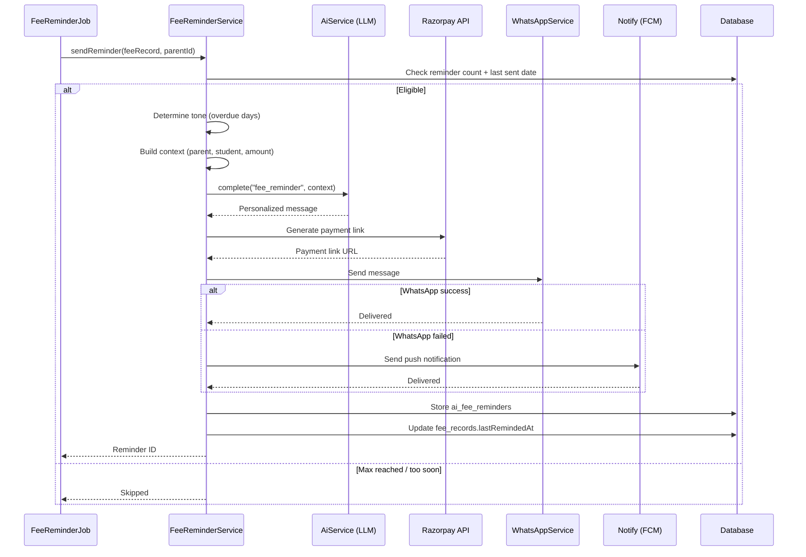
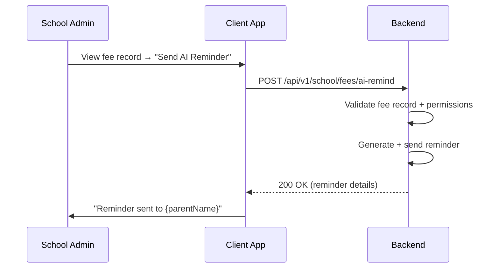
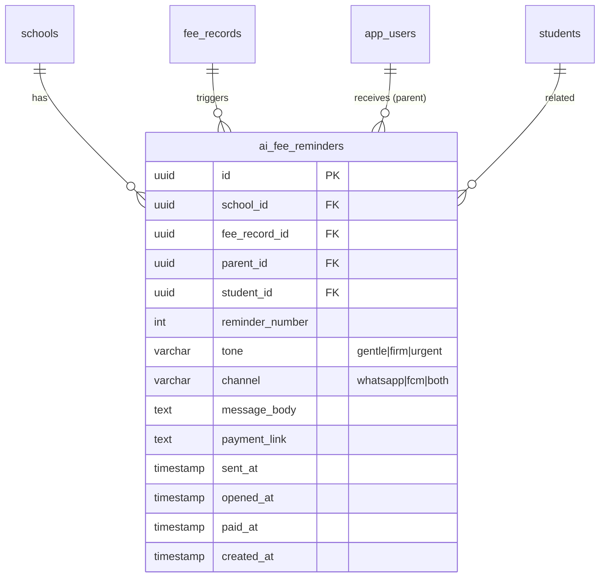

# AI Fee Reminder Optimization — Technical Specification

> **Document status:** Implementation-ready blueprint
> **Last updated:** 2026-06-27
> **Prerequisites:** `AI_INFRASTRUCTURE_SPEC.md`, `FEE_PAYMENT_SPEC.md`
> **Template:** `_SPEC_TEMPLATE.md` v1 (25 mandatory + 6 optional sections)

---

## 1. Feature Overview

AI-optimized fee reminders that personalize message content, timing, and channel based on parent behavior patterns. Uses LLM to generate contextual, non-generic reminders that improve payment conversion rates.

### Goals

- Personalize reminder message based on parent's payment history and relationship
- Optimize send time based on when parent is most likely to respond
- Vary tone (gentle, urgent, empathetic) based on overdue duration
- Include payment link and specific amount
- Track reminder effectiveness (opened → paid conversion)

### Non-goals

- [ ] Automated fee waiver or discount decisions (handled by admin)
- [ ] Payment plan negotiation (future enhancement)
- [ ] Multi-language reminder generation (future enhancement)
- [ ] Predictive payment date forecasting (future enhancement)

### Dependencies

- `AI_INFRASTRUCTURE_SPEC.md` — `AiService` for LLM calls
- `FEE_PAYMENT_SPEC.md` — `FeeRecordsTable`, fee management
- `WhatsAppCloudProvider` — existing WhatsApp messaging
- `Notify` — existing notification service
- Razorpay — payment link generation

### Related Modules

- `server/.../feature/fees/` — existing fee management
- `server/.../feature/notifications/` — notification infrastructure
- `server/.../feature/ai/AiService.kt` — shared AI service

---

## 2. Current System Assessment

### Existing Code

- `FeeRecordsTable` has `lastRemindedAt` — basic reminder tracking
- No AI personalization — all reminders are generic
- `WhatsAppCloudProvider` exists for sending messages
- No reminder analytics or A/B testing

### Existing Database

- `FeeRecordsTable` — fee records with `status`, `amount`, `dueDate`, `lastRemindedAt`
- `StudentsTable` — student records
- `AppUsersTable` — parent records
- `NotificationsTable` — notification log

### Existing APIs

- `GET /api/v1/school/fees` — fee management
- `POST /api/v1/notifications/whatsapp/send` — WhatsApp sending
- No AI reminder APIs exist

### Existing UI

- `FeeManagementScreen.kt` — existing fee management
- No AI reminder UI

### Existing Services

- `FeeService` — fee management
- `WhatsAppService` — WhatsApp message sending
- `Notify` — notification service
- `AiService` — shared AI service (per `AI_INFRASTRUCTURE_SPEC.md`)

### Existing Documentation

- `FEE_PAYMENT_SPEC.md` — fee payment specification
- `AI_INFRASTRUCTURE_SPEC.md` — AI infrastructure specification

### Technical Debt

| # | Gap | Details |
|---|---|---|
| TD-1 | Generic reminders | All parents receive same message regardless of history |
| TD-2 | No reminder tracking | No data on reminder effectiveness |
| TD-3 | No tone variation | Same tone regardless of overdue duration |
| TD-4 | No payment link in reminder | Parents must navigate app to pay |

### Gaps

| # | Gap | Impact | Severity |
|---|---|---|---|
| G1 | No AI personalization | Low conversion rate for fee reminders | **High** |
| G2 | No reminder analytics | Cannot measure or optimize effectiveness | **Medium** |
| G3 | No tone variation | All reminders feel same; parents ignore | **Medium** |
| G4 | No payment link | Friction in payment process | **High** |

---

## 3. Functional Requirements

### FR-001
| Field | Value |
|---|---|
| **Title** | Personalized Reminder Generation |
| **Description** | Generate personalized reminder message per parent using LLM |
| **Priority** | Critical |
| **User Roles** | System |
| **Acceptance notes** | Message includes student name, amount, due date, payment link |

### FR-002
| Field | Value |
|---|---|
| **Title** | Tone Adjustment |
| **Description** | Adjust tone based on overdue duration (1-7 days: gentle, 8-30: firm, 30+: urgent) |
| **Priority** | High |
| **User Roles** | System |
| **Acceptance notes** | Tone automatically determined from overdue days |

### FR-003
| Field | Value |
|---|---|
| **Title** | Payment Link Inclusion |
| **Description** | Include student name, specific amount, due date, payment link |
| **Priority** | Critical |
| **User Roles** | System |
| **Acceptance notes** | Razorpay payment link generated per fee record |

### FR-004
| Field | Value |
|---|---|
| **Title** | Reminder Effectiveness Tracking |
| **Description** | Track reminder effectiveness: sent → opened → paid conversion |
| **Priority** | High |
| **User Roles** | School Admin |
| **Acceptance notes** | Conversion rate: payments received within 7 days of reminder |

### FR-005
| Field | Value |
|---|---|
| **Title** | Reminder Limits |
| **Description** | Limit reminders: max 3 per fee record, spaced ≥3 days apart |
| **Priority** | High |
| **User Roles** | System |
| **Acceptance notes** | No more than 3 reminders; minimum 3 days between reminders |

### FR-006
| Field | Value |
|---|---|
| **Title** | Multi-Channel Delivery |
| **Description** | Send via WhatsApp (primary) + FCM push (fallback) |
| **Priority** | Medium |
| **User Roles** | System |
| **Acceptance notes** | WhatsApp primary; FCM push if WhatsApp fails |

---

## 4. User Stories

### School Admin
- [ ] View AI reminder statistics (sent, opened, paid conversion rate)
- [ ] Manually trigger AI reminder for specific fee record
- [ ] See which parents received reminders and their payment status

### Parent
- [ ] Receive personalized fee reminder with student name and exact amount
- [ ] Click payment link to pay directly from reminder
- [ ] Receive reminders with appropriate tone based on overdue duration

### System
- [ ] Daily scheduled job identifies overdue fee records
- [ ] Generate personalized message via LLM
- [ ] Determine tone based on overdue duration
- [ ] Generate Razorpay payment link
- [ ] Send via WhatsApp + FCM push
- [ ] Track reminder effectiveness (sent → opened → paid)
- [ ] Respect max 3 reminders per fee record, ≥3 days apart

---

## 5. Business Rules

### BR-001
**Rule:** Tone is determined by overdue duration: 1-7 days = gentle, 8-30 days = firm, 30+ days = urgent.
**Enforcement:** `FeeReminderService` calculates overdue days and sets tone before LLM call.

### BR-002
**Rule:** Maximum 3 reminders per fee record, spaced at least 3 days apart.
**Enforcement:** Query `ai_fee_reminders` for count and last sent date before sending new reminder.

### BR-003
**Rule:** Payment link must be included in every reminder.
**Enforcement:** Razorpay payment link generated per fee record; included in message body.

### BR-004
**Rule:** WhatsApp is primary channel; FCM push is fallback if WhatsApp fails.
**Enforcement:** `FeeReminderService` tries WhatsApp first; if send fails, sends FCM push.

### BR-005
**Rule:** Daily scheduled job runs at 9 AM IST.
**Enforcement:** Ktor scheduled task or cron job triggers `FeeReminderJob`.

### BR-006
**Rule:** Reminder effectiveness tracked as payments received within 7 days of reminder.
**Enforcement:** `paid_at` field in `ai_fee_reminders` populated when payment received within 7 days.

---

## 6. Database Design

### 6.1 Entity Relationship Summary

New `ai_fee_reminders` table with FKs to `schools`, `fee_records`, `app_users` (parent), `students`. Tracks each reminder sent, its tone, channel, and effectiveness.

### 6.2 New Tables

```sql
CREATE TABLE ai_fee_reminders (
    id              UUID PRIMARY KEY DEFAULT gen_random_uuid(),
    school_id       UUID NOT NULL,
    fee_record_id   UUID NOT NULL,
    parent_id       UUID NOT NULL,
    student_id      UUID,
    reminder_number INTEGER NOT NULL,              -- 1, 2, 3
    tone            VARCHAR(16) NOT NULL,          -- gentle | firm | urgent
    channel         VARCHAR(16) NOT NULL,          -- whatsapp | fcm | both
    message_body    TEXT NOT NULL,
    payment_link    TEXT,
    sent_at         TIMESTAMP NOT NULL DEFAULT now(),
    opened_at       TIMESTAMP,
    paid_at         TIMESTAMP,                     -- if payment made after this reminder
    created_at      TIMESTAMP NOT NULL DEFAULT now()
);
```

### 6.3 Modified Tables

- `FeeRecordsTable` — `lastRemindedAt` field already exists; updated when reminder sent

### 6.4 Indexes

```sql
CREATE INDEX idx_ai_fee_reminders_school ON ai_fee_reminders(school_id, sent_at DESC);
CREATE INDEX idx_ai_fee_reminders_fee ON ai_fee_reminders(fee_record_id);
```

### 6.5 Constraints

- `ai_fee_reminders.school_id` — NOT NULL
- `ai_fee_reminders.fee_record_id` — NOT NULL
- `ai_fee_reminders.parent_id` — NOT NULL
- `ai_fee_reminders.reminder_number` — NOT NULL (1, 2, or 3)
- `ai_fee_reminders.tone` — NOT NULL (`gentle`, `firm`, `urgent`)
- `ai_fee_reminders.channel` — NOT NULL (`whatsapp`, `fcm`, `both`)

### 6.6 Foreign Keys

- `ai_fee_reminders.school_id` → `schools.id` (ON DELETE CASCADE)
- `ai_fee_reminders.fee_record_id` → `fee_records.id` (ON DELETE CASCADE)
- `ai_fee_reminders.parent_id` → `app_users.id` (ON DELETE CASCADE)
- `ai_fee_reminders.student_id` → `students.id` (nullable, ON DELETE SET NULL)

### 6.7 Soft Delete Strategy

N/A — reminder records are immutable log entries. No soft delete.

### 6.8 Audit Fields

- `sent_at` — when reminder was sent
- `opened_at` — when reminder was opened (if trackable)
- `paid_at` — when payment was made after this reminder (if within 7 days)
- `created_at` — record creation timestamp

### 6.9 Migration Notes

Migration: `docs/db/migration_040_ai_fee_reminder.sql`
- Creates `ai_fee_reminders` table with indexes
- No data backfill needed

### 6.10 Exposed Mappings

```kotlin
object AiFeeRemindersTable : UUIDTable("ai_fee_reminders", "id") {
    val schoolId       = uuid("school_id")
    val feeRecordId    = uuid("fee_record_id")
    val parentId       = uuid("parent_id")
    val studentId      = uuid("student_id").nullable()
    val reminderNumber = integer("reminder_number")
    val tone           = varchar("tone", 16)
    val channel        = varchar("channel", 16)
    val messageBody    = text("message_body")
    val paymentLink    = text("payment_link").nullable()
    val sentAt         = timestamp("sent_at")
    val openedAt       = timestamp("opened_at").nullable()
    val paidAt         = timestamp("paid_at").nullable()
    val createdAt      = timestamp("created_at")
    init {
        index("idx_ai_fee_reminders_school", false, schoolId, sentAt)
        index("idx_ai_fee_reminders_fee", false, feeRecordId)
    }
}
```

### 6.11 Seed Data

N/A — no seed data. Prompt templates seeded per `AI_INFRASTRUCTURE_SPEC.md`.

---

## 7. State Machines

### Reminder Generation State Machine

```
OVERDUE_DETECTED ──> CHECK_REMINDER_COUNT ──> ELIGIBLE ──> DETERMINE_TONE ──> BUILD_CONTEXT ──> CALL_LLM ──> GENERATE_LINK ──> SEND_REMINDER ──> TRACK ──> COMPLETE
CHECK_REMINDER_COUNT ──> MAX_REACHED ──> SKIP
CHECK_REMINDER_COUNT ──> TOO_SOON ──> SKIP
CALL_LLM ──> LLM_ERROR ──> RETRY ──> CALL_LLM
SEND_REMINDER ──> WHATSAPP_FAILED ──> SEND_FCM ──> TRACK
```

| Current State | Event | Next State | Guard / Condition |
|---|---|---|---|
| `overdue_detected` | Daily job runs | `check_reminder_count` | Fee record status is DUE/OVERDUE |
| `check_reminder_count` | Count < 3 AND last ≥3 days ago | `eligible` | Can send reminder |
| `check_reminder_count` | Count >= 3 | `skip` | Max reminders reached |
| `check_reminder_count` | Last < 3 days ago | `skip` | Too soon |
| `eligible` | Overdue days calculated | `determine_tone` | — |
| `determine_tone` | Tone set | `build_context` | — |
| `build_context` | Context built | `call_llm` | — |
| `call_llm` | LLM response received | `generate_link` | Valid response |
| `call_llm` | LLM error | `retry` | Error or timeout |
| `retry` | Retry attempt | `call_llm` | Max 3 retries |
| `generate_link` | Payment link created | `send_reminder` | Razorpay link generated |
| `send_reminder` | WhatsApp success | `track` | — |
| `send_reminder` | WhatsApp failed | `send_fcm` | Fallback to FCM |
| `send_fcm` | FCM sent | `track` | — |
| `track` | Stored in DB | `complete` | — |

---

## 8. Backend Architecture

### 8.1 Component Overview

New `FeeReminderService` handles reminder generation, LLM calls, payment link creation, and multi-channel delivery. `FeeReminderJob` is the daily scheduled job. `FeeReminderRouting` exposes API endpoints.

### 8.2 Design Principles

1. **Personalization** — LLM generates unique message per parent
2. **Tone progression** — Gentle → firm → urgent based on overdue duration
3. **Multi-channel** — WhatsApp primary, FCM fallback
4. **Effectiveness tracking** — Sent → opened → paid conversion measured
5. **Rate limiting** — Max 3 reminders, ≥3 days apart

### 8.3 Core Types

```kotlin
class FeeReminderService(
    private val aiService: AiService,
    private val whatsAppService: WhatsAppService,
    private val notify: Notify
) {
    suspend fun sendReminder(feeRecord: FeeRecord, parentId: UUID): UUID {
        // 1. Check reminder count (max 3, ≥3 days apart)
        // 2. Determine tone based on overdue days
        // 3. Build context: parent name, student name, amount, due date, history
        // 4. Call AiService with "fee_reminder" template
        // 5. Generate Razorpay payment link
        // 6. Send via WhatsApp + FCM
        // 7. Store in ai_fee_reminders
        // 8. Update fee_records.lastRemindedAt
    }
}
```

### 8.4 Prompt Template

**System:**
```
You are writing a fee reminder message to a parent. Be respectful and specific.
Include: student name, exact amount, due date, payment link.
Tone: {{tone}} (gentle=friendly nudge, firm=clear expectation, urgent=final notice)
Keep under 160 characters for SMS, or 300 for WhatsApp.
```

### 8.5 Repositories

- `AiFeeReminderRepository` — CRUD for `ai_fee_reminders` table
- `FeeRecordRepository` — existing; used to fetch/update fee records

### 8.6 Mappers

- `AiFeeReminderMapper` — maps DB row to `AiFeeReminderDto`

### 8.7 Permission Checks

- Manual trigger: school admin only
- Stats view: school admin only
- Scheduled job: system (no user context)

### 8.8 Background Jobs

### Scheduled Reminder Job

Daily 9 AM IST:
1. Query `fee_records` where `status IN ('DUE', 'OVERDUE')` AND `lastRemindedAt IS NULL OR lastRemindedAt < now() - 3 days`
2. For each, generate and send AI reminder
3. Respect max 3 reminders per fee record

### 8.9 Domain Events

- `FeeReminderSent` — emitted when reminder is sent
- `FeeReminderOpened` — emitted when reminder is opened (if trackable)
- `FeeReminderPaid` — emitted when payment received within 7 days of reminder

### 8.10 Caching

N/A — each reminder is unique (personalized via LLM). No caching of message content.

### 8.11 Transactions

- Reminder storage: single INSERT into `ai_fee_reminders`
- Fee record update: UPDATE `lastRemindedAt` in same transaction

### 8.12 Rate Limiting

- Max 3 reminders per fee record
- Minimum 3 days between reminders
- Daily job processes records sequentially

---

## 9. API Contracts

### 9.1 Send AI Reminder

```
POST /api/v1/school/fees/ai-remind
{
  "fee_record_id": "uuid"
}
```

**Response 200:**
```json
{
  "success": true,
  "data": {
    "reminder_id": "uuid",
    "reminder_number": 2,
    "tone": "firm",
    "channel": "whatsapp",
    "sent_at": "2026-06-27T09:00:00Z"
  }
}
```

### 9.2 Reminder Statistics

```
GET /api/v1/school/fees/ai-reminders/stats
```

Returns conversion rate: reminders sent → payments received within 7 days.

**Response 200:**
```json
{
  "success": true,
  "data": {
    "total_reminders_sent": 150,
    "total_opened": 98,
    "total_paid": 67,
    "open_rate": 0.653,
    "conversion_rate": 0.447,
    "by_tone": {
      "gentle": {"sent": 80, "paid": 45, "rate": 0.562},
      "firm": {"sent": 50, "paid": 18, "rate": 0.36},
      "urgent": {"sent": 20, "paid": 4, "rate": 0.20}
    }
  }
}
```

---

## 10. Frontend Architecture

### 10.1 Screens

| Screen | Platform | Role | Description |
|---|---|---|---|
| `FeeReminderStatsScreen` | All | School Admin | AI reminder statistics dashboard |
| `FeeReminderTrigger` | All | School Admin | Manual reminder trigger button on fee record |

### 10.2 Navigation

- Admin portal → Fees → AI Reminder Stats → `FeeReminderStatsScreen`
- Admin portal → Fees → Fee Record → "Send AI Reminder" button

### 10.3 UX Flows

#### View Reminder Stats

1. Admin navigates to Fees → AI Reminder Stats
2. `FeeReminderStatsScreen` loads with stats
3. Shows total sent, opened, paid, conversion rate
4. Breakdown by tone (gentle, firm, urgent)

#### Manual Reminder Trigger

1. Admin views overdue fee record
2. Clicks "Send AI Reminder"
3. Confirmation dialog: "Send personalized reminder to {parentName}?"
4. Reminder sent; success toast shown

### 10.4 State Management

```kotlin
data class FeeReminderStatsState(
    val stats: AiFeeReminderStatsDto?,
    val isLoading: Boolean,
    val isSending: Boolean,
    val error: String?,
)
```

### 10.5 Offline Support

N/A — reminder stats require server connection.

### 10.6 Loading States

- Stats load: skeleton card
- Sending reminder: progress indicator with "Sending reminder..."

### 10.7 Error Handling (UI)

- Stats error: "Failed to load reminder statistics. Please try again."
- Send error: "Failed to send reminder. Please try again."
- Max reminders reached: "Maximum reminders (3) already sent for this fee record."

### 10.8 Component Integration Guidelines

| Rule | Description |
|---|---|
| **R1** | Stats displayed as cards with conversion rate percentage |
| **R2** | Tone breakdown shown as bar chart |
| **R3** | Manual trigger button disabled if max reminders reached |
| **R4** | Confirmation dialog before manual trigger |

---

## 11. Shared Module Changes (KMP)

### 11.1 DTOs

```kotlin
data class AiFeeReminderDto(
    val id: UUID,
    val feeRecordId: UUID,
    val parentId: UUID,
    val studentId: UUID?,
    val reminderNumber: Int,
    val tone: String,
    val channel: String,
    val messageBody: String,
    val paymentLink: String?,
    val sentAt: Instant,
    val openedAt: Instant?,
    val paidAt: Instant?,
)

data class AiFeeReminderStatsDto(
    val totalRemindersSent: Int,
    val totalOpened: Int,
    val totalPaid: Int,
    val openRate: Double,
    val conversionRate: Double,
    val byTone: Map<String, ToneStats>,
)

data class ToneStats(
    val sent: Int,
    val paid: Int,
    val rate: Double,
)
```

### 11.2 Domain Models

```kotlin
data class FeeReminder(
    val id: UUID,
    val schoolId: UUID,
    val feeRecordId: UUID,
    val parentId: UUID,
    val studentId: UUID?,
    val reminderNumber: Int,
    val tone: ReminderTone,
    val channel: ReminderChannel,
    val messageBody: String,
    val paymentLink: String?,
    val sentAt: Instant,
    val openedAt: Instant?,
    val paidAt: Instant?,
)
```

### 11.3 Repository Interfaces

```kotlin
interface FeeReminderRepository {
    suspend fun insert(reminder: FeeReminderEntity): UUID
    suspend fun getByFeeRecord(feeRecordId: UUID): List<AiFeeReminderDto>
    suspend fun getStats(schoolId: UUID): AiFeeReminderStatsDto
}
```

### 11.4 UseCases

- `SendAiFeeReminderUseCase`
- `GetFeeReminderStatsUseCase`

### 11.5 Validation

- Fee record ID: must be valid UUID
- Fee record must exist and belong to school

### 11.6 Serialization

Standard Kotlinx serialization for DTOs.

### 11.7 Network APIs

Added to `FeeReminderApi.kt`:
- `POST /api/v1/school/fees/ai-remind` — send AI reminder
- `GET /api/v1/school/fees/ai-reminders/stats` — reminder statistics

### 11.8 Database Models (Local Cache)

N/A — reminder data is server-side only.

---

## 12. Permissions Matrix

| Action | Super Admin | School Admin | Teacher | Parent |
|---|---|---|---|---|
| Send AI reminder manually | ✅ | ✅ | ❌ | ❌ |
| View reminder statistics | ✅ | ✅ | ❌ | ❌ |
| Receive AI reminder | ❌ | ❌ | ❌ | ✅ |
| View own reminder history | ❌ | ❌ | ❌ | ✅ (future) |

---

## 13. Notifications

### Reminder Delivery Notifications

| Type | Trigger | Channel | Message |
|---|---|---|---|
| Fee Reminder (gentle) | 1-7 days overdue | WhatsApp + FCM | Personalized gentle reminder with payment link |
| Fee Reminder (firm) | 8-30 days overdue | WhatsApp + FCM | Personalized firm reminder with payment link |
| Fee Reminder (urgent) | 30+ days overdue | WhatsApp + FCM | Personalized urgent reminder with payment link |
| Reminder Failed | WhatsApp + FCM both fail | In-app (admin) | "Fee reminder to {parentName} could not be delivered." |

---

## 14. Background Jobs

| Job | Schedule | Description |
|---|---|---|
| `FeeReminderJob` | Daily at 9 AM IST | Identifies overdue fee records and sends AI reminders |

**Implementation:**
1. Query `fee_records` where `status IN ('DUE', 'OVERDUE')` AND (`lastRemindedAt IS NULL OR lastRemindedAt < now() - 3 days`)
2. For each fee record:
   - Check reminder count (max 3)
   - Determine tone based on overdue days
   - Build context (parent name, student name, amount, due date, history)
   - Call `AiService` with "fee_reminder" template
   - Generate Razorpay payment link
   - Send via WhatsApp (primary) + FCM push (fallback)
   - Store in `ai_fee_reminders`
   - Update `fee_records.lastRemindedAt`
3. Log summary: total reminders sent, failures

---

## 15. Integrations

### AiService (Shared)
| Field | Value |
|---|---|
| **System** | AiService (per `AI_INFRASTRUCTURE_SPEC.md`) |
| **Purpose** | LLM calls for personalized reminder generation |
| **API / SDK** | `AiService.complete()` |
| **Auth method** | Internal service call |
| **Fallback** | None — LLM required for personalization |

### WhatsAppService
| Field | Value |
|---|---|
| **System** | WhatsApp Cloud API (existing) |
| **Purpose** | Primary reminder delivery channel |
| **API / SDK** | `WhatsAppService.send()` |
| **Auth method** | WhatsApp Cloud API token |
| **Fallback** | FCM push notification |

### Razorpay
| Field | Value |
|---|---|
| **System** | Razorpay payment gateway |
| **Purpose** | Generate payment links for reminders |
| **API / SDK** | Razorpay SDK |
| **Auth method** | API key |
| **Fallback** | None — payment link is required |

### Notify (FCM)
| Field | Value |
|---|---|
| **System** | Firebase Cloud Messaging (existing) |
| **Purpose** | Fallback reminder delivery channel |
| **API / SDK** | `Notify.sendPush()` |
| **Auth method** | FCM server key |
| **Fallback** | None — FCM is the fallback |

---

## 16. Security

### Authentication
- Manual trigger API requires valid JWT with school admin role
- Stats API requires valid JWT with school admin role
- Scheduled job runs with system-level access

### Authorization
- Only school admin can trigger reminders manually
- Only school admin can view reminder stats
- Parents receive reminders but cannot access stats or trigger

### Encryption
- Payment links are Razorpay-hosted (TLS encrypted)
- Message body stored as plaintext (non-sensitive content)
- LLM API calls use TLS (handled by `AiService`)

### Audit Logs
- Manual reminder trigger logged via `AuditService` (action: `CREATE`, entity: `ai_fee_reminder`)
- Scheduled job execution logged (action: `BULK_IMPORT`, entity: `ai_fee_reminder`)

### PII Handling
- Parent name and student name included in LLM prompt
- Message body contains student name and amount (non-sensitive)
- Payment link contains fee record ID (not PII)

### Data Isolation
- All queries filtered by `school_id` from JWT
- Stats queries scoped to school

### Rate Limiting
- Max 3 reminders per fee record
- Min 3 days between reminders
- Daily job processes sequentially to avoid LLM rate limits

### Input Validation
- Fee record ID: must be valid UUID
- Fee record must exist and belong to school
- Fee record status must be DUE or OVERDUE

---

## 17. Performance & Scalability

### Expected Scale

| Metric | 1 school (500 students) | 10 schools | 100 schools |
|---|---|---|---|
| Daily reminders (avg) | ~20 | ~200 | ~2,000 |
| LLM calls per day | ~20 | ~200 | ~2,000 |
| Job duration | ~2 min | ~20 min | ~3 hours |

### Latency Targets

| Operation | Target |
|---|---|
| Single reminder (LLM + send) | < 5s |
| Stats query | < 200ms |
| Daily job (per fee record) | < 5s each |

### Optimization Strategy

- LLM prompt kept short (≤300 chars for WhatsApp)
- Payment link generation via Razorpay API (~1s)
- Sequential processing in daily job to avoid rate limits
- Stats query uses indexed aggregation

---

## 18. Edge Cases

| # | Scenario | Expected Behavior |
|---|---|---|
| EC-001 | Fee record already paid | Skip; no reminder sent |
| EC-002 | Max 3 reminders already sent | Skip; log "max reached" |
| EC-003 | Last reminder < 3 days ago | Skip; log "too soon" |
| EC-004 | WhatsApp send fails | Fallback to FCM push |
| EC-005 | Both WhatsApp and FCM fail | Log failure; admin notified |
| EC-006 | LLM returns empty response | Retry once; if still empty, use fallback generic message |
| EC-007 | Razorpay link generation fails | Skip reminder; log error; retry next day |
| EC-008 | Parent has no phone number | Skip WhatsApp; send FCM only |

### Risks & Mitigations

| Risk | Likelihood | Impact | Mitigation |
|---|---|---|---|
| LLM generates inappropriate tone | Low | Medium | Tone specified in prompt; validate response |
| WhatsApp API rate limit | Medium | Medium | Sequential processing; 1s delay between sends |
| Razorpay API downtime | Low | High | Retry next day; fallback to app payment link |
| Parents mark as spam | Medium | Medium | Limit to 3 reminders; respectful tone progression |

---

## 19. Error Handling

### Standard Error Codes

| HTTP | Error Code | Description | When |
|---|---|---|---|
| 400 | `FEE_ALREADY_PAID` | Fee record is already paid | Manual trigger |
| 400 | `MAX_REMINDERS_REACHED` | 3 reminders already sent for this fee record | Manual trigger |
| 400 | `TOO_SOON` | Last reminder was < 3 days ago | Manual trigger |
| 403 | `INSUFFICIENT_PERMISSIONS` | Non-admin attempting to trigger | Manual trigger / stats |
| 500 | `LLM_ERROR` | LLM call failed | Reminder generation |
| 500 | `PAYMENT_LINK_ERROR` | Razorpay link generation failed | Reminder generation |
| 500 | `DELIVERY_FAILED` | Both WhatsApp and FCM failed | Reminder delivery |

### Error Response Format

Same as existing API error format.

### Recovery Strategy

| Error | Client Action | Server Action |
|---|---|---|
| `FEE_ALREADY_PAID` | Show "Fee already paid" | Return 400 |
| `MAX_REMINDERS_REACHED` | Show "Max reminders reached" | Return 400 |
| `LLM_ERROR` | Show retry button | Retry 3x; return 500 |
| `DELIVERY_FAILED` | Show "Delivery failed" notification | Log; admin notified |

---

## 20. Analytics & Reporting

### Reports

- **Reminder Effectiveness Report:** Conversion rate by tone, channel, overdue duration
- **Reminder Volume Report:** Daily/weekly/monthly reminder counts
- **Payment Link Click Report:** How many parents clicked payment link vs paid

### KPIs

- **Conversion Rate:** % of reminders resulting in payment within 7 days
- **Open Rate:** % of reminders opened (if trackable)
- **Tone Effectiveness:** Conversion rate by tone (gentle vs firm vs urgent)
- **Channel Effectiveness:** WhatsApp vs FCM conversion rate
- **Reminder Cost:** LLM token cost per reminder

### Dashboards

- `FeeReminderStatsScreen` — admin dashboard with conversion stats

### Exports

N/A — stats viewable in-app.

---

## 21. Testing Strategy

### Unit Tests

| Test | What it verifies |
|---|---|
| Tone determination by overdue days | Correct tone for 1-7, 8-30, 30+ days |
| Reminder count check | Max 3 enforced; ≥3 days spacing |
| Context builder | Correct parent/student/amount/due date in prompt |
| Fallback to FCM | WhatsApp failure triggers FCM |
| Stats calculation | Correct conversion rate computation |

### Integration Tests

| Test | What it verifies |
|---|---|
| Mock LLM → reminder stored → sent via WhatsApp | Full flow |
| WhatsApp fails → FCM sent | Fallback behavior |
| Max reminders reached → 400 | Rate limiting |
| Fee already paid → 400 | Edge case |
| Stats endpoint returns correct data | Stats accuracy |

### Performance Tests

- [ ] Single reminder (LLM + send) < 5s
- [ ] Daily job for 50 fee records < 5 min
- [ ] Stats query < 200ms

### Security Tests

- [ ] Non-admin cannot trigger reminder
- [ ] Non-admin cannot view stats
- [ ] Cross-school fee record access prevented

### Migration Tests

- [ ] Migration creates table with correct schema
- [ ] Indexes created correctly

---

## 22. Acceptance Criteria

- [ ] Reminders personalized per parent with student name and amount
- [ ] Tone varies based on overdue duration
- [ ] Max 3 reminders per fee record, spaced ≥3 days
- [ ] Payment link included in reminder
- [ ] Reminder effectiveness tracked (sent → paid conversion)
- [ ] Daily scheduled job runs automatically
- [ ] WhatsApp primary with FCM fallback
- [ ] Admin can view reminder statistics
- [ ] Admin can manually trigger reminder

---

## 23. Implementation Roadmap

| Phase | Duration | Tasks | Breaking? | Deliverable |
|---|---|---|---|---|
| 1 | 1 day | DB migration, Exposed table | No | Schema ready |
| 2 | 2 days | FeeReminderService + prompt template | No | Core service |
| 3 | 1 day | Scheduled job | No | Automated reminders |
| 4 | 1 day | API endpoint + stats | No | API available |
| 5 | 1 day | Tests | No | Test coverage |

**Total: ~6 days**

---

## 24. File-Level Impact Analysis

### New Files

| File | Location | Purpose |
|---|---|---|
| `AiFeeReminderService.kt` | `server/.../feature/fees/` | Core reminder service |
| `FeeReminderJob.kt` | `server/.../feature/fees/` | Scheduled job |
| `FeeReminderRouting.kt` | `server/.../feature/fees/` | API endpoints |
| `migration_040_ai_fee_reminder.sql` | `docs/db/` | DDL migration |
| `FeeReminderApi.kt` | `shared/.../feature/fees/` | Client API |
| `FeeReminderStatsScreen.kt` | `composeApp/.../ui/v2/screens/admin/` | Stats dashboard |

### Modified Files

| File | Change Type | Lines Changed (est.) | Risk | Description |
|---|---|---|---|---|
| `server/.../db/Tables.kt` | Add | ~15 | Low | `AiFeeRemindersTable` object |
| `server/.../db/DatabaseFactory.kt` | Modify | ~2 | Low | Register table |
| `server/.../Application.kt` | Modify | ~3 | Low | Schedule `FeeReminderJob` |

### Files Preserved Unchanged

| File | Reason |
|---|---|
| `AiService.kt` | Used as-is per AI_INFRASTRUCTURE_SPEC |
| `WhatsAppService.kt` | Used as-is |
| `FeeService.kt` | Used as-is (read-only) |

---

## 25. Future Enhancements

### Optimal Send Time Prediction

- AI predicts best time to send reminder per parent based on past response patterns
- Individualized send schedule instead of uniform 9 AM

### Multi-Language Reminders

- Generate reminders in parent's preferred language
- Hindi, Marathi, Tamil, Telugu, etc.
- Requires multi-language LLM prompt templates

### A/B Testing

- Test different message variations for same tone
- Track which variation has higher conversion
- Automatic optimization based on results

### Payment Plan Offers

- AI suggests payment plan for chronically late payers
- Installment options in reminder
- Negotiated payment schedule

### Reminder Channel Optimization

- Track which channel (WhatsApp vs FCM vs SMS) has highest conversion per parent
- Automatically select best channel per parent

### Predictive Payment Date

- AI predicts when parent is likely to pay
- Adjust reminder timing and tone accordingly
- Reduce unnecessary reminders for parents who always pay late but reliably

---

## A. Sequence Diagrams

### AI Reminder Generation Flow



### Manual Trigger Flow



---

## B. Domain Model / ER Diagram



---

## C. Event Flow

```
OverdueDetected -> CheckReminderCount -> Eligible -> DetermineTone -> BuildContext -> CallLLM -> GeneratePaymentLink -> SendWhatsApp -> StoreReminder -> UpdateFeeRecord -> Complete
SendWhatsApp -> WhatsAppFailed -> SendFCM -> StoreReminder -> UpdateFeeRecord -> Complete
CheckReminderCount -> MaxReached -> Skip
CheckReminderCount -> TooSoon -> Skip
PaymentReceived -> MarkPaidAt -> EmitFeeReminderPaid
```

| Event | Emitted By | Consumed By | Side Effect |
|---|---|---|---|
| `FeeReminderSent` | `FeeReminderService.sendReminder()` | Analytics | Counter incremented |
| `FeeReminderOpened` | WhatsApp webhook / FCM analytics | Analytics | Open timestamp recorded |
| `FeeReminderPaid` | Payment webhook (within 7 days) | Analytics | Paid timestamp recorded |
| `FeeReminderFailed` | `FeeReminderService` (catch block) | Notification, Analytics | Admin notified; counter incremented |

---

## D. Configuration

### Environment Variables

| Variable | Description |
|---|---|
| `AI_FEE_REMINDER_ENABLED` | Enable/disable feature (default: `true`) |
| `AI_FEE_REMINDER_JOB_SCHEDULE` | Cron for daily job (default: `0 0 9 * * *` — 9 AM IST) |
| `AI_FEE_REMINDER_MAX_REMINDERS` | Max reminders per fee record (default: `3`) |
| `AI_FEE_REMINDER_MIN_DAYS_BETWEEN` | Min days between reminders (default: `3`) |

### Feature Flags

| Flag | Default | Description |
|---|---|---|
| `ai_fee_reminder_enabled` | `true` | Master switch for AI fee reminders |
| `ai_fee_reminder_whatsapp` | `true` | Send via WhatsApp |
| `ai_fee_reminder_fcm_fallback` | `true` | Fallback to FCM if WhatsApp fails |

### Client-Side Configuration

| Config | Default | Description |
|---|---|---|
| Stats refresh interval | Manual | Admin refreshes stats manually |

### Server-Side Configuration

| Config | Default | Description |
|---|---|---|
| LLM model | Per `AiService` config | Model for reminder generation |
| Prompt template | `fee_reminder_v1` | Template version |
| Tone thresholds | 1-7 gentle, 8-30 firm, 30+ urgent | Overdue day ranges |
| Max retries | 3 | LLM call retries |
| WhatsApp char limit | 300 | Max message length for WhatsApp |
| SMS char limit | 160 | Max message length for SMS |

### Infrastructure Requirements

- `AiService` configured per `AI_INFRASTRUCTURE_SPEC.md`
- WhatsApp Cloud API access
- Razorpay API access
- FCM configured

---

## E. Migration & Rollback

### Deployment Plan

1. [ ] Run `migration_040_ai_fee_reminder.sql` — creates table + indexes
2. [ ] Deploy `AiFeeRemindersTable` in `Tables.kt`
3. [ ] Register table in `DatabaseFactory.kt`
4. [ ] Deploy `AiFeeReminderService.kt`
5. [ ] Deploy `FeeReminderJob.kt`
6. [ ] Deploy `FeeReminderRouting.kt`
7. [ ] Seed prompt template `fee_reminder_v1`
8. [ ] Schedule daily job in `Application.kt`
9. [ ] Deploy client UI (stats screen)
10. [ ] Test with mock LLM
11. [ ] Deploy to production

### Rollback Plan

1. [ ] Disable feature flag `ai_fee_reminder_enabled` → no reminders sent
2. [ ] Unschedule `FeeReminderJob` from `Application.kt`
3. [ ] Remove API endpoints → no manual trigger
4. [ ] Remove client UI → no stats screen
5. [ ] Database: `DROP TABLE IF EXISTS ai_fee_reminders;`
6. [ ] No data loss — `fee_records.lastRemindedAt` remains but unused

### Data Backfill

N/A — reminders generated on demand. No backfill needed.

### Migration SQL

```sql
-- migration_040_ai_fee_reminder.sql
CREATE TABLE IF NOT EXISTS ai_fee_reminders (
    id              UUID PRIMARY KEY DEFAULT gen_random_uuid(),
    school_id       UUID NOT NULL,
    fee_record_id   UUID NOT NULL,
    parent_id       UUID NOT NULL,
    student_id      UUID,
    reminder_number INTEGER NOT NULL,
    tone            VARCHAR(16) NOT NULL,
    channel         VARCHAR(16) NOT NULL,
    message_body    TEXT NOT NULL,
    payment_link    TEXT,
    sent_at         TIMESTAMP NOT NULL DEFAULT now(),
    opened_at       TIMESTAMP,
    paid_at         TIMESTAMP,
    created_at      TIMESTAMP NOT NULL DEFAULT now()
);

CREATE INDEX IF NOT EXISTS idx_ai_fee_reminders_school ON ai_fee_reminders(school_id, sent_at DESC);
CREATE INDEX IF NOT EXISTS idx_ai_fee_reminders_fee ON ai_fee_reminders(fee_record_id);

-- ROLLBACK:
-- DROP TABLE IF EXISTS ai_fee_reminders;
```

---

## F. Observability

### Logging

- Reminder eligible: DEBUG `fee_reminder_eligible` (feeRecordId, parentId, overdueDays, tone)
- Reminder sent: INFO `fee_reminder_sent` (feeRecordId, parentId, reminderNumber, tone, channel)
- Reminder skipped: DEBUG `fee_reminder_skipped` (feeRecordId, reason: max_reached|too_soon|already_paid)
- WhatsApp failed: WARN `fee_reminder_whatsapp_failed` (feeRecordId, parentId, error)
- FCM fallback sent: INFO `fee_reminder_fcm_fallback` (feeRecordId, parentId)
- Both channels failed: ERROR `fee_reminder_delivery_failed` (feeRecordId, parentId)
- LLM error: WARN `fee_reminder_llm_error` (feeRecordId, error)
- Payment link error: WARN `fee_reminder_link_error` (feeRecordId, error)
- Job summary: INFO `fee_reminder_job_summary` (totalProcessed, totalSent, totalSkipped, totalFailed)
- Payment received: INFO `fee_reminder_paid` (reminderId, feeRecordId, daysAfterReminder)

### Metrics

| Metric | Type | Description |
|---|---|---|
| `ai.fee_reminder.sent_total` | Counter (by tone, channel) | Total reminders sent |
| `ai.fee_reminder.skipped_total` | Counter (by reason) | Total reminders skipped |
| `ai.fee_reminder.failed_total` | Counter (by failure_type) | Total reminders failed |
| `ai.fee_reminder.conversion_rate` | Gauge | % of reminders resulting in payment within 7 days |
| `ai.fee_reminder.open_rate` | Gauge | % of reminders opened |
| `ai.fee_reminder.llm_latency_ms` | Histogram | LLM call latency |
| `ai.fee_reminder.tokens_used_total` | Counter | Total tokens consumed |
| `ai.fee_reminder.job_duration_ms` | Histogram | Daily job duration |

### Health Checks

- `GET /api/v1/health` — existing health check
- Daily job last run timestamp check (alert if > 25 hours ago)

### Alerts

- Reminder delivery failure rate > 5% → Warning
- Daily job not run in 24h → Warning
- LLM error rate > 10% → Warning
- Conversion rate drops below 20% → Info (may need prompt optimization)
- Token usage exceeding monthly budget → Warning
