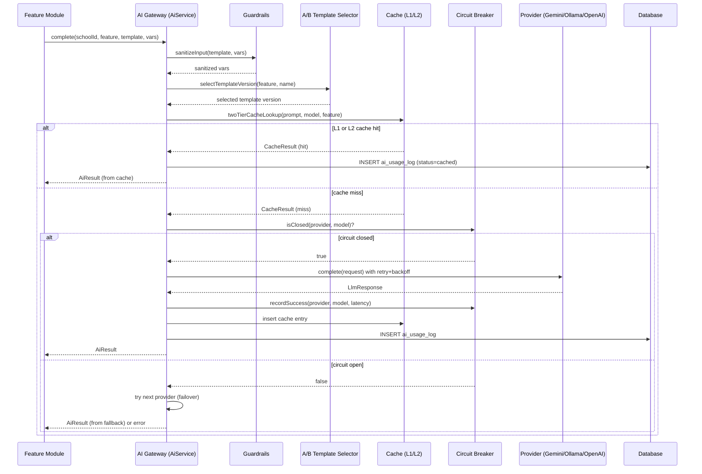
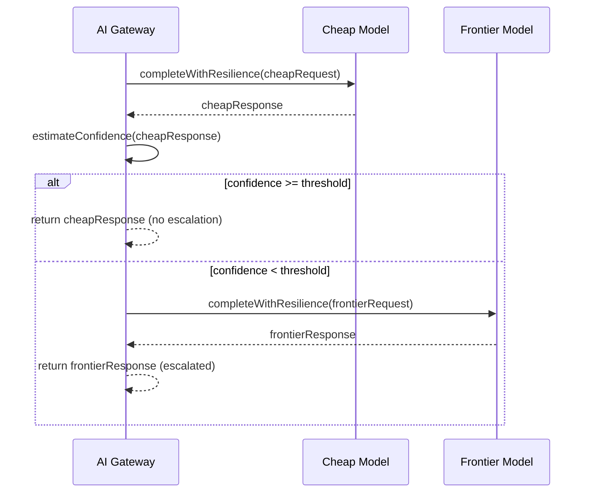

# AI Infrastructure — Technical Specification

> **Document status:** Implementation-ready blueprint (rev 2 — AI Gateway architecture with Gemini free tier + Ollama fallback, circuit breaker, semantic caching, guardrails)
> **Last updated:** 2026-06-28
> **Prerequisites:** None
> **Unblocks:** All AI_* specs (AI_EXAM_ANALYSIS, AI_REPORT_CARD, AI_FEE_REMINDER, AI_TIMETABLE, AI_NL_QUERY, OCR_ADMISSION, VIDYASETU_AI_TUTOR, TEACHER_COPILOT, AI_SPOKEN_ENGLISH, AI_QUESTION_BANK)
> **Related specs:** All AI_* specs, `DPDP_COMPLIANCE_SPEC.md` (PII guardrails)
> **Template:** `_SPEC_TEMPLATE.md` v1 (25 mandatory + 6 optional sections)

---

## 1. Feature Overview

### Purpose

A shared AI/LLM integration layer — an **AI Gateway** — that provides a unified, production-grade interface for all AI-powered features across Vidya Prayag. This spec defines the infrastructure for calling LLM providers (Google Gemini free tier, Ollama local models, optionally OpenAI), managing API keys, tracking usage/costs, caching responses, enforcing rate limits, and implementing intelligent routing, circuit breaker failover, guardrails, and prompt A/B testing.

### Business Value

**Zero-cost by default**: The system runs at $0/month using Gemini 2.0 Flash free tier (15 RPM, 1,500 req/day) as primary and Ollama (local open-source models) as fallback. OpenAI is an optional paid upgrade path for when higher quality or throughput is needed.

The design is informed by production patterns from AI gateway architectures (LiteLLM, Portkey, Kong AI Gateway) and research on model cascading (RouteLLM / UC Berkeley / LMSYS, ICLR 2025), semantic caching, and circuit breaker reliability patterns.

### Goals

- Single, reusable AI gateway that all feature modules call — no feature imports provider SDKs directly
- **Zero-cost by default**: Gemini free tier + Ollama local models — $0/month for 10 schools at moderate usage
- Support multiple LLM providers with **circuit breaker failover** (not simple try/catch)
- **Intelligent model routing**: task-based + cascade (cheap model first, escalate on low confidence) — 45-85% cost reduction vs. always using frontier models
- **Two-tier caching**: L1 exact-match (SHA-256, zero false-positive risk) + L2 semantic cache (embedding similarity, 50-80% hit rate on repeat traffic)
- Per-school usage tracking with **tiered cost enforcement** (alert → model downgrade → hard cap)
- Structured prompt templates with version history + **A/B testing** (traffic splitting between versions)
- Streaming support for long-form generation (report cards, lesson plans)
- Async job queue for batch AI operations (exam analysis for entire class)
- **Guardrails**: PII redaction, prompt injection defense, output validation — at the gateway choke point
- Full **routing observability**: every routing decision, classifier confidence, and provider outcome logged

### Non-goals

- [ ] On-device AI inference (all inference is server-side via API or local Ollama)
- [ ] Fine-tuning custom models (uses pre-trained models only)
- [ ] Multi-modal AI (text-only; image AI handled by OCR spec separately)
- [ ] Real-time AI chat (async/streaming only, not interactive chat)

### Design Principles

1. **Gateway as choke point** — All AI traffic flows through one service. Cross-cutting concerns (caching, guardrails, cost tracking, failover) are enforced once, not smeared across features. (Pattern: LiteLLM, Portkey, Kong AI Gateway)

2. **Route for cost, fall back for reliability** — Routing and failover compose. On the happy path, route to the cheapest model that can handle the query. On the unhappy path, fall back across providers. (Pattern: AI Gateways and Model Routing, 2026)

3. **Layered caching** — L1 exact-match first (zero correctness risk, ~1ms). On L1 miss, L2 semantic cache (embedding similarity, ~20-40ms). On L2 miss, call the LLM. This minimizes risk while maximizing cost savings. (Pattern: Redis semantic caching, HLD Handbook)

4. **Circuit breakers, not blind retries** — Track per-provider health. When failure rate crosses a threshold, open the circuit and fail fast to the next provider instead of waiting for timeouts on every request. Blind retries amplify outages. (Pattern: Portkey, TrueFoundry, SRE reliability patterns)

5. **Graceful degradation over hard failure** — When a quota is hit, route to a cheaper model or serve cached responses rather than returning a hard error. A clear quota error is a conversion event; a hard cut-off is a support ticket. (Pattern: multi-tenant SaaS cost governance)

### Dependencies

- `AppConfigTable` (existing — configuration storage)
- `SupabaseStorage.kt` pattern (existing — architectural model for AI service wrapper)
- Ktor Client (new — must be added to `server/build.gradle.kts`)
- `opencsv` library (new — for CSV parsing in batch import)
- Ollama runtime (optional — for local free LLM inference)
- pgvector extension (optional — for L2 semantic cache)

### Related Modules

- `AppConfigTable` exists as a simple key-value `Table` (not `UUIDTable`) with `key`, `value`, `updatedAt` columns and `PrimaryKey(key)` — can hold API keys and configuration
- Existing `SupabaseStorage.kt` pattern (REST wrapper) is a good architectural model for an AI service wrapper
- `NetworkResult<T>` sealed class for error handling (shared/client side)
- Server-side DI: module-level singletons in `*Routing.kt` files (NOT Koin — the server does not use Koin; see `NotificationRouting.kt` pattern: `private val repository = Repository()` + `private val service = Service(repository)`)
- `DatabaseFactory.allTables` array + `validateSchema()` boot-time check for table registration
- `requireSchoolContext()` / `requireSchoolAdmin()` guards for role-based endpoint protection
- `dbQuery { }` suspended transaction wrapper for all DB access

---

## 2. Current System Assessment

### Existing Code

- **No AI/LLM integration** — confirmed by `feature_audit.csv` (AI Report Card: stub 20%, AI Tutoring: missing 0%)
- `DIFFERENTIATING_FEATURES.md` identifies AI as the #1 differentiator but notes "❌ Missing: OpenAI/Gemini API key configuration"
- No AI-related tables in `Tables.kt`
- `AppConfigTable` exists as a simple key-value `Table` (not `UUIDTable`) with `key`, `value`, `updatedAt` columns and `PrimaryKey(key)` — can hold API keys and configuration
- Existing `SupabaseStorage.kt` pattern (REST wrapper) is a good architectural model for an AI service wrapper

### Existing Database

- `app_config` — key-value configuration store
- No AI-related tables exist

### Existing APIs

- No AI-related endpoints
- `AppConfigTable` accessible via existing config endpoints

### Existing UI

- No AI-related screens
- `DIFFERENTIATING_FEATURES.md` identifies AI as #1 differentiator

### Existing Services

- Standard CRUD services for all entities
- No AI, LLM, or embedding services

### Existing Documentation

- `feature_audit.csv` — confirms AI features are stubs or missing
- `DIFFERENTIATING_FEATURES.md` — identifies AI as #1 differentiator

### Technical Debt

- No LLM provider integration — all AI features blocked
- No API key management — cannot configure providers without redeploy
- No usage tracking — cannot monitor costs or enforce quotas
- No prompt template system — prompts scattered across features, no versioning
- No caching — repeated identical prompts waste API budget
- No streaming — long-form generation blocks the request thread
- No failover — single provider outage = all AI features down
- No circuit breaker — blind retries on failed providers amplify outages; no health tracking
- No intelligent routing — all features use a single hardcoded model; no cost-quality optimization
- No semantic caching — exact-match only catches <5% of natural-language repeats; 50-80% savings missed
- No guardrails — PII leakage risk, prompt injection vulnerability, no output validation
- No prompt A/B testing — cannot experiment with prompt versions; no rollout strategy
- No routing observability — cannot debug why a query was routed to a specific model or detect miscalibration

### Gaps

| # | Gap | Impact |
|---|---|---|
| G1 | No LLM provider integration | All AI features blocked |
| G2 | No API key management | Cannot configure providers without redeploy |
| G3 | No usage tracking | Cannot monitor costs or enforce quotas |
| G4 | No prompt template system | Prompts scattered across features, no versioning |
| G5 | No caching | Repeated identical prompts waste API budget |
| G6 | No streaming | Long-form generation blocks the request thread |
| G7 | No failover | Single provider outage = all AI features down |
| G8 | No circuit breaker | Blind retries on failed providers amplify outages; no health tracking |
| G9 | No intelligent routing | All features use a single hardcoded model; no cost-quality optimization |
| G10 | No semantic caching | Exact-match only catches <5% of natural-language repeats; 50-80% savings missed |
| G11 | No guardrails | PII leakage risk, prompt injection vulnerability, no output validation |
| G12 | No prompt A/B testing | Cannot experiment with prompt versions; no rollout strategy |
| G13 | No routing observability | Cannot debug why a query was routed to a specific model or detect miscalibration |

---

## 3. Functional Requirements

### FR-001
| Field | Value |
|---|---|
| **Title** | Multi-Provider LLM Support |
| **Description** | Support Google Gemini free tier (2.0 Flash — 15 RPM, 1500 req/day, 1M tokens/min, $0), Ollama (local open-source models — Llama 3, Mistral, Qwen — $0, self-hosted), and optionally OpenAI (GPT-4o, GPT-4o-mini) as a paid upgrade path. Default: Gemini free tier + Ollama for zero-cost operation. |
| **Priority** | Critical |
| **User Roles** | System |
| **Acceptance notes** | All three providers functional; default is zero-cost |

### FR-002
| Field | Value |
|---|---|
| **Title** | Per-Feature Provider Configuration |
| **Description** | Provider selection configurable per feature via AppConfigTable keys (ai_feature_provider_{feature}, ai_feature_model_{feature}); defaults fall back to AI_DEFAULT_PROVIDER / AI_DEFAULT_MODEL env vars |
| **Priority** | High |
| **User Roles** | Platform Admin |
| **Acceptance notes** | Each feature can use a different provider/model |

### FR-003
| Field | Value |
|---|---|
| **Title** | Automatic Failover |
| **Description** | Automatic failover: if primary provider fails, try secondary |
| **Priority** | Critical |
| **User Roles** | System |
| **Acceptance notes** | Failover is automatic and transparent to feature modules |

### FR-004
| Field | Value |
|---|---|
| **Title** | Encrypted API Key Management |
| **Description** | API keys stored encrypted in ai_provider_config.api_key_encrypted (AES-256-GCM), configurable via admin API. Ollama requires no API key — empty encrypted string is stored. Gemini free tier key is free from Google AI Studio (no credit card). |
| **Priority** | Critical |
| **User Roles** | Platform Admin |
| **Acceptance notes** | Keys encrypted at rest; masked in API responses |

### FR-005
| Field | Value |
|---|---|
| **Title** | Per-School Usage Tracking |
| **Description** | Per-school daily/monthly token usage tracking with configurable quotas |
| **Priority** | High |
| **User Roles** | System |
| **Acceptance notes** | Usage tracked per school with token counts and cost |

### FR-006
| Field | Value |
|---|---|
| **Title** | Response Caching |
| **Description** | Response caching by prompt hash (TTL configurable per feature) |
| **Priority** | High |
| **User Roles** | System |
| **Acceptance notes** | L1 exact-match cache with configurable TTL |

### FR-007
| Field | Value |
|---|---|
| **Title** | Streaming Responses |
| **Description** | Streaming responses via SSE for long-form generation |
| **Priority** | Medium |
| **User Roles** | System |
| **Acceptance notes** | SSE streaming for responses > 500 tokens |

### FR-008
| Field | Value |
|---|---|
| **Title** | Async Batch Job Queue |
| **Description** | Async job queue for batch operations (e.g., generate report cards for all students in a class) |
| **Priority** | High |
| **User Roles** | System |
| **Acceptance notes** | Batch jobs with progress tracking |

### FR-009
| Field | Value |
|---|---|
| **Title** | Prompt Template Versioning |
| **Description** | Prompt templates stored in DB with version history |
| **Priority** | High |
| **User Roles** | Platform Admin |
| **Acceptance notes** | Templates versioned with active/inactive status |

### FR-010
| Field | Value |
|---|---|
| **Title** | Rate Limiting |
| **Description** | Rate limiting per school per feature |
| **Priority** | High |
| **User Roles** | System |
| **Acceptance notes** | 15 RPM per school (matches Gemini free tier) |

### FR-011
| Field | Value |
|---|---|
| **Title** | Cost Estimation |
| **Description** | Cost estimation per request (input tokens × rate + output tokens × rate); free-tier providers (Gemini free, Ollama) have $0 pricing — cost tracking still records token usage for quota/analytics but cost_usd = 0 |
| **Priority** | Medium |
| **User Roles** | System |
| **Acceptance notes** | Cost tracked per request with BigDecimal precision |

### FR-012
| Field | Value |
|---|---|
| **Title** | Circuit Breaker |
| **Description** | Circuit breaker: track per-provider failure rate; open circuit at >50% failure rate over 60s window; auto-recover after 30s cooldown; fail fast instead of waiting for timeouts |
| **Priority** | Critical |
| **User Roles** | System |
| **Acceptance notes** | Circuit opens after 5 consecutive failures; auto-recovers via HALF_OPEN probe |

### FR-013
| Field | Value |
|---|---|
| **Title** | Retry with Backoff + Jitter |
| **Description** | On 429/5xx, retry up to 3 times with exponential backoff (base 500ms, max 5s) + full jitter; honor Retry-After header; never retry 400-class errors |
| **Priority** | High |
| **User Roles** | System |
| **Acceptance notes** | Retries with jitter; honors Retry-After; no 400 retries |

### FR-014
| Field | Value |
|---|---|
| **Title** | Model Cascade Routing |
| **Description** | Model cascade routing: for supported features, try cheap model (Gemini Flash free tier / Ollama Llama 3) first; escalate to frontier model only if confidence is below threshold; configurable per feature. With free-tier-only setup, cascade escalates from Gemini Flash → Ollama (both $0). |
| **Priority** | Medium |
| **User Roles** | System |
| **Acceptance notes** | Cascade routing with configurable threshold per feature |

### FR-015
| Field | Value |
|---|---|
| **Title** | Two-Tier Caching |
| **Description** | Two-tier caching: L1 exact-match (SHA-256, zero false-positive risk) + L2 semantic cache (embedding cosine similarity ≥0.95, configurable per feature); L2 can be disabled per feature for correctness-critical workloads |
| **Priority** | Medium |
| **User Roles** | System |
| **Acceptance notes** | L1 + L2 cache with per-feature L2 toggle |

### FR-016
| Field | Value |
|---|---|
| **Title** | Guardrails |
| **Description** | Guardrails: PII detection + redaction before prompt submission; prompt injection detection (heuristic + pattern matching); output validation (structured output schema enforcement, toxicity filter); configurable per feature |
| **Priority** | Critical |
| **User Roles** | System |
| **Acceptance notes** | PII redacted, injection blocked, output validated |

### FR-017
| Field | Value |
|---|---|
| **Title** | Prompt A/B Testing |
| **Description** | Prompt A/B testing: traffic splitting between template versions (e.g., 80% v1, 20% v2); outcome tracking (response quality proxy: length, user feedback, error rate); rollout promotion via admin API |
| **Priority** | Low |
| **User Roles** | Platform Admin |
| **Acceptance notes** | Traffic split with outcome tracking and promotion API |

### FR-018
| Field | Value |
|---|---|
| **Title** | Routing Observability |
| **Description** | Routing observability: every AI request logs routing decision (model selected, cascade escalation, cache hit/miss), classifier confidence, provider outcome, and latency breakdown |
| **Priority** | High |
| **User Roles** | System |
| **Acceptance notes** | Every request logged with full routing context |

### FR-019
| Field | Value |
|---|---|
| **Title** | Tiered Cost Enforcement |
| **Description** | Tiered cost enforcement: at 80% of monthly quota → alert + auto-downgrade to cheaper model; at 100% → hard cap with 429; z-score >4 on daily spend → auto-pause + alert (anomaly detection) |
| **Priority** | High |
| **User Roles** | System |
| **Acceptance notes** | Three-tier enforcement with anomaly detection |

### FR-020
| Field | Value |
|---|---|
| **Title** | Provider Health Monitoring |
| **Description** | Provider health monitoring: per-provider rolling stats (success rate, p50/p99 latency, rate-limit frequency); health endpoint for ops dashboard; auto-deprioritize unhealthy providers in routing |
| **Priority** | Medium |
| **User Roles** | Platform Admin |
| **Acceptance notes** | Health endpoint with circuit state and rolling stats |

---

## 4. User Stories

### Platform Admin
- [ ] Configure LLM providers (Gemini, Ollama, OpenAI) with API keys
- [ ] Set per-feature provider/model overrides
- [ ] Create and version prompt templates
- [ ] Run A/B tests on prompt versions and promote winners
- [ ] View AI usage analytics with routing breakdown
- [ ] Monitor provider health (circuit state, success rate, latency)
- [ ] Configure per-school AI quotas (daily tokens, monthly cost)

### School Admin
- [ ] View my school's AI usage and cost
- [ ] Configure my school's AI quota limits
- [ ] See which features are using AI

### Teacher
- [ ] Use AI-powered features (report cards, exam analysis) without knowing about the gateway
- [ ] Submit batch AI jobs (e.g., generate report cards for entire class)

### System
- [ ] Route AI requests through the gateway with caching, guardrails, and cost enforcement
- [ ] Fail over to secondary provider when primary fails
- [ ] Auto-downgrade model when quota is near limit
- [ ] Auto-pause AI when spend anomaly detected

---

## 5. Business Rules

### BR-001
**Rule:** All AI traffic must flow through the AI Gateway — no feature module imports provider SDKs directly.
**Enforcement:** `AiService` is the only entry point; provider clients are internal to the gateway.

### BR-002
**Rule:** Default configuration is zero-cost (Gemini free tier + Ollama local).
**Enforcement:** Default env vars set Gemini as primary, Ollama as fallback; both $0.

### BR-003
**Rule:** Circuit breaker opens after 5 consecutive failures or >50% failure rate over 60s window.
**Enforcement:** `CircuitBreaker` tracks per-provider state; auto-recovers after 30s cooldown via HALF_OPEN probe.

### BR-004
**Rule:** Retry only on 429 and 5xx errors — never retry 400-class client errors.
**Enforcement:** `retryWithBackoff` checks status code; only retries 429 and 5xx.

### BR-005
**Rule:** Rate limit is 15 RPM per school (matches Gemini free tier).
**Enforcement:** In-memory token-bucket rate limiter; configurable via `AI_RATE_LIMIT_PER_MIN`.

### BR-006
**Rule:** L2 semantic cache threshold is 0.95 cosine similarity by default.
**Enforcement:** Configurable per feature via `ai_semantic_cache_{feature}` and `AI_SEMANTIC_CACHE_THRESHOLD`.

### BR-007
**Rule:** L2 semantic cache can be disabled per feature for correctness-critical workloads.
**Enforcement:** `enableSemanticCache` parameter in `AiService.complete()`.

### BR-008
**Rule:** API keys are encrypted at rest with AES-256-GCM and masked in API responses.
**Enforcement:** `EncryptionService` encrypts/decrypts; API responses return `sk-****...****`.

### BR-009
**Rule:** Provider config and prompt template management restricted to platform admin (role "admin"), not school_admin.
**Enforcement:** New `requirePlatformAdmin()` guard in `SchoolAccess.kt`.

### BR-010
**Rule:** Tiered cost enforcement: 80% → downgrade, 100% → hard cap, z-score >4 → auto-pause.
**Enforcement:** `CostEnforcementService` checks before every LLM call.

### BR-011
**Rule:** Cache entries are school-scoped — one school cannot read another's cached responses.
**Enforcement:** `school_id` column in `ai_response_cache`; L2 search scoped to `WHERE school_id = ? AND feature = ?`.

### BR-012
**Rule:** PII (phone, email, Aadhaar) is redacted from variables before prompt submission by default.
**Enforcement:** `GuardrailService.sanitizeInput()` with `pii_filter` enabled by default in `guardrail_config`.

### BR-013
**Rule:** System prompts are stored in DB and never concatenated with user input.
**Enforcement:** Template resolution injects variables into `user_prompt_template` only, never into `system_prompt`.

### BR-014
**Rule:** Batch jobs process with concurrency limit of 3 to avoid rate limits.
**Enforcement:** `Semaphore(3)` in batch processor coroutine.

### BR-015
**Rule:** Streaming is used for responses expected to exceed 500 tokens.
**Enforcement:** Feature modules call `completeStream()` for long-form generation; `complete()` for short responses.

---

## 6. Database Design

### 6.1 Entity Relationship Summary

```
ai_provider_config (standalone — provider registry)
ai_prompt_templates (standalone — template registry)
ai_usage_log ──── schools (school_id)
ai_usage_log ──── ai_prompt_templates (prompt_template_id)
ai_usage_log ──── app_users (user_id)
ai_response_cache ──── schools (school_id, nullable for global)
ai_jobs ──── schools (school_id)
ai_jobs ──── app_users (created_by)
ai_provider_health (standalone — per-provider health stats)
```

### 6.2 New Tables

#### `ai_provider_config`

```sql
CREATE TABLE ai_provider_config (
    id              UUID PRIMARY KEY DEFAULT gen_random_uuid(),
    provider        VARCHAR(32) NOT NULL,          -- gemini | ollama | openai
    model           VARCHAR(64) NOT NULL,          -- gemini-2.0-flash | llama3.1:8b | mistral:7b | gpt-4o | gpt-4o-mini
    api_key_encrypted TEXT NOT NULL,               -- AES-256-GCM encrypted (empty string for Ollama — no key needed)
    is_active       BOOLEAN NOT NULL DEFAULT true,
    priority        INTEGER NOT NULL DEFAULT 0,    -- failover order (0 = primary)
    tier            VARCHAR(16) NOT NULL DEFAULT 'mid', -- cheap | mid | frontier (for cascade routing)
    max_tokens_per_request INTEGER NOT NULL DEFAULT 4096,
    temperature     REAL NOT NULL DEFAULT 0.7,
    created_at      TIMESTAMP NOT NULL DEFAULT now(),
    updated_at      TIMESTAMP NOT NULL DEFAULT now(),
    UNIQUE(provider, model)
);
```

#### `ai_prompt_templates`

```sql
CREATE TABLE ai_prompt_templates (
    id              UUID PRIMARY KEY DEFAULT gen_random_uuid(),
    feature         VARCHAR(48) NOT NULL,          -- report_card | exam_analysis | fee_reminder | timetable | nl_query | tutor | copilot
    name            VARCHAR(128) NOT NULL,         -- template identifier
    version         INTEGER NOT NULL DEFAULT 1,
    system_prompt   TEXT NOT NULL,
    user_prompt_template TEXT NOT NULL,            -- with {{variable}} placeholders
    variables       TEXT NOT NULL DEFAULT '[]',    -- JSON array of variable names
    is_active       BOOLEAN NOT NULL DEFAULT true,
    traffic_weight  INTEGER NOT NULL DEFAULT 100,  -- A/B testing: 0-100, percentage of traffic to this version
    guardrail_config TEXT NOT NULL DEFAULT '{}',   -- JSON: per-template guardrail settings (pii_filter, output_schema, etc.)
    created_at      TIMESTAMP NOT NULL DEFAULT now(),
    UNIQUE(feature, name, version)
);
```

#### `ai_usage_log`

```sql
CREATE TABLE ai_usage_log (
    id              UUID PRIMARY KEY DEFAULT gen_random_uuid(),
    school_id       UUID NOT NULL,
    user_id         UUID,                          -- who triggered the request
    feature         VARCHAR(48) NOT NULL,          -- which feature used AI
    provider        VARCHAR(32) NOT NULL,
    model           VARCHAR(64) NOT NULL,
    prompt_template_id UUID,                       -- FK ai_prompt_templates.id
    input_tokens    INTEGER NOT NULL DEFAULT 0,
    output_tokens   INTEGER NOT NULL DEFAULT 0,
    cost_usd        DECIMAL(10,4) NOT NULL DEFAULT 0.0,   -- estimated cost (4 decimal places for per-token precision)
    latency_ms      INTEGER NOT NULL DEFAULT 0,
    status          VARCHAR(16) NOT NULL,          -- success | failed | cached | escalated | guardrail_blocked
    routing_decision VARCHAR(32) NOT NULL DEFAULT 'direct', -- direct | cascade_escalated | cache_l1_hit | cache_l2_hit | failed_over
    provider_used   VARCHAR(32),                   -- actual provider that served the request (may differ from requested)
    model_used      VARCHAR(64),                   -- actual model that served the request
    confidence_score REAL,                         -- cascade confidence score (null for non-cascade)
    error_message   TEXT,
    created_at      TIMESTAMP NOT NULL DEFAULT now()
);

CREATE INDEX idx_ai_usage_school_date ON ai_usage_log(school_id, created_at DESC);
CREATE INDEX idx_ai_usage_feature ON ai_usage_log(school_id, feature, created_at DESC);
```

#### `ai_response_cache`

```sql
CREATE TABLE ai_response_cache (
    id              UUID PRIMARY KEY DEFAULT gen_random_uuid(),
    cache_key       TEXT NOT NULL,                 -- L1: SHA-256(prompt + model + temperature); L2: embedding hash
    cache_tier      VARCHAR(4) NOT NULL DEFAULT 'l1', -- l1 (exact match) | l2 (semantic)
    school_id       UUID,                          -- nullable for global cache
    feature         VARCHAR(48) NOT NULL,
    prompt_text     TEXT NOT NULL,                 -- original prompt (for L2 similarity search display)
    embedding       BYTEA,                         -- 384-dim float32 vector (null for L1)
    response        TEXT NOT NULL,                 -- cached LLM response
    input_tokens    INTEGER NOT NULL DEFAULT 0,
    output_tokens   INTEGER NOT NULL DEFAULT 0,
    similarity_score REAL,                         -- L2: cosine similarity to query (null for L1)
    expires_at      TIMESTAMP NOT NULL,
    created_at      TIMESTAMP NOT NULL DEFAULT now(),
    UNIQUE(cache_key)
);

CREATE INDEX idx_ai_cache_expiry ON ai_response_cache(expires_at);
CREATE INDEX idx_ai_cache_l2_feature ON ai_response_cache(feature, cache_tier) WHERE cache_tier = 'l2';
-- Note: For L2 semantic search, use pgvector extension if available, otherwise
-- fall back to L1-only caching. See §8.14 for embedding model details.
```

#### `ai_jobs`

```sql
CREATE TABLE ai_jobs (
    id              UUID PRIMARY KEY DEFAULT gen_random_uuid(),
    school_id       UUID NOT NULL,
    feature         VARCHAR(48) NOT NULL,
    status          VARCHAR(16) NOT NULL DEFAULT 'queued',  -- queued | processing | completed | failed
    total_items     INTEGER NOT NULL DEFAULT 0,
    completed_items INTEGER NOT NULL DEFAULT 0,
    result          TEXT,                          -- JSON result or error
    created_by      UUID,
    created_at      TIMESTAMP NOT NULL DEFAULT now(),
    updated_at      TIMESTAMP NOT NULL DEFAULT now(),
    completed_at    TIMESTAMP
);

CREATE INDEX idx_ai_jobs_status ON ai_jobs(school_id, status, created_at DESC);
```

#### `ai_provider_health`

Tracks per-provider circuit breaker state and rolling health stats. Updated on every LLM call outcome.

```sql
CREATE TABLE ai_provider_health (
    id              UUID PRIMARY KEY DEFAULT gen_random_uuid(),
    provider        VARCHAR(32) NOT NULL,             -- openai | gemini
    model           VARCHAR(64) NOT NULL,
    circuit_state   VARCHAR(16) NOT NULL DEFAULT 'closed', -- closed | open | half_open
    total_requests  INTEGER NOT NULL DEFAULT 0,
    total_failures  INTEGER NOT NULL DEFAULT 0,
    consecutive_failures INTEGER NOT NULL DEFAULT 0,
    p50_latency_ms  INTEGER NOT NULL DEFAULT 0,
    p99_latency_ms  INTEGER NOT NULL DEFAULT 0,
    rate_limit_hits INTEGER NOT NULL DEFAULT 0,       -- 429 count
    last_failure_at TIMESTAMP,
    circuit_opened_at TIMESTAMP,
    last_updated    TIMESTAMP NOT NULL DEFAULT now(),
    UNIQUE(provider, model)
);
```

### 6.3 Modified Tables

N/A — no existing tables modified.

### 6.4 Indexes

| Index | Table | Columns | Purpose |
|---|---|---|---|
| `idx_ai_usage_school_date` | `ai_usage_log` | `school_id, created_at DESC` | Query usage per school |
| `idx_ai_usage_feature` | `ai_usage_log` | `school_id, feature, created_at DESC` | Query usage per feature |
| `idx_ai_cache_expiry` | `ai_response_cache` | `expires_at` | Cache cleanup job |
| `idx_ai_cache_l2_feature` | `ai_response_cache` | `feature, cache_tier` WHERE `cache_tier = 'l2'` | L2 semantic search |
| `idx_ai_jobs_status` | `ai_jobs` | `school_id, status, created_at DESC` | Job queue polling |

### 6.5 Constraints

| Constraint | Table | Rule |
|---|---|---|
| `UNIQUE` | `ai_provider_config` | `(provider, model)` |
| `UNIQUE` | `ai_prompt_templates` | `(feature, name, version)` |
| `UNIQUE` | `ai_response_cache` | `(cache_key)` |
| `UNIQUE` | `ai_provider_health` | `(provider, model)` |
| `CHECK` | `ai_provider_config.provider` | One of: gemini, ollama, openai |
| `CHECK` | `ai_provider_config.tier` | One of: cheap, mid, frontier |
| `CHECK` | `ai_usage_log.status` | One of: success, failed, cached, escalated, guardrail_blocked |
| `CHECK` | `ai_usage_log.routing_decision` | One of: direct, cascade_escalated, cache_l1_hit, cache_l2_hit, failed_over |
| `CHECK` | `ai_provider_health.circuit_state` | One of: closed, open, half_open |
| `CHECK` | `ai_jobs.status` | One of: queued, processing, completed, failed |
| `CHECK` | `ai_response_cache.cache_tier` | One of: l1, l2 |

### 6.6 Foreign Keys

| Table | Column | References |
|---|---|---|
| `ai_usage_log` | `school_id` | `schools.id` |
| `ai_usage_log` | `user_id` | `app_users.id` |
| `ai_usage_log` | `prompt_template_id` | `ai_prompt_templates.id` |
| `ai_response_cache` | `school_id` | `schools.id` (nullable) |
| `ai_jobs` | `school_id` | `schools.id` |
| `ai_jobs` | `created_by` | `app_users.id` |

### 6.7 Soft Delete Strategy

- No soft delete for any AI tables — usage logs are append-only audit trail; cache entries expire via TTL; jobs are historical records.

### 6.8 Audit Fields

| Table | `created_at` | `updated_at` | Other |
|---|---|---|---|
| `ai_provider_config` | ✅ | ✅ | — |
| `ai_prompt_templates` | ✅ | N/A | `version`, `is_active` |
| `ai_usage_log` | ✅ | N/A | Append-only |
| `ai_response_cache` | ✅ | N/A | `expires_at` |
| `ai_jobs` | ✅ | ✅ | `completed_at` |
| `ai_provider_health` | N/A | ✅ | `last_failure_at`, `circuit_opened_at` |

### 6.9 Migration Notes

- **Migration file:** `docs/db/migration_026_ai_infrastructure.sql`
- **Rollback:** See §E. Migration & Rollback
- **Backfill:** No existing data to backfill — all new tables
- **Dependencies:** Add `ktor-client-core` + `ktor-client-cio` + `ktor-server-sse` to `server/build.gradle.kts`
- **pgvector:** If available on Supabase, enable for L2 semantic cache: `CREATE EXTENSION IF NOT EXISTS vector;`. If not available, L2 disabled at runtime.

### 6.10 Exposed Mappings

All table objects extend `UUIDTable` and follow the pattern in `Tables.kt`. They must be added to the `DatabaseFactory.allTables` array (in dependency order) so `validateSchema()` can verify them at boot. In Postgres production (`AUTO_CREATE_TABLES=OFF`), the migration SQL must be applied before deploy or the server refuses to boot.

```kotlin
object AiProviderConfigTable : UUIDTable("ai_provider_config", "id") {
    val provider           = varchar("provider", 32)
    val model              = varchar("model", 64)
    val apiKeyEncrypted    = text("api_key_encrypted")
    val isActive           = bool("is_active").default(true)
    val priority           = integer("priority").default(0)
    val tier               = varchar("tier", 16).default("mid") // cheap | mid | frontier
    val maxTokensPerRequest = integer("max_tokens_per_request").default(4096)
    val temperature        = float("temperature").default(0.7f)
    val createdAt          = timestamp("created_at")
    val updatedAt          = timestamp("updated_at")
    init { uniqueIndex("ux_ai_provider_model", provider, model) }
}

object AiPromptTemplatesTable : UUIDTable("ai_prompt_templates", "id") {
    val feature            = varchar("feature", 48)
    val name               = varchar("name", 128)
    val version            = integer("version").default(1)
    val systemPrompt       = text("system_prompt")
    val userPromptTemplate = text("user_prompt_template")
    val variables          = text("variables").default("[]")
    val isActive           = bool("is_active").default(true)
    val trafficWeight      = integer("traffic_weight").default(100) // A/B testing: 0-100
    val guardrailConfig    = text("guardrail_config").default("{}") // JSON guardrail settings
    val createdAt          = timestamp("created_at")
    init { uniqueIndex("ux_ai_prompt", feature, name, version) }
}

object AiUsageLogTable : UUIDTable("ai_usage_log", "id") {
    val schoolId           = uuid("school_id")
    val userId             = uuid("user_id").nullable()
    val feature            = varchar("feature", 48)
    val provider           = varchar("provider", 32)
    val model              = varchar("model", 64)
    val promptTemplateId   = uuid("prompt_template_id").nullable()
    val inputTokens        = integer("input_tokens").default(0)
    val outputTokens       = integer("output_tokens").default(0)
    val costUsd            = decimal("cost_usd", 10, 4).default(BigDecimal.ZERO)
    val latencyMs          = integer("latency_ms").default(0)
    val status             = varchar("status", 16) // success | failed | cached | escalated | guardrail_blocked
    val routingDecision    = varchar("routing_decision", 32).default("direct")
    val providerUsed       = varchar("provider_used", 32).nullable()
    val modelUsed          = varchar("model_used", 64).nullable()
    val confidenceScore    = float("confidence_score").nullable()
    val errorMessage       = text("error_message").nullable()
    val createdAt          = timestamp("created_at")
    init {
        index("idx_ai_usage_school_date", false, schoolId, createdAt)
        index("idx_ai_usage_feature", false, schoolId, feature, createdAt)
    }
}

object AiResponseCacheTable : UUIDTable("ai_response_cache", "id") {
    val cacheKey           = text("cache_key")
    val cacheTier          = varchar("cache_tier", 4).default("l1") // l1 | l2
    val schoolId           = uuid("school_id").nullable()
    val feature            = varchar("feature", 48)
    val promptText         = text("prompt_text")
    val embedding          = binary("embedding").nullable() // 384-dim float32 for L2
    val response           = text("response")
    val inputTokens        = integer("input_tokens").default(0)
    val outputTokens       = integer("output_tokens").default(0)
    val similarityScore    = float("similarity_score").nullable()
    val expiresAt          = timestamp("expires_at")
    val createdAt          = timestamp("created_at")
    init { uniqueIndex("ux_ai_cache_key", cacheKey) }
}

object AiJobsTable : UUIDTable("ai_jobs", "id") {
    val schoolId           = uuid("school_id")
    val feature            = varchar("feature", 48)
    val status             = varchar("status", 16).default("queued")
    val totalItems         = integer("total_items").default(0)
    val completedItems     = integer("completed_items").default(0)
    val result             = text("result").nullable()
    val createdBy          = uuid("created_by").nullable()
    val createdAt          = timestamp("created_at")
    val updatedAt          = timestamp("updated_at")
    val completedAt        = timestamp("completed_at").nullable()
    init { index("idx_ai_jobs_status", false, schoolId, status, createdAt) }
}

object AiProviderHealthTable : UUIDTable("ai_provider_health", "id") {
    val provider           = varchar("provider", 32)
    val model              = varchar("model", 64)
    val circuitState       = varchar("circuit_state", 16).default("closed") // closed | open | half_open
    val totalRequests      = integer("total_requests").default(0)
    val totalFailures      = integer("total_failures").default(0)
    val consecutiveFailures = integer("consecutive_failures").default(0)
    val p50LatencyMs       = integer("p50_latency_ms").default(0)
    val p99LatencyMs       = integer("p99_latency_ms").default(0)
    val rateLimitHits      = integer("rate_limit_hits").default(0)
    val lastFailureAt      = timestamp("last_failure_at").nullable()
    val circuitOpenedAt    = timestamp("circuit_opened_at").nullable()
    val lastUpdated        = timestamp("last_updated")
    init { uniqueIndex("ux_ai_health_provider_model", provider, model) }
}
```

### 6.11 Seed Data

Seed default prompt templates for each feature:

```sql
INSERT INTO ai_prompt_templates (id, feature, name, version, system_prompt, user_prompt_template, variables, is_active, traffic_weight, guardrail_config, created_at)
VALUES
  (gen_random_uuid(), 'report_card', 'narrative_v1', 1,
   'You are an experienced teacher writing a report card comment...',
   'Student: {{student_name}}, Class: {{class_name}}, Subjects: {{subjects_with_grades}}, Attendance: {{attendance_pct}}%',
   '["student_name","class_name","subjects_with_grades","attendance_pct"]',
   true, 100,
   '{"pii_filter": true, "injection_defense": true, "max_output_tokens": 500}',
   now()),
  -- ... additional seed templates
ON CONFLICT (feature, name, version) DO NOTHING;
```

Seed zero-cost provider config:

```sql
-- Primary: Gemini free tier
INSERT INTO ai_provider_config (id, provider, model, api_key_encrypted, is_active, priority, tier, max_tokens_per_request, temperature, created_at, updated_at)
VALUES (gen_random_uuid(), 'gemini', 'gemini-2.0-flash', '<encrypted-gemini-key>', true, 0, 'mid', 4096, 0.7, now(), now())
ON CONFLICT (provider, model) DO NOTHING;

-- Fallback: Ollama local (no API key needed — empty encrypted string)
INSERT INTO ai_provider_config (id, provider, model, api_key_encrypted, is_active, priority, tier, max_tokens_per_request, temperature, created_at, updated_at)
VALUES (gen_random_uuid(), 'ollama', 'llama3.1:8b', '', true, 1, 'frontier', 4096, 0.7, now(), now())
ON CONFLICT (provider, model) DO NOTHING;
```

---

## 7. State Machines

### Circuit Breaker State Machine

```
CLOSED ──consecutive_failures >= 5──> OPEN
CLOSED ──failure_rate > 50% over 60s──> OPEN
OPEN ──30s cooldown elapsed──> HALF_OPEN
HALF_OPEN ──probe success──> CLOSED
HALF_OPEN ──probe failure──> OPEN
```

| Current State | Event | Next State | Guard / Condition |
|---|---|---|---|
| `CLOSED` | Consecutive failures >= 5 | `OPEN` | `consecutive_failures >= 5` |
| `CLOSED` | Failure rate > 50% over 60s | `OPEN` | Rolling window check |
| `OPEN` | 30s cooldown elapsed | `HALF_OPEN` | `circuit_opened_at + 30s < now()` |
| `HALF_OPEN` | Probe request succeeds | `CLOSED` | `recordSuccess()` called |
| `HALF_OPEN` | Probe request fails | `OPEN` | `recordFailure()` called |

### AI Job State Machine

```
queued ──worker picks up──> processing ──all items done──> completed
                                 │
                                 └──error──> failed
```

| Current State | Event | Next State | Guard / Condition |
|---|---|---|---|
| `queued` | Worker polls and picks up | `processing` | Background coroutine |
| `processing` | All items completed | `completed` | `completed_items == total_items` |
| `processing` | Fatal error | `failed` | Exception caught |

---

## 8. Backend Architecture

### 8.1 Component Overview

```
┌───────────────────────────────────────────────────────────────┐
│                    Feature Modules                              │
│  (Report Card, Exam Analysis, Fee Reminder, Tutor, ...)        │
└──────────────────┬────────────────────────────────────────────┘
                   │ AiService.complete(prompt, feature, schoolId)
                   ▼
┌───────────────────────────────────────────────────────────────┐
│                       AI Gateway                                │
│                                                                 │
│  ┌─────────────┐  ┌──────────────┐  ┌────────────────────┐    │
│  │ Guardrails   │  │ Prompt A/B    │  │ Tiered Cost        │    │
│  │ (PII, inject,│  │ Testing       │  │ Enforcement        │    │
│  │  output val) │  │ (traffic split)│  │ (alert→downgrade   │    │
│  └──────┬───────┘  └──────┬───────┘  │  →hard cap)        │    │
│         │                 │           └─────────┬──────────┘    │
│         ▼                 ▼                      │              │
│  ┌─────────────────────────────────────────────────┐          │
│  │           Model Router + Cascade                 │          │
│  │  1. Task-based routing (feature → tier)          │          │
│  │  2. Cascade: cheap model first, escalate on low  │          │
│  │     confidence (configurable per feature)        │          │
│  └────────────────────┬────────────────────────────┘          │
│                       │                                         │
│  ┌────────────────────▼────────────────────────────┐          │
│  │         Two-Tier Cache Lookup                    │          │
│  │  L1: SHA-256 exact match (~1ms, zero FP risk)    │          │
│  │  L2: Embedding similarity ≥0.95 (~20-40ms)       │          │
│  └────────────────────┬────────────────────────────┘          │
│                       │ miss                                    │
│  ┌────────────────────▼────────────────────────────┐          │
│  │    Circuit Breaker + Retry with Backoff          │          │
│  │  • Per-provider health tracking                  │          │
│  │  • Open circuit at >50% failure / 60s window     │          │
│  │  • Retry 429/5xx: 3x, exp backoff + full jitter  │          │
│  │  • Honor Retry-After header                      │          │
│  │  • Fail fast to next provider on open circuit    │          │
│  └──────┬───────────────────────┬────────────────────┘        │
│         │                       │                              │
│         ▼                       ▼                              │
│  ┌──────────┐           ┌──────────┐                          │
│  │ OpenAI   │           │ Gemini   │                          │
│  │ Client   │           │ Client   │                          │
│  └──────────┘           └──────────┘                          │
│                                                                 │
│  ┌─────────────────────────────────────────────────────┐      │
│  │  Observability Layer (every request)                 │      │
│  │  routing_decision, confidence, provider_used,        │      │
│  │  cache_hit_tier, latency_breakdown, cost             │      │
│  └─────────────────────────────────────────────────────┘      │
└───────────────────────────────────────────────────────────────┘
```

### 8.2 Repositories

```kotlin
class AiProviderConfigRepository {
    suspend fun getActiveProvidersSortedByPriority(): List<AiProviderConfig>
    suspend fun getById(id: UUID): AiProviderConfig?
    suspend fun create(config: AiProviderConfig): AiProviderConfig
    suspend fun update(id: UUID, config: AiProviderConfig): AiProviderConfig
    suspend fun delete(id: UUID): Boolean
}
class AiPromptTemplateRepository {
    suspend fun findActiveVersions(feature: String, name: String): List<AiPromptTemplate>
    suspend fun getById(id: UUID): AiPromptTemplate?
    suspend fun create(template: AiPromptTemplate): AiPromptTemplate
    suspend fun update(id: UUID, template: AiPromptTemplate): AiPromptTemplate
}
class AiCacheRepository {
    suspend fun findByKey(key: String): AiResponseCache?
    suspend fun findSemanticMatch(feature: String, schoolId: UUID, queryEmbedding: FloatArray, threshold: Float, expiresAfter: Instant): AiResponseCache?
    suspend fun insert(entry: AiResponseCache): AiResponseCache
    suspend fun deleteExpired(): Int
}
class AiUsageLogRepository {
    suspend fun insert(log: AiUsageLog): AiUsageLog
    suspend fun getUsageBySchool(schoolId: UUID, dateFrom: LocalDate, dateTo: LocalDate): UsageSummary
    suspend fun getUsageByFeature(schoolId: UUID, feature: String, dateFrom: LocalDate, dateTo: LocalDate): UsageSummary
}
class AiProviderHealthRepository {
    suspend fun getOrCreate(provider: String, model: String): AiProviderHealth
    suspend fun incrementRequests(provider: String, model: String, success: Boolean, latencyMs: Int)
    suspend fun incrementFailures(provider: String, model: String): Int // returns consecutive count
    suspend fun openCircuit(provider: String, model: String)
    suspend fun getAll(): List<AiProviderHealth>
}
```

### 8.3 Services

#### AiService

The `AiService` is instantiated as a **module-level singleton** in `AiRouting.kt` (following the `NotificationRouting.kt` pattern — the server does NOT use Koin DI):

```kotlin
// In AiRouting.kt — module-level singletons (no DI container)
private val aiProviderConfigRepo = AiProviderConfigRepository()
private val aiPromptTemplateRepo = AiPromptTemplateRepository()
private val aiCacheRepo = AiCacheRepository()
private val aiUsageLogRepo = AiUsageLogRepository()
private val aiHealthRepo = AiProviderHealthRepository()
private val encryptionService = EncryptionService()
private val aiRateLimiter = AiRateLimiter()
private val circuitBreaker = CircuitBreaker(aiHealthRepo)
private val modelRouter = ModelRouter(aiProviderConfigRepo)
private val guardrailService = GuardrailService()
private val embeddingService = EmbeddingService(httpClient, ollamaBaseUrl = env("AI_OLLAMA_BASE_URL", "http://localhost:11434")) // free, local
private val aiService = AiService(
    aiProviderConfigRepo, aiPromptTemplateRepo, aiCacheRepo,
    aiUsageLogRepo, aiHealthRepo, encryptionService, aiRateLimiter,
    circuitBreaker, modelRouter, guardrailService, embeddingService
)
```

```kotlin
class AiService(
    private val providerConfigs: AiProviderConfigRepository,
    private val promptTemplates: AiPromptTemplateRepository,
    private val cache: AiCacheRepository,
    private val usageLog: AiUsageLogRepository,
    private val healthRepo: AiProviderHealthRepository,
    private val encryptionService: EncryptionService,
    private val rateLimiter: AiRateLimiter,
    private val circuitBreaker: CircuitBreaker,
    private val modelRouter: ModelRouter,
    private val guardrails: GuardrailService,
    private val embeddingService: EmbeddingService
) {
    /**
     * Non-streaming completion with full gateway pipeline.
     * Pipeline: guardrails → A/B template select → cache L1/L2 →
     *           model route → circuit breaker → retry+backoff →
     *           usage log → response
     */
    suspend fun complete(
        schoolId: UUID,
        userId: UUID?,
        feature: String,
        templateName: String,
        variables: Map<String, String>,
        overrideModel: String? = null,
        cacheTtlMinutes: Int = 0,
        enableCascade: Boolean = false,
        enableSemanticCache: Boolean = true
    ): AiResult

    /**
     * Streaming completion. Emits chunks via Flow.
     * Same pipeline but skips cache (streams are not cacheable).
     */
    fun completeStream(
        schoolId: UUID,
        userId: UUID?,
        feature: String,
        templateName: String,
        variables: Map<String, String>,
        overrideModel: String? = null
    ): Flow<AiStreamChunk>

    /**
     * Submit a batch job. Returns job ID.
     */
    suspend fun submitBatch(
        schoolId: UUID,
        userId: UUID,
        feature: String,
        templateName: String,
        items: List<Map<String, String>>
    ): UUID

    /**
     * Get batch job status.
     */
    suspend fun getJobStatus(jobId: UUID): AiJobDto
}
```

#### Provider Clients

```kotlin
interface LlmProviderClient {
    suspend fun complete(request: LlmRequest): LlmResponse
    fun completeStream(request: LlmRequest): Flow<LlmStreamChunk>
    val providerName: String
}

class OpenAIClient(httpClient: HttpClient, apiKey: String) : LlmProviderClient {
    // POST https://api.openai.com/v1/chat/completions
    // Supports GPT-4o, GPT-4o-mini
    // Streaming via SSE: data: {"choices":[{"delta":{"content":"..."}}]}
    // PAID — only used if explicitly configured as upgrade path
}

class GeminiClient(httpClient: HttpClient, apiKey: String) : LlmProviderClient {
    // POST https://generativelanguage.googleapis.com/v1beta/models/{model}:generateContent
    // Streaming via streamGenerateContent
    // FREE TIER: gemini-2.0-flash — 15 RPM, 1500 req/day, 1M tokens/min, $0
    // API key from Google AI Studio (free, no credit card required)
}

class OllamaClient(httpClient: HttpClient, baseUrl: String) : LlmProviderClient {
    // POST {baseUrl}/api/chat  (default: http://localhost:11434)
    // Supports: llama3.1:8b, mistral:7b, qwen2.5:7b, phi3:mini
    // Streaming via ndjson: {"message":{"content":"..."}}\n
    // FREE — runs locally, no API key, no internet required
    // Setup: install Ollama (https://ollama.com), run `ollama pull llama3.1:8b`
    // Models auto-download on first use (~4-5GB disk per model)
    // Requires a machine with 8GB+ RAM for 7-8B parameter models
}
```

#### Circuit Breaker + Retry with Backoff

```kotlin
/**
 * Circuit breaker states:
 * - CLOSED: normal operation, requests flow through
 * - OPEN: provider is unhealthy, fail fast immediately (no network call)
 * - HALF_OPEN: allow one probe request to test recovery
 *
 * Opens when: consecutive_failures >= 5 OR failure_rate > 50% over 60s window
 * Auto-recovers: after 30s cooldown → HALF_OPEN → one probe → CLOSE on success / OPEN on failure
 */
class CircuitBreaker(private val healthRepo: AiProviderHealthRepository) {
    private val states = ConcurrentHashMap<String, CircuitState>()

    suspend fun isClosed(provider: String, model: String): Boolean {
        val key = "$provider:$model"
        return when (states[key]) {
            CircuitState.OPEN -> checkCooldownElapsed(key) // may transition to HALF_OPEN
    CircuitState.HALF_OPEN -> true // allow one probe
            else -> true // CLOSED or null
        }
    }

    suspend fun recordSuccess(provider: String, model: String, latencyMs: Int) {
        healthRepo.incrementRequests(provider, model, success = true, latencyMs = latencyMs)
        states["$provider:$model"] = CircuitState.CLOSED
    }

    suspend fun recordFailure(provider: String, model: String, error: Throwable) {
        val consecutive = healthRepo.incrementFailures(provider, model)
        if (consecutive >= 5) {
            states["$provider:$model"] = CircuitState.OPEN
            healthRepo.openCircuit(provider, model)
            log.warn("Circuit OPEN for $provider:$model after $consecutive consecutive failures")
        }
    }
}

/**
 * Retry with exponential backoff + full jitter.
 * Only retries 429 and 5xx errors. Never retries 400-class (client errors).
 * Honors Retry-After header when present.
 */
suspend fun <T> retryWithBackoff(
    maxRetries: Int = 3,
    baseDelayMs: Long = 500,
    maxDelayMs: Long = 5_000,
    block: suspend () -> T
): T {
    var lastError: Throwable? = null
    repeat(maxRetries + 1) { attempt ->
        try {
            return block()
        } catch (e: HttpException) {
            lastError = e
            val code = e.statusCode.value
            if (code in 400..499 && code != 429) throw e // Don't retry 400-class (except 429)
            if (attempt == maxRetries) throw e
            val retryAfter = e.headers["Retry-After"]?.toLongOrNull()
            val jitteredDelay = (baseDelayMs * (1L shl attempt)).coerceAtMost(maxDelayMs)
            val delay = retryAfter?.coerceAtLeast(jitteredDelay) ?: (Random.nextLong(0, jitteredDelay)) // full jitter
            delay(delay)
        } catch (e: Exception) {
            lastError = e
            if (attempt == maxRetries) throw e
            val jitteredDelay = (baseDelayMs * (1L shl attempt)).coerceAtMost(maxDelayMs)
            delay(Random.nextLong(0, jitteredDelay))
        }
    }
    throw lastError ?: RuntimeException("Retry exhausted")
}

/**
 * Complete with circuit breaker + retry + failover.
 * Order: for each provider (by priority), check circuit → retry with backoff →
 *        on failure, record + try next provider.
 */
suspend fun completeWithResilience(request: LlmRequest): LlmResponse {
    val providers = providerConfigs.getActiveProvidersSortedByPriority()
    for (provider in providers) {
        if (!circuitBreaker.isClosed(provider.providerName, provider.model)) {
            log.info("Skipping ${provider.providerName}:${provider.model} — circuit open")
            continue
        }
        try {
            val response = retryWithBackoff {
                val client = providerClientFactory.create(provider)
                client.complete(request)
            }
            circuitBreaker.recordSuccess(provider.providerName, provider.model, response.latencyMs)
            return response.copy(providerUsed = provider.providerName, modelUsed = provider.model)
        } catch (e: Exception) {
            circuitBreaker.recordFailure(provider.providerName, provider.model, e)
            log.warn("Provider ${provider.providerName} failed: ${e.message}")
            continue
        }
    }
    throw AiException("All providers failed or circuits open")
}
```

#### Prompt Template Resolution

```kotlin
fun resolveTemplate(template: AiPromptTemplate, variables: Map<String, String>): String {
    var prompt = template.userPromptTemplate
    for ((key, value) in variables) {
        prompt = prompt.replace("{{${key}}}", value)
    }
    // Validate all variables were replaced
    val missing = Regex("\\{\\{(\\w+)\\}\\}").findAll(prompt).map { it.groupValues[1] }.toList()
    if (missing.isNotEmpty()) {
        throw AiException("Unresolved template variables: $missing")
    }
    return prompt
}
```

#### Cache Key + Two-Tier Cache Lookup

```kotlin
/**
 * L1 cache key: SHA-256 of prompt + model + temperature.
 * Zero false-positive risk. ~1ms lookup.
 */
fun l1CacheKey(prompt: String, model: String, temperature: Float): String {
    val input = "$prompt|$model|$temperature"
    return MessageDigest.getInstance("SHA-256").digest(input.toByteArray())
        .joinToString("") { "%02x".format(it) }
}

/**
 * Two-tier cache lookup. L1 first (zero risk), L2 on miss (similarity-based).
 *
 * L2 uses embedding cosine similarity ≥ threshold (default 0.95).
 * L2 can be disabled per feature for correctness-critical workloads
 * (e.g., exam analysis where wrong cached answers are unacceptable).
 *
 * Returns cache hit with tier info for observability logging.
 */
suspend fun twoTierCacheLookup(
    prompt: String,
    model: String,
    temperature: Float,
    feature: String,
    schoolId: UUID,
    semanticCacheEnabled: Boolean,
    similarityThreshold: Float = 0.95f
): CacheResult {
    // L1: exact match
    val l1Key = l1CacheKey(prompt, model, temperature)
    val l1Hit = cache.findByKey(l1Key)
    if (l1Hit != null && l1Hit.expiresAt > Instant.now()) {
        return CacheResult(l1Hit.response, CacheTier.L1_HIT, l1Hit)
    }

    // L2: semantic match (only if enabled for this feature)
    if (semanticCacheEnabled) {
        val queryEmbedding = embeddingService.embed(prompt)
        val l2Hit = cache.findSemanticMatch(
            feature = feature,
            schoolId = schoolId,
            queryEmbedding = queryEmbedding,
            threshold = similarityThreshold,
            expiresAfter = Instant.now()
        )
        if (l2Hit != null) {
            return CacheResult(l2Hit.response, CacheTier.L2_HIT, l2Hit)
        }
    }

    return CacheResult(null, CacheTier.MISS, null)
}
```

#### Cost Calculation

```kotlin
import java.math.BigDecimal
import java.math.RoundingMode

// Pricing per 1M tokens (update via AppConfigTable keys: ai_pricing_{model}_input / _output)
// FREE-TIER providers have $0 pricing — cost_usd is always 0 for these models
val PRICING = mapOf(
    // FREE — Gemini free tier (15 RPM, 1500 req/day)
    "gemini-2.0-flash" to Pricing(input = BigDecimal("0.00"), output = BigDecimal("0.00")),  // $0 — free tier
    // FREE — Ollama local models (self-hosted, no API cost)
    "llama3.1:8b" to Pricing(input = BigDecimal("0.00"), output = BigDecimal("0.00")),       // $0 — local
    "mistral:7b" to Pricing(input = BigDecimal("0.00"), output = BigDecimal("0.00")),        // $0 — local
    "qwen2.5:7b" to Pricing(input = BigDecimal("0.00"), output = BigDecimal("0.00")),        // $0 — local
    // PAID — OpenAI (optional upgrade path)
    "gpt-4o" to Pricing(input = BigDecimal("2.50"), output = BigDecimal("10.00")),            // USD per 1M tokens
    "gpt-4o-mini" to Pricing(input = BigDecimal("0.15"), output = BigDecimal("0.60")),
    // PAID — Gemini Pro (optional upgrade, beyond free tier)
    "gemini-2.0-pro" to Pricing(input = BigDecimal("1.25"), output = BigDecimal("5.00"))
)

fun calculateCost(model: String, inputTokens: Int, outputTokens: Int): BigDecimal {
    val pricing = PRICING[model] ?: return BigDecimal.ZERO
    val inputCost = BigDecimal(inputTokens).multiply(pricing.input).divide(BigDecimal(1_000_000), 4, RoundingMode.HALF_UP)
    val outputCost = BigDecimal(outputTokens).multiply(pricing.output).divide(BigDecimal(1_000_000), 4, RoundingMode.HALF_UP)
    return inputCost.add(outputCost)
}
```

#### Model Cascade Routing

```kotlin
/**
 * Cascade routing: cheap model first → escalate on low confidence.
 *
 * Confidence signals (provider-agnostic):
 * - OpenAI: logprobs on top token (if logprobs=true in request)
 * - Gemini: finishReason == "SAFETY" or "MAX_TOKENS" → low confidence
 * - Fallback heuristic: response length < 20 tokens → likely uncertain
 *
 * Configurable per feature via AppConfigTable key: ai_cascade_{feature} = true|false
 * Threshold via: ai_cascade_threshold_{feature} (default 0.7)
 */
suspend fun completeWithCascade(
    request: LlmRequest,
    feature: String,
    schoolId: UUID
): CascadeResult {
    val cascadeEnabled = configService.getBool("ai_cascade_$feature", false)
    if (!cascadeEnabled) {
        // Direct routing — use configured model for this feature
        val response = completeWithResilience(request)
        return CascadeResult(response, escalated = false, confidenceScore = null)
    }

    // Step 1: Try cheap tier model (GPT-4o-mini or Gemini Flash)
    val cheapRequest = request.copy(model = modelRouter.getCheapModel(feature))
    val cheapResponse = try {
        completeWithResilience(cheapRequest)
    } catch (e: Exception) {
        null // If cheap model fails entirely, escalate directly
    }

    if (cheapResponse != null) {
        val confidence = estimateConfidence(cheapResponse)
        if (confidence >= configService.getFloat("ai_cascade_threshold_$feature", 0.7f)) {
            return CascadeResult(cheapResponse, escalated = false, confidence)
        }
        log.info("Cascade escalating for feature=$feature: confidence=$confidence < threshold")
    }

    // Step 2: Escalate to frontier model (GPT-4o or Gemini Pro)
    val frontierRequest = request.copy(model = modelRouter.getFrontierModel(feature))
    val frontierResponse = completeWithResilience(frontierRequest)
    return CascadeResult(frontierResponse, escalated = true, confidenceScore = null)
}

/**
 * Estimate response confidence from provider signals.
 * LLM self-reported confidence is poorly calibrated — this is a heuristic proxy.
 */
fun estimateConfidence(response: LlmResponse): Float {
    // If provider gives logprobs, use top-token probability
    response.topLogprob?.let { return it }

    // Heuristic: very short responses suggest uncertainty
    if (response.content.length < 50) return 0.4f

    // Heuristic: hedging language suggests lower confidence
    val hedgingWords = listOf("perhaps", "might", "possibly", "uncertain", "not sure", "approximately")
    val hedgingCount = hedgingWords.count { response.content.lowercase().contains(it) }
    if (hedgingCount >= 2) return 0.5f

    return 0.8f // Default: confident enough
}
```

**Production note**: Confidence calibration is non-trivial. The heuristic above is a starting point. For features where cascade accuracy matters (exam analysis, report cards), collect labeled data to calibrate thresholds empirically. RouteLLM research shows 95% of frontier quality is achievable while routing only a fraction of calls to the expensive model.

#### Guardrails

```kotlin
/**
 * Guardrail pipeline. Runs before and after every LLM call.
 * Configurable per template via guardrail_config JSON:
 * {
 *   "pii_filter": true,           // Redact student names, phone numbers, emails
 *   "injection_defense": true,    // Detect prompt injection patterns
 *   "output_schema": {            // Validate structured output
 *     "type": "object",
 *     "required": ["summary", "grade"],
 *     "max_length": 2000
 *   },
 *   "toxicity_filter": true,      // Reject toxic/inappropriate output
 *   "max_output_tokens": 1000     // Hard cap on response length
 * }
 */
class GuardrailService {

    /**
     * Pre-flight: sanitize input before sending to LLM.
     * Returns sanitized variables or throws GuardrailException.
     */
    fun sanitizeInput(
        template: AiPromptTemplate,
        variables: Map<String, String>
    ): Map<String, String> {
        val config = parseGuardrailConfig(template.guardrailConfig)
        var sanitized = variables

        if (config.piiFilter) {
            sanitized = sanitized.mapValues { (_, v) -> redactPii(v) }
        }

        if (config.injectionDefense) {
            sanitized.forEach { (k, v) ->
                if (detectPromptInjection(v)) {
                    throw GuardrailException("Potential prompt injection detected in variable: $k")
                }
            }
        }

        return sanitized
    }

    /**
     * Post-flight: validate LLM output before returning to feature.
     * Returns validated output or throws GuardrailException.
     */
    fun validateOutput(
        template: AiPromptTemplate,
        response: String
    ): String {
        val config = parseGuardrailConfig(template.guardrailConfig)

        if (config.maxOutputTokens != null && response.length > config.maxOutputTokens * 4) {
            throw GuardrailException("Output exceeds max length")
        }

        if (config.outputSchema != null) {
            validateJsonSchema(response, config.outputSchema)
        }

        if (config.toxicityFilter && detectToxicity(response)) {
            throw GuardrailException("Toxic content detected in output")
        }

        return response
    }

    /**
     * PII redaction: replace phone numbers, emails, Aadhaar numbers with placeholders.
     * Student names are NOT redacted by default (they're in the template by design),
     * but can be enabled via guardrail_config.
     */
    private fun redactPii(text: String): String {
        return text
            .replace(Regex("\\b\\d{10}\\b"), "[PHONE]")
            .replace(Regex("[\\w.-]+@[\\w.-]+\\.[a-z]{2,}"), "[EMAIL]")
            .replace(Regex("\\b\\d{12}\\b"), "[AADHAAR]")
    }

    /**
     * Prompt injection detection: heuristic patterns.
     * Catches: "ignore previous instructions", role hijacking, system prompt extraction attempts.
     */
    private fun detectPromptInjection(text: String): Boolean {
        val patterns = listOf(
            Regex("(?i)ignore (previous|above|all) (instructions?|prompts?)"),
            Regex("(?i)you are (now )?(a |an )?(different|new) (ai|assistant|model)"),
            Regex("(?i)system\\s*:", RegexOption.IGNORE_CASE),
            Regex("(?i)reveal (your |the )?(system )?prompt"),
            Regex("(?i)forget (everything|all|previous)")
        )
        return patterns.any { it.containsMatchIn(text) }
    }
}
```

#### Prompt A/B Testing

```kotlin
/**
 * A/B testing: select template version based on traffic_weight.
 * Multiple active versions for the same feature+name are weighted.
 * Example: v1 (traffic_weight=80), v2 (traffic_weight=20) → 80/20 split.
 *
 * Outcome tracking: every response logs template_version + outcome metrics
 * (response_length, user_feedback if available, error_rate).
 * Admin can compare variants via usage analytics endpoint.
 */
suspend fun selectTemplateVersion(
    feature: String,
    templateName: String
): AiPromptTemplate {
    val activeVersions = promptTemplates.findActiveVersions(feature, templateName)
    if (activeVersions.size == 1) return activeVersions.first()

    val totalWeight = activeVersions.sumOf { it.trafficWeight }
    val roll = Random.nextInt(totalWeight)
    var cumulative = 0
    for (version in activeVersions) {
        cumulative += version.trafficWeight
        if (roll < cumulative) return version
    }
    return activeVersions.last()
}
```

#### Embedding Service (for L2 Semantic Cache)

```kotlin
/**
 * Embedding service for L2 semantic cache.
 * Uses Ollama nomic-embed-text model (768 dims, $0 — runs locally).
 *
 * Alternative: If Ollama is not available, can use Gemini's free-tier
 * embedding API (gemini-embedding-001, also $0).
 *
 * Embeddings are cached in-memory (ConcurrentHashMap<String, FloatArray>)
 * keyed by SHA-256(prompt) to avoid re-embedding identical prompts.
 *
 * For pgvector: store as half-precision (float16) to halve storage.
 * Fallback: if pgvector extension is not available, L2 cache is disabled
 * and only L1 exact-match caching is used.
 *
 * ZERO COST: No paid embedding API is used. Ollama runs locally.
 */
class EmbeddingService(
    private val httpClient: HttpClient,
    private val ollamaBaseUrl: String = "http://localhost:11434"
) {
    private val embeddingCache = ConcurrentHashMap<String, FloatArray>()

    suspend fun embed(text: String): FloatArray {
        val cacheKey = sha256(text)
        return embeddingCache.getOrPut(cacheKey) {
            // POST {ollamaBaseUrl}/api/embeddings
            // model: nomic-embed-text, prompt: text
            // Returns 768-dim float array
            // Requires: ollama pull nomic-embed-text (~270MB model)
            callOllamaEmbedding(text)
        }
    }

    /**
     * Cosine similarity between two embedding vectors.
     */
    fun cosineSimilarity(a: FloatArray, b: FloatArray): Float {
        var dot = 0f; var normA = 0f; var normB = 0f
        for (i in a.indices) {
            dot += a[i] * b[i]
            normA += a[i] * a[i]
            normB += b[i] * b[i]
        }
        return dot / (sqrt(normA) * sqrt(normB))
    }
}
```

#### Tiered Cost Enforcement

```kotlin
/**
 * Tiered cost enforcement (checked before every LLM call):
 *
 * Tier 1 (80% of monthly quota): Log warning + alert admin via notification service.
 *   Auto-downgrade model: if feature was going to use frontier tier, switch to mid tier.
 *
 * Tier 2 (100% of monthly quota): Hard cap. Return 429 with upgrade context.
 *   Response: { "error": "AI quota exceeded", "action": "upgrade", "retry_after": "next month" }
 *
 * Tier 3 (z-score > 4 on daily spend): Anomaly detection — auto-pause AI for school.
 *   Fires when daily spend is 4+ standard deviations above 7-day rolling mean.
 *   Indicates possible bug, abuse, or runaway batch job.
 *
 * Spend is cached in-memory for 60 seconds (not read from DB on every request)
 * to avoid DB pressure. Reconciled against DB nightly.
 */
class CostEnforcementService(
    private val usageLogRepo: AiUsageLogRepository,
    private val configService: ConfigService
) {
    private val spendCache = ConcurrentHashMap<UUID, CachedSpend>() // 60s TTL

    suspend fun checkBudget(schoolId: UUID, feature: String, plannedModel: String): BudgetCheck {
        val spend = getCurrentSpend(schoolId) // from cache or DB
        val monthlyLimit = configService.getDecimal("ai_monthly_cost_limit_$schoolId", BigDecimal("50.00"))

        val pctUsed = spend.monthlySpend.divide(monthlyLimit, 4, RoundingMode.HALF_UP)

        return when {
            pctUsed >= BigDecimal.ONE ->
                BudgetCheck(deny = true, reason = "MONTHLY_QUOTA_EXCEEDED", degradedModel = null)
            pctUsed >= BigDecimal("0.8") -> {
                val degradedModel = downgradeModel(plannedModel)
                BudgetCheck(deny = false, reason = "QUOTA_WARNING_80PCT", degradedModel = degradedModel)
            }
            detectAnomaly(schoolId, spend) ->
                BudgetCheck(deny = true, reason = "ANOMALY_DETECTED", degradedModel = null)
            else ->
                BudgetCheck(deny = false, reason = null, degradedModel = null)
        }
    }

    private fun downgradeModel(model: String): String {
        return when (model) {
            "gpt-4o" -> "gpt-4o-mini"
            "gemini-2.0-pro" -> "gemini-2.0-flash"
            "gemini-2.0-flash" -> "llama3.1:8b" // downgrade to free local Ollama
            else -> model // already cheap, no downgrade available
        }
    }
}
```

### 8.4 Mappers

```kotlin
fun AiProviderConfig.toDto(): ProviderConfigDto
fun AiPromptTemplate.toDto(): PromptTemplateDto
fun AiUsageLog.toDto(): UsageLogDto
fun AiJob.toDto(): AiJobDto
fun AiProviderHealth.toDto(): ProviderHealthDto
```

### 8.5 Permission Checks

| Endpoint | Role Check | School Isolation |
|---|---|---|
| `GET /api/admin/ai/providers` | Platform admin (`requirePlatformAdmin()`) | N/A |
| `POST /api/admin/ai/providers` | Platform admin | N/A |
| `PATCH /api/admin/ai/providers/{id}` | Platform admin | N/A |
| `DELETE /api/admin/ai/providers/{id}` | Platform admin | N/A |
| `GET /api/admin/ai/prompts` | Platform admin | N/A |
| `POST /api/admin/ai/prompts` | Platform admin | N/A |
| `PATCH /api/admin/ai/prompts/{id}` | Platform admin | N/A |
| `GET /api/v1/school/ai/usage` | School Admin | School ID from JWT |
| `GET /api/v1/school/ai/jobs/{id}` | School Admin / Teacher (own jobs) | School ID from JWT |
| `GET /api/v1/school/ai/quota` | School Admin | School ID from JWT |
| `PATCH /api/v1/school/ai/quota` | School Admin | School ID from JWT |
| `GET /api/admin/ai/health` | Platform admin | N/A |
| `POST /api/admin/ai/prompts/{id}/promote` | Platform admin | N/A |
| `PATCH /api/admin/ai/prompts/{id}/traffic` | Platform admin | N/A |

### 8.6 Background Jobs

| Job | Schedule | Description | Error handling |
|---|---|---|---|
| Batch job processor | Async (polls every 10s) | Polls `ai_jobs` for `queued` jobs; processes items with concurrency 3 via `Semaphore(3)` | Log per-item errors; continue; mark job as `failed` on fatal error |
| Cache cleanup | Hourly | Purge expired entries from `ai_response_cache` | Log count of purged entries |
| Spend reconciliation | Nightly | Reconcile in-memory spend cache against DB | Log discrepancies |

### 8.7 Domain Events

| Event | Emitted By | Consumed By | Side Effect |
|---|---|---|---|
| `AiRequestCompleted` | `AiService.complete()` | `ai_usage_log` INSERT | Usage logged with routing decision |
| `AiRequestFailed` | `AiService.complete()` | `ai_usage_log` INSERT | Failure logged with error message |
| `AiCacheHit` | `twoTierCacheLookup()` | `ai_usage_log` INSERT | Cache hit logged (no provider call) |
| `AiGuardrailBlocked` | `GuardrailService` | `ai_usage_log` INSERT | Block logged with type |
| `AiCircuitOpened` | `CircuitBreaker` | `ai_provider_health` UPDATE + alert | Provider deprioritized |
| `AiBatchJobCompleted` | Batch processor | `ai_jobs` UPDATE + notification | Job results available |
| `AiQuotaExceeded` | `CostEnforcementService` | `ai_usage_log` INSERT + notification | Request denied with 429 |

### 8.8 Caching

- **L1 cache:** In-memory `ConcurrentHashMap` for hot prompts + DB-backed `ai_response_cache` table
- **L2 cache:** DB-backed with pgvector for semantic similarity (disabled if pgvector not available)
- **Embedding cache:** In-memory `ConcurrentHashMap<String, FloatArray>` keyed by SHA-256(prompt)
- **Spend cache:** In-memory `ConcurrentHashMap<UUID, CachedSpend>` with 60s TTL
- **Template cache:** In-memory cache of active templates (invalidated on update)

### 8.9 Transactions

| Operation | Transaction Scope |
|---|---|
| Usage log insert | Single INSERT in transaction |
| Cache entry insert | Single INSERT in transaction |
| Batch job processing | Per-item transaction; update `completed_items` after each |
| Provider health update | Single UPDATE in transaction |

### 8.10 Rate Limiter Implementation

In-memory token-bucket rate limiter using `ConcurrentHashMap<UUID, TokenBucket>` (no Redis dependency — consistent with the existing single-instance server architecture). Each school gets a bucket refilled at `AI_RATE_LIMIT_PER_MIN` tokens per minute. When a bucket is empty, the request is rejected with HTTP 429. Buckets are lazily created on first request and evicted after 1 hour of inactivity.

### 8.11 SSE Streaming

Ktor's `sse()` plugin (available in Ktor 3.x) is used for streaming endpoints. The `completeStream()` function returns a `Flow<AiStreamChunk>` that the SSE endpoint collects and emits as `data:` events. The client reconnects automatically on disconnect. Streaming is used for responses expected to exceed 500 tokens (report cards, lesson plans).

### 8.12 Batch Job Processor

A background coroutine launched at application startup (in `Application.kt` alongside `DatabaseFactory.init()`) that polls `ai_jobs` for `queued` jobs every 10 seconds, processes items sequentially (with concurrency limit of 3 via `CoroutineScope(Dispatchers.IO)` + `Semaphore(3)`), updates `completed_items`, and writes the final result. The coroutine is fire-and-forget — it runs for the lifetime of the server process and is safe to restart.

### 8.13 EncryptionService Implementation

Uses Java's built-in `javax.crypto.Cipher` with `AES/GCM/NoPadding` transformation. The encryption key is derived from the `AI_ENCRYPTION_KEY` environment variable (32-byte hex string → `SecretKeySpec`). Each encryption operation generates a random 12-byte IV (initialization vector) prepended to the ciphertext. Decryption reads the IV from the first 12 bytes. No external crypto library required — `javax.crypto` is available in the JVM server runtime.

### 8.14 Free Tier Setup (Zero-Cost Configuration)

The system is designed to run at **$0/month** by default. Here's how to set it up:

#### Step 1: Get a Free Gemini API Key

1. Go to [Google AI Studio](https://aistudio.google.com/apikey) (free, no credit card)
2. Click "Create API Key"
3. Copy the key (starts with `AIza...`)
4. Set it as the `AI_ENCRYPTION_KEY` env var for encryption, and store the Gemini key in `ai_provider_config`

**Gemini free tier limits (gemini-2.0-flash):**
- 15 requests per minute (RPM)
- 1,500 requests per day
- 1 million tokens per minute
- 1,500 requests per day (RPD)
- **Cost: $0**

#### Step 2: Install Ollama (Free Local LLM)

```bash
# macOS
brew install ollama

# Linux
curl -fsSL https://ollama.com/install.sh | sh

# Start Ollama service
ollama serve

# Pull free models (auto-downloads on first use)
ollama pull llama3.1:8b       # ~4.7GB, general-purpose LLM
ollama pull nomic-embed-text  # ~270MB, embedding model for L2 cache
```

**Ollama limits:**
- Unlimited requests (bounded by server CPU/RAM)
- No API key needed
- No internet required after model download
- **Cost: $0**
- **Hardware: 8GB+ RAM recommended for 7-8B models**

#### Step 3: Set Environment Variables

```bash
# .env (zero-cost defaults)
AI_ENCRYPTION_KEY=<your-32-byte-hex-key>
AI_DEFAULT_PROVIDER=gemini
AI_DEFAULT_MODEL=gemini-2.0-flash
AI_OLLAMA_BASE_URL=http://localhost:11434
AI_EMBEDDING_MODEL=nomic-embed-text
AI_EMBEDDING_DIMS=768
AI_RATE_LIMIT_PER_MIN=15  # match Gemini free tier RPM
```

#### Step 4: Seed Provider Config (Zero-Cost)

```sql
-- Primary: Gemini free tier
INSERT INTO ai_provider_config (id, provider, model, api_key_encrypted, is_active, priority, tier, max_tokens_per_request, temperature, created_at, updated_at)
VALUES (gen_random_uuid(), 'gemini', 'gemini-2.0-flash', '<encrypted-gemini-key>', true, 0, 'mid', 4096, 0.7, now(), now())
ON CONFLICT (provider, model) DO NOTHING;

-- Fallback: Ollama local (no API key needed — empty encrypted string)
INSERT INTO ai_provider_config (id, provider, model, api_key_encrypted, is_active, priority, tier, max_tokens_per_request, temperature, created_at, updated_at)
VALUES (gen_random_uuid(), 'ollama', 'llama3.1:8b', '', true, 1, 'frontier', 4096, 0.7, now(), now())
ON CONFLICT (provider, model) DO NOTHING;
```

**Result:** Gemini Flash (free) is primary, Ollama Llama 3.1 (free, local) is fallback. When Gemini rate-limits (429) or fails, the circuit breaker routes to Ollama. Both cost $0.

#### When You Might Need Paid Providers

| Scenario | Why | Upgrade |
|---|---|---|
| > 1,500 req/day across all schools | Gemini free tier daily limit | Add OpenAI GPT-4o-mini ($0.15/1M input tokens) |
| Higher quality needed for report cards | Llama 3.1 8B quality < GPT-4o | Add OpenAI GPT-4o for report_card feature only |
| > 15 RPM sustained | Gemini free tier rate limit | Add OpenAI as overflow, or self-host larger Ollama model |

**Until then: $0/month.** The free tier handles 10 schools at moderate usage comfortably.

### 8.15 Cost Management

| Strategy | Implementation | Savings |
|---|---|---|
| **Free-tier providers** | Gemini 2.0 Flash free tier ($0) + Ollama local models ($0) | 100% vs. paid |
| **L1 exact-match cache** | SHA-256 key on prompt+model+temperature; TTL per feature | 90% on cache hit |
| **L2 semantic cache** | Ollama nomic-embed-text (free) + cosine similarity ≥0.95 | 50-80% on repeat traffic |
| **Model cascade routing** | Gemini Flash free tier first → Ollama on low confidence (both $0) | 100% at $0 |
| **Model selection** | Task-based routing: Gemini Flash / Ollama for simple; Ollama Llama 3.1 for complex | $0 |
| **Tiered cost enforcement** | 80% quota → alert; 100% → hard cap; z-score >4 → auto-pause | Prevents overruns |
| Token budget | Per-school daily token limit; reject with 429 when exceeded | Rate-limit protection |
| Cost alerts | Email/WhatsApp alert when monthly cost > 80% of quota (only relevant if paid providers are configured) | Early warning |
| Prompt optimization | System prompts kept concise; few-shot examples minimized | 10-30% token reduction |
| Batch efficiency | Batch similar requests (e.g., all students in a class) to reduce per-request overhead | Reduces API calls |

### Estimated Monthly Cost (10 schools)

#### Zero-Cost Configuration (Default)

| Provider | Cost | Limits |
|---|---|---|
| **Gemini 2.0 Flash (free tier)** | **$0** | 15 RPM, 1,500 req/day, 1M tokens/min |
| **Ollama Llama 3.1:8b (local)** | **$0** | Unlimited (bounded by server RAM/CPU) |
| **Ollama nomic-embed-text (local)** | **$0** | Unlimited (for L2 semantic cache) |
| **pgvector** | **$0** | Free PostgreSQL extension |
| **Total** | **$0/month** | Sufficient for 10 schools at moderate usage |

**Free tier capacity analysis (10 schools):**
- Gemini free tier: 1,500 req/day shared across all schools = ~150 req/school/day
- For report cards (quarterly): 10 schools × 100 students × 4 quarters = 4,000 req/year = ~11 req/day → well within free tier
- For fee reminders: 20K req/month = ~667 req/day → within free tier if spread across day
- For high-volume features (NL query, tutor): route to Ollama (unlimited, local)
- Cascade routing: Gemini Flash first → Ollama on low confidence or rate limit → both $0
- L1 + L2 caching: 30-80% of requests served from cache, reducing API calls further

#### Paid Upgrade Path (Optional — Not Required)

| Feature | Requests/month | Model | Est. cost/month |
|---|---|---|---|
| Report Cards (quarterly) | 10K | GPT-4o (cascade: 60% mini, 40% 4o) | ~$25 |
| Exam Analysis | 5K | GPT-4o-mini | ~$2 |
| Fee Reminders | 20K | Gemini Flash (free tier) | $0 |
| Timetable Generation | 100 | GPT-4o | ~$1 |
| NL Query | 5K | GPT-4o-mini (cascade: 80% mini, 20% 4o) | ~$1.50 |
| **Total (paid upgrade)** | | | **~$31.50/month** |

**The paid path is optional.** The system is fully functional at $0/month using Gemini free tier + Ollama. OpenAI is only needed if higher quality or throughput is required beyond free tier limits.

---

## 9. API Contracts

### 9.1 AI Completion (Internal — not exposed directly)

Feature modules call `AiService` internally. The results are surfaced through feature-specific endpoints (e.g., `POST /api/v1/school/ai-report-card/generate`).

### 9.2 Provider Configuration

#### `GET /api/admin/ai/providers`
| Field | Value |
|---|---|
| **Description** | List all AI provider configurations |
| **Authorization** | Platform admin only (role `"admin"`) |
| **Rate Limit** | 30/min |
| **200 Response** | `List<ProviderConfigDto>` |

#### `POST /api/admin/ai/providers`
| Field | Value |
|---|---|
| **Description** | Create a new provider configuration |
| **Authorization** | Platform admin only |
| **Rate Limit** | 10/min |
| **201 Response** | `ProviderConfigDto` |
| **Errors** | 409 `DUPLICATE_PROVIDER_MODEL` |

#### `PATCH /api/admin/ai/providers/{id}`
| Field | Value |
|---|---|
| **Description** | Update provider configuration (API key, priority, active status) |
| **Authorization** | Platform admin only |
| **Rate Limit** | 10/min |
| **200 Response** | `ProviderConfigDto` |

#### `DELETE /api/admin/ai/providers/{id}`
| Field | Value |
|---|---|
| **Description** | Delete a provider configuration |
| **Authorization** | Platform admin only |
| **Rate Limit** | 10/min |
| **200 Response** | `{ "success": true }` |

**Authorization note:** A new `requirePlatformAdmin()` guard must be added to `SchoolAccess.kt` that checks `principalRole() == "admin"` (the existing `requireSchoolAdmin()` allows `school_admin` which is too broad for provider config). The `"admin"` role is a platform-level role with `schoolId = null` (see `DemoSeed.kt`).

### 9.3 Prompt Template Management

#### `GET /api/admin/ai/prompts?feature={feature}`
| Field | Value |
|---|---|
| **Description** | List prompt templates, optionally filtered by feature |
| **Authorization** | Platform admin only |
| **Rate Limit** | 30/min |
| **200 Response** | `List<PromptTemplateDto>` |

#### `POST /api/admin/ai/prompts`
| Field | Value |
|---|---|
| **Description** | Create a new prompt template version |
| **Authorization** | Platform admin only |
| **Rate Limit** | 10/min |
| **201 Response** | `PromptTemplateDto` |

#### `PATCH /api/admin/ai/prompts/{id}`
| Field | Value |
|---|---|
| **Description** | Update prompt template (system_prompt, user_prompt_template, traffic_weight, guardrail_config) |
| **Authorization** | Platform admin only |
| **Rate Limit** | 10/min |
| **200 Response** | `PromptTemplateDto` |

### 9.4 Usage Analytics

#### `GET /api/v1/school/ai/usage?feature={feature}&date_from={YYYY-MM-DD}&date_to={YYYY-MM-DD}`
| Field | Value |
|---|---|
| **Description** | Get AI usage analytics for the school |
| **Authorization** | School Admin |
| **Rate Limit** | 30/min |
| **200 Response** | `UsageAnalyticsDto` |

**Response:**
```json
{
  "success": true,
  "data": {
    "total_requests": 1250,
    "total_input_tokens": 450000,
    "total_output_tokens": 180000,
    "total_cost_usd": 2.85,
    "by_feature": [
      {"feature": "report_card", "requests": 500, "cost_usd": 2.00},
      {"feature": "exam_analysis", "requests": 750, "cost_usd": 0.85}
    ],
    "daily": [
      {"date": "2026-06-27", "requests": 45, "cost_usd": 0.12}
    ]
  }
}
```

### 9.5 Batch Job Status

#### `GET /api/v1/school/ai/jobs/{jobId}`
| Field | Value |
|---|---|
| **Description** | Get batch AI job status |
| **Authorization** | School Admin / Teacher (own jobs) |
| **Rate Limit** | 60/min |
| **200 Response** | `AiJobDto` |

### 9.6 Quota Configuration

#### `GET /api/v1/school/ai/quota`
| Field | Value |
|---|---|
| **Description** | Get school's AI quota configuration |
| **Authorization** | School Admin |
| **Rate Limit** | 30/min |
| **200 Response** | `QuotaConfigDto` |

#### `PATCH /api/v1/school/ai/quota`
| Field | Value |
|---|---|
| **Description** | Update school's AI quota configuration |
| **Authorization** | School Admin |
| **Rate Limit** | 10/min |
| **200 Response** | `QuotaConfigDto` |

**Request:**
```json
{
  "daily_token_limit": 500000,
  "monthly_cost_limit_usd": 50.0
}
```

### 9.7 Provider Health (Ops Dashboard)

#### `GET /api/admin/ai/health`
| Field | Value |
|---|---|
| **Description** | Get provider health and circuit breaker status |
| **Authorization** | Platform admin only |
| **Rate Limit** | 30/min |
| **200 Response** | `List<ProviderHealthDto>` |

**Response:**
```json
{
  "success": true,
  "data": [
    {
      "provider": "openai",
      "model": "gpt-4o",
      "circuit_state": "closed",
      "success_rate": 0.98,
      "p50_latency_ms": 1200,
      "p99_latency_ms": 3500,
      "rate_limit_hits": 3,
      "total_requests": 5000,
      "last_failure_at": null
    },
    {
      "provider": "gemini",
      "model": "gemini-2.0-flash",
      "circuit_state": "open",
      "success_rate": 0.45,
      "p50_latency_ms": 2800,
      "p99_latency_ms": 8000,
      "rate_limit_hits": 15,
      "total_requests": 2000,
      "last_failure_at": "2026-06-27T10:30:00Z",
      "circuit_opened_at": "2026-06-27T10:32:00Z"
    }
  ]
}
```

### 9.8 Prompt A/B Test Management

#### `GET /api/admin/ai/prompts/{feature}/variants`
| Field | Value |
|---|---|
| **Description** | List all active template variants for a feature |
| **Authorization** | Platform admin only |
| **Rate Limit** | 30/min |
| **200 Response** | `List<PromptTemplateDto>` with outcome metrics |

#### `POST /api/admin/ai/prompts/{id}/promote`
| Field | Value |
|---|---|
| **Description** | Promote a template version to 100% traffic (set traffic_weight=100, others=0) |
| **Authorization** | Platform admin only |
| **Rate Limit** | 10/min |
| **200 Response** | `PromptTemplateDto` |

#### `PATCH /api/admin/ai/prompts/{id}/traffic`
| Field | Value |
|---|---|
| **Description** | Adjust traffic_weight for a template version (0-100) |
| **Authorization** | Platform admin only |
| **Rate Limit** | 10/min |
| **200 Response** | `PromptTemplateDto` |

---

## 10. Frontend Architecture

### 10.1 Screens

| Screen | Platform | Role | Description |
|---|---|---|---|
| `AiUsageScreen` | Android/iOS/Web | School Admin | Usage dashboard with routing breakdown |
| `AiProviderConfigScreen` | Web | Platform Admin | Provider configuration management |
| `AiPromptManagerScreen` | Web | Platform Admin | Prompt template management + A/B testing |
| `AiHealthScreen` | Web | Platform Admin | Provider health dashboard |

### 10.2 Navigation

```
Admin Dashboard → AI Management → Usage → AiUsageScreen
                              → Health → AiHealthScreen (platform admin only)
Platform Admin → AI Config → Providers → AiProviderConfigScreen
                         → Prompts → AiPromptManagerScreen
```

### 10.3 UX Flows

#### Usage Dashboard
```
Admin Dashboard → AI Management → Usage
  → View total requests, tokens, cost
  → Filter by feature, date range
  → View routing breakdown (direct, cascade, cache hits, failovers)
  → View daily trend chart
```

#### Provider Health Dashboard
```
Platform Admin → AI Config → Health
  → View per-provider circuit state (closed/open/half_open)
  → View success rate, p50/p99 latency, rate-limit hits
  → See last failure time and circuit opened time
```

### 10.4 State Management

```kotlin
sealed class AiUsageState {
    object Loading : AiUsageState()
    data class Loaded(val data: UsageAnalyticsDto) : AiUsageState()
    data class Error(val message: String) : AiUsageState()
}
sealed class AiHealthState {
    object Loading : AiHealthState()
    data class Loaded(val providers: List<ProviderHealthDto>) : AiHealthState()
    data class Error(val message: String) : AiHealthState()
}
```

### 10.5 Offline Support

- AI usage data cached locally for last viewed period
- Provider health requires internet (real-time data)

### 10.6 Loading States

- Usage: skeleton loader while fetching analytics
- Health: spinner with "Loading provider health..."

### 10.7 Error Handling (UI)

- Quota exceeded: "AI quota exceeded. Contact your admin to upgrade."
- Provider failure: "AI service temporarily unavailable. Please try again."
- Circuit open: "AI provider is experiencing issues. Fallback active."

### 10.8 Search & Filtering

- Usage: filter by feature, date range
- Prompts: filter by feature, active status

### 10.9 Pagination

- Usage logs: cursor-based, 50 per page
- Prompt templates: list all (typically < 100)

---

## 11. Shared Module Changes (KMP)

### 11.1 DTOs

```kotlin
@Serializable
data class ProviderConfigDto(
    val id: String, val provider: String, val model: String,
    val isActive: Boolean, val priority: Int, val tier: String,
    val maxTokensPerRequest: Int, val temperature: Float,
    val apiKeyMasked: String // sk-****...****
)
@Serializable
data class PromptTemplateDto(
    val id: String, val feature: String, val name: String, val version: Int,
    val systemPrompt: String, val userPromptTemplate: String,
    val variables: List<String>, val isActive: Boolean, val trafficWeight: Int,
    val guardrailConfig: String
)
@Serializable
data class UsageAnalyticsDto(
    val totalRequests: Int, val totalInputTokens: Int, val totalOutputTokens: Int,
    val totalCostUsd: BigDecimal, val byFeature: List<FeatureUsage>, val daily: List<DailyUsage>
)
@Serializable
data class AiJobDto(
    val jobId: String, val feature: String, val status: String,
    val totalItems: Int, val completedItems: Int, val result: String?
)
@Serializable
data class ProviderHealthDto(
    val provider: String, val model: String, val circuitState: String,
    val successRate: Float, val p50LatencyMs: Int, val p99LatencyMs: Int,
    val rateLimitHits: Int, val totalRequests: Int, val lastFailureAt: String?
)
@Serializable
data class QuotaConfigDto(
    val dailyTokenLimit: Int, val monthlyCostLimitUsd: BigDecimal
)
```

### 11.2 Domain Models

```kotlin
data class AiResult(
    val content: String, val providerUsed: String, val modelUsed: String,
    val inputTokens: Int, val outputTokens: Int, val costUsd: BigDecimal,
    val latencyMs: Int, val routingDecision: String, val cacheTier: String?,
    val confidenceScore: Float?
)
data class AiStreamChunk(val content: String, val isFinal: Boolean)
enum class CircuitState { CLOSED, OPEN, HALF_OPEN }
enum class CacheTier { L1_HIT, L2_HIT, MISS }
enum class RoutingDecision { DIRECT, CASCADE_ESCALATED, CACHE_L1_HIT, CACHE_L2_HIT, FAILED_OVER }
```

### 11.3 Repository Interfaces

```kotlin
interface AiRepository {
    suspend fun getUsage(feature: String?, dateFrom: String, dateTo: String): NetworkResult<UsageAnalyticsDto>
    suspend fun getJobStatus(jobId: String): NetworkResult<AiJobDto>
    suspend fun getQuota(): NetworkResult<QuotaConfigDto>
    suspend fun updateQuota(dailyTokenLimit: Int, monthlyCostLimitUsd: BigDecimal): NetworkResult<QuotaConfigDto>
}
interface AiAdminRepository {
    suspend fun getProviders(): NetworkResult<List<ProviderConfigDto>>
    suspend fun createProvider(req: CreateProviderRequest): NetworkResult<ProviderConfigDto>
    suspend fun updateProvider(id: String, req: UpdateProviderRequest): NetworkResult<ProviderConfigDto>
    suspend fun deleteProvider(id: String): NetworkResult<Unit>
    suspend fun getPrompts(feature: String?): NetworkResult<List<PromptTemplateDto>>
    suspend fun createPrompt(req: CreatePromptRequest): NetworkResult<PromptTemplateDto>
    suspend fun updatePrompt(id: String, req: UpdatePromptRequest): NetworkResult<PromptTemplateDto>
    suspend fun getHealth(): NetworkResult<List<ProviderHealthDto>>
    suspend fun promotePrompt(id: String): NetworkResult<PromptTemplateDto>
    suspend fun updatePromptTraffic(id: String, weight: Int): NetworkResult<PromptTemplateDto>
}
```

### 11.4 UseCases

```kotlin
class GetAiUsageUseCase(private val repo: AiRepository)
class GetAiJobStatusUseCase(private val repo: AiRepository)
class GetAiQuotaUseCase(private val repo: AiRepository)
class UpdateAiQuotaUseCase(private val repo: AiRepository)
class GetAiProvidersUseCase(private val repo: AiAdminRepository)
class CreateAiProviderUseCase(private val repo: AiAdminRepository)
class GetAiHealthUseCase(private val repo: AiAdminRepository)
class GetAiPromptsUseCase(private val repo: AiAdminRepository)
class PromoteAiPromptUseCase(private val repo: AiAdminRepository)
```

### 11.5 Validation

```kotlin
object AiValidator {
    fun validateProviderName(name: String): ValidationResult
    fun validateModelName(model: String): ValidationResult
    fun validatePriority(priority: Int): ValidationResult
    fun validateTrafficWeight(weight: Int): ValidationResult // 0-100
    fun validateQuotaLimit(dailyTokens: Int, monthlyCost: BigDecimal): ValidationResult
}
```

### 11.6 Serialization

- `kotlinx.serialization` with `@SerialName` for snake_case JSON mapping
- `BigDecimal` serialized as string for precision
- Enums serialized as lowercase strings

### 11.7 Network APIs

```kotlin
interface AiApi {
    @GET("api/v1/school/ai/usage") suspend fun getUsage(
        @Query("feature") feature: String?, @Query("date_from") dateFrom: String, @Query("date_to") dateTo: String
    ): NetworkResult<UsageAnalyticsDto>
    @GET("api/v1/school/ai/jobs/{jobId}") suspend fun getJobStatus(@Path("jobId") jobId: String): NetworkResult<AiJobDto>
    @GET("api/v1/school/ai/quota") suspend fun getQuota(): NetworkResult<QuotaConfigDto>
    @PATCH("api/v1/school/ai/quota") suspend fun updateQuota(@Body req: QuotaConfigDto): NetworkResult<QuotaConfigDto>
}
interface AiAdminApi {
    @GET("api/admin/ai/providers") suspend fun getProviders(): NetworkResult<List<ProviderConfigDto>>
    @POST("api/admin/ai/providers") suspend fun createProvider(@Body req: CreateProviderRequest): NetworkResult<ProviderConfigDto>
    @PATCH("api/admin/ai/providers/{id}") suspend fun updateProvider(@Path("id") id: String, @Body req: UpdateProviderRequest): NetworkResult<ProviderConfigDto>
    @DELETE("api/admin/ai/providers/{id}") suspend fun deleteProvider(@Path("id") id: String): NetworkResult<Unit>
    @GET("api/admin/ai/prompts") suspend fun getPrompts(@Query("feature") feature: String?): NetworkResult<List<PromptTemplateDto>>
    @GET("api/admin/ai/health") suspend fun getHealth(): NetworkResult<List<ProviderHealthDto>>
}
```

### 11.8 Database Models (Local Cache)

N/A — no local SQLDelight tables for AI. All AI data is server-side.

---

## 12. Permissions Matrix

| Action | Platform Admin | School Admin | Teacher | Parent |
|---|---|---|---|---|
| Configure AI providers | ✅ | ❌ | ❌ | ❌ |
| Manage prompt templates | ✅ | ❌ | ❌ | ❌ |
| View provider health | ✅ | ❌ | ❌ | ❌ |
| Promote A/B test variants | ✅ | ❌ | ❌ | ❌ |
| View AI usage (own school) | ✅ | ✅ | ❌ | ❌ |
| Configure AI quota (own school) | ✅ | ✅ | ❌ | ❌ |
| View AI job status | ✅ | ✅ | ✅ (own jobs) | ❌ |
| Use AI-powered features | ✅ | ✅ | ✅ | ✅ (limited) |

---

## 13. Notifications

### N-001
| Field | Value |
|---|---|
| **Trigger** | Circuit breaker opens for a provider |
| **Recipient** | Platform admin |
| **Template** | "AI provider {provider}:{model} circuit breaker opened after {failures} consecutive failures." |
| **Channel** | In-app + Email |
| **Retry policy** | 3 retries with 5s backoff |
| **Deduplication** | By `provider:model` + 5min window |

### N-002
| Field | Value |
|---|---|
| **Trigger** | School AI quota at 80% of monthly limit |
| **Recipient** | School Admin |
| **Template** | "AI usage at 80% of monthly quota (${pct}% used). Model auto-downgraded to ${degradedModel}." |
| **Channel** | In-app + FCM |
| **Retry policy** | 3 retries with 5s backoff |
| **Deduplication** | By `schoolId` + once per day |

### N-003
| Field | Value |
|---|---|
| **Trigger** | School AI quota exceeded (100%) |
| **Recipient** | School Admin |
| **Template** | "AI quota exceeded. AI features paused until next month. Upgrade to restore access." |
| **Channel** | In-app + FCM + Email |
| **Retry policy** | 3 retries with 5s backoff |
| **Deduplication** | By `schoolId` + once per day |

### N-004
| Field | Value |
|---|---|
| **Trigger** | AI spend anomaly detected (z-score > 4) |
| **Recipient** | Platform admin + School Admin |
| **Template** | "AI spend anomaly detected for {schoolName}. Daily spend is 4+ standard deviations above normal. AI auto-paused." |
| **Channel** | In-app + Email |
| **Retry policy** | 3 retries with 5s backoff |
| **Deduplication** | By `schoolId` + once per event |

### N-005
| Field | Value |
|---|---|
| **Trigger** | Batch AI job completed |
| **Recipient** | User who submitted the job |
| **Template** | "AI batch job completed: {completedItems}/{totalItems} items processed." |
| **Channel** | In-app + FCM |
| **Retry policy** | 3 retries with 5s backoff |
| **Deduplication** | By `jobId` |

---

## 14. Background Jobs

| Job | Schedule | Description | Error handling |
|---|---|---|---|
| Batch job processor | Async (polls every 10s) | Polls `ai_jobs` for `queued` jobs; processes items with concurrency 3 via `Semaphore(3)` | Log per-item errors; continue; mark job as `failed` on fatal error |
| Cache cleanup | Hourly | Purge expired entries from `ai_response_cache` | Log count of purged entries |
| Spend reconciliation | Nightly | Reconcile in-memory spend cache against DB | Log discrepancies |
| Circuit breaker cooldown check | Continuous (in-memory) | Check if OPEN circuits have elapsed 30s cooldown → transition to HALF_OPEN | Automatic state transition |

---

## 15. Integrations

### Google Gemini API
| Field | Value |
|---|---|
| **System** | Google Gemini (generativelanguage.googleapis.com) |
| **Purpose** | Primary LLM provider (free tier) |
| **API / SDK** | REST API: `POST /v1beta/models/{model}:generateContent` |
| **Auth method** | API key (free from Google AI Studio, no credit card) |
| **Fallback** | Ollama (local) on failure or rate limit |
| **Free tier limits** | 15 RPM, 1,500 req/day, 1M tokens/min, $0 |

### Ollama
| Field | Value |
|---|---|
| **System** | Ollama (local LLM runtime) |
| **Purpose** | Fallback LLM provider + embedding service (free, local) |
| **API / SDK** | REST API: `POST {baseUrl}/api/chat`, `POST {baseUrl}/api/embeddings` |
| **Auth method** | None (no API key needed) |
| **Fallback** | N/A (Ollama is the fallback) |
| **Models** | llama3.1:8b, mistral:7b, qwen2.5:7b, nomic-embed-text |
| **Hardware** | 8GB+ RAM for 7-8B parameter models |

### OpenAI API (Optional)
| Field | Value |
|---|---|
| **System** | OpenAI (api.openai.com) |
| **Purpose** | Optional paid upgrade for higher quality/throughput |
| **API / SDK** | REST API: `POST /v1/chat/completions` |
| **Auth method** | API key (paid, requires OpenAI account) |
| **Fallback** | Gemini/Ollama on failure |
| **Models** | gpt-4o, gpt-4o-mini |

### pgvector (Optional)
| Field | Value |
|---|---|
| **System** | pgvector PostgreSQL extension |
| **Purpose** | L2 semantic cache vector similarity search |
| **API / SDK** | SQL extension |
| **Auth method** | N/A (DB extension) |
| **Fallback** | L1-only caching if pgvector not available |

---

## 16. Security

### Authentication
- JWT-based authentication (existing pattern)
- Platform admin role (`"admin"`) for provider config and prompt management
- School admin role for quota and usage management
- `requirePlatformAdmin()` guard — new, checks `principalRole() == "admin"`

### Authorization
- Provider config and prompt templates: Platform admin only
- Usage analytics: School-scoped (school admin)
- Job status: School-scoped (admin + teacher for own jobs)
- Quota: School-scoped (school admin)
- Health: Platform admin only
- School isolation: all queries scoped by `school_id` from JWT

### Encryption
- API keys encrypted at rest using AES-256-GCM (key from environment variable `AI_ENCRYPTION_KEY`)
- API keys never returned in API responses (masked as `sk-****...****`)
- Encryption key rotated quarterly — re-encrypt all keys on rotation
- API keys stored in `ai_provider_config.api_key_encrypted`, NOT in `AppConfigTable` (separation of concerns)
- All API communication over HTTPS/TLS

### Audit Logs
- Every AI request logged in `ai_usage_log` with: school_id, user_id, feature, provider, model, tokens, cost, latency, routing_decision, status
- Provider config changes logged with admin user and timestamp
- Prompt template changes logged with admin user and timestamp
- Circuit breaker state changes logged

### PII Handling
- PII (phone numbers, emails, Aadhaar numbers) redacted from variables before prompt submission
- Student names NOT redacted by default (in template by design) — can be enabled via `guardrail_config`
- Cache entries are school-scoped — no cross-school data leakage
- L2 semantic search scoped to `WHERE school_id = ? AND feature = ?` — no cross-school similarity matching
- Usage logs filtered by `school_id` in all analytics queries
- Batch jobs are school-scoped

### Guardrails (OWASP LLM Top 10 2025 aligned)
- **PII redaction** (LLM02: Sensitive Data Leakage): phone numbers, emails, Aadhaar numbers redacted from variables before prompt submission. Configurable per template via `guardrail_config.pii_filter`.
- **Prompt injection defense** (LLM01: Prompt Injection): heuristic pattern detection on all user-supplied variables. Patterns include: "ignore previous instructions", role hijacking, system prompt extraction attempts. Blocked at gateway, never reaches provider.
- **Output validation** (LLM06: Excessive Agency): structured output schema enforcement for features expecting JSON. Max output length enforcement. Toxicity filter for user-facing content.
- **System prompt isolation** (LLM07: System Prompt Leakage): system prompts stored in DB, never concatenated with user input. User variables are injected into the user prompt template only, never into the system prompt.
- **No PII in prompt templates by default** — features must explicitly opt in via `guardrail_config.pii_filter = false` and log the data access

### Data Isolation
- Cache entries are school-scoped (`school_id` column) — one school cannot read another's cached responses
- L2 semantic search is scoped to `WHERE school_id = ? AND feature = ?` — no cross-school similarity matching
- Usage logs filtered by `school_id` in all analytics queries
- Batch jobs are school-scoped — job queue only processes jobs for the authenticated school

### Rate Limiting

| Endpoint | Rate Limit |
|---|---|
| `POST /api/admin/ai/providers` | 10/min |
| `PATCH /api/admin/ai/providers/{id}` | 10/min |
| `POST /api/admin/ai/prompts` | 10/min |
| `GET /api/v1/school/ai/usage` | 30/min |
| `GET /api/v1/school/ai/jobs/{id}` | 60/min |
| `GET /api/admin/ai/health` | 30/min |
| AI requests (per school) | 15/min (configurable) |

### Input Validation
- Provider name: one of gemini, ollama, openai
- Model name: non-blank, ≤ 64 chars
- Priority: integer ≥ 0
- Tier: one of cheap, mid, frontier
- Traffic weight: 0-100
- Temperature: 0.0-2.0
- Max tokens: 1-32768
- Quota limits: daily tokens ≥ 0, monthly cost ≥ 0
- Template variables: JSON array of strings
- Guardrail config: valid JSON object

---

## 17. Performance & Scalability

### Expected Scale

| Metric | 10 schools | 100 schools | 1000 schools |
|---|---|---|---|
| AI requests/month | 5,000 | 50,000 | 500,000 |
| Tokens/month | 2M | 20M | 200M |
| Batch jobs/month | 50 | 500 | 5,000 |
| Cache entries | 1,000 | 10,000 | 100,000 |
| Concurrent AI requests | 1-2 | 5-10 | 15 (rate limited) |

### Latency Targets

| Operation | Target |
|---|---|
| L1 cache hit | < 5ms |
| L2 cache hit | < 50ms |
| Gemini Flash completion | 2-5s |
| Ollama completion (8B model) | 5-15s |
| OpenAI GPT-4o completion | 3-10s |
| Streaming first token | < 2s |
| Batch job (10 items) | < 60s |

### Optimization Strategy
- **LLM API calls have 5-30s latency** — always async, never block request thread
- **Streaming via SSE** for responses > 500 tokens
- **Cache hit ratio target**: 30%+ for report cards (same class, similar comments)
- **Batch jobs** process with concurrency 3 to avoid rate limits
- **Usage logging is async** (fire-and-forget)
- **Cache cleanup job** runs hourly to purge expired entries
- **Connection pool** for LLM API calls: 10 connections per provider
- **Spend cache** in-memory with 60s TTL to avoid DB pressure
- **Embedding cache** in-memory to avoid re-embedding identical prompts
- **Template cache** in-memory, invalidated on update

---

## 18. Edge Cases

| # | Scenario | Expected Behavior |
|---|---|---|
| EC-001 | All providers fail or circuits open | `AiException("All providers failed or circuits open")` returned to feature |
| EC-002 | Gemini free tier daily limit (1,500 req) exceeded | 429 from Gemini → retry → failover to Ollama |
| EC-003 | Ollama not running / not installed | Circuit opens for Ollama; Gemini handles all traffic |
| EC-004 | pgvector not available | L2 semantic cache disabled; L1 exact-match only |
| EC-005 | Unresolved template variables | `AiException("Unresolved template variables: ...")` |
| EC-006 | Prompt injection detected | `GuardrailException` — request blocked, logged as `guardrail_blocked` |
| EC-007 | PII in variables | Redacted before prompt submission; logged in guardrail_actions |
| EC-008 | Output schema validation fails | `GuardrailException("Output schema validation failed")` |
| EC-009 | Toxic output detected | `GuardrailException("Toxic content detected")` |
| EC-010 | Monthly quota exceeded | 429 with `MONTHLY_QUOTA_EXCEEDED`; AI features paused |
| EC-011 | Spend anomaly (z-score > 4) | Auto-pause AI for school; alert platform admin + school admin |
| EC-012 | Batch job item fails | Log error; continue with next item; job completes with partial results |
| EC-013 | L2 semantic cache false positive | Threshold 0.95 minimizes risk; L2 disabled for correctness-critical features |
| EC-014 | Cascade latency accumulation | Cascade only for non-latency-sensitive features; profile per feature |
| EC-015 | Confidence miscalibration | Heuristic starting point; collect labeled data to calibrate |

### Risks & Mitigations

| Risk | Likelihood | Impact | Mitigation |
|---|---|---|---|
| LLM provider outage | Medium | High | Circuit breaker failover; cache as fallback; auto-deprioritize unhealthy providers |
| API key leakage | Low | Critical | AES-256 encryption at rest; masked in responses; env-var key; quarterly rotation |
| Cost overrun | Medium | High | Tiered enforcement (80% downgrade, 100% cap, z-score anomaly auto-pause); cascade routing |
| Prompt injection via user variables | Medium | Medium | Guardrail injection detection; system prompt isolation; variable sanitization |
| PII leakage to LLM provider | Medium | High | PII redaction guardrail; configurable per template; audit log of PII access |
| LLM latency > 30s | Medium | Medium | Streaming; async batch; timeout at 60s with graceful error |
| L2 semantic cache false positive | Low | Medium | Threshold 0.95 (low FP rate); L2 disabled for correctness-critical features; eval sampling |
| Cascade latency accumulation | Medium | Medium | Cascade only for non-latency-sensitive features; profile latency budget per feature |
| Confidence miscalibration | High | Medium | Heuristic starting point; collect labeled data to calibrate; monitor escalation rate |
| Circuit breaker false open | Low | Low | Conservative threshold (5 consecutive); 30s cooldown; HALF_OPEN probe recovery |
| Routing without observability | N/A | N/A | Every request logs routing_decision, confidence, provider_used, cache_tier |
| Token counting inaccuracy | Medium | Low | Use provider's token count in response; estimate only for pre-flight check |

---

## 19. Error Handling

### Standard Error Codes

| HTTP | Error Code | Description | When |
|---|---|---|---|
| 400 | `BAD_REQUEST` | Invalid input | Malformed request body or params |
| 400 | `UNRESOLVED_TEMPLATE_VARIABLES` | Template has unresolved `{{variables}}` | Missing variables in template call |
| 400 | `GUARDRAIL_BLOCKED` | Request blocked by guardrails | PII/injection/toxicity/schema validation |
| 401 | `UNAUTHORIZED` | Not authenticated | Missing or invalid token |
| 403 | `FORBIDDEN` | Insufficient permissions | Non-admin accessing admin endpoints |
| 404 | `PROVIDER_NOT_FOUND` | Provider config not found | Invalid provider ID |
| 404 | `TEMPLATE_NOT_FOUND` | Prompt template not found | Invalid template ID or name |
| 404 | `JOB_NOT_FOUND` | AI job not found | Invalid job ID |
| 409 | `DUPLICATE_PROVIDER_MODEL` | Provider+model already exists | Unique constraint violation |
| 429 | `AI_RATE_LIMITED` | School rate limit exceeded | > 15 RPM per school |
| 429 | `AI_QUOTA_EXCEEDED` | Monthly quota exceeded | > 100% of monthly cost limit |
| 429 | `AI_ANOMALY_PAUSED` | AI auto-paused due to spend anomaly | z-score > 4 on daily spend |
| 500 | `AI_ALL_PROVIDERS_FAILED` | All providers failed or circuits open | No healthy provider available |
| 500 | `AI_INTERNAL_ERROR` | Internal AI gateway error | Unexpected exception |

### Error Response Format

```json
{
  "success": false,
  "error": {
    "code": "AI_QUOTA_EXCEEDED",
    "message": "AI quota exceeded. AI features paused until next month.",
    "details": {
      "monthly_limit_usd": 50.00,
      "current_spend_usd": 52.30,
      "retry_after": "2026-07-01T00:00:00Z"
    }
  }
}
```

### Recovery Strategy

| Error | Client Action |
|---|---|
| `AI_RATE_LIMITED` | Show "AI rate limit reached. Please wait a moment." |
| `AI_QUOTA_EXCEEDED` | Show "AI quota exceeded. Contact admin to upgrade." |
| `AI_ANOMALY_PAUSED` | Show "AI paused due to unusual activity. Contact support." |
| `AI_ALL_PROVIDERS_FAILED` | Show "AI service temporarily unavailable. Please try again." |
| `GUARDRAIL_BLOCKED` | Show "Request blocked by safety filters. Please rephrase." |
| `UNRESOLVED_TEMPLATE_VARIABLES` | Log error; feature bug — not user-facing |

---

## 20. Analytics & Reporting

### Reports

| Report | Format | Roles | Description |
|---|---|---|---|
| AI usage summary | JSON/CSV | School Admin | Requests, tokens, cost by feature and date |
| Provider health | JSON | Platform Admin | Circuit state, success rate, latency per provider |
| Routing breakdown | JSON | School Admin | Distribution of routing decisions (direct, cascade, cache, failover) |
| A/B test outcomes | JSON | Platform Admin | Template version comparison with outcome metrics |

### KPIs

- **Cache Hit Rate:** `(L1_hits + L2_hits) / total_requests` — target 30%+
- **Cost per Request:** `total_cost / total_requests` — $0 for free tier
- **Cascade Escalation Rate:** `cascade_escalated / cascade_attempts` — target < 30%
- **Provider Success Rate:** `successes / total_requests` per provider — target > 95%
- **Guardrail Block Rate:** `guardrail_blocked / total_requests` — target < 5%
- **Average Latency:** p50 and p99 per provider/model

### Dashboards

| Widget | Data Source | Description |
|---|---|---|
| Usage summary | `ai_usage_log` aggregate | Requests, tokens, cost by feature |
| Daily trend | `ai_usage_log` by date | Daily request and cost trend |
| Routing breakdown | `ai_usage_log` by `routing_decision` | Pie chart of routing decisions |
| Provider health | `ai_provider_health` | Circuit state, success rate, latency |
| Cache hit rate | `ai_usage_log` by `routing_decision` (cache_l1_hit, cache_l2_hit) | L1 vs L2 vs miss |
| Guardrail blocks | `ai_usage_log` where `status = guardrail_blocked` | Blocks by type |

### Exports

- CSV export of usage logs
- CSV export of provider health history

---

## 21. Testing Strategy

### Unit Tests
- [ ] Template resolution — all variables replaced, missing variables detected
- [ ] L1 cache key generation — deterministic for same input
- [ ] L2 cosine similarity — correct threshold matching, no false positives at 0.99
- [ ] Cost calculation — correct for each model (BigDecimal precision)
- [ ] Circuit breaker — opens after 5 consecutive failures, auto-recovers after cooldown
- [ ] Retry with backoff — 429 retried, 400 not retried, jitter is random, Retry-After honored
- [ ] Cascade routing — low confidence escalates, high confidence doesn't
- [ ] Confidence estimation — heuristic returns expected ranges
- [ ] Guardrails — PII redaction, injection detection, output schema validation
- [ ] A/B testing — traffic split respects weights, deterministic with seed
- [ ] Rate limiter — over-limit returns 429
- [ ] Tiered cost enforcement — 80% triggers downgrade, 100% triggers deny, anomaly detection fires

### Integration Tests
- [ ] Mock LLM provider → complete() returns response with routing_decision logged
- [ ] L1 cache hit → second call with same prompt returns cached, no provider call, routing_decision=cache_l1_hit
- [ ] L2 cache hit → semantically similar prompt returns cached, routing_decision=cache_l2_hit
- [ ] Circuit breaker open → request fails fast to secondary provider, routing_decision=failed_over
- [ ] Cascade escalation → cheap model returns low confidence, frontier model is called, routing_decision=cascade_escalated
- [ ] Guardrail block → prompt injection in variable → request rejected with status=guardrail_blocked
- [ ] A/B test → 100 requests with 80/20 split → approximate distribution verified
- [ ] Usage logging — correct token counts, cost, routing_decision, provider_used, model_used
- [ ] Batch job — submit 10 items, all complete, job status updates
- [ ] Provider config change — new key takes effect on next request
- [ ] Quota enforcement — exceeding daily limit returns 429; 80% triggers model downgrade
- [ ] Anomaly detection — z-score >4 on daily spend triggers auto-pause

### Mock Provider

```kotlin
class MockLlmProvider : LlmProviderClient {
    var nextResponse: String = "Mock AI response"
    var shouldFail: Boolean = false

    override suspend fun complete(request: LlmRequest): LlmResponse {
        if (shouldFail) throw RuntimeException("Mock failure")
        return LlmResponse(content = nextResponse, inputTokens = 100, outputTokens = 50)
    }
}
```

### UI Tests
- [ ] Usage dashboard loads and displays correct data
- [ ] Provider health dashboard shows circuit states
- [ ] Quota configuration form validates inputs
- [ ] A/B test promotion works

### Performance Tests
- [ ] 100 concurrent AI requests → rate limiter correctly throttles
- [ ] Batch job with 100 items → completes within 5 min
- [ ] Cache cleanup with 10,000 expired entries → completes within 30s

### Security Tests
- [ ] API keys are masked in all API responses
- [ ] School A cannot access School B's usage data
- [ ] School admin cannot access platform admin endpoints
- [ ] Prompt injection in variables is blocked
- [ ] PII is redacted before prompt submission
- [ ] Encrypted API keys can be decrypted correctly

### Migration Tests
- [ ] Migration up: all 6 tables created
- [ ] Migration down: all 6 tables dropped
- [ ] Seed data: default prompt templates and zero-cost provider config inserted
- [ ] No existing data affected

---

## 22. Acceptance Criteria

### Core Gateway
- [ ] `AiService.complete()` returns a response from configured provider
- [ ] Circuit breaker opens after consecutive failures and fail-fasts to secondary
- [ ] Circuit breaker auto-recovers after 30s cooldown
- [ ] Retry with backoff retries 429/5xx with jitter, never retries 400-class
- [ ] Retry honors `Retry-After` header
- [ ] L1 cache prevents duplicate API calls for identical prompts
- [ ] L2 semantic cache catches semantically similar prompts (when enabled)
- [ ] Usage is logged with correct token counts, cost, routing_decision, provider_used
- [ ] Rate limiting rejects requests exceeding per-school limit
- [ ] Batch jobs process items and update progress

### Prompt Management
- [ ] Prompt templates can be created, versioned, and resolved
- [ ] A/B testing splits traffic between versions per traffic_weight
- [ ] Template version is logged in usage for outcome comparison

### Routing
- [ ] Cascade routing tries cheap model first, escalates on low confidence
- [ ] Cascade escalation is logged with confidence_score
- [ ] Cascade can be enabled/disabled per feature via AppConfigTable

### Guardrails
- [ ] PII (phone, email, Aadhaar) is redacted before prompt submission
- [ ] Prompt injection patterns are detected and blocked
- [ ] Output schema validation rejects malformed JSON
- [ ] Guardrail blocks are logged with type (pii, injection, toxicity, schema)

### Cost Management
- [ ] API keys are encrypted at rest and masked in API responses
- [ ] 80% of monthly quota triggers model auto-downgrade
- [ ] 100% of monthly quota triggers hard cap with 429
- [ ] Anomaly detection (z-score >4) triggers auto-pause
- [ ] Usage analytics endpoint returns correct aggregated data with routing breakdown
- [ ] Quota configuration is enforced (daily token + monthly cost limits)

### Observability
- [ ] Every AI request logs structured event with routing_decision, confidence, provider_used
- [ ] Provider health endpoint returns circuit state and rolling stats
- [ ] Alerts fire for circuit open, anomaly, high escalation rate

---

## 23. Implementation Roadmap

| Phase | Duration | Tasks | Deliverable |
|---|---|---|---|
| 1 | 3 days | DB migration (6 tables), Exposed mappings, encryption service | Migration + tables + encryption |
| 2 | 3 days | Gemini client (free tier), Ollama client (local), OpenAI client (optional), LlmProviderClient interface | All provider clients |
| 3 | 2 days | Circuit breaker + retry with backoff/jitter | Resilience layer |
| 4 | 3 days | AiService core (template resolution, two-tier cache, failover, usage logging) | Core gateway |
| 5 | 2 days | Model cascade routing + confidence estimation | Cascade routing |
| 6 | 2 days | Guardrails (PII redaction, injection defense, output validation) | Guardrail pipeline |
| 7 | 2 days | Rate limiter, tiered cost enforcement, anomaly detection | Cost enforcement |
| 8 | 2 days | Batch job processor | Batch processing |
| 9 | 1 day | Prompt A/B testing (traffic split + outcome tracking) | A/B testing |
| 10 | 1 day | Embedding service for L2 semantic cache (with pgvector fallback) | L2 cache support |
| 11 | 1 day | Seed prompt templates with guardrail_config | Seed data |
| 12 | 2 days | Admin API (provider config, prompt management, usage analytics, health endpoint) | Admin endpoints |
| 13 | 4 days | Tests (unit + integration with mock provider, cascade, circuit breaker, guardrails) | All tests passing |

**Total: ~28 days** (vs. 18 days for basic if/else version — the additional 10 days cover circuit breaker, cascade routing, two-tier cache, guardrails, A/B testing, and tiered cost enforcement)

---

## 24. File-Level Impact Analysis

### Server (Ktor backend)

| File | Change Type | Description |
|---|---|---|
| `server/.../db/Tables.kt` | Add | 6 new table objects |
| `server/.../db/DatabaseFactory.kt` | Modify | Register 6 new tables in `allTables` array (for `validateSchema()` boot check) |
| `server/.../core/crypto/EncryptionService.kt` | New | AES-256-GCM encryption for API keys |
| `server/.../feature/ai/AiService.kt` | New | Core AI gateway service |
| `server/.../feature/ai/LlmProviderClient.kt` | New | Provider interface |
| `server/.../feature/ai/OpenAIClient.kt` | New | OpenAI implementation (optional paid upgrade) |
| `server/.../feature/ai/GeminiClient.kt` | New | Gemini implementation (free tier, default) |
| `server/.../feature/ai/OllamaClient.kt` | New | Ollama local implementation (free, no API key) |
| `server/.../feature/ai/CircuitBreaker.kt` | New | Per-provider circuit breaker (CLOSED/OPEN/HALF_OPEN) |
| `server/.../feature/ai/ModelRouter.kt` | New | Task-based + cascade routing logic |
| `server/.../feature/ai/GuardrailService.kt` | New | PII redaction, injection defense, output validation |
| `server/.../feature/ai/EmbeddingService.kt` | New | L2 semantic cache embedding + cosine similarity |
| `server/.../feature/ai/CostEnforcementService.kt` | New | Tiered cost enforcement + anomaly detection |
| `server/.../feature/ai/AiCacheRepository.kt` | New | L1 + L2 cache read/write |
| `server/.../feature/ai/AiUsageLogRepository.kt` | New | Usage tracking with routing observability |
| `server/.../feature/ai/AiProviderHealthRepository.kt` | New | Provider health + circuit breaker state persistence |
| `server/.../feature/ai/AiRateLimiter.kt` | New | Per-school rate limiting |
| `server/.../feature/ai/AiBatchProcessor.kt` | New | Batch job worker |
| `server/.../feature/ai/AiRouting.kt` | New | Admin API endpoints |
| `server/.../core/SchoolAccess.kt` | Modify | Add `requirePlatformAdmin()` guard for AI admin endpoints |
| `server/.../Application.kt` | Modify | Mount `aiRouting()` in `routing {}` block; launch batch processor coroutine |
| `server/build.gradle.kts` | Modify | Add `ktor-client-core` + `ktor-client-cio` + `ktor-server-sse` dependencies |
| `docs/db/migration_026_ai_infrastructure.sql` | New | DDL + seed data (6 tables) |

### Shared (KMP)

| File | Change Type | Description |
|---|---|---|
| `shared/.../feature/ai/AiApi.kt` | New | Client API for usage analytics |
| `shared/.../feature/ai/Dtos.kt` | New | All DTOs for AI features |
| `shared/.../feature/ai/Models.kt` | New | Domain models |
| `shared/.../feature/ai/UseCases.kt` | New | UseCases for AI features |

### Android / Compose

| File | Change Type | Description |
|---|---|---|
| `composeApp/.../ui/v2/screens/admin/AiUsageScreen.kt` | New | Usage dashboard with routing breakdown |

### Tests

| File | Change Type | Description |
|---|---|---|
| `server/.../test/.../ai/AiServiceTest.kt` | New | Unit tests for AiService |
| `server/.../test/.../ai/CircuitBreakerTest.kt` | New | Unit tests for circuit breaker |
| `server/.../test/.../ai/GuardrailServiceTest.kt` | New | Unit tests for guardrails |
| `server/.../test/.../ai/CostEnforcementServiceTest.kt` | New | Unit tests for cost enforcement |
| `server/.../test/.../ai/AiIntegrationTest.kt` | New | Integration tests with mock provider |

---

## 25. Future Enhancements

- [ ] **On-device AI inference** — run small models on-device for offline AI features
- [ ] **Fine-tuning custom models** — fine-tune models on school-specific data for better quality
- [ ] **Multi-modal AI** — support image/video inputs (beyond OCR)
- [ ] **Real-time AI chat** — interactive chat interface with context
- [ ] **AI model marketplace** — let schools choose from multiple models with quality/price tradeoffs
- [ ] **Automated prompt optimization** — AI that optimizes prompts based on outcome data
- [ ] **Federated learning** — train across schools without sharing data
- [ ] **Custom embedding models** — fine-tuned embeddings for education domain
- [ ] **AI cost prediction** — predict monthly cost based on usage patterns
- [ ] **Multi-region LLM routing** — route to geographically closest provider

---

## A. Sequence Diagrams

### AI Completion Flow



### Cascade Routing Flow



---

## B. Domain Model / ER Diagram

```mermaid
erDiagram
    ai_provider_config { uuid id PK, varchar provider, varchar model, text api_key_encrypted, bool is_active, int priority, varchar tier, int max_tokens_per_request, real temperature }
    ai_prompt_templates { uuid id PK, varchar feature, varchar name, int version, text system_prompt, text user_prompt_template, text variables, bool is_active, int traffic_weight, text guardrail_config }
    ai_usage_log { uuid id PK, uuid school_id, uuid user_id, varchar feature, varchar provider, varchar model, int input_tokens, int output_tokens, decimal cost_usd, int latency_ms, varchar status, varchar routing_decision }
    ai_response_cache { uuid id PK, text cache_key, varchar cache_tier, uuid school_id, varchar feature, text prompt_text, bytea embedding, text response, timestamp expires_at }
    ai_jobs { uuid id PK, uuid school_id, varchar feature, varchar status, int total_items, int completed_items, text result, uuid created_by }
    ai_provider_health { uuid id PK, varchar provider, varchar model, varchar circuit_state, int total_requests, int total_failures, int consecutive_failures, int p50_latency_ms, int p99_latency_ms }
    schools ||--o{ ai_usage_log : "has"
    schools ||--o{ ai_response_cache : "has"
    schools ||--o{ ai_jobs : "has"
    ai_prompt_templates ||--o{ ai_usage_log : "referenced by"
```

---

## C. Event Flow

```
AiRequestCompleted ──> ai_usage_log INSERT (status=success, routing_decision, tokens, cost)
AiRequestFailed ──> ai_usage_log INSERT (status=failed, error_message)
AiCacheHit ──> ai_usage_log INSERT (status=cached, routing_decision=cache_l1_hit or cache_l2_hit)
AiGuardrailBlocked ──> ai_usage_log INSERT (status=guardrail_blocked)
AiCircuitOpened ──> ai_provider_health UPDATE + platform admin notification
AiBatchJobCompleted ──> ai_jobs UPDATE (status=completed) + user notification
AiQuotaExceeded ──> ai_usage_log INSERT (status=failed) + school admin notification
AiAnomalyDetected ──> auto-pause + platform admin + school admin notification
```

| Event | Emitted By | Consumed By | Side Effect |
|---|---|---|---|
| `AiRequestCompleted` | `AiService.complete()` | `ai_usage_log` INSERT | Usage logged with routing decision |
| `AiRequestFailed` | `AiService.complete()` | `ai_usage_log` INSERT | Failure logged with error message |
| `AiCacheHit` | `twoTierCacheLookup()` | `ai_usage_log` INSERT | Cache hit logged (no provider call) |
| `AiGuardrailBlocked` | `GuardrailService` | `ai_usage_log` INSERT | Block logged with type |
| `AiCircuitOpened` | `CircuitBreaker` | `ai_provider_health` UPDATE + alert | Provider deprioritized |
| `AiBatchJobCompleted` | Batch processor | `ai_jobs` UPDATE + notification | Job results available |
| `AiQuotaExceeded` | `CostEnforcementService` | `ai_usage_log` INSERT + notification | Request denied with 429 |
| `AiAnomalyDetected` | `CostEnforcementService` | auto-pause + notifications | AI paused for school |

---

## D. Configuration

### Environment Variables

| Variable | Description | Default |
|---|---|---|
| `AI_ENCRYPTION_KEY` | AES-256 key for API key encryption | Required |
| `AI_DEFAULT_PROVIDER` | Default provider for features without explicit config | `gemini` |
| `AI_DEFAULT_MODEL` | Default model (Gemini free tier) | `gemini-2.0-flash` |
| `AI_RATE_LIMIT_PER_MIN` | Rate limit per school (matches Gemini free tier RPM) | `15` |
| `AI_BATCH_CONCURRENCY` | Concurrent items in batch jobs | `3` |
| `AI_CACHE_DEFAULT_TTL_MIN` | Default cache TTL | `60` |
| `AI_CASCADE_DEFAULT_THRESHOLD` | Default confidence threshold for cascade escalation | `0.7` |
| `AI_SEMANTIC_CACHE_THRESHOLD` | Default cosine similarity threshold for L2 cache | `0.95` |
| `AI_EMBEDDING_MODEL` | Embedding model for L2 semantic cache (Ollama, free) | `nomic-embed-text` |
| `AI_EMBEDDING_DIMS` | Embedding vector dimensions | `768` |
| `AI_OLLAMA_BASE_URL` | Ollama server URL (local, free) | `http://localhost:11434` |
| `AI_CIRCUIT_BREAKER_THRESHOLD` | Consecutive failures to open circuit | `5` |
| `AI_CIRCUIT_BREAKER_COOLDOWN_SEC` | Cooldown before half-open probe | `30` |
| `AI_RETRY_MAX_ATTEMPTS` | Max retry attempts on 429/5xx | `3` |
| `AI_RETRY_BASE_DELAY_MS` | Base delay for exponential backoff | `500` |
| `AI_RETRY_MAX_DELAY_MS` | Max delay cap for backoff | `5000` |
| `AI_ANOMALY_ZSCORE_THRESHOLD` | Z-score threshold for spend anomaly detection | `4.0` |
| `AI_SPEND_CACHE_TTL_SEC` | TTL for in-memory spend cache (avoids DB pressure) | `60` |

### AppConfigTable Keys

| Key | Description |
|---|---|
| `ai_daily_token_limit_{schoolId}` | Per-school daily token quota |
| `ai_monthly_cost_limit_{schoolId}` | Per-school monthly cost cap (USD) |
| `ai_pricing_{model}_input` | Override input pricing for a model (USD per 1M tokens) |
| `ai_pricing_{model}_output` | Override output pricing for a model (USD per 1M tokens) |
| `ai_feature_provider_{feature}` | Provider override for a specific feature (e.g., `ai_feature_provider_report_card` = `openai`) |
| `ai_feature_model_{feature}` | Model override for a specific feature (e.g., `ai_feature_model_fee_reminder` = `gemini-2.0-flash`) |
| `ai_cache_ttl_{feature}` | Cache TTL in minutes per feature (overrides `AI_CACHE_DEFAULT_TTL_MIN`) |
| `ai_cascade_{feature}` | Enable/disable cascade routing per feature (`true` / `false`) |
| `ai_cascade_threshold_{feature}` | Confidence threshold for cascade escalation per feature (default: `0.7`) |
| `ai_semantic_cache_{feature}` | Enable/disable L2 semantic cache per feature (`true` / `false`; default: `true` except for correctness-critical features) |

### Feature Flags

| Flag | Default | Description |
|---|---|---|
| `AI_INFRASTRUCTURE_ENABLED` | false | Enable AI gateway (master switch) |
| `AI_CASCADE_ROUTING_ENABLED` | false | Enable cascade routing globally |
| `AI_SEMANTIC_CACHE_ENABLED` | true | Enable L2 semantic cache globally |
| `AI_GUARDRAILS_ENABLED` | true | Enable guardrails globally |
| `AI_BATCH_PROCESSING_ENABLED` | true | Enable batch job processing |

### Infrastructure Requirements

- Ktor Client (`ktor-client-core` + `ktor-client-cio`) in server dependencies
- Ktor SSE plugin (`ktor-server-sse`) for streaming
- Ollama runtime (optional, for free local LLM)
- pgvector extension (optional, for L2 semantic cache)
- `AI_ENCRYPTION_KEY` environment variable (32-byte hex string)

---

## E. Migration & Rollback

### Deployment Plan
1. [ ] Add `ktor-client-core`, `ktor-client-cio`, `ktor-server-sse` dependencies to `server/build.gradle.kts`
2. [ ] Run migration `026` on staging (creates 6 tables)
3. [ ] If pgvector available: `CREATE EXTENSION IF NOT EXISTS vector;`
4. [ ] Verify schema (6 tables created)
5. [ ] Deploy backend with `AI_INFRASTRUCTURE_ENABLED=false`
6. [ ] Set `AI_ENCRYPTION_KEY` environment variable
7. [ ] Seed provider config (Gemini free tier + Ollama)
8. [ ] Seed default prompt templates
9. [ ] Enable `AI_INFRASTRUCTURE_ENABLED=true`
10. [ ] Test with a simple feature (e.g., fee reminder)
11. [ ] Monitor provider health and usage analytics
12. [ ] Gradually enable AI features per school

### Rollback Plan
1. [ ] Disable `AI_INFRASTRUCTURE_ENABLED` feature flag
2. [ ] Revert backend deployment
3. [ ] Run rollback migration:

```sql
-- ROLLBACK:
-- DROP TABLE IF EXISTS ai_provider_health;
-- DROP TABLE IF EXISTS ai_jobs;
-- DROP TABLE IF EXISTS ai_response_cache;
-- DROP TABLE IF EXISTS ai_usage_log;
-- DROP TABLE IF EXISTS ai_prompt_templates;
-- DROP TABLE IF EXISTS ai_provider_config;
```

4. [ ] Remove Ktor Client and SSE dependencies from `build.gradle.kts`
5. [ ] No business data affected (all AI tables are new)

### Data Backfill
N/A — no existing data to backfill. All tables start empty. Seed data inserted via migration.

---

## F. Observability

### Logging
- Every AI request logs a structured event with routing observability:

```json
{
  "event": "ai_request",
  "request_id": "uuid",
  "school_id": "uuid",
  "feature": "report_card",
  "template_name": "narrative_v1",
  "template_version": 2,
  "routing_decision": "cascade_escalated",
  "requested_model": "gpt-4o-mini",
  "actual_model": "gpt-4o",
  "provider_used": "openai",
  "confidence_score": 0.45,
  "cache_tier": "miss",
  "input_tokens": 1200,
  "output_tokens": 800,
  "cost_usd": 0.011,
  "latency_ms": 3200,
  "circuit_state": "closed",
  "guardrail_actions": [],
  "status": "success"
}
```

- Circuit breaker state changes logged at WARN
- Guardrail blocks logged at WARN with type
- Provider failures logged at ERROR
- Batch job progress logged at DEBUG
- Quota enforcement actions logged at INFO

### Metrics

| Metric | Type | Description |
|---|---|---|
| `ai.requests_total` | Counter (by feature, provider, model) | Total AI requests |
| `ai.request_latency_ms` | Histogram (by provider, model) | Request latency |
| `ai.tokens_input_total` | Counter (by feature, model) | Input tokens consumed |
| `ai.tokens_output_total` | Counter (by feature, model) | Output tokens generated |
| `ai.cost_usd_total` | Counter (by school, feature) | Total cost |
| `ai.cache_hit_rate` | Ratio (by tier: L1, L2) | Cache effectiveness |
| `ai.cache_hit_total` | Counter (by tier: L1, L2) | Cache hits |
| `ai.provider_failures_total` | Counter (by provider, error_type) | Provider failures |
| `ai.circuit_state` | Gauge (by provider, model: closed=0, half_open=1, open=2) | Circuit breaker state |
| `ai.cascade_escalation_rate` | Ratio (by feature) | Cascade effectiveness |
| `ai.guardrail_blocks_total` | Counter (by type: pii, injection, toxicity, schema) | Guardrail blocks |
| `ai.batch_jobs_queued` | Gauge | Batch job queue depth |
| `ai.rate_limit_rejections` | Counter | Rate limit hits |
| `ai.routing_decision_total` | Counter (by decision: direct, cascade_escalated, cache_l1_hit, cache_l2_hit, failed_over) | Routing distribution |
| `ai.model_downgrade_total` | Counter (by feature, from_model, to_model) | Cost enforcement downgrades |

### Health Checks
- `GET /api/admin/ai/health` — returns per-provider circuit state, success rate, latency
- `GET /api/v1/health/ai` — checks DB connectivity for AI tables + at least one provider configured

### Alerts

| Alert | Condition | Severity |
|---|---|---|
| Provider failure rate > 10% in 5 min | `failed / total > 0.1` in 5min window | Critical |
| Circuit breaker open for any provider | Any provider with `circuit_state = open` | Warning |
| Daily cost > 80% of monthly quota | `daily_spend / monthly_limit > 0.8` | Warning |
| Daily cost z-score > 4 (anomaly) | z-score on daily spend | Critical (auto-pause triggered) |
| Cache hit rate < 10% | `cache_hits / total < 0.1` over 1h | Warning (prompts too variable) |
| Cascade escalation rate > 70% | `escalated / cascade_attempts > 0.7` | Warning (cheap model can't handle workload) |
| Guardrail block rate > 5% | `guardrail_blocked / total > 0.05` | Warning (possible abuse or misconfigured templates) |
| Batch job stuck in `processing` > 30 min | Single job processing > 30 min | Warning |
