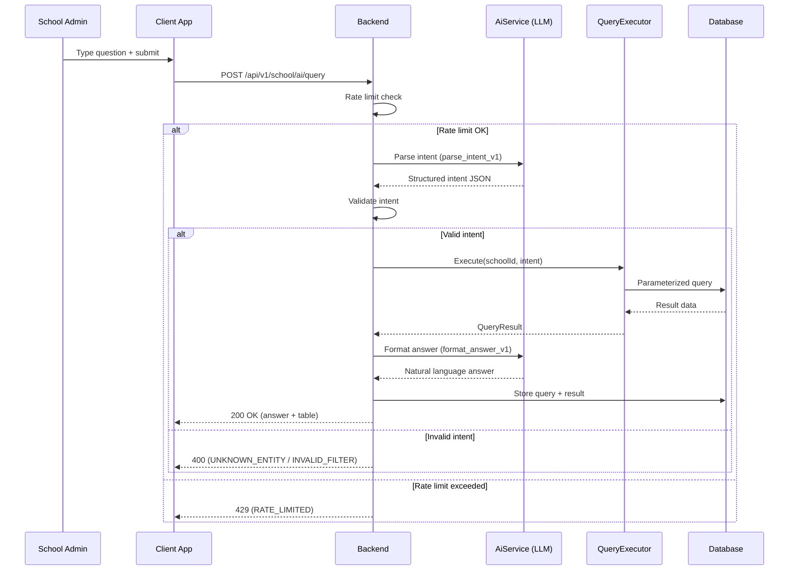
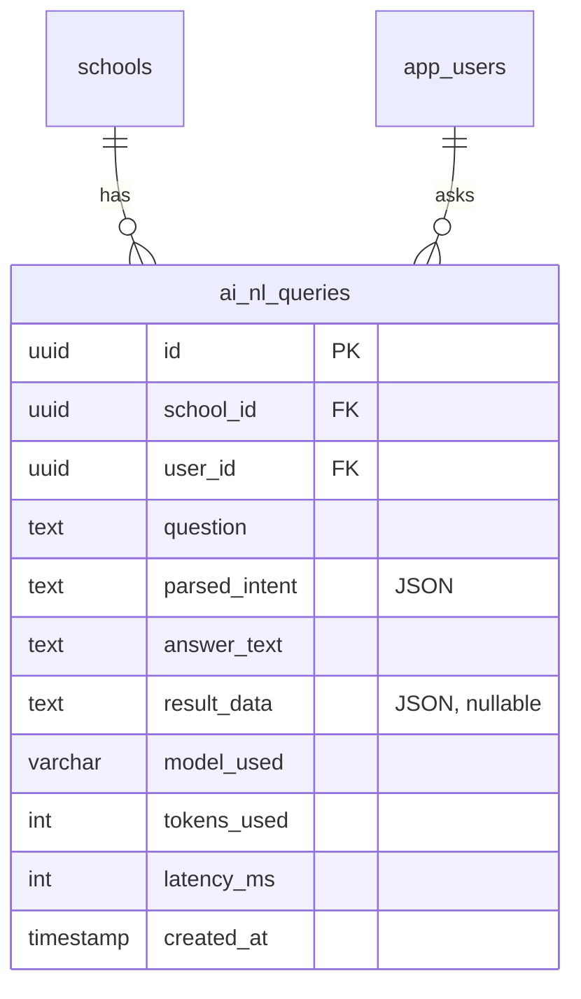

# AI Natural Language Query — Technical Specification

> **Document status:** Implementation-ready blueprint
> **Last updated:** 2026-06-27
> **Prerequisites:** `AI_INFRASTRUCTURE_SPEC.md`
> **Template:** `_SPEC_TEMPLATE.md` v1 (25 mandatory + 6 optional sections)

---

## 1. Feature Overview

Admin can ask questions in natural language ("How many students in Grade 5 have attendance below 75%?") and get answers with data from the school's database. LLM converts the question to a structured query, executes it, and formats the response.

### Goals

- Admin asks natural language questions about school data
- LLM converts question to structured query parameters
- Backend executes safe, parameterized query against existing tables
- Response formatted as natural language answer + optional data table
- No raw SQL generation (safety: structured query layer, not direct SQL)

### Non-goals

- [ ] Direct SQL generation or execution (safety: structured query layer only)
- [ ] Write operations (INSERT/UPDATE/DELETE) via NL query (read-only)
- [ ] Parent/teacher access (admin only for now)
- [ ] Multi-language question support (future enhancement)

### Dependencies

- `AI_INFRASTRUCTURE_SPEC.md` — `AiService` for LLM calls
- Existing data tables: students, attendance, marks, fees, homework, announcements

### Related Modules

- `server/.../feature/ai/AiService.kt` — shared AI service
- `server/.../feature/students/` — student data
- `server/.../feature/attendance/` — attendance data
- `server/.../feature/assessments/` — marks data
- `server/.../feature/fees/` — fee data

---

## 2. Current System Assessment

### Existing Code

- No NL query exists
- All data access via specific API endpoints
- Rich data available: students, attendance, marks, fees, homework, announcements

### Existing Database

- `StudentsTable` — student records
- `AttendanceRecordsTable` — daily attendance
- `AssessmentMarksTable` — exam marks
- `FeeRecordsTable` — fee records
- `HomeworkTable` — homework assignments
- `AnnouncementsTable` — announcements

### Existing APIs

- `GET /api/v1/school/students` — student management
- `GET /api/v1/school/attendance` — attendance management
- `GET /api/v1/school/assessments/marks` — marks management
- `GET /api/v1/school/fees` — fee management
- No NL query APIs exist

### Existing UI

- Admin dashboard with search bar (currently for navigation only)
- No NL query UI

### Existing Services

- `StudentService`, `AttendanceService`, `AssessmentService`, `FeeService` — existing data services
- `AiService` — shared AI service (per `AI_INFRASTRUCTURE_SPEC.md`)

### Existing Documentation

- `AI_INFRASTRUCTURE_SPEC.md` — AI infrastructure specification

### Technical Debt

| # | Gap | Details |
|---|---|---|
| TD-1 | No NL query | Admin must navigate multiple screens to find data |
| TD-2 | No unified search | No way to ask cross-domain questions |
| TD-3 | No query history | No record of what admins searched for |

### Gaps

| # | Gap | Impact | Severity |
|---|---|---|---|
| G1 | No NL query | Admins waste time navigating multiple screens | **High** |
| G2 | No cross-domain queries | Cannot ask questions spanning attendance + marks + fees | **Medium** |
| G3 | No query history | Cannot reuse or reference past queries | **Low** |

---

## 3. Functional Requirements

### FR-001
| Field | Value |
|---|---|
| **Title** | Natural Language Question Input |
| **Description** | Admin types question in search bar or dedicated NL query screen |
| **Priority** | Critical |
| **User Roles** | School Admin |
| **Acceptance notes** | Question text up to 500 characters |

### FR-002
| Field | Value |
|---|---|
| **Title** | Intent Parsing |
| **Description** | LLM parses question into structured intent (entity, filter, aggregation, sort) |
| **Priority** | Critical |
| **User Roles** | System |
| **Acceptance notes** | Structured JSON intent with entity, filters, aggregation, group_by, sort |

### FR-003
| Field | Value |
|---|---|
| **Title** | Safe Query Execution |
| **Description** | Backend executes structured query (NOT raw SQL — predefined query templates) |
| **Priority** | Critical |
| **User Roles** | System |
| **Acceptance notes** | Predefined templates for students, attendance, marks, fees, homework |

### FR-004
| Field | Value |
|---|---|
| **Title** | Natural Language Response |
| **Description** | Response: natural language answer + optional table/chart data |
| **Priority** | High |
| **User Roles** | School Admin |
| **Acceptance notes** | LLM formats answer from query results; optional data table |

### FR-005
| Field | Value |
|---|---|
| **Title** | Query History |
| **Description** | Query history saved per user |
| **Priority** | Medium |
| **User Roles** | School Admin |
| **Acceptance notes** | History viewable; can re-run previous queries |

### FR-006
| Field | Value |
|---|---|
| **Title** | Suggested Questions |
| **Description** | Suggested questions on empty state |
| **Priority** | Low |
| **User Roles** | School Admin |
| **Acceptance notes** | Pre-defined suggested questions for common admin tasks |

### FR-007
| Field | Value |
|---|---|
| **Title** | Rate Limiting |
| **Description** | Rate limited (10 queries per minute) |
| **Priority** | High |
| **User Roles** | System |
| **Acceptance notes** | 10 queries/minute per user; 429 if exceeded |

---

## 4. User Stories

### School Admin
- [ ] Ask "How many students in Grade 5 have attendance below 75%?" and get an answer
- [ ] Ask "Show me all students with fee dues above 5000" and see a table
- [ ] View my query history and re-run a previous query
- [ ] See suggested questions when I haven't typed anything yet
- [ ] Get a natural language answer with optional data table

### System
- [ ] Parse natural language question into structured intent via LLM
- [ ] Validate intent (entity exists, filters are valid)
- [ ] Execute predefined query template (NOT raw SQL)
- [ ] Format natural language answer from query results via LLM
- [ ] Store query and result in history
- [ ] Enforce rate limiting (10 queries/minute)

---

## 5. Business Rules

### BR-001
**Rule:** No raw SQL generation — LLM produces structured intent, backend executes predefined templates.
**Enforcement:** `QueryExecutor` only supports predefined entity queries; no SQL string construction.

### BR-002
**Rule:** All queries are read-only (SELECT equivalent).
**Enforcement:** `QueryExecutor` has no write operations; only query methods.

### BR-003
**Rule:** All queries are school-scoped via `school_id` from JWT.
**Enforcement:** Every query template includes `school_id` filter.

### BR-004
**Rule:** Rate limited to 10 queries per minute per user.
**Enforcement:** Server-side rate limiter checks per-user query count.

### BR-005
**Rule:** Query history is user-scoped (each user sees only their own history).
**Enforcement:** `ai_nl_queries` filtered by `user_id` from JWT.

### BR-006
**Rule:** Filter values validated to prevent injection.
**Enforcement:** `QueryExecutor` validates all filter values against allowed fields and operators.

---

## 6. Database Design

### 6.1 Entity Relationship Summary

New `ai_nl_queries` table with FKs to `schools` and `app_users`. Stores each query, parsed intent, answer, and result data.

### 6.2 New Tables

```sql
CREATE TABLE ai_nl_queries (
    id              UUID PRIMARY KEY DEFAULT gen_random_uuid(),
    school_id       UUID NOT NULL,
    user_id         UUID NOT NULL,
    question        TEXT NOT NULL,
    parsed_intent   TEXT NOT NULL,                 -- JSON: {entity, filters, aggregation, sort}
    answer_text     TEXT NOT NULL,                 -- natural language answer
    result_data     TEXT,                          -- JSON: table data (if applicable)
    model_used      VARCHAR(64),
    tokens_used     INTEGER,
    latency_ms      INTEGER,
    created_at      TIMESTAMP NOT NULL DEFAULT now()
);
```

### 6.3 Modified Tables

N/A — no existing tables modified.

### 6.4 Indexes

```sql
CREATE INDEX idx_ai_nl_queries_user ON ai_nl_queries(user_id, created_at DESC);
```

### 6.5 Constraints

- `ai_nl_queries.school_id` — NOT NULL
- `ai_nl_queries.user_id` — NOT NULL
- `ai_nl_queries.question` — NOT NULL
- `ai_nl_queries.parsed_intent` — NOT NULL (JSON)
- `ai_nl_queries.answer_text` — NOT NULL

### 6.6 Foreign Keys

- `ai_nl_queries.school_id` → `schools.id` (ON DELETE CASCADE)
- `ai_nl_queries.user_id` → `app_users.id` (ON DELETE CASCADE)

### 6.7 Soft Delete Strategy

N/A — query history is immutable log. No soft delete.

### 6.8 Audit Fields

- `created_at` — query timestamp
- `model_used` — which LLM model was used
- `tokens_used` — token count for cost tracking
- `latency_ms` — query execution time

### 6.9 Migration Notes

Migration: `docs/db/migration_042_ai_nl_query.sql`
- Creates `ai_nl_queries` table with index
- No data backfill needed

### 6.10 Exposed Mappings

```kotlin
object AiNlQueriesTable : UUIDTable("ai_nl_queries", "id") {
    val schoolId    = uuid("school_id")
    val userId      = uuid("user_id")
    val question    = text("question")
    val parsedIntent = text("parsed_intent")
    val answerText  = text("answer_text")
    val resultData  = text("result_data").nullable()
    val modelUsed   = varchar("model_used", 64).nullable()
    val tokensUsed  = integer("tokens_used").nullable()
    val latencyMs   = integer("latency_ms").nullable()
    val createdAt   = timestamp("created_at")
    init {
        index("idx_ai_nl_queries_user", false, userId, createdAt)
    }
}
```

### 6.11 Seed Data

Suggested questions seeded as static list in client:
- "How many students have attendance below 75%?"
- "Show me students with fee dues above 5000"
- "What is the average marks in Grade 5 for term1?"
- "List all students who were absent today"

---

## 7. State Machines

### NL Query Processing State Machine

```
QUESTION_SUBMITTED ──> PARSE_INTENT ──> VALIDATE_INTENT ──> EXECUTE_QUERY ──> FORMAT_ANSWER ──> STORE ──> RETURN
PARSE_INTENT ──> LLM_ERROR ──> RETURN_ERROR
VALIDATE_INTENT ──> INVALID_ENTITY ──> RETURN_ERROR
VALIDATE_INTENT ──> INVALID_FILTER ──> RETURN_ERROR
EXECUTE_QUERY ──> QUERY_ERROR ──> RETURN_ERROR
FORMAT_ANSWER ──> LLM_ERROR ──> RETURN_RAW_DATA
```

| Current State | Event | Next State | Guard / Condition |
|---|---|---|---|
| `question_submitted` | Start processing | `parse_intent` | — |
| `parse_intent` | LLM returns intent | `validate_intent` | Valid JSON response |
| `parse_intent` | LLM error | `return_error` | API error or timeout |
| `validate_intent` | Entity valid + filters valid | `execute_query` | — |
| `validate_intent` | Unknown entity | `return_error` | Entity not in predefined list |
| `validate_intent` | Invalid filter | `return_error` | Field or operator not allowed |
| `execute_query` | Query succeeds | `format_answer` | Data returned |
| `execute_query` | Query fails | `return_error` | DB error |
| `format_answer` | LLM formats answer | `store` | Valid response |
| `format_answer` | LLM error | `return_raw_data` | Fallback: return data without narrative |
| `store` | Stored in DB | `return` | — |

---

## 8. Backend Architecture

### 8.1 Component Overview

New `NlQueryService` orchestrates LLM intent parsing, query execution, and answer formatting. `QueryExecutor` runs predefined query templates. `NlQueryRouting` exposes API endpoints.

### 8.2 Design Principles

1. **Safety first** — No raw SQL; structured query layer only
2. **Two LLM calls** — Parse intent + format answer (separate concerns)
3. **Predefined templates** — Only known entities queryable
4. **Rate limited** — 10 queries/minute per user
5. **Fallback** — If answer formatting fails, return raw data

### 8.3 Core Types

```kotlin
class NlQueryService(private val aiService: AiService) {
    suspend fun query(schoolId: UUID, userId: UUID, question: String): NlQueryResult {
        // 1. Call LLM to parse question into structured intent
        val intent = aiService.complete(schoolId, userId, "nl_query", "parse_intent_v1",
            mapOf("question" to question, "available_entities" to ENTITY_DESCRIPTIONS))
        // 2. Validate intent (entity exists, filters are valid)
        // 3. Execute query via QueryExecutor
        val data = queryExecutor.execute(schoolId, intent)
        // 4. Call LLM to format natural language answer from data
        val answer = aiService.complete(schoolId, userId, "nl_query", "format_answer_v1",
            mapOf("question" to question, "data" to Json.encodeToString(data)))
        // 5. Store and return
    }
}
```

### 8.4 QueryExecutor

Predefined query templates (NOT raw SQL):

```kotlin
class QueryExecutor {
    suspend fun execute(schoolId: UUID, intent: ParsedIntent): QueryResult {
        return when (intent.entity) {
            "students" -> queryStudents(schoolId, intent.filters, intent.aggregation)
            "attendance" -> queryAttendance(schoolId, intent.filters, intent.aggregation)
            "marks" -> queryMarks(schoolId, intent.filters, intent.aggregation)
            "fees" -> queryFees(schoolId, intent.filters, intent.aggregation)
            "homework" -> queryHomework(schoolId, intent.filters, intent.aggregation)
            else -> throw NlQueryException("Unknown entity: ${intent.entity}")
        }
    }
}
```

### 8.5 Intent Schema

```json
{
  "entity": "attendance",
  "filters": [
    {"field": "class", "op": "eq", "value": "Grade 5"},
    {"field": "attendance_rate", "op": "lt", "value": 75}
  ],
  "aggregation": "count",
  "group_by": null,
  "sort": {"field": "attendance_rate", "order": "asc"}
}
```

### 8.6 Repositories

- `AiNlQueryRepository` — CRUD for `ai_nl_queries` table

### 8.7 Mappers

- `NlQueryMapper` — maps DB row to `NlQueryHistoryDto`

### 8.8 Permission Checks

- Query: school admin only
- History: user-scoped (own history only)

### 8.9 Background Jobs

N/A — NL query is synchronous (completes within request timeout).

### 8.10 Domain Events

- `NlQueryExecuted` — emitted when query completes
- `NlQueryFailed` — emitted when query fails at any stage

### 8.11 Caching

N/A — each query is unique. No caching of results.

### 8.12 Transactions

- Query storage: single INSERT into `ai_nl_queries`
- Query execution: read-only SELECT (no transaction needed)

---

## 9. API Contracts

### 9.1 Submit Query

```
POST /api/v1/school/ai/query
{
  "question": "How many students in Grade 5 have attendance below 75%?"
}
```

**Response 200:**
```json
{
  "success": true,
  "data": {
    "answer": "There are 8 students in Grade 5 with attendance below 75%. The lowest is Rahul Kumar at 62%.",
    "table": {
      "columns": ["Student", "Attendance %"],
      "rows": [
        ["Rahul Kumar", "62%"],
        ["Priya Sharma", "68%"],
        ...
      ]
    }
  }
}
```

### 9.2 Query History

```
GET /api/v1/school/ai/query/history
```

**Response 200:**
```json
{
  "success": true,
  "data": [
    {
      "id": "uuid",
      "question": "How many students in Grade 5 have attendance below 75%?",
      "answer": "There are 8 students...",
      "created_at": "2026-06-27T10:30:00Z"
    },
    ...
  ]
}
```

### 9.3 Rate Limit Response

**Response 429:**
```json
{
  "success": false,
  "error": {
    "code": "RATE_LIMITED",
    "message": "Too many queries. Please wait before trying again."
  }
}
```

---

## 10. Frontend Architecture

### 10.1 Screens

| Screen | Platform | Role | Description |
|---|---|---|---|
| `NlQueryScreen` | All | School Admin | NL query input, results, history |
| `NlQuerySearchBar` | All | School Admin | Search bar in admin dashboard |

### 10.2 Navigation

- Admin portal → Dashboard → Search bar → `NlQueryScreen`
- Admin portal → AI → Natural Language Query → `NlQueryScreen`

### 10.3 UX Flows

#### Ask a Question

1. Admin types question in search bar or NL query screen
2. Submits question
3. Loading: "Analyzing your question..."
4. Results displayed: natural language answer + optional data table
5. Query saved to history

#### View History

1. Admin navigates to NL query screen
2. History tab shows past queries
3. Click on a query to re-run it

#### Suggested Questions

1. Admin opens NL query screen with empty input
2. Suggested questions displayed as chips
3. Click a suggestion to auto-fill and submit

### 10.4 State Management

```kotlin
data class NlQueryState(
    val question: String,
    val result: NlQueryResultDto?,
    val isLoading: Boolean,
    val error: String?,
    val history: List<NlQueryHistoryDto>,
    val suggestions: List<String>,
)
```

### 10.5 Offline Support

N/A — NL query requires server-side LLM call. History can be cached for offline viewing.

### 10.6 Loading States

- Parsing: "Analyzing your question..."
- Executing: "Querying school data..."
- Formatting: "Formatting answer..."

### 10.7 Error Handling (UI)

- Rate limited: "Too many queries. Please wait a minute."
- Unknown entity: "I couldn't understand what data you're looking for. Try rephrasing."
- Query error: "Could not retrieve data. Please try again."
- Empty result: "No data found matching your question."

### 10.8 Component Integration Guidelines

| Rule | Description |
|---|---|
| **R1** | Answer displayed in highlighted card |
| **R2** | Data table displayed below answer if available |
| **R3** | Suggested questions as clickable chips |
| **R4** | History items show question + timestamp |
| **R5** | Search bar auto-expands to full screen on mobile |

---

## 11. Shared Module Changes (KMP)

### 11.1 DTOs

```kotlin
data class NlQueryResultDto(
    val id: UUID,
    val answer: String,
    val table: TableData?,
    val createdAt: Instant,
)

data class TableData(
    val columns: List<String>,
    val rows: List<List<String>>,
)

data class NlQueryHistoryDto(
    val id: UUID,
    val question: String,
    val answer: String,
    val createdAt: Instant,
)

data class NlQueryRequest(
    val question: String,
)
```

### 11.2 Domain Models

```kotlin
data class NlQuery(
    val id: UUID,
    val schoolId: UUID,
    val userId: UUID,
    val question: String,
    val parsedIntent: ParsedIntent,
    val answerText: String,
    val resultData: TableData?,
    val modelUsed: String?,
    val tokensUsed: Int?,
    val latencyMs: Int?,
    val createdAt: Instant,
)

data class ParsedIntent(
    val entity: String,
    val filters: List<Filter>,
    val aggregation: String?,
    val groupBy: String?,
    val sort: Sort?,
)
```

### 11.3 Repository Interfaces

```kotlin
interface NlQueryRepository {
    suspend fun insert(query: NlQueryEntity): UUID
    suspend fun getHistory(userId: UUID, limit: Int): List<NlQueryHistoryDto>
}
```

### 11.4 UseCases

- `SubmitNlQueryUseCase`
- `GetQueryHistoryUseCase`

### 11.5 Validation

- Question: max 500 characters, not empty
- Rate limit: 10 queries/minute per user

### 11.6 Serialization

Standard Kotlinx serialization for DTOs. `parsed_intent` and `result_data` are JSON strings.

### 11.7 Network APIs

Added to `NlQueryApi.kt`:
- `POST /api/v1/school/ai/query` — submit query
- `GET /api/v1/school/ai/query/history` — query history

### 11.8 Database Models (Local Cache)

N/A — query data is server-side only. History can be cached for offline viewing.

---

## 12. Permissions Matrix

| Action | Super Admin | School Admin | Teacher | Parent |
|---|---|---|---|---|
| Submit NL query | ✅ | ✅ | ❌ | ❌ |
| View query history | ✅ | ✅ (own) | ❌ | ❌ |
| View all users' history | ✅ | ❌ | ❌ | ❌ |

---

## 13. Notifications

N/A — NL query is an interactive feature. No notifications needed.

---

## 14. Background Jobs

N/A — NL query is synchronous. No background jobs needed.

---

## 15. Integrations

### AiService (Shared)
| Field | Value |
|---|---|
| **System** | AiService (per `AI_INFRASTRUCTURE_SPEC.md`) |
| **Purpose** | LLM for intent parsing and answer formatting |
| **API / SDK** | `AiService.complete()` |
| **Auth method** | Internal service call |
| **Fallback** | Return raw data if answer formatting fails |

### Existing Data Services
| Field | Value |
|---|---|
| **System** | StudentService, AttendanceService, AssessmentService, FeeService |
| **Purpose** | Data source for query execution |
| **API / SDK** | Direct service calls |
| **Auth method** | Internal |
| **Fallback** | None — data services are required |

---

## 16. Security

### Authentication
- All API endpoints require valid JWT with school admin role

### Authorization
- Only school admin can submit NL queries
- History is user-scoped (own history only)
- Super admin can view all users' history

### Encryption
- Query data is non-sensitive (aggregated school data)
- LLM API calls use TLS (handled by `AiService`)

### Audit Logs
- Query execution logged via `AuditService` (action: `READ`, entity: `ai_nl_query`)

### PII Handling
- Student names may appear in query results (non-sensitive in school context)
- No PII sent to LLM beyond entity names and filter values
- Query history contains questions (admin's own text)

### Data Isolation
- All queries filtered by `school_id` from JWT
- History filtered by `user_id` from JWT

### Rate Limiting
- 10 queries per minute per user
- Enforced server-side; 429 response if exceeded

### Input Validation
- Question: max 500 characters, not empty
- Intent validation: entity must be in predefined list
- Filter validation: field and operator must be allowed
- No raw SQL construction at any point

### SQL Injection Prevention
- No raw SQL generation — LLM produces structured intent
- `QueryExecutor` uses parameterized queries via Exposed ORM
- All filter values validated against allowed fields and operators

---

## 17. Performance & Scalability

### Expected Scale

| Metric | 1 query | 10 concurrent | 100 concurrent |
|---|---|---|---|
| Intent parsing (LLM) | ~2-3s | ~3-5s | ~5-10s |
| Query execution | < 100ms | < 200ms | < 500ms |
| Answer formatting (LLM) | ~2-3s | ~3-5s | ~5-10s |
| Total latency | ~5-7s | ~7-10s | ~10-15s |

### Latency Targets

| Operation | Target |
|---|---|
| Full query (parse + execute + format) | < 10s |
| Query execution only | < 200ms |
| History retrieval | < 100ms |

### Optimization Strategy

- Two LLM calls (parse + format) are sequential; cannot parallelize
- Query execution is fast (parameterized ORM queries)
- Rate limiting prevents overload
- History query uses indexed `user_id` lookup

---

## 18. Edge Cases

| # | Scenario | Expected Behavior |
|---|---|---|
| EC-001 | Question is ambiguous | LLM returns best-guess intent; answer may note ambiguity |
| EC-002 | Entity not recognized | Return error: "I couldn't understand what data you're looking for" |
| EC-003 | Filter value invalid | Return error: "Invalid filter value" |
| EC-004 | No data matching query | Answer: "No data found matching your question" |
| EC-005 | LLM returns malformed intent | Retry once; if still malformed, return error |
| EC-006 | LLM answer formatting fails | Return raw data table without narrative |
| EC-007 | Rate limit exceeded | Return 429 with "Please wait" message |
| EC-008 | Question exceeds 500 chars | Return 400: "Question too long (max 500 characters)" |

### Risks & Mitigations

| Risk | Likelihood | Impact | Mitigation |
|---|---|---|---|
| LLM misparses intent | Medium | Medium | Admin reviews answer; can rephrase |
| LLM generates incorrect answer | Low | Medium | Answer based on actual query data, not LLM hallucination |
| Query returns too many rows | Medium | Low | Limit to 100 rows; note "showing first 100" |
| LLM cost per query | Medium | Medium | Rate limiting; token tracking |

---

## 19. Error Handling

### Standard Error Codes

| HTTP | Error Code | Description | When |
|---|---|---|---|
| 400 | `QUESTION_TOO_LONG` | Question exceeds 500 characters | Input validation |
| 400 | `UNKNOWN_ENTITY` | LLM parsed entity not in predefined list | Intent validation |
| 400 | `INVALID_FILTER` | Filter field or operator not allowed | Intent validation |
| 403 | `INSUFFICIENT_PERMISSIONS` | Non-admin attempting query | Auth check |
| 429 | `RATE_LIMITED` | More than 10 queries/minute | Rate limit |
| 500 | `LLM_PARSE_ERROR` | LLM intent parsing failed | LLM call |
| 500 | `LLM_FORMAT_ERROR` | LLM answer formatting failed | LLM call |
| 500 | `QUERY_EXECUTION_ERROR` | Query execution failed | DB query |

### Error Response Format

Same as existing API error format.

### Recovery Strategy

| Error | Client Action | Server Action |
|---|---|---|
| `UNKNOWN_ENTITY` | Show "Try rephrasing" | Return 400 |
| `LLM_PARSE_ERROR` | Show retry button | Retry once; return 500 |
| `LLM_FORMAT_ERROR` | Show raw data table | Return data without narrative |
| `RATE_LIMITED` | Show "Wait a minute" | Return 429 |

---

## 20. Analytics & Reporting

### Reports

- **Query Usage Report:** Number of queries per day/week/month
- **Entity Popularity Report:** Which entities are most queried
- **Token Usage Report:** LLM token consumption per school/month

### KPIs

- **Query Success Rate:** % of queries that return successful results
- **Average Query Latency:** Mean time for full query cycle
- **Token Cost per Query:** Average token usage per query
- **Most Common Entities:** Which data domains admins query most

### Dashboards

N/A — monitoring via metrics (see section F. Observability).

### Exports

N/A — query results viewable in-app.

---

## 21. Testing Strategy

### Unit Tests

| Test | What it verifies |
|---|---|
| Intent parser | LLM response → correct ParsedIntent object |
| Intent validator | Unknown entity rejected; invalid filter rejected |
| QueryExecutor: students | Correct query for student filters |
| QueryExecutor: attendance | Correct query for attendance filters |
| QueryExecutor: marks | Correct query for marks filters |
| QueryExecutor: fees | Correct query for fee filters |
| Answer formatter | LLM formats answer from data |
| Rate limiter | 10 queries/minute enforced |

### Integration Tests

| Test | What it verifies |
|---|---|
| Full flow: question → intent → query → answer → store | End-to-end |
| Unknown entity → 400 | Error handling |
| Rate limit → 429 | Rate limiting |
| History retrieval → correct list | History feature |
| LLM format fails → raw data returned | Fallback behavior |

### Performance Tests

- [ ] Full query < 10s
- [ ] Query execution < 200ms
- [ ] History retrieval < 100ms

### Security Tests

- [ ] Non-admin cannot query
- [ ] All queries school-scoped
- [ ] No raw SQL executed
- [ ] Filter values sanitized
- [ ] Rate limit enforced

### Migration Tests

- [ ] Migration creates table with correct schema
- [ ] Index created correctly

---

## 22. Acceptance Criteria

- [ ] Admin can ask natural language questions
- [ ] Questions about students, attendance, marks, fees answered correctly
- [ ] Response includes natural language answer + optional data table
- [ ] No raw SQL executed (structured query layer only)
- [ ] Query history saved
- [ ] Suggested questions shown on empty state
- [ ] Rate limiting enforced
- [ ] Fallback to raw data if answer formatting fails

---

## 23. Implementation Roadmap

| Phase | Duration | Tasks | Breaking? | Deliverable |
|---|---|---|---|---|
| 1 | 1 day | DB migration, Exposed table | No | Schema ready |
| 2 | 2 days | Intent parser (LLM prompt + response parsing) | No | Intent parsing |
| 3 | 3 days | QueryExecutor (predefined templates for 5 entities) | No | Query execution |
| 4 | 1 day | Answer formatter (LLM prompt) | No | Answer formatting |
| 5 | 1 day | API endpoint + history | No | API available |
| 6 | 2 days | Client UI (search bar, results, history, suggestions) | No | UI ready |
| 7 | 1 day | Tests | No | Test coverage |

**Total: ~11 days**

---

## 24. File-Level Impact Analysis

### New Files

| File | Location | Purpose |
|---|---|---|
| `NlQueryService.kt` | `server/.../feature/ai/nlquery/` | Core service (parse + execute + format) |
| `QueryExecutor.kt` | `server/.../feature/ai/nlquery/` | Predefined query templates |
| `NlQueryRouting.kt` | `server/.../feature/ai/nlquery/` | API endpoints |
| `migration_042_ai_nl_query.sql` | `docs/db/` | DDL migration |
| `NlQueryApi.kt` | `shared/.../feature/ai/` | Client API |
| `NlQueryScreen.kt` | `composeApp/.../ui/v2/screens/admin/` | Query UI |

### Modified Files

| File | Change Type | Lines Changed (est.) | Risk | Description |
|---|---|---|---|---|
| `server/.../db/Tables.kt` | Add | ~15 | Low | `AiNlQueriesTable` object |
| `server/.../db/DatabaseFactory.kt` | Modify | ~2 | Low | Register table |

### Files Preserved Unchanged

| File | Reason |
|---|---|
| `AiService.kt` | Used as-is per AI_INFRASTRUCTURE_SPEC |
| All existing data services | Read-only access via existing methods |

---

## 25. Future Enhancements

### Multi-Language Questions

- Support questions in Hindi, Marathi, Tamil, etc.
- LLM parses non-English questions into structured intent
- Answer in same language as question

### Teacher Access

- Allow teachers to ask questions about their own class data
- Scoped to teacher's assigned classes
- Read-only access to attendance, marks for own class

### Chart/Visualization Responses

- LLM suggests appropriate chart type based on data
- Bar chart for comparisons, pie chart for distributions
- Interactive charts in response

### Voice Input

- Admin speaks question via voice input
- Speech-to-text converts to text query
- Hands-free querying

### Saved Queries

- Admin can save frequent queries with custom names
- One-click re-run of saved queries
- Dashboard widgets from saved queries

### Cross-Entity Queries

- Questions spanning multiple entities: "Show students with low attendance AND low marks"
- Join queries across tables
- More complex aggregations

### Query Suggestions Based on Usage

- AI suggests next questions based on current result
- "You might also want to know..." prompts
- Contextual follow-up questions

---

## A. Sequence Diagrams

### NL Query Flow



---

## B. Domain Model / ER Diagram



---

## C. Event Flow

```
QuestionSubmitted -> RateLimitCheck -> ParseIntent -> ValidateIntent -> ExecuteQuery -> FormatAnswer -> StoreResult -> ReturnResult
RateLimitCheck -> RateLimited -> ReturnError
ParseIntent -> LLMError -> ReturnError
ValidateIntent -> InvalidEntity -> ReturnError
ValidateIntent -> InvalidFilter -> ReturnError
ExecuteQuery -> QueryError -> ReturnError
FormatAnswer -> LLMError -> ReturnRawData -> StoreResult -> ReturnResult
```

| Event | Emitted By | Consumed By | Side Effect |
|---|---|---|---|
| `NlQueryExecuted` | `NlQueryService.query()` | Analytics | Counter incremented; latency recorded |
| `NlQueryFailed` | `NlQueryService` (catch block) | Analytics | Counter incremented by failure reason |

---

## D. Configuration

### Environment Variables

| Variable | Description |
|---|---|
| `AI_NL_QUERY_ENABLED` | Enable/disable feature (default: `true`) |
| `AI_NL_QUERY_RATE_LIMIT` | Max queries per minute per user (default: `10`) |
| `AI_NL_QUERY_MAX_QUESTION_LENGTH` | Max question length (default: `500`) |
| `AI_NL_QUERY_MAX_ROWS` | Max rows returned per query (default: `100`) |

### Feature Flags

| Flag | Default | Description |
|---|---|---|
| `ai_nl_query_enabled` | `true` | Master switch for NL query |
| `ai_nl_query_history` | `true` | Enable query history |

### Client-Side Configuration

| Config | Default | Description |
|---|---|---|
| Suggested questions | Static list | Pre-defined suggestions on empty state |
| History page size | 20 | Queries per page in history |

### Server-Side Configuration

| Config | Default | Description |
|---|---|---|
| LLM model | Per `AiService` config | Model for intent parsing and answer formatting |
| Parse prompt template | `parse_intent_v1` | Intent parsing template |
| Format prompt template | `format_answer_v1` | Answer formatting template |
| Rate limit | 10/min | Per user |
| Max question length | 500 chars | Input validation |
| Max rows | 100 | Query result limit |
| Max retries | 1 | LLM retry on malformed response |

### Infrastructure Requirements

- `AiService` configured per `AI_INFRASTRUCTURE_SPEC.md`
- Existing data services (StudentService, AttendanceService, etc.)

---

## E. Migration & Rollback

### Deployment Plan

1. [ ] Run `migration_042_ai_nl_query.sql` — creates table + index
2. [ ] Deploy `AiNlQueriesTable` in `Tables.kt`
3. [ ] Register table in `DatabaseFactory.kt`
4. [ ] Deploy `NlQueryService.kt`
5. [ ] Deploy `QueryExecutor.kt`
6. [ ] Deploy `NlQueryRouting.kt`
7. [ ] Seed prompt templates `parse_intent_v1` and `format_answer_v1`
8. [ ] Deploy client UI
9. [ ] Test with mock LLM
10. [ ] Deploy to production

### Rollback Plan

1. [ ] Disable feature flag `ai_nl_query_enabled` → API returns 404
2. [ ] Remove client UI → search bar reverts to navigation only
3. [ ] Database: `DROP TABLE IF EXISTS ai_nl_queries;`
4. [ ] No data loss — query history is additive

### Data Backfill

N/A — queries generated on demand. No backfill needed.

### Migration SQL

```sql
-- migration_042_ai_nl_query.sql
CREATE TABLE IF NOT EXISTS ai_nl_queries (
    id              UUID PRIMARY KEY DEFAULT gen_random_uuid(),
    school_id       UUID NOT NULL,
    user_id         UUID NOT NULL,
    question        TEXT NOT NULL,
    parsed_intent   TEXT NOT NULL,
    answer_text     TEXT NOT NULL,
    result_data     TEXT,
    model_used      VARCHAR(64),
    tokens_used     INTEGER,
    latency_ms      INTEGER,
    created_at      TIMESTAMP NOT NULL DEFAULT now()
);

CREATE INDEX IF NOT EXISTS idx_ai_nl_queries_user ON ai_nl_queries(user_id, created_at DESC);

-- ROLLBACK:
-- DROP TABLE IF EXISTS ai_nl_queries;
```

---

## F. Observability

### Logging

- Query submitted: INFO `nl_query_submitted` (userId, questionLength)
- Intent parsed: DEBUG `nl_query_intent_parsed` (userId, entity, filters, aggregation)
- Intent invalid: WARN `nl_query_intent_invalid` (userId, reason)
- Query executed: DEBUG `nl_query_executed` (userId, entity, rowCount, executionMs)
- Answer formatted: INFO `nl_query_answered` (userId, answerLength, totalLatencyMs, tokensUsed)
- Query failed: WARN `nl_query_failed` (userId, stage, error)
- Rate limited: WARN `nl_query_rate_limited` (userId)

### Metrics

| Metric | Type | Description |
|---|---|---|
| `ai.nl_query.requests_total` | Counter | Total query requests |
| `ai.nl_query.success_total` | Counter | Successful queries |
| `ai.nl_query.failures_total` | Counter (by reason) | Failed queries by reason |
| `ai.nl_query.rate_limited_total` | Counter | Rate-limited requests |
| `ai.nl_query.latency_ms` | Histogram | Full query latency |
| `ai.nl_query.execution_ms` | Histogram | Query execution time only |
| `ai.nl_query.tokens_used_total` | Counter | Total tokens consumed |
| `ai.nl_query.entity_popularity` | Counter (by entity) | Queries per entity type |

### Health Checks

- `GET /api/v1/health` — existing health check
- LLM provider availability (per `AI_INFRASTRUCTURE_SPEC.md`)

### Alerts

- Query failure rate > 20% → Warning
- Rate limit triggers > 50/hour → Info (may need to increase limit)
- Average latency > 15s → Warning (LLM may be slow)
- Token usage exceeding monthly budget → Warning
