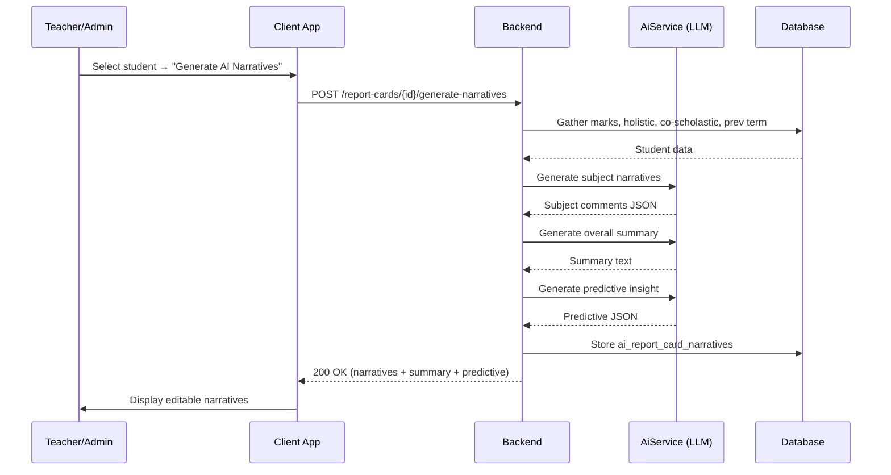
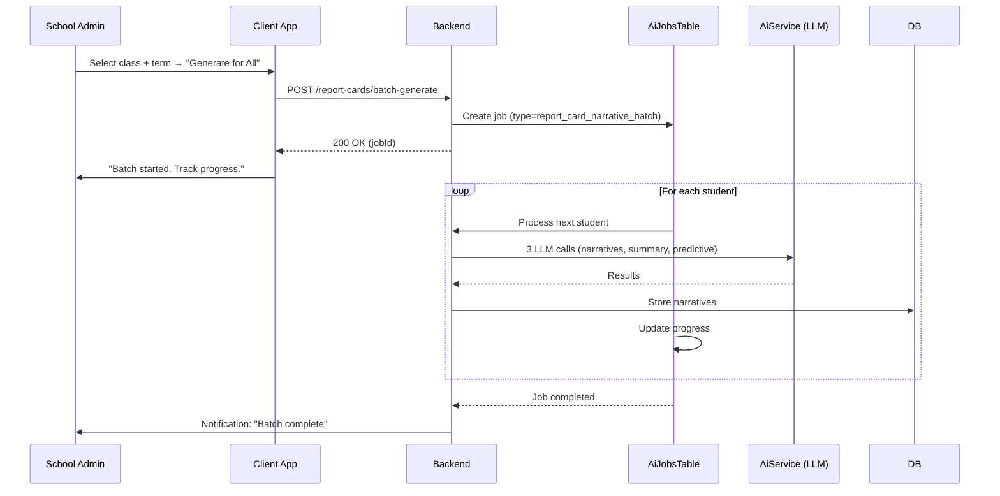
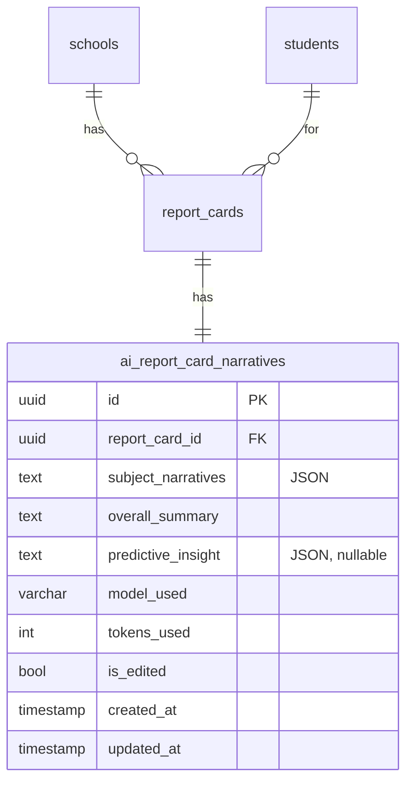

# AI Report Card — Technical Specification

> **Document status:** Implementation-ready blueprint
> **Last updated:** 2026-06-27
> **Prerequisites:** `AI_INFRASTRUCTURE_SPEC.md`, `NEP_COMPLIANCE_SPEC.md`
> **Template:** `_SPEC_TEMPLATE.md` v1 (25 mandatory + 6 optional sections)

---

## 1. Feature Overview

AI-powered report card generation that creates narrative comments, predictive insights, and auto-assembled report cards combining academic marks, holistic assessments, and co-scholastic records. Replaces the existing 20% stub with a full AI-driven system.

### Goals

- Generate narrative comments per subject (not generic "good student")
- Predictive insights: likely grade next term, at-risk indicators
- Auto-assemble HPC (Holistic Progress Card) combining all dimensions
- AI-generated parent-friendly summary
- Batch generation for entire class
- Teacher review and edit before publishing

### Non-goals

- [ ] Automated grade assignment (grades come from marks, not AI)
- [ ] Report card template design (handled by `NEP_COMPLIANCE_SPEC.md`)
- [ ] Parent portal report card viewing (handled by existing NEP spec)
- [ ] Automated parent-teacher meeting scheduling based on insights

### Dependencies

- `AI_INFRASTRUCTURE_SPEC.md` — `AiService` for LLM calls
- `NEP_COMPLIANCE_SPEC.md` — `ReportCardsTable`, `ReportCardTemplatesTable`, `HolisticAssessmentsTable`, `CoScholasticRecordsTable`
- `AssessmentsTable` + `AssessmentMarksTable` — typed marks model
- `ParentAchievementsTable` — badges, competencies, EI metrics

### Related Modules

- `server/.../feature/ai/AiService.kt` — shared AI service
- `server/.../feature/nep/` — NEP compliance and report card assembly
- `server/.../feature/assessments/` — marks management
- `AI_EXAM_ANALYSIS_SPEC.md` — exam analysis (complementary)

---

## 2. Current System Assessment

### Existing Code

- `feature_audit.csv` L23, L107: Report Cards stub at 20%
- `ExamResultsTable` (deprecated) — legacy string-scored model
- `AssessmentsTable` + `AssessmentMarksTable` — typed marks model
- `NEP_COMPLIANCE_SPEC.md` defines `ReportCardsTable`, `ReportCardTemplatesTable`, `HolisticAssessmentsTable`, `CoScholasticRecordsTable`
- `ParentAchievementsTable` — badges, competencies, EI metrics
- No AI narrative generation

### Existing Database

- `ReportCardsTable` — report card records (per `NEP_COMPLIANCE_SPEC.md`)
- `ReportCardTemplatesTable` — board-specific templates
- `HolisticAssessmentsTable` — holistic assessment data
- `CoScholasticRecordsTable` — co-scholastic records
- `AssessmentMarksTable` — exam marks
- `ParentAchievementsTable` — badges, competencies, EI metrics

### Existing APIs

- `GET /api/v1/school/report-cards` — report card management (per NEP spec)
- No AI narrative APIs exist

### Existing UI

- Report card management screen (20% stub)
- No AI narrative editor

### Existing Services

- `ReportCardService` — report card assembly (per NEP spec)
- `AiService` — shared AI service (per `AI_INFRASTRUCTURE_SPEC.md`)

### Existing Documentation

- `NEP_COMPLIANCE_SPEC.md` — NEP compliance and report card specification
- `AI_INFRASTRUCTURE_SPEC.md` — AI infrastructure specification
- `feature_audit.csv` — feature audit tracking

### Technical Debt

| # | Gap | Details |
|---|---|---|
| TD-1 | Report cards stub at 20% | Incomplete implementation |
| TD-2 | No AI narratives | Generic comments only |
| TD-3 | No predictive insights | No at-risk flagging or grade prediction |
| TD-4 | No batch generation | Manual per-student process |

### Gaps

| # | Gap | Impact | Severity |
|---|---|---|---|
| G1 | No AI narratives | Generic, unhelpful report card comments | **High** |
| G2 | No predictive insights | Cannot identify at-risk students early | **High** |
| G3 | No batch generation | Time-consuming manual process | **Medium** |
| G4 | No multi-lingual support | Cannot generate narratives in school's medium | **Medium** |

---

## 3. Functional Requirements

### FR-001
| Field | Value |
|---|---|
| **Title** | Per-Subject Narrative Generation |
| **Description** | Generate per-subject narrative comment based on marks, trend, and holistic data |
| **Priority** | Critical |
| **User Roles** | System |
| **Acceptance notes** | Specific, non-generic comments with strength, weakness, improvement suggestion |

### FR-002
| Field | Value |
|---|---|
| **Title** | Overall Summary |
| **Description** | Generate overall summary paragraph (parent-friendly) |
| **Priority** | High |
| **User Roles** | System |
| **Acceptance notes** | 3-4 sentences with overall assessment, key strength, focus area, encouraging closing |

### FR-003
| Field | Value |
|---|---|
| **Title** | Predictive Insights |
| **Description** | Predictive insight: likely next-term performance, at-risk flag |
| **Priority** | High |
| **User Roles** | System |
| **Acceptance notes** | JSON with likely_grade, at_risk boolean, and reason |

### FR-004
| Field | Value |
|---|---|
| **Title** | Auto-Assemble Report Card |
| **Description** | Auto-assemble report card from: academic marks + holistic assessments + co-scholastic + AI narratives |
| **Priority** | Critical |
| **User Roles** | System |
| **Acceptance notes** | Combines all dimensions into board-specific template |

### FR-005
| Field | Value |
|---|---|
| **Title** | Teacher Review and Edit |
| **Description** | Teacher can review and edit AI-generated content before publishing |
| **Priority** | High |
| **User Roles** | Teacher, School Admin |
| **Acceptance notes** | Edit narratives; `is_edited` flag set to true on modification |

### FR-006
| Field | Value |
|---|---|
| **Title** | Batch Generation |
| **Description** | Batch generation for entire class (async job) |
| **Priority** | High |
| **User Roles** | School Admin |
| **Acceptance notes** | Async job via `AiJobsTable`; processes all students in class |

### FR-007
| Field | Value |
|---|---|
| **Title** | Board-Specific Templates |
| **Description** | Support board-specific templates (from `NEP_COMPLIANCE_SPEC.md`) |
| **Priority** | Medium |
| **User Roles** | System |
| **Acceptance notes** | Renders narratives into board-specific format |

### FR-008
| Field | Value |
|---|---|
| **Title** | Multi-Lingual Narratives |
| **Description** | Multi-lingual narrative (school's medium of instruction) |
| **Priority** | Medium |
| **User Roles** | System |
| **Acceptance notes** | At least Hindi + English support |

---

## 4. User Stories

### School Admin
- [ ] Generate AI narratives for all students in a class (batch)
- [ ] View batch generation progress
- [ ] Publish report cards after teacher review

### Teacher
- [ ] Review AI-generated subject narratives for my class
- [ ] Edit narratives before publishing
- [ ] View predictive insights for students
- [ ] See at-risk flags for students in my class

### Parent
- [ ] View child's report card with AI-generated narratives
- [ ] Read parent-friendly overall summary
- [ ] See predictive insights (if school shares them)

### System
- [ ] Gather all data: marks, holistic assessments, co-scholastic, previous term
- [ ] Call LLM for per-subject narratives
- [ ] Call LLM for overall summary
- [ ] Call LLM for predictive insight
- [ ] Store narratives in `ai_report_card_narratives`
- [ ] Auto-assemble report card from all dimensions
- [ ] Support batch generation via async job

---

## 5. Business Rules

### BR-001
**Rule:** AI narratives are generated but teacher must review before publishing.
**Enforcement:** `report_cards.status` remains `draft` until teacher/admin publishes.

### BR-002
**Rule:** `is_edited` flag set to true when teacher modifies AI-generated content.
**Enforcement:** `PATCH /report-cards/{id}/narratives` sets `is_edited = true`.

### BR-003
**Rule:** Batch generation processes students sequentially to avoid LLM rate limits.
**Enforcement:** `batchGenerate` creates `AiJobsTable` entry; processes one student at a time.

### BR-004
**Rule:** Predictive insights are advisory only; not shown to students.
**Enforcement:** Predictive insight stored in `ai_report_card_narratives`; only visible to teachers/admins.

### BR-005
**Rule:** Multi-lingual narratives use school's configured medium of instruction.
**Enforcement:** Language determined from `SchoolsTable.mediumOfInstruction` field.

### BR-006
**Rule:** One narrative set per report card.
**Enforcement:** `ai_report_card_narratives.report_card_id` is unique (one-to-one with `report_cards`).

---

## 6. Database Design

### 6.1 Entity Relationship Summary

New `ai_report_card_narratives` table with FK to `report_cards` (from NEP spec). One-to-one relationship. Stores AI-generated content and edit tracking.

### 6.2 New Tables

```sql
CREATE TABLE ai_report_card_narratives (
    id              UUID PRIMARY KEY DEFAULT gen_random_uuid(),
    report_card_id  UUID NOT NULL REFERENCES report_cards(id) ON DELETE CASCADE,
    subject_narratives TEXT NOT NULL,              -- JSON: [{"subject": "Math", "comment": "..."}]
    overall_summary TEXT NOT NULL,
    predictive_insight TEXT,                       -- JSON: {"likely_grade": "B", "at_risk": false, "reason": "..."}
    model_used      VARCHAR(64),
    tokens_used     INTEGER,
    is_edited       BOOLEAN NOT NULL DEFAULT false, -- teacher modified AI output
    created_at      TIMESTAMP NOT NULL DEFAULT now(),
    updated_at      TIMESTAMP NOT NULL DEFAULT now()
);
```

### 6.3 Modified Tables

N/A — uses existing tables from `NEP_COMPLIANCE_SPEC.md` as read-only data sources.

### 6.4 Indexes

```sql
CREATE UNIQUE INDEX idx_ai_rc_narratives_rc ON ai_report_card_narratives(report_card_id);
```

### 6.5 Constraints

- `ai_report_card_narratives.report_card_id` — NOT NULL, UNIQUE
- `ai_report_card_narratives.subject_narratives` — NOT NULL (JSON)
- `ai_report_card_narratives.overall_summary` — NOT NULL
- `ai_report_card_narratives.is_edited` — NOT NULL, DEFAULT false

### 6.6 Foreign Keys

- `ai_report_card_narratives.report_card_id` → `report_cards.id` (ON DELETE CASCADE)

### 6.7 Soft Delete Strategy

N/A — narratives deleted when report card is deleted (CASCADE).

### 6.8 Audit Fields

- `created_at` — narrative generation timestamp
- `updated_at` — last edit timestamp (teacher modification)
- `is_edited` — whether teacher modified AI output
- `model_used` — which LLM model was used
- `tokens_used` — token count for cost tracking

### 6.9 Migration Notes

Migration: `docs/db/migration_043_ai_report_card.sql`
- Creates `ai_report_card_narratives` table with unique index
- Depends on `report_cards` table from `NEP_COMPLIANCE_SPEC.md`
- No data backfill needed

### 6.10 Exposed Mappings

```kotlin
object AiReportCardNarrativesTable : UUIDTable("ai_report_card_narratives", "id") {
    val reportCardId     = uuid("report_card_id")
    val subjectNarratives = text("subject_narratives") // JSON
    val overallSummary   = text("overall_summary")
    val predictiveInsight = text("predictive_insight").nullable() // JSON
    val modelUsed        = varchar("model_used", 64).nullable()
    val tokensUsed       = integer("tokens_used").nullable()
    val isEdited         = bool("is_edited").default(false)
    val createdAt        = timestamp("created_at")
    val updatedAt        = timestamp("updated_at")
    init {
        uniqueIndex("idx_ai_rc_narratives_rc", reportCardId)
    }
}
```

### 6.11 Seed Data

N/A — prompt templates seeded per `AI_INFRASTRUCTURE_SPEC.md`.

---

## 7. State Machines

### Narrative Generation State Machine

```
REQUESTED ──> GATHER_DATA ──> GENERATE_SUBJECT_NARRATIVES ──> GENERATE_SUMMARY ──> GENERATE_PREDICTIVE ──> STORE ──> COMPLETE
GATHER_DATA ──> NO_DATA ──> RETURN_ERROR
GENERATE_SUBJECT_NARRATIVES ──> LLM_ERROR ──> RETRY ──> GENERATE_SUBJECT_NARRATIVES
GENERATE_SUMMARY ──> LLM_ERROR ──> RETRY ──> GENERATE_SUMMARY
GENERATE_PREDICTIVE ──> LLM_ERROR ──> SKIP_PREDICTIVE ──> STORE
```

| Current State | Event | Next State | Guard / Condition |
|---|---|---|---|
| `requested` | Start generation | `gather_data` | — |
| `gather_data` | Data retrieved | `generate_subject_narratives` | Marks, holistic, co-scholastic available |
| `gather_data` | No data found | `return_error` | No marks for term |
| `generate_subject_narratives` | LLM success | `generate_summary` | — |
| `generate_subject_narratives` | LLM error | `retry` | Max 3 retries |
| `retry` | Retry attempt | `generate_subject_narratives` | — |
| `generate_summary` | LLM success | `generate_predictive` | — |
| `generate_summary` | LLM error | `retry` | Max 3 retries |
| `generate_predictive` | LLM success | `store` | — |
| `generate_predictive` | LLM error | `skip_predictive` | Predictive is optional |
| `skip_predictive` | Skip | `store` | Store without predictive |
| `store` | Stored in DB | `complete` | — |

### Report Card Lifecycle State Machine

```
DRAFT ──generate_narratives──> DRAFT (with AI narratives)
DRAFT ──teacher_edit──> DRAFT (is_edited=true)
DRAFT ──publish──> PUBLISHED
PUBLISHED ──regenerate──> DRAFT (new narratives)
```

| Current State | Event | Next State | Guard / Condition |
|---|---|---|---|
| `draft` | Generate narratives | `draft` | AI narratives added |
| `draft` | Teacher edits | `draft` | `is_edited` set to true |
| `draft` | Publish | `published` | Admin/teacher publishes |
| `published` | Regenerate | `draft` | New AI narratives; status reset |

---

## 8. Backend Architecture

### 8.1 Component Overview

New `ReportCardAiService` handles narrative generation, summary, predictive insights, and batch generation. Integrates with existing `ReportCardService` from NEP spec for assembly.

### 8.2 Design Principles

1. **Three LLM calls** — Subject narratives, overall summary, predictive insight (sequential)
2. **Teacher review required** — AI generates; teacher edits; admin publishes
3. **Batch via async job** — Uses `AiJobsTable` for class-wide generation
4. **Board-specific rendering** — Narratives fed into NEP template rendering
5. **Multi-lingual** — Language from school's medium of instruction

### 8.3 Core Types

```kotlin
class ReportCardAiService(private val aiService: AiService) {
    suspend fun generateNarratives(
        schoolId: UUID, studentId: UUID, term: String, reportCardId: UUID
    ): AiNarrativeDto {
        // 1. Gather all data: marks, holistic assessments, co-scholastic, previous term
        // 2. Call LLM for per-subject narratives
        // 3. Call LLM for overall summary
        // 4. Call LLM for predictive insight
        // 5. Store in ai_report_card_narratives
    }

    suspend fun batchGenerate(schoolId: UUID, classId: UUID, term: String): UUID
}
```

### 8.4 Prompt Templates

**Per-subject narrative:**
```
System: You are a teacher writing a report card comment for {{subject}}.
Include: performance level, specific strength/weakness, one improvement suggestion.
Keep to 2-3 sentences. Be specific, not generic.

User: Student: {{name}}, Marks: {{marks}}/{{max}} ({{percentage}}%), Grade: {{grade}},
Previous term: {{prev_percentage}}%, Trend: {{trend}},
Holistic notes: {{holistic_notes}}
```

**Overall summary:**
```
System: Write a 3-4 sentence parent-friendly summary of the student's overall performance this term.
Include: overall assessment, key strength, area to focus on, encouraging closing.

User: Student: {{name}}, Subjects: {{subject_grades}}, Attendance: {{attendance}}%,
Co-scholastic: {{coscholastic_summary}}, Holistic: {{holistic_summary}}
```

**Predictive insight:**
```
System: Based on the student's performance trend, predict likely next-term performance.
Output JSON: {"likely_grade": "A|B|C|D", "at_risk": true|false, "reason": "..."}

User: Current term grades: {{grades}}, Previous term grades: {{prev_grades}},
Attendance trend: {{attendance_trend}}
```

### 8.5 Repositories

- `AiReportCardNarrativeRepository` — CRUD for `ai_report_card_narratives` table

### 8.6 Mappers

- `AiNarrativeMapper` — maps DB row to `AiNarrativeDto`

### 8.7 Permission Checks

- Generate: school admin or teacher (for own class)
- Edit: teacher (for own class) or school admin
- Publish: school admin or teacher (for own class)
- Batch generate: school admin only

### 8.8 Background Jobs

### Batch Narrative Generation Job

| Job | Schedule | Description |
|---|---|---|
| `BatchReportCardNarrativeJob` | On-demand (triggered by admin) | Generates narratives for all students in a class |

**Implementation:**
1. Create `AiJobsTable` entry (type=`report_card_narrative_batch`)
2. For each student in class:
   - Gather data (marks, holistic, co-scholastic, previous term)
   - Call LLM for subject narratives
   - Call LLM for overall summary
   - Call LLM for predictive insight
   - Store in `ai_report_card_narratives`
   - Update job progress
3. Notify admin when batch complete

### 8.9 Domain Events

- `NarrativesGenerated` — emitted when narratives generated for a student
- `NarrativesEdited` — emitted when teacher edits AI content
- `BatchNarrativesCompleted` — emitted when batch job finishes
- `ReportCardPublished` — emitted when report card published (from NEP spec)

### 8.10 Caching

N/A — each student's narratives are unique. No caching.

### 8.11 Transactions

- Narrative storage: single INSERT/UPDATE into `ai_report_card_narratives`
- Batch job: one transaction per student (not one for entire batch)

### 8.12 Rate Limiting

- Batch generation: sequential processing with 1s delay between students
- Single generation: standard API rate limiting

---

## 9. API Contracts

### 9.1 Generate Narratives

```
POST /api/v1/school/report-cards/{id}/generate-narratives
```

**Response 200:**
```json
{
  "success": true,
  "data": {
    "id": "uuid",
    "subject_narratives": [
      {"subject": "Mathematics", "comment": "Rahul shows strong understanding of algebra..."},
      {"subject": "Science", "comment": "Priya excels in practical experiments..."}
    ],
    "overall_summary": "Rahul has shown commendable progress this term...",
    "predictive_insight": {
      "likely_grade": "B",
      "at_risk": false,
      "reason": "Consistent performance with upward trend in Science"
    },
    "is_edited": false
  }
}
```

### 9.2 Batch Generate

```
POST /api/v1/school/report-cards/batch-generate
{
  "class_id": "uuid",
  "term": "term1"
}
```

**Response 200:**
```json
{
  "success": true,
  "data": {
    "job_id": "uuid",
    "total_students": 45,
    "status": "in_progress"
  }
}
```

### 9.3 Edit Narratives

```
PATCH /api/v1/school/report-cards/{id}/narratives
{
  "subject_narratives": [
    {"subject": "Mathematics", "comment": "Teacher-edited comment..."}
  ],
  "overall_summary": "Teacher-edited summary..."
}
```

### 9.4 Publish Report Card

```
POST /api/v1/school/report-cards/{id}/publish
```

### 9.5 Get Batch Status

```
GET /api/v1/school/report-cards/batch-status/{jobId}
```

**Response 200:**
```json
{
  "success": true,
  "data": {
    "job_id": "uuid",
    "status": "in_progress",
    "total_students": 45,
    "completed": 30,
    "failed": 2
  }
}
```

---

## 10. Frontend Architecture

### 10.1 Screens

| Screen | Platform | Role | Description |
|---|---|---|---|
| `ReportCardNarrativeEditor` | All | Teacher, Admin | Review and edit AI narratives |
| `ReportCardPreview` | All | Teacher, Admin, Parent | Preview assembled report card |
| `BatchGenerationProgress` | All | Admin | Batch generation progress bar |

### 10.2 Navigation

- Admin portal → Academics → Report Cards → Select Student → `ReportCardNarrativeEditor`
- Admin portal → Academics → Report Cards → Batch Generate → `BatchGenerationProgress`
- Parent portal → Academics → Report Card → `ReportCardPreview`

### 10.3 UX Flows

#### Generate and Review Narratives

1. Admin/teacher selects student report card
2. Clicks "Generate AI Narratives"
3. Loading: "Generating narratives..."
4. Subject narratives displayed in editable text fields
5. Overall summary displayed in editable text area
6. Predictive insight shown in info card (teacher-only)
7. Teacher reviews, edits as needed
8. Clicks "Publish" to finalize

#### Batch Generation

1. Admin selects class and term
2. Clicks "Generate for All"
3. Batch job starts; progress screen shown
4. Progress bar: "30/45 students completed"
5. On completion: "Batch generation complete. Review and publish."
6. Admin navigates to each student to review

### 10.4 State Management

```kotlin
data class ReportCardNarrativeState(
    val narratives: AiNarrativeDto?,
    val isLoading: Boolean,
    val isGenerating: Boolean,
    val isEditing: Boolean,
    val isPublishing: Boolean,
    val error: String?,
    val batchProgress: BatchProgressDto?,
)
```

### 10.5 Offline Support

N/A — narrative generation requires server-side LLM call. Published report cards cached for offline viewing.

### 10.6 Loading States

- Generating: "Generating AI narratives..." with spinner
- Batch: progress bar with "X/Y students completed"
- Publishing: "Publishing report card..."

### 10.7 Error Handling (UI)

- Generation failed: "Could not generate narratives. Please try again."
- Batch partial failure: "X students failed. Click to retry failed students."
- Publish failed: "Could not publish. Please try again."
- No data: "No marks found for this term. Cannot generate narratives."

### 10.8 Component Integration Guidelines

| Rule | Description |
|---|---|
| **R1** | Subject narratives in editable text fields (one per subject) |
| **R2** | Overall summary in larger text area |
| **R3** | Predictive insight in read-only info card (teacher/admin only) |
| **R4** | "Generate" button prominent; "Publish" button disabled until reviewed |
| **R5** | Batch progress bar with count and percentage |
| **R6** | Edited fields highlighted (visual indicator of teacher changes) |

---

## 11. Shared Module Changes (KMP)

### 11.1 DTOs

```kotlin
data class AiNarrativeDto(
    val id: UUID,
    val reportCardId: UUID,
    val subjectNarratives: List<SubjectNarrative>,
    val overallSummary: String,
    val predictiveInsight: PredictiveInsight?,
    val isEdited: Boolean,
    val createdAt: Instant,
    val updatedAt: Instant,
)

data class SubjectNarrative(
    val subject: String,
    val comment: String,
)

data class PredictiveInsight(
    val likelyGrade: String,
    val atRisk: Boolean,
    val reason: String,
)

data class BatchProgressDto(
    val jobId: UUID,
    val status: String,
    val totalStudents: Int,
    val completed: Int,
    val failed: Int,
)
```

### 11.2 Domain Models

```kotlin
data class ReportCardNarrative(
    val id: UUID,
    val reportCardId: UUID,
    val subjectNarratives: List<SubjectNarrative>,
    val overallSummary: String,
    val predictiveInsight: PredictiveInsight?,
    val modelUsed: String?,
    val tokensUsed: Int?,
    val isEdited: Boolean,
    val createdAt: Instant,
    val updatedAt: Instant,
)
```

### 11.3 Repository Interfaces

```kotlin
interface AiNarrativeRepository {
    suspend fun getByReportCard(reportCardId: UUID): AiNarrativeDto?
    suspend fun insert(narrative: AiNarrativeEntity): UUID
    suspend fun update(reportCardId: UUID, subjectNarratives: String, overallSummary: String): Unit
}
```

### 11.4 UseCases

- `GenerateNarrativesUseCase`
- `BatchGenerateNarrativesUseCase`
- `EditNarrativesUseCase`
- `PublishReportCardUseCase`
- `GetBatchProgressUseCase`

### 11.5 Validation

- Report card ID: must be valid UUID
- Subject narratives: not empty after edit
- Overall summary: not empty after edit

### 11.6 Serialization

Standard Kotlinx serialization for DTOs. `subject_narratives` and `predictive_insight` are JSON strings in DB, deserialized to objects in DTOs.

### 11.7 Network APIs

Added to `ReportCardApi.kt`:
- `POST /api/v1/school/report-cards/{id}/generate-narratives` — generate
- `POST /api/v1/school/report-cards/batch-generate` — batch
- `PATCH /api/v1/school/report-cards/{id}/narratives` — edit
- `POST /api/v1/school/report-cards/{id}/publish` — publish
- `GET /api/v1/school/report-cards/batch-status/{jobId}` — batch status

### 11.8 Database Models (Local Cache)

Published report cards can be cached locally for offline viewing. Draft narratives are server-only.

---

## 12. Permissions Matrix

| Action | Super Admin | School Admin | Teacher | Parent |
|---|---|---|---|---|
| Generate narratives (single) | ✅ | ✅ | ✅ (own class) | ❌ |
| Batch generate | ✅ | ✅ | ❌ | ❌ |
| Edit narratives | ✅ | ✅ | ✅ (own class) | ❌ |
| Publish report card | ✅ | ✅ | ✅ (own class) | ❌ |
| View narratives (published) | ✅ | ✅ | ✅ | ✅ |
| View predictive insight | ✅ | ✅ | ✅ (own class) | ❌ |
| View batch progress | ✅ | ✅ | ❌ | ❌ |

---

## 13. Notifications

### Report Card Notifications

| Type | Trigger | Channel | Message |
|---|---|---|---|
| Narratives Generated | Single generation complete | In-app (teacher) | "AI narratives generated for {studentName}. Review and publish." |
| Batch Complete | Batch job finishes | In-app + Push (admin) | "Batch narrative generation complete for {className}. {completed}/{total} succeeded." |
| Batch Partial Failure | Some students failed | In-app (admin) | "{failedCount} students failed in batch. Click to retry." |
| Report Card Published | Admin/teacher publishes | In-app + Push (parent) | "Report card for {studentName} ({term}) is now available." |

---

## 14. Background Jobs

| Job | Schedule | Description |
|---|---|---|
| `BatchReportCardNarrativeJob` | On-demand | Generates AI narratives for all students in a class |

**Implementation:**
1. Create `AiJobsTable` entry (type=`report_card_narrative_batch`, status=`running`)
2. Fetch all students in class
3. For each student:
   - Gather data (marks, holistic, co-scholastic, previous term)
   - Call LLM for subject narratives (with retry)
   - Call LLM for overall summary (with retry)
   - Call LLM for predictive insight (optional, skip on error)
   - Store in `ai_report_card_narratives`
   - Update job progress (completed count)
   - 1s delay between students (rate limit safety)
4. Update job status to `completed` or `failed`
5. Notify admin of completion

---

## 15. Integrations

### AiService (Shared)
| Field | Value |
|---|---|
| **System** | AiService (per `AI_INFRASTRUCTURE_SPEC.md`) |
| **Purpose** | LLM for subject narratives, overall summary, predictive insights |
| **API / SDK** | `AiService.complete()` |
| **Auth method** | Internal service call |
| **Fallback** | Skip predictive on error; retry narratives/summary |

### NEP Compliance Module
| Field | Value |
|---|---|
| **System** | `NEP_COMPLIANCE_SPEC.md` tables and services |
| **Purpose** | Report card templates, holistic assessments, co-scholastic records |
| **API / SDK** | Direct DB access + `ReportCardService` |
| **Auth method** | Internal |
| **Fallback** | None — NEP tables are required data source |

### AssessmentMarksTable
| Field | Value |
|---|---|
| **System** | Existing assessment marks |
| **Purpose** | Academic marks for narrative generation |
| **API / SDK** | Direct DB query |
| **Auth method** | Internal |
| **Fallback** | None — marks are required input |

### HolisticAssessmentsTable
| Field | Value |
|---|---|
| **System** | NEP holistic assessments |
| **Purpose** | Holistic data for narrative context |
| **API / SDK** | Direct DB query |
| **Auth method** | Internal |
| **Fallback** | Generate narratives without holistic data if unavailable |

---

## 16. Security

### Authentication
- All API endpoints require valid JWT
- Generate/edit/publish: teacher or school admin role
- Batch generate: school admin only

### Authorization
- Teacher: can generate/edit/publish for own class only
- School admin: full access to all classes
- Parent: can view published report cards only
- Predictive insights: teacher/admin only (not parent)

### Encryption
- Narrative data stored as plaintext (non-sensitive content)
- LLM API calls use TLS (handled by `AiService`)

### Audit Logs
- Narrative generation logged (action: `CREATE`, entity: `ai_report_card_narrative`)
- Narrative edit logged (action: `UPDATE`, entity: `ai_report_card_narrative`)
- Report card publish logged (action: `UPDATE`, entity: `report_card`, field: `status`)

### PII Handling
- Student name and marks included in LLM prompt
- Narratives contain student performance data (non-sensitive in school context)
- Predictive insights contain at-risk assessment (teacher/admin only)

### Data Isolation
- All queries filtered by `school_id` from JWT
- Teacher queries scoped to own class assignments

### Rate Limiting
- Single generation: standard API rate limiting
- Batch generation: sequential with 1s delay between students

### Input Validation
- Report card ID: must be valid UUID
- Edited narratives: not empty
- Class ID (batch): must be valid UUID

---

## 17. Performance & Scalability

### Expected Scale

| Metric | 1 student | 1 class (45 students) | 10 classes |
|---|---|---|---|
| Single generation (3 LLM calls) | ~10-15s | — | — |
| Batch generation | — | ~10-15 min | ~2-2.5 hours |
| LLM calls per student | 3 | 135 | 1,350 |

### Latency Targets

| Operation | Target |
|---|---|
| Single student generation | < 15s |
| Batch (per student) | < 15s each |
| Edit narratives | < 100ms |
| Publish | < 50ms |
| Batch status check | < 100ms |

### Optimization Strategy

- Three LLM calls per student (subject narratives, summary, predictive) are sequential
- Batch processes students sequentially with 1s delay
- Predictive insight is optional (skip on LLM error to save time)
- Data gathering optimized with batch queries (not per-subject)

---

## 18. Edge Cases

| # | Scenario | Expected Behavior |
|---|---|---|
| EC-001 | No marks for term | Return error: "No marks found for this term" |
| EC-002 | No holistic assessments | Generate narratives without holistic context |
| EC-003 | No previous term data | Skip trend analysis; note "first term" |
| EC-004 | LLM fails on subject narratives | Retry 3x; if still fails, return error |
| EC-005 | LLM fails on summary | Retry 3x; if still fails, use first subject narrative as summary |
| EC-006 | LLM fails on predictive | Skip predictive; store without it |
| EC-007 | Teacher edits to empty | Validation error: "Narrative cannot be empty" |
| EC-008 | Batch: some students fail | Continue; mark failed; allow retry of failed students |
| EC-009 | Report card already published | Regeneration resets status to draft |

### Risks & Mitigations

| Risk | Likelihood | Impact | Mitigation |
|---|---|---|---|
| LLM generates inappropriate content | Low | Medium | Teacher review before publish |
| LLM cost for batch generation | Medium | Medium | Token tracking; sequential processing |
| Batch job timeout | Medium | Medium | Job tracks progress; can resume |
| Narratives too generic | Medium | Low | Prompt emphasizes specificity; teacher can edit |

---

## 19. Error Handling

### Standard Error Codes

| HTTP | Error Code | Description | When |
|---|---|---|---|
| 400 | `NO_MARKS_FOUND` | No marks for this term | Generation |
| 400 | `NARRATIVE_EMPTY` | Edited narrative is empty | Edit |
| 403 | `INSUFFICIENT_PERMISSIONS` | Non-teacher/admin attempting action | Any endpoint |
| 404 | `REPORT_CARD_NOT_FOUND` | Report card does not exist | Any endpoint |
| 500 | `LLM_ERROR` | LLM call failed (all retries exhausted) | Generation |
| 500 | `BATCH_JOB_FAILED` | Batch job encountered fatal error | Batch |

### Error Response Format

Same as existing API error format.

### Recovery Strategy

| Error | Client Action | Server Action |
|---|---|---|
| `NO_MARKS_FOUND` | Show "No marks for this term" | Return 400 |
| `LLM_ERROR` | Show retry button | Retry 3x; return 500 |
| `BATCH_JOB_FAILED` | Show "Batch failed. Retry?" | Log error; job status = failed |

---

## 20. Analytics & Reporting

### Reports

- **Narrative Generation Report:** Number of narratives generated, by AI vs edited
- **Batch Efficiency Report:** Batch completion rate, average time per student
- **Token Usage Report:** LLM token consumption per class/month
- **At-Risk Report:** Students flagged as at-risk by predictive insight

### KPIs

- **Generation Success Rate:** % of generations that succeed
- **Teacher Edit Rate:** % of AI narratives modified by teachers (lower = better AI quality)
- **Batch Completion Rate:** % of batch jobs that complete without failures
- **Token Cost per Student:** Average token usage per student generation
- **At-Risk Detection Rate:** % of students flagged as at-risk

### Dashboards

- Admin: batch progress dashboard
- Teacher: at-risk students in class (from predictive insights)

### Exports

- Published report cards exported as PDF (per NEP spec)

---

## 21. Testing Strategy

### Unit Tests

| Test | What it verifies |
|---|---|
| Data gathering | Correct marks, holistic, co-scholastic data collected |
| Subject narrative prompt | Correct prompt with student data |
| Summary prompt | Correct prompt with all subject grades |
| Predictive prompt | Correct prompt with trend data |
| LLM response parsing | JSON parsed correctly into DTOs |
| Edit validation | Empty narrative rejected |
| `is_edited` flag | Set to true on teacher edit |

### Integration Tests

| Test | What it verifies |
|---|---|
| Generate → store → retrieve → correct narratives | Full flow |
| Batch generate → job created → students processed | Batch flow |
| Edit → `is_edited` = true → updated content | Edit flow |
| Publish → status = published → parent can view | Publish flow |
| No marks → 400 error | Edge case |
| LLM fails on predictive → stored without predictive | Fallback |

### Performance Tests

- [ ] Single generation < 15s
- [ ] Batch 45 students < 15 min
- [ ] Edit < 100ms
- [ ] Batch status < 100ms

### Security Tests

- [ ] Non-teacher cannot generate
- [ ] Teacher cannot generate for other classes
- [ ] Parent cannot view predictive insights
- [ ] Parent can view published report cards

### Migration Tests

- [ ] Migration creates table with correct schema
- [ ] Unique index on `report_card_id` enforced

---

## 22. Acceptance Criteria

- [ ] Per-subject narrative comments generated with specific, non-generic content
- [ ] Overall summary is parent-friendly and encouraging
- [ ] Predictive insight includes likely grade and at-risk flag
- [ ] Teacher can edit narratives before publishing
- [ ] Batch generation works for entire class
- [ ] Board-specific template rendering correct
- [ ] Multi-lingual support (at least Hindi + English)
- [ ] `is_edited` flag tracks teacher modifications
- [ ] Batch progress trackable via API

---

## 23. Implementation Roadmap

| Phase | Duration | Tasks | Breaking? | Deliverable |
|---|---|---|---|---|
| 1 | 1 day | DB migration, Exposed table | No | Schema ready |
| 2 | 3 days | ReportCardAiService (narratives + summary + predictive) | No | Core service |
| 3 | 2 days | Prompt templates + seed | No | LLM prompts |
| 4 | 2 days | Batch generation integration | No | Batch support |
| 5 | 2 days | API endpoints (generate, edit, publish) | No | API available |
| 6 | 3 days | Client UI (narrative editor, preview, publish flow) | No | UI ready |
| 7 | 2 days | Tests | No | Test coverage |

**Total: ~15 days**

---

## 24. File-Level Impact Analysis

### New Files

| File | Location | Purpose |
|---|---|---|
| `ReportCardAiService.kt` | `server/.../feature/ai/reportcard/` | AI narrative generation |
| `BatchReportCardNarrativeJob.kt` | `server/.../feature/ai/reportcard/` | Batch generation job |
| `ReportCardAiRouting.kt` | `server/.../feature/ai/reportcard/` | API endpoints |
| `migration_043_ai_report_card.sql` | `docs/db/` | DDL migration |
| `ReportCardApi.kt` | `shared/.../feature/ai/` | Client API additions |
| `ReportCardNarrativeEditor.kt` | `composeApp/.../ui/v2/screens/admin/` | Teacher edit UI |
| `BatchGenerationProgress.kt` | `composeApp/.../ui/v2/screens/admin/` | Batch progress UI |

### Modified Files

| File | Change Type | Lines Changed (est.) | Risk | Description |
|---|---|---|---|---|
| `server/.../db/Tables.kt` | Add | ~15 | Low | `AiReportCardNarrativesTable` |
| `server/.../db/DatabaseFactory.kt` | Modify | ~2 | Low | Register table |
| `server/.../feature/nep/ReportCardService.kt` | Modify | ~20 | Medium | Integrate AI narratives into assembly |

### Files Preserved Unchanged

| File | Reason |
|---|---|
| `AiService.kt` | Used as-is per AI_INFRASTRUCTURE_SPEC |
| `NEP_COMPLIANCE_SPEC.md` tables | Read-only data sources |

---

## 25. Future Enhancements

### AI-Powered Parent-Teacher Meeting Prep

- Generate talking points from report card narratives
- Suggest discussion topics based on predictive insights
- Action plan templates for at-risk students

### Comparative Performance Analysis

- Compare student performance against class average
- Percentile rankings in narratives
- Subject-wise comparison with peers

### Historical Trend Visualization

- Visual charts showing performance across terms
- Subject-wise trend graphs in report card
- Attendance trend overlay

### Multi-Language Expansion

- Support all Indian regional languages
- Auto-detect parent's preferred language
- Regional language report cards

### AI-Suggested Interventions

- For at-risk students: suggest specific interventions
- "Recommend additional Math practice in fractions"
- Link to relevant learning resources

### Automated Report Card Distribution

- Auto-publish on schedule (end of term)
- Email/WhatsApp report card to parents
- Digital signature support

### Student Self-Reflection

- AI generates self-reflection prompts for students
- Student writes self-assessment
- Included in report card as student voice section

---

## A. Sequence Diagrams

### Single Student Narrative Generation



### Batch Generation Flow



---

## B. Domain Model / ER Diagram



---

## C. Event Flow

```
GenerateRequested -> GatherData -> GenerateSubjectNarratives -> GenerateSummary -> GeneratePredictive -> Store -> Complete
GatherData -> NoData -> ReturnError
GenerateSubjectNarratives -> LLMError -> Retry -> GenerateSubjectNarratives
GeneratePredictive -> LLMError -> SkipPredictive -> Store
BatchRequested -> CreateJob -> ProcessStudent -> GenerateForStudent -> UpdateProgress -> NextStudent -> JobComplete
TeacherEdit -> ValidateNotEmpty -> UpdateNarratives -> SetIsEdited -> Complete
Publish -> UpdateStatus -> NotifyParent -> Complete
```

| Event | Emitted By | Consumed By | Side Effect |
|---|---|---|---|
| `NarrativesGenerated` | `ReportCardAiService.generateNarratives()` | Notification | In-app to teacher |
| `NarrativesEdited` | `ReportCardAiRouting.editNarratives()` | Analytics | `is_edited` = true |
| `BatchNarrativesCompleted` | `BatchReportCardNarrativeJob` | Notification | In-app + push to admin |
| `ReportCardPublished` | `ReportCardAiRouting.publish()` | Notification | In-app + push to parent |

---

## D. Configuration

### Environment Variables

| Variable | Description |
|---|---|
| `AI_REPORT_CARD_ENABLED` | Enable/disable feature (default: `true`) |
| `AI_REPORT_CARD_BATCH_DELAY_MS` | Delay between students in batch (default: `1000`) |
| `AI_REPORT_CARD_MAX_RETRIES` | Max LLM retries per call (default: `3`) |
| `AI_REPORT_CARD_LANGUAGE` | Default language (default: school's medium) |

### Feature Flags

| Flag | Default | Description |
|---|---|---|
| `ai_report_card_enabled` | `true` | Master switch for AI report cards |
| `ai_report_card_batch` | `true` | Enable batch generation |
| `ai_report_card_predictive` | `true` | Enable predictive insights |

### Client-Side Configuration

| Config | Default | Description |
|---|---|---|
| Auto-save edits | false | Teacher must explicitly save |
| Preview before publish | true | Show preview dialog before publish |

### Server-Side Configuration

| Config | Default | Description |
|---|---|---|
| LLM model | Per `AiService` config | Model for narrative generation |
| Subject narrative template | `subject_narrative_v1` | Template version |
| Summary template | `overall_summary_v1` | Template version |
| Predictive template | `predictive_insight_v1` | Template version |
| Batch delay | 1000ms | Delay between students |
| Max retries | 3 | LLM retry count |

### Infrastructure Requirements

- `AiService` configured per `AI_INFRASTRUCTURE_SPEC.md`
- NEP compliance tables from `NEP_COMPLIANCE_SPEC.md`
- Sufficient DB storage for narrative data

---

## E. Migration & Rollback

### Deployment Plan

1. [ ] Run `migration_043_ai_report_card.sql` — creates table + unique index
2. [ ] Deploy `AiReportCardNarrativesTable` in `Tables.kt`
3. [ ] Register table in `DatabaseFactory.kt`
4. [ ] Deploy `ReportCardAiService.kt`
5. [ ] Deploy `BatchReportCardNarrativeJob.kt`
6. [ ] Deploy `ReportCardAiRouting.kt`
7. [ ] Seed prompt templates (`subject_narrative_v1`, `overall_summary_v1`, `predictive_insight_v1`)
8. [ ] Modify `ReportCardService.kt` to integrate AI narratives
9. [ ] Deploy client UI
10. [ ] Test with mock LLM
11. [ ] Deploy to production

### Rollback Plan

1. [ ] Disable feature flag `ai_report_card_enabled` → API returns 404
2. [ ] Revert `ReportCardService.kt` integration → no AI narratives in assembly
3. [ ] Remove client UI → editor not shown
4. [ ] Database: `DROP TABLE IF EXISTS ai_report_card_narratives;`
5. [ ] No data loss — report cards remain; only AI narratives removed

### Data Backfill

N/A — narratives generated on demand. No backfill needed.

### Migration SQL

```sql
-- migration_043_ai_report_card.sql
CREATE TABLE IF NOT EXISTS ai_report_card_narratives (
    id              UUID PRIMARY KEY DEFAULT gen_random_uuid(),
    report_card_id  UUID NOT NULL REFERENCES report_cards(id) ON DELETE CASCADE,
    subject_narratives TEXT NOT NULL,
    overall_summary TEXT NOT NULL,
    predictive_insight TEXT,
    model_used      VARCHAR(64),
    tokens_used     INTEGER,
    is_edited       BOOLEAN NOT NULL DEFAULT false,
    created_at      TIMESTAMP NOT NULL DEFAULT now(),
    updated_at      TIMESTAMP NOT NULL DEFAULT now()
);

CREATE UNIQUE INDEX IF NOT EXISTS idx_ai_rc_narratives_rc ON ai_report_card_narratives(report_card_id);

-- ROLLBACK:
-- DROP TABLE IF EXISTS ai_report_card_narratives;
```

---

## F. Observability

### Logging

- Generation requested: INFO `rc_narrative_generate_requested` (reportCardId, studentId, term)
- Data gathered: DEBUG `rc_narrative_data_gathered` (studentId, marksCount, hasHolistic, hasCoScholastic)
- Subject narratives generated: INFO `rc_narrative_subjects_done` (studentId, subjectCount, tokensUsed, durationMs)
- Summary generated: INFO `rc_narrative_summary_done` (studentId, tokensUsed, durationMs)
- Predictive generated: INFO `rc_narrative_predictive_done` (studentId, likelyGrade, atRisk)
- Predictive skipped: WARN `rc_narrative_predictive_skipped` (studentId, error)
- Generation failed: WARN `rc_narrative_failed` (reportCardId, stage, error)
- Teacher edited: INFO `rc_narrative_edited` (reportCardId, teacherId)
- Batch started: INFO `rc_batch_started` (classId, term, studentCount)
- Batch completed: INFO `rc_batch_completed` (jobId, successCount, failureCount, durationMs)
- Published: INFO `rc_published` (reportCardId, publishedBy)

### Metrics

| Metric | Type | Description |
|---|---|---|
| `ai.report_card.generations_total` | Counter | Total single generations |
| `ai.report_card.generation_failures` | Counter | Failed generations |
| `ai.report_card.generation_latency_ms` | Histogram | Generation duration |
| `ai.report_card.tokens_used_total` | Counter | Total tokens consumed |
| `ai.report_card.batch_jobs_total` | Counter | Total batch jobs |
| `ai.report_card.batch_failures_total` | Counter | Batch jobs with failures |
| `ai.report_card.teacher_edit_rate` | Gauge | % of narratives edited by teachers |
| `ai.report_card.at_risk_flagged_total` | Counter | Students flagged as at-risk |
| `ai.report_card.published_total` | Counter | Report cards published |

### Health Checks

- `GET /api/v1/health` — existing health check
- LLM provider availability (per `AI_INFRASTRUCTURE_SPEC.md`)

### Alerts

- Generation failure rate > 10% → Warning
- Batch failure rate > 20% → Warning
- Teacher edit rate > 80% → Info (AI quality may need prompt improvement)
- Token usage exceeding monthly budget → Warning
- At-risk rate > 30% of class → Info (may indicate systemic issue)
