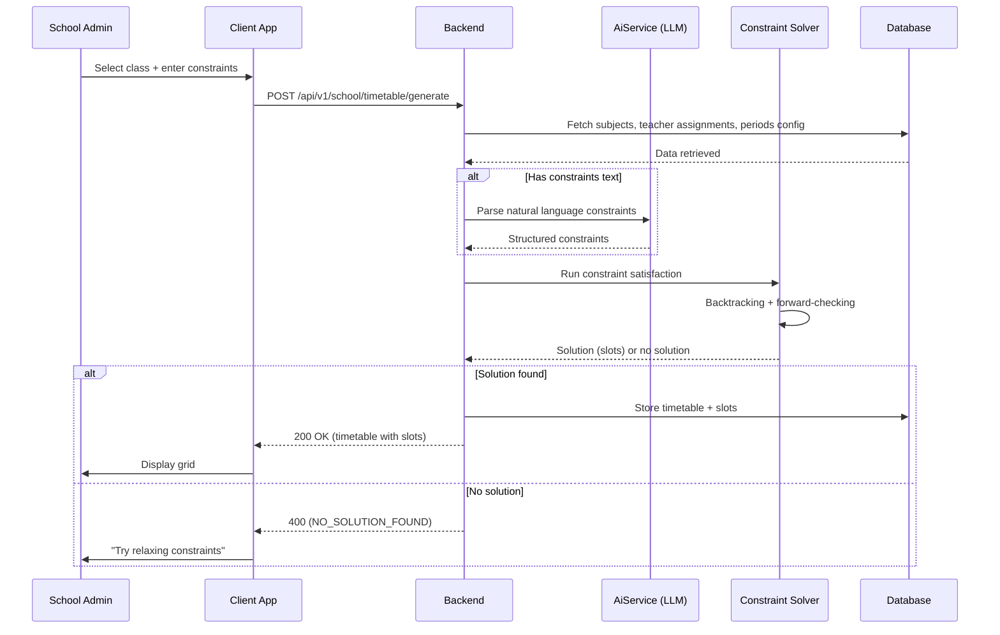
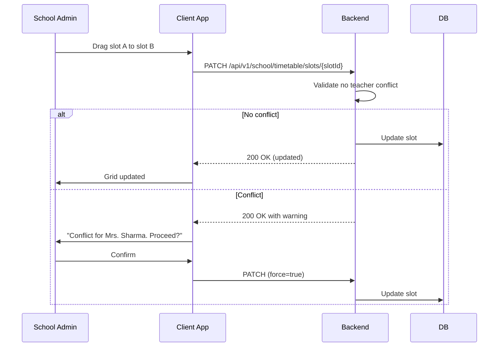
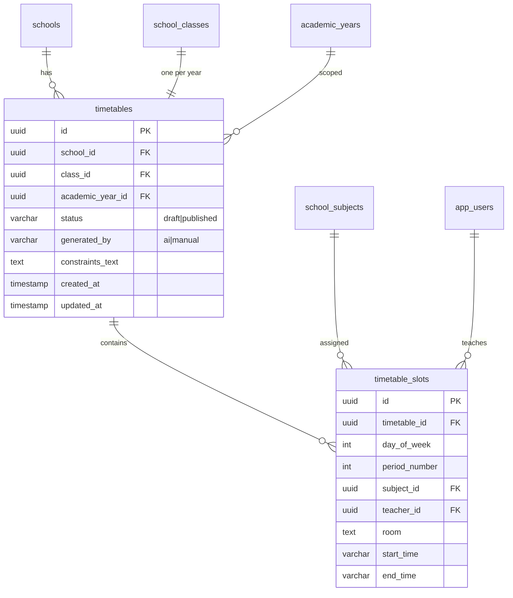

# AI Timetable Auto-Generator — Technical Specification

> **Document status:** Implementation-ready blueprint
> **Last updated:** 2026-06-27
> **Prerequisites:** `AI_INFRASTRUCTURE_SPEC.md`
> **Template:** `_SPEC_TEMPLATE.md` v1 (25 mandatory + 6 optional sections)

---

## 1. Feature Overview

AI-powered timetable generation that creates optimized class schedules considering teacher availability, subject priorities, room constraints, and no-conflict guarantees. Uses constraint satisfaction + LLM for natural language preferences.

### Goals

- Generate conflict-free timetable for all classes in a school
- Respect teacher availability (no double-booking)
- Optimize subject distribution (no 2 consecutive Math periods)
- Support constraints: teacher preferences, room availability, lunch breaks
- LLM interprets natural language constraints ("Don't schedule PE after lunch")
- Manual override after generation

### Non-goals

- [ ] Real-time timetable changes with instant notification (future enhancement)
- [ ] Multi-school timetable optimization (per-school only)
- [ ] Teacher workload balancing across schools (single school scope)
- [ ] Automated substitute teacher assignment (separate feature)

### Dependencies

- `AI_INFRASTRUCTURE_SPEC.md` — `AiService` for LLM constraint parsing
- `TeacherPeriodsTable` + `PeriodExceptionsTable` — existing teacher schedule tracking
- `SchoolClassesTable` + `SchoolSubjectsTable` + `TeacherSubjectAssignmentsTable` — class/subject/teacher mapping

### Related Modules

- `server/.../feature/ai/AiService.kt` — shared AI service
- `server/.../db/Tables.kt` — existing teacher/class/subject tables
- `EXAM_TIMETABLE_SPEC.md` — exam timetable (separate from weekly timetable)

---

## 2. Current System Assessment

### Existing Code

- `TeacherPeriodsTable` + `PeriodExceptionsTable` — existing teacher schedule tracking
- `SchoolClassesTable` + `SchoolSubjectsTable` + `TeacherSubjectAssignmentsTable` — class/subject/teacher mapping
- No timetable generation exists
- `feature_audit.csv` L125: Exam Timetable missing; no weekly timetable either

### Existing Database

- `TeacherPeriodsTable` — teacher availability per period
- `PeriodExceptionsTable` — teacher exceptions (leaves, special availability)
- `SchoolClassesTable` — class definitions
- `SchoolSubjectsTable` — subject definitions per school
- `TeacherSubjectAssignmentsTable` — which teacher teaches which subject for which class
- `AcademicYearsTable` — academic year definitions

### Existing APIs

- `GET /api/v1/school/classes` — class management
- `GET /api/v1/school/subjects` — subject management
- `GET /api/v1/school/teachers` — teacher management
- No timetable APIs exist

### Existing UI

- No timetable UI exists
- Class/subject/teacher management screens exist

### Existing Services

- `ClassService` — class management
- `SubjectService` — subject management
- `AiService` — shared AI service (per `AI_INFRASTRUCTURE_SPEC.md`)

### Existing Documentation

- `feature_audit.csv` L125 references missing timetable
- `AI_INFRASTRUCTURE_SPEC.md` — AI service specification

### Technical Debt

| # | Gap | Details |
|---|---|---|
| TD-1 | No weekly timetable | Schools create timetables manually |
| TD-2 | No conflict detection | Teacher double-booking not prevented |
| TD-3 | No constraint-based generation | No optimization of subject distribution |

### Gaps

| # | Gap | Impact | Severity |
|---|---|---|---|
| G1 | No timetable generation | Manual, error-prone process | **High** |
| G2 | No conflict detection | Teachers double-booked | **High** |
| G3 | No constraint support | Preferences not respected | **Medium** |
| G4 | No PDF export | Cannot share printable timetable | **Medium** |

---

## 3. Functional Requirements

### FR-001
| Field | Value |
|---|---|
| **Title** | Weekly Timetable Generation |
| **Description** | Generate weekly timetable for all classes given: subjects, teacher assignments, periods per day, working days |
| **Priority** | Critical |
| **User Roles** | School Admin |
| **Acceptance notes** | All classes get conflict-free timetables |

### FR-002
| Field | Value |
|---|---|
| **Title** | No Teacher Double-Booking |
| **Description** | No teacher double-booked in same period |
| **Priority** | Critical |
| **User Roles** | System |
| **Acceptance notes** | Constraint satisfaction algorithm guarantees zero conflicts |

### FR-003
| Field | Value |
|---|---|
| **Title** | Subject Distribution |
| **Description** | Subject distribution: max 1 period per subject per day (configurable) |
| **Priority** | High |
| **User Roles** | System |
| **Acceptance notes** | Configurable max periods per subject per day |

### FR-004
| Field | Value |
|---|---|
| **Title** | Natural Language Constraints |
| **Description** | Support natural language constraints via LLM parsing |
| **Priority** | Medium |
| **User Roles** | School Admin |
| **Acceptance notes** | LLM parses free-text constraints into structured rules |

### FR-005
| Field | Value |
|---|---|
| **Title** | Manual Override |
| **Description** | Manual override: admin can drag-and-drop swap periods |
| **Priority** | High |
| **User Roles** | School Admin |
| **Acceptance notes** | Swap preserves conflict-free guarantee or warns of conflicts |

### FR-006
| Field | Value |
|---|---|
| **Title** | Single Class Regeneration |
| **Description** | Regenerate single class without affecting others |
| **Priority** | Medium |
| **User Roles** | School Admin |
| **Acceptance notes** | Only target class regenerated; others unchanged |

### FR-007
| Field | Value |
|---|---|
| **Title** | Export Timetable |
| **Description** | Export timetable as PDF and image |
| **Priority** | Medium |
| **User Roles** | School Admin, Teacher, Parent |
| **Acceptance notes** | PDF and image export for printing/sharing |

---

## 4. User Stories

### School Admin
- [ ] Generate timetable for a class with natural language constraints
- [ ] Generate timetables for all classes at once
- [ ] Manually swap periods via drag-and-drop
- [ ] Regenerate single class timetable without affecting others
- [ ] Publish timetable for teachers and parents to view
- [ ] Export timetable as PDF

### Teacher
- [ ] View my weekly timetable
- [ ] See which class and subject I teach in each period
- [ ] Export my timetable as PDF

### Parent
- [ ] View my child's class timetable
- [ ] Export timetable as PDF

### System
- [ ] Fetch subjects, teacher assignments, and period config
- [ ] Parse natural language constraints via LLM
- [ ] Run constraint satisfaction algorithm (backtracking + heuristics)
- [ ] Verify no teacher conflicts
- [ ] Store timetable and slots
- [ ] Generate PDF export

---

## 5. Business Rules

### BR-001
**Rule:** No teacher can be scheduled for two classes in the same period.
**Enforcement:** Constraint satisfaction algorithm checks teacher availability per period.

### BR-002
**Rule:** Max 1 period per subject per day (configurable per school).
**Enforcement:** Algorithm enforces subject distribution constraint; configurable via `AppConfigTable`.

### BR-003
**Rule:** Timetable status starts as `draft`; admin must explicitly publish.
**Enforcement:** `timetables.status` defaults to `draft`; `POST /timetable/{id}/publish` changes to `published`.

### BR-004
**Rule:** Natural language constraints are parsed by LLM into structured rules before generation.
**Enforcement:** `ConstraintParser` calls `AiService` to convert free-text to structured constraints.

### BR-005
**Rule:** Manual override (swap) must not create teacher conflicts.
**Enforcement:** Swap validates no teacher conflict; warns admin if conflict would be created.

### BR-006
**Rule:** Regenerating one class does not affect other classes' timetables.
**Enforcement:** Generation scoped to single `class_id`; other timetables untouched.

### BR-007
**Rule:** One timetable per (school, class, academic_year).
**Enforcement:** UNIQUE constraint on `timetables(school_id, class_id, academic_year_id)`.

---

## 6. Database Design

### 6.1 Entity Relationship Summary

Two new tables: `timetables` (one per class per academic year) and `timetable_slots` (individual period assignments). FKs to `schools`, `classes`, `academic_years`, `school_subjects`, `app_users` (teacher).

### 6.2 New Tables

```sql
CREATE TABLE timetables (
    id              UUID PRIMARY KEY DEFAULT gen_random_uuid(),
    school_id       UUID NOT NULL,
    class_id        UUID NOT NULL,
    academic_year_id UUID NOT NULL,
    status          VARCHAR(16) NOT NULL DEFAULT 'draft', -- draft | published
    generated_by    VARCHAR(16) NOT NULL DEFAULT 'ai',    -- ai | manual
    constraints_text TEXT,                                -- natural language constraints
    created_at      TIMESTAMP NOT NULL DEFAULT now(),
    updated_at      TIMESTAMP NOT NULL DEFAULT now(),
    UNIQUE(school_id, class_id, academic_year_id)
);

CREATE TABLE timetable_slots (
    id              UUID PRIMARY KEY DEFAULT gen_random_uuid(),
    timetable_id    UUID NOT NULL REFERENCES timetables(id) ON DELETE CASCADE,
    day_of_week     INTEGER NOT NULL,            -- 1=Mon, 7=Sun
    period_number   INTEGER NOT NULL,
    subject_id      UUID,                        -- FK school_subjects.id
    teacher_id      UUID,                        -- FK app_users.id
    room            TEXT,
    start_time      VARCHAR(8),                  -- "09:00"
    end_time        VARCHAR(8),                  -- "09:45"
    UNIQUE(timetable_id, day_of_week, period_number)
);
```

### 6.3 Modified Tables

N/A — no existing tables modified.

### 6.4 Indexes

```sql
CREATE INDEX idx_tt_slots_teacher ON timetable_slots(teacher_id, day_of_week, period_number);
```

### 6.5 Constraints

- `timetables.school_id` — NOT NULL
- `timetables.class_id` — NOT NULL
- `timetables.academic_year_id` — NOT NULL
- `timetables.status` — NOT NULL, DEFAULT `draft`
- `timetables.generated_by` — NOT NULL, DEFAULT `ai`
- UNIQUE: `(school_id, class_id, academic_year_id)`
- `timetable_slots.timetable_id` — NOT NULL, FK with ON DELETE CASCADE
- `timetable_slots.day_of_week` — NOT NULL (1-7)
- `timetable_slots.period_number` — NOT NULL
- UNIQUE: `(timetable_id, day_of_week, period_number)`

### 6.6 Foreign Keys

- `timetables.school_id` → `schools.id` (ON DELETE CASCADE)
- `timetables.class_id` → `school_classes.id` (ON DELETE CASCADE)
- `timetables.academic_year_id` → `academic_years.id` (ON DELETE CASCADE)
- `timetable_slots.timetable_id` → `timetables.id` (ON DELETE CASCADE)
- `timetable_slots.subject_id` → `school_subjects.id` (nullable, ON DELETE SET NULL)
- `timetable_slots.teacher_id` → `app_users.id` (nullable, ON DELETE SET NULL)

### 6.7 Soft Delete Strategy

N/A — timetables are replaced (upserted) on regeneration. Old slots deleted via CASCADE.

### 6.8 Audit Fields

- `created_at` — timetable creation timestamp
- `updated_at` — last modification (slot swap, publish, regenerate)
- `generated_by` — `ai` or `manual`
- `constraints_text` — natural language constraints used for generation

### 6.9 Migration Notes

Migration: `docs/db/migration_041_ai_timetable.sql`
- Creates `timetables` and `timetable_slots` tables with indexes
- No data backfill needed

### 6.10 Exposed Mappings

```kotlin
object TimetablesTable : UUIDTable("timetables", "id") {
    val schoolId       = uuid("school_id")
    val classId        = uuid("class_id")
    val academicYearId = uuid("academic_year_id")
    val status         = varchar("status", 16) // draft | published
    val generatedBy    = varchar("generated_by", 16) // ai | manual
    val constraintsText = text("constraints_text").nullable()
    val createdAt      = timestamp("created_at")
    val updatedAt      = timestamp("updated_at")
    init {
        uniqueIndex("ux_timetable_unique", schoolId, classId, academicYearId)
    }
}

object TimetableSlotsTable : UUIDTable("timetable_slots", "id") {
    val timetableId  = uuid("timetable_id")
    val dayOfWeek    = integer("day_of_week")
    val periodNumber = integer("period_number")
    val subjectId    = uuid("subject_id").nullable()
    val teacherId    = uuid("teacher_id").nullable()
    val room         = text("room").nullable()
    val startTime    = varchar("start_time", 8).nullable()
    val endTime      = varchar("end_time", 8).nullable()
    init {
        uniqueIndex("ux_slot_unique", timetableId, dayOfWeek, periodNumber)
        index("idx_tt_slots_teacher", false, teacherId, dayOfWeek, periodNumber)
    }
}
```

### 6.11 Seed Data

N/A — no seed data. Timetables generated on demand.

---

## 7. State Machines

### Timetable Generation State Machine

```
REQUESTED ──> FETCH_DATA ──> PARSE_CONSTRAINTS ──> RUN_ALGORITHM ──> VERIFY_CONFLICTS ──> STORE ──> COMPLETE
PARSE_CONSTRAINTS ──> NO_CONSTRAINTS ──> RUN_ALGORITHM
RUN_ALGORITHM ──> NO_SOLUTION ──> RELAX_CONSTRAINTS ──> RUN_ALGORITHM
RUN_ALGORITHM ──> NO_SOLUTION ──> RETURN_ERROR
VERIFY_CONFLICTS ──> CONFLICTS_FOUND ──> RUN_ALGORITHM
```

| Current State | Event | Next State | Guard / Condition |
|---|---|---|---|
| `requested` | Start generation | `fetch_data` | — |
| `fetch_data` | Data retrieved | `parse_constraints` | — |
| `parse_constraints` | Constraints text provided | `run_algorithm` | LLM parses to structured rules |
| `parse_constraints` | No constraints text | `run_algorithm` | Skip LLM call |
| `run_algorithm` | Solution found | `verify_conflicts` | — |
| `run_algorithm` | No solution found | `relax_constraints` | Try relaxing non-critical constraints |
| `relax_constraints` | Relaxed | `run_algorithm` | Retry with fewer constraints |
| `relax_constraints` | Cannot relax further | `return_error` | Report unsolvable |
| `verify_conflicts` | No conflicts | `store` | — |
| `verify_conflicts` | Conflicts found | `run_algorithm` | Regenerate |
| `store` | Stored in DB | `complete` | — |

### Timetable Lifecycle State Machine

```
DRAFT ──publish──> PUBLISHED
DRAFT ──regenerate──> DRAFT (new generation)
PUBLISHED ──regenerate──> DRAFT (new generation)
PUBLISHED ──swap_slot──> PUBLISHED (modified)
```

| Current State | Event | Next State | Guard / Condition |
|---|---|---|---|
| `draft` | Admin publishes | `published` | — |
| `draft` | Regenerate | `draft` | New generation replaces old |
| `published` | Regenerate | `draft` | New generation; status reset to draft |
| `published` | Slot swap (no conflict) | `published` | Swap valid |
| `published` | Slot swap (conflict) | `published` | Warning shown; admin confirms |

---

## 8. Backend Architecture

### 8.1 Component Overview

New `TimetableGeneratorService` handles generation with constraint satisfaction algorithm. `ConstraintParser` uses LLM to parse natural language constraints. `TimetableRouting` exposes API endpoints.

### 8.2 Design Principles

1. **Constraint satisfaction first** — Core algorithm is backtracking, not LLM
2. **LLM for parsing only** — LLM converts natural language to structured rules
3. **Conflict-free guarantee** — Algorithm verifies zero teacher conflicts
4. **Manual override** — Admin can swap after generation
5. **Per-class scoping** — Regeneration doesn't affect other classes

### 8.3 Core Types

```kotlin
class TimetableGeneratorService(private val aiService: AiService) {
    suspend fun generate(
        schoolId: UUID, classId: UUID, academicYearId: UUID, constraints: String?
    ): TimetableDto {
        // 1. Fetch: subjects for class, teacher assignments, periods config
        // 2. If natural language constraints, use LLM to parse into structured rules
        // 3. Run constraint satisfaction algorithm (backtracking + heuristics)
        // 4. Verify no conflicts (teacher double-booking)
        // 5. Store timetable + slots
        // 6. Return generated timetable
    }
}
```

### 8.4 Constraint Satisfaction

Core algorithm (not LLM — LLM only parses natural language):
- Backtracking with forward-checking
- Variables: (day, period) → (subject, teacher)
- Constraints: no teacher conflict, subject distribution, room availability
- Heuristics: most-constrained-first (subjects with fewest available teachers scheduled first)

### 8.5 Constraint Parser (LLM)

```kotlin
class ConstraintParser(private val aiService: AiService) {
    suspend fun parse(constraintsText: String): List<StructuredConstraint> {
        // Call AiService with "timetable_constraint_parse" template
        // LLM converts: "Don't schedule PE after lunch" →
        //   {type: "subject_not_after", subject: "PE", after_period: 4}
    }
}
```

### 8.6 Repositories

- `TimetableRepository` — CRUD for `timetables` table
- `TimetableSlotRepository` — CRUD for `timetable_slots` table

### 8.7 Mappers

- `TimetableMapper` — maps DB rows to `TimetableDto` with slots

### 8.8 Permission Checks

- Generate: school admin only
- View: school admin, teacher (own timetable), parent (child's class timetable)
- Swap: school admin only
- Publish: school admin only
- Export: all roles can export viewable timetables

### 8.9 Background Jobs

N/A — timetable generation is synchronous (completes within request timeout). For very large schools, could be made async via `AiJobsTable`.

### 8.10 Domain Events

- `TimetableGenerated` — emitted when timetable is generated
- `TimetablePublished` — emitted when admin publishes timetable
- `TimetableSlotSwapped` — emitted when admin swaps slots

### 8.11 Caching

N/A — timetable is stored in DB. No in-memory cache needed.

### 8.12 Transactions

- Generation: DELETE old slots + INSERT new slots in single transaction
- Swap: UPDATE two slots in single transaction
- Publish: UPDATE status in single transaction

---

## 9. API Contracts

### 9.1 Generate Timetable

```
POST /api/v1/school/timetable/generate
{
  "class_id": "uuid",
  "constraints": "Don't schedule Mathematics in the last period. PE should be after lunch."
}
```

**Response 200:**
```json
{
  "success": true,
  "data": {
    "id": "uuid",
    "class_id": "uuid",
    "status": "draft",
    "generated_by": "ai",
    "slots": [
      {"day": 1, "period": 1, "subject": "Mathematics", "teacher": "Mrs. Sharma", "room": "101", "start_time": "09:00", "end_time": "09:45"},
      {"day": 1, "period": 2, "subject": "Science", "teacher": "Mr. Patel", "room": "101", "start_time": "09:45", "end_time": "10:30"}
    ]
  }
}
```

### 9.2 Get Timetable

```
GET /api/v1/school/timetable/{classId}
```

### 9.3 Swap Slots (Manual Override)

```
PATCH /api/v1/school/timetable/slots/{slotId}
{
  "subject_id": "uuid",
  "teacher_id": "uuid",
  "room": "102"
}
```

### 9.4 Publish Timetable

```
POST /api/v1/school/timetable/{id}/publish
```

### 9.5 Export PDF

```
GET /api/v1/school/timetable/{id}/pdf
```

**Response 200:** File download (`Content-Type: application/pdf`)

---

## 10. Frontend Architecture

### 10.1 Screens

| Screen | Platform | Role | Description |
|---|---|---|---|
| `TimetableScreen` | All | School Admin | Timetable grid with generate, swap, publish |
| `TimetableViewScreen` | All | Teacher, Parent | Read-only timetable view |
| `TimetableExportButton` | All | All roles | Export as PDF/image |

### 10.2 Navigation

- Admin portal → Academics → Timetable → `TimetableScreen`
- Teacher portal → My Schedule → `TimetableViewScreen`
- Parent portal → Academics → Class Timetable → `TimetableViewScreen`

### 10.3 UX Flows

#### Generate Timetable

1. Admin navigates to Academics → Timetable
2. Selects class
3. Optional: enters natural language constraints
4. Clicks "Generate"
5. Loading indicator: "Generating timetable..."
6. Grid populated with generated slots
7. Admin reviews, can swap via drag-and-drop
8. Clicks "Publish" to make visible to teachers/parents

#### Manual Swap

1. Admin clicks on a slot in the grid
2. Drags to another slot (or clicks swap)
3. System validates no teacher conflict
4. If conflict: warning dialog "This creates a conflict for Mrs. Sharma. Proceed?"
5. If no conflict: swap applied; grid updated

### 10.4 State Management

```kotlin
data class TimetableState(
    val timetable: TimetableDto?,
    val isLoading: Boolean,
    val isGenerating: Boolean,
    val isSwapping: Boolean,
    val error: String?,
    val selectedClassId: UUID?,
    val constraintsText: String,
)
```

### 10.5 Offline Support

N/A — timetable generation requires server. Published timetables can be cached for offline viewing.

### 10.6 Loading States

- Generating: "Generating timetable..." with spinner
- Loading: skeleton grid
- Swapping: "Applying swap..." with spinner

### 10.7 Error Handling (UI)

- Generation failed: "Could not generate timetable. Please try again or adjust constraints."
- No solution: "No valid timetable found with current constraints. Try relaxing constraints."
- Swap conflict: "This swap creates a teacher conflict. Proceed anyway?"
- Permission denied: "You don't have permission to modify timetables."

### 10.8 Component Integration Guidelines

| Rule | Description |
|---|---|
| **R1** | Timetable grid: rows = periods, columns = days |
| **R2** | Color-coded by subject for visual clarity |
| **R3** | Drag-and-drop for slot swapping (admin only) |
| **R4** | PDF export button in top-right |
| **R5** | Constraints text field with placeholder examples |

---

## 11. Shared Module Changes (KMP)

### 11.1 DTOs

```kotlin
data class TimetableDto(
    val id: UUID,
    val classId: UUID,
    val academicYearId: UUID,
    val status: String, // draft | published
    val generatedBy: String, // ai | manual
    val constraintsText: String?,
    val slots: List<TimetableSlotDto>,
    val createdAt: Instant,
    val updatedAt: Instant,
)

data class TimetableSlotDto(
    val id: UUID,
    val dayOfWeek: Int,
    val periodNumber: Int,
    val subjectId: UUID?,
    val subjectName: String?,
    val teacherId: UUID?,
    val teacherName: String?,
    val room: String?,
    val startTime: String?,
    val endTime: String?,
)

data class GenerateTimetableRequest(
    val classId: UUID,
    val constraints: String?,
)
```

### 11.2 Domain Models

```kotlin
data class Timetable(
    val id: UUID,
    val schoolId: UUID,
    val classId: UUID,
    val academicYearId: UUID,
    val status: TimetableStatus,
    val generatedBy: GenerationMethod,
    val constraintsText: String?,
    val slots: List<TimetableSlot>,
    val createdAt: Instant,
    val updatedAt: Instant,
)
```

### 11.3 Repository Interfaces

```kotlin
interface TimetableRepository {
    suspend fun get(schoolId: UUID, classId: UUID): TimetableDto?
    suspend fun insert(timetable: TimetableEntity): UUID
    suspend fun updateSlot(slotId: UUID, subjectId: UUID?, teacherId: UUID?, room: String?): Unit
    suspend fun publish(timetableId: UUID): Unit
}
```

### 11.4 UseCases

- `GenerateTimetableUseCase`
- `GetTimetableUseCase`
- `SwapTimetableSlotUseCase`
- `PublishTimetableUseCase`
- `ExportTimetablePdfUseCase`

### 11.5 Validation

- Class ID: must be valid UUID
- Day of week: 1-7
- Period number: positive integer
- Constraints text: max 1000 characters

### 11.6 Serialization

Standard Kotlinx serialization for DTOs.

### 11.7 Network APIs

Added to `TimetableApi.kt`:
- `POST /api/v1/school/timetable/generate` — generate
- `GET /api/v1/school/timetable/{classId}` — get
- `PATCH /api/v1/school/timetable/slots/{slotId}` — swap
- `POST /api/v1/school/timetable/{id}/publish` — publish
- `GET /api/v1/school/timetable/{id}/pdf` — export PDF

### 11.8 Database Models (Local Cache)

Published timetables can be cached locally for offline viewing. Draft timetables are server-only.

---

## 12. Permissions Matrix

| Action | Super Admin | School Admin | Teacher | Parent |
|---|---|---|---|---|
| Generate timetable | ✅ | ✅ | ❌ | ❌ |
| View own class timetable | ✅ | ✅ | ✅ | ✅ |
| View all class timetables | ✅ | ✅ | ❌ | ❌ |
| Swap slots | ✅ | ✅ | ❌ | ❌ |
| Publish timetable | ✅ | ✅ | ❌ | ❌ |
| Export PDF | ✅ | ✅ | ✅ | ✅ |
| Regenerate single class | ✅ | ✅ | ❌ | ❌ |

---

## 13. Notifications

### Timetable-Related Notifications

| Type | Trigger | Channel | Message |
|---|---|---|---|
| Timetable Published | Admin publishes timetable | In-app + Push | "Timetable for {className} has been published. View now." |
| Timetable Regenerated | Admin regenerates timetable | In-app | "Timetable for {className} has been updated." |
| Generation Failed | Algorithm cannot find solution | In-app (admin) | "Could not generate timetable for {className}. Try adjusting constraints." |

---

## 14. Background Jobs

N/A — timetable generation is synchronous. For very large schools (>50 classes), batch generation could be implemented as a background job via `AiJobsTable` in the future.

---

## 15. Integrations

### AiService (Shared)
| Field | Value |
|---|---|
| **System** | AiService (per `AI_INFRASTRUCTURE_SPEC.md`) |
| **Purpose** | LLM for natural language constraint parsing only |
| **API / SDK** | `AiService.complete()` |
| **Auth method** | Internal service call |
| **Fallback** | Skip LLM parsing if unavailable; use only structured constraints |

### TeacherPeriodsTable
| Field | Value |
|---|---|
| **System** | Existing teacher schedule tracking |
| **Purpose** | Fetch teacher availability per period |
| **API / SDK** | Direct DB query |
| **Auth method** | Internal |
| **Fallback** | None — teacher availability is required input |

### TeacherSubjectAssignmentsTable
| Field | Value |
|---|---|
| **System** | Existing class/subject/teacher mapping |
| **Purpose** | Fetch which teachers can teach which subjects for which classes |
| **API / SDK** | Direct DB query |
| **Auth method** | Internal |
| **Fallback** | None — assignments are required input |

---

## 16. Security

### Authentication
- All API endpoints require valid JWT
- Generate/swap/publish endpoints require school admin role
- View endpoints accessible by teacher and parent (scoped)

### Authorization
- School admin: full access to timetable management
- Teacher: can view own timetable only
- Parent: can view child's class timetable only

### Encryption
- Timetable data is non-sensitive (class schedules)
- LLM API calls use TLS (handled by `AiService`)
- PDF export generated server-side

### Audit Logs
- Timetable generation logged via `AuditService` (action: `CREATE`, entity: `timetable`)
- Slot swap logged (action: `UPDATE`, entity: `timetable_slot`)
- Publish logged (action: `UPDATE`, entity: `timetable`, field: `status`)

### PII Handling
- Teacher names included in timetable (non-sensitive)
- No PII sent to LLM (only subject names and constraint text)

### Data Isolation
- All queries filtered by `school_id` from JWT
- Teacher queries scoped to own assignments
- Parent queries scoped to child's class

### Rate Limiting
- Generation: 1 request per class per minute (prevent abuse)
- Standard API rate limiting for other endpoints

### Input Validation
- Class ID: must be valid UUID
- Constraints text: max 1000 characters
- Slot swap: subject_id and teacher_id must be valid UUIDs

---

## 17. Performance & Scalability

### Expected Scale

| Metric | 1 class (8 periods x 5 days) | 10 classes | 50 classes |
|---|---|---|---|
| Generation time (no constraints) | < 1s | ~10s | ~50s |
| Generation time (with LLM constraints) | < 3s | ~30s | ~2.5 min |
| Slot count | 40 | 400 | 2,000 |

### Latency Targets

| Operation | Target |
|---|---|
| Generate (no constraints) | < 2s |
| Generate (with LLM constraints) | < 5s |
| Get timetable | < 100ms |
| Swap slot | < 100ms |
| Publish | < 50ms |
| PDF export | < 3s |

### Optimization Strategy

- Constraint satisfaction: backtracking with forward-checking (efficient for typical school size)
- Most-constrained-first heuristic reduces backtracking
- LLM called once per generation (not per slot)
- PDF generation: server-side rendering with caching

---

## 18. Edge Cases

| # | Scenario | Expected Behavior |
|---|---|---|
| EC-001 | No teachers assigned to a subject | Slot left empty; warning returned |
| EC-002 | Teacher unavailable for all periods | Subject cannot be scheduled; warning |
| EC-003 | Too many subjects for available periods | Algorithm prioritizes core subjects; warning |
| EC-004 | LLM cannot parse constraints | Use raw text as comment; skip structured parsing |
| EC-005 | No solution found with constraints | Return error; suggest relaxing constraints |
| EC-006 | Swap creates teacher conflict | Warning shown; admin can confirm or cancel |
| EC-007 | Class has no subjects assigned | Return error: "No subjects assigned to this class" |
| EC-008 | Regeneration while published | Status reset to draft; teachers/parents see old until re-published |

### Risks & Mitigations

| Risk | Likelihood | Impact | Mitigation |
|---|---|---|---|
| Algorithm too slow for large schools | Medium | Medium | Async job for >50 classes; timeout at 30s |
| LLM misparses constraints | Medium | Low | Admin reviews generated timetable before publish |
| Teacher assignments incomplete | Medium | Medium | Warning returned; admin must fix assignments |
| PDF export fails | Low | Low | Fallback to HTML view; retry |

---

## 19. Error Handling

### Standard Error Codes

| HTTP | Error Code | Description | When |
|---|---|---|---|
| 400 | `NO_SUBJECTS_ASSIGNED` | Class has no subjects assigned | Generation |
| 400 | `NO_TEACHER_ASSIGNED` | Subject has no teacher assigned | Generation |
| 400 | `NO_SOLUTION_FOUND` | Constraint satisfaction algorithm failed | Generation |
| 403 | `INSUFFICIENT_PERMISSIONS` | Non-admin attempting generate/swap/publish | Any admin endpoint |
| 404 | `TIMETABLE_NOT_FOUND` | No timetable for class | Get |
| 500 | `LLM_PARSE_ERROR` | LLM failed to parse constraints | Generation |
| 500 | `PDF_GENERATION_ERROR` | PDF export failed | Export |

### Error Response Format

Same as existing API error format.

### Recovery Strategy

| Error | Client Action | Server Action |
|---|---|---|
| `NO_SOLUTION_FOUND` | Show "Try relaxing constraints" | Return 400 with suggestions |
| `LLM_PARSE_ERROR` | Show "Constraints could not be parsed" | Continue without LLM constraints |
| `PDF_GENERATION_ERROR` | Show "Export failed, try again" | Return 500; log error |

---

## 20. Analytics & Reporting

### Reports

- **Timetable Generation Report:** Number of timetables generated, by AI vs manual
- **Constraint Usage Report:** Which natural language constraints are most common
- **Swap Report:** Number of manual overrides after AI generation

### KPIs

- **Generation Success Rate:** % of generations that find a solution
- **Manual Override Rate:** % of AI timetables with manual swaps
- **Average Generation Time:** Mean time to generate
- **LLM Constraint Parse Rate:** % of constraints successfully parsed

### Dashboards

N/A — admin views timetables directly.

### Exports

- PDF export of timetable (per class)
- Image export of timetable (per class)

---

## 21. Testing Strategy

### Unit Tests

| Test | What it verifies |
|---|---|
| Constraint satisfaction: no teacher conflicts | Zero double-bookings |
| Subject distribution: max 1 per day | Distribution rule enforced |
| Most-constrained-first heuristic | Subjects with fewest teachers scheduled first |
| Forward-checking | Prunes invalid assignments early |
| LLM constraint parser | Natural language → structured rules |
| Slot swap validation | Conflict detection on swap |

### Integration Tests

| Test | What it verifies |
|---|---|
| Generate → store → retrieve → correct slots | Full flow |
| Generate with constraints → constraints applied | LLM + algorithm |
| Swap slot → no conflict → updated | Manual override |
| Swap slot → conflict → warning | Conflict detection |
| Publish → status changed → visible to teacher/parent | Publish flow |
| Regenerate → old slots replaced | Regeneration |
| PDF export → valid PDF | Export |

### Performance Tests

- [ ] Generate 1 class < 2s (no constraints)
- [ ] Generate 1 class < 5s (with LLM constraints)
- [ ] Generate 10 classes < 30s
- [ ] PDF export < 3s

### Security Tests

- [ ] Non-admin cannot generate
- [ ] Non-admin cannot swap
- [ ] Non-admin cannot publish
- [ ] Teacher can only view own timetable
- [ ] Parent can only view child's class timetable

### Migration Tests

- [ ] Migration creates tables with correct schema
- [ ] Indexes created correctly
- [ ] Unique constraints enforced

---

## 22. Acceptance Criteria

- [ ] Generated timetable has zero teacher conflicts
- [ ] Subject distribution rules respected
- [ ] Natural language constraints parsed and applied
- [ ] Manual override (swap periods) works
- [ ] Export as PDF
- [ ] Regeneration for single class doesn't affect others
- [ ] Teacher can view own timetable
- [ ] Parent can view child's class timetable
- [ ] Publish makes timetable visible to teachers and parents

---

## 23. Implementation Roadmap

| Phase | Duration | Tasks | Breaking? | Deliverable |
|---|---|---|---|---|
| 1 | 1 day | DB migration, Exposed tables | No | Schema ready |
| 2 | 3 days | Constraint satisfaction algorithm | No | Core generator |
| 3 | 1 day | LLM constraint parsing | No | Natural language support |
| 4 | 2 days | API endpoints + manual override | No | API available |
| 5 | 2 days | Client UI (timetable grid, drag-swap, PDF export) | No | UI ready |
| 6 | 1 day | Tests | No | Test coverage |

**Total: ~10 days**

---

## 24. File-Level Impact Analysis

### New Files

| File | Location | Purpose |
|---|---|---|
| `TimetableGeneratorService.kt` | `server/.../feature/timetable/` | Core generator with constraint satisfaction |
| `ConstraintParser.kt` | `server/.../feature/timetable/` | LLM constraint parsing |
| `TimetableRouting.kt` | `server/.../feature/timetable/` | API endpoints |
| `migration_041_ai_timetable.sql` | `docs/db/` | DDL migration |
| `TimetableApi.kt` | `shared/.../feature/timetable/` | Client API |
| `TimetableScreen.kt` | `composeApp/.../ui/v2/screens/admin/` | Admin timetable grid UI |
| `TimetableViewScreen.kt` | `composeApp/.../ui/v2/screens/` | Read-only view for teacher/parent |

### Modified Files

| File | Change Type | Lines Changed (est.) | Risk | Description |
|---|---|---|---|---|
| `server/.../db/Tables.kt` | Add | ~30 | Low | `TimetablesTable`, `TimetableSlotsTable` |
| `server/.../db/DatabaseFactory.kt` | Modify | ~4 | Low | Register tables |

### Files Preserved Unchanged

| File | Reason |
|---|---|
| `AiService.kt` | Used as-is per AI_INFRASTRUCTURE_SPEC |
| `TeacherPeriodsTable` | Read-only access |
| `TeacherSubjectAssignmentsTable` | Read-only access |

---

## 25. Future Enhancements

### Substitute Teacher Auto-Assignment

- When a teacher is absent, automatically find and assign available substitute
- Consider subject competency of substitutes
- Notify substitute teacher via push notification

### Multi-School Timetable Optimization

- Optimize timetables across multiple schools in same trust/group
- Share teachers across schools efficiently
- Cross-school conflict prevention

### Teacher Workload Balancing

- Ensure equitable distribution of teaching load across teachers
- Track total periods per teacher
- Flag overburdened teachers

### Student Preference-Based Scheduling

- Elective subject scheduling based on student preferences
- Multiple sections for same subject
- Optimized for maximum student satisfaction

### Timetable Versioning

- Keep history of timetable changes
- Compare versions side-by-side
- Rollback to previous version

### Smart Room Allocation

- Auto-assign rooms based on class size and room capacity
- Special rooms for specific subjects (lab for Science, playground for PE)
- Room conflict prevention

---

## A. Sequence Diagrams

### Timetable Generation Flow



### Manual Swap Flow



---

## B. Domain Model / ER Diagram



---

## C. Event Flow

```
GenerateRequested -> FetchData -> HasConstraints -> ParseConstraints -> RunAlgorithm -> VerifyConflicts -> Store -> Complete
GenerateRequested -> FetchData -> NoConstraints -> RunAlgorithm -> VerifyConflicts -> Store -> Complete
RunAlgorithm -> NoSolution -> RelaxConstraints -> RunAlgorithm
RunAlgorithm -> NoSolution -> ReturnError
SlotSwapRequested -> ValidateConflict -> NoConflict -> UpdateSlot -> Complete
SlotSwapRequested -> ValidateConflict -> ConflictFound -> WarnAdmin -> ConfirmForce -> UpdateSlot
PublishRequested -> UpdateStatus -> NotifyTeachers -> NotifyParents -> Complete
```

| Event | Emitted By | Consumed By | Side Effect |
|---|---|---|---|
| `TimetableGenerated` | `TimetableGeneratorService.generate()` | Analytics | Counter incremented |
| `TimetablePublished` | `TimetableRouting.publish()` | Notification service | Push to teachers and parents |
| `TimetableSlotSwapped` | `TimetableRouting.swapSlot()` | Audit | Audit log entry created |
| `TimetableGenerationFailed` | `TimetableGeneratorService` (catch block) | Analytics, Notification | Admin notified |

---

## D. Configuration

### Environment Variables

| Variable | Description |
|---|---|
| `AI_TIMETABLE_ENABLED` | Enable/disable feature (default: `true`) |
| `AI_TIMETABLE_MAX_PERIODS_PER_SUBJECT` | Max periods per subject per day (default: `1`) |
| `AI_TIMETABLE_GENERATION_TIMEOUT_MS` | Algorithm timeout (default: `30000`) |

### Feature Flags

| Flag | Default | Description |
|---|---|---|
| `ai_timetable_enabled` | `true` | Master switch for AI timetable |
| `ai_timetable_llm_constraints` | `true` | Enable LLM constraint parsing |
| `ai_timetable_pdf_export` | `true` | Enable PDF export |

### Client-Side Configuration

| Config | Default | Description |
|---|---|---|
| Grid color scheme | By subject | Color coding for timetable grid |
| Default view | Weekly | Grid view (weekly or daily) |

### Server-Side Configuration

| Config | Default | Description |
|---|---|---|
| Max periods per subject per day | 1 | Configurable distribution rule |
| Generation timeout | 30s | Algorithm timeout |
| LLM model | Per `AiService` config | Model for constraint parsing |
| Prompt template | `timetable_constraint_parse_v1` | Template version |
| Max constraints text length | 1000 chars | Max natural language constraints |

### Infrastructure Requirements

- `AiService` configured per `AI_INFRASTRUCTURE_SPEC.md`
- PDF generation library (server-side)
- Sufficient CPU for constraint satisfaction algorithm

---

## E. Migration & Rollback

### Deployment Plan

1. [ ] Run `migration_041_ai_timetable.sql` — creates tables + indexes
2. [ ] Deploy `TimetablesTable`, `TimetableSlotsTable` in `Tables.kt`
3. [ ] Register tables in `DatabaseFactory.kt`
4. [ ] Deploy `TimetableGeneratorService.kt`
5. [ ] Deploy `ConstraintParser.kt`
6. [ ] Deploy `TimetableRouting.kt`
7. [ ] Seed prompt template `timetable_constraint_parse_v1`
8. [ ] Deploy client UI
9. [ ] Test with mock data
10. [ ] Deploy to production

### Rollback Plan

1. [ ] Disable feature flag `ai_timetable_enabled` → API returns 404
2. [ ] Remove client UI → screens not shown
3. [ ] Database: `DROP TABLE IF EXISTS timetable_slots; DROP TABLE IF EXISTS timetables;`
4. [ ] No data loss — timetables are additive feature

### Data Backfill

N/A — timetables generated on demand. No backfill needed.

### Migration SQL

```sql
-- migration_041_ai_timetable.sql
CREATE TABLE IF NOT EXISTS timetables (
    id              UUID PRIMARY KEY DEFAULT gen_random_uuid(),
    school_id       UUID NOT NULL,
    class_id        UUID NOT NULL,
    academic_year_id UUID NOT NULL,
    status          VARCHAR(16) NOT NULL DEFAULT 'draft',
    generated_by    VARCHAR(16) NOT NULL DEFAULT 'ai',
    constraints_text TEXT,
    created_at      TIMESTAMP NOT NULL DEFAULT now(),
    updated_at      TIMESTAMP NOT NULL DEFAULT now(),
    UNIQUE(school_id, class_id, academic_year_id)
);

CREATE TABLE IF NOT EXISTS timetable_slots (
    id              UUID PRIMARY KEY DEFAULT gen_random_uuid(),
    timetable_id    UUID NOT NULL REFERENCES timetables(id) ON DELETE CASCADE,
    day_of_week     INTEGER NOT NULL,
    period_number   INTEGER NOT NULL,
    subject_id      UUID,
    teacher_id      UUID,
    room            TEXT,
    start_time      VARCHAR(8),
    end_time        VARCHAR(8),
    UNIQUE(timetable_id, day_of_week, period_number)
);

CREATE INDEX IF NOT EXISTS idx_tt_slots_teacher ON timetable_slots(teacher_id, day_of_week, period_number);

-- ROLLBACK:
-- DROP TABLE IF EXISTS timetable_slots;
-- DROP TABLE IF EXISTS timetables;
```

---

## F. Observability

### Logging

- Generation requested: INFO `timetable_generate_requested` (schoolId, classId, hasConstraints)
- Generation success: INFO `timetable_generated` (classId, slotCount, durationMs, generatedBy)
- Generation failed: WARN `timetable_generation_failed` (classId, reason, durationMs)
- LLM constraint parse: DEBUG `timetable_constraint_parsed` (constraintsText, parsedRules)
- LLM parse failed: WARN `timetable_constraint_parse_failed` (constraintsText, error)
- Slot swapped: INFO `timetable_slot_swapped` (slotId, oldTeacher, newTeacher, hadConflict)
- Timetable published: INFO `timetable_published` (timetableId, classId)
- PDF export: INFO `timetable_pdf_exported` (timetableId, fileSize, durationMs)

### Metrics

| Metric | Type | Description |
|---|---|---|
| `ai.timetable.generations_total` | Counter (by status) | Total generation attempts |
| `ai.timetable.generation_success_rate` | Gauge | % of successful generations |
| `ai.timetable.generation_latency_ms` | Histogram | Generation duration |
| `ai.timetable.llm_parse_total` | Counter | Total LLM constraint parse calls |
| `ai.timetable.llm_parse_failures` | Counter | LLM parse failures |
| `ai.timetable.slot_swaps_total` | Counter | Total manual swaps |
| `ai.timetable.swaps_with_conflict` | Counter | Swaps that created conflicts |
| `ai.timetable.pdf_exports_total` | Counter | Total PDF exports |

### Health Checks

- `GET /api/v1/health` — existing health check
- LLM provider availability (per `AI_INFRASTRUCTURE_SPEC.md`)

### Alerts

- Generation failure rate > 20% → Warning
- LLM parse failure rate > 30% → Warning
- Generation latency p95 > 10s → Warning (algorithm may need optimization)
- PDF export failure rate > 5% → Warning
