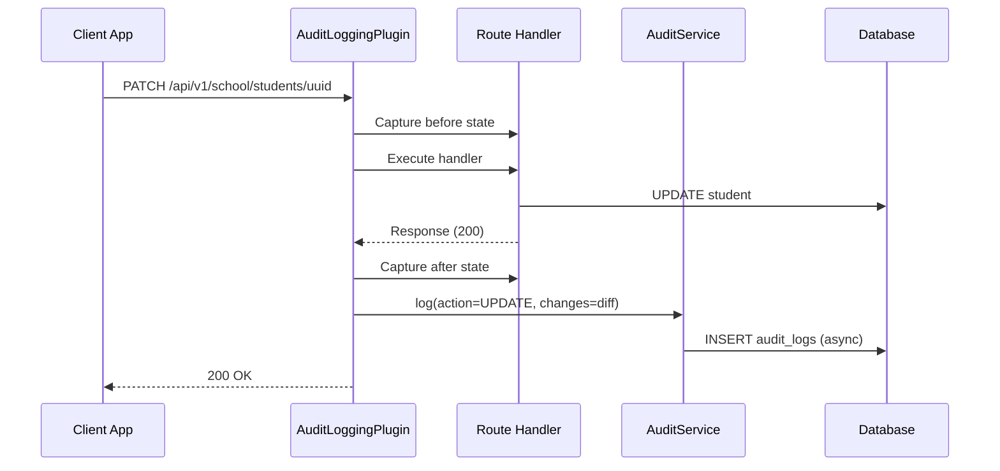
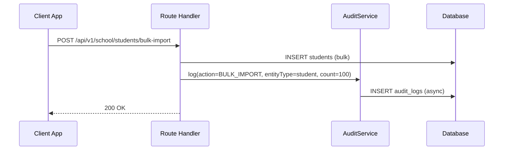
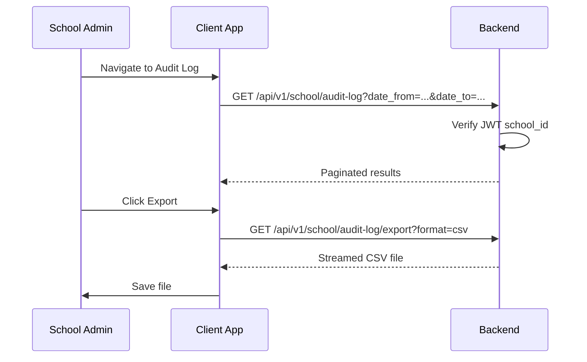
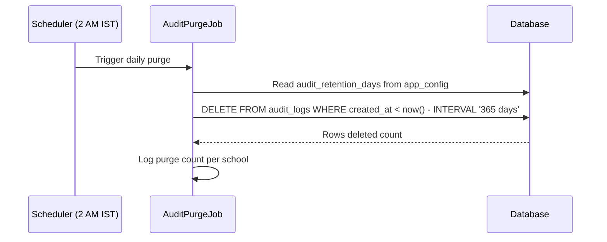
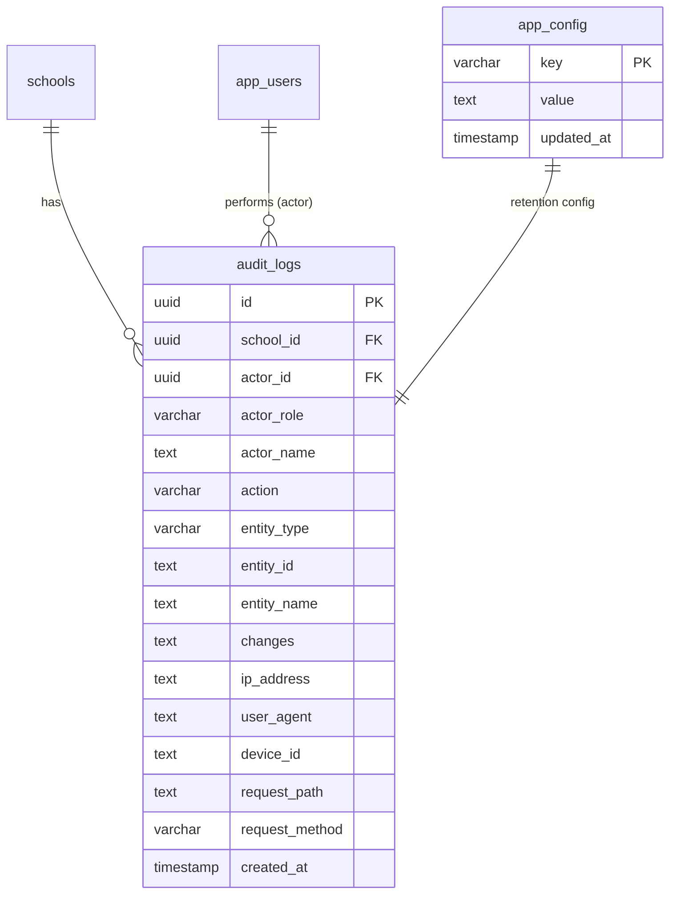

# Audit Log — Technical Specification

> **Document status:** Implementation-ready blueprint
> **Audience:** Senior engineer / AI agent implementing the system
> **Last updated:** 2026-06-27
> **Prerequisites:** None
> **Unblocks:** `DPDP_COMPLIANCE_SPEC.md`, all admin-action features
> **Template:** `_SPEC_TEMPLATE.md` v1 (25 mandatory + 6 optional sections)

---

## 1. Feature Overview

A centralized audit logging system that records all administrative actions, data access events, and configuration changes across the Vidya Prayag platform. This is a foundational infrastructure component required for DPDP Act compliance, security forensics, and operational accountability.

### Goals

- Record every write operation performed by school admins, teachers, and system processes
- Provide queryable, filterable audit trail with role-based access
- Support data export for compliance audits
- Enable tamper-evident logging (append-only, no UPDATE/DELETE)
- Support retention policies (configurable per school)

### Non-goals

- [ ] Real-time alerting based on audit events (future enhancement)
- [ ] Tamper-proof cryptographic chaining of audit entries (future enhancement)
- [ ] Audit log for non-school-scoped data (super admin platform actions only)
- [ ] User-facing activity feed (separate feature)

### Dependencies

- Ktor server framework (existing)
- `AppConfigTable` for retention configuration (existing)
- `UserSessionsTable` for session correlation (existing)

### Related Modules

- `server/.../db/Tables.kt` — database table definitions
- `server/.../Application.kt` — Ktor plugin installation
- `DPDP_COMPLIANCE_SPEC.md` — compliance requirements
- `TWO_FACTOR_AUTH_SPEC.md` — logs 2FA reset events
- `BULK_IMPORT_EXPORT_SPEC.md` — logs bulk operations

---

## 2. Current System Assessment

### Existing Code

- **No audit log table** — `Tables.kt` has no audit-related table
- `NotificationsTable` records notification events but not user actions
- `OtpDeliveryAttemptsTable` is the closest existing pattern — a full audit trail of OTP delivery attempts with provider, status, latency, and raw response
- `UserSessionsTable` tracks session issuance/revocation but not actions within sessions
- Some routes log to server console via `call.application.log` but this is ephemeral

### Existing Database

- `AppConfigTable` — key-value configuration store (can store retention days)
- `UserSessionsTable` — session tracking
- `OtpDeliveryAttemptsTable` — OTP delivery audit pattern
- `NotificationsTable` — notification event records

### Existing APIs

- No audit log query/export APIs exist
- Existing school/teacher routes have no audit logging

### Existing UI

- No audit log screen exists
- No export functionality exists

### Existing Services

- `OtpService` — has pattern for logging delivery attempts (similar structure)
- No `AuditService` exists

### Existing Documentation

- `feature_audit.csv` references the need for audit logging

### Technical Debt

| # | Gap | Details |
|---|---|---|
| TD-1 | No audit trail for admin actions | Cannot investigate data changes, security incidents |
| TD-2 | No DPDP compliance evidence | Legal liability |
| TD-3 | No data access logging | Cannot prove who accessed student/parent data |
| TD-4 | No configuration change tracking | Silent regressions untraceable |
| TD-5 | No export for regulatory audits | Manual evidence gathering |

### Gaps

| # | Gap | Impact | Severity |
|---|---|---|---|
| G1 | No audit trail for admin actions | Cannot investigate data changes, security incidents | **Critical** |
| G2 | No DPDP compliance evidence | Legal liability | **Critical** |
| G3 | No data access logging | Cannot prove who accessed student/parent data | **High** |
| G4 | No configuration change tracking | Silent regressions untraceable | **High** |
| G5 | No export for regulatory audits | Manual evidence gathering | **Medium** |

---

## 3. Functional Requirements

### FR-001
| Field | Value |
|---|---|
| **Title** | Log Write Operations |
| **Description** | Log every CREATE/UPDATE/DELETE operation on school-scoped data |
| **Priority** | Critical |
| **User Roles** | System |
| **Acceptance notes** | All POST/PATCH/DELETE to `/api/v1/school/*` and `/api/v1/teacher/*` logged |

### FR-002
| Field | Value |
|---|---|
| **Title** | Capture Actor & Action Details |
| **Description** | Capture actor (user_id, role), action type, entity type, entity ID, before/after diff |
| **Priority** | Critical |
| **User Roles** | System |
| **Acceptance notes** | All fields populated in audit log entry |

### FR-003
| Field | Value |
|---|---|
| **Title** | Capture Request Metadata |
| **Description** | Capture request metadata: IP, user agent, device ID, timestamp |
| **Priority** | High |
| **User Roles** | System |
| **Acceptance notes** | Metadata extracted from `ApplicationCall` |

### FR-004
| Field | Value |
|---|---|
| **Title** | Queryable Audit API |
| **Description** | Provide paginated, filterable query API (by actor, entity, action, date range) |
| **Priority** | High |
| **User Roles** | Super Admin, School Admin |
| **Acceptance notes** | Supports pagination, filtering, sorting by date |

### FR-005
| Field | Value |
|---|---|
| **Title** | Export Audit Log |
| **Description** | Export audit log as CSV/JSON for compliance |
| **Priority** | High |
| **User Roles** | Super Admin, School Admin |
| **Acceptance notes** | Streamed export for large date ranges |

### FR-006
| Field | Value |
|---|---|
| **Title** | Append-Only Enforcement |
| **Description** | Enforce append-only — no UPDATE or DELETE on audit rows |
| **Priority** | Critical |
| **User Roles** | System |
| **Acceptance notes** | Only purge job can DELETE expired records |

### FR-007
| Field | Value |
|---|---|
| **Title** | Configurable Retention |
| **Description** | Configurable retention period per school (default 365 days) |
| **Priority** | Medium |
| **User Roles** | Super Admin |
| **Acceptance notes** | Stored in `AppConfigTable` as `audit_retention_days` |

### FR-008
| Field | Value |
|---|---|
| **Title** | Automatic Purge |
| **Description** | Automatic purge of records older than retention period (scheduled job) |
| **Priority** | Medium |
| **User Roles** | System |
| **Acceptance notes** | Daily cron job at 2 AM IST |

### Action Types

```
CREATE | UPDATE | DELETE | LOGIN | LOGOUT | LOGIN_FAILED | EXPORT | CONFIG_CHANGE |
PERMISSION_CHANGE | BULK_IMPORT | BULK_DELETE | DATA_ACCESS
```

### Entity Types

```
student | teacher | parent | class | subject | announcement | attendance_record |
assessment | homework | fee_record | leave_request | calendar_event | school_config |
message | scholarship | enrollment | onboarding | child_link | non_teaching_staff
```

---

## 4. User Stories

### Super Admin
- [ ] View audit logs for all schools
- [ ] Filter audit log by school, actor, action, entity, date range
- [ ] Export audit log as CSV for compliance audits
- [ ] Configure retention period per school
- [ ] View own action history

### School Admin
- [ ] View audit log for own school
- [ ] Filter audit log by actor, action, entity, date range
- [ ] Export audit log as CSV
- [ ] View own action history
- [ ] Investigate who made changes to a student record

### Teacher
- [ ] View own action history (actions I performed)
- [ ] Cannot view school-wide audit log

### Parent
- [ ] View own action history (actions I performed)
- [ ] Cannot view school-wide audit log

### System
- [ ] Automatically log all write operations via Ktor plugin
- [ ] Run daily purge job to remove expired records
- [ ] Log audit entries asynchronously (fire-and-forget)
- [ ] Capture before/after diff for UPDATE operations

---

## 5. Business Rules

### BR-001
**Rule:** Audit log is append-only — no UPDATE or DELETE except by the purge job.
**Enforcement:** Database-level: no UPDATE statements issued. Purge job uses DELETE with date filter.

### BR-002
**Rule:** Audit log entries are school-scoped — queries filter by `school_id` from JWT.
**Enforcement:** `AuditService.query()` always filters by `schoolId` from authenticated user's JWT.

### BR-003
**Rule:** Super admin can view all schools' audit logs; school admin limited to own school.
**Enforcement:** Role check in `AuditRouting.kt`; school admin queries filtered by JWT `school_id`.

### BR-004
**Rule:** Audit writes are best-effort — a failed audit write must NOT block the business operation.
**Enforcement:** Audit writes are async (fire-and-forget via coroutine); errors logged but not thrown.

### BR-005
**Rule:** `changes` JSON is capped at 10KB to prevent oversized payloads.
**Enforcement:** Truncation logic in `AuditService.log()` if `changes` exceeds 10KB.

### BR-006
**Rule:** Retention period is configurable per school, default 365 days.
**Enforcement:** `audit_retention_days` key in `AppConfigTable`; purge job reads this value.

### BR-007
**Rule:** Purge job runs daily during off-peak hours (2 AM IST).
**Enforcement:** Scheduled task in Ktor application; logs purge count.

### BR-008
**Rule:** Export is streamed (not loaded into memory) for large date ranges.
**Enforcement:** CSV/JSON export uses streaming response; chunks by day if > 10K rows.

---

## 6. Database Design

### 6.1 Entity Relationship Summary

New `audit_logs` table with FK to `app_users` (actor) and `schools` (school scope). Retention config stored in existing `AppConfigTable`.

### 6.2 New Tables

```sql
CREATE TABLE audit_logs (
    id              UUID PRIMARY KEY DEFAULT gen_random_uuid(),
    school_id       UUID NOT NULL,
    actor_id        UUID,                          -- FK app_users.id (null for system actions)
    actor_role      VARCHAR(32) NOT NULL,          -- school_admin | teacher | parent | system
    actor_name      TEXT,                          -- denormalized for display
    action          VARCHAR(32) NOT NULL,          -- CREATE | UPDATE | DELETE | ...
    entity_type     VARCHAR(48) NOT NULL,          -- student | teacher | ...
    entity_id       TEXT,                          -- UUID or natural key of affected entity
    entity_name     TEXT,                          -- human-readable entity label
    changes         TEXT,                          -- JSON diff: {"field": {"old": x, "new": y}}
    ip_address      TEXT,
    user_agent      TEXT,
    device_id       TEXT,
    request_path    TEXT,                          -- API endpoint that triggered the action
    request_method  VARCHAR(8),                    -- GET | POST | PATCH | DELETE
    created_at      TIMESTAMP NOT NULL DEFAULT now()
);
```

### 6.3 Modified Tables

N/A — no existing tables modified. Retention config added to existing `AppConfigTable` as a key-value pair.

### 6.4 Indexes

```sql
CREATE INDEX idx_audit_school_created ON audit_logs(school_id, created_at DESC);
CREATE INDEX idx_audit_actor ON audit_logs(actor_id, created_at DESC);
CREATE INDEX idx_audit_entity ON audit_logs(entity_type, entity_id, created_at DESC);
CREATE INDEX idx_audit_action ON audit_logs(school_id, action, created_at DESC);
```

### 6.5 Constraints

- `audit_logs.school_id` — NOT NULL (every entry must be school-scoped)
- `audit_logs.actor_role` — NOT NULL (system actions use `system`)
- `audit_logs.action` — NOT NULL
- `audit_logs.entity_type` — NOT NULL
- `audit_logs.created_at` — NOT NULL, DEFAULT `now()`

### 6.6 Foreign Keys

- `audit_logs.actor_id` → `app_users.id` (nullable, ON DELETE SET NULL)
- `audit_logs.school_id` → `schools.id` (ON DELETE CASCADE)

### 6.7 Soft Delete Strategy

N/A — audit logs are append-only. No soft delete. Hard DELETE only by purge job.

### 6.8 Audit Fields

- `created_at` — timestamp when audit entry was created (immutable)
- `actor_name` — denormalized from `app_users` for display even if user is deleted

### 6.9 Migration Notes

Migration: `docs/db/migration_030_audit_logs.sql`
- Creates `audit_logs` table with indexes
- Inserts default retention config (`audit_retention_days = 365`) into `AppConfigTable`
- Rollback: `DROP TABLE IF EXISTS audit_logs; DELETE FROM app_config WHERE key = 'audit_retention_days';`

### 6.10 Exposed Mappings

```kotlin
object AuditLogsTable : UUIDTable("audit_logs", "id") {
    val schoolId      = uuid("school_id")
    val actorId       = uuid("actor_id").nullable()
    val actorRole     = varchar("actor_role", 32)
    val actorName     = text("actor_name").nullable()
    val action        = varchar("action", 32)
    val entityType    = varchar("entity_type", 48)
    val entityId      = text("entity_id")
    val entityName    = text("entity_name").nullable()
    val changes       = text("changes").nullable()   // JSON diff
    val ipAddress     = text("ip_address").nullable()
    val userAgent     = text("user_agent").nullable()
    val deviceId      = text("device_id").nullable()
    val requestPath   = text("request_path").nullable()
    val requestMethod = varchar("request_method", 8).nullable()
    val createdAt     = timestamp("created_at")

    init {
        index("idx_audit_school_created", false, schoolId, createdAt)
        index("idx_audit_actor", false, actorId, createdAt)
        index("idx_audit_entity", false, entityType, entityId, createdAt)
        index("idx_audit_action", false, schoolId, action, createdAt)
    }
}
```

### 6.11 Seed Data

```sql
INSERT INTO app_config (key, value, updated_at)
VALUES ('audit_retention_days', '365', now())
ON CONFLICT (key) DO NOTHING;
```

---

## 7. State Machines

### Audit Log Entry Lifecycle

```
ACTION_TRIGGERED ──> CAPTURE_BEFORE_STATE ──> EXECUTE_HANDLER ──> CAPTURE_AFTER_STATE ──> WRITE_AUDIT_LOG ──> COMPLETE
                                                                                                        |
                                                                                                        +-> WRITE_FAILED (logged, not thrown)
```

| Current State | Event | Next State | Guard / Condition |
|---|---|---|---|
| `action_triggered` | Ktor plugin intercepts request | `capture_before_state` | POST/PATCH/DELETE to school/teacher routes |
| `capture_before_state` | Handler executes | `execute_handler` | Before state captured (for UPDATE/DELETE) |
| `execute_handler` | Handler completes | `capture_after_state` | Handler succeeded |
| `execute_handler` | Handler fails | `complete` | No audit log for failed operations |
| `capture_after_state` | After state captured | `write_audit_log` | Diff computed |
| `write_audit_log` | Async write succeeds | `complete` | — |
| `write_audit_log` | Async write fails | `write_failed` | Error logged, not thrown |
| `write_failed` | Error logged | `complete` | Business operation not affected |

### Purge Job State Machine

```
IDLE ──scheduled (2 AM IST)──> RUNNING ──purge complete──> IDLE
RUNNING ──error──> FAILED ──retry next day──> IDLE
```

| Current State | Event | Next State | Guard / Condition |
|---|---|---|---|
| `idle` | Scheduled trigger (2 AM IST) | `running` | — |
| `running` | Purge completes | `idle` | Records older than retention deleted |
| `running` | Error occurs | `failed` | Error logged; alert sent |
| `failed` | Next day trigger | `running` | Retry |

---

## 8. Backend Architecture

### 8.1 Component Overview

New `AuditService` handles log writes, queries, exports, and purges. `AuditLoggingPlugin` (Ktor plugin) automatically intercepts mutating requests. `AuditRouting` exposes query/export APIs.

### 8.2 Design Principles

1. **Append-only** — No UPDATE or DELETE except purge job
2. **Async writes** — Fire-and-forget to avoid API latency impact
3. **Best-effort** — Failed audit writes never block business operations
4. **School-scoped** — All queries filtered by `school_id` from JWT
5. **Automatic + Manual** — Plugin handles most cases; manual calls for complex operations

### 8.3 Core Types

```kotlin
class AuditService {
    suspend fun log(
        schoolId: UUID,
        actorId: UUID?,
        actorRole: String,
        actorName: String?,
        action: String,
        entityType: String,
        entityId: String,
        entityName: String? = null,
        changes: String? = null,        // JSON diff
        request: ApplicationCall? = null
    )

    suspend fun query(
        schoolId: UUID,
        actorId: UUID? = null,
        action: String? = null,
        entityType: String? = null,
        entityId: String? = null,
        dateFrom: LocalDate? = null,
        dateTo: LocalDate? = null,
        offset: Int = 0,
        limit: Int = 50
    ): PaginatedResult<AuditLogDto>

    suspend fun export(
        schoolId: UUID,
        dateFrom: LocalDate,
        dateTo: LocalDate,
        format: ExportFormat
    ): ByteArray

    suspend fun purgeExpired(schoolId: UUID, retentionDays: Int): Int
}
```

### 8.4 AuditInterceptor (Ktor Plugin)

A custom Ktor plugin that intercepts all mutating requests (POST/PATCH/DELETE) to `/api/v1/school/*` and `/api/v1/teacher/*` routes and automatically logs them.

```kotlin
// Install in Application.kt
install(AuditLogging) {
    enabled = true
    excludedPaths = setOf("/api/v1/auth", "/api/v1/health")
    captureChanges = true
}
```

**Implementation approach:** The plugin wraps each route handler. Before the handler runs, it captures the "before" state (for UPDATE/DELETE). After the handler runs, it captures the "after" state and writes the audit log entry.

For routes that don't easily support before/after capture (e.g., bulk operations), the handler itself calls `AuditService.log()` directly.

### 8.5 Manual Audit Calls

For complex operations where automatic interception is insufficient:

```kotlin
auditService.log(
    schoolId = schoolId,
    actorId = userId,
    actorRole = "school_admin",
    actorName = userName,
    action = "CREATE",
    entityType = "student",
    entityId = student.id.toString(),
    entityName = student.fullName,
    changes = Json.encodeToString(student),
    request = call
)
```

### 8.6 Repositories

- `AuditLogRepository` — CRUD for `audit_logs` table (insert + query only, no update)

### 8.7 Mappers

- `AuditLogMapper` — maps `AuditLogsTable` row to `AuditLogDto`

### 8.8 Permission Checks

- Query: school admin limited to own `school_id`; super admin can query any school
- Export: same as query
- Retention config: super admin only
- My actions: all roles can view own action history (filtered by `actor_id` from JWT)

### 8.9 Background Jobs

### Scheduled Purge Job

A daily cron job (using Ktor's scheduled tasks or a simple timer) that:
1. Reads `audit_retention_days` from `AppConfigTable`
2. `DELETE FROM audit_logs WHERE school_id = ? AND created_at < now() - INTERVAL '? days'`
3. Logs the purge count

### 8.10 Domain Events

N/A — audit logging is a cross-cutting concern, not a domain event source.

### 8.11 Caching

N/A — audit logs are write-once, read-many. No caching needed for writes. Query results not cached (real-time data).

### 8.12 Transactions

- Audit log writes: single INSERT, committed independently of business transaction
- Purge: single DELETE with WHERE clause, committed in one transaction

---

## 9. API Contracts

### 9.1 Query Audit Log

```
GET /api/v1/school/audit-log?actor_id={uuid}&action={type}&entity_type={type}&entity_id={id}&date_from={YYYY-MM-DD}&date_to={YYYY-MM-DD}&offset=0&limit=50
```

**Response 200:**
```json
{
  "success": true,
  "data": {
    "items": [
      {
        "id": "uuid",
        "actor_id": "uuid",
        "actor_name": "Rajesh Kumar",
        "actor_role": "school_admin",
        "action": "UPDATE",
        "entity_type": "student",
        "entity_id": "uuid",
        "entity_name": "Aarav Sharma",
        "changes": {"class_name": {"old": "Grade 5", "new": "Grade 6"}},
        "ip_address": "192.168.1.1",
        "request_path": "/api/v1/school/students/uuid",
        "request_method": "PATCH",
        "created_at": "2026-06-27T10:30:00Z"
      }
    ],
    "total_count": 1250,
    "has_more": true
  }
}
```

### 9.2 Export Audit Log

```
GET /api/v1/school/audit-log/export?date_from={YYYY-MM-DD}&date_to={YYYY-MM-DD}&format=csv|json
```

**Response 200:** File download (`Content-Type: text/csv` or `application/json`)

### 9.3 View Own Action History

```
GET /api/v1/{role}/audit-log/my-actions?offset=0&limit=50
```

Available to all roles. Returns only actions by the authenticated user.

### 9.4 Configure Retention

```
PATCH /api/v1/school/audit-log/retention
{
  "retention_days": 730
}
```

**Authorization:** Super Admin only.

---

## 10. Frontend Architecture

### 10.1 Screens

| Screen | Platform | Role | Description |
|---|---|---|---|
| `AuditLogScreen` | All | Super Admin, School Admin | Audit log viewer with filters |
| `AuditLogViewModel` | All | Super Admin, School Admin | ViewModel for audit log data |
| `MyActionsScreen` | All | All roles | User's own action history |

### 10.2 Navigation

- Admin portal → Settings → Audit Log → `AuditLogScreen`
- Any role → Profile → My Actions → `MyActionsScreen`

### 10.3 UX Flows

#### View Audit Log

1. Admin navigates to Settings → Audit Log
2. `AuditLogScreen` loads with default date range (last 30 days)
3. Admin can filter by actor, action type, entity type, date range
4. Results displayed in paginated table
5. Admin can click "Export" to download CSV/JSON

#### Export Audit Log

1. Admin sets date range and format
2. Clicks "Export"
3. File download begins (streamed)
4. CSV/JSON file saved to device

### 10.4 State Management

```kotlin
data class AuditLogState(
    val items: List<AuditLogDto>,
    val totalCount: Int,
    val hasMore: Boolean,
    val filters: AuditLogFilters,
    val isLoading: Boolean,
    val isExporting: Boolean,
)

data class AuditLogFilters(
    val actorId: UUID? = null,
    val action: String? = null,
    val entityType: String? = null,
    val entityId: String? = null,
    val dateFrom: LocalDate? = null,
    val dateTo: LocalDate? = null,
)
```

### 10.5 Offline Support

N/A — audit log requires server connection. No offline caching.

### 10.6 Loading States

- Initial load: skeleton rows
- Filter apply: loading indicator
- Export: progress indicator with "Exporting..." text

### 10.7 Error Handling (UI)

- Query error: "Failed to load audit log. Please try again."
- Export error: "Export failed. Please try again."
- Permission denied: "You don't have permission to view this audit log."
- Empty results: "No audit entries found for the selected filters."

### 10.8 Component Integration Guidelines

| Rule | Description |
|---|---|
| **R1** | Audit log table uses virtualized scrolling for large datasets |
| **R2** | Filters are applied via URL query params for shareable links |
| **R3** | Export button disabled during export in progress |
| **R4** | Date range picker defaults to last 30 days |
| **R5** | Changes diff displayed in expandable JSON viewer |

---

## 11. Shared Module Changes (KMP)

### 11.1 DTOs

```kotlin
data class AuditLogDto(
    val id: UUID,
    val schoolId: UUID,
    val actorId: UUID?,
    val actorName: String?,
    val actorRole: String,
    val action: String,
    val entityType: String,
    val entityId: String,
    val entityName: String?,
    val changes: String?,  // JSON string
    val ipAddress: String?,
    val requestPath: String?,
    val requestMethod: String?,
    val createdAt: Instant,
)

data class AuditLogFilters(
    val actorId: UUID? = null,
    val action: String? = null,
    val entityType: String? = null,
    val entityId: String? = null,
    val dateFrom: LocalDate? = null,
    val dateTo: LocalDate? = null,
    val offset: Int = 0,
    val limit: Int = 50,
)
```

### 11.2 Domain Models

```kotlin
data class AuditLog(
    val id: UUID,
    val schoolId: UUID,
    val actor: Actor,
    val action: ActionType,
    val entity: EntityRef,
    val changes: JsonDiff?,
    val metadata: RequestMetadata,
    val createdAt: Instant,
)
```

### 11.3 Repository Interfaces

```kotlin
interface AuditRepository {
    suspend fun query(filters: AuditLogFilters): PaginatedResult<AuditLogDto>
    suspend fun export(dateFrom: LocalDate, dateTo: LocalDate, format: ExportFormat): ByteArray
}
```

### 11.4 UseCases

- `QueryAuditLogUseCase`
- `ExportAuditLogUseCase`
- `GetMyActionsUseCase`

### 11.5 Validation

- Date range: `dateFrom` <= `dateTo`
- Limit: 1-200
- Offset: >= 0

### 11.6 Serialization

Standard Kotlinx serialization for DTOs. `changes` field is a JSON string (not deserialized on client).

### 11.7 Network APIs

Added to `AuditApi.kt`:
- `GET /api/v1/school/audit-log` — query with filters
- `GET /api/v1/school/audit-log/export` — export as CSV/JSON
- `GET /api/v1/{role}/audit-log/my-actions` — own action history
- `PATCH /api/v1/school/audit-log/retention` — configure retention (super admin)

### 11.8 Database Models (Local Cache)

N/A — audit log data is server-side only. No local caching needed.

---

## 12. Permissions Matrix

| Action | Super Admin | School Admin | Teacher | Parent |
|---|---|---|---|---|
| View own school's audit log | ✅ | ✅ | ❌ | ❌ |
| Export audit log | ✅ | ✅ | ❌ | ❌ |
| View all schools' audit log | ✅ | ❌ | ❌ | ❌ |
| View own action history | ✅ | ✅ | ✅ | ✅ |
| Configure retention period | ✅ | ❌ | ❌ | ❌ |

---

## 13. Notifications

N/A — audit logging is an infrastructure component. No user-facing notifications for audit events. Alerts are sent to ops team via monitoring (see section F. Observability).

---

## 14. Background Jobs

### Purge Job

| Job | Schedule | Description |
|---|---|---|
| `AuditPurgeJob` | Daily at 2 AM IST | Deletes audit log records older than retention period |

**Implementation:**
1. Reads `audit_retention_days` from `AppConfigTable`
2. `DELETE FROM audit_logs WHERE school_id = ? AND created_at < now() - INTERVAL '? days'`
3. Logs the purge count per school
4. Runs for all schools sequentially

---

## 15. Integrations

### Ktor Application
| Field | Value |
|---|---|
| **System** | Ktor server framework |
| **Purpose** | AuditLogging plugin intercepts all mutating requests |
| **API / SDK** | Ktor plugin API (`install(AuditLogging)`) |
| **Auth method** | N/A — internal plugin |
| **Fallback** | Manual `AuditService.log()` calls for complex operations |

### AppConfigTable
| Field | Value |
|---|---|
| **System** | App configuration (existing) |
| **Purpose** | Store `audit_retention_days` config |
| **API / SDK** | Direct DB access |
| **Auth method** | N/A — internal |
| **Fallback** | Default 365 days if key missing |

### DPDP Compliance
| Field | Value |
|---|---|
| **System** | DPDP Act compliance framework |
| **Purpose** | Audit log serves as compliance evidence |
| **API / SDK** | N/A — audit log is consumed by compliance process |
| **Auth method** | N/A |
| **Fallback** | None — audit log is the primary compliance evidence |

---

## 16. Security

### Authentication
- Audit log queries require valid JWT
- JWT `school_id` used to scope queries
- JWT `role` used to determine access level

### Authorization
- School admin: can only query own school's audit log
- Super admin: can query any school's audit log
- Teacher/parent: can only view own action history
- Retention config: super admin only

### Encryption
- Audit log data is not encrypted at rest (it contains non-sensitive operational data)
- `changes` field may contain entity data — same encryption as source tables

### Audit Logs
- The audit log itself is the audit trail — no meta-audit needed
- Purge job actions are logged in server logs

### PII Handling
- `actor_name` is denormalized from `app_users` — may contain PII (name)
- `entity_name` may contain student/parent names (PII)
- `changes` JSON may contain field values that include PII
- Retention policy ensures PII is purged after configurable period

### Data Isolation
- All queries filtered by `school_id` from JWT
- No cross-school data access possible
- Super admin access is logged (super admin queries are themselves auditable)

### Rate Limiting
- Query API: standard rate limiting (same as other admin APIs)
- Export API: lower rate limit due to resource-intensive operation

### Input Validation
- Query filters validated: date range, limit (1-200), offset (>= 0)
- Export format: must be `csv` or `json`
- Retention days: must be positive integer (30-3650)

---

## 17. Performance & Scalability

### Expected Scale

| Metric | 1 school | 100 schools | 1,000 schools |
|---|---|---|---|
| Audit writes/day | ~500 | ~50,000 | ~500,000 |
| Query latency (filtered) | < 50ms | < 100ms | < 200ms |
| Export (30 days, CSV) | < 1s | < 5s | < 30s |
| Purge job (all schools) | < 1s | < 30s | < 5min |

### Latency Targets

| Operation | Target |
|---|---|
| Audit write (async) | < 5ms added to API response |
| Query (with filters, 50 results) | < 100ms |
| Export (30 days, streamed) | < 5s for first chunk |
| Purge (per school) | < 1s |

### Optimization Strategy

- Audit writes are async (fire-and-forget via coroutine) — no API latency impact
- `changes` JSON capped at 10KB to prevent oversized payloads
- Indexes on `(school_id, created_at)` and `(actor_id, created_at)` cover primary query patterns
- For high-volume schools (>10K actions/day), consider partitioning by month
- Export is streamed (not loaded into memory) for large date ranges
- Purge job runs during off-peak hours (2 AM IST)

---

## 18. Edge Cases

| # | Scenario | Expected Behavior |
|---|---|---|
| EC-001 | Audit write fails | Error logged; business operation continues (best-effort) |
| EC-002 | `changes` JSON exceeds 10KB | Truncated to 10KB with `..._truncated` suffix |
| EC-003 | Actor deleted from `app_users` | `actor_id` set to NULL; `actor_name` preserved (denormalized) |
| EC-004 | Bulk import of 1,000 students | Single `BULK_IMPORT` audit entry with summary; individual entries not logged |
| EC-005 | Export date range > 1 year | Streamed in chunks by day; no OOM |
| EC-006 | Purge job fails for one school | Continues to next school; failed school retried next day |
| EC-007 | School admin queries another school's audit log | 403 Forbidden (JWT `school_id` mismatch) |
| EC-008 | Teacher queries school audit log | 403 Forbidden |

### Risks & Mitigations

| Risk | Likelihood | Impact | Mitigation |
|---|---|---|---|
| Audit writes slow down API responses | Medium | Medium | Async writes via coroutine; fire-and-forget |
| Audit table grows unbounded | High | Medium | Daily purge job; configurable retention |
| Before/after diff capture fails | Medium | Low | Best-effort; log error, continue with null changes |
| Manual audit calls forgotten in new routes | Medium | Medium | Code review checklist; plugin handles most cases automatically |
| Export of large date range OOMs | Low | High | Stream export; chunk by day if > 10K rows |

---

## 19. Error Handling

### Standard Error Codes

| HTTP | Error Code | Description | When |
|---|---|---|---|
| 400 | `INVALID_DATE_RANGE` | `date_from` > `date_to` | Query/export |
| 400 | `INVALID_FORMAT` | Export format not `csv` or `json` | Export |
| 400 | `INVALID_RETENTION` | Retention days out of range (30-3650) | Retention config |
| 403 | `INSUFFICIENT_PERMISSIONS` | Non-admin attempting to view school audit log | Query/export |
| 403 | `SCHOOL_MISMATCH` | Admin querying another school's audit log | Query/export |

### Error Response Format

Same as existing API error format.

### Recovery Strategy

| Error | Client Action | Server Action |
|---|---|---|
| `INVALID_DATE_RANGE` | Show error message | Return 400 |
| `INSUFFICIENT_PERMISSIONS` | Show permission denied | Return 403 |
| Audit write failure | N/A (async) | Log error; continue |
| Export failure | Show retry button | Return 500; log error |
| Purge failure | N/A | Log error; alert ops; retry next day |

---

## 20. Analytics & Reporting

### Reports

- **Audit Activity Report:** Number of actions per day/week/month by school
- **Top Actors Report:** Most active users by action count
- **Entity Change Report:** Most frequently modified entities
- **Action Distribution Report:** Breakdown by action type (CREATE/UPDATE/DELETE)

### KPIs

- **Audit Write Rate:** Number of audit entries per day
- **Audit Write Failure Rate:** % of failed audit writes
- **Query Latency:** Average query response time
- **Export Duration:** Average export time
- **Purge Effectiveness:** Number of records purged per day

### Dashboards

N/A — monitoring via metrics and alerts (see section F. Observability).

### Exports

- CSV export of audit log (primary export)
- JSON export of audit log (for programmatic consumption)

---

## 21. Testing Strategy

### Unit Tests

| Test | What it verifies |
|---|---|
| `AuditService.log()` — all fields captured correctly | Full audit entry persisted |
| `AuditService.query()` — filtering by actor, action, entity, date range | Correct results returned |
| `AuditService.export()` — CSV and JSON format correctness | Valid file format |
| `AuditService.purgeExpired()` — correct retention calculation | Only expired records deleted |
| Append-only enforcement — attempting UPDATE throws | UPDATE rejected |
| `changes` truncation at 10KB | Truncated with suffix |

### Integration Tests

| Test | What it verifies |
|---|---|
| Create student → audit log entry exists with action=CREATE | Auto-intercept works |
| Update student → audit log entry has before/after diff | Diff capture works |
| Delete student → audit log entry with action=DELETE | Delete logged |
| Cross-school query → returns only own school's entries | School scoping works |
| Teacher querying school audit log → 403 | Permission enforcement |
| Export → valid CSV with correct headers and row count | Export correctness |
| Purge job → records older than retention are deleted | Purge works |
| Audit write failure → business operation succeeds | Best-effort behavior |

### Performance Tests

- [ ] Audit write adds < 5ms to API response time (async)
- [ ] Query with filters returns in < 100ms
- [ ] Export of 30 days streams first chunk in < 5s
- [ ] Purge of 10,000 records completes in < 5s

### Security Tests

- [ ] School admin cannot query another school's audit log
- [ ] Teacher/parent cannot access school audit log
- [ ] Retention config requires super admin
- [ ] Audit log is append-only (no UPDATE)
- [ ] IP and user agent captured for forensic analysis

### Migration Tests

- [ ] Migration creates table with correct schema
- [ ] Indexes created correctly
- [ ] Default retention config inserted
- [ ] Rollback drops table and removes config

---

## 22. Acceptance Criteria

- [ ] Every POST/PATCH/DELETE to `/api/v1/school/*` generates an audit log entry
- [ ] Audit log entries include actor, action, entity, changes, IP, timestamp
- [ ] School admin can query and filter audit log
- [ ] School admin can export audit log as CSV
- [ ] Teacher/parent can view their own action history
- [ ] Retention period is configurable
- [ ] Purge job runs daily and removes expired records
- [ ] Audit writes do not add > 5ms to API response time (async)
- [ ] Cross-school access is prevented
- [ ] Export is streamed for large date ranges
- [ ] `changes` JSON capped at 10KB
- [ ] Audit writes are best-effort (failure doesn't block business operation)

---

## 23. Implementation Roadmap

| Phase | Duration | Tasks | Breaking? | Deliverable |
|---|---|---|---|---|
| 1 | 2 days | DB migration, Exposed table, AuditService | No | Schema + service ready |
| 2 | 3 days | Ktor AuditLogging plugin, integrate into existing school/teacher routes | No | Auto-logging active |
| 3 | 2 days | Query API + export endpoint | No | Query/export available |
| 4 | 1 day | Purge job + retention config | No | Retention management |
| 5 | 2 days | Client UI (audit log screen with filters + export button) | No | Admin UI |
| 6 | 2 days | Tests (unit + integration) | No | Test coverage |

**Total: ~12 days**

---

## 24. File-Level Impact Analysis

### New Files

| File | Location | Purpose |
|---|---|---|
| `AuditService.kt` | `server/.../feature/audit/` | Core audit service |
| `AuditRouting.kt` | `server/.../feature/audit/` | Query/export endpoints |
| `AuditLoggingPlugin.kt` | `server/.../feature/audit/` | Ktor plugin for automatic logging |
| `migration_030_audit_logs.sql` | `docs/db/` | DDL migration |
| `AuditApi.kt` | `shared/.../feature/audit/` | Client API |
| `AuditRepository.kt` | `shared/.../feature/audit/` | Client repository |
| `AuditLogScreen.kt` | `composeApp/.../ui/v2/screens/admin/` | Admin audit log screen |
| `AuditLogViewModel.kt` | `composeApp/.../ui/v2/screens/admin/` | ViewModel |

### Modified Files

| File | Change Type | Lines Changed (est.) | Risk | Description |
|---|---|---|---|---|
| `server/.../db/Tables.kt` | Add | ~20 | Low | `AuditLogsTable` object |
| `server/.../db/DatabaseFactory.kt` | Modify | ~2 | Low | Register `AuditLogsTable` in `allTables` |
| `server/.../Application.kt` | Modify | ~5 | Medium | Install `AuditLogging` plugin |
| `server/.../feature/school/*.kt` | Modify | ~50 | Medium | Add manual audit calls where auto-intercept is insufficient |

### Files Preserved Unchanged

| File | Reason |
|---|---|
| All auth routes | Excluded from audit logging (`/api/v1/auth` in excludedPaths) |
| All health check routes | Excluded from audit logging |
| All parent-facing routes | Parent actions logged via teacher/school routes |

---

## 25. Future Enhancements

### Cryptographic Chaining

- Hash-chain audit entries for tamper-evidence
- Each entry includes hash of previous entry
- Detects any modification to historical audit data

### Real-Time Alerting

- Alert on suspicious patterns (e.g., bulk DELETE, off-hours access)
- Integration with notification system for security alerts
- Configurable alert rules per school

### Audit Log Analytics Dashboard

- Visual dashboard with charts (actions over time, top actors, entity distribution)
- Trend analysis for compliance reporting
- Anomaly detection

### Data Access Logging

- Log READ operations on sensitive entities (student PII, fee records)
- Separate `DATA_ACCESS` action type
- Higher volume — may require separate table or sampling

### Immutable Storage

- Write audit logs to write-once-read-many (WORM) storage
- Cloud storage with object lock (AWS S3 Object Lock, GCP Bucket Lock)
- Legal-grade immutability for compliance

### Cross-School Correlation

- Super admin dashboard for cross-school audit analysis
- Detect patterns across schools (e.g., same actor at multiple schools)
- Platform-level security monitoring

---

## A. Sequence Diagrams

### Automatic Audit Logging (via Plugin)



### Manual Audit Logging



### Audit Log Query & Export



### Purge Job



---

## B. Domain Model / ER Diagram



---

## C. Event Flow

```
RequestReceived -> PluginIntercepts -> CaptureBeforeState -> ExecuteHandler -> CaptureAfterState -> ComputeDiff -> AsyncWriteAuditLog -> ResponseReturned
ManualLogCalled -> AuditService.log() -> AsyncInsert -> Complete
QueryRequested -> VerifyPermissions -> FilterBySchoolId -> ExecuteQuery -> ReturnPaginatedResults
ExportRequested -> VerifyPermissions -> StreamQueryResults -> FormatAsCSV/JSON -> ReturnFileStream
PurgeTriggered -> ReadRetentionConfig -> DeleteExpiredRecords -> LogPurgeCount
```

| Event | Emitted By | Consumed By | Side Effect |
|---|---|---|---|
| `AuditLogWritten` | `AuditService.log()` | Monitoring | Counter incremented |
| `AuditLogWriteFailed` | `AuditService.log()` (catch block) | Monitoring, Alerting | Counter incremented; error logged |
| `AuditLogQueried` | `AuditRouting` | Monitoring | Query latency recorded |
| `AuditLogExported` | `AuditRouting` | Monitoring | Export duration recorded |
| `AuditLogPurged` | `AuditPurgeJob` | Monitoring | Purge count recorded |

---

## D. Configuration

### Environment Variables

| Variable | Description |
|---|---|
| `AUDIT_LOG_ENABLED` | Enable/disable audit logging (default: `true`) |
| `AUDIT_CHANGES_MAX_SIZE` | Max size of changes JSON in bytes (default: `10240`) |
| `AUDIT_PURGE_SCHEDULE` | Cron expression for purge job (default: `0 0 2 * * *` — 2 AM IST) |

### Feature Flags

| Flag | Default | Description |
|---|---|---|
| `audit_logging_enabled` | `true` | Master switch for audit logging |
| `audit_auto_intercept_enabled` | `true` | Enable Ktor plugin automatic interception |
| `audit_export_enabled` | `true` | Enable audit log export |

### Client-Side Configuration

| Config | Default | Description |
|---|---|---|
| Default date range | Last 30 days | Initial filter on audit log screen |
| Page size | 50 | Default results per page |
| Max page size | 200 | Maximum results per page |

### Server-Side Configuration

| Config | Default | Description |
|---|---|---|
| Retention days | 365 | Days to retain audit logs |
| Changes max size | 10KB | Max size of changes JSON |
| Purge schedule | 2 AM IST | When purge job runs |
| Excluded paths | `/api/v1/auth`, `/api/v1/health` | Paths excluded from auto-interception |
| Async write pool | 4 coroutines | Concurrent audit write coroutines |

### Infrastructure Requirements

- PostgreSQL with indexes on `audit_logs` table
- Ktor scheduled tasks (or external cron) for purge job
- Sufficient disk space for audit log retention period

---

## E. Migration & Rollback

### Deployment Plan

1. [ ] Run `migration_030_audit_logs.sql` — creates table + indexes + default config
2. [ ] Deploy `AuditLogsTable` in `Tables.kt`
3. [ ] Register `AuditLogsTable` in `DatabaseFactory.kt`
4. [ ] Deploy `AuditService.kt`
5. [ ] Deploy `AuditLoggingPlugin.kt` and install in `Application.kt`
6. [ ] Deploy `AuditRouting.kt` with query/export endpoints
7. [ ] Deploy purge job
8. [ ] Deploy client UI (audit log screen)
9. [ ] Test: verify audit entries created for existing routes
10. [ ] Deploy to production

### Rollback Plan

1. [ ] Uninstall `AuditLogging` plugin from `Application.kt` → no new audit entries
2. [ ] Remove `AuditRouting` endpoints → no query/export access
3. [ ] Remove client UI → no admin access
4. [ ] Database: `DROP TABLE IF EXISTS audit_logs; DELETE FROM app_config WHERE key = 'audit_retention_days';`
5. [ ] No data loss to business operations — audit log is infrastructure only

### Data Backfill

N/A — no existing data to backfill. Audit logging starts from deployment date forward.

### Migration SQL

```sql
-- migration_030_audit_logs.sql
CREATE TABLE IF NOT EXISTS audit_logs (
    id              UUID PRIMARY KEY DEFAULT gen_random_uuid(),
    school_id       UUID NOT NULL,
    actor_id        UUID,
    actor_role      VARCHAR(32) NOT NULL,
    actor_name      TEXT,
    action          VARCHAR(32) NOT NULL,
    entity_type     VARCHAR(48) NOT NULL,
    entity_id       TEXT,
    entity_name     TEXT,
    changes         TEXT,
    ip_address      TEXT,
    user_agent      TEXT,
    device_id       TEXT,
    request_path    TEXT,
    request_method  VARCHAR(8),
    created_at      TIMESTAMP NOT NULL DEFAULT now()
);

CREATE INDEX IF NOT EXISTS idx_audit_school_created ON audit_logs(school_id, created_at DESC);
CREATE INDEX IF NOT EXISTS idx_audit_actor ON audit_logs(actor_id, created_at DESC);
CREATE INDEX IF NOT EXISTS idx_audit_entity ON audit_logs(entity_type, entity_id, created_at DESC);
CREATE INDEX IF NOT EXISTS idx_audit_action ON audit_logs(school_id, action, created_at DESC);

-- Default retention
INSERT INTO app_config (key, value, updated_at)
VALUES ('audit_retention_days', '365', now())
ON CONFLICT (key) DO NOTHING;

-- ROLLBACK:
-- DROP TABLE IF EXISTS audit_logs;
-- DELETE FROM app_config WHERE key = 'audit_retention_days';
```

---

## F. Observability

### Logging

- Audit write: DEBUG `audit_write` (schoolId, actorId, action, entityType, entityId)
- Audit write failure: WARN `audit_write_failed` (schoolId, action, error)
- Audit query: DEBUG `audit_query` (schoolId, filters, resultCount, durationMs)
- Audit export: INFO `audit_export` (schoolId, dateRange, format, rowCount, durationMs)
- Purge job start: INFO `audit_purge_start` (retentionDays)
- Purge job complete: INFO `audit_purge_complete` (schoolId, rowsDeleted)
- Purge job failure: ERROR `audit_purge_failed` (schoolId, error)

### Metrics

| Metric | Type | Description |
|---|---|---|
| `audit.writes_total` | Counter | Total audit log entries written |
| `audit.write_failures_total` | Counter | Total audit write failures |
| `audit.write_latency_ms` | Histogram | Audit write latency (async) |
| `audit.query_latency_ms` | Histogram | Query API latency |
| `audit.export_duration_ms` | Histogram | Export operation duration |
| `audit.purge_rows_deleted` | Gauge | Rows deleted by last purge job |
| `audit.table_size_bytes` | Gauge | Total size of audit_logs table |

### Health Checks

- `GET /api/v1/health` — existing health check (covers audit service indirectly)
- Purge job last run timestamp check (alert if > 25 hours ago)

### Alerts

- Audit write failure rate > 1% → Warning
- Purge job not run in 24h → Warning
- Audit table size > 10GB → Warning (consider partitioning)
- Export duration > 60s → Warning (consider chunking optimization)
- Query latency p95 > 500ms → Warning (check indexes)
