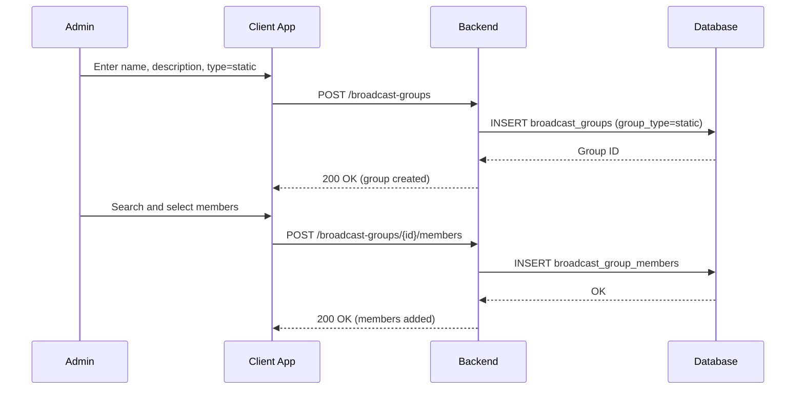
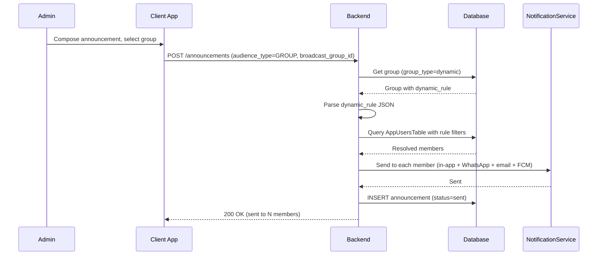
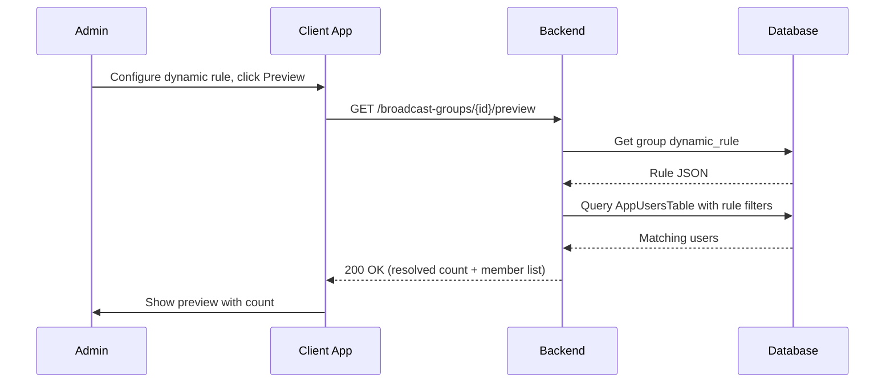
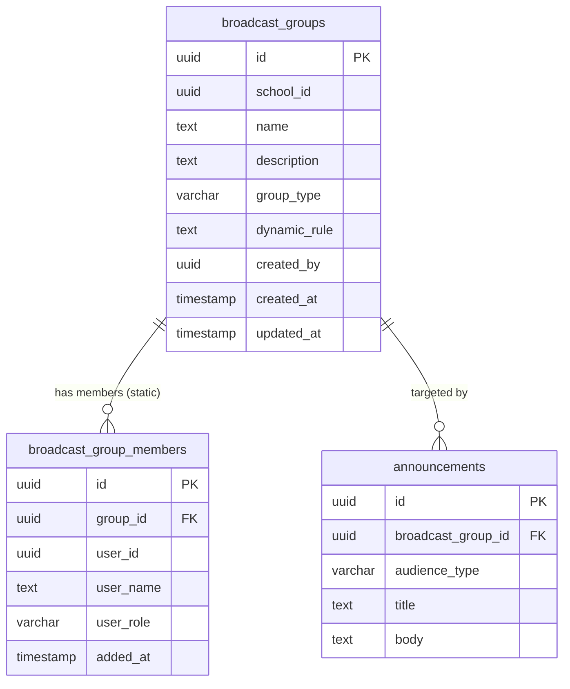

# Broadcast Groups — Technical Specification

> **Document status:** Implementation-ready blueprint
> **Last updated:** 2026-06-27
> **Prerequisites:** None
> **Template:** `_SPEC_TEMPLATE.md` v1 (25 mandatory + 6 optional sections)

---

## 1. Feature Overview

Admin-managed broadcast groups for targeted communication: create custom groups (e.g., "Grade 5 Parents", "Science Teachers", "Sports Team") and send announcements/messages to specific groups instead of whole school or single class.

### Goals

- Admin creates custom broadcast groups with members (parents, teachers, staff)
- Groups can be static (manual members) or dynamic (rule-based: all parents of Grade 5)
- Send announcement to a group
- Group management UI (add/remove members)
- Reusable across announcements and messages

### Non-goals

- [ ] Student-to-student group messaging
- [ ] Group chat / threaded discussions
- [ ] External group import (from CSV)
- [ ] Group-based access control for features

### Dependencies

- `AnnouncementsTable` — modified to support `broadcast_group_id`
- `AppUsersTable` — user accounts for group membership
- `StudentsTable` — student data for dynamic group rules
- `NotificationService` — multi-channel delivery to group members

### Related Modules

- `server/.../feature/announcements/` — announcement feature (modified)
- `server/.../feature/notifications/` — notification service
- `shared/.../feature/broadcast/` — shared broadcast DTOs

---

## 2. Current System Assessment

### Existing Code

- `feature_audit.csv` L123: Broadcast Groups partially implemented (30%)
- `AnnouncementsTable` has `audienceType` (ALL_SCHOOL, GRADES, CLASSES, SECTIONS, TEACHERS, PARENTS) — but no custom groups
- `CalendarEventsTable` has similar audience targeting pattern

### Existing Database

- `AnnouncementsTable` — announcements with audience type
- `AppUsersTable` — user accounts
- `StudentsTable` — student records
- No broadcast group tables

### Existing APIs

- `POST /api/v1/school/announcements` — create announcement with audience type
- `GET /api/v1/school/students` — student management
- No broadcast group APIs

### Existing UI

- Admin: announcement composer with audience type selector
- No broadcast group management UI

### Existing Services

- `AnnouncementService` — creates and sends announcements
- `NotificationService` — multi-channel notifications

### Existing Documentation

- `feature_audit.csv` — feature audit tracking (broadcast groups at 30%)
- `DIFFERENTIATING_FEATURES.md` — broadcast groups feature description

### Technical Debt

| # | Gap | Details |
|---|---|---|
| TD-1 | No custom groups | Only predefined audience types (ALL_SCHOOL, GRADES, etc.) |
| TD-2 | No dynamic groups | No rule-based group resolution |
| TD-3 | No group management | No UI for creating/managing custom groups |

### Gaps

| # | Gap | Impact | Severity |
|---|---|---|---|
| G1 | No custom groups | Cannot target specific custom audiences | **High** |
| G2 | No dynamic groups | Cannot auto-resolve membership based on rules | **Medium** |
| G3 | No group reuse | Must manually select audience each time | **Medium** |
| G4 | No group management UI | No interface for managing groups | **Medium** |

---

## 3. Functional Requirements

### FR-001
| Field | Value |
|---|---|
| **Title** | Create Broadcast Group |
| **Description** | Admin creates broadcast group with name, description, type (static | dynamic) |
| **Priority** | Critical |
| **User Roles** | School Admin |
| **Acceptance notes** | Group stored with type and optional dynamic rule |

### FR-002
| Field | Value |
|---|---|
| **Title** | Static Group Members |
| **Description** | Static groups: manually add/remove members |
| **Priority** | Critical |
| **User Roles** | School Admin |
| **Acceptance notes** | Members added/removed individually; membership stored in `broadcast_group_members` |

### FR-003
| Field | Value |
|---|---|
| **Title** | Dynamic Group Rules |
| **Description** | Dynamic groups: rule-based (e.g., all parents of students in Grade 5, all science teachers) |
| **Priority** | High |
| **User Roles** | School Admin |
| **Acceptance notes** | Rule stored as JSON; resolved at send time |

### FR-004
| Field | Value |
|---|---|
| **Title** | Send to Group |
| **Description** | Send announcement to group (audience_type = "GROUP") |
| **Priority** | Critical |
| **User Roles** | School Admin |
| **Acceptance notes** | Announcement with `broadcast_group_id` sent to all group members |

### FR-005
| Field | Value |
|---|---|
| **Title** | Membership View |
| **Description** | Group membership list viewable |
| **Priority** | Medium |
| **User Roles** | School Admin |
| **Acceptance notes** | Static: list from `broadcast_group_members`; Dynamic: resolved list preview |

### FR-006
| Field | Value |
|---|---|
| **Title** | Dynamic Resolution at Send Time |
| **Description** | Dynamic groups auto-resolve at send time (not cached) |
| **Priority** | High |
| **User Roles** | System |
| **Acceptance notes** | Rule evaluated when announcement sent; current membership used |

---

## 4. User Stories

### School Admin
- [ ] Create a static broadcast group (e.g., "Sports Team Parents")
- [ ] Create a dynamic broadcast group (e.g., "Grade 5 Parents")
- [ ] Add members to a static group
- [ ] Remove members from a static group
- [ ] View group membership list
- [ ] Preview dynamic group resolved members
- [ ] Send announcement to a broadcast group
- [ ] Edit group name and description
- [ ] Delete a broadcast group

### System
- [ ] Resolve dynamic group membership at send time
- [ ] Deliver announcement to all group members via multi-channel
- [ ] Log group resolution results

---

## 5. Business Rules

### BR-001
**Rule:** Groups are either static or dynamic.
**Enforcement:** `broadcast_groups.group_type` = `static` or `dynamic`.

### BR-002
**Rule:** Static groups have explicit members in `broadcast_group_members`.
**Enforcement:** Only `static` groups use `broadcast_group_members` table.

### BR-003
**Rule:** Dynamic groups resolve members at send time using `dynamic_rule` JSON.
**Enforcement:** `dynamic_rule` evaluated when announcement sent; results not stored.

### BR-004
**Rule:** One membership per user per group (no duplicates).
**Enforcement:** `UNIQUE(group_id, user_id)` constraint on `broadcast_group_members`.

### BR-005
**Rule:** Announcement with `audience_type = 'GROUP'` must have `broadcast_group_id`.
**Enforcement:** Validated on announcement creation.

### BR-006
**Rule:** Dynamic rule format: JSON with role, class_name, section, grade filters.
**Enforcement:** Validated on group creation; supported fields: `role`, `class_name`, `section`, `grade`.

---

## 6. Database Design

### 6.1 Entity Relationship Summary

Two new tables: `broadcast_groups` (group definitions) and `broadcast_group_members` (static group membership). `AnnouncementsTable` modified with `broadcast_group_id` column.

### 6.2 New Tables

```sql
CREATE TABLE broadcast_groups (
    id              UUID PRIMARY KEY DEFAULT gen_random_uuid(),
    school_id       UUID NOT NULL,
    name            TEXT NOT NULL,
    description     TEXT,
    group_type      VARCHAR(16) NOT NULL,          -- static | dynamic
    dynamic_rule    TEXT,                          -- JSON: {"role": "parent", "class_name": "Grade 5"}
    created_by      UUID,
    created_at      TIMESTAMP NOT NULL DEFAULT now(),
    updated_at      TIMESTAMP NOT NULL DEFAULT now()
);

CREATE TABLE broadcast_group_members (
    id              UUID PRIMARY KEY DEFAULT gen_random_uuid(),
    group_id        UUID NOT NULL REFERENCES broadcast_groups(id) ON DELETE CASCADE,
    user_id         UUID NOT NULL,                 -- FK app_users.id
    user_name       TEXT NOT NULL,
    user_role       VARCHAR(32) NOT NULL,
    added_at        TIMESTAMP NOT NULL DEFAULT now(),
    UNIQUE(group_id, user_id)
);
```

### 6.3 Modified Tables

```sql
ALTER TABLE announcements ADD COLUMN broadcast_group_id UUID;
```

### 6.4 Indexes

```sql
CREATE INDEX idx_broadcast_groups_school ON broadcast_groups(school_id);
CREATE INDEX idx_broadcast_group_members_group ON broadcast_group_members(group_id);
CREATE INDEX idx_broadcast_group_members_user ON broadcast_group_members(user_id);
```

### 6.5 Constraints

- `broadcast_groups.school_id` — NOT NULL
- `broadcast_groups.name` — NOT NULL
- `broadcast_groups.group_type` — NOT NULL, one of `static`, `dynamic`
- `broadcast_group_members.group_id` — NOT NULL, FK
- `broadcast_group_members.user_id` — NOT NULL
- `broadcast_group_members` — UNIQUE(group_id, user_id)

### 6.6 Foreign Keys

- `broadcast_group_members.group_id` → `broadcast_groups.id` (ON DELETE CASCADE)
- `announcements.broadcast_group_id` → `broadcast_groups.id` (nullable)

### 6.7 Soft Delete Strategy

- Groups deleted via hard delete (CASCADE removes members)
- No soft delete needed (groups can be recreated)

### 6.8 Audit Fields

- `created_by` — admin who created the group
- `created_at` — creation timestamp
- `updated_at` — last update timestamp
- `added_at` — when member was added to group

### 6.9 Migration Notes

Migration: `docs/db/migration_056_broadcast_groups.sql`
- Creates 2 broadcast group tables with indexes
- Adds `broadcast_group_id` column to `announcements` (nullable)
- No data backfill needed

### 6.10 Exposed Mappings

```kotlin
object BroadcastGroupsTable : UUIDTable("broadcast_groups", "id") {
    val schoolId    = uuid("school_id")
    val name        = text("name")
    val description = text("description").nullable()
    val groupType   = varchar("group_type", 16) // static | dynamic
    val dynamicRule = text("dynamic_rule").nullable() // JSON
    val createdBy   = uuid("created_by").nullable()
    val createdAt   = timestamp("created_at")
    val updatedAt   = timestamp("updated_at")
    init {
        index("idx_broadcast_groups_school", false, schoolId)
    }
}

object BroadcastGroupMembersTable : UUIDTable("broadcast_group_members", "id") {
    val groupId   = uuid("group_id")
    val userId    = uuid("user_id")
    val userName  = text("user_name")
    val userRole  = varchar("user_role", 32)
    val addedAt   = timestamp("added_at")
    init {
        index("idx_broadcast_group_members_group", false, groupId)
        index("idx_broadcast_group_members_user", false, userId)
        uniqueIndex("idx_broadcast_group_members_unique", groupId, userId)
    }
}
```

### 6.11 Seed Data

N/A — groups created by admin.

---

## 7. State Machines

### Group Type State Machine

No state machine — groups are either `static` or `dynamic` (immutable after creation).

### Group Lifecycle

```
ACTIVE ──admin_deletes──> DELETED (CASCADE)
```

| Current State | Event | Next State | Guard / Condition |
|---|---|---|---|
| `active` | Admin deletes group | `deleted` | CASCADE removes members |
| `active` | Admin edits name/description | `active` | Updated in place |

### Dynamic Group Resolution Flow

```
SEND_ANNOUNCEMENT ──resolve_rule──> GET_MEMBERS ──send_to_each──> COMPLETE
```

| Step | Action | Condition |
|---|---|---|
| 1 | Announcement with `broadcast_group_id` | `audience_type = 'GROUP'` |
| 2 | Get group | `group_type = 'dynamic'` |
| 3 | Parse `dynamic_rule` JSON | Rule format validated |
| 4 | Query `AppUsersTable` with rule filters | Role, class, section, grade |
| 5 | Send notification to each resolved member | Multi-channel delivery |

---

## 8. Backend Architecture

### 8.1 Component Overview

`BroadcastGroupService` handles group CRUD, static member management, and dynamic rule resolution. `AnnouncementService` modified to support `audience_type = 'GROUP'` with `broadcast_group_id`.

### 8.2 Design Principles

1. **Static vs dynamic** — clear separation; static stores members, dynamic resolves at send time
2. **No caching for dynamic** — rules evaluated fresh each time (membership may change)
3. **Reusable groups** — groups persist and can be used across multiple announcements
4. **Multi-channel delivery** — same channels as regular announcements
5. **Cascade delete** — deleting group removes members (not past announcements)

### 8.3 Core Types

```kotlin
class BroadcastGroupService {
    suspend fun create(group: BroadcastGroupDto): UUID
    suspend fun update(id: UUID, group: BroadcastGroupDto): Unit
    suspend fun delete(id: UUID): Unit
    suspend fun getBySchool(schoolId: UUID): List<BroadcastGroupDto>
    suspend fun getById(id: UUID): BroadcastGroupDto?
    suspend fun addMember(groupId: UUID, member: GroupMemberDto): Unit
    suspend fun removeMember(groupId: UUID, userId: UUID): Unit
    suspend fun getMembers(groupId: UUID): List<GroupMemberDto>
    suspend fun resolveDynamicGroup(groupId: UUID): List<GroupMemberDto>
}
```

### 8.4 Repositories

- `BroadcastGroupRepository` — CRUD for groups
- `BroadcastGroupMemberRepository` — CRUD for static group members

### 8.5 Mappers

- `BroadcastGroupMapper` — maps group DB rows to DTOs
- `GroupMemberMapper` — maps member rows to DTOs
- `DynamicRuleMapper` — parses and resolves dynamic rule JSON

### 8.6 Permission Checks

- Group CRUD: school admin only
- Member management: school admin only
- Send to group: school admin only
- View groups: school admin only

### 8.7 Background Jobs

N/A — no background jobs needed for broadcast groups. Dynamic resolution happens synchronously at send time.

### 8.8 Domain Events

- `BroadcastGroupCreated` — emitted when group created
- `BroadcastGroupUpdated` — emitted when group updated
- `BroadcastGroupDeleted` — emitted when group deleted
- `MemberAdded` — emitted when member added to static group
- `MemberRemoved` — emitted when member removed from static group
- `GroupAnnouncementSent` — emitted when announcement sent to group

### 8.9 Caching

- Group list cached for 10 minutes (changes infrequently)
- Static member list cached for 5 minutes
- Dynamic group resolution NOT cached (always fresh)

### 8.10 Transactions

- Group creation: INSERT group (and optionally INSERT members)
- Member add: INSERT member
- Member remove: DELETE member
- Group delete: DELETE group (CASCADE removes members)
- Send to group: resolve members + send notifications (no transaction needed for resolution)

### 8.11 Rate Limiting

- Standard API rate limiting
- Dynamic resolution may be slow for large groups (no rate limit, but logged)

### 8.12 Configuration

- `BROADCAST_GROUP_MAX_MEMBERS` — default `5000` (max static group size)
- `BROADCAST_GROUP_DYNAMIC_TIMEOUT_MS` — default `5000` (max time for dynamic resolution)

---

## 9. API Contracts

### 9.1 Admin APIs

```
GET/POST /api/v1/school/broadcast-groups
GET/POST /api/v1/school/broadcast-groups/{id}/members
DELETE /api/v1/school/broadcast-groups/{id}/members/{userId}
POST /api/v1/school/announcements  { audience_type: "GROUP", broadcast_group_id: "uuid" }
```

### 9.2 Example Responses

**Create Group Response 200:**
```json
{
  "success": true,
  "data": {
    "id": "uuid",
    "name": "Grade 5 Parents",
    "description": "All parents of Grade 5 students",
    "group_type": "dynamic",
    "dynamic_rule": {"role": "parent", "grade": "5"}
  }
}
```

**Group Members Response 200:**
```json
{
  "success": true,
  "data": [
    {"user_id": "uuid", "user_name": "John Doe", "user_role": "parent", "added_at": "2026-06-27T10:00:00Z"},
    {"user_id": "uuid", "user_name": "Jane Smith", "user_role": "parent", "added_at": "2026-06-27T10:00:00Z"}
  ]
}
```

**Dynamic Group Preview Response 200:**
```json
{
  "success": true,
  "data": {
    "group_id": "uuid",
    "resolved_count": 45,
    "members": [
      {"user_id": "uuid", "user_name": "John Doe", "user_role": "parent"}
    ]
  }
}
```

---

## 10. Frontend Architecture

### 10.1 Screens

| Screen | Platform | Role | Description |
|---|---|---|---|
| `BroadcastGroupListScreen` | All | Admin | List of broadcast groups |
| `BroadcastGroupDetailScreen` | All | Admin | Group detail with member management |
| `BroadcastGroupCreateScreen` | All | Admin | Create new group (static or dynamic) |
| `MemberPickerScreen` | All | Admin | Pick users to add to static group |

### 10.2 Navigation

- Admin portal → Broadcast → Groups → `BroadcastGroupListScreen`
- Admin portal → Broadcast → Groups → New → `BroadcastGroupCreateScreen`
- Admin portal → Broadcast → Groups → {group} → `BroadcastGroupDetailScreen`

### 10.3 UX Flows

#### Admin: Create Static Group

1. Admin opens Broadcast → Groups → New
2. Enters name, description
3. Selects type: Static
4. Saves group
5. Adds members via member picker (search by name/role)
6. Members added to group

#### Admin: Create Dynamic Group

1. Admin opens Broadcast → Groups → New
2. Enters name, description
3. Selects type: Dynamic
4. Configures rule: role (parent/teacher), grade, class, section
5. Previews resolved members
6. Saves group

#### Admin: Send Announcement to Group

1. Admin opens Announcements → New
2. Selects audience type: Group
3. Selects broadcast group from dropdown
4. For dynamic group: shows resolved member count
5. Composes announcement
6. Sends to group

### 10.4 State Management

```kotlin
data class BroadcastGroupState(
    val groups: List<BroadcastGroupDto>,
    val currentGroup: BroadcastGroupDto?,
    val members: List<GroupMemberDto>,
    val dynamicPreview: List<GroupMemberDto>?,
    val isLoading: Boolean,
    val error: String?,
)
```

### 10.5 Offline Support

- Group list cached locally
- Member list cached locally
- Dynamic preview requires network

### 10.6 Loading States

- Loading groups: "Loading broadcast groups..."
- Resolving dynamic group: "Resolving group members..."
- Adding member: "Adding member..."

### 10.7 Error Handling (UI)

- Group not found: "Group not found."
- Duplicate member: "Member already in group."
- Dynamic resolution failed: "Could not resolve group members. Check rule configuration."
- Group deletion confirmed: "Group deleted. Past announcements unaffected."

### 10.8 Component Integration Guidelines

| Rule | Description |
|---|---|
| **R1** | Group list with type badge (static=blue, dynamic=green) |
| **R2** | Member count displayed per group |
| **R3** | Dynamic group shows "auto-resolved" badge |
| **R4** | Member picker with search by name and role filter |
| **R5** | Dynamic rule builder with dropdowns (role, grade, class, section) |
| **R6** | Preview button for dynamic groups showing resolved count |
| **R7** | Announcement composer with group selector when audience_type = GROUP |

---

## 11. Shared Module Changes (KMP)

### 11.1 DTOs

```kotlin
data class BroadcastGroupDto(
    val id: UUID,
    val schoolId: UUID,
    val name: String,
    val description: String?,
    val groupType: String, // static | dynamic
    val dynamicRule: String?, // JSON
    val memberCount: Int,
    val createdBy: UUID?,
    val createdAt: Instant,
)

data class GroupMemberDto(
    val userId: UUID,
    val userName: String,
    val userRole: String,
    val addedAt: Instant?,
)

data class DynamicRuleDto(
    val role: String?, // parent | teacher | staff
    val grade: String?,
    val className: String?,
    val section: String?,
)
```

### 11.2 Domain Models

```kotlin
data class BroadcastGroup(
    val id: UUID,
    val schoolId: UUID,
    val name: String,
    val description: String?,
    val groupType: String,
    val dynamicRule: DynamicRule?,
    val members: List<GroupMember>,
)

data class GroupMember(
    val userId: UUID,
    val userName: String,
    val userRole: String,
)

data class DynamicRule(
    val role: String?,
    val grade: String?,
    val className: String?,
    val section: String?,
)
```

### 11.3 Repository Interfaces

```kotlin
interface BroadcastGroupRepository {
    suspend fun create(group: BroadcastGroupEntity): UUID
    suspend fun update(id: UUID, group: BroadcastGroupEntity): Unit
    suspend fun delete(id: UUID): Unit
    suspend fun getBySchool(schoolId: UUID): List<BroadcastGroupDto>
    suspend fun getById(id: UUID): BroadcastGroupDto?
    suspend fun addMember(groupId: UUID, member: GroupMemberEntity): Unit
    suspend fun removeMember(groupId: UUID, userId: UUID): Unit
    suspend fun getMembers(groupId: UUID): List<GroupMemberDto>
    suspend fun resolveDynamic(groupId: UUID): List<GroupMemberDto>
}
```

### 11.4 UseCases

- `CreateBroadcastGroupUseCase`
- `UpdateBroadcastGroupUseCase`
- `DeleteBroadcastGroupUseCase`
- `AddMemberUseCase`
- `RemoveMemberUseCase`
- `GetMembersUseCase`
- `PreviewDynamicGroupUseCase`
- `SendToGroupUseCase`

### 11.5 Validation

- Name: not empty
- Group type: one of `static`, `dynamic`
- Dynamic rule: valid JSON with supported fields (role, grade, className, section)
- Member: user exists in `AppUsersTable`
- No duplicate members (UNIQUE constraint)

### 11.6 Serialization

Standard Kotlinx serialization for DTOs. Dynamic rule stored as JSON string, parsed with `DynamicRuleDto`.

### 11.7 Network APIs

Added to `BroadcastGroupApi.kt`:
- `GET/POST /api/v1/school/broadcast-groups` — group CRUD
- `GET/POST /api/v1/school/broadcast-groups/{id}/members` — member management
- `DELETE /api/v1/school/broadcast-groups/{id}/members/{userId}` — remove member
- `GET /api/v1/school/broadcast-groups/{id}/preview` — dynamic group preview

### 11.8 Database Models (Local Cache)

- Group list cached locally
- Member list cached locally per group

---

## 12. Permissions Matrix

| Action | Super Admin | School Admin | Teacher | Parent |
|---|---|---|---|---|
| Create/edit/delete groups | ✅ | ✅ | ❌ | ❌ |
| Add/remove members | ✅ | ✅ | ❌ | ❌ |
| View groups | ✅ | ✅ | ❌ | ❌ |
| View group members | ✅ | ✅ | ❌ | ❌ |
| Send announcement to group | ✅ | ✅ | ❌ | ❌ |
| Receive group announcements | ✅ | ✅ | ✅ | ✅ (if member) |

---

## 13. Notifications

### Broadcast Group Notifications

| Type | Trigger | Channel | Message |
|---|---|---|---|
| Group Announcement | Admin sends to group | In-app + WhatsApp + Email + FCM | (Announcement title and body) |
| Member Added | Admin adds to static group | In-app (member) | "You have been added to '{group_name}'." |
| Member Removed | Admin removes from static group | In-app (member) | "You have been removed from '{group_name}'." |

---

## 14. Background Jobs

N/A — no background jobs needed for broadcast groups. All operations are synchronous or triggered by announcement send.

---

## 15. Integrations

### AnnouncementsTable
| Field | Value |
|---|---|
| **System** | Existing announcement infrastructure |
| **Purpose** | Modified to support `broadcast_group_id` for group-targeted announcements |
| **API / SDK** | Direct DB via Exposed |
| **Auth method** | Internal |
| **Fallback** | None — core integration |

### AppUsersTable
| Field | Value |
|---|---|
| **System** | Existing user management |
| **Purpose** | User accounts for group membership and dynamic rule resolution |
| **API / SDK** | Direct DB query |
| **Auth method** | Internal |
| **Fallback** | None — user data required |

### StudentsTable
| Field | Value |
|---|---|
| **System** | Existing student management |
| **Purpose** | Student data for dynamic group rules (grade, class, section) |
| **API / SDK** | Direct DB query |
| **Auth method** | Internal |
| **Fallback** | None — student data required for dynamic resolution |

### NotificationService
| Field | Value |
|---|---|
| **System** | Existing notification infrastructure |
| **Purpose** | Multi-channel delivery to group members |
| **API / SDK** | Internal `NotificationService` |
| **Auth method** | Internal service call |
| **Fallback** | In-app notification if push fails |

---

## 16. Security

### Authentication
- All broadcast group APIs: JWT with school admin role

### Authorization
- Group CRUD: school admin only
- Member management: school admin only
- Send to group: school admin only
- Receive group announcements: any group member

### Encryption
- All API communication over TLS

### Audit Logs
- Group creation logged (name, type, created_by)
- Group update logged (fields changed)
- Group deletion logged (id, name)
- Member addition logged (group_id, user_id, added_by)
- Member removal logged (group_id, user_id, removed_by)
- Group announcement send logged (group_id, announcement_id, recipient_count)

### PII Handling
- Member list contains user names and roles — admin access only
- Dynamic rules reference student attributes (grade, class) — no direct student PII in rules
- Announcement content may contain group-specific information

### Data Isolation
- All queries filtered by `school_id` from JWT
- No cross-school group access

### Rate Limiting
- Standard API rate limiting
- Dynamic resolution timeout: 5 seconds max

### Input Validation
- Name: not empty
- Group type: one of `static`, `dynamic`
- Dynamic rule: valid JSON with supported fields
- Member: user exists and belongs to same school

---

## 17. Performance & Scalability

### Expected Scale

| Metric | Small school | Medium school | Large school |
|---|---|---|---|
| Broadcast groups | ~10 | ~30 | ~100 |
| Members per static group | ~20 | ~100 | ~500 |
| Dynamic group resolution | ~50 users | ~500 users | ~2,000 users |
| Announcements to groups per month | ~20 | ~100 | ~500 |

### Latency Targets

| Operation | Target |
|---|---|
| Create group | < 100ms |
| Add member | < 50ms |
| Get group list | < 100ms |
| Get members | < 100ms |
| Dynamic resolution | < 2s (500 users) |
| Send to group (including delivery) | < 5s (500 members) |

### Optimization Strategy

- Groups indexed by school_id
- Members indexed by group_id and user_id
- Dynamic resolution uses indexed queries on AppUsersTable
- Group list cached for 10 minutes
- Static member list cached for 5 minutes

---

## 18. Edge Cases

| # | Scenario | Expected Behavior |
|---|---|---|
| EC-001 | Dynamic rule matches no users | Announcement sent to 0 recipients; admin notified |
| EC-002 | User in static group leaves school | Membership remains; notification delivery fails silently |
| EC-003 | Group deleted after announcement sent | Past announcement unaffected; `broadcast_group_id` becomes dangling |
| EC-004 | Dynamic rule JSON invalid | Rejected: "Invalid dynamic rule format" |
| EC-005 | Duplicate member add | Rejected: "Member already in group" |
| EC-006 | Add member to dynamic group | Rejected: "Cannot add members to dynamic group" |
| EC-007 | Dynamic resolution timeout | Return partial results; log timeout |
| EC-008 | Group with 0 members (static) | Allowed; announcement sends to 0 recipients |

### Risks & Mitigations

| Risk | Likelihood | Impact | Mitigation |
|---|---|---|---|
| Dynamic resolution slow | Medium | Medium | 5s timeout; indexed queries |
| Large group send | Low | Medium | Parallelize notification delivery |
| Dangling group reference | Low | Low | Past announcements unaffected |
| Rule changes not reflected | Low | Low | Dynamic groups resolve at send time (always fresh) |

---

## 19. Error Handling

### Standard Error Codes

| HTTP | Error Code | Description | When |
|---|---|---|---|
| 400 | `INVALID_GROUP_TYPE` | Group type not static or dynamic | Create group |
| 400 | `INVALID_DYNAMIC_RULE` | Dynamic rule JSON invalid | Create/update group |
| 400 | `DUPLICATE_MEMBER` | User already in group | Add member |
| 400 | `CANNOT_ADD_TO_DYNAMIC` | Attempting to add member to dynamic group | Add member |
| 400 | `GROUP_ID_REQUIRED` | audience_type=GROUP but no broadcast_group_id | Create announcement |
| 403 | `INSUFFICIENT_PERMISSIONS` | Non-admin attempting operation | Any endpoint |
| 404 | `GROUP_NOT_FOUND` | Group does not exist | Any group endpoint |
| 404 | `MEMBER_NOT_FOUND` | Member not in group | Remove member |

### Error Response Format

Same as existing API error format.

### Recovery Strategy

| Error | Client Action | Server Action |
|---|---|---|
| `DUPLICATE_MEMBER` | Show "Member already in group." | Return 400 |
| `CANNOT_ADD_TO_DYNAMIC` | Show "Dynamic groups auto-resolve members." | Return 400 |
| `GROUP_ID_REQUIRED` | Show "Select a broadcast group." | Return 400 |

---

## 20. Analytics & Reporting

### Reports

- **Group Usage Report:** Number of announcements sent per group
- **Group Membership Report:** Member count per group with type breakdown
- **Dynamic Group Resolution Report:** Resolution time and member count per dynamic group
- **Delivery Report:** Channel-wise delivery success rate per group announcement

### KPIs

- **Total Groups:** Number of active broadcast groups
- **Static vs Dynamic Ratio:** Percentage of static vs dynamic groups
- **Average Group Size:** Mean member count across all groups
- **Group Announcement Rate:** Announcements sent to groups per month
- **Dynamic Resolution Time:** Average time to resolve dynamic group members

### Dashboards

- Admin: broadcast group overview with member counts and type badges

### Exports

- Group list export (CSV)
- Group membership export (CSV)

---

## 21. Testing Strategy

### Unit Tests

| Test | What it verifies |
|---|---|
| Create static group | Group stored with type=static |
| Create dynamic group | Group stored with type=dynamic and rule JSON |
| Add member | Member stored with UNIQUE constraint |
| Remove member | Member removed from group |
| Duplicate member | Rejected with error |
| Add member to dynamic group | Rejected with error |
| Dynamic resolution | Correct users returned based on rule |
| Dynamic rule with grade filter | Only parents of students in grade returned |
| Dynamic rule with class filter | Only parents of students in class returned |
| Delete group | CASCADE removes members |

### Integration Tests

| Test | What it verifies |
|---|---|
| Create group → add members → send announcement | Full static group flow |
| Create dynamic group → send announcement → members resolved | Full dynamic group flow |
| Delete group → past announcements unaffected | Cascade behavior |

### Performance Tests

- [ ] Dynamic resolution with 2,000 users < 2s
- [ ] Send to group with 500 members < 5s
- [ ] Group list with 100 groups < 100ms

### Security Tests

- [ ] Non-admin cannot manage groups
- [ ] School A admin cannot see School B groups
- [ ] Dynamic resolution only returns same-school users

### Migration Tests

- [ ] Migration creates 2 tables with correct schema
- [ ] ALTER TABLE adds broadcast_group_id to announcements
- [ ] Indexes created correctly

---

## 22. Acceptance Criteria

- [ ] Admin can create static and dynamic broadcast groups
- [ ] Static groups: add/remove members manually
- [ ] Dynamic groups: auto-resolve members at send time
- [ ] Announcement can be sent to a group
- [ ] Group membership viewable

---

## 23. Implementation Roadmap

| Phase | Duration | Tasks | Breaking? | Deliverable |
|---|---|---|---|---|
| 1 | 1 day | DB migration, Exposed tables | No (additive) | Schema ready |
| 2 | 2 days | BroadcastGroupService (CRUD, dynamic resolution) | No | Service ready |
| 3 | 1 day | Announcement integration | No (additive column) | Group send works |
| 4 | 2 days | Client UI (group management, member picker) | No | UI ready |
| 5 | 1 day | Tests | No | Test coverage |

**Total: ~7 days**

---

## 24. File-Level Impact Analysis

### New Files

| File | Location | Purpose |
|---|---|---|
| `BroadcastGroupService.kt` | `server/.../feature/broadcast/` | Group CRUD + dynamic resolution |
| `BroadcastGroupRouting.kt` | `server/.../feature/broadcast/` | API endpoints |
| `migration_056_broadcast_groups.sql` | `docs/db/` | DDL migration |
| `BroadcastGroupApi.kt` | `shared/.../feature/broadcast/` | Client API |
| `BroadcastGroupRepositoryImpl.kt` | `shared/.../feature/broadcast/` | Repository impl |
| `BroadcastGroupDtos.kt` | `shared/.../feature/broadcast/` | DTOs |
| `BroadcastGroupViewModel.kt` | `shared/.../feature/broadcast/` | Admin VM |
| `BroadcastGroupListScreen.kt` | `composeApp/.../ui/v2/screens/admin/` | Group list |
| `BroadcastGroupDetailScreen.kt` | `composeApp/.../ui/v2/screens/admin/` | Group detail + members |
| `BroadcastGroupCreateScreen.kt` | `composeApp/.../ui/v2/screens/admin/` | Create group |
| `MemberPickerScreen.kt` | `composeApp/.../ui/v2/screens/admin/` | Member picker |

### Modified Files

| File | Change Type | Lines Changed (est.) | Risk | Description |
|---|---|---|---|---|
| `server/.../db/Tables.kt` | Add + Modify | ~30 | Low | 2 new tables + column on announcements |
| `server/.../feature/announcements/AnnouncementService.kt` | Modify | ~15 | Low | Support audience_type=GROUP |
| `server/.../feature/announcements/AnnouncementRouting.kt` | Modify | ~5 | Low | Accept broadcast_group_id param |
| `composeApp/.../ui/v2/screens/admin/AnnouncementComposerScreen.kt` | Modify | ~20 | Low | Add group selector |

### Files Preserved Unchanged

| File | Reason |
|---|---|
| `AppUsersTable` | Read-only (user data for membership) |
| `StudentsTable` | Read-only (student data for dynamic rules) |
| `NotificationService` | Used as-is for delivery |

---

## 25. Future Enhancements

### Group Import from CSV

- Import group members from CSV file
- Bulk add members via file upload
- CSV template download
- Import validation and error reporting

### Group-Based Access Control

- Use broadcast groups for feature access control
- Assign features to groups (e.g., "Sports Team" gets sports module)
- Group-based permission grants
- Inherit permissions from group membership

### Group Chat / Threaded Discussions

- Group messaging with threaded replies
- Real-time chat within group
- Message history per group
- Read receipts and reactions

### Smart Dynamic Rules

- Complex rules with AND/OR logic
- Multi-condition rules (e.g., grade=5 AND section=A)
- Rule templates
- Rule validation and preview

### Group Analytics

- Engagement metrics per group
- Open/read rates for group announcements
- Member activity tracking
- Group effectiveness score

### Group Hierarchy

- Nested groups (parent-child relationships)
- Sub-groups within larger groups
- Inherited membership
- Hierarchical announcement delivery

### External Group Sync

- Sync with Google Classroom groups
- Sync with WhatsApp groups
- Sync with external directory services
- Bi-directional sync

### Group Expiration

- Auto-expire groups after a date
- Temporary groups for events
- Expiration notifications
- Auto-cleanup of expired groups

### Member Self-Service

- Members can view their groups
- Opt-out from specific groups
- Group preferences per member
- Notification frequency settings per group

### Group Templates

- Pre-defined group templates
- Quick-create from template
- Template library management
- Custom template creation

---

## A. Sequence Diagrams

### Create Static Group Flow



### Send Announcement to Dynamic Group Flow



### Dynamic Group Preview Flow



---

## B. Domain Model / ER Diagram



---

## C. Event Flow

```
GroupCreated -> Complete
GroupUpdated -> Complete
GroupDeleted -> CascadeMembers -> Complete
MemberAdded -> Complete
MemberRemoved -> Complete
SendToGroup -> ResolveMembers -> SendNotifications -> Complete
SendToDynamicGroup -> ParseRule -> QueryUsers -> SendNotifications -> Complete
```

| Event | Emitted By | Consumed By | Side Effect |
|---|---|---|---|
| `BroadcastGroupCreated` | `BroadcastGroupService.create()` | Analytics | Counter incremented |
| `BroadcastGroupUpdated` | `BroadcastGroupService.update()` | Analytics | Counter incremented |
| `BroadcastGroupDeleted` | `BroadcastGroupService.delete()` | Analytics | Counter incremented |
| `MemberAdded` | `BroadcastGroupService.addMember()` | Notification | In-app to member |
| `MemberRemoved` | `BroadcastGroupService.removeMember()` | Notification | In-app to member |
| `GroupAnnouncementSent` | `AnnouncementService.sendToGroup()` | Analytics | Counter incremented |

---

## D. Configuration

### Environment Variables

| Variable | Description |
|---|---|
| `BROADCAST_GROUP_ENABLED` | Enable/disable feature (default: `true`) |
| `BROADCAST_GROUP_MAX_MEMBERS` | Max static group size (default: `5000`) |
| `BROADCAST_GROUP_DYNAMIC_TIMEOUT_MS` | Dynamic resolution timeout (default: `5000`) |

### Feature Flags

| Flag | Default | Description |
|---|---|---|
| `broadcast_groups_enabled` | `true` | Master switch for broadcast groups |
| `broadcast_dynamic_groups` | `true` | Enable dynamic group type |
| `broadcast_group_member_notifications` | `true` | Notify members on add/remove |

### Client-Side Configuration

| Config | Default | Description |
|---|---|---|
| Group list page size | 20 | Groups per page |
| Member list page size | 50 | Members per page |
| Preview max display | 100 | Max members in preview |

### Server-Side Configuration

| Config | Default | Description |
|---|---|---|
| Max members | 5000 | Max static group size |
| Dynamic timeout | 5s | Max resolution time |
| Group list cache TTL | 10 min | Cache duration |
| Member list cache TTL | 5 min | Cache duration |

### Infrastructure Requirements

- PostgreSQL with JSON support for dynamic rules
- Standard notification infrastructure
- No additional infrastructure needed

---

## E. Migration & Rollback

### Deployment Plan

1. [ ] Run `migration_056_broadcast_groups.sql` — creates 2 tables + ALTER announcements
2. [ ] Deploy 2 broadcast group table objects in `Tables.kt`
3. [ ] Add `broadcastGroupId` column to `AnnouncementsTable`
4. [ ] Register tables in `DatabaseFactory.kt`
5. [ ] Deploy `BroadcastGroupService` and `BroadcastGroupRouting`
6. [ ] Modify `AnnouncementService` for group audience type
7. [ ] Deploy client UI (group list, detail, create, member picker)
8. [ ] Modify `AnnouncementComposerScreen` for group selector
9. [ ] Deploy to production

### Rollback Plan

1. [ ] Disable feature flag `broadcast_groups_enabled` → APIs return 404
2. [ ] Remove client UI → broadcast screens not shown
3. [ ] Database: `DROP TABLE IF EXISTS broadcast_group_members; DROP TABLE IF EXISTS broadcast_groups; ALTER TABLE announcements DROP COLUMN IF EXISTS broadcast_group_id;`
4. [ ] No data loss — broadcast groups are additive; existing announcements unaffected

### Data Backfill

N/A — groups created by admin. Existing announcements have `broadcast_group_id = null` (no change).

### Migration SQL

```sql
-- migration_056_broadcast_groups.sql
CREATE TABLE IF NOT EXISTS broadcast_groups (
    id              UUID PRIMARY KEY DEFAULT gen_random_uuid(),
    school_id       UUID NOT NULL,
    name            TEXT NOT NULL,
    description     TEXT,
    group_type      VARCHAR(16) NOT NULL,
    dynamic_rule    TEXT,
    created_by      UUID,
    created_at      TIMESTAMP NOT NULL DEFAULT now(),
    updated_at      TIMESTAMP NOT NULL DEFAULT now()
);

CREATE INDEX IF NOT EXISTS idx_broadcast_groups_school ON broadcast_groups(school_id);

CREATE TABLE IF NOT EXISTS broadcast_group_members (
    id              UUID PRIMARY KEY DEFAULT gen_random_uuid(),
    group_id        UUID NOT NULL REFERENCES broadcast_groups(id) ON DELETE CASCADE,
    user_id         UUID NOT NULL,
    user_name       TEXT NOT NULL,
    user_role       VARCHAR(32) NOT NULL,
    added_at        TIMESTAMP NOT NULL DEFAULT now(),
    UNIQUE(group_id, user_id)
);

CREATE INDEX IF NOT EXISTS idx_broadcast_group_members_group ON broadcast_group_members(group_id);
CREATE INDEX IF NOT EXISTS idx_broadcast_group_members_user ON broadcast_group_members(user_id);

ALTER TABLE announcements ADD COLUMN IF NOT EXISTS broadcast_group_id UUID;

-- ROLLBACK:
-- ALTER TABLE announcements DROP COLUMN IF EXISTS broadcast_group_id;
-- DROP TABLE IF EXISTS broadcast_group_members;
-- DROP TABLE IF EXISTS broadcast_groups;
```

---

## F. Observability

### Logging

- Group created: INFO `broadcast_group_created` (groupId, schoolId, name, type, createdBy)
- Group updated: INFO `broadcast_group_updated` (groupId, fieldsChanged)
- Group deleted: INFO `broadcast_group_deleted` (groupId, name)
- Member added: INFO `broadcast_member_added` (groupId, userId, userName, userRole)
- Member removed: INFO `broadcast_member_removed` (groupId, userId)
- Dynamic group resolved: DEBUG `broadcast_dynamic_resolved` (groupId, rule, memberCount, resolutionTimeMs)
- Group announcement sent: INFO `broadcast_announcement_sent` (groupId, announcementId, recipientCount)
- Dynamic resolution timeout: WARN `broadcast_dynamic_timeout` (groupId, rule, partialCount)

### Metrics

| Metric | Type | Description |
|---|---|---|
| `broadcast.groups_total` | Gauge | Total broadcast groups |
| `broadcast.static_groups` | Gauge | Total static groups |
| `broadcast.dynamic_groups` | Gauge | Total dynamic groups |
| `broadcast.members_total` | Gauge | Total static group members |
| `broadcast.group_announcements` | Counter | Total announcements sent to groups |
| `broadcast.dynamic_resolution_time_ms` | Histogram | Dynamic resolution latency |
| `broadcast.dynamic_resolution_count` | Histogram | Members resolved per dynamic call |

### Health Checks

- `GET /api/v1/health` — existing health check

### Alerts

- Dynamic resolution timeout rate > 10% → Warning (rule complexity or DB performance)
- Group announcement delivery failure rate > 5% → Warning (notification issues)
- Empty dynamic group resolution > 20% → Info (rules may need adjustment)
