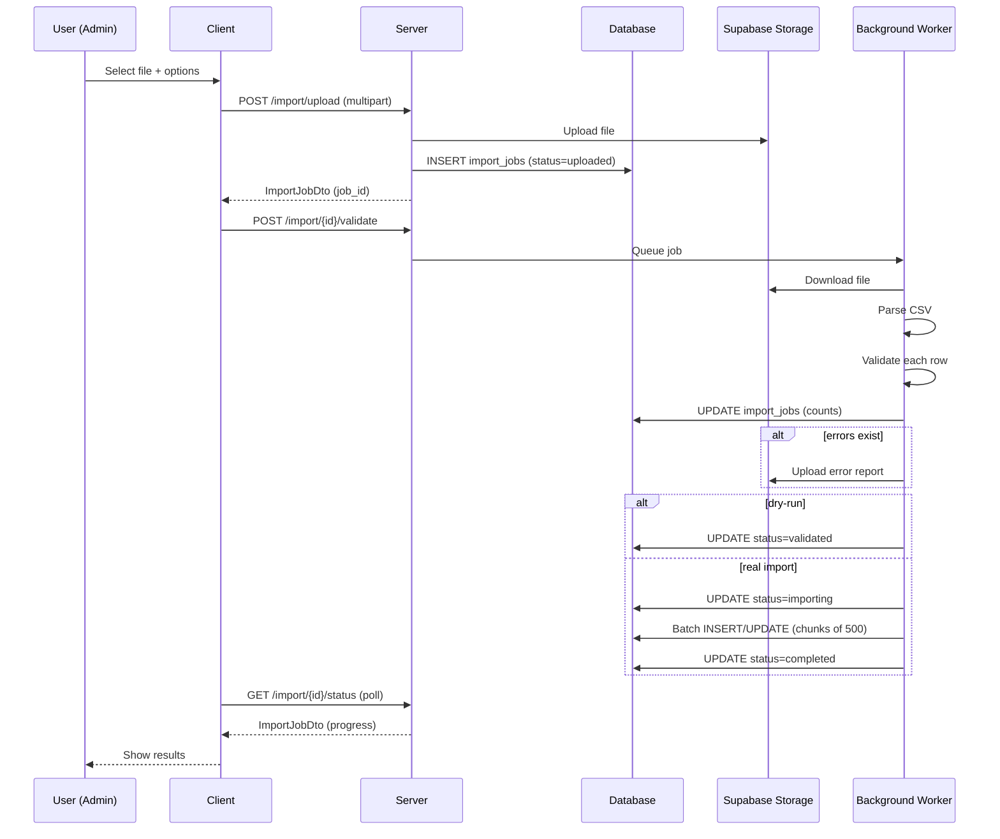
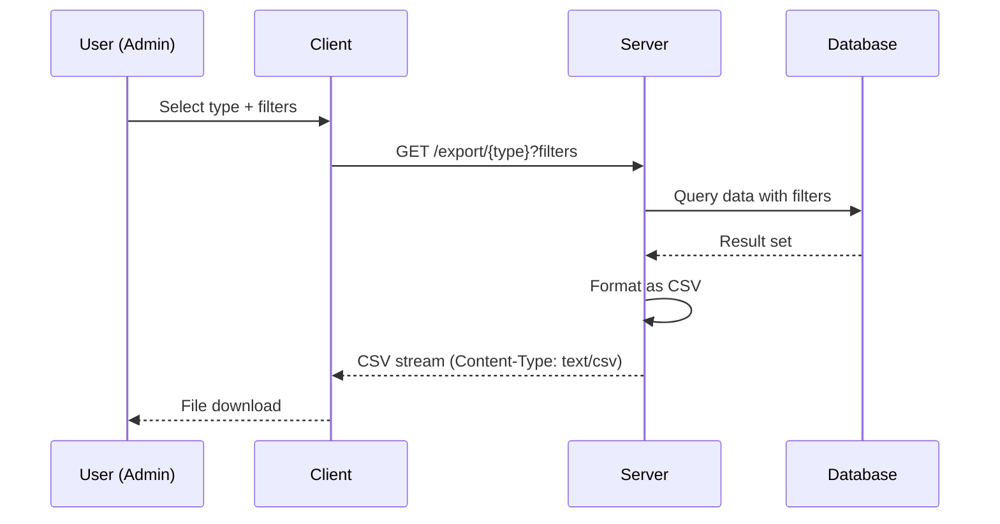

# Bulk Import/Export — Technical Specification

> **Document status:** Implementation-ready blueprint
> **Last updated:** 2026-06-28
> **Prerequisites:** None
> **Unblocks:** Data migration for new schools, `MULTI_BRANCH_SPEC.md`
> **Related specs:** `MULTI_BRANCH_SPEC.md`, `FEE_PAYMENT_SPEC.md`
> **Template:** `_SPEC_TEMPLATE.md` v1 (25 mandatory + 6 optional sections)

---

## 1. Feature Overview

### Purpose

CSV/Excel import and export for students, teachers, marks, fee structures, and other bulk data operations. Enables schools to migrate from spreadsheets/legacy systems and export data for external use.

### Business Value

- Enables rapid onboarding of new schools by importing existing data from spreadsheets
- Reduces manual data entry effort by 90%+ for schools with 500+ students
- Data export prevents lock-in and enables use in other systems
- Template downloads ensure correct data format, reducing import errors

### Goals

- [ ] Import students from CSV/Excel with validation, dedup, and error reporting
- [ ] Import teachers and subject assignments
- [ ] Import assessment marks (bulk entry from spreadsheet)
- [ ] Import fee structures
- [ ] Export any data category to CSV/Excel
- [ ] Template downloads with correct column headers
- [ ] Row-level error reporting with line numbers
- [ ] Dry-run mode (validate without committing)
- [ ] Progress tracking for large imports

### Non-goals

- [ ] Real-time sync with external systems — batch import only
- [ ] Import of complex relational data (e.g., attendance with leave reasons) — future
- [ ] Import from Google Sheets API — future extensibility
- [ ] Scheduled/automated exports — future extensibility

### Dependencies

- `SchoolClassesTable`, `SchoolSubjectsTable` (existing — class/subject validation)
- `StudentsTable`, `TeacherSubjectAssignmentsTable` (existing — bulk creation targets)
- `AssessmentsTable` + `AssessmentMarksTable` (existing — marks import targets)
- `SupabaseStorage.kt` (existing — file storage for uploads)
- `opencsv` library (new dependency for CSV parsing)
- `apache-poi` library (optional, for Excel parsing)

### Related Modules

- Onboarding wizard (existing — has inline bulk entry for classes/subjects)
- `SchoolClassesTable`, `SchoolSubjectsTable`, `StudentsTable`, `TeacherSubjectAssignmentsTable` — all support bulk creation via existing routes
- `SupabaseStorage.kt` — can store uploaded CSV files
- `AssessmentsTable` + `AssessmentMarksTable` — marks entry exists but one-at-a-time

---

## 2. Current System Assessment

### Existing Code

- **Onboarding wizard** has inline bulk entry for classes/subjects (`feature_audit.csv` L159: "Onboarding wizard has bulk entry, no CSV import/export")
- `SchoolClassesTable`, `SchoolSubjectsTable`, `StudentsTable`, `TeacherSubjectAssignmentsTable` — all support bulk creation via existing routes
- `SupabaseStorage.kt` — can store uploaded CSV files
- `AssessmentsTable` + `AssessmentMarksTable` — marks entry exists but one-at-a-time
- No CSV parsing library, no import/export endpoints, no template generation

### Existing Database

- `school_classes`, `school_subjects` — class and subject definitions
- `students` — student records
- `teacher_subject_assignments` — teacher-class-subject mappings
- `assessments`, `assessment_marks` — assessment and marks
- `fee_records`, `payments` — fee and payment records

### Existing APIs

- Bulk creation routes for classes, subjects, students (via onboarding wizard)
- No CSV import, export, or template download endpoints

### Existing UI

- Onboarding wizard has inline bulk entry (text-based, not file upload)
- No import/export UI screens

### Existing Services

- Standard CRUD services for all entities
- No CSV parsing, validation, or import processing services

### Existing Documentation

- `feature_audit.csv` L159: "Onboarding wizard has bulk entry, no CSV import/export"

### Technical Debt

- No file upload for CSV/Excel
- No CSV parsing/validation
- No template downloads
- No export endpoints
- No import progress tracking
- No error reporting with row-level detail

### Gaps

| # | Gap | Impact |
|---|---|---|
| G1 | No CSV import for students | Schools must enter students one-by-one |
| G2 | No CSV import for teachers | Same for teacher onboarding |
| G3 | No bulk marks import | Teachers enter marks one student at a time |
| G4 | No export | Data lock-in; cannot use in other systems |
| G5 | No template downloads | Users don't know required format |
| G6 | No error reporting | Silent failures, data corruption |

---

## 3. Functional Requirements

### FR-001
| Field | Value |
|---|---|
| **Title** | Student Import |
| **Description** | Import students from CSV (name, roll_number, class, section, parent_phone, gender, DOB) |
| **Priority** | Critical |
| **User Roles** | School Admin |
| **Acceptance notes** | Students created with validation; duplicates detected |

### FR-002
| Field | Value |
|---|---|
| **Title** | Teacher Import |
| **Description** | Import teachers from CSV (name, email, phone, subjects, classes) |
| **Priority** | High |
| **User Roles** | School Admin |
| **Acceptance notes** | Teachers created with subject/class assignments |

### FR-003
| Field | Value |
|---|---|
| **Title** | Marks Import |
| **Description** | Import marks from CSV (student_code, subject, assessment_name, marks, max_marks) |
| **Priority** | High |
| **User Roles** | School Admin, Teacher (own class) |
| **Acceptance notes** | Marks entered for existing students and assessments |

### FR-004
| Field | Value |
|---|---|
| **Title** | Fee Structure Import |
| **Description** | Import fee structures from CSV (class, category, amount, due_date, installments) |
| **Priority** | Medium |
| **User Roles** | School Admin |
| **Acceptance notes** | Fee structures created per class with installment schedule |

### FR-005
| Field | Value |
|---|---|
| **Title** | Data Export |
| **Description** | Export students, teachers, marks, attendance, fees to CSV |
| **Priority** | High |
| **User Roles** | School Admin, Teacher (own class for marks/attendance) |
| **Acceptance notes** | CSV export with correct data and filters applied |

### FR-006
| Field | Value |
|---|---|
| **Title** | Template Downloads |
| **Description** | Download import templates (CSV with correct headers + sample row) |
| **Priority** | Medium |
| **User Roles** | School Admin, Teacher |
| **Acceptance notes** | Templates available for each import type with correct headers |

### FR-007
| Field | Value |
|---|---|
| **Title** | Dry-Run Mode |
| **Description** | Dry-run mode: validate all rows, report errors, don't commit |
| **Priority** | High |
| **User Roles** | School Admin, Teacher |
| **Acceptance notes** | Dry-run validates without committing; shows errors |

### FR-008
| Field | Value |
|---|---|
| **Title** | Row-Level Error Reporting |
| **Description** | Row-level error reporting (line number, field, error message) |
| **Priority** | High |
| **User Roles** | School Admin, Teacher |
| **Acceptance notes** | Errors include line number, field name, and descriptive message |

### FR-009
| Field | Value |
|---|---|
| **Title** | Progress Tracking |
| **Description** | Progress tracking for imports > 100 rows |
| **Priority** | Medium |
| **User Roles** | School Admin, Teacher |
| **Acceptance notes** | Status endpoint shows progress (validating, importing, completed) |

### FR-010
| Field | Value |
|---|---|
| **Title** | Duplicate Detection |
| **Description** | Duplicate detection (by student_code, phone, email) |
| **Priority** | High |
| **User Roles** | System |
| **Acceptance notes** | Duplicates flagged; handled per upsert mode |

### FR-011
| Field | Value |
|---|---|
| **Title** | Upsert Mode |
| **Description** | Update existing records if match found (configurable: upsert vs skip) |
| **Priority** | Medium |
| **User Roles** | School Admin |
| **Acceptance notes** | Configurable: skip duplicates, update existing, or upsert |

### FR-012
| Field | Value |
|---|---|
| **Title** | Excel Support |
| **Description** | Support both CSV and Excel (.xlsx) formats |
| **Priority** | Low |
| **User Roles** | School Admin, Teacher |
| **Acceptance notes** | Both CSV and XLSX files accepted and parsed correctly |

---

## 4. User Stories

### School Admin
- [ ] Import students from a CSV file so I can onboard quickly from existing spreadsheets
- [ ] Import teachers from a CSV file so I can set up faculty efficiently
- [ ] Import marks from a CSV file so teachers don't have to enter one-by-one
- [ ] Import fee structures from a CSV file so I can set up fees for all classes
- [ ] Export student data to CSV so I can use it in other systems
- [ ] Export marks/attendance/fees to CSV for reporting
- [ ] Download import templates so I know the correct format
- [ ] Run a dry-run validation to check for errors before committing
- [ ] See row-level errors with line numbers so I can fix issues in my file
- [ ] Download an error report CSV so I can fix and re-upload
- [ ] Track import progress for large files

### Teacher
- [ ] Import marks for my class from a CSV file
- [ ] Download a marks import template
- [ ] Export marks for my class to CSV
- [ ] Export attendance for my class to CSV

---

## 5. Business Rules

### BR-001
**Rule:** File size limit is 10MB for all imports.
**Enforcement:** Server-side check on uploaded file size; reject with `IMPORT_FILE_TOO_LARGE`.

### BR-002
**Rule:** Only CSV and XLSX formats are supported.
**Enforcement:** MIME type validation on upload; reject with `IMPORT_FILE_INVALID_FORMAT`.

### BR-003
**Rule:** Import jobs are processed asynchronously in chunks of 500 rows.
**Enforcement:** `ImportProcessor` processes rows in batches; updates progress incrementally.

### BR-004
**Rule:** Max 2 import jobs processing simultaneously per server.
**Enforcement:** Concurrency limit in background job scheduler.

### BR-005
**Rule:** Dry-run mode validates but does not commit any data.
**Enforcement:** `is_dry_run` flag on import job; `ImportProcessor` stops after validation if dry-run.

### BR-006
**Rule:** Duplicate detection within the same file flags the second occurrence as an error.
**Enforcement:** `ImportProcessor` tracks seen records during validation.

### BR-007
**Rule:** Extra columns in import file are ignored (only mapped columns processed).
**Enforcement:** `CsvParser` maps only known columns; unmapped columns discarded.

### BR-008
**Rule:** Missing required columns cause parse-stage failure (before row validation).
**Enforcement:** `CsvParser` validates headers; rejects if required columns missing.

### BR-009
**Rule:** Excel files with multiple sheets — only first sheet is processed.
**Enforcement:** `CsvParser` (Excel mode) reads only first sheet; warns if multiple sheets detected.

### BR-010
**Rule:** Teacher can only import/export marks for their own class.
**Enforcement:** Role + class assignment check on import/export endpoints.

---

## 6. Database Design

### 6.1 Entity Relationship Summary

```
import_jobs 1───1 schools (school_id)
import_jobs 1───1 app_users (user_id, who initiated)
```

### 6.2 New Tables

```sql
CREATE TABLE import_jobs (
    id              UUID PRIMARY KEY DEFAULT gen_random_uuid(),
    school_id       UUID NOT NULL,
    user_id         UUID NOT NULL,                 -- who initiated the import
    import_type     VARCHAR(32) NOT NULL,          -- students | teachers | marks | fees
    file_url        TEXT NOT NULL,                 -- Supabase Storage URL of uploaded file
    file_name       TEXT NOT NULL,
    status          VARCHAR(16) NOT NULL DEFAULT 'uploaded', -- uploaded | validating | validated | importing | completed | failed
    total_rows      INTEGER NOT NULL DEFAULT 0,
    valid_rows      INTEGER NOT NULL DEFAULT 0,
    error_rows      INTEGER NOT NULL DEFAULT 0,
    created_rows    INTEGER NOT NULL DEFAULT 0,
    updated_rows    INTEGER NOT NULL DEFAULT 0,
    skipped_rows    INTEGER NOT NULL DEFAULT 0,
    error_report_url TEXT,                         -- CSV with row-level errors
    is_dry_run      BOOLEAN NOT NULL DEFAULT false,
    upsert_mode     VARCHAR(16) NOT NULL DEFAULT 'skip', -- skip | update | upsert
    created_at      TIMESTAMP NOT NULL DEFAULT now(),
    updated_at      TIMESTAMP NOT NULL DEFAULT now(),
    completed_at    TIMESTAMP
);
CREATE INDEX idx_import_jobs_school ON import_jobs(school_id, created_at DESC);
```

### 6.3 Modified Tables

N/A — no existing tables modified.

### 6.4 Indexes

| Index | Table | Columns | Purpose |
|---|---|---|---|
| `idx_import_jobs_school` | `import_jobs` | `school_id, created_at DESC` | Query import history per school |

### 6.5 Constraints

| Constraint | Table | Rule |
|---|---|---|
| `CHECK` | `import_jobs.import_type` | One of: students, teachers, marks, fees |
| `CHECK` | `import_jobs.status` | One of: uploaded, validating, validated, importing, completed, failed |
| `CHECK` | `import_jobs.upsert_mode` | One of: skip, update, upsert |

### 6.6 Foreign Keys

| Table | Column | References |
|---|---|---|
| `import_jobs` | `school_id` | `schools.id` |
| `import_jobs` | `user_id` | `app_users.id` |

### 6.7 Soft Delete Strategy

- `import_jobs`: No soft delete — audit trail of all import operations

### 6.8 Audit Fields

| Table | `created_at` | `updated_at` | Other |
|---|---|---|---|
| `import_jobs` | ✅ | ✅ | `completed_at`, `user_id`, `status` |

### 6.9 Migration Notes

- **Migration file:** `docs/db/migration_036_bulk_import_export.sql`
- **Rollback:** See §E. Migration & Rollback
- **Backfill:** No existing data to backfill — new table starts empty
- **Dependencies:** Add `com.opencsv:opencsv:5.9` and `org.apache.poi:poi-ooxml:5.3.0` (optional) to `server/build.gradle.kts`

### 6.10 Exposed Mappings

```kotlin
object ImportJobsTable : UUIDTable("import_jobs", "id") {
    val schoolId       = uuid("school_id")
    val userId         = uuid("user_id")
    val importType     = varchar("import_type", 32)
    val fileUrl        = text("file_url")
    val fileName       = text("file_name")
    val status         = varchar("status", 16).default("uploaded")
    val totalRows      = integer("total_rows").default(0)
    val validRows      = integer("valid_rows").default(0)
    val errorRows      = integer("error_rows").default(0)
    val createdRows    = integer("created_rows").default(0)
    val updatedRows    = integer("updated_rows").default(0)
    val skippedRows    = integer("skipped_rows").default(0)
    val errorReportUrl = text("error_report_url").nullable()
    val isDryRun       = bool("is_dry_run").default(false)
    val upsertMode     = varchar("upsert_mode", 16).default("skip")
    val createdAt      = timestamp("created_at")
    val updatedAt      = timestamp("updated_at")
    val completedAt    = timestamp("completed_at").nullable()
    init { index("idx_import_jobs_school", false, schoolId, createdAt) }
}
```

### 6.11 Seed Data

N/A — no seed data needed.

---

## 7. State Machines

### Import Job State Machine

```
uploaded ──validate──> validating ──validation done──> validated (dry-run)
                           │                              │
                           │                              └──confirm──> importing ──> completed
                           │
                           └──validation failed──> failed
```

| Current State | Event | Next State | Guard / Condition |
|---|---|---|---|
| `uploaded` | Start validation | `validating` | Background worker picks up job |
| `validating` | Validation complete (dry-run) | `validated` | `is_dry_run = true` |
| `validating` | Validation complete (real) | `importing` | `is_dry_run = false`, valid_rows > 0 |
| `validating` | Validation failed (all rows error) | `failed` | `valid_rows = 0` |
| `validated` | Admin confirms import | `importing` | Admin action |
| `importing` | Import complete | `completed` | All valid rows processed |
| `importing` | Import failed | `failed` | Transaction error |

---

## 8. Backend Architecture

### 8.1 Component Overview

```
┌─────────────────────────────────────────────────┐
│                 Client (KMP)                     │
│  ImportScreen → Upload file → Poll status        │
└──────────────────┬──────────────────────────────┘
                   │
                   ▼
┌─────────────────────────────────────────────────┐
│              Backend (Ktor)                      │
│                                                  │
│  ImportRouting                                   │
│    ├── POST /import/upload → store file, create  │
│    │   import_job                                │
│    ├── POST /import/{id}/validate → dry-run      │
│    ├── POST /import/{id}/confirm → commit        │
│    ├── GET /import/{id}/status → progress        │
│    ├── GET /import/{id}/errors → error report    │
│    ├── GET /import/template/{type} → download    │
│    └── GET /export/{type} → CSV download         │
│                                                  │
│  ImportProcessor (background)                    │
│    ├── CsvParser → parse rows                    │
│    ├── Validator → validate each row             │
│    ├── ImporterService → commit to DB            │
│    └── ErrorReportGenerator → CSV error report   │
│                                                  │
│  ExportService                                   │
│    └── Query data → format CSV → stream response │
└──────────────────────────────────────────────────┘
```

### 8.2 Repositories

```kotlin
class ImportJobRepository {
    suspend fun create(job: ImportJob): ImportJob
    suspend fun getById(id: UUID): ImportJob?
    suspend fun updateStatus(id: UUID, status: String): ImportJob
    suspend fun updateCounts(id: UUID, total: Int, valid: Int, error: Int): ImportJob
    suspend fun updateResults(id: UUID, created: Int, updated: Int, skipped: Int, errorReportUrl: String?): ImportJob
    suspend fun getForSchool(schoolId: UUID): List<ImportJob>
}
```

### 8.3 Services

```kotlin
class ImportProcessor(
    private val csvParser: CsvParser,
    private val validators: Map<String, ImportValidator>,
    private val importers: Map<String, ImportImporter>,
    private val storage: SupabaseStorage
) {
    suspend fun process(jobId: UUID) {
        val job = jobRepository.get(jobId)
        job.status = "validating"

        // 1. Download file from Supabase Storage
        val fileContent = storage.download(job.fileUrl)

        // 2. Parse CSV/Excel
        val rows = csvParser.parse(fileContent, job.importType)
        job.totalRows = rows.size

        // 3. Validate each row
        val validator = validators[job.importType]!!
        val errors = mutableListOf<RowError>()
        val validRows = mutableListOf<ParsedRow>()

        for ((index, row) in rows.withIndex()) {
            val result = validator.validate(row, job.schoolId)
            if (result.isValid) validRows.add(row)
            else errors.add(RowError(lineNumber = index + 2, field = result.field, message = result.message))
        }

        job.validRows = validRows.size
        job.errorRows = errors.size

        // 4. Generate error report if errors exist
        if (errors.isNotEmpty()) {
            job.errorReportUrl = generateErrorReport(errors, job)
        }

        // 5. If dry-run, stop here
        if (job.isDryRun) {
            job.status = "validated"
            return
        }

        // 6. Import valid rows
        job.status = "importing"
        val importer = importers[job.importType]!!
        val importResult = importer.import(validRows, job.schoolId, job.upsertMode)

        job.createdRows = importResult.created
        job.updatedRows = importResult.updated
        job.skippedRows = importResult.skipped
        job.status = "completed"
        job.completedAt = now()
    }
}
```

### 8.4 Validators

Each import type has a dedicated validator:

```kotlin
class StudentImportValidator : ImportValidator {
    override suspend fun validate(row: ParsedRow, schoolId: UUID): ValidationResult {
        // Required: full_name, class_name, section
        // Optional: roll_number, parent_phone, gender, date_of_birth
        // Validate:
        //   - full_name not blank, ≤ 100 chars
        //   - class_name exists in school_classes for school
        //   - section is valid for the class
        //   - parent_phone is valid E.164 if provided
        //   - gender is MALE/FEMALE/OTHER if provided
        //   - date_of_birth is valid date if provided
        //   - student_code auto-generated if not provided
        //   - duplicate check: (class_name, section, roll_number) or parent_phone
    }
}

class MarksImportValidator : ImportValidator {
    override suspend fun validate(row: ParsedRow, schoolId: UUID): ValidationResult {
        // Required: student_code, assessment_name, subject, marks
        // Validate:
        //   - student_code exists in students table
        //   - assessment_name exists in assessments for class+subject
        //   - marks is numeric, 0 <= marks <= max_marks
        //   - subject exists in school_subjects
    }
}
```

### 8.5 Importers

```kotlin
class StudentImporter : ImportImporter {
    override suspend fun import(rows: List<ParsedRow>, schoolId: UUID, upsertMode: String): ImportResult {
        var created = 0; var updated = 0; var skipped = 0
        for (row in rows) {
            val existing = findExisting(row, schoolId)
            if (existing != null) {
                when (upsertMode) {
                    "skip" -> skipped++
                    "update", "upsert" -> { updateStudent(existing, row); updated++ }
                }
            } else {
                createStudent(row, schoolId)
                created++
            }
        }
        return ImportResult(created, updated, skipped)
    }
}
```

### 8.6 ExportService

```kotlin
class ExportService {
    suspend fun exportStudents(schoolId: UUID, classId: UUID?): String  // CSV string
    suspend fun exportTeachers(schoolId: UUID): String
    suspend fun exportMarks(schoolId: UUID, classId: UUID, assessmentId: UUID): String
    suspend fun exportAttendance(schoolId: UUID, classId: UUID, dateFrom: LocalDate, dateTo: LocalDate): String
    suspend fun exportFees(schoolId: UUID, status: String?): String
}
```

Export streams CSV directly in HTTP response (`Content-Type: text/csv`, `Content-Disposition: attachment`).

### 8.7 Template Generator

```kotlin
fun generateTemplate(type: ImportType): String {
    return when (type) {
        ImportType.STUDENTS -> "full_name,roll_number,class_name,section,parent_phone,gender,date_of_birth\n" +
            "John Doe,101,Grade 5,A,+919876543210,MALE,2015-06-15"
        ImportType.TEACHERS -> "full_name,email,phone,subjects,classes\n" +
            "Jane Smith,jane@school.com,+919876543211,Mathematics|Science,Grade 5|Grade 6"
        ImportType.MARKS -> "student_code,assessment_name,subject,marks,max_marks\n" +
            "S001,Unit Test 1,Mathematics,85,100"
        ImportType.FEES -> "class_name,category,amount,due_date,installment_count\n" +
            "Grade 5,Tuition,15000,2026-07-15,3"
    }
}
```

### 8.8 Validators (Validation Rules)

#### Students Import

| Field | Required | Rule |
|---|---|---|
| full_name | Yes | Non-blank, ≤ 100 chars |
| roll_number | No | If provided, unique within class+section |
| class_name | Yes | Must exist in `school_classes` for school |
| section | Yes | Must be valid section for the class |
| parent_phone | No | E.164 format if provided |
| gender | No | MALE, FEMALE, or OTHER |
| date_of_birth | No | YYYY-MM-DD, not in future |

#### Teachers Import

| Field | Required | Rule |
|---|---|---|
| full_name | Yes | Non-blank, ≤ 100 chars |
| email | No | Valid email format if provided |
| phone | No | E.164 format if provided |
| subjects | No | Pipe-separated list |
| classes | No | Pipe-separated list |

#### Marks Import

| Field | Required | Rule |
|---|---|---|
| student_code | Yes | Must exist in `students` table |
| assessment_name | Yes | Must exist in `assessments` for student's class+subject |
| subject | Yes | Must exist in `school_subjects` |
| marks | Yes | Numeric, 0 ≤ marks ≤ max_marks |
| max_marks | No | Default 100 if not provided |

### 8.9 Mappers

```kotlin
fun ImportJob.toDto(): ImportJobDto
fun ParsedRow.toStudentCreateRequest(): CreateStudentRequest
fun ParsedRow.toTeacherCreateRequest(): CreateTeacherRequest
fun ParsedRow.toMarksEntryRequest(): MarksEntryRequest
fun RowError.toCsvRow(): String
```

### 8.10 Permission Checks

| Endpoint | Role Check | School Isolation |
|---|---|---|
| `POST /school/import/upload` | School Admin / Teacher (marks only) | School ID from JWT |
| `POST /school/import/{id}/validate` | School Admin / Teacher (marks only) | School ID from JWT |
| `POST /school/import/{id}/confirm` | School Admin / Teacher (marks only) | School ID from JWT |
| `GET /school/import/{id}/status` | School Admin / Teacher (own jobs) | School ID from JWT |
| `GET /school/import/template/{type}` | School Admin / Teacher | N/A |
| `GET /school/export/{type}` | School Admin / Teacher (own class for marks/attendance) | School ID from JWT |

### 8.11 Background Jobs

| Job | Schedule | Description | Error handling |
|---|---|---|---|
| Import processing | Async (on upload) | Parse, validate, import CSV/Excel data | Chunk processing; log per-chunk errors; continue |
| Export generation | Sync (on request) | Query data and stream CSV | Stream directly; no background needed |

### 8.12 Domain Events

| Event | Emitted By | Consumed By | Side Effect |
|---|---|---|---|
| `ImportJobCreated` | Upload endpoint | `import_jobs` INSERT | Job queued for processing |
| `ImportValidated` | `ImportProcessor` | `import_jobs` UPDATE | Status='validated'; error report generated |
| `ImportCompleted` | `ImportProcessor` | `import_jobs` UPDATE | Status='completed'; counts updated |
| `ImportFailed` | `ImportProcessor` | `import_jobs` UPDATE | Status='failed'; error logged |
| `ExportRequested` | Export endpoint | Metrics | Counter incremented |

### 8.13 Caching

- Template content cached (static, never changes unless schema changes)
- No other caching needed

### 8.14 Transactions

| Operation | Transaction Scope |
|---|---|
| Import chunk (500 rows) | Batch INSERT/UPDATE in transaction; rollback on failure |
| Export | Read-only; no transaction needed |

### 8.15 Import Processing Detail

Import processing runs as a background coroutine:
1. Job created with `status=uploaded`
2. Background worker picks up `status=uploaded` jobs
3. Processes in chunks of 500 rows
4. Updates `status` and counts incrementally
5. Generates error report CSV if errors exist
6. Sets `status=completed` or `status=failed`

**Concurrency:** Max 2 import jobs processing simultaneously per server.

---

## 9. API Contracts

### 9.1 Upload Import File

#### `POST /api/v1/school/import/upload`
| Field | Value |
|---|---|
| **Description** | Upload CSV/Excel file for import |
| **Authorization** | School Admin / Teacher (marks only) |
| **Content-Type** | multipart/form-data |
| **Rate Limit** | 5/min per user |
| **201 Response** | `ImportJobDto` |
| **Errors** | 413 `IMPORT_FILE_TOO_LARGE`, 415 `IMPORT_FILE_INVALID_FORMAT` |

**Request:**
```
file: <csv/xlsx file>
import_type: students
is_dry_run: true
upsert_mode: skip
```

**Response:**
```json
{
  "success": true,
  "data": {
    "job_id": "uuid",
    "status": "uploaded",
    "file_name": "students.csv"
  }
}
```

### 9.2 Validate (Dry Run)

#### `POST /api/v1/school/import/{jobId}/validate`
| Field | Value |
|---|---|
| **Description** | Trigger validation for import job |
| **Authorization** | School Admin / Teacher (marks only) |
| **Rate Limit** | 10/min per user |
| **200 Response** | `ImportJobDto` with validation counts |
| **Errors** | 404 `IMPORT_JOB_NOT_FOUND`, 409 `IMPORT_ALREADY_COMPLETED` |

### 9.3 Confirm Import

#### `POST /api/v1/school/import/{jobId}/confirm`
| Field | Value |
|---|---|
| **Description** | Commit valid rows to database |
| **Authorization** | School Admin / Teacher (marks only) |
| **Rate Limit** | 5/min per user |
| **200 Response** | `ImportJobDto` with final counts |
| **Errors** | 404 `IMPORT_JOB_NOT_FOUND`, 400 `IMPORT_NO_VALID_ROWS` |

### 9.4 Job Status

#### `GET /api/v1/school/import/{jobId}/status`
| Field | Value |
|---|---|
| **Description** | Get import job status and progress |
| **Authorization** | School Admin / Teacher (own jobs) |
| **Rate Limit** | 60/min per user |
| **200 Response** | `ImportJobDto` |

**Response:**
```json
{
  "success": true,
  "data": {
    "job_id": "uuid",
    "status": "completed",
    "total_rows": 500,
    "valid_rows": 480,
    "error_rows": 20,
    "created_rows": 450,
    "updated_rows": 30,
    "skipped_rows": 0,
    "error_report_url": "https://supabase.co/...",
    "completed_at": "2026-06-27T10:35:00Z"
  }
}
```

### 9.5 Download Error Report

#### `GET /api/v1/school/import/{jobId}/errors`
| Field | Value |
|---|---|
| **Description** | Download error report CSV |
| **Authorization** | School Admin / Teacher (own jobs) |
| **Rate Limit** | 10/min per user |
| **200 Response** | CSV file download |

### 9.6 Download Template

#### `GET /api/v1/school/import/template/{type}`
| Field | Value |
|---|---|
| **Description** | Download import template CSV |
| **Authorization** | School Admin / Teacher |
| **Rate Limit** | 30/min per user |
| **200 Response** | CSV file download |

### 9.7 Export

#### `GET /api/v1/school/export/{type}?class_id={uuid}&date_from={YYYY-MM-DD}&date_to={YYYY-MM-DD}`
| Field | Value |
|---|---|
| **Description** | Export data to CSV |
| **Authorization** | School Admin / Teacher (own class for marks/attendance) |
| **Rate Limit** | 10/min per user |
| **200 Response** | CSV file download |
| **Query params** | `type`: students, teachers, marks, attendance, fees; `class_id`, `date_from`, `date_to`, `status` (fees only) |

---

## 10. Frontend Architecture

### 10.1 Screens

| Screen | Platform | Role | Description |
|---|---|---|---|
| `ImportScreen` | Android/iOS/Web | Admin, Teacher | Import wizard (upload, validate, confirm) |
| `ExportScreen` | Android/iOS/Web | Admin, Teacher | Export data with filters |
| `ImportHistoryScreen` | Android/iOS/Web | Admin | View past import jobs and results |

### 10.2 Navigation

```
Admin Dashboard → Data Management → Import → ImportScreen
                                     → Export → ExportScreen
                                     → History → ImportHistoryScreen
```

### 10.3 UX Flows

#### Import Flow
```
Admin Dashboard → Data Management → Import
  → Select data type (Students/Teachers/Marks/Fees)
  → Download template (optional)
  → Upload CSV/Excel file
  → Select options (dry-run, upsert mode)
  → Submit → Validation runs
  → Show results: X valid, Y errors
  → Review errors (downloadable error report)
  → Confirm import (if dry-run) → Data committed
  → Summary: X created, Y updated, Z skipped
```

#### Export Flow
```
Admin Dashboard → Data Management → Export
  → Select data type
  → Select filters (class, date range, etc.)
  → Click Export → CSV/Excel downloaded
```

### 10.4 State Management

```kotlin
sealed class ImportState {
    object Idle : ImportState()
    data class Uploaded(val jobId: String) : ImportState()
    object Validating : ImportState()
    data class Validated(val result: ImportJobDto) : ImportState()
    object Importing : ImportState()
    data class Completed(val result: ImportJobDto) : ImportState()
    data class Error(val message: String) : ImportState()
}
sealed class ExportState {
    object Idle : ExportState()
    object Exporting : ExportState()
    data class Downloaded(val file: ByteArray) : ExportState()
    data class Error(val message: String) : ExportState()
}
```

### 10.5 Offline Support

- Import/export requires internet (server-side processing)
- Template files can be cached locally after first download

### 10.6 Loading States

- Upload: progress bar during file upload
- Validation: spinner with "Validating..." message
- Import: progress bar with "Importing X of Y rows..."
- Export: spinner with "Generating export..."

### 10.7 Error Handling (UI)

- File too large: "File exceeds 10MB limit. Please reduce file size."
- Invalid format: "Only CSV and XLSX files are supported."
- No valid rows: "All rows have validation errors. Download error report to fix."
- Job not found: "Import job not found. Please start a new import."

### 10.8 Search & Filtering

- Import history: filter by type, status, date range
- Export: filter by class, date range, fee status

### 10.9 Pagination

- Import history: cursor-based, 20 per page

### 10.10 File Picker

- **Android:** `ActivityResultContracts.GetContent()` with MIME types `text/csv`, `application/vnd.openxmlformats-officedocument.spreadsheetml.sheet`
- **iOS:** `UIDocumentPickerViewController` with same UTIs
- File size limit: 10MB

---

## 11. Shared Module Changes (KMP)

### 11.1 DTOs

```kotlin
@Serializable
data class ImportJobDto(
    val jobId: String, val status: String, val fileName: String,
    val importType: String, val totalRows: Int, val validRows: Int,
    val errorRows: Int, val createdRows: Int, val updatedRows: Int,
    val skippedRows: Int, val errorReportUrl: String?, val isDryRun: Boolean,
    val upsertMode: String, val completedAt: String?
)
@Serializable
data class UploadImportRequest(
    val importType: String, val isDryRun: Boolean, val upsertMode: String
)
@Serializable
data class ExportRequest(
    val type: String, val classId: String?, val dateFrom: String?, val dateTo: String?, val status: String?
)
```

### 11.2 Domain Models

```kotlin
data class ImportJob(
    val id: UUID, val schoolId: UUID, val userId: UUID,
    val importType: ImportType, val status: ImportStatus,
    val totalRows: Int, val validRows: Int, val errorRows: Int,
    val createdRows: Int, val updatedRows: Int, val skippedRows: Int,
    val errorReportUrl: String?, val isDryRun: Boolean, val upsertMode: UpsertMode
)
enum class ImportType { STUDENTS, TEACHERS, MARKS, FEES }
enum class ImportStatus { UPLOADED, VALIDATING, VALIDATED, IMPORTING, COMPLETED, FAILED }
enum class UpsertMode { SKIP, UPDATE, UPSERT }
enum class ExportType { STUDENTS, TEACHERS, MARKS, ATTENDANCE, FEES }
```

### 11.3 Repository Interfaces

```kotlin
interface ImportRepository {
    suspend fun uploadFile(type: String, file: ByteArray, fileName: String, isDryRun: Boolean, upsertMode: String): NetworkResult<ImportJobDto>
    suspend fun validateJob(jobId: String): NetworkResult<ImportJobDto>
    suspend fun confirmJob(jobId: String): NetworkResult<ImportJobDto>
    suspend fun getJobStatus(jobId: String): NetworkResult<ImportJobDto>
    suspend fun downloadErrorReport(jobId: String): NetworkResult<ByteArray>
    suspend fun getJobHistory(): NetworkResult<List<ImportJobDto>>
}
interface ExportRepository {
    suspend fun downloadTemplate(type: String): NetworkResult<ByteArray>
    suspend fun exportData(type: String, filters: Map<String, String>): NetworkResult<ByteArray>
}
```

### 11.4 UseCases

```kotlin
class UploadImportUseCase(private val repo: ImportRepository)
class ValidateImportUseCase(private val repo: ImportRepository)
class ConfirmImportUseCase(private val repo: ImportRepository)
class GetImportStatusUseCase(private val repo: ImportRepository)
class DownloadErrorReportUseCase(private val repo: ImportRepository)
class GetImportHistoryUseCase(private val repo: ImportRepository)
class DownloadTemplateUseCase(private val repo: ExportRepository)
class ExportDataUseCase(private val repo: ExportRepository)
```

### 11.5 Validation

```kotlin
object ImportValidator {
    fun validateFileType(mimeType: String): ValidationResult
    fun validateFileSize(sizeBytes: Long): ValidationResult  // ≤ 10MB
    fun validateImportType(type: String): ValidationResult
    fun validateUpsertMode(mode: String): ValidationResult
}
```

### 11.6 Serialization

- `kotlinx.serialization` with `@SerialName` for snake_case JSON mapping
- Enums serialized as lowercase strings
- File upload uses multipart form data (not JSON)

### 11.7 Network APIs

```kotlin
interface ImportApi {
    @Multipart
    @POST("api/v1/school/import/upload")
    suspend fun uploadFile(@Part file: MultipartBody.Part, @Part("import_type") type: RequestPart,
        @Part("is_dry_run") dryRun: RequestPart, @Part("upsert_mode") upsertMode: RequestPart): NetworkResult<ImportJobDto>
    @POST("api/v1/school/import/{jobId}/validate") suspend fun validateJob(@Path("jobId") jobId: String): NetworkResult<ImportJobDto>
    @POST("api/v1/school/import/{jobId}/confirm") suspend fun confirmJob(@Path("jobId") jobId: String): NetworkResult<ImportJobDto>
    @GET("api/v1/school/import/{jobId}/status") suspend fun getJobStatus(@Path("jobId") jobId: String): NetworkResult<ImportJobDto>
    @GET("api/v1/school/import/{jobId}/errors") suspend fun downloadErrorReport(@Path("jobId") jobId: String): NetworkResult<ByteArray>
    @GET("api/v1/school/import/template/{type}") suspend fun downloadTemplate(@Path("type") type: String): NetworkResult<ByteArray>
}
interface ExportApi {
    @GET("api/v1/school/export/{type}") suspend fun exportData(
        @Path("type") type: String, @Query("class_id") classId: String?,
        @Query("date_from") dateFrom: String?, @Query("date_to") dateTo: String?,
        @Query("status") status: String?
    ): NetworkResult<ByteArray>
}
```

### 11.8 Database Models (Local Cache)

N/A — no local SQLDelight tables for import/export. All operations are server-side.

---

## 12. Permissions Matrix

| Action | School Admin | Teacher | Parent |
|---|---|---|---|
| Import students | ✅ | ❌ | ❌ |
| Import teachers | ✅ | ❌ | ❌ |
| Import marks | ✅ | ✅ (own class) | ❌ |
| Import fee structures | ✅ | ❌ | ❌ |
| Export students | ✅ | ❌ | ❌ |
| Export marks | ✅ | ✅ (own class) | ❌ |
| Export attendance | ✅ | ✅ (own class) | ❌ |
| Export fees | ✅ | ❌ | ❌ |
| Download templates | ✅ | ✅ | ❌ |
| View import history | ✅ | ✅ (own jobs) | ❌ |

---

## 13. Notifications

### N-001
| Field | Value |
|---|---|
| **Trigger** | Import job completed |
| **Recipient** | User who initiated import |
| **Template** | "Import completed: {created} created, {updated} updated, {skipped} skipped, {errors} errors." |
| **Channel** | In-app + FCM |
| **Retry policy** | 3 retries with 5s backoff |
| **Deduplication** | By `job_id` |

### N-002
| Field | Value |
|---|---|
| **Trigger** | Import job failed |
| **Recipient** | User who initiated import |
| **Template** | "Import failed: {error_message}. Please check your file and try again." |
| **Channel** | In-app + FCM |
| **Retry policy** | 3 retries with 5s backoff |
| **Deduplication** | By `job_id` |

### N-003
| Field | Value |
|---|---|
| **Trigger** | Import validation complete (dry-run) |
| **Recipient** | User who initiated import |
| **Template** | "Validation complete: {valid} valid rows, {errors} errors. Review and confirm to proceed." |
| **Channel** | In-app |
| **Retry policy** | 3 retries with 5s backoff |
| **Deduplication** | By `job_id` |

---

## 14. Background Jobs

| Job | Schedule | Description | Error handling |
|---|---|---|---|
| Import processing | Async (on upload) | Parse, validate, import CSV/Excel data in chunks of 500 | Log per-chunk errors; rollback chunk on failure; continue |
| Export generation | Sync (on request) | Query data and stream CSV | Stream directly; no background needed |

**Concurrency:** Max 2 import jobs processing simultaneously per server.

---

## 15. Integrations

### Supabase Storage
| Field | Value |
|---|---|
| **System** | Supabase Storage |
| **Purpose** | Store uploaded CSV/Excel files and error report CSVs |
| **API / SDK** | Supabase Storage API |
| **Auth method** | Service role key |
| **Fallback** | If upload fails, retry 3x; return error to user |

### opencsv Library
| Field | Value |
|---|---|
| **System** | opencsv |
| **Purpose** | CSV parsing and writing |
| **API / SDK** | `com.opencsv:opencsv:5.9` |
| **Auth method** | N/A (library) |
| **Fallback** | N/A |

### Apache POI (Optional)
| Field | Value |
|---|---|
| **System** | Apache POI |
| **Purpose** | Excel (.xlsx) parsing |
| **API / SDK** | `org.apache.poi:poi-ooxml:5.3.0` |
| **Auth method** | N/A (library) |
| **Fallback** | If Excel parsing fails, suggest CSV format |

---

## 16. Security

### Authentication
- JWT-based authentication (existing pattern)
- School Admin and Teacher roles only
- Teacher restricted to own class for marks import/export

### Authorization
- Role-based access control (see §12. Permissions Matrix)
- School isolation: all queries scoped by `school_id` from JWT
- Teacher class restriction: marks/attendance export limited to assigned classes

### Encryption
- All API communication over HTTPS/TLS
- Files stored in Supabase Storage with service role key
- No sensitive data in import files beyond student/teacher PII (name, phone, email)

### Audit Logs
- Import job creation logged with `user_id`, `school_id`, `import_type`, `file_name`
- Import completion logged with counts (created, updated, skipped, errors)
- Export requests logged with `user_id`, `type`, filters

### PII Handling
- Import files may contain student PII (name, phone, DOB, parent phone)
- Files stored in Supabase Storage (private bucket)
- Error reports may contain PII from failed rows
- Export files contain PII — streamed directly to user, not stored

### Rate Limiting

| Endpoint | Rate Limit |
|---|---|
| `POST /school/import/upload` | 5/min per user |
| `POST /school/import/{id}/validate` | 10/min per user |
| `POST /school/import/{id}/confirm` | 5/min per user |
| `GET /school/import/{id}/status` | 60/min per user |
| `GET /school/import/template/{type}` | 30/min per user |
| `GET /school/export/{type}` | 10/min per user |

### Input Validation
- File size: ≤ 10MB
- File type: CSV (`text/csv`) or XLSX (`application/vnd.openxmlformats-officedocument.spreadsheetml.sheet`)
- Import type: students, teachers, marks, fees
- Upsert mode: skip, update, upsert
- CSV headers validated against required columns
- Row-level validation per import type (see §8.8)
- SQL injection prevention via Exposed ORM parameterized queries
- MIME type validation on upload
- Macro scanning for Excel files (reject if macros detected)

---

## 17. Performance & Scalability

### Expected Scale

| Metric | 10 schools | 100 schools | 1000 schools |
|---|---|---|---|
| Import jobs/month | 50 | 500 | 5,000 |
| Rows per import (avg) | 200 | 300 | 500 |
| Export requests/month | 100 | 1,000 | 10,000 |
| Concurrent imports | 1-2 | 2 | 2 (max per server) |

### Latency Targets

| Operation | Target |
|---|---|
| Upload file (10MB) | < 5s |
| Validate 500 rows | < 10s |
| Import 500 rows | < 15s |
| Import 10,000 rows | < 60s |
| Export 1,000 rows | < 5s |
| Template download | < 1s |

### Optimization Strategy
- **Chunking:** Process rows in chunks of 500; update progress incrementally
- **Streaming:** Export streams CSV directly (no in-memory buffer)
- **Concurrency:** Max 2 import jobs per server
- **Indexes:** `idx_import_jobs_school` for history queries
- **File size limit:** 10MB to prevent OOM

---

## 18. Edge Cases

| # | Scenario | Expected Behavior |
|---|---|---|
| EC-001 | Empty CSV (headers only) | Total rows = 0, status = completed, created = 0 |
| EC-002 | Missing required columns | Validation fails at parse stage, error before row validation |
| EC-003 | Extra columns | Ignored (only mapped columns processed) |
| EC-004 | Unicode names (Hindi, Tamil, etc.) | UTF-8 encoding required; validate file encoding |
| EC-005 | Very large file (10K+ rows) | Process in chunks of 500; update progress every chunk |
| EC-006 | Duplicate rows within same file | Second occurrence flagged as error (duplicate within file) |
| EC-007 | Class doesn't exist | Row error with suggestion to create class first |
| EC-008 | Excel with multiple sheets | Only first sheet processed; warn if multiple sheets detected |
| EC-009 | Non-UTF-8 encoding | Detect encoding; convert to UTF-8; reject if unconvertable |
| EC-010 | Excel file with macros | Reject with security warning |

### Risks & Mitigations

| Risk | Likelihood | Impact | Mitigation |
|---|---|---|---|
| CSV encoding issues (non-UTF-8) | Medium | Medium | Detect encoding; convert to UTF-8; reject if unconvertable |
| Large file OOM | Low | High | Stream parsing; chunk processing; 10MB file limit |
| Malicious file upload | Low | Medium | Validate MIME type; scan for macros; server-side parsing only |
| Data corruption from bad import | Medium | High | Dry-run mode; transaction per chunk; rollback on failure |
| Excel library bloat | Low | Low | Make Excel support optional (CSV first) |

---

## 19. Error Handling

### Standard Error Codes

| HTTP | Error Code | Description | When |
|---|---|---|---|
| 400 | `BAD_REQUEST` | Invalid input | Malformed request body or params |
| 400 | `IMPORT_NO_VALID_ROWS` | All rows have validation errors | No valid rows to import |
| 401 | `UNAUTHORIZED` | Not authenticated | Missing or invalid token |
| 403 | `FORBIDDEN` | Insufficient permissions | Role not allowed or class restriction |
| 404 | `IMPORT_JOB_NOT_FOUND` | Import job not found | Invalid job_id |
| 409 | `IMPORT_ALREADY_COMPLETED` | Job already completed | Cannot re-validate completed job |
| 413 | `IMPORT_FILE_TOO_LARGE` | File exceeds 10MB limit | File size > 10MB |
| 415 | `IMPORT_FILE_INVALID_FORMAT` | Only CSV and XLSX supported | Wrong MIME type |

### Error Response Format

```json
{
  "success": false,
  "error": {
    "code": "IMPORT_FILE_TOO_LARGE",
    "message": "File exceeds 10MB limit",
    "field": "file",
    "details": {"max_size_mb": 10, "actual_size_mb": 15.3}
  }
}
```

### Recovery Strategy

| Error | Client Action |
|---|---|
| `IMPORT_FILE_TOO_LARGE` | Show "File exceeds 10MB limit" message |
| `IMPORT_FILE_INVALID_FORMAT` | Show "Only CSV and XLSX supported" message |
| `IMPORT_NO_VALID_ROWS` | Show error report download link |
| `IMPORT_JOB_NOT_FOUND` | Redirect to import screen |
| `IMPORT_ALREADY_COMPLETED` | Show completed job summary |

---

## 20. Analytics & Reporting

### Reports

| Report | Format | Roles | Description |
|---|---|---|---|
| Import history | CSV | Admin | All import jobs with counts and status |
| Export log | CSV | Admin | All export requests with type and filters |

### KPIs

- **Import Success Rate:** `completed / total_imports`
- **Average Import Size:** `avg(total_rows)` per import
- **Error Rate per Import:** `avg(error_rows / total_rows)`
- **Export Usage:** `export_requests_total` by type

### Dashboards

| Widget | Data Source | Description |
|---|---|---|
| Import summary | `import_jobs` aggregate | Jobs by type, status, counts |
| Recent imports | `import_jobs` ORDER BY created_at DESC | Last 10 import jobs |
| Error rate trend | `import_jobs` over time | Error rate per week |

### Exports

- CSV export of import job history
- CSV export of error reports (per job)

---

## 21. Testing Strategy

### Unit Tests
- [ ] CSV parsing — correct column mapping, UTF-8 handling
- [ ] Student validation — all field rules, edge cases
- [ ] Marks validation — student_code exists, marks within range
- [ ] Duplicate detection — within file and against DB
- [ ] Template generation — correct headers and sample row
- [ ] Error report generation — correct format with line numbers
- [ ] Upsert mode — skip, update, upsert behavior
- [ ] File size validation — reject > 10MB
- [ ] File type validation — reject non-CSV/XLSX

### Integration Tests
- [ ] Upload students CSV → validate → confirm → students created in DB
- [ ] Dry-run mode → no data committed
- [ ] Upsert mode → existing student updated, new student created
- [ ] Error report → downloadable CSV with correct error details
- [ ] Export students → CSV matches DB data
- [ ] Export with filters → only matching rows exported
- [ ] Large file (1000 rows) → completes within 60s
- [ ] Excel file import → same as CSV
- [ ] Unicode names → UTF-8 handling correct
- [ ] Empty CSV → completed with 0 rows

### UI Tests
- [ ] Import wizard: upload → validate → confirm flow
- [ ] Export screen: filter and download
- [ ] Error report download
- [ ] Template download
- [ ] File picker opens with correct MIME types

### Performance Tests
- [ ] Import 10,000 rows → completes within 60s
- [ ] Export 10,000 rows → completes within 10s
- [ ] Concurrent imports (2 jobs) → both complete without interference

### Security Tests
- [ ] Teacher cannot import students
- [ ] Teacher can only import/export marks for own class
- [ ] School A admin cannot access School B's import jobs
- [ ] Malicious file (macros) rejected
- [ ] Non-UTF-8 file handled gracefully

### Offline Tests
- [ ] Import disabled offline with clear message
- [ ] Export disabled offline with clear message
- [ ] Template cached for offline access after first download

### Migration Tests
- [ ] Migration up: `import_jobs` table created
- [ ] Migration down: `import_jobs` table dropped
- [ ] No existing data affected

### Regression Tests
- [ ] Existing onboarding wizard bulk entry still works
- [ ] Existing student/teacher creation routes unaffected
- [ ] Existing marks entry unaffected

---

## 22. Acceptance Criteria

- [ ] FR-001: Admin can upload CSV/Excel file for student/teacher/marks/fee import
- [ ] FR-002: Template downloads available for each import type
- [ ] FR-003: Dry-run validation reports errors without committing
- [ ] FR-004: Row-level errors include line number, field, and message
- [ ] FR-005: Error report is downloadable as CSV
- [ ] FR-006: Confirm import creates/updates/skips records correctly
- [ ] FR-007: Upsert mode updates existing records
- [ ] FR-008: Export generates CSV for students, teachers, marks, attendance, fees
- [ ] FR-009: Export respects filters (class, date range, status)
- [ ] FR-010: Import progress is trackable via status endpoint
- [ ] FR-011: Large files (1000+ rows) process within 60 seconds
- [ ] FR-012: Both CSV and XLSX formats supported

---

## 23. Implementation Roadmap

| Phase | Duration | Tasks | Deliverable |
|---|---|---|---|
| 1 | 1 day | DB migration, Exposed table, CSV parser integration | Migration + table + parser |
| 2 | 3 days | Validators (student, teacher, marks, fees) | All validators working |
| 3 | 3 days | Importers (student, teacher, marks, fees) | All importers working |
| 4 | 2 days | ImportProcessor (background job, chunking, progress) | Background processing |
| 5 | 2 days | Error report generator | Error CSV generation |
| 6 | 2 days | ExportService (all data types) | All exports working |
| 7 | 2 days | Template generator | Templates for all types |
| 8 | 2 days | API endpoints (upload, validate, confirm, status, export, template) | All endpoints |
| 9 | 3 days | Client UI (import wizard, export buttons, file picker) | Screens functional |
| 10 | 2 days | Tests (unit + integration) | All tests passing |

---

## 24. File-Level Impact Analysis

### Server (Ktor backend)

| File | Change Type | Description |
|---|---|---|
| `server/.../db/Tables.kt` | Add | `ImportJobsTable` |
| `server/.../db/DatabaseFactory.kt` | Modify | Register new table |
| `server/.../feature/import/CsvParser.kt` | New | CSV/Excel parsing |
| `server/.../feature/import/ImportValidator.kt` | New | Validator interface + implementations |
| `server/.../feature/import/ImportImporter.kt` | New | Importer interface + implementations |
| `server/.../feature/import/ImportProcessor.kt` | New | Background processing |
| `server/.../feature/import/ErrorReportGenerator.kt` | New | Error CSV generation |
| `server/.../feature/import/ExportService.kt` | New | Data export |
| `server/.../feature/import/TemplateGenerator.kt` | New | Template downloads |
| `server/.../feature/import/ImportRouting.kt` | New | API endpoints |
| `server/build.gradle.kts` | Modify | Add opencsv dependency |
| `docs/db/migration_036_bulk_import_export.sql` | New | DDL |

### Shared (KMP)

| File | Change Type | Description |
|---|---|---|
| `shared/.../feature/import/ImportApi.kt` | New | Client API interfaces |
| `shared/.../feature/import/Dtos.kt` | New | All DTOs for import/export |
| `shared/.../feature/import/Models.kt` | New | Domain models |
| `shared/.../feature/import/UseCases.kt` | New | UseCases for import/export |

### Android / Compose

| File | Change Type | Description |
|---|---|---|
| `composeApp/.../ui/v2/screens/admin/ImportScreen.kt` | New | Import wizard UI |
| `composeApp/.../ui/v2/screens/admin/ExportScreen.kt` | New | Export UI |
| `composeApp/.../ui/v2/screens/admin/ImportHistoryScreen.kt` | New | Import history |

### Tests

| File | Change Type | Description |
|---|---|---|
| `server/.../test/.../import/CsvParserTest.kt` | New | Unit tests for CSV parsing |
| `server/.../test/.../import/StudentImportValidatorTest.kt` | New | Unit tests for student validation |
| `server/.../test/.../import/MarksImportValidatorTest.kt` | New | Unit tests for marks validation |
| `server/.../test/.../import/ImportProcessorTest.kt` | New | Unit tests for import processing |
| `server/.../test/.../import/ExportServiceTest.kt` | New | Unit tests for export |
| `server/.../test/.../import/ImportIntegrationTest.kt` | New | Integration tests |

---

## 25. Future Enhancements

- [ ] **Google Sheets import** — direct import from Google Sheets API
- [ ] **Scheduled exports** — automated weekly/monthly exports emailed to admin
- [ ] **Import from other school management systems** — pre-built converters for popular Indian SMS tools
- [ ] **Custom column mapping** — let users map their CSV columns to system fields
- [ ] **Import preview** — show first 10 rows before validation for quick sanity check
- [ ] **Multi-sheet Excel support** — process all sheets in workbook
- [ ] **Import templates with dropdowns** — Excel templates with data validation dropdowns
- [ ] **Bulk attendance import** — import attendance from CSV
- [ ] **Import rollback** — undo an import job within 24 hours

---

## A. Sequence Diagrams

### Import Flow



### Export Flow



---

## B. Domain Model / ER Diagram

```mermaid
erDiagram
    schools ||--o{ import_jobs : "has"
    app_users ||--o{ import_jobs : "initiates"
    import_jobs { uuid id PK, uuid school_id, uuid user_id, varchar import_type, varchar status, integer total_rows, integer valid_rows, integer error_rows, integer created_rows, integer updated_rows, integer skipped_rows, text file_url, text error_report_url, bool is_dry_run, varchar upsert_mode }
```

---

## C. Event Flow

```
ImportJobCreated ──> import_jobs INSERT + background worker queued
ImportValidated ──> import_jobs UPDATE (status=validated) + user notification
ImportCompleted ──> import_jobs UPDATE (status=completed) + user notification
ImportFailed ──> import_jobs UPDATE (status=failed) + user notification
ExportRequested ──> metrics counter + CSV streamed to client
```

| Event | Emitted By | Consumed By | Side Effect |
|---|---|---|---|
| `ImportJobCreated` | Upload endpoint | `import_jobs` INSERT | Job queued for processing |
| `ImportValidated` | `ImportProcessor` | `import_jobs` UPDATE | Status='validated'; error report generated |
| `ImportCompleted` | `ImportProcessor` | `import_jobs` UPDATE | Status='completed'; counts updated |
| `ImportFailed` | `ImportProcessor` | `import_jobs` UPDATE | Status='failed'; error logged |
| `ExportRequested` | Export endpoint | Metrics | Counter incremented |

---

## D. Configuration

### Feature Flags

| Flag | Default | Description |
|---|---|---|
| `BULK_IMPORT_ENABLED` | false | Enable file import |
| `BULK_EXPORT_ENABLED` | true | Enable data export (lower risk) |

### Environment Variables

N/A — no additional environment variables needed.

### AppConfigTable Keys

| Key | Description |
|---|---|
| `import_max_file_size_mb_{schoolId}` | Max file size in MB (default: 10) |
| `import_max_concurrent_jobs` | Max concurrent import jobs per server (default: 2) |
| `import_chunk_size` | Rows per processing chunk (default: 500) |

### Infrastructure Requirements

- Supabase Storage bucket for import files: `{schoolId}/imports/`
- Supabase Storage bucket for error reports: `{schoolId}/imports/errors/`
- `opencsv` library in server dependencies
- `apache-poi` library (optional) in server dependencies

---

## E. Migration & Rollback

### Deployment Plan
1. [ ] Add `opencsv` and `poi-ooxml` dependencies to `server/build.gradle.kts`
2. [ ] Run migration `036` on staging
3. [ ] Verify schema (`import_jobs` table created)
4. [ ] Deploy backend with `BULK_IMPORT_ENABLED=false`, `BULK_EXPORT_ENABLED=true`
5. [ ] Test export functionality
6. [ ] Enable `BULK_IMPORT_ENABLED` per school
7. [ ] Monitor for import errors and performance

### Rollback Plan
1. [ ] Disable `BULK_IMPORT_ENABLED` and `BULK_EXPORT_ENABLED` feature flags
2. [ ] Revert backend deployment
3. [ ] Run rollback migration:

```sql
-- ROLLBACK:
-- DROP TABLE IF EXISTS import_jobs;
```

4. [ ] Remove `opencsv` and `poi-ooxml` dependencies from `build.gradle.kts`
5. [ ] No business data affected (import_jobs is a new table)

### Data Backfill
N/A — no existing data to backfill. New table starts empty.

---

## F. Observability

### Logging
- Import job creation logged at INFO with `job_id`, `user_id`, `school_id`, `import_type`, `file_name`
- Import validation logged at INFO with `job_id`, `total_rows`, `valid_rows`, `error_rows`
- Import completion logged at INFO with `job_id`, `created_rows`, `updated_rows`, `skipped_rows`
- Import failure logged at ERROR with `job_id`, `error_message`
- Export request logged at INFO with `user_id`, `type`, `filters`
- Chunk processing logged at DEBUG with `job_id`, `chunk_number`, `rows_in_chunk`

### Metrics

| Metric | Type | Description |
|---|---|---|
| `import.jobs_total` | Counter (by type, status) | Total import jobs |
| `import.rows_processed_total` | Counter | Total rows processed |
| `import.rows_errored_total` | Counter | Total rows with errors |
| `import.processing_time_ms` | Histogram | Import processing time |
| `export.requests_total` | Counter (by type) | Total export requests |
| `import.file_size_bytes` | Histogram | Uploaded file sizes |
| `import.concurrent_jobs` | Gauge | Currently processing import jobs |

### Health Checks
- `GET /api/v1/health/import` — checks DB connectivity for `import_jobs` table + Supabase Storage connectivity

### Alerts

| Alert | Condition | Severity |
|---|---|---|
| Import failure rate > 20% | `failed / total > 0.2` in 1h window | Warning |
| Import processing > 10 min | Single job processing time > 10 min | Warning |
| Import queue backed up | > 5 jobs in `uploaded` status | Warning |
| Export failure | Export request returns error | Warning |
