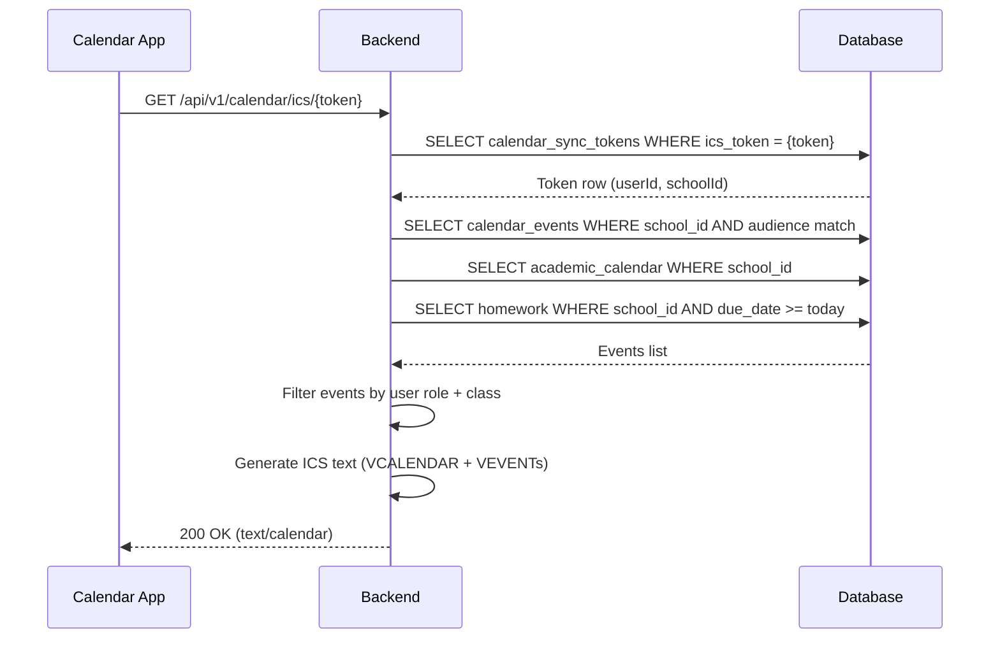
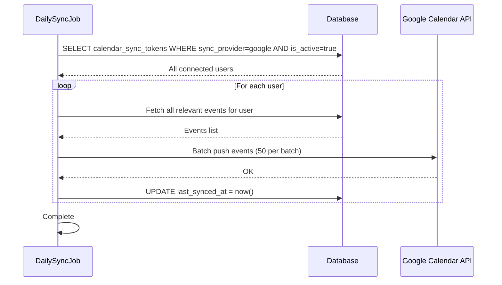
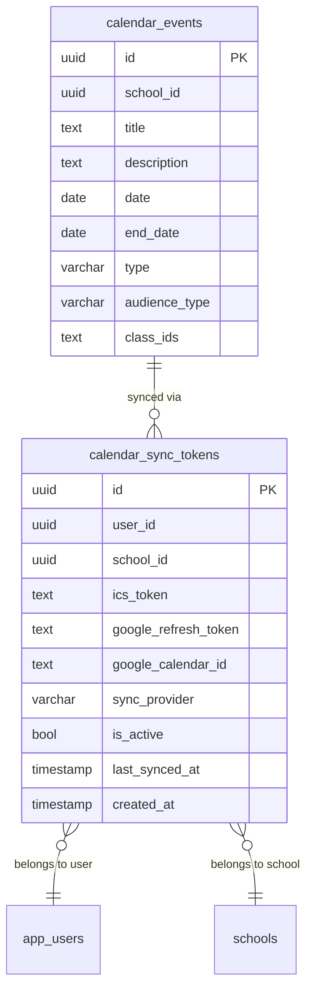

# Calendar Sync (Google/Outlook) — Technical Specification

> **Document status:** Implementation-ready blueprint
> **Last updated:** 2026-06-27
> **Prerequisites:** None
> **Template:** `_SPEC_TEMPLATE.md` v1 (25 mandatory + 6 optional sections)

---

## 1. Feature Overview

Sync school calendar events (PTM, exams, holidays, events) to parents' and teachers' personal Google Calendar or Outlook Calendar via ICS feed and OAuth-based sync.

### Goals

- Generate per-user ICS feed URL (subscribe in any calendar app)
- OAuth-based Google Calendar sync (push events to user's calendar)
- Events synced: PTM, exams, holidays, school events, assignment due dates
- Two modes: subscribe (read-only ICS) or connected (OAuth push)
- Auto-refresh: ICS feed updates when events change

### Non-goals

- [ ] Two-way sync (user edits in Google Calendar pushed back to school)
- [ ] Outlook OAuth sync (ICS works with Outlook; OAuth is Google-only for now)
- [ ] Calendar event creation from personal calendar
- [ ] Resource/room booking sync

### Dependencies

- `CalendarEventsTable` — school calendar events
- `AcademicCalendarTable` — holiday/event calendar
- `HomeworkTable` — assignment due dates for inclusion
- Google Calendar API — OAuth-based push sync
- `NotificationService` — notifications for sync status

### Related Modules

- `server/.../feature/calendar/` — new calendar sync module
- `shared/.../calendar/` — shared calendar DTOs
- `composeApp/.../ui/v2/screens/parent/` — parent UI
- `composeApp/.../ui/v2/screens/teacher/` — teacher UI

---

## 2. Current System Assessment

### Existing Code

- `CalendarEventsTable` (`Tables.kt:1370-1395`) — school calendar with `title`, `description`, `date`, `endDate`, `type`, `audienceType`, `classIds`
- `AcademicCalendarTable` — holiday/event calendar
- `feature_audit.csv` L143: Calendar Sync missing (0%)
- No ICS generation, no OAuth integration

### Existing Database

- `CalendarEventsTable` — school calendar events with audience filtering
- `AcademicCalendarTable` — academic year holidays and events
- `HomeworkTable` — homework with due dates

### Existing APIs

- School calendar CRUD (admin)
- Calendar view (parent/teacher)
- No ICS or sync APIs

### Existing UI

- Calendar view screen (parent/teacher)
- Calendar management (admin)
- No sync settings UI

### Existing Services

- `NotificationService` — multi-channel notifications

### Existing Documentation

- `feature_audit.csv` — calendar sync at 0%
- `IMPLEMENTATION_BACKLOG` — P1-24 entry

### Technical Debt

| # | Gap | Details |
|---|---|---|
| TD-1 | No ICS generation | No ICS feed for calendar subscription |
| TD-2 | No OAuth integration | No Google Calendar OAuth connection |
| TD-3 | No per-user event filtering | Events not filtered by user's role + class |

### Gaps

| # | Gap | Impact | Severity |
|---|---|---|---|
| G1 | No ICS feed | Users cannot subscribe in personal calendars | **High** |
| G2 | No Google OAuth | No push-based sync to Google Calendar | **Medium** |
| G3 | No event filtering | All events shown to all users | **Medium** |

---

## 3. Functional Requirements

### FR-001
| Field | Value |
|---|---|
| **Title** | ICS Feed URL Generation |
| **Description** | Generate per-user ICS feed URL (authenticated, unique token) |
| **Priority** | Critical |
| **User Roles** | Parent, Teacher |
| **Acceptance notes** | `calendar_sync_tokens` table with unique `ics_token` per user |

### FR-002
| Field | Value |
|---|---|
| **Title** | ICS Event Filtering |
| **Description** | ICS feed includes events relevant to user (based on role + class) |
| **Priority** | Critical |
| **User Roles** | System |
| **Acceptance notes** | Events filtered by `audienceType` and `classIds` matching user's children/class |

### FR-003
| Field | Value |
|---|---|
| **Title** | Google Calendar OAuth |
| **Description** | Google Calendar OAuth: connect → push events to user's primary calendar |
| **Priority** | High |
| **User Roles** | Parent, Teacher |
| **Acceptance notes** | OAuth flow: auth URL → callback → token exchange → store refresh token |

### FR-004
| Field | Value |
|---|---|
| **Title** | Event Types Synced |
| **Description** | Events synced: PTM, exams, holidays, school events, assignment due dates |
| **Priority** | High |
| **User Roles** | System |
| **Acceptance notes** | Events from `CalendarEventsTable`, `AcademicCalendarTable`, and `HomeworkTable` (due dates) |

### FR-005
| Field | Value |
|---|---|
| **Title** | ICS Auto-Update |
| **Description** | ICS feed auto-updates when events are added/modified/deleted |
| **Priority** | High |
| **User Roles** | System |
| **Acceptance notes** | ICS feed generated on-demand (each request); no caching needed |

### FR-006
| Field | Value |
|---|---|
| **Title** | Disconnect Sync |
| **Description** | User can disconnect calendar sync |
| **Priority** | Medium |
| **User Roles** | Parent, Teacher |
| **Acceptance notes** | `is_active = false`; OAuth tokens revoked |

### FR-007
| Field | Value |
|---|---|
| **Title** | Sync Frequency |
| **Description** | Sync frequency: ICS (client polls), OAuth (push on event change + daily refresh) |
| **Priority** | Medium |
| **User Roles** | System |
| **Acceptance notes** | ICS: client polls (typically every 24h); OAuth: push on change + daily full refresh |

---

## 4. User Stories

### Parent
- [ ] Get my ICS feed URL to subscribe in any calendar app
- [ ] Connect my Google Calendar for push sync
- [ ] View sync status (connected/disconnected)
- [ ] Disconnect calendar sync
- [ ] See school events in my personal calendar

### Teacher
- [ ] Get my ICS feed URL to subscribe in any calendar app
- [ ] Connect my Google Calendar for push sync
- [ ] View sync status
- [ ] Disconnect calendar sync
- [ ] See school events in my personal calendar

### System
- [ ] Generate ICS feed with user-relevant events
- [ ] Push events to Google Calendar on creation/modification/deletion
- [ ] Daily full refresh of Google Calendar sync
- [ ] Filter events by user role and class

---

## 5. Business Rules

### BR-001
**Rule:** ICS feed is authenticated by unique token in URL (no auth header).
**Enforcement:** `ics_token` is a random unique string; URL format: `/api/v1/calendar/ics/{token}`.

### BR-002
**Rule:** Events filtered by user's role and children's class.
**Enforcement:** Parent sees events where `audienceType` includes parent and `classIds` includes child's class; teacher sees events where `audienceType` includes teacher.

### BR-003
**Rule:** OAuth refresh tokens are encrypted at rest.
**Enforcement:** `google_refresh_token` encrypted with server-side encryption key.

### BR-004
**Rule:** Google Calendar push sync triggers on event change.
**Enforcement:** Event modification hooks call `GoogleCalendarSyncService.pushEvents()` for affected users.

### BR-005
**Rule:** Daily full refresh ensures sync consistency.
**Enforcement:** Daily job pushes all relevant events to all connected users' Google Calendars.

---

## 6. Database Design

### 6.1 Entity Relationship Summary

One new table: `calendar_sync_tokens` — stores per-user ICS token and Google OAuth tokens. Reads from existing `CalendarEventsTable`, `AcademicCalendarTable`, and `HomeworkTable`.

### 6.2 New Tables

#### `calendar_sync_tokens` table

```sql
CREATE TABLE calendar_sync_tokens (
    id              UUID PRIMARY KEY DEFAULT gen_random_uuid(),
    user_id         UUID NOT NULL UNIQUE,
    school_id       UUID NOT NULL,
    ics_token       TEXT NOT NULL UNIQUE,
    google_refresh_token TEXT,
    google_calendar_id TEXT,
    sync_provider   VARCHAR(16) NOT NULL DEFAULT 'ics',
    is_active       BOOLEAN NOT NULL DEFAULT true,
    last_synced_at  TIMESTAMP,
    created_at      TIMESTAMP NOT NULL DEFAULT now()
);
```

### 6.3 Modified Tables

N/A — no existing tables modified.

### 6.4 Indexes

```sql
CREATE INDEX idx_calendar_sync_tokens_user ON calendar_sync_tokens(user_id);
CREATE INDEX idx_calendar_sync_tokens_school ON calendar_sync_tokens(school_id, is_active);
CREATE UNIQUE INDEX idx_calendar_sync_tokens_ics ON calendar_sync_tokens(ics_token);
```

### 6.5 Constraints

- `calendar_sync_tokens.user_id` — NOT NULL, UNIQUE
- `calendar_sync_tokens.school_id` — NOT NULL
- `calendar_sync_tokens.ics_token` — NOT NULL, UNIQUE
- `calendar_sync_tokens.sync_provider` — NOT NULL, one of ics/google
- `calendar_sync_tokens.is_active` — NOT NULL, default true

### 6.6 Foreign Keys

- `calendar_sync_tokens.user_id` → `app_users.id`
- `calendar_sync_tokens.school_id` → `schools.id`

### 6.7 Soft Delete Strategy

- Sync tokens deactivated via `is_active = false` (not deleted)
- Allows reconnection without generating new token

### 6.8 Audit Fields

- `created_at` — token creation timestamp
- `last_synced_at` — last successful sync timestamp

### 6.9 Migration Notes

Migration: `docs/db/migration_062_calendar_sync.sql`
- Creates 1 new table with indexes
- No data backfill needed (new feature)

### 6.10 Exposed Mappings

```kotlin
object CalendarSyncTokensTable : UUIDTable("calendar_sync_tokens", "id") {
    val userId              = uuid("user_id").uniqueIndex()
    val schoolId            = uuid("school_id")
    val icsToken            = text("ics_token").uniqueIndex()
    val googleRefreshToken  = text("google_refresh_token").nullable()
    val googleCalendarId    = text("google_calendar_id").nullable()
    val syncProvider        = varchar("sync_provider", 16).default("ics")
    val isActive            = bool("is_active").default(true)
    val lastSyncedAt        = timestamp("last_synced_at").nullable()
    val createdAt           = timestamp("created_at")
    init {
        index("idx_calendar_sync_tokens_school", false, schoolId, isActive)
    }
}
```

### 6.11 Seed Data

N/A — tokens generated on first use.

---

## 7. State Machines

### Sync Provider State Machine

```
NONE ──user_requests_ics──> ICS_ACTIVE
ICS_ACTIVE ──user_connects_google──> GOOGLE_ACTIVE
GOOGLE_ACTIVE ──user_disconnects──> ICS_ACTIVE (reverts to ICS)
ICS_ACTIVE ──user_deactivates──> INACTIVE
INACTIVE ──user_reactivates──> ICS_ACTIVE
```

| Current State | Event | Next State | Guard / Condition |
|---|---|---|---|
| `none` | User requests ICS URL | `ics_active` | Token generated |
| `ics_active` | User connects Google | `google_active` | OAuth flow completed |
| `google_active` | User disconnects | `ics_active` | OAuth tokens revoked; ICS still works |
| `ics_active` | User deactivates | `inactive` | `is_active = false` |
| `inactive` | User reactivates | `ics_active` | `is_active = true` |

### Google OAuth Flow

```
REQUEST_AUTH_URL ──user_authorizes──> CALLBACK ──exchange_code──> TOKENS_STORED ──COMPLETE
```

| Step | Action | Condition |
|---|---|---|
| 1 | Generate OAuth URL | Google client ID + redirect URI |
| 2 | User authorizes | User grants calendar scope |
| 3 | Callback with auth code | Auth code received |
| 4 | Exchange code for tokens | Call Google token endpoint |
| 5 | Store refresh token | Encrypt and store in DB |
| 6 | Push initial events | Full sync to Google Calendar |

---

## 8. Backend Architecture

### 8.1 Component Overview

`IcsFeedService` generates ICS feed from school events. `GoogleCalendarSyncService` handles OAuth and push sync. `CalendarSyncRouting` exposes ICS feed and OAuth endpoints.

### 8.2 Design Principles

1. **ICS is always available** — every user gets an ICS token by default; no setup required
2. **OAuth is opt-in** — users choose to connect Google Calendar for push sync
3. **Event filtering per user** — events filtered by role and class membership
4. **Push on change** — Google Calendar sync triggered on event modification
5. **Daily full refresh** — ensures sync consistency for OAuth users

### 8.3 Core Types

```kotlin
class IcsFeedService {
    suspend fun generateIcs(userToken: String): String
    suspend fun getOrCreateToken(userId: UUID, schoolId: UUID): String
}

class GoogleCalendarSyncService {
    suspend fun getAuthUrl(userId: UUID): String
    suspend fun handleCallback(userId: UUID, authCode: String): CalendarSyncToken
    suspend fun pushEvents(userId: UUID)
    suspend fun pushEventChange(eventId: UUID, changeType: ChangeType)
    suspend fun disconnect(userId: UUID)
    suspend fun refreshAllSyncs() // daily job
}
```

### 8.4 Repositories

- `CalendarSyncTokenRepository` — token CRUD, lookup by ics_token or user_id

### 8.5 Mappers

- `CalendarEventMapper` — maps `CalendarEventsTable` rows to ICS VEVENT format
- `AcademicCalendarMapper` — maps `AcademicCalendarTable` rows to ICS VEVENT format
- `HomeworkMapper` — maps `HomeworkTable` due dates to ICS VEVENT format

### 8.6 Permission Checks

- ICS feed: token-based (no JWT required); token must match active user
- OAuth endpoints: JWT with parent or teacher role
- Sync status: JWT with parent or teacher role

### 8.7 Background Jobs

- `GoogleCalendarDailySyncJob` — daily at 6:00 AM; full refresh of all active Google Calendar syncs
- Event change trigger — immediate push on event create/update/delete (async)

### 8.8 Domain Events

- `CalendarSyncConnected` — emitted when user connects Google Calendar
- `CalendarSyncDisconnected` — emitted when user disconnects
- `CalendarEventsPushed` — emitted after successful push to Google Calendar
- `CalendarPushFailed` — emitted on push failure

### 8.9 Caching

- ICS feed not cached (generated on-demand; always fresh)
- Google Calendar API responses not cached

### 8.10 Transactions

- OAuth callback: store refresh token + push initial events (best-effort; token stored first)
- Event change: push to Google Calendar is async (non-blocking)

### 8.11 Rate Limiting

- ICS feed: 60 requests per minute per token (calendar apps poll periodically)
- Google OAuth: standard Google API rate limits

### 8.12 Configuration

- `GOOGLE_CLIENT_ID` — Google OAuth client ID
- `GOOGLE_CLIENT_SECRET` — Google OAuth client secret
- `GOOGLE_REDIRECT_URI` — OAuth callback URL
- `ICS_FEED_MAX_EVENTS` — max events in ICS feed (default: `500`)
- `GOOGLE_SYNC_BATCH_SIZE` — events per API batch (default: `50`)

---

## 9. API Contracts

### 9.1 ICS Feed (no auth header, token in URL)

```
GET /api/v1/calendar/ics/{token}  -- returns text/calendar ICS feed
```

### 9.2 Google OAuth

```
GET    /api/v1/parent/calendar/google/auth-url    -- returns OAuth URL
POST   /api/v1/parent/calendar/google/callback    { auth_code }
DELETE /api/v1/parent/calendar/sync               -- disconnect
```

### 9.3 Teacher OAuth (same pattern)

```
GET    /api/v1/teacher/calendar/google/auth-url
POST   /api/v1/teacher/calendar/google/callback   { auth_code }
DELETE /api/v1/teacher/calendar/sync
```

### 9.4 Status

```
GET /api/v1/parent/calendar/sync-status
GET /api/v1/teacher/calendar/sync-status
```

### 9.5 Example Responses

**Get Auth URL Response 200:**
```json
{
  "success": true,
  "data": {
    "auth_url": "https://accounts.google.com/o/oauth2/auth?client_id=...&redirect_uri=...&scope=https://www.googleapis.com/auth/calendar&response_type=code"
  }
}
```

**OAuth Callback Request:**
```json
{
  "auth_code": "4/0AX4XfW..."
}
```

**Sync Status Response 200:**
```json
{
  "success": true,
  "data": {
    "ics_url": "https://api.vidyaprayag.com/api/v1/calendar/ics/abc123def456",
    "sync_provider": "google",
    "is_active": true,
    "last_synced_at": "2026-06-28T06:00:00Z",
    "google_calendar_id": "user@gmail.com"
  }
}
```

**ICS Feed Response 200:**
```
Content-Type: text/calendar
BEGIN:VCALENDAR
VERSION:2.0
PRODID:-//Vidya Prayag//Calendar Sync//EN
BEGIN:VEVENT
UID:event-uuid@vidyaprayag.com
DTSTAMP:20260628T060000Z
DTSTART:20260715T090000Z
DTEND:20260715T110000Z
SUMMARY:Parent-Teacher Meeting - Class 5A
DESCRIPTION:PTM for Class 5A
END:VEVENT
BEGIN:VEVENT
UID:homework-uuid@vidyaprayag.com
DTSTAMP:20260628T060000Z
DTSTART:20260710T000000Z
SUMMARY:Assignment Due: Mathematics Chapter 3
DESCRIPTION:Submit online assignment
END:VEVENT
END:VCALENDAR
```

---

## 10. Frontend Architecture

### 10.1 Screens

| Screen | Platform | Role | Description |
|---|---|---|---|
| `CalendarSyncSettingsScreen` | All | Parent, Teacher | Sync settings (ICS URL, Google connect/disconnect) |

### 10.2 Navigation

- Parent portal → Settings → Calendar Sync → `CalendarSyncSettingsScreen`
- Teacher portal → Settings → Calendar Sync → `CalendarSyncSettingsScreen`

### 10.3 UX Flows

#### Subscribe via ICS

1. User opens Settings → Calendar Sync
2. Views ICS feed URL
3. Copies URL
4. Pastes into calendar app (Google Calendar, Outlook, Apple Calendar)
5. School events appear in personal calendar

#### Connect Google Calendar

1. User opens Settings → Calendar Sync
2. Clicks "Connect Google Calendar"
3. Redirected to Google OAuth consent screen
4. Grants calendar permission
5. Redirected back to app
6. Sync status shows "Connected"
7. Events pushed to Google Calendar

#### Disconnect

1. User opens Settings → Calendar Sync
2. Clicks "Disconnect"
3. Confirmation dialog
4. OAuth tokens revoked
5. Sync status shows "ICS only"

### 10.4 State Management

```kotlin
data class CalendarSyncState(
    val icsUrl: String?,
    val syncProvider: String,
    val isActive: Boolean,
    val lastSyncedAt: String?,
    val googleCalendarId: String?,
    val isConnecting: Boolean,
    val error: String?,
)
```

### 10.5 Offline Support

- Sync settings cached locally
- ICS URL cached for offline display

### 10.6 Loading States

- Connecting: "Connecting to Google Calendar..."
- Disconnecting: "Disconnecting..."
- Copying URL: "Copied to clipboard"

### 10.7 Error Handling (UI)

- OAuth failed: "Failed to connect Google Calendar. Please try again."
- Already connected: "Google Calendar is already connected."
- Token expired: "Google Calendar connection expired. Please reconnect."

### 10.8 Component Integration Guidelines

| Rule | Description |
|---|---|
| **R1** | ICS URL display with copy button |
| **R2** | "Connect Google Calendar" button |
| **R3** | "Disconnect" button (visible when connected) |
| **R4** | Sync status badge: ICS=blue, Google=green, Inactive=gray |
| **R5** | Last synced timestamp display |
| **R6** | QR code for ICS URL (mobile-friendly subscription) |
| **R7** | Help text: "Paste this URL in your calendar app's subscribe option" |

---

## 11. Shared Module Changes (KMP)

### 11.1 DTOs

```kotlin
data class CalendarSyncStatusDto(
    val icsUrl: String?,
    val syncProvider: String, // ics | google
    val isActive: Boolean,
    val lastSyncedAt: String?,
    val googleCalendarId: String?,
)

data class AuthUrlResponse(
    val authUrl: String,
)

data class OAuthCallbackRequest(
    val authCode: String,
)
```

### 11.2 Domain Models

```kotlin
data class CalendarSyncToken(
    val id: UUID,
    val userId: UUID,
    val schoolId: UUID,
    val icsToken: String,
    val syncProvider: SyncProvider,
    val isActive: Boolean,
    val lastSyncedAt: Instant?,
)

enum class SyncProvider {
    ICS, GOOGLE
}
```

### 11.3 Repository Interfaces

```kotlin
interface CalendarSyncRepository {
    suspend fun getSyncStatus(): NetworkResult<CalendarSyncStatusDto>
    suspend fun getAuthUrl(): NetworkResult<AuthUrlResponse>
    suspend fun handleCallback(authCode: String): NetworkResult<CalendarSyncStatusDto>
    suspend fun disconnect(): NetworkResult<ApiResponse<Unit>>
}
```

### 11.4 UseCases

- `GetSyncStatusUseCase`
- `GetAuthUrlUseCase`
- `HandleOAuthCallbackUseCase`
- `DisconnectSyncUseCase`

### 11.5 Validation

- Auth code: not empty
- ICS token: valid format (alphanumeric, min 32 chars)

### 11.6 Serialization

Standard Kotlinx serialization.

### 11.7 Network APIs

Ktor `@Resource` route definitions:
- `CalendarIcsApi` — ICS feed (token-based, no auth)
- `ParentCalendarSyncApi` — parent sync endpoints
- `TeacherCalendarSyncApi` — teacher sync endpoints

### 11.8 Database Models (Local Cache)

- Sync status cached locally
- ICS URL cached for offline display

---

## 12. Permissions Matrix

| Action | Super Admin | School Admin | Teacher | Parent |
|---|---|---|---|---|
| Get ICS URL | ✅ | ✅ | ✅ | ✅ |
| Connect Google Calendar | ✅ | ✅ | ✅ | ✅ |
| Disconnect sync | ✅ | ✅ | ✅ | ✅ |
| View sync status | ✅ | ✅ | ✅ | ✅ |
| Access ICS feed (token) | ✅ | ✅ | ✅ | ✅ |
| Manage school calendar events | ✅ | ✅ | ❌ | ❌ |

---

## 13. Notifications

### Calendar Sync Notifications

| Type | Trigger | Channel | Message |
|---|---|---|---|
| Google Connected (User) | OAuth callback success | In-app | "Google Calendar connected. Events will be synced automatically." |
| Google Disconnected (User) | User disconnects | In-app | "Google Calendar disconnected. ICS feed still available." |
| Sync Failed (User) | Push to Google fails 3 times | In-app | "Calendar sync failed. Please reconnect Google Calendar." |
| Sync Expired (User) | Refresh token expired | In-app | "Google Calendar connection expired. Please reconnect." |

---

## 14. Background Jobs

### Google Calendar Daily Sync Job

| Field | Value |
|---|---|
| **Name** | `GoogleCalendarDailySyncJob` |
| **Trigger** | Daily at 6:00 AM |
| **Frequency** | Daily |
| **Description** | Full refresh of all active Google Calendar syncs; pushes all relevant events to each connected user's calendar |
| **Timeout** | 300 seconds (5 min) |
| **Retry** | 1 retry with 60s backoff |
| **On failure** | Logged; retried next day |

### Event Change Push (Async)

| Field | Value |
|---|---|
| **Name** | `CalendarEventChangePush` |
| **Trigger** | Event create/update/delete |
| **Frequency** | On-demand (async) |
| **Description** | Pushes event change to all connected Google Calendar users for that school |
| **Timeout** | 30 seconds per user |
| **Retry** | 2 retries with exponential backoff |
| **On failure** | Logged; daily sync will catch up |

---

## 15. Integrations

### Google Calendar API
| Field | Value |
|---|---|
| **System** | Google Calendar API v3 |
| **Purpose** | Push events to user's Google Calendar via OAuth |
| **API / SDK** | Google Calendar API REST (`https://www.googleapis.com/calendar/v3`) |
| **Auth method** | OAuth 2.0 (refresh token) |
| **Fallback** | ICS feed (always available as alternative) |

### Google OAuth 2.0
| Field | Value |
|---|---|
| **System** | Google Identity Platform |
| **Purpose** | Obtain user consent and refresh token for Calendar API |
| **API / SDK** | Google OAuth 2.0 (`https://accounts.google.com/o/oauth2/auth`) |
| **Auth method** | Authorization code flow |
| **Fallback** | ICS feed (no OAuth required) |

### CalendarEventsTable
| Field | Value |
|---|---|
| **System** | Existing school calendar |
| **Purpose** | Source of school events for ICS feed and Google push |
| **API / SDK** | Direct DB via Exposed |
| **Auth method** | Internal |
| **Fallback** | N/A — primary data source |

### AcademicCalendarTable
| Field | Value |
|---|---|
| **System** | Existing academic calendar |
| **Purpose** | Source of holidays and academic events |
| **API / SDK** | Direct DB via Exposed |
| **Auth method** | Internal |
| **Fallback** | N/A — primary data source |

### HomeworkTable
| Field | Value |
|---|---|
| **System** | Existing homework management |
| **Purpose** | Source of assignment due dates for calendar feed |
| **API / SDK** | Direct DB via Exposed |
| **Auth method** | Internal |
| **Fallback** | N/A — supplementary data source |

### NotificationService
| Field | Value |
|---|---|
| **System** | Existing notification infrastructure |
| **Purpose** | Send sync status notifications |
| **API / SDK** | Internal `NotificationService` |
| **Auth method** | Internal service call |
| **Fallback** | In-app notification if push fails |

---

## 16. Security

### Authentication
- ICS feed: token-based (unique `ics_token` in URL; no JWT required)
- OAuth endpoints: JWT with parent or teacher role
- Sync status: JWT with parent or teacher role

### Authorization
- ICS token must match active user
- OAuth endpoints require authenticated user
- Users can only manage their own sync settings

### Encryption
- All API communication over TLS
- Google OAuth refresh tokens encrypted at rest (server-side encryption)
- ICS tokens are random 64-character strings (sufficient entropy)

### Audit Logs
- ICS feed access logged (token, IP, timestamp) — lightweight
- Google OAuth connect logged (userId, timestamp)
- Google OAuth disconnect logged (userId, timestamp)
- Push to Google logged (userId, eventCount, success/failure)
- Daily sync job logged (userCount, eventCount, duration)

### PII Handling
- ICS feed may contain event titles with student names (e.g., "PTM for John Doe")
- ICS token in URL — not logged in web server access logs (filtered)
- Google refresh token is sensitive — encrypted at rest

### Data Isolation
- ICS feed filtered by user's role and class membership
- Google push only sends events relevant to the specific user
- All queries school-scoped

### Rate Limiting
- ICS feed: 60 requests per minute per token
- Google OAuth endpoints: standard rate limiting

### Input Validation
- ICS token: alphanumeric, 64 characters
- Auth code: not empty, valid Google OAuth code format
- Redirect URI: must match registered Google OAuth redirect URIs

---

## 17. Performance & Scalability

### Expected Scale

| Metric | Small school | Medium school | Large school |
|---|---|---|---|
| Users with ICS | ~100 | ~500 | ~2,000 |
| Users with Google sync | ~20 | ~100 | ~400 |
| Events per user | ~50 | ~100 | ~200 |
| ICS requests per day | ~500 | ~2,500 | ~10,000 |
| Google push operations per day | ~100 | ~500 | ~2,000 |

### Latency Targets

| Operation | Target |
|---|---|
| ICS feed generation | < 200ms |
| OAuth callback | < 500ms (token exchange + initial push) |
| Google push (per user) | < 2s (batch of events) |
| Sync status query | < 50ms |

### Optimization Strategy

- ICS feed generated on-demand (always fresh; no cache invalidation needed)
- Google push batched (50 events per API call)
- Event change push async (non-blocking to event CRUD)
- Daily sync processes users sequentially with rate limiting

---

## 18. Edge Cases

| # | Scenario | Expected Behavior |
|---|---|---|
| EC-001 | Invalid ICS token | 404 Not Found |
| EC-002 | Inactive user's ICS token | 404 Not Found |
| EC-003 | Google OAuth callback with invalid code | 400 INVALID_AUTH_CODE |
| EC-004 | Google refresh token expired | Sync fails; user notified to reconnect |
| EC-005 | Google Calendar API rate limit hit | Backoff and retry; daily sync catches up |
| EC-006 | Event deleted after push to Google | Delete event pushed to Google Calendar |
| EC-007 | User has no children (parent) | ICS feed includes only public/all-parent events |
| EC-008 | ICS feed with no events | Valid empty ICS feed (VCALENDAR with no VEVENTs) |

### Risks & Mitigations

| Risk | Likelihood | Impact | Mitigation |
|---|---|---|---|
| Google API downtime | Low | Medium | ICS feed as fallback; daily sync catches up |
| Refresh token expiry | Medium | Low | User notified; reconnection required |
| ICS token leak | Low | Low | Token can be regenerated; old token deactivated |
| Large event count | Medium | Low | Max 500 events in ICS feed; batched Google push |

---

## 19. Error Handling

### Standard Error Codes

| HTTP | Error Code | Description | When |
|---|---|---|---|
| 400 | `INVALID_AUTH_CODE` | Google OAuth auth code is invalid | OAuth callback |
| 400 | `OAUTH_EXCHANGE_FAILED` | Token exchange with Google failed | OAuth callback |
| 403 | `SYNC_NOT_ACTIVE` | Sync is deactivated | Push/disconnect |
| 404 | `ICS_TOKEN_NOT_FOUND` | ICS token doesn't exist or user inactive | ICS feed |
| 500 | `GOOGLE_API_ERROR` | Google Calendar API returned error | Push events |
| 500 | `GOOGLE_TOKEN_EXPIRED` | Refresh token expired or revoked | Push events |

### Error Response Format

Same as existing API error format.

### Recovery Strategy

| Error | Client Action | Server Action |
|---|---|---|
| `INVALID_AUTH_CODE` | Show "Authorization failed. Please try again." | Return 400 |
| `GOOGLE_TOKEN_EXPIRED` | Show "Google Calendar connection expired. Please reconnect." | Mark sync as needs_reconnect |
| `GOOGLE_API_ERROR` | Show "Sync temporarily unavailable. Will retry." | Retry with backoff; daily sync catches up |
| `ICS_TOKEN_NOT_FOUND` | Calendar app shows "Feed not available" | Return 404 |

---

## 20. Analytics & Reporting

### Reports

- **Sync Adoption Report:** Users with ICS vs Google sync per school
- **Sync Activity Report:** ICS feed requests per day; Google push operations per day
- **Sync Failure Report:** Failed push operations and reasons
- **Event Coverage Report:** Events included in sync vs total events

### KPIs

- **ICS Adoption Rate:** % of active users with ICS feed
- **Google Sync Adoption Rate:** % of active users with Google sync
- **ICS Feed Requests:** Daily ICS feed request count
- **Google Push Success Rate:** % of push operations successful
- **Sync Latency:** Time from event change to Google push

### Dashboards

- Admin: sync adoption metrics (aggregate, no individual user data)
- System: sync health dashboard (failure rates, latency)

### Exports

- Sync adoption CSV export
- Sync activity log CSV export

---

## 21. Testing Strategy

### Unit Tests

| Test | What it verifies |
|---|---|
| Generate ICS token | Unique token generated per user |
| Generate ICS feed | Valid ICS format with correct VEVENT entries |
| ICS event filtering (parent) | Only parent-relevant events included |
| ICS event filtering (teacher) | Only teacher-relevant events included |
| ICS includes homework due dates | Assignment due dates appear as VEVENTs |
| ICS with no events | Valid empty VCALENDAR |
| Invalid ICS token | 404 returned |
| Google OAuth callback | Token exchanged; refresh token stored encrypted |
| Google push events | Events pushed to Google Calendar API |
| Google disconnect | Tokens revoked; sync_provider reverts to ics |
| Event change push | Push triggered on event create/update/delete |
| Daily sync job | All active Google syncs refreshed |

### Integration Tests

| Test | What it verifies |
|---|---|
| Create event → ICS feed updated | New event appears in ICS feed |
| Create event → Google push | New event pushed to Google Calendar |
| Update event → Google push | Event updated in Google Calendar |
| Delete event → Google push | Event deleted from Google Calendar |
| OAuth connect → initial push → daily sync | Full sync lifecycle |

### Performance Tests

- [ ] ICS feed with 500 events < 200ms
- [ ] Google push for 200 events < 2s
- [ ] Daily sync for 400 users < 5 minutes

### Security Tests

- [ ] Invalid ICS token returns 404
- [ ] ICS token of inactive user returns 404
- [ ] User cannot access another user's sync settings
- [ ] Refresh token encrypted at rest
- [ ] ICS tokens not logged in access logs

### Migration Tests

- [ ] Migration creates table with correct schema
- [ ] Indexes created correctly

---

## 22. Acceptance Criteria

- [ ] ICS feed URL generated per user with unique token
- [ ] ICS feed contains relevant events (filtered by role + class)
- [ ] ICS feed updates when events change
- [ ] Google Calendar OAuth connection works
- [ ] Events pushed to Google Calendar on creation/modification
- [ ] User can disconnect sync
- [ ] Assignment due dates included in feed

---

## 23. Implementation Roadmap

| Phase | Duration | Tasks | Breaking? | Deliverable |
|---|---|---|---|---|
| 1 | 1 day | DB migration, Exposed table | No | Schema ready |
| 2 | 2 days | IcsFeedService (ICS generation, event filtering) | No | ICS feed available |
| 3 | 3 days | GoogleCalendarSyncService (OAuth, push, event change trigger) | No | Google sync available |
| 4 | 1 day | API endpoints | No | APIs available |
| 5 | 2 days | Client UI (sync settings, connect/disconnect, ICS URL copy) | No | UI ready |
| 6 | 1 day | Tests | No | Test coverage |

**Total: ~10 days**

---

## 24. File-Level Impact Analysis

### New Files

| File | Location | Purpose |
|---|---|---|
| `IcsFeedService.kt` | `server/.../feature/calendar/` | ICS generation |
| `GoogleCalendarSyncService.kt` | `server/.../feature/calendar/` | OAuth sync |
| `CalendarSyncRouting.kt` | `server/.../feature/calendar/` | API endpoints |
| `migration_062_calendar_sync.sql` | `docs/db/` | DDL migration |
| `CalendarSyncApi.kt` | `shared/.../calendar/` | Client API |
| `CalendarSyncDtos.kt` | `shared/.../calendar/` | DTOs |
| `CalendarSyncRepository.kt` | `shared/.../calendar/` | Repository interface |
| `CalendarSyncRepositoryImpl.kt` | `shared/.../calendar/` | Repository impl |
| `CalendarSyncSettingsScreen.kt` | `composeApp/.../ui/v2/screens/parent/` | Sync settings UI |
| `CalendarSyncViewModel.kt` | `composeApp/.../ui/v2/viewmodel/` | MVI state |

### Modified Files

| File | Change Type | Lines Changed (est.) | Risk | Description |
|---|---|---|---|---|
| `server/.../db/Tables.kt` | Add | ~15 | Low | `CalendarSyncTokensTable` |
| `server/.../db/DatabaseFactory.kt` | Modify | ~2 | Low | Register sync tokens table |
| `server/.../feature/calendar/CalendarService.kt` | Modify | ~10 | Low | Add event change trigger hook |

### Files Preserved Unchanged

| File | Reason |
|---|---|
| `CalendarEventsTable` | Read-only data source |
| `AcademicCalendarTable` | Read-only data source |
| `HomeworkTable` | Read-only data source |
| `NotificationService` | Used as-is for notifications |

---

## 25. Future Enhancements

### Outlook OAuth Sync

- Microsoft Graph API integration
- Outlook Calendar OAuth flow
- Push events to Outlook Calendar
- Same pattern as Google Calendar sync

### Two-Way Sync

- User edits in Google Calendar pushed back to school
- Conflict resolution (school calendar is source of truth)
- Selective two-way sync (only specific event types)
- Sync direction toggle per event type

### Calendar Event RSVP

- RSVP responses from personal calendar synced back
- Attendance tracking from calendar responses
- Reminder notifications for unresponded events
- RSVP deadline tracking

### Custom Calendar Feeds

- Per-category ICS feeds (e.g., exams-only, holidays-only)
- Per-class ICS feeds
- Custom event selection
- Multiple feed URLs per user

### Calendar Embed Widget

- Embeddable school calendar widget
- For school website integration
- Customizable appearance
- Real-time event updates

### Push Notifications for Calendar Events

- Push notifications for upcoming events
- Configurable reminder time (1 hour, 1 day before)
- Per-event-type notification settings
- Silent hours configuration

### Calendar Analytics

- Event attendance tracking
- Response rate analytics
- Calendar engagement metrics
- Peak event times analysis

### Multi-Calendar Support

- Push to multiple Google Calendars
- Separate calendars for different event types
- Calendar naming conventions
- Calendar color coding

### ICS Feed Webhooks

- Webhook notifications when ICS feed changes
- Real-time updates instead of polling
- Webhook subscription management
- Fallback to polling if webhook fails

### Calendar Import/Export

- Bulk import events from ICS file
- Export school calendar as ICS file
- Import from other school management systems
- Calendar migration tools

---

## A. Sequence Diagrams

### ICS Feed Request Flow



### Google OAuth Connect Flow

```mermaid
sequenceDiagram
    participant User as User
    participant App as Client App
    participant Server as Backend
    participant Google as Google OAuth
    User->>App: Click "Connect Google Calendar"
    App->>Server: GET /parent/calendar/google/auth-url
    Server-->>App: 200 OK (auth_url)
    App->>Google: Redirect to auth_url
    User->>Google: Grant calendar permission
    Google->>App: Redirect with auth_code
    App->>Server: POST /parent/calendar/google/callback { auth_code }
    Server->>Google: Exchange auth_code for tokens
    Google-->>Server: access_token + refresh_token
    Server->>DB: Store encrypted refresh_token; set sync_provider=google
    Server->>Google: Push initial events to calendar
    Google-->>Server: OK
    Server-->>App: 200 OK (sync connected)
    App->>User: "Google Calendar connected!"
```

### Event Change Push Flow

```mermaid
sequenceDiagram
    participant Admin as Admin
    participant App as Client App
    participant Server as Backend
    participant DB as Database
    participant Google as Google Calendar API
    Admin->>App: Create/update/delete calendar event
    App->>Server: POST/PATCH/DELETE /school/calendar/events
    Server->>DB: INSERT/UPDATE/DELETE calendar_events
    Server->>Server: Trigger async event change push
    Server->>DB: SELECT calendar_sync_tokens WHERE school_id AND sync_provider=google AND is_active=true
    DB-->>Server: Connected users list
    loop For each connected user
        Server->>Server: Check if event relevant to user (audience filter)
        alt Event relevant
            Server->>Google: POST/PATCH/DELETE event in user's calendar
            Google-->>Server: OK
        else Event not relevant
            Server->>Server: Skip (not relevant to this user)
        end
    end
    Server-->>App: 200 OK (event saved; push async)
```

### Daily Sync Job Flow



---

## B. Domain Model / ER Diagram



---

## C. Event Flow

```
IcsTokenCreated -> Complete
GoogleConnected -> PushInitialEvents -> Complete
EventCreated -> AsyncPushToGoogle -> Complete
EventUpdated -> AsyncPushToGoogle -> Complete
EventDeleted -> AsyncPushToGoogle -> Complete
DailySyncJob -> PushAllEvents -> UpdateLastSynced -> Complete
GoogleDisconnected -> RevokeTokens -> RevertToIcs -> Complete
```

| Event | Emitted By | Consumed By | Side Effect |
|---|---|---|---|
| `CalendarSyncConnected` | GoogleCalendarSyncService.handleCallback() | Notification | User notified of connection |
| `CalendarSyncDisconnected` | GoogleCalendarSyncService.disconnect() | Notification | User notified of disconnection |
| `CalendarEventsPushed` | GoogleCalendarSyncService.pushEvents() | Analytics | Push counter incremented |
| `CalendarPushFailed` | GoogleCalendarSyncService (on failure) | Notification | User notified after 3 failures |
| `IcsFeedRequested` | IcsFeedService.generateIcs() | Analytics | Feed request counter incremented |

---

## D. Configuration

### Environment Variables

| Variable | Description |
|---|---|
| `GOOGLE_CLIENT_ID` | Google OAuth 2.0 client ID |
| `GOOGLE_CLIENT_SECRET` | Google OAuth 2.0 client secret |
| `GOOGLE_REDIRECT_URI` | OAuth callback redirect URI |
| `ICS_FEED_MAX_EVENTS` | Max events in ICS feed (default: `500`) |
| `GOOGLE_SYNC_BATCH_SIZE` | Events per Google API batch (default: `50`) |
| `ICS_TOKEN_LENGTH` | Length of random ICS token (default: `64`) |
| `ENCRYPTION_KEY` | Server-side encryption key for refresh tokens |

### Feature Flags

| Flag | Default | Description |
|---|---|---|
| `calendar_sync_enabled` | `true` | Master switch for calendar sync |
| `ics_feed_enabled` | `true` | Enable ICS feed generation |
| `google_sync_enabled` | `true` | Enable Google Calendar OAuth sync |
| `google_daily_sync` | `true` | Enable daily full refresh job |
| `homework_in_calendar` | `true` | Include homework due dates in feed |

### Client-Side Configuration

| Config | Default | Description |
|---|---|---|
| ICS URL display | Full URL | Shown in sync settings |
| QR code enabled | true | QR code for ICS URL |
| OAuth redirect | Deep link | App deep link for OAuth callback |

### Server-Side Configuration

| Config | Default | Description |
|---|---|---|
| ICS max events | 500 | Max events per ICS feed |
| Google batch size | 50 | Events per API call |
| ICS token length | 64 | Random token length |
| ICS rate limit | 60/min | Requests per token per minute |
| Daily sync time | 06:00 | Daily sync job time |

### Infrastructure Requirements

- PostgreSQL with standard indexing
- Google Calendar API access (OAuth 2.0 credentials)
- Server-side encryption for refresh tokens
- Daily job scheduler
- HTTPS (TLS) for ICS feed URLs and OAuth callbacks

---

## E. Migration & Rollback

### Deployment Plan

1. [ ] Run `migration_062_calendar_sync.sql` — creates 1 table + indexes
2. [ ] Deploy `CalendarSyncTokensTable` in `Tables.kt`
3. [ ] Register table in `DatabaseFactory.kt`
4. [ ] Deploy `IcsFeedService` and `GoogleCalendarSyncService`
5. [ ] Deploy `CalendarSyncRouting` with ICS and OAuth endpoints
6. [ ] Configure Google OAuth credentials (client ID, secret, redirect URI)
7. [ ] Configure encryption key for refresh tokens
8. [ ] Deploy shared KMP layer (DTOs, repository, API)
9. [ ] Deploy client UI (sync settings screen)
10. [ ] Configure daily sync job
11. [ ] Deploy to production

### Rollback Plan

1. [ ] Disable feature flag `calendar_sync_enabled` → APIs return 404; ICS feed returns 404
2. [ ] Remove client UI → sync settings screen not shown
3. [ ] Database: `DROP TABLE IF EXISTS calendar_sync_tokens;`
4. [ ] No data loss — new feature, no existing data affected
5. [ ] Revoke Google OAuth app credentials (optional)

### Data Backfill

N/A — new feature. ICS tokens generated on first request per user.

### Migration SQL

```sql
-- migration_062_calendar_sync.sql
CREATE TABLE IF NOT EXISTS calendar_sync_tokens (
    id              UUID PRIMARY KEY DEFAULT gen_random_uuid(),
    user_id         UUID NOT NULL UNIQUE,
    school_id       UUID NOT NULL,
    ics_token       TEXT NOT NULL UNIQUE,
    google_refresh_token TEXT,
    google_calendar_id TEXT,
    sync_provider   VARCHAR(16) NOT NULL DEFAULT 'ics',
    is_active       BOOLEAN NOT NULL DEFAULT true,
    last_synced_at  TIMESTAMP,
    created_at      TIMESTAMP NOT NULL DEFAULT now()
);

CREATE INDEX IF NOT EXISTS idx_calendar_sync_tokens_user ON calendar_sync_tokens(user_id);
CREATE INDEX IF NOT EXISTS idx_calendar_sync_tokens_school ON calendar_sync_tokens(school_id, is_active);

-- ROLLBACK:
-- DROP TABLE IF EXISTS calendar_sync_tokens;
```

---

## F. Observability

### Logging

- ICS feed requested: DEBUG `ics_feed_requested` (token, userId, eventCount, responseTimeMs)
- ICS token not found: WARN `ics_token_not_found` (token, ip)
- Google OAuth connect: INFO `google_oauth_connected` (userId, googleCalendarId)
- Google OAuth disconnect: INFO `google_oauth_disconnected` (userId)
- Google push success: INFO `google_push_success` (userId, eventCount, durationMs)
- Google push failure: WARN `google_push_failed` (userId, errorCode, errorMessage)
- Google token expired: WARN `google_token_expired` (userId)
- Daily sync job: INFO `google_daily_sync` (userCount, totalEvents, durationMs, failureCount)
- Event change push: DEBUG `event_change_push` (eventId, changeType, affectedUsers)

### Metrics

| Metric | Type | Description |
|---|---|---|
| `calendar_sync.ics_requests` | Counter | Total ICS feed requests |
| `calendar_sync.ics_response_time_ms` | Histogram | ICS feed generation time |
| `calendar_sync.google_connected` | Gauge | Users with active Google sync |
| `calendar_sync.google_push_total` | Counter | Total Google push operations |
| `calendar_sync.google_push_success` | Counter | Successful push operations |
| `calendar_sync.google_push_failures` | Counter | Failed push operations |
| `calendar_sync.google_push_time_ms` | Histogram | Google push latency |
| `calendar_sync.daily_sync_duration_ms` | Histogram | Daily sync job duration |
| `calendar_sync.events_synced` | Counter | Total events pushed to Google |

### Health Checks

- `GET /api/v1/health` — existing health check
- Google Calendar API connectivity check (optional)

### Alerts

- Google push failure rate > 20% → Warning (Google API issues or token expiry)
- Daily sync job failure → Warning (job scheduler issues)
- ICS feed response time > 1s → Info (may need optimization)
- Google token expiry rate > 10% → Info (users need to reconnect)
