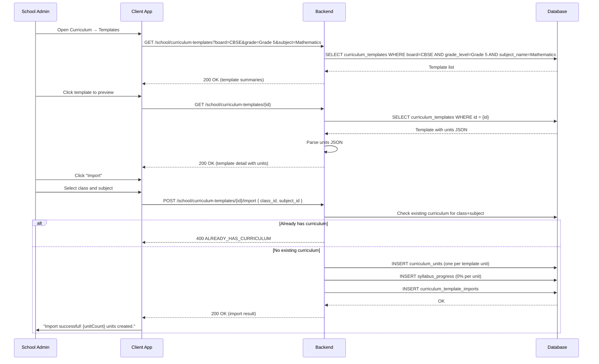
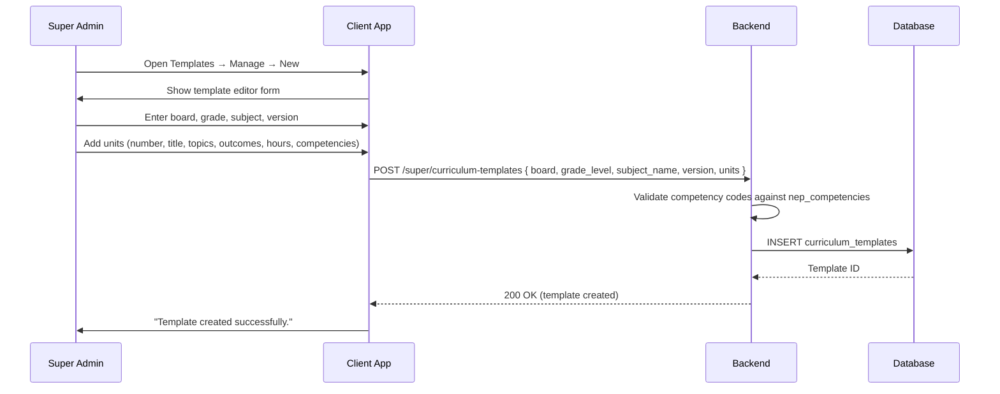
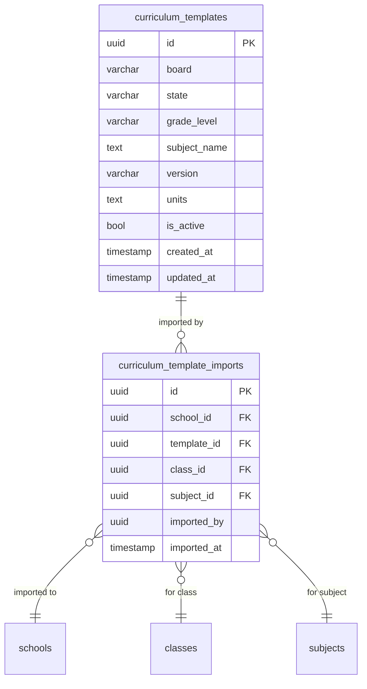

# Curriculum Templates — Technical Specification

> **Document status:** Implementation-ready blueprint
> **Last updated:** 2026-06-27
> **Prerequisites:** None
> **Template:** `_SPEC_TEMPLATE.md` v1 (25 mandatory + 6 optional sections)

---

## 1. Feature Overview

Pre-built curriculum templates aligned with board syllabi (CBSE, ICSE, IB, State) that schools can adopt and customize. Provides structured unit/lesson/topic hierarchy with learning outcomes and competency mapping.

### Goals

- Pre-built curriculum templates per board (CBSE, ICSE, IB, State) per grade per subject
- Admin imports template → auto-creates curriculum units in `CurriculumUnitsTable`
- Customizable after import (add/remove/modify units, topics)
- Learning outcomes per unit (linked to NEP competencies)
- Syllabus progress tracking against template
- Share templates across branches (multi-branch)

### Non-goals

- [ ] Auto-generate lesson plans from curriculum templates
- [ ] AI-powered curriculum recommendations
- [ ] Cross-board curriculum mapping
- [ ] Student-facing curriculum view

### Dependencies

- `CurriculumUnitsTable` — existing curriculum units (import target)
- `SyllabusProgressTable` — existing syllabus progress tracking
- `nep_competencies` table — NEP competency mapping (from `NEP_COMPLIANCE_SPEC.md`)
- `NEP_COMPLIANCE_SPEC.md` — defines competency framework

### Related Modules

- `server/.../feature/curriculum/` — new curriculum template module
- `shared/.../curriculum/` — shared curriculum DTOs
- `composeApp/.../ui/v2/screens/admin/` — admin UI

---

## 2. Current System Assessment

### Existing Code

- `CurriculumUnitsTable` (`Tables.kt:870-885`) — `unitNumber`, `title`, `description`, `topics` (JSON), `estimatedHours`, `subjectId`, `classId`
- `SyllabusProgressTable` (`Tables.kt:890-905`) — tracks completion per unit per class
- `feature_audit.csv` L157: Curriculum Templates missing (0%)
- `NEP_COMPLIANCE_SPEC.md` defines `nep_competencies` table for competency mapping
- No template library — each school builds curriculum from scratch

### Existing Database

- `CurriculumUnitsTable` — curriculum units with topics (JSON), estimated hours
- `SyllabusProgressTable` — syllabus progress per unit per class
- `nep_competencies` — NEP competency codes (from NEP compliance spec)

### Existing APIs

- Curriculum unit CRUD (admin)
- Syllabus progress tracking
- No template browsing or import APIs

### Existing UI

- Curriculum unit management (admin)
- Syllabus progress view
- No template browser or import UI

### Existing Services

- `CurriculumService` — existing curriculum unit management
- `SyllabusProgressService` — existing progress tracking

### Existing Documentation

- `feature_audit.csv` — curriculum templates at 0%
- `NEP_COMPLIANCE_SPEC.md` — competency framework
- `IMPLEMENTATION_BACKLOG` — P1-25 entry

### Technical Debt

| # | Gap | Details |
|---|---|---|
| TD-1 | No template library | Schools build curriculum from scratch |
| TD-2 | No board alignment | No pre-built CBSE/ICSE/IB/State templates |
| TD-3 | No competency mapping | Units not linked to NEP competencies |
| TD-4 | No multi-branch sharing | Templates not shareable across branches |

### Gaps

| # | Gap | Impact | Severity |
|---|---|---|---|
| G1 | No template library | Schools spend time building curriculum manually | **High** |
| G2 | No board alignment | Curriculum may not match board syllabus | **High** |
| G3 | No competency mapping | NEP compliance not integrated | **Medium** |
| G4 | No multi-branch sharing | Branches duplicate curriculum work | **Medium** |

---

## 3. Functional Requirements

### FR-001
| Field | Value |
|---|---|
| **Title** | Pre-built Templates |
| **Description** | Pre-built templates: CBSE/ICSE/IB/State for grades 1-12, major subjects |
| **Priority** | Critical |
| **User Roles** | Super Admin (manage templates), School Admin (browse/import) |
| **Acceptance notes** | `curriculum_templates` table with board, grade_level, subject_name, units (JSON) |

### FR-002
| Field | Value |
|---|---|
| **Title** | Template Structure |
| **Description** | Template structure: units → topics → learning outcomes → estimated hours → competency mapping |
| **Priority** | Critical |
| **User Roles** | System |
| **Acceptance notes** | JSON `units` field with array of unit objects containing topics, learningOutcomes, estimatedHours, competencyCodes |

### FR-003
| Field | Value |
|---|---|
| **Title** | Browse and Preview |
| **Description** | Admin browses template library, previews, and imports |
| **Priority** | High |
| **User Roles** | School Admin |
| **Acceptance notes** | Browse by board/grade/subject; preview shows full unit structure |

### FR-004
| Field | Value |
|---|---|
| **Title** | Import |
| **Description** | Import auto-creates `CurriculumUnitsTable` rows for the school's class+subject |
| **Priority** | Critical |
| **User Roles** | School Admin |
| **Acceptance notes** | Import creates units + syllabus progress rows; records import in `curriculum_template_imports` |

### FR-005
| Field | Value |
|---|---|
| **Title** | Customizable After Import |
| **Description** | Customizable after import (admin can edit units, add topics, adjust hours) |
| **Priority** | High |
| **User Roles** | School Admin |
| **Acceptance notes** | Imported units are regular `CurriculumUnitsTable` rows; editable via existing curriculum management |

### FR-006
| Field | Value |
|---|---|
| **Title** | NEP Competency Linkage |
| **Description** | Learning outcomes linked to NEP competencies |
| **Priority** | Medium |
| **User Roles** | System |
| **Acceptance notes** | `competencyCodes` in template units linked to `nep_competencies` table |

### FR-007
| Field | Value |
|---|---|
| **Title** | Template Versioning |
| **Description** | Template versioning (updated syllabus → new version) |
| **Priority** | Medium |
| **User Roles** | Super Admin |
| **Acceptance notes** | `version` field with UNIQUE(board, grade_level, subject_name, version) |

### FR-008
| Field | Value |
|---|---|
| **Title** | Multi-Branch Push |
| **Description** | Multi-branch: org admin can push template to all branches |
| **Priority** | Medium |
| **User Roles** | Super Admin, Org Admin |
| **Acceptance notes** | `pushToBranches()` imports template to all branches' class+subject |

---

## 4. User Stories

### Super Admin
- [ ] Create curriculum templates for boards (CBSE, ICSE, IB, State)
- [ ] Define units, topics, learning outcomes, competency codes
- [ ] Update templates with new versions
- [ ] Push templates to all branches

### School Admin
- [ ] Browse template library by board/grade/subject
- [ ] Preview template structure (units, topics, outcomes)
- [ ] Import template for a class+subject
- [ ] Customize imported curriculum (edit units, add topics)
- [ ] View import history

### System
- [ ] Auto-create curriculum units on import
- [ ] Initialize syllabus progress at 0% for each unit
- [ ] Link competency codes to NEP competencies

---

## 5. Business Rules

### BR-001
**Rule:** Templates are board-specific and aligned with official syllabi.
**Enforcement:** `board` field (CBSE/ICSE/IB/STATE) + `state` for state board; templates created by super admin only.

### BR-002
**Rule:** Import creates independent copies; template updates don't auto-propagate.
**Enforcement:** Import creates `CurriculumUnitsTable` rows; template changes don't affect imported copies.

### BR-003
**Rule:** One import per class+subject per template version.
**Enforcement:** Check `curriculum_template_imports` for existing import before creating new one.

### BR-004
**Rule:** Competency codes must exist in `nep_competencies` table.
**Enforcement:** Validate `competencyCodes` against `nep_competencies` on template creation and import.

### BR-005
**Rule:** Multi-branch push imports to all branches with matching class+subject.
**Enforcement:** `pushToBranches()` iterates branches; skips branches without matching class/subject.

---

## 6. Database Design

### 6.1 Entity Relationship Summary

Two new tables: `curriculum_templates` (template library) and `curriculum_template_imports` (import records). Templates reference `nep_competencies` via competency codes in JSON.

### 6.2 New Tables

#### `curriculum_templates` table

```sql
CREATE TABLE curriculum_templates (
    id              UUID PRIMARY KEY DEFAULT gen_random_uuid(),
    board           VARCHAR(16) NOT NULL,
    state           VARCHAR(32),
    grade_level     VARCHAR(16) NOT NULL,
    subject_name    TEXT NOT NULL,
    version         VARCHAR(16) NOT NULL DEFAULT '1.0',
    units           TEXT NOT NULL,
    is_active       BOOLEAN NOT NULL DEFAULT true,
    created_at      TIMESTAMP NOT NULL DEFAULT now(),
    updated_at      TIMESTAMP NOT NULL DEFAULT now(),
    UNIQUE(board, grade_level, subject_name, version)
);
```

#### `curriculum_template_imports` table

```sql
CREATE TABLE curriculum_template_imports (
    id              UUID PRIMARY KEY DEFAULT gen_random_uuid(),
    school_id       UUID NOT NULL,
    template_id     UUID NOT NULL REFERENCES curriculum_templates(id),
    class_id        UUID NOT NULL,
    subject_id      UUID NOT NULL,
    imported_by     UUID,
    imported_at     TIMESTAMP NOT NULL DEFAULT now()
);
```

### 6.3 Modified Tables

N/A — no existing tables modified. Import creates rows in existing `CurriculumUnitsTable` and `SyllabusProgressTable`.

### 6.4 Indexes

```sql
CREATE INDEX idx_curriculum_templates_board_grade ON curriculum_templates(board, grade_level, subject_name, is_active);
CREATE INDEX idx_curriculum_template_imports_school ON curriculum_template_imports(school_id, class_id, subject_id);
```

### 6.5 Constraints

- `curriculum_templates.board` — NOT NULL, one of CBSE/ICSE/IB/STATE
- `curriculum_templates.grade_level` — NOT NULL
- `curriculum_templates.subject_name` — NOT NULL
- `curriculum_templates.version` — NOT NULL
- `curriculum_templates.units` — NOT NULL (JSON array)
- UNIQUE(board, grade_level, subject_name, version)
- `curriculum_template_imports.school_id` — NOT NULL
- `curriculum_template_imports.template_id` — NOT NULL, FK
- `curriculum_template_imports.class_id` — NOT NULL
- `curriculum_template_imports.subject_id` — NOT NULL

### 6.6 Foreign Keys

- `curriculum_template_imports.template_id` → `curriculum_templates.id`
- `curriculum_template_imports.school_id` → `schools.id`
- `curriculum_template_imports.class_id` → `classes.id`
- `curriculum_template_imports.subject_id` → `subjects.id`

### 6.7 Soft Delete Strategy

- Templates: `is_active = false` (soft deactivate)
- Imports: permanent records (audit trail)
- Imported curriculum units: managed via existing curriculum management

### 6.8 Audit Fields

- `created_at` — template creation timestamp
- `updated_at` — template update timestamp
- `imported_by` — who imported the template
- `imported_at` — import timestamp

### 6.9 Migration Notes

Migration: `docs/db/migration_063_curriculum_templates.sql`
- Creates 2 new tables with indexes
- Includes seed data for CBSE grades 1-10, 6 subjects

### 6.10 Exposed Mappings

```kotlin
object CurriculumTemplatesTable : UUIDTable("curriculum_templates", "id") {
    val board        = varchar("board", 16)
    val state        = varchar("state", 32).nullable()
    val gradeLevel   = varchar("grade_level", 16)
    val subjectName  = text("subject_name")
    val version      = varchar("version", 16).default("1.0")
    val units        = text("units") // JSON
    val isActive     = bool("is_active").default(true)
    val createdAt    = timestamp("created_at")
    val updatedAt    = timestamp("updated_at")
    init {
        uniqueIndex("idx_curriculum_templates_unique", board, gradeLevel, subjectName, version)
        index("idx_curriculum_templates_browse", false, board, gradeLevel, subjectName, isActive)
    }
}

object CurriculumTemplateImportsTable : UUIDTable("curriculum_template_imports", "id") {
    val schoolId    = uuid("school_id")
    val templateId  = uuid("template_id")
    val classId     = uuid("class_id")
    val subjectId   = uuid("subject_id")
    val importedBy  = uuid("imported_by").nullable()
    val importedAt  = timestamp("imported_at")
    init {
        index("idx_curriculum_template_imports_school", false, schoolId, classId, subjectId)
    }
}
```

### 6.11 Seed Data

Seed templates for CBSE grades 1-10 for major subjects (Mathematics, Science, English, Hindi, Social Science, EVS). Each template includes 8-12 units with topics, learning outcomes, and competency codes.

---

## 7. State Machines

### Template Lifecycle

```
DRAFT ──super_admin_publishes──> ACTIVE ──super_admin_updates──> NEW_VERSION (old version stays ACTIVE)
ACTIVE ──super_admin_deactivates──> INACTIVE
```

| Current State | Event | Next State | Guard / Condition |
|---|---|---|---|
| `draft` | Super admin publishes | `active` | `is_active = true` |
| `active` | Super admin creates new version | `active` (new version) | New row with incremented version |
| `active` | Super admin deactivates | `inactive` | `is_active = false` |

### Import Flow

```
BROWSE ──admin_selects──> PREVIEW ──admin_imports──> UNITS_CREATED ──progress_initialized──> COMPLETE
```

| Step | Action | Condition |
|---|---|---|
| 1 | Admin browses templates | Filter by board/grade/subject |
| 2 | Admin previews template | Template exists and is active |
| 3 | Admin imports template | Class + subject exist in school |
| 4 | System creates curriculum units | One `CurriculumUnitsTable` row per template unit |
| 5 | System creates syllabus progress | One `SyllabusProgressTable` row per unit (0%) |
| 6 | System records import | `curriculum_template_imports` row created |

---

## 8. Backend Architecture

### 8.1 Component Overview

`CurriculumTemplateService` handles template browsing, preview, import, and multi-branch push. `CurriculumTemplateRouting` exposes admin and super admin endpoints.

### 8.2 Design Principles

1. **Templates are global** — stored centrally, shared across schools
2. **Import creates copies** — imported units are independent of template updates
3. **JSON for flexibility** — units stored as JSON for flexible structure
4. **Competency mapping** — linked to NEP competencies via codes
5. **Versioning for updates** — new versions don't overwrite old ones

### 8.3 Core Types

```kotlin
class CurriculumTemplateService {
    suspend fun browseTemplates(board: String?, gradeLevel: String?, subject: String?): List<TemplateSummaryDto>
    suspend fun getTemplate(templateId: UUID): TemplateDetailDto
    suspend fun importTemplate(schoolId: UUID, templateId: UUID, classId: UUID, subjectId: UUID): ImportResult
    suspend fun getImports(schoolId: UUID): List<ImportDto>
    suspend fun pushToBranches(orgId: UUID, templateId: UUID, classSubjectMap: Map<UUID, UUID>): PushResult
    suspend fun createTemplate(request: CreateTemplateRequest): TemplateDto
    suspend fun updateTemplate(templateId: UUID, request: UpdateTemplateRequest): TemplateDto
}
```

### 8.4 Repositories

- `CurriculumTemplateRepository` — template CRUD, browse, filter
- `CurriculumTemplateImportRepository` — import CRUD, lookup by school

### 8.5 Mappers

- `TemplateMapper` — maps DB rows to DTOs; parses JSON `units` field
- `TemplateImportMapper` — maps DB rows to DTOs

### 8.6 Permission Checks

- Browse/preview: school admin with `requireSchoolContext()`
- Import: school admin with `requireSchoolContext()`
- Create/update templates: super admin only
- Multi-branch push: super admin or org admin

### 8.7 Background Jobs

N/A — import is synchronous (user waits for completion). Multi-branch push is async for large branch counts.

### 8.8 Domain Events

- `TemplateCreated` — emitted when super admin creates template
- `TemplateUpdated` — emitted when super admin updates template
- `TemplateImported` — emitted when school admin imports template
- `TemplatePushedToBranches` — emitted when org admin pushes to all branches

### 8.9 Caching

- Active templates cached by (board, grade_level, subject_name) — low change frequency
- Template detail not cached (may be large JSON)

### 8.10 Transactions

- Import: INSERT curriculum units + INSERT syllabus progress + INSERT import record in transaction
- Multi-branch push: each branch import in separate transaction

### 8.11 Rate Limiting

- Standard API rate limiting
- Multi-branch push: 1 branch per second (avoid overwhelming DB)

### 8.12 Configuration

- `CURRICULUM_TEMPLATE_MAX_UNITS` — max units per template (default: `30`)
- `CURRICULUM_TEMPLATE_MAX_TOPICS` — max topics per unit (default: `20`)
- `CURRICULUM_TEMPLATE_PUSH_BATCH_SIZE` — branches per batch in multi-branch push (default: `10`)

---

## 9. API Contracts

### 9.1 Browse and preview

```
GET /api/v1/school/curriculum-templates?board={board}&grade={grade}&subject={subject}
GET /api/v1/school/curriculum-templates/{id}
```

### 9.2 Import

```
POST /api/v1/school/curriculum-templates/{id}/import   { class_id, subject_id }
GET  /api/v1/school/curriculum-templates/imports
```

### 9.3 Super admin: manage templates

```
POST  /api/v1/super/curriculum-templates
PATCH /api/v1/super/curriculum-templates/{id}
```

### 9.4 Multi-branch push

```
POST /api/v1/super/curriculum-templates/{id}/push-to-branches   { class_subject_map: { classId: subjectId } }
```

### 9.5 Example Responses

**Browse Templates Response 200:**
```json
{
  "success": true,
  "data": [
    {
      "id": "uuid",
      "board": "CBSE",
      "grade_level": "Grade 5",
      "subject_name": "Mathematics",
      "version": "1.0",
      "unit_count": 10,
      "is_active": true
    }
  ]
}
```

**Template Detail Response 200:**
```json
{
  "success": true,
  "data": {
    "id": "uuid",
    "board": "CBSE",
    "grade_level": "Grade 5",
    "subject_name": "Mathematics",
    "version": "1.0",
    "units": [
      {
        "unitNumber": 1,
        "title": "Numbers and Operations",
        "description": "Understanding numbers up to 1,00,000",
        "topics": ["Place value", "Comparison", "Addition", "Subtraction"],
        "learningOutcomes": ["Can read and write 5-digit numbers", "Can perform addition and subtraction"],
        "estimatedHours": 15,
        "competencyCodes": ["MATH.1", "MATH.2"]
      }
    ]
  }
}
```

**Import Request:**
```json
{
  "class_id": "uuid",
  "subject_id": "uuid"
}
```

**Import Response 200:**
```json
{
  "success": true,
  "data": {
    "import_id": "uuid",
    "units_created": 10,
    "progress_rows_created": 10
  }
}
```

---

## 10. Frontend Architecture

### 10.1 Screens

| Screen | Platform | Role | Description |
|---|---|---|---|
| `CurriculumTemplateBrowserScreen` | All | School Admin | Browse templates by board/grade/subject |
| `CurriculumTemplatePreviewScreen` | All | School Admin | Preview template structure (units, topics, outcomes) |
| `CurriculumTemplateImportScreen` | All | School Admin | Select class+subject and import |
| `CurriculumTemplateManageScreen` | All | Super Admin | Create/edit templates |
| `CurriculumImportsScreen` | All | School Admin | View import history |

### 10.2 Navigation

- Admin portal → Academics → Curriculum → Templates → `CurriculumTemplateBrowserScreen`
- Admin portal → Academics → Curriculum → Templates → {template} → `CurriculumTemplatePreviewScreen`
- Admin portal → Academics → Curriculum → Templates → {template} → Import → `CurriculumTemplateImportScreen`
- Admin portal → Academics → Curriculum → Imports → `CurriculumImportsScreen`
- Super admin → Templates → Manage → `CurriculumTemplateManageScreen`

### 10.3 UX Flows

#### Browse and Import

1. Admin opens Curriculum → Templates
2. Filters by board (CBSE), grade (Grade 5), subject (Mathematics)
3. Views matching templates
4. Clicks template to preview
5. Views units, topics, learning outcomes, competency codes
6. Clicks "Import"
7. Selects class and subject from dropdown
8. Confirms import
9. Curriculum units created; admin can now customize

#### Super Admin: Create Template

1. Super admin opens Templates → Manage → New
2. Selects board, grade level, subject name
3. Adds units (unit number, title, description, topics, learning outcomes, estimated hours, competency codes)
4. Saves template
5. Template available for schools to import

### 10.4 State Management

```kotlin
data class CurriculumTemplateState(
    val templates: List<TemplateSummaryDto>,
    val currentTemplate: TemplateDetailDto?,
    val imports: List<ImportDto>,
    val filter: TemplateFilter,
    val isLoading: Boolean,
    val error: String?,
)
```

### 10.5 Offline Support

- Template list cached locally
- Template detail cached after preview

### 10.6 Loading States

- Browsing: "Loading templates..."
- Previewing: "Loading template details..."
- Importing: "Importing curriculum..."

### 10.7 Error Handling (UI)

- No templates: "No templates found for selected filters."
- Already imported: "This template has already been imported for this class+subject."
- Class/subject not found: "Please select a valid class and subject."

### 10.8 Component Integration Guidelines

| Rule | Description |
|---|---|
| **R1** | Board selector (CBSE, ICSE, IB, State) |
| **R2** | Grade level selector (Grade 1 - Grade 12) |
| **R3** | Subject selector (dropdown) |
| **R4** | Template list with unit count |
| **R5** | Template preview with expandable unit cards |
| **R6** | Unit card: title, topics (chips), learning outcomes (list), hours, competency codes (badges) |
| **R7** | Import button with class+subject selectors |
| **R8** | Import history table (template, class, subject, imported by, date) |
| **R9** | Template editor with unit add/remove/reorder |
| **R10** | Competency code autocomplete (from `nep_competencies`) |

---

## 11. Shared Module Changes (KMP)

### 11.1 DTOs

```kotlin
data class TemplateSummaryDto(
    val id: String,
    val board: String,
    val gradeLevel: String,
    val subjectName: String,
    val version: String,
    val unitCount: Int,
    val isActive: Boolean,
)

data class TemplateDetailDto(
    val id: String,
    val board: String,
    val state: String?,
    val gradeLevel: String,
    val subjectName: String,
    val version: String,
    val units: List<TemplateUnitDto>,
)

data class TemplateUnitDto(
    val unitNumber: Int,
    val title: String,
    val description: String,
    val topics: List<String>,
    val learningOutcomes: List<String>,
    val estimatedHours: Int,
    val competencyCodes: List<String>,
)

data class ImportResultDto(
    val importId: String,
    val unitsCreated: Int,
    val progressRowsCreated: Int,
)

data class ImportDto(
    val id: String,
    val templateId: String,
    val templateName: String,
    val classId: String,
    val subjectId: String,
    val importedBy: String?,
    val importedAt: String,
)
```

### 11.2 Domain Models

```kotlin
data class CurriculumTemplate(
    val id: UUID,
    val board: Board,
    val state: String?,
    val gradeLevel: String,
    val subjectName: String,
    val version: String,
    val units: List<TemplateUnit>,
)

enum class Board {
    CBSE, ICSE, IB, STATE
}

data class TemplateUnit(
    val unitNumber: Int,
    val title: String,
    val description: String,
    val topics: List<String>,
    val learningOutcomes: List<String>,
    val estimatedHours: Int,
    val competencyCodes: List<String>,
)
```

### 11.3 Repository Interfaces

```kotlin
interface CurriculumTemplateRepository {
    suspend fun browseTemplates(board: String?, gradeLevel: String?, subject: String?): NetworkResult<List<TemplateSummaryDto>>
    suspend fun getTemplate(id: String): NetworkResult<TemplateDetailDto>
    suspend fun importTemplate(templateId: String, classId: String, subjectId: String): NetworkResult<ImportResultDto>
    suspend fun getImports(): NetworkResult<List<ImportDto>>
}
```

### 11.4 UseCases

- `BrowseTemplatesUseCase`
- `GetTemplateDetailUseCase`
- `ImportTemplateUseCase`
- `GetImportsUseCase`

### 11.5 Validation

- Board: one of CBSE/ICSE/IB/STATE
- Grade level: not empty
- Subject name: not empty
- Unit number: positive integer
- Title: not empty
- Estimated hours: positive
- Competency codes: must exist in `nep_competencies`

### 11.6 Serialization

Standard Kotlinx serialization. JSON `units` field parsed to typed `List<TemplateUnitDto>`.

### 11.7 Network APIs

Ktor `@Resource` route definitions:
- `SchoolCurriculumTemplateApi` — browse, preview, import endpoints
- `SuperCurriculumTemplateApi` — create, update, push-to-branches endpoints

### 11.8 Database Models (Local Cache)

- Template list cached locally per filter
- Template detail cached after preview

---

## 12. Permissions Matrix

| Action | Super Admin | School Admin | Teacher | Parent |
|---|---|---|---|---|
| Browse templates | ✅ | ✅ | ✅ (read-only) | ❌ |
| Preview templates | ✅ | ✅ | ✅ (read-only) | ❌ |
| Import templates | ✅ | ✅ | ❌ | ❌ |
| View import history | ✅ | ✅ | ❌ | ❌ |
| Create/edit templates | ✅ | ❌ | ❌ | ❌ |
| Push to branches | ✅ | ❌ | ❌ | ❌ |
| Customize imported curriculum | ✅ | ✅ | ❌ | ❌ |

---

## 13. Notifications

### Curriculum Template Notifications

| Type | Trigger | Channel | Message |
|---|---|---|---|
| Template Imported (Admin) | Admin imports template | In-app (admin) | "Curriculum template '{board} {grade} {subject}' imported. {unitCount} units created." |
| Template Pushed (Branch Admin) | Org admin pushes to branches | In-app (branch admin) | "New curriculum template pushed to your school: {board} {grade} {subject}." |
| New Template Available (Admin) | Super admin creates new template | In-app (admin) | "New curriculum template available: {board} {grade} {subject} v{version}." |

---

## 14. Background Jobs

### Multi-Branch Push Job (Async)

| Field | Value |
|---|---|
| **Name** | `CurriculumTemplatePushJob` |
| **Trigger** | Org admin initiates push |
| **Frequency** | On-demand (async) |
| **Description** | Imports template to all branches with matching class+subject |
| **Timeout** | 600 seconds (10 min) |
| **Retry** | 1 retry per branch |
| **On failure** | Failed branches logged; successful branches unaffected |

---

## 15. Integrations

### CurriculumUnitsTable
| Field | Value |
|---|---|
| **System** | Existing curriculum management |
| **Purpose** | Import target — template units become curriculum units |
| **API / SDK** | Direct DB via Exposed |
| **Auth method** | Internal |
| **Fallback** | N/A — primary target |

### SyllabusProgressTable
| Field | Value |
|---|---|
| **System** | Existing syllabus progress tracking |
| **Purpose** | Initialize progress at 0% for each imported unit |
| **API / SDK** | Direct DB via Exposed |
| **Auth method** | Internal |
| **Fallback** | N/A — progress initialization required |

### nep_competencies
| Field | Value |
|---|---|
| **System** | NEP compliance framework |
| **Purpose** | Validate and link competency codes in templates |
| **API / SDK** | Direct DB via Exposed |
| **Auth method** | Internal |
| **Fallback** | Invalid codes skipped with warning |

### NotificationService
| Field | Value |
|---|---|
| **System** | Existing notification infrastructure |
| **Purpose** | Send import/push notifications to admins |
| **API / SDK** | Internal `NotificationService` |
| **Auth method** | Internal service call |
| **Fallback** | In-app notification if push fails |

---

## 16. Security

### Authentication
- School admin endpoints: JWT with `requireSchoolContext()`
- Super admin endpoints: JWT with super admin role
- Multi-branch push: JWT with org admin or super admin role

### Authorization
- Browse/preview: school admin or teacher (read-only)
- Import: school admin only
- Create/edit templates: super admin only
- Multi-branch push: super admin or org admin only

### Encryption
- All API communication over TLS

### Audit Logs
- Template created logged (board, grade, subject, version, superAdminId)
- Template updated logged (templateId, fieldsChanged, superAdminId)
- Template imported logged (templateId, schoolId, classId, subjectId, adminId)
- Multi-branch push logged (templateId, branchCount, orgAdminId)

### PII Handling
- No PII in templates (curriculum content only)
- Import records contain admin ID (internal)

### Data Isolation
- Templates are global (not school-scoped)
- Imports are school-scoped (`school_id` filter)
- Multi-branch push respects org/branch hierarchy

### Rate Limiting
- Standard API rate limiting
- Multi-branch push: 1 branch per second

### Input Validation
- Board: one of CBSE/ICSE/IB/STATE
- Grade level: not empty, max 32 characters
- Subject name: not empty, max 100 characters
- Version: not empty, max 16 characters
- Units: valid JSON array, max 30 units
- Unit number: positive integer
- Title: not empty, max 200 characters
- Topics: max 20 per unit
- Learning outcomes: max 10 per unit
- Estimated hours: positive integer, max 500
- Competency codes: must exist in `nep_competencies`

---

## 17. Performance & Scalability

### Expected Scale

| Metric | Small school | Medium school | Large school | Multi-branch org |
|---|---|---|---|---|
| Templates available | ~60 | ~60 | ~60 | ~60 |
| Imports per year | ~10 | ~30 | ~60 | ~300 |
| Units per template | ~10 | ~10 | ~10 | ~10 |
| Browse queries per day | ~5 | ~20 | ~50 | ~200 |
| Multi-branch push | N/A | N/A | N/A | ~10/year |

### Latency Targets

| Operation | Target |
|---|---|
| Browse templates (filtered) | < 100ms |
| Get template detail | < 100ms |
| Import template (10 units) | < 500ms |
| Multi-branch push (10 branches) | < 30s |

### Optimization Strategy

- Templates cached by (board, grade_level, subject_name) — low change frequency
- Browse query indexed on (board, grade_level, subject_name, is_active)
- Import creates units in batch INSERT
- Multi-branch push processes branches sequentially with rate limiting

---

## 18. Edge Cases

| # | Scenario | Expected Behavior |
|---|---|---|
| EC-001 | Import template for class+subject that already has curriculum units | 400 ALREADY_HAS_CURRICULUM |
| EC-002 | Import inactive template | 400 TEMPLATE_INACTIVE |
| EC-003 | Template with invalid competency codes | Codes skipped; warning logged |
| EC-004 | Multi-branch push to branch without matching class | Branch skipped; logged |
| EC-005 | Template JSON corrupted | 500 INTERNAL_ERROR; template flagged for repair |
| EC-006 | Import template with 30 units (max) | All 30 units created successfully |
| EC-007 | Browse with no matching templates | Empty list returned |
| EC-008 | Duplicate import (same template, same class+subject) | 400 ALREADY_IMPORTED |

### Risks & Mitigations

| Risk | Likelihood | Impact | Mitigation |
|---|---|---|---|
| Template JSON corruption | Low | High | Validation on create; backup templates |
| Large template import | Low | Low | Batch INSERT; max 30 units |
| Multi-branch push failure | Medium | Low | Per-branch retry; failed branches logged |
| Competency code mismatch | Medium | Low | Invalid codes skipped with warning |

---

## 19. Error Handling

### Standard Error Codes

| HTTP | Error Code | Description | When |
|---|---|---|---|
| 400 | `TEMPLATE_INACTIVE` | Template is not active | Import |
| 400 | `ALREADY_IMPORTED` | Template already imported for this class+subject | Import |
| 400 | `ALREADY_HAS_CURRICULUM` | Class+subject already has curriculum units | Import |
| 400 | `INVALID_BOARD` | Board not one of CBSE/ICSE/IB/STATE | Create template |
| 400 | `INVALID_COMPETENCY_CODE` | Competency code not in nep_competencies | Create template |
| 400 | `MAX_UNITS_EXCEEDED` | Template has more than 30 units | Create template |
| 403 | `INSUFFICIENT_PERMISSIONS` | Non-admin trying admin action | Admin endpoints |
| 403 | `SUPER_ADMIN_REQUIRED` | Non-super-admin trying super admin action | Super admin endpoints |
| 404 | `TEMPLATE_NOT_FOUND` | Template not found | Preview/import |

### Error Response Format

Same as existing API error format.

### Recovery Strategy

| Error | Client Action | Server Action |
|---|---|---|
| `ALREADY_IMPORTED` | Show "This template has already been imported." | Return 400 |
| `ALREADY_HAS_CURRICULUM` | Show "This class+subject already has curriculum units." | Return 400 |
| `TEMPLATE_INACTIVE` | Show "This template is no longer available." | Return 400 |

---

## 20. Analytics & Reporting

### Reports

- **Template Adoption Report:** Templates imported per school/board/grade
- **Import Activity Report:** Imports per month/school
- **Template Coverage Report:** Available templates vs imported templates
- **Competency Coverage Report:** NEP competencies covered by imported templates
- **Multi-Branch Push Report:** Pushes per org, branches covered

### KPIs

- **Template Count:** Total active templates
- **Import Rate:** Templates imported per month
- **Adoption Rate:** % of schools using at least one template
- **Board Coverage:** Templates available per board
- **Subject Coverage:** Templates available per subject
- **Competency Coverage:** % of NEP competencies covered by templates

### Dashboards

- Super admin: template library overview with adoption metrics
- School admin: import history and curriculum coverage

### Exports

- Template list CSV export
- Import history CSV export
- Template content JSON export

---

## 21. Testing Strategy

### Unit Tests

| Test | What it verifies |
|---|---|
| Browse templates (filtered) | Correct templates returned by board/grade/subject |
| Get template detail | Full unit structure returned with parsed JSON |
| Import template | Curriculum units + progress rows + import record created |
| Import already imported | 400 ALREADY_IMPORTED |
| Import inactive template | 400 TEMPLATE_INACTIVE |
| Import for class with existing curriculum | 400 ALREADY_HAS_CURRICULUM |
| Create template | Template stored with correct fields |
| Create template with invalid competency | 400 INVALID_COMPETENCY_CODE |
| Create template with > 30 units | 400 MAX_UNITS_EXCEEDED |
| Multi-branch push | Template imported to all matching branches |
| Multi-branch push (branch without class) | Branch skipped; others succeed |

### Integration Tests

| Test | What it verifies |
|---|---|
| Browse → preview → import → customize | Full import lifecycle |
| Create template → browse → import | Full template lifecycle |
| Multi-branch push → branch import | Multi-branch flow |

### Performance Tests

- [ ] Browse 60 templates < 100ms
- [ ] Import template with 30 units < 500ms
- [ ] Multi-branch push to 50 branches < 60s

### Security Tests

- [ ] School admin cannot create templates
- [ ] Teacher cannot import templates
- [ ] School admin cannot push to branches
- [ ] Import is school-scoped

### Migration Tests

- [ ] Migration creates 2 tables with correct schema
- [ ] Indexes created correctly
- [ ] Seed data (CBSE templates) inserted correctly

---

## 22. Acceptance Criteria

- [ ] Template library browsable by board/grade/subject
- [ ] Template preview shows units, topics, learning outcomes
- [ ] Import creates curriculum units for school's class+subject
- [ ] Imported curriculum is customizable
- [ ] Learning outcomes linked to NEP competencies
- [ ] Template versioning supported
- [ ] Multi-branch push works

---

## 23. Implementation Roadmap

| Phase | Duration | Tasks | Breaking? | Deliverable |
|---|---|---|---|---|
| 1 | 1 day | DB migration, Exposed tables | No | Schema ready |
| 2 | 2 days | CurriculumTemplateService (browse, import, customize) | No | Service ready |
| 3 | 2 days | Seed CBSE templates (grades 1-10, 6 subjects) | No | Seed data available |
| 4 | 1 day | API endpoints | No | APIs available |
| 5 | 2 days | Client UI (template browser, preview, import flow) | No | UI ready |
| 6 | 1 day | Tests | No | Test coverage |

**Total: ~9 days**

---

## 24. File-Level Impact Analysis

### New Files

| File | Location | Purpose |
|---|---|---|
| `CurriculumTemplateService.kt` | `server/.../feature/curriculum/` | Core service |
| `CurriculumTemplateRouting.kt` | `server/.../feature/curriculum/` | API endpoints |
| `migration_063_curriculum_templates.sql` | `docs/db/` | DDL + seed data |
| `CurriculumTemplateApi.kt` | `shared/.../curriculum/` | Client API |
| `CurriculumTemplateDtos.kt` | `shared/.../curriculum/` | DTOs |
| `CurriculumTemplateRepository.kt` | `shared/.../curriculum/` | Repository interface |
| `CurriculumTemplateRepositoryImpl.kt` | `shared/.../curriculum/` | Repository impl |
| `CurriculumTemplateBrowserScreen.kt` | `composeApp/.../ui/v2/screens/admin/` | Template browser |
| `CurriculumTemplatePreviewScreen.kt` | `composeApp/.../ui/v2/screens/admin/` | Template preview |
| `CurriculumTemplateImportScreen.kt` | `composeApp/.../ui/v2/screens/admin/` | Import flow |
| `CurriculumTemplateManageScreen.kt` | `composeApp/.../ui/v2/screens/admin/` | Super admin template editor |
| `CurriculumImportsScreen.kt` | `composeApp/.../ui/v2/screens/admin/` | Import history |
| `CurriculumTemplateViewModel.kt` | `composeApp/.../ui/v2/viewmodel/` | MVI state |

### Modified Files

| File | Change Type | Lines Changed (est.) | Risk | Description |
|---|---|---|---|---|
| `server/.../db/Tables.kt` | Add | ~30 | Low | 2 new table objects |
| `server/.../db/DatabaseFactory.kt` | Modify | ~2 | Low | Register 2 tables |

### Files Preserved Unchanged

| File | Reason |
|---|---|
| `CurriculumUnitsTable` | Import target (rows created by service) |
| `SyllabusProgressTable` | Progress initialization (rows created by service) |
| `nep_competencies` | Read-only reference |
| `NotificationService` | Used as-is for notifications |

---

## 25. Future Enhancements

### Auto-Generate Lesson Plans

- Generate lesson plans from imported curriculum units
- Template-to-lesson-plan mapping
- Automatic lesson scheduling
- Resource recommendations per unit

### AI-Powered Curriculum Recommendations

- Recommend templates based on school profile
- Suggest units based on student performance gaps
- Adaptive curriculum based on learning outcomes
- AI-powered topic sequencing

### Cross-Board Curriculum Mapping

- Map units across boards (CBSE ↔ ICSE ↔ IB)
- Transfer curriculum when switching boards
- Equivalence mapping for topics
- Cross-board competency alignment

### Student-Facing Curriculum View

- Students/parents can view curriculum outline
- Track which units are completed
- View upcoming topics
- Learning outcome visibility

### Curriculum Template Marketplace

- Share templates between schools
- Community-contributed templates
- Rating and reviews
- Template author attribution

### State Board Templates

- State-specific templates for all Indian states
- Regional language subjects
- State-specific competency frameworks
- State syllabus alignment

### Curriculum Diff and Merge

- Compare imported curriculum with template updates
- Merge new version changes into customized curriculum
- Selective unit updates
- Change preview before merge

### Assessment Integration

- Link assessments to curriculum units
- Auto-generate assessments from learning outcomes
- Coverage analysis (which outcomes are assessed)
- Gap analysis (unassessed outcomes)

### Curriculum Analytics

- Curriculum completion rate per class
- Time spent per unit vs estimated hours
- Learning outcome achievement rate
- Competency coverage dashboard

### Template Version Migration

- Auto-migrate imported curriculum to new template version
- Preserve customizations during migration
- Version diff visualization
- Selective migration per unit

---

## A. Sequence Diagrams

### Browse and Import Flow



### Multi-Branch Push Flow

```mermaid
sequenceDiagram
    participant OrgAdmin as Org Admin
    participant App as Client App
    participant Server as Backend
    participant DB as Database
    OrgAdmin->>App: Select template, click "Push to Branches"
    App->>Server: POST /super/curriculum-templates/{id}/push-to-branches { class_subject_map }
    Server->>DB: SELECT branches WHERE org_id = {orgId}
    DB-->>Server: Branch list
    loop For each branch
        Server->>DB: Check if branch has matching class+subject
        alt Has matching class+subject
            Server->>DB: INSERT curriculum_units for branch
            Server->>DB: INSERT syllabus_progress for branch
            Server->>DB: INSERT curriculum_template_imports for branch
            Server->>NotificationService: Notify branch admin
        else No matching class+subject
            Server->>Server: Skip branch; log
        end
    end
    Server-->>App: 200 OK (push result: successCount, skipCount)
    App->>OrgAdmin: "Pushed to {successCount} branches. {skipCount} skipped."
```

### Template Creation Flow (Super Admin)



---

## B. Domain Model / ER Diagram



---

## C. Event Flow

```
TemplateCreated -> NotifyAdmins -> Complete
TemplateUpdated -> Complete
TemplateImported -> CreateUnits -> CreateProgress -> RecordImport -> NotifyAdmin -> Complete
TemplatePushedToBranches -> ForEachBranch(Import) -> NotifyBranchAdmins -> Complete
```

| Event | Emitted By | Consumed By | Side Effect |
|---|---|---|---|
| `TemplateCreated` | CurriculumTemplateService.createTemplate() | Notification | Admins notified of new template |
| `TemplateUpdated` | CurriculumTemplateService.updateTemplate() | Analytics | Counter incremented |
| `TemplateImported` | CurriculumTemplateService.importTemplate() | Notification | Admin notified of import |
| `TemplatePushedToBranches` | CurriculumTemplateService.pushToBranches() | Notification | Branch admins notified |

---

## D. Configuration

### Environment Variables

| Variable | Description |
|---|---|
| `CURRICULUM_TEMPLATE_MAX_UNITS` | Max units per template (default: `30`) |
| `CURRICULUM_TEMPLATE_MAX_TOPICS` | Max topics per unit (default: `20`) |
| `CURRICULUM_TEMPLATE_PUSH_BATCH_SIZE` | Branches per batch in push (default: `10`) |
| `CURRICULUM_TEMPLATE_CACHE_TTL` | Template cache TTL in seconds (default: `3600`) |

### Feature Flags

| Flag | Default | Description |
|---|---|---|
| `curriculum_templates_enabled` | `true` | Master switch for curriculum templates |
| `curriculum_template_import` | `true` | Enable template import |
| `curriculum_template_multi_branch` | `true` | Enable multi-branch push |
| `curriculum_template_competency_link` | `true` | Enable NEP competency linkage |

### Client-Side Configuration

| Config | Default | Description |
|---|---|---|
| Template list page size | 20 | Templates per page |
| Preview expand all | false | Units collapsed by default |
| Board filter default | CBSE | Default board selection |

### Server-Side Configuration

| Config | Default | Description |
|---|---|---|
| Max units per template | 30 | Template unit limit |
| Max topics per unit | 20 | Topic limit per unit |
| Push batch size | 10 | Branches per batch |
| Cache TTL | 3600s | Template cache time |

### Infrastructure Requirements

- PostgreSQL with standard indexing
- Standard notification infrastructure
- Async job scheduler (for multi-branch push)

---

## E. Migration & Rollback

### Deployment Plan

1. [ ] Run `migration_063_curriculum_templates.sql` — creates 2 tables + indexes + seed data
2. [ ] Deploy 2 table objects in `Tables.kt`
3. [ ] Register tables in `DatabaseFactory.kt`
4. [ ] Deploy `CurriculumTemplateService` and `CurriculumTemplateRouting`
5. [ ] Deploy shared KMP layer (DTOs, repository, API)
6. [ ] Deploy client UI (browser, preview, import, manage screens)
7. [ ] Verify seed data (CBSE templates for grades 1-10)
8. [ ] Deploy to production

### Rollback Plan

1. [ ] Disable feature flag `curriculum_templates_enabled` → APIs return 404
2. [ ] Remove client UI → template screens not shown
3. [ ] Database: `DROP TABLE IF EXISTS curriculum_template_imports; DROP TABLE IF EXISTS curriculum_templates;`
4. [ ] No data loss — imported curriculum units remain in `CurriculumUnitsTable`

### Data Backfill

N/A — new feature. Seed data inserted via migration script.

### Migration SQL

```sql
-- migration_063_curriculum_templates.sql
CREATE TABLE IF NOT EXISTS curriculum_templates (
    id              UUID PRIMARY KEY DEFAULT gen_random_uuid(),
    board           VARCHAR(16) NOT NULL,
    state           VARCHAR(32),
    grade_level     VARCHAR(16) NOT NULL,
    subject_name    TEXT NOT NULL,
    version         VARCHAR(16) NOT NULL DEFAULT '1.0',
    units           TEXT NOT NULL,
    is_active       BOOLEAN NOT NULL DEFAULT true,
    created_at      TIMESTAMP NOT NULL DEFAULT now(),
    updated_at      TIMESTAMP NOT NULL DEFAULT now(),
    UNIQUE(board, grade_level, subject_name, version)
);

CREATE INDEX IF NOT EXISTS idx_curriculum_templates_board_grade
    ON curriculum_templates(board, grade_level, subject_name, is_active);

CREATE TABLE IF NOT EXISTS curriculum_template_imports (
    id              UUID PRIMARY KEY DEFAULT gen_random_uuid(),
    school_id       UUID NOT NULL,
    template_id     UUID NOT NULL REFERENCES curriculum_templates(id),
    class_id        UUID NOT NULL,
    subject_id      UUID NOT NULL,
    imported_by     UUID,
    imported_at     TIMESTAMP NOT NULL DEFAULT now()
);

CREATE INDEX IF NOT EXISTS idx_curriculum_template_imports_school
    ON curriculum_template_imports(school_id, class_id, subject_id);

-- Seed data: CBSE templates for grades 1-10, 6 subjects
-- (Seed INSERTs would be included here — abbreviated for migration script)

-- ROLLBACK:
-- DROP TABLE IF EXISTS curriculum_template_imports;
-- DROP TABLE IF EXISTS curriculum_templates;
```

---

## F. Observability

### Logging

- Template created: INFO `template_created` (board, grade, subject, version, unitCount, superAdminId)
- Template updated: INFO `template_updated` (templateId, fieldsChanged, superAdminId)
- Template imported: INFO `template_imported` (templateId, schoolId, classId, subjectId, unitsCreated, adminId)
- Multi-branch push: INFO `template_pushed_to_branches` (templateId, branchCount, successCount, skipCount, orgAdminId)
- Browse templates: DEBUG `templates_browsed` (filters, resultCount, responseTimeMs)
- Invalid competency code: WARN `invalid_competency_code` (code, templateId)
- Import failed: WARN `template_import_failed` (templateId, schoolId, errorCode)

### Metrics

| Metric | Type | Description |
|---|---|---|
| `curriculum_templates.total` | Gauge | Total active templates |
| `curriculum_templates.imports` | Counter | Total template imports |
| `curriculum_templates.push_operations` | Counter | Total multi-branch push operations |
| `curriculum_templates.browse_queries` | Counter | Total browse queries |
| `curriculum_templates.browse_time_ms` | Histogram | Browse query latency |
| `curriculum_templates.import_time_ms` | Histogram | Import operation latency |
| `curriculum_templates.units_created` | Counter | Total curriculum units created via import |

### Health Checks

- `GET /api/v1/health` — existing health check

### Alerts

- Seed data missing → Warning (templates table empty after migration)
- Import failure rate > 10% → Warning (possible data issues)
- Multi-branch push failure rate > 20% → Warning (branch connectivity issues)
- Template cache miss rate > 90% → Info (cache may need tuning)
