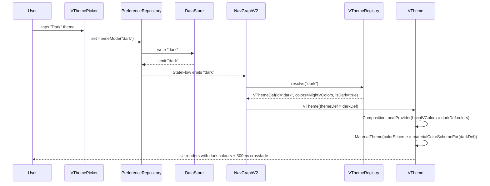

# Theming System — Technical Specification

> **Document status:** Implemented (90%) — VThemeRegistry, VThemeDef, VStatusBarAdapter, theme picker, user preference persistence, migration-031 all shipped
> **Last updated:** 2026-06-28
> **Prerequisites:** None
> **Supersedes:** Previous DARK_MODE_SPEC.md (which was out of sync with the codebase)
> **Template:** `_SPEC_TEMPLATE.md` v1 (25 mandatory + 6 optional sections)

---

## 1. Feature Overview

A production-ready theming system that supports system-aware dark mode, light mode, and multiple custom themes — with an architecture designed so that **adding a new theme requires modifying only a single file**.

### Goals

- **System theme** — Follow OS dark/light setting (default)
- **Light theme** — Crisp, bright palette (existing)
- **Dark theme** — Deep-black premium night palette (existing)
- **Multiple custom themes** — Extensible without architectural changes
- **Per-user preference** — Each user selects their own theme
- **Theme picker UI** — Users choose from available themes in Settings
- **Smooth transitions** — Animated colour changes on theme switch
- **Zero hardcoded colours** — All UI reads from `VColors` tokens
- **WCAG AA compliance** — 4.5:1 contrast for text, 3:1 for large text
- **Minimal recomposition** — Theme switches don't trigger unnecessary recompositions

### Non-goals

- [ ] Per-screen theme override (theme is app-wide)
- [ ] Theme scheduling (time-based dark mode — OS handles this via "system" mode)
- [ ] Theme import/export (users choose from registered themes only)

### Primary Design Goal

> **Adding a new custom theme requires modifying only a single file** (`VThemeRegistry.kt`). No changes elsewhere in the codebase for registering, wiring, or enabling a new theme. The architecture scales to dozens of themes with zero maintenance overhead.

### Dependencies

- Compose Multiplatform (existing)
- `VColors` data class (existing)
- `VTheme` composable + CompositionLocals (existing)
- `PreferenceRepository` (existing)
- DataStore / LocalStorage (existing)
- Material 3 `ColorScheme` (for bridge)

### Related Modules

- `VColors.kt` — colour token data class
- `VTheme.kt` — CompositionLocal provider
- `VTypography.kt` — type scale (theme-independent)
- `VDimens.kt` — spacing & radii (theme-independent)
- `VElevation.kt` — shadow system (adapts via `isNight`)
- `VMotion.kt` — animation tokens (theme-independent)
- `EnrollTokens.kt` — semantic bridge
- `PreferenceRepository.kt` — theme persistence

---

## 2. Current System Assessment

### Existing Code

#### VColors — Colour Token Data Class

`@/Users/priyanshupatel/AndroidStudioProjects/Vidya Prayag/composeApp/src/commonMain/kotlin/com/littlebridge/enrollplus/ui/v2/theme/VColors.kt`

`VColors` is an `@Immutable data class` with ~30 colour tokens across 6 categories:

| Category | Tokens |
|---|---|
| **Brand** | `teal`, `tealDeep`, `navy`, `navyDeep`, `lavender`, `lavenderLight`, `cream`, `warmOrange` |
| **Accent** | `accent`, `accentSoft`, `accentDeep`, `accentTint` |
| **Ink (text)** | `ink`, `ink2`, `ink3`, `placeholder` |
| **Surfaces** | `background`, `card`, `border1`, `border2`, `hairline`, `shadowTint` |
| **Semantic** | `success`, `successInk`, `warning`, `warningInk`, `danger`, `dangerInk` |
| **Meta** | `isNight: Boolean` |

Two pre-built instances exist:
- `LightVColors` — light/warm palette (parent, discovery, admin/teacher)
- `NightVColors` — deep-black night palette

Raw hex values are declared once in a `private object Raw` — the single declaration site mirroring `theme.css :root / .theme-night`.

#### VPortalTone — Theme Enum

```kotlin
enum class VPortalTone { Light, Warm, Night }
```

Currently maps to `VColors` via:
```kotlin
fun vColorsFor(tone: VPortalTone): VColors = when (tone) {
    VPortalTone.Light, VPortalTone.Warm -> LightVColors
    VPortalTone.Night -> NightVColors
}
```

**Note:** `Warm` and `Light` currently resolve to the same `LightVColors` instance. This is by design — the "warm" aesthetic is a light theme with the same tokens.

#### VTheme — CompositionLocal Provider

`@/Users/priyanshupatel/AndroidStudioProjects/Vidya Prayag/composeApp/src/commonMain/kotlin/com/littlebridge/enrollplus/ui/v2/theme/VTheme.kt`

```kotlin
@Composable
fun VTheme(
    tone: VPortalTone = VPortalTone.Light,
    colors: VColors = vColorsFor(tone),
    typography: VTypography = vidyaSetuTypography(),
    dimens: VDimens = DefaultVDimens,
    content: @Composable () -> Unit,
)
```

Provides four `CompositionLocal`s:
- `LocalVColors` → `VColors`
- `LocalVType` → `VTypography`
- `LocalVDimens` → `VDimens`
- `LocalVPortalTone` → `VPortalTone`

Ergonomic accessor: `VTheme.colors`, `VTheme.type`, `VTheme.dimens`, `VTheme.tone`.

**This file is the core that will be evolved** (see §8).

#### VTypography — Type Scale

`@/Users/priyanshupatel/AndroidStudioProjects/Vidya Prayag/composeApp/src/commonMain/kotlin/com/littlebridge/enrollplus/ui/v2/theme/VType.kt`

Plus Jakarta Sans (UI) + DM Mono (data). 13 text styles. **Theme-independent** — same for all themes. Preserved unchanged.

#### VDimens — Spacing & Radii

`@/Users/priyanshupatel/AndroidStudioProjects/Vidya Prayag/composeApp/src/commonMain/kotlin/com/littlebridge/enrollplus/ui/v2/theme/VDimens.kt`

Base-4 spacing scale + border radii. **Theme-independent**. Preserved unchanged.

#### VElevation — Shadow System

`@/Users/priyanshupatel/AndroidStudioProjects/Vidya Prayag/composeApp/src/commonMain/kotlin/com/littlebridge/enrollplus/ui/v2/theme/VElevation.kt`

3-tier navy-tinted shadow system. Already checks `VTheme.colors.isNight` to skip shadows in dark mode. Preserved unchanged.

#### VMotion — Animation Tokens

`@/Users/priyanshupatel/AndroidStudioProjects/Vidya Prayag/composeApp/src/commonMain/kotlin/com/littlebridge/enrollplus/ui/v2/theme/VMotion.kt`

Spring/entrance/transition tokens. **Theme-independent**. Preserved unchanged.

#### EnrollTokens — Semantic Bridge

`@/Users/priyanshupatel/AndroidStudioProjects/Vidya Prayag/composeApp/src/commonMain/kotlin/com/littlebridge/enrollplus/ui/v2/theme/EnrollTokens.kt`

Maps the teacher-portal loop vocabulary (`Enroll.colors.primary`, `Enroll.type.headingLarge`, etc.) onto `VTheme` tokens. All accessors are `@Composable` and resolve from the active `VTheme`, so they automatically honour the active theme. Preserved unchanged.

#### PreferenceRepository — Theme Persistence

`@/Users/priyanshupatel/AndroidStudioProjects/Vidya Prayag/shared/src/commonMain/kotlin/com/littlebridge/enrollplus/core/prefs/PreferenceRepository.kt`

```kotlin
interface PreferenceRepository {
    fun getThemeName(): Flow<String>
    suspend fun setThemeName(name: String)
    // ... other prefs
}
```

Three implementations:
- `PreferenceManager` (Android/JVM — DataStore) — defaults to `"LIGHT"`
- `LocalStoragePreferenceManager` (js — `window.localStorage`) — defaults to `"LIGHT"`
- `LocalStoragePreferenceManager` (wasmJs — external JS bridge) — defaults to `"LIGHT"`

Theme is deliberately **preserved across logout** (`clearSession()` does not remove the theme key).

#### Theme Switching — Teacher Portal Only

`TeacherPortalV2.kt` reads the theme preference and applies it:
```kotlin
val themeName by preferenceRepository.getThemeName().collectAsState(initial = "WARM")
val tone = when (themeName.uppercase()) {
    "LIGHT" -> VPortalTone.Light
    "NIGHT" -> VPortalTone.Night
    else -> VPortalTone.Warm
}
VTheme(tone = tone) { /* portal content */ }
```

`TeacherProfileScreenV2.kt` has a `ThemeCard` with three options: Warm, Light, Night.

#### Status Bar Adaptation (Android)

`MainActivity.kt` already detects system dark mode for edge-to-edge styling:
```kotlin
val isDarkMode = (resources.configuration.uiMode and Configuration.UI_MODE_NIGHT_MASK) ==
        Configuration.UI_MODE_NIGHT_YES
enableEdgeToEdge(
    statusBarStyle = if (isDarkMode) SystemBarStyle.dark(...) else SystemBarStyle.light(...),
    navigationBarStyle = if (isDarkMode) SystemBarStyle.dark(...) else SystemBarStyle.light(...),
)
```

#### Server-Side — AppUsersTable

`@/Users/priyanshupatel/AndroidStudioProjects/Vidya Prayag/server/src/main/kotlin/com/littlebridge/enrollplus/db/Tables.kt`

```kotlin
object AppUsersTable : UUIDTable("app_users", "id") {
    val languagePref = varchar("language_pref", 8).default("hi")
    // ... no themePref column
}
```

No `theme_pref` column exists. Theme preference is client-side only.

### Existing Database

- No `theme_pref` column in `AppUsersTable`; theme preference is client-side only
- Server-side: standard `app_users` table with `language_pref` column

### Existing APIs

- No dedicated theme API endpoint
- `GET /api/v1/user/details` returns user info (no theme field currently)

### Existing UI

- `ThemeCard` in `TeacherProfileScreenV2.kt` with three options: Warm, Light, Night
- No theme picker for parents or admins
- `SchoolPortalV2` hardcodes `VPortalTone.Warm`
- `ParentPortalV2` and `NavGraphV2` use role-based tone, not user preference

### Existing Services

- `PreferenceRepository` with `getThemeName()` / `setThemeName()`
- Three platform implementations (Android DataStore, JS LocalStorage, wasmJs LocalStorage)

### Existing Documentation

- Previous `DARK_MODE_SPEC.md` was out of sync with the codebase (superseded by this spec)

### Technical Debt

| # | Gap | Details |
|---|---|---|
| M1 | No "System" theme mode | Only LIGHT/WARM/NIGHT — no `isSystemInDarkTheme()` integration |
| M2 | Theme only works in Teacher portal | `SchoolPortalV2` hardcodes `VPortalTone.Warm`; `ParentPortalV2` and `NavGraphV2` use role-based tone, not user preference |
| M3 | No server-side persistence | No `theme_pref` column in `AppUsersTable`; theme lost on device switch |
| M4 | `VPortalTone` is a closed enum | Adding a new theme requires modifying the enum + `vColorsFor()` + every `when(tone)` site |
| M5 | VButton has 16 hardcoded `Color(0x...)` values | `tonePalette()` in `VButton.kt` doesn't read from `VColors` — won't adapt to dark mode |
| M6 | 126 hardcoded `Color(0x...)` across 22 files | Screens and components with raw hex values that bypass the token system |
| M7 | No smooth theme transition | Theme switch is instant — no animated colour crossfade |
| M8 | No Material 3 bridge | `VTheme` doesn't wrap `MaterialTheme` — Material 3 components (`Text`, `Icon`) don't get colour scheme |
| M9 | No theme picker for parents/admins | Only teachers have `ThemeCard`; parents and admins can't change theme |
| M10 | `VPortalTone.Warm` == `LightVColors` | No distinct warm palette — Warm is just an alias for Light |

### Gaps

| # | Gap | Impact | Severity |
|---|---|---|---|
| G1 | Closed enum (`VPortalTone`) blocks extensibility | Every new theme requires touching 5+ files | **Critical** |
| G2 | No system-mode detection | Users can't follow OS dark mode setting | **High** |
| G3 | Theme only applied in teacher portal | Parents/admins stuck with role-based tone | **High** |
| G4 | No server-side persistence | Theme lost on device switch or reinstall | **Medium** |
| G5 | VButton hardcoded colours | Buttons won't adapt to dark/custom themes | **High** |
| G6 | 126 hardcoded `Color(0x...)` across screens | Won't adapt to theme changes | **High** |
| G7 | No Material 3 colour scheme bridge | Material components ignore theme | **Medium** |
| G8 | No animated theme transition | Jarring flash on theme switch | **Low** |
| G9 | No theme picker for parents/admins | Only teachers can choose theme | **High** |

---

## 3. Functional Requirements

### FR-001
| Field | Value |
|---|---|
| **Title** | System Theme Mode |
| **Description** | Follow OS dark/light setting (default mode) |
| **Priority** | High |
| **User Roles** | All |
| **Acceptance notes** | `isSystemInDarkTheme()` integration; resolves to light or dark |

### FR-002
| Field | Value |
|---|---|
| **Title** | Light Theme |
| **Description** | Crisp, bright palette (existing) |
| **Priority** | Critical |
| **User Roles** | All |
| **Acceptance notes** | Existing `LightVColors` preserved |

### FR-003
| Field | Value |
|---|---|
| **Title** | Dark Theme |
| **Description** | Deep-black premium night palette (existing) |
| **Priority** | Critical |
| **User Roles** | All |
| **Acceptance notes** | Existing `NightVColors` preserved |

### FR-004
| Field | Value |
|---|---|
| **Title** | Custom Themes |
| **Description** | Multiple custom themes extensible without architectural changes |
| **Priority** | Medium |
| **User Roles** | All |
| **Acceptance notes** | Adding a theme = modifying only `VThemeRegistry.kt` |

### FR-005
| Field | Value |
|---|---|
| **Title** | Per-User Preference |
| **Description** | Each user selects their own theme |
| **Priority** | High |
| **User Roles** | All |
| **Acceptance notes** | Persisted in DataStore + server-side |

### FR-006
| Field | Value |
|---|---|
| **Title** | Theme Picker UI |
| **Description** | Users choose from available themes in Settings |
| **Priority** | High |
| **User Roles** | All |
| **Acceptance notes** | Available for parent, teacher, and admin portals |

### FR-007
| Field | Value |
|---|---|
| **Title** | Smooth Transitions |
| **Description** | Animated colour changes on theme switch |
| **Priority** | Low |
| **User Roles** | All |
| **Acceptance notes** | 300ms crossfade via `AnimatedContent` |

### FR-008
| Field | Value |
|---|---|
| **Title** | Zero Hardcoded Colours |
| **Description** | All UI reads from `VColors` tokens |
| **Priority** | High |
| **User Roles** | System |
| **Acceptance notes** | 126 hardcoded `Color(0x...)` values replaced |

### FR-009
| Field | Value |
|---|---|
| **Title** | WCAG AA Compliance |
| **Description** | 4.5:1 contrast for text, 3:1 for large text |
| **Priority** | High |
| **User Roles** | System |
| **Acceptance notes** | Automated contrast audit per theme |

### FR-010
| Field | Value |
|---|---|
| **Title** | Minimal Recomposition |
| **Description** | Theme switches don't trigger unnecessary recompositions |
| **Priority** | Medium |
| **User Roles** | System |
| **Acceptance notes** | `staticCompositionLocalOf` + `@Immutable` |

### FR-011
| Field | Value |
|---|---|
| **Title** | Server-Side Persistence |
| **Description** | Theme preference synced to server for cross-device |
| **Priority** | Medium |
| **User Roles** | All |
| **Acceptance notes** | `theme_pref` column in `app_users` |

### FR-012
| Field | Value |
|---|---|
| **Title** | Material 3 Bridge |
| **Description** | Material 3 components honour the active theme |
| **Priority** | Medium |
| **User Roles** | System |
| **Acceptance notes** | `MaterialTheme(colorScheme = ...)` inside `VTheme` |

---

## 4. User Stories

### Parent
- [ ] Choose my preferred theme (light, dark, or system-follow) in Settings
- [ ] See my theme preference persist across app restarts
- [ ] See my theme preference persist across logout/login
- [ ] See my theme preference sync when I switch devices

### Teacher
- [ ] Choose my preferred theme in my Profile screen
- [ ] Have buttons and components adapt to my chosen theme
- [ ] Experience smooth transition when switching themes

### School Admin
- [ ] Choose my preferred theme in Settings
- [ ] Have all screens honour my theme choice (not just teacher portal)

### System
- [ ] Follow OS dark mode setting when "System" mode is selected
- [ ] Resolve theme from user preference at app root (NavGraphV2)
- [ ] Adapt status bar to resolved theme's `isDark` flag
- [ ] Skip shadows in dark mode (VElevation already does this)
- [ ] Ensure Material 3 components get correct colour scheme

---

## 5. Business Rules

### BR-001
**Rule:** Adding a new theme requires modifying only `VThemeRegistry.kt`.
**Enforcement:** Registry pattern — all themes defined in one file; no other file changes needed.

### BR-002
**Rule:** Theme preference is preserved across logout.
**Enforcement:** `clearSession()` does not remove the theme key from DataStore/LocalStorage.

### BR-003
**Rule:** User preference takes priority over role-based default.
**Enforcement:** `NavGraphV2` resolves theme from user preference, not `EntryRole.tone()`. Role-based tone used only as initial default before user has chosen.

### BR-004
**Rule:** Theme IDs are stable strings that must never change once released.
**Enforcement:** IDs persisted in DataStore and server-side. Renaming breaks existing user preferences. `displayName` can change freely.

### BR-005
**Rule:** All components must read from `VTheme.colors` — never hardcode `Color(0x...)`.
**Enforcement:** CI grep check: `grep -rn "Color(0x" composeApp/src/commonMain --include="*.kt" | grep -v VColors.kt | grep -v EnrollTokens.kt` must return 0.

### BR-006
**Rule:** Semantic colours (`success`, `warning`, `danger`) are for data states only, never branding.
**Enforcement:** Component integration guideline R5.

### BR-007
**Rule:** Never read `MaterialTheme.colorScheme` directly — use `VTheme.colors`.
**Enforcement:** Component integration guideline R3. Material 3 bridge is for third-party components only.

### BR-008
**Rule:** Server is source of truth on login; local preference wins if already set on device.
**Enforcement:** On login, server's `themePref` fetched via `GET /api/v1/user/details` and reconciled — server wins if local is at default, local wins if user has already chosen on this device.

### BR-009
**Rule:** Theme switch crossfade respects "reduce motion" settings.
**Enforcement:** If reduce motion is on → instant switch; if off → 300ms crossfade.

### BR-010
**Rule:** Reserved theme IDs: `"light"`, `"dark"`, `"warm"`, `"system"`.
**Enforcement:** `"system"` is a mode value, not a theme id. `"light"`, `"dark"`, `"warm"` are canonical theme IDs.

---

## 6. Database Design

### 6.1 Entity Relationship Summary

```
app_users (existing table, modified)
  └── theme_pref VARCHAR(32) DEFAULT 'system'
```

### 6.2 New Tables

N/A — no new tables. Only a column addition to existing `app_users`.

### 6.3 Modified Tables

#### `app_users`

```sql
ALTER TABLE app_users ADD COLUMN theme_pref VARCHAR(32) NOT NULL DEFAULT 'system';
-- Values: "system" | "light" | "dark" | "custom:<theme_id>" (e.g. "custom:ocean")
```

Using a single column with a composite value (`"custom:ocean"`) keeps the schema simple. The client parses it into mode + customId.

### 6.4 Indexes

N/A — `theme_pref` is a simple varchar column on existing table.

### 6.5 Constraints

| Constraint | Table | Rule |
|---|---|---|
| `NOT NULL` | `app_users.theme_pref` | Default `'system'` |
| `CHECK` (suggested) | `app_users.theme_pref` | One of: `system`, `light`, `dark`, or matches `custom:*` pattern |

### 6.6 Foreign Keys

N/A — no foreign keys.

### 6.7 Soft Delete Strategy

N/A — theme preference is not soft-deleted.

### 6.8 Audit Fields

N/A — `theme_pref` is a simple preference column. Changes not audited.

### 6.9 Migration Notes

- Migration is additive (`ALTER TABLE ADD COLUMN` with default) — non-breaking
- Existing users get `'system'` default — they'll see OS-follow behaviour
- File: `docs/db/migration_037_theme_pref.sql`

### 6.10 Exposed Mappings

```kotlin
object AppUsersTable : UUIDTable("app_users", "id") {
    // ... existing fields
    val themePref = varchar("theme_pref", 32).default("system")
}
```

### 6.11 Seed Data

N/A — default `'system'` value is set by column default.

---

## 7. State Machines

### Theme Mode State Machine

```
SYSTEM ──isSystemInDarkTheme()──> resolves to LIGHT or DARK theme
LIGHT  ──user selects──> resolves to LIGHT theme
DARK   ──user selects──> resolves to DARK theme
CUSTOM ──user selects──> resolves to theme by custom_theme_id
```

| Current State | Event | Next State | Guard / Condition |
|---|---|---|---|
| `system` | OS dark mode on | Dark theme rendered | `isSystemInDarkTheme() == true` |
| `system` | OS dark mode off | Light theme rendered | `isSystemInDarkTheme() == false` |
| `light` | User selects Light | Light theme rendered | — |
| `dark` | User selects Dark | Dark theme rendered | — |
| `custom` | User selects custom theme | Custom theme rendered | `custom_theme_id` valid |
| any | User selects System | `system` | — |
| any | User selects Light | `light` | — |
| any | User selects Dark | `dark` | — |
| any | User selects Custom | `custom` | `custom_theme_id` set |

### Theme Preference Sync State

```
LOCAL_ONLY ──sync to server──> SYNCED
SYNCED ──user changes locally──> LOCAL_ONLY ──sync──> SYNCED
```

| Current State | Event | Next State | Guard / Condition |
|---|---|---|---|
| `LOCAL_ONLY` | Background sync to server | `SYNCED` | Network available |
| `SYNCED` | User changes preference locally | `LOCAL_ONLY` | — |
| `LOCAL_ONLY` | Login on new device | `SYNCED` | Server has `theme_pref` value |

---

## 8. Backend Architecture

### 8.1 Component Overview

```
┌───────────────────────────────────────────────────────────────┐
│                    NavGraphV2 (App Root)                       │
│  Reads theme preference → resolves VThemeDef → wraps VTheme   │
└──────────────────┬────────────────────────────────────────────┘
                   │
         ┌─────────┴─────────┐
         ▼                   ▼
┌─────────────────┐  ┌──────────────────┐
│  PreferenceRepo  │  │  VThemeRegistry   │
│  (DataStore/LS)  │  │  (all themes)     │
│  theme_mode      │  │  byId map         │
│  custom_theme_id │  │  resolve()        │
└────────┬────────┘  └────────┬──────────┘
         │                    │
         ▼                    ▼
┌──────────────────────────────────────────────────┐
│                   VTheme Composable                │
│  CompositionLocalProvider + MaterialTheme bridge  │
│  LocalVColors, LocalVThemeDef                     │
└──────────────────┬───────────────────────────────┘
                   │
         ┌─────────┴─────────┐
         ▼                   ▼
┌─────────────────┐  ┌──────────────────┐
│  All @Composable  │  │  Material 3       │
│  functions        │  │  components       │
│  VTheme.colors    │  │  MaterialTheme    │
│  VTheme.themeDef  │  │  .colorScheme     │
└─────────────────┘  └──────────────────┘
```

### 8.2 Design Principles

1. **Evolve, don't redesign** — The existing `VColors`/`VTheme`/`CompositionLocal` system is sound. We extend it, not replace it.
2. **Registry over enum** — Replace the closed `VPortalTone` enum with a string-keyed registry so themes are added in one file.
3. **Single-file extensibility** — Adding a theme = adding one `VThemeDef` to `VThemeRegistry.kt`.
4. **Backward compatible** — Existing `VPortalTone` references continue to work via compatibility mapping.
5. **System-aware** — A special `"system"` preference resolves to light or dark based on `isSystemInDarkTheme()`.

### 8.3 Core Types

#### VThemeDef

Replaces `VPortalTone` as the theme definition unit. A `VThemeDef` is a self-contained theme specification:

```kotlin
@Immutable
data class VThemeDef(
    val id: String,              // unique stable key: "light", "dark", "warm", "ocean", ...
    val displayName: String,     // user-facing label: "Light", "Dark", "Warm", "Ocean Blue"
    val description: String,     // user-facing caption: "Crisp & bright"
    val colors: VColors,         // the full colour token set
    val isDark: Boolean,         // whether this is a dark theme (controls shadows, status bar)
    val icon: ImageVector,       // picker UI icon (from VIcons)
)
```

#### VThemeMode

The user's *intent* — which theme to use, including system-follow:

```kotlin
enum class VThemeMode {
    SYSTEM,   // follow OS dark/light
    LIGHT,    // force light
    DARK,     // force dark
    CUSTOM,   // force a specific custom theme (id stored separately)
}
```

When mode is `SYSTEM`, the resolved theme is `"light"` or `"dark"` based on `isSystemInDarkTheme()`.
When mode is `LIGHT` / `DARK`, the resolved theme is the theme with that id.
When mode is `CUSTOM`, the resolved theme is the one whose `id` matches the stored custom theme id.

### 8.4 Theme Registry: VThemeRegistry

The **single file** that defines all available themes. This is the only file that needs modification to add a new theme:

```kotlin
object VThemeRegistry {
    val themes: List<VThemeDef> = listOf(
        VThemeDef(
            id = "light",
            displayName = "Light",
            description = "Crisp & bright",
            colors = LightVColors,
            isDark = false,
            icon = VIcons.Star,
        ),
        VThemeDef(
            id = "dark",
            displayName = "Dark",
            description = "Easy on the eyes",
            colors = NightVColors,
            isDark = true,
            icon = VIcons.Bookmark,
        ),
        VThemeDef(
            id = "warm",
            displayName = "Warm",
            description = "Cream & lavender",
            colors = LightVColors,  // warm == light tokens (existing behaviour)
            isDark = false,
            icon = VIcons.Sparkles,
        ),
        // ── Add new themes below this line ──────────────────────────────────
        // VThemeDef(
        //     id = "ocean",
        //     displayName = "Ocean Blue",
        //     description = "Cool & calming",
        //     colors = OceanVColors,
        //     isDark = false,
        //     icon = VIcons.Water,
        // ),
    )

    val byId: Map<String, VThemeDef> = themes.associateBy { it.id }

    val defaultTheme: VThemeDef = themes.first { it.id == "light" }
    val defaultDarkTheme: VThemeDef = themes.first { it.id == "dark" }

    fun resolve(themeId: String): VThemeDef =
        byId[themeId] ?: defaultTheme

    fun resolveSystem(isSystemDark: Boolean): VThemeDef =
        if (isSystemDark) defaultDarkTheme else defaultTheme
}
```

**Adding a new theme = add one `VThemeDef` entry + its `VColors` instance to this file.** No other file changes needed.

### 8.5 Updated VTheme Composable

The `VTheme` composable is evolved to accept a `VThemeDef` instead of (or alongside) `VPortalTone`:

```kotlin
@Composable
fun VTheme(
    themeDef: VThemeDef = VThemeRegistry.defaultTheme,
    typography: VTypography = vidyaSetuTypography(),
    dimens: VDimens = DefaultVDimens,
    content: @Composable () -> Unit,
) {
    CompositionLocalProvider(
        LocalVColors provides themeDef.colors,
        LocalVType provides typography,
        LocalVDimens provides dimens,
        LocalVThemeDef provides themeDef,
        // Material 3 bridge (see §8.7)
        LocalMaterialTheme provides materialColorSchemeFor(themeDef),
        content = content,
    )
}
```

### 8.6 Backward Compatibility with VPortalTone

`VPortalTone` is preserved as a deprecated alias to avoid breaking existing call sites during migration:

```kotlin
@Deprecated("Use VThemeDef via VThemeRegistry instead")
enum class VPortalTone { Light, Warm, Night }

@Deprecated("Use VThemeRegistry.resolve(id) instead")
fun vColorsFor(tone: VPortalTone): VColors = when (tone) {
    VPortalTone.Light -> VThemeRegistry.resolve("light").colors
    VPortalTone.Warm -> VThemeRegistry.resolve("warm").colors
    VPortalTone.Night -> VThemeRegistry.resolve("dark").colors
}

@Deprecated("Use VTheme(themeDef = ...) instead")
@Composable
fun VTheme(
    tone: VPortalTone,
    content: @Composable () -> Unit,
) {
    val def = when (tone) {
        VPortalTone.Light -> VThemeRegistry.resolve("light")
        VPortalTone.Warm -> VThemeRegistry.resolve("warm")
        VPortalTone.Night -> VThemeRegistry.resolve("dark")
    }
    VTheme(themeDef = def, content = content)
}
```

Existing call sites like `VTheme(tone = VPortalTone.Warm) { ... }` continue to compile and work. They are migrated to `VTheme(themeDef = ...)` incrementally.

### 8.7 Material 3 Bridge

To ensure Material 3 components (`Text`, `Icon`, `Slider`, `Switch`, etc.) honour the active theme, `VTheme` also wraps content in `MaterialTheme` with a derived `ColorScheme`:

```kotlin
@Composable
private fun materialColorSchemeFor(def: VThemeDef): ColorScheme {
    val c = def.colors
    return if (def.isDark) darkColorScheme(
        primary = c.accent,
        onPrimary = c.card,
        background = c.background,
        onBackground = c.ink,
        surface = c.card,
        onSurface = c.ink,
        surfaceVariant = c.cream,
        onSurfaceVariant = c.ink2,
        outline = c.border1,
        outlineVariant = c.hairline,
        error = c.dangerInk,
        onError = c.card,
    ) else lightColorScheme(
        primary = c.accent,
        onPrimary = c.card,
        background = c.background,
        onBackground = c.ink,
        surface = c.card,
        onSurface = c.ink,
        surfaceVariant = c.cream,
        onSurfaceVariant = c.ink2,
        outline = c.border1,
        outlineVariant = c.hairline,
        error = c.dangerInk,
        onError = c.card,
    )
}
```

This is wrapped inside `VTheme`:
```kotlin
MaterialTheme(colorScheme = materialColorSchemeFor(themeDef)) {
    CompositionLocalProvider(
        LocalVColors provides themeDef.colors,
        // ... other locals
        content = content,
    )
}
```

**This does not replace `VColors`** — it's a bridge so that any Material 3 component that reads `MaterialTheme.colorScheme` gets the right colours. The canonical source of truth remains `VTheme.colors`.

### 8.8 New CompositionLocal: LocalVThemeDef

Replaces `LocalVPortalTone`:

```kotlin
val LocalVThemeDef: ProvidableCompositionLocal<VThemeDef> =
    staticCompositionLocalOf { VThemeRegistry.defaultTheme }
```

The `VTheme.tone` accessor is replaced by `VTheme.themeDef`:
```kotlin
object VTheme {
    val colors: VColors @Composable get() = LocalVColors.current
    val type: VTypography @Composable get() = LocalVType.current
    val dimens: VDimens @Composable get() = LocalVDimens.current
    val themeDef: VThemeDef @Composable get() = LocalVThemeDef.current

    // Deprecated backward-compat accessor
    @Deprecated("Use themeDef instead")
    val tone: VPortalTone @Composable get() = when (themeDef.id) {
        "dark" -> VPortalTone.Night
        "warm" -> VPortalTone.Warm
        else -> VPortalTone.Light
    }
}
```

### 8.9 Theme Resolution Flow

```
User preference (PreferenceRepository)
    │
    ├── mode: "system" ──→ isSystemInDarkTheme() ──→ VThemeRegistry.resolveSystem()
    ├── mode: "light"  ──→ VThemeRegistry.resolve("light")
    ├── mode: "dark"   ──→ VThemeRegistry.resolve("dark")
    └── mode: "custom" ──→ VThemeRegistry.resolve(customThemeId)
                                │
                                ▼
                         VThemeDef (id, colors, isDark, ...)
                                │
                                ▼
                         VTheme(themeDef = resolved)
                                │
                                ▼
                    CompositionLocalProvider
                                │
                    ┌───────────┼───────────┐
                    ▼           ▼           ▼
              LocalVColors  LocalVThemeDef  MaterialTheme
                    │           │
                    ▼           ▼
              VTheme.colors  VTheme.themeDef
              (all UI)     (shadows, status bar)
```

### 8.10 Theme Token Organization

#### Token Categories (unchanged)

The `VColors` data class categories are preserved:

| Category | Purpose | Theme-variant? |
|---|---|---|
| **Brand** | School identity colours | Yes — each theme defines its own |
| **Accent** | Primary interactive colour | Yes |
| **Ink** | Text colours | Yes |
| **Surfaces** | Background, card, borders | Yes |
| **Semantic** | Data states (success/warning/danger) | Yes — dark themes use brighter inks |
| **Meta** | `isNight` flag | Yes — controls shadow/elevation behaviour |

#### Token Naming Convention

Existing token names are preserved. New custom themes use the same `VColors` fields — a theme is just a different set of values for the same fields, not new field names.

#### Raw Value Declaration

Each theme's raw hex values are declared as `private val` properties inside `VThemeRegistry.kt` (or in a companion object of the registry). This keeps all colour definitions in one file:

```kotlin
object VThemeRegistry {
    // ── Light palette (existing, from VColors.kt Raw object) ──
    private val lightColors = VColors(
        teal = Color(0xFF3CB9A9),
        // ... all 30 tokens
        isNight = false,
    )

    // ── Dark palette (existing, from VColors.kt Raw object) ──
    private val darkColors = VColors(
        teal = Color(0xFF3CD1BE),
        // ... all 30 tokens
        isNight = true,
    )

    // ── New custom theme: Ocean Blue ──
    private val oceanColors = VColors(
        teal = Color(0xFF3CB9A9),
        // ... all 30 tokens with ocean-blue values
        isNight = false,
    )

    val themes = listOf(
        VThemeDef("light", "Light", "Crisp & bright", lightColors, isDark = false, icon = VIcons.Star),
        VThemeDef("dark", "Dark", "Easy on the eyes", darkColors, isDark = true, icon = VIcons.Bookmark),
        VThemeDef("warm", "Warm", "Cream & lavender", lightColors, isDark = false, icon = VIcons.Sparkles),
        VThemeDef("ocean", "Ocean Blue", "Cool & calming", oceanColors, isDark = false, icon = VIcons.Water),
    )
}
```

#### Typography, Dimens, Shapes, Motion, Elevation

These token systems are **theme-independent** and shared across all themes:
- `VTypography` — Plus Jakarta Sans + DM Mono (same for all themes)
- `VDimens` — Base-4 spacing + radii (same for all themes)
- `VElevation` — Shadow system (already adapts via `isNight`)
- `VMotion` — Animation tokens (same for all themes)

If a future theme needs different typography or shapes, `VThemeDef` can be extended with optional `typography` and `dimens` fields (see §25).

### 8.11 Design Token Hierarchy

```
VThemeDef
├── VColors (colour tokens — per-theme)
│   ├── Brand: teal, tealDeep, navy, navyDeep, lavender, lavenderLight, cream, warmOrange
│   ├── Accent: accent, accentSoft, accentDeep, accentTint
│   ├── Ink: ink, ink2, ink3, placeholder
│   ├── Surfaces: background, card, border1, border2, hairline, shadowTint
│   ├── Semantic: success, successInk, warning, warningInk, danger, dangerInk
│   └── Meta: isNight
├── VTypography (type scale — shared, but can be overridden per-theme in future)
│   ├── UI: h1, h2, h3, h4, body, bodyStrong, caption, label, labelStrong, inputLabel
│   └── Data: data, dataSm, dataLg
├── VDimens (spacing + radii — shared)
│   ├── Spacing: xs, sm, md, lg, xl, xxl, xxxl, screenPadding
│   └── Radii: radiusSm, radiusMd, radiusInput, radiusLg, radiusCard, radiusXl, radiusSheet, radiusPill
├── VElevation (shadow system — adapts via isNight)
│   └── Levels: Card, Raised, Modal
├── VMotion (animation tokens — shared)
│   ├── Springs: springSoft, springSheet, springCard, springSnappy
│   └── Transitions: forwardSlide, modalRise, quietFade, fadeUp
└── Material 3 ColorScheme (derived bridge — auto-generated from VColors)
    ├── primary, onPrimary, primaryContainer, onPrimaryContainer
    ├── secondary, onSecondary, surface, onSurface
    ├── background, onBackground, error, onError
    └── outline, outlineVariant, surfaceVariant, onSurfaceVariant
```

### 8.12 Theme Registration Strategy

#### Single-File Registration

All themes are registered in `VThemeRegistry.kt`. This is the **only file** that changes when adding a theme.

#### Adding a New Theme — Step by Step

1. **Open** `VThemeRegistry.kt`
2. **Define** the `VColors` instance with all 30 tokens
3. **Add** a `VThemeDef` entry to the `themes` list
4. **Done** — the theme automatically appears in the theme picker UI, is selectable by users, and persists correctly

No changes needed in:
- `VTheme.kt` — the composable reads from the registry
- `PreferenceManager.kt` — stores any string theme id
- `ThemePicker.kt` — iterates `VThemeRegistry.themes` dynamically
- `NavGraphV2.kt` — resolves theme from preference
- Any screen or component — all read from `VTheme.colors`

#### Theme ID Stability

Theme IDs are **stable strings** that must never change once released (they're persisted in DataStore and server-side). Renaming an id breaks existing user preferences. The `displayName` can change freely.

#### Reserved IDs

| ID | Meaning |
|---|---|
| `"light"` | The canonical light theme |
| `"dark"` | The canonical dark theme |
| `"warm"` | The warm-light variant (backward compat with teacher portal) |
| `"system"` | Not a theme id — it's a mode value stored in preferences |

### 8.13 Repositories

N/A — theming is client-side infrastructure. `PreferenceRepository` extended with new methods (see §11).

### 8.14 Mappers

N/A — theme preferences stored as strings; `VThemeRegistry.resolve()` maps string → `VThemeDef`.

### 8.15 Permission Checks

N/A — theme preference is per-user, no permission restrictions. All users can change their own theme.

### 8.16 Background Jobs

| Job | Platform | Schedule | Description | Error handling |
|---|---|---|---|---|
| Theme pref sync | All | After local change (best-effort) | Sync `theme_pref` to server via PATCH | Log error; retry on next app launch |

### 8.17 Domain Events

| Event | Emitted By | Consumed By | Side Effect |
|---|---|---|---|
| `ThemePreferenceChanged` | `PreferenceRepository.setThemeMode()` | `NavGraphV2` | Recompose with new `VThemeDef` |
| `ThemeSyncedToServer` | Theme sync job | — | `theme_pref` persisted server-side |
| `ThemeReconciledOnLogin` | Login flow | `PreferenceRepository` | Server value reconciled with local |

### 8.18 Caching

- `VThemeRegistry.byId` — `Map<String, VThemeDef>` built once at class init (O(1) lookup)
- `VThemeRegistry.themes` — `List<VThemeDef>` for picker iteration (O(n), n typically 3-10)

### 8.19 Transactions

N/A — theme preference is a single column update.

---

## 9. API Contracts

### 9.1 Update Theme Preference

#### `PATCH /api/v1/user/theme-pref`
| Field | Value |
|---|---|
| **Description** | Update user's theme preference |
| **Authorization** | Authenticated user |
| **Rate Limit** | 10/min |
| **200 Response** | `{ "ok": true }` |

**Request:**
```json
{ "themePref": "system" }  // or "light", "dark", "custom:ocean"
```

### 9.2 Get Theme Preference (included in user details)

#### `GET /api/v1/user/details`
| Field | Value |
|---|---|
| **Description** | Get user details (includes `themePref`) |
| **Authorization** | Authenticated user |
| **Rate Limit** | 30/min |
| **200 Response** | `UserDetailsDto` with `themePref` field |

**Response (addition to existing):**
```json
{
  "success": true,
  "data": {
    "id": "uuid",
    "name": "John Doe",
    "role": "teacher",
    "themePref": "system"
  }
}
```

### 9.3 Client Sync

The client syncs to the server in the background after a local DataStore write (best-effort, non-blocking). On login, the server's `themePref` is fetched via `GET /api/v1/user/details` and reconciled with the local preference (server wins if local is at default, local wins if user has already chosen on this device).

---

## 10. Frontend Architecture

### 10.1 Screens

| Screen | Platform | Role | Description |
|---|---|---|---|
| `VThemePicker` (shared component) | All | All | Theme selection cards — iterates `VThemeRegistry.themes` |
| Teacher Profile | All | Teacher | Existing `ThemeCard` replaced with `VThemePicker` |
| Parent Profile/Settings | All | Parent | New `VThemePicker` added |
| Admin Settings | All | Admin | New `VThemePicker` added |

### 10.2 Navigation

N/A — theme picker is embedded in existing profile/settings screens. No new navigation routes.

### 10.3 UX Flows

#### Theme Selection Flow

1. User opens **Settings** (Profile tab → Appearance section)
2. A **theme picker** shows all themes from `VThemeRegistry.themes` as selectable cards
3. A **mode selector** offers: System / Light / Dark / (Custom themes appear as individual cards)
4. User taps a theme → `PreferenceRepository.setThemeMode(mode)` + `setCustomThemeId(id)` (if custom)
5. The `StateFlow<String>` emits → the portal recomposes with the new `VThemeDef`
6. A smooth crossfade animation transitions the colours

#### Theme Application at App Root

Instead of per-portal theme application (current: only `TeacherPortalV2`), theme is applied at the **`NavGraphV2` level** so all portals honour it:

```kotlin
@Composable
fun NavGraphV2(...) {
    val preferenceRepository = koinInject<PreferenceRepository>()
    val themeMode by preferenceRepository.getThemeMode().collectAsState(initial = "system")
    val customThemeId by preferenceRepository.getCustomThemeId().collectAsState(initial = null)

    val resolvedDef = resolveThemeDef(themeMode, customThemeId)

    VTheme(themeDef = resolvedDef) {
        // AuthedFlow / UnauthFlow — all inherit the user's theme
    }
}

@Composable
private fun resolveThemeDef(mode: String, customId: String?): VThemeDef {
    return when (mode) {
        "light" -> VThemeRegistry.resolve("light")
        "dark" -> VThemeRegistry.resolve("dark")
        "custom" -> VThemeRegistry.resolve(customId ?: "light")
        else -> VThemeRegistry.resolveSystem(isSystemInDarkTheme())
    }
}
```

**This replaces the current role-based tone logic** in `EntryRole.tone()`. The role-based tone was a design decision to give admins a "warm" look, but user preference should take priority. The role-based default can be used as the *initial* default before the user has chosen (see §9).

### 10.4 State Management

```kotlin
data class ThemeState(
    val mode: String,         // "system", "light", "dark", "custom"
    val customThemeId: String?,  // null unless mode == "custom"
    val resolvedDef: VThemeDef,  // the active theme definition
)
```

### 10.5 Offline Support

- Theme preference stored locally in DataStore/LocalStorage — works offline
- Server sync is best-effort (synced when online)
- Theme switching works fully offline

### 10.6 Loading States

- Initial load: default theme (`VThemeRegistry.defaultTheme`) shown briefly until preference loads
- Preference loaded from DataStore: instant (local read)

### 10.7 Error Handling (UI)

- Invalid theme ID in preference: falls back to `defaultTheme` via `VThemeRegistry.resolve()`
- Server sync failure: silent — local preference is authoritative

### 10.8 Search & Filtering

N/A — theme picker shows all registered themes (typically 3-10).

### 10.9 Pagination

N/A — all themes shown at once.

### 10.10 UI Components

#### VThemePicker

```kotlin
@Composable
fun VThemePicker(
    currentMode: VThemeMode,
    currentCustomId: String?,
    onSelect: (mode: VThemeMode, customId: String?) -> Unit,
)
```

This iterates `VThemeRegistry.themes` dynamically — new themes appear automatically. The picker shows:
- **System** option (follows OS)
- One card per registered theme (Light, Dark, Warm, Ocean, ...)
- The active selection is highlighted with the accent colour

#### Runtime Switching Behaviour

Theme switching is fully reactive via `StateFlow`:

```
User taps theme
    │
    ▼
PreferenceRepository.setThemeMode("dark")
    │
    ▼
DataStore emits new value
    │
    ▼
StateFlow<String> emits in NavGraphV2
    │
    ▼
resolveThemeDef() returns new VThemeDef
    │
    ▼
VTheme(themeDef = newDef) recomposes
    │
    ▼
CompositionLocalProvider provides new VColors
    │
    ▼
All @Composable functions reading VTheme.colors recompose
    │
    ▼
UI renders with new colours
```

#### Smooth Transition

To avoid a jarring flash, wrap the theme switch in an `AnimatedContent`:

```kotlin
AnimatedContent(
    targetState = resolvedDef,
    transitionSpec = {
        fadeIn(tween(300)) togetherWith fadeOut(tween(200))
    },
    label = "theme-switch",
) { def ->
    VTheme(themeDef = def) {
        content()
    }
}
```

This crossfades the entire app tree from the old theme to the new theme over 300ms. The `staticCompositionLocalOf` for `VColors` ensures only the `VTheme` wrapper recomposes — not every individual component — because `CompositionLocalProvider` with a new value invalidates only the content lambda.

#### Recomposition Efficiency

- `VColors` is `@Immutable` → Compose skips equality checks on its fields
- `LocalVColors` is `staticCompositionLocalOf` → no snapshot tracking overhead
- Only the `VTheme` content lambda recomposes when the `VColors` instance changes
- Individual `@Composable` functions that read `VTheme.colors` recompose only if their output changes (which it will, since colours changed) — but this is unavoidable and correct

#### Status Bar Adaptation

The status bar should adapt to the resolved theme, not just the OS setting. In `MainActivity.kt`:

```kotlin
// Observe the resolved theme def's isDark flag
val isDark = resolvedThemeDef.isDark
enableEdgeToEdge(
    statusBarStyle = if (isDark) SystemBarStyle.dark(TRANSPARENT) else SystemBarStyle.light(TRANSPARENT, TRANSPARENT),
    navigationBarStyle = if (isDark) SystemBarStyle.dark(TRANSPARENT) else SystemBarStyle.light(TRANSPARENT, TRANSPARENT),
)
```

This requires the resolved theme to be observable at the `MainActivity` level. The simplest approach: hoist the theme `StateFlow` above `App()` and pass the `isDark` flag down as a parameter, or use a `SideEffect` to update the system bars whenever `VTheme.themeDef.isDark` changes.

### 10.11 Component Integration Guidelines

#### Rules for All Components

| Rule | Description |
|---|---|
| **R1** | Never hardcode `Color(0x...)` — always read from `VTheme.colors` |
| **R2** | Default colour parameters should reference `VTheme.colors` — e.g. `color: Color = VTheme.colors.ink` |
| **R3** | Never read `MaterialTheme.colorScheme` directly — use `VTheme.colors` (the Material 3 bridge is for third-party components only) |
| **R4** | Never reference `VPortalTone` in new code — use `VThemeDef` via `VThemeRegistry` |
| **R5** | Semantic colours (`success`, `warning`, `danger`) are for **data states only**, never branding |

#### VButton — Hardcoded Colour Fix

`VButton.kt`'s `tonePalette()` has 16 hardcoded `Color(0x...)` values. These must be replaced with `VColors` token reads:

**Before (hardcoded):**
```kotlin
private fun tonePalette(tone: VButtonTone): TonePal = when (tone) {
    VButtonTone.Navy -> TonePal(
        bg = Color(0xFF26234D), fg = Color.White, shadow = Color(0x4D26234D),
        soft = Color(0xFFD8D2F1), softFg = Color(0xFF26234D), ...)
}
```

**After (token-driven):**
```kotlin
@Composable
private fun tonePalette(tone: VButtonTone): TonePal {
    val c = VTheme.colors
    return when (tone) {
        VButtonTone.Navy -> TonePal(
            bg = c.navy, fg = c.card, shadow = c.navy.copy(alpha = 0.3f),
            soft = c.lavenderLight, softFg = c.navy, softBorder = c.navy.copy(alpha = 0.22f), softShadow = c.navy.copy(alpha = 0.16f))
        VButtonTone.Teal -> TonePal(
            bg = c.tealDeep, fg = c.card, shadow = c.tealDeep.copy(alpha = 0.28f),
            soft = c.teal.copy(alpha = 0.25f), softFg = c.tealDeep, ...)
        // ... map all 8 tones to VColors tokens
    }
}
```

This makes `tonePalette` a `@Composable` function — a minor but necessary change. The `VButton` composable already reads `VTheme.colors`, so this is consistent.

#### EnrollTokens Bridge

`EnrollTokens.kt` already maps semantic names to `VColors` tokens. **No changes needed** — it automatically honours any theme because it reads from `VTheme.colors`.

#### VElevation

Already checks `VTheme.colors.isNight` to skip shadows in dark mode. **No changes needed.**

#### Hardcoded Colour Audit

126 `Color(0x...)` matches across 22 files in `composeApp/src/commonMain`. These must be replaced with `VTheme.colors` token reads. The audit is a mechanical process:

1. `grep -rn "Color(0x" composeApp/src/commonMain --include="*.kt"`
2. For each match, identify the semantic purpose (background, text, border, etc.)
3. Replace with the corresponding `VTheme.colors.*` token
4. If no existing token fits, add a new token to `VColors` and populate it in all theme instances

**Files with hardcoded colours (by count):**

| File | Count | Priority |
|---|---|---|
| `VColors.kt` | 48 | **Keep** — this is the token declaration site |
| `VButton.kt` | 16 | **High** — fix `tonePalette()` |
| `VAvatar.kt` | 7 | High |
| `ParentProfileCardScreenV2.kt` | 7 | High |
| `ParentLinkChildScreenV2.kt` | 5 | Medium |
| `NotificationsScreenV2.kt` | 5 | Medium |
| `SchoolHomeScreenV2.kt` | 5 | Medium |
| `CommonLandingScreenV3.kt` | 4 | Medium |
| `DiscoveryScreenV2.kt` | 4 | Medium |
| `PewsPreview.kt` | 4 | Low |
| `VBadge.kt` | 3 | High |
| `SchoolOnboardingScreenV2.kt` | 3 | Medium |
| `SriPreview.kt` | 3 | Low |
| `VNavigation.kt` | 2 | High |
| `ParentPalette.kt` | 2 | Medium |
| `TeacherKit.kt` | 2 | Medium |
| `App.kt` | 1 | Low (debug banner) |
| `VInput.kt` | 1 | High |
| `ParentActivityScreenV2.kt` | 1 | Medium |
| `ParentFeesScreenV2.kt` | 1 | Medium |
| `LinkRequestsScreenV2.kt` | 1 | Medium |
| `EnrollTokens.kt` | 1 | **Keep** — `Color.White` for `onPrimary` |

**Note:** `VColors.kt` (48 matches) and `EnrollTokens.kt` (1 match for `Color.White`) are the declaration sites and are correct. The remaining ~77 matches across 20 files need fixing.

---

## 11. Shared Module Changes (KMP)

### 11.1 DTOs

```kotlin
@Serializable
data class ThemePrefDto(
    val themePref: String  // "system" | "light" | "dark" | "custom:<theme_id>"
)
```

### 11.2 Domain Models

```kotlin
data class VThemeDef(
    val id: String,
    val displayName: String,
    val description: String,
    val colors: VColors,
    val isDark: Boolean,
    val icon: ImageVector,
)
enum class VThemeMode { SYSTEM, LIGHT, DARK, CUSTOM }
```

### 11.3 Repository Interfaces

#### PreferenceRepository Extension

```kotlin
interface PreferenceRepository {
    // Existing
    fun getThemeName(): Flow<String>
    suspend fun setThemeName(name: String)

    // New
    fun getThemeMode(): Flow<String>
    suspend fun setThemeMode(mode: String)

    fun getCustomThemeId(): Flow<String?>
    suspend fun setCustomThemeId(id: String?)

    // ... rest unchanged
}
```

**Backward compatibility:** `getThemeName()` / `setThemeName()` are preserved. The existing `"LIGHT"` / `"WARM"` / `"NIGHT"` values are mapped:
- `"LIGHT"` → mode = `"light"`
- `"WARM"` → mode = `"custom"`, customId = `"warm"`
- `"NIGHT"` → mode = `"dark"`

A one-time migration in `PreferenceManager` reads the old `theme_name` key and writes the new `theme_mode` + `custom_theme_id` keys if `theme_mode` is not yet set.

### 11.4 UseCases

```kotlin
class SetThemeModeUseCase(private val repo: PreferenceRepository)
class GetThemeModeUseCase(private val repo: PreferenceRepository)
class SyncThemePrefToServerUseCase(private val api: UserApi, private val repo: PreferenceRepository)
class ReconcileThemeOnLoginUseCase(private val api: UserApi, private val repo: PreferenceRepository)
```

### 11.5 Validation

```kotlin
object ThemeValidator {
    fun validateThemeMode(mode: String): ValidationResult // one of: system, light, dark, custom
    fun validateThemeId(id: String): ValidationResult // must exist in VThemeRegistry
    fun validateThemePref(pref: String): ValidationResult // "system" | "light" | "dark" | "custom:<id>"
}
```

### 11.6 Serialization

- `kotlinx.serialization` for `ThemePrefDto`
- Theme IDs are plain strings

### 11.7 Network APIs

```kotlin
interface UserApi {
    @PATCH("api/v1/user/theme-pref") suspend fun updateThemePref(@Body req: ThemePrefDto): NetworkResult<Unit>
    // existing: GET /api/v1/user/details — extended to include themePref
}
```

### 11.8 Database Models (Local Cache)

Two new preference keys:

| Key | Type | Default | Values |
|---|---|---|---|
| `theme_mode` | String | `"system"` | `"system"` / `"light"` / `"dark"` / `"custom"` |
| `custom_theme_id` | String? | `null` | Any registered theme id (e.g. `"ocean"`) |

#### Implementation per platform

| Platform | File | Mechanism |
|---|---|---|
| Android / JVM | `PreferenceManager.kt` | DataStore `stringPreferencesKey("theme_mode")` + `stringPreferencesKey("custom_theme_id")` |
| JS | `LocalStoragePreferenceManager.kt` | `localStorage["vp.themeMode"]` + `localStorage["vp.customThemeId"]` |
| wasmJs | `LocalStoragePreferenceManager.kt` | Same as JS via external bridge |

Theme preferences are **preserved across logout** (same as current `theme_name`).

---

## 12. Permissions Matrix

| Action | Platform Admin | School Admin | Teacher | Parent |
|---|---|---|---|---|
| Change own theme preference | ✅ | ✅ | ✅ | ✅ |
| View theme picker | ✅ | ✅ | ✅ | ✅ |
| Add custom themes (registry) | ✅ (developer) | ❌ | ❌ | ❌ |
| Sync theme to server | ✅ | ✅ | ✅ | ✅ |

---

## 13. Notifications

No notifications for theme changes. Theme switching is a silent local operation with instant visual feedback.

---

## 14. Background Jobs

| Job | Platform | Schedule | Description | Error handling |
|---|---|---|---|---|
| Theme pref sync | All | After local change (best-effort) | Sync `theme_pref` to server via PATCH | Log error; retry on next app launch |

---

## 15. Integrations

### Material 3 (Compose Multiplatform)
| Field | Value |
|---|---|
| **System** | Jetpack Compose Material 3 |
| **Purpose** | Bridge for Material 3 components (`Text`, `Icon`, `Switch`, etc.) |
| **API / SDK** | `MaterialTheme(colorScheme = ...)` |
| **Auth method** | N/A |
| **Fallback** | N/A — bridge is always active inside `VTheme` |

### Android System Dark Mode
| Field | Value |
|---|---|
| **System** | Android UI Mode (Configuration.UI_MODE_NIGHT_MASK) |
| **Purpose** | Detect OS dark mode for "system" theme mode |
| **API / SDK** | `isSystemInDarkTheme()` |
| **Fallback** | Light theme if detection fails |

### iOS System Dark Mode
| Field | Value |
|---|---|
| **System** | iOS UITraitCollection |
| **Purpose** | Detect OS dark mode for "system" theme mode |
| **API / SDK** | `UITraitCollection.current.userInterfaceStyle` |
| **Fallback** | Light theme if detection fails |

### DataStore (Android/JVM)
| Field | Value |
|---|---|
| **System** | AndroidX DataStore |
| **Purpose** | Persist theme preference locally |
| **API / SDK** | `stringPreferencesKey` |
| **Fallback** | Default `"system"` if not set |

### LocalStorage (JS/wasmJs)
| Field | Value |
|---|---|
| **System** | Browser LocalStorage |
| **Purpose** | Persist theme preference locally |
| **API / SDK** | `window.localStorage` / external JS bridge |
| **Fallback** | Default `"system"` if not set |

---

## 16. Security

### Authentication
- JWT-based authentication (existing pattern)
- Theme preference tied to authenticated user

### Authorization
- Users can only change their own theme preference
- `PATCH /api/v1/user/theme-pref` scoped to authenticated user's `id`

### Encryption
- Theme preference stored as plaintext in DataStore/LocalStorage (not sensitive data)
- All API communication over HTTPS/TLS

### Audit Logs
- N/A — theme preference changes not audited (cosmetic preference, not security-relevant)

### PII Handling
- N/A — theme preference contains no PII

### Data Isolation
- Theme preference scoped to individual user (`app_users.id`)
- No cross-user data access

### Rate Limiting

| Endpoint | Rate Limit |
|---|---|
| `PATCH /api/v1/user/theme-pref` | 10/min |
| `GET /api/v1/user/details` | 30/min |

### Input Validation
- `themePref` value: one of `"system"`, `"light"`, `"dark"`, or matches `custom:<valid_theme_id>` pattern
- Max length: 32 chars (column constraint)

---

## 17. Performance & Scalability

### Expected Scale

| Metric | 1 user | 1,000 users | 10,000 users |
|---|---|---|---|
| Theme registry size | 3-10 themes | 3-10 themes | 3-10 themes |
| Theme lookups | O(1) (map) | O(1) | O(1) |
| Theme preference reads | < 1ms (DataStore) | < 1ms | < 1ms |
| Theme switch recomposition | ~50ms | ~50ms | ~50ms |

### Latency Targets

| Operation | Target |
|---|---|
| Theme registry lookup | < 1ms (O(1) map) |
| DataStore read | < 1ms |
| Theme switch (recomposition) | < 100ms |
| AnimatedContent crossfade | 300ms |
| Server sync (PATCH) | < 500ms |

### Optimization Strategy

#### CompositionLocal Efficiency

`LocalVColors` uses `staticCompositionLocalOf` — this is the most efficient form. It means:
- No snapshot tracking overhead
- The entire content lambda of `VTheme` recomposes when the `VColors` instance changes
- Individual composables that read `VTheme.colors` recompose only if their output changes

**This is already optimal and preserved unchanged.**

#### Theme Registry Lookup

`VThemeRegistry.byId` is a `Map<String, VThemeDef>` built once at class init. Lookups are O(1). The `themes` list is a `List<VThemeDef>` — iterating it in the theme picker is O(n) where n is the number of themes (typically 3–10).

#### AnimatedContent for Theme Switch

The `AnimatedContent` wrapper for smooth theme transition composes both the old and new tree briefly during the 300ms crossfade. This is acceptable because:
- The crossfade is short (300ms)
- Only the top-level `VTheme` wrapper is in the `AnimatedContent` — not the entire nav graph
- Memory impact is one extra composition tree for 300ms

#### VButton tonePalette

Making `tonePalette` a `@Composable` function adds a negligible overhead — it's called once per `VButton` composition and reads from an already-provided `CompositionLocal`.

#### Material 3 Bridge

The `materialColorSchemeFor()` function creates a `ColorScheme` on each theme change. This is a lightweight data class construction — no measurable overhead.

---

## 18. Edge Cases

| # | Scenario | Expected Behavior |
|---|---|---|
| EC-001 | Invalid theme ID in preference | Falls back to `defaultTheme` via `VThemeRegistry.resolve()` |
| EC-002 | `custom_theme_id` is null when mode is `custom` | Falls back to `defaultTheme` |
| EC-003 | DataStore corrupted | Falls back to default `"system"` mode |
| EC-004 | Server returns invalid `themePref` | Client ignores server value; keeps local |
| EC-005 | Theme preference conflicts between devices | Server is source of truth on login; local wins if already set |
| EC-006 | OS dark mode changes while app is open | `isSystemInDarkTheme()` re-evaluates; theme updates reactively |
| EC-007 | Theme ID renamed in registry | Old preference falls back to `defaultTheme` (ID stability rule) |
| EC-008 | `VPortalTone` used after deprecation | Still works via backward-compat mapping; compiler warning |

### Risks & Mitigations

| Risk | Likelihood | Impact | Mitigation |
|---|---|---|---|
| Hardcoded colours missed in audit | High | Low | Automated grep CI check: `grep -rn "Color(0x" composeApp/src/commonMain --include="*.kt" \| grep -v VColors.kt \| grep -v EnrollTokens.kt` must return 0 |
| Contrast insufficient in custom themes | Medium | Medium | Automated WCAG contrast test per theme |
| Theme switch causes flash/flicker | Low | Low | `AnimatedContent` crossfade |
| `VPortalTone` deprecation breaks callers | Low | Medium | Backward-compat overload + `@Deprecated` annotation; migrate in Phase 8 |
| Server `theme_pref` migration fails | Low | High | Migration is additive (`ALTER TABLE ADD COLUMN` with default); test on staging |
| Theme preference conflicts between devices | Medium | Low | Server is source of truth on login; local preference wins if already set on device |
| `VButton.tonePalette` becomes `@Composable` breaks callers | Low | Low | `tonePalette` is `private` — only called inside `VButton` which is already `@Composable` |
| Dynamic colour (Android 12+) not available on other platforms | Low | Low | Conditional registration via `expect/actual`; "dynamic" theme only appears in picker on Android 12+ |
| Performance regression from Material 3 bridge | Low | Low | `ColorScheme` construction is a lightweight data class; only rebuilt on theme change |

---

## 19. Error Handling

### Standard Error Codes

| HTTP | Error Code | Description | When |
|---|---|---|---|
| 400 | `INVALID_THEME_PREF` | Invalid theme preference value | Not one of: system, light, dark, custom:<id> |
| 401 | `UNAUTHORIZED` | Not authenticated | Missing or invalid token |
| 500 | `INTERNAL_ERROR` | Server error | Unexpected exception |

### Error Response Format

```json
{
  "success": false,
  "error": {
    "code": "INVALID_THEME_PREF",
    "message": "Invalid theme preference value."
  }
}
```

### Recovery Strategy

| Error | Client Action |
|---|---|
| `INVALID_THEME_PREF` | Ignore; keep local preference |
| Server sync failure | Silent; retry on next app launch |
| Invalid theme ID locally | Fall back to `defaultTheme` |
| DataStore read failure | Fall back to `"system"` default |

---

## 20. Analytics & Reporting

### Reports

N/A — theme preference is a cosmetic user preference. No analytics reports needed.

### KPIs

- **Theme Distribution:** % of users using each theme (light, dark, system, custom)
- **Theme Switch Frequency:** Average theme changes per user per month

### Dashboards

N/A — no operational dashboard needed for theme preferences.

### Exports

N/A.

---

## 21. Testing Strategy

### Unit Tests

| Test | What it verifies |
|---|---|
| `VThemeRegistry.resolve("light")` | Returns the light theme def |
| `VThemeRegistry.resolve("nonexistent")` | Falls back to default |
| `VThemeRegistry.resolveSystem(true/false)` | Returns dark/light based on flag |
| `VThemeRegistry.themes` contains expected ids | Registry integrity |
| `VThemeRegistry.byId` matches `themes` | No duplicate ids |
| Preference migration: old `theme_name` → new `theme_mode` | One-time migration correctness |
| DataStore read/write of `theme_mode` | Persistence round-trip |
| Server `theme_pref` column default | Database migration correctness |

### UI Tests

| Test | What it verifies |
|---|---|
| Each screen renders in light theme | No crashes, colours applied |
| Each screen renders in dark theme | No crashes, colours applied |
| Theme picker shows all registered themes | Dynamic iteration works |
| Tapping a theme switches the UI | Reactive flow works |
| System mode follows OS setting | `isSystemInDarkTheme()` integration |
| Theme persists across app restart | DataStore persistence |
| Theme persists across logout/login | Not cleared in `clearSession()` |

### Visual Regression

Screenshot tests for key screens (Home, Profile, Messages, Notifications, Settings) in each registered theme. Use `paparazzi` or `roborazzi` for Compose Multiplatform screenshot testing.

### Contrast Audit

Automated WCAG AA contrast check for each theme's colour pairs:

```kotlin
@Test
fun `light theme meets WCAG AA contrast`() {
    val c = LightVColors
    assertContrastRatio(c.ink, c.background, 4.5)          // body text on bg
    assertContrastRatio(c.ink2, c.card, 4.5)                // secondary text on card
    assertContrastRatio(c.accent, c.card, 4.5)              // accent on card
    assertContrastRatio(c.successInk, c.success, 4.5)       // status ink on status fill
    // ... all critical pairs
}
```

### Performance Tests

- [ ] Theme switch recomposition < 100ms
- [ ] Registry lookup < 1ms
- [ ] AnimatedContent crossfade completes in 300ms

### Security Tests

- [ ] User can only change own theme preference
- [ ] Theme preference not leaked to other users
- [ ] Server validates `themePref` value

### Migration Tests

- [ ] Migration up: `theme_pref` column added with default `'system'`
- [ ] Migration down: `theme_pref` column dropped
- [ ] Existing users get `'system'` default
- [ ] Preference migration: old `theme_name` → new `theme_mode` + `custom_theme_id`

---

## 22. Acceptance Criteria

### Core Architecture
- [ ] `VThemeRegistry` defines all themes in a single file
- [ ] Adding a theme = modifying only `VThemeRegistry.kt`
- [ ] `VThemeDef` replaces `VPortalTone` as the theme definition unit
- [ ] `VThemeMode` enum supports SYSTEM, LIGHT, DARK, CUSTOM
- [ ] Material 3 bridge wraps `VTheme` content
- [ ] Backward compatibility: `VPortalTone` references still compile and work

### Theme Application
- [ ] Theme applied at `NavGraphV2` level (all portals honour it)
- [ ] System mode follows OS dark/light setting
- [ ] User preference takes priority over role-based default
- [ ] Status bar adapts to resolved theme's `isDark` flag

### Persistence
- [ ] Theme preference persisted in DataStore (Android/JVM) and LocalStorage (JS/wasmJs)
- [ ] Theme preference preserved across logout
- [ ] Theme preference synced to server (`theme_pref` column)
- [ ] Theme preference reconciled on login (server vs local)

### UI
- [ ] Theme picker available for parent, teacher, and admin
- [ ] Theme picker iterates `VThemeRegistry.themes` dynamically
- [ ] Smooth 300ms crossfade on theme switch
- [ ] Reduce motion respected (instant switch if enabled)

### Quality
- [ ] Zero hardcoded `Color(0x...)` outside `VColors.kt` and `EnrollTokens.kt`
- [ ] WCAG AA contrast verified for all themes
- [ ] `VButton.tonePalette()` reads from `VTheme.colors`
- [ ] All 77 hardcoded colours fixed across 20 files

---

## 23. Implementation Roadmap

| Phase | Duration | Tasks | Breaking? | Deliverable |
|---|---|---|---|---|
| 1 | 1 day | Create `VThemeDef.kt` + `VThemeRegistry.kt` + `LocalVThemeDef` + Material 3 bridge | No | Core architecture |
| 2 | 1 day | Extend `PreferenceRepository` + implementations + migration | No | Preference system |
| 3 | 0.5 day | Update `NavGraphV2` to resolve theme from preference | No | Theme at app root |
| 4 | 1 day | Extract `VThemePicker` + add to parent/admin profiles | No | Theme picker UI |
| 5 | 2 days | Fix `VButton.tonePalette()` + audit 77 hardcoded colours | No | Zero hardcoded colours |
| 6 | 1 day | Server: `theme_pref` column + API endpoint + client sync | No | Server persistence |
| 7 | 1 day | Status bar adaptation + animated transition + WCAG audit | No | Polish |
| 8 | 0.5 day | Deprecation cleanup (migrate `VPortalTone` references) | No | Clean codebase |

**Total: ~8 days**

### Migration Plan Details

#### Phase 1: Core Architecture (non-breaking)

1. Create `VThemeDef.kt` and `VThemeRegistry.kt` with the three existing themes (light, dark, warm)
2. Add `LocalVThemeDef` CompositionLocal
3. Add `VTheme(themeDef = ...)` overload alongside existing `VTheme(tone = ...)`
4. Add Material 3 bridge inside `VTheme`
5. Add backward-compat `VPortalTone` → `VThemeDef` mapping

**No existing code breaks.** All `VTheme(tone = VPortalTone.Warm)` calls continue to work.

#### Phase 2: Preference System

1. Add `theme_mode` + `custom_theme_id` keys to `PreferenceRepository` interface
2. Implement in `PreferenceManager`, `LocalStoragePreferenceManager` (js + wasmJs)
3. Add one-time migration from `theme_name` → `theme_mode` + `custom_theme_id`
4. Add `getThemeMode()` / `setThemeMode()` to `MainViewModel`

#### Phase 3: Theme Application at NavGraphV2

1. Update `NavGraphV2` to read theme preference and resolve via `VThemeRegistry`
2. Replace role-based `EntryRole.tone()` with user-preference-based resolution
3. Use role-based tone only as the default before user has chosen (first launch)
4. Wrap in `AnimatedContent` for smooth transition

#### Phase 4: Theme Picker UI

1. Extract `ThemeCard` from `TeacherProfileScreenV2.kt` into shared `VThemePicker.kt`
2. Add `VThemePicker` to parent and admin profile/settings screens
3. Picker iterates `VThemeRegistry.themes` dynamically

#### Phase 5: Hardcoded Colour Audit

1. Fix `VButton.tonePalette()` — make it `@Composable`, read from `VTheme.colors`
2. Fix remaining 77 hardcoded `Color(0x...)` across 20 files
3. Add new `VColors` tokens if needed for colours that don't map to existing tokens

#### Phase 6: Server-Side Persistence

1. Add `theme_pref` column to `AppUsersTable` + migration SQL
2. Add `PATCH /api/v1/user/theme-pref` endpoint
3. Include `themePref` in `GET /api/v1/user/details` response
4. Client syncs preference to server (best-effort) and reconciles on login

#### Phase 7: Status Bar + Polish

1. Update `MainActivity.kt` to observe resolved theme's `isDark` for system bars
2. Add animated theme transition
3. Final WCAG contrast audit
4. Screenshot tests for key screens in all themes

#### Phase 8: Deprecation Cleanup

1. Migrate all `VTheme(tone = ...)` calls to `VTheme(themeDef = ...)`
2. Migrate all `VTheme.tone` reads to `VTheme.themeDef`
3. Mark `VPortalTone` as `@Deprecated`
4. Remove `vColorsFor(tone: VPortalTone)` (keep `VThemeRegistry.resolve()`)

---

## 24. File-Level Impact Analysis

### New Files

| File | Location | Purpose |
|---|---|---|
| `VThemeDef.kt` | `composeApp/.../ui/v2/theme/` | `VThemeDef` data class + `VThemeMode` enum |
| `VThemeRegistry.kt` | `composeApp/.../ui/v2/theme/` | All theme definitions + registry logic |
| `VThemePicker.kt` | `composeApp/.../ui/v2/components/` | Shared theme picker component |
| `migration_037_theme_pref.sql` | `docs/db/` | Database migration |

### Modified Files

| File | Change Type | Lines Changed (est.) | Risk | Description |
|---|---|---|---|---|
| `VTheme.kt` | Modify | ~40 | Medium (core file) | Add `VTheme(themeDef=...)` overload, `LocalVThemeDef`, Material 3 bridge, deprecate `VPortalTone` path |
| `VColors.kt` | Modify | ~10 | Low | Move `LightVColors` / `NightVColors` instances into `VThemeRegistry` (or keep as-is and reference from registry) |
| `VButton.kt` | Modify | ~30 | Medium | Make `tonePalette()` `@Composable`, replace hardcoded colours with `VTheme.colors` tokens |
| `PreferenceRepository.kt` | Modify | ~8 | Low | Add `getThemeMode()` / `setThemeMode()` / `getCustomThemeId()` / `setCustomThemeId()` |
| `PreferenceManager.kt` | Modify | ~20 | Low | Implement new preference keys + one-time migration |
| `LocalStoragePreferenceManager.kt` (js) | Modify | ~15 | Low | Implement new preference keys |
| `LocalStoragePreferenceManager.kt` (wasmJs) | Modify | ~15 | Low | Implement new preference keys |
| `MainViewModel.kt` | Modify | ~10 | Low | Add `themeMode` / `customThemeId` StateFlows |
| `NavGraphV2.kt` | Modify | ~20 | Medium (nav root) | Read theme preference, resolve via `VThemeRegistry`, apply `VTheme(themeDef = ...)` |
| `TeacherPortalV2.kt` | Modify | ~10 | Low | Remove per-portal theme logic (now handled at NavGraphV2 level) |
| `TeacherProfileScreenV2.kt` | Modify | ~15 | Low | Replace `ThemeCard` with shared `VThemePicker` |
| `SchoolPortalV2.kt` | Modify | ~5 | Low | Remove hardcoded `VPortalTone.Warm` (now handled at NavGraphV2 level) |
| `ParentPortalV2.kt` | Modify | ~10 | Low | Add `VThemePicker` to parent profile/settings |
| `MainActivity.kt` | Modify | ~10 | Low | Observe resolved theme's `isDark` for system bar styling |
| `App.kt` | Modify | ~5 | Low | Use `VThemeRegistry.defaultTheme` for splash colours |
| `Tables.kt` | Modify | ~2 | Low | Add `themePref` column to `AppUsersTable` |
| `UserDetailsRouting.kt` | Modify | ~10 | Low | Include `themePref` in user details response |
| `migration_037_theme_pref.sql` | **New** | ~3 | Low | SQL migration |
| 20 screen/component files | Modify | ~2–5 each | Low | Replace hardcoded `Color(0x...)` with `VTheme.colors` tokens |

### Files Preserved Unchanged

| File | Reason |
|---|---|
| `VType.kt` | Typography is theme-independent |
| `VDimens.kt` | Dimensions are theme-independent |
| `VElevation.kt` | Already adapts via `isNight` |
| `VMotion.kt` | Animation tokens are theme-independent |
| `EnrollTokens.kt` | Already reads from `VTheme.colors` — auto-adapts |
| `VAtoms.kt` | Already reads from `VTheme.colors` |
| `VCard.kt` | Already reads from `VTheme.colors` |
| `VInput.kt` | Already reads from `VTheme.colors` (1 hardcoded colour to fix) |

### Example Directory Structure

```
composeApp/src/commonMain/kotlin/com/littlebridge/enrollplus/ui/v2/theme/
├── VColors.kt              # VColors data class + Raw values (existing, preserved)
├── VThemeDef.kt            # NEW: VThemeDef data class + VThemeMode enum
├── VThemeRegistry.kt       # NEW: All theme definitions + registry (THE single file to edit)
├── VTheme.kt               # MODIFIED: VTheme(themeDef=...) + LocalVThemeDef + M3 bridge
├── VType.kt                # Typography (existing, preserved)
├── VDimens.kt              # Dimensions (existing, preserved)
├── VElevation.kt           # Shadow system (existing, preserved)
├── VMotion.kt              # Animation tokens (existing, preserved)
└── EnrollTokens.kt         # Semantic bridge (existing, preserved)

composeApp/src/commonMain/kotlin/com/littlebridge/enrollplus/ui/v2/components/
├── VThemePicker.kt         # NEW: Shared theme picker component
├── VButton.kt              # MODIFIED: tonePalette reads from VTheme.colors
├── VCard.kt                # (existing, preserved)
├── VAtoms.kt               # (existing, preserved)
└── ... other components

shared/src/commonMain/kotlin/com/littlebridge/enrollplus/core/prefs/
└── PreferenceRepository.kt # MODIFIED: + getThemeMode/setThemeMode/getCustomThemeId/setCustomThemeId

shared/src/roomMain/kotlin/com/littlebridge/enrollplus/core/prefs/
└── PreferenceManager.kt    # MODIFIED: + new DataStore keys + migration

server/src/main/kotlin/com/littlebridge/enrollplus/db/
└── Tables.kt               # MODIFIED: + themePref column

docs/db/
└── migration_037_theme_pref.sql  # NEW: SQL migration
```

---

## 25. Future Enhancements

### Adding a New Theme

1. Open `VThemeRegistry.kt`
2. Define a `VColors` instance with all 30 tokens
3. Add a `VThemeDef` to the `themes` list
4. Done — the theme appears in the picker, is selectable, persists, and syncs to the server

### Per-Theme Typography (Future)

If a theme needs different fonts or type sizes, extend `VThemeDef`:

```kotlin
data class VThemeDef(
    // ... existing fields
    val typography: VTypography? = null,  // null = use default
)
```

Then in `VTheme`:
```kotlin
val activeTypography = themeDef.typography ?: vidyaSetuTypography()
```

This is a **non-breaking** extension — existing themes that don't specify typography get the default.

### Per-Theme Dimensions (Future)

Same pattern as typography:
```kotlin
data class VThemeDef(
    // ... existing fields
    val dimens: VDimens? = null,  // null = use default
)
```

### Dynamic Colour (Android 12+)

For Material You dynamic colour support, add a special `VThemeDef` with `id = "dynamic"` that reads from `dynamicColorScheme(context)`:

```kotlin
// In VThemeRegistry
VThemeDef(
    id = "dynamic",
    displayName = "System Dynamic",
    description = "Matches your wallpaper",
    colors = dynamicVColors(context),  // @Composable, reads dynamicColorScheme
    isDark = isSystemInDarkTheme(),
    icon = VIcons.Palette,
)
```

This is only registered on Android 12+ (expect/actual pattern). On other platforms, the "dynamic" theme is not shown in the picker.

### School-Branded Themes

Schools can define custom themes with their brand colours. These would be fetched from the server and registered dynamically:

```kotlin
// After fetching school branding
VThemeRegistry.registerDynamic(
    VThemeDef("school_brand", "School Brand", "Your school's colours", schoolColors, ...)
)
```

The registry supports a `registerDynamic()` method for runtime-added themes (e.g. from server config) alongside the compile-time `themes` list.

### Theme Inheritance (Future)

For themes that share most tokens with a base theme but override a few:

```kotlin
val oceanColors = LightVColors.copy(
    accent = Color(0xFF006994),
    accentSoft = Color(0xFF4DA6CB),
    accentDeep = Color(0xFF004D6B),
    accentTint = Color(0xFFE8F4FA),
)
```

This is already possible because `VColors` is a `data class` — the `.copy()` method is free.

---

## A. Sequence Diagrams

### Theme Resolution Flow



### Theme Sync to Server

```mermaid
sequenceDiagram
    participant User
    participant Pref as PreferenceRepository
    participant API as Server API
    User->>Pref: setThemeMode("dark")
    Pref->>Pref: write to DataStore
    Pref->>API: PATCH /api/v1/user/theme-pref { "themePref": "dark" }
    alt success
        API-->>Pref: 200 OK
        Pref->>Pref: mark as synced
    else failure
        API-->>Pref: error
        Pref->>Pref: log error; retry on next launch
    end
```

---

## B. Domain Model / ER Diagram

```mermaid
erDiagram
    app_users { uuid id PK, varchar name, varchar role, varchar theme_pref }
    VThemeDef { string id PK, string displayName, string description, boolean isDark }
    VThemeRegistry { list themes, map byId }
    VThemeRegistry ||--o{ VThemeDef : "contains"
    VThemeDef ||--|| VColors : "has"
    app_users ||--|| VThemeDef : "prefers (via theme_pref)"
```

---

## C. Event Flow

```
ThemePreferenceChanged ──> NavGraphV2 recomposes with new VThemeDef
ThemeSyncedToServer ──> preference marked as synced
ThemeReconciledOnLogin ──> server value reconciled with local preference
```

| Event | Emitted By | Consumed By | Side Effect |
|---|---|---|---|
| `ThemePreferenceChanged` | `PreferenceRepository.setThemeMode()` | `NavGraphV2` | Recompose with new `VThemeDef` |
| `ThemeSyncedToServer` | Theme sync job | — | `theme_pref` persisted server-side |
| `ThemeReconciledOnLogin` | Login flow | `PreferenceRepository` | Server value reconciled with local |

---

## D. Configuration

### Environment Variables

N/A — theming is client-side + single server column. No environment variables needed.

### Feature Flags

N/A — theming is always enabled. No feature flag needed.

### Client-Side Configuration

| Config | Default | Description |
|---|---|---|
| `theme_mode` | `"system"` | User's theme mode preference |
| `custom_theme_id` | `null` | Custom theme ID (when mode is `custom`) |
| Theme crossfade duration | 300ms | `AnimatedContent` transition duration |
| Reduce motion threshold | System setting | If enabled, instant switch (no crossfade) |

### Server-Side Configuration

| Config | Default | Description |
|---|---|---|
| `app_users.theme_pref` | `'system'` | User's theme preference (server-side) |

### Infrastructure Requirements

- Compose Multiplatform (existing)
- Material 3 `ColorScheme` (existing in Compose)
- DataStore (Android/JVM, existing)
- LocalStorage (JS/wasmJs, existing)

---

## E. Migration & Rollback

### Deployment Plan

1. [ ] Create `VThemeDef.kt` + `VThemeRegistry.kt` (non-breaking, additive)
2. [ ] Add `VTheme(themeDef=...)` overload + Material 3 bridge (non-breaking)
3. [ ] Extend `PreferenceRepository` with new keys + migration (non-breaking)
4. [ ] Update `NavGraphV2` to resolve theme from preference
5. [ ] Extract `VThemePicker` + add to all portals
6. [ ] Fix `VButton.tonePalette()` + audit hardcoded colours
7. [ ] Run migration `037` on staging (`ALTER TABLE app_users ADD COLUMN theme_pref`)
8. [ ] Add `PATCH /api/v1/user/theme-pref` endpoint
9. [ ] Deploy backend + frontend
10. [ ] Verify theme picker works on all platforms
11. [ ] Run WCAG contrast audit
12. [ ] Deprecation cleanup (Phase 8)

### Rollback Plan

1. [ ] Revert frontend deployment → app reverts to `VPortalTone`-based theme (backward compat preserved)
2. [ ] Revert backend deployment
3. [ ] Rollback migration:

```sql
-- ROLLBACK:
-- ALTER TABLE app_users DROP COLUMN IF EXISTS theme_pref;
```

4. [ ] No data loss — theme preference is cosmetic

### Data Backfill

N/A — existing users get `'system'` default from column default. No backfill needed.

### Migration SQL

File: `docs/db/migration_037_theme_pref.sql`

```sql
-- Migration 037: Add theme_pref column to app_users
ALTER TABLE app_users ADD COLUMN theme_pref VARCHAR(32) NOT NULL DEFAULT 'system';
```

---

## F. Observability

### Logging

- Theme preference changes logged at DEBUG: `theme_mode_changed` (old → new)
- Server sync logged at DEBUG: `theme_pref_synced` / `theme_pref_sync_failed`
- Theme resolution logged at TRACE: `theme_resolved` (mode → themeId)
- Login reconciliation logged at DEBUG: `theme_reconciled` (server vs local)

### Metrics

| Metric | Type | Description |
|---|---|---|
| `theme.preference_distribution` | Gauge (by theme: light, dark, system, custom) | Distribution of theme preferences |
| `theme.switch_total` | Counter | Total theme switches |
| `theme.sync_total` | Counter (by status: success, failure) | Theme pref sync to server |
| `theme.reconcile_total` | Counter (by result: server_wins, local_wins) | Login reconciliation |

### Health Checks

N/A — theming is a client-side feature with no server health check needed.

### Alerts

N/A — no operational alerts needed for theme preferences.

### Accessibility Considerations

#### WCAG AA Contrast

Every theme must meet:
- **4.5:1** for normal text (< 18pt) against its background
- **3:1** for large text (≥ 18pt or ≥ 14pt bold) against its background
- **3:1** for UI components and graphical objects against adjacent colours

Critical pairs to verify per theme:

| Foreground | Background | Min Ratio |
|---|---|---|
| `ink` | `background` | 4.5:1 |
| `ink` | `card` | 4.5:1 |
| `ink2` | `background` | 4.5:1 |
| `ink2` | `card` | 4.5:1 |
| `ink3` | `background` | 3:1 |
| `accent` | `card` | 4.5:1 |
| `accent` | `background` | 4.5:1 |
| `successInk` | `success` | 4.5:1 |
| `warningInk` | `warning` | 4.5:1 |
| `dangerInk` | `danger` | 4.5:1 |
| `navy` | `lavender` | 4.5:1 |

#### Dark Theme Considerations

- The existing `NightVColors` uses a deep-black background (`#050505`) with near-white ink (`#F4F4F6`) — contrast ratio is ~19:1, well above AA
- Accent colours are brightened on dark backgrounds (e.g. accent `#6C5CE0` → `#8B7EE8`) to maintain vibrancy
- Shadows are disabled in dark mode (`VElevation` checks `isNight`) — elevation is conveyed through surface colour differences instead

#### Reduced Motion

The theme switch crossfade respects `LocalAccessibilityManager` / system "reduce motion" settings:
- If reduce motion is on → instant switch (no `AnimatedContent`)
- If reduce motion is off → 300ms crossfade

#### Theme Picker Accessibility

- Each theme card has a semantic label: "Select ${displayName} theme, ${description}"
- The active theme is announced: "Currently selected"
- Cards are keyboard navigable (focus order = visual order)
