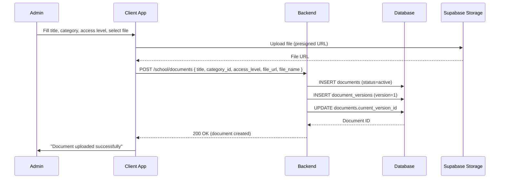
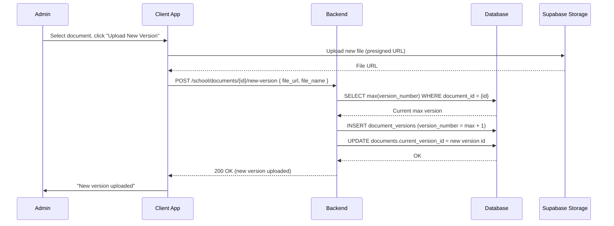
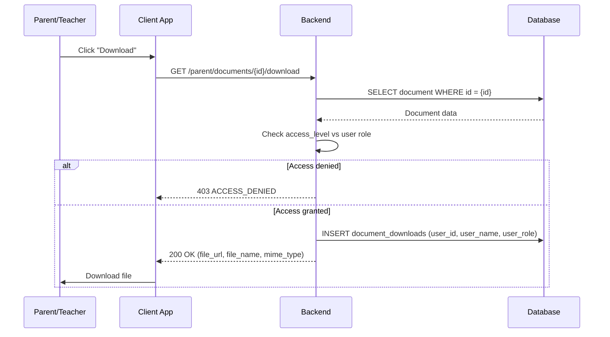
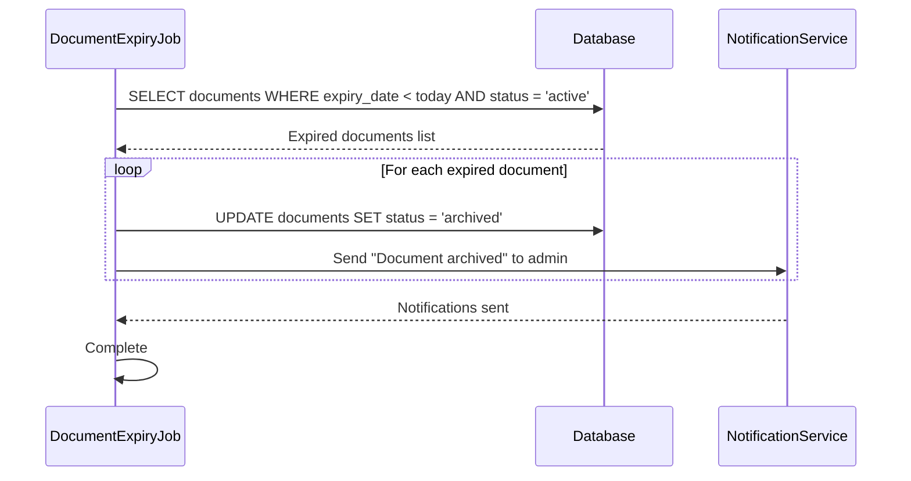
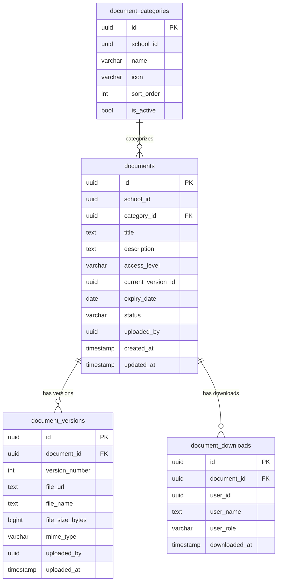

# Documents Management — Technical Specification

> **Document status:** Implementation-ready blueprint
> **Last updated:** 2026-06-27
> **Prerequisites:** None
> **Template:** `_SPEC_TEMPLATE.md` v1 (25 mandatory + 6 optional sections)

---

## 1. Feature Overview

Centralized document management for schools: store, organize, and share documents (circulars, notices, certificates, policies, forms) with role-based access, versioning, and expiry tracking.

### Goals

- Admin uploads documents categorized by type (circular, policy, form, certificate template, notice)
- Documents organized in folders/categories
- Role-based access: some docs public to parents, some admin-only
- Document versioning (replace with new version, keep history)
- Expiry tracking for time-sensitive documents
- Parent/teacher can view documents they have access to
- Download tracking (who downloaded what)

### Non-goals

- [ ] Collaborative document editing
- [ ] OCR / full-text search within documents
- [ ] Document approval workflow
- [ ] External document sharing (outside school)

### Dependencies

- `SchoolMediaTable` — existing media storage (reference)
- Supabase Storage — file storage integration
- `NotificationService` — notifications for new documents

### Related Modules

- `server/.../feature/documents/` — new documents module
- `shared/.../documents/` — shared document DTOs
- `composeApp/.../ui/v2/screens/admin/` — admin UI
- `composeApp/.../ui/v2/screens/parent/` — parent UI
- `composeApp/.../ui/v2/screens/teacher/` — teacher UI

---

## 2. Current System Assessment

### Existing Code

- `SchoolMediaTable` (`Tables.kt:355-370`) — generic media storage with `mediaType`, `url`, `uploadedBy`
- `feature_audit.csv` L141: Document Management missing (0%)
- Supabase Storage integration exists for file uploads
- No document categorization, access control, or versioning

### Existing Database

- `SchoolMediaTable` — generic media storage (no categorization or access control)
- Supabase Storage — file storage backend

### Existing APIs

- Basic file upload via Supabase Storage
- No document management APIs

### Existing UI

- No document management UI

### Existing Services

- Supabase Storage service — file upload/download
- `NotificationService` — multi-channel notifications

### Existing Documentation

- `feature_audit.csv` — document management at 0%
- `IMPLEMENTATION_BACKLOG` — P1-23 entry

### Technical Debt

| # | Gap | Details |
|---|---|---|
| TD-1 | No document categorization | Documents not organized by type |
| TD-2 | No access control | All media accessible to all roles |
| TD-3 | No versioning | No version history for documents |
| TD-4 | No expiry tracking | Time-sensitive documents not managed |
| TD-5 | No download tracking | No audit trail of downloads |

### Gaps

| # | Gap | Impact | Severity |
|---|---|---|---|
| G1 | No categorization | Documents disorganized; hard to find | **High** |
| G2 | No access control | Sensitive documents visible to all | **High** |
| G3 | No versioning | Old versions lost on replacement | **Medium** |
| G4 | No expiry tracking | Expired documents remain active | **Medium** |
| G5 | No download tracking | No audit trail | **Medium** |

---

## 3. Functional Requirements

### FR-001
| Field | Value |
|---|---|
| **Title** | Upload Document |
| **Description** | Admin uploads document with: title, category, description, file, access level |
| **Priority** | Critical |
| **User Roles** | School Admin |
| **Acceptance notes** | Document stored with `category_id`, `access_level`, `current_version_id` |

### FR-002
| Field | Value |
|---|---|
| **Title** | Document Categories |
| **Description** | Categories: circular, policy, form, certificate, notice, other |
| **Priority** | High |
| **User Roles** | School Admin |
| **Acceptance notes** | `document_categories` table with `name`, `icon`, `sort_order` |

### FR-003
| Field | Value |
|---|---|
| **Title** | Access Levels |
| **Description** | Access levels: admin_only \| teacher \| parent \| public |
| **Priority** | Critical |
| **User Roles** | System |
| **Acceptance notes** | `access_level` on documents; enforced in queries |

### FR-004
| Field | Value |
|---|---|
| **Title** | Document Versioning |
| **Description** | Document versioning: upload new version, keep version history |
| **Priority** | High |
| **User Roles** | School Admin |
| **Acceptance notes** | `document_versions` table; `current_version_id` points to latest |

### FR-005
| Field | Value |
|---|---|
| **Title** | Expiry Tracking |
| **Description** | Expiry date for time-sensitive documents (auto-archive after expiry) |
| **Priority** | Medium |
| **User Roles** | System |
| **Acceptance notes** | `expiry_date` on documents; daily job archives expired documents |

### FR-006
| Field | Value |
|---|---|
| **Title** | View Documents |
| **Description** | Parent/teacher views documents based on access level |
| **Priority** | Critical |
| **User Roles** | Parent, Teacher |
| **Acceptance notes** | Queries filtered by `access_level` and `status='active'` |

### FR-007
| Field | Value |
|---|---|
| **Title** | Download Tracking |
| **Description** | Download tracking: log who downloaded and when |
| **Priority** | Medium |
| **User Roles** | System |
| **Acceptance notes** | `document_downloads` table with `user_id`, `user_name`, `user_role`, `downloaded_at` |

### FR-008
| Field | Value |
|---|---|
| **Title** | Search |
| **Description** | Search by title, category, date range |
| **Priority** | Medium |
| **User Roles** | All |
| **Acceptance notes** | Query parameters: `q` (title search), `category`, `from_date`, `to_date` |

---

## 4. User Stories

### School Admin
- [ ] Create document categories (circular, policy, form, etc.)
- [ ] Upload document with title, category, description, file, access level
- [ ] Set expiry date for time-sensitive documents
- [ ] Upload new version of existing document
- [ ] View version history
- [ ] View download log (who downloaded what)
- [ ] Archive/delete documents
- [ ] Search documents by title, category, date range

### Teacher
- [ ] View documents with access level = teacher, parent, or public
- [ ] Download documents
- [ ] Search documents by title, category, date range

### Parent
- [ ] View documents with access level = parent or public
- [ ] Download documents
- [ ] Search documents by title, category, date range

### System
- [ ] Auto-archive documents past expiry date
- [ ] Log all downloads
- [ ] Enforce access levels in queries

---

## 5. Business Rules

### BR-001
**Rule:** Access levels are hierarchical: admin_only > teacher > parent > public.
**Enforcement:** Admin sees all; teacher sees teacher/parent/public; parent sees parent/public.

### BR-002
**Rule:** Document versioning preserves all previous versions.
**Enforcement:** `document_versions` table with `UNIQUE(document_id, version_number)`; `current_version_id` updated on new version.

### BR-003
**Rule:** Expired documents are auto-archived daily.
**Enforcement:** Daily job checks `expiry_date < today` and sets `status='archived'`.

### BR-004
**Rule:** Only admin can upload, edit, or delete documents.
**Enforcement:** Admin-only endpoints for CRUD; parent/teacher have read-only access.

### BR-005
**Rule:** Download tracking logs every download event.
**Enforcement:** INSERT into `document_downloads` on every download request.

---

## 6. Database Design

### 6.1 Entity Relationship Summary

Four new tables: `document_categories` (folder organization), `documents` (document metadata), `document_versions` (version history), `document_downloads` (download audit log).

### 6.2 New Tables

#### `document_categories` table

```sql
CREATE TABLE document_categories (
    id              UUID PRIMARY KEY DEFAULT gen_random_uuid(),
    school_id       UUID NOT NULL,
    name            VARCHAR(48) NOT NULL,
    icon            VARCHAR(32),
    sort_order      INTEGER NOT NULL DEFAULT 0,
    is_active       BOOLEAN NOT NULL DEFAULT true,
    UNIQUE(school_id, name)
);
```

#### `documents` table

```sql
CREATE TABLE documents (
    id              UUID PRIMARY KEY DEFAULT gen_random_uuid(),
    school_id       UUID NOT NULL,
    category_id     UUID REFERENCES document_categories(id),
    title           TEXT NOT NULL,
    description     TEXT,
    access_level    VARCHAR(16) NOT NULL DEFAULT 'admin_only',
    current_version_id UUID,
    expiry_date     DATE,
    status          VARCHAR(16) NOT NULL DEFAULT 'active',
    uploaded_by     UUID,
    created_at      TIMESTAMP NOT NULL DEFAULT now(),
    updated_at      TIMESTAMP NOT NULL DEFAULT now()
);
CREATE INDEX idx_documents_school_access ON documents(school_id, access_level, status);
```

#### `document_versions` table

```sql
CREATE TABLE document_versions (
    id              UUID PRIMARY KEY DEFAULT gen_random_uuid(),
    document_id     UUID NOT NULL REFERENCES documents(id) ON DELETE CASCADE,
    version_number  INTEGER NOT NULL,
    file_url        TEXT NOT NULL,
    file_name       TEXT NOT NULL,
    file_size_bytes BIGINT,
    mime_type       VARCHAR(64),
    uploaded_by     UUID,
    uploaded_at     TIMESTAMP NOT NULL DEFAULT now(),
    UNIQUE(document_id, version_number)
);
```

#### `document_downloads` table

```sql
CREATE TABLE document_downloads (
    id              UUID PRIMARY KEY DEFAULT gen_random_uuid(),
    document_id     UUID NOT NULL REFERENCES documents(id),
    user_id         UUID NOT NULL,
    user_name       TEXT NOT NULL,
    user_role       VARCHAR(32) NOT NULL,
    downloaded_at   TIMESTAMP NOT NULL DEFAULT now()
);
CREATE INDEX idx_doc_downloads_document ON document_downloads(document_id, downloaded_at DESC);
```

### 6.3 Modified Tables

N/A — all tables are new.

### 6.4 Indexes

```sql
CREATE INDEX idx_documents_school_access ON documents(school_id, access_level, status);
CREATE INDEX idx_documents_category ON documents(category_id, status);
CREATE INDEX idx_doc_downloads_document ON document_downloads(document_id, downloaded_at DESC);
CREATE INDEX idx_doc_versions_document ON document_versions(document_id, version_number);
```

### 6.5 Constraints

- `document_categories.school_id` — NOT NULL
- `document_categories.name` — NOT NULL, UNIQUE per school
- `documents.school_id` — NOT NULL
- `documents.title` — NOT NULL
- `documents.access_level` — NOT NULL, one of admin_only/teacher/parent/public
- `documents.status` — NOT NULL, default 'active'
- `document_versions.document_id` — NOT NULL, FK (CASCADE)
- `document_versions.version_number` — NOT NULL, UNIQUE per document
- `document_versions.file_url` — NOT NULL
- `document_downloads.document_id` — NOT NULL, FK
- `document_downloads.user_id` — NOT NULL

### 6.6 Foreign Keys

- `documents.category_id` → `document_categories.id` (nullable)
- `documents.current_version_id` → `document_versions.id` (nullable, set after first version)
- `document_versions.document_id` → `documents.id` (ON DELETE CASCADE)
- `document_downloads.document_id` → `documents.id`

### 6.7 Soft Delete Strategy

- Documents: `status='archived'` (soft archive, not deleted)
- Categories: `is_active=false` (soft deactivate)
- Document versions: hard delete only via CASCADE from document deletion
- Downloads: permanent records (audit trail)

### 6.8 Audit Fields

- `uploaded_by` — who uploaded the document/version
- `created_at` — document creation timestamp
- `updated_at` — last update timestamp
- `uploaded_at` — version upload timestamp
- `downloaded_at` — download timestamp

### 6.9 Migration Notes

Migration: `docs/db/migration_061_documents_management.sql`
- Creates 4 new tables with indexes
- No data backfill needed (new feature)

### 6.10 Exposed Mappings

```kotlin
object DocumentCategoriesTable : UUIDTable("document_categories", "id") {
    val schoolId  = uuid("school_id")
    val name      = varchar("name", 48)
    val icon      = varchar("icon", 32).nullable()
    val sortOrder = integer("sort_order").default(0)
    val isActive  = bool("is_active").default(true)
    init {
        uniqueIndex("idx_doc_categories_unique", schoolId, name)
    }
}

object DocumentsTable : UUIDTable("documents", "id") {
    val schoolId          = uuid("school_id")
    val categoryId        = uuid("category_id").nullable()
    val title             = text("title")
    val description       = text("description").nullable()
    val accessLevel       = varchar("access_level", 16).default("admin_only")
    val currentVersionId  = uuid("current_version_id").nullable()
    val expiryDate        = date("expiry_date").nullable()
    val status            = varchar("status", 16).default("active")
    val uploadedBy        = uuid("uploaded_by").nullable()
    val createdAt         = timestamp("created_at")
    val updatedAt         = timestamp("updated_at")
    init {
        index("idx_documents_school_access", false, schoolId, accessLevel, status)
        index("idx_documents_category", false, categoryId, status)
    }
}

object DocumentVersionsTable : UUIDTable("document_versions", "id") {
    val documentId    = uuid("document_id")
    val versionNumber = integer("version_number")
    val fileUrl       = text("file_url")
    val fileName      = text("file_name")
    val fileSizeBytes = long("file_size_bytes").nullable()
    val mimeType      = varchar("mime_type", 64).nullable()
    val uploadedBy    = uuid("uploaded_by").nullable()
    val uploadedAt    = timestamp("uploaded_at")
    init {
        uniqueIndex("idx_doc_versions_unique", documentId, versionNumber)
        index("idx_doc_versions_document", false, documentId, versionNumber)
    }
}

object DocumentDownloadsTable : UUIDTable("document_downloads", "id") {
    val documentId   = uuid("document_id")
    val userId       = uuid("user_id")
    val userName     = text("user_name")
    val userRole     = varchar("user_role", 32)
    val downloadedAt = timestamp("downloaded_at")
    init {
        index("idx_doc_downloads_document", false, documentId, downloadedAt)
    }
}
```

### 6.11 Seed Data

Default categories seeded per school:
- Circular
- Policy
- Form
- Certificate
- Notice
- Other

---

## 7. State Machines

### Document Status State Machine

```
ACTIVE ──admin_archives──> ARCHIVED
ACTIVE ──expiry_date_passed──> ARCHIVED (by daily job)
ARCHIVED ──admin_restores──> ACTIVE
```

| Current State | Event | Next State | Guard / Condition |
|---|---|---|---|
| `active` | Admin archives | `archived` | Manual action |
| `active` | Expiry date passed | `archived` | Daily job; `expiry_date < today` |
| `archived` | Admin restores | `active` | Manual action |

### Version Lifecycle

```
V1_UPLOADED ──admin_uploads_v2──> V2_CURRENT (V1 preserved)
V2_CURRENT ──admin_uploads_v3──> V3_CURRENT (V1, V2 preserved)
```

| Step | Action | Condition |
|---|---|---|
| 1 | Admin uploads new version | Document exists |
| 2 | Increment version_number | Max(version_number) + 1 |
| 3 | Insert new version row | file_url, file_name, uploaded_by |
| 4 | Update document.current_version_id | Point to new version |

---

## 8. Backend Architecture

### 8.1 Component Overview

`DocumentService` handles document CRUD, versioning, access control, download tracking, and expiry management. `DocumentRouting` exposes admin, parent, and teacher endpoints.

### 8.2 Design Principles

1. **Role-based access** — queries filtered by user role and `access_level`
2. **Versioning preserves history** — all versions kept; `current_version_id` points to latest
3. **Soft archive** — expired/deleted documents archived, not hard-deleted
4. **Download audit trail** — every download logged
5. **Category organization** — documents organized in categories for easy browsing

### 8.3 Core Types

```kotlin
class DocumentService {
    suspend fun uploadDocument(request: UploadDocumentRequest): DocumentDto
    suspend fun updateDocument(id: UUID, request: UpdateDocumentRequest): DocumentDto
    suspend fun archiveDocument(id: UUID)
    suspend fun restoreDocument(id: UUID)
    suspend fun deleteDocument(id: UUID)
    suspend fun uploadVersion(documentId: UUID, request: UploadVersionRequest): DocumentVersionDto
    suspend fun getVersions(documentId: UUID): List<DocumentVersionDto>
    suspend fun getDownloads(documentId: UUID): List<DownloadDto>
    suspend fun listDocuments(filter: DocumentFilter): List<DocumentDto>
    suspend fun downloadDocument(documentId: UUID, userId: UUID, userName: String, userRole: String): String // returns file URL
    suspend fun createCategory(request: CreateCategoryRequest): DocumentCategoryDto
    suspend fun listCategories(): List<DocumentCategoryDto>
    suspend fun archiveExpiredDocuments()
}
```

### 8.4 Repositories

- `DocumentRepository` — document CRUD, search, filtering
- `DocumentCategoryRepository` — category CRUD
- `DocumentVersionRepository` — version CRUD
- `DocumentDownloadRepository` — download log CRUD

### 8.5 Mappers

- `DocumentMapper` — maps DB rows to DTOs; resolves category name
- `DocumentVersionMapper` — maps DB rows to DTOs
- `DocumentCategoryMapper` — maps DB rows to DTOs
- `DownloadMapper` — maps DB rows to DTOs

### 8.6 Permission Checks

- Admin endpoints: JWT with `requireSchoolContext()` — school-scoped
- Parent endpoints: JWT with parent role — filtered to parent/public access levels
- Teacher endpoints: JWT with teacher role — filtered to teacher/parent/public access levels
- Download: access level check before logging download

### 8.7 Background Jobs

- `DocumentExpiryJob` — daily at midnight; archives documents where `expiry_date < today` and `status='active'`

### 8.8 Domain Events

- `DocumentUploaded` — emitted on new document upload
- `DocumentUpdated` — emitted on document metadata update
- `DocumentArchived` — emitted on archive (manual or auto)
- `DocumentRestored` — emitted on restore
- `DocumentVersionUploaded` — emitted on new version
- `DocumentDownloaded` — emitted on download
- `CategoryCreated` — emitted on new category

### 8.9 Caching

- Active categories cached per school (low change frequency)
- Document list not cached (real-time access control needed)

### 8.10 Transactions

- Upload document: INSERT document + INSERT first version + UPDATE current_version_id in transaction
- Upload version: INSERT version + UPDATE current_version_id in transaction
- Download: check access + INSERT download log (single operation)

### 8.11 Rate Limiting

- Standard API rate limiting
- Download: 20 per minute per user (prevent abuse)

### 8.12 Configuration

- `DOCUMENT_MAX_FILE_SIZE_MB` — default `50` (max file size)
- `DOCUMENT_ALLOWED_MIME_TYPES` — default `pdf,doc,docx,xls,xlsx,ppt,pptx,jpg,png,txt`
- `DOCUMENT_EXPIRY_CHECK_TIME` — default `00:00` (midnight)

---

## 9. API Contracts

### 9.1 Admin endpoints

```
GET/POST /api/v1/school/documents
PATCH    /api/v1/school/documents/{id}
DELETE   /api/v1/school/documents/{id}
POST     /api/v1/school/documents/{id}/new-version   { file_url, file_name }
GET      /api/v1/school/documents/{id}/downloads
GET/POST /api/v1/school/document-categories
POST     /api/v1/school/documents/{id}/archive
POST     /api/v1/school/documents/{id}/restore
```

### 9.2 Parent endpoints

```
GET /api/v1/parent/documents?category={name}&q={search}
GET /api/v1/parent/documents/{id}/download
```

### 9.3 Teacher endpoints

```
GET /api/v1/teacher/documents?category={name}&q={search}
GET /api/v1/teacher/documents/{id}/download
```

### 9.4 Example Responses

**List Documents Response 200:**
```json
{
  "success": true,
  "data": [
    {
      "id": "uuid",
      "title": "Annual Day Circular 2026",
      "description": "Circular regarding annual day celebrations",
      "category": "Circular",
      "access_level": "parent",
      "current_version": 2,
      "expiry_date": "2026-12-31",
      "status": "active",
      "uploaded_by": "admin_name",
      "created_at": "2026-06-01T10:00:00Z",
      "updated_at": "2026-06-15T14:00:00Z"
    }
  ]
}
```

**Upload Document Request:**
```json
{
  "title": "Admission Form 2026-27",
  "description": "New admission form for academic year 2026-27",
  "category_id": "uuid",
  "access_level": "parent",
  "file_url": "https://storage.url/admission_form.pdf",
  "file_name": "admission_form.pdf",
  "expiry_date": "2027-03-31"
}
```

**Download Response 200:**
```json
{
  "success": true,
  "data": {
    "file_url": "https://storage.url/admission_form.pdf",
    "file_name": "admission_form.pdf",
    "mime_type": "application/pdf"
  }
}
```

---

## 10. Frontend Architecture

### 10.1 Screens

| Screen | Platform | Role | Description |
|---|---|---|---|
| `AdminDocumentsScreen` | All | Admin | Document management (list, upload, edit, archive) |
| `AdminDocumentUploadScreen` | All | Admin | Upload form (title, category, access, file) |
| `AdminDocumentDetailScreen` | All | Admin | Document detail with versions and downloads |
| `AdminCategoriesScreen` | All | Admin | Category management |
| `ParentDocumentsScreen` | All | Parent | Browse and download documents |
| `TeacherDocumentsScreen` | All | Teacher | Browse and download documents |

### 10.2 Navigation

- Admin portal → Documents → `AdminDocumentsScreen`
- Admin portal → Documents → Upload → `AdminDocumentUploadScreen`
- Admin portal → Documents → {document} → `AdminDocumentDetailScreen`
- Admin portal → Documents → Categories → `AdminCategoriesScreen`
- Parent portal → Documents → `ParentDocumentsScreen`
- Teacher portal → Documents → `TeacherDocumentsScreen`

### 10.3 UX Flows

#### Admin: Upload Document

1. Admin opens Documents → Upload
2. Enters title, description
3. Selects category (dropdown)
4. Sets access level (admin_only, teacher, parent, public)
5. Uploads file (via Supabase Storage)
6. Optionally sets expiry date
7. Saves document
8. Document appears in list

#### Admin: Upload New Version

1. Admin opens document detail
2. Views version history
3. Clicks "Upload New Version"
4. Uploads new file
5. New version created; `current_version_id` updated
6. Previous versions preserved

#### Parent: Browse and Download

1. Parent opens Documents
2. Views documents filtered by access level (parent, public)
3. Filters by category or searches by title
4. Clicks document to view detail
5. Clicks "Download"
6. Download logged; file downloaded

### 10.4 State Management

```kotlin
data class DocumentState(
    val documents: List<DocumentDto>,
    val categories: List<DocumentCategoryDto>,
    val currentDocument: DocumentDto?,
    val versions: List<DocumentVersionDto>,
    val downloads: List<DownloadDto>,
    val filter: DocumentFilter,
    val isLoading: Boolean,
    val error: String?,
)
```

### 10.5 Offline Support

- Document list cached locally
- Downloaded files stored locally for offline access
- Category list cached

### 10.6 Loading States

- Loading documents: "Loading documents..."
- Uploading: "Uploading document..."
- Downloading: "Downloading..."

### 10.7 Error Handling (UI)

- No documents: "No documents found."
- No access: "You don't have access to this document."
- Upload failed: "Upload failed. Please try again."
- File too large: "File exceeds 50 MB limit."

### 10.8 Component Integration Guidelines

| Rule | Description |
|---|---|
| **R1** | Document list with category filter chips |
| **R2** | Search bar for title search |
| **R3** | Access level badge: admin_only=red, teacher=blue, parent=green, public=gray |
| **R4** | Status badge: active=green, archived=gray |
| **R5** | Version history timeline in document detail |
| **R6** | Download log table in admin document detail |
| **R7** | Upload form with file picker |
| **R8** | Category dropdown in upload form |
| **R9** | Expiry date picker in upload form |
| **R10** | Download button with progress indicator |

---

## 11. Shared Module Changes (KMP)

### 11.1 DTOs

```kotlin
data class DocumentDto(
    val id: String,
    val title: String,
    val description: String?,
    val categoryId: String?,
    val categoryName: String?,
    val accessLevel: String,
    val currentVersion: Int,
    val expiryDate: String?,
    val status: String,
    val uploadedBy: String?,
    val createdAt: String,
    val updatedAt: String,
)

data class DocumentVersionDto(
    val id: String,
    val documentId: String,
    val versionNumber: Int,
    val fileUrl: String,
    val fileName: String,
    val fileSizeBytes: Long?,
    val mimeType: String?,
    val uploadedBy: String?,
    val uploadedAt: String,
)

data class DocumentCategoryDto(
    val id: String,
    val name: String,
    val icon: String?,
    val sortOrder: Int,
    val isActive: Boolean,
)

data class DownloadDto(
    val id: String,
    val documentId: String,
    val userId: String,
    val userName: String,
    val userRole: String,
    val downloadedAt: String,
)
```

### 11.2 Domain Models

```kotlin
data class Document(
    val id: UUID,
    val title: String,
    val description: String?,
    val category: DocumentCategory?,
    val accessLevel: AccessLevel,
    val currentVersion: Int,
    val expiryDate: LocalDate?,
    val status: DocumentStatus,
)

enum class AccessLevel {
    ADMIN_ONLY, TEACHER, PARENT, PUBLIC
}

enum class DocumentStatus {
    ACTIVE, ARCHIVED
}

data class DocumentVersion(
    val id: UUID,
    val documentId: UUID,
    val versionNumber: Int,
    val fileUrl: String,
    val fileName: String,
    val fileSizeBytes: Long?,
    val mimeType: String?,
)

data class DocumentCategory(
    val id: UUID,
    val name: String,
    val icon: String?,
    val sortOrder: Int,
)
```

### 11.3 Repository Interfaces

```kotlin
interface DocumentRepository {
    suspend fun listDocuments(filter: DocumentFilterDto): NetworkResult<DocumentListResponse>
    suspend fun uploadDocument(request: UploadDocumentRequest): NetworkResult<DocumentDto>
    suspend fun updateDocument(id: String, request: UpdateDocumentRequest): NetworkResult<DocumentDto>
    suspend fun archiveDocument(id: String): NetworkResult<ApiResponse<Unit>>
    suspend fun restoreDocument(id: String): NetworkResult<ApiResponse<Unit>>
    suspend fun deleteDocument(id: String): NetworkResult<ApiResponse<Unit>>
    suspend fun uploadVersion(documentId: String, request: UploadVersionRequest): NetworkResult<DocumentVersionDto>
    suspend fun getVersions(documentId: String): NetworkResult<List<DocumentVersionDto>>
    suspend fun getDownloads(documentId: String): NetworkResult<List<DownloadDto>>
    suspend fun downloadDocument(documentId: String): NetworkResult<DownloadResponse>
    suspend fun listCategories(): NetworkResult<List<DocumentCategoryDto>>
    suspend fun createCategory(request: CreateCategoryRequest): NetworkResult<DocumentCategoryDto>
}
```

### 11.4 UseCases

- `UploadDocumentUseCase`
- `UpdateDocumentUseCase`
- `ArchiveDocumentUseCase`
- `RestoreDocumentUseCase`
- `DeleteDocumentUseCase`
- `UploadVersionUseCase`
- `GetVersionsUseCase`
- `GetDownloadsUseCase`
- `ListDocumentsUseCase`
- `DownloadDocumentUseCase`
- `ListCategoriesUseCase`
- `CreateCategoryUseCase`

### 11.5 Validation

- Title: not empty, max 200 characters
- Category: must exist and be active
- Access level: one of admin_only/teacher/parent/public
- File URL: valid URL
- File name: not empty
- File size: max 50 MB
- MIME type: in allowed list
- Expiry date: must be in future (if set)

### 11.6 Serialization

Standard Kotlinx serialization.

### 11.7 Network APIs

Ktor `@Resource` route definitions:
- `SchoolDocumentApi` — admin endpoints (CRUD, versions, downloads, categories)
- `ParentDocumentApi` — parent endpoints (list, download)
- `TeacherDocumentApi` — teacher endpoints (list, download)

### 11.8 Database Models (Local Cache)

- Document list cached locally per school
- Category list cached locally
- Downloaded files stored in local file system

---

## 12. Permissions Matrix

| Action | Super Admin | School Admin | Teacher | Parent |
|---|---|---|---|---|
| Upload/edit/delete documents | ✅ | ✅ | ❌ | ❌ |
| Manage categories | ✅ | ✅ | ❌ | ❌ |
| Archive/restore documents | ✅ | ✅ | ❌ | ❌ |
| Upload new version | ✅ | ✅ | ❌ | ❌ |
| View version history | ✅ | ✅ | ✅ | ❌ |
| View download log | ✅ | ✅ | ❌ | ❌ |
| View admin_only documents | ✅ | ✅ | ❌ | ❌ |
| View teacher documents | ✅ | ✅ | ✅ | ❌ |
| View parent documents | ✅ | ✅ | ✅ | ✅ |
| View public documents | ✅ | ✅ | ✅ | ✅ |
| Download documents | ✅ | ✅ | ✅ (access-level) | ✅ (access-level) |
| Search documents | ✅ | ✅ | ✅ (access-level) | ✅ (access-level) |

---

## 13. Notifications

### Document Notifications

| Type | Trigger | Channel | Message |
|---|---|---|---|
| New Document (Parent) | Admin uploads document with access=parent/public | Push + In-app (parent) | "New document available: {title}" |
| New Document (Teacher) | Admin uploads document with access=teacher/parent/public | In-app (teacher) | "New document available: {title}" |
| New Version (Parent) | Admin uploads new version of parent-accessible document | In-app (parent) | "Document '{title}' has been updated to v{version}" |
| New Version (Teacher) | Admin uploads new version of teacher-accessible document | In-app (teacher) | "Document '{title}' has been updated to v{version}" |
| Document Archived (Admin) | Document auto-archived by expiry job | In-app (admin) | "Document '{title}' has been archived (expired)" |

---

## 14. Background Jobs

### Document Expiry Job

| Field | Value |
|---|---|
| **Name** | `DocumentExpiryJob` |
| **Trigger** | Daily at midnight |
| **Frequency** | Daily |
| **Description** | Archives documents where `expiry_date < today` and `status='active'` |
| **Timeout** | 60 seconds |
| **Retry** | None |
| **On failure** | Logged; retried next day |

---

## 15. Integrations

### Supabase Storage
| Field | Value |
|---|---|
| **System** | Existing file storage |
| **Purpose** | Store document files (PDFs, images, docs) |
| **API / SDK** | Supabase Storage API |
| **Auth method** | Supabase service key |
| **Fallback** | None — file storage required |

### SchoolMediaTable
| Field | Value |
|---|---|
| **System** | Existing media storage |
| **Purpose** | Reference for existing media patterns |
| **API / SDK** | Direct DB via Exposed |
| **Auth method** | Internal |
| **Fallback** | N/A — pattern reference |

### NotificationService
| Field | Value |
|---|---|
| **System** | Existing notification infrastructure |
| **Purpose** | Send new document/version notifications |
| **API / SDK** | Internal `NotificationService` |
| **Auth method** | Internal service call |
| **Fallback** | In-app notification if push fails |

---

## 16. Security

### Authentication
- Admin endpoints: JWT with `requireSchoolContext()`
- Parent endpoints: JWT with parent role
- Teacher endpoints: JWT with teacher role

### Authorization
- Document CRUD: school admin only
- Category management: school admin only
- Document viewing: filtered by access_level and user role
- Download: access level check before serving file

### Encryption
- All API communication over TLS
- Files encrypted at rest (Supabase Storage server-side encryption)

### Audit Logs
- Document upload logged (title, category, accessLevel, uploadedBy)
- Document update logged (documentId, fieldsChanged, updatedBy)
- Document archive/restore logged (documentId, action, adminId)
- Version upload logged (documentId, versionNumber, uploadedBy)
- Download logged (documentId, userId, userName, userRole, downloadedAt)
- Category creation logged (name, adminId)

### PII Handling
- Documents may contain sensitive information (policies, certificates)
- Access control ensures only authorized roles can view
- Download log records who accessed what and when

### Data Isolation
- All queries filtered by `school_id` (multi-tenant)
- Parent/teacher queries filtered by access_level

### Rate Limiting
- Standard API rate limiting
- Download: 20 per minute per user

### Input Validation
- Title: not empty, max 200 characters
- Description: max 2,000 characters
- File size: max 50 MB
- MIME type: in allowed list (pdf, doc, docx, xls, xlsx, ppt, pptx, jpg, png, txt)
- Expiry date: must be in future (if set)

---

## 17. Performance & Scalability

### Expected Scale

| Metric | Small school | Medium school | Large school |
|---|---|---|---|
| Documents | ~100 | ~500 | ~2,000 |
| Categories | ~6 | ~10 | ~15 |
| Versions per document | ~2 | ~3 | ~5 |
| Downloads per month | ~200 | ~1,000 | ~5,000 |
| Concurrent users browsing | ~10 | ~50 | ~200 |

### Latency Targets

| Operation | Target |
|---|---|
| List documents (filtered) | < 100ms |
| Upload document | < 500ms (file upload async) |
| Upload new version | < 200ms |
| Download document | < 100ms (URL generation) |
| Search documents | < 100ms |
| List categories | < 50ms |

### Optimization Strategy

- Documents indexed by (school_id, access_level, status) for fast filtering
- Categories cached per school
- File upload via presigned URLs (client uploads directly to Supabase Storage)
- Download tracking async (non-blocking)

---

## 18. Edge Cases

| # | Scenario | Expected Behavior |
|---|---|---|
| EC-001 | Parent tries to access admin_only document | 403 Forbidden |
| EC-002 | Teacher tries to access admin_only document | 403 Forbidden |
| EC-003 | Download archived document | 404 Not Found (or "Document archived") |
| EC-004 | Upload file exceeding 50 MB | 400 FILE_TOO_LARGE |
| EC-005 | Upload file with unsupported MIME type | 400 INVALID_FILE_TYPE |
| EC-006 | Category deleted with documents attached | Documents keep category_id (nullable) |
| EC-007 | Document with no versions | Should not happen (upload creates v1); guard with check |
| EC-008 | Expiry job fails | Documents remain active; retried next day |

### Risks & Mitigations

| Risk | Likelihood | Impact | Mitigation |
|---|---|---|---|
| Large file uploads | Medium | Medium | 50 MB limit; presigned URL upload |
| Download abuse | Low | Low | Rate limiting (20/min) |
| Storage cost | Medium | Low | Archive old documents; cleanup policy |
| Access control bypass | Low | High | Server-side access level enforcement |

---

## 19. Error Handling

### Standard Error Codes

| HTTP | Error Code | Description | When |
|---|---|---|---|
| 400 | `FILE_TOO_LARGE` | File exceeds 50 MB | Upload |
| 400 | `INVALID_FILE_TYPE` | MIME type not allowed | Upload |
| 400 | `INVALID_ACCESS_LEVEL` | Access level not valid | Upload/update |
| 400 | `CATEGORY_NOT_FOUND` | Category ID doesn't exist | Upload/update |
| 400 | `EXPIRY_IN_PAST` | Expiry date is in the past | Upload/update |
| 403 | `ACCESS_DENIED` | User role cannot access document | View/download |
| 403 | `INSUFFICIENT_PERMISSIONS` | Non-admin trying admin action | Admin endpoints |
| 404 | `DOCUMENT_NOT_FOUND` | Document not found | Any |
| 404 | `DOCUMENT_ARCHIVED` | Document has been archived | View/download |
| 404 | `VERSION_NOT_FOUND` | Version not found | Version detail |

### Error Response Format

Same as existing API error format.

### Recovery Strategy

| Error | Client Action | Server Action |
|---|---|---|
| `FILE_TOO_LARGE` | Show "File exceeds 50 MB limit." | Return 400 |
| `ACCESS_DENIED` | Show "You don't have access to this document." | Return 403 |
| `DOCUMENT_ARCHIVED` | Show "This document has been archived." | Return 404 |

---

## 20. Analytics & Reporting

### Reports

- **Document Upload Report:** Documents uploaded per month/category
- **Download Report:** Most downloaded documents
- **Access Report:** Document access by role
- **Expiry Report:** Documents expiring soon
- **Category Distribution:** Documents per category

### KPIs

- **Total Documents:** Active document count
- **Upload Rate:** Documents uploaded per month
- **Download Rate:** Downloads per month
- **Avg Versions:** Average versions per document
- **Expiry Rate:** Documents archived per month

### Dashboards

- Admin: document overview with counts per category and access level
- Admin: download activity feed

### Exports

- Document list CSV export
- Download log CSV export
- Category summary CSV export

---

## 21. Testing Strategy

### Unit Tests

| Test | What it verifies |
|---|---|
| Upload document | Document + first version stored; current_version_id set |
| Update document | Fields updated correctly |
| Archive document | Status = archived |
| Restore document | Status = active |
| Upload new version | New version created; current_version_id updated; old versions preserved |
| List documents (admin) | All documents returned |
| List documents (parent) | Only parent/public documents returned |
| List documents (teacher) | Only teacher/parent/public documents returned |
| Download document | Download logged; file URL returned |
| Download admin_only (parent) | 403 ACCESS_DENIED |
| Search by title | Filtered results |
| Filter by category | Filtered results |
| Expiry job | Expired documents archived |

### Integration Tests

| Test | What it verifies |
|---|---|
| Upload → list → download → version → archive → restore | Full lifecycle |
| Upload parent doc → parent downloads → download logged | Access control + tracking |
| Upload teacher doc → parent tries download → 403 | Access enforcement |
| Expiry job → document archived → admin notified | Expiry flow |

### Performance Tests

- [ ] List 2,000 documents < 100ms
- [ ] Upload document < 500ms
- [ ] Download (URL generation) < 100ms
- [ ] Search across 2,000 documents < 100ms

### Security Tests

- [ ] Parent cannot access admin_only documents
- [ ] Teacher cannot access admin_only documents
- [ ] Parent cannot upload/edit documents
- [ ] All queries school-scoped
- [ ] Download rate limit enforced

### Migration Tests

- [ ] Migration creates 4 tables with correct schema
- [ ] Indexes created correctly
- [ ] Default categories seeded

---

## 22. Acceptance Criteria

- [ ] Admin uploads documents with category and access level
- [ ] Document versioning preserves history
- [ ] Access levels enforced (parent can't see admin_only docs)
- [ ] Expiry auto-archives documents
- [ ] Download tracking logs user, role, timestamp
- [ ] Search by title, category, date range
- [ ] Parent/teacher can view and download accessible documents

---

## 23. Implementation Roadmap

| Phase | Duration | Tasks | Breaking? | Deliverable |
|---|---|---|---|---|
| 1 | 1 day | DB migration, Exposed tables | No | Schema ready |
| 2 | 2 days | DocumentService (CRUD, versioning, access control) | No | Service ready |
| 3 | 1 day | Download tracking + expiry job | No | Tracking + expiry ready |
| 4 | 1 day | API endpoints | No | APIs available |
| 5 | 2 days | Client UI (document list, upload, version history, parent/teacher view) | No | UI ready |
| 6 | 1 day | Tests | No | Test coverage |

**Total: ~8 days**

---

## 24. File-Level Impact Analysis

### New Files

| File | Location | Purpose |
|---|---|---|
| `DocumentService.kt` | `server/.../feature/documents/` | Core service |
| `DocumentRouting.kt` | `server/.../feature/documents/` | API endpoints |
| `migration_061_documents_management.sql` | `docs/db/` | DDL migration |
| `DocumentApi.kt` | `shared/.../documents/` | Client API |
| `DocumentDtos.kt` | `shared/.../documents/` | DTOs |
| `DocumentRepository.kt` | `shared/.../documents/` | Repository interface |
| `DocumentRepositoryImpl.kt` | `shared/.../documents/` | Repository impl |
| `AdminDocumentsScreen.kt` | `composeApp/.../ui/v2/screens/admin/` | Admin document management |
| `AdminDocumentUploadScreen.kt` | `composeApp/.../ui/v2/screens/admin/` | Upload form |
| `AdminDocumentDetailScreen.kt` | `composeApp/.../ui/v2/screens/admin/` | Document detail |
| `AdminCategoriesScreen.kt` | `composeApp/.../ui/v2/screens/admin/` | Category management |
| `ParentDocumentsScreen.kt` | `composeApp/.../ui/v2/screens/parent/` | Parent document view |
| `TeacherDocumentsScreen.kt` | `composeApp/.../ui/v2/screens/teacher/` | Teacher document view |
| `DocumentViewModel.kt` | `composeApp/.../ui/v2/viewmodel/` | MVI state |

### Modified Files

| File | Change Type | Lines Changed (est.) | Risk | Description |
|---|---|---|---|---|
| `server/.../db/Tables.kt` | Add | ~60 | Low | 4 new table objects |
| `server/.../db/DatabaseFactory.kt` | Modify | ~4 | Low | Register 4 tables |

### Files Preserved Unchanged

| File | Reason |
|---|---|
| `SchoolMediaTable` | Reference only; new tables are separate |
| `NotificationService` | Used as-is for notifications |
| Supabase Storage service | Used as-is for file storage |

---

## 25. Future Enhancements

### OCR / Full-Text Search

- OCR for scanned documents
- Full-text search within document content
- Search highlighting
- Document content indexing

### Document Approval Workflow

- Multi-step approval before document is published
- Draft → Review → Approved → Published
- Approvers configured per category
- Approval history and comments

### Document Templates

- Pre-defined document templates
- Template variables (school name, date, etc.)
- Generate document from template
- Template library management

### Collaborative Editing

- Real-time collaborative document editing
- Comments and annotations
- Version comparison (diff view)
- Change tracking

### External Sharing

- Share documents with external stakeholders
- Time-limited share links
- Password-protected shares
- Share access tracking

### Document Analytics

- View time per document
- Read receipts
- Engagement metrics
- Category-wise analytics

### Bulk Operations

- Bulk upload documents
- Bulk archive/restore
- Bulk category reassignment
- Bulk access level change

### Document Watermarking

- Auto-watermark with user name and timestamp
- Prevent unauthorized distribution
- Dynamic watermark on download
- Watermark customization

### Document Retention Policy

- Auto-delete documents after retention period
- Configurable retention per category
- Legal hold support
- Retention compliance reports

### Integration with External Drives

- Google Drive integration
- Dropbox integration
- OneDrive integration
- Sync documents with external storage

---

## A. Sequence Diagrams

### Upload Document Flow



### Upload New Version Flow



### Download Document Flow



### Expiry Job Flow



---

## B. Domain Model / ER Diagram



---

## C. Event Flow

```
DocumentUploaded -> NotifyRelevantUsers -> Complete
DocumentUpdated -> Complete
DocumentVersionUploaded -> NotifyRelevantUsers -> Complete
DocumentArchived -> NotifyAdmin -> Complete
DocumentRestored -> Complete
DocumentDownloaded -> Complete
CategoryCreated -> Complete
```

| Event | Emitted By | Consumed By | Side Effect |
|---|---|---|---|
| `DocumentUploaded` | DocumentService.uploadDocument() | Notification | New document notification to relevant users |
| `DocumentUpdated` | DocumentService.updateDocument() | Analytics | Counter incremented |
| `DocumentArchived` | DocumentService.archiveDocument() / ExpiryJob | Notification | Admin notified |
| `DocumentRestored` | DocumentService.restoreDocument() | Analytics | Counter incremented |
| `DocumentVersionUploaded` | DocumentService.uploadVersion() | Notification | Version update notification |
| `DocumentDownloaded` | DocumentService.downloadDocument() | Analytics | Download counter incremented |
| `CategoryCreated` | DocumentService.createCategory() | Analytics | Counter incremented |

---

## D. Configuration

### Environment Variables

| Variable | Description |
|---|---|
| `DOCUMENT_MAX_FILE_SIZE_MB` | Max file size in MB (default: `50`) |
| `DOCUMENT_ALLOWED_MIME_TYPES` | Comma-separated allowed MIME types |
| `DOCUMENT_EXPIRY_CHECK_TIME` | Time for daily expiry check (default: `00:00`) |
| `DOCUMENT_DOWNLOAD_RATE_LIMIT` | Downloads per minute per user (default: `20`) |

### Feature Flags

| Flag | Default | Description |
|---|---|---|
| `documents_management_enabled` | `true` | Master switch for documents |
| `document_versioning` | `true` | Enable version history |
| `document_expiry_tracking` | `true` | Enable expiry auto-archive |
| `document_download_tracking` | `true` | Enable download logging |
| `document_notifications` | `true` | Enable new document notifications |

### Client-Side Configuration

| Config | Default | Description |
|---|---|---|
| Document list page size | 50 | Documents per page |
| Category list page size | 20 | Categories per page |
| Max file size | 50 MB | Max upload size |
| Allowed file types | pdf,doc,docx,xls,xlsx,ppt,pptx,jpg,png,txt | Allowed extensions |

### Server-Side Configuration

| Config | Default | Description |
|---|---|---|
| Max file size | 50 MB | Max upload size |
| Download rate limit | 20/min | Downloads per user per minute |
| Expiry check time | 00:00 | Daily expiry job time |
| Allowed MIME types | pdf,doc,docx,... | Allowed file types |

### Infrastructure Requirements

- PostgreSQL with standard indexing
- Supabase Storage for file storage
- Standard notification infrastructure
- Daily job scheduler (for expiry job)

---

## E. Migration & Rollback

### Deployment Plan

1. [ ] Run `migration_061_documents_management.sql` — creates 4 tables + indexes
2. [ ] Deploy 4 table objects in `Tables.kt`
3. [ ] Register tables in `DatabaseFactory.kt`
4. [ ] Deploy `DocumentService` and `DocumentRouting`
5. [ ] Configure expiry job
6. [ ] Deploy shared KMP layer (DTOs, repository, API)
7. [ ] Deploy client UI (admin, parent, teacher screens)
8. [ ] Seed default categories
9. [ ] Deploy to production

### Rollback Plan

1. [ ] Disable feature flag `documents_management_enabled` → APIs return 404
2. [ ] Remove client UI → document screens not shown
3. [ ] Database: `DROP TABLE IF EXISTS document_downloads; DROP TABLE IF EXISTS document_versions; DROP TABLE IF EXISTS documents; DROP TABLE IF EXISTS document_categories;`
4. [ ] No data loss — new feature, no existing data affected

### Data Backfill

N/A — new feature. Default categories seeded on first use per school.

### Migration SQL

```sql
-- migration_061_documents_management.sql
CREATE TABLE IF NOT EXISTS document_categories (
    id              UUID PRIMARY KEY DEFAULT gen_random_uuid(),
    school_id       UUID NOT NULL,
    name            VARCHAR(48) NOT NULL,
    icon            VARCHAR(32),
    sort_order      INTEGER NOT NULL DEFAULT 0,
    is_active       BOOLEAN NOT NULL DEFAULT true,
    UNIQUE(school_id, name)
);

CREATE TABLE IF NOT EXISTS documents (
    id              UUID PRIMARY KEY DEFAULT gen_random_uuid(),
    school_id       UUID NOT NULL,
    category_id     UUID REFERENCES document_categories(id),
    title           TEXT NOT NULL,
    description     TEXT,
    access_level    VARCHAR(16) NOT NULL DEFAULT 'admin_only',
    current_version_id UUID,
    expiry_date     DATE,
    status          VARCHAR(16) NOT NULL DEFAULT 'active',
    uploaded_by     UUID,
    created_at      TIMESTAMP NOT NULL DEFAULT now(),
    updated_at      TIMESTAMP NOT NULL DEFAULT now()
);

CREATE INDEX IF NOT EXISTS idx_documents_school_access ON documents(school_id, access_level, status);
CREATE INDEX IF NOT EXISTS idx_documents_category ON documents(category_id, status);

CREATE TABLE IF NOT EXISTS document_versions (
    id              UUID PRIMARY KEY DEFAULT gen_random_uuid(),
    document_id     UUID NOT NULL REFERENCES documents(id) ON DELETE CASCADE,
    version_number  INTEGER NOT NULL,
    file_url        TEXT NOT NULL,
    file_name       TEXT NOT NULL,
    file_size_bytes BIGINT,
    mime_type       VARCHAR(64),
    uploaded_by     UUID,
    uploaded_at     TIMESTAMP NOT NULL DEFAULT now(),
    UNIQUE(document_id, version_number)
);

CREATE INDEX IF NOT EXISTS idx_doc_versions_document ON document_versions(document_id, version_number);

CREATE TABLE IF NOT EXISTS document_downloads (
    id              UUID PRIMARY KEY DEFAULT gen_random_uuid(),
    document_id     UUID NOT NULL REFERENCES documents(id),
    user_id         UUID NOT NULL,
    user_name       TEXT NOT NULL,
    user_role       VARCHAR(32) NOT NULL,
    downloaded_at   TIMESTAMP NOT NULL DEFAULT now()
);

CREATE INDEX IF NOT EXISTS idx_doc_downloads_document ON document_downloads(document_id, downloaded_at DESC);

-- ROLLBACK:
-- DROP TABLE IF EXISTS document_downloads;
-- DROP TABLE IF EXISTS document_versions;
-- DROP TABLE IF EXISTS documents;
-- DROP TABLE IF EXISTS document_categories;
```

---

## F. Observability

### Logging

- Document uploaded: INFO `document_uploaded` (documentId, title, category, accessLevel, uploadedBy)
- Document updated: INFO `document_updated` (documentId, fieldsChanged, updatedBy)
- Document archived: INFO `document_archived` (documentId, reason: manual/expiry, adminId)
- Document restored: INFO `document_restored` (documentId, adminId)
- Version uploaded: INFO `document_version_uploaded` (documentId, versionNumber, uploadedBy)
- Document downloaded: INFO `document_downloaded` (documentId, userId, userName, userRole)
- Category created: INFO `document_category_created` (name, adminId)
- Expiry job: INFO `document_expiry_job` (archivedCount, duration)
- Access denied: WARN `document_access_denied` (documentId, userId, userRole)

### Metrics

| Metric | Type | Description |
|---|---|---|
| `documents.total` | Gauge | Total active documents |
| `documents.uploaded` | Counter | Total documents uploaded |
| `documents.archived` | Counter | Total documents archived |
| `documents.downloads` | Counter | Total downloads |
| `documents.versions_per_doc` | Histogram | Average versions per document |
| `documents.expiry_job_duration_ms` | Histogram | Expiry job execution time |
| `documents.search_query_time_ms` | Histogram | Search query latency |

### Health Checks

- `GET /api/v1/health` — existing health check

### Alerts

- Expiry job failure → Warning (documents not being archived)
- Download rate > 1000/hour → Info (unusual download activity)
- Storage usage > 80% → Warning (storage running low)
- Upload failure rate > 10% → Warning (Supabase Storage issues)
