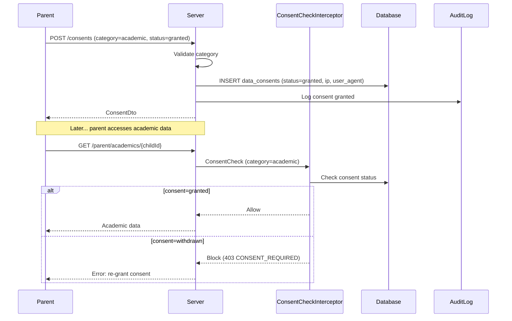
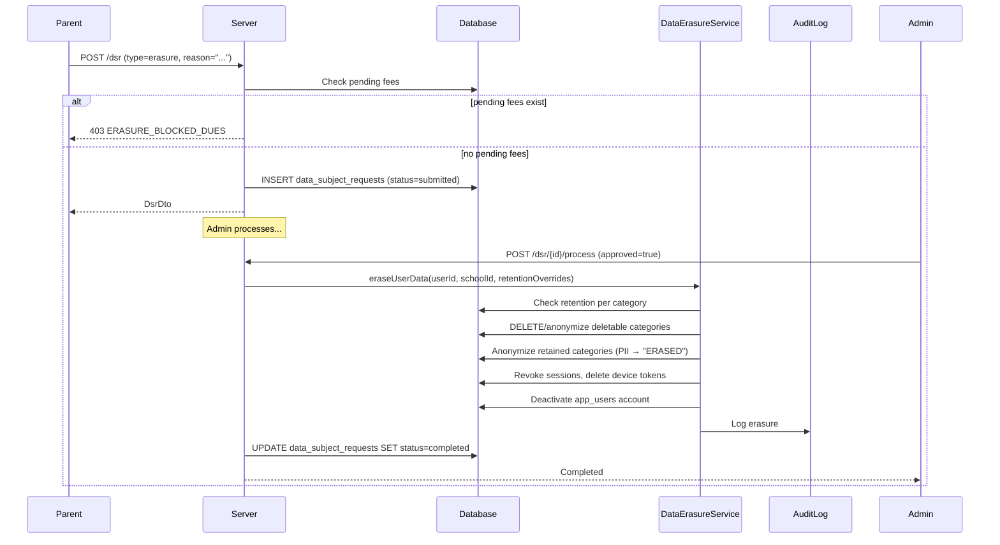

# DPDP Act Compliance — Technical Specification

> **Document status:** Implementation-ready blueprint
> **Last updated:** 2026-06-28
> **Prerequisites:** `AUDIT_LOG_SPEC.md`
> **Unblocks:** Data export/erasure workflows across all features
> **Related specs:** `AUDIT_LOG_SPEC.md`, `NOTIFICATION_SYSTEM_SPEC.md`
> **Template:** `_SPEC_TEMPLATE.md` v1 (25 mandatory + 6 optional sections)

---

## 1. Feature Overview

### Purpose

Implementation of India's Digital Personal Data Protection (DPDP) Act 2023 compliance features: consent management, data subject rights (access, correction, erasure), data breach notification, privacy policy tracking, and data processing records.

### Business Value

- Legal compliance with DPDP Act 2023 — mandatory for all entities processing personal data in India
- Builds trust with parents by giving them control over their data
- Reduces legal risk of non-compliance penalties (up to ₹250 crore)
- Enables transparent data practices for school accreditation
- Data breach response workflow minimizes regulatory and reputational damage

### Goals

- [ ] Record and manage consent for data processing per parent/student
- [ ] Enable data subject access requests (DSAR) — export all personal data
- [ ] Enable data correction requests
- [ ] Enable data erasure requests (right to be forgotten)
- [ ] Maintain data processing records for regulatory audit
- [ ] Data breach notification workflow (72-hour DPA notification)
- [ ] Privacy policy versioning and acceptance tracking

### Non-goals

- [ ] GDPR compliance (EU) — focused on DPDP (India) only
- [ ] Automated data classification — manual categorization
- [ ] Cross-border data transfer controls — future extensibility
- [ ] Data Protection Impact Assessment (DPIA) — future extensibility

### Dependencies

- `AuditLogsTable` (from `AUDIT_LOG_SPEC.md`) — action logging for DPDP audit
- `ParentChildLinksTable` (existing) — parent→child link tracking
- `AppUsersTable` (existing) — user identity
- `NotificationPreferencesTable` (existing) — per-category opt-out
- Supabase Storage (for DSAR export files)

### Related Modules

- `ParentChildLinksTable` — tracks parent→child link approval (consent-like, but not DPDP consent)
- `AppUsersTable` — has `isPhoneVerified`, `isEmailVerified` (verification, not consent)
- `NotificationPreferencesTable` — per-category opt-out (partial consent management)
- `AuditLogsTable` (from `AUDIT_LOG_SPEC.md`) — action logging (reusable for DPDP audit)

---

## 2. Current System Assessment

### Existing Code

- **`ParentChildLinksTable`** — tracks parent→child link approval (consent-like, but not DPDP consent)
- **`AppUsersTable`** — has `isPhoneVerified`, `isEmailVerified` (verification, not consent)
- **`NotificationPreferencesTable`** — per-category opt-out (partial consent management)
- **`AuditLogsTable`** (from `AUDIT_LOG_SPEC.md`) — action logging (reusable for DPDP audit)
- No consent table, no DSAR workflow, no data processing records
- No privacy policy tracking

### Existing Database

- `parent_child_links` — parent→child link approval
- `app_users` — user identity (name, phone, email)
- `notification_preferences` — per-category opt-out
- `audit_logs` — action logging (from AUDIT_LOG_SPEC)

### Existing APIs

- No consent, DSAR, or privacy policy endpoints exist

### Existing UI

- No consent management, DSAR, or privacy policy UI screens exist

### Existing Services

- No consent, DSAR, data export, or data erasure services

### Existing Documentation

- `AUDIT_LOG_SPEC.md` — audit log spec (prerequisite)

### Data Categories in Vidya Prayag

| Category | Tables | DPDP Sensitivity |
|---|---|---|
| Identity | `app_users` (name, phone, email) | Personal |
| Student records | `students`, `children`, `enrollments` | Personal + Sensitive (child data) |
| Academic | `attendance_records`, `assessments`, `assessment_marks`, `homework` | Sensitive |
| Financial | `fee_records`, `payments` (with fee payment spec) | Sensitive |
| Communication | `messages`, `message_threads`, `whatsapp_messages` | Personal |
| Health | `health_records` (future) | Sensitive (special category) |
| Device | `device_tokens`, `user_sessions` | Personal |

### Technical Debt

- No consent management — non-compliant data processing
- No DSAR (data export) — cannot fulfill data access requests
- No erasure workflow — cannot fulfill right to erasure
- No data processing records — cannot demonstrate compliance
- No privacy policy versioning — cannot prove consent was informed
- No breach notification — non-compliance with 72h notification rule
- No data retention policies — indefinite retention non-compliant

### Gaps

| # | Gap | DPDP Section | Impact |
|---|---|---|---|
| G1 | No consent management | §4-§6 | Non-compliant processing |
| G2 | No DSAR (data export) | §11 | Cannot fulfill data access requests |
| G3 | No erasure workflow | §11(b) | Cannot fulfill right to erasure |
| G4 | No data processing records | §8(5) | Cannot demonstrate compliance |
| G5 | No privacy policy versioning | §5 | Cannot prove consent was informed |
| G6 | No breach notification | §8(6) | Non-compliance with 72h notification rule |
| G7 | No data retention policies | §8(5) | Indefinite retention non-compliant |

---

## 3. Functional Requirements

### FR-001
| Field | Value |
|---|---|
| **Title** | Consent Management |
| **Description** | Record consent per data category per user (explicit, timestamped, withdrawable) |
| **Priority** | Critical |
| **User Roles** | Parent |
| **Acceptance notes** | Consent recorded with timestamp, IP, user agent; can be withdrawn |

### FR-002
| Field | Value |
|---|---|
| **Title** | Privacy Policy Versioning |
| **Description** | Privacy policy versioning — each consent linked to policy version |
| **Priority** | High |
| **User Roles** | Super Admin (DPO) |
| **Acceptance notes** | Policy versions tracked; consent linked to active version at time of grant |

### FR-003
| Field | Value |
|---|---|
| **Title** | Consent Dashboard |
| **Description** | Parent can view all data categories and consent status |
| **Priority** | High |
| **User Roles** | Parent |
| **Acceptance notes** | All categories displayed with current consent status |

### FR-004
| Field | Value |
|---|---|
| **Title** | Consent Withdrawal |
| **Description** | Parent can withdraw consent per category (triggers data processing stop) |
| **Priority** | Critical |
| **User Roles** | Parent |
| **Acceptance notes** | Withdrawal blocks access to corresponding data category |

### FR-005
| Field | Value |
|---|---|
| **Title** | Data Subject Access Request (DSAR) |
| **Description** | DSAR: export all personal data as structured JSON/CSV |
| **Priority** | Critical |
| **User Roles** | Parent, School Admin, Super Admin |
| **Acceptance notes** | Export includes all personal data across all tables; available as download |

### FR-006
| Field | Value |
|---|---|
| **Title** | Data Correction Request |
| **Description** | Data correction request: parent submits correction, admin approves |
| **Priority** | High |
| **User Roles** | Parent, School Admin |
| **Acceptance notes** | Correction request submitted; admin reviews and approves/rejects |

### FR-007
| Field | Value |
|---|---|
| **Title** | Data Erasure Request |
| **Description** | Data erasure request: parent requests deletion, admin processes with retention checks |
| **Priority** | Critical |
| **User Roles** | Parent, School Admin, Super Admin |
| **Acceptance notes** | Erasure anonymizes PII while respecting legal retention; admin approval required |

### FR-008
| Field | Value |
|---|---|
| **Title** | Data Processing Records |
| **Description** | Data processing records: log purpose, legal basis, data categories, recipients |
| **Priority** | High |
| **User Roles** | Super Admin (DPO) |
| **Acceptance notes** | Records maintained for all data processing activities; available for audit |

### FR-009
| Field | Value |
|---|---|
| **Title** | Data Breach Notification |
| **Description** | Data breach notification workflow: detect, log, notify DPA within 72 hours |
| **Priority** | Critical |
| **User Roles** | Super Admin (DPO) |
| **Acceptance notes** | Breach incident created; 72h timer starts; DPA notification sent; subjects notified |

### FR-010
| Field | Value |
|---|---|
| **Title** | Data Retention Policies |
| **Description** | Data retention policies per category with automatic purge |
| **Priority** | High |
| **User Roles** | System, Super Admin |
| **Acceptance notes** | Monthly purge job deletes data past retention period per category |

### FR-011
| Field | Value |
|---|---|
| **Title** | Consent Re-confirmation |
| **Description** | Consent re-confirmation when policy changes |
| **Priority** | High |
| **User Roles** | Parent, Super Admin |
| **Acceptance notes** | Policy change flags all users for re-confirmation; access blocked until re-confirmed |

---

## 4. User Stories

### Parent
- [ ] View my consent status for each data category so I know what I've agreed to
- [ ] Grant consent for a data category so the school can process my data
- [ ] Withdraw consent for a data category so the school stops processing that data
- [ ] Submit a data access request to get a copy of all my personal data
- [ ] Submit a correction request if my data is incorrect
- [ ] Submit an erasure request to have my data deleted
- [ ] View the current privacy policy so I understand how my data is used
- [ ] Re-confirm consent when the privacy policy changes

### School Admin
- [ ] View and process DSAR requests from parents
- [ ] Approve or reject correction requests
- [ ] Approve or reject erasure requests (with retention checks)
- [ ] View data processing records for my school

### Super Admin (DPO)
- [ ] Manage privacy policy versions
- [ ] Create and manage data processing records
- [ ] Create and manage data breach incidents
- [ ] Notify DPA within 72 hours of breach detection
- [ ] Notify affected data subjects of a breach
- [ ] View all DSAR requests across all schools

---

## 5. Business Rules

### BR-001
**Rule:** Consent records are immutable — INSERT only, no UPDATE. Withdrawal creates new row with `withdrawn_at`.
**Enforcement:** `DataConsentsTable` uses INSERT for both grant and withdraw; no UPDATE on consent records.

### BR-002
**Rule:** DSAR export files are private with signed URLs and 7-day expiry.
**Enforcement:** Supabase Storage signed URLs generated with 7-day expiry; no public access.

### BR-003
**Rule:** Erasure is irreversible and requires admin approval + confirmation.
**Enforcement:** `DataErasureService` requires admin approval; confirmation step before execution.

### BR-004
**Rule:** Financial records cannot be erased — retained 7 years per Income Tax Act.
**Enforcement:** `DataErasureService` checks retention overrides; financial category exempted from erasure.

### BR-005
**Rule:** Academic records retained per school policy (default 5 years).
**Enforcement:** `DataErasureService` checks retention overrides; academic category retained 5 years.

### BR-006
**Rule:** Erasure blocked if pending fee dues exist (legitimate interest for fee collection).
**Enforcement:** `DataErasureService` checks `fee_records` for pending dues; blocks erasure if found.

### BR-007
**Rule:** Privacy policy change triggers consent re-confirmation for all affected users.
**Enforcement:** `ConsentService.reconfirmOnPolicyChange()` flags all users; access blocked until re-confirmed.

### BR-008
**Rule:** Data breach must be reported to DPA within 72 hours of detection.
**Enforcement:** Breach incident timer starts on creation; alert at 48h and 60h if not reported.

### BR-009
**Rule:** One pending DSAR per type per user — duplicate submissions rejected.
**Enforcement:** Check for existing `status='submitted'` or `status='under_review'` before accepting new request.

### BR-010
**Rule:** Consent withdrawal triggers immediate access revocation for that category.
**Enforcement:** `ConsentCheckInterceptor` checks consent status on every request to consent-gated routes.

---

## 6. Database Design

### 6.1 Entity Relationship Summary

```
privacy_policies 1───* data_consents (privacy_policy_id)
app_users 1───* data_consents (user_id)
app_users 1───* data_subject_requests (user_id)
schools 1───* data_consents (school_id)
schools 1───* data_subject_requests (school_id)
schools 1───* data_processing_records (school_id)
schools 1───* data_breach_incidents (school_id)
```

### 6.2 New Tables

```sql
CREATE TABLE privacy_policies (
    id              UUID PRIMARY KEY DEFAULT gen_random_uuid(),
    version         VARCHAR(16) NOT NULL,          -- "1.0", "1.1", "2.0"
    title           TEXT NOT NULL,
    content         TEXT NOT NULL,                 -- full policy text (markdown)
    effective_date  DATE NOT NULL,
    is_active       BOOLEAN NOT NULL DEFAULT true,
    created_at      TIMESTAMP NOT NULL DEFAULT now()
);
```

```sql
CREATE TABLE data_consents (
    id              UUID PRIMARY KEY DEFAULT gen_random_uuid(),
    user_id         UUID NOT NULL,                 -- FK app_users.id
    school_id       UUID NOT NULL,
    data_category   VARCHAR(32) NOT NULL,          -- identity | academic | financial | communication | health | device | marketing
    consent_status  VARCHAR(16) NOT NULL,          -- granted | withdrawn | pending
    privacy_policy_id UUID NOT NULL REFERENCES privacy_policies(id),
    granted_at      TIMESTAMP,
    withdrawn_at    TIMESTAMP,
    ip_address      TEXT,
    user_agent      TEXT,
    created_at      TIMESTAMP NOT NULL DEFAULT now(),
    updated_at      TIMESTAMP NOT NULL DEFAULT now(),
    UNIQUE(user_id, school_id, data_category)
);
CREATE INDEX idx_consents_user ON data_consents(user_id, consent_status);
```

```sql
CREATE TABLE data_subject_requests (
    id              UUID PRIMARY KEY DEFAULT gen_random_uuid(),
    user_id         UUID NOT NULL,
    school_id       UUID NOT NULL,
    request_type    VARCHAR(16) NOT NULL,          -- access | correction | erasure
    status          VARCHAR(16) NOT NULL DEFAULT 'submitted', -- submitted | under_review | completed | rejected
    description     TEXT,                          -- user's description of request
    correction_data TEXT,                          -- JSON: {"field": "new_value"} for correction requests
    export_url      TEXT,                          -- Supabase Storage URL for DSAR export
    processed_by    UUID,                          -- admin who processed
    processed_at    TIMESTAMP,
    rejection_reason TEXT,
    created_at      TIMESTAMP NOT NULL DEFAULT now(),
    updated_at      TIMESTAMP NOT NULL DEFAULT now()
);
CREATE INDEX idx_dsr_school_status ON data_subject_requests(school_id, status, created_at DESC);
```

```sql
CREATE TABLE data_processing_records (
    id              UUID PRIMARY KEY DEFAULT gen_random_uuid(),
    school_id       UUID NOT NULL,
    purpose         VARCHAR(64) NOT NULL,          -- admission | attendance_tracking | fee_collection | communication | exam_assessment | transport | health_monitoring
    legal_basis     VARCHAR(32) NOT NULL,          -- consent | legitimate_interest | legal_obligation | vital_interest
    data_categories TEXT NOT NULL,                 -- JSON array: ["identity", "academic"]
    data_subjects   VARCHAR(32) NOT NULL,          -- students | parents | staff | all
    recipients      TEXT,                          -- JSON array of third-party recipients: [{"name":"Razorpay", "purpose":"payment"}]
    retention_period_days INTEGER NOT NULL,
    is_active       BOOLEAN NOT NULL DEFAULT true,
    created_at      TIMESTAMP NOT NULL DEFAULT now(),
    updated_at      TIMESTAMP NOT NULL DEFAULT now()
);
```

```sql
CREATE TABLE data_breach_incidents (
    id              UUID PRIMARY KEY DEFAULT gen_random_uuid(),
    school_id       UUID,
    title           TEXT NOT NULL,
    description     TEXT NOT NULL,
    severity        VARCHAR(16) NOT NULL,          -- low | medium | high | critical
    affected_categories TEXT,                      -- JSON array of data categories
    affected_count  INTEGER,
    detected_at     TIMESTAMP NOT NULL,
    reported_at     TIMESTAMP,                     -- when reported to DPA
    dpa_notified    BOOLEAN NOT NULL DEFAULT false,
    subjects_notified BOOLEAN NOT NULL DEFAULT false,
    status          VARCHAR(16) NOT NULL DEFAULT 'open', -- open | contained | resolved | reported
    resolution      TEXT,
    created_by      UUID,
    created_at      TIMESTAMP NOT NULL DEFAULT now(),
    updated_at      TIMESTAMP NOT NULL DEFAULT now()
);
```

### 6.3 Modified Tables

N/A — no existing tables modified.

### 6.4 Indexes

| Index | Table | Columns | Purpose |
|---|---|---|---|
| `idx_consents_user` | `data_consents` | `user_id, consent_status` | Query consent status per user |
| `idx_dsr_school_status` | `data_subject_requests` | `school_id, status, created_at DESC` | Admin DSR queue |

### 6.5 Constraints

| Constraint | Table | Rule |
|---|---|---|
| `UNIQUE` | `data_consents` | `(user_id, school_id, data_category)` — one consent per category per user per school |
| `CHECK` | `data_consents.consent_status` | One of: granted, withdrawn, pending |
| `CHECK` | `data_subject_requests.request_type` | One of: access, correction, erasure |
| `CHECK` | `data_subject_requests.status` | One of: submitted, under_review, completed, rejected |
| `CHECK` | `data_breach_incidents.severity` | One of: low, medium, high, critical |
| `CHECK` | `data_processing_records.retention_period_days` | > 0, ≤ 3650 (10 years max) |

### 6.6 Foreign Keys

| Table | Column | References |
|---|---|---|
| `data_consents` | `user_id` | `app_users.id` |
| `data_consents` | `school_id` | `schools.id` |
| `data_consents` | `privacy_policy_id` | `privacy_policies.id` |
| `data_subject_requests` | `user_id` | `app_users.id` |
| `data_subject_requests` | `school_id` | `schools.id` |
| `data_subject_requests` | `processed_by` | `app_users.id` (nullable) |
| `data_processing_records` | `school_id` | `schools.id` |
| `data_breach_incidents` | `school_id` | `schools.id` (nullable) |
| `data_breach_incidents` | `created_by` | `app_users.id` (nullable) |

### 6.7 Soft Delete Strategy

- `privacy_policies`: Soft delete via `is_active = false`
- `data_consents`: No soft delete — immutable (INSERT only)
- `data_subject_requests`: No soft delete — audit trail
- `data_processing_records`: Soft delete via `is_active = false`
- `data_breach_incidents`: No soft delete — regulatory audit trail

### 6.8 Audit Fields

| Table | `created_at` | `updated_at` | Other |
|---|---|---|---|
| `privacy_policies` | ✅ | — | `is_active`, `effective_date` |
| `data_consents` | ✅ | ✅ | `granted_at`, `withdrawn_at`, `ip_address`, `user_agent` |
| `data_subject_requests` | ✅ | ✅ | `processed_by`, `processed_at`, `rejection_reason` |
| `data_processing_records` | ✅ | ✅ | `is_active` |
| `data_breach_incidents` | ✅ | ✅ | `detected_at`, `reported_at`, `dpa_notified`, `subjects_notified` |

### 6.9 Migration Notes

- **Migration file:** `docs/db/migration_034_dpdp_compliance.sql`
- **Rollback:** See §E. Migration & Rollback
- **Backfill:** Backfill consent records for all existing users (status='granted', implicit consent from existing usage)
- **Seed data:** Initial privacy policy v1.0, default data processing records for each purpose

### 6.10 Exposed Mappings

```kotlin
object PrivacyPoliciesTable : UUIDTable("privacy_policies", "id") {
    val version        = varchar("version", 16)
    val title          = text("title")
    val content        = text("content")
    val effectiveDate  = date("effective_date")
    val isActive       = bool("is_active").default(true)
    val createdAt      = timestamp("created_at")
}

object DataConsentsTable : UUIDTable("data_consents", "id") {
    val userId         = uuid("user_id")
    val schoolId       = uuid("school_id")
    val dataCategory   = varchar("data_category", 32)
    val consentStatus  = varchar("consent_status", 16)
    val privacyPolicyId = uuid("privacy_policy_id")
    val grantedAt      = timestamp("granted_at").nullable()
    val withdrawnAt    = timestamp("withdrawn_at").nullable()
    val ipAddress      = text("ip_address").nullable()
    val userAgent      = text("user_agent").nullable()
    val createdAt      = timestamp("created_at")
    val updatedAt      = timestamp("updated_at")
    init {
        uniqueIndex("ux_consents_user_school_cat", userId, schoolId, dataCategory)
        index("idx_consents_user", false, userId, consentStatus)
    }
}

object DataSubjectRequestsTable : UUIDTable("data_subject_requests", "id") {
    val userId         = uuid("user_id")
    val schoolId       = uuid("school_id")
    val requestType    = varchar("request_type", 16)
    val status         = varchar("status", 16).default("submitted")
    val description    = text("description").nullable()
    val correctionData = text("correction_data").nullable()
    val exportUrl      = text("export_url").nullable()
    val processedBy    = uuid("processed_by").nullable()
    val processedAt    = timestamp("processed_at").nullable()
    val rejectionReason = text("rejection_reason").nullable()
    val createdAt      = timestamp("created_at")
    val updatedAt      = timestamp("updated_at")
    init { index("idx_dsr_school_status", false, schoolId, status, createdAt) }
}

object DataProcessingRecordsTable : UUIDTable("data_processing_records", "id") {
    val schoolId       = uuid("school_id")
    val purpose        = varchar("purpose", 64)
    val legalBasis     = varchar("legal_basis", 32)
    val dataCategories = text("data_categories")
    val dataSubjects   = varchar("data_subjects", 32)
    val recipients     = text("recipients").nullable()
    val retentionPeriodDays = integer("retention_period_days")
    val isActive       = bool("is_active").default(true)
    val createdAt      = timestamp("created_at")
    val updatedAt      = timestamp("updated_at")
}

object DataBreachIncidentsTable : UUIDTable("data_breach_incidents", "id") {
    val schoolId       = uuid("school_id").nullable()
    val title          = text("title")
    val description    = text("description")
    val severity       = varchar("severity", 16)
    val affectedCategories = text("affected_categories").nullable()
    val affectedCount  = integer("affected_count").nullable()
    val detectedAt     = timestamp("detected_at")
    val reportedAt     = timestamp("reported_at").nullable()
    val dpaNotified    = bool("dpa_notified").default(false)
    val subjectsNotified = bool("subjects_notified").default(false)
    val status         = varchar("status", 16).default("open")
    val resolution     = text("resolution").nullable()
    val createdBy      = uuid("created_by").nullable()
    val createdAt      = timestamp("created_at")
    val updatedAt      = timestamp("updated_at")
}
```

### 6.11 Seed Data

- Insert initial privacy policy v1.0
- Insert default data processing records for each purpose
- Backfill consent records for all existing users (status='granted', implicit consent from existing usage)

---

## 7. State Machines

### Consent State Machine

```
pending ──grant──> granted ──withdraw──> withdrawn
withdrawn ──re-grant──> granted
```

| Current State | Event | Next State | Guard / Condition |
|---|---|---|---|
| `pending` | User grants consent | `granted` | Privacy policy active |
| `granted` | User withdraws consent | `withdrawn` | User action |
| `withdrawn` | User re-grants consent | `granted` | Privacy policy active |
| `granted` | Policy change | `pending` | New policy version published |

### DSAR State Machine

```
submitted ──admin reviews──> under_review ──approve──> completed
                                    │
                                    └──reject──> rejected
```

| Current State | Event | Next State | Guard / Condition |
|---|---|---|---|
| `submitted` | Admin starts review | `under_review` | Admin action |
| `under_review` | Admin approves | `completed` | Admin action |
| `under_review` | Admin rejects | `rejected` | Admin action; rejection_reason required |
| `completed` | — | `completed` | Terminal state |

### Breach Incident State Machine

```
open ──contain──> contained ──resolve──> resolved
  │                    │
  └──report to DPA──> reported
```

| Current State | Event | Next State | Guard / Condition |
|---|---|---|---|
| `open` | Breach contained | `contained` | Admin action |
| `open` | Reported to DPA | `reported` | Within 72h of detection |
| `contained` | Resolved | `resolved` | Admin action; resolution text required |
| `reported` | Resolved | `resolved` | Admin action; resolution text required |

---

## 8. Backend Architecture

### 8.1 Component Overview

```
┌──────────────────────────────────────────────────────┐
│              Parent / Admin / Super Admin (DPO)       │
│  (Consent mgmt, DSAR, Privacy policy, Breach mgmt)   │
└──────────────────┬───────────────────────────────────┘
                   │
                   ▼
┌──────────────────────────────────────────────────────┐
│              ConsentCheckInterceptor                   │
│  - Checks consent before processing data              │
│  - Blocks access if consent withdrawn                 │
└──────────────────┬───────────────────────────────────┘
                   │
                   ▼
┌──────────────────────────────────────────────────────┐
│              PrivacyRouting (API endpoints)            │
│  - Consent CRUD                                       │
│  - Privacy policy CRUD                                │
│  - DSAR submit + process                              │
│  - Data processing records CRUD                       │
│  - Breach management                                  │
└──────────────────┬───────────────────────────────────┘
                   │
                   ▼
┌──────────────────────────────────────────────────────┐
│              Services                                  │
│  - ConsentService (grant/withdraw/check)              │
│  - DataSubjectRequestService (submit/process)         │
│  - DataExportService (DSAR export)                    │
│  - DataErasureService (DSAR erasure with retention)   │
│  - BreachService (breach mgmt + 72h timer)            │
└──────────────────┬───────────────────────────────────┘
                   │
                   ▼
┌──────────────────────────────────────────────────────┐
│              Database (Exposed ORM)                    │
│  - 5 new tables                                       │
│  - Audit logging via AuditLogsTable                   │
└──────────────────────────────────────────────────────┘
```

### 8.2 Repositories

```kotlin
class PrivacyPolicyRepository {
    suspend fun create(policy: PrivacyPolicy): PrivacyPolicy
    suspend fun getActive(): PrivacyPolicy?
    suspend fun getById(id: UUID): PrivacyPolicy?
    suspend fun getAll(): List<PrivacyPolicy>
}
class ConsentRepository {
    suspend fun grant(consent: DataConsent): DataConsent
    suspend fun withdraw(userId: UUID, schoolId: UUID, category: String): DataConsent
    suspend fun getForUser(userId: UUID, schoolId: UUID): List<DataConsent>
    suspend fun checkConsent(userId: UUID, schoolId: UUID, category: String): Boolean
    suspend fun flagForReconfirmation(schoolId: UUID, newPolicyId: UUID): Int
}
class DataSubjectRequestRepository {
    suspend fun create(request: DataSubjectRequest): DataSubjectRequest
    suspend fun getById(id: UUID): DataSubjectRequest?
    suspend fun getForSchool(schoolId: UUID, status: String?): List<DataSubjectRequest>
    suspend fun updateStatus(id: UUID, status: String, processedBy: UUID): DataSubjectRequest
    suspend fun hasPending(userId: UUID, type: String): Boolean
}
class DataProcessingRecordRepository {
    suspend fun create(record: DataProcessingRecord): DataProcessingRecord
    suspend fun getForSchool(schoolId: UUID): List<DataProcessingRecord>
}
class DataBreachRepository {
    suspend fun create(incident: DataBreachIncident): DataBreachIncident
    suspend fun getById(id: UUID): DataBreachIncident?
    suspend fun getAll(): List<DataBreachIncident>
    suspend fun updateStatus(id: UUID, status: String): DataBreachIncident
}
```

### 8.3 Services

```kotlin
class ConsentService {
    suspend fun grantConsent(userId: UUID, schoolId: UUID, category: String, request: ApplicationCall)
    suspend fun withdrawConsent(userId: UUID, schoolId: UUID, category: String)
    suspend fun getConsents(userId: UUID, schoolId: UUID): List<ConsentDto>
    suspend fun checkConsent(userId: UUID, schoolId: UUID, category: String): Boolean
    suspend fun reconfirmOnPolicyChange(schoolId: UUID, newPolicyId: UUID): Int
}
```

**Consent withdrawal triggers:**
- `communication` withdrawn → disable all notifications for user
- `marketing` withdrawn → disable announcement notifications
- `device` withdrawn → delete all device tokens for user
- `academic` withdrawn → restrict parent from viewing child's academic data (requires admin review)

```kotlin
class DataSubjectRequestService {
    suspend fun submitAccessRequest(userId: UUID, schoolId: UUID): UUID
    suspend fun submitCorrectionRequest(userId: UUID, schoolId: UUID, corrections: Map<String, String>): UUID
    suspend fun submitErasureRequest(userId: UUID, schoolId: UUID, reason: String): UUID
    suspend fun processAccessRequest(requestId: UUID, adminId: UUID): String  // returns export URL
    suspend fun processCorrectionRequest(requestId: UUID, adminId: UUID, approved: Boolean, reason: String?)
    suspend fun processErasureRequest(requestId: UUID, adminId: UUID, approved: Boolean, reason: String?)
    suspend fun getRequests(schoolId: UUID, status: String?): PaginatedResult<DsrDto>
}
```

```kotlin
class DataExportService {
    suspend fun exportUserData(userId: UUID, schoolId: UUID): String {
        // 1. Collect data from all tables where user_id or parent_id = userId
        //    - app_users (own record)
        //    - children (parent's children)
        //    - students (linked via student_code)
        //    - attendance_records (via student_id)
        //    - assessments + assessment_marks (via student_id)
        //    - homework + submissions (via student_id)
        //    - fee_records (via parent_id)
        //    - payments (via parent_id)
        //    - messages + message_threads (via owner_user_id or sender_id)
        //    - notifications (via user_id)
        //    - device_tokens (via user_id)
        //    - user_sessions (via user_id)
        //    - parent_child_links (via parent_id)
        //    - leave_requests (via requester_id or parent_id)
        //    - audit_logs (via actor_id)
        // 2. Serialize as structured JSON
        // 3. Upload to Supabase Storage: {schoolId}/dsar/{userId}_{timestamp}.json
        // 4. Return URL
    }
}
```

```kotlin
class DataErasureService {
    suspend fun eraseUserData(userId: UUID, schoolId: UUID, retentionOverrides: Map<String, Int>) {
        // 1. Check legal retention requirements:
        //    - Financial records: retain 7 years (Income Tax Act)
        //    - Academic records: retain per school policy (default 5 years)
        //    - Attendance: retain 3 years
        //    - Communication: delete immediately
        //    - Device/session: delete immediately
        // 2. For deletable categories: DELETE or anonymize (replace PII with "ERASED")
        // 3. For retained categories: anonymize PII fields but keep aggregate data
        // 4. Log erasure in audit_logs
        // 5. Revoke all active sessions
        // 6. Delete device tokens
        // 7. Deactivate app_users account
    }
}
```

```kotlin
class BreachService {
    suspend fun createIncident(request: CreateBreachRequest): DataBreachIncident
    suspend fun updateStatus(id: UUID, status: String): DataBreachIncident
    suspend fun notifyDpa(id: UUID): DataBreachIncident
    suspend fun notifySubjects(id: UUID): DataBreachIncident
    suspend fun check72hTimer(): List<DataBreachIncident>  // returns incidents approaching deadline
}
```

### 8.4 Validators

| Field | Rule |
|---|---|
| `data_category` | One of: identity, academic, financial, communication, health, device, marketing |
| `consent_status` | One of: granted, withdrawn, pending |
| `request_type` | One of: access, correction, erasure |
| `correction_data` | JSON object with field→value pairs, max 10 fields |
| `retention_period_days` | > 0, ≤ 3650 (10 years max) |
| `severity` | One of: low, medium, high, critical |
| `legal_basis` | One of: consent, legitimate_interest, legal_obligation, vital_interest |

### 8.5 Mappers

```kotlin
fun PrivacyPolicy.toDto(): PrivacyPolicyDto
fun DataConsent.toDto(): ConsentDto
fun DataSubjectRequest.toDto(): DsrDto
fun DataProcessingRecord.toDto(): ProcessingRecordDto
fun DataBreachIncident.toDto(): BreachIncidentDto
```

### 8.6 Permission Checks

| Endpoint | Role Check | School Isolation |
|---|---|---|
| `GET/POST/DELETE /parent/privacy/consents` | Parent only | Own consents only |
| `GET /privacy-policy` | Public (no auth) | N/A |
| `POST/PATCH /super/privacy/policies` | Super Admin only | N/A |
| `POST /parent/privacy/dsr` | Parent / Admin / Super Admin | Own requests only (parent) |
| `GET /school/privacy/dsr` | School Admin / Super Admin | School ID from JWT |
| `POST /school/privacy/dsr/{id}/process` | School Admin / Super Admin | School ID from JWT |
| `GET /school/privacy/processing-records` | School Admin / Super Admin | School ID from JWT |
| `POST /super/privacy/processing-records` | Super Admin only | N/A |
| `POST /super/privacy/breach` | Super Admin only | N/A |
| `POST /super/privacy/breach/{id}/notify-dpa` | Super Admin only | N/A |
| `POST /super/privacy/breach/{id}/notify-subjects` | Super Admin only | N/A |

### 8.7 Background Jobs

| Job | Schedule | Description | Error handling |
|---|---|---|---|
| DSAR export generation | On submit (async) | Generate data export JSON, upload to storage | Log errors; notify admin if export fails |
| Retention purge | Monthly | Delete data past retention period per category | Log errors per category; continue |
| Consent re-confirmation check | On policy publish | Flag users who need re-confirmation | Batch update; log count |
| Breach notification timer | Every 1 hour | Alert if 72h window approaching without DPA notification | Log; escalate alerts at 48h and 60h |

### 8.8 Domain Events

| Event | Emitted By | Consumed By | Side Effect |
|---|---|---|---|
| `ConsentGranted` | `ConsentService.grantConsent()` | `audit_logs` | Consent logged |
| `ConsentWithdrawn` | `ConsentService.withdrawConsent()` | `audit_logs`, `Notify.kt` | Access revoked; notifications disabled for category |
| `DsrSubmitted` | `DataSubjectRequestService` | `audit_logs`, admin notification | Admin notified of new request |
| `DsrCompleted` | `DataSubjectRequestService` | `audit_logs`, parent notification | Parent notified of completion |
| `DataErased` | `DataErasureService` | `audit_logs` | Erasure logged; sessions revoked |
| `BreachDetected` | `BreachService.createIncident()` | `audit_logs`, super admin alert | 72h timer started |
| `BreachReportedToDpa` | `BreachService.notifyDpa()` | `audit_logs` | DPA notification logged |
| `PolicyChanged` | Privacy policy update | `ConsentService.reconfirmOnPolicyChange()` | Users flagged for re-confirmation |

### 8.9 Caching

- Active privacy policy cached (refreshed on update)
- Consent status cached per user per category (short TTL — 5 min)

### 8.10 Transactions

| Operation | Transaction Scope |
|---|---|
| Grant consent | `data_consents` INSERT |
| Withdraw consent | `data_consents` INSERT (new row with withdrawn_at) + `notification_preferences` UPDATE |
| Process erasure | Multiple table DELETEs/UPDATEs in transaction + `audit_logs` INSERT |
| Policy change | `privacy_policies` INSERT + `data_consents` batch UPDATE (flag for reconfirmation) |

### 8.11 ConsentCheckInterceptor

A Ktor plugin that checks consent before processing data:

```kotlin
install(ConsentCheck) {
    // Map route patterns to required data categories
    routeConsentMap = mapOf(
        "/api/v1/parent/academics/**" to "academic",
        "/api/v1/parent/fees/**" to "financial",
        "/api/v1/parent/messages/**" to "communication"
    )
    // If consent withdrawn → 403 with message to re-grant consent
}
```

### 8.12 Data Export Service Detail

Generates a complete personal data export for DSAR:

```kotlin
class DataExportService {
    suspend fun exportUserData(userId: UUID, schoolId: UUID): String {
        // 1. Collect data from all tables where user_id or parent_id = userId
        //    - app_users (own record)
        //    - children (parent's children)
        //    - students (linked via student_code)
        //    - attendance_records (via student_id)
        //    - assessments + assessment_marks (via student_id)
        //    - homework + submissions (via student_id)
        //    - fee_records (via parent_id)
        //    - payments (via parent_id)
        //    - messages + message_threads (via owner_user_id or sender_id)
        //    - notifications (via user_id)
        //    - device_tokens (via user_id)
        //    - user_sessions (via user_id)
        //    - parent_child_links (via parent_id)
        //    - leave_requests (via requester_id or parent_id)
        //    - audit_logs (via actor_id)
        // 2. Serialize as structured JSON
        // 3. Upload to Supabase Storage: {schoolId}/dsar/{userId}_{timestamp}.json
        // 4. Return URL
    }
}
```

### 8.13 Data Erasure Service Detail

```kotlin
class DataErasureService {
    suspend fun eraseUserData(userId: UUID, schoolId: UUID, retentionOverrides: Map<String, Int>) {
        // 1. Check legal retention requirements:
        //    - Financial records: retain 7 years (Income Tax Act)
        //    - Academic records: retain per school policy (default 5 years)
        //    - Attendance: retain 3 years
        //    - Communication: delete immediately
        //    - Device/session: delete immediately
        // 2. For deletable categories: DELETE or anonymize (replace PII with "ERASED")
        // 3. For retained categories: anonymize PII fields but keep aggregate data
        // 4. Log erasure in audit_logs
        // 5. Revoke all active sessions
        // 6. Delete device tokens
        // 7. Deactivate app_users account
    }
}
```

---

## 9. API Contracts

### 9.1 Consent Management

#### `GET /api/v1/parent/privacy/consents`
| Field | Value |
|---|---|
| **Description** | Get all consent statuses for current user |
| **Authorization** | Parent only |
| **Rate Limit** | 60/min |
| **200 Response** | `List<ConsentDto>` |

#### `POST /api/v1/parent/privacy/consents`
| Field | Value |
|---|---|
| **Description** | Grant consent for a data category |
| **Authorization** | Parent only |
| **Rate Limit** | 10/min |
| **201 Response** | `ConsentDto` |

```json
{
  "data_category": "academic",
  "consent_status": "granted"
}
```

#### `DELETE /api/v1/parent/privacy/consents/{category}`
| Field | Value |
|---|---|
| **Description** | Withdraw consent for a data category |
| **Authorization** | Parent only |
| **Rate Limit** | 10/min |
| **200 Response** | `ConsentDto` (status='withdrawn') |

### 9.2 Privacy Policy

#### `GET /api/v1/privacy-policy`
| Field | Value |
|---|---|
| **Description** | Get current active privacy policy |
| **Authorization** | Public (no auth required) |
| **Rate Limit** | 60/min |
| **200 Response** | `PrivacyPolicyDto` |

#### `POST /api/v1/super/privacy/policies`
| Field | Value |
|---|---|
| **Description** | Create new privacy policy version |
| **Authorization** | Super Admin only |
| **Rate Limit** | 5/min |
| **201 Response** | `PrivacyPolicyDto` |

#### `PATCH /api/v1/super/privacy/policies/{id}`
| Field | Value |
|---|---|
| **Description** | Update privacy policy (deactivate, etc.) |
| **Authorization** | Super Admin only |
| **Rate Limit** | 5/min |

### 9.3 Data Subject Requests

#### `POST /api/v1/parent/privacy/dsr`
| Field | Value |
|---|---|
| **Description** | Submit a data subject request (access, correction, erasure) |
| **Authorization** | Parent / School Admin / Super Admin |
| **Rate Limit** | 5/min |
| **201 Response** | `DsrDto` |
| **Errors** | 409 `DSR_ALREADY_PENDING` |

```json
{
  "request_type": "access",
  "description": "I want a copy of all my data",
  "correction_data": null
}
```

#### `GET /api/v1/parent/privacy/dsr`
| Field | Value |
|---|---|
| **Description** | Get own DSR requests |
| **Authorization** | Parent / School Admin / Super Admin |
| **Rate Limit** | 60/min |
| **200 Response** | `List<DsrDto>` |

#### `GET /api/v1/school/privacy/dsr?status={status}`
| Field | Value |
|---|---|
| **Description** | Get DSR requests for school (admin queue) |
| **Authorization** | School Admin / Super Admin |
| **Rate Limit** | 30/min |
| **200 Response** | `PaginatedResult<DsrDto>` |

#### `POST /api/v1/school/privacy/dsr/{id}/process`
| Field | Value |
|---|---|
| **Description** | Process a DSAR request (approve or reject) |
| **Authorization** | School Admin / Super Admin |
| **Rate Limit** | 10/min |
| **200 Response** | `DsrDto` |
| **Errors** | 403 `ERASURE_BLOCKED_RETENTION`, 404 `DSR_NOT_FOUND` |

```json
{
  "approved": true,
  "rejection_reason": null
}
```

### 9.4 Data Processing Records

#### `GET /api/v1/school/privacy/processing-records`
| Field | Value |
|---|---|
| **Description** | Get data processing records for school |
| **Authorization** | School Admin / Super Admin |
| **Rate Limit** | 30/min |
| **200 Response** | `List<ProcessingRecordDto>` |

#### `POST /api/v1/super/privacy/processing-records`
| Field | Value |
|---|---|
| **Description** | Create data processing record |
| **Authorization** | Super Admin only |
| **Rate Limit** | 10/min |
| **201 Response** | `ProcessingRecordDto` |

### 9.5 Breach Management

#### `POST /api/v1/super/privacy/breach`
| Field | Value |
|---|---|
| **Description** | Create a data breach incident |
| **Authorization** | Super Admin only |
| **Rate Limit** | 5/min |
| **201 Response** | `BreachIncidentDto` |

#### `GET /api/v1/super/privacy/breach`
| Field | Value |
|---|---|
| **Description** | List all breach incidents |
| **Authorization** | Super Admin only |
| **Rate Limit** | 30/min |
| **200 Response** | `List<BreachIncidentDto>` |

#### `PATCH /api/v1/super/privacy/breach/{id}`
| Field | Value |
|---|---|
| **Description** | Update breach incident (status, resolution) |
| **Authorization** | Super Admin only |
| **Rate Limit** | 10/min |

#### `POST /api/v1/super/privacy/breach/{id}/notify-dpa`
| Field | Value |
|---|---|
| **Description** | Mark breach as reported to DPA |
| **Authorization** | Super Admin only |
| **Rate Limit** | 5/min |
| **200 Response** | `BreachIncidentDto` (dpa_notified=true, reported_at set) |

#### `POST /api/v1/super/privacy/breach/{id}/notify-subjects`
| Field | Value |
|---|---|
| **Description** | Mark breach subjects as notified |
| **Authorization** | Super Admin only |
| **Rate Limit** | 5/min |
| **200 Response** | `BreachIncidentDto` (subjects_notified=true) |

---

## 10. Frontend Architecture

### 10.1 Screens

| Screen | Platform | Role | Description |
|---|---|---|---|
| `ConsentManagementScreen` | Android/iOS | Parent | View and manage consent per data category |
| `DataRequestScreen` | Android/iOS | Parent | Submit DSAR (access, correction, erasure) |
| `DataRequestQueueScreen` | Android/iOS/Web | Admin | Process DSAR requests from parents |
| `PrivacyPolicyScreen` | Android/iOS/Web | All | View current privacy policy |
| `PrivacyPolicyManagementScreen` | Web | Super Admin | Manage privacy policy versions |
| `ProcessingRecordsScreen` | Web | Super Admin | View and manage data processing records |
| `BreachManagementScreen` | Web | Super Admin | Manage data breach incidents |

### 10.2 Navigation

```
Parent Portal → Settings → Privacy & Consent → ConsentManagementScreen
  → "Request Data" → DataRequestScreen
  → "Privacy Policy" → PrivacyPolicyScreen

School Portal → Privacy → Data Request Queue → DataRequestQueueScreen

Super Admin → Privacy → Policies → PrivacyPolicyManagementScreen
  → "Processing Records" → ProcessingRecordsScreen
  → "Breach Incidents" → BreachManagementScreen
```

### 10.3 UX Flows

#### Parent Consent Management Flow
```
Settings → Privacy & Consent → View categories → Toggle consent on/off
  → Confirmation dialog → Consent recorded
```

#### Parent DSAR Flow
```
Settings → Privacy → Request Data → Select type (access/correction/erasure)
  → Fill description → Submit → Track status
```

#### Admin DSAR Processing Flow
```
Privacy → Data Request Queue → Select request → Review
  → Approve/Reject → If erasure, check retention → Process
```

### 10.4 State Management

```kotlin
sealed class ConsentState {
    data class Loaded(val consents: List<ConsentDto>) : ConsentState()
    object Loading : ConsentState()
    data class Error(val message: String) : ConsentState()
}
sealed class DsrState {
    object Idle : DsrState()
    object Submitting : DsrState()
    data class Submitted(val request: DsrDto) : DsrState()
    data class Processing(val request: DsrDto) : DsrState()
    data class Completed(val request: DsrDto) : DsrState()
    data class Error(val message: String) : DsrState()
}
```

### 10.5 Offline Support

- Consent status cached locally for offline viewing (read-only)
- DSAR submission requires internet
- Privacy policy cached locally for offline viewing

### 10.6 Loading States

- Consent list: skeleton loaders while fetching
- DSAR submission: spinner during submit
- DSAR queue: progressive loading

### 10.7 Error Handling (UI)

- Consent withdrawn: "Access to {category} data has been revoked. Re-grant consent to access."
- DSAR already pending: "You already have a pending {type} request"
- Erasure blocked: "Data cannot be erased due to legal retention requirement ({years} years)"
- Policy not found: "No active privacy policy found. Contact support."

### 10.8 Search & Filtering

- DSAR queue: filter by status (submitted, under_review, completed, rejected), type
- Breach incidents: filter by status, severity
- Processing records: filter by purpose, legal basis

### 10.10 Pagination

- DSAR queue: cursor-based, 20 per page
- Breach incidents: no pagination (typically < 10)
- Processing records: no pagination (typically < 20)

---

## 11. Shared Module Changes (KMP)

### 11.1 DTOs

```kotlin
@Serializable
data class ConsentDto(val id: String, val dataCategory: String, val consentStatus: String,
    val privacyPolicyId: String, val grantedAt: String?, val withdrawnAt: String?)
@Serializable
data class PrivacyPolicyDto(val id: String, val version: String, val title: String,
    val content: String, val effectiveDate: String, val isActive: Boolean)
@Serializable
data class DsrDto(val id: String, val requestType: String, val status: String,
    val description: String?, val exportUrl: String?, val createdAt: String, val processedAt: String?)
@Serializable
data class ProcessingRecordDto(val id: String, val schoolId: String, val purpose: String,
    val legalBasis: String, val dataCategories: String, val dataSubjects: String,
    val recipients: String?, val retentionPeriodDays: Int, val isActive: Boolean)
@Serializable
data class BreachIncidentDto(val id: String, val title: String, val severity: String,
    val status: String, val detectedAt: String, val dpaNotified: Boolean,
    val subjectsNotified: Boolean, val affectedCount: Int?)
@Serializable
data class SubmitDsrRequest(val requestType: String, val description: String?, val correctionData: String?)
@Serializable
data class ProcessDsrRequest(val approved: Boolean, val rejectionReason: String?)
```

### 11.2 Domain Models

```kotlin
data class DataConsent(val id: UUID, val userId: UUID, val schoolId: UUID,
    val dataCategory: DataCategory, val consentStatus: ConsentStatus, val privacyPolicyId: UUID)
data class DataSubjectRequest(val id: UUID, val userId: UUID, val requestType: DsrType,
    val status: DsrStatus, val exportUrl: String?, val processedAt: Timestamp?)
data class DataBreachIncident(val id: UUID, val title: String, val severity: BreachSeverity,
    val status: BreachStatus, val detectedAt: Timestamp, val dpaNotified: Boolean)
enum class DataCategory { IDENTITY, ACADEMIC, FINANCIAL, COMMUNICATION, HEALTH, DEVICE, MARKETING }
enum class ConsentStatus { GRANTED, WITHDRAWN, PENDING }
enum class DsrType { ACCESS, CORRECTION, ERASURE }
enum class DsrStatus { SUBMITTED, UNDER_REVIEW, COMPLETED, REJECTED }
enum class BreachSeverity { LOW, MEDIUM, HIGH, CRITICAL }
enum class BreachStatus { OPEN, CONTAINED, RESOLVED, REPORTED }
```

### 11.3 Repository Interfaces

```kotlin
interface PrivacyRepository {
    suspend fun getConsents(): NetworkResult<List<ConsentDto>>
    suspend fun grantConsent(category: String): NetworkResult<ConsentDto>
    suspend fun withdrawConsent(category: String): NetworkResult<ConsentDto>
    suspend fun getPrivacyPolicy(): NetworkResult<PrivacyPolicyDto>
    suspend fun submitDsr(request: SubmitDsrRequest): NetworkResult<DsrDto>
    suspend fun getMyDsrRequests(): NetworkResult<List<DsrDto>>
}
interface PrivacyAdminRepository {
    suspend fun getDsrQueue(status: String?): NetworkResult<List<DsrDto>>
    suspend fun processDsr(id: String, request: ProcessDsrRequest): NetworkResult<DsrDto>
    suspend fun getProcessingRecords(): NetworkResult<List<ProcessingRecordDto>>
    suspend fun getBreachIncidents(): NetworkResult<List<BreachIncidentDto>>
}
```

### 11.4 UseCases

```kotlin
class GetConsentsUseCase(private val repo: PrivacyRepository)
class GrantConsentUseCase(private val repo: PrivacyRepository)
class WithdrawConsentUseCase(private val repo: PrivacyRepository)
class GetPrivacyPolicyUseCase(private val repo: PrivacyRepository)
class SubmitDsrUseCase(private val repo: PrivacyRepository)
class GetMyDsrRequestsUseCase(private val repo: PrivacyRepository)
class GetDsrQueueUseCase(private val repo: PrivacyAdminRepository)
class ProcessDsrUseCase(private val repo: PrivacyAdminRepository)
class GetProcessingRecordsUseCase(private val repo: PrivacyAdminRepository)
class GetBreachIncidentsUseCase(private val repo: PrivacyAdminRepository)
```

### 11.5 Validation

```kotlin
object PrivacyValidator {
    fun validateDataCategory(category: String): ValidationResult
    fun validateDsrType(type: String): ValidationResult
    fun validateCorrectionData(json: String): ValidationResult  // max 10 fields
    fun validateRetentionDays(days: Int): ValidationResult  // > 0, ≤ 3650
    fun validateSeverity(severity: String): ValidationResult
}
```

### 11.6 Serialization

- `kotlinx.serialization` with `@SerialName` for snake_case JSON mapping
- Enums serialized as lowercase strings
- Dates serialized as ISO-8601 strings
- `correction_data`, `data_categories`, `recipients`, `affected_categories` stored as JSON strings

### 11.7 Network APIs

```kotlin
interface PrivacyApi {
    @GET("api/v1/parent/privacy/consents") suspend fun getConsents(): NetworkResult<List<ConsentDto>>
    @POST("api/v1/parent/privacy/consents") suspend fun grantConsent(@Body req: Map<String, String>): NetworkResult<ConsentDto>
    @DELETE("api/v1/parent/privacy/consents/{category}") suspend fun withdrawConsent(@Path("category") category: String): NetworkResult<ConsentDto>
    @GET("api/v1/privacy-policy") suspend fun getPrivacyPolicy(): NetworkResult<PrivacyPolicyDto>
    @POST("api/v1/parent/privacy/dsr") suspend fun submitDsr(@Body req: SubmitDsrRequest): NetworkResult<DsrDto>
    @GET("api/v1/parent/privacy/dsr") suspend fun getMyDsrRequests(): NetworkResult<List<DsrDto>>
}
interface PrivacyAdminApi {
    @GET("api/v1/school/privacy/dsr") suspend fun getDsrQueue(@Query("status") status: String?): NetworkResult<List<DsrDto>>
    @POST("api/v1/school/privacy/dsr/{id}/process") suspend fun processDsr(@Path("id") id: String, @Body req: ProcessDsrRequest): NetworkResult<DsrDto>
    @GET("api/v1/school/privacy/processing-records") suspend fun getProcessingRecords(): NetworkResult<List<ProcessingRecordDto>>
    @GET("api/v1/super/privacy/breach") suspend fun getBreachIncidents(): NetworkResult<List<BreachIncidentDto>>
}
```

### 11.8 Database Models (Local Cache)

N/A — no local SQLDelight tables for privacy/DPDP. All data fetched on demand.

---

## 12. Permissions Matrix

| Action | Parent | School Admin | Super Admin (DPO) |
|---|---|---|---|
| View own consent status | ✅ | N/A | ✅ |
| Grant/withdraw consent | ✅ | N/A | N/A |
| Submit DSAR | ✅ | ✅ | ✅ |
| Submit correction request | ✅ | ✅ | ✅ |
| Submit erasure request | ✅ | ✅ | ✅ |
| Process DSAR/correction/erasure | ❌ | ✅ | ✅ |
| View data processing records | ❌ | ✅ | ✅ |
| Manage privacy policy | ❌ | ❌ | ✅ |
| Manage breach notification | ❌ | ❌ | ✅ |
| Notify DPA | ❌ | ❌ | ✅ |
| Notify data subjects | ❌ | ❌ | ✅ |

---

## 13. Notifications

### N-001
| Field | Value |
|---|---|
| **Trigger** | DSAR submitted |
| **Recipient** | School Admin |
| **Template** | "New {type} request from {parent_name}. Review in Privacy > Data Requests." |
| **Channel** | In-app + FCM |
| **Retry policy** | 3 retries with 5s backoff |
| **Deduplication** | By `dsr_id` |

### N-002
| Field | Value |
|---|---|
| **Trigger** | DSAR completed |
| **Recipient** | Parent (requester) |
| **Template** | "Your {type} request has been {approved/rejected}. {details}" |
| **Channel** | In-app + FCM + WhatsApp |
| **Retry policy** | 3 retries with 5s backoff |
| **Deduplication** | By `dsr_id` |

### N-003
| Field | Value |
|---|---|
| **Trigger** | Privacy policy changed |
| **Recipient** | All affected users |
| **Template** | "Privacy policy has been updated. Please review and re-confirm your consent." |
| **Channel** | In-app + FCM + WhatsApp |
| **Retry policy** | 3 retries with 30s backoff |
| **Deduplication** | By `policy_id` |

### N-004
| Field | Value |
|---|---|
| **Trigger** | Breach incident created |
| **Recipient** | Super Admin (DPO) |
| **Template** | "Data breach detected: {title}. Severity: {severity}. 72h notification window started." |
| **Channel** | In-app + FCM + Email (if configured) |
| **Retry policy** | 3 retries with 5s backoff |
| **Deduplication** | By `breach_id` |

### N-005
| Field | Value |
|---|---|
| **Trigger** | Breach 48h alert |
| **Recipient** | Super Admin (DPO) |
| **Template** | "Breach '{title}' — 24h remaining for DPA notification." |
| **Channel** | In-app + FCM |
| **Retry policy** | 3 retries with 5s backoff |
| **Deduplication** | By `breach_id + alert_type` |

### N-006
| Field | Value |
|---|---|
| **Trigger** | Breach subjects notified |
| **Recipient** | Affected data subjects |
| **Template** | "Data breach notification: {description}. Please review the details and take recommended actions." |
| **Channel** | In-app + FCM + WhatsApp + Email |
| **Retry policy** | 3 retries with 30s backoff |
| **Deduplication** | By `breach_id` |

---

## 14. Background Jobs

| Job | Schedule | Description | Error handling |
|---|---|---|---|
| DSAR export generation | On submit (async) | Generate data export JSON, upload to storage | Log errors; notify admin if export fails |
| Retention purge | Monthly | Delete data past retention period per category | Log errors per category; continue |
| Consent re-confirmation check | On policy publish | Flag users who need re-confirmation | Batch update; log count |
| Breach notification timer | Every 1 hour | Alert if 72h window approaching without DPA notification | Log; escalate alerts at 48h and 60h |

---

## 15. Integrations

### Supabase Storage
| Field | Value |
|---|---|
| **System** | Supabase Storage |
| **Purpose** | Store DSAR export files (JSON) |
| **API / SDK** | Supabase Storage API |
| **Auth method** | Service role key |
| **Fallback** | If upload fails, retry 3x; notify admin |

### AuditLogsTable (Existing)
| Field | Value |
|---|---|
| **System** | AuditLogsTable (from AUDIT_LOG_SPEC.md) |
| **Purpose** | Log all consent/DSAR/erasure/breach actions |
| **API / SDK** | Direct DB (Exposed ORM) |
| **Auth method** | Internal (server-side) |
| **Fallback** | If audit log fails, block the action (fail-safe) |

### Notify.kt (Existing)
| Field | Value |
|---|---|
| **System** | NotificationService |
| **Purpose** | Send DSAR status, policy change, breach notifications |
| **API / SDK** | `Notify.toUser()` (existing) |
| **Auth method** | Internal (server-side) |
| **Fallback** | If notification fails, action still completes; log error |

---

## 16. Security

### Authentication
- JWT-based authentication (existing pattern)
- Parent can only view/manage own consents and DSAR requests
- Admin can only process DSAR requests for their school

### Authorization
- Role-based access control (see §12. Permissions Matrix)
- School isolation: all queries scoped by `school_id` from JWT
- Breach management restricted to Super Admin (DPO)

### Encryption
- All API communication over HTTPS/TLS
- DSAR export files stored with signed URLs (7-day expiry)
- Consent records include IP address and user agent for audit trail
- No sensitive data in consent records beyond category and status

### Audit Logs
- All consent grant/withdraw actions logged in `audit_logs`
- All DSAR submissions and processing logged
- All erasure operations logged with details
- All breach incidents and notifications logged
- Privacy policy changes logged

### PII Handling
- DSAR export contains all PII — stored with signed URL (7-day expiry)
- Erasure anonymizes PII (replaces with "ERASED") or deletes per retention rules
- Consent records store IP address and user agent (PII) — retained for audit
- Breach incidents may contain affected data categories (no individual PII)

### DPDP / GDPR Compliance
- Consent management per data category — DPDP §4-§6
- Data subject access requests — DPDP §11
- Data erasure with retention checks — DPDP §11(b)
- Data processing records — DPDP §8(5)
- Privacy policy versioning — DPDP §5
- Breach notification within 72h — DPDP §8(6)
- Data retention policies per category — DPDP §8(5)

### Rate Limiting

| Endpoint | Rate Limit |
|---|---|
| `POST /parent/privacy/consents` | 10/min per parent |
| `DELETE /parent/privacy/consents/{category}` | 10/min per parent |
| `POST /parent/privacy/dsr` | 5/min per user |
| `POST /school/privacy/dsr/{id}/process` | 10/min per admin |
| `POST /super/privacy/policies` | 5/min per super admin |
| `POST /super/privacy/breach` | 5/min per super admin |
| `POST /super/privacy/breach/{id}/notify-dpa` | 5/min |
| `GET /privacy-policy` | 60/min (public) |

### Input Validation
- Server-side validation on all inputs (see §8.4 Validators)
- Data category validated (identity, academic, financial, communication, health, device, marketing)
- Consent status validated (granted, withdrawn, pending)
- Request type validated (access, correction, erasure)
- Correction data validated (JSON, max 10 fields)
- Retention period validated (> 0, ≤ 3650 days)
- Severity validated (low, medium, high, critical)
- SQL injection prevention via Exposed ORM parameterized queries

---

## 17. Performance & Scalability

### Expected Scale

| Metric | 10 schools | 100 schools | 1000 schools |
|---|---|---|---|
| Users | 5,000 | 50,000 | 500,000 |
| Consent records | 35,000 | 350,000 | 3,500,000 |
| DSAR requests/year | 100 | 1,000 | 10,000 |
| Processing records/school | 7-10 | 7-10 | 7-10 |
| Breach incidents/year | 0-2 | 0-5 | 0-10 |

### Latency Targets

| Operation | Target |
|---|---|
| Check consent (interceptor) | < 50ms (cached) |
| Grant/withdraw consent | < 500ms |
| Submit DSAR | < 500ms |
| Generate DSAR export (async) | < 30s |
| Process erasure | < 10s |
| Privacy policy retrieval | < 100ms (cached) |

### Optimization Strategy
- **Caching:** Active privacy policy cached; consent status cached per user per category (5 min TTL)
- **Async:** DSAR export generation async; erasure processing async
- **Indexes:** `idx_consents_user`, `idx_dsr_school_status`
- **Batching:** Consent re-confirmation batch update; retention purge batch delete

---

## 18. Edge Cases

| # | Scenario | Expected Behavior |
|---|---|---|
| EC-001 | Parent erases account but child remains enrolled | Student data retained (school's legitimate interest); parent's PII anonymized |
| EC-002 | Consent withdrawn for academic | Parent loses access to child's academic data but child's records remain in school's system |
| EC-003 | DSAR for data across multiple schools | Parent must submit per school (data is school-scoped) |
| EC-004 | Erasure with pending fee dues | Erasure blocked until dues cleared (legitimate interest for fee collection) |
| EC-005 | Policy change after consent granted | All affected users must re-confirm consent on next login |
| EC-006 | Breach detected by automated monitoring | Create incident, alert super admin immediately |
| EC-007 | DSAR export for user with data in 15+ tables | Async generation; notify when ready; signed URL with 7-day expiry |
| EC-008 | Erasure of financial data | Blocked — retained 7 years per Income Tax Act |
| EC-009 | Consent check on auth route | Excluded — auth and consent management routes bypass consent check |
| EC-010 | Breach 72h window expires without DPA notification | Critical alert; log non-compliance |

### Risks & Mitigations

| Risk | Likelihood | Impact | Mitigation |
|---|---|---|---|
| Erasure deletes data required for legal compliance | Medium | Critical | Retention overrides per category; admin approval required |
| DSAR export takes too long for large datasets | Medium | Medium | Async generation; notify when ready |
| Consent check blocks critical functionality | Low | High | Exclude auth and consent management routes from check |
| Breach notification missed | Low | Critical | Automated 72h timer with escalating alerts |
| Backfilling consent for existing users is inaccurate | Medium | Low | Mark as 'granted' with note 'implicit from existing usage'; allow withdrawal |

---

## 19. Error Handling

### Standard Error Codes

| HTTP | Error Code | Description | When |
|---|---|---|---|
| 400 | `BAD_REQUEST` | Invalid input | Malformed request body or params |
| 400 | `VALIDATION_ERROR` | Validation failed | Invalid data category, status, etc. |
| 401 | `UNAUTHORIZED` | Not authenticated | Missing or invalid token |
| 403 | `FORBIDDEN` | Insufficient permissions | Role not allowed |
| 403 | `CONSENT_REQUIRED` | Consent withdrawn for category | Consent check interceptor |
| 403 | `ERASURE_BLOCKED_RETENTION` | Data cannot be erased due to legal retention | Retention check failed |
| 403 | `ERASURE_BLOCKED_DUES` | Erasure blocked due to pending fee dues | Fee dues check failed |
| 404 | `DSR_NOT_FOUND` | Request not found | Invalid dsr_id |
| 404 | `POLICY_NOT_FOUND` | No active privacy policy found | No active policy |
| 409 | `DSR_ALREADY_PENDING` | Already have a pending request of this type | Duplicate DSAR submission |

### Error Response Format

```json
{
  "success": false,
  "error": {
    "code": "CONSENT_REQUIRED",
    "message": "Consent for academic has been withdrawn. Please re-grant consent.",
    "field": "data_category",
    "details": {"category": "academic"}
  }
}
```

### Recovery Strategy

| Error | Client Action |
|---|---|
| `CONSENT_REQUIRED` | Show consent re-grant dialog |
| `DSR_ALREADY_PENDING` | Show existing pending request |
| `ERASURE_BLOCKED_RETENTION` | Show retention period info |
| `ERASURE_BLOCKED_DUES` | Show pending dues info |
| `POLICY_NOT_FOUND` | Show "Contact support" message |

---

## 20. Analytics & Reporting

### Reports

| Report | Format | Roles | Description |
|---|---|---|---|
| Consent status report | CSV | Admin, Super Admin | Per-user consent status per category |
| DSAR log | CSV | Admin, Super Admin | All DSAR requests with processing time |
| Data processing records report | CSV | Super Admin | All processing records for audit |
| Breach incident report | CSV, PDF | Super Admin | Breach details, timeline, notification status |
| Retention compliance report | CSV | Super Admin | Data retention status per category |

### KPIs

- **Consent Grant Rate:** `granted / total_consents`
- **Consent Withdrawal Rate:** `withdrawn / total_consents`
- **DSAR Processing Time:** `processed_at - created_at` (target: < 30 days)
- **Erasure Completion Rate:** `completed_erasure / total_erasure_requests`
- **Breach Notification Compliance:** `reported_within_72h / total_breaches`

### Dashboards

| Widget | Data Source | Description |
|---|---|---|
| Consent summary | `data_consents` aggregate | Granted, withdrawn, pending counts per category |
| DSAR queue | `data_subject_requests` grouped by status | Submitted, under_review, completed, rejected counts |
| Breach status | `data_breach_incidents` | Open, contained, resolved, reported counts |
| 72h timer | `data_breach_incidents` where dpa_notified=false | Time remaining for each open breach |

### Exports

- CSV export of consent status per school
- CSV export of DSAR log
- PDF export of breach incident report
- JSON export of DSAR data (for data subject)

---

## 21. Testing Strategy

### Unit Tests
- [ ] Consent grant/withdraw — status transitions correct
- [ ] Consent check — returns false for withdrawn categories
- [ ] Data export — all relevant tables included in export JSON
- [ ] Erasure — correct tables deleted vs anonymized based on retention
- [ ] Retention calculation — correct per category
- [ ] Breach 72h timer — alerts at 48h and 60h
- [ ] DSAR duplicate detection — pending check works

### Integration Tests
- [ ] Grant consent → access data → withdraw consent → access blocked
- [ ] Submit DSAR → admin processes → export URL available
- [ ] Submit erasure → admin approves → user data anonymized, sessions revoked
- [ ] Erasure with pending fees → blocked with error
- [ ] Policy change → users flagged for re-confirmation
- [ ] Breach creation → 72h timer alert
- [ ] Consent check interceptor blocks withdrawn categories
- [ ] Backfill consent for existing users

### UI Tests
- [ ] Consent management screen toggles work
- [ ] DSAR submission form validates inputs
- [ ] Admin DSAR queue processes requests
- [ ] Privacy policy screen renders markdown

### Performance Tests
- [ ] Consent check < 50ms (cached)
- [ ] DSAR export for user with 10,000 records < 30s
- [ ] Erasure for user with 1,000 records < 10s

### Security Tests
- [ ] Parent cannot view another parent's consents
- [ ] School A admin cannot process school B's DSAR
- [ ] Breach management restricted to Super Admin
- [ ] DSAR export URL not accessible after 7-day expiry
- [ ] Consent check interceptor cannot be bypassed

### Offline Tests
- [ ] Consent status cached for offline viewing
- [ ] Privacy policy cached for offline viewing
- [ ] DSAR submission disabled offline

### Migration Tests
- [ ] Migration up: 5 tables created
- [ ] Migration down: 5 tables dropped
- [ ] Seed privacy policy inserted
- [ ] Seed processing records inserted
- [ ] Backfill consent records for existing users

### Regression Tests
- [ ] Existing notification preferences still work
- [ ] Existing parent-child links unaffected
- [ ] Existing audit log functionality unaffected

---

## 22. Acceptance Criteria

- [ ] FR-001: Parent can view and manage consent per data category
- [ ] FR-002: Consent withdrawal blocks access to corresponding data
- [ ] FR-003: Parent can submit DSAR (access, correction, erasure)
- [ ] FR-004: Admin can process DSAR requests
- [ ] FR-005: DSAR export includes all personal data across all tables
- [ ] FR-006: Erasure anonymizes PII while respecting legal retention
- [ ] FR-007: Privacy policy is versioned and viewable
- [ ] FR-008: Policy change triggers consent re-confirmation
- [ ] FR-009: Data processing records are maintained
- [ ] FR-010: Breach notification workflow with 72h timer
- [ ] FR-011: All consent/DSAR actions logged in audit log
- [ ] FR-012: Data retention policies with automatic purge

---

## 23. Implementation Roadmap

| Phase | Duration | Tasks | Deliverable |
|---|---|---|---|
| 1 | 2 days | DB migration, Exposed tables, seed data | Migration script + table classes + seed data |
| 2 | 3 days | ConsentService + ConsentCheck interceptor | Consent management + access control working |
| 3 | 3 days | DataExportService (collect from all tables) | DSAR export working |
| 4 | 2 days | DataErasureService (with retention logic) | DSAR erasure working |
| 5 | 2 days | DSR workflow (submit, process, approve/reject) | DSR workflow working |
| 6 | 2 days | Privacy policy management + versioning | Policy versioning working |
| 7 | 1 day | Data processing records CRUD | Processing records working |
| 8 | 2 days | Breach incident management + 72h timer | Breach management working |
| 9 | 3 days | Client UI (consent management, DSAR submission, admin DSAR queue) | Screens functional |
| 10 | 2 days | Tests (unit + integration) | All tests passing |

---

## 24. File-Level Impact Analysis

### Server (Ktor backend)

| File | Change Type | Description |
|---|---|---|
| `server/.../db/Tables.kt` | Add | 5 new table objects |
| `server/.../db/DatabaseFactory.kt` | Modify | Register new tables |
| `server/.../feature/privacy/ConsentService.kt` | New | Consent management |
| `server/.../feature/privacy/ConsentCheckPlugin.kt` | New | Ktor consent check interceptor |
| `server/.../feature/privacy/DataExportService.kt` | New | DSAR data export |
| `server/.../feature/privacy/DataErasureService.kt` | New | DSAR erasure |
| `server/.../feature/privacy/DataSubjectRequestService.kt` | New | DSR workflow |
| `server/.../feature/privacy/PrivacyRouting.kt` | New | All privacy API endpoints |
| `server/.../feature/privacy/BreachService.kt` | New | Breach management |
| `server/.../Application.kt` | Modify | Install ConsentCheck plugin, register routes |
| `docs/db/migration_034_dpdp_compliance.sql` | New | DDL + seed data |

### Shared (KMP)

| File | Change Type | Description |
|---|---|---|
| `shared/.../feature/privacy/PrivacyApi.kt` | New | Client API interfaces |
| `shared/.../feature/privacy/Dtos.kt` | New | All DTOs for privacy feature |
| `shared/.../feature/privacy/Models.kt` | New | Domain models |
| `shared/.../feature/privacy/UseCases.kt` | New | UseCases for all privacy operations |

### Android / Compose

| File | Change Type | Description |
|---|---|---|
| `composeApp/.../ui/v2/screens/parent/ConsentManagementScreen.kt` | New | Consent UI |
| `composeApp/.../ui/v2/screens/parent/DataRequestScreen.kt` | New | DSAR submission |
| `composeApp/.../ui/v2/screens/admin/DataRequestQueueScreen.kt` | New | Admin DSR processing |
| `composeApp/.../ui/v2/screens/common/PrivacyPolicyScreen.kt` | New | Privacy policy viewer |

### Tests

| File | Change Type | Description |
|---|---|---|
| `server/.../test/.../privacy/ConsentServiceTest.kt` | New | Unit tests for consent |
| `server/.../test/.../privacy/DataExportServiceTest.kt` | New | Unit tests for data export |
| `server/.../test/.../privacy/DataErasureServiceTest.kt` | New | Unit tests for erasure |
| `server/.../test/.../privacy/BreachServiceTest.kt` | New | Unit tests for breach |
| `server/.../test/.../privacy/PrivacyIntegrationTest.kt` | New | Integration tests |

---

## 25. Future Enhancements

- [ ] **GDPR compliance** — extend to EU GDPR (right to portability, DPIA)
- [ ] **Automated data classification** — ML-based PII detection in all tables
- [ ] **Cross-border data transfer controls** — restrict data flow to certain regions
- [ ] **Data Protection Impact Assessment (DPIA)** — structured DPIA workflow
- [ ] **Cookie consent management** — if web app introduces cookies
- [ ] **Consent analytics dashboard** — trends in consent grant/withdrawal rates
- [ ] **Automated breach detection** — anomaly detection in data access patterns

---

## A. Sequence Diagrams

### Consent Grant/Withdraw Flow



### DSAR Erasure Flow



---

## B. Domain Model / ER Diagram

```mermaid
erDiagram
    privacy_policies ||--o{ data_consents : "linked to"
    app_users ||--o{ data_consents : "has"
    app_users ||--o{ data_subject_requests : "submits"
    schools ||--o{ data_consents : "scoped to"
    schools ||--o{ data_subject_requests : "scoped to"
    schools ||--o{ data_processing_records : "has"
    schools ||--o{ data_breach_incidents : "has"
    privacy_policies { uuid id PK, varchar version, text title, text content, date effective_date, bool is_active }
    data_consents { uuid id PK, uuid user_id, uuid school_id, varchar data_category, varchar consent_status, uuid privacy_policy_id, timestamp granted_at, timestamp withdrawn_at }
    data_subject_requests { uuid id PK, uuid user_id, uuid school_id, varchar request_type, varchar status, text export_url, uuid processed_by }
    data_processing_records { uuid id PK, uuid school_id, varchar purpose, varchar legal_basis, text data_categories, integer retention_period_days }
    data_breach_incidents { uuid id PK, uuid school_id, text title, varchar severity, varchar status, timestamp detected_at, bool dpa_notified }
```

---

## C. Event Flow

```
ConsentGranted ──> audit_logs INSERT
ConsentWithdrawn ──> audit_logs INSERT + notification_preferences UPDATE (disable category)
DsrSubmitted ──> audit_logs INSERT + admin notification
DsrCompleted ──> audit_logs INSERT + parent notification
DataErased ──> audit_logs INSERT + sessions revoked + device tokens deleted
BreachDetected ──> audit_logs INSERT + super admin alert + 72h timer started
BreachReportedToDpa ──> audit_logs INSERT + dpa_notified=true
PolicyChanged ──> data_consents batch UPDATE (flag for reconfirmation) + user notifications
```

| Event | Emitted By | Consumed By | Side Effect |
|---|---|---|---|
| `ConsentGranted` | `ConsentService` | `audit_logs` | Consent logged |
| `ConsentWithdrawn` | `ConsentService` | `audit_logs`, `Notify.kt` | Access revoked; notifications disabled |
| `DsrSubmitted` | `DataSubjectRequestService` | `audit_logs`, admin notification | Admin notified |
| `DsrCompleted` | `DataSubjectRequestService` | `audit_logs`, parent notification | Parent notified |
| `DataErased` | `DataErasureService` | `audit_logs` | Erasure logged; sessions revoked |
| `BreachDetected` | `BreachService` | `audit_logs`, super admin alert | 72h timer started |
| `BreachReportedToDpa` | `BreachService` | `audit_logs` | DPA notification logged |
| `PolicyChanged` | Privacy policy update | `ConsentService` | Users flagged for re-confirmation |

---

## D. Configuration

### Feature Flags

| Flag | Default | Description |
|---|---|---|
| `DPDP_COMPLIANCE_ENABLED` | false | Enable consent management + DSAR |
| `DPDP_CONSENT_CHECK_ENABLED` | false | Enable consent check interceptor |
| `DPDP_AUTO_RETENTION_PURGE` | false | Enable automatic data purge |

### Environment Variables

N/A — no additional environment variables needed.

### AppConfigTable Keys

| Key | Description |
|---|---|
| `dpdp_retention_financial_{schoolId}` | Financial data retention in days (default: 2555 = 7 years) |
| `dpdp_retention_academic_{schoolId}` | Academic data retention in days (default: 1825 = 5 years) |
| `dpdp_retention_attendance_{schoolId}` | Attendance data retention in days (default: 1095 = 3 years) |
| `dpdp_retention_communication_{schoolId}` | Communication data retention in days (default: 0 = delete immediately) |
| `dpdp_dpa_contact_email` | DPA contact email for breach notification |

### Infrastructure Requirements

- Supabase Storage bucket for DSAR exports: `{schoolId}/dsar/`
- No additional server resources needed (uses existing Ktor + Supabase)

---

## E. Migration & Rollback

### Deployment Plan
1. [ ] Run migration `034` on staging
2. [ ] Verify schema (5 tables created)
3. [ ] Verify seed data (privacy policy v1.0, processing records)
4. [ ] Run backfill (consent records for existing users)
5. [ ] Deploy backend with feature flags OFF
6. [ ] Deploy client
7. [ ] Enable `DPDP_COMPLIANCE_ENABLED` flag per school
8. [ ] Enable `DPDP_CONSENT_CHECK_ENABLED` after consent backfill verified
9. [ ] Monitor for 24h before enabling `DPDP_AUTO_RETENTION_PURGE`

### Rollback Plan
1. [ ] Disable all DPDP feature flags
2. [ ] Revert backend deployment
3. [ ] Run rollback migration:

```sql
-- ROLLBACK:
-- DROP TABLE IF EXISTS data_breach_incidents;
-- DROP TABLE IF EXISTS data_processing_records;
-- DROP TABLE IF EXISTS data_subject_requests;
-- DROP TABLE IF EXISTS data_consents;
-- DROP TABLE IF EXISTS privacy_policies;
```

4. [ ] No business data affected (all 5 tables are new)

### Data Backfill
Backfill consent records for all existing users (status='granted', implicit consent from existing usage). Mark with note 'implicit from existing usage'. Users can withdraw at any time.

---

## F. Observability

### Logging
- Consent grant/withdraw logged at INFO with `user_id`, `school_id`, `category`, `status`, `ip_address`
- DSAR submission logged at INFO with `user_id`, `type`, `request_id`
- DSAR processing logged at INFO with `request_id`, `admin_id`, `approved`
- Erasure logged at WARN with `user_id`, `categories_deleted`, `categories_anonymized`
- Breach creation logged at ERROR with `breach_id`, `severity`, `affected_count`
- Breach 72h timer alerts logged at WARN (48h) and ERROR (60h)
- Retention purge logged at INFO with `category`, `records_deleted`

### Metrics

| Metric | Type | Description |
|---|---|---|
| `dpdp.consents_granted_total` | Counter (by category) | Total consents granted |
| `dpdp.consents_withdrawn_total` | Counter (by category) | Total consents withdrawn |
| `dpdp.dsr_submitted_total` | Counter (by type) | Total DSAR submitted |
| `dpdp.dsr_processing_time_hours` | Histogram | DSAR processing time |
| `dpdp.erasure_completed_total` | Counter | Total erasures completed |
| `dpdp.breach_incidents_open` | Gauge | Open breach incidents |
| `dpdp.consent_check_latency_ms` | Histogram | Consent check interceptor latency |
| `dpdp.retention_purge_records` | Counter | Records purged by retention job |

### Health Checks
- `GET /api/v1/health/privacy` — checks DB connectivity for DPDP tables + active privacy policy exists

### Alerts

| Alert | Condition | Severity |
|---|---|---|
| DSAR not processed within 30 days | DSAR age > 30 days, status != completed | Warning |
| Breach not reported to DPA within 72h | Breach age > 72h, dpa_notified=false | Critical |
| Consent withdrawal rate > 5% in a week | Withdrawal rate spike | Warning |
| No active privacy policy | No policy with is_active=true | Critical |
| Retention purge job failed | Job error | Warning |
