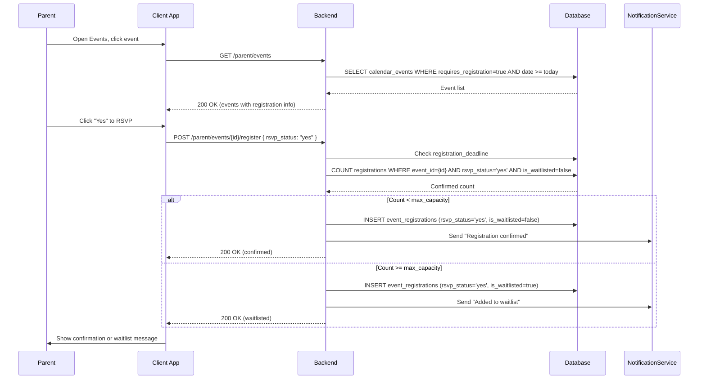
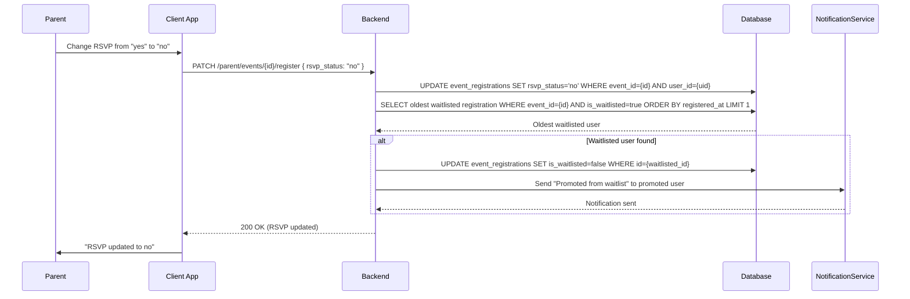
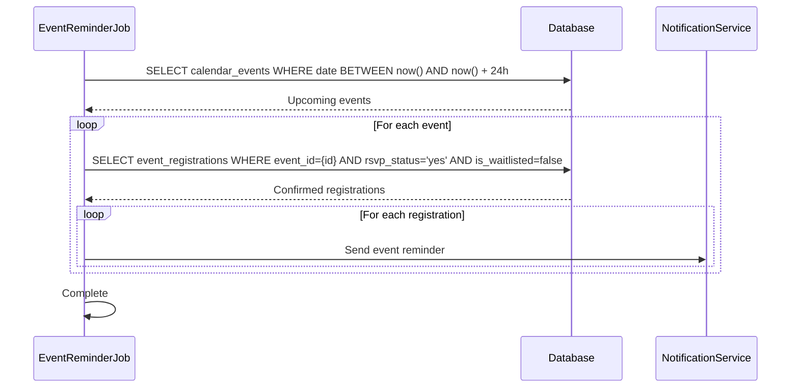
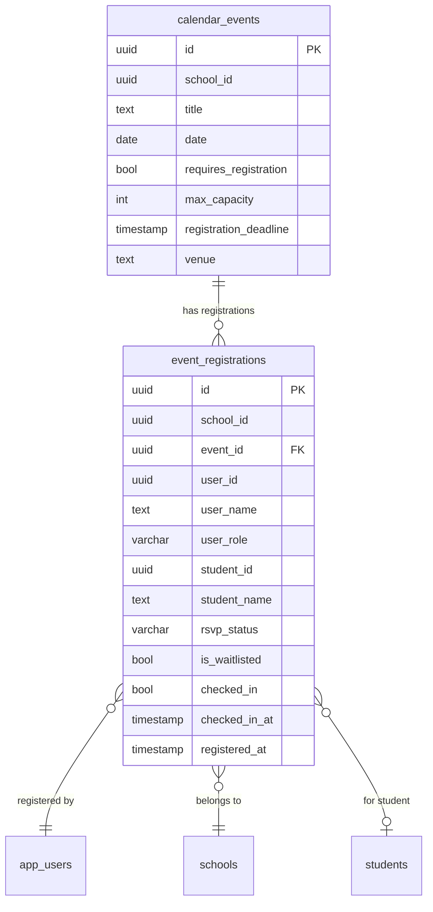

# Event Registration — Technical Specification

> **Document status:** Implementation-ready blueprint
> **Last updated:** 2026-06-27
> **Prerequisites:** None
> **Template:** `_SPEC_TEMPLATE.md` v1 (25 mandatory + 6 optional sections)

---

## 1. Feature Overview

Event registration and RSVP system for school events (Annual Day, Sports Day, PTM, workshops). Parents can register/RSVP for events, admin tracks attendance, and generates event reports.

### Goals

- Admin creates event with registration settings (capacity, deadline, RSVP required)
- Parent registers/RSVPs for events
- Admin views registration list, check-in at event
- Waitlist when capacity reached
- Event reminders sent to registered parents
- Post-event attendance report

### Non-goals

- [ ] Paid event ticketing
- [ ] External (non-parent) guest registration
- [ ] Event seating arrangement
- [ ] Multi-day event registration

### Dependencies

- `CalendarEventsTable` — existing school calendar events (modified)
- `NotificationsTable` — existing notification infrastructure
- `NotificationService` — for event reminders

### Related Modules

- `server/.../feature/events/` — new event registration module
- `shared/.../events/` — shared event DTOs
- `composeApp/.../ui/v2/screens/parent/` — parent UI
- `composeApp/.../ui/v2/screens/admin/` — admin UI

---

## 2. Current System Assessment

### Existing Code

- `CalendarEventsTable` — stores events but no registration/RSVP
- `feature_audit.csv` L159: Event Registration missing (0%)
- `NotificationsTable` — can send event reminders

### Existing Database

- `CalendarEventsTable` — school calendar events with title, date, type, audience
- `NotificationsTable` — notification records

### Existing APIs

- School calendar CRUD (admin)
- Calendar view (parent/teacher)
- No registration or RSVP APIs

### Existing UI

- Calendar view screen (parent/teacher)
- Calendar management (admin)
- No registration or check-in UI

### Existing Services

- `NotificationService` — multi-channel notifications
- `CalendarService` — calendar event management

### Existing Documentation

- `feature_audit.csv` — event registration at 0%
- `IMPLEMENTATION_BACKLOG` — P1-26 entry

### Technical Debt

| # | Gap | Details |
|---|---|---|
| TD-1 | No registration system | No RSVP or registration for events |
| TD-2 | No capacity management | No capacity limit or waitlist |
| TD-3 | No check-in | No attendance tracking at events |
| TD-4 | No event reports | No post-event attendance reports |

### Gaps

| # | Gap | Impact | Severity |
|---|---|---|---|
| G1 | No registration | Parents cannot RSVP; admin doesn't know attendance | **High** |
| G2 | No capacity management | Overcrowding possible | **Medium** |
| G3 | No check-in | No attendance tracking | **Medium** |
| G4 | No reports | No post-event analysis | **Medium** |

---

## 3. Functional Requirements

### FR-001
| Field | Value |
|---|---|
| **Title** | Create Event with Registration |
| **Description** | Admin creates event with: title, date, time, venue, description, capacity, registration_deadline, rsvp_required |
| **Priority** | Critical |
| **User Roles** | School Admin |
| **Acceptance notes** | `CalendarEventsTable` modified with `requires_registration`, `max_capacity`, `registration_deadline`, `venue` |

### FR-002
| Field | Value |
|---|---|
| **Title** | Parent RSVP |
| **Description** | Parent views upcoming events and registers/RSVPs (yes/no/maybe) |
| **Priority** | Critical |
| **User Roles** | Parent |
| **Acceptance notes** | `event_registrations` table with `rsvp_status` (yes/no/maybe) |

### FR-003
| Field | Value |
|---|---|
| **Title** | Capacity and Waitlist |
| **Description** | Capacity enforcement: waitlist when full |
| **Priority** | High |
| **User Roles** | System |
| **Acceptance notes** | `is_waitlisted = true` when `max_capacity` reached for `rsvp_status='yes'` |

### FR-004
| Field | Value |
|---|---|
| **Title** | Registration List |
| **Description** | Admin views registration list (name, RSVP status, check-in status) |
| **Priority** | High |
| **User Roles** | School Admin |
| **Acceptance notes** | Admin endpoint returns all registrations for an event |

### FR-005
| Field | Value |
|---|---|
| **Title** | Event Reminder |
| **Description** | Event reminder sent 24h before event to registered parents |
| **Priority** | Medium |
| **User Roles** | System |
| **Acceptance notes** | Scheduled notification 24h before event to all `rsvp_status='yes'` registrations |

### FR-006
| Field | Value |
|---|---|
| **Title** | Check-in |
| **Description** | Admin checks in attendees at event (QR code or manual) |
| **Priority** | High |
| **User Roles** | School Admin |
| **Acceptance notes** | `checked_in = true`, `checked_in_at = now()` via admin endpoint |

### FR-007
| Field | Value |
|---|---|
| **Title** | Post-Event Report |
| **Description** | Post-event report: registered vs attended, no-show rate |
| **Priority** | Medium |
| **User Roles** | School Admin |
| **Acceptance notes** | Report endpoint returns counts: registered, attended, no-show, waitlisted |

---

## 4. User Stories

### School Admin
- [ ] Create event with registration settings (capacity, deadline, venue)
- [ ] View registration list for an event
- [ ] Check in attendees (QR code or manual)
- [ ] View post-event attendance report
- [ ] See waitlist count

### Parent
- [ ] View upcoming events with registration
- [ ] RSVP for events (yes/no/maybe)
- [ ] Update RSVP status before deadline
- [ ] Receive event reminder 24h before
- [ ] See registration confirmation

### System
- [ ] Enforce capacity limits
- [ ] Manage waitlist automatically
- [ ] Send event reminders 24h before
- [ ] Generate post-event reports

---

## 5. Business Rules

### BR-001
**Rule:** Registration deadline enforced; no RSVP after deadline.
**Enforcement:** Check `registration_deadline` before accepting RSVP; reject if past deadline.

### BR-002
**Rule:** Waitlist activates when capacity reached for "yes" RSVPs.
**Enforcement:** Count `rsvp_status='yes' AND is_waitlisted=false`; if >= `max_capacity`, new "yes" RSVPs are waitlisted.

### BR-003
**Rule:** One registration per user per event.
**Enforcement:** `UNIQUE(event_id, user_id)` constraint; update existing registration on re-RSVP.

### BR-004
**Rule:** Check-in only for confirmed (non-waitlisted) registrations.
**Enforcement:** Check `is_waitlisted=false` before allowing check-in.

### BR-005
**Rule:** Waitlist auto-promotes when confirmed RSVP changes to "no" or "maybe".
**Enforcement:** On RSVP update from "yes" to "no"/"maybe", promote oldest waitlisted "yes" registration.

---

## 6. Database Design

### 6.1 Entity Relationship Summary

One new table: `event_registrations` — stores per-user RSVP and check-in data. Existing `CalendarEventsTable` modified with registration-related columns.

### 6.2 New Tables

#### `event_registrations` table

```sql
CREATE TABLE event_registrations (
    id              UUID PRIMARY KEY DEFAULT gen_random_uuid(),
    school_id       UUID NOT NULL,
    event_id        UUID NOT NULL REFERENCES calendar_events(id) ON DELETE CASCADE,
    user_id         UUID NOT NULL,
    user_name       TEXT NOT NULL,
    user_role       VARCHAR(32) NOT NULL,
    student_id      UUID,
    student_name    TEXT,
    rsvp_status     VARCHAR(16) NOT NULL,
    is_waitlisted   BOOLEAN NOT NULL DEFAULT false,
    checked_in      BOOLEAN NOT NULL DEFAULT false,
    checked_in_at   TIMESTAMP,
    registered_at   TIMESTAMP NOT NULL DEFAULT now(),
    UNIQUE(event_id, user_id)
);
CREATE INDEX idx_event_registrations_event ON event_registrations(event_id, rsvp_status);
```

### 6.3 Modified Tables

#### `calendar_events` table modifications

```sql
ALTER TABLE calendar_events ADD COLUMN requires_registration BOOLEAN NOT NULL DEFAULT false;
ALTER TABLE calendar_events ADD COLUMN max_capacity INTEGER;
ALTER TABLE calendar_events ADD COLUMN registration_deadline TIMESTAMP;
ALTER TABLE calendar_events ADD COLUMN venue TEXT;
```

### 6.4 Indexes

```sql
CREATE INDEX idx_event_registrations_event ON event_registrations(event_id, rsvp_status);
CREATE INDEX idx_event_registrations_user ON event_registrations(user_id);
CREATE INDEX idx_event_registrations_waitlist ON event_registrations(event_id, is_waitlisted, registered_at);
```

### 6.5 Constraints

- `event_registrations.school_id` — NOT NULL
- `event_registrations.event_id` — NOT NULL, FK (CASCADE)
- `event_registrations.user_id` — NOT NULL
- `event_registrations.user_name` — NOT NULL
- `event_registrations.user_role` — NOT NULL
- `event_registrations.rsvp_status` — NOT NULL, one of yes/no/maybe
- `event_registrations.is_waitlisted` — NOT NULL, default false
- `event_registrations.checked_in` — NOT NULL, default false
- UNIQUE(event_id, user_id)

### 6.6 Foreign Keys

- `event_registrations.event_id` → `calendar_events.id` (ON DELETE CASCADE)
- `event_registrations.school_id` → `schools.id`
- `event_registrations.user_id` → `app_users.id`
- `event_registrations.student_id` → `students.id` (nullable)

### 6.7 Soft Delete Strategy

- Registrations: hard deleted via CASCADE when event deleted
- No soft delete needed (registrations are ephemeral)

### 6.8 Audit Fields

- `registered_at` — registration timestamp
- `checked_in_at` — check-in timestamp

### 6.9 Migration Notes

Migration: `docs/db/migration_064_event_registration.sql`
- Creates 1 new table with indexes
- Alters `calendar_events` with 4 new columns
- No data backfill needed (new feature)

### 6.10 Exposed Mappings

```kotlin
object EventRegistrationsTable : UUIDTable("event_registrations", "id") {
    val schoolId      = uuid("school_id")
    val eventId       = uuid("event_id")
    val userId        = uuid("user_id")
    val userName      = text("user_name")
    val userRole      = varchar("user_role", 32)
    val studentId     = uuid("student_id").nullable()
    val studentName   = text("student_name").nullable()
    val rsvpStatus    = varchar("rsvp_status", 16)
    val isWaitlisted  = bool("is_waitlisted").default(false)
    val checkedIn     = bool("checked_in").default(false)
    val checkedInAt   = timestamp("checked_in_at").nullable()
    val registeredAt  = timestamp("registered_at")
    init {
        uniqueIndex("idx_event_reg_unique", eventId, userId)
        index("idx_event_registrations_event", false, eventId, rsvpStatus)
        index("idx_event_registrations_waitlist", false, eventId, isWaitlisted, registeredAt)
    }
}
```

### 6.11 Seed Data

N/A — registrations created on user action.

---

## 7. State Machines

### RSVP State Machine

```
UNREGISTERED ──parent_rsvps_yes──> CONFIRMED (or WAITLISTED if full)
UNREGISTERED ──parent_rsvps_no──> DECLINED
UNREGISTERED ──parent_rsvps_maybe──> MAYBE
CONFIRMED ──parent_changes_to_no──> DECLINED (waitlist auto-promote)
CONFIRMED ──parent_changes_to_maybe──> MAYBE (waitlist auto-promote)
WAITLISTED ──spot_opens──> CONFIRMED (auto-promote)
WAITLISTED ──parent_changes_to_no──> DECLINED
CONFIRMED ──admin_checkin──> CHECKED_IN
DECLINED ──parent_changes_to_yes──> CONFIRMED (or WAITLISTED if full)
```

| Current State | Event | Next State | Guard / Condition |
|---|---|---|---|
| `unregistered` | Parent RSVPs yes | `confirmed` or `waitlisted` | Capacity check |
| `unregistered` | Parent RSVPs no | `declined` | — |
| `unregistered` | Parent RSVPs maybe | `maybe` | — |
| `confirmed` | Parent changes to no | `declined` | Waitlist auto-promote |
| `confirmed` | Parent changes to maybe | `maybe` | Waitlist auto-promote |
| `waitlisted` | Spot opens (auto) | `confirmed` | Oldest waitlisted promoted |
| `waitlisted` | Parent changes to no | `declined` | — |
| `confirmed` | Admin checks in | `checked_in` | Manual or QR |
| `declined` | Parent changes to yes | `confirmed` or `waitlisted` | Capacity check |

### Check-in Flow

```
NOT_CHECKED_IN ──admin_scans_qr──> CHECKED_IN
NOT_CHECKED_IN ──admin_manual_checkin──> CHECKED_IN
```

| Step | Action | Condition |
|---|---|---|
| 1 | Admin scans QR or selects user | Registration exists and is confirmed |
| 2 | System sets checked_in=true | Not already checked in |
| 3 | System sets checked_in_at=now() | — |
| 4 | Admin sees check-in confirmation | UI updates |

---

## 8. Backend Architecture

### 8.1 Component Overview

`EventRegistrationService` handles RSVP, waitlist management, check-in, and reporting. `EventRegistrationRouting` exposes admin and parent endpoints.

### 8.2 Design Principles

1. **Capacity enforcement** — automatic waitlist when capacity reached
2. **Auto-promote waitlist** — oldest waitlisted promoted when spot opens
3. **Registration deadline** — no RSVP after deadline
4. **QR + manual check-in** — flexible check-in options
5. **Post-event reporting** — registered vs attended analysis

### 8.3 Core Types

```kotlin
class EventRegistrationService {
    suspend fun register(eventId: UUID, userId: UUID, rsvpStatus: RsvpStatus, studentId: UUID?): RegistrationDto
    suspend fun updateRsvp(eventId: UUID, userId: UUID, rsvpStatus: RsvpStatus): RegistrationDto
    suspend fun getRegistrations(eventId: UUID): List<RegistrationDto>
    suspend fun checkIn(eventId: UUID, userId: UUID): RegistrationDto
    suspend fun getReport(eventId: UUID): EventReportDto
    suspend fun sendEventReminders() // scheduled job
}
```

### 8.4 Repositories

- `EventRegistrationRepository` — registration CRUD, waitlist queries

### 8.5 Mappers

- `RegistrationMapper` — maps DB rows to DTOs

### 8.6 Permission Checks

- Admin endpoints: JWT with `requireSchoolContext()`
- Parent endpoints: JWT with parent role
- Check-in: admin only
- Report: admin only

### 8.7 Background Jobs

- `EventReminderJob` — runs hourly; sends reminders for events happening in 24h to confirmed registrations

### 8.8 Domain Events

- `EventRegistrationCreated` — emitted on RSVP
- `EventRegistrationUpdated` — emitted on RSVP change
- `EventCheckInCompleted` — emitted on check-in
- `WaitlistPromoted` — emitted when waitlisted user auto-promoted
- `EventReminderSent` — emitted when reminder notifications sent

### 8.9 Caching

- Event capacity count not cached (real-time accuracy needed)
- Registration list not cached (real-time for admin)

### 8.10 Transactions

- RSVP: INSERT/UPDATE registration + check capacity + auto-promote waitlist in transaction
- Check-in: UPDATE registration in single operation

### 8.11 Rate Limiting

- Standard API rate limiting
- RSVP: 10 per minute per user (prevent spam)

### 8.12 Configuration

- `EVENT_REGISTRATION_REMINDER_HOURS` — hours before event to send reminder (default: `24`)
- `EVENT_CHECKIN_QR_ENABLED` — enable QR code check-in (default: `true`)
- `EVENT_MAX_CAPACITY_DEFAULT` — default capacity if not set (default: `null` = unlimited)

---

## 9. API Contracts

### 9.1 Admin endpoints

```
GET  /api/v1/school/events/{id}/registrations
POST /api/v1/school/events/{id}/checkin   { user_id }
GET  /api/v1/school/events/{id}/report
```

### 9.2 Parent endpoints

```
GET   /api/v1/parent/events
POST  /api/v1/parent/events/{id}/register   { rsvp_status, student_id }
PATCH /api/v1/parent/events/{id}/register   { rsvp_status }
```

### 9.3 Example Responses

**Parent Event List Response 200:**
```json
{
  "success": true,
  "data": [
    {
      "event_id": "uuid",
      "title": "Annual Day 2026",
      "date": "2026-07-15",
      "time": "17:00",
      "venue": "School Auditorium",
      "description": "Annual cultural event",
      "requires_registration": true,
      "max_capacity": 500,
      "registration_deadline": "2026-07-10T23:59:59Z",
      "registered_count": 320,
      "user_rsvp": "yes",
      "is_waitlisted": false
    }
  ]
}
```

**Register Request:**
```json
{
  "rsvp_status": "yes",
  "student_id": "uuid"
}
```

**Register Response 200:**
```json
{
  "success": true,
  "data": {
    "id": "uuid",
    "event_id": "uuid",
    "rsvp_status": "yes",
    "is_waitlisted": false,
    "registered_at": "2026-06-28T10:00:00Z"
  }
}
```

**Registration List Response 200:**
```json
{
  "success": true,
  "data": [
    {
      "id": "uuid",
      "user_name": "John Doe",
      "user_role": "parent",
      "student_name": "Jane Doe",
      "rsvp_status": "yes",
      "is_waitlisted": false,
      "checked_in": false,
      "checked_in_at": null,
      "registered_at": "2026-06-28T10:00:00Z"
    }
  ]
}
```

**Event Report Response 200:**
```json
{
  "success": true,
  "data": {
    "event_id": "uuid",
    "title": "Annual Day 2026",
    "total_registered": 320,
    "confirmed": 280,
    "waitlisted": 40,
    "declined": 15,
    "maybe": 25,
    "checked_in": 250,
    "no_show": 30,
    "no_show_rate": 10.7
  }
}
```

---

## 10. Frontend Architecture

### 10.1 Screens

| Screen | Platform | Role | Description |
|---|---|---|---|
| `ParentEventListScreen` | All | Parent | View upcoming events with registration |
| `ParentEventDetailScreen` | All | Parent | Event detail with RSVP buttons |
| `AdminRegistrationsScreen` | All | Admin | Registration list for an event |
| `AdminCheckInScreen` | All | Admin | Check-in screen (QR scanner + manual list) |
| `AdminEventReportScreen` | All | Admin | Post-event attendance report |

### 10.2 Navigation

- Parent portal → Events → `ParentEventListScreen`
- Parent portal → Events → {event} → `ParentEventDetailScreen`
- Admin portal → Events → {event} → Registrations → `AdminRegistrationsScreen`
- Admin portal → Events → {event} → Check-in → `AdminCheckInScreen`
- Admin portal → Events → {event} → Report → `AdminEventReportScreen`

### 10.3 UX Flows

#### Parent: RSVP for Event

1. Parent opens Events
2. Views upcoming events with registration badge
3. Clicks event to view details
4. Sees capacity, deadline, venue
5. Clicks "Yes", "No", or "Maybe"
6. If "Yes" and capacity full → "You've been added to the waitlist"
7. If "Yes" and capacity available → "Registration confirmed!"
8. Can update RSVP before deadline

#### Admin: Check-in at Event

1. Admin opens Events → {event} → Check-in
2. Views confirmed registrations list
3. Option A: Scan QR code from parent's app
4. Option B: Tap "Check In" next to name
5. Green checkmark appears on checked-in attendee
6. Real-time count: "250 / 280 checked in"

### 10.4 State Management

```kotlin
data class EventRegistrationState(
    val events: List<EventWithRegistrationDto>,
    val currentEvent: EventDetailDto?,
    val registrations: List<RegistrationDto>,
    val report: EventReportDto?,
    val userRsvp: String?,
    val isWaitlisted: Boolean,
    val isLoading: Boolean,
    val error: String?,
)
```

### 10.5 Offline Support

- Event list cached locally
- Registration status cached
- Check-in works offline (syncs when online)

### 10.6 Loading States

- Loading events: "Loading events..."
- Registering: "Registering..."
- Checking in: "Checking in..."

### 10.7 Error Handling (UI)

- Event full: "Event is at capacity. You've been added to the waitlist."
- Deadline passed: "Registration deadline has passed."
- Already checked in: "This person is already checked in."
- No registrations: "No registrations for this event."

### 10.8 Component Integration Guidelines

| Rule | Description |
|---|---|
| **R1** | Event list with registration badge (RSVP required) |
| **R2** | RSVP buttons: Yes (green), No (red), Maybe (yellow) |
| **R3** | Capacity progress bar: registered / max_capacity |
| **R4** | Waitlist indicator badge |
| **R5** | Registration countdown timer (deadline) |
| **R6** | QR code scanner for check-in |
| **R7** | Manual check-in list with tap-to-check-in |
| **R8** | Check-in progress: checked_in / confirmed count |
| **R9** | Report with pie chart: confirmed, no-show, maybe, declined |
| **R10** | No-show rate percentage display |

---

## 11. Shared Module Changes (KMP)

### 11.1 DTOs

```kotlin
data class EventWithRegistrationDto(
    val eventId: String,
    val title: String,
    val date: String,
    val time: String?,
    val venue: String?,
    val description: String?,
    val requiresRegistration: Boolean,
    val maxCapacity: Int?,
    val registrationDeadline: String?,
    val registeredCount: Int,
    val userRsvp: String?,
    val isWaitlisted: Boolean,
)

data class RegistrationDto(
    val id: String,
    val eventId: String,
    val userId: String,
    val userName: String,
    val userRole: String,
    val studentId: String?,
    val studentName: String?,
    val rsvpStatus: String,
    val isWaitlisted: Boolean,
    val checkedIn: Boolean,
    val checkedInAt: String?,
    val registeredAt: String,
)

data class EventReportDto(
    val eventId: String,
    val title: String,
    val totalRegistered: Int,
    val confirmed: Int,
    val waitlisted: Int,
    val declined: Int,
    val maybe: Int,
    val checkedIn: Int,
    val noShow: Int,
    val noShowRate: Double,
)
```

### 11.2 Domain Models

```kotlin
data class EventRegistration(
    val id: UUID,
    val eventId: UUID,
    val userId: UUID,
    val rsvpStatus: RsvpStatus,
    val isWaitlisted: Boolean,
    val checkedIn: Boolean,
    val checkedInAt: Instant?,
)

enum class RsvpStatus {
    YES, NO, MAYBE
}

data class EventReport(
    val eventId: UUID,
    val totalRegistered: Int,
    val confirmed: Int,
    val waitlisted: Int,
    val checkedIn: Int,
    val noShow: Int,
    val noShowRate: Double,
)
```

### 11.3 Repository Interfaces

```kotlin
interface EventRegistrationRepository {
    suspend fun getEvents(): NetworkResult<List<EventWithRegistrationDto>>
    suspend fun register(eventId: String, rsvpStatus: String, studentId: String?): NetworkResult<RegistrationDto>
    suspend fun updateRsvp(eventId: String, rsvpStatus: String): NetworkResult<RegistrationDto>
    suspend fun getRegistrations(eventId: String): NetworkResult<List<RegistrationDto>>
    suspend fun checkIn(eventId: String, userId: String): NetworkResult<RegistrationDto>
    suspend fun getReport(eventId: String): NetworkResult<EventReportDto>
}
```

### 11.4 UseCases

- `GetEventsUseCase`
- `RegisterForEventUseCase`
- `UpdateRsvpUseCase`
- `GetRegistrationsUseCase`
- `CheckInUseCase`
- `GetEventReportUseCase`

### 11.5 Validation

- RSVP status: one of yes/no/maybe
- Student ID: must belong to parent's children (if provided)
- Registration deadline: must not be past

### 11.6 Serialization

Standard Kotlinx serialization.

### 11.7 Network APIs

Ktor `@Resource` route definitions:
- `ParentEventApi` — parent event list, register, update RSVP
- `SchoolEventRegistrationApi` — admin registrations, check-in, report

### 11.8 Database Models (Local Cache)

- Event list cached locally
- User's RSVP status cached
- Check-in queue for offline mode

---

## 12. Permissions Matrix

| Action | Super Admin | School Admin | Teacher | Parent |
|---|---|---|---|---|
| Create event with registration | ✅ | ✅ | ❌ | ❌ |
| View registration list | ✅ | ✅ | ❌ | ❌ |
| Check in attendees | ✅ | ✅ | ❌ | ❌ |
| View event report | ✅ | ✅ | ❌ | ❌ |
| View events | ✅ | ✅ | ✅ | ✅ |
| RSVP for events | ✅ | ✅ | ✅ | ✅ |
| Update own RSVP | ✅ | ✅ | ✅ | ✅ |

---

## 13. Notifications

### Event Registration Notifications

| Type | Trigger | Channel | Message |
|---|---|---|---|
| Registration Confirmed (Parent) | Parent RSVPs "yes" and capacity available | Push + In-app | "You're registered for {event_title} on {date}." |
| Waitlist Added (Parent) | Parent RSVPs "yes" but capacity full | Push + In-app | "You've been added to the waitlist for {event_title}." |
| Waitlist Promoted (Parent) | Spot opens; waitlisted user promoted | Push + In-app | "Good news! You've been promoted from the waitlist for {event_title}." |
| Event Reminder (Parent) | 24h before event | Push + In-app | "Reminder: {event_title} is tomorrow at {time} at {venue}." |
| RSVP Changed (Parent) | Parent updates RSVP | In-app | "Your RSVP for {event_title} has been updated to {status}." |
| Registration Deadline (Parent) | 2h before registration deadline | In-app | "Last chance to register for {event_title}. Deadline at {time}." |

---

## 14. Background Jobs

### Event Reminder Job

| Field | Value |
|---|---|
| **Name** | `EventReminderJob` |
| **Trigger** | Hourly |
| **Frequency** | Hourly |
| **Description** | Sends event reminders to confirmed registrations for events happening in ~24h |
| **Timeout** | 60 seconds |
| **Retry** | None |
| **On failure** | Logged; retried next hour |

### Waitlist Auto-Promote (Event-Driven)

| Field | Value |
|---|---|
| **Name** | `WaitlistAutoPromote` |
| **Trigger** | RSVP change from "yes" to "no"/"maybe" |
| **Frequency** | On-demand (synchronous) |
| **Description** | Promotes oldest waitlisted "yes" registration to confirmed |
| **Timeout** | 5 seconds |
| **Retry** | None |
| **On failure** | Logged; next RSVP change will retry |

---

## 15. Integrations

### CalendarEventsTable
| Field | Value |
|---|---|
| **System** | Existing school calendar |
| **Purpose** | Source of events; modified with registration columns |
| **API / SDK** | Direct DB via Exposed |
| **Auth method** | Internal |
| **Fallback** | N/A — primary data source |

### NotificationService
| Field | Value |
|---|---|
| **System** | Existing notification infrastructure |
| **Purpose** | Send event reminders, waitlist promotions, RSVP confirmations |
| **API / SDK** | Internal `NotificationService` |
| **Auth method** | Internal service call |
| **Fallback** | In-app notification if push fails |

---

## 16. Security

### Authentication
- Admin endpoints: JWT with `requireSchoolContext()`
- Parent endpoints: JWT with parent role

### Authorization
- Create event with registration: school admin only
- View registration list: school admin only
- Check-in: school admin only
- Report: school admin only
- RSVP: any authenticated user (parent, teacher, admin)
- Update RSVP: own registration only

### Encryption
- All API communication over TLS

### Audit Logs
- Event registration created logged (eventId, userId, rsvpStatus)
- RSVP updated logged (eventId, userId, oldStatus, newStatus)
- Check-in logged (eventId, userId, adminId, method: qr/manual)
- Waitlist promotion logged (eventId, userId)
- Event reminder sent logged (eventId, recipientCount)

### PII Handling
- Registration includes user name and student name (visible to admin)
- Reports contain aggregate counts (no individual PII in reports)

### Data Isolation
- All queries filtered by `school_id` (multi-tenant)
- Parents can only see their own registrations

### Rate Limiting
- Standard API rate limiting
- RSVP: 10 per minute per user

### Input Validation
- RSVP status: one of yes/no/maybe
- Student ID: must belong to parent's children
- Event ID: must exist and have `requires_registration=true`
- Registration deadline: must not be past at time of RSVP

---

## 17. Performance & Scalability

### Expected Scale

| Metric | Small school | Medium school | Large school |
|---|---|---|---|
| Events per year | ~20 | ~50 | ~100 |
| Registrations per event | ~50 | ~200 | ~500 |
| Concurrent check-ins | ~10 | ~30 | ~50 |
| Reminders per event | ~50 | ~200 | ~500 |

### Latency Targets

| Operation | Target |
|---|---|
| Get event list | < 100ms |
| RSVP | < 100ms |
| Get registrations | < 100ms |
| Check-in | < 50ms |
| Get report | < 100ms |

### Optimization Strategy

- Registrations indexed by (event_id, rsvp_status) for fast filtering
- Capacity count via COUNT query (indexed; fast for < 1000 rows)
- Check-in uses single UPDATE (fast)
- Reminder job processes events in batch

---

## 18. Edge Cases

| # | Scenario | Expected Behavior |
|---|---|---|
| EC-001 | RSVP after deadline | 400 DEADLINE_PASSED |
| EC-002 | RSVP for event without registration | 400 REGISTRATION_NOT_REQUIRED |
| EC-003 | Check-in waitlisted user | 400 USER_WAITLISTED |
| EC-004 | Check-in already checked in | 400 ALREADY_CHECKED_IN |
| EC-005 | RSVP "yes" when capacity full | Waitlisted; 200 with is_waitlisted=true |
| EC-006 | Update RSVP from "yes" to "no" | Waitlist auto-promote triggers |
| EC-007 | Event deleted | Registrations CASCADE deleted |
| EC-008 | No registrations for event | Empty list; report shows zeros |

### Risks & Mitigations

| Risk | Likelihood | Impact | Mitigation |
|---|---|---|---|
| Capacity race condition | Low | Low | Transaction with row-level check |
| Reminder job failure | Low | Low | Hourly retry; missed reminders caught next run |
| Offline check-in conflict | Medium | Low | Sync resolves; last-write-wins for check-in |
| Large event (1000+ registrations) | Low | Low | Indexed queries; batch processing |

---

## 19. Error Handling

### Standard Error Codes

| HTTP | Error Code | Description | When |
|---|---|---|---|
| 400 | `DEADLINE_PASSED` | Registration deadline has passed | RSVP |
| 400 | `REGISTRATION_NOT_REQUIRED` | Event doesn't require registration | RSVP |
| 400 | `ALREADY_CHECKED_IN` | User already checked in | Check-in |
| 400 | `USER_WAITLISTED` | Cannot check in waitlisted user | Check-in |
| 400 | `INVALID_RSVP_STATUS` | RSVP status not yes/no/maybe | RSVP |
| 403 | `INSUFFICIENT_PERMISSIONS` | Non-admin trying admin action | Admin endpoints |
| 404 | `EVENT_NOT_FOUND` | Event not found | Any |
| 404 | `REGISTRATION_NOT_FOUND` | Registration not found | Update/check-in |

### Error Response Format

Same as existing API error format.

### Recovery Strategy

| Error | Client Action | Server Action |
|---|---|---|
| `DEADLINE_PASSED` | Show "Registration deadline has passed." | Return 400 |
| `ALREADY_CHECKED_IN` | Show "This person is already checked in." | Return 400 |
| `USER_WAITLISTED` | Show "This person is on the waitlist." | Return 400 |

---

## 20. Analytics & Reporting

### Reports

- **Event Attendance Report:** Registered vs attended vs no-show
- **RSVP Distribution:** Yes/no/maybe/waitlist breakdown
- **Check-in Rate:** Percentage of confirmed who checked in
- **No-Show Rate:** Percentage of confirmed who didn't check in
- **Event Comparison:** Attendance across multiple events

### KPIs

- **Average Attendance Rate:** Across all events
- **Average No-Show Rate:** Across all events
- **Registration Conversion:** Views → RSVPs → Check-ins
- **Waitlist Conversion:** Waitlisted → Promoted → Checked in
- **Event Popularity:** Registrations per event

### Dashboards

- Admin: event overview with attendance metrics
- Admin: check-in progress during event (real-time)

### Exports

- Registration list CSV export
- Event report CSV export
- Attendance summary CSV export

---

## 21. Testing Strategy

### Unit Tests

| Test | What it verifies |
|---|---|
| Register (yes, capacity available) | Registration created; is_waitlisted=false |
| Register (yes, capacity full) | Registration created; is_waitlisted=true |
| Register (no) | Registration created with rsvp_status=no |
| Register (maybe) | Registration created with rsvp_status=maybe |
| Update RSVP (yes → no) | Registration updated; waitlist auto-promote |
| Update RSVP after deadline | 400 DEADLINE_PASSED |
| Check-in (confirmed) | checked_in=true; checked_in_at set |
| Check-in (waitlisted) | 400 USER_WAITLISTED |
| Check-in (already checked in) | 400 ALREADY_CHECKED_IN |
| Get report | Correct counts: confirmed, waitlisted, checked_in, no_show |
| Waitlist auto-promote | Oldest waitlisted promoted when spot opens |

### Integration Tests

| Test | What it verifies |
|---|---|
| Create event → parent RSVPs → admin checks in → report | Full lifecycle |
| Fill capacity → waitlist → RSVP change → auto-promote | Waitlist flow |
| Reminder job → notifications sent | Reminder flow |

### Performance Tests

- [ ] Get 500 registrations < 100ms
- [ ] Check-in < 50ms
- [ ] Report generation < 100ms
- [ ] Reminder job for 500 recipients < 30s

### Security Tests

- [ ] Parent cannot view other parents' registrations
- [ ] Parent cannot check in attendees
- [ ] Parent cannot view reports
- [ ] All queries school-scoped
- [ ] RSVP deadline enforced

### Migration Tests

- [ ] Migration creates table with correct schema
- [ ] calendar_events ALTER adds 4 columns
- [ ] Indexes created correctly

---

## 22. Acceptance Criteria

- [ ] Admin creates event with registration settings
- [ ] Parent registers/RSVPs for events
- [ ] Waitlist activates when capacity reached
- [ ] Admin views registration list
- [ ] Event reminder sent 24h before
- [ ] Check-in works (manual or QR)
- [ ] Post-event report generated

---

## 23. Implementation Roadmap

| Phase | Duration | Tasks | Breaking? | Deliverable |
|---|---|---|---|---|
| 1 | 1 day | DB migration, Exposed table | No (ALTER is additive) | Schema ready |
| 2 | 2 days | EventRegistrationService (register, waitlist, check-in) | No | Service ready |
| 3 | 1 day | Reminder notification integration | No | Reminders configured |
| 4 | 1 day | API endpoints | No | APIs available |
| 5 | 2 days | Client UI (event list, registration, admin check-in, report) | No | UI ready |
| 6 | 1 day | Tests | No | Test coverage |

**Total: ~8 days**

---

## 24. File-Level Impact Analysis

### New Files

| File | Location | Purpose |
|---|---|---|
| `EventRegistrationService.kt` | `server/.../feature/events/` | Core service |
| `EventRegistrationRouting.kt` | `server/.../feature/events/` | API endpoints |
| `migration_064_event_registration.sql` | `docs/db/` | DDL + ALTER |
| `EventRegistrationApi.kt` | `shared/.../events/` | Client API |
| `EventRegistrationDtos.kt` | `shared/.../events/` | DTOs |
| `EventRegistrationRepository.kt` | `shared/.../events/` | Repository interface |
| `EventRegistrationRepositoryImpl.kt` | `shared/.../events/` | Repository impl |
| `ParentEventListScreen.kt` | `composeApp/.../ui/v2/screens/parent/` | Parent event list |
| `ParentEventDetailScreen.kt` | `composeApp/.../ui/v2/screens/parent/` | Event detail with RSVP |
| `AdminRegistrationsScreen.kt` | `composeApp/.../ui/v2/screens/admin/` | Registration list |
| `AdminCheckInScreen.kt` | `composeApp/.../ui/v2/screens/admin/` | Check-in screen |
| `AdminEventReportScreen.kt` | `composeApp/.../ui/v2/screens/admin/` | Post-event report |
| `EventRegistrationViewModel.kt` | `composeApp/.../ui/v2/viewmodel/` | MVI state |

### Modified Files

| File | Change Type | Lines Changed (est.) | Risk | Description |
|---|---|---|---|---|
| `server/.../db/Tables.kt` | Add + Modify | ~25 | Low | `EventRegistrationsTable` + 4 columns on `CalendarEventsTable` |
| `server/.../db/DatabaseFactory.kt` | Modify | ~2 | Low | Register new table |
| `server/.../feature/calendar/CalendarService.kt` | Modify | ~10 | Low | Add registration fields to event creation |

### Files Preserved Unchanged

| File | Reason |
|---|---|
| `NotificationsTable` | Used as-is for notifications |
| `NotificationService` | Used as-is for reminders |

---

## 25. Future Enhancements

### Paid Event Ticketing

- Ticketed events with payment integration
- Different ticket tiers (VIP, general, student)
- Refund and cancellation policies
- Payment gateway integration

### External Guest Registration

- Register non-parent guests (grandparents, siblings)
- Guest information collection
- Guest capacity management
- Guest check-in

### Event Seating Arrangement

- Assigned seating for events
- Seat map visualization
- Seat selection during registration
- Group seating requests

### Multi-Day Event Registration

- Multi-day event support (e.g., 3-day sports meet)
- Day-wise registration
- Partial attendance tracking
- Multi-day attendance report

### Event Feedback

- Post-event feedback survey
- Rating and comments
- Feedback analytics
- Improvement suggestions

### Recurring Event Registration

- Recurring event series (weekly workshops)
- Series registration (register for all) or per-occurrence
- Series attendance tracking
- Series report

### Event Calendar Integration

- Sync registered events to personal calendar
- ICS feed for registered events only
- Google Calendar push for registered events
- Calendar reminders integration

### Event Photos and Media

- Upload event photos
- Tag attendees in photos
- Photo gallery per event
- Media sharing with parents

### Event Sponsorship Tracking

- Track event sponsors
- Sponsor branding on event page
- Sponsor acknowledgment in reports
- Sponsorship management

### Automated Waitlist Communication

- Real-time waitlist position updates
- Estimated promotion time
- Waitlist analytics
- Auto-promotion notifications

### Event Capacity Analytics

- Historical attendance trends
- Optimal capacity recommendations
- Peak registration times
- No-show prediction

---

## A. Sequence Diagrams

### RSVP Flow



### Waitlist Auto-Promote Flow



### Check-in Flow

```mermaid
sequenceDiagram
    participant Admin as Admin
    participant App as Client App
    participant Server as Backend
    participant DB as Database
    Admin->>App: Open Events → {event} → Check-in
    App->>Server: GET /school/events/{id}/registrations
    Server->>DB: SELECT event_registrations WHERE event_id={id} AND rsvp_status='yes' AND is_waitlisted=false
    DB-->>Server: Confirmed registrations
    Server-->>App: 200 OK (registration list)
    Admin->>App: Scan QR code OR tap "Check In"
    App->>Server: POST /school/events/{id}/checkin { user_id }
    Server->>DB: SELECT registration WHERE event_id={id} AND user_id={uid}
    DB-->>Server: Registration
    alt Already checked in
        Server-->>App: 400 ALREADY_CHECKED_IN
    else Waitlisted
        Server-->>App: 400 USER_WAITLISTED
    else Confirmed and not checked in
        Server->>DB: UPDATE event_registrations SET checked_in=true, checked_in_at=now()
        DB-->>Server: OK
        Server-->>App: 200 OK (checked in)
        App->>Admin: Green checkmark; count updates
    end
```

### Event Reminder Job Flow



---

## B. Domain Model / ER Diagram



---

## C. Event Flow

```
RegistrationCreated -> NotifyConfirmed/Waitlisted -> Complete
RegistrationUpdated -> CheckWaitlistPromote -> NotifyPromoted -> Complete
CheckInCompleted -> Complete
EventReminderSent -> Complete
```

| Event | Emitted By | Consumed By | Side Effect |
|---|---|---|---|
| `EventRegistrationCreated` | EventRegistrationService.register() | Notification | Confirmation/waitlist notification sent |
| `EventRegistrationUpdated` | EventRegistrationService.updateRsvp() | WaitlistAutoPromote | Waitlist promotion if spot opens |
| `EventCheckInCompleted` | EventRegistrationService.checkIn() | Analytics | Check-in counter incremented |
| `WaitlistPromoted` | WaitlistAutoPromote | Notification | Promoted user notified |
| `EventReminderSent` | EventReminderJob | Analytics | Reminder counter incremented |

---

## D. Configuration

### Environment Variables

| Variable | Description |
|---|---|
| `EVENT_REGISTRATION_REMINDER_HOURS` | Hours before event to send reminder (default: `24`) |
| `EVENT_CHECKIN_QR_ENABLED` | Enable QR code check-in (default: `true`) |
| `EVENT_MAX_CAPACITY_DEFAULT` | Default capacity if not set (default: `null` = unlimited) |
| `EVENT_REGISTRATION_DEADLINE_REMINDER_HOURS` | Hours before deadline to send reminder (default: `2`) |

### Feature Flags

| Flag | Default | Description |
|---|---|---|
| `event_registration_enabled` | `true` | Master switch for event registration |
| `event_waitlist_enabled` | `true` | Enable waitlist when capacity full |
| `event_qr_checkin` | `true` | Enable QR code check-in |
| `event_reminders` | `true` | Enable event reminder notifications |
| `event_reports` | `true` | Enable post-event reports |

### Client-Side Configuration

| Config | Default | Description |
|---|---|---|
| Event list page size | 20 | Events per page |
| QR scan timeout | 10s | QR scanner timeout |
| Check-in auto-refresh | 5s | Auto-refresh check-in list |

### Server-Side Configuration

| Config | Default | Description |
|---|---|---|
| Reminder hours | 24 | Hours before event for reminder |
| QR check-in | true | QR code check-in enabled |
| Max capacity default | null | Default capacity (null = unlimited) |
| RSVP rate limit | 10/min | RSVPs per user per minute |

### Infrastructure Requirements

- PostgreSQL with standard indexing
- Standard notification infrastructure
- Hourly job scheduler (for reminder job)
- QR code generation library (for check-in)

---

## E. Migration & Rollback

### Deployment Plan

1. [ ] Run `migration_064_event_registration.sql` — creates 1 table + indexes + ALTER calendar_events
2. [ ] Deploy `EventRegistrationsTable` in `Tables.kt`
3. [ ] Update `CalendarEventsTable` mapping with 4 new columns
4. [ ] Register table in `DatabaseFactory.kt`
5. [ ] Deploy `EventRegistrationService` and `EventRegistrationRouting`
6. [ ] Configure reminder job schedule
7. [ ] Deploy shared KMP layer (DTOs, repository, API)
8. [ ] Deploy client UI (event list, RSVP, check-in, report screens)
9. [ ] Deploy to production

### Rollback Plan

1. [ ] Disable feature flag `event_registration_enabled` → APIs return 404
2. [ ] Remove client UI → registration screens not shown
3. [ ] Database: `DROP TABLE IF EXISTS event_registrations;`
4. [ ] Database: `ALTER TABLE calendar_events DROP COLUMN IF EXISTS requires_registration; DROP COLUMN IF EXISTS max_capacity; DROP COLUMN IF EXISTS registration_deadline; DROP COLUMN IF EXISTS venue;`
5. [ ] No data loss — existing calendar events unaffected (columns are additive)

### Data Backfill

N/A — new feature. No existing registrations to backfill.

### Migration SQL

```sql
-- migration_064_event_registration.sql

-- Add registration columns to calendar_events
ALTER TABLE calendar_events ADD COLUMN IF NOT EXISTS requires_registration BOOLEAN NOT NULL DEFAULT false;
ALTER TABLE calendar_events ADD COLUMN IF NOT EXISTS max_capacity INTEGER;
ALTER TABLE calendar_events ADD COLUMN IF NOT EXISTS registration_deadline TIMESTAMP;
ALTER TABLE calendar_events ADD COLUMN IF NOT EXISTS venue TEXT;

-- Create event_registrations table
CREATE TABLE IF NOT EXISTS event_registrations (
    id              UUID PRIMARY KEY DEFAULT gen_random_uuid(),
    school_id       UUID NOT NULL,
    event_id        UUID NOT NULL REFERENCES calendar_events(id) ON DELETE CASCADE,
    user_id         UUID NOT NULL,
    user_name       TEXT NOT NULL,
    user_role       VARCHAR(32) NOT NULL,
    student_id      UUID,
    student_name    TEXT,
    rsvp_status     VARCHAR(16) NOT NULL,
    is_waitlisted   BOOLEAN NOT NULL DEFAULT false,
    checked_in      BOOLEAN NOT NULL DEFAULT false,
    checked_in_at   TIMESTAMP,
    registered_at   TIMESTAMP NOT NULL DEFAULT now(),
    UNIQUE(event_id, user_id)
);

CREATE INDEX IF NOT EXISTS idx_event_registrations_event ON event_registrations(event_id, rsvp_status);
CREATE INDEX IF NOT EXISTS idx_event_registrations_user ON event_registrations(user_id);
CREATE INDEX IF NOT EXISTS idx_event_registrations_waitlist ON event_registrations(event_id, is_waitlisted, registered_at);

-- ROLLBACK:
-- DROP TABLE IF EXISTS event_registrations;
-- ALTER TABLE calendar_events DROP COLUMN IF EXISTS requires_registration;
-- ALTER TABLE calendar_events DROP COLUMN IF EXISTS max_capacity;
-- ALTER TABLE calendar_events DROP COLUMN IF EXISTS registration_deadline;
-- ALTER TABLE calendar_events DROP COLUMN IF EXISTS venue;
```

---

## F. Observability

### Logging

- Registration created: INFO `event_registration_created` (eventId, userId, rsvpStatus, isWaitlisted)
- RSVP updated: INFO `event_rsvp_updated` (eventId, userId, oldStatus, newStatus)
- Check-in completed: INFO `event_checkin_completed` (eventId, userId, adminId, method)
- Waitlist promoted: INFO `waitlist_promoted` (eventId, userId)
- Event reminder sent: INFO `event_reminder_sent` (eventId, recipientCount)
- Registration deadline passed: DEBUG `registration_deadline_passed` (eventId)
- Check-in failed (already checked in): WARN `checkin_already_done` (eventId, userId)
- Check-in failed (waitlisted): WARN `checkin_waitlisted_user` (eventId, userId)

### Metrics

| Metric | Type | Description |
|---|---|---|
| `event_registrations.total` | Gauge | Total registrations |
| `event_registrations.confirmed` | Gauge | Confirmed registrations |
| `event_registrations.waitlisted` | Gauge | Waitlisted registrations |
| `event_registrations.checkins` | Counter | Total check-ins |
| `event_registrations.no_shows` | Counter | Total no-shows |
| `event_registrations.rsvp_time_ms` | Histogram | RSVP operation latency |
| `event_registrations.checkin_time_ms` | Histogram | Check-in operation latency |
| `event_reminders.sent` | Counter | Total reminder notifications sent |

### Health Checks

- `GET /api/v1/health` — existing health check

### Alerts

- Reminder job failure → Warning (parents not reminded of upcoming events)
- Check-in failure rate > 10% → Info (possible duplicate check-in attempts)
- Waitlist promotion failure → Warning (waitlist not being processed)
- No registrations for event with deadline approaching → Info (low engagement)
