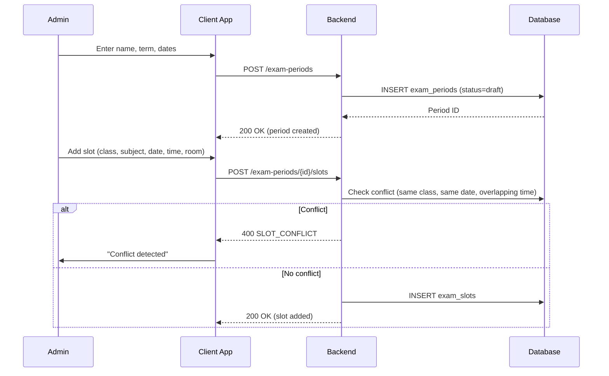
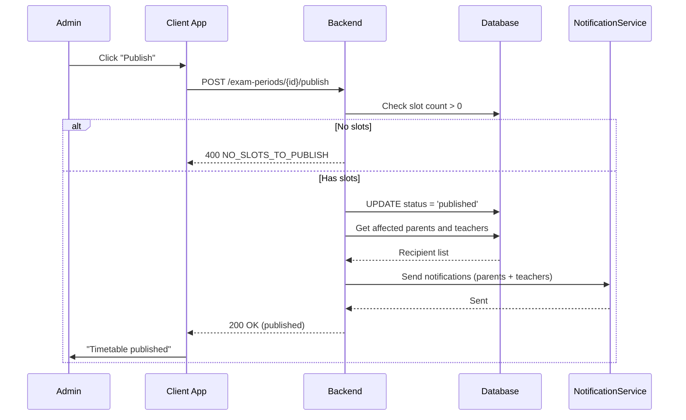
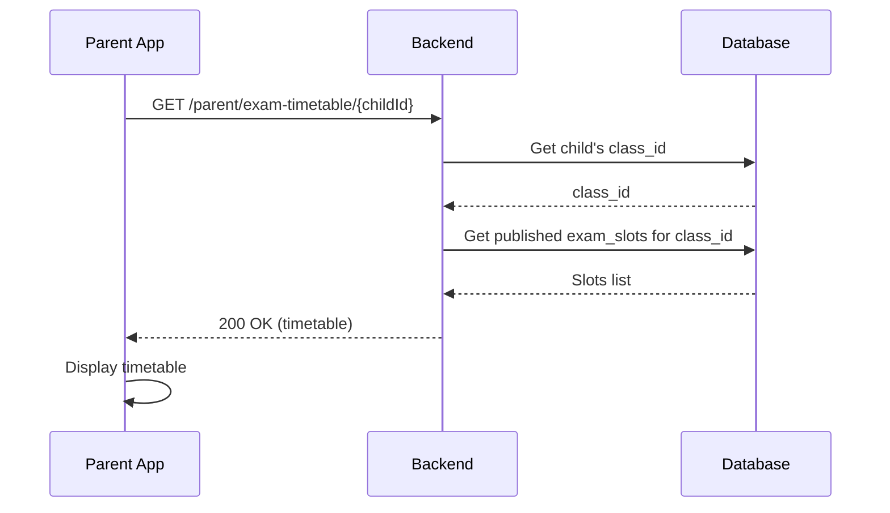
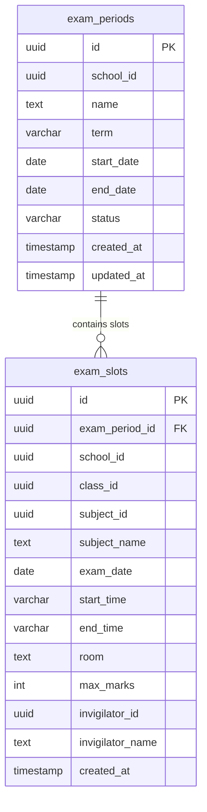

# Exam Timetable — Technical Specification

> **Document status:** Implementation-ready blueprint
> **Last updated:** 2026-06-27
> **Prerequisites:** None
> **Template:** `_SPEC_TEMPLATE.md` v1 (25 mandatory + 6 optional sections)

---

## 1. Feature Overview

Exam schedule creation and management: define exam periods, assign subjects to date/time slots per class, generate exam timetables for students and teachers, and publish notifications.

### Goals

- Admin creates exam period (e.g., "Term 1 Exams", dates, description)
- Assign subjects to specific date/time/room per class
- Generate per-student and per-teacher exam timetable
- Publish exam timetable → notification to parents and teachers
- Export as PDF

### Non-goals

- [ ] Online exam conduct (separate feature)
- [ ] Automated seating arrangement optimization
- [ ] Exam question paper management
- [ ] Exam result processing (separate feature)

### Dependencies

- `AssessmentsTable` — existing assessment data
- `SchoolClassesTable` — class definitions
- `SchoolSubjectsTable` — subject definitions
- `AppUsersTable` — teacher data for invigilator assignment
- `NotificationService` — publish notifications

### Related Modules

- `server/.../feature/assessments/` — assessment management
- `server/.../feature/notifications/` — notification service
- `shared/.../feature/exam/` — shared exam DTOs

---

## 2. Current System Assessment

### Existing Code

- `feature_audit.csv` L125: Exam Timetable missing (0%)
- `AssessmentsTable` has `assessmentName`, `type` (UNIT_TEST, MID_TERM, FINAL, QUIZ), `date` — but no structured timetable
- `SchoolClassesTable` + `SchoolSubjectsTable` exist for class/subject mapping

### Existing Database

- `AssessmentsTable` — assessments with name, type, date
- `SchoolClassesTable` — class definitions
- `SchoolSubjectsTable` — subject definitions
- `AppUsersTable` — user accounts (teachers)
- No exam timetable tables

### Existing APIs

- `GET/POST /api/v1/school/assessments` — assessment management
- `GET /api/v1/school/classes` — class management
- `GET /api/v1/school/subjects` — subject management
- No exam timetable APIs

### Existing UI

- Admin: assessment management, class management
- Parent: dashboard, assessment results
- No exam timetable UI

### Existing Services

- `AssessmentService` — assessment CRUD
- `NotificationService` — multi-channel notifications

### Existing Documentation

- `feature_audit.csv` — feature audit tracking (exam timetable at 0%)
- `DIFFERENTIATING_FEATURES.md` — exam timetable feature description

### Technical Debt

| # | Gap | Details |
|---|---|---|
| TD-1 | No exam timetable | 0% implementation |
| TD-2 | No exam period management | No structured exam period definitions |
| TD-3 | No conflict checking | No validation for double-booking classes |

### Gaps

| # | Gap | Impact | Severity |
|---|---|---|---|
| G1 | No exam periods | Cannot define structured exam schedules | **High** |
| G2 | No slot assignment | Cannot assign subjects to date/time/room | **High** |
| G3 | No timetable generation | No per-student or per-teacher view | **High** |
| G4 | No conflict check | Classes can be double-booked | **Medium** |
| G5 | No PDF export | Cannot print or share timetables | **Medium** |

---

## 3. Functional Requirements

### FR-001
| Field | Value |
|---|---|
| **Title** | Create Exam Period |
| **Description** | Admin creates exam period with name, start/end date, term |
| **Priority** | Critical |
| **User Roles** | School Admin |
| **Acceptance notes** | Exam period stored with term (term1/term2/term3/annual), dates, status=draft |

### FR-002
| Field | Value |
|---|---|
| **Title** | Assign Exam Slots |
| **Description** | Assign exam slots: class, subject, date, start_time, end_time, room, max_marks |
| **Priority** | Critical |
| **User Roles** | School Admin |
| **Acceptance notes** | Each slot has class, subject, date, time, room, max marks, optional invigilator |

### FR-003
| Field | Value |
|---|---|
| **Title** | Student Timetable |
| **Description** | Auto-generate per-student timetable (all exams for their class) |
| **Priority** | High |
| **User Roles** | Parent, Student |
| **Acceptance notes** | Parent views child's exam timetable filtered by class |

### FR-004
| Field | Value |
|---|---|
| **Title** | Teacher Timetable |
| **Description** | Auto-generate per-teacher timetable (all exams they invigilate) |
| **Priority** | High |
| **User Roles** | Teacher |
| **Acceptance notes** | Teacher views all exam slots where they are invigilator |

### FR-005
| Field | Value |
|---|---|
| **Title** | Publish Timetable |
| **Description** | Publish → notification to parents + teachers |
| **Priority** | High |
| **User Roles** | School Admin |
| **Acceptance notes** | Status changes to published; notifications sent to all affected parents and teachers |

### FR-006
| Field | Value |
|---|---|
| **Title** | PDF Export |
| **Description** | Export exam timetable as PDF |
| **Priority** | Medium |
| **User Roles** | School Admin, Parent, Teacher |
| **Acceptance notes** | PDF generated per class or per teacher |

### FR-007
| Field | Value |
|---|---|
| **Title** | Conflict Check |
| **Description** | No two exams for same class on same date/time (conflict check) |
| **Priority** | Critical |
| **User Roles** | System |
| **Acceptance notes** | Slot creation rejected if same class has overlapping date/time |

---

## 4. User Stories

### School Admin
- [ ] Create an exam period (e.g., "Term 1 Final Exams")
- [ ] Assign exam slots for each class with subject, date, time, room
- [ ] Assign invigilators to exam slots
- [ ] Check for scheduling conflicts
- [ ] Publish exam timetable
- [ ] Export exam timetable as PDF

### Parent
- [ ] View my child's exam timetable
- [ ] Get notified when exam timetable is published
- [ ] Download exam timetable as PDF

### Teacher
- [ ] View my invigilation schedule
- [ ] Get notified when exam timetable is published
- [ ] Download my invigilation timetable as PDF

### System
- [ ] Check for conflicts when slots are assigned
- [ ] Send notifications on publish
- [ ] Generate PDF on demand

---

## 5. Business Rules

### BR-001
**Rule:** Exam period has a status: draft or published.
**Enforcement:** `exam_periods.status` = `draft` or `published`. Only draft can be edited.

### BR-002
**Rule:** No two exams for the same class on the same date with overlapping time.
**Enforcement:** On slot creation, check existing slots for same `class_id` and `exam_date` with overlapping time range.

### BR-003
**Rule:** Exam period must have at least one slot before publishing.
**Enforcement:** Check slot count before allowing publish.

### BR-004
**Rule:** Published exam periods cannot be edited (only viewed).
**Enforcement:** Reject slot additions/modifications if period status = published.

### BR-005
**Rule:** Exam period dates must be valid (start_date <= end_date).
**Enforcement:** Validated on creation.

### BR-006
**Rule:** One invigilator per exam slot (optional).
**Enforcement:** `invigilator_id` is nullable; one teacher per slot.

---

## 6. Database Design

### 6.1 Entity Relationship Summary

Two new tables: `exam_periods` (exam period definitions) and `exam_slots` (individual exam slots per class/subject/date/time). Periods have many slots (CASCADE delete).

### 6.2 New Tables

```sql
CREATE TABLE exam_periods (
    id              UUID PRIMARY KEY DEFAULT gen_random_uuid(),
    school_id       UUID NOT NULL,
    name            TEXT NOT NULL,                 -- "Term 1 Final Exams"
    term            VARCHAR(16) NOT NULL,          -- term1 | term2 | term3 | annual
    start_date      DATE NOT NULL,
    end_date        DATE NOT NULL,
    status          VARCHAR(16) NOT NULL DEFAULT 'draft', -- draft | published
    created_at      TIMESTAMP NOT NULL DEFAULT now(),
    updated_at      TIMESTAMP NOT NULL DEFAULT now()
);

CREATE TABLE exam_slots (
    id              UUID PRIMARY KEY DEFAULT gen_random_uuid(),
    exam_period_id  UUID NOT NULL REFERENCES exam_periods(id) ON DELETE CASCADE,
    school_id       UUID NOT NULL,
    class_id        UUID NOT NULL,
    subject_id      UUID,
    subject_name    TEXT NOT NULL,
    exam_date       DATE NOT NULL,
    start_time      VARCHAR(8) NOT NULL,           -- "09:00"
    end_time        VARCHAR(8) NOT NULL,           -- "12:00"
    room            TEXT,
    max_marks       INTEGER NOT NULL DEFAULT 100,
    invigilator_id  UUID,                          -- FK app_users.id (teacher)
    invigilator_name TEXT,
    created_at      TIMESTAMP NOT NULL DEFAULT now()
);
CREATE INDEX idx_exam_slots_class_date ON exam_slots(class_id, exam_date);
CREATE INDEX idx_exam_slots_period ON exam_slots(exam_period_id);
```

### 6.3 Modified Tables

N/A — no existing tables modified.

### 6.4 Indexes

```sql
CREATE INDEX idx_exam_slots_class_date ON exam_slots(class_id, exam_date);
CREATE INDEX idx_exam_slots_period ON exam_slots(exam_period_id);
CREATE INDEX idx_exam_slots_invigilator ON exam_slots(invigilator_id, exam_date);
CREATE INDEX idx_exam_periods_school ON exam_periods(school_id, status);
```

### 6.5 Constraints

- `exam_periods.school_id` — NOT NULL
- `exam_periods.name` — NOT NULL
- `exam_periods.term` — NOT NULL, one of term1, term2, term3, annual
- `exam_periods.start_date` — NOT NULL, must be <= end_date
- `exam_slots.exam_period_id` — NOT NULL, FK
- `exam_slots.class_id` — NOT NULL
- `exam_slots.subject_name` — NOT NULL
- `exam_slots.exam_date` — NOT NULL
- `exam_slots.start_time` / `end_time` — NOT NULL
- `exam_slots.max_marks` — NOT NULL, default 100

### 6.6 Foreign Keys

- `exam_slots.exam_period_id` → `exam_periods.id` (ON DELETE CASCADE)
- `exam_slots.invigilator_id` → `app_users.id` (nullable, no cascade)

### 6.7 Soft Delete Strategy

- No soft delete — exam periods deleted via hard delete (CASCADE removes slots)
- Published periods can be archived (future enhancement)

### 6.8 Audit Fields

- `created_at` — creation timestamp (both tables)
- `updated_at` — last update timestamp (exam_periods only)

### 6.9 Migration Notes

Migration: `docs/db/migration_057_exam_timetable.sql`
- Creates 2 exam timetable tables with indexes
- No data backfill needed (new feature)

### 6.10 Exposed Mappings

```kotlin
object ExamPeriodsTable : UUIDTable("exam_periods", "id") {
    val schoolId  = uuid("school_id")
    val name      = text("name")
    val term      = varchar("term", 16) // term1 | term2 | term3 | annual
    val startDate = date("start_date")
    val endDate   = date("end_date")
    val status    = varchar("status", 16).default("draft") // draft | published
    val createdAt = timestamp("created_at")
    val updatedAt = timestamp("updated_at")
    init {
        index("idx_exam_periods_school", false, schoolId, status)
    }
}

object ExamSlotsTable : UUIDTable("exam_slots", "id") {
    val examPeriodId    = uuid("exam_period_id")
    val schoolId        = uuid("school_id")
    val classId         = uuid("class_id")
    val subjectId       = uuid("subject_id").nullable()
    val subjectName     = text("subject_name")
    val examDate        = date("exam_date")
    val startTime       = varchar("start_time", 8)
    val endTime         = varchar("end_time", 8)
    val room            = text("room").nullable()
    val maxMarks        = integer("max_marks").default(100)
    val invigilatorId   = uuid("invigilator_id").nullable()
    val invigilatorName = text("invigilator_name").nullable()
    val createdAt       = timestamp("created_at")
    init {
        index("idx_exam_slots_class_date", false, classId, examDate)
        index("idx_exam_slots_period", false, examPeriodId)
        index("idx_exam_slots_invigilator", false, invigilatorId, examDate)
    }
}
```

### 6.11 Seed Data

N/A — exam periods and slots created by admin.

---

## 7. State Machines

### Exam Period Status State Machine

```
DRAFT ──admin_publishes──> PUBLISHED
DRAFT ──admin_deletes──> DELETED (CASCADE)
PUBLISHED ──admin_creates_new_version──> DRAFT (new period)
```

| Current State | Event | Next State | Guard / Condition |
|---|---|---|---|
| `draft` | Admin publishes | `published` | Has at least 1 slot |
| `draft` | Admin adds/modifies slots | `draft` | — |
| `draft` | Admin deletes | `deleted` | CASCADE removes slots |
| `published` | Admin views | `published` | Read-only |
| `published` | Admin creates new period | `draft` (new) | New period for next term |

### Conflict Check Flow

```
SLOT_CREATE ──check_conflicts──> NO_CONFLICT ──insert──> COMPLETE
SLOT_CREATE ──check_conflicts──> CONFLICT ──reject──> FAILED
```

| Step | Action | Condition |
|---|---|---|
| 1 | Admin creates slot | class_id, exam_date, start_time, end_time |
| 2 | Query existing slots | same class_id, same exam_date |
| 3 | Check time overlap | new.start_time < existing.end_time AND new.end_time > existing.start_time |
| 4 | If overlap | Reject with CONFLICT error |
| 5 | If no overlap | Insert slot |

---

## 8. Backend Architecture

### 8.1 Component Overview

`ExamTimetableService` handles exam period CRUD, slot management, conflict checking, timetable generation, and publish. PDF generation via existing PDF utility.

### 8.2 Design Principles

1. **Draft before publish** — periods start as draft, editable until published
2. **Conflict prevention** — check for class double-booking on slot creation
3. **Auto-generation** — student and teacher timetables generated from slots
4. **Cascade delete** — deleting period removes all slots
5. **PDF on demand** — generated when requested, not stored

### 8.3 Core Types

```kotlin
class ExamTimetableService {
    suspend fun createPeriod(period: ExamPeriodDto): UUID
    suspend fun updatePeriod(id: UUID, period: ExamPeriodDto): Unit
    suspend fun deletePeriod(id: UUID): Unit
    suspend fun getPeriods(schoolId: UUID): List<ExamPeriodDto>
    suspend fun getPeriod(id: UUID): ExamPeriodDto?
    suspend fun addSlot(slot: ExamSlotDto): UUID
    suspend fun updateSlot(id: UUID, slot: ExamSlotDto): Unit
    suspend fun deleteSlot(id: UUID): Unit
    suspend fun getTimetableByClass(periodId: UUID, classId: UUID): List<ExamSlotDto>
    suspend fun getTimetableByTeacher(periodId: UUID, teacherId: UUID): List<ExamSlotDto>
    suspend fun getTimetableByStudent(periodId: UUID, studentId: UUID): List<ExamSlotDto>
    suspend fun publishPeriod(id: UUID): Unit
    suspend fun checkConflict(slot: ExamSlotDto): Boolean
    suspend fun generatePdf(periodId: UUID, classId: UUID?): ByteArray
}
```

### 8.4 Repositories

- `ExamPeriodRepository` — CRUD for exam periods
- `ExamSlotRepository` — CRUD for exam slots, conflict queries, timetable queries

### 8.5 Mappers

- `ExamPeriodMapper` — maps period DB rows to DTOs
- `ExamSlotMapper` — maps slot DB rows to DTOs

### 8.6 Permission Checks

- Period/slot management: school admin only
- Publish: school admin only
- Student timetable: parent (own child only)
- Teacher timetable: teacher (own schedule only)
- PDF export: school admin, parent (own child), teacher (own schedule)

### 8.7 Background Jobs

N/A — no background jobs needed. PDF generation is synchronous.

### 8.8 Domain Events

- `ExamPeriodCreated` — emitted when period created
- `ExamPeriodPublished` — emitted when period published (triggers notifications)
- `ExamSlotAdded` — emitted when slot added
- `ExamSlotUpdated` — emitted when slot modified
- `ExamSlotDeleted` — emitted when slot removed
- `ExamTimetablePdfGenerated` — emitted when PDF generated

### 8.9 Caching

- Published period timetables cached for 1 hour (immutable after publish)
- Draft period data not cached (changes frequently)

### 8.10 Transactions

- Slot creation: conflict check + INSERT in transaction
- Period publish: UPDATE status + send notifications (notifications async)
- Period delete: DELETE period (CASCADE removes slots)

### 8.11 Rate Limiting

- Standard API rate limiting
- PDF generation: limited to 10 per minute per user (resource intensive)

### 8.12 Configuration

- `EXAM_TIMETABLE_PDF_PAGE_SIZE` — default `A4`
- `EXAM_TIMETABLE_MAX_SLOTS` — default `500` (max slots per period)

---

## 9. API Contracts

### 9.1 Admin APIs

```
GET/POST /api/v1/school/exam-periods
POST /api/v1/school/exam-periods/{id}/slots
GET /api/v1/school/exam-periods/{id}/timetable?class_id={uuid}
POST /api/v1/school/exam-periods/{id}/publish
GET /api/v1/school/exam-periods/{id}/pdf
```

### 9.2 Parent APIs

```
GET /api/v1/parent/exam-timetable/{childId}
```

### 9.3 Teacher APIs

```
GET /api/v1/teacher/exam-timetable
```

### 9.4 Example Responses

**Create Exam Period Response 200:**
```json
{
  "success": true,
  "data": {
    "id": "uuid",
    "name": "Term 1 Final Exams",
    "term": "term1",
    "start_date": "2026-07-01",
    "end_date": "2026-07-15",
    "status": "draft"
  }
}
```

**Student Timetable Response 200:**
```json
{
  "success": true,
  "data": {
    "period_name": "Term 1 Final Exams",
    "slots": [
      {"subject_name": "Mathematics", "exam_date": "2026-07-01", "start_time": "09:00", "end_time": "12:00", "room": "Hall A", "max_marks": 100},
      {"subject_name": "Science", "exam_date": "2026-07-03", "start_time": "09:00", "end_time": "12:00", "room": "Hall A", "max_marks": 100}
    ]
  }
}
```

**Conflict Error Response 400:**
```json
{
  "success": false,
  "error": {
    "code": "SLOT_CONFLICT",
    "message": "Class already has an exam on this date and time"
  }
}
```

---

## 10. Frontend Architecture

### 10.1 Screens

| Screen | Platform | Role | Description |
|---|---|---|---|
| `ExamPeriodListScreen` | All | Admin | List of exam periods |
| `ExamPeriodCreateScreen` | All | Admin | Create new exam period |
| `ExamSlotAssignmentScreen` | All | Admin | Assign slots per class/subject |
| `ExamTimetableViewScreen` | All | Admin, Parent, Teacher | View timetable (class/teacher/student) |
| `ParentExamTimetableScreen` | All | Parent | View child's exam timetable |

### 10.2 Navigation

- Admin portal → Exams → Periods → `ExamPeriodListScreen`
- Admin portal → Exams → New Period → `ExamPeriodCreateScreen`
- Admin portal → Exams → {period} → Slots → `ExamSlotAssignmentScreen`
- Admin portal → Exams → {period} → Timetable → `ExamTimetableViewScreen`
- Parent portal → Exams → `ParentExamTimetableScreen`
- Teacher portal → Exams → `ExamTimetableViewScreen`

### 10.3 UX Flows

#### Admin: Create Exam Period and Assign Slots

1. Admin opens Exams → New Period
2. Enters name, term, start/end dates
3. Saves period (status = draft)
4. Opens slot assignment
5. For each class: select subject, date, start/end time, room, max marks, invigilator
6. System checks for conflicts on save
7. If conflict: error shown, admin adjusts
8. If no conflict: slot saved
9. Admin reviews full timetable
10. Admin clicks Publish → notifications sent

#### Parent: View Exam Timetable

1. Parent opens Exams
2. Selects exam period
3. Views child's exam timetable (sorted by date)
4. Downloads PDF if needed

#### Teacher: View Invigilation Schedule

1. Teacher opens Exams
2. Selects exam period
3. Views invigilation schedule (slots where they are invigilator)
4. Downloads PDF if needed

### 10.4 State Management

```kotlin
data class ExamTimetableState(
    val periods: List<ExamPeriodDto>,
    val currentPeriod: ExamPeriodDto?,
    val slots: List<ExamSlotDto>,
    val timetable: List<ExamSlotDto>,
    val isLoading: Boolean,
    val error: String?,
)
```

### 10.5 Offline Support

- Published timetables cached locally for offline viewing
- Slot assignment requires network
- PDF cached after download

### 10.6 Loading States

- Loading periods: "Loading exam periods..."
- Loading timetable: "Loading exam timetable..."
- Publishing: "Publishing exam timetable..."
- Generating PDF: "Generating PDF..."

### 10.7 Error Handling (UI)

- Conflict: "This class already has an exam at this date and time."
- No slots: "Add at least one exam slot before publishing."
- Published period edit: "Cannot edit a published exam period."
- No timetable: "No exam timetable available yet."

### 10.8 Component Integration Guidelines

| Rule | Description |
|---|---|
| **R1** | Period list with status badge (draft=yellow, published=green) |
| **R2** | Slot assignment form with class, subject, date, time, room, invigilator |
| **R3** | Conflict warning on slot save |
| **R4** | Timetable view as table (date | subject | time | room | marks) |
| **R5** | Publish button only for draft periods with slots |
| **R6** | PDF download button on timetable view |
| **R7** | Parent timetable filtered by child's class |
| **R8** | Teacher timetable filtered by invigilator_id |

---

## 11. Shared Module Changes (KMP)

### 11.1 DTOs

```kotlin
data class ExamPeriodDto(
    val id: UUID,
    val schoolId: UUID,
    val name: String,
    val term: String, // term1 | term2 | term3 | annual
    val startDate: LocalDate,
    val endDate: LocalDate,
    val status: String, // draft | published
    val slotCount: Int,
    val createdAt: Instant,
)

data class ExamSlotDto(
    val id: UUID,
    val examPeriodId: UUID,
    val classId: UUID,
    val subjectId: UUID?,
    val subjectName: String,
    val examDate: LocalDate,
    val startTime: String,
    val endTime: String,
    val room: String?,
    val maxMarks: Int,
    val invigilatorId: UUID?,
    val invigilatorName: String?,
)

data class ExamTimetableDto(
    val periodName: String,
    val slots: List<ExamSlotDto>,
)
```

### 11.2 Domain Models

```kotlin
data class ExamPeriod(
    val id: UUID,
    val schoolId: UUID,
    val name: String,
    val term: String,
    val startDate: LocalDate,
    val endDate: LocalDate,
    val status: String,
    val slots: List<ExamSlot>,
)

data class ExamSlot(
    val id: UUID,
    val examPeriodId: UUID,
    val classId: UUID,
    val subjectName: String,
    val examDate: LocalDate,
    val startTime: String,
    val endTime: String,
    val room: String?,
    val maxMarks: Int,
    val invigilatorName: String?,
)
```

### 11.3 Repository Interfaces

```kotlin
interface ExamPeriodRepository {
    suspend fun create(period: ExamPeriodEntity): UUID
    suspend fun update(id: UUID, period: ExamPeriodEntity): Unit
    suspend fun delete(id: UUID): Unit
    suspend fun getBySchool(schoolId: UUID): List<ExamPeriodDto>
    suspend fun getById(id: UUID): ExamPeriodDto?
    suspend fun publish(id: UUID): Unit
}

interface ExamSlotRepository {
    suspend fun create(slot: ExamSlotEntity): UUID
    suspend fun update(id: UUID, slot: ExamSlotEntity): Unit
    suspend fun delete(id: UUID): Unit
    suspend fun getByPeriod(periodId: UUID): List<ExamSlotDto>
    suspend fun getByClass(periodId: UUID, classId: UUID): List<ExamSlotDto>
    suspend fun getByTeacher(periodId: UUID, teacherId: UUID): List<ExamSlotDto>
    suspend fun checkConflict(classId: UUID, examDate: LocalDate, startTime: String, endTime: String): Boolean
}
```

### 11.4 UseCases

- `CreateExamPeriodUseCase`
- `UpdateExamPeriodUseCase`
- `DeleteExamPeriodUseCase`
- `AddExamSlotUseCase`
- `UpdateExamSlotUseCase`
- `DeleteExamSlotUseCase`
- `GetStudentTimetableUseCase`
- `GetTeacherTimetableUseCase`
- `PublishExamPeriodUseCase`
- `GenerateExamPdfUseCase`

### 11.5 Validation

- Period name: not empty
- Term: one of term1, term2, term3, annual
- Start date <= end date
- Slot: class_id, subject_name, exam_date, start_time, end_time required
- Start time < end time
- Max marks: positive integer
- Conflict check: no overlapping slots for same class and date

### 11.6 Serialization

Standard Kotlinx serialization for DTOs.

### 11.7 Network APIs

Added to `ExamTimetableApi.kt`:
- `GET/POST /api/v1/school/exam-periods` — period CRUD
- `POST /api/v1/school/exam-periods/{id}/slots` — slot management
- `GET /api/v1/school/exam-periods/{id}/timetable?class_id={uuid}` — timetable view
- `POST /api/v1/school/exam-periods/{id}/publish` — publish
- `GET /api/v1/school/exam-periods/{id}/pdf` — PDF export
- `GET /api/v1/parent/exam-timetable/{childId}` — parent view
- `GET /api/v1/teacher/exam-timetable` — teacher view

### 11.8 Database Models (Local Cache)

- Published timetables cached locally
- Period list cached locally

---

## 12. Permissions Matrix

| Action | Super Admin | School Admin | Teacher | Parent |
|---|---|---|---|---|
| Create/edit/delete exam periods | ✅ | ✅ | ❌ | ❌ |
| Assign exam slots | ✅ | ✅ | ❌ | ❌ |
| Publish timetable | ✅ | ✅ | ❌ | ❌ |
| View admin timetable | ✅ | ✅ | ❌ | ❌ |
| View student timetable | ✅ | ✅ | ✅ (own class) | ✅ (own child) |
| View teacher timetable | ✅ | ✅ | ✅ (own) | ❌ |
| Export PDF | ✅ | ✅ | ✅ (own) | ✅ (own child) |

---

## 13. Notifications

### Exam Timetable Notifications

| Type | Trigger | Channel | Message |
|---|---|---|---|
| Timetable Published (Parent) | Admin publishes period | Push + In-app (parent) | "Exam timetable for {period_name} has been published. Tap to view." |
| Timetable Published (Teacher) | Admin publishes period | Push + In-app (teacher) | "Exam invigilation schedule for {period_name} has been published. Tap to view." |
| Slot Conflict | System detects conflict | In-app (admin) | "Conflict detected: {class} already has exam on {date} at {time}." |

---

## 14. Background Jobs

N/A — no background jobs needed for exam timetable. All operations are synchronous. PDF generation is on-demand.

---

## 15. Integrations

### AssessmentsTable
| Field | Value |
|---|---|
| **System** | Existing assessment management |
| **Purpose** | Reference for exam types and dates |
| **API / SDK** | Direct DB query |
| **Auth method** | Internal |
| **Fallback** | None — reference data |

### SchoolClassesTable
| Field | Value |
|---|---|
| **System** | Existing class management |
| **Purpose** | Class definitions for slot assignment |
| **API / SDK** | Direct DB query |
| **Auth method** | Internal |
| **Fallback** | None — class data required |

### SchoolSubjectsTable
| Field | Value |
|---|---|
| **System** | Existing subject management |
| **Purpose** | Subject definitions for slot assignment |
| **API / SDK** | Direct DB query |
| **Auth method** | Internal |
| **Fallback** | None — subject data required |

### AppUsersTable
| Field | Value |
|---|---|
| **System** | Existing user management |
| **Purpose** | Teacher data for invigilator assignment |
| **API / SDK** | Direct DB query |
| **Auth method** | Internal |
| **Fallback** | None — teacher data required |

### NotificationService
| Field | Value |
|---|---|
| **System** | Existing notification infrastructure |
| **Purpose** | Publish notifications to parents and teachers |
| **API / SDK** | Internal `NotificationService` |
| **Auth method** | Internal service call |
| **Fallback** | In-app notification if push fails |

### PDF Generation
| Field | Value |
|---|---|
| **System** | Existing PDF utility |
| **Purpose** | Generate exam timetable PDFs |
| **API / SDK** | Internal PDF generator |
| **Auth method** | Internal |
| **Fallback** | None — PDF generation is core feature |

---

## 16. Security

### Authentication
- Admin APIs: JWT with school admin role
- Parent APIs: JWT with parent role
- Teacher APIs: JWT with teacher role

### Authorization
- Period/slot management: school admin only
- Publish: school admin only
- Student timetable: parent (own child only), teacher (own class)
- Teacher timetable: teacher (own schedule only)
- PDF export: school admin, parent (own child), teacher (own schedule)

### Encryption
- All API communication over TLS

### Audit Logs
- Period creation logged (name, term, dates)
- Period publish logged (id, publishedBy, recipientCount)
- Slot creation logged (periodId, classId, subjectName, date)
- Slot modification logged (id, fieldsChanged)
- Slot deletion logged (id)
- PDF generation logged (periodId, classId, requestedBy)

### PII Handling
- Student timetable shows exam schedule (non-sensitive)
- Teacher invigilator name stored in slots (non-sensitive)
- Parent receives child's exam schedule (own child only)

### Data Isolation
- All queries filtered by `school_id` from JWT
- Parent queries filtered by child_id (verified parent-child relationship)
- Teacher queries filtered by invigilator_id (own user ID)

### Rate Limiting
- Standard API rate limiting
- PDF generation: 10 per minute per user

### Input Validation
- Period name: not empty
- Term: one of term1, term2, term3, annual
- Start date <= end date
- Slot: class_id, subject_name, exam_date, start_time, end_time required
- Start time < end time
- Max marks: positive integer
- Conflict check: no overlapping slots

---

## 17. Performance & Scalability

### Expected Scale

| Metric | Small school | Medium school | Large school |
|---|---|---|---|
| Exam periods per year | ~4 | ~4 | ~4 |
| Slots per period | ~50 | ~200 | ~500 |
| Classes | ~10 | ~30 | ~60 |
| Subjects per class | ~6 | ~8 | ~10 |
| Concurrent timetable views | ~50 | ~500 | ~2,000 |

### Latency Targets

| Operation | Target |
|---|---|
| Create period | < 100ms |
| Add slot (with conflict check) | < 100ms |
| Get timetable by class | < 100ms |
| Get timetable by teacher | < 100ms |
| Publish period | < 500ms (including notification dispatch) |
| Generate PDF | < 2s |

### Optimization Strategy

- Slots indexed by (class_id, exam_date) for conflict check
- Slots indexed by (exam_period_id) for timetable query
- Slots indexed by (invigilator_id, exam_date) for teacher timetable
- Published timetables cached for 1 hour
- PDF generated on demand (not stored)

---

## 18. Edge Cases

| # | Scenario | Expected Behavior |
|---|---|---|
| EC-001 | Two slots for same class at same date/time | Rejected: "Slot conflict" |
| EC-002 | Publish period with no slots | Rejected: "Add at least one slot before publishing" |
| EC-003 | Edit published period | Rejected: "Cannot edit published period" |
| EC-004 | Slot date outside period date range | Rejected: "Exam date must be within period dates" |
| EC-005 | Start time >= end time | Rejected: "Start time must be before end time" |
| EC-006 | No invigilator assigned | Allowed (optional field) |
| EC-007 | Same invigilator for overlapping slots | Warning shown (not blocked) |
| EC-008 | Parent views timetable for unpublished period | Empty result with "Not yet published" message |

### Risks & Mitigations

| Risk | Likelihood | Impact | Mitigation |
|---|---|---|---|
| Invigilator double-booking | Medium | Low | Warning shown; admin resolves |
| PDF generation slow | Low | Medium | 2s target; rate limited |
| Large period (500+ slots) | Low | Low | Indexed queries; pagination |
| Publish to many recipients | Medium | Medium | Async notification dispatch |

---

## 19. Error Handling

### Standard Error Codes

| HTTP | Error Code | Description | When |
|---|---|---|---|
| 400 | `SLOT_CONFLICT` | Class has overlapping exam at same date/time | Add/update slot |
| 400 | `NO_SLOTS_TO_PUBLISH` | Period has no slots | Publish |
| 400 | `PERIOD_ALREADY_PUBLISHED` | Attempting to edit published period | Update period/slot |
| 400 | `INVALID_DATE_RANGE` | Slot date outside period dates | Add/update slot |
| 400 | `INVALID_TIME_RANGE` | Start time >= end time | Add/update slot |
| 400 | `INVALID_TERM` | Term not one of term1/term2/term3/annual | Create period |
| 403 | `INSUFFICIENT_PERMISSIONS` | Unauthorized role | Any endpoint |
| 404 | `PERIOD_NOT_FOUND` | Exam period does not exist | Any period endpoint |
| 404 | `SLOT_NOT_FOUND` | Exam slot does not exist | Update/delete slot |

### Error Response Format

Same as existing API error format.

### Recovery Strategy

| Error | Client Action | Server Action |
|---|---|---|
| `SLOT_CONFLICT` | Show "This class already has an exam at this date and time." | Return 400 |
| `NO_SLOTS_TO_PUBLISH` | Show "Add at least one exam slot before publishing." | Return 400 |
| `PERIOD_ALREADY_PUBLISHED` | Show "Cannot edit a published exam period." | Return 400 |

---

## 20. Analytics & Reporting

### Reports

- **Exam Schedule Report:** Full exam timetable per period
- **Class-wise Exam Report:** Exams per class per period
- **Teacher Invigilation Report:** Invigilation load per teacher
- **Room Utilization Report:** Room usage during exam period
- **Conflict Report:** Detected and resolved conflicts

### KPIs

- **Total Exam Periods:** Number of exam periods per year
- **Average Slots per Period:** Mean slot count
- **Publish Lead Time:** Days between publish and first exam
- **Invigilation Coverage:** % of slots with assigned invigilators
- **PDF Export Count:** Number of PDFs generated per period

### Dashboards

- Admin: exam period overview with status and slot count
- Admin: class-wise exam schedule view
- Teacher: invigilation schedule view

### Exports

- Exam timetable PDF (per class, per teacher, per student)
- Exam schedule CSV export
- Invigilation schedule CSV export

---

## 21. Testing Strategy

### Unit Tests

| Test | What it verifies |
|---|---|
| Create exam period | Period stored with correct fields |
| Create slot | Slot stored with conflict check |
| Conflict detection | Overlapping slots rejected |
| No conflict | Non-overlapping slots accepted |
| Publish period | Status changes to published; notifications sent |
| Publish with no slots | Rejected with error |
| Edit published period | Rejected with error |
| Date range validation | Slot date outside period rejected |
| Time range validation | Start >= end rejected |
| Timetable by class | Correct slots returned for class |
| Timetable by teacher | Correct slots returned for invigilator |

### Integration Tests

| Test | What it verifies |
|---|---|
| Create period → add slots → publish → notifications sent | Full lifecycle |
| Create period → add conflicting slot → rejected | Conflict flow |
| Parent views child timetable → correct slots shown | Parent view |
| Teacher views invigilation schedule → correct slots shown | Teacher view |
| Generate PDF → valid PDF returned | PDF generation |

### Performance Tests

- [ ] Conflict check < 50ms with 500 slots
- [ ] Timetable query < 100ms with 500 slots
- [ ] PDF generation < 2s with 200 slots
- [ ] Publish with 2,000 notifications < 5s

### Security Tests

- [ ] Non-admin cannot manage periods
- [ ] Parent can only see own child's timetable
- [ ] Teacher can only see own invigilation schedule
- [ ] All admin queries school-scoped

### Migration Tests

- [ ] Migration creates 2 tables with correct schema
- [ ] Indexes created correctly
- [ ] CASCADE delete works (period → slots)

---

## 22. Acceptance Criteria

- [ ] Admin creates exam period and assigns exam slots
- [ ] Conflict check prevents same class double-booked
- [ ] Per-student and per-teacher timetables generated
- [ ] Publish sends notifications
- [ ] PDF export works

---

## 23. Implementation Roadmap

| Phase | Duration | Tasks | Breaking? | Deliverable |
|---|---|---|---|---|
| 1 | 1 day | DB migration, Exposed tables | No | Schema ready |
| 2 | 2 days | ExamTimetableService + conflict checker | No | Service ready |
| 3 | 1 day | API endpoints + PDF generation | No | API available |
| 4 | 2 days | Client UI (exam period creation, slot assignment, timetable view) | No | UI ready |
| 5 | 1 day | Tests | No | Test coverage |

**Total: ~7 days**

---

## 24. File-Level Impact Analysis

### New Files

| File | Location | Purpose |
|---|---|---|
| `ExamTimetableService.kt` | `server/.../feature/exam/` | Core service |
| `ExamTimetableRouting.kt` | `server/.../feature/exam/` | API endpoints |
| `migration_057_exam_timetable.sql` | `docs/db/` | DDL migration |
| `ExamTimetableApi.kt` | `shared/.../feature/exam/` | Client API |
| `ExamTimetableDtos.kt` | `shared/.../feature/exam/` | DTOs |
| `ExamTimetableViewModel.kt` | `shared/.../feature/exam/` | ViewModel |
| `ExamPeriodListScreen.kt` | `composeApp/.../ui/v2/screens/admin/` | Admin period list |
| `ExamPeriodCreateScreen.kt` | `composeApp/.../ui/v2/screens/admin/` | Admin period create |
| `ExamSlotAssignmentScreen.kt` | `composeApp/.../ui/v2/screens/admin/` | Admin slot assignment |
| `ExamTimetableViewScreen.kt` | `composeApp/.../ui/v2/screens/common/` | Timetable view (admin/teacher) |
| `ParentExamTimetableScreen.kt` | `composeApp/.../ui/v2/screens/parent/` | Parent view |

### Modified Files

| File | Change Type | Lines Changed (est.) | Risk | Description |
|---|---|---|---|---|
| `server/.../db/Tables.kt` | Add | ~40 | Low | 2 new exam timetable table objects |
| `server/.../db/DatabaseFactory.kt` | Modify | ~4 | Low | Register 2 tables |

### Files Preserved Unchanged

| File | Reason |
|---|---|
| `AssessmentsTable` | Read-only reference |
| `SchoolClassesTable` | Read-only reference |
| `SchoolSubjectsTable` | Read-only reference |
| `NotificationService` | Used as-is for notifications |

---

## 25. Future Enhancements

### Automated Seating Arrangement

- Auto-assign seats based on room capacity
- Roll number-based seating
- Seating chart PDF generation
- Room-wise seating layout

### Exam Question Paper Management

- Upload question papers per exam slot
- Secure storage with access control
- Question paper distribution to invigilators
- Print-ready question paper PDFs

### Online Exam Integration

- Link exam timetable to online exam platform
- Auto-create online exam slots from timetable
- Online exam URL in timetable
- Online exam status tracking

### Exam Result Processing

- Enter marks per exam slot
- Grade calculation
- Result publication
- Report card generation

### Exam Attendance Tracking

- Mark student attendance per exam
- Absentee tracking
- Parent notification for absent students
- Exam attendance reports

### Exam Hall Ticket Generation

- Digital hall tickets with QR code
- Student photo on hall ticket
- Seat number and room details
- Printable PDF hall tickets

### Automated Reminders

- Exam day reminders to parents and students
- Previous day evening reminder
- Room and seat details in reminder
- Multi-channel reminders (push, WhatsApp, email)

### Exam Schedule Templates

- Pre-defined exam schedule templates
- Quick-create from template
- Template library management
- Custom template creation

### Conflict Resolution Suggestions

- Auto-suggest alternative slots on conflict
- Available date/time recommendations
- Room availability check
- Teacher availability check

### Exam Analytics

- Pass rate per subject
- Class performance comparison
- Subject-wise difficulty analysis
- Historical exam performance trends

---

## A. Sequence Diagrams

### Create Exam Period and Assign Slots Flow



### Publish Exam Timetable Flow



### Parent Views Child Timetable Flow



---

## B. Domain Model / ER Diagram



---

## C. Event Flow

```
PeriodCreated -> Complete
SlotAdded -> CheckConflict -> NoConflict -> Complete
SlotAdded -> CheckConflict -> Conflict -> Failed
PeriodPublished -> SendNotifications -> Complete
SlotUpdated -> Complete
SlotDeleted -> Complete
PdfGenerated -> Complete
```

| Event | Emitted By | Consumed By | Side Effect |
|---|---|---|---|
| `ExamPeriodCreated` | `ExamTimetableService.createPeriod()` | Analytics | Counter incremented |
| `ExamPeriodPublished` | `ExamTimetableService.publishPeriod()` | Notification | Parents + teachers notified |
| `ExamSlotAdded` | `ExamTimetableService.addSlot()` | Analytics | Counter incremented |
| `ExamSlotUpdated` | `ExamTimetableService.updateSlot()` | Analytics | Counter incremented |
| `ExamSlotDeleted` | `ExamTimetableService.deleteSlot()` | Analytics | Counter incremented |
| `ExamTimetablePdfGenerated` | `ExamTimetableService.generatePdf()` | Analytics | Counter incremented |

---

## D. Configuration

### Environment Variables

| Variable | Description |
|---|---|
| `EXAM_TIMETABLE_ENABLED` | Enable/disable feature (default: `true`) |
| `EXAM_TIMETABLE_PDF_PAGE_SIZE` | PDF page size (default: `A4`) |
| `EXAM_TIMETABLE_MAX_SLOTS` | Max slots per period (default: `500`) |
| `EXAM_TIMETABLE_PDF_RATE_LIMIT` | PDF gen rate limit per minute (default: `10`) |

### Feature Flags

| Flag | Default | Description |
|---|---|---|
| `exam_timetable_enabled` | `true` | Master switch for exam timetable |
| `exam_timetable_pdf_export` | `true` | Enable PDF export |
| `exam_timetable_invigilator_assign` | `true` | Enable invigilator assignment |

### Client-Side Configuration

| Config | Default | Description |
|---|---|---|
| Period list page size | 20 | Periods per page |
| Timetable sort | by date | Default sort order |
| PDF cache duration | 24 hours | Cached PDF validity |

### Server-Side Configuration

| Config | Default | Description |
|---|---|---|
| Max slots per period | 500 | Slot limit |
| PDF rate limit | 10/min | PDF generation limit |
| Timetable cache TTL | 1 hour | Published timetable cache |
| PDF page size | A4 | PDF page format |

### Infrastructure Requirements

- PostgreSQL with DATE and VARCHAR support
- PDF generation library (existing)
- Standard notification infrastructure

---

## E. Migration & Rollback

### Deployment Plan

1. [ ] Run `migration_057_exam_timetable.sql` — creates 2 tables + indexes
2. [ ] Deploy 2 exam timetable table objects in `Tables.kt`
3. [ ] Register tables in `DatabaseFactory.kt`
4. [ ] Deploy `ExamTimetableService` and `ExamTimetableRouting`
5. [ ] Deploy client UI (period list, create, slot assignment, timetable view)
6. [ ] Deploy to production

### Rollback Plan

1. [ ] Disable feature flag `exam_timetable_enabled` → APIs return 404
2. [ ] Remove client UI → exam screens not shown
3. [ ] Database: `DROP TABLE IF EXISTS exam_slots; DROP TABLE IF EXISTS exam_periods;`
4. [ ] No data loss — exam timetable is additive feature

### Data Backfill

N/A — exam periods and slots created by admin.

### Migration SQL

```sql
-- migration_057_exam_timetable.sql
CREATE TABLE IF NOT EXISTS exam_periods (
    id              UUID PRIMARY KEY DEFAULT gen_random_uuid(),
    school_id       UUID NOT NULL,
    name            TEXT NOT NULL,
    term            VARCHAR(16) NOT NULL,
    start_date      DATE NOT NULL,
    end_date        DATE NOT NULL,
    status          VARCHAR(16) NOT NULL DEFAULT 'draft',
    created_at      TIMESTAMP NOT NULL DEFAULT now(),
    updated_at      TIMESTAMP NOT NULL DEFAULT now()
);

CREATE INDEX IF NOT EXISTS idx_exam_periods_school ON exam_periods(school_id, status);

CREATE TABLE IF NOT EXISTS exam_slots (
    id              UUID PRIMARY KEY DEFAULT gen_random_uuid(),
    exam_period_id  UUID NOT NULL REFERENCES exam_periods(id) ON DELETE CASCADE,
    school_id       UUID NOT NULL,
    class_id        UUID NOT NULL,
    subject_id      UUID,
    subject_name    TEXT NOT NULL,
    exam_date       DATE NOT NULL,
    start_time      VARCHAR(8) NOT NULL,
    end_time        VARCHAR(8) NOT NULL,
    room            TEXT,
    max_marks       INTEGER NOT NULL DEFAULT 100,
    invigilator_id  UUID,
    invigilator_name TEXT,
    created_at      TIMESTAMP NOT NULL DEFAULT now()
);

CREATE INDEX IF NOT EXISTS idx_exam_slots_class_date ON exam_slots(class_id, exam_date);
CREATE INDEX IF NOT EXISTS idx_exam_slots_period ON exam_slots(exam_period_id);
CREATE INDEX IF NOT EXISTS idx_exam_slots_invigilator ON exam_slots(invigilator_id, exam_date);

-- ROLLBACK:
-- DROP TABLE IF EXISTS exam_slots;
-- DROP TABLE IF EXISTS exam_periods;
```

---

## F. Observability

### Logging

- Period created: INFO `exam_period_created` (periodId, schoolId, name, term, dates)
- Period published: INFO `exam_period_published` (periodId, publishedBy, slotCount, recipientCount)
- Slot added: INFO `exam_slot_added` (slotId, periodId, classId, subjectName, date, time)
- Slot updated: INFO `exam_slot_updated` (slotId, fieldsChanged)
- Slot deleted: INFO `exam_slot_deleted` (slotId, periodId)
- Conflict detected: WARN `exam_slot_conflict` (classId, examDate, existingSlot, newSlot)
- PDF generated: INFO `exam_pdf_generated` (periodId, classId, requestedBy, sizeBytes)
- Timetable viewed: DEBUG `exam_timetable_viewed` (periodId, classId/teacherId, viewerRole)

### Metrics

| Metric | Type | Description |
|---|---|---|
| `exam.periods_total` | Gauge | Total exam periods |
| `exam.published_periods` | Gauge | Published periods |
| `exam.draft_periods` | Gauge | Draft periods |
| `exam.slots_total` | Gauge | Total exam slots |
| `exam.periods_published` | Counter | Periods published |
| `exam.slots_added` | Counter | Total slots added |
| `exam.conflicts_detected` | Counter | Total conflicts detected |
| `exam.pdfs_generated` | Counter | Total PDFs generated |
| `exam.timetable_views` | Counter | Total timetable views |
| `exam.pdf_generation_time_ms` | Histogram | PDF generation latency |

### Health Checks

- `GET /api/v1/health` — existing health check

### Alerts

- Conflict rate > 20% → Warning (scheduling issues)
- PDF generation failure rate > 5% → Warning (PDF service issues)
- Publish with 0 recipients → Info (no affected parents/teachers)
