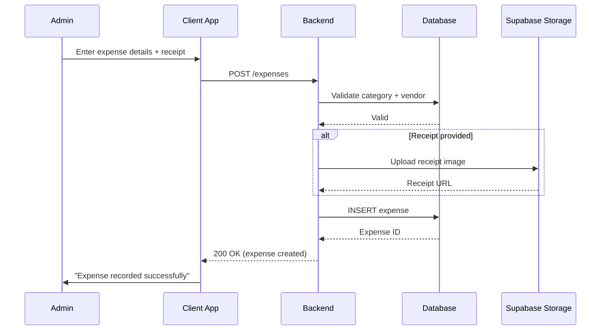
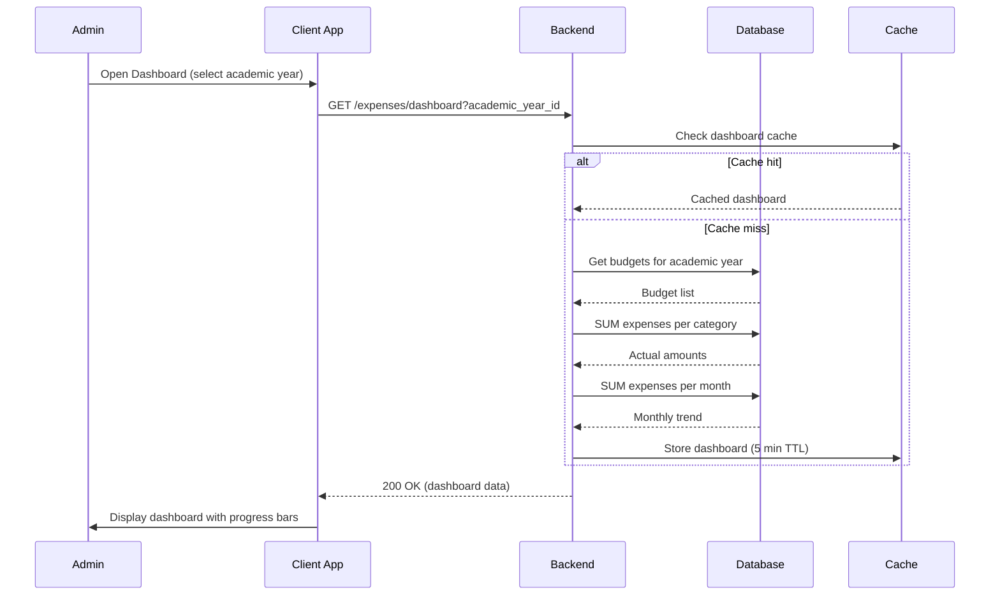
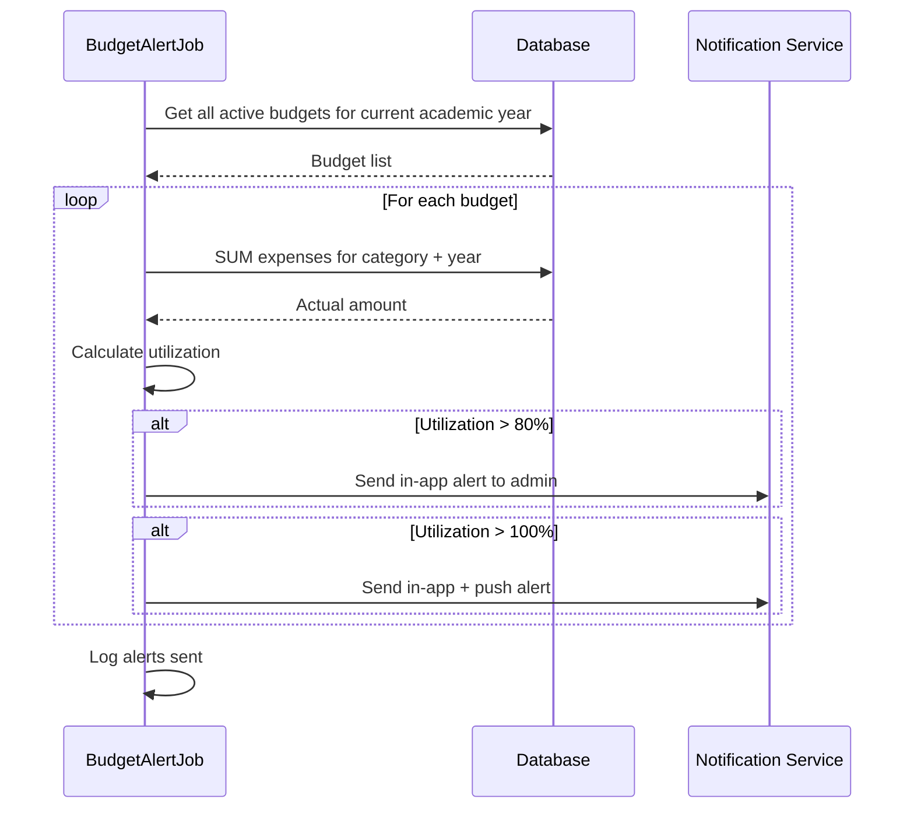
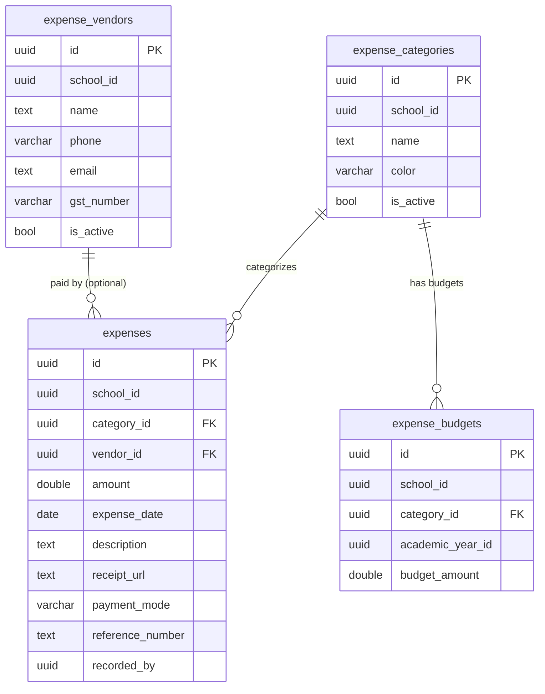

# Expense Management — Technical Specification

> **Document status:** Implementation-ready blueprint
> **Last updated:** 2026-06-27
> **Prerequisites:** None
> **Unblocks:** `FEE_EXPENSE_TRANSPARENCY_SPEC.md`
> **Template:** `_SPEC_TEMPLATE.md` v1 (25 mandatory + 6 optional sections)

---

## 1. Feature Overview

School expense tracking: record expenses by category, vendor payments, budget vs actual comparison, and expense reports. Provides the data foundation for fee-expense transparency features.

### Goals

- Admin records expenses (amount, category, vendor, date, receipt)
- Budget setting per category per academic year
- Budget vs actual comparison dashboard
- Vendor payment tracking
- Expense reports (monthly, category-wise, vendor-wise)
- Data feeds into fee-expense transparency ("where does my fee go")

### Non-goals

- [ ] Purchase order management
- [ ] Invoice generation (vendor-facing)
- [ ] Multi-currency expense tracking
- [ ] Approval workflow for expenses (future enhancement)

### Dependencies

- `FeeRecordsTable` — income side (for fee transparency correlation)
- `AcademicYearsTable` — academic year for budget periods
- Supabase Storage — receipt image uploads
- `AppUsersTable` — user who recorded expense

### Related Modules

- `server/.../feature/fees/` — fee management (income side)
- `server/.../feature/students/` — student data for transparency
- `server/.../feature/notifications/` — budget alerts

---

## 2. Current System Assessment

### Existing Code

- `feature_audit.csv` L136: Expense Management missing (0%)
- No expense tables in `Tables.kt`
- `FeeRecordsTable` exists for income side

### Existing Database

- `FeeRecordsTable` — fee collection (income)
- `AcademicYearsTable` — academic year tracking
- `AppUsersTable` — user accounts
- No expense tables exist

### Existing APIs

- `GET /api/v1/school/fees` — fee management (income)
- `GET /api/v1/school/academic-years` — academic year
- No expense APIs exist

### Existing UI

- Admin: fee management, dashboard
- No expense UI

### Existing Services

- `FeeService` — fee collection
- No expense services

### Existing Documentation

- `feature_audit.csv` — feature audit tracking (expense management at 0%)
- `DIFFERENTIATING_FEATURES.md` — expense management feature description

### Technical Debt

| # | Gap | Details |
|---|---|---|
| TD-1 | No expense tracking | 0% implementation |
| TD-2 | No expense tables | No DB schema for categories, vendors, budgets, expenses |
| TD-3 | No budget management | No budget vs actual comparison |
| TD-4 | No vendor management | No vendor payment tracking |

### Gaps

| # | Gap | Impact | Severity |
|---|---|---|---|
| G1 | No expense recording | Cannot track school expenses | **High** |
| G2 | No budget management | Cannot set or compare budgets | **Medium** |
| G3 | No vendor tracking | Cannot track vendor payments | **Medium** |
| G4 | No expense reports | No visibility into spending patterns | **Medium** |
| G5 | No fee transparency data | Cannot show "where does my fee go" | **Low** |

---

## 3. Functional Requirements

### FR-001
| Field | Value |
|---|---|
| **Title** | Record Expense |
| **Description** | Record expense: amount, category, vendor, date, description, receipt image |
| **Priority** | Critical |
| **User Roles** | School Admin |
| **Acceptance notes** | All fields captured; receipt uploaded to Supabase Storage |

### FR-002
| Field | Value |
|---|---|
| **Title** | Expense Categories |
| **Description** | Categories: Salary, Infrastructure, Transport, Utilities, Supplies, Maintenance, Events, Misc |
| **Priority** | Critical |
| **User Roles** | School Admin |
| **Acceptance notes** | Default categories seeded; admin can add custom categories |

### FR-003
| Field | Value |
|---|---|
| **Title** | Budget per Category |
| **Description** | Budget per category per academic year |
| **Priority** | High |
| **User Roles** | School Admin |
| **Acceptance notes** | One budget per (school_id, category_id, academic_year_id) |

### FR-004
| Field | Value |
|---|---|
| **Title** | Budget vs Actual Dashboard |
| **Description** | Budget vs actual dashboard with progress bars |
| **Priority** | High |
| **User Roles** | School Admin |
| **Acceptance notes** | Visual dashboard with progress bars per category |

### FR-005
| Field | Value |
|---|---|
| **Title** | Vendor Management |
| **Description** | Vendor management: vendor list, payment history |
| **Priority** | Medium |
| **User Roles** | School Admin |
| **Acceptance notes** | Vendor CRUD with payment history per vendor |

### FR-006
| Field | Value |
|---|---|
| **Title** | Expense Reports |
| **Description** | Expense reports: monthly, category-wise, vendor-wise |
| **Priority** | Medium |
| **User Roles** | School Admin |
| **Acceptance notes** | Grouped reports with totals and breakdowns |

### FR-007
| Field | Value |
|---|---|
| **Title** | Receipt Upload |
| **Description** | Receipt upload to Supabase Storage |
| **Priority** | Medium |
| **User Roles** | School Admin |
| **Acceptance notes** | Image upload with URL stored in expense record |

### FR-008
| Field | Value |
|---|---|
| **Title** | Fee Transparency Data |
| **Description** | Aggregate expense data for fee transparency (total expenses by category) |
| **Priority** | Low |
| **User Roles** | System |
| **Acceptance notes** | Aggregate query for FEE_EXPENSE_TRANSPARENCY_SPEC |

---

## 4. User Stories

### School Admin
- [ ] Record a new expense with category, vendor, amount, date, and receipt
- [ ] Set budget per category for the academic year
- [ ] View budget vs actual dashboard with progress bars
- [ ] Manage vendors (add, edit, deactivate)
- [ ] View vendor payment history
- [ ] Generate expense report (monthly, category-wise, vendor-wise)
- [ ] Upload receipt image for an expense
- [ ] View expense trends over time

### Parent (via Fee Transparency)
- [ ] View aggregate expense breakdown ("where does my fee go")
- [ ] See expense categories with percentages

### System
- [ ] Validate expense amount > 0
- [ ] Validate category exists and is active
- [ ] Upload receipt to Supabase Storage
- [ ] Calculate budget utilization per category
- [ ] Generate aggregate expense data for transparency

---

## 5. Business Rules

### BR-001
**Rule:** Expense categories are unique per school.
**Enforcement:** `expense_categories` has `UNIQUE(school_id, name)`.

### BR-002
**Rule:** One budget per category per academic year per school.
**Enforcement:** `expense_budgets` has `UNIQUE(school_id, category_id, academic_year_id)`.

### BR-003
**Rule:** Expense amount must be positive.
**Enforcement:** `expenses.amount` > 0 (validated in service).

### BR-004
**Rule:** Budget utilization = actual expenses / budget amount.
**Enforcement:** Calculated in dashboard query; if budget = 0, utilization = 0.

### BR-005
**Rule:** Expenses are categorized and linked to vendors (optional).
**Enforcement:** `expenses.category_id` NOT NULL; `expenses.vendor_id` nullable.

### BR-006
**Rule:** Receipt images stored in Supabase Storage; URL stored in expense record.
**Enforcement:** `expenses.receipt_url` is nullable (receipt optional).

---

## 6. Database Design

### 6.1 Entity Relationship Summary

Four tables: `expense_categories` (category config), `expense_vendors` (vendor management), `expense_budgets` (budget per category per year), and `expenses` (individual expense records). Expenses link to categories (required) and vendors (optional). Budgets link to categories and academic years.

### 6.2 New Tables

```sql
CREATE TABLE expense_categories (
    id              UUID PRIMARY KEY DEFAULT gen_random_uuid(),
    school_id       UUID NOT NULL,
    name            TEXT NOT NULL,                 -- "Salary", "Transport", "Infrastructure"
    color           VARCHAR(8),                    -- hex color for charts
    is_active       BOOLEAN NOT NULL DEFAULT true,
    UNIQUE(school_id, name)
);

CREATE TABLE expense_vendors (
    id              UUID PRIMARY KEY DEFAULT gen_random_uuid(),
    school_id       UUID NOT NULL,
    name            TEXT NOT NULL,
    phone           VARCHAR(32),
    email           TEXT,
    gst_number      VARCHAR(16),
    is_active       BOOLEAN NOT NULL DEFAULT true,
    created_at      TIMESTAMP NOT NULL DEFAULT now()
);

CREATE TABLE expense_budgets (
    id              UUID PRIMARY KEY DEFAULT gen_random_uuid(),
    school_id       UUID NOT NULL,
    category_id     UUID NOT NULL REFERENCES expense_categories(id),
    academic_year_id UUID NOT NULL,
    budget_amount   DOUBLE PRECISION NOT NULL,
    created_at      TIMESTAMP NOT NULL DEFAULT now(),
    UNIQUE(school_id, category_id, academic_year_id)
);

CREATE TABLE expenses (
    id              UUID PRIMARY KEY DEFAULT gen_random_uuid(),
    school_id       UUID NOT NULL,
    category_id     UUID NOT NULL REFERENCES expense_categories(id),
    vendor_id       UUID REFERENCES expense_vendors(id),
    amount          DOUBLE PRECISION NOT NULL,
    expense_date    DATE NOT NULL,
    description     TEXT,
    receipt_url     TEXT,                          -- Supabase Storage URL
    payment_mode    VARCHAR(16),                   -- cash | cheque | bank_transfer | upi
    reference_number TEXT,                         -- cheque no, transaction id
    recorded_by     UUID,
    created_at      TIMESTAMP NOT NULL DEFAULT now()
);
CREATE INDEX idx_expenses_school_date ON expenses(school_id, expense_date DESC);
CREATE INDEX idx_expenses_category ON expenses(school_id, category_id, expense_date DESC);
```

### 6.3 Modified Tables

N/A — no existing tables modified.

### 6.4 Indexes

```sql
CREATE INDEX idx_expenses_school_date ON expenses(school_id, expense_date DESC);
CREATE INDEX idx_expenses_category ON expenses(school_id, category_id, expense_date DESC);
CREATE INDEX idx_expenses_vendor ON expenses(vendor_id) WHERE vendor_id IS NOT NULL;
CREATE INDEX idx_expense_categories_school ON expense_categories(school_id, is_active);
CREATE INDEX idx_expense_vendors_school ON expense_vendors(school_id, is_active);
CREATE INDEX idx_expense_budgets_school ON expense_budgets(school_id, academic_year_id);
```

### 6.5 Constraints

- `expense_categories.name` — NOT NULL, unique per school
- `expense_budgets.budget_amount` — NOT NULL, >= 0
- `expenses.amount` — NOT NULL, > 0 (validated in service)
- `expenses.expense_date` — NOT NULL
- `expense_budgets` — UNIQUE(school_id, category_id, academic_year_id)

### 6.6 Foreign Keys

- `expense_budgets.category_id` → `expense_categories.id`
- `expenses.category_id` → `expense_categories.id`
- `expenses.vendor_id` → `expense_vendors.id` (nullable)

### 6.7 Soft Delete Strategy

- `expense_categories.is_active` — categories deactivated (not deleted)
- `expense_vendors.is_active` — vendors deactivated (not deleted)

### 6.8 Audit Fields

- `created_at` — creation timestamp (all tables)
- `recorded_by` — user who recorded the expense
- `receipt_url` — receipt image URL

### 6.9 Migration Notes

Migration: `docs/db/migration_052_expense_management.sql`
- Creates 4 expense tables with indexes
- No data backfill needed (new feature)

### 6.10 Exposed Mappings

```kotlin
object ExpenseCategoriesTable : UUIDTable("expense_categories", "id") {
    val schoolId = uuid("school_id")
    val name     = text("name")
    val color    = varchar("color", 8).nullable()
    val isActive = bool("is_active").default(true)
    init {
        uniqueIndex("idx_expense_categories_unique", schoolId, name)
    }
}

object ExpenseVendorsTable : UUIDTable("expense_vendors", "id") {
    val schoolId  = uuid("school_id")
    val name      = text("name")
    val phone     = varchar("phone", 32).nullable()
    val email     = text("email").nullable()
    val gstNumber = varchar("gst_number", 16).nullable()
    val isActive  = bool("is_active").default(true)
    val createdAt = timestamp("created_at")
    init {
        index("idx_expense_vendors_school", false, schoolId, isActive)
    }
}

object ExpenseBudgetsTable : UUIDTable("expense_budgets", "id") {
    val schoolId        = uuid("school_id")
    val categoryId      = uuid("category_id")
    val academicYearId  = uuid("academic_year_id")
    val budgetAmount    = double("budget_amount")
    val createdAt       = timestamp("created_at")
    init {
        uniqueIndex("idx_expense_budgets_unique", schoolId, categoryId, academicYearId)
    }
}

object ExpensesTable : UUIDTable("expenses", "id") {
    val schoolId        = uuid("school_id")
    val categoryId      = uuid("category_id")
    val vendorId        = uuid("vendor_id").nullable()
    val amount          = double("amount")
    val expenseDate     = date("expense_date")
    val description     = text("description").nullable()
    val receiptUrl      = text("receipt_url").nullable()
    val paymentMode     = varchar("payment_mode", 16).nullable()
    val referenceNumber = text("reference_number").nullable()
    val recordedBy      = uuid("recorded_by").nullable()
    val createdAt       = timestamp("created_at")
    init {
        index("idx_expenses_school_date", false, schoolId, expenseDate)
        index("idx_expenses_category", false, schoolId, categoryId, expenseDate)
        index("idx_expenses_vendor", false, vendorId)
    }
}
```

### 6.11 Seed Data

Default categories seeded per school on first access:
- Salary, Infrastructure, Transport, Utilities, Supplies, Maintenance, Events, Misc

---

## 7. State Machines

### Expense State Machine

Expenses are immutable once recorded (no state transitions). Editing or deleting an expense creates an audit trail.

| Action | Description |
|---|---|
| `recorded` | Expense recorded by admin |
| `edited` | Expense edited (amount, description, vendor changed) |
| `deleted` | Expense deleted (soft delete or hard delete) |

### Budget State Machine

Budgets are set per academic year. No state transitions — budget amount can be revised.

| Action | Description |
|---|---|
| `set` | Budget set for category + academic year |
| `revised` | Budget amount updated |
| `carried_over` | Budget copied from previous academic year |

### Vendor State Machine

```
ACTIVE ──admin_deactivates──> INACTIVE
INACTIVE ──admin_reactivates──> ACTIVE
```

| Current State | Event | Next State | Guard / Condition |
|---|---|---|---|
| `active` | Admin deactivates | `inactive` | `is_active = false` |
| `inactive` | Admin reactivates | `active` | `is_active = true` |

---

## 8. Backend Architecture

### 8.1 Component Overview

Three services: `ExpenseService` (expense CRUD, reports), `ExpenseBudgetService` (budget management, dashboard), and `VendorService` (vendor CRUD, payment history). `ExpenseRouting` exposes API endpoints.

### 8.2 Design Principles

1. **Category-driven** — all expenses categorized for reporting
2. **Budget tracking** — budget vs actual per category per year
3. **Vendor optional** — expenses can be recorded without vendor
4. **Receipt storage** — receipts uploaded to Supabase Storage
5. **Aggregate ready** — data structured for fee transparency queries

### 8.3 Core Types

```kotlin
class ExpenseService {
    suspend fun create(expense: ExpenseDto): UUID
    suspend fun update(id: UUID, expense: ExpenseDto): Unit
    suspend fun delete(id: UUID): Unit
    suspend fun getExpenses(schoolId: UUID, filters: ExpenseFilters): List<ExpenseDto>
    suspend fun getDashboard(schoolId: UUID, academicYearId: UUID): ExpenseDashboardDto
    suspend fun getReport(schoolId: UUID, from: LocalDate, to: LocalDate, groupBy: String): ExpenseReportDto
    suspend fun getAggregateForTransparency(schoolId: UUID, academicYearId: UUID): List<CategoryAggregateDto>
}

class ExpenseBudgetService {
    suspend fun setBudget(budget: ExpenseBudgetDto): UUID
    suspend fun reviseBudget(id: UUID, amount: Double): Unit
    suspend fun getBudgets(schoolId: UUID, academicYearId: UUID): List<ExpenseBudgetDto>
    suspend fun carryOverBudgets(schoolId: UUID, fromYearId: UUID, toYearId: UUID): Unit
}

class VendorService {
    suspend fun create(vendor: VendorDto): UUID
    suspend fun update(id: UUID, vendor: VendorDto): Unit
    suspend fun deactivate(id: UUID): Unit
    suspend fun getVendors(schoolId: UUID): List<VendorDto>
    suspend fun getPaymentHistory(vendorId: UUID): List<ExpenseDto>
}
```

### 8.4 Repositories

- `ExpenseRepository` — CRUD for expenses
- `ExpenseCategoryRepository` — CRUD for categories
- `ExpenseBudgetRepository` — CRUD for budgets
- `VendorRepository` — CRUD for vendors

### 8.5 Mappers

- `ExpenseMapper` — maps expense DB rows to DTOs
- `ExpenseCategoryMapper` — maps category rows to DTOs
- `ExpenseBudgetMapper` — maps budget rows to DTOs
- `VendorMapper` — maps vendor rows to DTOs
- `ExpenseDashboardMapper` — maps aggregate query results to dashboard DTO

### 8.6 Permission Checks

- All expense operations: school admin only
- Fee transparency data: system access (internal query)

### 8.7 Background Jobs

### Budget Alert Job

| Job | Schedule | Description |
|---|---|---|
| `BudgetAlertJob` | Daily | Check budget utilization; alert if > 80% |

**Implementation:**
1. For each active budget:
   - Calculate actual expenses for category + academic year
   - Calculate utilization = actual / budget
   - If utilization > 80%: send in-app notification to admin
   - If utilization > 100%: send urgent alert
2. Log alerts sent

### 8.8 Domain Events

- `ExpenseRecorded` — emitted when expense created
- `ExpenseUpdated` — emitted when expense edited
- `ExpenseDeleted` — emitted when expense deleted
- `BudgetSet` — emitted when budget created
- `BudgetRevised` — emitted when budget updated
- `BudgetThresholdExceeded` — emitted when utilization > 80%
- `VendorCreated` — emitted when vendor added

### 8.9 Caching

- Dashboard cached for 5 minutes (changes with new expenses)
- Category list cached for 1 hour (changes infrequently)
- Vendor list cached for 10 minutes

### 8.10 Transactions

- Expense creation: INSERT expense + upload receipt (non-transactional for upload)
- Budget carry-over: INSERT all budgets in batch transaction

### 8.11 Rate Limiting

- Standard API rate limiting
- No special rate limiting needed

### 8.12 Configuration

- `EXPENSE_STORAGE_BUCKET` — default `expense-receipts`
- `EXPENSE_BUDGET_ALERT_THRESHOLD` — default 0.80 (80%)
- `EXPENSE_BUDGET_CRITICAL_THRESHOLD` — default 1.00 (100%)

---

## 9. API Contracts

### 9.1 Admin APIs

```
GET/POST /api/v1/school/expenses
GET/POST /api/v1/school/expense-categories
GET/POST /api/v1/school/expense-vendors
GET/POST /api/v1/school/expense-budgets
GET /api/v1/school/expenses/dashboard?academic_year_id={uuid}
GET /api/v1/school/expenses/report?from={}&to={}&group_by=category|vendor|month
```

### 9.2 Example Responses

**Dashboard response:**
```json
{
  "total_budget": 5000000,
  "total_expenses": 3200000,
  "budget_utilization": 0.64,
  "by_category": [
    {"category": "Salary", "budget": 3000000, "actual": 2100000, "utilization": 0.70},
    {"category": "Transport", "budget": 500000, "actual": 420000, "utilization": 0.84}
  ],
  "monthly_trend": [
    {"month": "2026-06", "amount": 450000}
  ]
}
```

**Expense Report Response (group_by=category):**
```json
{
  "success": true,
  "data": {
    "from": "2026-04-01",
    "to": "2026-06-30",
    "total": 1200000,
    "groups": [
      {"key": "Salary", "total": 800000, "count": 3},
      {"key": "Transport", "total": 250000, "count": 12},
      {"key": "Utilities", "total": 150000, "count": 6}
    ]
  }
}
```

---

## 10. Frontend Architecture

### 10.1 Screens

| Screen | Platform | Role | Description |
|---|---|---|---|
| `ExpenseScreen` | All | Admin | Expense list, entry, edit |
| `ExpenseDashboardScreen` | All | Admin | Budget vs actual dashboard |
| `ExpenseReportScreen` | All | Admin | Reports with grouping |
| `VendorManagementScreen` | All | Admin | Vendor CRUD + payment history |
| `BudgetSettingScreen` | All | Admin | Set budgets per category per year |

### 10.2 Navigation

- Admin portal → Expenses → `ExpenseScreen`
- Admin portal → Expenses → Dashboard → `ExpenseDashboardScreen`
- Admin portal → Expenses → Reports → `ExpenseReportScreen`
- Admin portal → Expenses → Vendors → `VendorManagementScreen`
- Admin portal → Expenses → Budgets → `BudgetSettingScreen`

### 10.3 UX Flows

#### Admin: Record Expense

1. Admin opens Expenses → New Expense
2. Selects category (dropdown)
3. Selects vendor (optional, dropdown or search)
4. Enters amount, expense date, description
5. Selects payment mode (cash/cheque/bank_transfer/upi)
6. Enters reference number (if applicable)
7. Uploads receipt image (optional)
8. Saves expense

#### Admin: View Dashboard

1. Admin opens Expenses → Dashboard
2. Selects academic year
3. Views total budget, total expenses, utilization
4. Views category-wise breakdown with progress bars
5. Views monthly trend chart
6. Clicks category to drill down

#### Admin: Set Budget

1. Admin opens Expenses → Budgets
2. Selects academic year
3. For each category, enters budget amount
4. Saves budgets
5. Dashboard updates with new budget data

### 10.4 State Management

```kotlin
data class ExpenseState(
    val expenses: List<ExpenseDto>,
    val dashboard: ExpenseDashboardDto?,
    val categories: List<ExpenseCategoryDto>,
    val vendors: List<VendorDto>,
    val budgets: List<ExpenseBudgetDto>,
    val isLoading: Boolean,
    val error: String?,
)
```

### 10.5 Offline Support

- Expense list cached locally for offline viewing
- Dashboard data cached for 5 minutes
- Receipt upload requires network

### 10.6 Loading States

- Loading expenses: "Loading expenses..."
- Loading dashboard: "Loading budget dashboard..."
- Uploading receipt: "Uploading receipt..."

### 10.7 Error Handling (UI)

- No categories: "Create expense categories first."
- Budget not set: "No budget set for this category. Set budget to see utilization."
- Receipt upload failed: "Receipt upload failed. Expense saved without receipt."
- Amount invalid: "Amount must be greater than 0."

### 10.8 Component Integration Guidelines

| Rule | Description |
|---|---|
| **R1** | Progress bars for budget utilization (green < 80%, yellow 80-100%, red > 100%) |
| **R2** | Category-wise pie chart for expense distribution |
| **R3** | Monthly trend line chart |
| **R4** | Vendor dropdown with search |
| **R5** | Receipt image preview before upload |
| **R6** | Report grouping toggle (category/vendor/month) |

---

## 11. Shared Module Changes (KMP)

### 11.1 DTOs

```kotlin
data class ExpenseDto(
    val id: UUID,
    val schoolId: UUID,
    val categoryId: UUID,
    val categoryName: String,
    val vendorId: UUID?,
    val vendorName: String?,
    val amount: Double,
    val expenseDate: LocalDate,
    val description: String?,
    val receiptUrl: String?,
    val paymentMode: String?,
    val referenceNumber: String?,
    val recordedBy: UUID?,
)

data class ExpenseCategoryDto(
    val id: UUID,
    val schoolId: UUID,
    val name: String,
    val color: String?,
    val isActive: Boolean,
)

data class ExpenseBudgetDto(
    val id: UUID,
    val schoolId: UUID,
    val categoryId: UUID,
    val categoryName: String,
    val academicYearId: UUID,
    val budgetAmount: Double,
)

data class VendorDto(
    val id: UUID,
    val schoolId: UUID,
    val name: String,
    val phone: String?,
    val email: String?,
    val gstNumber: String?,
    val isActive: Boolean,
)

data class ExpenseDashboardDto(
    val totalBudget: Double,
    val totalExpenses: Double,
    val budgetUtilization: Double,
    val byCategory: List<CategoryBudgetDto>,
    val monthlyTrend: List<MonthlyExpenseDto>,
)

data class CategoryBudgetDto(
    val category: String,
    val budget: Double,
    val actual: Double,
    val utilization: Double,
)

data class MonthlyExpenseDto(
    val month: String,
    val amount: Double,
)
```

### 11.2 Domain Models

```kotlin
data class Expense(
    val id: UUID,
    val schoolId: UUID,
    val categoryId: UUID,
    val vendorId: UUID?,
    val amount: Double,
    val expenseDate: LocalDate,
    val description: String?,
    val receiptUrl: String?,
    val paymentMode: String?,
    val referenceNumber: String?,
)

data class ExpenseBudget(
    val id: UUID,
    val schoolId: UUID,
    val categoryId: UUID,
    val academicYearId: UUID,
    val budgetAmount: Double,
)
```

### 11.3 Repository Interfaces

```kotlin
interface ExpenseRepository {
    suspend fun create(expense: ExpenseEntity): UUID
    suspend fun update(id: UUID, expense: ExpenseEntity): Unit
    suspend fun delete(id: UUID): Unit
    suspend fun getBySchool(schoolId: UUID, filters: ExpenseFilters): List<ExpenseDto>
    suspend fun getDashboard(schoolId: UUID, academicYearId: UUID): ExpenseDashboardDto
    suspend fun getReport(schoolId: UUID, from: LocalDate, to: LocalDate, groupBy: String): ExpenseReportDto
}

interface ExpenseBudgetRepository {
    suspend fun setBudget(budget: ExpenseBudgetEntity): UUID
    suspend fun reviseBudget(id: UUID, amount: Double): Unit
    suspend fun getBySchool(schoolId: UUID, academicYearId: UUID): List<ExpenseBudgetDto>
}

interface VendorRepository {
    suspend fun create(vendor: VendorEntity): UUID
    suspend fun update(id: UUID, vendor: VendorEntity): Unit
    suspend fun deactivate(id: UUID): Unit
    suspend fun getBySchool(schoolId: UUID): List<VendorDto>
    suspend fun getPaymentHistory(vendorId: UUID): List<ExpenseDto>
}
```

### 11.4 UseCases

- `RecordExpenseUseCase`
- `UpdateExpenseUseCase`
- `DeleteExpenseUseCase`
- `GetExpenseDashboardUseCase`
- `GetExpenseReportUseCase`
- `SetBudgetUseCase`
- `ReviseBudgetUseCase`
- `CarryOverBudgetsUseCase`
- `CreateVendorUseCase`
- `GetVendorPaymentHistoryUseCase`

### 11.5 Validation

- Amount: > 0
- Category ID: must exist and be active
- Vendor ID: must exist if provided
- Expense date: not in future
- Budget amount: >= 0
- Payment mode: one of cash, cheque, bank_transfer, upi

### 11.6 Serialization

Standard Kotlinx serialization for DTOs.

### 11.7 Network APIs

Added to `ExpenseApi.kt`:
- `GET/POST /api/v1/school/expenses` — expense CRUD
- `GET/POST /api/v1/school/expense-categories` — category CRUD
- `GET/POST /api/v1/school/expense-vendors` — vendor CRUD
- `GET/POST /api/v1/school/expense-budgets` — budget CRUD
- `GET /api/v1/school/expenses/dashboard` — dashboard
- `GET /api/v1/school/expenses/report` — reports

### 11.8 Database Models (Local Cache)

- Expense list cached locally for offline viewing
- Dashboard data cached for 5 minutes
- Category list cached locally

---

## 12. Permissions Matrix

| Action | Super Admin | School Admin | Teacher | Parent |
|---|---|---|---|---|
| Record/edit/delete expense | ✅ | ✅ | ❌ | ❌ |
| Manage categories | ✅ | ✅ | ❌ | ❌ |
| Manage vendors | ✅ | ✅ | ❌ | ❌ |
| Set/revise budgets | ✅ | ✅ | ❌ | ❌ |
| View dashboard | ✅ | ✅ | ❌ | ❌ |
| View reports | ✅ | ✅ | ❌ | ❌ |
| View fee transparency data | ✅ | ✅ | ❌ | ✅ (aggregate only) |

---

## 13. Notifications

### Expense Notifications

| Type | Trigger | Channel | Message |
|---|---|---|---|
| Budget Threshold Exceeded | Utilization > 80% | In-app (admin) | "Budget for {category} is at {utilization}%. Consider reviewing expenses." |
| Budget Exceeded | Utilization > 100% | In-app + Push (admin) | "Budget for {category} has been exceeded! Actual: ₹{actual}, Budget: ₹{budget}" |
| Expense Recorded | Admin records expense | In-app (admin) | "Expense of ₹{amount} recorded for {category}." |

---

## 14. Background Jobs

| Job | Schedule | Description |
|---|---|---|
| `BudgetAlertJob` | Daily | Check budget utilization; alert if > 80% |

**Budget Alert:**
1. For each active budget in current academic year:
   - Calculate actual expenses: SUM(expenses.amount) WHERE category_id = budget.category_id AND expense_date within academic year
   - Calculate utilization = actual / budget_amount
   - If utilization > 80% and no alert sent today:
     - Send in-app notification to admin
     - Log alert
   - If utilization > 100% and no critical alert sent:
     - Send in-app + push notification
     - Log critical alert
2. Log total alerts sent

---

## 15. Integrations

### FeeRecordsTable
| Field | Value |
|---|---|
| **System** | Existing fee management |
| **Purpose** | Income side data for fee-expense transparency correlation |
| **API / SDK** | Direct DB query |
| **Auth method** | Internal |
| **Fallback** | None — fee data needed for transparency |

### AcademicYearsTable
| Field | Value |
|---|---|
| **System** | Existing academic year management |
| **Purpose** | Budget periods scoped by academic year |
| **API / SDK** | Direct DB query |
| **Auth method** | Internal |
| **Fallback** | None — academic year required for budget |

### AppUsersTable
| Field | Value |
|---|---|
| **System** | Existing user management |
| **Purpose** | User who recorded the expense (`recorded_by`) |
| **API / SDK** | Direct DB query |
| **Auth method** | Internal |
| **Fallback** | None — user from JWT |

### Supabase Storage
| Field | Value |
|---|---|
| **System** | Existing file storage |
| **Purpose** | Store receipt images |
| **API / SDK** | Supabase Storage API |
| **Auth method** | Service role key |
| **Fallback** | If upload fails, expense saved with null receipt_url |

### Notification Service
| Field | Value |
|---|---|
| **System** | Existing notification infrastructure |
| **Purpose** | Budget threshold alerts |
| **API / SDK** | Internal `NotificationService` |
| **Auth method** | Internal service call |
| **Fallback** | In-app notification if push fails |

### FEE_EXPENSE_TRANSPARENCY_SPEC
| Field | Value |
|---|---|
| **System** | Future spec (unblocked by this) |
| **Purpose** | Consumes aggregate expense data for parent-facing transparency |
| **API / SDK** | Internal query `getAggregateForTransparency()` |
| **Auth method** | Internal |
| **Fallback** | None — expense data must exist |

---

## 16. Security

### Authentication
- All expense APIs: JWT with school admin role

### Authorization
- Expense CRUD: school admin only
- Budget management: school admin only
- Vendor management: school admin only
- Dashboard and reports: school admin only
- Fee transparency data: system access (internal)

### Encryption
- All API communication over TLS
- Receipt images stored in Supabase Storage (private bucket with signed URLs)

### Audit Logs
- Expense creation logged (amount, category, recorded_by)
- Expense update logged (old vs new values)
- Expense deletion logged
- Budget set/revised logged
- Vendor created/deactivated logged

### PII Handling
- Vendor data (name, phone, email, GST) is business information
- Receipt images may contain vendor PII — stored in private bucket
- No student PII in expense records

### Data Isolation
- All queries filtered by `school_id` from JWT
- No cross-school data access

### Rate Limiting
- Standard API rate limiting
- No special rate limiting needed

### Input Validation
- Amount: > 0
- Category ID: must exist and be active for school
- Vendor ID: must exist if provided
- Expense date: not in future
- Budget amount: >= 0
- Payment mode: one of cash, cheque, bank_transfer, upi

---

## 17. Performance & Scalability

### Expected Scale

| Metric | Small school | Medium school | Large school |
|---|---|---|---|
| Expenses per month | ~50 | ~200 | ~1,000 |
| Expenses per year | ~500 | ~2,500 | ~12,000 |
| Categories | ~8 | ~12 | ~20 |
| Vendors | ~20 | ~80 | ~300 |

### Latency Targets

| Operation | Target |
|---|---|
| Record expense | < 200ms |
| Get dashboard | < 500ms (cached) / < 2s (fresh) |
| Get report | < 1s |
| List expenses | < 200ms (paginated) |
| Vendor payment history | < 200ms |

### Optimization Strategy

- Expenses indexed by (school_id, expense_date) and (school_id, category_id, expense_date)
- Dashboard cached for 5 minutes
- Category list cached for 1 hour
- Report queries use indexed scans with date range filter
- Aggregate queries use SUM with GROUP BY on indexed columns

---

## 18. Edge Cases

| # | Scenario | Expected Behavior |
|---|---|---|
| EC-001 | No budget set for category | Dashboard shows actual with 0% utilization (no budget) |
| EC-002 | Category deactivated with existing expenses | Expenses remain; category shows as inactive |
| EC-003 | Vendor deactivated with existing expenses | Expenses remain; vendor shows as inactive |
| EC-004 | Receipt upload fails | Expense saved with null receipt_url; admin can re-upload |
| EC-005 | Budget amount = 0 | Utilization shown as N/A or 0% |
| EC-006 | Expense in future date | Rejected: "Expense date cannot be in the future" |
| EC-007 | Duplicate expense (same amount, date, vendor) | Allowed (no uniqueness constraint) |
| EC-008 | Budget carry-over with no previous year budgets | No budgets created; log info |

### Risks & Mitigations

| Risk | Likelihood | Impact | Mitigation |
|---|---|---|---|
| Receipt upload failure | Medium | Low | Expense saved without receipt; re-upload option |
| Budget not set | Medium | Low | Dashboard shows actual only; prompt to set budget |
| Large report query timeout | Low | Medium | Date range limited; indexed scans |
| Category deletion with expenses | Low | Medium | Soft delete only; expenses reference inactive category |

---

## 19. Error Handling

### Standard Error Codes

| HTTP | Error Code | Description | When |
|---|---|---|---|
| 400 | `INVALID_AMOUNT` | Amount must be > 0 | Create/update expense |
| 400 | `INVALID_CATEGORY` | Category not found or inactive | Create/update expense |
| 400 | `INVALID_VENDOR` | Vendor not found or inactive | Create/update expense |
| 400 | `FUTURE_DATE` | Expense date in future | Create/update expense |
| 400 | `INVALID_PAYMENT_MODE` | Payment mode not valid | Create/update expense |
| 400 | `DUPLICATE_BUDGET` | Budget already exists for category + year | Set budget |
| 400 | `INVALID_BUDGET_AMOUNT` | Budget amount < 0 | Set/revise budget |
| 403 | `INSUFFICIENT_PERMISSIONS` | Non-admin attempting expense operation | Any endpoint |
| 404 | `EXPENSE_NOT_FOUND` | Expense does not exist | Update/delete expense |
| 404 | `VENDOR_NOT_FOUND` | Vendor does not exist | Vendor operations |
| 404 | `BUDGET_NOT_FOUND` | Budget does not exist | Revise budget |
| 500 | `RECEIPT_UPLOAD_FAILED` | Receipt image upload to Supabase failed | Create/update expense |

### Error Response Format

Same as existing API error format.

### Recovery Strategy

| Error | Client Action | Server Action |
|---|---|---|
| `RECEIPT_UPLOAD_FAILED` | Show "Receipt upload failed. Expense saved." | Save expense with null receipt_url |
| `DUPLICATE_BUDGET` | Show "Budget already set. Use revise instead." | Return 400 |
| `INVALID_AMOUNT` | Show "Amount must be greater than 0." | Return 400 |

---

## 20. Analytics & Reporting

### Reports

- **Monthly Expense Report:** Total expenses per month with category breakdown
- **Category-wise Report:** Expenses grouped by category with totals and counts
- **Vendor-wise Report:** Payments grouped by vendor with totals and history
- **Budget vs Actual Report:** Category-wise budget, actual, utilization, variance
- **Annual Expense Summary:** Yearly totals with trend analysis

### KPIs

- **Total Expenses (Year):** Sum of all expenses in academic year
- **Budget Utilization:** Overall and per-category utilization rate
- **Average Monthly Expense:** Total / months elapsed
- **Top Vendors by Payment:** Top 5 vendors by total payment
- **Expense Growth Rate:** Month-over-month expense growth

### Dashboards

- Admin: budget vs actual dashboard with progress bars
- Admin: monthly trend chart
- Admin: category-wise pie chart

### Exports

- Expense list export (CSV)
- Budget vs actual report export (CSV/PDF)
- Vendor payment history export (CSV)
- Monthly report export (PDF)

---

## 21. Testing Strategy

### Unit Tests

| Test | What it verifies |
|---|---|
| Create expense | Expense stored with all fields |
| Update expense | Fields updated correctly |
| Delete expense | Expense removed |
| Set budget | Budget stored with unique constraint |
| Revise budget | Budget amount updated |
| Budget carry-over | Budgets copied from previous year |
| Vendor CRUD | Vendor created, updated, deactivated |
| Payment history | Correct expenses returned for vendor |
| Dashboard aggregation | Correct SUM and utilization calculation |
| Report grouping | Correct grouping by category/vendor/month |

### Integration Tests

| Test | What it verifies |
|---|---|
| Record expense → view dashboard | Dashboard reflects new expense |
| Set budget → view dashboard | Dashboard shows budget vs actual |
| Create vendor → record expense with vendor → view payment history | Full vendor flow |
| Budget alert job triggers at 80% | Notification sent |

### Performance Tests

- [ ] Dashboard with 10,000 expenses < 2s
- [ ] Report with 1-year range < 1s
- [ ] Vendor payment history with 500 expenses < 200ms

### Security Tests

- [ ] Non-admin cannot access expense endpoints
- [ ] School A admin cannot see School B expenses
- [ ] Receipt URL requires signed URL (not public)

### Migration Tests

- [ ] Migration creates 4 tables with correct schema
- [ ] Indexes created correctly
- [ ] Default categories seeded on first access

---

## 22. Acceptance Criteria

- [ ] Expenses recorded with category, vendor, amount, date, receipt
- [ ] Budget set per category per academic year
- [ ] Budget vs actual dashboard with progress bars
- [ ] Vendor management with payment history
- [ ] Expense reports (monthly, category, vendor)
- [ ] Receipt upload works
- [ ] Aggregate data available for fee transparency
- [ ] Budget alerts sent when utilization > 80%

---

## 23. Implementation Roadmap

| Phase | Duration | Tasks | Breaking? | Deliverable |
|---|---|---|---|---|
| 1 | 2 days | DB migration, Exposed tables | No | Schema + tables |
| 2 | 2 days | ExpenseService + budget service | No | Services ready |
| 3 | 2 days | API endpoints + reports | No | API available |
| 4 | 3 days | Client UI (expense entry, dashboard, reports, vendor management) | No | UI ready |
| 5 | 1 day | Tests | No | Test coverage |

**Total: ~10 days**

---

## 24. File-Level Impact Analysis

### New Files

| File | Location | Purpose |
|---|---|---|
| `ExpenseService.kt` | `server/.../feature/expense/` | Expense CRUD + reports |
| `ExpenseBudgetService.kt` | `server/.../feature/expense/` | Budget management |
| `VendorService.kt` | `server/.../feature/expense/` | Vendor CRUD + payment history |
| `ExpenseRouting.kt` | `server/.../feature/expense/` | API endpoints |
| `BudgetAlertJob.kt` | `server/.../feature/expense/` | Daily budget alert job |
| `migration_052_expense_management.sql` | `docs/db/` | DDL migration |
| `ExpenseApi.kt` | `shared/.../feature/expense/` | Client API |
| `ExpenseRepositoryImpl.kt` | `shared/.../feature/expense/` | Repository impl |
| `ExpenseDtos.kt` | `shared/.../feature/expense/` | DTOs |
| `ExpenseViewModel.kt` | `shared/.../feature/expense/` | Admin VM |
| `ExpenseDashboardViewModel.kt` | `shared/.../feature/expense/` | Dashboard VM |
| `ExpenseScreen.kt` | `composeApp/.../ui/v2/screens/admin/` | Expense management |
| `ExpenseDashboardScreen.kt` | `composeApp/.../ui/v2/screens/admin/` | Budget vs actual dashboard |
| `ExpenseReportScreen.kt` | `composeApp/.../ui/v2/screens/admin/` | Reports |
| `VendorManagementScreen.kt` | `composeApp/.../ui/v2/screens/admin/` | Vendor management |
| `BudgetSettingScreen.kt` | `composeApp/.../ui/v2/screens/admin/` | Budget setting |

### Modified Files

| File | Change Type | Lines Changed (est.) | Risk | Description |
|---|---|---|---|---|
| `server/.../db/Tables.kt` | Add | ~50 | Low | 4 expense table objects |
| `server/.../db/DatabaseFactory.kt` | Modify | ~4 | Low | Register 4 tables |

### Files Preserved Unchanged

| File | Reason |
|---|---|
| `FeeRecordsTable` | Read-only (income data for transparency) |
| `AcademicYearsTable` | Read-only (academic year reference) |
| `AppUsersTable` | Read-only (user reference) |

---

## 25. Future Enhancements

### Expense Approval Workflow

- Multi-level approval for expenses above threshold
- Admin submits → Principal approves → Accountant processes
- Approval history and audit trail
- Email/in-app notifications for pending approvals

### Purchase Order Management

- Create PO before expense
- Link expense to PO
- PO approval workflow
- PO vs actual comparison

### Invoice Generation

- Generate vendor-facing invoices
- GST-compliant invoice format
- Invoice numbering and tracking
- PDF invoice export

### Multi-Currency Support

- Expenses in multiple currencies
- Currency conversion with daily rates
- Reporting in base currency
- Foreign vendor payments

### Recurring Expenses

- Auto-generate recurring expenses (rent, salary, utilities)
- Monthly/quarterly/annual recurrence
- Recurring expense templates
- Pause/resume recurring expenses

### Expense Categories Budget Alerts

- Configurable alert thresholds per category
- Multiple alert levels (50%, 80%, 100%)
- Alert escalation chain
- Alert history and acknowledgment

### Vendor Rating System

- Rate vendors on quality, timeliness, pricing
- Vendor performance dashboard
- Vendor comparison report
- Blacklist/whitelist management

### Expense Analytics with ML

- Anomaly detection in expense patterns
- Predictive budget forecasting
- Category-wise spending predictions
- Vendor payment pattern analysis

### Integration with Accounting Software

- Tally integration
- QuickBooks integration
- Zoho Books integration
- Automatic sync of expense data

### Expense Reimbursement

- Staff expense reimbursement requests
- Receipt upload and approval workflow
- Reimbursement tracking
- Integration with payroll

### Grant/Fund Tracking

- Track expenses against specific grants/funds
- Fund-wise budget vs actual
- Grant compliance reporting
- Fund utilization certificates

---

## A. Sequence Diagrams

### Record Expense Flow



### Budget vs Actual Dashboard Flow



### Budget Alert Job Flow



---

## B. Domain Model / ER Diagram



---

## C. Event Flow

```
ExpenseRecorded -> Complete
ExpenseUpdated -> Complete
ExpenseDeleted -> Complete
BudgetSet -> Complete
BudgetRevised -> Complete
BudgetAlertJob -> CalculateUtilization -> AlertIfThreshold -> Complete
```

| Event | Emitted By | Consumed By | Side Effect |
|---|---|---|---|
| `ExpenseRecorded` | `ExpenseService.create()` | Analytics | Counter incremented |
| `ExpenseUpdated` | `ExpenseService.update()` | Analytics | Counter incremented |
| `ExpenseDeleted` | `ExpenseService.delete()` | Analytics | Counter incremented |
| `BudgetSet` | `ExpenseBudgetService.setBudget()` | Analytics | Counter incremented |
| `BudgetRevised` | `ExpenseBudgetService.reviseBudget()` | Analytics | Counter incremented |
| `BudgetThresholdExceeded` | `BudgetAlertJob` | Notification | Admin alerted |
| `VendorCreated` | `VendorService.create()` | Analytics | Counter incremented |

---

## D. Configuration

### Environment Variables

| Variable | Description |
|---|---|
| `EXPENSE_ENABLED` | Enable/disable feature (default: `true`) |
| `EXPENSE_STORAGE_BUCKET` | Supabase bucket for receipts (default: `expense-receipts`) |
| `EXPENSE_BUDGET_ALERT_THRESHOLD` | Alert threshold (default: `0.80`) |
| `EXPENSE_BUDGET_CRITICAL_THRESHOLD` | Critical threshold (default: `1.00`) |
| `EXPENSE_DASHBOARD_CACHE_TTL` | Dashboard cache TTL in seconds (default: `300`) |

### Feature Flags

| Flag | Default | Description |
|---|---|---|
| `expense_enabled` | `true` | Master switch for expense management |
| `expense_budget_alerts` | `true` | Enable budget threshold alerts |
| `expense_receipt_upload` | `true` | Enable receipt image upload |
| `expense_fee_transparency` | `false` | Enable fee transparency data feed (for future spec) |

### Client-Side Configuration

| Config | Default | Description |
|---|---|---|
| Dashboard refresh | 5 minutes | Auto-refresh interval |
| Expense list page size | 20 | Items per page |
| Receipt max size | 5 MB | Max receipt image size |
| Report default group | category | Default grouping for reports |

### Server-Side Configuration

| Config | Default | Description |
|---|---|---|
| Storage bucket | `expense-receipts` | Supabase bucket |
| Budget alert threshold | 0.80 | 80% utilization alert |
| Budget critical threshold | 1.00 | 100% utilization critical |
| Dashboard cache TTL | 300s | Cache duration |

### Infrastructure Requirements

- PostgreSQL with DOUBLE PRECISION support
- Supabase Storage for receipt images
- Standard notification infrastructure

---

## E. Migration & Rollback

### Deployment Plan

1. [ ] Run `migration_052_expense_management.sql` — creates 4 tables + indexes
2. [ ] Deploy 4 expense table objects in `Tables.kt`
3. [ ] Register tables in `DatabaseFactory.kt`
4. [ ] Deploy `ExpenseService`, `ExpenseBudgetService`, `VendorService`
5. [ ] Deploy `BudgetAlertJob`
6. [ ] Deploy `ExpenseRouting.kt` (API endpoints)
7. [ ] Deploy client UI (expense, dashboard, reports, vendors, budgets)
8. [ ] Seed default categories on first access
9. [ ] Deploy to production

### Rollback Plan

1. [ ] Disable feature flag `expense_enabled` → APIs return 404
2. [ ] Remove client UI → expense screens not shown
3. [ ] Database: `DROP TABLE IF EXISTS expenses; DROP TABLE IF EXISTS expense_budgets; DROP TABLE IF EXISTS expense_vendors; DROP TABLE IF EXISTS expense_categories;`
4. [ ] Clean up Supabase Storage `expense-receipts` bucket
5. [ ] No data loss — expense management is additive feature

### Data Backfill

N/A — categories seeded on first access; expenses and budgets created by admin.

### Migration SQL

```sql
-- migration_052_expense_management.sql
CREATE TABLE IF NOT EXISTS expense_categories (
    id              UUID PRIMARY KEY DEFAULT gen_random_uuid(),
    school_id       UUID NOT NULL,
    name            TEXT NOT NULL,
    color           VARCHAR(8),
    is_active       BOOLEAN NOT NULL DEFAULT true,
    UNIQUE(school_id, name)
);

CREATE TABLE IF NOT EXISTS expense_vendors (
    id              UUID PRIMARY KEY DEFAULT gen_random_uuid(),
    school_id       UUID NOT NULL,
    name            TEXT NOT NULL,
    phone           VARCHAR(32),
    email           TEXT,
    gst_number      VARCHAR(16),
    is_active       BOOLEAN NOT NULL DEFAULT true,
    created_at      TIMESTAMP NOT NULL DEFAULT now()
);

CREATE TABLE IF NOT EXISTS expense_budgets (
    id              UUID PRIMARY KEY DEFAULT gen_random_uuid(),
    school_id       UUID NOT NULL,
    category_id     UUID NOT NULL REFERENCES expense_categories(id),
    academic_year_id UUID NOT NULL,
    budget_amount   DOUBLE PRECISION NOT NULL,
    created_at      TIMESTAMP NOT NULL DEFAULT now(),
    UNIQUE(school_id, category_id, academic_year_id)
);

CREATE TABLE IF NOT EXISTS expenses (
    id              UUID PRIMARY KEY DEFAULT gen_random_uuid(),
    school_id       UUID NOT NULL,
    category_id     UUID NOT NULL REFERENCES expense_categories(id),
    vendor_id       UUID REFERENCES expense_vendors(id),
    amount          DOUBLE PRECISION NOT NULL,
    expense_date    DATE NOT NULL,
    description     TEXT,
    receipt_url     TEXT,
    payment_mode    VARCHAR(16),
    reference_number TEXT,
    recorded_by     UUID,
    created_at      TIMESTAMP NOT NULL DEFAULT now()
);

CREATE INDEX IF NOT EXISTS idx_expenses_school_date ON expenses(school_id, expense_date DESC);
CREATE INDEX IF NOT EXISTS idx_expenses_category ON expenses(school_id, category_id, expense_date DESC);
CREATE INDEX IF NOT EXISTS idx_expenses_vendor ON expenses(vendor_id) WHERE vendor_id IS NOT NULL;
CREATE INDEX IF NOT EXISTS idx_expense_vendors_school ON expense_vendors(school_id, is_active);

-- ROLLBACK:
-- DROP TABLE IF EXISTS expenses;
-- DROP TABLE IF EXISTS expense_budgets;
-- DROP TABLE IF EXISTS expense_vendors;
-- DROP TABLE IF EXISTS expense_categories;
```

---

## F. Observability

### Logging

- Expense recorded: INFO `expense_recorded` (expenseId, schoolId, categoryId, amount, recordedBy)
- Expense updated: INFO `expense_updated` (expenseId, fieldsChanged)
- Expense deleted: INFO `expense_deleted` (expenseId, amount, deletedBy)
- Budget set: INFO `expense_budget_set` (budgetId, schoolId, categoryId, academicYearId, amount)
- Budget revised: INFO `expense_budget_revised` (budgetId, oldAmount, newAmount)
- Budget threshold exceeded: WARN `expense_budget_threshold` (schoolId, categoryId, utilization, budget, actual)
- Budget exceeded: ERROR `expense_budget_exceeded` (schoolId, categoryId, actual, budget)
- Vendor created: INFO `expense_vendor_created` (vendorId, schoolId, name)
- Vendor deactivated: INFO `expense_vendor_deactivated` (vendorId, schoolId)
- Receipt upload failed: WARN `expense_receipt_upload_failed` (expenseId, error)
- Dashboard viewed: DEBUG `expense_dashboard_viewed` (schoolId, adminId)
- Report generated: DEBUG `expense_report_generated` (schoolId, from, to, groupBy)

### Metrics

| Metric | Type | Description |
|---|---|---|
| `expense.expenses_total` | Counter | Total expenses recorded |
| `expense.amount_total` | Counter | Total expense amount |
| `expense.budgets_set` | Counter | Total budgets created |
| `expense.budget_alerts_sent` | Counter | Budget threshold alerts sent |
| `expense.budget_critical_alerts` | Counter | Budget exceeded alerts |
| `expense.dashboard_views` | Counter | Dashboard views |
| `expense.report_generations` | Counter | Report generations |
| `expense.receipt_uploads` | Counter | Receipt uploads |
| `expense.receipt_upload_failures` | Counter | Receipt upload failures |
| `expense.dashboard_query_time_ms` | Histogram | Dashboard query latency |
| `expense.report_query_time_ms` | Histogram | Report query latency |

### Health Checks

- `GET /api/v1/health` — existing health check

### Alerts

- Budget exceeded for any category → Warning (admin notified)
- Receipt upload failure rate > 10% → Warning (Supabase issues)
- Dashboard query > 5s → Warning (performance issue)
- No expenses recorded in 30 days → Info (feature adoption)
