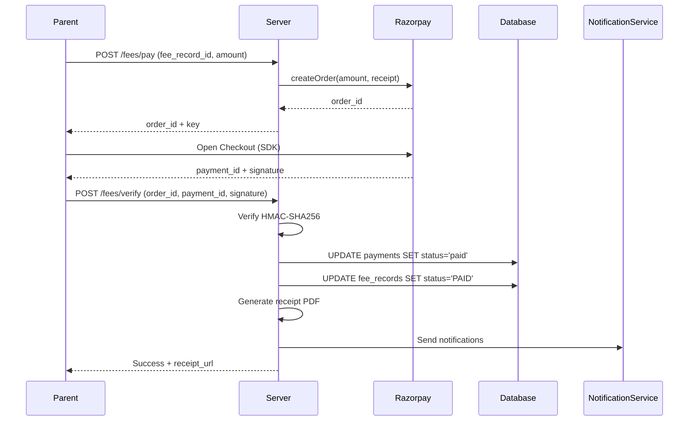
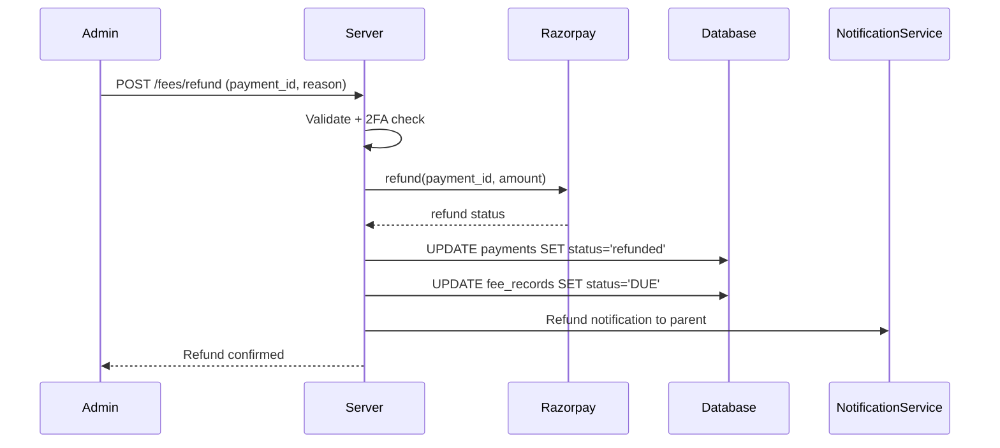

# Fee Payment Gateway — Technical Specification

> **Document status:** Implementation-ready blueprint
> **Last updated:** 2026-06-28
> **Prerequisites:** None
> **Unblocks:** `AI_FEE_REMINDER_SPEC.md`, `FEE_EXPENSE_TRANSPARENCY_SPEC.md`
> **Related specs:** `WHATSAPP_INTEGRATION_SPEC.md`, `TWO_FACTOR_AUTH_SPEC.md`, `OFFLINE_MODE_SPEC.md`
> **Template:** `_SPEC_TEMPLATE.md` v1 (25 mandatory + 6 optional sections)

---

## 1. Feature Overview

### Purpose

Online fee payment via Razorpay (primary, India-first) with UPI, cards, net banking, and wallet support. Includes fee installment plans, flexible payment schedules, automatic receipt generation, refund processing, and WhatsApp payment links.

### Business Value

- Enables digital fee collection — zero cash handling, reduced manual reconciliation
- Converts offline parents to online payers via WhatsApp payment links
- Provides admins real-time visibility into collection, outstanding, and overdue
- Automates receipt generation — eliminates manual receipt process
- Flexible installment plans improve fee collection rates for parents

### Goals

- [ ] Parents can pay fees online via UPI/cards/netbanking directly in the app
- [ ] School admins can create fee structures, installments, and due dates
- [ ] Automatic receipt generation (PDF) with school branding
- [ ] Payment status syncs to existing `FeeRecordsTable` in real-time
- [ ] WhatsApp payment link delivery for offline-to-online conversion
- [ ] Refund workflow for cancelled payments
- [ ] Dashboard for admins: collected, outstanding, overdue, daily collection

### Non-goals

- [ ] International payment gateways (Stripe) — future extensibility
- [ ] Auto-recurring / subscription payments — future extensibility
- [ ] Multi-currency support — INR only for now
- [ ] Fee waivers & discounts — future extensibility
- [ ] Parent prepaid wallet — future extensibility

### Dependencies

- Razorpay account (live + test mode)
- Supabase Storage (for receipt PDFs)
- `WhatsAppCloudProvider` (for payment link delivery)
- `NotificationsTable` + `Notify.kt` (for payment notifications)
- `AppConfigTable` (for Razorpay key configuration)
- JWT auth + school isolation (existing pattern)

### Related Modules

- `FeeRecordsTable` — existing fee records that get updated on payment
- `NotificationsTable` + `Notify.kt` — notification dispatch
- `SupabaseStorage.kt` — receipt PDF storage
- `AppConfigTable` — gateway configuration
- `enrollments` table — student-class mapping for fee structure auto-generation

---

## 2. Current System Assessment

### Existing Code

- `FeeRecordsTable` (`Tables.kt:630-645`) — stores fee line items with `amount`, `status` (PAID/DUE/OVERDUE), `category`, `dueDate`, `lastRemindedAt`
- `SupabaseStorage.kt` — for receipt PDF storage
- `WhatsAppCloudProvider` — for sending payment links via WhatsApp
- `AppConfigTable` — for Razorpay key configuration
- JWT auth + school isolation — existing pattern

### Existing Database

- `fee_records` table — stores fee line items, no payment gateway integration
- No payment table, no transaction records, no receipt generation
- Fee stats computed on-the-fly: `total_collected`, `outstanding`, `overdue_count`, `progress`

### Existing APIs

- `GET /api/v1/parent/fees` — parent fee listing endpoint (read-only)

### Existing UI

- `ParentFeesScreenV2` — parent fee listing (read-only, no payment)

### Existing Services

- Fee stats computed on-the-fly in parent fee endpoint
- No payment processing service

### Existing Documentation

- `feature_audit.csv` L135: "🔴 Missing, 0%"
- `DIFFERENTIATING_FEATURES.md` §7.1: Fee Payment, effort L
- `COMPETITIVE_GAP_ANALYSIS.md` Gap #1, #17

### Technical Debt

- No payment gateway — zero online revenue collection
- No transaction records — cannot reconcile payments
- No receipt generation — manual receipt process
- No installment plans — inflexible fee structure
- No refund workflow — cannot process cancellations
- No admin fee dashboard — no visibility into collection
- No fee structure creation UI — admins cannot define fees
- No payment link via WhatsApp — parents must be in-app to pay

### Gaps

| # | Gap | Impact |
|---|---|---|
| G1 | No payment gateway integration | Zero online revenue collection |
| G2 | No transaction records | Cannot reconcile payments |
| G3 | No receipt generation | Manual receipt process |
| G4 | No installment plans | Inflexible fee structure |
| G5 | No refund workflow | Cannot process cancellations |
| G6 | No admin fee dashboard | No visibility into collection |
| G7 | No fee structure creation UI | Admins cannot define fees |
| G8 | No payment link via WhatsApp | Parents must be in-app to pay |

---

## 3. Functional Requirements

### FR-001
| Field | Value |
|---|---|
| **Title** | Integrate Razorpay Payment Gateway |
| **Description** | Integrate Razorpay as primary payment gateway supporting UPI, cards, netbanking, and wallets |
| **Priority** | Critical |
| **User Roles** | Parent, School Admin, Super Admin |
| **Acceptance notes** | Parent can complete payment via UPI/card; payment status updates in real-time |

### FR-002
| Field | Value |
|---|---|
| **Title** | Fee Structure Creation |
| **Description** | School admin can create fee structures (term fees, transport, exam, etc.) per class |
| **Priority** | Critical |
| **User Roles** | School Admin, Super Admin |
| **Acceptance notes** | Admin can create fee structure for a class; fee records auto-generated for all students |

### FR-003
| Field | Value |
|---|---|
| **Title** | Installment Plans |
| **Description** | Support installment plans (e.g., 3 installments per term with due dates) |
| **Priority** | High |
| **User Roles** | School Admin, Super Admin |
| **Acceptance notes** | Admin can create fee structure with N installments; each installment gets its own fee record with due date |

### FR-004
| Field | Value |
|---|---|
| **Title** | Parent Online Payment |
| **Description** | Parent can view outstanding fees and pay online |
| **Priority** | Critical |
| **User Roles** | Parent |
| **Acceptance notes** | Parent sees outstanding fees; can tap Pay Now; Razorpay checkout opens; payment completes |

### FR-005
| Field | Value |
|---|---|
| **Title** | Real-time Fee Status Sync |
| **Description** | Payment success updates `FeeRecordsTable.status` to PAID in real-time |
| **Priority** | Critical |
| **User Roles** | Parent, School Admin |
| **Acceptance notes** | After payment verification, fee_records.status = PAID within 5 seconds |

### FR-006
| Field | Value |
|---|---|
| **Title** | PDF Receipt Generation |
| **Description** | Generate PDF receipt with school logo, student details, payment breakdown |
| **Priority** | High |
| **User Roles** | Parent, School Admin |
| **Acceptance notes** | Receipt PDF generated and uploaded to Supabase; downloadable by parent and admin |

### FR-007
| Field | Value |
|---|---|
| **Title** | Payment Notifications |
| **Description** | Email + WhatsApp + in-app notification on successful payment |
| **Priority** | High |
| **User Roles** | Parent |
| **Acceptance notes** | Parent receives in-app + WhatsApp + FCM notification after successful payment |

### FR-008
| Field | Value |
|---|---|
| **Title** | Admin Fee Dashboard |
| **Description** | Admin dashboard: total collected, outstanding, overdue, daily/monthly trends |
| **Priority** | High |
| **User Roles** | School Admin, Super Admin |
| **Acceptance notes** | Dashboard shows collected, outstanding, overdue, collection rate, daily trends, category breakdown |

### FR-009
| Field | Value |
|---|---|
| **Title** | Refund Workflow |
| **Description** | Refund workflow: admin initiates, Razorpay processes, status tracked |
| **Priority** | Medium |
| **User Roles** | School Admin, Super Admin |
| **Acceptance notes** | Admin can initiate refund; Razorpay processes; fee record reverts to DUE; parent notified |

### FR-010
| Field | Value |
|---|---|
| **Title** | WhatsApp Payment Link |
| **Description** | Payment link generation for WhatsApp (Razorpay Payment Links API) |
| **Priority** | High |
| **User Roles** | School Admin, Parent |
| **Acceptance notes** | Admin can generate payment link; sent via WhatsApp to parent; parent can pay via link |

### FR-011
| Field | Value |
|---|---|
| **Title** | Razorpay Webhook Handler |
| **Description** | Webhook handler for async payment status updates from Razorpay |
| **Priority** | Critical |
| **User Roles** | System |
| **Acceptance notes** | Webhook receives payment.captured, payment.failed, refund.processed events; updates status; dedup by event ID |

### FR-012
| Field | Value |
|---|---|
| **Title** | Partial Payments |
| **Description** | Support partial payments (parent pays part of outstanding amount) |
| **Priority** | Medium |
| **User Roles** | Parent |
| **Acceptance notes** | Parent can pay partial amount; fee_records.paid_amount updated; status remains DUE until fully paid |

### FR-013
| Field | Value |
|---|---|
| **Title** | Late Fee Auto-Calculation |
| **Description** | Late fee auto-calculation (configurable: flat or percentage, after due date) |
| **Priority** | Medium |
| **User Roles** | School Admin, System |
| **Acceptance notes** | Daily job applies late fees after grace period; configurable flat or percentage; updates fee_records |

---

## 4. User Stories

### Parent
- [ ] See all outstanding fees for my child so I know what to pay
- [ ] Pay via UPI so I don't need cash or bank visits
- [ ] Download a receipt after payment so I have proof
- [ ] Pay in installments so I can manage my budget
- [ ] Receive WhatsApp notification when payment is successful
- [ ] Pay via WhatsApp payment link when not in app

### School Admin
- [ ] Create fee structures per class so fees are standardized
- [ ] Set up installment plans for flexible payment
- [ ] See daily collection so I can track revenue
- [ ] Send a WhatsApp payment link to a parent who hasn't paid
- [ ] Process refunds for cancelled admissions
- [ ] View overdue fees and late fee status
- [ ] Download transaction log for reconciliation

### Super Admin
- [ ] Configure Razorpay keys per school
- [ ] Enable/disable feature flags per school
- [ ] View cross-school collection metrics

---

## 5. Business Rules

### BR-001
**Rule:** A fee record can only be paid once — duplicate payments are rejected.
**Enforcement:** DB unique constraint on `payments.razorpay_payment_id`; service-level check before order creation.

### BR-002
**Rule:** Sum of installment amounts must equal the fee structure total amount.
**Enforcement:** Service-level validation in `FeeStructureService.create()`.

### BR-003
**Rule:** Late fee is applied only after the grace period (`late_fee_after_days`) has passed the due date.
**Enforcement:** Daily scheduled job checks `due_date + grace_period < today`.

### BR-004
**Rule:** Refund amount cannot exceed the original payment amount.
**Enforcement:** Service-level validation in `FeePaymentService.initiateRefund()`.

### BR-005
**Rule:** Fee structures apply only to students enrolled at creation time. Transferred students keep their existing fee records.
**Enforcement:** Fee structure auto-generation queries `enrollments` table at creation time only.

### BR-006
**Rule:** Payment amount must match the fee record amount (or remaining amount for partial payments).
**Enforcement:** Server re-checks amount matches `fee_records.amount - fee_records.paid_amount` before creating order.

### BR-007
**Rule:** Only parents can pay fees for their own children. Cross-school or cross-student payment is forbidden.
**Enforcement:** JWT auth + parent-child relationship check in payment endpoint.

### BR-008
**Rule:** Razorpay key configuration is per-school (or global default). Super admin only can configure.
**Enforcement:** `AppConfigTable` key pattern `razorpay_key_id_{schoolId}`; admin role check on config endpoint.

### BR-009
**Rule:** Webhook events are idempotent — same event processed twice produces no duplicate effect.
**Enforcement:** Dedup by Razorpay event ID; check `payments.razorpay_payment_id` uniqueness.

### BR-010
**Rule:** Admin refund requires 2FA if `TWO_FACTOR_AUTH_SPEC.md` is implemented.
**Enforcement:** Conditional 2FA check in refund endpoint.

---

## 6. Database Design

### 6.1 Entity Relationship Summary

```
fee_structures 1───* fee_installments
fee_structures 1───* fee_records (via fee_structure_id)
fee_records    1───* payments
students       1───* fee_records
app_users      1───* payments (parent_id)
school_classes 1───* fee_structures (via class_id)
academic_years 1───* fee_structures (via academic_year_id)
```

### 6.2 New Tables

```sql
CREATE TABLE fee_structures (
    id              UUID PRIMARY KEY DEFAULT gen_random_uuid(),
    school_id       UUID NOT NULL,
    class_id        UUID,                          -- FK school_classes.id (null = all classes)
    class_name      TEXT,                          -- denormalized for display
    academic_year_id UUID,                         -- FK academic_years.id
    title           TEXT NOT NULL,                 -- "Tuition Fee Q1 2026-27"
    category        VARCHAR(32) NOT NULL,          -- Tuition | Transport | Exam | Library | Lab | Sports | Misc
    amount          DOUBLE PRECISION NOT NULL,
    currency        VARCHAR(8) NOT NULL DEFAULT 'INR',
    due_date        DATE NOT NULL,
    is_active       BOOLEAN NOT NULL DEFAULT true,
    created_by      UUID,
    created_at      TIMESTAMP NOT NULL DEFAULT now(),
    updated_at      TIMESTAMP NOT NULL DEFAULT now()
);
CREATE INDEX idx_fee_structures_school_class ON fee_structures(school_id, class_id);
```

```sql
CREATE TABLE fee_installments (
    id              UUID PRIMARY KEY DEFAULT gen_random_uuid(),
    fee_structure_id UUID NOT NULL REFERENCES fee_structures(id) ON DELETE CASCADE,
    installment_number INTEGER NOT NULL,
    label           TEXT NOT NULL,                 -- "Installment 1", "Early Bird", etc.
    amount          DOUBLE PRECISION NOT NULL,
    due_date        DATE NOT NULL,
    late_fee_type   VARCHAR(8) NOT NULL DEFAULT 'flat',  -- flat | percentage
    late_fee_amount DOUBLE PRECISION NOT NULL DEFAULT 0,
    late_fee_after_days INTEGER NOT NULL DEFAULT 0,       -- grace period
    created_at      TIMESTAMP NOT NULL DEFAULT now()
);
CREATE INDEX idx_fee_installments_structure ON fee_installments(fee_structure_id);
```

```sql
CREATE TABLE payments (
    id              UUID PRIMARY KEY DEFAULT gen_random_uuid(),
    school_id       UUID NOT NULL,
    fee_record_id   UUID NOT NULL REFERENCES fee_records(id),
    student_id      UUID,                          -- FK students.id
    student_code    TEXT,                          -- denormalized
    parent_id       UUID NOT NULL,                 -- FK app_users.id
    razorpay_order_id   TEXT,
    razorpay_payment_id TEXT,
    razorpay_signature  TEXT,
    amount          DOUBLE PRECISION NOT NULL,
    currency        VARCHAR(8) NOT NULL DEFAULT 'INR',
    method          VARCHAR(32),                   -- upi | card | netbanking | wallet
    status          VARCHAR(16) NOT NULL DEFAULT 'created', -- created | attempted | paid | failed | refunded
    receipt_number  TEXT UNIQUE,                   -- generated receipt no.
    receipt_url     TEXT,                          -- Supabase Storage URL for PDF
    paid_at         TIMESTAMP,
    refunded_at     TIMESTAMP,
    refund_amount   DOUBLE PRECISION,
    refund_reason   TEXT,
    created_at      TIMESTAMP NOT NULL DEFAULT now(),
    updated_at      TIMESTAMP NOT NULL DEFAULT now()
);
CREATE INDEX idx_payments_school_status ON payments(school_id, status, created_at DESC);
CREATE INDEX idx_payments_parent ON payments(parent_id, created_at DESC);
CREATE INDEX idx_payments_fee_record ON payments(fee_record_id);
```

### 6.3 Modified Tables

```sql
ALTER TABLE fee_records ADD COLUMN fee_structure_id UUID;
ALTER TABLE fee_records ADD COLUMN installment_id UUID;
ALTER TABLE fee_records ADD COLUMN late_fee_amount DOUBLE PRECISION NOT NULL DEFAULT 0;
ALTER TABLE fee_records ADD COLUMN paid_amount DOUBLE PRECISION NOT NULL DEFAULT 0;
ALTER TABLE fee_records ADD COLUMN payment_id UUID;
```

### 6.4 Indexes

| Index | Table | Columns | Purpose |
|---|---|---|---|
| `idx_fee_structures_school_class` | `fee_structures` | `school_id, class_id` | Query structures by school + class |
| `idx_fee_installments_structure` | `fee_installments` | `fee_structure_id` | Fetch installments for a structure |
| `idx_payments_school_status` | `payments` | `school_id, status, created_at DESC` | Dashboard aggregation + filtering |
| `idx_payments_parent` | `payments` | `parent_id, created_at DESC` | Parent payment history |
| `idx_payments_fee_record` | `payments` | `fee_record_id` | Find payments for a fee record |

### 6.5 Constraints

| Constraint | Table | Rule |
|---|---|---|
| `UNIQUE` | `payments.receipt_number` | Receipt numbers are unique |
| `UNIQUE` | `payments.razorpay_payment_id` | Prevent duplicate payment processing |
| `CHECK` | `payments.amount` | `> 0` |
| `CHECK` | `payments.amount` | `≤ 1000000` (10 lakh max) |
| `CHECK` | `fee_installments.late_fee_after_days` | `≥ 0 AND ≤ 30` |
| `FK CASCADE` | `fee_installments.fee_structure_id` | Delete installments when structure deleted |
| `FK` | `payments.fee_record_id` | Payment must link to valid fee record |

### 6.6 Foreign Keys

| Table | Column | References |
|---|---|---|
| `fee_structures` | `class_id` | `school_classes.id` (nullable) |
| `fee_structures` | `academic_year_id` | `academic_years.id` (nullable) |
| `fee_installments` | `fee_structure_id` | `fee_structures.id` (CASCADE) |
| `payments` | `fee_record_id` | `fee_records.id` |
| `payments` | `student_id` | `students.id` (nullable) |
| `payments` | `parent_id` | `app_users.id` |
| `fee_records` | `fee_structure_id` | `fee_structures.id` (new, nullable) |
| `fee_records` | `installment_id` | `fee_installments.id` (new, nullable) |

### 6.7 Soft Delete Strategy

- `fee_structures`: Uses `is_active` boolean (soft delete — preserves historical fee records)
- `payments`: No soft delete — financial records are immutable (audit trail)
- `fee_records`: No soft delete — existing behavior preserved
- `fee_installments`: Hard delete via CASCADE when parent structure is deactivated

### 6.8 Audit Fields

| Table | `created_at` | `updated_at` | `created_by` | Other |
|---|---|---|---|---|
| `fee_structures` | ✅ | ✅ | ✅ | — |
| `fee_installments` | ✅ | — | — | — |
| `payments` | ✅ | ✅ | — | `paid_at`, `refunded_at` |

### 6.9 Migration Notes

- **Migration file:** `docs/db/migration_032_fee_payment.sql`
- **Rollback:** See §E. Migration & Rollback
- **Backfill:** No existing data to backfill — new tables start empty; `fee_records` new columns have defaults

### 6.10 Exposed Mappings

```kotlin
object FeeStructuresTable : UUIDTable("fee_structures", "id") {
    val schoolId       = uuid("school_id")
    val classId        = uuid("class_id").nullable()
    val className      = text("class_name").nullable()
    val academicYearId = uuid("academic_year_id").nullable()
    val title          = text("title")
    val category       = varchar("category", 32)
    val amount         = double("amount")
    val currency       = varchar("currency", 8).default("INR")
    val dueDate        = date("due_date")
    val isActive       = bool("is_active").default(true)
    val createdBy      = uuid("created_by").nullable()
    val createdAt      = timestamp("created_at")
    val updatedAt      = timestamp("updated_at")
    init { index("idx_fee_structures_school_class", false, schoolId, classId) }
}

object FeeInstallmentsTable : UUIDTable("fee_installments", "id") {
    val feeStructureId   = uuid("fee_structure_id")
    val installmentNumber = integer("installment_number")
    val label            = text("label")
    val amount           = double("amount")
    val dueDate          = date("due_date")
    val lateFeeType      = varchar("late_fee_type", 8).default("flat")
    val lateFeeAmount    = double("late_fee_amount").default(0.0)
    val lateFeeAfterDays = integer("late_fee_after_days").default(0)
    val createdAt        = timestamp("created_at")
    init { index("idx_fee_installments_structure", false, feeStructureId) }
}

object PaymentsTable : UUIDTable("payments", "id") {
    val schoolId          = uuid("school_id")
    val feeRecordId       = uuid("fee_record_id")
    val studentId         = uuid("student_id").nullable()
    val studentCode       = text("student_code").nullable()
    val parentId          = uuid("parent_id")
    val razorpayOrderId   = text("razorpay_order_id").nullable()
    val razorpayPaymentId = text("razorpay_payment_id").nullable()
    val razorpaySignature = text("razorpay_signature").nullable()
    val amount            = double("amount")
    val currency          = varchar("currency", 8).default("INR")
    val method            = varchar("method", 32).nullable()
    val status            = varchar("status", 16).default("created")
    val receiptNumber     = text("receipt_number").nullable().uniqueIndex()
    val receiptUrl        = text("receipt_url").nullable()
    val paidAt            = timestamp("paid_at").nullable()
    val refundedAt        = timestamp("refunded_at").nullable()
    val refundAmount      = double("refund_amount").nullable()
    val refundReason      = text("refund_reason").nullable()
    val createdAt         = timestamp("created_at")
    val updatedAt         = timestamp("updated_at")
    init {
        index("idx_payments_school_status", false, schoolId, status, createdAt)
        index("idx_payments_parent", false, parentId, createdAt)
        index("idx_payments_fee_record", false, feeRecordId)
    }
}
```

---

## 7. State Machines

### Payment State Machine

```
created ──order placed──> attempted ──payment success──> paid
                               │                          │
                               └──payment failed──> failed │
                                                          │
                                                    refund initiated
                                                          │
                                                          ▼
                                                       refunded
```

| Current State | Event | Next State | Guard / Condition |
|---|---|---|---|
| `created` | Razorpay order created | `attempted` | Order ID assigned |
| `attempted` | Payment captured (signature verified) | `paid` | HMAC-SHA256 valid |
| `attempted` | Payment failed | `failed` | Razorpay returns failure |
| `paid` | Admin initiates refund | `refunded` | Refund amount ≤ original |
| `failed` | Parent retries | `created` | New order created |

### Fee Record State Machine

```
DUE ──partial payment──> DUE (paid_amount < amount)
DUE ──full payment──> PAID
DUE ──past due_date + grace──> OVERDUE
OVERDUE ──full payment──> PAID
PAID ──refund processed──> DUE
```

| Current State | Event | Next State | Guard / Condition |
|---|---|---|---|
| `DUE` | Partial payment | `DUE` | `paid_amount < amount` |
| `DUE` | Full payment | `PAID` | `paid_amount >= amount` |
| `DUE` | Past due_date + grace period | `OVERDUE` | Daily job: `due_date + grace < today` |
| `OVERDUE` | Full payment | `PAID` | `paid_amount >= amount` |
| `PAID` | Refund processed | `DUE` | Payment status = `refunded` |

### Fee Structure State Machine

```
active (is_active=true) ──admin deactivates──> inactive (is_active=false)
inactive ──admin reactivates──> active
```

| Current State | Event | Next State | Guard / Condition |
|---|---|---|---|
| `active` | Admin deactivates | `inactive` | `is_active = false` |
| `inactive` | Admin reactivates | `active` | `is_active = true` |

---

## 8. Backend Architecture

### 8.1 Component Overview

```
┌─────────────────────────────────────────────────┐
│                 Client (KMP)                     │
│  FeesScreen → FeePaymentApi → Razorpay SDK       │
└──────────────────┬──────────────────────────────┘
                   │ 1. Create Order
                   ▼
┌─────────────────────────────────────────────────┐
│              Backend (Ktor)                      │
│  FeePaymentRouting                               │
│    ├── POST /fees/pay → create Razorpay order    │
│    ├── POST /fees/verify → verify signature      │
│    ├── POST /webhooks/razorpay → async updates   │
│    ├── POST /fees/refund → initiate refund       │
│    └── GET /fees/receipt/{id} → download PDF     │
│  FeeStructureService                             │
│    ├── Create fee structure + auto-generate      │
│    ├── Create installment plans                  │
│    └── Apply late fees (scheduled job)           │
│  RazorpayClient                                  │
│    ├── createOrder / verifyPayment / refund      │
│    └── createPaymentLink                         │
│  ReceiptGenerator → PDF → Supabase Storage       │
│  FeeDashboardService → Aggregate stats           │
└──────────────────────────────────────────────────┘
```

### 8.2 Repositories

```kotlin
class FeeStructureRepository {
    suspend fun create(structure: FeeStructure): FeeStructure
    suspend fun getBySchoolClass(schoolId: UUID, classId: UUID?): List<FeeStructure>
    suspend fun getById(id: UUID): FeeStructure?
    suspend fun deactivate(id: UUID): Boolean
}
class FeeInstallmentRepository {
    suspend fun create(installment: FeeInstallment): FeeInstallment
    suspend fun getByStructure(structureId: UUID): List<FeeInstallment>
}
class PaymentRepository {
    suspend fun create(payment: Payment): Payment
    suspend fun getById(id: UUID): Payment?
    suspend fun getByRazorpayPaymentId(paymentId: String): Payment?
    suspend fun updateStatus(id: UUID, status: PaymentStatus, paidAt: Timestamp?): Payment
    suspend fun getByParent(parentId: UUID): List<Payment>
    suspend fun getBySchool(schoolId: UUID, filters: PaymentFilters): List<Payment>
}
```

### 8.3 Services

```kotlin
class RazorpayClient(
    private val httpClient: HttpClient,
    private val keyId: String,
    private val keySecret: String
) {
    suspend fun createOrder(amountPaise: Long, receipt: String, notes: Map<String, String>): RazorpayOrder
    suspend fun verifyPayment(razorpayOrderId: String, razorpayPaymentId: String, signature: String): Boolean
    suspend fun fetchPayment(paymentId: String): RazorpayPayment
    suspend fun refund(paymentId: String, amountPaise: Long, notes: Map<String, String>): RazorpayRefund
    suspend fun createPaymentLink(amountPaise: Long, description: String, customerName: String, customerPhone: String): RazorpayPaymentLink
}
```

**Razorpay API endpoints:**
- `POST https://api.razorpay.com/v1/orders` — create order
- `POST https://api.razorpay.com/v1/payments/{id}/capture` — capture payment
- `POST https://api.razorpay.com/v1/payments/{id}/refund` — refund
- `POST https://api.razorpay.com/v1/payment_links` — create payment link
- Webhook: `POST /api/v1/webhooks/razorpay` — payment.captured, payment.failed, refund.processed

```kotlin
class FeePaymentService {
    suspend fun createOrder(feeRecordId: UUID, amount: Double, parentId: UUID): CreateOrderResponse
    suspend fun verifyPayment(orderId: String, paymentId: String, signature: String): PaymentVerificationResponse
    suspend fun initiateRefund(paymentId: UUID, reason: String): RefundDto
    suspend fun sendPaymentLink(feeRecordId: UUID): Unit
}
class FeeStructureService {
    suspend fun create(request: CreateFeeStructureRequest): FeeStructureDto
    suspend fun list(schoolId: UUID, classId: UUID?): List<FeeStructureDto>
    suspend fun deactivate(id: UUID): Boolean
    suspend fun autoGenerateFeeRecords(structure: FeeStructure, installments: List<FeeInstallment>): Int
}
class FeeDashboardService {
    suspend fun getDashboard(schoolId: UUID, academicYearId: UUID?): FeeDashboardDto
}
```

### 8.4 Validators

```kotlin
object FeePaymentValidator {
    fun validateCreateOrder(feeRecordId: UUID, amount: Double, feeRecord: FeeRecord, parentId: UUID, childIds: Set<UUID>): ValidationResult
}
object FeeStructureValidator {
    fun validateCreate(request: CreateFeeStructureRequest): ValidationResult
}
object RefundValidator {
    fun validateRefund(paymentId: UUID, reason: String, payment: Payment): ValidationResult
}
```

| Field | Rule |
|---|---|
| `amount` | > 0, ≤ 10,00,000 (10 lakh per transaction) |
| `fee_record_id` | Must exist and belong to parent's child |
| `due_date` | Must be a valid date, not in the past (on creation) |
| `installment amounts` | Sum of installments must equal total amount |
| `late_fee_amount` | ≥ 0 |
| `late_fee_after_days` | ≥ 0, ≤ 30 |
| `refund_amount` | ≤ original payment amount |

### 8.5 Mappers

```kotlin
fun FeeStructure.toDto(): FeeStructureDto
fun CreateFeeStructureRequest.toEntity(): FeeStructure
fun Payment.toDto(): PaymentDto
fun FeeRecord.toDto(): FeeRecordDto
fun FeeDashboard.toDto(): FeeDashboardDto
```

### 8.6 Permission Checks

| Endpoint | Role Check | School Isolation |
|---|---|---|
| `POST /fees/pay` | Parent only | Verify fee_record belongs to parent's child |
| `POST /fees/verify` | Parent only | Verify order belongs to parent |
| `POST /fees/structures` | School Admin / Super Admin | School ID from JWT |
| `GET /fees/dashboard` | School Admin / Super Admin | School ID from JWT |
| `POST /fees/refund` | School Admin / Super Admin + 2FA | School ID from JWT |
| `POST /fees/payment-link` | School Admin / Super Admin | School ID from JWT |
| `POST /webhooks/razorpay` | Signature verification | School ID from payment record |

### 8.7 Background Jobs

| Job | Schedule | Description |
|---|---|---|
| Late fee calculation | Daily 6 AM IST | Apply late fees to overdue records |
| Overdue status update | Daily 6 AM IST | Update DUE → OVERDUE past due_date |
| Fee reminder notifications | Daily 9 AM IST | Send reminders for DUE/OVERDUE fees (throttled by `lastRemindedAt`) |
| Webhook retry | On failure | Retry failed webhook processing 3x with backoff |
| Receipt regeneration | On demand | Admin can regenerate receipt with updated school branding |

### 8.8 Domain Events

| Event | Emitted By | Consumed By | Side Effect |
|---|---|---|---|
| `PaymentSucceeded` | `FeePaymentService.verifyPayment()` | `ReceiptGenerator`, `Notify.kt` | Generate receipt PDF + send notifications |
| `PaymentFailed` | `FeePaymentService.verifyPayment()` | `Notify.kt` | Send failure notification to parent |
| `RefundProcessed` | `FeePaymentService.initiateRefund()` | `FeeRecordsTable updater`, `Notify.kt` | Revert fee to DUE + notify parent |
| `FeeStructureCreated` | `FeeStructureService.create()` | `Notify.kt` | Notify parents of new fee assignment |
| `LateFeeApplied` | `LateFeeJob` | `Notify.kt` | Notify parent of late fee charge |

### 8.9 Caching

- Fee dashboard aggregates cached for 5 minutes (TTL in memory)
- Razorpay configuration cached per school (refreshed on update)
- Invalidated on new payment / refund / fee structure change

### 8.10 Transactions

| Operation | Transaction Scope |
|---|---|
| Payment verification | `payments` UPDATE + `fee_records` UPDATE (atomic) |
| Fee structure creation | `fee_structures` INSERT + `fee_installments` INSERT + `fee_records` INSERT (atomic) |
| Refund processing | `payments` UPDATE + `fee_records` UPDATE (atomic) |

### 8.11 Receipt Generator

```kotlin
class ReceiptGenerator(storage: SupabaseStorage) {
    suspend fun generate(payment: Payment, school: School, student: Student, feeRecord: FeeRecord): String
}
```

Receipt contains: school logo, school name + address, receipt number, date, student name, class, fee category, amount, payment method, transaction ID, signature line.

### 8.12 Fee Structure Auto-Generation

When admin creates a fee structure for a class:
1. Fetch all active students in that class (via `enrollments` table)
2. For each student, create a `fee_records` row linked to the `fee_structure_id`
3. If installments exist, create one `fee_records` row per installment
4. For large classes (500+ students), process async via job queue

---

## 9. API Contracts

### 9.1 Parent Payment Endpoints

#### `POST /api/v1/parent/fees/pay`
| Field | Value |
|---|---|
| **Description** | Create a Razorpay order for fee payment |
| **Authorization** | Parent (own child's fees only) |
| **Rate Limit** | 30/min |
| **Request body** | `fee_record_id` (UUID, required), `amount` (Double, required) |
| **200 Response** | `CreateOrderResponse` |
| **Errors** | 400 `AMOUNT_MISMATCH`, 403 `FORBIDDEN`, 404 `FEE_NOT_FOUND`, 409 `FEE_ALREADY_PAID`, 503 `RAZORPAY_NOT_CONFIGURED` |

```json
// Request
{ "fee_record_id": "uuid", "amount": 5000.00 }
// 200 Response
{ "success": true, "data": { "order_id": "order_Nk1234567890", "amount": 500000, "currency": "INR", "key": "rzp_test_1234567890" } }
```

#### `POST /api/v1/parent/fees/verify`
| Field | Value |
|---|---|
| **Description** | Verify Razorpay payment signature and update fee status |
| **Authorization** | Parent (order must belong to parent) |
| **Rate Limit** | 30/min |
| **Request body** | `razorpay_order_id`, `razorpay_payment_id`, `razorpay_signature` |
| **200 Response** | `PaymentVerificationResponse` |
| **Errors** | 400 `PAYMENT_VERIFICATION_FAILED`, 402 `PAYMENT_FAILED`, 404 `FEE_NOT_FOUND` |

```json
// Request
{ "razorpay_order_id": "order_Nk1234567890", "razorpay_payment_id": "pay_Nk1234567890", "razorpay_signature": "abc123..." }
// 200 Response
{ "success": true, "data": { "payment_id": "uuid", "receipt_number": "RCP-2026-00001", "receipt_url": "https://supabase.co/storage/v1/...", "fee_status": "PAID" } }
```

#### `GET /api/v1/parent/fees/receipt/{paymentId}`
| Field | Value |
|---|---|
| **Description** | Download receipt PDF |
| **Authorization** | Parent (own payments) / Admin (any) |
| **Rate Limit** | 60/min |
| **200 Response** | PDF file (Content-Type: application/pdf) |
| **Errors** | 404 `PAYMENT_NOT_FOUND` |

### 9.2 Razorpay Webhook

#### `POST /api/v1/webhooks/razorpay`
| Field | Value |
|---|---|
| **Description** | Receive async payment status updates from Razorpay |
| **Authorization** | Razorpay signature verification (HMAC-SHA256) |
| **Rate Limit** | N/A (Razorpay IP) |
| **Headers** | `X-Razorpay-Signature` |
| **200 Response** | Empty (ack immediately, process async) |
| **Errors** | 400 `INVALID_SIGNATURE` |

```json
{ "event": "payment.captured", "payload": { "payment": { "entity": { "id": "pay_Nk1234567890", "order_id": "order_Nk1234567890", "amount": 500000, "status": "captured", "method": "upi" } } } }
```

### 9.3 Admin Fee Structure Endpoints

#### `POST /api/v1/school/fees/structures`
| Field | Value |
|---|---|
| **Description** | Create fee structure with optional installments; auto-generates fee records |
| **Authorization** | School Admin / Super Admin |
| **Rate Limit** | 10/min |
| **201 Response** | `FeeStructureDto` |
| **Errors** | 400 `VALIDATION_ERROR`, 403 `FORBIDDEN` |

#### `GET /api/v1/school/fees/structures?class_id={uuid}`
| Field | Value |
|---|---|
| **Description** | List fee structures for a school, optionally filtered by class |
| **Authorization** | School Admin / Super Admin |
| **Rate Limit** | 60/min |
| **200 Response** | `List<FeeStructureDto>` |

### 9.4 Admin Dashboard

#### `GET /api/v1/school/fees/dashboard?academic_year_id={uuid}`
| Field | Value |
|---|---|
| **Description** | Fee collection dashboard with aggregates and trends |
| **Authorization** | School Admin / Super Admin |
| **Rate Limit** | 30/min |
| **200 Response** | `FeeDashboardDto` |

```json
{ "success": true, "data": { "total_collected": 450000.00, "total_outstanding": 120000.00, "total_overdue": 30000.00, "collection_rate": 0.789, "daily_collection": [{"date": "2026-06-27", "amount": 15000.00, "count": 3}], "by_category": [{"category": "Tuition", "collected": 300000, "outstanding": 80000}], "recent_payments": [{"student_name": "Aarav Sharma", "amount": 5000, "method": "upi", "date": "2026-06-27T10:30:00Z"}] } }
```

### 9.5 Admin Payment Link

#### `POST /api/v1/school/fees/payment-link`
| Field | Value |
|---|---|
| **Description** | Create Razorpay Payment Link and send via WhatsApp to parent |
| **Authorization** | School Admin / Super Admin |
| **Rate Limit** | 20/min |
| **Request body** | `fee_record_id` (UUID) |
| **Errors** | 404 `FEE_NOT_FOUND`, 502 `RAZORPAY_ERROR` |

### 9.6 Admin Refund

#### `POST /api/v1/school/fees/refund`
| Field | Value |
|---|---|
| **Description** | Initiate refund for a payment via Razorpay |
| **Authorization** | School Admin / Super Admin + 2FA (if enabled) |
| **Rate Limit** | 10/min |
| **Request body** | `payment_id` (UUID), `reason` (String) |
| **200 Response** | `RefundDto` |
| **Errors** | 400 `REFUND_FAILED`, 403 `FORBIDDEN`, 404 `PAYMENT_NOT_FOUND`, 502 `RAZORPAY_ERROR` |

---

## 10. Frontend Architecture

### 10.1 Screens

| Screen | Platform | Role | Description |
|---|---|---|---|
| `ParentFeesScreenV2` | Android/iOS/Web | Parent | List of fee items with pay button, payment history |
| `FeePaymentScreen` | Android/iOS | Parent | Razorpay checkout + payment confirmation |
| `ReceiptViewerScreen` | Android/iOS/Web | Parent/Admin | PDF receipt viewer with download/share |
| `AdminFeeDashboardScreen` | Android/iOS/Web | Admin | Collection summary, outstanding, trends |
| `AdminFeeStructureScreen` | Android/iOS/Web | Admin | Create/edit fee structures per class |
| `AdminTransactionsScreen` | Android/iOS/Web | Admin | Transaction log with filters, refund action |
| `AdminInstallmentScreen` | Android/iOS/Web | Admin | Configure installment plans |

### 10.2 Navigation

```
Parent Portal → Fees tab → ParentFeesScreenV2
  → "Pay Now" → FeePaymentScreen (Razorpay checkout)
  → Payment success → ReceiptViewerScreen

School Portal → Fees tab → AdminFeeDashboardScreen
  → "Create Fee Structure" → AdminFeeStructureScreen
  → "Transactions" → AdminTransactionsScreen
  → "Refund" on transaction → Refund confirmation dialog
```

### 10.3 UX Flows

#### Parent Payment Flow
```
Fees Screen → View Outstanding Fees → Tap "Pay Now"
  → Razorpay Checkout (UPI/Card/Netbanking)
  → Payment Success → Receipt Generated
  → Notification (in-app + WhatsApp + email)
  → Fee status updated to PAID → Receipt available for download
```

#### Admin Fee Structure Flow
```
Admin Dashboard → Fees tab → "Create Fee Structure"
  → Select class → Enter fee type → Enter amount → Set due date
  → Add installments (optional) → Save → Fees auto-created for all students
```

#### Refund Flow
```
Admin → Fees → Transaction History → Select payment
  → "Initiate Refund" → Enter reason → Confirm
  → Razorpay refund API → Status: pending → processed
  → Fee record reverts to DUE → Notification to parent
```

### 10.4 State Management

```kotlin
sealed class FeePaymentState {
    object Idle : FeePaymentState()
    object Loading : FeePaymentState()
    data class OrderCreated(val orderId: String, val amount: Double) : FeePaymentState()
    object Processing : FeePaymentState()
    data class Success(val receiptUrl: String) : FeePaymentState()
    data class Error(val message: String) : FeePaymentState()
}
```

### 10.5 Razorpay SDK Integration

- **Android:** Razorpay Android SDK (checkout via bottom sheet)
- **iOS:** Razorpay iOS SDK
- **Web (future):** Razorpay.js checkout

### 10.6 Offline Support

- Fee listing cached locally for offline viewing (read-only)
- Payment requires internet — cannot pay offline
- On reconnect, sync payment status from server
- Receipt download requires internet (PDF stored in Supabase)

### 10.7 Loading States

- Fee list: skeleton loaders while fetching
- Payment: spinner during order creation + Razorpay checkout loading
- Dashboard: progressive loading (summary cards first, then charts)
- Receipt: download progress indicator

### 10.8 Error Handling (UI)

- Payment failure: error banner with retry button
- Razorpay not configured: "Payment temporarily unavailable" message
- Network error: offline banner with "Try again" button
- Refund failure: error dialog with reason

### 10.9 Search & Filtering

- Admin transactions: filter by date range, status, method, class
- Admin fee structures: filter by class, category, active/inactive
- Parent fee list: filter by status (DUE/PAID/OVERDUE), category

### 10.10 Pagination

- Admin transactions: cursor-based pagination, 50 per page
- Parent payment history: cursor-based pagination, 20 per page
- Dashboard daily collection: last 30 days by default, expandable

---

## 11. Shared Module Changes (KMP)

### 11.1 DTOs

```kotlin
@Serializable
data class FeeStructureDto(
    val id: String, val schoolId: String, val classId: String?, val className: String?,
    val title: String, val category: String, val amount: Double, val currency: String,
    val dueDate: String, val isActive: Boolean, val installments: List<FeeInstallmentDto> = emptyList()
)
@Serializable
data class FeeInstallmentDto(
    val id: String, val installmentNumber: Int, val label: String, val amount: Double,
    val dueDate: String, val lateFeeType: String, val lateFeeAmount: Double, val lateFeeAfterDays: Int
)
@Serializable
data class PaymentDto(
    val id: String, val feeRecordId: String, val studentName: String, val amount: Double,
    val method: String?, val status: String, val receiptNumber: String?, val receiptUrl: String?, val paidAt: String?
)
@Serializable
data class CreateOrderResponse(val orderId: String, val amount: Long, val currency: String, val key: String)
@Serializable
data class PaymentVerificationResponse(val paymentId: String, val receiptNumber: String, val receiptUrl: String, val feeStatus: String)
@Serializable
data class FeeDashboardDto(
    val totalCollected: Double, val totalOutstanding: Double, val totalOverdue: Double,
    val collectionRate: Double, val dailyCollection: List<DailyCollectionEntry>,
    val byCategory: List<CategoryBreakdown>, val recentPayments: List<RecentPaymentEntry>
)
@Serializable
data class CreateFeeStructureRequest(
    val classId: String?, val title: String, val category: String, val amount: Double,
    val dueDate: String, val installments: List<CreateInstallmentRequest> = emptyList()
)
@Serializable
data class RefundDto(val paymentId: String, val refundAmount: Double, val status: String, val reason: String)
```

### 11.2 Domain Models

```kotlin
data class FeeStructure(val id: UUID, val schoolId: UUID, val classId: UUID?, val title: String,
    val category: FeeCategory, val amount: Double, val dueDate: LocalDate, val isActive: Boolean, val installments: List<FeeInstallment>)
data class Payment(val id: UUID, val feeRecordId: UUID, val amount: Double, val status: PaymentStatus,
    val method: PaymentMethod?, val receiptNumber: String?, val receiptUrl: String?)
enum class PaymentStatus { CREATED, ATTEMPTED, PAID, FAILED, REFUNDED }
enum class FeeCategory { TUITION, TRANSPORT, EXAM, LIBRARY, LAB, SPORTS, MISC }
```

### 11.3 Repository Interfaces

```kotlin
interface FeePaymentRepository {
    suspend fun createOrder(feeRecordId: UUID, amount: Double): NetworkResult<CreateOrderResponse>
    suspend fun verifyPayment(orderId: String, paymentId: String, signature: String): NetworkResult<PaymentVerificationResponse>
    suspend fun getReceipt(paymentId: UUID): NetworkResult<ByteArray>
    suspend fun initiateRefund(paymentId: UUID, reason: String): NetworkResult<RefundDto>
    suspend fun sendPaymentLink(feeRecordId: UUID): NetworkResult<Unit>
}
interface FeeStructureRepository {
    suspend fun getStructures(schoolId: UUID, classId: UUID? = null): NetworkResult<List<FeeStructureDto>>
    suspend fun createStructure(request: CreateFeeStructureRequest): NetworkResult<FeeStructureDto>
}
interface FeeDashboardRepository {
    suspend fun getDashboard(academicYearId: UUID? = null): NetworkResult<FeeDashboardDto>
}
```

### 11.4 UseCases

```kotlin
class PayFeeUseCase(private val repo: FeePaymentRepository)
class VerifyPaymentUseCase(private val repo: FeePaymentRepository)
class CreateFeeStructureUseCase(private val repo: FeeStructureRepository)
class GetFeeDashboardUseCase(private val repo: FeeDashboardRepository)
class InitiateRefundUseCase(private val repo: FeePaymentRepository)
```

### 11.5 Validation

```kotlin
object FeePaymentValidator {
    fun validateAmount(amount: Double): ValidationResult
}
```

### 11.6 Serialization

- `kotlinx.serialization` with `@SerialName` for snake_case JSON mapping
- `PaymentStatus` enum serialized as lowercase string
- `FeeCategory` enum serialized as uppercase string
- Dates serialized as ISO-8601 strings

### 11.7 Network APIs

```kotlin
interface FeePaymentApi {
    @POST("api/v1/parent/fees/pay") suspend fun createOrder(@Body request: CreateOrderRequestDto): NetworkResult<CreateOrderResponse>
    @POST("api/v1/parent/fees/verify") suspend fun verifyPayment(@Body request: VerifyPaymentRequestDto): NetworkResult<PaymentVerificationResponse>
    @GET("api/v1/parent/fees/receipt/{paymentId}") suspend fun getReceipt(@Path("paymentId") paymentId: String): NetworkResult<ByteArray>
}
interface FeeStructureApi {
    @POST("api/v1/school/fees/structures") suspend fun createStructure(@Body request: CreateFeeStructureRequest): NetworkResult<FeeStructureDto>
    @GET("api/v1/school/fees/structures") suspend fun getStructures(@Query("class_id") classId: String?): NetworkResult<List<FeeStructureDto>>
}
interface FeeDashboardApi {
    @GET("api/v1/school/fees/dashboard") suspend fun getDashboard(@Query("academic_year_id") academicYearId: String?): NetworkResult<FeeDashboardDto>
}
```

### 11.8 Database Models (Local Cache)

N/A — no local SQLDelight tables for payments. Fee listing uses existing local cache. Payment requires online connectivity.

---

## 12. Permissions Matrix

| Action | Parent | School Admin | Super Admin | Teacher |
|---|---|---|---|---|
| View own child's fees | ✅ | N/A | N/A | ❌ |
| Pay fees online | ✅ | N/A | N/A | ❌ |
| Download own receipts | ✅ | ✅ (any) | ✅ | ❌ |
| Create fee structures | ❌ | ✅ | ✅ | ❌ |
| Create installment plans | ❌ | ✅ | ✅ | ❌ |
| View collection dashboard | ❌ | ✅ | ✅ | ❌ |
| Initiate refund | ❌ | ✅ (+2FA) | ✅ | ❌ |
| Configure Razorpay keys | ❌ | ❌ | ✅ | ❌ |
| Send WhatsApp payment link | ❌ | ✅ | ✅ | ❌ |
| View transaction log | ❌ | ✅ | ✅ | ❌ |

---

## 13. Notifications

### N-001
| Field | Value |
|---|---|
| **Trigger** | Payment success (signature verified) |
| **Recipient** | Parent who paid |
| **Template** | "Fee payment of ₹{amount} received for {student_name}. Receipt: {receipt_number}" |
| **Channel** | In-app + WhatsApp + FCM |
| **Retry policy** | 3 retries with 5s backoff |
| **Deduplication** | By `payment_id` — one notification per payment |

### N-002
| Field | Value |
|---|---|
| **Trigger** | Payment failure |
| **Recipient** | Parent who attempted payment |
| **Template** | "Payment of ₹{amount} failed. Please try again." |
| **Channel** | In-app + FCM |
| **Retry policy** | 3 retries with 5s backoff |
| **Deduplication** | By `payment_id + status=failed` |

### N-003
| Field | Value |
|---|---|
| **Trigger** | Fee due reminder (daily job) |
| **Recipient** | Parent of student with DUE fee |
| **Template** | "Fee of ₹{amount} for {student_name} is due on {date}. Pay now: {payment_link}" |
| **Channel** | WhatsApp + FCM |
| **Retry policy** | 3 retries with 30s backoff |
| **Deduplication** | Throttled by `fee_records.lastRemindedAt` (min 24h between reminders) |

### N-004
| Field | Value |
|---|---|
| **Trigger** | Fee overdue (daily job) |
| **Recipient** | Parent of student with OVERDUE fee |
| **Template** | "Fee of ₹{amount} is overdue. Late fee of ₹{late_fee} applies. Pay now: {link}" |
| **Channel** | WhatsApp + FCM |
| **Retry policy** | 3 retries with 30s backoff |
| **Deduplication** | Throttled by `fee_records.lastRemindedAt` (min 24h between reminders) |

### N-005
| Field | Value |
|---|---|
| **Trigger** | Refund processed |
| **Recipient** | Parent of refunded payment |
| **Template** | "Refund of ₹{amount} processed for {student_name}. Will credit in 5-7 days." |
| **Channel** | In-app + WhatsApp |
| **Retry policy** | 3 retries with 5s backoff |
| **Deduplication** | By `payment_id + status=refunded` |

### N-006
| Field | Value |
|---|---|
| **Trigger** | New fee structure created |
| **Recipient** | All parents with students in the affected class |
| **Template** | "New fee '{title}' of ₹{amount} assigned. Due: {date}" |
| **Channel** | In-app + FCM |
| **Retry policy** | 3 retries with 5s backoff |
| **Deduplication** | By `fee_structure_id + parent_id` |

---

## 14. Background Jobs

| Job | Schedule | Description | Error handling |
|---|---|---|---|
| Late fee calculation | Daily 6 AM IST | Apply late fees to overdue records per installment config | Log errors per fee_record; continue processing others |
| Overdue status update | Daily 6 AM IST | Update DUE → OVERDUE past due_date + grace period | Log errors; continue |
| Fee reminder notifications | Daily 9 AM IST | Send reminders for DUE/OVERDUE fees (throttled by `lastRemindedAt`) | Log failures; retry individual notifications 3x |
| Webhook retry | On failure | Retry failed webhook processing 3x with exponential backoff | After 3 retries, mark as failed for manual review |
| Receipt regeneration | On demand | Admin can regenerate receipt with updated school branding | If PDF generation fails, retry 3x; notify admin |
| Fee structure auto-generation | Async (on creation) | Generate fee_records for all students in class (batch for 500+) | Batch processing; log per-student failures; continue |

---

## 15. Integrations

### Razorpay
| Field | Value |
|---|---|
| **System** | Razorpay Payment Gateway |
| **Purpose** | Process online fee payments (UPI, cards, netbanking, wallets) |
| **API / SDK** | Razorpay REST API + Android/iOS SDK |
| **Auth method** | API key + secret (Basic auth) |
| **Fallback** | Show "Payment temporarily unavailable" message; webhook will catch async updates |

### Supabase Storage
| Field | Value |
|---|---|
| **System** | Supabase Storage |
| **Purpose** | Store receipt PDFs |
| **API / SDK** | Supabase Storage API |
| **Auth method** | Service role key |
| **Fallback** | If upload fails, retry 3x; payment still succeeds; receipt can be regenerated |

### WhatsApp Cloud API
| Field | Value |
|---|---|
| **System** | WhatsApp Business Cloud API |
| **Purpose** | Send payment links and payment confirmations to parents |
| **API / SDK** | `WhatsAppCloudProvider` (existing) |
| **Auth method** | Bearer token |
| **Fallback** | If WhatsApp fails, fall back to FCM push only |

### Firebase Cloud Messaging (FCM)
| Field | Value |
|---|---|
| **System** | FCM |
| **Purpose** | Push notifications for payment success/failure/reminders |
| **API / SDK** | Firebase Admin SDK |
| **Auth method** | Service account |
| **Fallback** | If FCM fails, in-app notification still visible |

---

## 16. Security

### Authentication
- JWT-based authentication (existing pattern)
- Parent can only pay for their own children (parent-child relationship check)
- Admin actions require School Admin or Super Admin role

### Authorization
- Role-based access control (see §12. Permissions Matrix)
- School isolation: all queries scoped by `school_id` from JWT
- Refund requires 2FA if `TWO_FACTOR_AUTH_SPEC.md` implemented

### Encryption
- Razorpay `key_id` and `key_secret` stored encrypted in `AppConfigTable` (AES-256)
- Webhook secret stored encrypted
- All API communication over HTTPS/TLS
- No card/UPI details stored — Razorpay handles all PCI-DSS compliance

### Audit Logs
- Payment creation, verification, and refund logged to audit log
- Admin actions (fee structure creation, refund initiation) logged with actor ID
- Webhook events logged with event ID for dedup audit

### PII Handling
- Parent name, phone, student name passed to Razorpay for payment link creation
- Receipt PDF contains student name, class, school details — stored in Supabase
- No financial data (card numbers, UPI IDs) stored locally

### DPDP / GDPR Compliance
- Payment records retained per financial regulations (not deleted on erasure request)
- Receipt URLs contain UUIDs (unguessable) but are publicly accessible
- Parent can request data export of payment history
- Refund records maintained for audit trail

### Rate Limiting

| Endpoint | Rate Limit |
|---|---|
| `POST /fees/pay` | 30/min per parent |
| `POST /fees/verify` | 30/min per parent |
| `POST /fees/structures` | 10/min per admin |
| `POST /fees/refund` | 10/min per admin |
| `POST /fees/payment-link` | 20/min per admin |
| `POST /webhooks/razorpay` | N/A (Razorpay IP) |
| `GET /fees/dashboard` | 30/min per admin |

### Input Validation
- Server-side validation on all inputs (see §8.4 Validators)
- Amount validation: > 0, ≤ 10,00,000
- Fee record ownership check before order creation
- Signature verification server-side (never trust client)
- SQL injection prevention via Exposed ORM parameterized queries

---

## 17. Performance & Scalability

### Expected Scale

| Metric | 10 schools | 100 schools | 1000 schools |
|---|---|---|---|
| Students | 5,000 | 50,000 | 500,000 |
| Fee records | 15,000 | 150,000 | 1,500,000 |
| Payments/day (peak) | 500 | 5,000 | 50,000 |
| Payments/month | 5,000 | 50,000 | 500,000 |

### Latency Targets

| Operation | Target |
|---|---|
| Create order (backend → Razorpay → response) | < 2s |
| Verify payment (signature + DB update) | < 500ms |
| Fee dashboard aggregation | < 1s (cached) / < 3s (uncached) |
| Receipt PDF generation | < 5s (async, non-blocking) |
| Webhook processing | < 200ms (ack immediately, process async) |

### Optimization Strategy
- **Caching:** Fee dashboard aggregates cached 5 min (TTL in memory); invalidated on new payment/refund
- **Indexes:** `idx_payments_school_status`, `idx_payments_parent`, `idx_payments_fee_record`, `idx_fee_structures_school_class`
- **Batching:** Fee structure auto-generation for large classes (500+) processed async in batches
- **Async:** Receipt PDF generation async (don't block verify response); webhook processing async
- **Timeouts:** Razorpay API calls have 10s timeout
- **Pagination:** Admin transactions cursor-based, 50/page; parent history 20/page

---

## 18. Edge Cases

| # | Scenario | Expected Behavior |
|---|---|---|
| EC-001 | Double payment (app + WhatsApp link simultaneously) | Webhook dedup via `razorpay_payment_id` unique check; second payment rejected |
| EC-002 | Partial payment (₹3000 of ₹5000) | `fee_records.paid_amount = 3000`, status remains DUE; parent can pay remaining |
| EC-003 | Razorpay webhook delayed | Client-side verify still works; webhook is backup; both paths converge |
| EC-004 | Student transferred mid-term | Fee structure applies to students enrolled at creation time; transferred student keeps their fee_records |
| EC-005 | Class with 0 students | Fee structure created but no fee_records generated (valid, no error) |
| EC-006 | Razorpay downtime | Order creation fails → return 503 with retry message; parent can try later |
| EC-007 | Currency | INR only for now; multi-currency is future extensibility |
| EC-008 | Receipt PDF generation fails | Async retry 3x; payment still succeeds; admin can regenerate receipt |
| EC-009 | Razorpay key compromise | Encrypted storage; separate test/live keys; IP whitelist; rotate keys |
| EC-010 | Webhook spoofing | Signature verification with webhook secret (HMAC-SHA256) |
| EC-011 | Large class fee generation OOM | Batch student processing; async job; process 100 students per batch |
| EC-012 | Parent has multiple children | Each child has separate fee records; parent can pay for each independently |
| EC-013 | No internet (parent) | Fee listing cached for offline viewing; payment requires internet; show offline banner |
| EC-014 | Holiday / non-school day | Late fee job still runs; due dates are absolute (no holiday awareness) |
| EC-015 | Fee structure edited after fee_records generated | Existing fee_records are NOT updated; only new students get new amounts |

### Risks & Mitigations

| Risk | Likelihood | Impact | Mitigation |
|---|---|---|---|
| Razorpay API downtime | Low | High | Show retry message; webhook will catch up |
| Signature verification bypass | Low | Critical | Server-side HMAC-SHA256; never trust client |
| Double payment (app + WhatsApp) | Medium | Medium | Dedup on razorpay_payment_id unique constraint |
| Receipt PDF generation fails | Medium | Low | Async; retry 3x; payment still succeeds |
| Large class fee generation OOM | Low | Medium | Batch student processing; async job |
| Razorpay key compromise | Low | Critical | Encrypted storage; separate test/live keys; IP whitelist |
| Webhook spoofing | Low | High | Signature verification with webhook secret |

---

## 19. Error Handling

### Standard Error Codes

| HTTP | Error Code | Description | When |
|---|---|---|---|
| 400 | `BAD_REQUEST` | Invalid input | Malformed request body or params |
| 400 | `PAYMENT_VERIFICATION_FAILED` | Signature verification failed | Invalid Razorpay signature |
| 400 | `AMOUNT_MISMATCH` | Payment amount does not match fee amount | Amount validation failed |
| 401 | `UNAUTHORIZED` | Not authenticated | Missing or invalid token |
| 402 | `PAYMENT_FAILED` | Payment was not successful | Razorpay returned failure |
| 403 | `FORBIDDEN` | Insufficient permissions | Role not allowed |
| 404 | `FEE_NOT_FOUND` | Fee record not found | Invalid fee_record_id |
| 404 | `PAYMENT_NOT_FOUND` | Payment not found | Invalid payment_id |
| 409 | `FEE_ALREADY_PAID` | Fee has already been paid | Duplicate payment attempt |
| 422 | `UNPROCESSABLE` | Validation failed | Business rule violation |
| 500 | `INTERNAL` | Server error | Unexpected failure |
| 502 | `RAZORPAY_ERROR` | Razorpay API error | Razorpay returned error |
| 502 | `REFUND_FAILED` | Refund processing failed | Razorpay refund API error |
| 503 | `RAZORPAY_NOT_CONFIGURED` | Payment gateway not configured | Missing Razorpay keys for school |

### Error Response Format

```json
{
  "success": false,
  "error": {
    "code": "FEE_ALREADY_PAID",
    "message": "This fee has already been paid",
    "field": "fee_record_id",
    "details": {}
  }
}
```

### Recovery Strategy

| Error | Client Action |
|---|---|
| `FEE_ALREADY_PAID` | Refresh fee list; show "already paid" state |
| `PAYMENT_VERIFICATION_FAILED` | Show error; parent can retry payment |
| `RAZORPAY_ERROR` | Show "Payment temporarily unavailable"; try again later |
| `RAZORPAY_NOT_CONFIGURED` | Show "Online payment not available for your school" |
| `REFUND_FAILED` | Show error to admin; suggest retry or contact Razorpay |
| Network timeout | Show retry button; auto-retry on reconnect |

---

## 20. Analytics & Reporting

### Reports

| Report | Format | Roles | Description |
|---|---|---|---|
| Daily collection report | CSV | Admin, Super Admin | Date, student, amount, method, status |
| Monthly collection summary | CSV, PDF | Admin, Super Admin | Monthly totals by category, class |
| Outstanding fees report | CSV | Admin | Student, class, amount, due date, days overdue |
| Transaction log | CSV | Admin, Super Admin | All transactions with filters |
| Refund log | CSV | Admin, Super Admin | All refunds with reasons |

### KPIs

- **Collection Rate:** `total_collected / (total_collected + total_outstanding)`
- **Overdue Rate:** `total_overdue / total_outstanding`
- **Daily Collection:** Amount + count of payments per day
- **Average Payment Time:** Time from fee creation to payment
- **Refund Rate:** `refund_count / payment_count`

### Dashboards

| Widget | Data Source | Description |
|---|---|---|
| Collection summary cards | `FeeDashboardService` | Total collected, outstanding, overdue, collection rate |
| Daily collection chart | `payments` grouped by date | Bar chart of daily collection amount |
| Category breakdown | `fee_records` grouped by category | Pie chart of collected vs outstanding by category |
| Recent payments table | `payments` ORDER BY created_at DESC | Last 10 payments with student, amount, method |

### Exports

- CSV export of transaction log with date range filter
- CSV export of outstanding fees by class
- PDF receipt download per payment
- Monthly collection summary PDF (future)

---

## 21. Testing Strategy

### Unit Tests
- [ ] `RazorpayClient` — mock HTTP, verify request/response shapes
- [ ] Signature verification — valid/invalid signatures
- [ ] Late fee calculation — flat and percentage, grace period edge cases
- [ ] Fee structure auto-generation — correct number of fee_records created
- [ ] Receipt number generation — unique, sequential
- [ ] Dashboard aggregation — correct sums and rates
- [ ] Validators — amount limits, installment sum, refund amount

### Integration Tests
- [ ] Create order → verify payment → fee status PAID (Razorpay test mode)
- [ ] Webhook handler — payment.captured event updates status
- [ ] Webhook dedup — same event ID processed twice → single update
- [ ] Refund flow — initiate → status refunded → fee reverts to DUE
- [ ] Payment link creation → WhatsApp send
- [ ] Installment plan — 3 installments → 3 fee_records created
- [ ] Cross-school isolation — parent cannot pay another school's fee

### UI Tests
- [ ] Parent fee list displays outstanding fees with Pay button
- [ ] Razorpay checkout opens on Pay Now tap
- [ ] Payment success shows receipt download
- [ ] Admin dashboard renders summary cards and charts
- [ ] Fee structure creation form validates installment sums

### Performance Tests
- [ ] Fee dashboard aggregation < 1s with 10,000 payments
- [ ] Fee structure auto-generation for 500 students < 30s
- [ ] Webhook handler processes 100 events/min

### Security Tests
- [ ] Parent cannot pay for another parent's child
- [ ] Admin from school A cannot view school B's payments
- [ ] Webhook with invalid signature rejected
- [ ] Razorpay keys not exposed in any API response

### Offline Tests
- [ ] Fee list visible offline (cached)
- [ ] Payment button disabled offline
- [ ] Payment status syncs on reconnect

### Migration Tests
- [ ] Migration up: tables created, columns added
- [ ] Migration down: tables dropped, columns removed
- [ ] Existing fee_records still accessible after migration

### Regression Tests
- [ ] Existing `GET /api/v1/parent/fees` still works
- [ ] Existing fee stats computation unchanged
- [ ] Existing `FeeRecordsTable` queries unaffected

### Razorpay Test Mode
Use Razorpay test keys for all integration tests. Test UPI ID: `success@razorpay`. Test card: `4111 1111 1111 1111`.

---

## 22. Acceptance Criteria

- [ ] FR-001: Parent can view outstanding fees and pay via UPI/card
- [ ] FR-002: Admin can create fee structures per class
- [ ] FR-003: Admin can create installment plans
- [ ] FR-004: Parent can view outstanding fees and pay online
- [ ] FR-005: Payment success updates fee_records to PAID within 5 seconds
- [ ] FR-006: PDF receipt is generated and downloadable
- [ ] FR-007: In-app + WhatsApp + FCM notification sent on successful payment
- [ ] FR-008: Admin dashboard shows collection, outstanding, overdue, trends
- [ ] FR-009: Refund workflow reverts fee to DUE
- [ ] FR-010: WhatsApp payment link works for offline parents
- [ ] FR-011: Webhook handler processes Razorpay events correctly
- [ ] FR-012: Partial payments supported (paid_amount < amount, status remains DUE)
- [ ] FR-013: Late fee auto-applied after grace period
- [ ] All feature flags default to false (safe rollout)
- [ ] Razorpay test mode integration passes end-to-end

---

## 23. Implementation Roadmap

| Phase | Duration | Tasks | Deliverable |
|---|---|---|---|
| 1 | 3 days | DB migration, Exposed tables, RazorpayClient | Migration script + table classes + API client |
| 2 | 3 days | Payment order + verify + webhook endpoints | Payment endpoints working |
| 3 | 2 days | Receipt generator (PDF + Supabase upload) | Receipt PDF generation |
| 4 | 3 days | Fee structure CRUD + auto-generation + installments | Fee structure management |
| 5 | 2 days | Admin dashboard service + endpoint | Dashboard data available |
| 6 | 2 days | Late fee job + overdue status job | Scheduled jobs running |
| 7 | 2 days | WhatsApp payment link integration | Payment links via WhatsApp |
| 8 | 3 days | Client UI (parent payment, admin dashboard, fee structure) | Screens functional |
| 9 | 2 days | Razorpay SDK integration (Android + iOS) | Checkout working on devices |
| 10 | 3 days | Tests (unit + integration with Razorpay test mode) | All tests passing |

---

## 24. File-Level Impact Analysis

### Server (Ktor backend)

| File | Change Type | Description |
|---|---|---|
| `server/.../db/Tables.kt` | Modified | 3 new tables + columns on FeeRecordsTable |
| `server/.../db/DatabaseFactory.kt` | Modified | Register new tables |
| `server/.../feature/fees/RazorpayClient.kt` | New | Razorpay API client |
| `server/.../feature/fees/FeePaymentService.kt` | New | Payment orchestration |
| `server/.../feature/fees/FeeStructureService.kt` | New | Fee structure + installments |
| `server/.../feature/fees/ReceiptGenerator.kt` | New | PDF receipt generation |
| `server/.../feature/fees/FeeDashboardService.kt` | New | Dashboard aggregation |
| `server/.../feature/fees/FeePaymentRouting.kt` | New | Parent payment endpoints |
| `server/.../feature/fees/FeeStructureRouting.kt` | New | Admin fee structure endpoints |
| `server/.../feature/fees/FeeDashboardRouting.kt` | New | Admin dashboard endpoint |
| `server/.../feature/fees/RazorpayWebhookRouting.kt` | New | Webhook handler |
| `server/.../feature/fees/LateFeeJob.kt` | New | Scheduled late fee job |
| `server/.../Application.kt` | Modified | Register fee routes + webhook |

### Shared (KMP)

| File | Change Type | Description |
|---|---|---|
| `shared/.../feature/fees/FeePaymentApi.kt` | New | Client payment API interface |
| `shared/.../feature/fees/FeeStructureApi.kt` | New | Client admin API interface |
| `shared/.../feature/fees/FeeDashboardApi.kt` | New | Client dashboard API interface |
| `shared/.../feature/fees/Dtos.kt` | New | All DTOs for fee payment feature |
| `shared/.../feature/fees/Models.kt` | New | Domain models |
| `shared/.../feature/fees/UseCases.kt` | New | UseCases for payment, structure, dashboard |

### Android / Compose

| File | Change Type | Description |
|---|---|---|
| `composeApp/.../ui/v2/screens/parent/ParentFeesScreenV2.kt` | Modified | Add pay button + Razorpay checkout |
| `composeApp/.../ui/v2/screens/parent/FeePaymentViewModel.kt` | New | Payment state machine |
| `composeApp/.../ui/v2/screens/parent/ReceiptViewerScreen.kt` | New | PDF receipt viewer |
| `composeApp/.../ui/v2/screens/admin/AdminFeeDashboardScreen.kt` | New | Dashboard UI |
| `composeApp/.../ui/v2/screens/admin/AdminFeeStructureScreen.kt` | New | Fee structure creation |
| `composeApp/.../ui/v2/screens/admin/AdminTransactionsScreen.kt` | New | Transaction log + refund |

### iOS

| File | Change Type | Description |
|---|---|---|
| `iosApp/...` | Modified | Razorpay iOS SDK integration + shared module links |

### Web (if applicable)

| File | Change Type | Description |
|---|---|---|
| `website/src/...` | Future | Razorpay.js checkout for web (future phase) |

### Documentation

| File | Change Type | Description |
|---|---|---|
| `docs/db/migration_032_fee_payment.sql` | New | DDL migration |

### Migration

| File | Change Type | Description |
|---|---|---|
| `docs/db/migration_032_fee_payment.sql` | New | Schema DDL + rollback |

### Tests

| File | Change Type | Description |
|---|---|---|
| `server/.../test/.../fees/RazorpayClientTest.kt` | New | Unit tests for Razorpay client |
| `server/.../test/.../fees/FeePaymentServiceTest.kt` | New | Unit tests for payment service |
| `server/.../test/.../fees/FeeStructureServiceTest.kt` | New | Unit tests for fee structure |
| `server/.../test/.../fees/FeePaymentIntegrationTest.kt` | New | Integration tests (Razorpay test mode) |
| `shared/.../commonTest/.../fees/FeePaymentValidatorTest.kt` | New | Shared validation tests |

---

## 25. Future Enhancements

- [ ] **Stripe integration** for international schools (multi-currency)
- [ ] **Auto-recurring payments** (Razorpay Subscriptions) for monthly fees
- [ ] **Fee waivers & discounts** (percentage/flat, per student)
- [ ] **Fee reconciliation report** (match bank settlement with payments)
- [ ] **Parent fee wallet** (prepaid balance for quick payment)
- [ ] **Multi-gateway routing** (Razorpay + Cashfree for redundancy)
- [ ] **Multi-currency support** for international schools
- [ ] **AI-powered fee reminder optimization** (see `AI_FEE_REMINDER_SPEC.md`)

---

## A. Sequence Diagrams

### Payment Flow

```
Client                    Backend                  Razorpay
  │                          │                        │
  │ 1. POST /fees/pay        │                        │
  │  (fee_record_id, amount) │                        │
  │─────────────────────────>│                        │
  │                          │ 2. createOrder()       │
  │                          │───────────────────────>│
  │                          │<───────────────────────│
  │                          │  (order_id)            │
  │ 3. Return order_id       │                        │
  │<─────────────────────────│                        │
  │ 4. Open Razorpay Checkout│                        │
  │──────────────────────────────────────────────────>│
  │<──────────────────────────────────────────────────│
  │  (payment_id, signature) │                        │
  │ 5. POST /fees/verify     │                        │
  │─────────────────────────>│                        │
  │                          │ 6. Verify HMAC-SHA256  │
  │                          │ 7. UPDATE payments     │
  │                          │ 8. UPDATE fee_records  │
  │                          │ 9. Generate receipt    │
  │                          │10. Send notifications  │
  │ 11. Return success +     │                        │
  │     receipt_url          │                        │
  │<─────────────────────────│                        │
```



### Refund Flow



---

## B. Domain Model / ER Diagram

```mermaid
erDiagram
    fee_structures ||--o{ fee_installments : "has"
    fee_structures ||--o{ fee_records : "generates"
    fee_records ||--o{ payments : "paid via"
    students ||--o{ fee_records : "owes"
    app_users ||--o{ payments : "makes"
    school_classes ||--o{ fee_structures : "scoped to"
    academic_years ||--o{ fee_structures : "belongs to"
    fee_structures { uuid id PK, uuid school_id, uuid class_id FK, text title, varchar category, double amount, date due_date, bool is_active }
    fee_installments { uuid id PK, uuid fee_structure_id FK, int installment_number, text label, double amount, date due_date, varchar late_fee_type, double late_fee_amount, int late_fee_after_days }
    payments { uuid id PK, uuid school_id, uuid fee_record_id FK, uuid parent_id FK, text razorpay_order_id, text razorpay_payment_id, double amount, varchar status, text receipt_number, text receipt_url }
    fee_records { uuid id PK, uuid school_id, uuid student_id FK, uuid fee_structure_id FK, double amount, double paid_amount, varchar status, date due_date, double late_fee_amount }
```

---

## C. Event Flow

```
PaymentSucceeded ──> ReceiptGenerator ──> ReceiptUploaded
     │
     ├──> Notify.kt ──> In-app + WhatsApp + FCM notification
     │
     └──> FeeRecordsTable ──> status = PAID

PaymentFailed ──> Notify.kt ──> Failure notification to parent

RefundProcessed ──> FeeRecordsTable ──> status = DUE
     │
     └──> Notify.kt ──> Refund notification to parent

FeeStructureCreated ──> AutoGenerateFeeRecords ──> Notify.kt ──> Parent notifications

LateFeeApplied ──> Notify.kt ──> Overdue notification with late fee
```

| Event | Emitted By | Consumed By | Side Effect |
|---|---|---|---|
| `PaymentSucceeded` | `FeePaymentService` | `ReceiptGenerator`, `Notify.kt`, `FeeRecordsTable` | Receipt + notifications + status update |
| `PaymentFailed` | `FeePaymentService` | `Notify.kt` | Failure notification |
| `RefundProcessed` | `FeePaymentService` | `FeeRecordsTable`, `Notify.kt` | Revert to DUE + notify |
| `FeeStructureCreated` | `FeeStructureService` | `AutoGenerateFeeRecords`, `Notify.kt` | Fee records generated + parent notifications |
| `LateFeeApplied` | `LateFeeJob` | `Notify.kt` | Overdue notification with late fee |

---

## D. Configuration

### Feature Flags

| Flag | Default | Description |
|---|---|---|
| `FEE_PAYMENT_ENABLED` | false | Enable/disable online payment |
| `FEE_INSTALLMENTS_ENABLED` | false | Enable installment plans |
| `FEE_LATE_FEE_ENABLED` | false | Enable automatic late fee |
| `FEE_WHATSAPP_LINK_ENABLED` | false | Enable WhatsApp payment links |
| `FEE_REFUND_ENABLED` | false | Enable refund workflow |

### Environment Variables

| Variable | Description |
|---|---|
| `RAZORPAY_KEY_ID` | Razorpay API key ID |
| `RAZORPAY_KEY_SECRET` | Razorpay API key secret |
| `RAZORPAY_WEBHOOK_SECRET` | Webhook signature verification secret |

### AppConfigTable Keys

| Key | Description |
|---|---|
| `razorpay_key_id_{schoolId}` | Per-school Razorpay key (if multi-account) |
| `razorpay_key_secret_{schoolId}` | Per-school Razorpay secret |
| `fee_receipt_prefix_{schoolId}` | Receipt number prefix (default: "RCP") |
| `fee_late_fee_grace_days` | Default grace period (default: 7) |

### Infrastructure Requirements

- Razorpay account (live + test mode)
- Razorpay webhook URL configured in dashboard: `https://api.vidyaprayag.com/api/v1/webhooks/razorpay`
- Supabase Storage bucket for receipts: `{schoolId}/receipts/`
- PDF generation library (server-side)
- No additional server resources needed (uses existing Ktor + Supabase)

---

## E. Migration & Rollback

### Deployment Plan
1. [ ] Run migration `032` on staging
2. [ ] Verify schema (tables created, columns added)
3. [ ] Deploy backend with feature flags OFF
4. [ ] Deploy client
5. [ ] Enable `FEE_PAYMENT_ENABLED` flag per school
6. [ ] Monitor for 24h before enabling next flag

### Rollback Plan
1. [ ] Disable all fee payment feature flags
2. [ ] Revert backend deployment
3. [ ] Run rollback migration:

```sql
-- ROLLBACK:
-- DROP TABLE IF EXISTS payments;
-- DROP TABLE IF EXISTS fee_installments;
-- DROP TABLE IF EXISTS fee_structures;
-- ALTER TABLE fee_records DROP COLUMN IF EXISTS fee_structure_id;
-- ALTER TABLE fee_records DROP COLUMN IF EXISTS installment_id;
-- ALTER TABLE fee_records DROP COLUMN IF EXISTS late_fee_amount;
-- ALTER TABLE fee_records DROP COLUMN IF EXISTS paid_amount;
-- ALTER TABLE fee_records DROP COLUMN IF EXISTS payment_id;
```

4. [ ] Verify existing `fee_records` still accessible

### Data Backfill
No existing data to backfill — new tables start empty; `fee_records` new columns have defaults (0 for amounts, NULL for IDs).

---

## F. Observability

### Logging
- Payment creation, verification, refund logged at INFO level with structured fields (`payment_id`, `fee_record_id`, `amount`, `status`)
- Webhook events logged at INFO with `event_id`, `event_type`
- Razorpay API errors logged at ERROR with full response
- Late fee job logs per-fee_record at DEBUG

### Metrics

| Metric | Type | Description |
|---|---|---|
| `payments.created_total` | Counter | Total payment orders created |
| `payments.success_total` | Counter | Total successful payments |
| `payments.failed_total` | Counter | Total failed payments |
| `payments.amount_total` | Counter (INR) | Total amount collected |
| `payments.refund_total` | Counter | Total refunds processed |
| `razorpay.api_latency_ms` | Histogram | Razorpay API call latency |
| `razorpay.webhook_received_total` | Counter | Webhook events received |
| `receipt.generation_latency_ms` | Histogram | Receipt PDF generation time |
| `fees.outstanding_amount` | Gauge | Current outstanding amount |

### Health Checks
- `GET /api/v1/health/fees` — checks DB connectivity for fee tables + Razorpay API reachability

### Alerts

| Alert | Condition | Severity |
|---|---|---|
| Payment failure rate high | > 10% in 15 min | Critical |
| Razorpay API latency high | > 5s average | Warning |
| Webhook not received in 24h | Payments occurring but no webhooks | Warning |
| Receipt generation failure | Any failure | Warning |
| Late fee job failure | Job did not complete | Warning |
