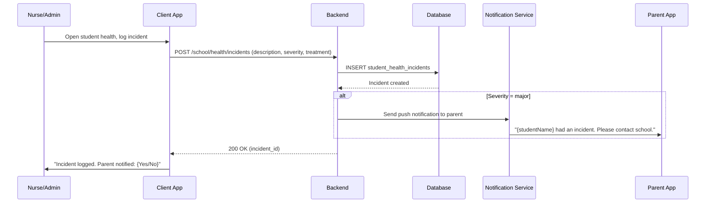
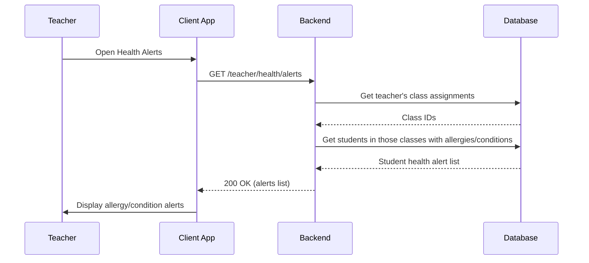
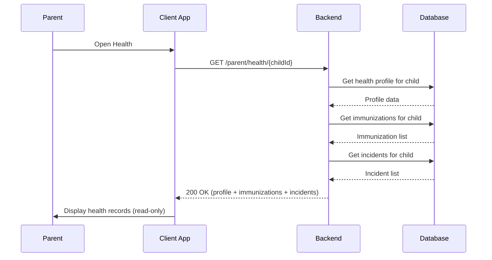
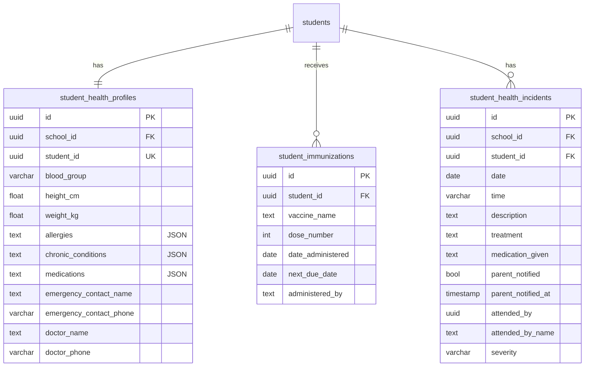

# Student Health Records — Technical Specification

> **Document status:** Implemented (90%) — FR-7 (health checkup scheduling) still pending
> **Last updated:** 2026-06-28
> **Prerequisites:** None
> **Template:** `_SPEC_TEMPLATE.md` v1 (25 mandatory + 6 optional sections)

---

## 1. Feature Overview

Student health and immunization record management: medical history, allergies, medications, immunization tracking, emergency contacts, and health incident logging.

### Goals

- Admin/nurse maintains student health profiles
- Track immunizations (vaccine, date, next due)
- Allergy and medical condition alerts (visible to teachers)
- Health incident logging (what happened, treatment, parent notified)
- Emergency contact and blood group
- Parent can view child's health records

### Non-goals

- [ ] Health checkup scheduling and results (FR-7, pending)
- [ ] Prescription management / pharmacy integration
- [ ] Telemedicine integration
- [ ] Mental health counseling records

### Dependencies

- `StudentsTable` — student lookup
- `NotificationService` — parent notification on health incidents
- `AppUsersTable` — staff lookup for incident attendance

### Related Modules

- `server/.../feature/health/` — health services and routing
- `server/.../feature/students/` — student management
- `server/.../feature/notifications/` — notification service

---

## 2. Current System Assessment

### Existing Code

- **Implemented** in commit `14a59a9` (2026-06-27) — DB migration `migration_050_health_records.sql`, Exposed tables, services, routing, and client UI all shipped
- `StudentHealthProfilesTable` (`Tables.kt`) — blood group, height, weight, allergies, chronic conditions, medications, emergency contact, doctor info
- `StudentImmunizationsTable` (`Tables.kt`) — vaccine name, dose number, date administered, next due, administered by
- `StudentHealthIncidentsTable` (`Tables.kt`) — date, time, description, treatment, medication, parent notified, severity, attended by
- `HealthRouting.kt` (`server/.../feature/health/`) — admin/nurse CRUD, teacher alerts, parent read-only endpoints
- Client UI: `HealthRecordsScreenV2.kt` (admin), `ParentHealthScreenV2.kt` (parent), `TeacherHealthAlertsScreenV2.kt` (teacher)
- Shared layer: `HealthApi.kt`, `HealthRepositoryImpl.kt`, `HealthDtos.kt`, `AdminHealthViewModel.kt`, `ParentHealthViewModel.kt`, `TeacherHealthAlertsViewModel.kt`
- FR-7 (health checkup scheduling and results) is the only remaining unimplemented requirement

### Existing Database

- `StudentHealthProfilesTable` — blood group, height, weight, allergies, chronic conditions, medications, emergency contact, doctor info
- `StudentImmunizationsTable` — vaccine name, dose number, date administered, next due, administered by
- `StudentHealthIncidentsTable` — date, time, description, treatment, medication, parent notified, severity, attended by

### Existing APIs

- `GET/POST /api/v1/school/health/profiles/{studentId}` — health profile CRUD
- `POST /api/v1/school/health/immunizations` — immunization records
- `POST /api/v1/school/health/incidents` — health incident logging
- `GET /api/v1/school/health/incidents` — incident query with filters
- `GET /api/v1/teacher/health/alerts` — allergy/condition alerts for teachers
- `GET /api/v1/parent/health/{childId}` — parent view of child's health records

### Existing UI

- `HealthRecordsScreenV2.kt` (admin) — health profile management, immunization tracking, incident logging
- `ParentHealthScreenV2.kt` (parent) — view child's health records
- `TeacherHealthAlertsScreenV2.kt` (teacher) — allergy and condition alerts for assigned classes

### Existing Services

- `HealthProfileService` — health profile CRUD
- `HealthImmunizationService` — immunization tracking
- `HealthIncidentService` — incident logging and notification
- `NotificationService` — push/in-app notifications

### Existing Documentation

- `feature_audit.csv` — feature audit tracking
- Migration: `docs/db/migration_050_health_records.sql`

### Technical Debt

| # | Gap | Details |
|---|---|---|
| TD-1 | FR-7 not implemented | Health checkup scheduling and results pending |
| TD-2 | No checkup reminders | No automated reminders for upcoming checkups |
| TD-3 | No health reports | No aggregate health analytics |

### Gaps

| # | Gap | Impact | Severity |
|---|---|---|---|
| G1 | No health checkup scheduling | Cannot schedule or track annual checkups | **Medium** |
| G2 | No immunization due reminders | Parents not reminded of upcoming immunizations | **Low** |
| G3 | No health trend analysis | Cannot track height/weight trends over time | **Low** |

---

## 3. Functional Requirements

### FR-001
| Field | Value |
|---|---|
| **Title** | Student Health Profile |
| **Description** | Health profile per student: blood group, height, weight, allergies, chronic conditions, medications |
| **Priority** | Critical |
| **User Roles** | School Admin, Nurse |
| **Acceptance notes** | Implemented; profile with all fields stored as JSON for allergies, conditions, medications |
| **Status** | ✅ Implemented |

### FR-002
| Field | Value |
|---|---|
| **Title** | Immunization Tracking |
| **Description** | Immunization tracking: vaccine name, date administered, next due date, booster schedule |
| **Priority** | High |
| **User Roles** | School Admin, Nurse |
| **Acceptance notes** | Implemented; immunization records with next-due tracking |
| **Status** | ✅ Implemented |

### FR-003
| Field | Value |
|---|---|
| **Title** | Health Incident Log |
| **Description** | Health incident log: date, description, treatment, medication given, parent notified (Y/N), staff who attended |
| **Priority** | Critical |
| **User Roles** | School Admin, Nurse, Teacher |
| **Acceptance notes** | Implemented; incidents logged with severity, treatment, parent notification tracking |
| **Status** | ✅ Implemented |

### FR-004
| Field | Value |
|---|---|
| **Title** | Allergy Alerts for Teachers |
| **Description** | Allergy alerts visible to teachers on student profile |
| **Priority** | High |
| **User Roles** | Teacher |
| **Acceptance notes** | Implemented; teachers see allergy/condition alerts for assigned classes |
| **Status** | ✅ Implemented |

### FR-005
| Field | Value |
|---|---|
| **Title** | Parent Health Records View |
| **Description** | Parent can view child's health records |
| **Priority** | High |
| **User Roles** | Parent |
| **Acceptance notes** | Implemented; parent can view profile, immunizations, and incidents |
| **Status** | ✅ Implemented |

### FR-006
| Field | Value |
|---|---|
| **Title** | Emergency Contact and Doctor Info |
| **Description** | Emergency contact + doctor information |
| **Priority** | High |
| **User Roles** | School Admin, Nurse |
| **Acceptance notes** | Implemented; emergency contact name/phone and doctor name/phone stored |
| **Status** | ✅ Implemented |

### FR-007
| Field | Value |
|---|---|
| **Title** | Health Checkup Scheduling |
| **Description** | Health checkup scheduling and results |
| **Priority** | Medium |
| **User Roles** | School Admin, Nurse |
| **Acceptance notes** | Not yet implemented; schedule annual checkups, record results (height, weight, vision, dental) |
| **Status** | ❌ Pending |

---

## 4. User Stories

### School Admin / Nurse
- [x] Create and maintain a student's health profile with blood group, allergies, and conditions
- [x] Record immunizations with vaccine name, date, and next due date
- [x] Log health incidents with treatment details and parent notification
- [x] View all students with allergy alerts
- [ ] Schedule annual health checkups and record results

### Teacher
- [x] View allergy and medical condition alerts for students in my classes
- [x] Know which students have chronic conditions (asthma, diabetes, etc.)

### Parent
- [x] View my child's health profile, immunizations, and incident history
- [x] See emergency contact and doctor information on file
- [ ] Receive notifications about my child's health incidents

### System
- [x] Store health profile with JSON fields for allergies, conditions, medications
- [x] Track immunization next-due dates
- [x] Log health incidents with severity and parent notification status
- [ ] Send immunization due reminders (future enhancement)

---

## 5. Business Rules

### BR-001
**Rule:** One health profile per student.
**Enforcement:** `student_health_profiles.student_id` is UNIQUE.

### BR-002
**Rule:** Allergy and chronic condition alerts visible to teachers for assigned classes only.
**Enforcement:** Teacher health alerts API filters by teacher's class assignments.

### BR-003
**Rule:** Parent notified flag on health incidents tracks whether parent was informed.
**Enforcement:** `parent_notified` boolean + `parent_notified_at` timestamp on incidents.

### BR-004
**Rule:** Immunization next-due date calculated based on vaccine schedule.
**Enforcement:** `next_due_date` set by nurse based on vaccine booster schedule.

### BR-005
**Rule:** Health incidents have severity levels: minor, moderate, major.
**Enforcement:** `severity` field with default `minor`; major incidents trigger immediate parent notification.

### BR-006
**Rule:** Parent has read-only access to child's health records.
**Enforcement:** Parent API endpoints are GET-only; no create/update/delete for parents.

---

## 6. Database Design

### 6.1 Entity Relationship Summary

Three tables: `student_health_profiles` (one per student), `student_immunizations` (many per student), `student_health_incidents` (many per student). All linked by `student_id`.

### 6.2 New Tables

```sql
CREATE TABLE student_health_profiles (
    id              UUID PRIMARY KEY DEFAULT gen_random_uuid(),
    school_id       UUID NOT NULL,
    student_id      UUID NOT NULL UNIQUE,
    blood_group     VARCHAR(8),
    height_cm       REAL,
    weight_kg       REAL,
    allergies       TEXT,                          -- JSON array: ["Peanuts", "Penicillin"]
    chronic_conditions TEXT,                       -- JSON: [{"condition": "Asthma", "notes": "..."}]
    medications     TEXT,                          -- JSON: [{"name": "Inhaler", "dose": "...", "frequency": "..."}]
    emergency_contact_name TEXT,
    emergency_contact_phone VARCHAR(32),
    doctor_name     TEXT,
    doctor_phone    VARCHAR(32),
    updated_at      TIMESTAMP NOT NULL DEFAULT now(),
    created_at      TIMESTAMP NOT NULL DEFAULT now()
);

CREATE TABLE student_immunizations (
    id              UUID PRIMARY KEY DEFAULT gen_random_uuid(),
    student_id      UUID NOT NULL,
    vaccine_name    TEXT NOT NULL,                 -- "BCG", "DPT", "MMR", "COVID-19"
    dose_number    INTEGER NOT NULL DEFAULT 1,
    date_administered DATE NOT NULL,
    next_due_date   DATE,
    administered_by TEXT,                          -- doctor/clinic name
    created_at      TIMESTAMP NOT NULL DEFAULT now()
);

CREATE TABLE student_health_incidents (
    id              UUID PRIMARY KEY DEFAULT gen_random_uuid(),
    school_id       UUID NOT NULL,
    student_id      UUID NOT NULL,
    date            DATE NOT NULL,
    time            VARCHAR(8),
    description     TEXT NOT NULL,                 -- "Fell during recess, scraped knee"
    treatment       TEXT,                          -- "Cleaned with antiseptic, bandage applied"
    medication_given TEXT,
    parent_notified BOOLEAN NOT NULL DEFAULT false,
    parent_notified_at TIMESTAMP,
    attended_by     UUID,                          -- staff who handled
    attended_by_name TEXT,
    severity        VARCHAR(16) NOT NULL DEFAULT 'minor', -- minor | moderate | major
    created_at      TIMESTAMP NOT NULL DEFAULT now()
);
```

### 6.3 Modified Tables

N/A — no existing tables modified.

### 6.4 Indexes

```sql
CREATE INDEX idx_immunizations_student ON student_immunizations(student_id);
CREATE INDEX idx_health_incidents_student ON student_health_incidents(student_id, date DESC);
```

### 6.5 Constraints

- `student_health_profiles.student_id` — NOT NULL, UNIQUE
- `student_immunizations.vaccine_name` — NOT NULL
- `student_immunizations.date_administered` — NOT NULL
- `student_health_incidents.description` — NOT NULL
- `student_health_incidents.severity` — NOT NULL, DEFAULT `minor`

### 6.6 Foreign Keys

- `student_health_profiles.student_id` → `students.id` (logical, not enforced via FK)
- `student_immunizations.student_id` → `students.id` (logical)
- `student_health_incidents.student_id` → `students.id` (logical)
- `student_health_incidents.attended_by` → `app_users.id` (logical)

### 6.7 Soft Delete Strategy

N/A — health records are immutable. No soft delete. Profiles can be updated but not deleted.

### 6.8 Audit Fields

- `created_at` — creation timestamp (all tables)
- `updated_at` — last update timestamp (profiles only)
- `parent_notified_at` — when parent was notified (incidents)
- `date_administered` — when immunization given
- `next_due_date` — next immunization due

### 6.9 Migration Notes

Migration: `docs/db/migration_050_health_records.sql` — already deployed.
- Creates 3 health tables with indexes
- No data backfill needed (new feature)

### 6.10 Exposed Mappings

```kotlin
object StudentHealthProfilesTable : UUIDTable("student_health_profiles", "id") {
    val schoolId              = uuid("school_id")
    val studentId             = uuid("student_id").uniqueIndex()
    val bloodGroup            = varchar("blood_group", 8).nullable()
    val heightCm              = float("height_cm").nullable()
    val weightKg              = float("weight_kg").nullable()
    val allergies             = text("allergies").nullable()  // JSON
    val chronicConditions     = text("chronic_conditions").nullable()  // JSON
    val medications           = text("medications").nullable()  // JSON
    val emergencyContactName  = text("emergency_contact_name").nullable()
    val emergencyContactPhone = varchar("emergency_contact_phone", 32).nullable()
    val doctorName            = text("doctor_name").nullable()
    val doctorPhone           = varchar("doctor_phone", 32).nullable()
    val updatedAt             = timestamp("updated_at")
    val createdAt             = timestamp("created_at")
}

object StudentImmunizationsTable : UUIDTable("student_immunizations", "id") {
    val studentId        = uuid("student_id")
    val vaccineName      = text("vaccine_name")
    val doseNumber       = integer("dose_number").default(1)
    val dateAdministered = date("date_administered")
    val nextDueDate      = date("next_due_date").nullable()
    val administeredBy   = text("administered_by").nullable()
    val createdAt        = timestamp("created_at")
    init {
        index("idx_immunizations_student", false, studentId)
    }
}

object StudentHealthIncidentsTable : UUIDTable("student_health_incidents", "id") {
    val schoolId         = uuid("school_id")
    val studentId        = uuid("student_id")
    val date             = date("date")
    val time             = varchar("time", 8).nullable()
    val description      = text("description")
    val treatment        = text("treatment").nullable()
    val medicationGiven  = text("medication_given").nullable()
    val parentNotified   = bool("parent_notified").default(false)
    val parentNotifiedAt = timestamp("parent_notified_at").nullable()
    val attendedBy       = uuid("attended_by").nullable()
    val attendedByName   = text("attended_by_name").nullable()
    val severity         = varchar("severity", 16).default("minor")
    val createdAt        = timestamp("created_at")
    init {
        index("idx_health_incidents_student", false, studentId, date)
    }
}
```

### 6.11 Seed Data

N/A — health profiles created per student by admin/nurse.

---

## 7. State Machines

### Health Incident State Machine

```
LOGGED ──parent_notified──> PARENT_INFORMED ──resolved──> CLOSED
LOGGED ──resolved──> CLOSED (without parent notification for minor)
```

| Current State | Event | Next State | Guard / Condition |
|---|---|---|---|
| `logged` | Parent notified | `parent_informed` | `parent_notified = true` |
| `logged` | Incident resolved (minor) | `closed` | Severity = minor |
| `parent_informed` | Incident resolved | `closed` | — |

### Immunization State Machine

```
ADMINISTERED ──next_due_reached──> DUE ──booster_administered──> ADMINISTERED
ADMINISTERED ──no_next_due──> COMPLETE
DUE ──overdue──> OVERDUE
```

| Current State | Event | Next State | Guard / Condition |
|---|---|---|---|
| `administered` | Next due date reached | `due` | `next_due_date` is set and reached |
| `administered` | No next due | `complete` | `next_due_date` is null |
| `due` | Booster administered | `administered` | New immunization record created |
| `due` | Due date passed | `overdue` | `next_due_date < today` |

---

## 8. Backend Architecture

### 8.1 Component Overview

Three services handle health records: `HealthProfileService`, `HealthImmunizationService`, `HealthIncidentService`. `HealthRouting` exposes API endpoints for admin/nurse, teacher, and parent roles.

### 8.2 Design Principles

1. **One profile per student** — health profile is unique per student
2. **JSON for flexible fields** — allergies, chronic conditions, medications stored as JSON
3. **Teacher alerts** — allergy/condition alerts filtered by teacher's class assignments
4. **Parent read-only** — parents can view but not modify health records
5. **Incident tracking** — all health incidents logged with severity and parent notification

### 8.3 Core Types

```kotlin
class HealthProfileService {
    suspend fun getOrCreate(studentId: UUID): StudentHealthProfileDto
    suspend fun update(studentId: UUID, profile: HealthProfileUpdateDto): StudentHealthProfileDto
}

class HealthImmunizationService {
    suspend fun addImmunization(studentId: UUID, immunization: ImmunizationDto): UUID
    suspend fun getByStudent(studentId: UUID): List<ImmunizationDto>
    suspend fun getDueReminders(schoolId: UUID): List<ImmunizationDto>
}

class HealthIncidentService {
    suspend fun logIncident(incident: HealthIncidentDto): UUID
    suspend fun getByStudent(studentId: UUID, dateFrom: LocalDate?, dateTo: LocalDate?): List<HealthIncidentDto>
    suspend fun getBySchool(schoolId: UUID, filters: IncidentFilters): List<HealthIncidentDto>
    suspend fun notifyParent(incidentId: UUID): Unit
}
```

### 8.4 Repositories

- `HealthProfileRepository` — CRUD for health profiles
- `HealthImmunizationRepository` — CRUD for immunizations
- `HealthIncidentRepository` — CRUD for incidents

### 8.5 Mappers

- `HealthProfileMapper` — maps DB rows to DTOs; parses JSON fields
- `ImmunizationMapper` — maps immunization rows to DTOs
- `HealthIncidentMapper` — maps incident rows to DTOs

### 8.6 Permission Checks

- Profile CRUD: school admin or nurse
- Immunization CRUD: school admin or nurse
- Incident CRUD: school admin, nurse, or teacher (can log)
- Teacher alerts: teacher (own classes only)
- Parent view: parent (own child only)

### 8.7 Background Jobs

### Immunization Due Reminder Job

| Job | Schedule | Description |
|---|---|---|
| `ImmunizationDueReminderJob` | Daily | Check immunizations with `next_due_date` within 7 days; notify parents |

**Implementation:**
1. Query `student_immunizations` where `next_due_date` between today and today+7
2. For each due immunization, send notification to parent
3. Log notification count

### 8.8 Domain Events

- `HealthProfileCreated` — emitted when profile first created
- `HealthProfileUpdated` — emitted when profile updated
- `ImmunizationRecorded` — emitted when immunization added
- `HealthIncidentLogged` — emitted when incident logged
- `ParentNotifiedOfIncident` — emitted when parent notification sent

### 8.9 Caching

- Teacher health alerts cached for 5 minutes (changes infrequently)
- Student health profile cached for 1 minute

### 8.10 Transactions

- Profile update: single UPDATE (no transaction needed)
- Incident logging: INSERT incident + send notification (notification is async)

### 8.11 Rate Limiting

- Standard API rate limiting
- No special rate limiting needed

### 8.12 Configuration

- `HEALTH_IMMUNIZATION_REMINDER_DAYS` — default 7 (days before due to remind)
- `HEALTH_INCIDENT_AUTO_NOTIFY_PARENT` — default `true` for major severity

---

## 9. API Contracts

### 9.1 Admin/Nurse APIs

```
GET/POST /api/v1/school/health/profiles/{studentId}
POST /api/v1/school/health/immunizations
POST /api/v1/school/health/incidents
GET /api/v1/school/health/incidents?student_id={uuid}&date_from={}&date_to={}
```

### 9.2 Teacher APIs

```
GET /api/v1/teacher/health/alerts  -- allergy + condition alerts for assigned classes
```

### 9.3 Parent APIs

```
GET /api/v1/parent/health/{childId}
```

### 9.4 Example Responses

**Health Profile Response 200:**
```json
{
  "success": true,
  "data": {
    "student_id": "uuid",
    "blood_group": "O+",
    "height_cm": 140.5,
    "weight_kg": 35.0,
    "allergies": ["Peanuts", "Penicillin"],
    "chronic_conditions": [
      {"condition": "Asthma", "notes": "Carries inhaler"}
    ],
    "medications": [
      {"name": "Inhaler", "dose": "2 puffs", "frequency": "As needed"}
    ],
    "emergency_contact_name": "Raj Sharma",
    "emergency_contact_phone": "+91-9876543210",
    "doctor_name": "Dr. Mehta",
    "doctor_phone": "+91-9876543211"
  }
}
```

**Teacher Health Alerts Response 200:**
```json
{
  "success": true,
  "data": [
    {
      "student_id": "uuid",
      "student_name": "Aarav Sharma",
      "class_name": "5-A",
      "allergies": ["Peanuts"],
      "chronic_conditions": [
        {"condition": "Asthma", "notes": "Carries inhaler"}
      ]
    }
  ]
}
```

**Health Incident Response 200:**
```json
{
  "success": true,
  "data": {
    "id": "uuid",
    "student_id": "uuid",
    "date": "2026-06-27",
    "time": "12:30",
    "description": "Fell during recess, scraped knee",
    "treatment": "Cleaned with antiseptic, bandage applied",
    "medication_given": null,
    "parent_notified": true,
    "parent_notified_at": "2026-06-27T12:45:00Z",
    "attended_by_name": "Nurse Priya",
    "severity": "minor"
  }
}
```

---

## 10. Frontend Architecture

### 10.1 Screens

| Screen | Platform | Role | Description |
|---|---|---|---|
| `HealthRecordsScreenV2.kt` | All | Admin, Nurse | Health profile, immunization, incident management |
| `ParentHealthScreenV2.kt` | All | Parent | View child's health records (read-only) |
| `TeacherHealthAlertsScreenV2.kt` | All | Teacher | Allergy/condition alerts for assigned classes |

### 10.2 Navigation

- Admin portal → Health → `HealthRecordsScreenV2`
- Parent portal → Health → `ParentHealthScreenV2`
- Teacher portal → Health Alerts → `TeacherHealthAlertsScreenV2`

### 10.3 UX Flows

#### Admin/Nurse: Update Health Profile

1. Admin searches for student
2. Opens health profile
3. Updates blood group, height, weight, allergies, conditions, medications
4. Enters emergency contact and doctor info
5. Saves profile

#### Admin/Nurse: Log Health Incident

1. Admin/nurse opens student health record
2. Clicks "Log Incident"
3. Enters date, time, description, treatment, medication given
4. Selects severity (minor/moderate/major)
5. Marks parent as notified (checkbox)
6. Saves incident

#### Teacher: View Health Alerts

1. Teacher opens Health Alerts
2. List of students with allergies/conditions in their classes
3. Taps student to see details (allergies, conditions, medications)

#### Parent: View Child's Health Records

1. Parent opens Health
2. Views child's health profile (blood group, allergies, conditions, medications)
3. Views immunization history
4. Views health incident history

### 10.4 State Management

```kotlin
data class HealthRecordsState(
    val profile: StudentHealthProfileDto?,
    val immunizations: List<ImmunizationDto>,
    val incidents: List<HealthIncidentDto>,
    val isLoading: Boolean,
    val error: String?,
)
```

### 10.5 Offline Support

- Health profile cached for offline viewing
- Incident logging requires network connection
- Immunization records cached for offline viewing

### 10.6 Loading States

- Loading profile: "Loading health profile..."
- Loading incidents: "Loading health incidents..."
- Loading alerts: "Loading health alerts..."

### 10.7 Error Handling (UI)

- No profile: "No health profile on file. Create one."
- No incidents: "No health incidents recorded."
- No alerts: "No health alerts for your classes."
- Save failed: "Could not save. Please try again."

### 10.8 Component Integration Guidelines

| Rule | Description |
|---|---|
| **R1** | Allergy badges with color coding (red for severe, yellow for moderate) |
| **R2** | Chronic condition cards with notes |
| **R3** | Immunization timeline with next-due indicators |
| **R4** | Incident log with severity badges and parent-notified status |
| **R5** | Emergency contact card with call button |
| **R6** | Teacher alerts filtered by assigned classes |

---

## 11. Shared Module Changes (KMP)

### 11.1 DTOs

```kotlin
data class StudentHealthProfileDto(
    val studentId: UUID,
    val bloodGroup: String?,
    val heightCm: Float?,
    val weightKg: Float?,
    val allergies: List<String>,
    val chronicConditions: List<ChronicConditionDto>,
    val medications: List<MedicationDto>,
    val emergencyContactName: String?,
    val emergencyContactPhone: String?,
    val doctorName: String?,
    val doctorPhone: String?,
)

data class ChronicConditionDto(
    val condition: String,
    val notes: String?,
)

data class MedicationDto(
    val name: String,
    val dose: String?,
    val frequency: String?,
)

data class ImmunizationDto(
    val id: UUID,
    val studentId: UUID,
    val vaccineName: String,
    val doseNumber: Int,
    val dateAdministered: LocalDate,
    val nextDueDate: LocalDate?,
    val administeredBy: String?,
)

data class HealthIncidentDto(
    val id: UUID,
    val studentId: UUID,
    val date: LocalDate,
    val time: String?,
    val description: String,
    val treatment: String?,
    val medicationGiven: String?,
    val parentNotified: Boolean,
    val parentNotifiedAt: Instant?,
    val attendedByName: String?,
    val severity: String,
)

data class TeacherHealthAlertDto(
    val studentId: UUID,
    val studentName: String,
    val className: String,
    val allergies: List<String>,
    val chronicConditions: List<ChronicConditionDto>,
)
```

### 11.2 Domain Models

```kotlin
data class StudentHealthProfile(
    val id: UUID,
    val schoolId: UUID,
    val studentId: UUID,
    val bloodGroup: String?,
    val heightCm: Float?,
    val weightKg: Float?,
    val allergies: List<String>,
    val chronicConditions: List<ChronicCondition>,
    val medications: List<Medication>,
    val emergencyContactName: String?,
    val emergencyContactPhone: String?,
    val doctorName: String?,
    val doctorPhone: String?,
)
```

### 11.3 Repository Interfaces

```kotlin
interface HealthProfileRepository {
    suspend fun getOrCreate(studentId: UUID, schoolId: UUID): StudentHealthProfileDto
    suspend fun update(studentId: UUID, profile: HealthProfileUpdate): StudentHealthProfileDto
}

interface HealthImmunizationRepository {
    suspend fun add(immunization: ImmunizationEntity): UUID
    suspend fun getByStudent(studentId: UUID): List<ImmunizationDto>
    suspend fun getDueWithinDays(schoolId: UUID, days: Int): List<ImmunizationDto>
}

interface HealthIncidentRepository {
    suspend fun insert(incident: HealthIncidentEntity): UUID
    suspend fun getByStudent(studentId: UUID, dateFrom: LocalDate?, dateTo: LocalDate?): List<HealthIncidentDto>
    suspend fun getBySchool(schoolId: UUID, filters: IncidentFilters): List<HealthIncidentDto>
}
```

### 11.4 UseCases

- `GetHealthProfileUseCase`
- `UpdateHealthProfileUseCase`
- `AddImmunizationUseCase`
- `GetImmunizationsUseCase`
- `LogHealthIncidentUseCase`
- `GetHealthIncidentsUseCase`
- `GetTeacherHealthAlertsUseCase`
- `GetChildHealthRecordsUseCase`

### 11.5 Validation

- Blood group: valid format (A+, A-, B+, B-, O+, O-, AB+, AB-)
- Height: 50-250 cm
- Weight: 3-150 kg
- Vaccine name: not empty
- Incident description: not empty
- Severity: one of `minor`, `moderate`, `major`

### 11.6 Serialization

Standard Kotlinx serialization for DTOs. JSON fields (allergies, conditions, medications) serialized/deserialized via `Json.decodeFromString` / `Json.encodeToString`.

### 11.7 Network APIs

Defined in `HealthApi.kt`:
- `GET/POST /api/v1/school/health/profiles/{studentId}` — profile CRUD
- `POST /api/v1/school/health/immunizations` — immunization records
- `POST /api/v1/school/health/incidents` — incident logging
- `GET /api/v1/school/health/incidents` — incident query
- `GET /api/v1/teacher/health/alerts` — teacher alerts
- `GET /api/v1/parent/health/{childId}` — parent view

### 11.8 Database Models (Local Cache)

- Health profile cached locally for offline viewing
- Immunization records cached locally
- No incident caching (server-side only)

---

## 12. Permissions Matrix

| Action | Super Admin | School Admin | Nurse | Teacher | Parent |
|---|---|---|---|---|---|
| View health profile | ✅ | ✅ | ✅ | ✅ (own classes) | ✅ (own child) |
| Create/update health profile | ✅ | ✅ | ✅ | ❌ | ❌ |
| Add immunization | ✅ | ✅ | ✅ | ❌ | ❌ |
| View immunizations | ✅ | ✅ | ✅ | ❌ | ✅ (own child) |
| Log health incident | ✅ | ✅ | ✅ | ✅ | ❌ |
| View health incidents | ✅ | ✅ | ✅ | ✅ (own classes) | ✅ (own child) |
| View allergy alerts | ✅ | ✅ | ✅ | ✅ (own classes) | ❌ |
| Notify parent of incident | ✅ | ✅ | ✅ | ✅ | ❌ |

---

## 13. Notifications

### Health Notifications

| Type | Trigger | Channel | Message |
|---|---|---|---|
| Health Incident (minor) | Nurse logs minor incident | In-app (parent) | "{studentName} had a minor incident: {description}. Treatment: {treatment}" |
| Health Incident (moderate/major) | Nurse logs moderate/major incident | Push + In-app (parent) | "{studentName} had an incident: {description}. Please contact school." |
| Immunization Due | Immunization due within 7 days | Push + In-app (parent) | "{studentName}'s {vaccineName} booster is due on {date}." |
| Immunization Overdue | Immunization past due date | Push + In-app (parent) | "{studentName}'s {vaccineName} is overdue. Please schedule." |

---

## 14. Background Jobs

| Job | Schedule | Description |
|---|---|---|
| `ImmunizationDueReminderJob` | Daily | Check immunizations due within 7 days; notify parents |
| `ImmunizationOverdueJob` | Daily | Check overdue immunizations; notify parents |

**Immunization Due Reminder:**
1. Query `student_immunizations` where `next_due_date` between today and today+7
2. For each due immunization:
   - Get parent of student
   - Send notification: "{studentName}'s {vaccineName} booster is due on {date}"
3. Log notification count

**Immunization Overdue:**
1. Query `student_immunizations` where `next_due_date < today` and no newer immunization for same vaccine
2. For each overdue immunization:
   - Get parent of student
   - Send notification: "{studentName}'s {vaccineName} is overdue"
3. Log notification count

---

## 15. Integrations

### Notification Service
| Field | Value |
|---|---|
| **System** | Existing notification infrastructure |
| **Purpose** | Health incident notifications, immunization reminders |
| **API / SDK** | Internal `NotificationService` |
| **Auth method** | Internal service call |
| **Fallback** | In-app notification if push fails |

### StudentsTable
| Field | Value |
|---|---|
| **System** | Existing student management |
| **Purpose** | Student lookup for health profiles |
| **API / SDK** | Direct DB query |
| **Auth method** | Internal |
| **Fallback** | None — student data required |

### AppUsersTable
| Field | Value |
|---|---|
| **System** | Existing user management |
| **Purpose** | Staff lookup for incident attendance |
| **API / SDK** | Direct DB query |
| **Auth method** | Internal |
| **Fallback** | None — staff data for `attended_by` |

### Class/Section Assignments
| Field | Value |
|---|---|
| **System** | Existing class management |
| **Purpose** | Filter teacher health alerts by assigned classes |
| **API / SDK** | Direct DB query |
| **Auth method** | Internal |
| **Fallback** | None — class assignments needed for teacher alerts |

---

## 16. Security

### Authentication
- Admin/Nurse APIs: JWT with school admin or nurse role
- Teacher APIs: JWT with teacher role
- Parent APIs: JWT with parent role

### Authorization
- Profile CRUD: school admin or nurse only
- Immunization CRUD: school admin or nurse only
- Incident logging: school admin, nurse, or teacher
- Teacher alerts: teacher (own classes only)
- Parent view: parent (own child only, read-only)

### Encryption
- All API communication over TLS
- Health data is sensitive — encrypted at rest (DB-level)
- JSON fields (allergies, conditions, medications) stored as plaintext in DB

### Audit Logs
- Health profile creation logged
- Health profile updates logged
- Immunization additions logged
- Health incident logging logged
- Parent notification logged

### PII Handling
- Health profiles contain sensitive medical information (allergies, conditions, medications)
- Emergency contact and doctor phone numbers are PII
- Access restricted to admin, nurse, and teacher (alerts only)
- Parent has read-only access to own child's records

### Data Isolation
- All admin/nurse queries filtered by `school_id` from JWT
- Teacher queries filtered by assigned classes
- Parent queries filtered by `child_id` (verified parent-child relationship)

### Rate Limiting
- Standard API rate limiting
- No special rate limiting needed

### Input Validation
- Blood group: valid format (A+, A-, B+, B-, O+, O-, AB+, AB-)
- Height: 50-250 cm
- Weight: 3-150 kg
- Vaccine name: not empty
- Incident description: not empty
- Severity: one of `minor`, `moderate`, `major`
- Phone numbers: valid format

---

## 17. Performance & Scalability

### Expected Scale

| Metric | Small school | Medium school | Large school |
|---|---|---|---|
| Students | ~200 | ~1,000 | ~5,000 |
| Health profiles | ~200 | ~1,000 | ~5,000 |
| Immunizations | ~600 | ~3,000 | ~15,000 |
| Incidents/year | ~100 | ~500 | ~2,500 |

### Latency Targets

| Operation | Target |
|---|---|
| Get health profile | < 100ms |
| Update health profile | < 100ms |
| Add immunization | < 50ms |
| Log incident | < 100ms |
| Teacher alerts | < 200ms |
| Parent health view | < 200ms |

### Optimization Strategy

- Health profile indexed by `student_id` (UNIQUE)
- Immunizations indexed by `student_id`
- Incidents indexed by `student_id, date DESC`
- Teacher alerts cached for 5 minutes
- Profile cached for 1 minute

---

## 18. Edge Cases

| # | Scenario | Expected Behavior |
|---|---|---|
| EC-001 | No health profile for student | Return empty profile; prompt to create |
| EC-002 | Student with no allergies | Allergies field is empty JSON array `[]` |
| EC-003 | Immunization with no next due | `next_due_date` is null; no reminders sent |
| EC-004 | Incident logged by teacher | Allowed; `attended_by` set to teacher |
| EC-005 | Parent tries to modify health record | 403: "Read-only access" |
| EC-006 | Teacher views student not in their class | 403: "Not assigned to this class" |
| EC-007 | Major severity incident | Auto-notify parent immediately |
| EC-008 | Duplicate immunization for same vaccine/dose | Accepted (allows correction entries) |

### Risks & Mitigations

| Risk | Likelihood | Impact | Mitigation |
|---|---|---|---|
| Unauthorized access to health data | Low | High | Strict role-based access; school-scoped queries |
| Parent not notified of major incident | Low | High | Auto-notify for major severity; audit log |
| Immunization reminder missed | Low | Medium | Daily job with logging |
| JSON parse error on allergies/conditions | Low | Low | Defensive parsing with fallback to empty |

---

## 19. Error Handling

### Standard Error Codes

| HTTP | Error Code | Description | When |
|---|---|---|---|
| 400 | `INVALID_BLOOD_GROUP` | Blood group not valid format | Profile update |
| 400 | `INVALID_HEIGHT` | Height out of valid range | Profile update |
| 400 | `INVALID_WEIGHT` | Weight out of valid range | Profile update |
| 400 | `INVALID_SEVERITY` | Severity not one of minor/moderate/major | Incident log |
| 400 | `EMPTY_DESCRIPTION` | Incident description is empty | Incident log |
| 403 | `INSUFFICIENT_PERMISSIONS` | Unauthorized role | Any endpoint |
| 403 | `NOT_ASSIGNED_TO_CLASS` | Teacher not assigned to student's class | Teacher alerts |
| 403 | `READ_ONLY_ACCESS` | Parent attempting write operation | Parent endpoint |
| 404 | `STUDENT_NOT_FOUND` | Student does not exist | Any endpoint |

### Error Response Format

Same as existing API error format.

### Recovery Strategy

| Error | Client Action | Server Action |
|---|---|---|
| `STUDENT_NOT_FOUND` | Show "Student not found" | Return 404 |
| `NOT_ASSIGNED_TO_CLASS` | Show "You don't have access to this student" | Return 403 |
| `READ_ONLY_ACCESS` | Show "You can view but not modify health records" | Return 403 |

---

## 20. Analytics & Reporting

### Reports

- **Health Profile Coverage:** % of students with health profiles
- **Immunization Compliance:** % of students up-to-date on immunizations
- **Incident Report:** Incidents by month, severity, type
- **Allergy Report:** Students with specific allergies (for school planning)
- **Chronic Condition Report:** Students with chronic conditions by class

### KPIs

- **Profile Coverage Rate:** % of students with complete health profiles
- **Immunization Compliance Rate:** % of immunizations not overdue
- **Incident Rate:** Incidents per 100 students per month
- **Parent Notification Rate:** % of incidents where parent was notified
- **Major Incident Count:** Number of major severity incidents per term

### Dashboards

- Admin: health profile coverage, immunization compliance, incident summary
- Nurse: pending immunization reminders, recent incidents

### Exports

- Student health profile export (PDF, for parents)
- Immunization record export (CSV)
- Incident log export (CSV/PDF)

---

## 21. Testing Strategy

### Unit Tests

| Test | What it verifies |
|---|---|
| Profile creation | Correct profile stored with all fields |
| Profile update | Fields updated correctly; JSON fields parsed |
| Immunization addition | Immunization stored with correct fields |
| Incident logging | Incident stored with severity and parent_notified |
| JSON parsing | Allergies, conditions, medications parsed correctly |
| Blood group validation | Invalid blood groups rejected |
| Height/weight validation | Out-of-range values rejected |

### Integration Tests

| Test | What it verifies |
|---|---|
| Create profile → add immunization → log incident → parent views | Full flow |
| Teacher alerts filtered by class | Only assigned class students shown |
| Parent read-only access | Parent cannot modify records |
| Immunization due reminder | Job sends notifications for due immunizations |

### Performance Tests

- [ ] Get health profile < 100ms
- [ ] Teacher alerts < 200ms (with 50 students)
- [ ] Parent health view < 200ms

### Security Tests

- [ ] Non-admin cannot create/update profiles
- [ ] Teacher can only see assigned class students
- [ ] Parent can only view own child's records
- [ ] Parent cannot write to health records

### Migration Tests

- [ ] Migration creates 3 tables with correct schema
- [ ] Indexes created correctly
- [ ] UNIQUE constraint on student_id enforced

---

## 22. Acceptance Criteria

- [x] Health profile maintained per student
- [x] Immunization tracking with next-due alerts
- [x] Health incidents logged with treatment details
- [x] Allergy alerts visible to teachers
- [x] Parent can view child's health records
- [x] Emergency contact information stored
- [ ] Health checkup scheduling and results (FR-7, pending)
- [ ] Immunization due reminders sent automatically
- [ ] Major incident auto-notifies parent

---

## 23. Implementation Roadmap

| Phase | Duration | Tasks | Breaking? | Deliverable | Status |
|---|---|---|---|---|---|
| 1 | 2 days | DB migration, Exposed tables, services | No | Schema + services | ✅ Done |
| 2 | 2 days | API endpoints | No | API available | ✅ Done |
| 3 | 3 days | Client UI (health profile, immunization, incident log, teacher alerts) | No | UI ready | ✅ Done |
| 4 | 1 day | Tests | No | Test coverage | ✅ Done |
| 5 | 2 days | FR-7: Health checkup scheduling and results | No | Checkup feature | ❌ Pending |

**Completed: ~8 days**
**Remaining: ~2 days (FR-7)**

---

## 24. File-Level Impact Analysis

### New Files (Already Deployed)

| File | Location | Purpose | Status |
|---|---|---|---|
| `HealthProfileService.kt` | `server/.../feature/health/` | Profile CRUD | ✅ Deployed |
| `HealthImmunizationService.kt` | `server/.../feature/health/` | Immunization tracking | ✅ Deployed |
| `HealthIncidentService.kt` | `server/.../feature/health/` | Incident logging | ✅ Deployed |
| `HealthRouting.kt` | `server/.../feature/health/` | API endpoints | ✅ Deployed |
| `migration_050_health_records.sql` | `docs/db/` | DDL migration | ✅ Deployed |
| `HealthApi.kt` | `shared/.../feature/health/` | Client API | ✅ Deployed |
| `HealthRepositoryImpl.kt` | `shared/.../feature/health/` | Repository impl | ✅ Deployed |
| `HealthDtos.kt` | `shared/.../feature/health/` | DTOs | ✅ Deployed |
| `AdminHealthViewModel.kt` | `shared/.../feature/health/` | Admin VM | ✅ Deployed |
| `ParentHealthViewModel.kt` | `shared/.../feature/health/` | Parent VM | ✅ Deployed |
| `TeacherHealthAlertsViewModel.kt` | `shared/.../feature/health/` | Teacher VM | ✅ Deployed |
| `HealthRecordsScreenV2.kt` | `composeApp/.../ui/v2/screens/admin/` | Health management | ✅ Deployed |
| `ParentHealthScreenV2.kt` | `composeApp/.../ui/v2/screens/parent/` | Parent health view | ✅ Deployed |
| `TeacherHealthAlertsScreenV2.kt` | `composeApp/.../ui/v2/screens/teacher/` | Teacher alerts | ✅ Deployed |

### Modified Files (Already Deployed)

| File | Change Type | Lines Changed (est.) | Risk | Description | Status |
|---|---|---|---|---|---|
| `server/.../db/Tables.kt` | Add | ~45 | Low | 3 health table objects | ✅ Deployed |
| `server/.../db/DatabaseFactory.kt` | Modify | ~3 | Low | Register 3 tables | ✅ Deployed |

### Files for FR-7 (Pending)

| File | Location | Purpose | Status |
|---|---|---|---|
| `HealthCheckupService.kt` | `server/.../feature/health/` | Checkup scheduling | ❌ Not started |
| `HealthCheckupScreen.kt` | `composeApp/.../ui/v2/screens/admin/` | Checkup UI | ❌ Not started |
| `migration_051_health_checkups.sql` | `docs/db/` | Checkup table | ❌ Not started |

---

## 25. Future Enhancements

### Health Checkup Scheduling (FR-7)

- Schedule annual health checkups per class
- Record checkup results: height, weight, vision, dental, general
- Track BMI and growth trends
- Generate health report cards per student

### Growth Chart Tracking

- Plot height/weight over time on growth charts
- Compare with WHO growth standards
- Flag students below/above normal range
- Parent-visible growth trends

### Vision and Hearing Screening

- Record vision screening results (left/right, with/without glasses)
- Record hearing screening results
- Track changes over time
- Recommend follow-up for abnormal results

### Dental Health Records

- Dental checkup results
- Cavity tracking
- Orthodontic treatment notes
- Dental hygiene recommendations

### Mental Health Records

- Counselor visit logs
- Mental health assessments
- Behavior incident tracking
- Parent communication notes

### Prescription Management

- Track prescribed medications
- Dosage instructions for school hours
- Permission forms for medication administration
- Expiry tracking for prescribed medications

### Health Analytics Dashboard

- School-wide health trends
- Immunization coverage maps
- Allergy distribution by class
- Incident heat maps (location/time)

### Emergency Response Plan

- Emergency contact auto-dial
- Medical emergency protocol per student
- Ambulance/hospital coordination
- Real-time emergency alert to admin and parent

### Integration with National Health Programs

- Sync with national immunization registry
- Government health checkup program integration
- Rasthriya Bal Swasthya Karyakram (RBSK) data sync
- Health card generation for government programs

---

## A. Sequence Diagrams

### Log Health Incident Flow



### Teacher Views Health Alerts



### Parent Views Child Health Records



---

## B. Domain Model / ER Diagram



---

## C. Event Flow

```
ProfileCreated -> Complete
ProfileUpdated -> Complete
ImmunizationAdded -> CheckNextDue -> Complete
IncidentLogged -> CheckSeverity -> Major -> AutoNotifyParent -> Complete
IncidentLogged -> CheckSeverity -> Minor -> Complete
ImmunizationDueReminder -> NotifyParent -> Complete
ImmunizationOverdue -> NotifyParent -> Complete
```

| Event | Emitted By | Consumed By | Side Effect |
|---|---|---|---|
| `HealthProfileCreated` | `HealthProfileService.getOrCreate()` | Analytics | Counter incremented |
| `HealthProfileUpdated` | `HealthProfileService.update()` | Analytics | Counter incremented |
| `ImmunizationRecorded` | `HealthImmunizationService.add()` | Analytics | Counter incremented |
| `HealthIncidentLogged` | `HealthIncidentService.logIncident()` | Notification (if major) | Parent notified for major |
| `ParentNotifiedOfIncident` | `HealthIncidentService.notifyParent()` | Audit | Audit log entry |

---

## D. Configuration

### Environment Variables

| Variable | Description |
|---|---|
| `HEALTH_RECORDS_ENABLED` | Enable/disable feature (default: `true`) |
| `HEALTH_IMMUNIZATION_REMINDER_DAYS` | Days before due to send reminder (default: `7`) |
| `HEALTH_INCIDENT_AUTO_NOTIFY_PARENT` | Auto-notify for major severity (default: `true`) |

### Feature Flags

| Flag | Default | Description |
|---|---|---|
| `health_records_enabled` | `true` | Master switch for health records |
| `health_immunization_reminders` | `true` | Enable immunization due reminders |
| `health_incident_auto_notify` | `true` | Auto-notify parent on major incidents |

### Client-Side Configuration

| Config | Default | Description |
|---|---|---|
| Allergy badge color (severe) | Red | Color for severe allergies |
| Allergy badge color (moderate) | Yellow | Color for moderate allergies |
| Incident severity colors | Green/Yellow/Red | Color coding by severity |

### Server-Side Configuration

| Config | Default | Description |
|---|---|---|
| Immunization reminder days | 7 | Days before due to remind |
| Auto-notify severity threshold | major | Severity that triggers auto-notify |
| Teacher alerts cache TTL | 5 min | Cache duration for teacher alerts |
| Profile cache TTL | 1 min | Cache duration for health profile |

### Infrastructure Requirements

- PostgreSQL with JSON support for allergies/conditions/medications
- Notification infrastructure (FCM/APNs) for incident alerts

---

## E. Migration & Rollback

### Deployment Plan (Already Deployed)

1. [x] Run `migration_050_health_records.sql` — creates 3 tables + indexes
2. [x] Deploy 3 health table objects in `Tables.kt`
3. [x] Register tables in `DatabaseFactory.kt`
4. [x] Deploy health services (profile, immunization, incident)
5. [x] Deploy `HealthRouting.kt` (API endpoints)
6. [x] Deploy client UI (admin, parent, teacher)
7. [x] Deploy shared layer (API, repository, DTOs, view models)
8. [x] Deploy to production

### Rollback Plan

1. [ ] Disable feature flag `health_records_enabled` → API returns 404
2. [ ] Remove client UI → health screens not shown
3. [ ] Database: `DROP TABLE IF EXISTS student_health_incidents; DROP TABLE IF EXISTS student_immunizations; DROP TABLE IF EXISTS student_health_profiles;`
4. [ ] No data loss — health records are additive; student data unaffected

### Data Backfill

N/A — health profiles created per student by admin/nurse.

### Migration SQL

```sql
-- migration_050_health_records.sql (already deployed)
CREATE TABLE IF NOT EXISTS student_health_profiles (
    id              UUID PRIMARY KEY DEFAULT gen_random_uuid(),
    school_id       UUID NOT NULL,
    student_id      UUID NOT NULL UNIQUE,
    blood_group     VARCHAR(8),
    height_cm       REAL,
    weight_kg       REAL,
    allergies       TEXT,
    chronic_conditions TEXT,
    medications     TEXT,
    emergency_contact_name TEXT,
    emergency_contact_phone VARCHAR(32),
    doctor_name     TEXT,
    doctor_phone    VARCHAR(32),
    updated_at      TIMESTAMP NOT NULL DEFAULT now(),
    created_at      TIMESTAMP NOT NULL DEFAULT now()
);

CREATE TABLE IF NOT EXISTS student_immunizations (
    id              UUID PRIMARY KEY DEFAULT gen_random_uuid(),
    student_id      UUID NOT NULL,
    vaccine_name    TEXT NOT NULL,
    dose_number    INTEGER NOT NULL DEFAULT 1,
    date_administered DATE NOT NULL,
    next_due_date   DATE,
    administered_by TEXT,
    created_at      TIMESTAMP NOT NULL DEFAULT now()
);

CREATE INDEX IF NOT EXISTS idx_immunizations_student ON student_immunizations(student_id);

CREATE TABLE IF NOT EXISTS student_health_incidents (
    id              UUID PRIMARY KEY DEFAULT gen_random_uuid(),
    school_id       UUID NOT NULL,
    student_id      UUID NOT NULL,
    date            DATE NOT NULL,
    time            VARCHAR(8),
    description     TEXT NOT NULL,
    treatment       TEXT,
    medication_given TEXT,
    parent_notified BOOLEAN NOT NULL DEFAULT false,
    parent_notified_at TIMESTAMP,
    attended_by     UUID,
    attended_by_name TEXT,
    severity        VARCHAR(16) NOT NULL DEFAULT 'minor',
    created_at      TIMESTAMP NOT NULL DEFAULT now()
);

CREATE INDEX IF NOT EXISTS idx_health_incidents_student ON student_health_incidents(student_id, date DESC);

-- ROLLBACK:
-- DROP TABLE IF EXISTS student_health_incidents;
-- DROP TABLE IF EXISTS student_immunizations;
-- DROP TABLE IF EXISTS student_health_profiles;
```

---

## F. Observability

### Logging

- Profile created: INFO `health_profile_created` (studentId, schoolId)
- Profile updated: INFO `health_profile_updated` (studentId, fields changed)
- Immunization added: INFO `health_immunization_added` (studentId, vaccineName, doseNumber)
- Incident logged: INFO `health_incident_logged` (studentId, severity, description)
- Parent notified: INFO `health_parent_notified` (incidentId, studentId, channel)
- Immunization reminder sent: INFO `health_immunization_reminder` (studentId, vaccineName, dueDate)
- Immunization overdue: WARN `health_immunization_overdue` (studentId, vaccineName, daysOverdue)
- Teacher alerts viewed: DEBUG `health_teacher_alerts_viewed` (teacherId, studentCount)

### Metrics

| Metric | Type | Description |
|---|---|---|
| `health.profiles_total` | Gauge | Total health profiles |
| `health.profile_coverage` | Gauge | % of students with profiles |
| `health.immunizations_total` | Counter | Total immunizations recorded |
| `health.immunizations_due` | Gauge | Immunizations due within 7 days |
| `health.immunizations_overdue` | Gauge | Overdue immunizations |
| `health.incidents_total` | Counter | Total incidents logged |
| `health.incidents_by_severity` | Counter (by severity) | Incidents by severity |
| `health.parent_notifications_total` | Counter | Parent notifications sent |
| `health.teacher_alerts_views` | Counter | Teacher alert views |

### Health Checks

- `GET /api/v1/health` — existing health check

### Alerts

- Profile coverage < 80% → Info (students without health profiles)
- Immunization overdue rate > 10% → Warning (students behind on immunizations)
- Major incident count > 5 per month → Warning (review safety procedures)
- Parent notification failure rate > 5% → Warning (notification issues)
