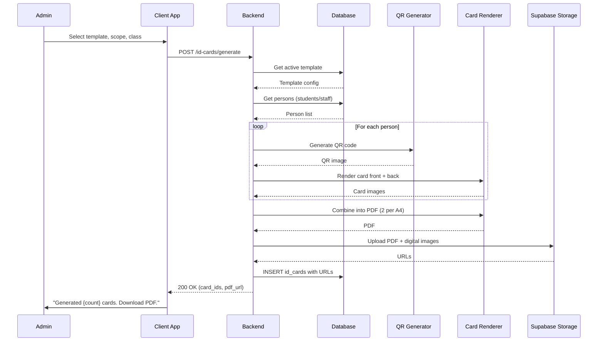
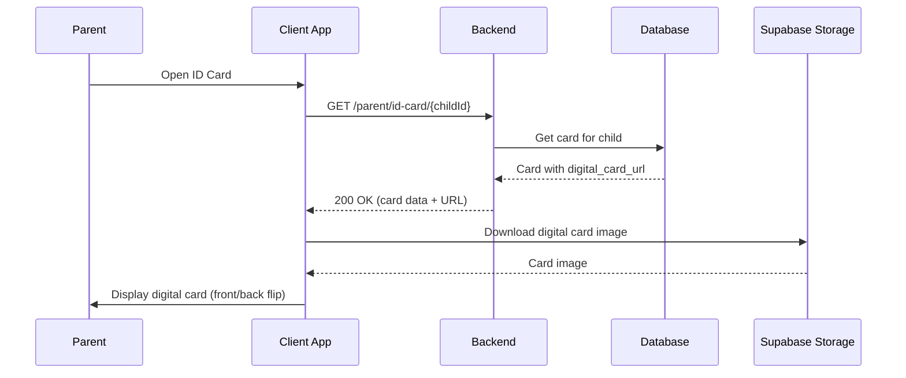
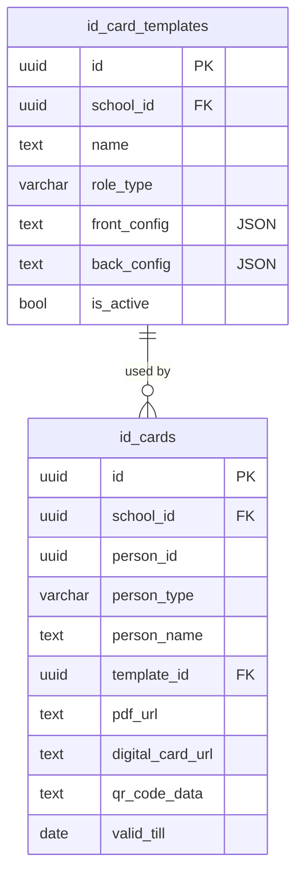

# ID Card Generation — Technical Specification

> **Document status:** Implementation-ready blueprint
> **Last updated:** 2026-06-27
> **Prerequisites:** None
> **Template:** `_SPEC_TEMPLATE.md` v1 (25 mandatory + 6 optional sections)

---

## 1. Feature Overview

Generate printable ID cards for students, teachers, and non-teaching staff with school branding, photo, QR code, and emergency contact info.

### Goals

- Admin selects template (student/teacher/staff) and generates ID cards
- Card includes: photo, name, role, class/department, school name + logo, QR code (links to profile), emergency contact, blood group, valid till
- Bulk generation for entire class or all staff
- PDF export (printable, ID-card size: 54mm × 86mm)
- Digital ID card in app (parent/student can show on phone)

### Non-goals

- [ ] NFC-enabled smart ID cards
- [ ] Physical card printing integration
- [ ] Access control / door entry integration
- [ ] Biometric ID cards

### Dependencies

- `StudentsTable` — student data (photo, name, class, blood group)
- `AppUsersTable` — teacher data (name, role)
- `NonTeachingStaffTable` — staff data (photo, role, department)
- `SchoolsTable` — school branding (name, logo, colors)
- Supabase Storage — PDF and digital card image storage
- QR code generation library

### Related Modules

- `server/.../feature/students/` — student management
- `server/.../feature/staff/` — staff management
- `server/.../feature/school/` — school settings

---

## 2. Current System Assessment

### Existing Code

- `feature_audit.csv` Gap #11: ID Card missing (0%)
- `StudentsTable` has `photoUrl`, `bloodGroup` (if exists)
- `AppUsersTable` has `fullName`, `role`
- `SchoolsTable` has `name`, `logoUrl`
- `NonTeachingStaffTable` has `photoUrl`, `role`, `department`

### Existing Database

- `StudentsTable` — student records with photo URL
- `AppUsersTable` — user accounts with full name and role
- `SchoolsTable` — school name, logo URL
- `NonTeachingStaffTable` — staff with photo, role, department
- No ID card tables exist

### Existing APIs

- `GET /api/v1/school/students` — student data
- `GET /api/v1/school/staff` — staff data
- `GET /api/v1/school` — school settings
- No ID card APIs exist

### Existing UI

- Admin: student management, staff management, school settings
- Parent: dashboard
- No ID card UI

### Existing Services

- `StudentService` — student CRUD
- `StaffService` — staff CRUD
- No ID card services

### Existing Documentation

- `feature_audit.csv` — feature audit tracking (ID card at 0%)
- `DIFFERENTIATING_FEATURES.md` — ID card feature description

### Technical Debt

| # | Gap | Details |
|---|---|---|
| TD-1 | No ID card generation | 0% implementation |
| TD-2 | No ID card tables | No DB schema for templates or cards |
| TD-3 | No QR code generation | No QR code infrastructure |

### Gaps

| # | Gap | Impact | Severity |
|---|---|---|---|
| G1 | No ID card templates | Cannot configure card layout | **High** |
| G2 | No card generation | Cannot produce ID cards | **High** |
| G3 | No QR code | Cannot link to profile verification | **Medium** |
| G4 | No digital ID card | No in-app ID card display | **Medium** |

---

## 3. Functional Requirements

### FR-001
| Field | Value |
|---|---|
| **Title** | Bulk ID Card Generation |
| **Description** | Admin selects class/department → bulk generate ID cards |
| **Priority** | Critical |
| **User Roles** | School Admin |
| **Acceptance notes** | Generate for entire class, all students, or all staff |

### FR-002
| Field | Value |
|---|---|
| **Title** | ID Card Template |
| **Description** | Template: front (photo, name, role, class, school, logo) + back (QR, emergency contact, blood group, address, valid till) |
| **Priority** | Critical |
| **User Roles** | School Admin |
| **Acceptance notes** | Configurable layout per role type (student/teacher/staff) |

### FR-003
| Field | Value |
|---|---|
| **Title** | QR Code Profile Link |
| **Description** | QR code encodes deep link to profile verification |
| **Priority** | High |
| **User Roles** | System |
| **Acceptance notes** | QR encodes deep link; scanning opens profile verification page |

### FR-004
| Field | Value |
|---|---|
| **Title** | PDF Export |
| **Description** | PDF export: 2 cards per A4 page (front + back) |
| **Priority** | High |
| **User Roles** | School Admin |
| **Acceptance notes** | Printable PDF with 2 cards per A4 page; front and back aligned |

### FR-005
| Field | Value |
|---|---|
| **Title** | Digital ID Card |
| **Description** | Digital ID card in app (parent sees child's, teacher sees own) |
| **Priority** | Medium |
| **User Roles** | Parent, Teacher, Student |
| **Acceptance notes** | In-app digital card display with QR code |

### FR-006
| Field | Value |
|---|---|
| **Title** | Configurable Branding |
| **Description** | Configurable: school colors, logo, fields shown |
| **Priority** | Medium |
| **User Roles** | School Admin |
| **Acceptance notes** | School colors, logo, and field selection per template |

---

## 4. User Stories

### School Admin
- [ ] Create and configure ID card templates for students, teachers, and staff
- [ ] Generate ID cards for an entire class
- [ ] Generate ID cards for all staff
- [ ] Download PDF of generated ID cards (printable)
- [ ] Set school branding (colors, logo) on cards
- [ ] Set validity period for ID cards

### Parent / Student
- [ ] View my child's digital ID card in the app
- [ ] Show QR code for profile verification

### Teacher / Staff
- [ ] View my digital ID card in the app
- [ ] Show QR code for profile verification

### System
- [ ] Generate QR code with deep link to profile
- [ ] Render card front (photo, name, role, class, school, logo)
- [ ] Render card back (QR, emergency contact, blood group, address, valid till)
- [ ] Export PDF with 2 cards per A4 page
- [ ] Upload PDF and digital card images to Supabase Storage

---

## 5. Business Rules

### BR-001
**Rule:** One active template per role type per school.
**Enforcement:** `id_card_templates` has `is_active = true` for one template per (school_id, role_type).

### BR-002
**Rule:** QR code encodes deep link to profile verification page.
**Enforcement:** `qr_code_data` = `{app_base_url}/verify?id={personId}&type={personType}`.

### BR-003
**Rule:** ID card valid till date is configurable (default: end of academic year).
**Enforcement:** `valid_till` set during generation; default March 31 of next academic year.

### BR-004
**Rule:** PDF export has 2 ID cards per A4 page (front + back).
**Enforcement:** PDF renderer arranges 2 cards per page with front and back.

### BR-005
**Rule:** Digital ID card accessible to parent (own child), teacher (own), and admin (all).
**Enforcement:** Parent API filtered by child relationship; teacher API filtered by own ID.

---

## 6. Database Design

### 6.1 Entity Relationship Summary

Two tables: `id_card_templates` (configurable layout per role type) and `id_cards` (generated cards per person). Templates are linked to schools. Cards reference templates and persons (students/teachers/staff).

### 6.2 New Tables

```sql
CREATE TABLE id_card_templates (
    id              UUID PRIMARY KEY DEFAULT gen_random_uuid(),
    school_id       UUID NOT NULL,
    name            TEXT NOT NULL,                 -- "Student Standard", "Staff Standard"
    role_type       VARCHAR(16) NOT NULL,          -- student | teacher | staff
    front_config    TEXT NOT NULL,                 -- JSON: layout, fields, colors
    back_config     TEXT NOT NULL,                 -- JSON: layout, fields, colors
    is_active       BOOLEAN NOT NULL DEFAULT true,
    created_at      TIMESTAMP NOT NULL DEFAULT now()
);

CREATE TABLE id_cards (
    id              UUID PRIMARY KEY DEFAULT gen_random_uuid(),
    school_id       UUID NOT NULL,
    person_id       UUID NOT NULL,                 -- student/teacher/staff id
    person_type     VARCHAR(16) NOT NULL,          -- student | teacher | staff
    person_name     TEXT NOT NULL,
    template_id     UUID NOT NULL REFERENCES id_card_templates(id),
    pdf_url         TEXT,                          -- generated PDF URL
    digital_card_url TEXT,                         -- digital card image URL
    qr_code_data    TEXT NOT NULL,                 -- deep link encoded in QR
    valid_till      DATE,
    created_at      TIMESTAMP NOT NULL DEFAULT now()
);
```

### 6.3 Modified Tables

N/A — no existing tables modified.

### 6.4 Indexes

```sql
CREATE INDEX idx_id_card_templates_school ON id_card_templates(school_id, role_type, is_active);
CREATE INDEX idx_id_cards_person ON id_cards(person_id, person_type);
CREATE INDEX idx_id_cards_school ON id_cards(school_id, created_at DESC);
```

### 6.5 Constraints

- `id_card_templates.name` — NOT NULL
- `id_card_templates.role_type` — NOT NULL, one of `student`, `teacher`, `staff`
- `id_card_templates.front_config` — NOT NULL (valid JSON)
- `id_card_templates.back_config` — NOT NULL (valid JSON)
- `id_cards.person_id` — NOT NULL
- `id_cards.person_type` — NOT NULL, one of `student`, `teacher`, `staff`
- `id_cards.qr_code_data` — NOT NULL

### 6.6 Foreign Keys

- `id_cards.template_id` → `id_card_templates.id`
- `id_cards.person_id` → `students.id` or `app_users.id` or `non_teaching_staff.id` (polymorphic via `person_type`)

### 6.7 Soft Delete Strategy

- `id_card_templates.is_active` — old templates deactivated on new template creation

### 6.8 Audit Fields

- `created_at` — creation timestamp (all tables)
- `valid_till` — card validity date
- `pdf_url` — generated PDF URL
- `digital_card_url` — digital card image URL

### 6.9 Migration Notes

Migration: `docs/db/migration_049_id_card.sql`
- Creates 2 ID card tables with indexes
- No data backfill needed (new feature)

### 6.10 Exposed Mappings

```kotlin
object IdCardTemplatesTable : UUIDTable("id_card_templates", "id") {
    val schoolId    = uuid("school_id")
    val name        = text("name")
    val roleType    = varchar("role_type", 16) // student | teacher | staff
    val frontConfig = text("front_config") // JSON
    val backConfig  = text("back_config")  // JSON
    val isActive    = bool("is_active").default(true)
    val createdAt   = timestamp("created_at")
    init {
        index("idx_id_card_templates_school", false, schoolId, roleType, isActive)
    }
}

object IdCardsTable : UUIDTable("id_cards", "id") {
    val schoolId       = uuid("school_id")
    val personId       = uuid("person_id")
    val personType     = varchar("person_type", 16) // student | teacher | staff
    val personName     = text("person_name")
    val templateId     = uuid("template_id")
    val pdfUrl         = text("pdf_url").nullable()
    val digitalCardUrl = text("digital_card_url").nullable()
    val qrCodeData     = text("qr_code_data")
    val validTill      = date("valid_till").nullable()
    val createdAt      = timestamp("created_at")
    init {
        index("idx_id_cards_person", false, personId, personType)
        index("idx_id_cards_school", false, schoolId, createdAt)
    }
}
```

### 6.11 Seed Data

N/A — templates created by admin.

---

## 7. State Machines

### ID Card Generation State Machine

```
REQUESTED ──renderer_generates──> GENERATED ──uploaded──> READY
REQUESTED ──generation_fails──> FAILED
GENERATED ──upload_fails──> FAILED
FAILED ──admin_retries──> REQUESTED
```

| Current State | Event | Next State | Guard / Condition |
|---|---|---|---|
| `requested` | Renderer generates card | `generated` | Template and person data available |
| `generated` | Upload to Supabase Storage | `ready` | PDF and digital card uploaded |
| `requested` | Generation fails | `failed` | Missing photo or template error |
| `generated` | Upload fails | `failed` | Storage error |
| `failed` | Admin retries | `requested` | — |
| `ready` | (terminal state) | — | Card available for download/view |

### Template State Machine

```
ACTIVE ──admin_creates_new──> INACTIVE (old) + ACTIVE (new)
ACTIVE ──admin_deactivates──> INACTIVE
```

| Current State | Event | Next State | Guard / Condition |
|---|---|---|---|
| `active` | Admin creates new template for same role | `inactive` (old) | New template with `is_active = true` |
| `active` | Admin deactivates | `inactive` | `is_active = false` |

---

## 8. Backend Architecture

### 8.1 Component Overview

Two services: `IdCardTemplateService` (template CRUD) and `IdCardGenerationService` (card rendering, QR code, PDF, upload). `IdCardRouting` exposes API endpoints.

### 8.2 Design Principles

1. **Template-driven** — card layout configurable per role type via JSON config
2. **Bulk generation** — generate for entire class or all staff in one request
3. **QR code deep link** — QR encodes profile verification URL
4. **PDF + digital** — both printable PDF and in-app digital card
5. **Supabase Storage** — PDFs and digital card images stored in Supabase

### 8.3 Core Types

```kotlin
class IdCardTemplateService {
    suspend fun create(template: IdCardTemplateDto): UUID
    suspend fun getActive(schoolId: UUID, roleType: String): IdCardTemplateDto?
    suspend fun getAll(schoolId: UUID): List<IdCardTemplateDto>
    suspend fun deactivate(templateId: UUID): Unit
}

class IdCardGenerationService {
    suspend fun generate(request: GenerateIdCardRequest): List<UUID>  // returns card IDs
    suspend fun getCard(cardId: UUID): IdCardDto
    suspend fun getCardByPerson(personId: UUID, personType: String): IdCardDto?
    suspend fun getPdfUrl(cardId: UUID): String?
    suspend fun getDigitalCardUrl(cardId: UUID): String?
}
```

### 8.4 Repositories

- `IdCardTemplateRepository` — CRUD for templates
- `IdCardRepository` — CRUD for generated cards

### 8.5 Mappers

- `IdCardTemplateMapper` — maps DB rows to DTOs; parses JSON config
- `IdCardMapper` — maps card rows to DTOs

### 8.6 Permission Checks

- Template CRUD: school admin only
- Card generation: school admin only
- PDF download: school admin or card owner (via parent/teacher API)
- Digital card view: parent (own child), teacher (own), admin (all)

### 8.7 Background Jobs

### Bulk ID Card Generation Job

| Job | Schedule | Description |
|---|---|---|
| `IdCardGenerationJob` | On admin request | Generate ID cards in bulk for class or all staff |

**Implementation:**
1. Get all persons (students in class, or all staff)
2. For each person:
   - Get active template for person's role type
   - Generate QR code with deep link
   - Render card front (photo, name, role, class, school, logo)
   - Render card back (QR, emergency contact, blood group, address, valid till)
   - Generate digital card image
3. Combine all cards into PDF (2 per A4 page)
4. Upload PDF and digital card images to Supabase Storage
5. Update `pdf_url` and `digital_card_url` on card records
6. Return card IDs

### 8.8 Domain Events

- `IdCardTemplateCreated` — emitted when template created
- `IdCardTemplateDeactivated` — emitted when template deactivated
- `IdCardGenerated` — emitted when card generated
- `IdCardGenerationFailed` — emitted when generation fails

### 8.9 Caching

- Active templates cached per school (changes infrequently)
- School branding (name, logo, colors) cached for 1 hour

### 8.10 Transactions

- Template creation: INSERT (single operation)
- Card generation: INSERT all cards + upload to storage (batch, non-transactional for uploads)

### 8.11 Rate Limiting

- Standard API rate limiting
- Bulk generation: limited to 1 concurrent request per school

### 8.12 Configuration

- `IDCARD_STORAGE_BUCKET` — default `id-cards`
- `IDCARD_DEFAULT_VALIDITY_MONTHS` — default 12 (months from generation)
- `IDCARD_QR_BASE_URL` — base URL for QR deep links (e.g., `https://app.vidyaprayag.in/verify`)
- `IDCARD_PDF_CARDS_PER_PAGE` — default 2

---

## 9. API Contracts

### 9.1 Admin APIs

```
GET/POST /api/v1/school/id-cards/templates
POST /api/v1/school/id-cards/generate
{
  "template_id": "uuid",
  "scope": "class",  // class | all_students | all_staff
  "class_id": "uuid"
}
GET /api/v1/school/id-cards/{id}/pdf
GET /api/v1/parent/id-card/{childId}
GET /api/v1/teacher/id-card
```

### 9.2 Parent APIs

```
GET /api/v1/parent/id-card/{childId}
```

### 9.3 Teacher/Staff APIs

```
GET /api/v1/teacher/id-card
GET /api/v1/staff/id-card
```

### 9.4 Example Responses

**Generate ID Cards Response 200:**
```json
{
  "success": true,
  "data": {
    "card_ids": ["uuid1", "uuid2", "uuid3"],
    "pdf_url": "https://storage.supabase.co/id-cards/batch_uuid.pdf",
    "count": 3
  }
}
```

**Digital ID Card Response 200:**
```json
{
  "success": true,
  "data": {
    "id": "uuid",
    "person_name": "Aarav Sharma",
    "person_type": "student",
    "digital_card_url": "https://storage.supabase.co/id-cards/uuid.png",
    "qr_code_data": "https://app.vidyaprayag.in/verify?id=uuid&type=student",
    "valid_till": "2027-03-31"
  }
}
```

---

## 10. Frontend Architecture

### 10.1 Screens

| Screen | Platform | Role | Description |
|---|---|---|---|
| `IdCardScreen` | All | Admin | Template config, generation, PDF download |
| `DigitalIdCardScreen` | All | Parent, Teacher, Student | Digital card display with QR |

### 10.2 Navigation

- Admin portal → ID Cards → `IdCardScreen`
- Parent portal → ID Card → `DigitalIdCardScreen`
- Teacher portal → ID Card → `DigitalIdCardScreen`

### 10.3 UX Flows

#### Admin: Configure Template

1. Admin opens ID Cards → Templates
2. Selects role type (student/teacher/staff)
3. Configures front layout: photo position, fields, colors
4. Configures back layout: QR, emergency contact, blood group, address, valid till
5. Sets school branding (colors, logo)
6. Saves template

#### Admin: Generate ID Cards

1. Admin opens ID Cards → Generate
2. Selects template
3. Selects scope: class, all students, or all staff
4. If class, selects class
5. Clicks "Generate"
6. System generates cards, PDF, and digital images
7. Admin downloads PDF for printing

#### Parent: View Digital ID Card

1. Parent opens ID Card
2. Views child's digital ID card (front + back)
3. QR code displayed for scanning
4. Can share or screenshot

### 10.4 State Management

```kotlin
data class IdCardState(
    val templates: List<IdCardTemplateDto>,
    val cards: List<IdCardDto>,
    val currentCard: IdCardDto?,
    val isLoading: Boolean,
    val isGenerating: Boolean,
    val error: String?,
)
```

### 10.5 Offline Support

- Digital ID card image cached for offline display
- QR code can be displayed offline (encoded in card data)
- PDF download requires network

### 10.6 Loading States

- Generating cards: "Generating ID cards for {scope}..."
- Loading digital card: "Loading ID card..."
- Uploading PDF: "Preparing PDF for download..."

### 10.7 Error Handling (UI)

- No template: "No template configured for this role. Create one first."
- No photo: "Photo missing for {name}. Card generated without photo."
- Generation failed: "ID card generation failed. Please try again."
- Card not found: "No ID card found. Ask admin to generate."

### 10.8 Component Integration Guidelines

| Rule | Description |
|---|---|
| **R1** | Template editor with live preview of card front and back |
| **R2** | QR code rendered as scannable image (not text) |
| **R3** | Card front: photo, name, role, class, school name, logo |
| **R4** | Card back: QR, emergency contact, blood group, address, valid till |
| **R5** | PDF download button with progress indicator |
| **R6** | Digital card displayed as card-flip animation (front/back) |

---

## 11. Shared Module Changes (KMP)

### 11.1 DTOs

```kotlin
data class IdCardTemplateDto(
    val id: UUID,
    val schoolId: UUID,
    val name: String,
    val roleType: String,
    val frontConfig: CardLayoutConfig,
    val backConfig: CardLayoutConfig,
    val isActive: Boolean,
)

data class CardLayoutConfig(
    val fields: List<CardField>,
    val backgroundColor: String,
    val textColor: String,
    val logoPosition: String,
)

data class CardField(
    val key: String,
    val label: String,
    val position: CardPosition,
)

data class CardPosition(
    val x: Float,
    val y: Float,
    val width: Float,
    val height: Float,
)

data class IdCardDto(
    val id: UUID,
    val personId: UUID,
    val personType: String,
    val personName: String,
    val pdfUrl: String?,
    val digitalCardUrl: String?,
    val qrCodeData: String,
    val validTill: LocalDate?,
)

data class GenerateIdCardRequest(
    val templateId: UUID,
    val scope: String, // class | all_students | all_staff
    val classId: UUID?,
)
```

### 11.2 Domain Models

```kotlin
data class IdCardTemplate(
    val id: UUID,
    val schoolId: UUID,
    val name: String,
    val roleType: String,
    val frontConfig: CardLayoutConfig,
    val backConfig: CardLayoutConfig,
    val isActive: Boolean,
)

data class IdCard(
    val id: UUID,
    val schoolId: UUID,
    val personId: UUID,
    val personType: String,
    val personName: String,
    val templateId: UUID,
    val pdfUrl: String?,
    val digitalCardUrl: String?,
    val qrCodeData: String,
    val validTill: LocalDate?,
)
```

### 11.3 Repository Interfaces

```kotlin
interface IdCardTemplateRepository {
    suspend fun create(template: IdCardTemplateEntity): UUID
    suspend fun getActive(schoolId: UUID, roleType: String): IdCardTemplateDto?
    suspend fun getAll(schoolId: UUID): List<IdCardTemplateDto>
    suspend fun deactivate(templateId: UUID): Unit
}

interface IdCardRepository {
    suspend fun insertBatch(cards: List<IdCardEntity>): List<UUID>
    suspend fun getById(id: UUID): IdCardDto?
    suspend fun getByPerson(personId: UUID, personType: String): IdCardDto?
    suspend fun updateUrls(cardId: UUID, pdfUrl: String?, digitalCardUrl: String?): Unit
}
```

### 11.4 UseCases

- `CreateIdCardTemplateUseCase`
- `GenerateIdCardsUseCase`
- `GetIdCardUseCase`
- `GetDigitalIdCardUseCase`
- `DownloadIdCardPdfUseCase`

### 11.5 Validation

- Template name: not empty
- Role type: one of `student`, `teacher`, `staff`
- Front/back config: valid JSON with required fields
- Scope: one of `class`, `all_students`, `all_staff`
- Class ID: required if scope = `class`

### 11.6 Serialization

Standard Kotlinx serialization for DTOs. JSON config fields (front_config, back_config) serialized/deserialized via `Json.decodeFromString` / `Json.encodeToString`.

### 11.7 Network APIs

Added to `IdCardApi.kt`:
- `GET/POST /api/v1/school/id-cards/templates` — template CRUD
- `POST /api/v1/school/id-cards/generate` — generate cards
- `GET /api/v1/school/id-cards/{id}/pdf` — download PDF
- `GET /api/v1/parent/id-card/{childId}` — parent digital card
- `GET /api/v1/teacher/id-card` — teacher digital card

### 11.8 Database Models (Local Cache)

- Digital card image cached locally for offline display
- QR code data cached locally
- Template config cached locally

---

## 12. Permissions Matrix

| Action | Super Admin | School Admin | Teacher | Parent | Student |
|---|---|---|---|---|---|
| Create/edit templates | ✅ | ✅ | ❌ | ❌ | ❌ |
| Generate ID cards | ✅ | ✅ | ❌ | ❌ | ❌ |
| Download PDF | ✅ | ✅ | ❌ | ❌ | ❌ |
| View own digital card | ✅ | ✅ | ✅ (own) | ✅ (child) | ✅ (own) |
| View all digital cards | ✅ | ✅ | ❌ | ❌ | ❌ |

---

## 13. Notifications

### ID Card Notifications

| Type | Trigger | Channel | Message |
|---|---|---|---|
| ID Cards Generated | Admin generates batch | In-app (admin) | "ID cards generated for {scope}. {count} cards. PDF ready for download." |
| Digital ID Card Available | Card generated for person | In-app (parent/teacher) | "Digital ID card is now available in the app." |
| ID Card Expiring | Card validity within 30 days | In-app (admin) | "ID cards for {count} persons expire on {date}. Regenerate." |

---

## 14. Background Jobs

| Job | Schedule | Description |
|---|---|---|
| `IdCardGenerationJob` | On admin request | Generate ID cards in bulk |
| `IdCardExpiryCheckJob` | Daily | Check for cards expiring within 30 days; notify admin |

**ID Card Generation:**
1. Get all persons for scope (class students, all students, or all staff)
2. For each person:
   - Get active template for person's role type
   - Generate QR code: `{IDCARD_QR_BASE_URL}?id={personId}&type={personType}`
   - Render card front (photo, name, role, class/department, school name, logo)
   - Render card back (QR, emergency contact, blood group, address, valid till)
   - Generate digital card image (PNG)
3. Combine cards into PDF (2 per A4 page)
4. Upload PDF and digital card images to Supabase Storage
5. Update card records with URLs
6. Return card IDs and PDF URL

**ID Card Expiry Check:**
1. Query `id_cards` where `valid_till` between today and today+30
2. Group by school
3. Send notification to admin: "{count} ID cards expire on {date}"
4. Log notification count

---

## 15. Integrations

### StudentsTable
| Field | Value |
|---|---|
| **System** | Existing student management |
| **Purpose** | Student data for ID card generation (photo, name, class, blood group) |
| **API / SDK** | Direct DB query |
| **Auth method** | Internal |
| **Fallback** | None — student data required |

### AppUsersTable
| Field | Value |
|---|---|
| **System** | Existing user management |
| **Purpose** | Teacher data for ID card (name, role) |
| **API / SDK** | Direct DB query |
| **Auth method** | Internal |
| **Fallback** | None — teacher data required |

### NonTeachingStaffTable
| Field | Value |
|---|---|
| **System** | Existing staff management |
| **Purpose** | Staff data for ID card (photo, role, department) |
| **API / SDK** | Direct DB query |
| **Auth method** | Internal |
| **Fallback** | None — staff data required |

### SchoolsTable
| Field | Value |
|---|---|
| **System** | Existing school management |
| **Purpose** | School branding (name, logo, colors) for ID card |
| **API / SDK** | Direct DB query |
| **Auth method** | Internal |
| **Fallback** | Default colors if school branding not set |

### Supabase Storage
| Field | Value |
|---|---|
| **System** | Existing file storage |
| **Purpose** | Store generated PDF and digital card images |
| **API / SDK** | Supabase Storage API |
| **Auth method** | Service role key |
| **Fallback** | If upload fails, URLs are null; retry on next job |

### QR Code Library
| Field | Value |
|---|---|
| **System** | Third-party library |
| **Purpose** | Generate QR code from deep link URL |
| **API / SDK** | ZXing or similar QR code library |
| **Auth method** | N/A (library) |
| **Fallback** | None — QR generation is local |

---

## 16. Security

### Authentication
- Admin APIs: JWT with school admin role
- Parent APIs: JWT with parent role
- Teacher/Staff APIs: JWT with teacher or staff role

### Authorization
- Template CRUD: school admin only
- Card generation: school admin only
- PDF download: school admin only
- Digital card view: parent (own child), teacher/staff (own), admin (all)

### Encryption
- All API communication over TLS
- QR code data is a public URL (no sensitive data in QR)
- Digital card images stored in Supabase Storage (private bucket with signed URLs)

### Audit Logs
- Template creation logged
- Template deactivation logged
- Card generation logged (batch)
- PDF download logged
- Digital card view logged

### PII Handling
- ID cards contain personal information (name, photo, blood group, emergency contact)
- Digital card access restricted to owner or parent (child)
- PDF download admin-only
- QR code contains only person ID and type (no PII in QR)

### Data Isolation
- All queries filtered by `school_id` from JWT
- Parent queries filtered by child relationship
- Teacher/staff queries filtered by own user ID

### Rate Limiting
- Standard API rate limiting
- Bulk generation: limited to 1 concurrent request per school

### Input Validation
- Template name: not empty
- Role type: one of `student`, `teacher`, `staff`
- Scope: one of `class`, `all_students`, `all_staff`
- Class ID: required if scope = `class`
- Front/back config: valid JSON

---

## 17. Performance & Scalability

### Expected Scale

| Metric | Small school | Medium school | Large school |
|---|---|---|---|
| Students | ~200 | ~1,000 | ~5,000 |
| Staff | ~20 | ~80 | ~300 |
| Cards per batch | ~200 | ~1,000 | ~5,000 |
| PDF pages per batch | ~100 | ~500 | ~2,500 |

### Latency Targets

| Operation | Target |
|---|---|
| Generate single card | < 500ms |
| Generate batch (200 cards) | < 10s |
| Get digital card | < 100ms |
| Download PDF | < 500ms (URL retrieval) |

### Optimization Strategy

- Templates indexed by (school_id, role_type, is_active)
- Cards indexed by (person_id, person_type)
- QR code generation is local (no network call)
- PDF generation batched (parallel rendering per card)
- Digital card images cached locally on device

---

## 18. Edge Cases

| # | Scenario | Expected Behavior |
|---|---|---|
| EC-001 | No photo for person | Card generated with placeholder silhouette |
| EC-002 | No template for role type | Skip persons of that role; log warning |
| EC-003 | No school logo | Card generated with text-only school name |
| EC-004 | No blood group | Field shows "N/A" on card back |
| EC-005 | No emergency contact | Field shows "N/A" on card back |
| EC-006 | Person already has active card | Generate new card; old card remains (history) |
| EC-007 | Supabase upload fails | Card record created with null URLs; retry job |
| EC-008 | QR code generation fails | Card generation fails for that person; log error |

### Risks & Mitigations

| Risk | Likelihood | Impact | Mitigation |
|---|---|---|---|
| Photo missing | Medium | Low | Placeholder silhouette |
| Template not configured | Low | Medium | Skip role; warn admin |
| Storage upload failure | Low | Medium | Retry mechanism; null URLs |
| QR generation failure | Low | High | Error logged; card not generated |
| Large batch timeout | Medium | Medium | Batch processing; progress tracking |

---

## 19. Error Handling

### Standard Error Codes

| HTTP | Error Code | Description | When |
|---|---|---|---|
| 400 | `NO_TEMPLATE` | No active template for role type | Generate cards |
| 400 | `INVALID_SCOPE` | Scope not one of class/all_students/all_staff | Generate cards |
| 400 | `CLASS_ID_REQUIRED` | Class ID required when scope = class | Generate cards |
| 400 | `INVALID_ROLE_TYPE` | Role type not valid | Template CRUD |
| 400 | `INVALID_CONFIG_JSON` | Front/back config is not valid JSON | Template CRUD |
| 403 | `INSUFFICIENT_PERMISSIONS` | Non-admin attempting admin operation | Any admin endpoint |
| 403 | `NOT_OWN_CARD` | Person attempting to view another's card | Digital card view |
| 404 | `CARD_NOT_FOUND` | ID card does not exist | Any card endpoint |
| 404 | `TEMPLATE_NOT_FOUND` | Template does not exist | Template operations |
| 500 | `GENERATION_FAILED` | Card generation failed (QR, render, upload) | Generate cards |

### Error Response Format

Same as existing API error format.

### Recovery Strategy

| Error | Client Action | Server Action |
|---|---|---|
| `NO_TEMPLATE` | Show "Create a template for this role first" | Return 400 |
| `CLASS_ID_REQUIRED` | Show "Select a class" | Return 400 |
| `GENERATION_FAILED` | Show "Generation failed. Please try again." | Return 500 |
| `CARD_NOT_FOUND` | Show "No ID card found. Ask admin to generate." | Return 404 |

---

## 20. Analytics & Reporting

### Reports

- **Card Generation Report:** Cards generated per month, by role type
- **Template Usage:** Which templates are most used
- **Expiry Report:** Cards expiring in next 30/60/90 days
- **Coverage Report:** % of students/staff with ID cards

### KPIs

- **Card Coverage Rate:** % of persons with active ID cards
- **Cards Generated:** Total cards generated per month
- **Expired Cards:** Number of expired cards without renewal
- **Digital Card Views:** Number of digital card views per month

### Dashboards

- Admin: card coverage, generation history, expiry alerts

### Exports

- Card generation log export (CSV)
- Expiry report export (CSV)

---

## 21. Testing Strategy

### Unit Tests

| Test | What it verifies |
|---|---|
| Template creation | Correct template stored with JSON config |
| Template deactivation | Old template deactivated; new active |
| QR code generation | QR encodes correct deep link URL |
| Card front rendering | Photo, name, role, class, school, logo rendered |
| Card back rendering | QR, emergency contact, blood group, address, valid till |
| PDF generation | 2 cards per A4 page |
| Digital card image | PNG image generated correctly |

### Integration Tests

| Test | What it verifies |
|---|---|
| Create template → generate cards → download PDF | Full flow |
| Generate for class | All students in class get cards |
| Generate for all staff | All staff get cards |
| Parent views child's digital card | Correct card displayed |
| Teacher views own digital card | Correct card displayed |

### Performance Tests

- [ ] Generate 200 cards < 10s
- [ ] Generate 1000 cards < 30s
- [ ] Get digital card < 100ms

### Security Tests

- [ ] Non-admin cannot generate cards
- [ ] Parent can only view own child's card
- [ ] Teacher can only view own card
- [ ] PDF download admin-only

### Migration Tests

- [ ] Migration creates 2 tables with correct schema
- [ ] Indexes created correctly

---

## 22. Acceptance Criteria

- [ ] ID card template configurable per role
- [ ] Bulk generation for class or all staff
- [ ] PDF export printable (2 cards per A4)
- [ ] QR code links to profile verification
- [ ] Digital ID card viewable in app
- [ ] School branding (logo, colors) applied
- [ ] Card validity period configurable
- [ ] Expiry notifications sent to admin

---

## 23. Implementation Roadmap

| Phase | Duration | Tasks | Breaking? | Deliverable |
|---|---|---|---|---|
| 1 | 1 day | DB migration, Exposed tables | No | Schema + tables |
| 2 | 2 days | ID card renderer (front + back, QR code) | No | Card rendering |
| 3 | 1 day | PDF generation + Supabase upload | No | PDF output |
| 4 | 1 day | API endpoints | No | API available |
| 5 | 2 days | Client UI (template config, generation, digital card view) | No | UI ready |
| 6 | 1 day | Tests | No | Test coverage |

**Total: ~8 days**

---

## 24. File-Level Impact Analysis

### New Files

| File | Location | Purpose |
|---|---|---|
| `IdCardTemplateService.kt` | `server/.../feature/idcard/` | Template CRUD |
| `IdCardGenerationService.kt` | `server/.../feature/idcard/` | Card generation, QR, PDF |
| `IdCardRenderer.kt` | `server/.../feature/idcard/` | Card front/back rendering |
| `QrCodeGenerator.kt` | `server/.../feature/idcard/` | QR code generation |
| `PdfGenerator.kt` | `server/.../feature/idcard/` | PDF generation (2 cards per A4) |
| `IdCardRouting.kt` | `server/.../feature/idcard/` | API endpoints |
| `IdCardGenerationJob.kt` | `server/.../feature/idcard/` | Background generation job |
| `IdCardExpiryCheckJob.kt` | `server/.../feature/idcard/` | Daily expiry check |
| `migration_049_id_card.sql` | `docs/db/` | DDL migration |
| `IdCardApi.kt` | `shared/.../feature/idcard/` | Client API |
| `IdCardRepositoryImpl.kt` | `shared/.../feature/idcard/` | Repository impl |
| `IdCardDtos.kt` | `shared/.../feature/idcard/` | DTOs |
| `IdCardViewModel.kt` | `shared/.../feature/idcard/` | Admin VM |
| `DigitalIdCardViewModel.kt` | `shared/.../feature/idcard/` | Parent/teacher VM |
| `IdCardScreen.kt` | `composeApp/.../ui/v2/screens/admin/` | Admin generation UI |
| `DigitalIdCardScreen.kt` | `composeApp/.../ui/v2/screens/parent/` | Digital card display |

### Modified Files

| File | Change Type | Lines Changed (est.) | Risk | Description |
|---|---|---|---|---|
| `server/.../db/Tables.kt` | Add | ~30 | Low | 2 ID card table objects |
| `server/.../db/DatabaseFactory.kt` | Modify | ~2 | Low | Register 2 tables |

### Files Preserved Unchanged

| File | Reason |
|---|---|
| `StudentsTable` | Read-only (student data) |
| `AppUsersTable` | Read-only (teacher data) |
| `NonTeachingStaffTable` | Read-only (staff data) |
| `SchoolsTable` | Read-only (school branding) |

---

## 25. Future Enhancements

### NFC-Enabled Smart ID Cards

- NFC chip integration for tap-to-verify
- Door access control integration
- Attendance tracking via NFC tap
- Library book issue via NFC

### Physical Card Printing Integration

- Integration with card printing services
- Order physical cards from app
- Print queue management
- Delivery tracking

### Access Control Integration

- ID card used for school gate entry
- Restricted area access (labs, library)
- Visitor ID card generation
- Access logs per card

### Biometric ID Cards

- Fingerprint data on card
- Biometric verification at entry
- Aadhaar-linked verification
- Enhanced security for sensitive areas

### Custom Card Designs

- Multiple template variants per role
- Event-specific cards (annual day, sports day)
- Visitor/temporary cards
- Color-coded by role/department

### Card Verification Portal

- Public-facing verification page
- Scan QR → view verified profile
- Anti-forgery verification
- Verification history log

### Bulk Reprint

- Reprint expired cards in bulk
- Reprint damaged cards
- Update photo and reprint
- Batch reprint with progress tracking

### Multi-Language ID Cards

- Support regional languages on card
- Bilingual cards (English + Hindi/regional)
- Language selection per template
- RTL support for Urdu/Arabic

### Digital Wallet Integration

- Add ID card to Apple Wallet / Google Wallet
- Passkit integration for iOS
- Google Wallet pass generation
- Auto-update when card renewed

---

## A. Sequence Diagrams

### Generate ID Cards Flow



### View Digital ID Card Flow



---

## B. Domain Model / ER Diagram



---

## C. Event Flow

```
TemplateCreated -> Complete
TemplateDeactivated -> Complete
GenerateRequested -> GetPersons -> RenderCards -> GenerateQR -> CreatePDF -> UploadToStorage -> UpdateUrls -> Complete
GenerateRequested -> NoTemplate -> Failed
GenerateRequested -> RenderError -> Failed
CardExpiryCheck -> NotifyAdmin -> Complete
```

| Event | Emitted By | Consumed By | Side Effect |
|---|---|---|---|
| `IdCardTemplateCreated` | `IdCardTemplateService.create()` | Analytics | Counter incremented |
| `IdCardTemplateDeactivated` | `IdCardTemplateService.deactivate()` | Analytics | Counter incremented |
| `IdCardGenerated` | `IdCardGenerationService.generate()` | Notification | Admin and persons notified |
| `IdCardGenerationFailed` | `IdCardGenerationService.generate()` | Analytics | Error counter incremented |

---

## D. Configuration

### Environment Variables

| Variable | Description |
|---|---|
| `IDCARD_ENABLED` | Enable/disable feature (default: `true`) |
| `IDCARD_STORAGE_BUCKET` | Supabase bucket for cards (default: `id-cards`) |
| `IDCARD_DEFAULT_VALIDITY_MONTHS` | Default validity period (default: `12`) |
| `IDCARD_QR_BASE_URL` | Base URL for QR deep links |
| `IDCARD_PDF_CARDS_PER_PAGE` | Cards per A4 page (default: `2`) |
| `IDCARD_EXPIRY_REMINDER_DAYS` | Days before expiry to remind (default: `30`) |

### Feature Flags

| Flag | Default | Description |
|---|---|---|
| `idcard_enabled` | `true` | Master switch for ID card generation |
| `idcard_digital_card` | `true` | Enable digital ID card in app |
| `idcard_expiry_check` | `true` | Enable daily expiry check job |

### Client-Side Configuration

| Config | Default | Description |
|---|---|---|
| Card flip animation | Enabled | Front/back flip animation |
| QR code size | 120x120 px | QR code display size |
| Digital card cache | 24 hours | Local cache duration |

### Server-Side Configuration

| Config | Default | Description |
|---|---|---|
| QR base URL | `https://app.vidyaprayag.in/verify` | Base URL for QR codes |
| Cards per page | 2 | PDF layout: 2 per A4 |
| Validity months | 12 | Default card validity |
| Expiry reminder days | 30 | Days before expiry to notify |
| Storage bucket | `id-cards` | Supabase bucket name |

### Infrastructure Requirements

- PostgreSQL with JSON support for template config
- Supabase Storage for PDF and digital card images
- QR code generation library (ZXing or similar)
- PDF generation library (Apache PDFBox, iText, or similar)
- Image rendering library for digital card images

---

## E. Migration & Rollback

### Deployment Plan

1. [ ] Run `migration_049_id_card.sql` — creates 2 tables + indexes
2. [ ] Deploy 2 ID card table objects in `Tables.kt`
3. [ ] Register tables in `DatabaseFactory.kt`
4. [ ] Deploy ID card services (template, generation)
5. [ ] Deploy QR code generator and card renderer
6. [ ] Deploy PDF generator
7. [ ] Deploy `IdCardRouting.kt` (API endpoints)
8. [ ] Deploy client UI (admin, parent, teacher)
9. [ ] Test with sample templates
10. [ ] Deploy to production

### Rollback Plan

1. [ ] Disable feature flag `idcard_enabled` → API returns 404
2. [ ] Remove client UI → ID card screens not shown
3. [ ] Database: `DROP TABLE IF EXISTS id_cards; DROP TABLE IF EXISTS id_card_templates;`
4. [ ] Clean up Supabase Storage `id-cards` bucket
5. [ ] No data loss — ID cards are additive feature

### Data Backfill

N/A — templates created by admin.

### Migration SQL

```sql
-- migration_049_id_card.sql
CREATE TABLE IF NOT EXISTS id_card_templates (
    id              UUID PRIMARY KEY DEFAULT gen_random_uuid(),
    school_id       UUID NOT NULL,
    name            TEXT NOT NULL,
    role_type       VARCHAR(16) NOT NULL,
    front_config    TEXT NOT NULL,
    back_config     TEXT NOT NULL,
    is_active       BOOLEAN NOT NULL DEFAULT true,
    created_at      TIMESTAMP NOT NULL DEFAULT now()
);

CREATE INDEX IF NOT EXISTS idx_id_card_templates_school ON id_card_templates(school_id, role_type, is_active);

CREATE TABLE IF NOT EXISTS id_cards (
    id              UUID PRIMARY KEY DEFAULT gen_random_uuid(),
    school_id       UUID NOT NULL,
    person_id       UUID NOT NULL,
    person_type     VARCHAR(16) NOT NULL,
    person_name     TEXT NOT NULL,
    template_id     UUID NOT NULL REFERENCES id_card_templates(id),
    pdf_url         TEXT,
    digital_card_url TEXT,
    qr_code_data    TEXT NOT NULL,
    valid_till      DATE,
    created_at      TIMESTAMP NOT NULL DEFAULT now()
);

CREATE INDEX IF NOT EXISTS idx_id_cards_person ON id_cards(person_id, person_type);
CREATE INDEX IF NOT EXISTS idx_id_cards_school ON id_cards(school_id, created_at DESC);

-- ROLLBACK:
-- DROP TABLE IF EXISTS id_cards;
-- DROP TABLE IF EXISTS id_card_templates;
```

---

## F. Observability

### Logging

- Template created: INFO `idcard_template_created` (templateId, schoolId, roleType, name)
- Template deactivated: INFO `idcard_template_deactivated` (templateId, schoolId)
- Card generation started: INFO `idcard_generation_started` (schoolId, scope, count)
- Card generated: INFO `idcard_generated` (cardId, personId, personType, personName)
- Card generation failed: ERROR `idcard_generation_failed` (personId, error)
- PDF uploaded: INFO `idcard_pdf_uploaded` (batchId, url, cardCount)
- Digital card viewed: DEBUG `idcard_digital_viewed` (cardId, viewerRole, viewerId)
- PDF downloaded: INFO `idcard_pdf_downloaded` (batchId, adminId)
- Expiry check: INFO `idcard_expiry_check` (schoolId, expiringCount, expiryDate)

### Metrics

| Metric | Type | Description |
|---|---|---|
| `idcard.templates_total` | Gauge | Total templates per school |
| `idcard.cards_generated_total` | Counter | Total cards generated |
| `idcard.generation_failures` | Counter | Generation failures |
| `idcard.cards_active` | Gauge | Active (non-expired) cards |
| `idcard.cards_expired` | Gauge | Expired cards |
| `idcard.digital_views` | Counter | Digital card views |
| `idcard.pdf_downloads` | Counter | PDF downloads |
| `idcard.generation_time_ms` | Histogram | Generation latency |
| `idcard.coverage_rate` | Gauge | % of persons with cards |

### Health Checks

- `GET /api/v1/health` — existing health check

### Alerts

- Generation failure rate > 5% → Warning (renderer or QR issues)
- Card coverage < 80% → Info (persons without ID cards)
- Cards expiring in 30 days > 50 → Info (bulk regeneration needed)
- Storage upload failure rate > 5% → Warning (Supabase issues)
