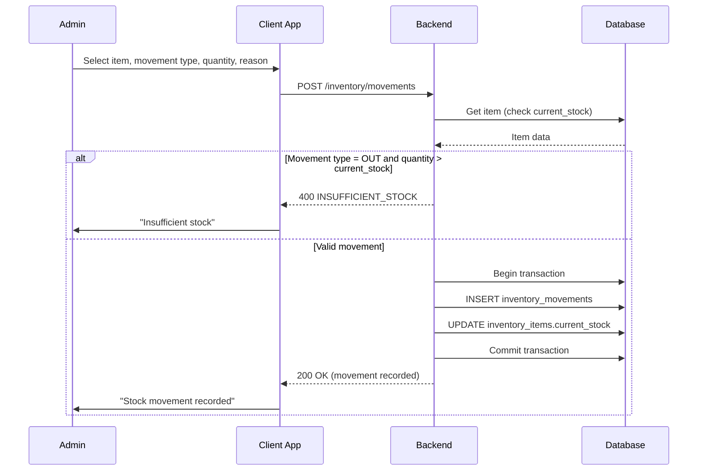
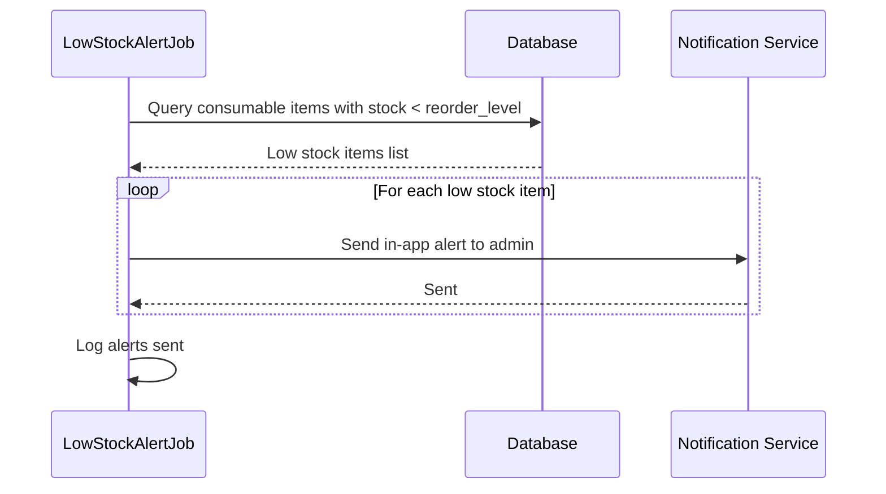
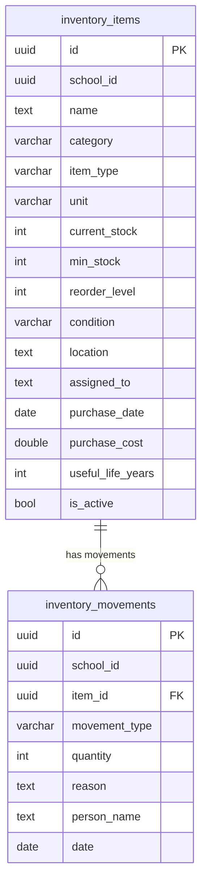

# Inventory Management — Technical Specification

> **Document status:** Implementation-ready blueprint
> **Last updated:** 2026-06-27
> **Prerequisites:** None
> **Template:** `_SPEC_TEMPLATE.md` v1 (25 mandatory + 6 optional sections)

---

## 1. Feature Overview

School inventory and asset tracking: equipment, furniture, consumables, lab supplies, sports equipment with stock levels, assignments, and depreciation tracking.

### Goals

- Track assets (furniture, computers, lab equipment, sports gear) with assignment to rooms/persons
- Track consumables (stationery, lab supplies) with stock levels and reorder alerts
- Asset depreciation tracking
- Stock-in/stock-out log
- Low stock alerts

### Non-goals

- [ ] Barcode/QR code scanning for items
- [ ] Vendor integration for auto-reorder
- [ ] Asset maintenance scheduling
- [ ] Insurance tracking for assets

### Dependencies

- `AppUsersTable` — user who performs stock movements
- Supabase Storage — item photos (optional)
- Notification Service — low stock alerts

### Related Modules

- `server/.../feature/expense/` — expense management (purchase cost tracking)
- `server/.../feature/notifications/` — low stock alerts

---

## 2. Current System Assessment

### Existing Code

- `feature_audit.csv` L139: Inventory missing (0%)
- No inventory tables in `Tables.kt`

### Existing Database

- `AppUsersTable` — user accounts
- No inventory tables exist

### Existing APIs

- No inventory APIs exist

### Existing UI

- Admin: dashboard, student/staff management
- No inventory UI

### Existing Services

- No inventory services

### Existing Documentation

- `feature_audit.csv` — feature audit tracking (inventory at 0%)
- `DIFFERENTIATING_FEATURES.md` — inventory management feature description

### Technical Debt

| # | Gap | Details |
|---|---|---|
| TD-1 | No inventory tracking | 0% implementation |
| TD-2 | No inventory tables | No DB schema for items or movements |
| TD-3 | No stock management | No stock-in/stock-out logging |

### Gaps

| # | Gap | Impact | Severity |
|---|---|---|---|
| G1 | No asset tracking | Cannot track school assets | **High** |
| G2 | No consumable tracking | Cannot track consumable stock | **Medium** |
| G3 | No stock movements | No audit trail for stock changes | **Medium** |
| G4 | No low stock alerts | Cannot proactively reorder | **Low** |
| G5 | No depreciation tracking | No asset value tracking | **Low** |

---

## 3. Functional Requirements

### FR-001
| Field | Value |
|---|---|
| **Title** | Asset Tracking |
| **Description** | Asset tracking: item name, category, quantity, condition, assigned to (room/person), purchase date, cost |
| **Priority** | Critical |
| **User Roles** | School Admin |
| **Acceptance notes** | Assets tracked with condition, location, and assignment |

### FR-002
| Field | Value |
|---|---|
| **Title** | Consumable Tracking |
| **Description** | Consumable tracking: item name, category, current stock, min stock, unit, reorder level |
| **Priority** | High |
| **User Roles** | School Admin |
| **Acceptance notes** | Consumables with stock levels and reorder thresholds |

### FR-003
| Field | Value |
|---|---|
| **Title** | Stock Movements |
| **Description** | Stock movements: stock-in (purchase), stock-out (issue), with date and person |
| **Priority** | High |
| **User Roles** | School Admin |
| **Acceptance notes** | All stock changes logged with reason and person |

### FR-004
| Field | Value |
|---|---|
| **Title** | Low Stock Alert |
| **Description** | Low stock alert when stock < reorder level |
| **Priority** | Medium |
| **User Roles** | School Admin |
| **Acceptance notes** | Daily check; in-app notification when stock below reorder level |

### FR-005
| Field | Value |
|---|---|
| **Title** | Asset Depreciation |
| **Description** | Asset depreciation: straight-line method, annual depreciation report |
| **Priority** | Low |
| **User Roles** | School Admin |
| **Acceptance notes** | Straight-line depreciation based on purchase cost and useful life |

### FR-006
| Field | Value |
|---|---|
| **Title** | Search and Filter |
| **Description** | Search and filter by category, condition, location |
| **Priority** | Medium |
| **User Roles** | School Admin |
| **Acceptance notes** | Filterable list with search by name |

---

## 4. User Stories

### School Admin
- [ ] Add new asset (furniture, electronics, lab equipment, sports gear)
- [ ] Add new consumable (stationery, lab supplies)
- [ ] Record stock-in (purchase/receipt of items)
- [ ] Record stock-out (issue/distribution of items)
- [ ] Assign asset to room or person
- [ ] Update item condition (new, good, fair, damaged)
- [ ] View low stock items
- [ ] View depreciation report
- [ ] Search and filter inventory by category, condition, location

### System
- [ ] Log all stock movements with date, person, and reason
- [ ] Check stock levels daily and trigger low stock alerts
- [ ] Calculate depreciation based on straight-line method
- [ ] Update current_stock on stock movement

---

## 5. Business Rules

### BR-001
**Rule:** Items are either assets or consumables.
**Enforcement:** `inventory_items.item_type` = `asset` or `consumable`.

### BR-002
**Rule:** Stock movements update current_stock.
**Enforcement:** IN movement: `current_stock += quantity`; OUT movement: `current_stock -= quantity`.

### BR-003
**Rule:** Stock-out cannot make stock negative.
**Enforcement:** If `current_stock - quantity < 0`, reject with error.

### BR-004
**Rule:** Low stock alert when `current_stock < reorder_level`.
**Enforcement:** Daily job checks all consumable items; sends notification.

### BR-005
**Rule:** Depreciation = (purchase_cost / useful_life_years) per year.
**Enforcement:** Straight-line method; calculated in report query.

### BR-006
**Rule:** Assets have condition tracking; consumables do not.
**Enforcement:** `condition` field only relevant for `item_type = asset`.

---

## 6. Database Design

### 6.1 Entity Relationship Summary

Two tables: `inventory_items` (items with stock levels, condition, assignment) and `inventory_movements` (stock-in/stock-out log). Movements reference items and track all stock changes.

### 6.2 New Tables

```sql
CREATE TABLE inventory_items (
    id              UUID PRIMARY KEY DEFAULT gen_random_uuid(),
    school_id       UUID NOT NULL,
    name            TEXT NOT NULL,
    category        VARCHAR(32) NOT NULL,          -- furniture | electronics | lab | sports | stationery | consumable
    item_type       VARCHAR(16) NOT NULL,          -- asset | consumable
    unit            VARCHAR(16) DEFAULT 'each',    -- each | kg | box | ream
    current_stock   INTEGER NOT NULL DEFAULT 0,
    min_stock       INTEGER NOT NULL DEFAULT 0,
    reorder_level   INTEGER NOT NULL DEFAULT 0,
    condition       VARCHAR(16),                   -- new | good | fair | damaged
    location        TEXT,                          -- room/department
    assigned_to     TEXT,                          -- person name
    purchase_date   DATE,
    purchase_cost   DOUBLE PRECISION,
    useful_life_years INTEGER,                     -- for depreciation
    is_active       BOOLEAN NOT NULL DEFAULT true,
    created_at      TIMESTAMP NOT NULL DEFAULT now(),
    updated_at      TIMESTAMP NOT NULL DEFAULT now()
);
CREATE INDEX idx_inventory_school_category ON inventory_items(school_id, category);

CREATE TABLE inventory_movements (
    id              UUID PRIMARY KEY DEFAULT gen_random_uuid(),
    school_id       UUID NOT NULL,
    item_id         UUID NOT NULL REFERENCES inventory_items(id),
    movement_type   VARCHAR(8) NOT NULL,           -- IN | OUT
    quantity        INTEGER NOT NULL,
    reason          TEXT,                          -- "Purchase", "Issued to Lab 3", "Damaged"
    person_name     TEXT,
    date            DATE NOT NULL,
    created_at      TIMESTAMP NOT NULL DEFAULT now()
);
CREATE INDEX idx_inventory_movements_item ON inventory_movements(item_id, date DESC);
```

### 6.3 Modified Tables

N/A — no existing tables modified.

### 6.4 Indexes

```sql
CREATE INDEX idx_inventory_school_category ON inventory_items(school_id, category);
CREATE INDEX idx_inventory_school_type ON inventory_items(school_id, item_type, is_active);
CREATE INDEX idx_inventory_low_stock ON inventory_items(school_id, item_type) WHERE item_type = 'consumable' AND current_stock < reorder_level;
CREATE INDEX idx_inventory_movements_item ON inventory_movements(item_id, date DESC);
CREATE INDEX idx_inventory_movements_school ON inventory_movements(school_id, date DESC);
```

### 6.5 Constraints

- `inventory_items.name` — NOT NULL
- `inventory_items.category` — NOT NULL
- `inventory_items.item_type` — NOT NULL, one of `asset`, `consumable`
- `inventory_items.current_stock` — NOT NULL, >= 0
- `inventory_movements.movement_type` — NOT NULL, one of `IN`, `OUT`
- `inventory_movements.quantity` — NOT NULL, > 0
- `inventory_movements.date` — NOT NULL

### 6.6 Foreign Keys

- `inventory_movements.item_id` → `inventory_items.id`

### 6.7 Soft Delete Strategy

- `inventory_items.is_active` — items deactivated (not deleted); movements preserved

### 6.8 Audit Fields

- `created_at` — creation timestamp (all tables)
- `updated_at` — last update timestamp (items)
- `person_name` — who performed the movement
- `date` — when movement occurred

### 6.9 Migration Notes

Migration: `docs/db/migration_053_inventory.sql`
- Creates 2 inventory tables with indexes
- No data backfill needed (new feature)

### 6.10 Exposed Mappings

```kotlin
object InventoryItemsTable : UUIDTable("inventory_items", "id") {
    val schoolId         = uuid("school_id")
    val name             = text("name")
    val category         = varchar("category", 32)
    val itemType         = varchar("item_type", 16) // asset | consumable
    val unit             = varchar("unit", 16).default("each")
    val currentStock     = integer("current_stock").default(0)
    val minStock         = integer("min_stock").default(0)
    val reorderLevel     = integer("reorder_level").default(0)
    val condition        = varchar("condition", 16).nullable() // new | good | fair | damaged
    val location         = text("location").nullable()
    val assignedTo       = text("assigned_to").nullable()
    val purchaseDate     = date("purchase_date").nullable()
    val purchaseCost     = double("purchase_cost").nullable()
    val usefulLifeYears  = integer("useful_life_years").nullable()
    val isActive         = bool("is_active").default(true)
    val createdAt        = timestamp("created_at")
    val updatedAt        = timestamp("updated_at")
    init {
        index("idx_inventory_school_category", false, schoolId, category)
        index("idx_inventory_school_type", false, schoolId, itemType, isActive)
    }
}

object InventoryMovementsTable : UUIDTable("inventory_movements", "id") {
    val schoolId     = uuid("school_id")
    val itemId       = uuid("item_id")
    val movementType = varchar("movement_type", 8) // IN | OUT
    val quantity     = integer("quantity")
    val reason       = text("reason").nullable()
    val personName   = text("person_name").nullable()
    val date         = date("date")
    val createdAt    = timestamp("created_at")
    init {
        index("idx_inventory_movements_item", false, itemId, date)
        index("idx_inventory_movements_school", false, schoolId, date)
    }
}
```

### 6.11 Seed Data

N/A — items created by admin.

---

## 7. State Machines

### Item State Machine

```
ACTIVE ──admin_deactivates──> INACTIVE
INACTIVE ──admin_reactivates──> ACTIVE
```

| Current State | Event | Next State | Guard / Condition |
|---|---|---|---|
| `active` | Admin deactivates | `inactive` | `is_active = false` |
| `inactive` | Admin reactivates | `active` | `is_active = true` |

### Asset Condition State Machine

```
NEW ──condition_deteriorates──> GOOD ──condition_deteriorates──> FAIR ──condition_deteriorates──> DAMAGED
```

| Current State | Event | Next State | Guard / Condition |
|---|---|---|---|
| `new` | Admin updates condition | `good` | Manual update |
| `good` | Admin updates condition | `fair` | Manual update |
| `fair` | Admin updates condition | `damaged` | Manual update |
| any | Admin updates condition | any | Manual override allowed |

### Stock Flow

```
STOCK_IN: current_stock += quantity
STOCK_OUT: current_stock -= quantity (if current_stock >= quantity)
```

| Movement | Effect | Guard |
|---|---|---|
| `IN` | `current_stock += quantity` | quantity > 0 |
| `OUT` | `current_stock -= quantity` | `current_stock >= quantity` (no negative stock) |

---

## 8. Backend Architecture

### 8.1 Component Overview

Two services: `InventoryItemService` (item CRUD, search, filter) and `InventoryMovementService` (stock-in/stock-out, low stock check, depreciation report). `InventoryRouting` exposes API endpoints.

### 8.2 Design Principles

1. **Unified table** — assets and consumables in same table with `item_type` discriminator
2. **Movement log** — all stock changes logged with reason and person
3. **Atomic stock update** — stock movement + current_stock update in single transaction
4. **Daily low stock check** — background job checks reorder levels
5. **Straight-line depreciation** — calculated on demand for report

### 8.3 Core Types

```kotlin
class InventoryItemService {
    suspend fun create(item: InventoryItemDto): UUID
    suspend fun update(id: UUID, item: InventoryItemDto): Unit
    suspend fun deactivate(id: UUID): Unit
    suspend fun getItems(schoolId: UUID, filters: InventoryFilters): List<InventoryItemDto>
    suspend fun getLowStockItems(schoolId: UUID): List<InventoryItemDto>
    suspend fun getDepreciationReport(schoolId: UUID, academicYearId: UUID): DepreciationReportDto
}

class InventoryMovementService {
    suspend fun recordMovement(movement: InventoryMovementDto): UUID
    suspend fun getMovements(itemId: UUID): List<InventoryMovementDto>
    suspend fun getMovementsBySchool(schoolId: UUID, filters: MovementFilters): List<InventoryMovementDto>
}
```

### 8.4 Repositories

- `InventoryItemRepository` — CRUD for items
- `InventoryMovementRepository` — CRUD for movements

### 8.5 Mappers

- `InventoryItemMapper` — maps item DB rows to DTOs
- `InventoryMovementMapper` — maps movement rows to DTOs
- `DepreciationReportMapper` — maps depreciation calculation to report DTO

### 8.6 Permission Checks

- All inventory operations: school admin only

### 8.7 Background Jobs

### Low Stock Alert Job

| Job | Schedule | Description |
|---|---|---|
| `LowStockAlertJob` | Daily | Check consumable items with stock < reorder_level |

**Implementation:**
1. Query `inventory_items` WHERE `item_type = 'consumable'` AND `current_stock < reorder_level` AND `is_active = true`
2. For each low stock item:
   - Send in-app notification to admin: "Low stock: {itemName} has {currentStock} {unit} (reorder at {reorderLevel})"
3. Log alerts sent

### 8.8 Domain Events

- `InventoryItemCreated` — emitted when item created
- `InventoryItemUpdated` — emitted when item updated
- `InventoryItemDeactivated` — emitted when item deactivated
- `StockMovementRecorded` — emitted when movement logged
- `LowStockAlert` — emitted when stock below reorder level

### 8.9 Caching

- Item list cached for 5 minutes (changes with movements)
- Low stock list cached for 10 minutes
- Depreciation report not cached (calculated on demand)

### 8.10 Transactions

- Stock movement: INSERT movement + UPDATE current_stock in single transaction
- Item update: UPDATE item fields

### 8.11 Rate Limiting

- Standard API rate limiting
- No special rate limiting needed

### 8.12 Configuration

- `INVENTORY_LOW_STOCK_CHECK_ENABLED` — default `true`
- `INVENTORY_DEPRECIATION_METHOD` — default `straight_line`

---

## 9. API Contracts

### 9.1 Admin APIs

```
GET/POST /api/v1/school/inventory/items
PATCH /api/v1/school/inventory/items/{id}
POST /api/v1/school/inventory/movements  { item_id, movement_type, quantity, reason }
GET /api/v1/school/inventory/low-stock
GET /api/v1/school/inventory/depreciation-report?academic_year_id={uuid}
```

### 9.2 Example Responses

**Items List Response 200:**
```json
{
  "success": true,
  "data": [
    {"id": "uuid", "name": "Dell Monitor", "category": "electronics", "item_type": "asset", "condition": "good", "location": "Lab 1", "assigned_to": "Mr. Sharma", "current_stock": 1, "purchase_cost": 12000, "useful_life_years": 5},
    {"id": "uuid", "name": "A4 Paper", "category": "stationery", "item_type": "consumable", "current_stock": 15, "min_stock": 10, "reorder_level": 20, "unit": "ream"}
  ]
}
```

**Depreciation Report Response 200:**
```json
{
  "success": true,
  "data": {
    "academic_year": "2026-27",
    "items": [
      {"name": "Dell Monitor", "purchase_cost": 12000, "useful_life": 5, "annual_depreciation": 2400, "accumulated_depreciation": 4800, "book_value": 7200, "years_elapsed": 2}
    ],
    "total_purchase_value": 500000,
    "total_depreciation": 200000,
    "total_book_value": 300000
  }
}
```

---

## 10. Frontend Architecture

### 10.1 Screens

| Screen | Platform | Role | Description |
|---|---|---|---|
| `InventoryScreen` | All | Admin | Item list with search and filter |
| `InventoryItemDetailScreen` | All | Admin | Item detail with movement history |
| `StockMovementScreen` | All | Admin | Record stock-in/stock-out |
| `LowStockDashboardScreen` | All | Admin | Low stock items list |
| `DepreciationReportScreen` | All | Admin | Asset depreciation report |

### 10.2 Navigation

- Admin portal → Inventory → `InventoryScreen`
- Admin portal → Inventory → Low Stock → `LowStockDashboardScreen`
- Admin portal → Inventory → Depreciation → `DepreciationReportScreen`

### 10.3 UX Flows

#### Admin: Add New Item

1. Admin opens Inventory → New Item
2. Enters name, category, item type (asset/consumable)
3. If asset: enters condition, location, assigned_to, purchase_date, purchase_cost, useful_life_years
4. If consumable: enters unit, current_stock, min_stock, reorder_level
5. Saves item

#### Admin: Record Stock Movement

1. Admin opens item detail
2. Clicks "Stock In" or "Stock Out"
3. Enters quantity, reason, person name
4. Submits movement
5. current_stock updated; movement logged

#### Admin: View Low Stock

1. Admin opens Inventory → Low Stock
2. Views items with stock < reorder_level
3. Can initiate reorder (future: link to expense)

### 10.4 State Management

```kotlin
data class InventoryState(
    val items: List<InventoryItemDto>,
    val lowStockItems: List<InventoryItemDto>,
    val movements: List<InventoryMovementDto>,
    val depreciationReport: DepreciationReportDto?,
    val isLoading: Boolean,
    val error: String?,
)
```

### 10.5 Offline Support

- Item list cached locally for offline viewing
- Low stock list cached locally
- Stock movement requires network (transactional)

### 10.6 Loading States

- Loading items: "Loading inventory..."
- Recording movement: "Recording stock movement..."
- Loading depreciation: "Calculating depreciation..."

### 10.7 Error Handling (UI)

- Stock-out exceeds stock: "Insufficient stock. Current: {stock}, requested: {qty}."
- Item not found: "Item not found."
- No low stock items: "All items are above reorder level."

### 10.8 Component Integration Guidelines

| Rule | Description |
|---|---|
| **R1** | Item list with category filter chips |
| **R2** | Asset condition badge (new=green, good=blue, fair=yellow, damaged=red) |
| **R3** | Low stock items highlighted with warning icon |
| **R4** | Stock movement form with IN/OUT toggle |
| **R5** | Depreciation report table with book value calculation |
| **R6** | Movement history timeline in item detail |

---

## 11. Shared Module Changes (KMP)

### 11.1 DTOs

```kotlin
data class InventoryItemDto(
    val id: UUID,
    val schoolId: UUID,
    val name: String,
    val category: String,
    val itemType: String, // asset | consumable
    val unit: String,
    val currentStock: Int,
    val minStock: Int,
    val reorderLevel: Int,
    val condition: String?,
    val location: String?,
    val assignedTo: String?,
    val purchaseDate: LocalDate?,
    val purchaseCost: Double?,
    val usefulLifeYears: Int?,
    val isActive: Boolean,
)

data class InventoryMovementDto(
    val id: UUID,
    val schoolId: UUID,
    val itemId: UUID,
    val itemName: String,
    val movementType: String, // IN | OUT
    val quantity: Int,
    val reason: String?,
    val personName: String?,
    val date: LocalDate,
)

data class DepreciationReportDto(
    val academicYear: String,
    val items: List<DepreciationItemDto>,
    val totalPurchaseValue: Double,
    val totalDepreciation: Double,
    val totalBookValue: Double,
)

data class DepreciationItemDto(
    val name: String,
    val purchaseCost: Double,
    val usefulLife: Int,
    val annualDepreciation: Double,
    val accumulatedDepreciation: Double,
    val bookValue: Double,
    val yearsElapsed: Int,
)
```

### 11.2 Domain Models

```kotlin
data class InventoryItem(
    val id: UUID,
    val schoolId: UUID,
    val name: String,
    val category: String,
    val itemType: String,
    val unit: String,
    val currentStock: Int,
    val minStock: Int,
    val reorderLevel: Int,
    val condition: String?,
    val location: String?,
    val assignedTo: String?,
    val purchaseDate: LocalDate?,
    val purchaseCost: Double?,
    val usefulLifeYears: Int?,
    val isActive: Boolean,
)

data class InventoryMovement(
    val id: UUID,
    val schoolId: UUID,
    val itemId: UUID,
    val movementType: String,
    val quantity: Int,
    val reason: String?,
    val personName: String?,
    val date: LocalDate,
)
```

### 11.3 Repository Interfaces

```kotlin
interface InventoryItemRepository {
    suspend fun create(item: InventoryItemEntity): UUID
    suspend fun update(id: UUID, item: InventoryItemEntity): Unit
    suspend fun deactivate(id: UUID): Unit
    suspend fun getBySchool(schoolId: UUID, filters: InventoryFilters): List<InventoryItemDto>
    suspend fun getLowStock(schoolId: UUID): List<InventoryItemDto>
    suspend fun getById(id: UUID): InventoryItemDto?
}

interface InventoryMovementRepository {
    suspend fun record(movement: InventoryMovementEntity): UUID
    suspend fun getByItem(itemId: UUID): List<InventoryMovementDto>
    suspend fun getBySchool(schoolId: UUID, filters: MovementFilters): List<InventoryMovementDto>
}
```

### 11.4 UseCases

- `CreateInventoryItemUseCase`
- `UpdateInventoryItemUseCase`
- `RecordStockMovementUseCase`
- `GetLowStockItemsUseCase`
- `GetDepreciationReportUseCase`
- `SearchInventoryUseCase`

### 11.5 Validation

- Name: not empty
- Category: not empty
- Item type: one of `asset`, `consumable`
- Movement type: one of `IN`, `OUT`
- Quantity: > 0
- Stock-out: `current_stock >= quantity` (no negative stock)
- Reorder level: >= 0
- Useful life years: > 0 (if purchase_cost set)

### 11.6 Serialization

Standard Kotlinx serialization for DTOs.

### 11.7 Network APIs

Added to `InventoryApi.kt`:
- `GET/POST /api/v1/school/inventory/items` — item CRUD
- `PATCH /api/v1/school/inventory/items/{id}` — update item
- `POST /api/v1/school/inventory/movements` — record movement
- `GET /api/v1/school/inventory/low-stock` — low stock list
- `GET /api/v1/school/inventory/depreciation-report` — depreciation report

### 11.8 Database Models (Local Cache)

- Item list cached locally for offline viewing
- Low stock list cached locally

---

## 12. Permissions Matrix

| Action | Super Admin | School Admin | Teacher | Parent |
|---|---|---|---|---|
| Add/edit/delete items | ✅ | ✅ | ❌ | ❌ |
| Record stock movements | ✅ | ✅ | ❌ | ❌ |
| View inventory | ✅ | ✅ | ❌ | ❌ |
| View low stock | ✅ | ✅ | ❌ | ❌ |
| View depreciation report | ✅ | ✅ | ❌ | ❌ |

---

## 13. Notifications

### Inventory Notifications

| Type | Trigger | Channel | Message |
|---|---|---|---|
| Low Stock Alert | Daily check: stock < reorder_level | In-app (admin) | "Low stock: {itemName} has {currentStock} {unit} left. Reorder level: {reorderLevel}." |
| Stock Out Recorded | Admin records stock-out | In-app (admin) | "{quantity} {unit} of {itemName} issued. Reason: {reason}." |
| Item Damaged | Admin updates condition to damaged | In-app (admin) | "Item {itemName} marked as damaged. Consider repair or disposal." |

---

## 14. Background Jobs

| Job | Schedule | Description |
|---|---|---|
| `LowStockAlertJob` | Daily | Check consumable items with stock < reorder_level |

**Low Stock Alert:**
1. Query `inventory_items` WHERE `item_type = 'consumable'` AND `current_stock < reorder_level` AND `is_active = true`
2. For each low stock item:
   - Send in-app notification to admin
   - Log alert
3. Log total alerts sent

---

## 15. Integrations

### AppUsersTable
| Field | Value |
|---|---|
| **System** | Existing user management |
| **Purpose** | User who performs stock movements (person_name) |
| **API / SDK** | Direct DB query |
| **Auth method** | Internal |
| **Fallback** | None — user from JWT |

### Notification Service
| Field | Value |
|---|---|
| **System** | Existing notification infrastructure |
| **Purpose** | Low stock alerts |
| **API / SDK** | Internal `NotificationService` |
| **Auth method** | Internal service call |
| **Fallback** | In-app notification if push fails |

### Expense Management (Future)
| Field | Value |
|---|---|
| **System** | `EXPENSE_MANAGEMENT_SPEC.md` |
| **Purpose** | Link stock-in purchases to expense records |
| **API / SDK** | Internal service call (future) |
| **Auth method** | Internal |
| **Fallback** | None — integration is optional |

---

## 16. Security

### Authentication
- All inventory APIs: JWT with school admin role

### Authorization
- All inventory operations: school admin only

### Encryption
- All API communication over TLS

### Audit Logs
- Item creation logged
- Item update logged (fields changed)
- Item deactivation logged
- Stock movement logged (type, quantity, reason, person)

### PII Handling
- `assigned_to` contains person name (staff name) — not student PII
- `person_name` in movements contains staff name
- No student PII in inventory records

### Data Isolation
- All queries filtered by `school_id` from JWT

### Rate Limiting
- Standard API rate limiting

### Input Validation
- Name: not empty
- Category: not empty
- Item type: one of `asset`, `consumable`
- Movement type: one of `IN`, `OUT`
- Quantity: > 0
- Stock-out: `current_stock >= quantity`

---

## 17. Performance & Scalability

### Expected Scale

| Metric | Small school | Medium school | Large school |
|---|---|---|---|
| Items | ~200 | ~1,000 | ~5,000 |
| Movements per month | ~100 | ~500 | ~2,000 |
| Categories | ~6 | ~10 | ~15 |

### Latency Targets

| Operation | Target |
|---|---|
| List items | < 200ms (paginated) |
| Record movement | < 100ms |
| Low stock query | < 100ms |
| Depreciation report | < 500ms |

### Optimization Strategy

- Items indexed by (school_id, category) and (school_id, item_type, is_active)
- Movements indexed by (item_id, date) and (school_id, date)
- Low stock query uses partial index on consumable items
- Depreciation calculated in-memory (no complex DB queries)

---

## 18. Edge Cases

| # | Scenario | Expected Behavior |
|---|---|---|
| EC-001 | Stock-out exceeds current stock | Rejected: "Insufficient stock" |
| EC-002 | No reorder level set (0) | No low stock alert (0 means no reorder) |
| EC-003 | Asset with no purchase cost | Depreciation report shows N/A for that item |
| EC-004 | Asset with no useful_life_years | Depreciation report shows N/A for that item |
| EC-005 | Item deactivated with movements | Movements preserved; item shows as inactive |
| EC-006 | Consumable with 0 stock | Shows in low stock if reorder_level > 0 |
| EC-007 | Duplicate item name | Allowed (no uniqueness constraint) |
| EC-008 | Movement with 0 quantity | Rejected: "Quantity must be > 0" |

### Risks & Mitigations

| Risk | Likelihood | Impact | Mitigation |
|---|---|---|---|
| Negative stock | Low | Medium | Validate before stock-out; transaction |
| Missing depreciation data | Medium | Low | Show N/A in report; prompt to add data |
| Large movement history | Low | Low | Paginated; indexed by date |

---

## 19. Error Handling

### Standard Error Codes

| HTTP | Error Code | Description | When |
|---|---|---|---|
| 400 | `INVALID_ITEM_TYPE` | Item type not valid | Create/update item |
| 400 | `INVALID_MOVEMENT_TYPE` | Movement type not IN or OUT | Record movement |
| 400 | `INVALID_QUANTITY` | Quantity must be > 0 | Record movement |
| 400 | `INSUFFICIENT_STOCK` | Stock-out exceeds current stock | Record movement |
| 400 | `INVALID_CATEGORY` | Category not valid | Create/update item |
| 403 | `INSUFFICIENT_PERMISSIONS` | Non-admin attempting inventory operation | Any endpoint |
| 404 | `ITEM_NOT_FOUND` | Item does not exist | Update/movement |

### Error Response Format

Same as existing API error format.

### Recovery Strategy

| Error | Client Action | Server Action |
|---|---|---|
| `INSUFFICIENT_STOCK` | Show "Insufficient stock. Current: {stock}." | Return 400 |
| `ITEM_NOT_FOUND` | Show "Item not found." | Return 404 |

---

## 20. Analytics & Reporting

### Reports

- **Inventory Summary:** Total items by category and type
- **Low Stock Report:** Items below reorder level
- **Stock Movement Log:** All movements in date range
- **Depreciation Report:** Asset depreciation with book values
- **Asset Assignment Report:** Assets assigned to rooms/persons

### KPIs

- **Total Items:** Count of active items
- **Low Stock Count:** Number of items below reorder level
- **Total Asset Value:** Sum of purchase costs for assets
- **Total Depreciated Value:** Sum of accumulated depreciation
- **Stock Movement Rate:** Movements per month

### Dashboards

- Admin: inventory overview with category breakdown
- Admin: low stock dashboard

### Exports

- Item list export (CSV)
- Stock movement log export (CSV)
- Depreciation report export (CSV/PDF)

---

## 21. Testing Strategy

### Unit Tests

| Test | What it verifies |
|---|---|
| Create item | Item stored with all fields |
| Update item | Fields updated correctly |
| Deactivate item | is_active = false |
| Record stock-in | current_stock increased; movement logged |
| Record stock-out | current_stock decreased; movement logged |
| Stock-out exceeds stock | Rejected with error |
| Low stock query | Returns items with stock < reorder_level |
| Depreciation calculation | Correct straight-line depreciation |
| Search and filter | Correct filtering by category, condition, location |

### Integration Tests

| Test | What it verifies |
|---|---|
| Create item → record movement → verify stock | Full lifecycle |
| Low stock alert job triggers | Notification sent for low stock item |
| Depreciation report with multiple assets | Correct totals |

### Performance Tests

- [ ] List 5,000 items < 500ms
- [ ] Record movement < 100ms
- [ ] Depreciation report with 1,000 assets < 1s

### Security Tests

- [ ] Non-admin cannot access inventory endpoints
- [ ] School A admin cannot see School B inventory

### Migration Tests

- [ ] Migration creates 2 tables with correct schema
- [ ] Indexes created correctly

---

## 22. Acceptance Criteria

- [ ] Assets and consumables tracked
- [ ] Stock-in/stock-out logged
- [ ] Low stock alerts triggered
- [ ] Asset depreciation calculated
- [ ] Search and filter works
- [ ] Assignment to rooms/persons tracked

---

## 23. Implementation Roadmap

| Phase | Duration | Tasks | Breaking? | Deliverable |
|---|---|---|---|---|
| 1 | 2 days | DB migration, Exposed tables, services | No | Schema + tables |
| 2 | 2 days | API endpoints + low stock alerts | No | API available |
| 3 | 3 days | Client UI (item list, stock movement, low stock dashboard) | No | UI ready |
| 4 | 1 day | Tests | No | Test coverage |

**Total: ~8 days**

---

## 24. File-Level Impact Analysis

### New Files

| File | Location | Purpose |
|---|---|---|
| `InventoryItemService.kt` | `server/.../feature/inventory/` | Item CRUD + search |
| `InventoryMovementService.kt` | `server/.../feature/inventory/` | Stock movements + depreciation |
| `InventoryRouting.kt` | `server/.../feature/inventory/` | API endpoints |
| `LowStockAlertJob.kt` | `server/.../feature/inventory/` | Daily low stock check |
| `migration_053_inventory.sql` | `docs/db/` | DDL migration |
| `InventoryApi.kt` | `shared/.../feature/inventory/` | Client API |
| `InventoryRepositoryImpl.kt` | `shared/.../feature/inventory/` | Repository impl |
| `InventoryDtos.kt` | `shared/.../feature/inventory/` | DTOs |
| `InventoryViewModel.kt` | `shared/.../feature/inventory/` | Admin VM |
| `InventoryScreen.kt` | `composeApp/.../ui/v2/screens/admin/` | Inventory management |
| `InventoryItemDetailScreen.kt` | `composeApp/.../ui/v2/screens/admin/` | Item detail |
| `StockMovementScreen.kt` | `composeApp/.../ui/v2/screens/admin/` | Stock movement |
| `LowStockDashboardScreen.kt` | `composeApp/.../ui/v2/screens/admin/` | Low stock dashboard |
| `DepreciationReportScreen.kt` | `composeApp/.../ui/v2/screens/admin/` | Depreciation report |

### Modified Files

| File | Change Type | Lines Changed (est.) | Risk | Description |
|---|---|---|---|---|
| `server/.../db/Tables.kt` | Add | ~30 | Low | 2 inventory table objects |
| `server/.../db/DatabaseFactory.kt` | Modify | ~2 | Low | Register 2 tables |

### Files Preserved Unchanged

| File | Reason |
|---|---|
| `AppUsersTable` | Read-only (user reference) |

---

## 25. Future Enhancements

### Barcode/QR Code Scanning

- QR code label generation for each item
- Mobile app scanning for stock-in/stock-out
- Quick item lookup via QR scan
- Asset audit via QR scanning

### Vendor Integration for Auto-Reorder

- Link items to vendors
- Auto-generate purchase orders when stock low
- Vendor price comparison
- Auto-reorder with approval workflow

### Asset Maintenance Scheduling

- Maintenance schedule per asset
- Maintenance history log
- Maintenance cost tracking
- Maintenance alerts

### Insurance Tracking

- Insurance policy details per asset
- Premium tracking
- Claim history
- Asset valuation for insurance

### Multi-Location Inventory

- Inventory by building/room
- Inter-location transfers
- Location-wise stock reports
- Room-wise asset audit

### Consumable Expiry Tracking

- Expiry date for consumables
- Expiry alerts
- FIFO (first-in-first-out) stock management
- Expired stock disposal logging

### Asset Photos

- Upload photos for each asset
- Before/after maintenance photos
- Damage documentation photos
- Photo gallery per item

### Inventory Valuation Methods

- FIFO, LIFO, weighted average
- Current value vs purchase value
- Market value estimation
- Valuation report for audit

### Asset Lifecycle Management

- Procurement → deployment → maintenance → retirement
- Retirement/disposal workflow
- Salvage value tracking
- Asset disposal documentation

### Department-wise Budget

- Budget per department for inventory
- Department-wise stock consumption
- Budget vs actual per department
- Department head approval for stock-out

---

## A. Sequence Diagrams

### Record Stock Movement Flow



### Low Stock Alert Job Flow



---

## B. Domain Model / ER Diagram



---

## C. Event Flow

```
ItemCreated -> Complete
ItemUpdated -> Complete
ItemDeactivated -> Complete
MovementRecorded -> UpdateStock -> Complete
MovementRecorded -> InsufficientStock -> Failed
LowStockAlertJob -> QueryLowStock -> NotifyAdmin -> Complete
```

| Event | Emitted By | Consumed By | Side Effect |
|---|---|---|---|
| `InventoryItemCreated` | `InventoryItemService.create()` | Analytics | Counter incremented |
| `InventoryItemUpdated` | `InventoryItemService.update()` | Analytics | Counter incremented |
| `InventoryItemDeactivated` | `InventoryItemService.deactivate()` | Analytics | Counter incremented |
| `StockMovementRecorded` | `InventoryMovementService.recordMovement()` | Analytics | Counter incremented |
| `LowStockAlert` | `LowStockAlertJob` | Notification | Admin notified |

---

## D. Configuration

### Environment Variables

| Variable | Description |
|---|---|
| `INVENTORY_ENABLED` | Enable/disable feature (default: `true`) |
| `INVENTORY_LOW_STOCK_CHECK_ENABLED` | Enable daily low stock check (default: `true`) |
| `INVENTORY_DEPRECIATION_METHOD` | Depreciation method (default: `straight_line`) |

### Feature Flags

| Flag | Default | Description |
|---|---|---|
| `inventory_enabled` | `true` | Master switch for inventory management |
| `inventory_low_stock_alerts` | `true` | Enable low stock alerts |
| `inventory_depreciation` | `true` | Enable depreciation reporting |

### Client-Side Configuration

| Config | Default | Description |
|---|---|---|
| Item list page size | 20 | Items per page |
| Low stock refresh | 10 minutes | Auto-refresh interval |
| Default category filter | All | Default filter on list |

### Server-Side Configuration

| Config | Default | Description |
|---|---|---|
| Low stock check enabled | true | Daily job enabled |
| Depreciation method | straight_line | Calculation method |

### Infrastructure Requirements

- PostgreSQL with INTEGER and DOUBLE PRECISION support
- Standard notification infrastructure

---

## E. Migration & Rollback

### Deployment Plan

1. [ ] Run `migration_053_inventory.sql` — creates 2 tables + indexes
2. [ ] Deploy 2 inventory table objects in `Tables.kt`
3. [ ] Register tables in `DatabaseFactory.kt`
4. [ ] Deploy `InventoryItemService` and `InventoryMovementService`
5. [ ] Deploy `LowStockAlertJob`
6. [ ] Deploy `InventoryRouting.kt` (API endpoints)
7. [ ] Deploy client UI (item list, detail, movements, low stock, depreciation)
8. [ ] Deploy to production

### Rollback Plan

1. [ ] Disable feature flag `inventory_enabled` → APIs return 404
2. [ ] Remove client UI → inventory screens not shown
3. [ ] Database: `DROP TABLE IF EXISTS inventory_movements; DROP TABLE IF EXISTS inventory_items;`
4. [ ] No data loss — inventory is additive feature

### Data Backfill

N/A — items created by admin.

### Migration SQL

```sql
-- migration_053_inventory.sql
CREATE TABLE IF NOT EXISTS inventory_items (
    id              UUID PRIMARY KEY DEFAULT gen_random_uuid(),
    school_id       UUID NOT NULL,
    name            TEXT NOT NULL,
    category        VARCHAR(32) NOT NULL,
    item_type       VARCHAR(16) NOT NULL,
    unit            VARCHAR(16) DEFAULT 'each',
    current_stock   INTEGER NOT NULL DEFAULT 0,
    min_stock       INTEGER NOT NULL DEFAULT 0,
    reorder_level   INTEGER NOT NULL DEFAULT 0,
    condition       VARCHAR(16),
    location        TEXT,
    assigned_to     TEXT,
    purchase_date   DATE,
    purchase_cost   DOUBLE PRECISION,
    useful_life_years INTEGER,
    is_active       BOOLEAN NOT NULL DEFAULT true,
    created_at      TIMESTAMP NOT NULL DEFAULT now(),
    updated_at      TIMESTAMP NOT NULL DEFAULT now()
);

CREATE INDEX IF NOT EXISTS idx_inventory_school_category ON inventory_items(school_id, category);
CREATE INDEX IF NOT EXISTS idx_inventory_school_type ON inventory_items(school_id, item_type, is_active);

CREATE TABLE IF NOT EXISTS inventory_movements (
    id              UUID PRIMARY KEY DEFAULT gen_random_uuid(),
    school_id       UUID NOT NULL,
    item_id         UUID NOT NULL REFERENCES inventory_items(id),
    movement_type   VARCHAR(8) NOT NULL,
    quantity        INTEGER NOT NULL,
    reason          TEXT,
    person_name     TEXT,
    date            DATE NOT NULL,
    created_at      TIMESTAMP NOT NULL DEFAULT now()
);

CREATE INDEX IF NOT EXISTS idx_inventory_movements_item ON inventory_movements(item_id, date DESC);
CREATE INDEX IF NOT EXISTS idx_inventory_movements_school ON inventory_movements(school_id, date DESC);

-- ROLLBACK:
-- DROP TABLE IF EXISTS inventory_movements;
-- DROP TABLE IF EXISTS inventory_items;
```

---

## F. Observability

### Logging

- Item created: INFO `inventory_item_created` (itemId, schoolId, name, category, itemType)
- Item updated: INFO `inventory_item_updated` (itemId, fieldsChanged)
- Item deactivated: INFO `inventory_item_deactivated` (itemId, schoolId)
- Stock movement recorded: INFO `inventory_movement_recorded` (movementId, itemId, type, quantity, personName)
- Stock movement rejected: WARN `inventory_movement_rejected` (itemId, type, quantity, reason: insufficient_stock)
- Low stock alert: WARN `inventory_low_stock` (itemId, name, currentStock, reorderLevel)
- Depreciation report generated: DEBUG `inventory_depreciation_report` (schoolId, itemCount, totalBookValue)

### Metrics

| Metric | Type | Description |
|---|---|---|
| `inventory.items_total` | Gauge | Total active items |
| `inventory.assets_total` | Gauge | Total active assets |
| `inventory.consumables_total` | Gauge | Total active consumables |
| `inventory.movements_total` | Counter | Total stock movements |
| `inventory.low_stock_alerts` | Counter | Low stock alerts sent |
| `inventory.depreciation_reports` | Counter | Depreciation reports generated |
| `inventory.movement_recording_time_ms` | Histogram | Movement recording latency |

### Health Checks

- `GET /api/v1/health` — existing health check

### Alerts

- Low stock count > 10 → Info (bulk reorder needed)
- Stock movement failure rate > 5% → Warning (transaction issues)
- Depreciation report query > 2s → Warning (performance)
