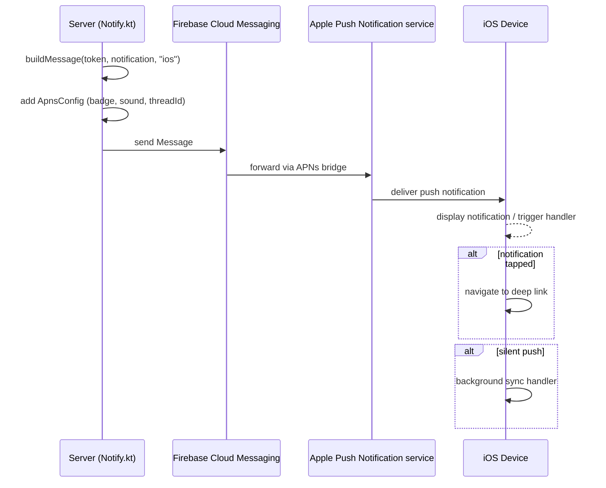
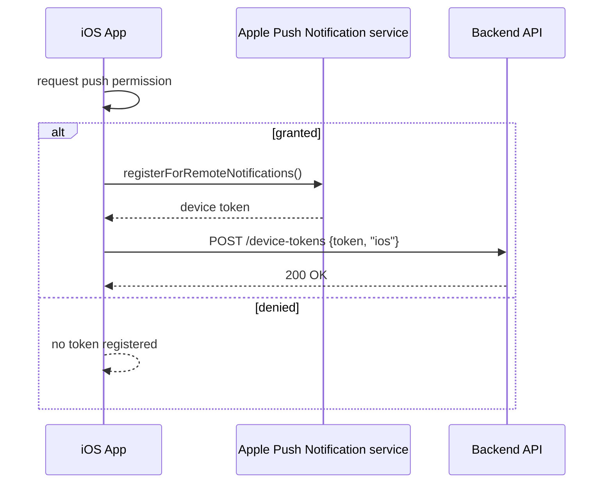
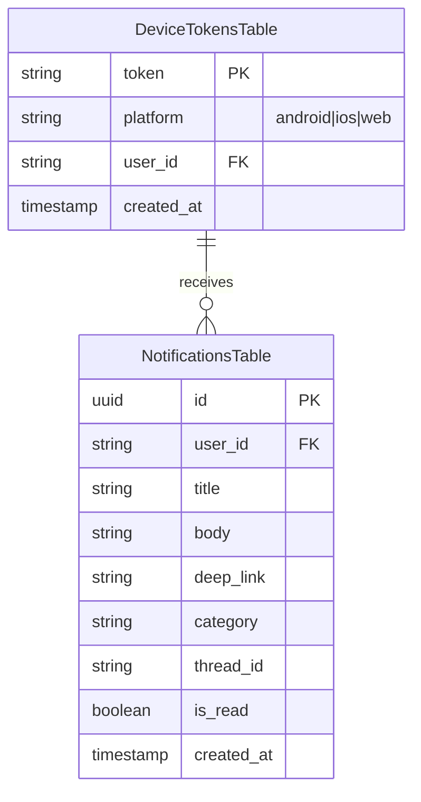

# iOS Push Notifications (APNs) — Technical Specification

> **Document status:** Implementation-ready blueprint
> **Last updated:** 2026-06-27
> **Prerequisites:** None (extends existing notification infrastructure)
> **Template:** `_SPEC_TEMPLATE.md` v1 (25 mandatory + 6 optional sections)

---

## 1. Feature Overview

Add Apple Push Notification service (APNs) support to the existing FCM-only notification system, enabling push notifications for iOS users. Integrates with the existing `DeviceTokensTable` and `NotificationsTable` infrastructure.

### Goals

- APNs push delivery for iOS devices
- Multi-device support (existing — multiple tokens per user)
- Silent/background push for data-only notifications
- Rich notifications (images, action buttons)
- Notification grouping (thread identifiers)

### Non-goals

- [ ] Android push (already handled by FCM)
- [ ] Web push notifications (separate spec)
- [ ] Push notification content management UI (existing notification system)

### Dependencies

- Firebase Admin SDK 9.4.3+ (existing)
- `DeviceTokensTable` with `platform` field (existing)
- `NotificationsTable` (existing)
- Apple Developer Portal access (for APNs key)

### Related Modules

- `server/.../feature/notifications/Notify.kt` — notification dispatch
- `server/.../feature/notifications/NotificationsRouting.kt` — notification API
- `iosApp/iosApp/iOSApp.swift` — iOS app entry point
- `WHATSAPP_INTEGRATION_SPEC.md` — notification infrastructure

---

## 2. Current System Assessment

### Existing Code

- `feature_audit.csv` L144: "Server has FCM only, no APNs configuration" — 0%
- `DeviceTokensTable` has `platform` field (android | ios | web) — already supports iOS tokens
- `Notify.kt` dispatches via Firebase Admin SDK which **can** send to APNs via FCM's APNs bridge
- Firebase Admin SDK 9.4.3 supports `ApnsConfig` builder
- No APNs key/certificate configured

### Existing Database

- `DeviceTokensTable`: has `platform` field (android | ios | web) — already supports iOS tokens
- `NotificationsTable`: existing notification records with `title`, `body`, `deepLink`, `category`, `threadId`

### Existing APIs

- `POST /api/v1/device-tokens` — register device token (already supports `platform: "ios"`)
- `GET /api/v1/notifications` — list notifications
- `PATCH /api/v1/notifications/{id}/read` — mark notification as read

### Existing UI

N/A — push notifications are server-side + iOS native code. No Compose UI changes.

### Existing Services

- `Notify.kt` — notification dispatch service using Firebase Admin SDK
- `NotificationsRouting.kt` — notification API routes

### Existing Documentation

- `feature_audit.csv` references the gap at L144

### Technical Debt

| # | Gap | Details |
|---|---|---|
| TD-1 | No APNs key configured in Firebase | iOS push not delivered |
| TD-2 | No APNs config in FCM message | iOS notifications have no title/body |
| TD-3 | iOS client doesn't register for push | No token to send to |
| TD-4 | No rich notification support | No images, no action buttons |

### Gaps

| # | Gap | Impact | Severity |
|---|---|---|---|
| G1 | No APNs key configured in Firebase | iOS push not delivered | **Critical** |
| G2 | No APNs config in FCM message | iOS notifications have no title/body | **High** |
| G3 | iOS client doesn't register for push | No token to send to | **High** |
| G4 | No rich notification support | No images, no action buttons | **Medium** |

### Key Insight

Firebase Cloud Messaging (FCM) can send to iOS devices via APNs bridge. The server already uses Firebase Admin SDK. The main work is:
1. Configure APNs key in Firebase project
2. Add APNs-specific message config in `Notify.kt`
3. iOS client registers for remote notifications and sends token to backend

---

## 3. Functional Requirements

### FR-001
| Field | Value |
|---|---|
| **Title** | APNs Key Configuration |
| **Description** | Configure APNs authentication key (.p8) in Firebase project |
| **Priority** | Critical |
| **User Roles** | System |
| **Acceptance notes** | APNs key uploaded to Firebase Console |

### FR-002
| Field | Value |
|---|---|
| **Title** | APNs Config in FCM Messages |
| **Description** | Add `ApnsConfig` to FCM messages in `Notify.kt` (title, body, sound, badge) |
| **Priority** | Critical |
| **User Roles** | System |
| **Acceptance notes** | iOS notifications have correct title, body, sound, badge |

### FR-003
| Field | Value |
|---|---|
| **Title** | iOS Push Registration |
| **Description** | iOS client requests push permission and registers token via existing `POST /device-tokens` |
| **Priority** | Critical |
| **User Roles** | Parent, Teacher, School Admin |
| **Acceptance notes** | iOS device token registered in `DeviceTokensTable` |

### FR-004
| Field | Value |
|---|---|
| **Title** | Silent Push |
| **Description** | Support silent push (content-available: 1) for background sync triggers |
| **Priority** | Medium |
| **User Roles** | System |
| **Acceptance notes** | App wakes in background on silent push |

### FR-005
| Field | Value |
|---|---|
| **Title** | Rich Notifications |
| **Description** | Support rich notifications (mutable-content: 1 + notification service extension) |
| **Priority** | Medium |
| **User Roles** | Parent, Teacher, School Admin |
| **Acceptance notes** | Images displayed in notification |

### FR-006
| Field | Value |
|---|---|
| **Title** | Notification Grouping |
| **Description** | Notification grouping via `thread-id` per conversation/thread |
| **Priority** | Low |
| **User Roles** | Parent, Teacher, School Admin |
| **Acceptance notes** | Same-thread notifications grouped in Notification Center |

### FR-007
| Field | Value |
|---|---|
| **Title** | Badge Count |
| **Description** | Badge count on app icon (unread notification count) |
| **Priority** | Medium |
| **User Roles** | Parent, Teacher, School Admin |
| **Acceptance notes** | App icon badge reflects unread count |

---

## 4. User Stories

### Parent
- [ ] Receive push notification when child's fee is due
- [ ] Receive push notification when child is marked absent
- [ ] Tap notification to open relevant screen (deep link)
- [ ] See badge count on app icon for unread notifications

### Teacher
- [ ] Receive push notification for new homework submissions
- [ ] Receive push notification for schedule changes
- [ ] Tap notification to open relevant screen

### School Admin
- [ ] Receive push notification for new admissions
- [ ] Receive push notification for fee payments
- [ ] See badge count on app icon

### System
- [ ] Register iOS device token on app launch
- [ ] Send APNs push via FCM APNs bridge
- [ ] Handle silent push for background sync
- [ ] Update badge count when notifications are read

---

## 5. Business Rules

### BR-001
**Rule:** APNs push is sent via FCM's APNs bridge, not directly to APNs.
**Enforcement:** `Notify.kt` uses `Message.builder().setApnsConfig()` from Firebase Admin SDK.

### BR-002
**Rule:** iOS device tokens are stored in `DeviceTokensTable` with `platform = 'ios'`.
**Enforcement:** Existing `POST /device-tokens` endpoint already supports `platform` field.

### BR-003
**Rule:** Badge count reflects unread notification count for the user.
**Enforcement:** `GET /api/v1/notifications/badge-count` returns unread count; iOS client sets `UIApplication.shared.applicationIconBadge`.

### BR-004
**Rule:** Silent push does not display a visible notification; it triggers background sync.
**Enforcement:** `content-available: 1` in APNs payload; no `alert` key in `aps` dictionary.

### BR-005
**Rule:** Rich notifications require `mutable-content: 1` and a Notification Service Extension.
**Enforcement:** `setMutableContent(true)` in `ApnsConfig`; extension target added to iOS app.

### BR-006
**Rule:** Notifications with the same `thread-id` are grouped in iOS Notification Center.
**Enforcement:** `setThreadId(notification.threadId)` in `ApnsConfig`.

---

## 6. Database Design

### 6.1 Entity Relationship Summary

No new tables needed. Uses existing `DeviceTokensTable` and `NotificationsTable`.

### 6.2 New Tables

N/A

### 6.3 Modified Tables

N/A — existing `DeviceTokensTable` already has `platform` field supporting `ios`.

### 6.4 Indexes

N/A

### 6.5 Constraints

N/A

### 6.6 Foreign Keys

N/A

### 6.7 Soft Delete Strategy

N/A — device tokens are deleted when user logs out (existing behavior).

### 6.8 Audit Fields

N/A

### 6.9 Migration Notes

N/A — no database migration needed. Existing schema already supports iOS tokens.

### 6.10 Exposed Mappings

N/A

### 6.11 Seed Data

N/A

---

## 7. State Machines

### Push Delivery State Machine

```
NOTIFICATION_CREATED -> BUILD_FCM_MESSAGE -> ADD_APNS_CONFIG -> SEND_VIA_FCM -> APNS_DELIVERED
                                                                             |
                                                                             +-> DELIVERY_FAILED (retry)
                                                                             +-> TOKEN_INVALID (remove token)
```

| Current State | Event | Next State | Guard / Condition |
|---|---|---|---|
| `notification_created` | Notify.kt processes | `build_fcm_message` | Notification has target user |
| `build_fcm_message` | Platform is iOS | `add_apns_config` | `platform == "ios"` |
| `add_apns_config` | APNs config added | `send_via_fcm` | APNs key configured |
| `send_via_fcm` | FCM sends to APNs | `apns_delivered` | Valid device token |
| `send_via_fcm` | APNs rejects token | `token_invalid` | Token expired or app uninstalled |
| `token_invalid` | Token removed | `complete` | Token deleted from `DeviceTokensTable` |
| `send_via_fcm` | FCM error | `delivery_failed` | Network or API error |
| `delivery_failed` | Retry | `send_via_fcm` | Retry count < 3 |

### iOS Push Permission State Machine

```
NOT_DETERMINED --request--> GRANTED --revoke--> DENIED
NOT_DETERMINED --request--> DENIED --settings--> GRANTED
```

| Current State | Event | Next State | Guard / Condition |
|---|---|---|---|
| `not_determined` | User grants permission | `granted` | — |
| `not_determined` | User denies permission | `denied` | — |
| `granted` | User revokes in Settings | `denied` | — |
| `denied` | User enables in Settings | `granted` | — |

---

## 8. Backend Architecture

### 8.1 Component Overview

The backend changes are minimal — `Notify.kt` already dispatches via Firebase Admin SDK. The main change is adding `ApnsConfig` to FCM messages when the target platform is iOS.

### 8.2 Design Principles

1. **Reuse FCM APNs bridge** — No direct APNs integration; FCM handles APNs delivery
2. **Platform-aware messaging** — `ApnsConfig` added only for iOS tokens
3. **Existing infrastructure** — `DeviceTokensTable` and `NotificationsTable` unchanged

### 8.3 Core Types

```kotlin
// In Notify.kt — FCM message builder
fun buildMessage(token: String, notification: NotificationRow, platform: String): Message {
    val builder = Message.builder()
        .setToken(token)
        .setNotification(Notification.builder()
            .setTitle(notification.title)
            .setBody(notification.body)
            .build())

    if (platform == "ios") {
        builder.setApnsConfig(ApnsConfig.builder()
            .setAps(Aps.builder()
                .setBadge(badgeCount)          // unread count
                .setSound("default")
                .setThreadId(notification.threadId)  // grouping
                .setMutableContent(true)        // rich notification support
                .build())
            .putHeader("apns-priority", "10")
            .build())
    }

    // Deep link
    builder.putData("deep_link", notification.deepLink ?: "")
    builder.putData("category", notification.category)

    return builder.build()
}
```

### 8.4 Repositories

N/A — uses existing `DeviceTokenRepository` and `NotificationRepository`.

### 8.5 Mappers

N/A

### 8.6 Permission Checks

N/A — push notifications sent to user's own tokens (JWT-scoped).

### 8.7 Background Jobs

N/A — push notifications sent in real-time by `Notify.kt`.

### 8.8 Domain Events

N/A

### 8.9 Caching

- Badge count can be cached in Redis (if available) or computed via SQL count

### 8.10 Transactions

N/A

---

## 9. API Contracts

### POST /api/v1/device-tokens

Register device token (existing endpoint, no changes).

| Field | Type | Required | Description |
|---|---|---|---|
| `token` | String | Yes | Device push token |
| `platform` | String | Yes | `android`, `ios`, or `web` |

### GET /api/v1/notifications/badge-count

Returns unread notification count for badge display.

| Field | Type | Description |
|---|---|---|
| `count` | Int | Unread notification count |

**Response:**
```json
{ "count": 5 }
```

---

## 10. Frontend Architecture (iOS)

### 10.1 Push Registration

```swift
// iOSApp.swift
import UIKit
import Firebase

func registerForPushNotifications() {
    UNUserNotificationCenter.current().requestAuthorization(options: [.alert, .sound, .badge]) { granted, _ in
        if granted {
            DispatchQueue.main.async {
                UIApplication.shared.registerForRemoteNotifications()
            }
        }
    }
}

func application(_ application: UIApplication, didRegisterForRemoteNotificationsWithDeviceToken deviceToken: Data) {
    let tokenString = deviceToken.map { String(format: "%02x", $0) }.joined()
    // Send to backend: POST /api/v1/device-tokens
    // { "token": tokenString, "platform": "ios" }
}

func application(_ application: UIApplication, didReceiveRemoteNotification userInfo: [AnyHashable: Any], fetchCompletionHandler: @escaping (UIBackgroundFetchResult) -> Void) {
    // Handle notification: navigate to deep link, update badge
    completionHandler(.newData)
}
```

### 10.2 Notification Service Extension (Rich Notifications)

For image attachments in notifications:
- Add `NotificationServiceExtension` target to iOS app
- Downloads image from URL in notification payload
- Attaches image to notification content

### 10.3 State Management

- Push permission state tracked via `UNUserNotificationCenter.current().getNotificationSettings()`
- Device token stored in memory and sent to backend on registration
- Badge count updated from `GET /api/v1/notifications/badge-count`

### 10.4 Offline Support

N/A — push notifications are delivered by APNs regardless of app state.

### 10.5 Loading States

N/A — push notifications are asynchronous events.

### 10.6 Error Handling (UI)

- Push permission denied: show in-app prompt to enable in Settings
- Token registration failure: retry on next app launch

### 10.7 Component Integration Guidelines

| Rule | Description |
|---|---|
| **R1** | Call `registerForPushNotifications()` on app launch after Firebase init |
| **R2** | Send token to backend immediately on `didRegisterForRemoteNotifications` |
| **R3** | Handle `didReceiveRemoteNotification` for deep link navigation |
| **R4** | Update badge count on app foreground and on notification read |

---

## 11. Shared Module Changes (KMP)

### 11.1 DTOs

N/A — no new DTOs needed. Existing `DeviceTokenDto` already supports `platform: "ios"`.

### 11.2 Domain Models

N/A — no new domain models.

### 11.3 Repository Interfaces

N/A — existing `DeviceTokenRepository` handles token registration.

### 11.4 UseCases

N/A — existing `RegisterDeviceTokenUseCase` works for iOS.

### 11.5 Validation

N/A

### 11.6 Serialization

N/A

### 11.7 Network APIs

N/A — existing API client works for iOS token registration.

### 11.8 Database Models (Local Cache)

N/A — no local database changes for push notifications.

---

## 12. Permissions Matrix

| Action | Platform Admin | School Admin | Teacher | Parent |
|---|---|---|---|---|
| Receive push notifications | ✅ | ✅ | ✅ | ✅ |
| Register device token | ✅ | ✅ | ✅ | ✅ |
| View badge count | ✅ | ✅ | ✅ | ✅ |
| Receive silent push | ✅ | ✅ | ✅ | ✅ |
| Receive rich notifications | ✅ | ✅ | ✅ | ✅ |

---

## 13. Notifications

### Push Notification Types

| Type | Trigger | Title | Body | Deep Link | Thread ID |
|---|---|---|---|---|---|
| Fee Due | Fee due date approaching | "Fee Due" | "{student} fee due on {date}" | `/parent/fees` | `fees` |
| Absent Alert | Student marked absent | "Absent" | "{student} was absent today" | `/parent/attendance` | `attendance` |
| Homework | New homework assigned | "Homework" | "New homework: {title}" | `/parent/academics` | `homework` |
| Announcement | New announcement | "Announcement" | "{title}" | `/parent/announcements` | `announcements` |
| Fee Payment | Fee payment received | "Payment Received" | "Received ₹{amount}" | `/parent/fees` | `fees` |

### Silent Push

| Type | Trigger | Payload | Action |
|---|---|---|---|
| Background Sync | Server triggers sync | `content-available: 1` | App fetches latest data |

---

## 14. Background Jobs

N/A — push notifications are sent in real-time by `Notify.kt` when notifications are created. No background jobs needed.

---

## 15. Integrations

### Firebase Cloud Messaging (FCM)
| Field | Value |
|---|---|
| **System** | Firebase Cloud Messaging |
| **Purpose** | Send push notifications to iOS via APNs bridge |
| **API / SDK** | Firebase Admin SDK 9.4.3+ |
| **Auth method** | `GOOGLE_APPLICATION_CREDENTIALS` (existing) |
| **Fallback** | None — FCM is the only push delivery mechanism |

### Apple Push Notification service (APNs)
| Field | Value |
|---|---|
| **System** | Apple Push Notification service |
| **Purpose** | Deliver push notifications to iOS devices |
| **API / SDK** | Via FCM APNs bridge (not direct) |
| **Auth method** | APNs Auth Key (.p8) uploaded to Firebase |
| **Fallback** | None |

### Apple Developer Portal
| Field | Value |
|---|---|
| **System** | Apple Developer Portal |
| **Purpose** | Generate APNs authentication key |
| **API / SDK** | Manual (web portal) |
| **Auth method** | Apple Developer account |
| **Fallback** | None |

---

## 16. Security

### Authentication
- APNs key (.p8) stored securely in Firebase project settings
- Firebase Admin SDK uses `GOOGLE_APPLICATION_CREDENTIALS` (existing)

### Authorization
- Push notifications sent only to authenticated users' device tokens
- Token registration requires valid JWT

### Encryption
- APNs uses TLS for delivery
- FCM uses TLS for server-to-Google communication

### Audit Logs
- Notification dispatch logged in existing `NotificationsTable`
- Device token registration logged in existing `DeviceTokensTable`

### PII Handling
- Push notification titles/bodies may contain student names — same as existing notification system
- Device tokens are not PII

### Data Isolation
- Push notifications sent only to the user's own device tokens
- No cross-school data exposure

### Rate Limiting
- FCM has its own rate limits (existing)
- No additional rate limiting needed

### Input Validation
- Device token validated on registration (existing)
- Notification content validated on creation (existing)

---

## 17. Performance & Scalability

### Expected Scale

| Metric | 1 notification | 1,000 notifications | 10,000 notifications |
|---|---|---|---|
| FCM send time | < 100ms | < 5s | < 30s |
| APNs delivery | < 5s | < 10s | < 60s |
| Badge count API | < 50ms | < 50ms | < 100ms |

### Latency Targets

| Operation | Target |
|---|---|
| FCM send (single token) | < 100ms |
| APNs delivery (single device) | < 5s |
| Badge count endpoint | < 50ms |

### Optimization Strategy

- FCM batches sends to multiple tokens (existing)
- APNs config is lightweight — minimal overhead per message
- Badge count cached in Redis (if available) or computed via SQL count

---

## 18. Edge Cases

| # | Scenario | Expected Behavior |
|---|---|---|
| EC-001 | User has multiple iOS devices | All devices receive push (multi-token, existing) |
| EC-002 | App uninstalled on iOS | APNs returns invalid token; backend removes token |
| EC-003 | User revokes push permission | Token still registered but notifications not displayed; token removed on next app launch |
| EC-004 | APNs key expired | FCM returns error; admin alerted to renew key |
| EC-005 | Silent push received while app in foreground | App processes data; no visible notification |
| EC-006 | Rich notification image URL unavailable | Notification displays without image |
| EC-007 | Badge count API returns 0 | Badge cleared from app icon |

### Risks & Mitigations

| Risk | Likelihood | Impact | Mitigation |
|---|---|---|---|
| APNs key not configured | Medium | Critical | Monitor FCM errors for APNs config issues |
| APNs key expired | Low | Critical | Alert admin; renew key from Apple Developer Portal |
| iOS push permission denied | Medium | Medium | Graceful degradation; in-app notifications still work |
| Rich notification extension crash | Low | Low | Extension is isolated; main app unaffected |
| FCM APNs bridge outage | Low | High | Retry with exponential backoff (existing) |

---

## 19. Error Handling

### Standard Error Codes

| HTTP | Error Code | Description | When |
|---|---|---|---|
| 400 | `INVALID_TOKEN` | Device token format invalid | Token registration |
| 401 | `UNAUTHORIZED` | JWT expired or invalid | Token registration |
| 500 | `APNS_CONFIG_ERROR` | APNs key not configured | FCM send |

### Error Response Format

Same as existing API error format.

### Recovery Strategy

| Error | Client Action | Server Action |
|---|---|---|
| `INVALID_TOKEN` | Re-register token | Return 400 |
| `APNS_CONFIG_ERROR` | N/A | Alert admin; log error |
| FCM send failure | N/A | Retry with backoff (existing) |
| APNs token invalid | N/A | Remove token from `DeviceTokensTable` |

---

## 20. Analytics & Reporting

### Reports

N/A — no specific reports for push notifications.

### KPIs

- **iOS Push Delivery Rate:** % of iOS push notifications successfully delivered
- **iOS Push Open Rate:** % of push notifications tapped
- **iOS Token Registration Rate:** % of iOS users with registered device tokens
- **Badge Count Accuracy:** Badge count matches unread count

### Dashboards

N/A — monitoring via existing notification logs.

### Exports

N/A

---

## 21. Testing Strategy

### Unit Tests

| Test | What it verifies |
|---|---|
| `buildMessage()` with `platform="ios"` | Includes `ApnsConfig` with badge, sound, threadId |
| `buildMessage()` with `platform="android"` | Does not include `ApnsConfig` |
| Badge count endpoint | Returns correct unread count |

### UI Tests

N/A — push notifications are iOS native code, not Compose UI.

### Integration Tests

| Test | What it verifies |
|---|---|
| Send test push to iOS device | Device receives notification |
| Silent push | App wakes in background |
| Rich notification | Image displayed |
| Notification grouping | Same thread grouped |
| Badge count | Correct after read/unread |
| Multi-device | Both devices receive push |

### Performance Tests

- [ ] FCM send for 1,000 iOS tokens < 5s
- [ ] Badge count endpoint < 50ms

### Security Tests

- [ ] APNs key stored securely in Firebase
- [ ] Token registration requires valid JWT
- [ ] No cross-user token leakage

### Migration Tests

N/A — no data migration.

---

## 22. Acceptance Criteria

- [ ] iOS device receives push notification when notification is created
- [ ] Notification has correct title, body, and sound
- [ ] Tapping notification opens app and navigates to deep link
- [ ] Badge count reflects unread notification count
- [ ] Silent push triggers background sync
- [ ] Rich notifications display images
- [ ] Notifications grouped by thread
- [ ] Multi-device: two iOS devices both receive push
- [ ] Token removed when app uninstalled (APNs feedback)

---

## 23. Implementation Roadmap

| Phase | Duration | Tasks | Breaking? | Deliverable |
|---|---|---|---|---|
| 1 | 1 day | Configure APNs key in Firebase Console | No | APNs key configured |
| 2 | 2 days | Modify `Notify.kt` to add `ApnsConfig` | No | iOS push config in messages |
| 3 | 2 days | iOS push registration + token upload | No | iOS tokens registered |
| 4 | 1 day | Badge count endpoint | No | Badge count API |
| 5 | 2 days | Notification service extension (rich notifications) | No | Rich notifications |
| 6 | 1 day | Notification grouping (thread-id) | No | Grouped notifications |
| 7 | 2 days | Testing on physical iOS devices | No | Verified on devices |

**Total: ~11 days**

---

## 24. File-Level Impact Analysis

### New Files

| File | Location | Purpose |
|---|---|---|
| `NotificationServiceExtension/` | `iosApp/` | Rich notification extension target |

### Modified Files

| File | Change Type | Lines Changed (est.) | Risk | Description |
|---|---|---|---|---|
| `server/.../feature/notifications/Notify.kt` | Modify | ~20 | Medium | Add `ApnsConfig` to FCM messages |
| `server/.../feature/notifications/NotificationsRouting.kt` | Modify | ~10 | Low | Add badge-count endpoint |
| `iosApp/iosApp/iOSApp.swift` | Modify | ~30 | Medium | Push registration, token upload |
| `iosApp/iosApp/Info.plist` | Modify | ~5 | Low | Add push notification capabilities |

### Files Preserved Unchanged

| File | Reason |
|---|---|
| `DeviceTokensTable` | Already supports `platform = 'ios'` |
| `NotificationsTable` | No schema changes needed |
| All Compose UI screens | Push is native iOS, no UI changes |
| All ViewModels | No changes needed |

---

## 25. Future Enhancements

### Action Buttons in Notifications

- Add interactive action buttons (e.g., "Mark as Read", "Pay Now")
- Requires `UNNotificationCategory` and `UNNotificationAction` on iOS
- Server sends `category` identifier in APNs payload

### Critical Alerts

- Support critical alerts (bypass Do Not Disturb) for emergency notifications
- Requires Apple's Critical Alert Entitlement

### Push Notification Analytics

- Track open rates, dismissal rates
- Server logs notification tapped events
- Dashboard for engagement metrics

### Web Push Notifications

- Extend push to web browsers via Web Push API
- Separate from APNs/FCM

### Notification Preferences UI

- Allow users to customize which notifications they receive
- Per-category opt-in/opt-out
- Quiet hours settings

---

## A. Sequence Diagrams

### Push Notification Delivery



### Token Registration



---

## B. Domain Model / ER Diagram



---

## C. Event Flow

```
NotificationCreated -> Notify.kt builds message -> FCM sends -> APNs delivers -> iOS displays
TokenRegistered -> DeviceTokensTable insert -> ready for push delivery
TokenInvalid -> APNs feedback -> DeviceTokensTable delete -> no more push to that token
NotificationRead -> badge-count recompute -> next push updates badge
```

| Event | Emitted By | Consumed By | Side Effect |
|---|---|---|---|
| `NotificationCreated` | Notification service | `Notify.kt` | Push sent to all user's iOS tokens |
| `TokenRegistered` | iOS app | `DeviceTokensTable` | Token available for push |
| `TokenInvalid` | APNs (via FCM) | `Notify.kt` | Token removed from `DeviceTokensTable` |
| `NotificationRead` | User action | Badge count service | Badge count decremented |

---

## D. Configuration

### Environment Variables

No new env vars — Firebase Admin SDK uses existing `GOOGLE_APPLICATION_CREDENTIALS`.

### Feature Flags

| Flag | Default | Description |
|---|---|---|
| `ios_push_enabled` | `true` | Enable APNs push for iOS devices |
| `ios_rich_notifications_enabled` | `true` | Enable rich notifications (images) |
| `ios_silent_push_enabled` | `true` | Enable silent push for background sync |

### Client-Side Configuration

| Config | Default | Description |
|---|---|---|
| APNs auth key | Uploaded to Firebase | .p8 key from Apple Developer Portal |
| Bundle ID | `com.littlebridge.enrollplus.ios` | iOS app bundle identifier |
| APNs priority | `10` | High priority for visible notifications |

### Server-Side Configuration

| Config | Default | Description |
|---|---|---|
| `GOOGLE_APPLICATION_CREDENTIALS` | Existing | Firebase service account JSON |
| APNs key in Firebase | New | .p8 key uploaded to Firebase Console |

### Infrastructure Requirements

- Firebase project with APNs key configured
- Apple Developer Portal access for key generation
- Physical iOS device(s) for testing

---

## E. Migration & Rollback

### Deployment Plan

1. [ ] Generate APNs auth key (.p8) from Apple Developer Portal
2. [ ] Upload APNs key to Firebase Console → Project Settings → Cloud Messaging → iOS
3. [ ] Deploy `Notify.kt` changes (add `ApnsConfig`)
4. [ ] Deploy badge-count endpoint
5. [ ] Deploy iOS app with push registration
6. [ ] Add Notification Service Extension for rich notifications
7. [ ] Test on physical iOS devices
8. [ ] Deploy to production

### Rollback Plan

1. [ ] Revert `Notify.kt` changes → iOS push stops (Android unaffected)
2. [ ] Remove APNs key from Firebase → iOS push stops
3. [ ] No data loss — tokens remain in `DeviceTokensTable`
4. [ ] No database rollback needed

### Data Backfill

N/A — no data migration needed.

### Migration SQL

N/A — no database changes.

---

## F. Observability

### Logging

- Push dispatch logged at INFO: `push_sent` (platform, userId, notificationId)
- Push failure logged at WARN: `push_failed` (platform, token, error)
- Token invalidation logged at INFO: `token_invalidated` (userId, platform, reason)
- Badge count request logged at DEBUG: `badge_count_requested` (userId, count)

### Metrics

| Metric | Type | Description |
|---|---|---|
| `push.ios.sent_total` | Counter | Total iOS push notifications sent |
| `push.ios.delivered_total` | Counter | Total iOS push delivered (via FCM callback) |
| `push.ios.failed_total` | Counter | Total iOS push failures |
| `push.ios.token_invalid_total` | Counter | Total invalid iOS tokens removed |
| `push.ios.badge_count_requests` | Counter | Badge count endpoint requests |

### Health Checks

- `GET /api/v1/health` — existing health check (covers notification service)

### Alerts

- APNs key not configured → alert admin immediately
- iOS push failure rate > 10% → alert ops team
- Invalid token rate > 5% → alert dev team (possible app update issue)
