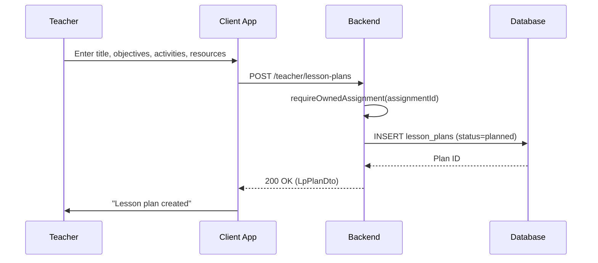
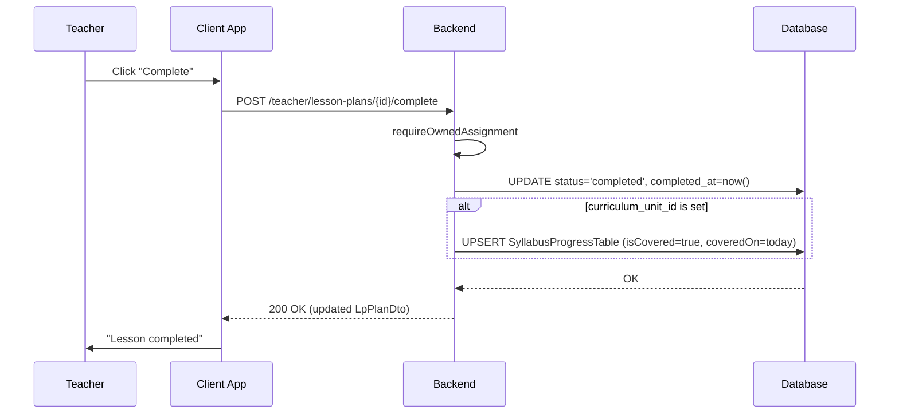
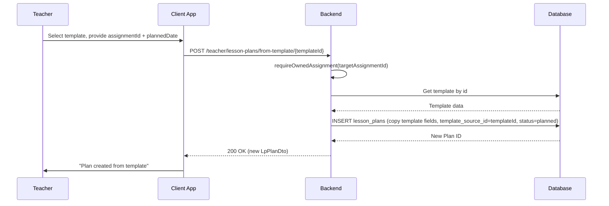
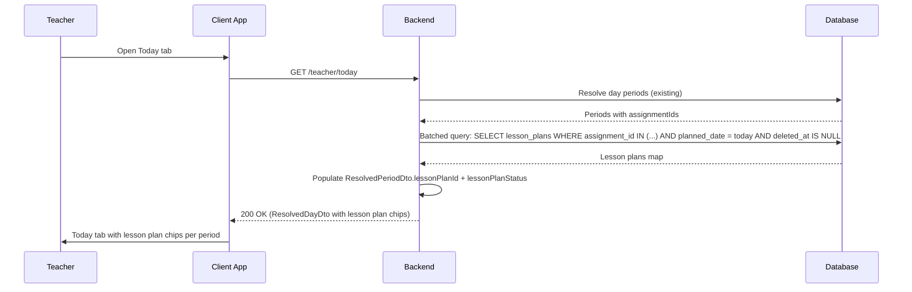
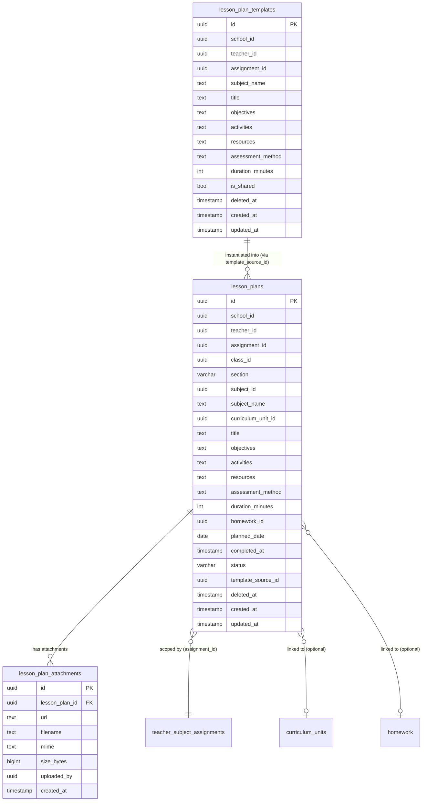

# Lesson Planning — Technical Specification

> **Document status:** Implemented (90%) — multi-mode editor, assignment-scoped plans, templates, attachments, today-tab integration shipped; calendar month view + analytics TODO
> **Last updated:** 2026-06-28 (rev 3 — post-implementation status update)
> **Prerequisites:** None
> **Audit ref:** `feature_audit.csv` L127; IMPLEMENTATION_BACKLOG P1-20
> **Template:** `_SPEC_TEMPLATE.md` v1 (25 mandatory + 6 optional sections)

---

## 1. Feature Overview

Digital lesson planning for teachers: create, store, and share lesson plans linked to curriculum units and syllabus progress. Enables structured teaching with objectives, activities, resources, and assessment methods.

### Goals

- Teacher creates lesson plans scoped to a `TeacherSubjectAssignment` (assignment_id) — the X-1 ownership pattern used by every other teacher surface (attendance, gradebook, syllabus, homework)
- Link to curriculum units (`CurriculumUnitsTable`) and auto-update syllabus progress (`SyllabusProgressTable`) on completion
- Lesson plan: objectives, activities, resources, duration, assessment method, homework link, attachments
- Admin can review lesson plans (read-only, school-scoped)
- Reusable templates per subject (separate table, not a flag)
- Today tab integration — planned lessons surface in `ResolvedDayDto.periods`
- Calendar view (month-level, what's planned for each day)

### Non-goals

- [ ] Co-planning / sharing across teachers teaching the same subject
- [ ] Lesson plan approval workflow with revision requests
- [ ] Recurring lesson plans ("every Monday for 4 weeks")
- [ ] Parent/student notification on syllabus progress update
- [ ] Analytics dashboard ("lessons completed vs planned this term")

### Dependencies

- `CurriculumUnitsTable` — hierarchical curriculum tracking (chapter→topic)
- `SyllabusProgressTable` — per-section coverage state (auto-updated on lesson completion)
- `HomeworkTable` — homework linked to lesson plans
- `HomeworkAttachmentsTable` — pattern for lesson plan attachments
- `TeacherSubjectAssignmentsTable` — teacher→subject→class+section mapping (ownership boundary)
- `TeacherRepository` — assignment-scoped teacher repository
- `TeacherModels.kt` — `ResolvedDayDto`/`ResolvedPeriodDto` for Today tab integration

### Related Modules

- `server/.../feature/teacher/` — teacher feature module
- `server/.../feature/school/` — school admin feature module
- `shared/.../teacher/` — shared teacher DTOs, repository, API
- `composeApp/.../ui/v2/screens/teacher/` — teacher UI screens

---

## 2. Current System Assessment

### Existing Code

- `feature_audit.csv` L127: Lesson Planning missing (0%)
- `CurriculumUnitsTable` (`Tables.kt:1032-1042`) — hierarchical curriculum tracking: `schoolId`, `classId`, `subjectId`, `parentId` (chapter→topic), `title`, `position`, `isActive`
- `SyllabusProgressTable` (`Tables.kt:1052-1065`) — per-section coverage state: `unitId`, `section`, `assignmentId`, `isCovered`, `coveredOn` (typed date), `coveredBy`, `note`. Unique on `(unitId, section, assignmentId)`
- `HomeworkTable` (`Tables.kt:1083-1103`) — typed scope spine: `assignmentId`, `classId`, `subjectId` (X-1), legacy display columns retained
- `HomeworkAttachmentsTable` (`Tables.kt:1109-1116`) — file/image attachments for homework (pattern to follow for lesson plan attachments)
- `TeacherSubjectAssignmentsTable` — teacher→subject→class+section mapping; the ownership boundary enforced via `requireOwnedAssignment()`
- `TeacherRepository` (`shared/.../teacher/domain/repository/TeacherRepository.kt`) — 79 lines, all methods assignment-scoped; no lesson plan methods exist
- `TeacherModels.kt` (`shared/.../teacher/domain/model/TeacherModels.kt`) — 1132 lines; `ResolvedDayDto`/`ResolvedPeriodDto` carry `assignmentId` per period (Today tab integration point)
- `TeacherRouting.kt` — `teacherRouting()` mounts at `/api/v1/teacher`; sub-surfaces registered via `teacherTaskRoutes()` (currently empty, documented landing zone)
- Existing routing pattern: each surface gets its own `Teacher*Routing.kt` file with `fun Route.teacher*Routing()` extension, DTOs prefixed (e.g. `Syl*`, `Hw*`, `Gb*`)
- Latest DB migration: `migration_024_conversation_seq_and_nullable_body.sql`

### Existing Database

- `CurriculumUnitsTable` — curriculum unit hierarchy
- `SyllabusProgressTable` — syllabus coverage tracking
- `HomeworkTable` — homework assignments
- `HomeworkAttachmentsTable` — homework file attachments
- `TeacherSubjectAssignmentsTable` — teacher assignment scoping
- No lesson plan tables

### Existing APIs

- `GET/POST /api/v1/teacher/syllabus` — syllabus management
- `GET/POST /api/v1/teacher/homework` — homework management
- `GET /api/v1/teacher/today` — Today tab (day resolution)
- No lesson plan APIs

### Existing UI

- Teacher: Today tab, syllabus tracker, homework editor, gradebook
- No lesson plan UI

### Existing Services

- `TeacherRepository` — assignment-scoped teacher data access
- `NotificationService` — multi-channel notifications

### Existing Documentation

- `feature_audit.csv` — feature audit tracking (lesson planning at 0%)
- `IMPLEMENTATION_BACKLOG` — P1-20 entry

### Technical Debt

| # | Gap | Details |
|---|---|---|
| TD-1 | No lesson plan tables | 0% implementation at audit time |
| TD-2 | No lesson plan APIs | No teacher or admin endpoints |
| TD-3 | No lesson plan UI | No editor, calendar, or template screens |
| TD-4 | No Today tab integration | `ResolvedPeriodDto` has no lesson plan fields |

### Gaps

| # | Gap | Impact | Severity |
|---|---|---|---|
| G1 | No lesson plan CRUD | Teachers cannot create structured lesson plans | **High** |
| G2 | No syllabus progress auto-update | Manual syllabus tracking only | **High** |
| G3 | No templates | No reusable lesson plan templates | **Medium** |
| G4 | No calendar view | No month-level planning overview | **Medium** |
| G5 | No Today tab integration | Lesson plans not visible in daily view | **Medium** |

---

## 3. Functional Requirements

### FR-001
| Field | Value |
|---|---|
| **Title** | Create Lesson Plan |
| **Description** | Teacher creates lesson plan scoped to an owned assignment: title, unit (optional), objectives, activities, resources, duration, assessment method |
| **Priority** | P0 |
| **User Roles** | Teacher |
| **Acceptance notes** | Plan stored with `assignment_id` (X-1 scope), `status = 'planned'` |

### FR-002
| Field | Value |
|---|---|
| **Title** | Syllabus Progress Auto-Update |
| **Description** | Link to curriculum unit; on completion, auto-upsert `SyllabusProgressTable` (isCovered=true, coveredOn=today, coveredBy=teacher) |
| **Priority** | P0 |
| **User Roles** | Teacher, System |
| **Acceptance notes** | Upsert keyed on `(unitId, section, assignmentId)`; section from owned assignment |

### FR-003
| Field | Value |
|---|---|
| **Title** | Homework Link |
| **Description** | Link homework assignment to lesson plan (optional `homework_id`) |
| **Priority** | P0 |
| **User Roles** | Teacher |
| **Acceptance notes** | `homework_id` nullable FK to `homework.id` |

### FR-004
| Field | Value |
|---|---|
| **Title** | Admin Review |
| **Description** | Admin can view all lesson plans for their school (read-only, filterable by teacher/class/date) |
| **Priority** | P0 |
| **User Roles** | School Admin |
| **Acceptance notes** | Read-only; school-scoped; filterable |

### FR-005
| Field | Value |
|---|---|
| **Title** | Templates |
| **Description** | Save a lesson plan as a template; instantiate a new plan from a template |
| **Priority** | P0 |
| **User Roles** | Teacher |
| **Acceptance notes** | Separate `lesson_plan_templates` table; `is_shared` for cross-teacher reuse |

### FR-006
| Field | Value |
|---|---|
| **Title** | Calendar View |
| **Description** | Lesson plan calendar view: month-level query returning plans grouped by date |
| **Priority** | P0 |
| **User Roles** | Teacher |
| **Acceptance notes** | `GET /calendar?assignmentId={uuid}&month={YYYY-MM}` returns days with plans |

### FR-007
| Field | Value |
|---|---|
| **Title** | Soft Delete |
| **Description** | Teacher can delete a lesson plan (soft delete: `deleted_at` timestamp) |
| **Priority** | P0 |
| **User Roles** | Teacher |
| **Acceptance notes** | `deleted_at` set; all queries filter `WHERE deleted_at IS NULL` |

### FR-008
| Field | Value |
|---|---|
| **Title** | Skip Lesson |
| **Description** | Teacher can mark a lesson as `skipped` (distinct from `completed` — does NOT update syllabus progress) |
| **Priority** | P0 |
| **User Roles** | Teacher |
| **Acceptance notes** | `status = 'skipped'`; no `SyllabusProgressTable` update |

### FR-009
| Field | Value |
|---|---|
| **Title** | Get Single Plan |
| **Description** | GET single lesson plan by id (for edit screen hydration) |
| **Priority** | P0 |
| **User Roles** | Teacher |
| **Acceptance notes** | Returns `LpPlanDto` with all fields |

### FR-010
| Field | Value |
|---|---|
| **Title** | List with Filters |
| **Description** | List lesson plans with filters: `assignmentId`, `status`, `date_range`, `unit_id` |
| **Priority** | P0 |
| **User Roles** | Teacher |
| **Acceptance notes** | Query params: assignmentId, status, from, to, unitId |

### FR-011
| Field | Value |
|---|---|
| **Title** | Attachments |
| **Description** | Attachments: teacher can attach files/links to a lesson plan (URL-based, following `HomeworkAttachmentsTable` pattern) |
| **Priority** | P1 |
| **User Roles** | Teacher |
| **Acceptance notes** | `lesson_plan_attachments` table; URL-based attachments |

### FR-012
| Field | Value |
|---|---|
| **Title** | Today Tab Integration |
| **Description** | Today tab integration: `ResolvedPeriodDto` carries a `lesson_plan_id` when a plan exists for that period's date + assignment |
| **Priority** | P1 |
| **User Roles** | Teacher |
| **Acceptance notes** | Batched query in `TeacherDayRouting.kt`; UI chip per period |

---

## 4. User Stories

### Teacher
- [ ] Create a lesson plan with objectives, activities, resources
- [ ] Link lesson plan to a curriculum unit
- [ ] Link homework to a lesson plan
- [ ] Complete a lesson plan (auto-updates syllabus progress)
- [ ] Skip a lesson plan (no syllabus update)
- [ ] Edit a lesson plan
- [ ] Delete a lesson plan (soft delete)
- [ ] View lesson plan calendar (month-level)
- [ ] Save a lesson plan as template
- [ ] Instantiate a plan from a template
- [ ] Attach files/links to a lesson plan
- [ ] See lesson plan chip on Today tab

### School Admin
- [ ] View all lesson plans for the school (read-only)
- [ ] Filter lesson plans by teacher, class, date, subject

### System
- [ ] Auto-upsert `SyllabusProgressTable` on lesson completion
- [ ] Batch query lesson plans for Today tab periods

---

## 5. Business Rules

### BR-001
**Rule:** Lesson plans are scoped to an owned `TeacherSubjectAssignment`.
**Enforcement:** All writes guarded by `requireOwnedAssignment(ctx, assignmentId)` — 403 if not owned.

### BR-002
**Rule:** Completing a lesson plan auto-upserts `SyllabusProgressTable`.
**Enforcement:** On `POST /{id}/complete`, if `curriculum_unit_id` is set, upsert `SyllabusProgressTable` with `isCovered=true`, `coveredOn=today`, `coveredBy=ctx.userId`.

### BR-003
**Rule:** Skipping a lesson does NOT update syllabus progress.
**Enforcement:** On `POST /{id}/skip`, only update `status = 'skipped'`; no `SyllabusProgressTable` interaction.

### BR-004
**Rule:** Section comes from the owned assignment, never client-supplied.
**Enforcement:** `section` denormalised from TSA; authoritative source is the assignment, not the request body.

### BR-005
**Rule:** Soft delete — `deleted_at` timestamp, not hard delete.
**Enforcement:** DELETE sets `deleted_at = now()`; all queries filter `WHERE deleted_at IS NULL`.

### BR-006
**Rule:** Templates are separate from plans (different table, different lifecycle).
**Enforcement:** `lesson_plan_templates` table; templates have no `planned_date`, `status`, `homework_id`, or `completed_at`.

### BR-007
**Rule:** Shared templates visible to all teachers in the same school.
**Enforcement:** Template list query: own templates + `is_shared=true` within same `school_id`.

---

## 6. Database Design

### 6.1 Entity Relationship Summary

Three new tables: `lesson_plans` (teacher lesson plans), `lesson_plan_templates` (reusable templates), `lesson_plan_attachments` (file/link attachments). Plans link to `CurriculumUnitsTable`, `SyllabusProgressTable`, `HomeworkTable`, and `TeacherSubjectAssignmentsTable`.

### 6.2 New Tables

#### `lesson_plans` table

```sql
CREATE TABLE lesson_plans (
    id                UUID PRIMARY KEY DEFAULT gen_random_uuid(),
    school_id         UUID NOT NULL,
    teacher_id        UUID NOT NULL,
    assignment_id     UUID NOT NULL,
    class_id          UUID NOT NULL,
    section           VARCHAR(8) NOT NULL DEFAULT 'A',
    subject_id        UUID,
    subject_name      TEXT NOT NULL,
    curriculum_unit_id UUID,
    title             TEXT NOT NULL,
    objectives        TEXT NOT NULL,
    activities        TEXT,
    resources         TEXT,
    assessment_method TEXT,
    duration_minutes  INTEGER NOT NULL DEFAULT 45,
    homework_id       UUID,
    planned_date      DATE,
    completed_at      TIMESTAMP,
    status            VARCHAR(16) NOT NULL DEFAULT 'planned',
    is_template       BOOLEAN NOT NULL DEFAULT false,
    template_source_id UUID,
    deleted_at        TIMESTAMP,
    created_at        TIMESTAMP NOT NULL DEFAULT now(),
    updated_at        TIMESTAMP NOT NULL DEFAULT now()
);
CREATE INDEX idx_lesson_plans_assignment ON lesson_plans(assignment_id, planned_date);
CREATE INDEX idx_lesson_plans_school ON lesson_plans(school_id, assignment_id);
CREATE INDEX idx_lesson_plans_calendar ON lesson_plans(teacher_id, planned_date, status) WHERE deleted_at IS NULL;
CREATE INDEX idx_lesson_plans_unit ON lesson_plans(curriculum_unit_id) WHERE curriculum_unit_id IS NOT NULL;
```

#### `lesson_plan_templates` table

```sql
CREATE TABLE lesson_plan_templates (
    id                UUID PRIMARY KEY DEFAULT gen_random_uuid(),
    school_id         UUID NOT NULL,
    teacher_id        UUID NOT NULL,
    assignment_id     UUID NOT NULL,
    subject_name      TEXT NOT NULL,
    title             TEXT NOT NULL,
    objectives        TEXT NOT NULL,
    activities        TEXT,
    resources         TEXT,
    assessment_method TEXT,
    duration_minutes  INTEGER NOT NULL DEFAULT 45,
    is_shared         BOOLEAN NOT NULL DEFAULT false,
    deleted_at        TIMESTAMP,
    created_at        TIMESTAMP NOT NULL DEFAULT now(),
    updated_at        TIMESTAMP NOT NULL DEFAULT now()
);
CREATE INDEX idx_lesson_templates_teacher ON lesson_plan_templates(teacher_id, assignment_id);
CREATE INDEX idx_lesson_templates_school ON lesson_plan_templates(school_id, is_shared);
```

#### `lesson_plan_attachments` table

```sql
CREATE TABLE lesson_plan_attachments (
    id              UUID PRIMARY KEY DEFAULT gen_random_uuid(),
    lesson_plan_id  UUID NOT NULL,
    url             TEXT NOT NULL,
    filename        TEXT NOT NULL DEFAULT '',
    mime            TEXT NOT NULL DEFAULT '',
    size_bytes      BIGINT NOT NULL DEFAULT 0,
    uploaded_by     UUID,
    created_at      TIMESTAMP NOT NULL DEFAULT now()
);
CREATE INDEX idx_lesson_attachments_plan ON lesson_plan_attachments(lesson_plan_id);
```

### 6.3 Modified Tables

N/A — no existing tables modified. `SyllabusProgressTable` is upserted on lesson completion but schema unchanged.

### 6.4 Indexes

```sql
CREATE INDEX idx_lesson_plans_assignment ON lesson_plans(assignment_id, planned_date);
CREATE INDEX idx_lesson_plans_school ON lesson_plans(school_id, assignment_id);
CREATE INDEX idx_lesson_plans_calendar ON lesson_plans(teacher_id, planned_date, status) WHERE deleted_at IS NULL;
CREATE INDEX idx_lesson_plans_unit ON lesson_plans(curriculum_unit_id) WHERE curriculum_unit_id IS NOT NULL;
CREATE INDEX idx_lesson_templates_teacher ON lesson_plan_templates(teacher_id, assignment_id);
CREATE INDEX idx_lesson_templates_school ON lesson_plan_templates(school_id, is_shared);
CREATE INDEX idx_lesson_attachments_plan ON lesson_plan_attachments(lesson_plan_id);
```

### 6.5 Constraints

- `lesson_plans.school_id` — NOT NULL (multi-tenant isolation)
- `lesson_plans.assignment_id` — NOT NULL (X-1 scope)
- `lesson_plans.title` — NOT NULL
- `lesson_plans.objectives` — NOT NULL (JSON array)
- `lesson_plans.status` — NOT NULL, default 'planned', one of planned/completed/skipped
- `lesson_plans.deleted_at` — nullable (soft delete)
- `lesson_plan_templates.school_id` — NOT NULL
- `lesson_plan_templates.title` — NOT NULL
- `lesson_plan_templates.objectives` — NOT NULL (JSON array)
- `lesson_plan_attachments.lesson_plan_id` — NOT NULL, FK

### 6.6 Foreign Keys

- `lesson_plans.assignment_id` → `teacher_subject_assignments.id`
- `lesson_plans.curriculum_unit_id` → `curriculum_units.id` (nullable)
- `lesson_plans.homework_id` → `homework.id` (nullable)
- `lesson_plans.template_source_id` → `lesson_plans.id` (nullable, self-reference)
- `lesson_plan_templates.assignment_id` → `teacher_subject_assignments.id`
- `lesson_plan_attachments.lesson_plan_id` → `lesson_plans.id` (CASCADE)

### 6.7 Soft Delete Strategy

- `lesson_plans.deleted_at` — timestamp; all queries filter `WHERE deleted_at IS NULL`
- `lesson_plan_templates.deleted_at` — same pattern

### 6.8 Audit Fields

- `created_at` — creation timestamp (all tables)
- `updated_at` — last update timestamp (lesson_plans, lesson_plan_templates)
- `completed_at` — when lesson was marked complete (lesson_plans only)
- `deleted_at` — soft delete timestamp (lesson_plans, lesson_plan_templates)
- `uploaded_by` — who uploaded attachment (lesson_plan_attachments)

### 6.9 Migration Notes

Migration: `docs/db/migration_025_lesson_planning.sql`
- Creates 3 lesson plan tables with indexes
- No data backfill needed (new feature)

### 6.10 Exposed Mappings

```kotlin
object LessonPlansTable : UUIDTable("lesson_plans", "id") {
    val schoolId         = uuid("school_id")
    val teacherId        = uuid("teacher_id")
    val assignmentId     = uuid("assignment_id")
    val classId          = uuid("class_id")
    val section          = varchar("section", 8).default("A")
    val subjectId        = uuid("subject_id").nullable()
    val subjectName      = text("subject_name")
    val curriculumUnitId = uuid("curriculum_unit_id").nullable()
    val title            = text("title")
    val objectives       = text("objectives")
    val activities       = text("activities").nullable()
    val resources        = text("resources").nullable()
    val assessmentMethod = text("assessment_method").nullable()
    val durationMinutes  = integer("duration_minutes").default(45)
    val homeworkId       = uuid("homework_id").nullable()
    val plannedDate      = date("planned_date").nullable()
    val completedAt      = timestamp("completed_at").nullable()
    val status           = varchar("status", 16).default("planned")
    val isTemplate       = bool("is_template").default(false)
    val templateSourceId = uuid("template_source_id").nullable()
    val deletedAt        = timestamp("deleted_at").nullable()
    val createdAt        = timestamp("created_at")
    val updatedAt        = timestamp("updated_at")
    init {
        index("idx_lesson_plans_assignment", false, assignmentId, plannedDate)
        index("idx_lesson_plans_school", false, schoolId, assignmentId)
        index("idx_lesson_plans_calendar", false, teacherId, plannedDate, status)
        index("idx_lesson_plans_unit", false, curriculumUnitId)
    }
}

object LessonPlanTemplatesTable : UUIDTable("lesson_plan_templates", "id") {
    val schoolId         = uuid("school_id")
    val teacherId        = uuid("teacher_id")
    val assignmentId     = uuid("assignment_id")
    val subjectName      = text("subject_name")
    val title            = text("title")
    val objectives       = text("objectives")
    val activities       = text("activities").nullable()
    val resources        = text("resources").nullable()
    val assessmentMethod = text("assessment_method").nullable()
    val durationMinutes  = integer("duration_minutes").default(45)
    val isShared         = bool("is_shared").default(false)
    val deletedAt        = timestamp("deleted_at").nullable()
    val createdAt        = timestamp("created_at")
    val updatedAt        = timestamp("updated_at")
    init {
        index("idx_lesson_templates_teacher", false, teacherId, assignmentId)
        index("idx_lesson_templates_school", false, schoolId, isShared)
    }
}

object LessonPlanAttachmentsTable : UUIDTable("lesson_plan_attachments", "id") {
    val lessonPlanId = uuid("lesson_plan_id")
    val url          = text("url")
    val filename     = text("filename").default("")
    val mime         = text("mime").default("")
    val sizeBytes    = long("size_bytes").default(0)
    val uploadedBy   = uuid("uploaded_by").nullable()
    val createdAt    = timestamp("created_at")
    init {
        index("idx_lesson_attachments_plan", false, lessonPlanId)
    }
}
```

### 6.11 Seed Data

N/A — lesson plans and templates created by teachers.

---

## 7. State Machines

### Lesson Plan Status State Machine

```
PLANNED ──teacher_completes──> COMPLETED (upserts SyllabusProgressTable)
PLANNED ──teacher_skips──> SKIPPED (no syllabus update)
PLANNED ──teacher_edits──> PLANNED (updated in place)
PLANNED ──teacher_deletes──> DELETED (soft delete: deleted_at set)
COMPLETED ──teacher_deletes──> DELETED
SKIPPED ──teacher_deletes──> DELETED
```

| Current State | Event | Next State | Guard / Condition |
|---|---|---|---|
| `planned` | Teacher completes | `completed` | `completed_at = now()`; syllabus progress upserted if unit linked |
| `planned` | Teacher skips | `skipped` | No syllabus progress update |
| `planned` | Teacher edits | `planned` | Fields updated in place |
| `planned` | Teacher deletes | `deleted` | `deleted_at = now()` (soft delete) |
| `completed` | Teacher deletes | `deleted` | `deleted_at = now()` |
| `skipped` | Teacher deletes | `deleted` | `deleted_at = now()` |
| `completed` | Teacher re-opens | `planned` | `completed_at = null` (future enhancement) |

### Template Instantiation Flow

```
TEMPLATE_SELECTED ──instantiate──> CREATE_NEW_PLAN ──copy_fields──> COMPLETE
```

| Step | Action | Condition |
|---|---|---|
| 1 | Teacher selects template | Template exists and is accessible |
| 2 | Provide assignmentId + plannedDate | `requireOwnedAssignment` on target |
| 3 | Copy template fields to new plan | title, objectives, activities, resources, assessment, duration |
| 4 | Set `template_source_id` | Links new plan to template lineage |
| 5 | New plan has `status = 'planned'` | Ready for editing |

---

## 8. Backend Architecture

### 8.1 Component Overview

`TeacherLessonPlanRouting.kt` handles all teacher lesson plan endpoints (list, CRUD, complete, skip, calendar). `TeacherLessonTemplateRouting.kt` handles template management. `SchoolLessonPlanRouting.kt` provides admin read-only review. All teacher writes guarded by `requireOwnedAssignment()`.

### 8.2 Design Principles

1. **X-1 ownership pattern** — all reads/writes scoped to `assignment_id`; guarded by `requireOwnedAssignment()`
2. **Denormalised columns** — `teacher_id`, `class_id`, `section`, `subject_id`, `subject_name` denormalised from TSA for query convenience (same as `HomeworkTable`)
3. **Soft delete** — `deleted_at` timestamp; all queries filter `WHERE deleted_at IS NULL`
4. **Separate templates table** — different shape, different lifecycle; no `planned_date`, `status`, `homework_id`
5. **Batched Today tab query** — single `IN` query for all periods, not N+1

### 8.3 Core Types

```kotlin
// Server-side routing
fun Route.teacherLessonPlanRouting()
fun Route.teacherLessonTemplateRouting()
fun Route.schoolLessonPlanRouting()

// DTOs (Lp* prefix)
data class LpCreateRequest(...)
data class LpUpdateRequest(...)
data class LpPlanDto(...)
data class LpTemplateDto(...)
data class LpCalendarDto(...)
```

### 8.4 Repositories

- `TeacherRepository` — extended with lesson plan and template methods (assignment-scoped)
- `TeacherRepositoryImpl` — implements all new repository methods

### 8.5 Mappers

- `LessonPlanMapper` — maps `LessonPlansTable` rows to `LpPlanDto`
- `LessonTemplateMapper` — maps `LessonPlanTemplatesTable` rows to `LpTemplateDto`
- JSON fields (`objectives`, `activities`, `resources`) parsed/serialized via kotlinx.serialization

### 8.6 Permission Checks

| Endpoint | Guard |
|---|---|
| All teacher endpoints | `requireTeacherContext()` → JWT teacher context |
| Create/Update/Delete/Complete/Skip | `requireOwnedAssignment(ctx, assignmentId)` — 403 if not owned |
| GET single / calendar | Verify `lesson_plans.assignment_id` belongs to owned TSA |
| Admin review | `requireSchoolContext()` → JWT school admin context; auto-scoped to `school_id` |
| Template list | Own templates + `is_shared=true` within same `school_id` |
| Template instantiate | `requireOwnedAssignment(ctx, assignmentId)` on target assignment |

### 8.7 Background Jobs

N/A — no background jobs needed. All operations are synchronous.

### 8.8 Domain Events

- `LessonPlanCreated` — emitted when plan created
- `LessonPlanCompleted` — emitted when plan completed (triggers syllabus progress upsert)
- `LessonPlanSkipped` — emitted when plan skipped
- `LessonPlanUpdated` — emitted when plan fields updated
- `LessonPlanDeleted` — emitted on soft delete
- `LessonTemplateSaved` — emitted when template saved
- `LessonTemplateInstantiated` — emitted when plan created from template
- `SyllabusProgressUpdated` — emitted by completion flow (upsert to `SyllabusProgressTable`)

### 8.9 Caching

- No caching for lesson plans (changes frequently, teacher-specific)
- Template list could be cached per teacher (future optimization)

### 8.10 Transactions

- Complete lesson: UPDATE status + UPSERT SyllabusProgressTable in transaction
- Create plan: INSERT lesson_plans (single operation)
- Template instantiate: INSERT new plan with `template_source_id` (single operation)
- Soft delete: UPDATE `deleted_at = now()`

### 8.11 Rate Limiting

- Standard API rate limiting

### 8.12 Configuration

- `LESSON_PLAN_MAX_OBJECTIVES` — default `20` (max objectives per plan)
- `LESSON_PLAN_MAX_ACTIVITIES` — default `20` (max activities per plan)
- `LESSON_PLAN_MAX_ATTACHMENTS` — default `10` (max attachments per plan)

---

## 9. API Contracts

### 9.1 Teacher endpoints (`TeacherLessonPlanRouting.kt`)

All endpoints require JWT auth + `requireTeacherContext()`. Writes are guarded by `requireOwnedAssignment(assignmentId)`.

```
GET    /api/v1/teacher/lesson-plans?assignmentId={uuid}&status={planned|completed|skipped}&from={YYYY-MM-DD}&to={YYYY-MM-DD}&unitId={uuid}
POST   /api/v1/teacher/lesson-plans
GET    /api/v1/teacher/lesson-plans/{id}
PATCH  /api/v1/teacher/lesson-plans/{id}
DELETE /api/v1/teacher/lesson-plans/{id}
POST   /api/v1/teacher/lesson-plans/{id}/complete
POST   /api/v1/teacher/lesson-plans/{id}/skip
GET    /api/v1/teacher/lesson-plans/calendar?assignmentId={uuid}&month={YYYY-MM}
```

### 9.2 Template endpoints

```
GET    /api/v1/teacher/lesson-plan-templates?assignmentId={uuid}
POST   /api/v1/teacher/lesson-plan-templates
DELETE /api/v1/teacher/lesson-plan-templates/{id}
POST   /api/v1/teacher/lesson-plans/from-template/{templateId}
```

### 9.3 Admin review endpoint (`SchoolLessonPlanRouting.kt`)

Requires JWT auth + `requireSchoolContext()`. Read-only.

```
GET    /api/v1/school/lesson-plans?teacher_id={uuid}&class_id={uuid}&from={YYYY-MM-DD}&to={YYYY-MM-DD}&subject={text}
```

### 9.4 Request/Response DTOs

**Create/Update:**
```kotlin
@Serializable
data class LpCreateRequest(
    @SerialName("assignment_id") val assignmentId: String,
    @SerialName("curriculum_unit_id") val curriculumUnitId: String? = null,
    val title: String,
    val objectives: List<String> = emptyList(),
    val activities: List<LpActivityDto> = emptyList(),
    val resources: List<String> = emptyList(),
    @SerialName("assessment_method") val assessmentMethod: String? = null,
    @SerialName("duration_minutes") val durationMinutes: Int = 45,
    @SerialName("homework_id") val homeworkId: String? = null,
    @SerialName("planned_date") val plannedDate: String? = null,
)

@Serializable
data class LpActivityDto(
    val activity: String,
    @SerialName("duration_min") val durationMin: Int = 15,
)

@Serializable
data class LpUpdateRequest(
    @SerialName("curriculum_unit_id") val curriculumUnitId: String? = null,
    val title: String? = null,
    val objectives: List<String>? = null,
    val activities: List<LpActivityDto>? = null,
    val resources: List<String>? = null,
    @SerialName("assessment_method") val assessmentMethod: String? = null,
    @SerialName("duration_minutes") val durationMinutes: Int? = null,
    @SerialName("homework_id") val homeworkId: String? = null,
    @SerialName("planned_date") val plannedDate: String? = null,
)
```

**Response:**
```kotlin
@Serializable
data class LpPlanDto(
    val id: String,
    @SerialName("assignment_id") val assignmentId: String,
    @SerialName("class_id") val classId: String,
    val section: String = "",
    @SerialName("subject_name") val subjectName: String,
    @SerialName("curriculum_unit_id") val curriculumUnitId: String? = null,
    @SerialName("curriculum_unit_title") val curriculumUnitTitle: String? = null,
    val title: String,
    val objectives: List<String> = emptyList(),
    val activities: List<LpActivityDto> = emptyList(),
    val resources: List<String> = emptyList(),
    @SerialName("assessment_method") val assessmentMethod: String? = null,
    @SerialName("duration_minutes") val durationMinutes: Int = 45,
    @SerialName("homework_id") val homeworkId: String? = null,
    @SerialName("planned_date") val plannedDate: String? = null,
    @SerialName("completed_at") val completedAt: String? = null,
    val status: String = "planned",
    @SerialName("template_source_id") val templateSourceId: String? = null,
    @SerialName("created_at") val createdAt: String,
    @SerialName("updated_at") val updatedAt: String,
)

@Serializable
data class LpListResponse(
    val success: Boolean = true,
    val data: List<LpPlanDto> = emptyList(),
)

@Serializable
data class LpSingleResponse(
    val success: Boolean = true,
    val data: LpPlanDto,
)

@Serializable
data class LpCalendarResponse(
    val success: Boolean = true,
    val data: LpCalendarDto,
)

@Serializable
data class LpCalendarDto(
    val month: String,
    val days: List<LpCalendarDayDto> = emptyList(),
)

@Serializable
data class LpCalendarDayDto(
    val date: String,
    val plans: List<LpPlanDto> = emptyList(),
)
```

**Template DTOs:**
```kotlin
@Serializable
data class LpTemplateDto(
    val id: String,
    @SerialName("assignment_id") val assignmentId: String,
    @SerialName("subject_name") val subjectName: String,
    val title: String,
    val objectives: List<String> = emptyList(),
    val activities: List<LpActivityDto> = emptyList(),
    val resources: List<String> = emptyList(),
    @SerialName("assessment_method") val assessmentMethod: String? = null,
    @SerialName("duration_minutes") val durationMinutes: Int = 45,
    @SerialName("is_shared") val isShared: Boolean = false,
)

@Serializable
data class LpTemplateListResponse(
    val success: Boolean = true,
    val data: List<LpTemplateDto> = emptyList(),
)

@Serializable
data class LpInstantiateRequest(
    @SerialName("assignment_id") val assignmentId: String,
    @SerialName("planned_date") val plannedDate: String,
)
```

### 9.5 Complete endpoint behaviour (`POST /{id}/complete`)

1. Verify teacher owns the assignment (via `requireOwnedAssignment`)
2. Update `lesson_plans.status = 'completed'`, `completed_at = now()`
3. If `curriculum_unit_id` is set:
   - Upsert `SyllabusProgressTable`: `isCovered = true`, `coveredOn = today`, `coveredBy = ctx.userId`
   - Keyed on `(unitId, section, assignmentId)` — same unique index as the one-tap toggle
   - Section comes from the owned assignment (authoritative, never client-supplied — X-1)
4. Return the updated `LpPlanDto`

### 9.6 Skip endpoint behaviour (`POST /{id}/skip`)

1. Verify teacher owns the assignment
2. Update `lesson_plans.status = 'skipped'`
3. **Does NOT touch `SyllabusProgressTable`** — skipped ≠ covered
4. Return the updated `LpPlanDto`

---

## 10. Frontend Architecture

### 10.1 Screens

| Screen | Platform | Role | Description |
|---|---|---|---|
| `LessonPlanEditorScreen` | All | Teacher | Create/edit lesson plan UI |
| `LessonCalendarScreen` | All | Teacher | Month calendar view with per-day lesson plans |
| `LessonTemplatePickerScreen` | All | Teacher | Template list + instantiate flow |
| `TodayScreen` (modified) | All | Teacher | Today tab with lesson plan chip per period |
| `AdminLessonPlanReviewScreen` | All | Admin | Read-only lesson plan review (filterable) |

### 10.2 Navigation

- Teacher portal → Lessons → New → `LessonPlanEditorScreen`
- Teacher portal → Lessons → Calendar → `LessonCalendarScreen`
- Teacher portal → Lessons → Templates → `LessonTemplatePickerScreen`
- Teacher portal → Today → period card → lesson plan chip → `LessonPlanEditorScreen`
- Admin portal → Academics → Lesson Plans → `AdminLessonPlanReviewScreen`

### 10.3 UX Flows

#### Teacher: Create Lesson Plan

1. Teacher opens Lessons → New
2. Selects assignment (auto-scoped)
3. Enters title, objectives (list), activities (list with duration), resources (list)
4. Optionally selects curriculum unit
5. Optionally links homework
6. Optionally sets planned date
7. Saves plan (status = planned)

#### Teacher: Complete Lesson

1. Teacher opens lesson plan
2. Clicks "Complete"
3. System updates status to completed + upserts syllabus progress
4. UI shows completed state

#### Teacher: Skip Lesson

1. Teacher opens lesson plan
2. Clicks "Skip"
3. System updates status to skipped (no syllabus update)
4. UI shows skipped state

#### Teacher: Instantiate from Template

1. Teacher opens Lessons → Templates
2. Selects a template
3. Provides assignmentId + plannedDate
4. System creates new plan from template
5. Teacher edits the new plan as needed

### 10.4 State Management

```kotlin
data class LessonPlanState(
    val plans: List<LpPlanDto>,
    val currentPlan: LpPlanDto?,
    val calendar: LpCalendarDto?,
    val templates: List<LpTemplateDto>,
    val isLoading: Boolean,
    val error: String?,
)
```

### 10.5 Offline Support

- Lesson plan list cached locally
- Calendar view cached locally
- Create/edit requires network

### 10.6 Loading States

- Loading plans: "Loading lesson plans..."
- Completing: "Marking lesson as complete..."
- Saving template: "Saving template..."
- Instantiating: "Creating plan from template..."

### 10.7 Error Handling (UI)

- Not owned assignment: "You don't have access to this assignment."
- Plan not found: "Lesson plan not found."
- Already completed: "This lesson is already completed."
- Template not found: "Template not found."

### 10.8 Component Integration Guidelines

| Rule | Description |
|---|---|
| **R1** | Lesson plan editor with dynamic lists for objectives, activities, resources |
| **R2** | Activity items have activity text + duration_min field |
| **R3** | Curriculum unit dropdown (optional) |
| **R4** | Homework link dropdown (optional, filtered by assignment) |
| **R5** | Status badge: planned=blue, completed=green, skipped=yellow |
| **R6** | Calendar view: month grid with plan count per day |
| **R7** | Template list with shared badge |
| **R8** | Today tab: lesson plan chip per period (📋 planned, ✅ completed, ⏭️ skipped) |
| **R9** | Today tab chip tap deep-links to lesson plan editor |

---

## 11. Shared Module Changes (KMP)

### 11.1 DTOs

Add to `TeacherModels.kt`:
- `LessonPlanDto`, `LessonPlanListResponse`, `LessonPlanSingleResponse`
- `LessonCalendarResponse`, `LessonCalendarDto`, `LessonCalendarDayDto`
- `LessonActivityDto`
- `CreateLessonPlanRequest`, `UpdateLessonPlanRequest`
- `LessonTemplateDto`, `LessonTemplateListResponse`, `InstantiateFromTemplateRequest`
- `SaveLessonTemplateRequest`
- `ResolvedPeriodDto` enhanced with `lessonPlanId` and `lessonPlanStatus` fields

### 11.2 Domain Models

```kotlin
data class LessonPlan(
    val id: UUID,
    val assignmentId: UUID,
    val title: String,
    val objectives: List<String>,
    val activities: List<LessonActivity>,
    val resources: List<String>,
    val status: String,
    val plannedDate: LocalDate?,
    val completedAt: Instant?,
)

data class LessonActivity(
    val activity: String,
    val durationMin: Int,
)

data class LessonTemplate(
    val id: UUID,
    val title: String,
    val objectives: List<String>,
    val isShared: Boolean,
)
```

### 11.3 Repository Interfaces

```kotlin
// Lesson plans
suspend fun listLessonPlans(
    token: String, assignmentId: String, status: String? = null,
    from: String? = null, to: String? = null, unitId: String? = null,
): NetworkResult<LessonPlanListResponse>

suspend fun getLessonPlan(token: String, planId: String): NetworkResult<LessonPlanSingleResponse>
suspend fun createLessonPlan(token: String, request: CreateLessonPlanRequest): NetworkResult<LessonPlanSingleResponse>
suspend fun updateLessonPlan(token: String, planId: String, request: UpdateLessonPlanRequest): NetworkResult<LessonPlanSingleResponse>
suspend fun deleteLessonPlan(token: String, planId: String): NetworkResult<ApiResponse<Unit>>
suspend fun completeLessonPlan(token: String, planId: String): NetworkResult<LessonPlanSingleResponse>
suspend fun skipLessonPlan(token: String, planId: String): NetworkResult<LessonPlanSingleResponse>
suspend fun getLessonCalendar(token: String, assignmentId: String, month: String): NetworkResult<LessonCalendarResponse>

// Templates
suspend fun listLessonTemplates(token: String, assignmentId: String): NetworkResult<LessonTemplateListResponse>
suspend fun saveLessonTemplate(token: String, request: SaveLessonTemplateRequest): NetworkResult<LessonTemplateDto>
suspend fun deleteLessonTemplate(token: String, templateId: String): NetworkResult<ApiResponse<Unit>>
suspend fun instantiateLessonFromTemplate(token: String, templateId: String, request: InstantiateFromTemplateRequest): NetworkResult<LessonPlanSingleResponse>
```

### 11.4 UseCases

- `CreateLessonPlanUseCase`
- `UpdateLessonPlanUseCase`
- `DeleteLessonPlanUseCase`
- `CompleteLessonPlanUseCase`
- `SkipLessonPlanUseCase`
- `GetLessonPlanUseCase`
- `ListLessonPlansUseCase`
- `GetLessonCalendarUseCase`
- `ListLessonTemplatesUseCase`
- `SaveLessonTemplateUseCase`
- `InstantiateFromTemplateUseCase`

### 11.5 Validation

- Title: not empty
- Objectives: at least one (recommended)
- Assignment: must be owned by teacher
- Planned date: valid date format (YYYY-MM-DD)
- Duration: positive integer

### 11.6 Serialization

Standard Kotlinx serialization for DTOs. JSON fields (`objectives`, `activities`, `resources`) stored as JSON text in DB, parsed to typed lists in DTOs.

### 11.7 Network APIs

Ktor `@Resource` route definitions in `TeacherApi.kt`, following existing pattern (e.g. `TeacherSyllabusApi`, `TeacherHomeworkApi`):
- `TeacherLessonPlanApi` — lesson plan CRUD, complete, skip, calendar
- `TeacherLessonTemplateApi` — template list, save, delete, instantiate

### 11.8 Database Models (Local Cache)

- Lesson plan list cached locally per assignment
- Calendar data cached locally per month

---

## 12. Permissions Matrix

| Action | Super Admin | School Admin | Teacher | Parent |
|---|---|---|---|---|
| Create/edit/delete lesson plans | ✅ | ❌ | ✅ (own assignments) | ❌ |
| Complete/skip lesson plans | ✅ | ❌ | ✅ (own assignments) | ❌ |
| View own lesson plans | ✅ | ✅ | ✅ | ❌ |
| View all school lesson plans | ✅ | ✅ (read-only) | ❌ | ❌ |
| Save/delete templates | ✅ | ❌ | ✅ (own) | ❌ |
| Instantiate from template | ✅ | ❌ | ✅ (own + shared) | ❌ |
| View shared templates | ✅ | ❌ | ✅ (same school) | ❌ |
| View Today tab lesson chip | ✅ | ❌ | ✅ | ❌ |

---

## 13. Notifications

N/A — no notifications sent for lesson plan operations. Lesson plans are teacher-facing only. Syllabus progress updates do not trigger notifications (non-goal).

---

## 14. Background Jobs

N/A — no background jobs needed. All operations are synchronous. Syllabus progress upsert happens inline during lesson completion.

---

## 15. Integrations

### CurriculumUnitsTable
| Field | Value |
|---|---|
| **System** | Existing curriculum management |
| **Purpose** | Link lesson plans to curriculum units (chapter→topic) |
| **API / SDK** | Direct DB via Exposed |
| **Auth method** | Internal |
| **Fallback** | None — curriculum unit is optional |

### SyllabusProgressTable
| Field | Value |
|---|---|
| **System** | Existing syllabus tracking |
| **Purpose** | Auto-upsert on lesson completion (isCovered=true) |
| **API / SDK** | Direct DB via Exposed |
| **Auth method** | Internal |
| **Fallback** | None — upsert is atomic with completion |

### HomeworkTable
| Field | Value |
|---|---|
| **System** | Existing homework management |
| **Purpose** | Optional link from lesson plan to homework assignment |
| **API / SDK** | Direct DB via Exposed |
| **Auth method** | Internal |
| **Fallback** | None — homework link is optional |

### TeacherSubjectAssignmentsTable
| Field | Value |
|---|---|
| **System** | Existing teacher assignment management |
| **Purpose** | Ownership boundary for lesson plans (X-1 pattern) |
| **API / SDK** | `requireOwnedAssignment()` guard |
| **Auth method** | JWT teacher context |
| **Fallback** | None — assignment ownership is mandatory |

### HomeworkAttachmentsTable (pattern)
| Field | Value |
|---|---|
| **System** | Existing attachment pattern |
| **Purpose** | Pattern for `LessonPlanAttachmentsTable` |
| **API / SDK** | Pattern reference |
| **Auth method** | N/A |
| **Fallback** | N/A |

### ResolvedDayDto / ResolvedPeriodDto
| Field | Value |
|---|---|
| **System** | Existing Today tab infrastructure |
| **Purpose** | Enhanced with `lessonPlanId` + `lessonPlanStatus` fields |
| **API / SDK** | `TeacherDayRouting.kt` batched query |
| **Auth method** | JWT teacher context |
| **Fallback** | Null fields if no plan exists for period |

---

## 16. Security

### Authentication
- Teacher endpoints: JWT with `requireTeacherContext()`
- Admin endpoints: JWT with `requireSchoolContext()`

### Authorization
- All teacher writes: `requireOwnedAssignment(ctx, assignmentId)` — 403 if not owned
- Admin review: school-scoped, read-only
- Template list: own + shared within same school
- Template instantiate: `requireOwnedAssignment` on target assignment

### Encryption
- All API communication over TLS

### Audit Logs
- Lesson plan creation logged (title, assignmentId, teacherId)
- Lesson plan completion logged (planId, unitId, syllabusProgressUpdated)
- Lesson plan skip logged (planId, teacherId)
- Lesson plan update logged (planId, fieldsChanged)
- Lesson plan deletion logged (planId, teacherId, deletedAt)
- Template save logged (title, isShared, teacherId)
- Template instantiation logged (templateId, newPlanId, teacherId)

### PII Handling
- Lesson plans contain educational content (objectives, activities, resources)
- No student PII in lesson plans
- Teacher ID stored as author (non-sensitive)

### Data Isolation
- All queries filtered by `school_id` (multi-tenant)
- Teacher queries filtered by `assignment_id` (X-1 ownership)
- Admin queries filtered by `school_id` from JWT

### Rate Limiting
- Standard API rate limiting

### Input Validation
- Title: not empty
- Objectives: JSON array of strings
- Activities: JSON array of {activity, duration_min}
- Resources: JSON array of strings
- Duration: positive integer
- Planned date: valid YYYY-MM-DD format
- Assignment: must be owned by teacher

---

## 17. Performance & Scalability

### Expected Scale

| Metric | Small school | Medium school | Large school |
|---|---|---|---|
| Teachers | ~10 | ~50 | ~200 |
| Lesson plans per teacher per month | ~20 | ~30 | ~40 |
| Templates per teacher | ~5 | ~10 | ~20 |
| Calendar queries per day | ~50 | ~200 | ~1,000 |
| Today tab queries per day | ~100 | ~500 | ~2,000 |

### Latency Targets

| Operation | Target |
|---|---|
| Create lesson plan | < 100ms |
| Get single plan | < 50ms |
| List plans (filtered) | < 100ms |
| Complete plan (+ syllabus upsert) | < 100ms |
| Calendar query (month) | < 100ms |
| Today tab batched query | < 50ms (added to existing resolution) |

### Optimization Strategy

- Plans indexed by (assignment_id, planned_date) for list queries
- Plans indexed by (teacher_id, planned_date, status) for calendar (partial index: `WHERE deleted_at IS NULL`)
- Plans indexed by (curriculum_unit_id) for unit-linked queries
- Today tab: batched `IN` query (collect all assignmentIds, single query)
- Templates indexed by (teacher_id, assignment_id) and (school_id, is_shared)

---

## 18. Edge Cases

| # | Scenario | Expected Behavior |
|---|---|---|
| EC-001 | Teacher doesn't own assignment | 403: "You don't have access to this assignment." |
| EC-002 | Complete plan without curriculum unit | Status updated; no syllabus progress upsert |
| EC-003 | Skip plan with curriculum unit | Status updated; NO syllabus progress update |
| EC-004 | Delete already-deleted plan | No-op (idempotent soft delete) |
| EC-005 | Instantiate from deleted template | 404: "Template not found." |
| EC-006 | Complete already-completed plan | No-op (idempotent); syllabus progress re-upserted |
| EC-007 | Today tab: no plan for period | `lessonPlanId = null`, `lessonPlanStatus = null` |
| EC-008 | Calendar: no plans for month | Empty days list |

### Risks & Mitigations

| Risk | Likelihood | Impact | Mitigation |
|---|---|---|---|
| N+1 Today tab queries | Medium | Medium | Batched `IN` query for all periods |
| Syllabus progress race condition | Low | Low | Transaction on complete |
| Template orphans | Low | Low | Soft delete; templates can be recreated |
| Large calendar query | Low | Low | Indexed by (teacher_id, planned_date, status) |

---

## 19. Error Handling

### Standard Error Codes

| HTTP | Error Code | Description | When |
|---|---|---|---|
| 400 | `INVALID_TITLE` | Title is empty | Create/update |
| 400 | `ALREADY_COMPLETED` | Attempting to complete already-completed plan | Complete |
| 403 | `ASSIGNMENT_NOT_OWNED` | Teacher doesn't own the assignment | Any write |
| 403 | `INSUFFICIENT_PERMISSIONS` | Unauthorized role | Any endpoint |
| 404 | `PLAN_NOT_FOUND` | Lesson plan does not exist or is deleted | Get/update/delete/complete/skip |
| 404 | `TEMPLATE_NOT_FOUND` | Template does not exist or is deleted | Instantiate/delete template |

### Error Response Format

Same as existing API error format.

### Recovery Strategy

| Error | Client Action | Server Action |
|---|---|---|
| `ASSIGNMENT_NOT_OWNED` | Show "You don't have access to this assignment." | Return 403 |
| `PLAN_NOT_FOUND` | Show "Lesson plan not found." | Return 404 |
| `ALREADY_COMPLETED` | Show "This lesson is already completed." | Return 400 |

---

## 20. Analytics & Reporting

### Reports

- **Lesson Plan Completion Report:** Plans completed vs planned per teacher/term
- **Syllabus Coverage Report:** Lessons completed linked to syllabus progress
- **Template Usage Report:** Most instantiated templates per subject
- **Teacher Activity Report:** Lesson plans created/completed/skipped per teacher

### KPIs

- **Plans Created:** Total lesson plans created per month
- **Completion Rate:** % of planned lessons completed
- **Skip Rate:** % of planned lessons skipped
- **Template Usage:** Number of plans created from templates
- **Syllabus Coverage:** % of curriculum units covered via lesson completion

### Dashboards

- Teacher: calendar view with status colors
- Admin: school-wide lesson plan review (filterable)

### Exports

- Lesson plan list CSV export
- Calendar month PDF export (future)

---

## 21. Testing Strategy

### Unit Tests

| Test | What it verifies |
|---|---|
| Create lesson plan | Plan stored with correct fields and status=planned |
| Update lesson plan | Fields updated correctly |
| Complete lesson plan | Status=completed, completed_at set, syllabus progress upserted |
| Complete without unit | Status=completed, no syllabus progress update |
| Skip lesson plan | Status=skipped, no syllabus progress update |
| Delete lesson plan | deleted_at set; queries filter it out |
| Assignment not owned | 403 returned |
| Get single plan | Correct plan returned |
| List with filters | Correct plans returned for assignmentId/status/date/unitId |
| Calendar query | Plans grouped by date for month |
| Save template | Template stored with correct fields |
| Instantiate from template | New plan created with template fields + template_source_id |
| Instantiate from deleted template | 404 returned |

### Integration Tests

| Test | What it verifies |
|---|---|
| Create → complete → syllabus progress updated | Full lifecycle |
| Create → skip → syllabus progress NOT updated | Skip behavior |
| Create → delete → not in list | Soft delete behavior |
| Template save → instantiate → edit | Template flow |
| Today tab: plan exists → chip shows | Today tab integration |
| Today tab: no plan → chip null | Today tab negative case |
| Admin review: filter by teacher | Admin filtering |

### Performance Tests

- [ ] Calendar query with 100 plans < 100ms
- [ ] List query with 500 plans < 100ms
- [ ] Today tab batched query adds < 50ms

### Security Tests

- [ ] Teacher cannot access another teacher's plans
- [ ] Teacher cannot create plan for unowned assignment
- [ ] Admin can only see own school's plans
- [ ] All queries filter deleted_at IS NULL

### Migration Tests

- [ ] Migration creates 3 tables with correct schema
- [ ] Indexes created correctly
- [ ] CASCADE on lesson_plan_attachments works

---

## 22. Acceptance Criteria

- [ ] Teacher creates lesson plans with objectives, activities, resources
- [ ] Lesson plans are scoped to an owned assignment (403 if not owned)
- [ ] Lesson plans link to curriculum units
- [ ] Completing a lesson upserts `SyllabusProgressTable` (isCovered=true, coveredOn=today, coveredBy=teacher)
- [ ] Skipping a lesson does NOT update syllabus progress
- [ ] Homework linked to lesson plan
- [ ] Teacher can soft-delete a lesson plan
- [ ] Teacher can edit a lesson plan (GET single + PATCH)
- [ ] Admin can review lesson plans (school-scoped, filterable)
- [ ] Calendar view shows planned lessons per day for a month
- [ ] Templates can be saved, listed, and instantiated into new plans
- [ ] All queries filter `deleted_at IS NULL`
- [ ] Today tab shows lesson plan chip per period (P1)
- [ ] Attachments can be added to lesson plans (P1)

---

## 23. Implementation Roadmap

| Phase | Duration | Tasks | Breaking? | Deliverable |
|---|---|---|---|---|
| 1 | 0.5 day | DB migration, Exposed tables | No | Schema ready |
| 2 | 1.5 days | Teacher + admin routing, requireOwnedAssignment guards, syllabus progress integration | No | APIs available |
| 3 | 1 day | Shared KMP layer: DTOs, repository methods, API routes, impl | No | Shared layer ready |
| 4 | 2 days | Client UI: editor, calendar, template picker | No | UI ready |
| 5 | 0.5 day | Today tab integration: ResolvedPeriodDto fields + batched query + UI chip | No | Today tab integrated |
| 6 | 1 day | Tests: server unit tests, client ViewModel tests | No | Test coverage |

**Total: ~6.5 days**

---

## 24. File-Level Impact Analysis

### New Files

| File | Location | Purpose |
|---|---|---|
| `migration_025_lesson_planning.sql` | `docs/db/` | DDL for 3 lesson plan tables |
| `TeacherLessonPlanRouting.kt` | `server/.../feature/teacher/` | Teacher lesson plan endpoints |
| `TeacherLessonTemplateRouting.kt` | `server/.../feature/teacher/` | Template endpoints |
| `SchoolLessonPlanRouting.kt` | `server/.../feature/school/` | Admin review endpoint |
| `LessonPlanEditorScreen.kt` | `composeApp/.../ui/v2/screens/teacher/` | Create/edit lesson plan UI |
| `LessonCalendarScreen.kt` | `composeApp/.../ui/v2/screens/teacher/` | Month calendar view |
| `LessonTemplatePickerScreen.kt` | `composeApp/.../ui/v2/screens/teacher/` | Template list + instantiate |
| `LessonPlanViewModel.kt` | `composeApp/.../ui/v2/viewmodel/` | MVI state for editor |
| `LessonCalendarViewModel.kt` | `composeApp/.../ui/v2/viewmodel/` | MVI state for calendar |

### Modified Files

| File | Change Type | Lines Changed (est.) | Risk | Description |
|---|---|---|---|---|
| `server/.../db/Tables.kt` | Add | ~60 | Low | 3 new table objects |
| `server/.../feature/teacher/TeacherRouting.kt` | Edit | ~4 | Low | Register lesson plan + template routing |
| `server/.../feature/school/SchoolRouting.kt` | Edit | ~2 | Low | Register admin review routing |
| `server/.../feature/teacher/TeacherDayRouting.kt` | Edit | ~15 | Low | Batched lesson plan lookup for Today tab |
| `shared/.../teacher/domain/model/TeacherModels.kt` | Add | ~100 | Low | Lesson plan DTOs + ResolvedPeriodDto fields |
| `shared/.../teacher/domain/repository/TeacherRepository.kt` | Add | ~30 | Low | Repository method signatures |
| `shared/.../teacher/data/TeacherRepositoryImpl.kt` | Add | ~80 | Low | Repository implementations |
| `shared/.../teacher/data/remote/TeacherApi.kt` | Add | ~40 | Low | Ktor @Resource route definitions |
| `composeApp/.../ui/v2/screens/teacher/TodayScreen.kt` | Edit | ~10 | Low | Add lesson plan chip per period |

### Files Preserved Unchanged

| File | Reason |
|---|---|
| `CurriculumUnitsTable` | Read-only reference |
| `SyllabusProgressTable` | Upserted on completion (schema unchanged) |
| `HomeworkTable` | Read-only reference for linking |
| `TeacherSubjectAssignmentsTable` | Read-only for ownership checks |

---

## 25. Future Enhancements

### Co-Planning / Shared Lesson Plans

- Multiple teachers teaching same subject can co-edit plans
- Shared plan ownership with conflict resolution
- Version history for shared plans
- Merge changes from multiple editors

### Lesson Plan Approval Workflow

- Teacher submits plan → HOD reviews → approved/rejected
- Revision requests with comments
- Approval history and audit trail
- Email notifications for pending approvals

### Recurring Lesson Plans

- Create recurring plans ("every Monday for 4 weeks")
- Auto-generate plan instances from recurrence pattern
- Edit single instance vs all instances
- Recurrence end date and skip dates

### Analytics Dashboard

- Lessons completed vs planned this term
- Syllabus coverage rate per class/subject
- Teacher activity heatmap
- Lesson plan quality metrics (objectives count, activities count)

### Parent/Student Syllabus Notifications

- Notify parents when syllabus progress updated
- Student-facing syllabus coverage view
- "What we learned today" summary
- Multi-channel notifications (push, WhatsApp, email)

### Lesson Plan Versioning

- Save plan versions on each edit
- Diff viewer between versions
- Restore previous version
- Version history with timestamps

### AI-Powered Lesson Plan Suggestions

- AI suggests objectives based on curriculum unit
- Activity recommendations based on subject and grade
- Resource suggestions from educational content library
- Assessment method recommendations

### Lesson Plan Sharing

- Share plans with other teachers (read-only or editable)
- Share via link or in-app
- Permission management for shared plans
- Share to external platforms (Google Docs, PDF)

### Curriculum Standard Alignment

- Tag plans with curriculum standards (e.g., Common Core, CBSE)
- Standards coverage report
- Auto-suggest standards based on content
- Standards-based search

### Lesson Plan Templates Library

- School-wide template library
- Subject-specific template collections
- Best-practice templates from education experts
- Template ratings and reviews

---

## A. Sequence Diagrams

### Create Lesson Plan Flow



### Complete Lesson Plan Flow



### Instantiate from Template Flow



### Today Tab Integration Flow



---

## B. Domain Model / ER Diagram



---

## C. Event Flow

```
PlanCreated -> Complete
PlanCompleted -> UpsertSyllabusProgress -> Complete
PlanSkipped -> Complete
PlanUpdated -> Complete
PlanDeleted -> Complete
TemplateSaved -> Complete
TemplateInstantiated -> CreateNewPlan -> Complete
TodayTabResolved -> BatchedLessonPlanQuery -> PopulateChips -> Complete
```

| Event | Emitted By | Consumed By | Side Effect |
|---|---|---|---|
| `LessonPlanCreated` | TeacherLessonPlanRouting | Analytics | Counter incremented |
| `LessonPlanCompleted` | TeacherLessonPlanRouting | SyllabusService | SyllabusProgressTable upserted |
| `LessonPlanSkipped` | TeacherLessonPlanRouting | Analytics | Counter incremented |
| `LessonPlanUpdated` | TeacherLessonPlanRouting | Analytics | Counter incremented |
| `LessonPlanDeleted` | TeacherLessonPlanRouting | Analytics | Counter incremented |
| `LessonTemplateSaved` | TeacherLessonTemplateRouting | Analytics | Counter incremented |
| `LessonTemplateInstantiated` | TeacherLessonTemplateRouting | Analytics | Counter incremented |
| `SyllabusProgressUpdated` | Lesson completion flow | Analytics | Coverage rate updated |

---

## D. Configuration

### Environment Variables

| Variable | Description |
|---|---|
| `LESSON_PLAN_ENABLED` | Enable/disable feature (default: `true`) |
| `LESSON_PLAN_MAX_OBJECTIVES` | Max objectives per plan (default: `20`) |
| `LESSON_PLAN_MAX_ACTIVITIES` | Max activities per plan (default: `20`) |
| `LESSON_PLAN_MAX_ATTACHMENTS` | Max attachments per plan (default: `10`) |

### Feature Flags

| Flag | Default | Description |
|---|---|---|
| `lesson_planning_enabled` | `true` | Master switch for lesson planning |
| `lesson_plan_templates` | `true` | Enable template feature |
| `lesson_plan_attachments` | `true` | Enable attachments |
| `lesson_plan_today_tab_integration` | `true` | Enable Today tab chip |
| `lesson_plan_calendar` | `true` | Enable calendar view |

### Client-Side Configuration

| Config | Default | Description |
|---|---|---|
| Plan list page size | 50 | Plans per page |
| Calendar month format | YYYY-MM | Month query format |
| Default duration | 45 min | Default lesson duration |
| Default activity duration | 15 min | Default activity duration |

### Server-Side Configuration

| Config | Default | Description |
|---|---|---|
| Max objectives | 20 | Max objectives per plan |
| Max activities | 20 | Max activities per plan |
| Max attachments | 10 | Max attachments per plan |
| Soft delete | enabled | All deletes are soft |

### Infrastructure Requirements

- PostgreSQL with JSON text support (for objectives/activities/resources)
- No additional infrastructure needed

---

## E. Migration & Rollback

### Deployment Plan

1. [ ] Run `migration_025_lesson_planning.sql` — creates 3 tables + indexes
2. [ ] Deploy 3 table objects in `Tables.kt`
3. [ ] Register tables in `DatabaseFactory.kt`
4. [ ] Deploy `TeacherLessonPlanRouting.kt` and `TeacherLessonTemplateRouting.kt`
5. [ ] Deploy `SchoolLessonPlanRouting.kt` (admin review)
6. [ ] Register routing in `TeacherRouting.kt` and `SchoolRouting.kt`
7. [ ] Modify `TeacherDayRouting.kt` for Today tab integration
8. [ ] Deploy shared KMP layer (DTOs, repository, API)
9. [ ] Deploy client UI (editor, calendar, template picker)
10. [ ] Modify `TodayScreen.kt` for lesson plan chip
11. [ ] Deploy to production

### Rollback Plan

1. [ ] Disable feature flag `lesson_planning_enabled` → APIs return 404
2. [ ] Remove client UI → lesson plan screens not shown
3. [ ] Revert `TeacherDayRouting.kt` → Today tab chips removed
4. [ ] Database: `DROP TABLE IF EXISTS lesson_plan_attachments; DROP TABLE IF EXISTS lesson_plan_templates; DROP TABLE IF EXISTS lesson_plans;`
5. [ ] No data loss — lesson plans are additive; existing features unaffected

### Data Backfill

N/A — lesson plans created by teachers. No backfill needed.

### Migration SQL

```sql
-- migration_025_lesson_planning.sql
CREATE TABLE IF NOT EXISTS lesson_plans (
    id                UUID PRIMARY KEY DEFAULT gen_random_uuid(),
    school_id         UUID NOT NULL,
    teacher_id        UUID NOT NULL,
    assignment_id     UUID NOT NULL,
    class_id          UUID NOT NULL,
    section           VARCHAR(8) NOT NULL DEFAULT 'A',
    subject_id        UUID,
    subject_name      TEXT NOT NULL,
    curriculum_unit_id UUID,
    title             TEXT NOT NULL,
    objectives        TEXT NOT NULL,
    activities        TEXT,
    resources         TEXT,
    assessment_method TEXT,
    duration_minutes  INTEGER NOT NULL DEFAULT 45,
    homework_id       UUID,
    planned_date      DATE,
    completed_at      TIMESTAMP,
    status            VARCHAR(16) NOT NULL DEFAULT 'planned',
    is_template       BOOLEAN NOT NULL DEFAULT false,
    template_source_id UUID,
    deleted_at        TIMESTAMP,
    created_at        TIMESTAMP NOT NULL DEFAULT now(),
    updated_at        TIMESTAMP NOT NULL DEFAULT now()
);

CREATE INDEX IF NOT EXISTS idx_lesson_plans_assignment ON lesson_plans(assignment_id, planned_date);
CREATE INDEX IF NOT EXISTS idx_lesson_plans_school ON lesson_plans(school_id, assignment_id);
CREATE INDEX IF NOT EXISTS idx_lesson_plans_calendar ON lesson_plans(teacher_id, planned_date, status) WHERE deleted_at IS NULL;
CREATE INDEX IF NOT EXISTS idx_lesson_plans_unit ON lesson_plans(curriculum_unit_id) WHERE curriculum_unit_id IS NOT NULL;

CREATE TABLE IF NOT EXISTS lesson_plan_templates (
    id                UUID PRIMARY KEY DEFAULT gen_random_uuid(),
    school_id         UUID NOT NULL,
    teacher_id        UUID NOT NULL,
    assignment_id     UUID NOT NULL,
    subject_name      TEXT NOT NULL,
    title             TEXT NOT NULL,
    objectives        TEXT NOT NULL,
    activities        TEXT,
    resources         TEXT,
    assessment_method TEXT,
    duration_minutes  INTEGER NOT NULL DEFAULT 45,
    is_shared         BOOLEAN NOT NULL DEFAULT false,
    deleted_at        TIMESTAMP,
    created_at        TIMESTAMP NOT NULL DEFAULT now(),
    updated_at        TIMESTAMP NOT NULL DEFAULT now()
);

CREATE INDEX IF NOT EXISTS idx_lesson_templates_teacher ON lesson_plan_templates(teacher_id, assignment_id);
CREATE INDEX IF NOT EXISTS idx_lesson_templates_school ON lesson_plan_templates(school_id, is_shared);

CREATE TABLE IF NOT EXISTS lesson_plan_attachments (
    id              UUID PRIMARY KEY DEFAULT gen_random_uuid(),
    lesson_plan_id  UUID NOT NULL,
    url             TEXT NOT NULL,
    filename        TEXT NOT NULL DEFAULT '',
    mime            TEXT NOT NULL DEFAULT '',
    size_bytes      BIGINT NOT NULL DEFAULT 0,
    uploaded_by     UUID,
    created_at      TIMESTAMP NOT NULL DEFAULT now()
);

CREATE INDEX IF NOT EXISTS idx_lesson_attachments_plan ON lesson_plan_attachments(lesson_plan_id);

-- ROLLBACK:
-- DROP TABLE IF EXISTS lesson_plan_attachments;
-- DROP TABLE IF EXISTS lesson_plan_templates;
-- DROP TABLE IF EXISTS lesson_plans;
```

---

## F. Observability

### Logging

- Plan created: INFO `lesson_plan_created` (planId, assignmentId, teacherId, title)
- Plan completed: INFO `lesson_plan_completed` (planId, unitId, syllabusProgressUpdated)
- Plan skipped: INFO `lesson_plan_skipped` (planId, teacherId)
- Plan updated: INFO `lesson_plan_updated` (planId, fieldsChanged)
- Plan deleted: INFO `lesson_plan_deleted` (planId, teacherId)
- Template saved: INFO `lesson_template_saved` (templateId, title, isShared)
- Template instantiated: INFO `lesson_template_instantiated` (templateId, newPlanId, teacherId)
- Today tab query: DEBUG `lesson_plan_today_tab` (assignmentIds count, plans found)
- Assignment not owned: WARN `lesson_plan_assignment_not_owned` (teacherId, assignmentId)

### Metrics

| Metric | Type | Description |
|---|---|---|
| `lesson.plans_total` | Gauge | Total active lesson plans |
| `lesson.plans_created` | Counter | Total plans created |
| `lesson.plans_completed` | Counter | Total plans completed |
| `lesson.plans_skipped` | Counter | Total plans skipped |
| `lesson.plans_deleted` | Counter | Total plans soft-deleted |
| `lesson.templates_total` | Gauge | Total active templates |
| `lesson.templates_instantiated` | Counter | Total template instantiations |
| `lesson.completion_rate` | Gauge | % of plans completed vs planned |
| `lesson.skip_rate` | Gauge | % of plans skipped |
| `lesson.today_tab_query_time_ms` | Histogram | Today tab batched query latency |

### Health Checks

- `GET /api/v1/health` — existing health check

### Alerts

- Completion rate < 50% → Info (teachers may not be completing plans)
- Skip rate > 30% → Info (high skip rate may indicate scheduling issues)
- Today tab query time > 200ms → Warning (performance issue with batched query)
