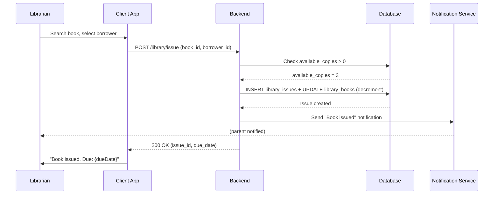
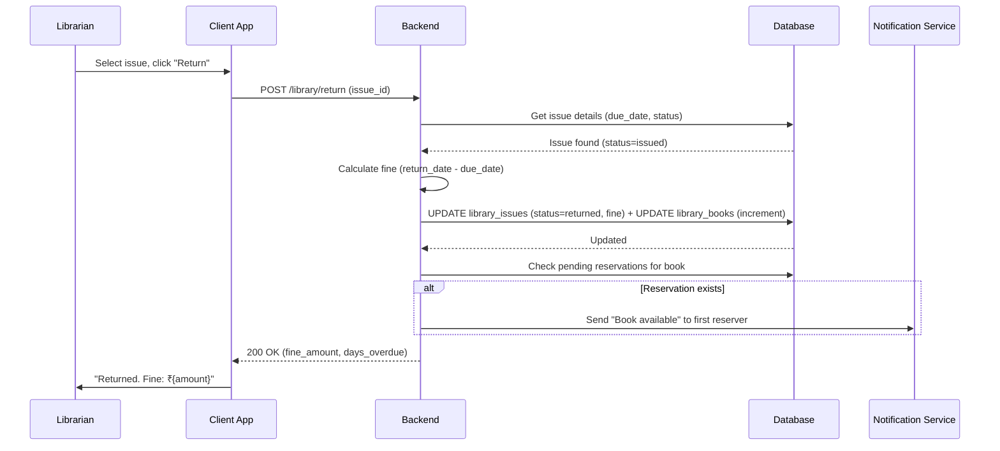
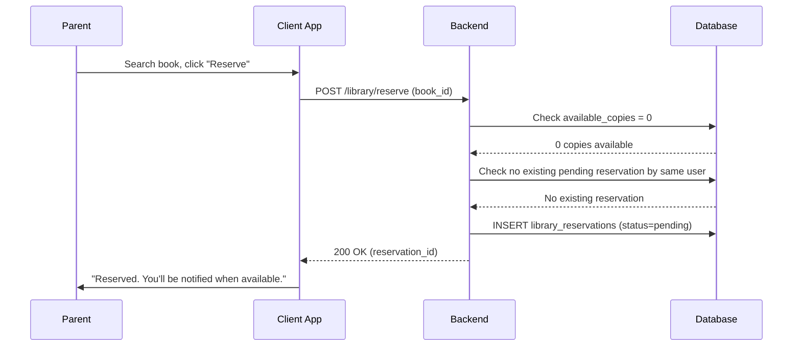
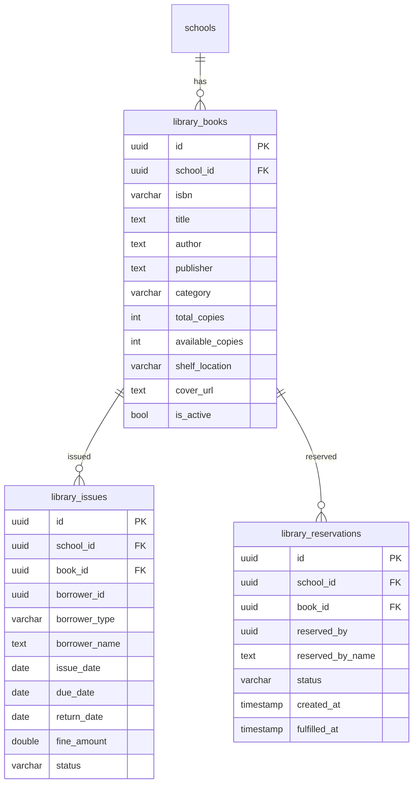

# Library Management — Technical Specification

> **Document status:** Implementation-ready blueprint
> **Last updated:** 2026-06-27
> **Prerequisites:** None
> **Template:** `_SPEC_TEMPLATE.md` v1 (25 mandatory + 6 optional sections)

---

## 1. Feature Overview

School library management: book catalog, issue/return tracking, reservations, fines, and student reading history.

### Goals

- Admin/librarian manages book catalog (title, author, ISBN, copies, category)
- Issue/return books to students/teachers with due dates
- Reservations for unavailable books
- Fine calculation for overdue returns
- Student reading history
- Search by title, author, ISBN, category

### Non-goals

- [ ] E-book / digital library management
- [ ] Inter-library loan system
- [ ] Automated ISBN lookup / book metadata enrichment
- [ ] Barcode/RFID scanning for physical books

### Dependencies

- `StudentsTable` — student lookup for borrowing
- `AppUsersTable` — teacher/admin lookup for borrowing
- `NotificationService` — reservation availability notifications

### Related Modules

- `server/.../feature/students/` — student management
- `server/.../feature/notifications/` — notification service
- `server/.../db/Tables.kt` — database tables

---

## 2. Current System Assessment

### Existing Code

- `feature_audit.csv` Gap #7: Library missing (0%)
- No library tables in `Tables.kt`
- `StudentsTable` exists for student lookup

### Existing Database

- `StudentsTable` — student records (for borrower lookup)
- `AppUsersTable` — user records (for teacher/admin borrower lookup)
- `SchoolsTable` — school records
- No library-related tables

### Existing APIs

- `GET /api/v1/school/students` — student management
- No library APIs exist

### Existing UI

- Admin: student management, dashboard
- Parent: dashboard
- No library UI

### Existing Services

- `NotificationService` — push/in-app notifications
- No library services

### Existing Documentation

- `feature_audit.csv` — feature audit tracking (library at 0%)
- `DIFFERENTIATING_FEATURES.md` — library feature description

### Technical Debt

| # | Gap | Details |
|---|---|---|
| TD-1 | No library management | 0% implementation |
| TD-2 | No library tables | No DB schema for books, issues, reservations |
| TD-3 | No book catalog | No way to manage or search books |

### Gaps

| # | Gap | Impact | Severity |
|---|---|---|---|
| G1 | No book catalog | Cannot manage library inventory | **High** |
| G2 | No issue/return tracking | Cannot track borrowed books | **High** |
| G3 | No fine calculation | Overdue fines managed manually | **Medium** |
| G4 | No reservations | Cannot reserve unavailable books | **Medium** |
| G5 | No reading history | Cannot track student reading | **Low** |

---

## 3. Functional Requirements

### FR-001
| Field | Value |
|---|---|
| **Title** | Book Catalog CRUD |
| **Description** | Book catalog CRUD with ISBN, title, author, publisher, category, copies, shelf location |
| **Priority** | Critical |
| **User Roles** | School Admin, Librarian |
| **Acceptance notes** | Full CRUD with all fields; ISBN optional; copies tracked |

### FR-002
| Field | Value |
|---|---|
| **Title** | Issue Book |
| **Description** | Issue book to student/teacher with due date (default 14 days) |
| **Priority** | Critical |
| **User Roles** | School Admin, Librarian |
| **Acceptance notes** | Due date auto-calculated; available_copies decremented |

### FR-003
| Field | Value |
|---|---|
| **Title** | Return Book with Fine |
| **Description** | Return book, calculate fine if overdue (₹1/day configurable) |
| **Priority** | Critical |
| **User Roles** | School Admin, Librarian |
| **Acceptance notes** | Fine calculated based on days overdue; configurable rate |

### FR-004
| Field | Value |
|---|---|
| **Title** | Reserve Unavailable Book |
| **Description** | Reserve unavailable book — notified when available |
| **Priority** | Medium |
| **User Roles** | Parent, Student, Teacher |
| **Acceptance notes** | Reservation created; notification sent when book returned |

### FR-005
| Field | Value |
|---|---|
| **Title** | Book Search |
| **Description** | Search by title, author, ISBN, category |
| **Priority** | High |
| **User Roles** | School Admin, Librarian, Parent, Student |
| **Acceptance notes** | Full-text search across title, author, ISBN; filter by category |

### FR-006
| Field | Value |
|---|---|
| **Title** | Student Reading History |
| **Description** | Student reading history |
| **Priority** | Medium |
| **User Roles** | School Admin, Librarian, Parent |
| **Acceptance notes** | List of all books issued to student with dates and status |

### FR-007
| Field | Value |
|---|---|
| **Title** | Library Dashboard |
| **Description** | Library dashboard: total books, issued, available, overdue |
| **Priority** | Medium |
| **User Roles** | School Admin, Librarian |
| **Acceptance notes** | Summary counts displayed on dashboard |

---

## 4. User Stories

### School Admin / Librarian
- [ ] Add a new book to the catalog with ISBN, title, author, and copies
- [ ] Issue a book to a student or teacher with a due date
- [ ] Process a book return and calculate fine if overdue
- [ ] View library dashboard with total, issued, available, and overdue counts
- [ ] Search for books by title, author, ISBN, or category
- [ ] View a student's reading history
- [ ] Manage reservations and notify when books become available

### Parent / Student
- [ ] Search for books in the library catalog
- [ ] View books currently issued to my child
- [ ] Reserve a book that is currently unavailable
- [ ] View my child's reading history
- [ ] Get notified when a reserved book becomes available

### System
- [ ] Auto-calculate due date (issue date + 14 days)
- [ ] Auto-calculate fine for overdue returns (₹1/day configurable)
- [ ] Decrement available_copies on issue; increment on return
- [ ] Notify reservers when book becomes available
- [ ] Track all issue/return history

---

## 5. Business Rules

### BR-001
**Rule:** Default due date is 14 days from issue date.
**Enforcement:** `due_date = issue_date + 14 days` (configurable per school).

### BR-002
**Rule:** Fine is ₹1 per day overdue (configurable).
**Enforcement:** `fine_amount = max(0, (return_date - due_date) * fine_per_day)`.

### BR-003
**Rule:** Cannot issue book if no available copies.
**Enforcement:** Check `available_copies > 0` before issue; decrement on issue.

### BR-004
**Rule:** Available copies incremented on return.
**Enforcement:** On return: `available_copies += 1` (up to `total_copies`).

### BR-005
**Rule:** Reservation fulfilled when book becomes available.
**Enforcement:** On return, check pending reservations; notify first reserver; mark as fulfilled when they issue.

### BR-006
**Rule:** One reservation per person per book.
**Enforcement:** Check existing pending reservation before creating new one.

---

## 6. Database Design

### 6.1 Entity Relationship Summary

Three new tables: `library_books`, `library_issues`, `library_reservations`. Books have issues (one-to-many) and reservations (one-to-many). Issues reference borrowers (students or teachers via `borrower_id`).

### 6.2 New Tables

```sql
CREATE TABLE library_books (
    id              UUID PRIMARY KEY DEFAULT gen_random_uuid(),
    school_id       UUID NOT NULL,
    isbn            VARCHAR(20),
    title           TEXT NOT NULL,
    author          TEXT,
    publisher       TEXT,
    category        VARCHAR(48),
    total_copies    INTEGER NOT NULL DEFAULT 1,
    available_copies INTEGER NOT NULL DEFAULT 1,
    shelf_location  VARCHAR(32),
    cover_url       TEXT,
    is_active       BOOLEAN NOT NULL DEFAULT true,
    created_at      TIMESTAMP NOT NULL DEFAULT now(),
    updated_at      TIMESTAMP NOT NULL DEFAULT now()
);

CREATE TABLE library_issues (
    id              UUID PRIMARY KEY DEFAULT gen_random_uuid(),
    school_id       UUID NOT NULL,
    book_id         UUID NOT NULL REFERENCES library_books(id),
    borrower_id     UUID NOT NULL,                 -- FK app_users.id or students.id
    borrower_type   VARCHAR(16) NOT NULL,          -- student | teacher
    borrower_name   TEXT NOT NULL,
    issue_date      DATE NOT NULL,
    due_date        DATE NOT NULL,
    return_date     DATE,
    fine_amount     DOUBLE PRECISION NOT NULL DEFAULT 0,
    status          VARCHAR(16) NOT NULL DEFAULT 'issued', -- issued | returned | lost
    created_at      TIMESTAMP NOT NULL DEFAULT now()
);

CREATE TABLE library_reservations (
    id              UUID PRIMARY KEY DEFAULT gen_random_uuid(),
    school_id       UUID NOT NULL,
    book_id         UUID NOT NULL REFERENCES library_books(id),
    reserved_by     UUID NOT NULL,
    reserved_by_name TEXT NOT NULL,
    status          VARCHAR(16) NOT NULL DEFAULT 'pending', -- pending | fulfilled | cancelled
    created_at      TIMESTAMP NOT NULL DEFAULT now(),
    fulfilled_at    TIMESTAMP
);
```

### 6.3 Modified Tables

N/A — no existing tables modified.

### 6.4 Indexes

```sql
CREATE INDEX idx_library_issues_borrower ON library_issues(borrower_id, status);
CREATE INDEX idx_library_books_search ON library_books USING gin(to_tsvector('english', title || ' ' || author));
CREATE INDEX idx_library_reservations_book ON library_reservations(book_id, status);
```

### 6.5 Constraints

- `library_books.title` — NOT NULL
- `library_books.total_copies` — NOT NULL, >= 0
- `library_books.available_copies` — NOT NULL, >= 0, <= total_copies
- `library_issues.book_id` — NOT NULL, FK
- `library_issues.borrower_id` — NOT NULL
- `library_issues.due_date` — NOT NULL, >= issue_date
- `library_reservations.book_id` — NOT NULL, FK

### 6.6 Foreign Keys

- `library_issues.book_id` → `library_books.id`
- `library_reservations.book_id` → `library_books.id`
- `library_issues.borrower_id` → `app_users.id` or `students.id` (polymorphic via `borrower_type`)

### 6.7 Soft Delete Strategy

- `library_books.is_active` — soft delete via boolean flag
- Issues and reservations are immutable records (no soft delete)

### 6.8 Audit Fields

- `created_at` — creation timestamp (all tables)
- `updated_at` — last update timestamp (books only)
- `return_date` — actual return date (issues)
- `fulfilled_at` — reservation fulfillment timestamp

### 6.9 Migration Notes

Migration: `docs/db/migration_046_library.sql`
- Creates 3 library tables with indexes
- No data backfill needed (new feature)

### 6.10 Exposed Mappings

```kotlin
object LibraryBooksTable : UUIDTable("library_books", "id") {
    val schoolId        = uuid("school_id")
    val isbn            = varchar("isbn", 20).nullable()
    val title           = text("title")
    val author          = text("author").nullable()
    val publisher       = text("publisher").nullable()
    val category        = varchar("category", 48).nullable()
    val totalCopies     = integer("total_copies").default(1)
    val availableCopies = integer("available_copies").default(1)
    val shelfLocation   = varchar("shelf_location", 32).nullable()
    val coverUrl        = text("cover_url").nullable()
    val isActive        = bool("is_active").default(true)
    val createdAt       = timestamp("created_at")
    val updatedAt       = timestamp("updated_at")
}

object LibraryIssuesTable : UUIDTable("library_issues", "id") {
    val schoolId     = uuid("school_id")
    val bookId       = uuid("book_id")
    val borrowerId   = uuid("borrower_id")
    val borrowerType = varchar("borrower_type", 16) // student | teacher
    val borrowerName = text("borrower_name")
    val issueDate    = date("issue_date")
    val dueDate      = date("due_date")
    val returnDate   = date("return_date").nullable()
    val fineAmount   = double("fine_amount").default(0.0)
    val status       = varchar("status", 16).default("issued") // issued | returned | lost
    val createdAt    = timestamp("created_at")
    init {
        index("idx_library_issues_borrower", false, borrowerId, status)
    }
}

object LibraryReservationsTable : UUIDTable("library_reservations", "id") {
    val schoolId       = uuid("school_id")
    val bookId         = uuid("book_id")
    val reservedBy     = uuid("reserved_by")
    val reservedByName = text("reserved_by_name")
    val status         = varchar("status", 16).default("pending") // pending | fulfilled | cancelled
    val createdAt      = timestamp("created_at")
    val fulfilledAt    = timestamp("fulfilled_at").nullable()
    init {
        index("idx_library_reservations_book", false, bookId, status)
    }
}
```

### 6.11 Seed Data

N/A — books added by admin/librarian.

---

## 7. State Machines

### Book Issue State Machine

```
AVAILABLE ──issue──> ISSUED ──return──> AVAILABLE
ISSUED ──mark_lost──> LOST
ISSUED ──overdue──> OVERDUE (logical state, not stored)
```

| Current State | Event | Next State | Guard / Condition |
|---|---|---|---|
| `available` | Librarian issues book | `issued` | `available_copies > 0` |
| `issued` | Librarian processes return | `available` | Book returned; fine calculated |
| `issued` | Librarian marks lost | `lost` | Book cannot be found |
| `issued` | Due date passed | `overdue` | Logical state; fine accrues |

### Reservation State Machine

```
PENDING ──book_available──> NOTIFIED ──librarian_issues──> FULFILLED
PENDING ──user_cancels──> CANCELLED
NOTIFIED ──timeout──> CANCELLED (next reserver notified)
```

| Current State | Event | Next State | Guard / Condition |
|---|---|---|---|
| `pending` | Book returned (available) | `notified` | First pending reservation notified |
| `notified` | Librarian issues to reserver | `fulfilled` | `fulfilled_at` set |
| `pending` | User cancels | `cancelled` | — |
| `notified` | 7 days pass without pickup | `cancelled` | Next reserver notified |

---

## 8. Backend Architecture

### 8.1 Component Overview

Three services handle library management: `LibraryBookService`, `LibraryIssueService`, `LibraryReservationService`. `LibraryRouting` exposes API endpoints.

### 8.2 Design Principles

1. **Simple catalog management** — CRUD with ISBN, title, author, copies
2. **Automatic due date** — Issue date + configurable days (default 14)
3. **Automatic fine calculation** — ₹1/day overdue (configurable)
4. **Reservation queue** — First-come-first-served; notified on availability
5. **Copy tracking** — `available_copies` decremented/incremented automatically

### 8.3 Core Types

```kotlin
class LibraryBookService {
    suspend fun create(book: LibraryBookDto): UUID
    suspend fun search(query: String, category: String?): List<LibraryBookDto>
    suspend fun update(id: UUID, book: LibraryBookDto): Unit
    suspend fun deactivate(id: UUID): Unit
}

class LibraryIssueService {
    suspend fun issue(bookId: UUID, borrowerId: UUID, borrowerType: String, borrowerName: String): UUID
    suspend fun returnBook(issueId: UUID): ReturnResultDto  // includes fine
    suspend fun getHistory(borrowerId: UUID): List<LibraryIssueDto>
    suspend fun getDashboard(schoolId: UUID): LibraryDashboardDto
}

class LibraryReservationService {
    suspend fun reserve(bookId: UUID, reservedBy: UUID, reservedByName: String): UUID
    suspend fun cancel(reservationId: UUID): Unit
    suspend fun notifyAvailable(bookId: UUID): Unit  // called on return
}
```

### 8.4 Repositories

- `LibraryBookRepository` — CRUD for books
- `LibraryIssueRepository` — CRUD for issues
- `LibraryReservationRepository` — CRUD for reservations

### 8.5 Mappers

- `LibraryBookMapper` — maps DB rows to DTOs
- `LibraryIssueMapper` — maps issue rows to DTOs
- `LibraryReservationMapper` — maps reservation rows to DTOs

### 8.6 Permission Checks

- Book CRUD: school admin or librarian
- Issue/return: school admin or librarian
- Search: all roles (admin, librarian, teacher, parent, student)
- Reserve: parent, student, teacher
- Reading history: admin, librarian, parent (own child)
- Dashboard: school admin, librarian

### 8.7 Background Jobs

### Overdue Notification Job

| Job | Schedule | Description |
|---|---|---|
| `OverdueNotificationJob` | Daily (morning) | Check overdue books; notify borrowers |

**Implementation:**
1. Query `library_issues` where `status = 'issued'` and `due_date < today`
2. For each overdue issue, send notification to borrower (or parent if student)
3. Include days overdue and potential fine amount

### Reservation Expiry Job

| Job | Schedule | Description |
|---|---|---|
| `ReservationExpiryJob` | Daily | Cancel notified reservations older than 7 days; notify next reserver |

### 8.8 Domain Events

- `BookIssued` — emitted when book issued
- `BookReturned` — emitted when book returned (with fine amount)
- `BookReserved` — emitted when reservation created
- `ReservationAvailable` — emitted when reserved book becomes available
- `ReservationFulfilled` — emitted when reserved book issued to reserver
- `BookMarkedLost` — emitted when book marked as lost

### 8.9 Caching

- Book catalog search results cached for 5 minutes
- Dashboard counts cached for 1 minute

### 8.10 Transactions

- Issue: INSERT issue + UPDATE book (decrement available) in single transaction
- Return: UPDATE issue + UPDATE book (increment available) in single transaction
- Reserve: INSERT reservation only

### 8.11 Rate Limiting

- Standard API rate limiting
- No special rate limiting needed

### 8.12 Configuration

- `LIBRARY_DEFAULT_LOAN_DAYS` — default 14
- `LIBRARY_FINE_PER_DAY` — default 1.0 (₹)
- `LIBRARY_RESERVATION_TIMEOUT_DAYS` — default 7

---

## 9. API Contracts

### 9.1 Admin/Librarian APIs

```
GET/POST /api/v1/school/library/books
PATCH/DELETE /api/v1/school/library/books/{id}
POST /api/v1/school/library/issue  { book_id, borrower_id, borrower_type }
POST /api/v1/school/library/return  { issue_id }
GET /api/v1/school/library/dashboard
GET /api/v1/school/library/issues?status=issued&overdue=true
```

### 9.2 Parent/Student APIs

```
GET /api/v1/parent/library/search?q={query}
GET /api/v1/parent/library/issued-books/{childId}
POST /api/v1/parent/library/reserve  { book_id }
```

### 9.3 Example Responses

**Book Search Response 200:**
```json
{
  "success": true,
  "data": [
    {
      "id": "uuid",
      "isbn": "978-0-123456-78-9",
      "title": "The Wonder of Science",
      "author": "Dr. A. Sharma",
      "category": "Science",
      "available_copies": 3,
      "total_copies": 5
    }
  ]
}
```

**Issue Response 200:**
```json
{
  "success": true,
  "data": {
    "issue_id": "uuid",
    "book_title": "The Wonder of Science",
    "borrower_name": "Aarav Sharma",
    "issue_date": "2026-06-27",
    "due_date": "2026-07-11"
  }
}
```

**Return Response 200:**
```json
{
  "success": true,
  "data": {
    "issue_id": "uuid",
    "book_title": "The Wonder of Science",
    "return_date": "2026-07-15",
    "days_overdue": 4,
    "fine_amount": 4.0
  }
}
```

**Dashboard Response 200:**
```json
{
  "success": true,
  "data": {
    "total_books": 500,
    "total_copies": 1200,
    "available_copies": 850,
    "issued_copies": 350,
    "overdue_books": 25,
    "active_reservations": 12
  }
}
```

---

## 10. Frontend Architecture

### 10.1 Screens

| Screen | Platform | Role | Description |
|---|---|---|---|
| `LibraryScreen` | All | Admin, Librarian | Book catalog management, issue/return, dashboard |
| `LibrarySearchScreen` | All | Parent, Student | Search books, view issued books, reserve |
| `LibraryHistoryScreen` | All | Parent, Admin | Student reading history |

### 10.2 Navigation

- Admin portal → Library → `LibraryScreen`
- Parent portal → Library → `LibrarySearchScreen`
- Admin portal → Library → Student → `LibraryHistoryScreen`

### 10.3 UX Flows

#### Librarian: Issue Book

1. Librarian searches for book by title/ISBN
2. Selects book from search results
3. Selects borrower (student or teacher)
4. System shows due date (issue date + 14 days)
5. Clicks "Issue"
6. Confirmation: "Book issued to {borrowerName}. Due: {dueDate}"

#### Librarian: Return Book

1. Librarian searches for active issues (by borrower or book)
2. Selects issue to return
3. System calculates fine if overdue
4. Shows: "Return date: {today}. Fine: ₹{amount} ({days} days overdue)"
5. Clicks "Confirm Return"
6. Confirmation: "Book returned. Fine: ₹{amount}"

#### Parent: Search and Reserve

1. Parent opens Library → Search
2. Enters search query (title, author, ISBN)
3. Results displayed with availability
4. If available: "Available" badge shown
5. If unavailable: "Reserve" button shown
6. Parent clicks "Reserve"
7. Confirmation: "Reserved. You'll be notified when available."

### 10.4 State Management

```kotlin
data class LibraryState(
    val books: List<LibraryBookDto>,
    val searchQuery: String,
    val selectedCategory: String?,
    val isLoading: Boolean,
    val error: String?,
    val dashboard: LibraryDashboardDto?,
)
```

### 10.5 Offline Support

- Book catalog cached for offline browsing
- Issue/return requires network connection
- Reservations queued and synced when online

### 10.6 Loading States

- Searching: "Searching books..."
- Issuing: "Issuing book..."
- Returning: "Processing return..."
- Dashboard: "Loading library stats..."

### 10.7 Error Handling (UI)

- No results: "No books found. Try a different search."
- No copies available: "All copies are currently issued. Reserve to be notified."
- Issue failed: "Could not issue book. Please try again."
- Return failed: "Could not process return. Please try again."

### 10.8 Component Integration Guidelines

| Rule | Description |
|---|---|
| **R1** | Search bar with category filter dropdown |
| **R2** | Book list with cover image, title, author, availability badge |
| **R3** | Issue form with borrower search and due date display |
| **R4** | Return confirmation with fine calculation shown |
| **R5** | Dashboard cards for total, issued, available, overdue counts |
| **R6** | Reading history as chronological list with status badges |

---

## 11. Shared Module Changes (KMP)

### 11.1 DTOs

```kotlin
data class LibraryBookDto(
    val id: UUID,
    val isbn: String?,
    val title: String,
    val author: String?,
    val publisher: String?,
    val category: String?,
    val totalCopies: Int,
    val availableCopies: Int,
    val shelfLocation: String?,
    val coverUrl: String?,
    val isActive: Boolean,
)

data class LibraryIssueDto(
    val id: UUID,
    val bookId: UUID,
    val bookTitle: String,
    val borrowerId: UUID,
    val borrowerType: String,
    val borrowerName: String,
    val issueDate: LocalDate,
    val dueDate: LocalDate,
    val returnDate: LocalDate?,
    val fineAmount: Double,
    val status: String,
)

data class LibraryReservationDto(
    val id: UUID,
    val bookId: UUID,
    val bookTitle: String,
    val reservedBy: UUID,
    val reservedByName: String,
    val status: String,
    val createdAt: Instant,
    val fulfilledAt: Instant?,
)

data class LibraryDashboardDto(
    val totalBooks: Int,
    val totalCopies: Int,
    val availableCopies: Int,
    val issuedCopies: Int,
    val overdueBooks: Int,
    val activeReservations: Int,
)

data class ReturnResultDto(
    val issueId: UUID,
    val bookTitle: String,
    val returnDate: LocalDate,
    val daysOverdue: Int,
    val fineAmount: Double,
)
```

### 11.2 Domain Models

```kotlin
data class LibraryBook(
    val id: UUID,
    val schoolId: UUID,
    val isbn: String?,
    val title: String,
    val author: String?,
    val publisher: String?,
    val category: String?,
    val totalCopies: Int,
    val availableCopies: Int,
    val shelfLocation: String?,
    val coverUrl: String?,
    val isActive: Boolean,
)

data class LibraryIssue(
    val id: UUID,
    val schoolId: UUID,
    val bookId: UUID,
    val borrowerId: UUID,
    val borrowerType: String,
    val borrowerName: String,
    val issueDate: LocalDate,
    val dueDate: LocalDate,
    val returnDate: LocalDate?,
    val fineAmount: Double,
    val status: String,
)
```

### 11.3 Repository Interfaces

```kotlin
interface LibraryBookRepository {
    suspend fun create(book: LibraryBookEntity): UUID
    suspend fun search(schoolId: UUID, query: String, category: String?): List<LibraryBookDto>
    suspend fun getById(id: UUID): LibraryBookDto?
    suspend fun update(id: UUID, book: LibraryBookEntity): Unit
    suspend fun decrementAvailable(id: UUID): Unit
    suspend fun incrementAvailable(id: UUID): Unit
}

interface LibraryIssueRepository {
    suspend fun insert(issue: LibraryIssueEntity): UUID
    suspend fun returnBook(issueId: UUID, returnDate: LocalDate, fineAmount: Double): Unit
    suspend fun getByBorrower(borrowerId: UUID): List<LibraryIssueDto>
    suspend fun getOverdue(schoolId: UUID): List<LibraryIssueDto>
}
```

### 11.4 UseCases

- `CreateBookUseCase`
- `SearchBooksUseCase`
- `IssueBookUseCase`
- `ReturnBookUseCase`
- `ReserveBookUseCase`
- `GetReadingHistoryUseCase`
- `GetDashboardUseCase`

### 11.5 Validation

- Book title: not empty
- Total copies: > 0
- Available copies: >= 0 and <= total_copies
- Borrower ID: valid UUID
- Issue: available_copies > 0

### 11.6 Serialization

Standard Kotlinx serialization for DTOs.

### 11.7 Network APIs

Added to `LibraryApi.kt`:
- `GET/POST /api/v1/school/library/books` — book CRUD
- `PATCH/DELETE /api/v1/school/library/books/{id}` — update/delete
- `POST /api/v1/school/library/issue` — issue book
- `POST /api/v1/school/library/return` — return book
- `GET /api/v1/school/library/dashboard` — dashboard
- `GET /api/v1/school/library/issues` — issue list
- `GET /api/v1/parent/library/search` — search
- `GET /api/v1/parent/library/issued-books/{childId}` — issued books
- `POST /api/v1/parent/library/reserve` — reserve

### 11.8 Database Models (Local Cache)

- Book catalog cached locally for offline browsing
- No issue/return caching (server-side only)

---

## 12. Permissions Matrix

| Action | Super Admin | School Admin | Librarian | Teacher | Parent | Student |
|---|---|---|---|---|---|---|
| Book CRUD | ✅ | ✅ | ✅ | ❌ | ❌ | ❌ |
| Issue book | ✅ | ✅ | ✅ | ❌ | ❌ | ❌ |
| Return book | ✅ | ✅ | ✅ | ❌ | ❌ | ❌ |
| Search books | ✅ | ✅ | ✅ | ✅ | ✅ | ✅ |
| Reserve book | ✅ | ✅ | ✅ | ✅ | ✅ | ✅ |
| View dashboard | ✅ | ✅ | ✅ | ❌ | ❌ | ❌ |
| View reading history | ✅ | ✅ | ✅ | ❌ | ✅ (own child) | ✅ (own) |
| View issued books | ✅ | ✅ | ✅ | ✅ (own) | ✅ (own child) | ✅ (own) |
| Mark book lost | ✅ | ✅ | ✅ | ❌ | ❌ | ❌ |

---

## 13. Notifications

### Library Notifications

| Type | Trigger | Channel | Message |
|---|---|---|---|
| Book Issued | Librarian issues book | In-app (borrower/parent) | "{bookTitle} issued. Due date: {dueDate}" |
| Book Due Reminder | 2 days before due date | Push + In-app (borrower/parent) | "{bookTitle} due in 2 days. Please return on time." |
| Book Overdue | Book past due date | Push + In-app (borrower/parent) | "{bookTitle} is overdue. Fine: ₹{amount}/day." |
| Book Returned | Librarian processes return | In-app (borrower/parent) | "{bookTitle} returned. Fine: ₹{amount}" |
| Reservation Available | Book returned with pending reservation | Push + In-app (reserver) | "{bookTitle} is now available. Pick up within 7 days." |
| Reservation Cancelled | Reservation expired or cancelled | In-app (reserver) | "Your reservation for {bookTitle} has been cancelled." |

---

## 14. Background Jobs

| Job | Schedule | Description |
|---|---|---|
| `OverdueNotificationJob` | Daily (morning) | Check overdue books; notify borrowers/parents |
| `ReservationExpiryJob` | Daily | Cancel notified reservations older than 7 days; notify next reserver |
| `DueDateReminderJob` | Daily | Send reminder 2 days before due date |

**Overdue Notification:**
1. Query `library_issues` where `status = 'issued'` and `due_date < today`
2. For each overdue issue:
   - Calculate days overdue and fine amount
   - Send notification to borrower (or parent if student)
3. Log notification count

**Reservation Expiry:**
1. Query `library_reservations` where `status = 'notified'` and `fulfilled_at + 7 days < today`
2. For each expired reservation:
   - Set status to `cancelled`
   - Notify reserver
   - Check for next pending reservation for same book
   - If found, notify next reserver and set status to `notified`

**Due Date Reminder:**
1. Query `library_issues` where `status = 'issued'` and `due_date = today + 2 days`
2. For each issue: send reminder notification to borrower/parent

---

## 15. Integrations

### Notification Service
| Field | Value |
|---|---|
| **System** | Existing notification infrastructure |
| **Purpose** | Due reminders, overdue alerts, reservation availability |
| **API / SDK** | Internal `NotificationService` |
| **Auth method** | Internal service call |
| **Fallback** | In-app notification if push fails |

### StudentsTable
| Field | Value |
|---|---|
| **System** | Existing student management |
| **Purpose** | Borrower lookup for students |
| **API / SDK** | Direct DB query |
| **Auth method** | Internal |
| **Fallback** | None — student data required for issue |

### AppUsersTable
| Field | Value |
|---|---|
| **System** | Existing user management |
| **Purpose** | Borrower lookup for teachers |
| **API / SDK** | Direct DB query |
| **Auth method** | Internal |
| **Fallback** | None — user data required for teacher issue |

---

## 16. Security

### Authentication
- Admin/Librarian APIs: JWT with school admin or librarian role
- Parent/Student APIs: JWT with parent or student role
- Search API: any authenticated user

### Authorization
- Book CRUD: school admin or librarian only
- Issue/return: school admin or librarian only
- Search: all authenticated users
- Reserve: all authenticated users (except admin/librarian)
- Reading history: admin, librarian, parent (own child), student (own)
- Dashboard: school admin, librarian only

### Encryption
- All API communication over TLS
- No sensitive data in library records (book metadata is non-sensitive)

### Audit Logs
- Book creation logged (action: `CREATE`, entity: `library_book`)
- Book update logged (action: `UPDATE`, entity: `library_book`)
- Book issue logged (action: `CREATE`, entity: `library_issue`)
- Book return logged (action: `UPDATE`, entity: `library_issue`)
- Reservation created logged (action: `CREATE`, entity: `library_reservation`)

### PII Handling
- Borrower name stored in issue records (for historical reference)
- Borrower ID references student/user table
- Reading history is student activity (parent can view own child only)

### Data Isolation
- All queries filtered by `school_id` from JWT
- Parent queries filtered by `child_id` (verified parent-child relationship)

### Rate Limiting
- Standard API rate limiting
- Search: standard rate limiting (no special limits)

### Input Validation
- Book title: not empty
- ISBN: valid format if provided
- Total copies: positive integer
- Borrower ID: valid UUID
- Issue: available_copies > 0

---

## 17. Performance & Scalability

### Expected Scale

| Metric | Small school | Medium school | Large school |
|---|---|---|---|
| Total books | ~500 | ~2,000 | ~10,000 |
| Total copies | ~1,000 | ~5,000 | ~25,000 |
| Active issues | ~100 | ~500 | ~2,500 |
| Daily transactions | ~20 | ~100 | ~500 |
| Search queries/day | ~50 | ~200 | ~1,000 |

### Latency Targets

| Operation | Target |
|---|---|
| Book search | < 200ms |
| Issue book | < 100ms |
| Return book | < 100ms |
| Dashboard | < 200ms |
| Reading history | < 100ms |

### Optimization Strategy

- Full-text search index on title + author (GIN index)
- Dashboard counts cached for 1 minute
- Search results cached for 5 minutes
- Issues indexed by borrower_id + status

---

## 18. Edge Cases

| # | Scenario | Expected Behavior |
|---|---|---|
| EC-001 | Issue when no copies available | Return 400: "No copies available" |
| EC-002 | Return already returned book | Return 400: "Book already returned" |
| EC-003 | Return before due date | Fine = 0; status = returned |
| EC-004 | Return after due date | Fine calculated; status = returned |
| EC-005 | Reserve already available book | Return 400: "Book is available. Issue directly." |
| EC-006 | Double reservation by same person | Return 400: "Already reserved" |
| EC-007 | Book marked lost | available_copies not incremented; status = lost |
| EC-008 | All copies lost | Book still in catalog; available_copies = 0 |
| EC-009 | ISBN not found in search | Return empty results |

### Risks & Mitigations

| Risk | Likelihood | Impact | Mitigation |
|---|---|---|---|
| Concurrent issue race condition | Low | Medium | Transaction with row-level lock on book |
| Fine calculation error | Low | Low | Unit tests for fine calculation |
| Reservation notification missed | Low | Medium | Job checks on each return |
| Search performance with large catalog | Medium | Medium | GIN full-text index |

---

## 19. Error Handling

### Standard Error Codes

| HTTP | Error Code | Description | When |
|---|---|---|---|
| 400 | `NO_COPIES_AVAILABLE` | Book has no available copies | Issue |
| 400 | `ALREADY_RETURNED` | Book already returned | Return |
| 400 | `BOOK_AVAILABLE` | Book is available, no need to reserve | Reserve |
| 400 | `ALREADY_RESERVED` | User already has pending reservation | Reserve |
| 400 | `INVALID_ISBN` | ISBN format invalid | Book CRUD |
| 403 | `INSUFFICIENT_PERMISSIONS` | Non-admin/librarian attempting management | Any admin endpoint |
| 404 | `BOOK_NOT_FOUND` | Book does not exist | Any book endpoint |
| 404 | `ISSUE_NOT_FOUND` | Issue does not exist | Return |

### Error Response Format

Same as existing API error format.

### Recovery Strategy

| Error | Client Action | Server Action |
|---|---|---|
| `NO_COPIES_AVAILABLE` | Show "Reserve" option | Return 400 |
| `ALREADY_RETURNED` | Show "Book already returned" | Return 400 |
| `BOOK_AVAILABLE` | Show "Issue directly" | Return 400 |

---

## 20. Analytics & Reporting

### Reports

- **Library Usage Report:** Books issued per month, popular categories
- **Overdue Report:** Overdue books with borrower details and fine amounts
- **Reading History Report:** Books read per student per term
- **Inventory Report:** Total books, copies, lost books, value
- **Fine Collection Report:** Total fines collected per month

### KPIs

- **Books Issued per Month:** Total issues per month
- **Overdue Rate:** % of issued books that go overdue
- **Fine Collection Rate:** % of fines collected vs outstanding
- **Catalog Size:** Total unique books and total copies
- **Reservation Fulfillment Rate:** % of reservations fulfilled
- **Average Loan Duration:** Mean days books are borrowed

### Dashboards

- Librarian dashboard: total, issued, available, overdue, reservations
- Admin dashboard: library summary + fine collection

### Exports

- Overdue report export (CSV/PDF)
- Reading history export per student
- Inventory report export

---

## 21. Testing Strategy

### Unit Tests

| Test | What it verifies |
|---|---|
| Book creation | Correct book stored with all fields |
| Book search | Search returns correct results by title/author/ISBN |
| Issue book | Issue created; available_copies decremented; due_date correct |
| Return book (on time) | Return processed; fine = 0; available_copies incremented |
| Return book (overdue) | Return processed; fine calculated correctly |
| Reserve book | Reservation created; status = pending |
| Reservation notification | On return, first reserver notified |
| Fine calculation | ₹1/day for each day overdue |
| Concurrent issue | Race condition handled (no negative copies) |

### Integration Tests

| Test | What it verifies |
|---|---|
| Create book → issue → return → available incremented | Full lifecycle |
| Issue → overdue → return with fine | Overdue flow |
| Issue → return → reservation notified → reserve fulfilled | Reservation flow |
| Search by title → filter by category | Search + filter |
| Dashboard counts correct after transactions | Dashboard |

### Performance Tests

- [ ] Book search < 200ms (with 10,000 books)
- [ ] Issue < 100ms
- [ ] Return < 100ms
- [ ] Dashboard < 200ms

### Security Tests

- [ ] Non-admin cannot create/edit books
- [ ] Parent can only view own child's history
- [ ] All queries school-scoped

### Migration Tests

- [ ] Migration creates 3 tables with correct schema
- [ ] Indexes created correctly

---

## 22. Acceptance Criteria

- [ ] Book catalog CRUD works
- [ ] Issue/return with due date and fine calculation
- [ ] Search by title, author, ISBN, category
- [ ] Reservation for unavailable books
- [ ] Student reading history
- [ ] Library dashboard with counts
- [ ] Overdue notifications sent
- [ ] Due date reminders sent
- [ ] Reservation availability notifications sent

---

## 23. Implementation Roadmap

| Phase | Duration | Tasks | Breaking? | Deliverable |
|---|---|---|---|---|
| 1 | 2 days | DB migration, Exposed tables, services | No | Schema + services |
| 2 | 2 days | API endpoints | No | API available |
| 3 | 3 days | Client UI (catalog, issue/return, search, dashboard) | No | UI ready |
| 4 | 1 day | Tests | No | Test coverage |

**Total: ~8 days**

---

## 24. File-Level Impact Analysis

### New Files

| File | Location | Purpose |
|---|---|---|
| `LibraryBookService.kt` | `server/.../feature/library/` | Book CRUD + search |
| `LibraryIssueService.kt` | `server/.../feature/library/` | Issue/return + fine |
| `LibraryReservationService.kt` | `server/.../feature/library/` | Reservations |
| `LibraryRouting.kt` | `server/.../feature/library/` | API endpoints |
| `OverdueNotificationJob.kt` | `server/.../feature/library/` | Overdue job |
| `ReservationExpiryJob.kt` | `server/.../feature/library/` | Reservation expiry job |
| `DueDateReminderJob.kt` | `server/.../feature/library/` | Due date reminder job |
| `migration_046_library.sql` | `docs/db/` | DDL migration |
| `LibraryApi.kt` | `shared/.../feature/library/` | Client API |
| `LibraryScreen.kt` | `composeApp/.../ui/v2/screens/admin/` | Library management |
| `LibrarySearchScreen.kt` | `composeApp/.../ui/v2/screens/parent/` | Book search + issued books |
| `LibraryHistoryScreen.kt` | `composeApp/.../ui/v2/screens/admin/` | Reading history |

### Modified Files

| File | Change Type | Lines Changed (est.) | Risk | Description |
|---|---|---|---|---|
| `server/.../db/Tables.kt` | Add | ~40 | Low | 3 library table objects |
| `server/.../db/DatabaseFactory.kt` | Modify | ~3 | Low | Register 3 tables |

### Files Preserved Unchanged

| File | Reason |
|---|---|
| `StudentsTable` | Read-only (borrower lookup) |
| `AppUsersTable` | Read-only (borrower lookup) |
| `NotificationService` | Used as-is |

---

## 25. Future Enhancements

### Barcode/RFID Scanning

- Scan book barcode for quick issue/return
- RFID tags for automated check-in/out
- Inventory scanning with handheld scanner

### E-book / Digital Library

- Digital book lending
- E-book reader integration
- Digital rights management

### Automated ISBN Lookup

- Fetch book metadata from Google Books / OpenLibrary API
- Auto-fill title, author, publisher, cover image from ISBN
- Reduce manual data entry

### Book Reviews and Ratings

- Students/parents rate and review books
- Reading recommendations based on history
- Popular books leaderboard

### Reading Challenges

- Set reading goals per student/class
- Track books read per term
- Gamification with badges and rewards

### Inter-Library Loan

- Borrow books from other schools in same trust
- Shared catalog across schools
- Transfer tracking

### Fine Payment Integration

- Pay library fines online via fee portal
- Link fines to `FeeRecordsTable`
- Automatic fine waiver for financial aid students

### Book Condition Tracking

- Track book condition (new, good, fair, poor)
- Flag books for repair/replacement
- Depreciation tracking

### Author/Publisher Analytics

- Most popular authors in school
- Publisher distribution analysis
- Category preference trends

### Smart Recommendations

- AI-powered book recommendations based on reading history
- "Students who read this also read..."
- Age-appropriate suggestions

---

## A. Sequence Diagrams

### Issue Book Flow



### Return Book Flow



### Reservation Flow



---

## B. Domain Model / ER Diagram



---

## C. Event Flow

```
BookCreated -> Complete
BookIssued -> DecrementAvailable -> NotifyBorrower -> Complete
BookReturned -> CalculateFine -> IncrementAvailable -> CheckReservations -> NotifyReserver -> Complete
BookReserved -> Complete
BookReturned -> NoReservations -> Complete
ReservationNotified -> WaitForPickup -> ReservationFulfilled -> Complete
ReservationNotified -> Timeout -> ReservationCancelled -> NotifyNextReserver -> Complete
```

| Event | Emitted By | Consumed By | Side Effect |
|---|---|---|---|
| `BookIssued` | `LibraryIssueService.issue()` | Notification | In-app to borrower/parent |
| `BookReturned` | `LibraryIssueService.returnBook()` | Notification, Reservation | In-app; check reservations |
| `BookReserved` | `LibraryReservationService.reserve()` | — | Reservation stored |
| `ReservationAvailable` | `LibraryReservationService.notifyAvailable()` | Notification | Push to reserver |
| `ReservationFulfilled` | `LibraryIssueService.issue()` (to reserver) | — | `fulfilled_at` set |
| `BookMarkedLost` | `LibraryBookService.markLost()` | — | `available_copies` not incremented |

---

## D. Configuration

### Environment Variables

| Variable | Description |
|---|---|
| `LIBRARY_ENABLED` | Enable/disable feature (default: `true`) |
| `LIBRARY_DEFAULT_LOAN_DAYS` | Default loan period (default: `14`) |
| `LIBRARY_FINE_PER_DAY` | Fine per overdue day in ₹ (default: `1.0`) |
| `LIBRARY_RESERVATION_TIMEOUT_DAYS` | Days to pick up reserved book (default: `7`) |
| `LIBRARY_DUE_REMINDER_DAYS` | Days before due to send reminder (default: `2`) |

### Feature Flags

| Flag | Default | Description |
|---|---|---|
| `library_enabled` | `true` | Master switch for library |
| `library_fines_enabled` | `true` | Enable fine calculation |
| `library_reservations_enabled` | `true` | Enable book reservations |

### Client-Side Configuration

| Config | Default | Description |
|---|---|---|
| Search debounce | 300ms | Delay before search triggers |
| Results per page | 20 | Pagination size |
| Cover image placeholder | Book icon | Shown when no cover URL |

### Server-Side Configuration

| Config | Default | Description |
|---|---|---|
| Loan period | 14 days | Default due date offset |
| Fine per day | ₹1.0 | Overdue fine rate |
| Reservation timeout | 7 days | Time to pick up reserved book |
| Due reminder | 2 days | Days before due to remind |
| Search cache TTL | 5 min | Search result cache duration |
| Dashboard cache TTL | 1 min | Dashboard count cache duration |

### Infrastructure Requirements

- PostgreSQL with GIN index support for full-text search
- Sufficient DB storage for book catalog and issue history

---

## E. Migration & Rollback

### Deployment Plan

1. [ ] Run `migration_046_library.sql` — creates 3 tables + indexes
2. [ ] Deploy 3 library table objects in `Tables.kt`
3. [ ] Register tables in `DatabaseFactory.kt`
4. [ ] Deploy library services (book, issue, reservation)
5. [ ] Deploy `LibraryRouting.kt` (API endpoints)
6. [ ] Deploy background jobs (overdue, reservation expiry, due reminder)
7. [ ] Deploy client UI (admin, parent)
8. [ ] Test with sample book data
9. [ ] Deploy to production

### Rollback Plan

1. [ ] Disable feature flag `library_enabled` → API returns 404
2. [ ] Remove client UI → library screens not shown
3. [ ] Database: `DROP TABLE IF EXISTS library_reservations; DROP TABLE IF EXISTS library_issues; DROP TABLE IF EXISTS library_books;`
4. [ ] No data loss — library is additive feature

### Data Backfill

N/A — new feature. No backfill needed.

### Migration SQL

```sql
-- migration_046_library.sql
CREATE TABLE IF NOT EXISTS library_books (
    id              UUID PRIMARY KEY DEFAULT gen_random_uuid(),
    school_id       UUID NOT NULL,
    isbn            VARCHAR(20),
    title           TEXT NOT NULL,
    author          TEXT,
    publisher       TEXT,
    category        VARCHAR(48),
    total_copies    INTEGER NOT NULL DEFAULT 1,
    available_copies INTEGER NOT NULL DEFAULT 1,
    shelf_location  VARCHAR(32),
    cover_url       TEXT,
    is_active       BOOLEAN NOT NULL DEFAULT true,
    created_at      TIMESTAMP NOT NULL DEFAULT now(),
    updated_at      TIMESTAMP NOT NULL DEFAULT now()
);

CREATE TABLE IF NOT EXISTS library_issues (
    id              UUID PRIMARY KEY DEFAULT gen_random_uuid(),
    school_id       UUID NOT NULL,
    book_id         UUID NOT NULL REFERENCES library_books(id),
    borrower_id     UUID NOT NULL,
    borrower_type   VARCHAR(16) NOT NULL,
    borrower_name   TEXT NOT NULL,
    issue_date      DATE NOT NULL,
    due_date        DATE NOT NULL,
    return_date     DATE,
    fine_amount     DOUBLE PRECISION NOT NULL DEFAULT 0,
    status          VARCHAR(16) NOT NULL DEFAULT 'issued',
    created_at      TIMESTAMP NOT NULL DEFAULT now()
);

CREATE INDEX IF NOT EXISTS idx_library_issues_borrower ON library_issues(borrower_id, status);

CREATE TABLE IF NOT EXISTS library_reservations (
    id              UUID PRIMARY KEY DEFAULT gen_random_uuid(),
    school_id       UUID NOT NULL,
    book_id         UUID NOT NULL REFERENCES library_books(id),
    reserved_by     UUID NOT NULL,
    reserved_by_name TEXT NOT NULL,
    status          VARCHAR(16) NOT NULL DEFAULT 'pending',
    created_at      TIMESTAMP NOT NULL DEFAULT now(),
    fulfilled_at    TIMESTAMP
);

CREATE INDEX IF NOT EXISTS idx_library_reservations_book ON library_reservations(book_id, status);

-- ROLLBACK:
-- DROP TABLE IF EXISTS library_reservations;
-- DROP TABLE IF EXISTS library_issues;
-- DROP TABLE IF EXISTS library_books;
```

---

## F. Observability

### Logging

- Book created: INFO `library_book_created` (bookId, title, totalCopies)
- Book updated: INFO `library_book_updated` (bookId, fields changed)
- Book issued: INFO `library_book_issued` (bookId, borrowerId, dueDate)
- Book returned: INFO `library_book_returned` (bookId, borrowerId, returnDate, fineAmount, daysOverdue)
- Book reserved: INFO `library_book_reserved` (bookId, reservedBy)
- Reservation available: INFO `library_reservation_available` (bookId, reserverId)
- Reservation fulfilled: INFO `library_reservation_fulfilled` (reservationId, bookId)
- Reservation expired: WARN `library_reservation_expired` (reservationId, bookId)
- Book marked lost: WARN `library_book_lost` (bookId)
- Overdue notification sent: INFO `library_overdue_notified` (issueId, daysOverdue, fineAmount)
- Due reminder sent: INFO `library_due_reminder` (issueId, dueDate)

### Metrics

| Metric | Type | Description |
|---|---|---|
| `library.books_total` | Gauge | Total books in catalog |
| `library.copies_total` | Gauge | Total copies |
| `library.copies_available` | Gauge | Available copies |
| `library.copies_issued` | Gauge | Issued copies |
| `library.issues_total` | Counter | Total issues (all time) |
| `library.returns_total` | Counter | Total returns |
| `library.overdue_total` | Gauge | Currently overdue books |
| `library.fines_collected_total` | Counter | Total fines collected (₹) |
| `library.reservations_active` | Gauge | Active reservations |
| `library.searches_total` | Counter | Total search queries |
| `library.search_latency_ms` | Histogram | Search query latency |

### Health Checks

- `GET /api/v1/health` — existing health check

### Alerts

- Overdue rate > 15% → Warning (students not returning books)
- Search latency p95 > 500ms → Warning (may need index optimization)
- Fine collection rate < 50% → Info (fines not being collected)
- Lost books > 5% of catalog → Warning (inventory shrinkage)
