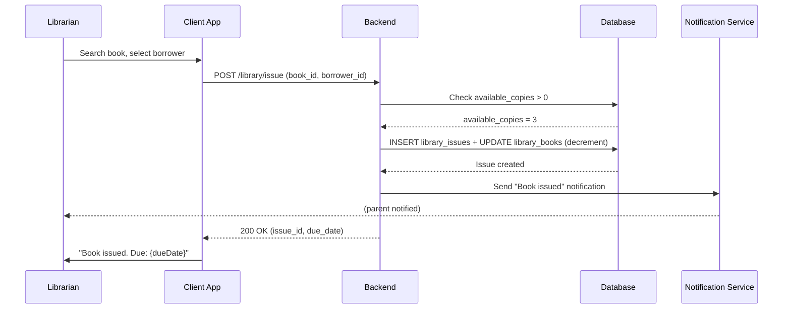
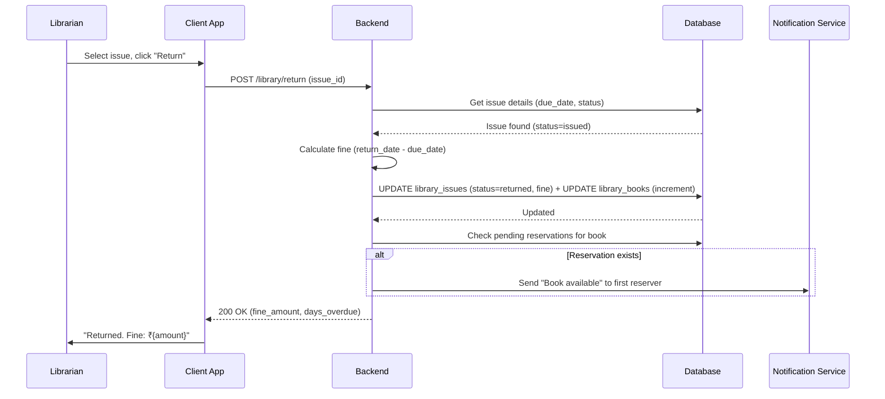
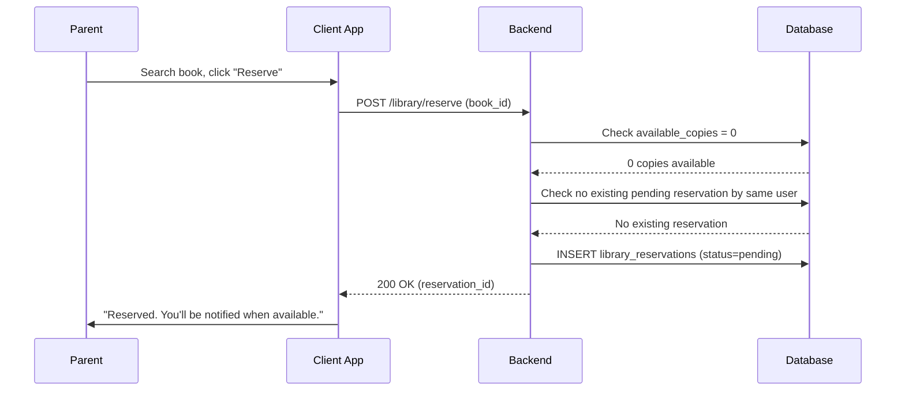
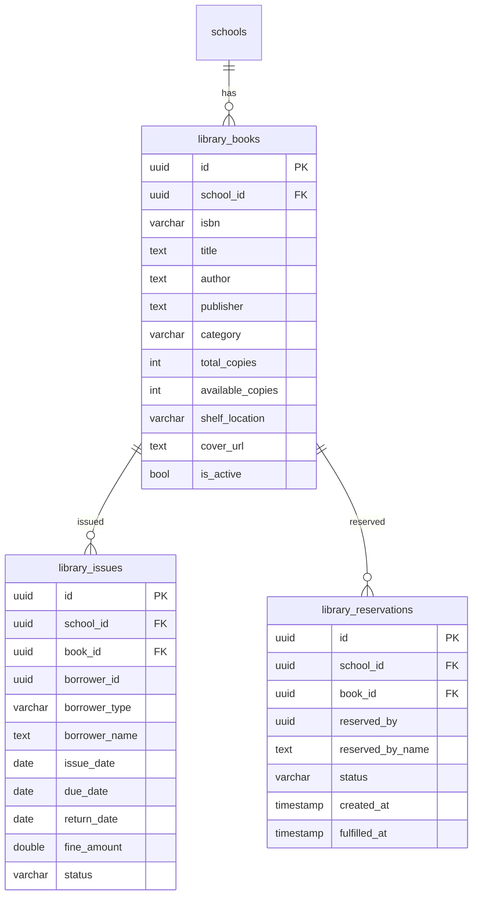

# Library Management — Technical Specification

> **Document status:** Implementation-ready blueprint
> **Last updated:** 2026-06-30
> **Prerequisites:** `FESTIVAL_CALENDAR_SPEC.md` (holiday-aware due dates)
> **Related specs:** `STUDENT_APP_SPEC.md`, `FEE_PAYMENT_SPEC.md`
> **Template:** `_SPEC_TEMPLATE.md` v1 (25 mandatory + 6 optional sections)

---

## 1. Feature Overview

School library management: book catalog, issue/return tracking, reservations, fines, and student reading history.

### Goals

- Admin/librarian manages book catalog (title, author, ISBN, copies, category, replacement cost)
- Individual copy tracking with barcode, condition, and status per copy
- Issue/return books to students/teachers with due dates
- Book renewal/extend (max 2 renewals)
- Borrowing limit enforcement (max books per student, configurable)
- Reservations for unavailable books (with optional teacher priority)
- Fine calculation for overdue returns with fine cap at replacement cost
- Fine lifecycle: pending → paid / waived
- Lost book handling with replacement cost recovery
- Bulk CSV import for initial catalog setup
- Student reading history
- Student self-service: view own issued books, due dates, and history
- Search by title, author, ISBN, category with pagination
- Book condition recording on return (damage tracking)
- Holiday-aware due date calculation (skip non-school days)

### Non-goals

- [ ] E-book / digital library management
- [ ] Inter-library loan system
- [ ] Automated ISBN lookup / book metadata enrichment (future enhancement)
- [ ] RFID scanning for physical books (future enhancement; barcode field is stored but scanning not implemented)
- [ ] Online fine payment via payment gateway (fines marked manually; gateway integration is future enhancement)
- [ ] Book reviews and ratings (future enhancement)
- [ ] Reading challenges / gamification (future enhancement)

### Dependencies

- `StudentsTable` — student lookup for borrowing
- `AppUsersTable` — teacher/admin lookup for borrowing (add `librarian` role)
- `NotificationService` — reservation availability, overdue, due reminder notifications
- `FESTIVAL_CALENDAR_SPEC.md` — school calendar for holiday-aware due date calculation
- `STUDENT_APP_SPEC.md` — student self-service library access via student app
- `FeeRecordsTable` — optional linkage for fine payment tracking (future)

### Related Modules

- `server/.../feature/students/` — student management
- `server/.../feature/notifications/` — notification service
- `server/.../feature/calendar/` — school calendar (holiday-aware due dates)
- `server/.../db/Tables.kt` — database tables
- `server/.../feature/auth/` — role management (librarian role)

---

## 2. Current System Assessment

### Existing Code

- `feature_audit.csv` Gap #7: Library missing (0%)
- No library tables in `Tables.kt`
- `StudentsTable` exists for student lookup

### Existing Database

- `StudentsTable` — student records (for borrower lookup)
- `AppUsersTable` — user records (for teacher/admin borrower lookup)
- `SchoolsTable` — school records
- No library-related tables

### Existing APIs

- `GET /api/v1/school/students` — student management
- No library APIs exist

### Existing UI

- Admin: student management, dashboard
- Parent: dashboard
- No library UI

### Existing Services

- `NotificationService` — push/in-app notifications
- No library services

### Existing Documentation

- `feature_audit.csv` — feature audit tracking (library at 0%)
- `DIFFERENTIATING_FEATURES.md` — library feature description

### Technical Debt

| # | Gap | Details |
|---|---|---|
| TD-1 | No library management | 0% implementation |
| TD-2 | No library tables | No DB schema for books, issues, reservations |
| TD-3 | No book catalog | No way to manage or search books |

### Gaps

| # | Gap | Impact | Severity |
|---|---|---|---|
| G1 | No book catalog | Cannot manage library inventory | **High** |
| G2 | No issue/return tracking | Cannot track borrowed books | **High** |
| G3 | No fine calculation | Overdue fines managed manually | **Medium** |
| G4 | No reservations | Cannot reserve unavailable books | **Medium** |
| G5 | No reading history | Cannot track student reading | **Low** |

---

## 3. Functional Requirements

### FR-001
| Field | Value |
|---|---|
| **Title** | Book Catalog CRUD |
| **Description** | Book catalog CRUD with ISBN, title, author, publisher, category, copies, shelf location, replacement cost |
| **Priority** | Critical |
| **User Roles** | School Admin, Librarian |
| **Acceptance notes** | Full CRUD with all fields; ISBN optional; copies tracked; replacement cost for lost book recovery |

### FR-002
| Field | Value |
|---|---|
| **Title** | Issue Book |
| **Description** | Issue book to student/teacher with due date (default 14 days, holiday-aware). Checks borrowing limit before issue. Specific copy tracked. |
| **Priority** | Critical |
| **User Roles** | School Admin, Librarian |
| **Acceptance notes** | Due date auto-calculated skipping non-school days; available_copies decremented; borrowing limit enforced (default max 3 books per student); specific copy status set to 'issued' |

### FR-003
| Field | Value |
|---|---|
| **Title** | Return Book with Fine and Condition Tracking |
| **Description** | Return book, calculate fine if overdue (₹1/day configurable, capped at replacement cost). Record return condition (good/fair/damaged) and damage notes. |
| **Priority** | Critical |
| **User Roles** | School Admin, Librarian |
| **Acceptance notes** | Fine calculated based on days overdue; configurable rate; fine capped at book replacement_cost; return_condition and damage_notes recorded; copy status set to 'available' (or 'repair' if damaged) |

### FR-004
| Field | Value |
|---|---|
| **Title** | Reserve Unavailable Book |
| **Description** | Reserve unavailable book — notified when available. Optional teacher priority over student reservations. |
| **Priority** | Medium |
| **User Roles** | Parent, Student, Teacher |
| **Acceptance notes** | Reservation created; notification sent when book returned; if LIBRARY_TEACHER_RESERVATION_PRIORITY is true, teacher reservations fulfill before student reservations |

### FR-005
| Field | Value |
|---|---|
| **Title** | Book Search with Pagination |
| **Description** | Search by title, author, ISBN, category with pagination (page + limit params) |
| **Priority** | High |
| **User Roles** | School Admin, Librarian, Parent, Student |
| **Acceptance notes** | Full-text search across title, author, ISBN; filter by category; paginated results (default 20 per page); total count returned in response |

### FR-006
| Field | Value |
|---|---|
| **Title** | Student Reading History |
| **Description** | Student reading history |
| **Priority** | Medium |
| **User Roles** | School Admin, Librarian, Parent |
| **Acceptance notes** | List of all books issued to student with dates and status |

### FR-007
| Field | Value |
|---|---|
| **Title** | Library Dashboard |
| **Description** | Library dashboard: total books, issued, available, overdue, outstanding fines, lost books |
| **Priority** | Medium |
| **User Roles** | School Admin, Librarian |
| **Acceptance notes** | Summary counts displayed on dashboard including fine collection summary and lost book count |

### FR-008
| Field | Value |
|---|---|
| **Title** | Book Renewal |
| **Description** | Renew issued book to extend due date by loan period (default 14 days, holiday-aware). Max 2 renewals per issue. Cannot renew if pending reservations exist for the book. |
| **Priority** | High |
| **User Roles** | School Admin, Librarian, Student (self-service), Parent (on behalf of child) |
| **Acceptance notes** | Due date extended by LIBRARY_DEFAULT_LOAN_DAYS (holiday-aware); renewal_count incremented; rejected if renewal_count >= LIBRARY_MAX_RENEWALS; rejected if pending reservations exist on the book |

### FR-009
| Field | Value |
|---|---|
| **Title** | Fine Payment and Waiver |
| **Description** | Record fine payment (cash/other) or waive fine with reason. Fine lifecycle: pending → paid / waived. |
| **Priority** | High |
| **User Roles** | School Admin, Librarian |
| **Acceptance notes** | Fine status transitions: pending → paid (fine_paid_at set) or pending → waived (fine_waived_by, fine_waived_reason set). Outstanding fines tracked on dashboard. Fine cap applied: fine_amount = min(accumulated_fine, replacement_cost). |

### FR-010
| Field | Value |
|---|---|
| **Title** | Borrowing Limit Enforcement |
| **Description** | Enforce max concurrent books per student (configurable, default 3). Block issue if limit reached. |
| **Priority** | High |
| **User Roles** | School Admin, Librarian |
| **Acceptance notes** | Before issue, count active issues (status=issued) for borrower; if count >= LIBRARY_MAX_BOOKS_PER_STUDENT, return 400 with clear message. Configurable per school. Teachers exempt from limit. |

### FR-011
| Field | Value |
|---|---|
| **Title** | Bulk Book Import (CSV) |
| **Description** | Import book catalog via CSV upload. Columns: ISBN, title, author, publisher, category, total_copies, shelf_location, replacement_cost. |
| **Priority** | Medium |
| **User Roles** | School Admin, Librarian |
| **Acceptance notes** | CSV parsed server-side; each row validated (title required, total_copies > 0); valid rows inserted, invalid rows reported with row number and error; partial success allowed; duplicate ISBN detection (warn, don't block). |

### FR-012
| Field | Value |
|---|---|
| **Title** | Individual Copy Tracking |
| **Description** | Track individual book copies with copy number, barcode, condition, and status. Issues reference a specific copy. |
| **Priority** | Medium |
| **User Roles** | School Admin, Librarian |
| **Acceptance notes** | Each copy has: copy_number, barcode (optional), condition (new/good/fair/poor/damaged), status (available/issued/lost/repair). When book created with N copies, N copy records auto-generated. Issue references specific copy_id. Return updates copy condition and status. |

### FR-013
| Field | Value |
|---|---|
| **Title** | Student Self-Service Library Access |
| **Description** | Students can view their own issued books, due dates, reading history, and search the catalog. |
| **Priority** | Medium |
| **User Roles** | Student |
| **Acceptance notes** | Student endpoints scoped to linked_student_id from JWT. Student sees: currently issued books with due dates, own reading history, can search catalog. Cannot issue/return/reserve (librarian-mediated). Delegates to student app per STUDENT_APP_SPEC.md. |

### FR-014
| Field | Value |
|---|---|
| **Title** | Book Condition Recording on Return |
| **Description** | Record book condition when processing return. Flag damaged books for repair. |
| **Priority** | Low |
| **User Roles** | School Admin, Librarian |
| **Acceptance notes** | Librarian selects condition on return: good, fair, damaged. If damaged, damage_notes text recorded. Copy status set to 'repair' if damaged. Damaged books excluded from available_copies count. |

### FR-015
| Field | Value |
|---|---|
| **Title** | Lost Book Handling with Replacement Cost |
| **Description** | Mark issued book as lost. Generate fine equal to replacement_cost. Decrement total_copies (not available_copies). |
| **Priority** | Medium |
| **User Roles** | School Admin, Librarian |
| **Acceptance notes** | When marked lost: issue status=lost, fine_amount=replacement_cost, fine_status=pending. Copy status=lost. total_copies decremented. Borrower notified of replacement charge. |

### FR-016
| Field | Value |
|---|---|
| **Title** | Book Category Management |
| **Description** | Manage structured book categories with name, color, icon, and display order. Categories are school-scoped and reusable across books. |
| **Priority** | Medium |
| **User Roles** | School Admin, Librarian |
| **Acceptance notes** | CRUD for categories; each category has name (unique per school), color (hex), icon (emoji or material icon name), display_order; books reference category by name; default categories seeded (Fiction, Science, History, Mathematics, Literature, Reference, Biography, Children) |

### FR-017
| Field | Value |
|---|---|
| **Title** | Book Tags / Keywords |
| **Description** | Add multiple tags/keywords to books for enhanced search discoverability. Tags are free-text, comma-separated. |
| **Priority** | Low |
| **User Roles** | School Admin, Librarian |
| **Acceptance notes** | Tags stored as array on book record; search includes tags in full-text search; tags displayed on book detail; tag cloud on search screen for quick filtering |

### FR-018
| Field | Value |
|---|---|
| **Title** | Quick Issue via Barcode Scan |
| **Description** | Librarian scans book copy barcode → selects/ searches student → issues instantly. Streamlined 2-step flow for high-traffic periods. |
| **Priority** | Medium |
| **User Roles** | School Admin, Librarian |
| **Acceptance notes** | Barcode input field with auto-focus; on scan, system finds copy by barcode, verifies available; librarian selects borrower; issue processed in one API call; confirmation toast with due date |

### FR-019
| Field | Value |
|---|---|
| **Title** | Bulk Return Processing |
| **Description** | Process multiple book returns in a single session. Scan barcodes sequentially, each return processed immediately with fine calculation. |
| **Priority** | Medium |
| **User Roles** | School Admin, Librarian |
| **Acceptance notes** | Bulk return mode: scan barcode → auto-return → show result (fine, condition prompt) → auto-focus next scan; session summary at end with total fines; each return is independent API call |

### FR-020
| Field | Value |
|---|---|
| **Title** | Student Library Profile |
| **Description** | View a student's complete library profile: current issues, reading history, outstanding fines, total books read, borrowing statistics. |
| **Priority** | Medium |
| **User Roles** | School Admin, Librarian, Parent (own child), Student (own) |
| **Acceptance notes** | Profile shows: active issues with due dates, outstanding fines, lifetime books read, most read categories, current borrowing limit status; accessible from admin and student app |

### FR-021
| Field | Value |
|---|---|
| **Title** | Library Audit Trail |
| **Description** | Track all library actions (issue, return, renew, mark lost, fine pay, fine waive, create, update, delete, import) with actor, timestamp, and action details. |
| **Priority** | Medium |
| **User Roles** | School Admin, Librarian (view only) |
| **Acceptance notes** | `library_audit_log` table; each action records: action_type, entity_type, entity_id, actor_id, actor_name, school_id, metadata (JSON), timestamp; viewable on admin dashboard with filters; retained for 2 years |

### FR-022
| Field | Value |
|---|---|
| **Title** | Library Announcements / Notices |
| **Description** | Librarian can post library announcements (new arrivals, reading week, book fair, holiday closures) visible to students and parents. |
| **Priority** | Low |
| **User Roles** | School Admin, Librarian (create); Parent, Student (view) |
| **Acceptance notes** | Announcements have title, body, type (info/warning/event), start_date, end_date, pinned flag; displayed on library home screen; auto-expire after end_date; max 5 active announcements |

### FR-023
| Field | Value |
|---|---|
| **Title** | Popular / Trending Books |
| **Description** | Display most-issued books in the last 30 days on the library home screen. Helps students discover popular reads. |
| **Priority** | Low |
| **User Roles** | Parent, Student, Librarian |
| **Acceptance notes** | Calculated from issue history (count issues in last 30 days); top 10 displayed; cached for 1 hour; shown as carousel/grid with cover images; "Trending" badge on book cards |

### FR-024
| Field | Value |
|---|---|
| **Title** | Per-School Library Settings |
| **Description** | Library configuration stored per school (not just global env vars). Allows each school to customize loan days, fine rate, renewal limit, borrowing limit independently. |
| **Priority** | Medium |
| **User Roles** | School Admin |
| **Acceptance notes** | `library_settings` table with school_id as key; overrides global env vars; fields: loan_days, fine_per_day, max_renewals, max_books_per_student, reservation_timeout_days, teacher_reservation_priority, holiday_aware_due_dates; if not set, falls back to env var defaults |

### FR-025
| Field | Value |
|---|---|
| **Title** | Waitlist Position Display |
| **Description** | Show reservation waitlist position to users. "You are #2 in the queue for {bookTitle}." |
| **Priority** | Low |
| **User Roles** | Parent, Student, Teacher |
| **Acceptance notes** | When viewing reservations, show position in queue (ordered by created_at); position calculated as count of pending reservations with earlier created_at for same book; updated in real-time when reservations are fulfilled/cancelled |

### FR-026
| Field | Value |
|---|---|
| **Title** | Book Cover Image Upload |
| **Description** | Upload book cover images directly (not just URL). Images stored in object storage (S3/MinIO) with CDN. |
| **Priority** | Medium |
| **User Roles** | School Admin, Librarian |
| **Acceptance notes** | Accepts JPG/PNG/WebP up to 2MB; auto-resized to 300x450 thumbnail + 600x900 full; stored at `library/covers/{schoolId}/{bookId}.{ext}`; fallback to generated initials if no cover; cover_url updated to CDN URL |

### FR-027
| Field | Value |
|---|---|
| **Title** | Book Recommendations |
| **Description** | Suggest books to students based on their reading history and category preferences. "Because you read {X}, try {Y}." |
| **Priority** | Low |
| **User Roles** | Parent, Student |
| **Acceptance notes** | Simple collaborative filtering: students who read same categories → recommend popular books in those categories not yet read by student; top 5 recommendations; cached per student for 1 hour; shown on library home |

### FR-028
| Field | Value |
|---|---|
| **Title** | Reading Goal / Challenge |
| **Description** | Students set a reading goal (e.g., "Read 20 books this year"). Track progress with visual progress bar. |
| **Priority** | Low |
| **User Roles** | Student (set own), Parent (view child), Librarian (view all) |
| **Acceptance notes** | Student sets annual goal; progress = count of returned issues this year; progress bar on library profile; "X/Y books read" with percentage; optional school-wide challenge leaderboard (opt-in) |

### FR-029
| Field | Value |
|---|---|
| **Title** | Book Wishlist (Want to Read) |
| **Description** | Students/parents maintain a personal wishlist of books they want to read. Books can be reserved directly from wishlist. |
| **Priority** | Low |
| **User Roles** | Parent, Student |
| **Acceptance notes** | Add/remove books to wishlist; wishlist visible on library profile; "Reserve" button on wishlist items; max 50 books in wishlist; no duplicate entries |

### FR-030
| Field | Value |
|---|---|
| **Title** | Library Data Export |
| **Description** | Export library data (catalog, issues, fines, audit log) as CSV/Excel for reporting and external analysis. |
| **Priority** | Medium |
| **User Roles** | School Admin, Librarian |
| **Acceptance notes** | Export options: full catalog, issues (with date range filter), fines summary, audit log (with date range); CSV and Excel formats; generated server-side; download link emailed or direct; max 50,000 rows per export |

### FR-031
| Field | Value |
|---|---|
| **Title** | Book Acquisition Request |
| **Description** | Teachers and students can suggest books for the library to acquire. Librarian reviews and approves/rejects. |
| **Priority** | Low |
| **User Roles** | Teacher, Student (submit); Librarian, School Admin (review) |
| **Acceptance notes** | Request form: title, author, ISBN (optional), reason; status: pending → approved → ordered → received → rejected; librarian can convert approved request to book entry; requester notified on status change |

### FR-032
| Field | Value |
|---|---|
| **Title** | Copy Repair Workflow |
| **Description** | Track damaged copies through repair cycle: damaged → sent for repair → repaired → available. |
| **Priority** | Low |
| **User Roles** | School Admin, Librarian |
| **Acceptance notes** | Copy status transitions: damaged → repair → available; repair_date and repair_notes recorded; librarian marks copy as "sent for repair" and later "repaired"; copy unavailable for issue during repair |

### FR-033
| Field | Value |
|---|---|
| **Title** | Book Series Tracking |
| **Description** | Group books into series (e.g., "Harry Potter #1-7"). Show series info on book detail. Link to other books in series. |
| **Priority** | Low |
| **User Roles** | School Admin, Librarian (manage); All roles (view) |
| **Acceptance notes** | `series_name` and `series_number` fields on book; books with same `series_name` grouped on detail screen; "View series" shows all books in series ordered by series_number |

### FR-034
| Field | Value |
|---|---|
| **Title** | Multi-Language Book Support |
| **Description** | Track book language. Filter search by language. Support regional language books. |
| **Priority** | Low |
| **User Roles** | School Admin, Librarian (set); All roles (filter) |
| **Acceptance notes** | `language` field on book (default: English); ISO 639-1 code (en, hi, ta, te, kn, mr, bn, gu, etc.); language filter on search screen; displayed on book detail |

### FR-035
| Field | Value |
|---|---|
| **Title** | Book Archival / Deprecation |
| **Description** | Archive old-edition books without deleting. Archived books hidden from search but visible in catalog with "Archived" badge. |
| **Priority** | Low |
| **User Roles** | School Admin, Librarian |
| **Acceptance notes** | `is_archived` boolean on book; archived books excluded from search results and student app; visible in admin catalog with "Archived" badge; can be unarchived; existing issues with archived books still tracked normally |

### Non-Functional Requirements

| ID | Requirement |
|---|---|
| NFR-1 | Book search: < 200ms (with 10,000 books) |
| NFR-2 | Issue book: < 100ms |
| NFR-3 | Return book: < 100ms |
| NFR-4 | Dashboard load: < 200ms |
| NFR-5 | Bulk import: < 5 seconds for 1,000 books |
| NFR-6 | CSV import max file size: 5MB |
| NFR-7 | Copy tracking: real-time status sync (no lag) |
| NFR-8 | Quick issue flow: < 2 seconds end-to-end (scan → issue) |
| NFR-9 | Bulk return: < 1 second per book (scan → return) |
| NFR-10 | Trending books calculation: cached, refreshed hourly |
| NFR-11 | Audit log query: < 500ms with 100,000 entries |
| NFR-12 | Library profile load: < 200ms (includes stats) |

---

## 4. User Stories

### School Admin / Librarian
- [ ] Add a new book to the catalog with ISBN, title, author, copies, replacement cost, and tags
- [ ] Bulk import books via CSV upload
- [ ] Issue a book to a student or teacher with a due date (holiday-aware)
- [ ] Quick-issue via barcode scan (scan → select student → done)
- [ ] Process a book return and calculate fine if overdue (capped at replacement cost)
- [ ] Bulk return: scan multiple barcodes sequentially for fast return processing
- [ ] Record book condition on return and flag damaged books
- [ ] Renew a book to extend due date
- [ ] Mark a book as lost and charge replacement cost
- [ ] Record fine payment or waive fine with reason
- [ ] View library dashboard with total, issued, available, overdue, fines, lost counts, and actionable items
- [ ] Search for books by title, author, ISBN, category, or tags with pagination
- [ ] View a student's reading history and library profile (stats, fines, borrowing status)
- [ ] Manage reservations and notify when books become available
- [ ] View and manage individual book copies (condition, status, barcode)
- [ ] Manage book categories (create, edit, reorder, color-code)
- [ ] Post library announcements (new arrivals, events, closures)
- [ ] View library audit trail (all actions with actor and timestamp)
- [ ] Configure per-school library settings (loan days, fine rate, limits)
- [ ] View trending/popular books

### Parent / Student
- [ ] Search for books in the library catalog (by title, author, ISBN, category, tags)
- [ ] View books currently issued to my child / myself
- [ ] Reserve a book that is currently unavailable
- [ ] See my waitlist position for reserved books
- [ ] View my child's / my reading history and library profile
- [ ] Get notified when a reserved book becomes available
- [ ] Renew a book (student self-service or parent on behalf)
- [ ] View due dates and overdue status for issued books
- [ ] View trending/popular books on library home
- [ ] View library announcements (new arrivals, events, closures)

### Student (self-service via student app)
- [ ] Search the library catalog
- [ ] View my currently issued books and due dates
- [ ] View my reading history
- [ ] Renew a book (if within renewal limit and no pending reservations)

### System
- [ ] Auto-calculate due date (issue date + loan days, skipping non-school days)
- [ ] Auto-calculate fine for overdue returns (₹1/day configurable, capped at replacement_cost)
- [ ] Decrement available_copies on issue; increment on return
- [ ] Auto-generate copy records when book created with N copies
- [ ] Auto-generate barcodes for copies if not provided (format: LIB-{bookIdShort}-{copyNumber})
- [ ] Notify reservers when book becomes available
- [ ] Enforce borrowing limit on issue
- [ ] Track all issue/return/renewal history
- [ ] Track fine lifecycle (pending → paid / waived)
- [ ] Flag damaged books for repair on return
- [ ] Log all library actions to audit trail
- [ ] Calculate trending books (top 10 most-issued in last 30 days)
- [ ] Auto-expire announcements past end_date
- [ ] Calculate waitlist positions for reservations
- [ ] Validate ISBN-10 and ISBN-13 format on book create/import

---

## 5. Business Rules

### BR-001
**Rule:** Default due date is 14 days from issue date, skipping non-school days (holidays).
**Enforcement:** `due_date = issue_date + LIBRARY_DEFAULT_LOAN_DAYS school days` (configurable per school). Uses school calendar from `FESTIVAL_CALENDAR_SPEC.md` to skip holidays/vacations.

### BR-002
**Rule:** Fine is ₹1 per day overdue (configurable), capped at book replacement cost.
**Enforcement:** `fine_amount = min(max(0, (return_date - due_date) * fine_per_day), replacement_cost)`. If `replacement_cost` is null, no cap applied.

### BR-003
**Rule:** Cannot issue book if no available copies.
**Enforcement:** Check `available_copies > 0` before issue; decrement on issue. Specific copy status set to 'issued'.

### BR-004
**Rule:** Available copies incremented on return (unless damaged or lost).
**Enforcement:** On return: `available_copies += 1` (up to `total_copies`). If return_condition = damaged, copy status = 'repair' and available_copies NOT incremented until repaired.

### BR-005
**Rule:** Reservation fulfilled when book becomes available. Teacher reservations may take priority.
**Enforcement:** On return, check pending reservations ordered by `created_at` (or by priority if `LIBRARY_TEACHER_RESERVATION_PRIORITY = true`); notify first reserver; mark as fulfilled when they issue.

### BR-006
**Rule:** One reservation per person per book.
**Enforcement:** Check existing pending reservation before creating new one.

### BR-007
**Rule:** Book renewal allowed max 2 times per issue (configurable).
**Enforcement:** `renewal_count` tracked on issue. Renewal rejected if `renewal_count >= LIBRARY_MAX_RENEWALS`. Renewal extends due_date by `LIBRARY_DEFAULT_LOAN_DAYS` (holiday-aware).

### BR-008
**Rule:** Cannot renew if pending reservations exist for the book.
**Enforcement:** Before renewal, check `library_reservations` for pending entries on the same `book_id`. If found, reject renewal with message "Book has pending reservations."

### BR-009
**Rule:** Student borrowing limit enforced (default 3 concurrent books).
**Enforcement:** Before issue, count `library_issues` where `borrower_id = student_id` and `status = 'issued'`. If count >= `LIBRARY_MAX_BOOKS_PER_STUDENT`, reject with 400. Teachers exempt from limit.

### BR-010
**Rule:** Fine lifecycle: pending → paid / waived. No re-opening of paid/waived fines.
**Enforcement:** `fine_status` column on `library_issues`: pending | paid | waived. Once paid or waived, fine_amount is locked. Waiver requires `fine_waived_by` (admin/librarian ID) and `fine_waived_reason`.

### BR-011
**Rule:** Lost book generates fine equal to replacement_cost.
**Enforcement:** When issue status set to 'lost': `fine_amount = replacement_cost`, `fine_status = 'pending'`, copy status = 'lost', `total_copies` decremented (available_copies already decremented at issue time).

### BR-012
**Rule:** Bulk import validates each row; partial success allowed.
**Enforcement:** CSV rows validated individually. Valid rows inserted. Invalid rows reported with row number and error message. Duplicate ISBN generates warning but does not block import.

### BR-013
**Rule:** Individual copy tracking: each copy has unique status and condition.
**Enforcement:** `library_book_copies` table. When book created with N copies, N copy records auto-generated with status='available', condition='new'. Issue references specific `copy_id`. Return updates copy condition and status.

### BR-014
**Rule:** Librarian role required for library management operations.
**Enforcement:** `AppUsersTable.role` must include 'librarian'. JWT with role=librarian or role=school_admin can access management endpoints. Librarian role is school-scoped (cannot manage other schools' libraries).

### BR-015
**Rule:** Book categories are school-scoped and unique by name.
**Enforcement:** `library_categories` table with `UNIQUE(school_id, name)`. Books reference category by name. Default categories seeded on school creation. Categories can be reordered via `display_order`.

### BR-016
**Rule:** ISBN must be valid ISBN-10 or ISBN-13 format if provided.
**Enforcement:** Regex validation: ISBN-10 `^\d{1,5}-\d{1,7}-\d{1,7}-[\dX]$` or ISBN-13 `^97[89]-\d{1,5}-\d{1,7}-\d{1,7}-\d$`. Hyphens optional. Invalid ISBN rejected with `INVALID_ISBN`.

### BR-017
**Rule:** Copy barcodes auto-generated if not provided.
**Enforcement:** Format: `LIB-{bookIdFirst8}-{copyNumberPadded3}`. Example: `LIB-a1b2c3d4-001`. Barcode uniqueness enforced per school.

### BR-018
**Rule:** All library actions logged to audit trail.
**Enforcement:** `library_audit_log` table. Every mutating API call writes an audit entry: action_type, entity_type, entity_id, actor_id, actor_name, school_id, metadata (JSON with before/after values), timestamp. Non-mutating reads not logged. Retained for 2 years.

### BR-019
**Rule:** Per-school library settings override global env vars.
**Enforcement:** `library_settings` table with `school_id` as primary key. If a setting exists in `library_settings`, it overrides the corresponding env var. If no setting exists, env var default is used. Only school admin can modify settings.

### BR-020
**Rule:** Trending books calculated from issue history in last 30 days.
**Enforcement:** Count `library_issues` grouped by `book_id` where `created_at >= now() - 30 days`. Top 10 by count. Cached for 1 hour. Only books with `deleted_at IS NULL` included.

### BR-021
**Rule:** Announcements auto-expire after end_date.
**Enforcement:** Announcements with `end_date < now()` are excluded from active list. Pinned announcements remain visible until end_date. Max 5 active announcements per school.

### BR-022
**Rule:** Waitlist position calculated by reservation order.
**Enforcement:** Position = count of pending reservations for same book with `created_at` earlier than this reservation. Position 1 = next to be notified. Recalculated when reservations are fulfilled or cancelled.

---

## 6. Database Design

### 6.1 Entity Relationship Summary

Seven new tables: `library_books`, `library_book_copies`, `library_issues`, `library_reservations`, `library_categories`, `library_settings`, `library_audit_log`, `library_announcements`. Books have copies (one-to-many), issues (one-to-many), and reservations (one-to-many). Issues reference a specific copy and a borrower (student or teacher via `borrower_id`). Copies track individual physical book condition and status. Categories are school-scoped lookup table. Settings are per-school configuration. Audit log tracks all mutations. Announcements are time-bound notices.

```
library_books 1───* library_book_copies
library_books 1───* library_issues
library_books 1───* library_reservations
library_book_copies 1───* library_issues (via copy_id)
library_categories 1───* library_books (via category name)
library_announcements (standalone, school-scoped)
library_settings (standalone, school-scoped, 1:1)
library_audit_log (standalone, school-scoped)
```

### 6.2 New Tables

```sql
CREATE TABLE library_books (
    id              UUID PRIMARY KEY DEFAULT gen_random_uuid(),
    school_id       UUID NOT NULL,
    isbn            VARCHAR(20),
    title           TEXT NOT NULL,
    author          TEXT,
    publisher       TEXT,
    category        VARCHAR(48),
    tags            TEXT[],                           -- array of keywords for enhanced search
    total_copies    INTEGER NOT NULL DEFAULT 1,
    available_copies INTEGER NOT NULL DEFAULT 1,
    shelf_location  VARCHAR(32),
    cover_url       TEXT,
    replacement_cost DOUBLE PRECISION,             -- cost to replace if lost (for fine cap)
    series_name     VARCHAR(128),                    -- series grouping (e.g., "Harry Potter")
    series_number   INTEGER,                         -- position in series (e.g., 1, 2, 3)
    language        VARCHAR(8) NOT NULL DEFAULT 'en', -- ISO 639-1 code
    is_archived     BOOLEAN NOT NULL DEFAULT false,   -- archived books hidden from search
    deleted_at      TIMESTAMP,                      -- soft delete (project standard)
    created_at      TIMESTAMP NOT NULL DEFAULT now(),
    updated_at      TIMESTAMP NOT NULL DEFAULT now()
);

CREATE TABLE library_book_copies (
    id              UUID PRIMARY KEY DEFAULT gen_random_uuid(),
    school_id       UUID NOT NULL,
    book_id         UUID NOT NULL REFERENCES library_books(id),
    copy_number     INTEGER NOT NULL,               -- sequential within book
    barcode         VARCHAR(64),                    -- optional barcode/QR code
    condition       VARCHAR(16) NOT NULL DEFAULT 'new', -- new | good | fair | poor | damaged
    status          VARCHAR(16) NOT NULL DEFAULT 'available', -- available | issued | lost | repair
    created_at      TIMESTAMP NOT NULL DEFAULT now(),
    updated_at      TIMESTAMP NOT NULL DEFAULT now(),
    UNIQUE(book_id, copy_number)
);

CREATE TABLE library_issues (
    id              UUID PRIMARY KEY DEFAULT gen_random_uuid(),
    school_id       UUID NOT NULL,
    book_id         UUID NOT NULL REFERENCES library_books(id),
    copy_id         UUID REFERENCES library_book_copies(id), -- specific physical copy
    borrower_id     UUID NOT NULL,                 -- FK app_users.id or students.id
    borrower_type   VARCHAR(16) NOT NULL,          -- student | teacher
    borrower_name   TEXT NOT NULL,
    issue_date      DATE NOT NULL,
    due_date        DATE NOT NULL,
    return_date     DATE,
    return_condition VARCHAR(16),                  -- good | fair | damaged (set on return)
    damage_notes    TEXT,                           -- notes if damaged
    renewal_count   INTEGER NOT NULL DEFAULT 0,    -- number of renewals (max LIBRARY_MAX_RENEWALS)
    fine_amount     DOUBLE PRECISION NOT NULL DEFAULT 0,
    fine_status     VARCHAR(16) NOT NULL DEFAULT 'none', -- none | pending | paid | waived
    fine_paid_at    TIMESTAMP,                      -- when fine was paid
    fine_waived_by  UUID,                           -- admin/librarian who waived
    fine_waived_reason TEXT,                        -- reason for waiver
    status          VARCHAR(16) NOT NULL DEFAULT 'issued', -- issued | returned | lost
    created_at      TIMESTAMP NOT NULL DEFAULT now(),
    updated_at      TIMESTAMP NOT NULL DEFAULT now()
);

CREATE TABLE library_reservations (
    id              UUID PRIMARY KEY DEFAULT gen_random_uuid(),
    school_id       UUID NOT NULL,
    book_id         UUID NOT NULL REFERENCES library_books(id),
    reserved_by     UUID NOT NULL,
    reserved_by_name TEXT NOT NULL,
    reserved_by_type VARCHAR(16) NOT NULL DEFAULT 'student', -- student | teacher | parent
    status          VARCHAR(16) NOT NULL DEFAULT 'pending', -- pending | notified | fulfilled | cancelled
    created_at      TIMESTAMP NOT NULL DEFAULT now(),
    fulfilled_at    TIMESTAMP
);

CREATE TABLE library_categories (
    id              UUID PRIMARY KEY DEFAULT gen_random_uuid(),
    school_id       UUID NOT NULL,
    name            VARCHAR(48) NOT NULL,
    color           VARCHAR(7) NOT NULL DEFAULT '#6366f1',  -- hex color
    icon            VARCHAR(32) NOT NULL DEFAULT 'book',     -- material icon name or emoji
    display_order   INTEGER NOT NULL DEFAULT 0,
    created_at      TIMESTAMP NOT NULL DEFAULT now(),
    updated_at      TIMESTAMP NOT NULL DEFAULT now(),
    UNIQUE(school_id, name)
);

CREATE TABLE library_settings (
    school_id                   UUID PRIMARY KEY,
    loan_days                   INTEGER NOT NULL DEFAULT 14,
    fine_per_day                DOUBLE PRECISION NOT NULL DEFAULT 1.0,
    max_renewals                INTEGER NOT NULL DEFAULT 2,
    max_books_per_student       INTEGER NOT NULL DEFAULT 3,
    reservation_timeout_days    INTEGER NOT NULL DEFAULT 7,
    teacher_reservation_priority BOOLEAN NOT NULL DEFAULT false,
    holiday_aware_due_dates     BOOLEAN NOT NULL DEFAULT true,
    updated_at                  TIMESTAMP NOT NULL DEFAULT now()
);

CREATE TABLE library_audit_log (
    id              UUID PRIMARY KEY DEFAULT gen_random_uuid(),
    school_id       UUID NOT NULL,
    action_type     VARCHAR(32) NOT NULL,   -- CREATE | UPDATE | DELETE | ISSUE | RETURN | RENEW | MARK_LOST | FINE_PAID | FINE_WAIVED | IMPORT | COPY_UPDATE
    entity_type     VARCHAR(32) NOT NULL,   -- library_books | library_issues | library_reservations | library_book_copies
    entity_id       UUID,
    actor_id        UUID NOT NULL,
    actor_name      TEXT NOT NULL,
    metadata        JSONB,                  -- before/after values, additional context
    created_at      TIMESTAMP NOT NULL DEFAULT now()
);

CREATE TABLE library_announcements (
    id              UUID PRIMARY KEY DEFAULT gen_random_uuid(),
    school_id       UUID NOT NULL,
    title           TEXT NOT NULL,
    body            TEXT NOT NULL,
    type            VARCHAR(16) NOT NULL DEFAULT 'info', -- info | warning | event
    start_date      DATE NOT NULL DEFAULT CURRENT_DATE,
    end_date        DATE NOT NULL DEFAULT (CURRENT_DATE + INTERVAL '7 days'),
    is_pinned       BOOLEAN NOT NULL DEFAULT false,
    created_by      UUID NOT NULL,
    created_by_name TEXT NOT NULL,
    created_at      TIMESTAMP NOT NULL DEFAULT now(),
    updated_at      TIMESTAMP NOT NULL DEFAULT now()
);
```

### 6.3 Modified Tables

#### `app_users` table (modified)
```sql
-- Add 'librarian' to role enum/varchar
-- Librarian role is school-scoped, same as school_admin but limited to library features
```

#### `library_books` table (new, includes `replacement_cost` and `deleted_at`)
- `replacement_cost` — DOUBLE PRECISION, nullable (used for fine cap and lost book charge)
- `deleted_at` — TIMESTAMP, nullable (soft delete, replaces `is_active` boolean)

#### `library_issues` table (new, includes fine lifecycle, renewal, condition, copy tracking)
- `copy_id` — FK to `library_book_copies`, nullable for backward compat
- `return_condition` — VARCHAR(16), nullable (set on return)
- `damage_notes` — TEXT, nullable
- `renewal_count` — INTEGER, default 0
- `fine_status` — VARCHAR(16), default 'none' (none | pending | paid | waived)
- `fine_paid_at` — TIMESTAMP, nullable
- `fine_waived_by` — UUID, nullable
- `fine_waived_reason` — TEXT, nullable
- `updated_at` — TIMESTAMP (added for tracking modifications)

### 6.4 Indexes

```sql
CREATE INDEX idx_library_books_school ON library_books(school_id);
CREATE INDEX idx_library_books_search ON library_books USING gin(to_tsvector('english', title || ' ' || author));
CREATE INDEX idx_library_book_copies_book ON library_book_copies(book_id, status);
CREATE INDEX idx_library_book_copies_barcode ON library_book_copies(barcode);
CREATE INDEX idx_library_issues_borrower ON library_issues(borrower_id, status);
CREATE INDEX idx_library_issues_book ON library_issues(book_id, status);
CREATE INDEX idx_library_issues_school ON library_issues(school_id);
CREATE INDEX idx_library_issues_copy ON library_issues(copy_id);
CREATE INDEX idx_library_issues_fine_status ON library_issues(fine_status) WHERE fine_status = 'pending';
CREATE INDEX idx_library_issues_created_at ON library_issues(created_at);  -- for trending calculation
CREATE INDEX idx_library_reservations_book ON library_reservations(book_id, status);
CREATE INDEX idx_library_reservations_school ON library_reservations(school_id);
CREATE INDEX idx_library_categories_school ON library_categories(school_id, display_order);
CREATE INDEX idx_library_audit_log_school ON library_audit_log(school_id, created_at);
CREATE INDEX idx_library_audit_log_entity ON library_audit_log(entity_type, entity_id);
CREATE INDEX idx_library_audit_log_actor ON library_audit_log(actor_id, created_at);
CREATE INDEX idx_library_announcements_school ON library_announcements(school_id, start_date, end_date);
```

### 6.5 Constraints

- `library_books.title` — NOT NULL
- `library_books.total_copies` — NOT NULL, >= 0
- `library_books.available_copies` — NOT NULL, >= 0, <= total_copies
- `library_books.replacement_cost` — >= 0 if provided
- `library_book_copies.copy_number` — NOT NULL, >= 1
- `library_book_copies.condition` — NOT NULL, IN (new, good, fair, poor, damaged)
- `library_book_copies.status` — NOT NULL, IN (available, issued, lost, repair)
- `library_book_copies.UNIQUE(book_id, copy_number)` — one copy number per book
- `library_issues.book_id` — NOT NULL, FK
- `library_issues.copy_id` — FK (nullable for backward compat)
- `library_issues.borrower_id` — NOT NULL
- `library_issues.due_date` — NOT NULL, >= issue_date
- `library_issues.renewal_count` — NOT NULL, >= 0
- `library_issues.fine_status` — NOT NULL, IN (none, pending, paid, waived)
- `library_issues.status` — NOT NULL, IN (issued, returned, lost)
- `library_issues.return_condition` — IN (good, fair, damaged) if provided
- `library_reservations.book_id` — NOT NULL, FK
- `library_reservations.reserved_by_type` — NOT NULL, IN (student, teacher, parent)

### 6.6 Foreign Keys

- `library_book_copies.book_id` → `library_books.id`
- `library_issues.book_id` → `library_books.id`
- `library_issues.copy_id` → `library_book_copies.id` (nullable)
- `library_reservations.book_id` → `library_books.id`
- `library_issues.borrower_id` → `app_users.id` or `students.id` (polymorphic via `borrower_type`)
- `library_issues.fine_waived_by` → `app_users.id` (nullable)

### 6.7 Soft Delete Strategy

- `library_books.deleted_at` — soft delete via timestamp (project standard, replaces `is_active` boolean)
- `library_book_copies` — no soft delete; copies deactivated by setting status to 'lost' or 'repair'
- Issues and reservations are immutable records (no soft delete)

### 6.8 Audit Fields

- `created_at` — creation timestamp (all tables)
- `updated_at` — last update timestamp (books, copies, issues)
- `return_date` — actual return date (issues)
- `return_condition` — condition recorded at return (issues)
- `damage_notes` — damage description at return (issues)
- `fine_paid_at` — when fine was paid (issues)
- `fine_waived_by` — who waived the fine (issues)
- `fine_waived_reason` — why fine was waived (issues)
- `fulfilled_at` — reservation fulfillment timestamp

### 6.9 Migration Notes

Migration: `docs/db/migration_046_library.sql`
- Creates 8 library tables (`library_books`, `library_book_copies`, `library_issues`, `library_reservations`, `library_categories`, `library_settings`, `library_audit_log`, `library_announcements`) with indexes
- ALTER `app_users`: add 'librarian' to role values
- ALTER `library_books`: add `tags TEXT[]` column
- Seed default categories for existing schools (Fiction, Science, History, Mathematics, Literature, Reference, Biography, Children)
- No data backfill needed (new feature)
- When books are created via API or CSV import, copy records are auto-generated in `library_book_copies`
- Audit log table created with 2-year retention policy (partition by month recommended for large schools)

### 6.10 Exposed Mappings

```kotlin
object LibraryBooksTable : UUIDTable("library_books", "id") {
    val schoolId        = uuid("school_id")
    val isbn            = varchar("isbn", 20).nullable()
    val title           = text("title")
    val author          = text("author").nullable()
    val publisher       = text("publisher").nullable()
    val category        = varchar("category", 48).nullable()
    val tags            = array<String>("tags").nullable()  // TEXT[] for keywords
    val totalCopies     = integer("total_copies").default(1)
    val availableCopies = integer("available_copies").default(1)
    val shelfLocation   = varchar("shelf_location", 32).nullable()
    val coverUrl        = text("cover_url").nullable()
    val replacementCost = double("replacement_cost").nullable()
    val seriesName      = varchar("series_name", 128).nullable()
    val seriesNumber    = integer("series_number").nullable()
    val language        = varchar("language", 8).default("en")
    val isArchived      = bool("is_archived").default(false)
    val deletedAt       = timestamp("deleted_at").nullable()  // soft delete
    val createdAt       = timestamp("created_at")
    val updatedAt       = timestamp("updated_at")
    init {
        index("idx_library_books_school", false, schoolId)
        // GIN index for full-text search on title + author
        // GIN index on tags array for tag-based filtering
    }
}

object LibraryBookCopiesTable : UUIDTable("library_book_copies", "id") {
    val schoolId    = uuid("school_id")
    val bookId      = uuid("book_id")
    val copyNumber  = integer("copy_number")
    val barcode     = varchar("barcode", 64).nullable()
    val condition   = varchar("condition", 16).default("new")  // new | good | fair | poor | damaged
    val status      = varchar("status", 16).default("available") // available | issued | lost | repair
    val createdAt   = timestamp("created_at")
    val updatedAt   = timestamp("updated_at")
    init {
        uniqueIndex("uq_book_copy", bookId, copyNumber)
        index("idx_library_book_copies_book", false, bookId, status)
        index("idx_library_book_copies_barcode", false, barcode)
    }
}

object LibraryIssuesTable : UUIDTable("library_issues", "id") {
    val schoolId        = uuid("school_id")
    val bookId          = uuid("book_id")
    val copyId          = uuid("copy_id").nullable()  // FK to library_book_copies
    val borrowerId      = uuid("borrower_id")
    val borrowerType    = varchar("borrower_type", 16) // student | teacher
    val borrowerName    = text("borrower_name")
    val issueDate       = date("issue_date")
    val dueDate         = date("due_date")
    val returnDate      = date("return_date").nullable()
    val returnCondition = varchar("return_condition", 16).nullable() // good | fair | damaged
    val damageNotes     = text("damage_notes").nullable()
    val renewalCount    = integer("renewal_count").default(0)
    val fineAmount      = double("fine_amount").default(0.0)
    val fineStatus      = varchar("fine_status", 16).default("none") // none | pending | paid | waived
    val finePaidAt      = timestamp("fine_paid_at").nullable()
    val fineWaivedBy    = uuid("fine_waived_by").nullable()
    val fineWaivedReason = text("fine_waived_reason").nullable()
    val status          = varchar("status", 16).default("issued") // issued | returned | lost
    val createdAt       = timestamp("created_at")
    val updatedAt       = timestamp("updated_at")
    init {
        index("idx_library_issues_borrower", false, borrowerId, status)
        index("idx_library_issues_book", false, bookId, status)
        index("idx_library_issues_copy", false, copyId)
    }
}

object LibraryReservationsTable : UUIDTable("library_reservations", "id") {
    val schoolId       = uuid("school_id")
    val bookId         = uuid("book_id")
    val reservedBy     = uuid("reserved_by")
    val reservedByName = text("reserved_by_name")
    val reservedByType = varchar("reserved_by_type", 16).default("student") // student | teacher | parent
    val status         = varchar("status", 16).default("pending") // pending | notified | fulfilled | cancelled
    val createdAt      = timestamp("created_at")
    val fulfilledAt    = timestamp("fulfilled_at").nullable()
    init {
        index("idx_library_reservations_book", false, bookId, status)
    }
}
```

```kotlin
object LibraryCategoriesTable : UUIDTable("library_categories", "id") {
    val schoolId      = uuid("school_id")
    val name          = varchar("name", 48)
    val color         = varchar("color", 7).default("#6366f1")
    val icon          = varchar("icon", 32).default("book")
    val displayOrder  = integer("display_order").default(0)
    val createdAt     = timestamp("created_at")
    val updatedAt     = timestamp("updated_at")
    init {
        uniqueIndex("uq_school_category", schoolId, name)
        index("idx_library_categories_school", false, schoolId, displayOrder)
    }
}

object LibrarySettingsTable : UUIDTable("library_settings", "school_id") {
    val schoolId                   = uuid("school_id")
    val loanDays                   = integer("loan_days").default(14)
    val finePerDay                 = double("fine_per_day").default(1.0)
    val maxRenewals                = integer("max_renewals").default(2)
    val maxBooksPerStudent         = integer("max_books_per_student").default(3)
    val reservationTimeoutDays     = integer("reservation_timeout_days").default(7)
    val teacherReservationPriority = bool("teacher_reservation_priority").default(false)
    val holidayAwareDueDates       = bool("holiday_aware_due_dates").default(true)
    val updatedAt                  = timestamp("updated_at")
}

object LibraryAuditLogTable : UUIDTable("library_audit_log", "id") {
    val schoolId     = uuid("school_id")
    val actionType   = varchar("action_type", 32)
    val entityType   = varchar("entity_type", 32)
    val entityId     = uuid("entity_id").nullable()
    val actorId      = uuid("actor_id")
    val actorName    = text("actor_name")
    val metadata     = json("metadata").nullable()  // JSONB
    val createdAt    = timestamp("created_at")
    init {
        index("idx_audit_log_school", false, schoolId, createdAt)
        index("idx_audit_log_entity", false, entityType, entityId)
        index("idx_audit_log_actor", false, actorId, createdAt)
    }
}

object LibraryAnnouncementsTable : UUIDTable("library_announcements", "id") {
    val schoolId      = uuid("school_id")
    val title         = text("title")
    val body          = text("body")
    val type          = varchar("type", 16).default("info") // info | warning | event
    val startDate     = date("start_date").default(LocalDate.now())
    val endDate       = date("end_date")
    val isPinned      = bool("is_pinned").default(false)
    val createdBy     = uuid("created_by")
    val createdByName = text("created_by_name")
    val createdAt     = timestamp("created_at")
    val updatedAt     = timestamp("updated_at")
    init {
        index("idx_announcements_school", false, schoolId, startDate, endDate)
    }
}
```

Register all 8 tables in `DatabaseFactory.allTables`.

### 6.11 Seed Data

- Default categories seeded per school: Fiction, Science, History, Mathematics, Literature, Reference, Biography, Children
- Default library settings: not seeded (falls back to env var defaults until school admin configures)
- No book seed data (added by admin/librarian)

---

## 7. State Machines

### Book Issue State Machine

```
AVAILABLE ──issue──> ISSUED ──return──> AVAILABLE
ISSUED ──renew──> ISSUED (due_date extended, renewal_count++)
ISSUED ──mark_lost──> LOST
ISSUED ──overdue──> OVERDUE (logical state, not stored)
```

| Current State | Event | Next State | Guard / Condition |
|---|---|---|---|
| `available` | Librarian issues book | `issued` | `available_copies > 0`; borrowing limit not exceeded |
| `issued` | Librarian processes return | `available` | Book returned; fine calculated; condition recorded |
| `issued` | Renew book | `issued` | `renewal_count < LIBRARY_MAX_RENEWALS`; no pending reservations |
| `issued` | Librarian marks lost | `lost` | Book cannot be found; fine = replacement_cost |
| `issued` | Due date passed | `overdue` | Logical state; fine accrues |
| `issued` | Return with damage | `available` (book) / `repair` (copy) | `return_condition = damaged`; copy status = repair; available_copies not incremented |

### Fine Lifecycle State Machine

```
NONE ──overdue_return──> PENDING ──payment──> PAID
NONE ──lost_book──> PENDING ──payment──> PAID
PENDING ──waive──> WAIVED
PENDING ──payment──> PAID
```

| Current State | Event | Next State | Guard / Condition |
|---|---|---|---|
| `none` | Book returned overdue | `pending` | Fine amount > 0; capped at replacement_cost |
| `none` | Book marked lost | `pending` | Fine amount = replacement_cost |
| `none` | Book returned on time | `none` | No fine; fine_amount = 0 |
| `pending` | Librarian records payment | `paid` | `fine_paid_at` set; fine_amount locked |
| `pending` | Librarian waives fine | `waived` | `fine_waived_by` and `fine_waived_reason` set; fine_amount locked |
| `paid` | — | `paid` | Terminal state; no re-opening |
| `waived` | — | `waived` | Terminal state; no re-opening |

### Reservation State Machine

```
PENDING ──book_available──> NOTIFIED ──librarian_issues──> FULFILLED
PENDING ──user_cancels──> CANCELLED
NOTIFIED ──timeout──> CANCELLED (next reserver notified)
```

| Current State | Event | Next State | Guard / Condition |
|---|---|---|---|
| `pending` | Book returned (available) | `notified` | First pending reservation notified (or teacher-priority if enabled) |
| `notified` | Librarian issues to reserver | `fulfilled` | `fulfilled_at` set |
| `pending` | User cancels | `cancelled` | — |
| `notified` | User cancels | `cancelled` | Next reserver notified |
| `notified` | 7 days pass without pickup | `cancelled` | Next reserver notified |

---

## 8. Backend Architecture

### 8.1 Component Overview

Nine services handle library management: `LibraryBookService`, `LibraryBookCopyService`, `LibraryIssueService`, `LibraryReservationService`, `LibraryFineService`, `LibraryImportService`, `LibraryCategoryService`, `LibrarySettingsService`, `LibraryAuditService`, `LibraryAnnouncementService`. `LibraryRouting` exposes API endpoints. `LibraryTrendingService` handles trending books calculation.

### 8.2 Design Principles

1. **Catalog management** — CRUD with ISBN, title, author, copies, replacement cost, tags
2. **Individual copy tracking** — Each physical copy tracked with condition, status, barcode (auto-generated if not provided)
3. **Automatic due date** — Issue date + configurable school days (default 14, holiday-aware, per-school settings)
4. **Automatic fine calculation** — ₹1/day overdue (configurable per school), capped at replacement_cost
5. **Fine lifecycle** — pending → paid / waived; no re-opening
6. **Reservation queue** — First-come-first-served (or teacher-priority if enabled); notified on availability; waitlist position displayed
7. **Borrowing limits** — Max concurrent books per student (configurable per school, default 3)
8. **Renewal support** — Max 2 renewals (per-school), blocked if pending reservations
9. **Bulk import** — CSV upload with row-level validation, ISBN validation, and partial success
10. **Copy tracking** — `available_copies` decremented/incremented automatically; copy status synced
11. **Category management** — School-scoped categories with color, icon, display order
12. **Per-school settings** — Library configuration stored per school, overriding global env vars
13. **Audit trail** — All mutating actions logged with actor, entity, and metadata
14. **Announcements** — Time-bound notices visible to students and parents
15. **Trending books** — Top 10 most-issued books in last 30 days, cached hourly
16. **ISBN validation** — ISBN-10 and ISBN-13 format validation on create/import
17. **Quick issue** — Barcode scan → borrower select → instant issue
18. **Bulk return** — Sequential barcode scans for fast return processing
19. **Service interfaces** — All services defined as interfaces with concrete implementations; enables mocking for tests
20. **Dependency injection** — Constructor injection via Koin; all library services registered in a dedicated module
21. **Event bus** — Domain events published via `EventBus` interface; subscribers handle side effects (notifications, audit, cache invalidation)
22. **Module boundary** — Library module exposes only `LibraryRouting` and DTOs; internal services not visible outside module
23. **Plugin points** — `IsbnValidator`, `BarcodeGenerator`, `SearchProvider`, `FineCalculator`, `DueDateCalculator` are interfaces; default implementations swappable
24. **Validation layer** — Request validation (syntax) in routing; business validation (rules) in services
25. **Error hierarchy** — `LibraryException` base → `LibraryValidationException`, `LibraryStateException`, `LibraryPermissionException`; mapped to HTTP codes in routing

### 8.3 Package Structure

```
server/src/main/kotlin/com/littlebridge/enrollplus/feature/library/
├── LibraryRouting.kt              // Public API: routes, request/response mapping
├── LibraryModule.kt               // Koin DI module
├── api/
│   ├── LibraryEndpoints.kt        // Route definitions
│   ├── LibraryRequestModels.kt    // Request body models (validation annotations)
│   └── LibraryResponseModels.kt   // Response wrappers
├── service/
│   ├── interfaces/                // Service interfaces (for mocking/DI)
│   │   ├── ILibraryBookService.kt
│   │   ├── ILibraryBookCopyService.kt
│   │   ├── ILibraryIssueService.kt
│   │   ├── ILibraryFineService.kt
│   │   ├── ILibraryReservationService.kt
│   │   ├── ILibraryImportService.kt
│   │   ├── ILibraryCategoryService.kt
│   │   ├── ILibrarySettingsService.kt
│   │   ├── ILibraryAuditService.kt
│   │   ├── ILibraryAnnouncementService.kt
│   │   └── ILibraryTrendingService.kt
│   ├── implementations/           // Concrete implementations
│   │   ├── LibraryBookService.kt
│   │   ├── LibraryBookCopyService.kt
│   │   ├── LibraryIssueService.kt
│   │   ├── LibraryFineService.kt
│   │   ├── LibraryReservationService.kt
│   │   ├── LibraryImportService.kt
│   │   ├── LibraryCategoryService.kt
│   │   ├── LibrarySettingsService.kt
│   │   ├── LibraryAuditService.kt
│   │   ├── LibraryAnnouncementService.kt
│   │   └── LibraryTrendingService.kt
│   └── orchestrators/             // Multi-service orchestration
│       └── LibraryIssueOrchestrator.kt  // Issue = Book + Copy + BorrowerCheck + Audit
├── repository/
│   ├── interfaces/                // Repository interfaces
│   │   ├── ILibraryBookRepository.kt
│   │   ├── ILibraryBookCopyRepository.kt
│   │   ├── ILibraryIssueRepository.kt
│   │   ├── ILibraryReservationRepository.kt
│   │   ├── ILibraryCategoryRepository.kt
│   │   ├── ILibrarySettingsRepository.kt
│   │   ├── ILibraryAuditRepository.kt
│   │   ├── ILibraryAnnouncementRepository.kt
│   │   └── ILibraryTrendingRepository.kt
│   └── implementations/           // Exposed-based implementations
│       ├── LibraryBookRepository.kt
│       ├── LibraryBookCopyRepository.kt
│       ├── LibraryIssueRepository.kt
│       ├── LibraryReservationRepository.kt
│       ├── LibraryCategoryRepository.kt
│       ├── LibrarySettingsRepository.kt
│       ├── LibraryAuditRepository.kt
│       ├── LibraryAnnouncementRepository.kt
│       └── LibraryTrendingRepository.kt
├── domain/
│   ├── models/                    // Domain models (not DTOs)
│   ├── events/                    // Domain events
│   │   └── LibraryEvents.kt
│   ├── exceptions/                // Library exception hierarchy
│   │   └── LibraryExceptions.kt
│   └── rules/                     // Business rule validators
│       ├── BorrowingLimitRule.kt
│       ├── RenewalRule.kt
│       ├── FineCalculationRule.kt
│       └── ReservationRule.kt
├── plugin/                        // Pluggable interfaces
│   ├── IsbnValidator.kt           // Interface: fun validate(isbn: String): Boolean
│   ├── BarcodeGenerator.kt        // Interface: fun generate(bookId: UUID, copyNumber: Int): String
│   ├── SearchProvider.kt          // Interface: fun search(query, filters): SearchResult
│   ├── FineCalculator.kt          // Interface: fun calculate(daysOverdue, rate, cap): Double
│   ├── DueDateCalculator.kt       // Interface: fun calculate(issueDate, loanDays, holidays): LocalDate
│   └── FeatureFlagService.kt      // Interface: fun isEnabled(flag: String, schoolId: UUID?): Boolean
├── mapper/
│   ├── LibraryBookMapper.kt
│   ├── LibraryBookCopyMapper.kt
│   ├── LibraryIssueMapper.kt
│   ├── LibraryReservationMapper.kt
│   ├── LibraryCategoryMapper.kt
│   ├── LibrarySettingsMapper.kt
│   ├── LibraryAuditMapper.kt
│   └── LibraryAnnouncementMapper.kt
├── jobs/
│   ├── OverdueNotificationJob.kt
│   ├── ReservationExpiryJob.kt
│   ├── DueDateReminderJob.kt
│   ├── TrendingBooksRefreshJob.kt
│   ├── AnnouncementExpiryJob.kt
│   └── AuditLogRetentionJob.kt
└── cache/
    └── LibraryCacheKeys.kt        // Centralized cache key management
```

### 8.4 Dependency Injection (Koin)

```kotlin
val libraryModule = module {
    // Repositories
    single<ILibraryBookRepository> { LibraryBookRepository() }
    single<ILibraryBookCopyRepository> { LibraryBookCopyRepository() }
    single<ILibraryIssueRepository> { LibraryIssueRepository() }
    single<ILibraryReservationRepository> { LibraryReservationRepository() }
    single<ILibraryCategoryRepository> { LibraryCategoryRepository() }
    single<ILibrarySettingsRepository> { LibrarySettingsRepository() }
    single<ILibraryAuditRepository> { LibraryAuditRepository() }
    single<ILibraryAnnouncementRepository> { LibraryAnnouncementRepository() }
    single<ILibraryTrendingRepository> { LibraryTrendingRepository() }

    // Plugin points
    single<IsbnValidator> { DefaultIsbnValidator() }
    single<BarcodeGenerator> { DefaultBarcodeGenerator() }
    single<SearchProvider> { PostgresSearchProvider() }
    single<FineCalculator> { DefaultFineCalculator() }
    single<DueDateCalculator> { HolidayAwareDueDateCalculator(get()) }
    single<FeatureFlagService> { DatabaseFeatureFlagService() }

    // Services
    single<ILibraryBookService> { LibraryBookService(get(), get(), get(), get()) }
    single<ILibraryBookCopyService> { LibraryBookCopyService(get(), get()) }
    single<ILibraryIssueService> { LibraryIssueService(get(), get(), get(), get(), get(), get()) }
    single<ILibraryFineService> { LibraryFineService(get(), get()) }
    single<ILibraryReservationService> { LibraryReservationService(get(), get()) }
    single<ILibraryImportService> { LibraryImportService(get(), get(), get()) }
    single<ILibraryCategoryService> { LibraryCategoryService(get(), get()) }
    single<ILibrarySettingsService> { LibrarySettingsService(get()) }
    single<ILibraryAuditService> { LibraryAuditService(get()) }
    single<ILibraryAnnouncementService> { LibraryAnnouncementService(get()) }
    single<ILibraryTrendingService> { LibraryTrendingService(get()) }

    // Orchestrators
    single { LibraryIssueOrchestrator(get(), get(), get(), get(), get()) }
}
```

### 8.5 Event Bus Pattern

```kotlin
interface EventBus {
    suspend fun publish(event: DomainEvent)
    fun subscribe(eventType: String, handler: suspend (DomainEvent) -> Unit)
}

// Library events extend DomainEvent
sealed class LibraryEvent : DomainEvent {
    data class BookIssued(val issueId: UUID, val bookId: UUID, val copyId: UUID, val borrowerId: UUID, val dueDate: LocalDate) : LibraryEvent()
    data class BookReturned(val issueId: UUID, val bookId: UUID, val fineAmount: Double, val returnCondition: String?) : LibraryEvent()
    data class BookRenewed(val issueId: UUID, val oldDueDate: LocalDate, val newDueDate: LocalDate, val renewalCount: Int) : LibraryEvent()
    data class BookReserved(val reservationId: UUID, val bookId: UUID, val reservedBy: UUID) : LibraryEvent()
    data class BookMarkedLost(val issueId: UUID, val bookId: UUID, val replacementCost: Double) : LibraryEvent()
    data class FinePaid(val issueId: UUID, val amount: Double) : LibraryEvent()
    data class FineWaived(val issueId: UUID, val amount: Double, val reason: String) : LibraryEvent()
    data class BulkImportCompleted(val schoolId: UUID, val successCount: Int, val failureCount: Int) : LibraryEvent()
}

// Subscribers (registered in LibraryModule)
class NotificationEventSubscriber(private val notificationService: NotificationService) {
    // Subscribes to BookIssued, BookReturned, BookRenewed, BookReserved, BookMarkedLost, FinePaid, FineWaived, BulkImportCompleted
}

class AuditEventSubscriber(private val auditService: ILibraryAuditService) {
    // Subscribes to all LibraryEvents → writes audit log
}

class CacheInvalidationSubscriber(private val cacheService: CacheService) {
    // Subscribes to BookIssued, BookReturned → invalidates dashboard, trending, search caches
}
```

### 8.6 Service Interface Definitions

```kotlin
interface ILibraryBookService {
    suspend fun create(schoolId: UUID, book: LibraryBookDto, actorId: UUID, actorName: String): UUID
    suspend fun search(schoolId: UUID, query: String, category: String?, tags: List<String>?, sortBy: String, availability: String, page: Int, limit: Int): SearchResultDto
    suspend fun getById(id: UUID): LibraryBookDto
    suspend fun update(id: UUID, book: LibraryBookDto, actorId: UUID, actorName: String): Unit
    suspend fun softDelete(id: UUID, actorId: UUID, actorName: String): Unit
    suspend fun bulkImport(schoolId: UUID, csvRows: List<LibraryBookCsvRow>, actorId: UUID, actorName: String): BulkImportResultDto
    suspend fun addCopies(bookId: UUID, additionalCount: Int, actorId: UUID, actorName: String): Unit
}

interface ILibraryIssueService {
    suspend fun issue(bookId: UUID, copyId: UUID?, borrowerId: UUID, borrowerType: String, borrowerName: String, actorId: UUID, actorName: String): UUID
    suspend fun quickIssue(barcode: String, borrowerId: UUID, borrowerType: String, borrowerName: String, actorId: UUID, actorName: String): QuickIssueResultDto
    suspend fun returnBook(issueId: UUID, returnCondition: String?, damageNotes: String?, actorId: UUID, actorName: String): ReturnResultDto
    suspend fun renew(issueId: UUID, actorId: UUID, actorName: String): RenewResultDto
    suspend fun markLost(issueId: UUID, actorId: UUID, actorName: String): LostResultDto
    suspend fun getHistory(borrowerId: UUID): List<LibraryIssueDto>
    suspend fun getActiveIssues(borrowerId: UUID): List<LibraryIssueDto>
    suspend fun getDashboard(schoolId: UUID): LibraryDashboardDto
    suspend fun checkBorrowingLimit(borrowerId: UUID, borrowerType: String, schoolId: UUID): BorrowingLimitResult
    suspend fun getStudentProfile(studentId: UUID): StudentLibraryProfileDto
}

interface ILibraryFineService {
    suspend fun payFine(issueId: UUID, actorId: UUID, actorName: String): Unit
    suspend fun waiveFine(issueId: UUID, waivedBy: UUID, waivedByName: String, reason: String): Unit
    suspend fun getOutstandingFines(schoolId: UUID, page: Int, limit: Int): PaginatedResult<LibraryIssueDto>
    suspend fun getFineSummary(schoolId: UUID): FineSummaryDto
}

interface ILibraryReservationService {
    suspend fun reserve(bookId: UUID, reservedBy: UUID, reservedByName: String, reservedByType: String, actorId: UUID, actorName: String): UUID
    suspend fun cancel(reservationId: UUID, actorId: UUID, actorName: String): Unit
    suspend fun notifyAvailable(bookId: UUID): Unit
    suspend fun getWaitlistPosition(reservationId: UUID): Int
    suspend fun getUserReservations(userId: UUID): List<LibraryReservationDto>
    suspend fun getBookReservations(bookId: UUID): List<LibraryReservationDto>
}
```

### 8.7 Plugin Points (Interfaces)

```kotlin
interface IsbnValidator {
    fun validate(isbn: String): Boolean
    fun normalize(isbn: String): String  // remove hyphens, uppercase X
}

class DefaultIsbnValidator : IsbnValidator {
    override fun validate(isbn: String): Boolean {
        val normalized = normalize(isbn)
        return isValidIsbn10(normalized) || isValidIsbn13(normalized)
    }
    // ISBN-10: 10 digits, last can be X
    // ISBN-13: 13 digits, starts with 978 or 979
}

interface BarcodeGenerator {
    fun generate(bookId: UUID, copyNumber: Int): String
}

class DefaultBarcodeGenerator : BarcodeGenerator {
    override fun generate(bookId: UUID, copyNumber: Int): String {
        val shortId = bookId.toString().take(8)
        return "LIB-$shortId-${copyNumber.toString().padStart(3, '0')}"
    }
}

interface SearchProvider {
    suspend fun search(schoolId: UUID, query: String, filters: SearchFilters, page: Int, limit: Int): SearchResultDto
}

class PostgresSearchProvider : SearchProvider {
    // Uses GIN index with to_tsvector for full-text search
    // Includes tags in search vector
}

interface FineCalculator {
    fun calculate(daysOverdue: Int, finePerDay: Double, replacementCost: Double?, globalMaxFine: Double?): Double
}

class DefaultFineCalculator : FineCalculator {
    override fun calculate(daysOverdue: Int, finePerDay: Double, replacementCost: Double?, globalMaxFine: Double?): Double {
        if (daysOverdue <= 0) return 0.0
        val accumulated = daysOverdue * finePerDay
        val cap = replacementCost ?: globalMaxFine ?: Double.MAX_VALUE
        return minOf(accumulated, cap)
    }
}

interface DueDateCalculator {
    suspend fun calculate(issueDate: LocalDate, loanDays: Int, schoolId: UUID): LocalDate
}

class HolidayAwareDueDateCalculator(private val calendarService: CalendarService) : DueDateCalculator {
    override suspend fun calculate(issueDate: LocalDate, loanDays: Int, schoolId: UUID): LocalDate {
        // Count forward loanDays school days, skipping holidays/vacations
        var daysAdded = 0
        var current = issueDate
        while (daysAdded < loanDays) {
            current = current.plusDays(1)
            if (!calendarService.isHoliday(schoolId, current)) daysAdded++
        }
        return current
    }
}

interface FeatureFlagService {
    suspend fun isEnabled(flag: String, schoolId: UUID? = null): Boolean
    suspend fun getString(flag: String, default: String, schoolId: UUID? = null): String
    suspend fun getInt(flag: String, default: Int, schoolId: UUID? = null): Int
    suspend fun getDouble(flag: String, default: Double, schoolId: UUID? = null): Double
}

class DatabaseFeatureFlagService : FeatureFlagService {
    // Checks library_settings table first, falls back to env vars
}
```

### 8.8 Error Hierarchy

```kotlin
sealed class LibraryException(message: String) : RuntimeException(message)

class LibraryValidationException(val field: String, message: String) : LibraryException(message)
// → 400 Bad Request

class LibraryStateException(val currentState: String, val attemptedAction: String, message: String) : LibraryException(message)
// → 409 Conflict

class LibraryPermissionException(message: String) : LibraryException(message)
// → 403 Forbidden

class LibraryNotFoundException(val entityType: String, val id: String) : LibraryException("$entityType not found: $id")
// → 404 Not Found

class LibraryConfigurationException(message: String) : LibraryException(message)
// → 500 Internal Server Error

// Mapping in routing:
fun LibraryException.toApiResponse(): ApiResponse<Nothing> = when (this) {
    is LibraryValidationException -> ApiResponse.error(400, code = "VALIDATION_ERROR", message = message, field = field)
    is LibraryStateException -> ApiResponse.error(409, code = "STATE_CONFLICT", message = message)
    is LibraryPermissionException -> ApiResponse.error(403, code = "PERMISSION_DENIED", message = message)
    is LibraryNotFoundException -> ApiResponse.error(404, code = "NOT_FOUND", message = message)
    is LibraryConfigurationException -> ApiResponse.error(500, code = "CONFIG_ERROR", message = message)
}
```

### 8.9 Repositories

- `LibraryBookRepository` — CRUD for books (includes `replacement_cost`, `deleted_at`, `tags`)
- `LibraryBookCopyRepository` — CRUD for individual copies (includes barcode auto-generation)
- `LibraryIssueRepository` — CRUD for issues (includes fine lifecycle, renewal, condition)
- `LibraryReservationRepository` — CRUD for reservations (includes `reserved_by_type`, waitlist position query)
- `LibraryImportRepository` — Batch insert for CSV import (with ISBN validation)
- `LibraryCategoryRepository` — CRUD for categories (school-scoped, ordered)
- `LibrarySettingsRepository` — Get/upsert per-school settings
- `LibraryAuditRepository` — Insert and query audit log (with filters and pagination)
- `LibraryAnnouncementRepository` — CRUD for announcements (with active filter)
- `LibraryTrendingRepository` — Aggregation query for trending books

### 8.10 Mappers

- `LibraryBookMapper` — maps DB rows to DTOs (includes `replacementCost`, `tags`)
- `LibraryBookCopyMapper` — maps copy rows to DTOs
- `LibraryIssueMapper` — maps issue rows to DTOs (includes fine lifecycle, renewal, condition fields)
- `LibraryReservationMapper` — maps reservation rows to DTOs (includes `reservedByType`, waitlist position)
- `LibraryCsvImportMapper` — maps CSV rows to book entities (validates ISBN)
- `LibraryCategoryMapper` — maps category rows to DTOs
- `LibrarySettingsMapper` — maps settings row to DTO (with env var fallback)
- `LibraryAuditMapper` — maps audit log rows to DTOs
- `LibraryAnnouncementMapper` — maps announcement rows to DTOs

### 8.11 Permission Checks

- Book CRUD: school admin or librarian (role=librarian or role=school_admin)
- Book import: school admin or librarian
- Copy management: school admin or librarian
- Issue/return: school admin or librarian
- Quick issue: school admin or librarian
- Bulk return: school admin or librarian
- Renew: school admin, librarian, student (own), parent (own child)
- Mark lost: school admin or librarian
- Fine pay/waive: school admin or librarian
- Search: all roles (admin, librarian, teacher, parent, student)
- Reserve: parent, student, teacher
- Reading history: admin, librarian, parent (own child), student (own)
- Student self-service: student (own data, scoped to linked_student_id)
- Dashboard: school admin, librarian
- Category management: school admin or librarian
- Settings management: school admin only
- Audit log view: school admin, librarian
- Announcement create/update/delete: school admin, librarian
- Announcement view: all authenticated users
- Trending books: all authenticated users
- Student library profile: admin, librarian, parent (own child), student (own)

### 8.12 Background Jobs

### Overdue Notification Job

| Job | Schedule | Description |
|---|---|---|
| `OverdueNotificationJob` | Daily (morning) | Check overdue books; notify borrowers |

**Implementation:**
1. Query `library_issues` where `status = 'issued'` and `due_date < today`
2. For each overdue issue, send notification to borrower (or parent if student)
3. Include days overdue and potential fine amount

### Reservation Expiry Job

| Job | Schedule | Description |
|---|---|---|
| `ReservationExpiryJob` | Daily | Cancel notified reservations older than 7 days; notify next reserver |

### Due Date Reminder Job

| Job | Schedule | Description |
|---|---|---|
| `DueDateReminderJob` | Daily | Send reminder 2 days before due date |

**Implementation:**
1. Query `library_issues` where `status = 'issued'` and `due_date = today + LIBRARY_DUE_REMINDER_DAYS`
2. For each issue: send reminder notification to borrower/parent

### Trending Books Refresh Job

| Job | Schedule | Description |
|---|---|---|
| `TrendingBooksRefreshJob` | Hourly | Recalculate trending books cache for all schools |

**Implementation:**
1. For each school: count issues in last 30 days grouped by book_id
2. Top 10 books by count; update cache
3. Only include books with `deleted_at IS NULL`

### Announcement Expiry Job

| Job | Schedule | Description |
|---|---|---|
| `AnnouncementExpiryJob` | Daily | Auto-expire announcements past end_date; remove from active list |

### Audit Log Retention Job

| Job | Schedule | Description |
|---|---|---|
| `AuditLogRetentionJob` | Monthly | Delete audit log entries older than 2 years |

### 8.13 Domain Events

- `BookIssued` — emitted when book issued (includes copy_id)
- `BookReturned` — emitted when book returned (with fine amount, return_condition)
- `BookRenewed` — emitted when book renewed (new due_date, renewal_count)
- `BookReserved` — emitted when reservation created
- `ReservationAvailable` — emitted when reserved book becomes available
- `ReservationFulfilled` — emitted when reserved book issued to reserver
- `ReservationCancelled` — emitted when reservation cancelled (by user or expiry)
- `BookMarkedLost` — emitted when book marked as lost (with replacement_cost fine)
- `FinePaid` — emitted when fine payment recorded
- `FineWaived` — emitted when fine waived (with reason)
- `BookDamaged` — emitted when return_condition = damaged
- `BulkImportCompleted` — emitted when CSV import finishes (with success/failure counts)
- `CategoryCreated` — emitted when a new category is created
- `CategoryUpdated` — emitted when a category is updated
- `CategoryDeleted` — emitted when a category is deleted
- `SettingsUpdated` — emitted when per-school library settings are changed
- `AnnouncementCreated` — emitted when a new announcement is posted
- `AnnouncementExpired` — emitted when an announcement auto-expires
- `AuditLogWritten` — emitted when an audit log entry is created (for real-time monitoring)

### 8.14 Caching

- Book catalog search results cached for 5 minutes (keyed by query + category + page + tags)
- Dashboard counts cached for 1 minute
- Outstanding fines summary cached for 2 minutes
- Trending books cached for 1 hour (keyed by school_id)
- Library settings cached for 10 minutes (keyed by school_id; invalidated on update)
- Categories cached for 30 minutes (keyed by school_id; invalidated on create/update/delete/reorder)
- Active announcements cached for 5 minutes (keyed by school_id)
- Student library profile cached for 2 minutes (keyed by student_id)

### 8.15 Transactions

- Issue: INSERT issue + UPDATE book (decrement available) + UPDATE copy (status=issued) + INSERT audit_log in single transaction
- Return: UPDATE issue + UPDATE book (increment available, unless damaged) + UPDATE copy (status=available or repair) + INSERT audit_log in single transaction
- Renew: UPDATE issue (due_date, renewal_count) + INSERT audit_log in single transaction
- Mark lost: UPDATE issue (status=lost, fine) + UPDATE book (decrement total_copies) + UPDATE copy (status=lost) + INSERT audit_log in single transaction
- Reserve: INSERT reservation + INSERT audit_log in single transaction
- Fine pay: UPDATE issue (fine_status=paid, fine_paid_at) + INSERT audit_log in single transaction
- Fine waive: UPDATE issue (fine_status=waived, fine_waived_by, fine_waived_reason) + INSERT audit_log in single transaction
- Bulk import: Batch INSERT books + copies + INSERT audit_log in transaction per row (partial success allowed)
- Category CRUD: INSERT/UPDATE/DELETE category + INSERT audit_log in single transaction
- Settings update: UPSERT settings + INSERT audit_log in single transaction
- Announcement CRUD: INSERT/UPDATE/DELETE announcement + INSERT audit_log in single transaction

### 8.16 Rate Limiting

- Standard API rate limiting
- Bulk import: 1 request per minute per school (heavy operation)
- Search: standard rate limiting (no special limits)
- Renew: 10 per hour per user
- Fine pay/waive: 20 per hour per librarian
- Quick issue: 30 per minute per librarian (high-traffic periods)
- Bulk return: 30 per minute per librarian
- Audit log query: 10 per minute per admin
- Announcement create: 5 per hour per librarian

### 8.17 Configuration

- `LIBRARY_ENABLED` — default `true`; enable/disable library feature
- `LIBRARY_DEFAULT_LOAN_DAYS` — default `14`; default loan period (school days)
- `LIBRARY_FINE_PER_DAY` — default `1.0` (₹); fine per overdue day
- `LIBRARY_MAX_FINE_AMOUNT` — default `null`; global fine cap (null = use per-book replacement_cost)
- `LIBRARY_RESERVATION_TIMEOUT_DAYS` — default `7`; days to pick up reserved book
- `LIBRARY_DUE_REMINDER_DAYS` — default `2`; days before due to send reminder
- `LIBRARY_MAX_RENEWALS` — default `2`; max renewals per issue
- `LIBRARY_MAX_BOOKS_PER_STUDENT` — default `3`; max concurrent books per student
- `LIBRARY_TEACHER_RESERVATION_PRIORITY` — default `false`; teacher reservations fulfill before student
- `LIBRARY_BULK_IMPORT_MAX_ROWS` — default `5000`; max rows per CSV import
- `LIBRARY_HOLIDAY_AWARE_DUE_DATES` — default `true`; skip non-school days when calculating due dates

---

## 9. API Contracts

### 9.1 Book Catalog (Admin/Librarian)

#### `GET /api/v1/school/library/books`
| Field | Value |
|---|---|
| **Description** | Search books with pagination |
| **Authorization** | School Admin, Librarian |
| **Rate Limit** | 60/min |
| **Query params** | `q` (string, optional, search term), `category` (string, optional), `page` (int, default 1), `limit` (int, default 20) |
| **200 Response** | `SearchResultDto` |
| **Errors** | 401, 403, 500 |

```json
// 200 Response
{
  "success": true,
  "data": {
    "books": [
      {
        "id": "uuid",
        "isbn": "978-0-123456-78-9",
        "title": "The Wonder of Science",
        "author": "Dr. A. Sharma",
        "category": "Science",
        "available_copies": 3,
        "total_copies": 5,
        "replacement_cost": 250.0,
        "cover_url": null
      }
    ],
    "total": 42,
    "page": 1,
    "limit": 20
  }
}
```

#### `POST /api/v1/school/library/books`
| Field | Value |
|---|---|
| **Description** | Create new book; auto-generates copy records |
| **Authorization** | School Admin, Librarian |
| **Rate Limit** | 30/min |
| **Request body** | `isbn`, `title` (required), `author`, `publisher`, `category`, `total_copies` (required, >0), `shelf_location`, `cover_url`, `replacement_cost` |
| **201 Response** | `LibraryBookDto` |
| **Errors** | 400, 401, 403, 500 |

```json
// Request
{
  "isbn": "978-0-123456-78-9",
  "title": "The Wonder of Science",
  "author": "Dr. A. Sharma",
  "publisher": "EduPress",
  "category": "Science",
  "total_copies": 5,
  "shelf_location": "A-12",
  "replacement_cost": 250.0
}

// 201 Response
{
  "success": true,
  "data": {
    "id": "uuid",
    "isbn": "978-0-123456-78-9",
    "title": "The Wonder of Science",
    "total_copies": 5,
    "available_copies": 5,
    "replacement_cost": 250.0
  }
}
```

#### `PATCH /api/v1/school/library/books/{id}`
| Field | Value |
|---|---|
| **Description** | Update book metadata (title, author, category, replacement_cost, etc.) |
| **Authorization** | School Admin, Librarian |
| **Rate Limit** | 30/min |
| **Request body** | Any subset of book fields |
| **200 Response** | `LibraryBookDto` |
| **Errors** | 400, 401, 403, 404, 500 |

#### `DELETE /api/v1/school/library/books/{id}`
| Field | Value |
|---|---|
| **Description** | Soft delete book (set `deleted_at`) |
| **Authorization** | School Admin, Librarian |
| **Rate Limit** | 10/min |
| **200 Response** | `{ "success": true }` |
| **Errors** | 401, 403, 404, 500 |

### 9.2 Bulk Import (Admin/Librarian)

#### `POST /api/v1/school/library/books/import`
| Field | Value |
|---|---|
| **Description** | Bulk import books via CSV upload |
| **Authorization** | School Admin, Librarian |
| **Rate Limit** | 1/min per school |
| **Request body** | `multipart/form-data` with CSV file (max 5MB, max 5000 rows) |
| **200 Response** | `BulkImportResultDto` |
| **Errors** | 400, 401, 403, 413, 500 |

```json
// 200 Response
{
  "success": true,
  "data": {
    "total_rows": 500,
    "success_count": 487,
    "failure_count": 13,
    "warnings": [
      { "row": 42, "isbn": "978-0-123456-78-9", "warning": "Duplicate ISBN" }
    ],
    "errors": [
      { "row": 15, "error": "Title is required" },
      { "row": 203, "error": "total_copies must be > 0" }
    ]
  }
}
```

### 9.3 Book Copies (Admin/Librarian)

#### `GET /api/v1/school/library/books/{id}/copies`
| Field | Value |
|---|---|
| **Description** | List all copies of a book with condition and status |
| **Authorization** | School Admin, Librarian |
| **Rate Limit** | 60/min |
| **200 Response** | `List<BookCopyDto>` |
| **Errors** | 401, 403, 404, 500 |

#### `PATCH /api/v1/school/library/copies/{copyId}`
| Field | Value |
|---|---|
| **Description** | Update copy condition, status, or barcode |
| **Authorization** | School Admin, Librarian |
| **Rate Limit** | 30/min |
| **Request body** | `condition`, `status`, `barcode` (any subset) |
| **200 Response** | `BookCopyDto` |
| **Errors** | 400, 401, 403, 404, 500 |

### 9.4 Issue / Return / Renew (Admin/Librarian)

#### `POST /api/v1/school/library/issue`
| Field | Value |
|---|---|
| **Description** | Issue book to student/teacher. Checks borrowing limit. Specific copy tracked. |
| **Authorization** | School Admin, Librarian |
| **Rate Limit** | 60/min |
| **Request body** | `book_id` (required), `copy_id` (optional, auto-selected if omitted), `borrower_id` (required), `borrower_type` (required: student\|teacher), `borrower_name` (required) |
| **201 Response** | `IssueResultDto` |
| **Errors** | 400 (`NO_COPIES_AVAILABLE`, `BORROWING_LIMIT_EXCEEDED`), 401, 403, 404, 500 |

```json
// Request
{
  "book_id": "uuid",
  "borrower_id": "uuid",
  "borrower_type": "student",
  "borrower_name": "Aarav Sharma"
}

// 201 Response
{
  "success": true,
  "data": {
    "issue_id": "uuid",
    "book_title": "The Wonder of Science",
    "copy_number": 2,
    "borrower_name": "Aarav Sharma",
    "issue_date": "2026-06-27",
    "due_date": "2026-07-11"
  }
}
```

#### `POST /api/v1/school/library/return`
| Field | Value |
|---|---|
| **Description** | Return book. Calculates fine (capped at replacement_cost). Records condition. |
| **Authorization** | School Admin, Librarian |
| **Rate Limit** | 60/min |
| **Request body** | `issue_id` (required), `return_condition` (optional: good\|fair\|damaged), `damage_notes` (optional) |
| **200 Response** | `ReturnResultDto` |
| **Errors** | 400 (`ALREADY_RETURNED`), 401, 403, 404, 500 |

```json
// Request
{
  "issue_id": "uuid",
  "return_condition": "good"
}

// 200 Response
{
  "success": true,
  "data": {
    "issue_id": "uuid",
    "book_title": "The Wonder of Science",
    "return_date": "2026-07-15",
    "days_overdue": 4,
    "fine_amount": 4.0,
    "fine_capped": false,
    "return_condition": "good"
  }
}
```

#### `POST /api/v1/school/library/renew/{issueId}`
| Field | Value |
|---|---|
| **Description** | Renew book — extends due date by loan period (holiday-aware). Max 2 renewals. |
| **Authorization** | School Admin, Librarian, Student (own), Parent (own child) |
| **Rate Limit** | 10/hour per user |
| **Request body** | None |
| **200 Response** | `RenewResultDto` |
| **Errors** | 400 (`MAX_RENEWALS_EXCEEDED`, `PENDING_RESERVATIONS`), 401, 403, 404, 500 |

```json
// 200 Response
{
  "success": true,
  "data": {
    "issue_id": "uuid",
    "book_title": "The Wonder of Science",
    "old_due_date": "2026-07-11",
    "new_due_date": "2026-07-25",
    "renewal_count": 1,
    "max_renewals": 2
  }
}
```

#### `POST /api/v1/school/library/mark-lost/{issueId}`
| Field | Value |
|---|---|
| **Description** | Mark issued book as lost. Generates fine = replacement_cost. |
| **Authorization** | School Admin, Librarian |
| **Rate Limit** | 10/min |
| **Request body** | None |
| **200 Response** | `LostResultDto` |
| **Errors** | 400 (`ALREADY_RETURNED`), 401, 403, 404, 500 |

```json
// 200 Response
{
  "success": true,
  "data": {
    "issue_id": "uuid",
    "book_title": "The Wonder of Science",
    "fine_amount": 250.0,
    "fine_status": "pending",
    "copy_status": "lost"
  }
}
```

### 9.5 Fine Management (Admin/Librarian)

#### `POST /api/v1/school/library/fines/{issueId}/pay`
| Field | Value |
|---|---|
| **Description** | Record fine payment (cash/other) |
| **Authorization** | School Admin, Librarian |
| **Rate Limit** | 20/hour per librarian |
| **Request body** | None |
| **200 Response** | `{ "success": true, "data": { "issue_id": "uuid", "fine_status": "paid", "fine_paid_at": "2026-07-01T10:30:00Z" } }` |
| **Errors** | 400 (`FINE_ALREADY_PAID`, `FINE_ALREADY_WAIVED`, `NO_FINE_DUE`), 401, 403, 404, 500 |

#### `POST /api/v1/school/library/fines/{issueId}/waive`
| Field | Value |
|---|---|
| **Description** | Waive fine with reason |
| **Authorization** | School Admin, Librarian |
| **Rate Limit** | 20/hour per librarian |
| **Request body** | `reason` (string, required, min 5 chars) |
| **200 Response** | `{ "success": true, "data": { "issue_id": "uuid", "fine_status": "waived", "fine_waived_by": "uuid", "fine_waived_reason": "Financial hardship" } }` |
| **Errors** | 400 (`FINE_ALREADY_PAID`, `FINE_ALREADY_WAIVED`, `NO_FINE_DUE`, `REASON_REQUIRED`), 401, 403, 404, 500 |

#### `GET /api/v1/school/library/fines/outstanding`
| Field | Value |
|---|---|
| **Description** | List all outstanding (pending) fines for school |
| **Authorization** | School Admin, Librarian |
| **Rate Limit** | 60/min |
| **Query params** | `page` (int, default 1), `limit` (int, default 20) |
| **200 Response** | `List<LibraryIssueDto>` with fine details |
| **Errors** | 401, 403, 500 |

### 9.6 Dashboard & Issues (Admin/Librarian)

#### `GET /api/v1/school/library/dashboard`
| Field | Value |
|---|---|
| **Description** | Library dashboard with counts |
| **Authorization** | School Admin, Librarian |
| **Rate Limit** | 60/min |
| **200 Response** | `LibraryDashboardDto` |
| **Errors** | 401, 403, 500 |

```json
// 200 Response
{
  "success": true,
  "data": {
    "total_books": 500,
    "total_copies": 1200,
    "available_copies": 850,
    "issued_copies": 350,
    "overdue_books": 25,
    "active_reservations": 12,
    "lost_books": 8,
    "damaged_books": 3,
    "outstanding_fines_count": 15,
    "outstanding_fines_amount": 1250.0,
    "fines_collected_this_month": 850.0
  }
}
```

#### `GET /api/v1/school/library/issues`
| Field | Value |
|---|---|
| **Description** | List issues with filters |
| **Authorization** | School Admin, Librarian |
| **Rate Limit** | 60/min |
| **Query params** | `status` (issued\|returned\|lost, optional), `overdue` (bool, optional), `borrower_id` (UUID, optional), `page` (int, default 1), `limit` (int, default 20) |
| **200 Response** | Paginated `List<LibraryIssueDto>` |
| **Errors** | 401, 403, 500 |

### 9.7 Parent/Student APIs

#### `GET /api/v1/parent/library/search`
| Field | Value |
|---|---|
| **Description** | Search books with pagination |
| **Authorization** | Parent, Student |
| **Rate Limit** | 60/min |
| **Query params** | `q` (string, optional), `category` (string, optional), `page` (int, default 1), `limit` (int, default 20) |
| **200 Response** | `SearchResultDto` |
| **Errors** | 401, 403, 500 |

#### `GET /api/v1/parent/library/issued-books/{childId}`
| Field | Value |
|---|---|
| **Description** | View books currently issued to child |
| **Authorization** | Parent (own child verified) |
| **Rate Limit** | 60/min |
| **200 Response** | `List<LibraryIssueDto>` |
| **Errors** | 401, 403, 404, 500 |

#### `POST /api/v1/parent/library/reserve`
| Field | Value |
|---|---|
| **Description** | Reserve unavailable book |
| **Authorization** | Parent, Student, Teacher |
| **Rate Limit** | 10/hour per user |
| **Request body** | `book_id` (required) |
| **200 Response** | `LibraryReservationDto` |
| **Errors** | 400 (`BOOK_AVAILABLE`, `ALREADY_RESERVED`), 401, 403, 404, 500 |

#### `POST /api/v1/parent/library/renew/{issueId}`
| Field | Value |
|---|---|
| **Description** | Renew book on behalf of child |
| **Authorization** | Parent (own child verified) |
| **Rate Limit** | 10/hour per user |
| **200 Response** | `RenewResultDto` |
| **Errors** | 400 (`MAX_RENEWALS_EXCEEDED`, `PENDING_RESERVATIONS`), 401, 403, 404, 500 |

### 9.8 Student Self-Service APIs

#### `GET /api/v1/student/library/search`
| Field | Value |
|---|---|
| **Description** | Search library catalog |
| **Authorization** | Student |
| **Rate Limit** | 60/min |
| **Query params** | `q` (string, optional), `category` (string, optional), `page` (int, default 1), `limit` (int, default 20) |
| **200 Response** | `SearchResultDto` |
| **Errors** | 401, 403, 500 |

#### `GET /api/v1/student/library/issued-books`
| Field | Value |
|---|---|
| **Description** | View own issued books with due dates |
| **Authorization** | Student (scoped to linked_student_id) |
| **Rate Limit** | 60/min |
| **200 Response** | `List<LibraryIssueDto>` |
| **Errors** | 401, 403, 500 |

#### `GET /api/v1/student/library/history`
| Field | Value |
|---|---|
| **Description** | View own reading history |
| **Authorization** | Student (scoped to linked_student_id) |
| **Rate Limit** | 60/min |
| **200 Response** | `List<LibraryIssueDto>` |
| **Errors** | 401, 403, 500 |

#### `POST /api/v1/student/library/renew/{issueId}`
| Field | Value |
|---|---|
| **Description** | Renew own book (self-service) |
| **Authorization** | Student (scoped to linked_student_id) |
| **Rate Limit** | 10/hour per student |
| **200 Response** | `RenewResultDto` |
| **Errors** | 400 (`MAX_RENEWALS_EXCEEDED`, `PENDING_RESERVATIONS`), 401, 403, 404, 500 |

### 9.9 DTO Models

All `@Serializable`, wrapped in `ApiResponse<T>` pattern.

```kotlin
@Serializable data class LibraryBookDto(
    val id: String,
    val isbn: String?,
    val title: String,
    val author: String?,
    val publisher: String?,
    val category: String?,
    val totalCopies: Int,
    val availableCopies: Int,
    val shelfLocation: String?,
    val coverUrl: String?,
    val replacementCost: Double?,
)

@Serializable data class BookCopyDto(
    val id: String,
    val bookId: String,
    val copyNumber: Int,
    val barcode: String?,
    val condition: String,   // new | good | fair | poor | damaged
    val status: String,      // available | issued | lost | repair
)

@Serializable data class LibraryIssueDto(
    val id: String,
    val bookId: String,
    val bookTitle: String,
    val copyId: String?,
    val copyNumber: Int?,
    val borrowerId: String,
    val borrowerType: String,
    val borrowerName: String,
    val issueDate: String,
    val dueDate: String,
    val returnDate: String?,
    val returnCondition: String?,
    val damageNotes: String?,
    val renewalCount: Int,
    val fineAmount: Double,
    val fineStatus: String,     // none | pending | paid | waived
    val finePaidAt: String?,
    val fineWaivedReason: String?,
    val status: String,         // issued | returned | lost
)

@Serializable data class LibraryReservationDto(
    val id: String,
    val bookId: String,
    val bookTitle: String,
    val reservedBy: String,
    val reservedByName: String,
    val reservedByType: String, // student | teacher | parent
    val status: String,         // pending | notified | fulfilled | cancelled
    val createdAt: String,
    val fulfilledAt: String?,
    val waitlistPosition: Int? = null,  // position in queue (null if not pending)
)

@Serializable data class LibraryDashboardDto(
    val totalBooks: Int,
    val totalCopies: Int,
    val availableCopies: Int,
    val issuedCopies: Int,
    val overdueBooks: Int,
    val activeReservations: Int,
    val lostBooks: Int,
    val damagedBooks: Int,
    val outstandingFinesCount: Int,
    val outstandingFinesAmount: Double,
    val finesCollectedThisMonth: Double,
)

@Serializable data class ReturnResultDto(
    val issueId: String,
    val bookTitle: String,
    val returnDate: String,
    val daysOverdue: Int,
    val fineAmount: Double,
    val fineCapped: Boolean,       // true if fine was capped at replacement_cost
    val returnCondition: String?,
)

@Serializable data class RenewResultDto(
    val issueId: String,
    val bookTitle: String,
    val oldDueDate: String,
    val newDueDate: String,
    val renewalCount: Int,
    val maxRenewals: Int,
)

@Serializable data class LostResultDto(
    val issueId: String,
    val bookTitle: String,
    val fineAmount: Double,
    val fineStatus: String,
    val copyStatus: String,
)

@Serializable data class SearchResultDto(
    val books: List<LibraryBookDto>,
    val total: Int,
    val page: Int,
    val limit: Int,
)

@Serializable data class BulkImportResultDto(
    val totalRows: Int,
    val successCount: Int,
    val failureCount: Int,
    val warnings: List<ImportWarning>,
    val errors: List<ImportError>,
)

@Serializable data class ImportWarning(
    val row: Int,
    val isbn: String?,
    val warning: String,
)

@Serializable data class ImportError(
    val row: Int,
    val error: String,
)

@Serializable data class FineSummaryDto(
    val outstandingCount: Int,
    val outstandingAmount: Double,
    val collectedThisMonth: Double,
    val waivedThisMonth: Double,
)
```

---

## 10. Frontend Architecture

### 10.1 Screens

| Screen | Platform | Role | Description |
|---|---|---|---|
| `LibraryScreen` | All | Admin, Librarian | Book catalog management, issue/return, renew, mark lost, dashboard, quick-issue, bulk-return |
| `LibrarySearchScreen` | All | Parent, Student | Search books, view issued books, reserve, renew, trending, announcements |
| `LibraryHistoryScreen` | All | Parent, Admin, Student | Student reading history |
| `LibraryBookDetailScreen` | All | All roles | Full book detail: info, copies, issue history, tags, related books |
| `LibraryCopiesScreen` | All | Admin, Librarian | View/manage individual copies (condition, status, barcode) |
| `LibraryImportScreen` | All | Admin, Librarian | CSV upload for bulk book import with progress |
| `LibraryFinesScreen` | All | Admin, Librarian | Outstanding fines, payment recording, waivers |
| `LibrarySettingsScreen` | All | Admin | Per-school library settings configuration |
| `LibraryCategoriesScreen` | All | Admin, Librarian | Category management (create, edit, reorder, color-code) |
| `LibraryAuditScreen` | All | Admin, Librarian | Audit trail viewer with filters |
| `LibraryAnnouncementsScreen` | All | Admin, Librarian | Create/manage announcements |
| `StudentLibraryScreen` | Mobile | Student | Self-service: search, view issued books, renew, reading history, trending, announcements |
| `StudentLibraryProfileScreen` | Mobile | Student | Own library profile: stats, fines, reading habits |
| `LibraryOnboardingScreen` | All | Admin | First-time setup wizard: categories, settings, import |
| `QuickIssueScreen` | All | Librarian | Barcode scan → borrower select → instant issue |
| `BulkReturnScreen` | All | Librarian | Sequential barcode scan returns with session summary |

### 10.2 Navigation

- Admin portal → Library → `LibraryScreen`
- Admin portal → Library → Book → `LibraryBookDetailScreen`
- Admin portal → Library → Copies → `LibraryCopiesScreen`
- Admin portal → Library → Import → `LibraryImportScreen`
- Admin portal → Library → Fines → `LibraryFinesScreen`
- Admin portal → Library → Settings → `LibrarySettingsScreen`
- Admin portal → Library → Categories → `LibraryCategoriesScreen`
- Admin portal → Library → Audit → `LibraryAuditScreen`
- Admin portal → Library → Announcements → `LibraryAnnouncementsScreen`
- Admin portal → Library → Quick Issue → `QuickIssueScreen`
- Admin portal → Library → Bulk Return → `BulkReturnScreen`
- Admin portal → Library → Onboarding → `LibraryOnboardingScreen` (first-time only)
- Parent portal → Library → `LibrarySearchScreen`
- Parent portal → Library → Book → `LibraryBookDetailScreen`
- Admin portal → Library → Student → `LibraryHistoryScreen`
- Student app → Library → `StudentLibraryScreen`
- Student app → Library → Profile → `StudentLibraryProfileScreen`

### 10.3 UX Flows

#### Librarian: Issue Book

1. Librarian searches for book by title/ISBN
2. Selects book from search results
3. Selects borrower (student or teacher)
4. System checks borrowing limit (max 3 for students)
5. System shows due date (issue date + 14 school days, skipping holidays)
6. Clicks "Issue"
7. Confirmation: "Book issued to {borrowerName}. Due: {dueDate}"

#### Librarian: Return Book

1. Librarian searches for active issues (by borrower or book)
2. Selects issue to return
3. System calculates fine if overdue (capped at replacement_cost)
4. Librarian selects return condition (good/fair/damaged)
5. If damaged, enters damage notes
6. Shows: "Return date: {today}. Fine: ₹{amount} ({days} days overdue). Condition: {condition}"
7. Clicks "Confirm Return"
8. Confirmation: "Book returned. Fine: ₹{amount}"

#### Parent: Search and Reserve

1. Parent opens Library → Search
2. Enters search query (title, author, ISBN); paginated results
3. Results displayed with availability and replacement cost
4. If available: "Available" badge shown
5. If unavailable: "Reserve" button shown
6. Parent clicks "Reserve"
7. Confirmation: "Reserved. You'll be notified when available."

#### Student: Library Home

1. Student opens Library in student app
2. Home screen shows: announcements banner, trending books carousel, recently added, search bar
3. Quick actions: My Books, Search, History, Profile
4. Tapping a trending book opens `LibraryBookDetailScreen`
5. Announcements show as dismissible cards at top

#### Librarian: First-Time Onboarding

1. Admin opens Library for first time → `LibraryOnboardingScreen`
2. Step 1: Review/seed default categories
3. Step 2: Configure library settings (loan days, fine rate, limits)
4. Step 3: Import books (CSV upload or skip)
5. Step 4: Add librarian (assign role to existing user)
6. Step 5: Ready to use → redirects to `LibraryScreen`

#### Librarian: Fine Management

1. Librarian opens Library → Fines
2. Views outstanding fines list (borrower, book, amount, days overdue)
3. Clicks "Mark Paid" or "Waive"
4. If waive: enters reason (min 5 chars)
5. Confirmation dialog: "Confirm: Fine ₹{amount} for {bookTitle} — {action}?"
6. Confirmation: "Fine {action}. Amount: ₹{amount}"

#### Librarian: Bulk Import

1. Librarian opens Library → Import
2. Downloads CSV template
3. Fills in book data (ISBN, title, author, publisher, category, copies, replacement_cost)
4. Uploads CSV file
5. System processes and shows results: {success} imported, {failures} errors
6. Errors listed with row numbers for correction

#### Librarian: Quick Issue via Barcode

1. Librarian opens Quick Issue screen
2. Barcode input auto-focused (camera scanner on mobile, text field on desktop)
3. Librarian scans/types barcode → system finds copy by barcode
4. System shows book title and confirms copy is available
5. Librarian searches/selects borrower (student or teacher)
6. System checks borrowing limit in real-time
7. One click "Issue" → processed instantly
8. Toast: "Issued: {bookTitle} to {borrowerName}. Due: {dueDate}"
9. Barcode input re-focuses for next issue

#### Librarian: Bulk Return via Barcode

1. Librarian opens Bulk Return screen
2. Barcode input auto-focused
3. Librarian scans barcode → system finds active issue by copy barcode
4. System auto-returns with fine calculation
5. If overdue: condition prompt appears (good/fair/damaged)
6. Toast: "Returned: {bookTitle}. Fine: ₹{amount}"
7. Barcode input re-focuses for next return
8. Session summary bar shows: {count} returned, ₹{totalFines} fines
9. "End Session" button shows full summary

#### Librarian: Book Detail View

1. Librarian clicks book from search results or catalog
2. `LibraryBookDetailScreen` opens with: cover, title, author, ISBN, category, tags, replacement cost
3. Tabs: Overview | Copies | Issue History | Reservations
4. Overview: book info, availability status, shelf location
5. Copies: list of all copies with condition, status, barcode; edit condition inline
6. Issue History: chronological list of all issues for this book
7. Reservations: current waitlist with positions
8. Actions: Edit, Delete (soft), Add Copies, Issue (if available)

### 10.4 State Management

```kotlin
data class LibraryState(
    val books: List<LibraryBookDto>,
    val searchQuery: String,
    val selectedCategory: String?,
    val selectedTags: List<String>,
    val sortBy: LibrarySortOption,        // title | author | popularity | newest
    val availabilityFilter: AvailabilityFilter, // all | available | unavailable
    val currentPage: Int,
    val totalPages: Int,
    val totalCount: Int,
    val isLoading: Boolean,
    val isRefreshing: Boolean,             // pull-to-refresh
    val error: String?,
    val dashboard: LibraryDashboardDto?,
    val outstandingFines: List<LibraryIssueDto>,
    val selectedBookCopies: List<BookCopyDto>,
    val importResult: BulkImportResultDto?,
    val trendingBooks: List<LibraryBookDto>,
    val announcements: List<AnnouncementDto>,
    val categories: List<CategoryDto>,
    val recentlySearched: List<String>,    // last 10 search terms
    val searchSuggestions: List<String>,   // autocomplete
    val quickIssueSession: QuickIssueSession?,
    val bulkReturnSession: BulkReturnSession?,
)

enum class LibrarySortOption { TITLE, AUTHOR, POPULARITY, NEWEST }
enum class AvailabilityFilter { ALL, AVAILABLE, UNAVAILABLE }

data class QuickIssueSession(
    val scannedBarcode: String?,
    val foundCopy: BookCopyDto?,
    val selectedBorrower: BorrowerSummaryDto?,
    val borrowingLimitCheck: Boolean,
)

data class BulkReturnSession(
    val returns: List<BulkReturnItem>,
    val totalFines: Double,
    val startedAt: Instant,
)

data class BulkReturnItem(
    val issueId: UUID,
    val bookTitle: String,
    val barcode: String,
    val fineAmount: Double,
    val returnCondition: String?,
    val returnedAt: Instant,
)
```

### 10.5 Offline Support

- Book catalog cached for offline browsing (including cover images)
- Issue/return requires network connection
- Reservations queued and synced when online
- Student reading history cached for offline viewing
- Trending books cached (may be stale if offline)
- Announcements cached for offline viewing
- Offline banner shown when network unavailable
- Queued actions (reservations) show "Pending sync" badge

### 10.6 Loading States

- Searching: "Searching books..." + skeleton placeholders for book cards
- Issuing: "Issuing book..." + spinner on button
- Returning: "Processing return..." + spinner on button
- Renewing: "Renewing book..." + spinner on button
- Dashboard: "Loading library stats..." + skeleton cards
- Importing: progress bar with "Importing row {current}/{total}..."
- Fines: "Loading outstanding fines..." + skeleton list
- Book detail: skeleton for each tab while loading
- Trending: "Loading trending books..." + shimmer carousel
- Quick issue: "Finding book..." after barcode scan
- Bulk return: per-item toast + session counter
- Categories: "Loading categories..." + skeleton chips
- Audit log: "Loading audit trail..." + skeleton table
- Settings: "Loading settings..." + skeleton form

### 10.7 Error Handling (UI)

- No results: "No books found. Try a different search." + illustration
- No books in catalog: "Your library is empty. Add books or import via CSV." + CTA button
- No issued books: "No books currently issued." + illustration
- No reservations: "No active reservations." + illustration
- No fines: "No outstanding fines. All clear!" + checkmark illustration
- No history: "No reading history yet." + illustration
- No copies: "No copies registered for this book." + "Add Copies" button
- No announcements: "No active announcements." + "Create One" button (librarian)
- No audit entries: "No audit entries found for selected filters."
- No copies available: "All copies are currently issued. Reserve to be notified."
- Issue failed: "Could not issue book. Please try again." + retry button
- Return failed: "Could not process return. Please try again." + retry button
- Borrowing limit exceeded: "Student has reached the borrowing limit ({max} books). Return a book first." + "View Issued Books" link
- Renewal limit exceeded: "Cannot renew: maximum renewals ({max}) reached."
- Pending reservations: "Cannot renew: this book has pending reservations."
- Import failed: "Import failed. Check errors and try again." + error list
- Fine already paid: "This fine has already been paid."
- Fine already waived: "This fine has already been waived."
- Barcode not found: "No copy found with barcode '{barcode}'. Check and try again."
- Network error: "Network error. Please check your connection." + retry button
- Permission denied: "You don't have permission to perform this action."
- Book soft-deleted: "This book has been removed from the catalog."

### 10.8 Component Integration Guidelines

| Rule | Description |
|---|---|
| **R1** | Search bar with category filter chips, tag filter, sort dropdown, availability toggle |
| **R2** | Book list with cover image (or generated initials fallback), title, author, availability badge (color-coded: green=available, yellow=low, red=none) |
| **R3** | Issue form with borrower search autocomplete, borrowing limit real-time check, due date display (holiday-aware) |
| **R4** | Return confirmation dialog with fine calculation (capped), condition selector, damage notes, and confirm/cancel |
| **R5** | Dashboard cards for total, issued, available, overdue, fines, lost, damaged counts with trend indicators |
| **R6** | Reading history as chronological list with status badges and fine status indicators |
| **R7** | Renew button on issued books with renewal count display ({count}/{max}) and disabled state when max reached |
| **R8** | Pagination controls on search results (page number, total pages, prev/next, jump to page) |
| **R9** | CSV import screen with file upload (drag-drop), template download, progress bar, and result display with error details |
| **R10** | Fines management screen with outstanding list, pay/waive actions, confirmation dialogs |
| **R11** | Copies management screen with per-copy condition, status, barcode, and inline edit |
| **R12** | Student library screen with self-service search, issued books, renew, history, trending, announcements |
| **R13** | Book detail screen with tabs (Overview, Copies, Issue History, Reservations) and action buttons |
| **R14** | Quick issue screen with auto-focus barcode input, borrower autocomplete, and instant confirmation toast |
| **R15** | Bulk return screen with sequential barcode scan, per-item toast, and session summary |
| **R16** | Empty states with illustrations and CTA buttons for all list screens |
| **R17** | Skeleton loading placeholders for all async content (book cards, dashboard, lists) |
| **R18** | Pull-to-refresh on mobile library screens (search, issued books, dashboard) |
| **R19** | Confirmation dialogs for destructive actions (delete book, mark lost, waive fine) |
| **R20** | Availability color coding: green (available_copies > 0), yellow (available_copies = 0 but reservations < 3), red (available_copies = 0 and reservations >= 3) |
| **R21** | Book cover fallback: generated initials with colored background when no cover_url |
| **R22** | Search autocomplete suggestions after 2 characters; recently searched terms shown when search bar focused and empty |
| **R23** | Category chips with color from `library_categories.color` and icon from `library_categories.icon` |
| **R24** | Trending books carousel with "Trending" badge and issue count |
| **R25** | Announcements banner at top of library home (dismissible, pinned stays) |
| **R26** | Onboarding wizard for first-time library setup (categories, settings, import, librarian assignment) |
| **R27** | Dark mode support: all library screens use Material 3 dynamic color theming |
| **R28** | Accessibility: semantic labels on all interactive elements, screen reader support for book cards and status badges |
| **R29** | Keyboard shortcuts (desktop): Ctrl+K = search, Ctrl+I = quick issue, Ctrl+R = bulk return, Esc = close dialog |
| **R30** | Settings screen with form fields for all per-school library settings and "Reset to defaults" button |

### 10.9 UI/UX Enhancement Specifications

#### Visual & Interactive Enhancements

**UIX-001: Book Shelf View**
- **What:** Toggle between grid/list and a visual "shelf" representation mimicking physical library shelves
- **Implementation:**
  - Add `viewMode` state to `LibrarySearchScreen`: `enum class ViewMode { GRID, LIST, SHELF }`
  - Shelf view: `LazyRow` of horizontal shelves; each shelf is a `Row` of book spines (narrow vertical rectangles with title rotated 90°, author at bottom, color-coded by category)
  - Spine color derived from `library_categories.color`; spine height proportional to `total_copies` (taller = more copies)
  - Tap spine → expand to full book card overlay with all details
  - Toggle control: `SegmentedButton` in app bar with 3 icons (grid, list, shelf)
  - Persist preference in `librarySettings.userPreferences.viewMode` (local storage)
  - Shelf view disabled on phone portrait (screen too narrow); auto-fallback to grid

**UIX-002: Book Availability Timeline**
- **What:** Show when a book will be available based on current issue due dates
- **Implementation:**
  - When `available_copies = 0`, fetch next due date: `SELECT MIN(due_date) FROM library_issues WHERE book_id = ? AND status = 'issued'`
  - Display as badge: "Available in ~5 days" (calculate from `due_date - today`)
  - If reservations exist: "Available in ~5 days (2 reservations ahead)"
  - On book detail screen: horizontal timeline showing each issued copy's due date as dots on a date axis
  - Color: yellow if available within 7 days, orange if 8-30 days, grey if > 30 days
  - API: add `nextAvailableDate: LocalDate?` and `nextAvailableCopyCount: Int` to `LibraryBookDto` when `availableCopies = 0`

**UIX-003: Visual Due Date Countdown**
- **What:** Color-coded badge on issued books showing days remaining until due
- **Implementation:**
  - Composable `DueDateBadge(dueDate: LocalDate)`:
    - `daysLeft = ChronoUnit.DAYS.between(today, dueDate)`
    - Green badge: `daysLeft > 3` → "5 days left"
    - Yellow badge: `daysLeft in 1..3` → "2 days left"
    - Red badge with pulse animation: `daysLeft <= 0` → "Overdue by {n} days"
  - Pulse animation: `infiniteTransition` with `alpha` oscillating 0.4↔1.0 over 1.5s
  - Used in: My Books list, book detail, parent's child issued books, librarian active issues

**UIX-004: Visual Fine Meter**
- **What:** Progress bar showing fine accumulation vs replacement cost cap
- **Implementation:**
  - Composable `FineMeter(currentFine: Double, replacementCost: Double?)`:
    - If `replacementCost != null`: show progress bar `currentFine / replacementCost` (0-100%)
    - Bar color: green < 50%, yellow 50-80%, red > 80%
    - Label: "₹{currentFine} / ₹{replacementCost} (cap)"
    - When bar reaches 100%: "Fine capped at replacement cost"
    - If `replacementCost == null`: show just "₹{currentFine} (no cap)" without bar
  - Used in: book detail (active issue), return confirmation dialog, fines management screen

**UIX-005: Reading Statistics Charts**
- **What:** Visual charts for reading activity — books per month, category distribution, reading streak
- **Implementation:**
  - `ReadingStatsChart` composable with 3 tabs:
    - **Monthly bar chart:** X-axis = months (last 12), Y-axis = books returned; use `VicoChart` or custom `Canvas`-based bars
    - **Category pie chart:** `library_issues` grouped by `library_books.category`; use `Canvas` with `drawArc` per segment; legend below
    - **Reading streak heatmap:** GitHub-style grid; rows = days of week, columns = weeks; cell color intensity = books issued that day; `LazyRow` of `Canvas` cells
  - Data source: new API `GET /api/v1/student/library/stats?period=year` returns `ReadingStatsDto(monthlyCounts, categoryDistribution, dailyActivity)`
  - Charts render client-side from aggregated data (no image generation on server)
  - Animate bars/segments on first load with `AnimatedContent` (height grows from 0)

**UIX-006: Floating Action Button (FAB)**
- **What:** Quick access to issue/return/search from any library screen
- **Implementation:**
  - `FloatingActionButton` on `LibraryScreen` (admin) with `SpeedDial` pattern:
    - Tap FAB → expands to 3 mini-FABs: "Quick Issue" (barcode icon), "Bulk Return" (return icon), "Add Book" (plus icon)
    - Each mini-FAB has label text on left
    - Collapse on tap elsewhere or on navigation
  - On student/parent screens: single FAB → "Search Books" (search icon)
  - FAB positioned `bottomEnd` with 16dp margin; respects bottom nav bar
  - Use `AnimatedVisibility` with `scaleIn`/`scaleOut` for expand/collapse

**UIX-007: Split-Screen Master-Detail (Tablet/Desktop)**
- **What:** Book list on left, detail on right for tablet and desktop layouts
- **Implementation:**
  - `WindowSizeClass` detection: if `widthSizeClass == EXPANDED` (tablet landscape, desktop):
    - `Row { BookListPane(weight=0.4); BookDetailPane(weight=0.6) }`
    - Tapping a book in list pane updates detail pane (no navigation)
    - Detail pane shows "Select a book" placeholder when none selected
  - If compact (phone): single pane with navigation as current
  - List pane: `LazyColumn` of book cards with selected state highlight
  - Detail pane: `BookDetailContent` composable (reused from full screen)
  - State: `selectedBookId: UUID?` in `LibrarySearchViewModel`

#### Mobile Experience Enhancements

**UIX-008: Haptic Feedback**
- **What:** Vibration on successful scan, issue, return, and error states
- **Implementation:**
  - `expect/actual` pattern for haptics in KMP:
    ```kotlin
    // commonMain
    expect fun hapticFeedback(type: HapticType)
    enum class HapticType { SUCCESS, ERROR, WARNING, SELECTION }

    // androidMain
    actual fun hapticFeedback(type: HapticType) {
        val vibrator = context.getSystemService(Vibrator::class)
        when (type) {
            HapticType.SUCCESS -> vibrator.vibrate(VibrationEffect.createOneShot(50, 100))
            HapticType.ERROR -> vibrator.vibrate(VibrationEffect.createWaveform(longArrayOf(0, 100, 50, 100), -1))
            HapticType.WARNING -> vibrator.vibrate(VibrationEffect.createOneShot(30, 50))
            HapticType.SELECTION -> vibrator.vibrate(VibrationEffect.createOneShot(10, 30))
        }
    }

    // iosMain
    actual fun hapticFeedback(type: HapticType) {
        val generator = UIImpactFeedbackGenerator(style: when(type) {
            HapticType.SUCCESS -> .medium
            HapticType.ERROR -> .heavy
            HapticType.WARNING -> .light
            HapticType.SELECTION -> .soft
        })
        generator.impactOccurred()
    }
    ```
  - Trigger points: barcode scan success (`SUCCESS`), issue confirmed (`SUCCESS`), return with fine (`WARNING`), error toast (`ERROR`), list item tap (`SELECTION`)
  - Respect system haptic settings (disabled in accessibility → no vibration)

**UIX-009: Long-Press Context Menu**
- **What:** Quick actions on book cards via long-press
- **Implementation:**
  - `Modifier.combinedClickable(onClick = { navigateToDetail }, onLongClick = { showContextMenu = true })`
  - `DropdownMenu` with actions contextual to user role and book state:
    - Student: "View Details", "Add to Wishlist", "Reserve" (if unavailable), "Share"
    - Librarian: "View Details", "Quick Issue", "Edit Book", "Archive", "Add Copies"
  - Animate menu with `scaleIn` from long-press point
  - Haptic `SELECTION` on long-press trigger

**UIX-010: Swipe Gestures Expansion**
- **What:** Swipe left to return, swipe right to renew on issued books list
- **Implementation:**
  - Use `SwipeToDismissBox` (Material 3) or custom `BoxWithConstraints` + `pointerInput`:
    - Swipe left (towards start): reveal red "Return" background with return icon; on release, trigger return flow
    - Swipe right (towards end): reveal green "Renew" background with renew icon; on release, trigger renew
    - Partial swipe (< 50%): snap back; full swipe (> 50%): commit action
  - Confirmation: if swipe triggers return with potential fine, show dialog before completing
  - Disabled for books with max renewals reached (swipe right shows grey "Max reached")
  - Only enabled on "My Books" / active issues list; not on search results

**UIX-011: Smooth Tab Switching with Swipe**
- **What:** Swipe between tabs (Search, My Books, History, Wishlist, Profile)
- **Implementation:**
  - `HorizontalPager(state = pagerState)` containing tab content composables
  - `TabRow` synced with `pagerState.currentPage` via `LaunchedEffect`
  - Swipe left/right transitions between tabs with smooth animation
  - Each tab page has its own `LazyColumn` with `key` for scroll position preservation
  - Tab indicators animate with `Modifier.offset` based on `pagerState.currentPageOffset`

**UIX-012: Pull-to-Refresh with Haptic**
- **What:** Confirmation vibration when refresh completes
- **Implementation:**
  - `PullToRefreshBox(state = refreshState, onRefresh = { viewModel.refresh() })`
  - On refresh complete: `hapticFeedback(HapticType.SUCCESS)` + snackbar "Updated"
  - On refresh error: `hapticFeedback(HapticType.ERROR)` + snackbar with retry
  - Refresh indicator: custom circular spinner with library book icon

**UIX-013: Badge Count on Library Icon**
- **What:** Overdue count, reservation ready indicator on bottom nav
- **Implementation:**
  - `BadgableBox` wrapping library nav icon
  - Badge data from `GET /api/v1/student/library/badges` → `LibraryBadgeDto(overdueCount, reservationReadyCount, newAnnouncementCount)`
  - Red badge: overdue count (if > 0)
  - Blue badge: reservation ready count (if > 0)
  - Green dot: new announcements (if > 0, no number)
  - Badge polled every 60s when app in foreground; push notification updates badge in real-time
  - For librarian: badge shows total overdue count across school + pending acquisition requests

#### Search & Discovery Enhancements

**UIX-014: Recently Viewed Books**
- **What:** Horizontal scroll strip of last 10 viewed books
- **Implementation:**
  - Store in local storage: `recentBookIds: List<UUID>` (max 10, FIFO)
  - On book detail open: insert at front, trim to 10
  - Composable: `LazyRow` of mini book cards (cover image 80x120, title below, 8dp spacing)
  - Shown on library home above "Trending" section
  - Tap → navigate to book detail
  - "Clear" button at end of strip
  - Persisted across sessions via `SharedPreferences` (Android) / `UserDefaults` (iOS)

**UIX-015: Book of the Week/Month**
- **What:** Curated highlight on library home
- **Implementation:**
  - Librarian selects a book as "Book of the Week" via new endpoint: `POST /api/v1/school/library/featured` with `bookId` and `type` (WEEK/MONTH)
  - Store in `library_settings` as `featured_book_id` + `featured_type` + `featured_updated_at`
  - Display: large card at top of library home with cover image (full width), title, author, "Book of the Week" badge, and "Borrow Now" button
  - Auto-rotate: if not updated in 7 days (week) or 30 days (month), hide featured section
  - Only one featured book at a time; selecting new replaces old
  - API: `GET /api/v1/student/library/featured` returns `FeaturedBookDto(book, type, message)`

**UIX-016: Personalized Greeting**
- **What:** "Good morning, [Name]! You have 2 books due tomorrow"
- **Implementation:**
  - `GreetingHeader` composable at top of student library home:
    - Time-based greeting: < 12 → "Good morning", 12-17 → "Good afternoon", > 17 → "Good evening"
    - Name from user profile
    - Dynamic subtitle based on library state:
      - Has overdue: "⚠️ You have {n} overdue book(s)"
      - Has due tomorrow: "You have {n} book(s) due tomorrow"
      - Has reservation ready: "📚 {n} book(s) ready for pickup"
      - All clear: "Ready to explore? Check out trending books!"
  - Data from existing badges API + issued books API
  - Greeting animates in with `fadeIn` + `slideInVertically`

**UIX-017: Voice Search**
- **What:** Tap mic icon to search by voice on mobile
- **Implementation:**
  - Mic icon in search bar (next to clear button)
  - `expect/actual` for speech recognition:
    ```kotlin
    // commonMain
    expect class VoiceSearchLauncher() {
        fun startSearch(onResult: (String) -> Unit, onError: (String) -> Unit)
    }

    // androidMain — uses SpeechRecognizer (Android API)
    // iosMain — uses SFSpeechRecognizer (iOS API)
    ```
  - On result: populate search bar text and trigger search
  - While listening: show animated waveform indicator replacing mic icon
  - Handle: no permission, no speech detected, unsupported language
  - Request microphone permission on first use with rationale dialog

**UIX-018: Book Excerpt/Summary Preview**
- **What:** First paragraph or blurb before issuing
- **Implementation:**
  - Add `synopsis: String?` column to `library_books` table (TEXT, nullable, max 2000 chars)
  - Librarian enters synopsis during book creation/edit or auto-fetched from ISBN lookup (future)
  - On book detail screen: "Synopsis" section below author/publisher with expand/collapse (show 3 lines, tap "Read more" to expand)
  - On book card (list): no synopsis (too much text); only on detail
  - If no synopsis: section hidden

**UIX-019: Estimated Reading Time**
- **What:** "≈ 4 hours" based on page count
- **Implementation:**
  - Add `page_count: Int?` column to `library_books` (nullable)
  - Calculation: `readingTimeHours = ceil(pageCount / 250.0)` (250 = average WPM for school students)
  - Display on book detail: "📖 ≈ {hours} hours ({pageCount} pages)"
  - If `page_count` is null: not displayed
  - Librarian enters during book creation; optional field

**UIX-020: QR Code Sharing**
- **What:** Generate QR for book detail page for quick sharing
- **Implementation:**
  - Share icon in book detail app bar
  - Generates QR encoding deep link: `enrollplus://library/book/{bookId}`
  - QR displayed in `Dialog` with book title above and "Scan to view" text below
  - "Save Image" button to save QR to gallery (Android) / Photos (iOS)
  - QR generated client-side using `qrcode-kotlin` library (multiplatform)
  - Other students scan QR → app opens → navigates to book detail

#### Onboarding & Guidance Enhancements

**UIX-021: Feature Discovery Tooltips (Coach Marks)**
- **What:** Coach marks on first visit pointing to search, filters, quick issue
- **Implementation:**
  - `CoachMarkOverlay` composable:
    - Semi-transparent overlay with cutout around target element
    - Tooltip bubble with text + "Got it" button
    - Arrow pointing to target
  - Sequence on first library visit:
    1. "Search for any book by title, author, or ISBN" → points to search bar
    2. "Filter by category, tags, or availability" → points to filter chips
    3. "Quick Issue: scan barcode for instant checkout" → points to quick issue button (librarian only)
    4. "Track your reading goals here" → points to profile/goals (student only)
  - Track completion: `libraryOnboardingCompleted: Boolean` in local storage
  - Re-triggerable from Settings → "Show library tour"
  - Skip button on each coach mark

**UIX-022: Progressive Disclosure**
- **What:** Advanced filters hidden behind "More filters" button
- **Implementation:**
  - Default visible filters: category chips, sort dropdown, availability toggle
  - "More filters" expandable section (animated `ColumnScope` with `animateContentSize`):
    - Language dropdown
    - Tags multi-select (chips)
    - Series name input
    - Publication year range
    - "Only available" toggle
  - When any advanced filter is active: "More filters" button shows active count badge
  - "Clear all" resets both default and advanced filters

**UIX-023: Guided Quick Issue**
- **What:** Animated arrow pointing to barcode input on first use
- **Implementation:**
  - On first quick issue screen visit (tracked via local storage `quickIssueOnboardingShown`):
    - Animated `AnimatedArrow` pointing to barcode input field
    - Pulsing border on input field
    - Tooltip: "Scan or type barcode here to instantly issue a book"
    - Disappears on first barcode scan or tap
  - Second tooltip after first successful issue: "Select borrower from the dropdown below"
  - No tooltips after 2 successful quick issues

**UIX-024: Custom Empty State Illustrations**
- **What:** Unique illustrations per screen (not generic icons)
- **Implementation:**
  - Commission or use SVG illustrations for each empty state:
    - No books in catalog: stack of books with "+" badge
    - No issued books: open book with bookmark
    - No search results: magnifying glass over empty shelf
    - No history: blank timeline
    - No wishlist: empty heart outline
    - No announcements: bulletin board with no pins
    - No fines: coin with checkmark
    - No reservations: empty chair
  - Each illustration: `vectorPainter` from SVG resource in `composeApp/src/commonMain/resources/`
  - Illustration + title + subtitle + CTA button per screen
  - Dark mode: use muted color variants of same illustrations

#### Social & Gamification Enhancements

**UIX-025: Reading Streak Tracker**
- **What:** Visual flame icon with day count, calendar heatmap
- **Implementation:**
  - Streak calculation: consecutive days where at least 1 book was issued or returned
  - `FlameIcon` composable: flame `VectorIcon` with `daysCount` badge
    - 0 days: grey flame
    - 1-6 days: orange flame
    - 7+ days: red flame with subtle pulse animation
  - Calendar heatmap: 7 rows (days of week) × 52 columns (weeks); cell color = activity intensity
  - Data: `GET /api/v1/student/library/streak` → `StreakDto(currentStreak, longestStreak, dailyActivity: Map<LocalDate, Int>)`
  - Shown on student library profile screen
  - "Don't break the chain!" motivational text below flame

**UIX-026: Class Leaderboard (Opt-In)**
- **What:** Top readers per class with privacy controls
- **Implementation:**
  - New setting in `library_settings`: `leaderboardEnabled: Boolean` (default: false; admin must enable)
  - New per-student setting: `participateInLeaderboard: Boolean` (default: false; student/parent opt-in)
  - `GET /api/v1/school/library/leaderboard?classId={id}` → `LeaderboardDto(entries: List<LeaderboardEntry(rank, studentName, booksRead, anonymized: Boolean)>)`
  - Students who opted out: shown as "Anonymous Reader" with rank
  - Display: podium for top 3 (gold/silver/bronze styling), list for rest
  - Updated weekly by `TrendingBooksRefreshJob` (piggyback)
  - Only visible to students in same class; librarian sees all classes

**UIX-027: Reading Badges/Achievements**
- **What:** "First Book", "10 Books", "Genre Explorer", "Speed Reader"
- **Implementation:**
  - `library_reading_badges` table: `(id, school_id, student_id, badge_type, earned_at)`
  - Badge types and criteria:
    - `FIRST_BOOK`: issued first book
    - `TEN_BOOKS`: returned 10 books total
    - `FIFTY_BOOKS`: returned 50 books total
    - `GENRE_EXPLORER`: issued books from 5+ different categories
    - `SPEED_READER`: returned 3 books within their loan period (no overdue)
    - `BOOKWORM`: 30-day reading streak
    - `EARLY_BIRD`: issued a book before 9 AM
    - `NIGHT_OWL`: issued a book after 8 PM
  - Checked by event subscriber on `BookReturned` and `BookIssued` events
  - On earn: push notification "🎉 You earned the {badgeName} badge!" + confetti animation on next app open
  - Display: grid of badge icons on student profile; earned = full color, not earned = greyed
  - `ConfettiAnimation`: `Canvas`-based particle system with 50 colored dots falling for 3 seconds

**UIX-028: Book Club / Discussion**
- **What:** Optional discussion thread per book for students
- **Implementation:**
  - New table `library_book_discussions`: `(id, school_id, book_id, student_id, student_name, message, created_at, deleted_at)`
  - Moderation: librarian can delete messages; auto-flag profanity via word filter
  - `GET /api/v1/student/library/books/{id}/discussion` → paginated messages
  - `POST /api/v1/student/library/books/{id}/discussion` → post message
  - UI: "Discussion" tab on book detail screen (student/parent only)
  - Messages: avatar (initials), name, timestamp, message text; newest first
  - Input bar at bottom with "Write a comment..." placeholder
  - Max 500 chars per message; rate limited (1 per 30 seconds)
  - Librarian sees all discussions with delete button per message
  - Feature flag: `library_discussion_enabled` (default: false)

#### Accessibility & Polish Enhancements

**UIX-029: Screen Reader Announcements**
- **What:** Announce issue/return success/failure via TalkBack/VoiceOver
- **Implementation:**
  - Use `Modifier.semantics { liveRegion = LiveRegionMode.Polite }` on status text composables
  - On issue success: `semantics { contentDescription = "Book issued successfully. Due date: ${dueDate}" }`
  - On error: `LiveRegionMode.Assertive` for immediate announcement
  - On barcode scan: `contentDescription = "Barcode scanned: ${barcode}. Book: ${title}"`
  - On list load: `contentDescription = "${itemCount} books found"`
  - Test with TalkBack (Android) and VoiceOver (iOS) on all library screens

**UIX-030: Reduced Motion Mode**
- **What:** Respect system setting for reduced animations
- **Implementation:**
  - `expect fun isReduceMotionEnabled(): Boolean` (commonMain)
  - Android: `Settings.Global.ANIMATOR_DURATION_SCALE == 0` or `WindowManager` accessibility flag
  - iOS: `UIAccessibility.isReduceMotionEnabled`
  - When enabled:
    - Replace `AnimatedVisibility` with instant `Visibility` (no fade/slide)
    - Replace pulse animations with static color
    - Replace confetti with simple toast
    - Replace swipe animations with instant state change
    - Replace page transitions with instant swap
  - Check at composition root; pass down via `CompositionLocal`:
    ```kotlin
    val LocalReduceMotion = staticCompositionLocalOf { false }
    ```

**UIX-031: High Contrast Mode**
- **What:** Additional theme for visually impaired users
- **Implementation:**
  - Theme enum: `enum class LibraryTheme { LIGHT, DARK, HIGH_CONTRAST }`
  - High contrast color scheme:
    - Background: pure black (#000000)
    - Surface: very dark grey (#1A1A1A)
    - Primary: pure white (#FFFFFF)
    - On-primary: pure black
    - Error: bright yellow (#FFFF00) instead of red (better contrast)
    - Borders: 2dp white borders on all cards (visible separation)
    - Text: pure white, no grey shades
  - Toggle in Settings → Accessibility → "High contrast mode"
  - Overrides system dark/light setting when enabled
  - All custom illustrations have high-contrast variants (thicker strokes, fewer colors)

**UIX-032: Font Size Scaling**
- **What:** Respect system font size settings throughout library screens
- **Implementation:**
  - Use `MaterialTheme.typography` with `sp` units (automatically scales with system font size)
  - Avoid hardcoded `dp` for text sizes; always use `sp`
  - Test at 130% and 200% system font scale:
    - Book cards: title wraps to 2 lines, author truncates
    - Dashboard cards: numbers scale, labels wrap
    - Search bar: height adjusts, text scales
    - Bottom nav: labels may hide at > 150% (show icons only)
  - `DynamicLayout` consideration: at > 150% font scale, switch from 2-column grid to 1-column list for book cards
  - Use `Modifier.heightIn(min = 48.dp)` for all touch targets (accessibility minimum)

**UIX-033: Focus Indicators**
- **What:** Visible focus rings on all interactive elements for keyboard navigation
- **Implementation:**
  - `Modifier.focusable()` + `Modifier.indication()` with custom `FocusIndication`:
    - Focused: 2dp ring around element with 4dp padding, color = `MaterialTheme.colorScheme.primary`
    - Unfocused: no ring
  - Apply to: all buttons, text fields, list items, cards, tabs, switches
  - Focus order: logical reading order (left-to-right, top-to-bottom) via `Modifier.focusRequester()` chain
  - Tab key cycles through interactive elements; Enter activates; Esc closes dialogs
  - Visible on desktop and when using Bluetooth keyboard on mobile
  - Focus ring hidden during touch interaction (only visible for keyboard/DPAD)

#### Deep Link & Navigation

**UIX-034: Mobile App Deep Links**
- **What:** Direct navigation to library screens via URL/URI
- **Implementation:**
  - Deep link patterns:
    - `enrollplus://library` → library home
    - `enrollplus://library/search?q={query}` → search results
    - `enrollplus://library/book/{bookId}` → book detail
    - `enrollplus://library/quick-issue` → quick issue screen (librarian)
    - `enrollplus://library/my-books` → student issued books
  - Android: `<intent-filter>` in `AndroidManifest.xml` with `android:scheme="enrollplus"` and path patterns
  - iOS: Universal Links with `Associated Domains` capability; URL mapping in `ContentView`
  - QR codes (UIX-020) generate these deep links
  - Push notification tap → deep link to relevant screen (e.g., reservation available → book detail)
  - Handle gracefully: if book not found, show error screen with "Back to Library" button

#### Notification Channel Matrix

**UIX-035: Notification Channel Matrix**
- **What:** Define which channels are used for each notification type
- **Implementation:**

| Event | Push (FCM) | In-App | Email | SMS |
|---|---|---|---|---|
| Book issued | ✅ | ✅ | ❌ | ❌ |
| Book returned | ✅ | ✅ | ❌ | ❌ |
| Book renewed | ✅ | ✅ | ❌ | ❌ |
| Overdue reminder | ✅ | ✅ | ✅ (if > 7 days) | ❌ |
| Due date reminder | ✅ | ✅ | ❌ | ❌ |
| Reservation available | ✅ | ✅ | ✅ | ❌ |
| Fine payment confirmed | ✅ | ✅ | ❌ | ❌ |
| Fine waived | ✅ | ✅ | ❌ | ❌ |
| Book marked lost | ✅ | ✅ | ✅ | ❌ |
| Book damaged (return) | ✅ | ✅ | ❌ | ❌ |
| Announcement posted | ❌ | ✅ | ❌ | ❌ |
| Acquisition approved | ✅ | ✅ | ❌ | ❌ |
| Reading badge earned | ✅ | ✅ | ❌ | ❌ |
| Reading goal reached | ✅ | ✅ | ❌ | ❌ |
| Bulk import completed | ❌ | ✅ | ❌ | ❌ |

  - Push: Firebase Cloud Messaging (Android) / APNs (iOS)
  - In-app: `Snackbar` or `NotificationBadge` on library icon
  - Email: via existing email service; only for severe cases (overdue > 7 days, lost book)
  - SMS: reserved for future; not in initial implementation
  - User preferences: student/parent can toggle push and email per category in Settings

---

## 11. Shared Module Changes (KMP)

### 11.1 DTOs

```kotlin
data class LibraryBookDto(
    val id: UUID,
    val isbn: String?,
    val title: String,
    val author: String?,
    val publisher: String?,
    val category: String?,
    val tags: List<String> = emptyList(),
    val totalCopies: Int,
    val availableCopies: Int,
    val shelfLocation: String?,
    val coverUrl: String?,
    val replacementCost: Double?,
    val deletedAt: Instant?,
    val createdAt: Instant,
    val isTrending: Boolean = false,
    val trendIssueCount: Int = 0,
)

data class BookCopyDto(
    val id: UUID,
    val bookId: UUID,
    val copyNumber: Int,
    val barcode: String?,
    val condition: String,   // new | good | fair | poor | damaged
    val status: String,      // available | issued | lost | repair
)

data class LibraryIssueDto(
    val id: UUID,
    val bookId: UUID,
    val bookTitle: String,
    val copyId: UUID?,
    val copyNumber: Int?,
    val borrowerId: UUID,
    val borrowerType: String,
    val borrowerName: String,
    val issueDate: LocalDate,
    val dueDate: LocalDate,
    val returnDate: LocalDate?,
    val returnCondition: String?,
    val damageNotes: String?,
    val renewalCount: Int,
    val fineAmount: Double,
    val fineStatus: String,     // none | pending | paid | waived
    val finePaidAt: Instant?,
    val fineWaivedReason: String?,
    val status: String,         // issued | returned | lost
)

data class LibraryReservationDto(
    val id: UUID,
    val bookId: UUID,
    val bookTitle: String,
    val reservedBy: UUID,
    val reservedByName: String,
    val reservedByType: String, // student | teacher | parent
    val status: String,         // pending | notified | fulfilled | cancelled
    val createdAt: Instant,
    val fulfilledAt: Instant?,
)

data class LibraryDashboardDto(
    val totalBooks: Int,
    val totalCopies: Int,
    val availableCopies: Int,
    val issuedCopies: Int,
    val overdueBooks: Int,
    val activeReservations: Int,
    val lostBooks: Int,
    val damagedBooks: Int,
    val outstandingFinesCount: Int,
    val outstandingFinesAmount: Double,
    val finesCollectedThisMonth: Double,
)

data class ReturnResultDto(
    val issueId: UUID,
    val bookTitle: String,
    val returnDate: LocalDate,
    val daysOverdue: Int,
    val fineAmount: Double,
    val fineCapped: Boolean,
    val returnCondition: String?,
)

data class RenewResultDto(
    val issueId: UUID,
    val bookTitle: String,
    val oldDueDate: LocalDate,
    val newDueDate: LocalDate,
    val renewalCount: Int,
    val maxRenewals: Int,
)

data class LostResultDto(
    val issueId: UUID,
    val bookTitle: String,
    val fineAmount: Double,
    val fineStatus: String,
    val copyStatus: String,
)

data class SearchResultDto(
    val books: List<LibraryBookDto>,
    val total: Int,
    val page: Int,
    val limit: Int,
)

data class BulkImportResultDto(
    val totalRows: Int,
    val successCount: Int,
    val failureCount: Int,
    val warnings: List<ImportWarning>,
    val errors: List<ImportError>,
)

data class ImportWarning(val row: Int, val isbn: String?, val warning: String)
data class ImportError(val row: Int, val error: String)

data class FineSummaryDto(
    val outstandingCount: Int,
    val outstandingAmount: Double,
    val collectedThisMonth: Double,
    val waivedThisMonth: Double,
)

data class CategoryDto(
    val id: UUID,
    val schoolId: UUID,
    val name: String,
    val color: String,       // hex color
    val icon: String,        // material icon name or emoji
    val displayOrder: Int,
)

data class LibrarySettingsDto(
    val schoolId: UUID,
    val loanDays: Int = 14,
    val finePerDay: Double = 1.0,
    val maxRenewals: Int = 2,
    val maxBooksPerStudent: Int = 3,
    val reservationTimeoutDays: Int = 7,
    val teacherReservationPriority: Boolean = false,
    val holidayAwareDueDates: Boolean = true,
)

data class AuditLogDto(
    val id: UUID,
    val schoolId: UUID,
    val actionType: String,
    val entityType: String,
    val entityId: UUID?,
    val actorId: UUID,
    val actorName: String,
    val metadata: Map<String, String>?,
    val createdAt: Instant,
)

data class AnnouncementDto(
    val id: UUID,
    val schoolId: UUID,
    val title: String,
    val body: String,
    val type: String,         // info | warning | event
    val startDate: LocalDate,
    val endDate: LocalDate,
    val isPinned: Boolean,
    val createdByName: String,
    val createdAt: Instant,
)

data class StudentLibraryProfileDto(
    val studentId: UUID,
    val studentName: String,
    val activeIssues: List<LibraryIssueDto>,
    val outstandingFines: List<LibraryIssueDto>,
    val totalBooksRead: Int,
    val currentBorrowingCount: Int,
    val maxBorrowingLimit: Int,
    val mostReadCategories: List<CategoryStat>,
    val readingStreakDays: Int,
)

data class CategoryStat(
    val category: String,
    val count: Int,
)

data class BorrowerSummaryDto(
    val id: UUID,
    val name: String,
    val type: String,         // student | teacher
    val activeIssuesCount: Int,
    val borrowingLimit: Int,
    val hasOutstandingFines: Boolean,
)

data class QuickIssueResultDto(
    val issueId: UUID,
    val bookTitle: String,
    val copyNumber: Int,
    val borrowerName: String,
    val dueDate: LocalDate,
)

data class BulkReturnResultDto(
    val issueId: UUID,
    val bookTitle: String,
    val returnDate: LocalDate,
    val daysOverdue: Int,
    val fineAmount: Double,
    val fineCapped: Boolean,
    val returnCondition: String?,
)

data class BulkReturnSessionDto(
    val totalReturned: Int,
    val totalFines: Double,
    val items: List<BulkReturnResultDto>,
    val startedAt: Instant,
    val endedAt: Instant,
)
```

### 11.2 Domain Models

```kotlin
data class LibraryBook(
    val id: UUID,
    val schoolId: UUID,
    val isbn: String?,
    val title: String,
    val author: String?,
    val publisher: String?,
    val category: String?,
    val totalCopies: Int,
    val availableCopies: Int,
    val shelfLocation: String?,
    val coverUrl: String?,
    val replacementCost: Double?,
    val deletedAt: Instant?,
)

data class LibraryBookCopy(
    val id: UUID,
    val schoolId: UUID,
    val bookId: UUID,
    val copyNumber: Int,
    val barcode: String?,
    val condition: String,   // new | good | fair | poor | damaged
    val status: String,      // available | issued | lost | repair
)

data class LibraryIssue(
    val id: UUID,
    val schoolId: UUID,
    val bookId: UUID,
    val copyId: UUID?,
    val borrowerId: UUID,
    val borrowerType: String,
    val borrowerName: String,
    val issueDate: LocalDate,
    val dueDate: LocalDate,
    val returnDate: LocalDate?,
    val returnCondition: String?,
    val damageNotes: String?,
    val renewalCount: Int,
    val fineAmount: Double,
    val fineStatus: String,     // none | pending | paid | waived
    val finePaidAt: Instant?,
    val fineWaivedBy: UUID?,
    val fineWaivedReason: String?,
    val status: String,         // issued | returned | lost
)
```

### 11.3 Repository Interfaces

```kotlin
interface LibraryBookRepository {
    suspend fun create(book: LibraryBookEntity): UUID  // also auto-generates copies
    suspend fun search(schoolId: UUID, query: String, category: String?, page: Int, limit: Int): SearchResultData
    suspend fun getById(id: UUID): LibraryBookDto?
    suspend fun update(id: UUID, book: LibraryBookEntity): Unit
    suspend fun softDelete(id: UUID): Unit
    suspend fun decrementAvailable(id: UUID): Unit
    suspend fun incrementAvailable(id: UUID): Unit
    suspend fun decrementTotal(id: UUID): Unit  // for lost books
    suspend fun bulkInsert(books: List<LibraryBookEntity>): BulkImportResultData
}

interface LibraryBookCopyRepository {
    suspend fun getByBook(bookId: UUID): List<BookCopyDto>
    suspend fun getById(copyId: UUID): BookCopyDto?
    suspend fun updateCondition(copyId: UUID, condition: String, notes: String?): Unit
    suspend fun updateStatus(copyId: UUID, status: String): Unit
    suspend fun autoGenerate(bookId: UUID, count: Int): Unit
    suspend fun getAvailableCopy(bookId: UUID): BookCopyDto?  // for auto-select on issue
}

interface LibraryIssueRepository {
    suspend fun insert(issue: LibraryIssueEntity): UUID
    suspend fun returnBook(issueId: UUID, returnDate: LocalDate, fineAmount: Double, returnCondition: String?, damageNotes: String?): Unit
    suspend fun renew(issueId: UUID, newDueDate: LocalDate): Unit
    suspend fun markLost(issueId: UUID, fineAmount: Double): Unit
    suspend fun payFine(issueId: UUID): Unit
    suspend fun waiveFine(issueId: UUID, waivedBy: UUID, reason: String): Unit
    suspend fun getByBorrower(borrowerId: UUID): List<LibraryIssueDto>
    suspend fun getActiveByBorrower(borrowerId: UUID): List<LibraryIssueDto>
    suspend fun getOverdue(schoolId: UUID): List<LibraryIssueDto>
    suspend fun getOutstandingFines(schoolId: UUID, page: Int, limit: Int): List<LibraryIssueDto>
    suspend fun countActiveByBorrower(borrowerId: UUID): Int  // for borrowing limit check
}
```

### 11.4 UseCases

- `CreateBookUseCase` — creates book + auto-generates copy records
- `SearchBooksUseCase` — paginated search with category filter
- `IssueBookUseCase` — checks borrowing limit, selects copy, creates issue
- `ReturnBookUseCase` — calculates fine (capped), records condition, updates copy
- `RenewBookUseCase` — checks renewal limit and pending reservations, extends due date
- `MarkLostBookUseCase` — generates replacement cost fine, updates copy/book
- `ReserveBookUseCase` — creates reservation with type tracking
- `PayFineUseCase` — records fine payment
- `WaiveFineUseCase` — waives fine with reason
- `BulkImportBooksUseCase` — parses CSV, validates, batch inserts
- `GetReadingHistoryUseCase`
- `GetDashboardUseCase`
- `GetOutstandingFinesUseCase`
- `GetBookCopiesUseCase`
- `UpdateCopyConditionUseCase`

### 11.5 Validation

- Book title: not empty
- Total copies: > 0
- Available copies: >= 0 and <= total_copies
- Replacement cost: >= 0 if provided
- Borrower ID: valid UUID
- Issue: available_copies > 0
- Issue: borrower active issue count < LIBRARY_MAX_BOOKS_PER_STUDENT (students only)
- Renewal: renewal_count < LIBRARY_MAX_RENEWALS
- Renewal: no pending reservations on book
- Return condition: in (good, fair, damaged) if provided
- Fine waiver: reason length >= 5
- CSV import: title required, total_copies > 0 per row
- ISBN: valid format if provided

### 11.6 Serialization

Standard Kotlinx serialization for DTOs.

### 11.7 Network APIs

Added to `LibraryApi.kt`:
- `GET/POST /api/v1/school/library/books` — book CRUD (with pagination)
- `PATCH/DELETE /api/v1/school/library/books/{id}` — update/delete (soft delete)
- `POST /api/v1/school/library/books/import` — bulk CSV import
- `GET /api/v1/school/library/books/{id}/copies` — list copies
- `PATCH /api/v1/school/library/copies/{copyId}` — update copy
- `POST /api/v1/school/library/issue` — issue book
- `POST /api/v1/school/library/return` — return book (with condition)
- `POST /api/v1/school/library/renew/{issueId}` — renew book
- `POST /api/v1/school/library/mark-lost/{issueId}` — mark lost
- `POST /api/v1/school/library/fines/{issueId}/pay` — pay fine
- `POST /api/v1/school/library/fines/{issueId}/waive` — waive fine
- `GET /api/v1/school/library/fines/outstanding` — outstanding fines
- `GET /api/v1/school/library/dashboard` — dashboard
- `GET /api/v1/school/library/issues` — issue list (with filters)
- `GET /api/v1/parent/library/search` — search (with pagination)
- `GET /api/v1/parent/library/issued-books/{childId}` — issued books
- `POST /api/v1/parent/library/reserve` — reserve
- `POST /api/v1/parent/library/renew/{issueId}` — renew (parent on behalf)
- `GET /api/v1/student/library/search` — student search
- `GET /api/v1/student/library/issued-books` — student own issued books
- `GET /api/v1/student/library/history` — student own history
- `POST /api/v1/student/library/renew/{issueId}` — student self-service renew

### 11.8 Database Models (Local Cache)

- Book catalog cached locally for offline browsing
- No issue/return caching (server-side only)

---

## 12. Permissions Matrix

| Action | Super Admin | School Admin | Librarian | Teacher | Parent | Student |
|---|---|---|---|---|---|---|
| Book CRUD | ✅ | ✅ | ✅ | ❌ | ❌ | ❌ |
| Bulk import | ✅ | ✅ | ✅ | ❌ | ❌ | ❌ |
| Copy management | ✅ | ✅ | ✅ | ❌ | ❌ | ❌ |
| Issue book | ✅ | ✅ | ✅ | ❌ | ❌ | ❌ |
| Return book | ✅ | ✅ | ✅ | ❌ | ❌ | ❌ |
| Renew book | ✅ | ✅ | ✅ | ✅ (own) | ✅ (own child) | ✅ (own) |
| Mark book lost | ✅ | ✅ | ✅ | ❌ | ❌ | ❌ |
| Pay fine | ✅ | ✅ | ✅ | ❌ | ❌ | ❌ |
| Waive fine | ✅ | ✅ | ✅ | ❌ | ❌ | ❌ |
| Search books | ✅ | ✅ | ✅ | ✅ | ✅ | ✅ |
| Reserve book | ✅ | ✅ | ✅ | ✅ | ✅ | ✅ |
| View dashboard | ✅ | ✅ | ✅ | ❌ | ❌ | ❌ |
| View outstanding fines | ✅ | ✅ | ✅ | ❌ | ❌ | ❌ |
| View reading history | ✅ | ✅ | ✅ | ❌ | ✅ (own child) | ✅ (own) |
| View issued books | ✅ | ✅ | ✅ | ✅ (own) | ✅ (own child) | ✅ (own) |

---

## 13. Notifications

### Library Notifications

| Type | Trigger | Channel | Message |
|---|---|---|---|
| Book Issued | Librarian issues book | In-app (borrower/parent) | "{bookTitle} issued. Due date: {dueDate}" |
| Book Due Reminder | 2 days before due date | Push + In-app (borrower/parent) | "{bookTitle} due in 2 days. Please return on time." |
| Book Overdue | Book past due date | Push + In-app (borrower/parent) | "{bookTitle} is overdue. Fine: ₹{amount}/day." |
| Book Returned | Librarian processes return | In-app (borrower/parent) | "{bookTitle} returned. Fine: ₹{amount}" |
| Book Renewed | Book renewed (by librarian/student/parent) | In-app (borrower/parent) | "{bookTitle} renewed. New due date: {newDueDate}" |
| Book Marked Lost | Librarian marks book lost | Push + In-app (borrower/parent) | "{bookTitle} marked as lost. Replacement charge: ₹{amount}" |
| Fine Paid | Librarian records fine payment | In-app (borrower/parent) | "Fine of ₹{amount} for {bookTitle} has been paid." |
| Fine Waived | Librarian waives fine | In-app (borrower/parent) | "Fine of ₹{amount} for {bookTitle} has been waived. Reason: {reason}" |
| Book Damaged | Librarian records damaged return | In-app (borrower/parent) | "{bookTitle} returned with damage: {damageNotes}" |
| Reservation Available | Book returned with pending reservation | Push + In-app (reserver) | "{bookTitle} is now available. Pick up within 7 days." |
| Reservation Cancelled | Reservation expired or cancelled | In-app (reserver) | "Your reservation for {bookTitle} has been cancelled." |
| Bulk Import Completed | CSV import finishes | In-app (librarian/admin) | "Import complete: {success} books added, {failures} errors." |

---

## 14. Background Jobs

| Job | Schedule | Description |
|---|---|---|
| `OverdueNotificationJob` | Daily (morning) | Check overdue books; notify borrowers/parents |
| `ReservationExpiryJob` | Daily | Cancel notified reservations older than 7 days; notify next reserver |
| `DueDateReminderJob` | Daily | Send reminder 2 days before due date |

**Overdue Notification:**
1. Query `library_issues` where `status = 'issued'` and `due_date < today`
2. For each overdue issue:
   - Calculate days overdue and fine amount
   - Send notification to borrower (or parent if student)
3. Log notification count

**Reservation Expiry:**
1. Query `library_reservations` where `status = 'notified'` and `fulfilled_at + 7 days < today`
2. For each expired reservation:
   - Set status to `cancelled`
   - Notify reserver
   - Check for next pending reservation for same book
   - If found, notify next reserver and set status to `notified`

**Due Date Reminder:**
1. Query `library_issues` where `status = 'issued'` and `due_date = today + 2 days`
2. For each issue: send reminder notification to borrower/parent

---

## 15. Integrations

### Notification Service
| Field | Value |
|---|---|
| **System** | Existing notification infrastructure |
| **Purpose** | Due reminders, overdue alerts, reservation availability, fine notifications, renewal confirmations, damage alerts |
| **API / SDK** | Internal `NotificationService` |
| **Auth method** | Internal service call |
| **Fallback** | In-app notification if push fails |

### StudentsTable
| Field | Value |
|---|---|
| **System** | Existing student management |
| **Purpose** | Borrower lookup for students |
| **API / SDK** | Direct DB query |
| **Auth method** | Internal |
| **Fallback** | None — student data required for issue |

### AppUsersTable
| Field | Value |
|---|---|
| **System** | Existing user management |
| **Purpose** | Borrower lookup for teachers; librarian role storage |
| **API / SDK** | Direct DB query |
| **Auth method** | Internal |
| **Fallback** | None — user data required for teacher issue |

### School Calendar (FESTIVAL_CALENDAR_SPEC.md)
| Field | Value |
|---|---|
| **System** | School calendar / holiday management |
| **Purpose** | Holiday-aware due date calculation (skip non-school days) |
| **API / SDK** | Internal `CalendarService` |
| **Auth method** | Internal service call |
| **Fallback** | If calendar unavailable, use calendar days (non-holiday-aware) |

### Student App (STUDENT_APP_SPEC.md)
| Field | Value |
|---|---|
| **System** | Standalone student application |
| **Purpose** | Student self-service library access (search, issued books, renew, history) |
| **API / SDK** | Shared `LibraryApi.kt` (KMP) |
| **Auth method** | JWT with student role (linked_student_id) |
| **Fallback** | N/A — student app is optional |

---

## 16. Security

### Authentication
- Admin/Librarian APIs: JWT with school admin or librarian role
- Parent/Student APIs: JWT with parent or student role
- Student self-service APIs: JWT with student role (scoped to linked_student_id)
- Search API: any authenticated user
- Session timeout: admin/librarian sessions expire after 30 minutes of inactivity; student/parent sessions expire after 24 hours
- JWT refresh token rotation on each refresh; revoked tokens blacklisted

### Authorization
- Book CRUD: school admin or librarian only
- Book import: school admin or librarian only
- Copy management: school admin or librarian only
- Issue/return: school admin or librarian only
- Quick issue: school admin or librarian only
- Bulk return: school admin or librarian only
- Renew: school admin, librarian, student (own), parent (own child), teacher (own)
- Mark lost: school admin or librarian only
- Fine pay/waive: school admin or librarian only
- Search: all authenticated users
- Reserve: all authenticated users (except admin/librarian)
- Reading history: admin, librarian, parent (own child), student (own)
- Student self-service: student (own data, scoped to linked_student_id)
- Dashboard: school admin, librarian only
- Outstanding fines: school admin, librarian only
- Settings management: school admin only
- Category management: school admin or librarian
- Audit log view: school admin, librarian
- Announcement CRUD: school admin, librarian
- Export: school admin or librarian only
- Book cover upload: school admin or librarian only
- Acquisition request: teacher, student (submit); librarian, admin (review)
- Wishlist: student/parent (own only)
- Reading goal: student (own), parent (own child), librarian (view all)

### Encryption
- All API communication over TLS (HTTPS required)
- No sensitive data in library records (book metadata is non-sensitive)
- Fine waiver reasons stored as plaintext (non-sensitive, admin-only access)
- Book cover images served over HTTPS via CDN
- Database connections encrypted (SSL/TLS to PostgreSQL)
- Redis connections encrypted (TLS) in production
- Object storage (S3/MinIO) access over HTTPS

### Audit Logs
- Book creation logged (action: `CREATE`, entity: `library_book`)
- Book update logged (action: `UPDATE`, entity: `library_book`)
- Book soft-delete logged (action: `SOFT_DELETE`, entity: `library_book`)
- Book issue logged (action: `CREATE`, entity: `library_issue`)
- Book return logged (action: `UPDATE`, entity: `library_issue`)
- Book renewal logged (action: `RENEW`, entity: `library_issue`)
- Book marked lost logged (action: `MARK_LOST`, entity: `library_issue`)
- Fine payment logged (action: `FINE_PAID`, entity: `library_issue`)
- Fine waiver logged (action: `FINE_WAIVED`, entity: `library_issue`, includes reason and actor)
- Reservation created logged (action: `CREATE`, entity: `library_reservation`)
- Bulk import logged (action: `BULK_IMPORT`, entity: `library_book`, includes counts)
- Copy condition updated logged (action: `UPDATE`, entity: `library_book_copy`)
- Category CRUD logged (action: `CREATE/UPDATE/DELETE`, entity: `library_category`)
- Settings update logged (action: `UPDATE`, entity: `library_settings`, includes before/after values)
- Announcement CRUD logged (action: `CREATE/UPDATE/DELETE`, entity: `library_announcement`)
- Export logged (action: `EXPORT`, entity: `library_books/issues/fines`, includes format and row count)
- Book cover upload logged (action: `COVER_UPLOAD`, entity: `library_book`)
- Acquisition request status change logged (action: `UPDATE`, entity: `library_acquisition_request`)
- Book archival/unarchival logged (action: `ARCHIVE/UNARCHIVE`, entity: `library_book`)
- Copy repair status change logged (action: `COPY_REPAIR`, entity: `library_book_copy`)

#### Audit Log Tamper Protection
- Audit log table has no UPDATE or DELETE permissions for application role (INSERT + SELECT only)
- Only DBA can modify audit log (for retention cleanup)
- Audit log entries include a hash chain: each entry's `metadata` includes `prev_hash` = SHA256 of previous entry's hash + current entry data
- Retention job verifies hash chain integrity before deleting old entries
- Alert raised if hash chain verification fails

### PII Handling

#### Data Classification
| Data | Classification | Notes |
|---|---|---|
| Book metadata (title, author, ISBN) | Public | Non-sensitive catalog data |
| Borrower name in issue records | Internal | Retained for historical reference; not exposed to other students |
| Borrower ID | Internal | UUID reference to student/user table |
| Reading history | Confidential | Student activity; access restricted to self, parent (own child), admin, librarian |
| Fine amounts and status | Confidential | Financial data; access restricted to admin, librarian, self, parent |
| Fine waiver reason | Confidential | May contain personal context; admin/librarian only |
| Student profile stats | Confidential | Aggregated reading data; self, parent, librarian |
| Wishlist | Private | Student/parent only; not visible to other students |
| Reading goal | Private | Student/parent/librarian only |
| Audit log metadata | Confidential | Contains actor names and entity details; admin/librarian only |
| Acquisition requests | Internal | Submitter name visible to librarian/admin |

#### Data Retention Policy
| Data | Retention | Disposal |
|---|---|---|
| Book catalog | Permanent (until soft-deleted) | Soft delete; retained indefinitely |
| Issue records | Permanent | Historical reading history; never deleted |
| Reservation records | 1 year after fulfilment/cancellation | Auto-purged by job |
| Fine records | 3 years after payment/waiver | Auto-purged by job |
| Audit log entries | 2 years | Auto-purged by `AuditLogRetentionJob` |
| Announcements | 1 year after end_date | Auto-purged by job |
| Cover images | Deleted when book is soft-deleted | Removed from object storage |
| Export files | 24 hours after generation | Auto-deleted from storage |
| Acquisition requests | 2 years after completion/rejection | Auto-purged by job |

#### GDPR / Privacy Compliance
- **Right to access:** Student/parent can request all library data via existing APIs (profile, history, fines)
- **Right to be forgotten:** When student is deactivated, library data is anonymized (borrower_name → "Deactivated Student", borrower_id → null); reading history retained for school records but PII removed
- **Data minimization:** APIs return only necessary fields; no excessive data exposure
- **Consent:** Library usage is part of school enrollment; no separate consent needed (school operational data)
- **Data portability:** Export feature provides CSV/Excel of all library data per student
- **Breach notification:** If audit log hash chain verification fails, alert raised immediately

### Data Isolation
- All queries filtered by `school_id` from JWT
- Parent queries filtered by `child_id` (verified parent-child relationship)
- Student queries filtered by `linked_student_id` from JWT
- School ID extracted from JWT; never accepted from request body or query params
- Automated test verifies no cross-school data leakage in every query

### Rate Limiting
- Standard API rate limiting
- Search: standard rate limiting (no special limits)
- Bulk import: 1 request per minute per school
- Renew: 10 per hour per user
- Fine pay/waive: 20 per hour per librarian
- Quick issue: 30 per minute per librarian
- Bulk return: 30 per minute per librarian
- Audit log query: 10 per minute per admin
- Announcement create: 5 per hour per librarian
- Export: 2 per hour per admin (resource-intensive)
- Rate limit key: `user_id + endpoint_group`; stored in Redis with sliding window
- Rate limit bypass prevention: IP-based fallback limit if user-based limit is hit (prevents token rotation abuse)

### Input Validation
- Book title: not empty, max 500 characters, HTML-sanitized
- Author: max 200 characters, HTML-sanitized
- ISBN: valid ISBN-10 or ISBN-13 format if provided
- Total copies: positive integer, max 1000
- Replacement cost: >= 0 if provided, max 100000
- Borrower ID: valid UUID
- Issue: available_copies > 0
- Issue: borrower active count < LIBRARY_MAX_BOOKS_PER_STUDENT (students)
- Renewal: renewal_count < LIBRARY_MAX_RENEWALS
- Return condition: in (good, fair, damaged) if provided
- Fine waiver reason: min 5 characters, max 500 characters, HTML-sanitized
- CSV file: max 5MB, max 5000 rows, UTF-8 encoding enforced
- Announcement title: max 200 characters, HTML-sanitized
- Announcement body: max 2000 characters, HTML-sanitized (markdown allowed, raw HTML stripped)
- Category name: max 48 characters, unique per school, HTML-sanitized
- Tags: max 20 tags, each max 32 characters, HTML-sanitized
- Search query: max 200 characters, SQL injection prevented via parameterized queries
- Cover URL: must be HTTPS if external URL; internal uploads only via file upload endpoint (SSRF prevention)
- Series name: max 128 characters, HTML-sanitized
- Language: ISO 639-1 code (2-8 chars), validated against allowed list

### CSV Injection Prevention
- All CSV import fields prefixed with single quote if they start with `=`, `+`, `-`, `@` (formula injection prevention)
- CSV export fields wrapped in double quotes; cells starting with `=`, `+`, `-`, `@` prefixed with single quote
- CSV import strips leading apostrophes from numeric fields (Excel auto-formatting prevention)

### XSS Prevention
- All user-generated content (announcement body, damage notes, waiver reason, tags) stored raw but rendered with HTML escaping
- Announcement body supports limited markdown (bold, italic, links); raw HTML tags stripped via allowlist sanitizer
- Book title and author displayed as plain text (no HTML rendering)
- Content Security Policy header: `default-src 'self'; img-src 'self' CDN_URL; style-src 'self' 'unsafe-inline'`

### Fine Waiver Audit Trail
- Every fine waiver records: actor_id, actor_name, reason, timestamp, issue_id, amount
- Waiver reason min 5 chars enforced server-side (not just client-side)
- Monthly waiver report auto-generated for admin review (detects potential financial abuse)
- Alert if single librarian waives > 50% of fines in a month

### Barcode Security
- Auto-generated barcodes include book UUID hash (not guessable)
- Manual barcode entry validated against existing barcodes (no enumeration attack)
- Barcode lookup rate-limited (30/min for quick issue; 10/min for search)

### Cover Image Security
- Uploaded images scanned for inappropriate content (basic: file signature validation, magic bytes check)
- Cover URL external links rejected (must use upload endpoint; prevents SSRF)
- Image content-type verified (not just extension check)
- Image dimensions validated (min 100x150, max 5000x7500)

### Librarian Role Audit
- Librarian role assignment logged in audit trail
- Admin can view list of all librarians per school
- Librarian role review report: shows all actions by each librarian in last 30 days
- Auto-alert if librarian role assigned to user who also has student role (conflict of interest)

---

## 17. Performance & Scalability

### Expected Scale

| Metric | Small school | Medium school | Large school | Very large school |
|---|---|---|---|---|
| Total books | ~500 | ~2,000 | ~10,000 | ~50,000 |
| Total copies | ~1,000 | ~5,000 | ~25,000 | ~100,000 |
| Active issues | ~100 | ~500 | ~2,500 | ~10,000 |
| Daily transactions | ~20 | ~100 | ~500 | ~2,000 |
| Search queries/day | ~50 | ~200 | ~1,000 | ~5,000 |
| Audit log entries/year | ~5,000 | ~25,000 | ~100,000 | ~500,000 |
| Concurrent librarians | 1-2 | 3-5 | 5-10 | 10-20 |

### Latency Targets

| Operation | Target | p95 Target | p99 Target |
|---|---|---|---|
| Book search (paginated) | < 200ms | < 300ms | < 500ms |
| Issue book | < 100ms | < 150ms | < 200ms |
| Return book | < 100ms | < 150ms | < 200ms |
| Renew book | < 100ms | < 150ms | < 200ms |
| Mark lost | < 100ms | < 150ms | < 200ms |
| Pay/wave fine | < 100ms | < 150ms | < 200ms |
| Dashboard | < 200ms | < 300ms | < 500ms |
| Reading history | < 100ms | < 150ms | < 200ms |
| Bulk import (1000 rows) | < 5 seconds | < 8 seconds | < 12 seconds |
| Outstanding fines list | < 200ms | < 300ms | < 500ms |
| Quick issue (barcode) | < 150ms | < 200ms | < 300ms |
| Bulk return per item | < 150ms | < 200ms | < 300ms |
| Trending books | < 200ms (cached) | < 300ms | < 500ms |
| Student profile | < 300ms | < 500ms | < 800ms |
| Audit log query | < 500ms | < 800ms | < 1.2s |
| Export (10,000 rows) | < 10s | < 15s | < 20s |
| Recommendations | < 500ms | < 800ms | < 1s |

### Optimization Strategy

#### Database Level
- Full-text search index on title + author (GIN index with `to_tsvector`)
- GIN index on `tags` array for tag-based filtering
- Dashboard counts cached for 1 minute; consider materialized view for very large schools
- Search results cached for 5 minutes (keyed by query + category + tags + sort + availability + page)
- Outstanding fines cached for 2 minutes
- Issues indexed by borrower_id + status
- Issues indexed by book_id + status
- Issues indexed by copy_id
- Issues indexed by created_at (for trending calculation)
- Copies indexed by book_id + status
- Copies indexed by barcode (unique per school)
- school_id indexes on all tables for multi-school isolation
- Fine status partial index (WHERE fine_status = 'pending') for outstanding fines query
- Audit log partitioned by `created_at` (monthly partitions) for schools with > 100k entries/year
- `is_archived = false` partial index on library_books for search queries
- `deleted_at IS NULL` partial index on library_books for catalog queries

#### Query Optimization
- Search query uses `to_tsvector` with `plainto_tsquery` for full-text; falls back to `ILIKE` for short queries (< 3 chars)
- Dashboard counts use `COUNT(*) FILTER (WHERE ...)` in single query instead of multiple queries
- Bulk import uses batch INSERT (100 rows per batch) instead of individual inserts
- Student profile aggregation uses a single query with subqueries instead of N+1
- Audit log query uses partition pruning (only scans relevant monthly partitions)
- Trending books uses precomputed materialized view refreshed hourly by job

#### Caching Layer
- Cache backend: Redis (or in-memory LRU for single-instance deployments)
- Cache memory budget: 256MB per school (configurable)
- Cache TTL strategy:
  - Search results: 5 min
  - Dashboard: 1 min
  - Trending: 1 hour (refreshed by job)
  - Settings: 10 min (invalidated on update)
  - Categories: 30 min (invalidated on CRUD)
  - Announcements: 5 min
  - Student profile: 2 min
  - Outstanding fines: 2 min
  - Book detail: 10 min (invalidated on update)
- Cache invalidation: event-driven via `CacheInvalidationSubscriber` on domain events
- Cache stampede prevention: single-flight pattern (only one goroutine fetches, others wait)

#### Connection Pool
- HikariCP connection pool: min 5, max 20 per instance
- Query timeout: 30 seconds for standard queries, 60 seconds for analytics/export
- Connection timeout: 5 seconds
- Idle timeout: 10 minutes
- Max lifetime: 30 minutes
- Read replica routing: search and analytics queries route to read replica (if configured)

#### API Level
- GZIP compression enabled for all API responses > 1KB
- Response caching headers: `Cache-Control: private, max-age=60` for GET endpoints
- Book cover images: `Cache-Control: public, max-age=31536000, immutable` (CDN-cached)
- Search debouncing: 300ms on client; server processes only final query
- Request body size limit: 5MB (CSV import), 2MB (cover upload)
- Pagination: default 20, max 100 per page
- Cursor-based pagination option for audit log and issues list (for > 10k results)

#### Frontend Level
- Image lazy loading: book covers load as user scrolls (IntersectionObserver)
- Image format: WebP with JPEG fallback; responsive srcset for thumbnails vs full
- Search debouncing: 300ms delay before API call
- Prefetch: book detail prefetch on hover (desktop) or long-press (mobile)
- Virtual scrolling for lists > 100 items (audit log, issues list)
- Skeleton placeholders shown immediately; content swaps in when loaded

#### Background Job Optimization
- Overdue notification job: batch processing (100 issues per batch); parallel notification sending
- Trending refresh job: uses materialized view refresh; only refreshes if data changed
- Audit log retention job: deletes in batches of 1000 to avoid long-running transactions
- Due date reminder job: processes only issues due in next 2 days (indexed query)

### Large School Support (> 10,000 books)

- Search: consider Elasticsearch integration via `SearchProvider` interface for > 50,000 books
- Dashboard: materialized view refreshed every 5 minutes instead of real-time count
- Audit log: monthly partitioning mandatory; retention job runs weekly
- Bulk import: chunked processing (500 rows per chunk) with progress streaming via WebSocket
- Export: async generation with download link; background job creates file and notifies user
- Trending: precomputed materialized view with hourly refresh
- Recommendations: precomputed nightly for all students; cached per student
- Real-time dashboard: WebSocket push for count updates (optional enhancement)

### Horizontal Scaling Considerations

- All services stateless: no in-memory session state; all state in DB or Redis
- Cache: shared Redis instance (not local cache) for multi-instance deployments
- Background jobs: leader election (only one instance runs scheduled jobs)
- File uploads: stored in S3/MinIO (not local filesystem) for multi-instance
- Sticky sessions: not required; any instance can serve any request
- Database: read replica for search and analytics; primary for writes
- Auto-scaling: scale based on CPU > 70% or request queue depth > 10

---

## 18. Edge Cases

| # | Scenario | Expected Behavior |
|---|---|---|
| EC-001 | Issue when no copies available | Return 400: `NO_COPIES_AVAILABLE` |
| EC-002 | Return already returned book | Return 400: `ALREADY_RETURNED` |
| EC-003 | Return before due date | Fine = 0; fine_status = none; status = returned |
| EC-004 | Return after due date | Fine calculated (capped at replacement_cost); fine_status = pending; status = returned |
| EC-005 | Reserve already available book | Return 400: `BOOK_AVAILABLE` |
| EC-006 | Double reservation by same person | Return 400: `ALREADY_RESERVED` |
| EC-007 | Book marked lost | available_copies not incremented; total_copies decremented; fine = replacement_cost; status = lost |
| EC-008 | All copies lost | Book still in catalog; available_copies = 0; total_copies = 0 |
| EC-009 | ISBN not found in search | Return empty results |
| EC-010 | Renewal when max renewals reached | Return 400: `MAX_RENEWALS_EXCEEDED` |
| EC-011 | Renewal with pending reservations | Return 400: `PENDING_RESERVATIONS` |
| EC-012 | Issue when borrowing limit exceeded | Return 400: `BORROWING_LIMIT_EXCEEDED` |
| EC-013 | Pay fine on already paid fine | Return 400: `FINE_ALREADY_PAID` |
| EC-014 | Waive fine on already waived fine | Return 400: `FINE_ALREADY_WAIVED` |
| EC-015 | Pay/wave fine with no fine due | Return 400: `NO_FINE_DUE` |
| EC-016 | Waive fine without reason | Return 400: `REASON_REQUIRED` |
| EC-017 | Return with damaged condition | Copy status = repair; available_copies NOT incremented; damage_notes recorded |
| EC-018 | Bulk import with invalid rows | Valid rows imported; invalid rows reported with row number and error |
| EC-019 | Bulk import with duplicate ISBN | Warning generated; row still imported |
| EC-020 | Bulk import file too large (>5MB) | Return 413: Payload Too Large |
| EC-021 | Bulk import exceeds max rows (>5000) | Return 400: Too many rows |
| EC-022 | Fine exceeds replacement_cost | Fine capped at replacement_cost; fine_capped = true in response |
| EC-023 | Holiday-aware due date with long break | Due date skips all non-school days; extends to next school day |
| EC-024 | Student self-service renew on another student's book | Return 403: Cannot renew another student's book |
| EC-025 | Mark lost on already returned book | Return 400: `ALREADY_RETURNED` |
| EC-026 | Concurrent issue of same copy by two librarians | Optimistic lock: second request gets 409: `COPY_ALREADY_ISSUED`; first succeeds |
| EC-027 | Student leaves school with active issues | Librarian marks all active issues as lost; fines generated; student deactivated but data retained |
| EC-028 | Book with 0 total_copies after all lost | Book visible in catalog with "No copies" badge; cannot issue; can add new copies |
| EC-029 | Duplicate barcode across books/copies | Return 400: `DUPLICATE_BARCODE`; barcode uniqueness enforced per school |
| EC-030 | CSV import with special characters in titles | Properly escaped; UTF-8 encoding enforced; quotes handled correctly |
| EC-031 | Due date falls on newly-added holiday | Existing due dates NOT recalculated; only new issues use updated calendar; librarian can manually renew to adjust |
| EC-032 | Delete book with active issues | Return 409: `BOOK_HAS_ACTIVE_ISSUES`; must return/lost all issues first |
| EC-033 | Reserve a book that gets archived | Existing reservations remain active; book archived but reservations still fulfilled when copy returned |
| EC-034 | Fine payment for deactivated student | Fine still payable; student record retained for audit; payment recorded normally |
| EC-035 | Bulk import with mixed ISBN-10 and ISBN-13 | Both formats accepted; validated independently; normalized on storage |
| EC-036 | School calendar not configured (no holidays) | Due date calculated in calendar days (non-holiday-aware fallback); warning logged |
| EC-037 | Network timeout during quick issue | Client retries with idempotency key; server deduplicates; if issue already processed, returns existing issue |
| EC-038 | Barcode scanner inputs partial barcode | No match found; return 404: `COPY_NOT_FOUND`; librarian can retry or search manually |
| EC-039 | Concurrent renewal by student and librarian | Row-level lock on issue; first succeeds; second gets 409: `ISSUE_MODIFIED` or succeeds if still valid |
| EC-040 | Book with replacement_cost = 0 | Fine is uncapped (accumulates indefinitely); warning shown to librarian on issue |
| EC-041 | Student exceeds wishlist limit (50) | Return 400: `WISHLIST_LIMIT_EXCEEDED`; oldest entry must be removed first |
| EC-042 | Announcement with start_date in the past | Allowed; announcement is immediately active; end_date must be >= start_date |
| EC-043 | Delete category referenced by books | Return 409: `CATEGORY_IN_USE`; books must be re-categorized first or category field set to null |
| EC-044 | Audit log write failure | Main operation succeeds; audit log failure logged but does not block; retry job writes missed audit entries |
| EC-045 | Settings updated while active issues exist | New settings apply to new issues only; existing issues keep original loan days/fine rate; no retroactive recalculation |
| EC-046 | Copy in repair status but book issued | Cannot issue a copy in repair; copy status checked before issue; return 400: `COPY_NOT_AVAILABLE` |
| EC-047 | Reservation timeout but book available again | Expired reservation cancelled; next reserver notified; if no reservers, book stays available |
| EC-048 | Bulk import with empty title field | Row rejected with error: `TITLE_REQUIRED`; other rows processed normally |
| EC-049 | Search with empty query | Return first page of all books (sorted by newest); not an error |
| EC-050 | Student with outstanding fines tries to issue | If school setting `block_issue_on_fines` is true, return 400: `OUTSTANDING_FINES_BLOCK`; otherwise allow |

### Risks & Mitigations

| Risk | Likelihood | Impact | Mitigation |
|---|---|---|---|
| Concurrent issue race condition | Low | Medium | Transaction with row-level lock on book + copy; optimistic locking via `version` column on `library_book_copies` |
| Fine calculation error | Low | Low | Unit tests for fine calculation including cap; `FineCalculator` interface allows custom logic |
| Reservation notification missed | Low | Medium | Job checks on each return; `ReservationAvailable` event published; notification retry with exponential backoff |
| Search performance with large catalog | Medium | Medium | GIN full-text index + pagination; `SearchProvider` interface allows swapping to Elasticsearch |
| Bulk import partial failure | Medium | Low | Per-row transaction; partial success allowed; detailed error report per row |
| Copy status sync lag | Low | Low | Copy status updated in same transaction as issue/return; no async sync needed |
| Holiday calendar unavailable | Low | Low | Fallback to calendar days (non-holiday-aware); warning logged; `DueDateCalculator` handles gracefully |
| Concurrent renewal + reservation | Low | Medium | Row-level lock on issue + reservation check in transaction; `ISSUE_MODIFIED` on conflict |
| Audit log write failure | Low | Low | Non-blocking; failed writes queued for retry; `AuditLogRetryJob` processes queue hourly |
| Network timeout during quick issue | Medium | Low | Idempotency key on quick issue request; server deduplicates; client retries safely |
| Student leaves with active issues | Low | Medium | Librarian bulk-mark-lost workflow; student deactivated but data retained for audit |
| Settings change with active issues | Low | Low | New settings apply to new issues only; no retroactive recalculation; documented in settings UI |
| Category deletion with references | Low | Low | `CATEGORY_IN_USE` error; librarian must re-categorize books first |
| Barcode collision | Low | Low | Unique constraint per school; `DUPLICATE_BARCODE` error; auto-generation uses book UUID for uniqueness |

---

## 19. Error Handling

### Standard Error Codes

| HTTP | Error Code | Description | When |
|---|---|---|---|
| 400 | `NO_COPIES_AVAILABLE` | Book has no available copies | Issue |
| 400 | `ALREADY_RETURNED` | Book already returned | Return, Mark lost |
| 400 | `BOOK_AVAILABLE` | Book is available, no need to reserve | Reserve |
| 400 | `ALREADY_RESERVED` | User already has pending reservation | Reserve |
| 400 | `INVALID_ISBN` | ISBN format invalid | Book CRUD |
| 400 | `BORROWING_LIMIT_EXCEEDED` | Student has max concurrent books | Issue |
| 400 | `MAX_RENEWALS_EXCEEDED` | Renewal limit reached | Renew |
| 400 | `PENDING_RESERVATIONS` | Book has pending reservations, cannot renew | Renew |
| 400 | `FINE_ALREADY_PAID` | Fine has already been paid | Pay fine |
| 400 | `FINE_ALREADY_WAIVED` | Fine has already been waived | Waive fine |
| 400 | `NO_FINE_DUE` | No pending fine on this issue | Pay/wave fine |
| 400 | `REASON_REQUIRED` | Waiver reason is required (min 5 chars) | Waive fine |
| 400 | `IMPORT_TOO_MANY_ROWS` | CSV exceeds max row limit | Bulk import |
| 403 | `INSUFFICIENT_PERMISSIONS` | Non-admin/librarian attempting management | Any admin endpoint |
| 403 | `NOT_OWN_DATA` | Student/parent accessing another's data | Student/parent endpoints |
| 404 | `BOOK_NOT_FOUND` | Book does not exist | Any book endpoint |
| 404 | `ISSUE_NOT_FOUND` | Issue does not exist | Return, renew, mark lost, fine |
| 404 | `COPY_NOT_FOUND` | Copy does not exist | Copy endpoints |
| 413 | `PAYLOAD_TOO_LARGE` | CSV file exceeds 5MB | Bulk import |
| 400 | `DUPLICATE_BARCODE` | Barcode already exists in school | Copy CRUD, import |
| 400 | `COPY_ALREADY_ISSUED` | Copy is already issued (concurrent issue) | Issue |
| 409 | `BOOK_HAS_ACTIVE_ISSUES` | Book has active issues, cannot delete | Book delete |
| 409 | `CATEGORY_IN_USE` | Category referenced by books | Category delete |
| 409 | `ISSUE_MODIFIED` | Issue was modified by another request | Renew |
| 400 | `COPY_NOT_AVAILABLE` | Copy is in repair or lost status | Issue |
| 400 | `WISHLIST_LIMIT_EXCEEDED` | Wishlist has reached max 50 books | Wishlist add |
| 400 | `OUTSTANDING_FINES_BLOCK` | Student has outstanding fines and school blocks issue | Issue |
| 400 | `TITLE_REQUIRED` | Book title is missing (import) | Bulk import |
| 503 | `SERVICE_UNAVAILABLE` | Library feature disabled for school | Any library endpoint |

### Error Response Format

Same as existing API error format.

### Recovery Strategy

| Error | Client Action | Server Action |
|---|---|---|
| `NO_COPIES_AVAILABLE` | Show "Reserve" option | Return 400 |
| `ALREADY_RETURNED` | Show "Book already returned" | Return 400 |
| `BOOK_AVAILABLE` | Show "Issue directly" | Return 400 |
| `BORROWING_LIMIT_EXCEEDED` | Show "Return a book first" | Return 400 |
| `MAX_RENEWALS_EXCEEDED` | Show "Max renewals reached" | Return 400 |
| `PENDING_RESERVATIONS` | Show "Book has pending reservations" | Return 400 |
| `FINE_ALREADY_PAID` | Show "Fine already paid" | Return 400 |
| `FINE_ALREADY_WAIVED` | Show "Fine already waived" | Return 400 |
| `NO_FINE_DUE` | Show "No fine due" | Return 400 |
| `REASON_REQUIRED` | Focus reason input field | Return 400 |
| `IMPORT_TOO_MANY_ROWS` | Show "Reduce rows and try again" | Return 400 |
| `NOT_OWN_DATA` | Show "Access denied" | Return 403 |
| `DUPLICATE_BARCODE` | Show "Barcode already exists" + highlight barcode field | Return 400 |
| `COPY_ALREADY_ISSUED` | Show "This copy was just issued by another librarian" + refresh | Return 409 |
| `BOOK_HAS_ACTIVE_ISSUES` | Show "Return or mark lost all active issues first" + link to issues | Return 409 |
| `CATEGORY_IN_USE` | Show "Re-categorize books first" + link to books in category | Return 409 |
| `ISSUE_MODIFIED` | Show "This issue was modified. Please refresh." + auto-refresh | Return 409 |
| `COPY_NOT_AVAILABLE` | Show "This copy is not available for issue" | Return 400 |
| `WISHLIST_LIMIT_EXCEEDED` | Show "Wishlist full (50 max). Remove a book first." | Return 400 |
| `OUTSTANDING_FINES_BLOCK` | Show "Clear outstanding fines before issuing new books" + link to fines | Return 400 |
| `TITLE_REQUIRED` | Show "Title is required" + highlight row in import preview | Return 400 |
| `SERVICE_UNAVAILABLE` | Show "Library feature is not enabled" | Return 503 |

---

## 20. Analytics & Reporting

### Reports

- **Library Usage Report:** Books issued per month, popular categories, peak usage times
- **Overdue Report:** Overdue books with borrower details and fine amounts
- **Reading History Report:** Books read per student per term
- **Inventory Report:** Total books, copies, lost books, damaged books, replacement value, archived books
- **Fine Collection Report:** Total fines collected per month, outstanding fines, waived fines, fine cap utilization
- **Copy Condition Report:** Books by condition (new/good/fair/poor/damaged), books in repair, repair turnaround time
- **Bulk Import Audit:** Import history with success/failure counts per batch
- **Class-Wise Library Usage:** Issues per class/grade, top readers per class, comparison across classes
- **Book Utilization Report:** Books never issued, books with highest issue count, books with longest loan duration, underutilized books (not issued in last 6 months)
- **Student Borrowing Pattern:** Average books per student, borrowing frequency distribution, category preferences per student
- **Overdue Trend Analysis:** Month-over-month overdue rate, average days overdue, repeat offenders (students with 3+ overdue incidents)
- **Language Distribution:** Books by language, issues by language
- **Series Completion Report:** Series with incomplete sets, missing volumes
- **Acquisition Request Report:** Pending/approved/ordered/received counts, popular request categories
- **Library Activity Heatmap:** Issues by day of week and hour (for staffing optimization)

### KPIs

- **Books Issued per Month:** Total issues per month with trend
- **Overdue Rate:** % of issued books that go overdue
- **Fine Collection Rate:** % of fines collected vs outstanding
- **Fine Waiver Rate:** % of fines waived vs total fines
- **Catalog Size:** Total unique books and total copies
- **Reservation Fulfillment Rate:** % of reservations fulfilled
- **Average Loan Duration:** Mean days books are borrowed
- **Renewal Rate:** % of issues that are renewed at least once
- **Lost Book Rate:** % of issues marked as lost
- **Damaged Book Rate:** % of returns with damaged condition
- **Bulk Import Success Rate:** % of rows successfully imported per batch
- **Active Readers:** % of students who issued at least 1 book this month
- **Catalog Utilization:** % of books issued at least once in last 6 months
- **Average Fine per Overdue:** Mean fine amount for overdue returns
- **Reading Goal Completion:** % of students who met their reading goal
- **Copy Repair Turnaround:** Average days from "sent for repair" to "available"

### Dashboards

- Librarian dashboard: total, issued, available, overdue, reservations, lost, damaged, outstanding fines, trending books, quick actions (issue, return, import)
- Admin dashboard: library summary + fine collection + lost book value + utilization rate + class-wise usage
- Student dashboard (student app): my issued books, due dates, my reading history, reading goal progress, recommendations, wishlist
- Parent dashboard: child's library activity, issued books, fines, reading goal progress

### Exports

- Overdue report export (CSV/PDF/Excel)
- Reading history export per student
- Inventory report export (includes replacement value)
- Fine collection report export (monthly/yearly)
- Copy condition report export
- Outstanding fines export (CSV)
- Full catalog export (CSV/Excel)
- Audit log export (with date range filter)
- Class-wise usage report export
- Book utilization report export

---

## 21. Testing Strategy

### Unit Tests

| Test | What it verifies |
|---|---|
| Book creation | Correct book stored with all fields including replacement_cost |
| Book creation auto-generates copies | N copy records created with status=available, condition=new |
| Book search (paginated) | Search returns correct results by title/author/ISBN with total count and pagination |
| Issue book | Issue created; available_copies decremented; copy status=issued; due_date correct (holiday-aware) |
| Issue book with borrowing limit | Blocked when active issues >= LIBRARY_MAX_BOOKS_PER_STUDENT |
| Return book (on time) | Return processed; fine = 0; available_copies incremented; copy status=available |
| Return book (overdue) | Return processed; fine calculated correctly |
| Return book (overdue, capped) | Fine capped at replacement_cost; fine_capped = true |
| Return book (damaged) | return_condition recorded; damage_notes stored; copy status=repair; available_copies NOT incremented |
| Renew book | Due date extended; renewal_count incremented |
| Renew book (max reached) | Rejected with MAX_RENEWALS_EXCEEDED |
| Renew book (pending reservations) | Rejected with PENDING_RESERVATIONS |
| Mark lost | Fine = replacement_cost; fine_status=pending; total_copies decremented; copy status=lost |
| Reserve book | Reservation created; status = pending; reserved_by_type stored |
| Reservation notification | On return, first reserver notified (or teacher-priority if enabled) |
| Fine calculation | ₹1/day for each day overdue, capped at replacement_cost |
| Fine payment | fine_status = paid; fine_paid_at set |
| Fine waiver | fine_status = waived; fine_waived_by and fine_waived_reason set |
| Fine waiver without reason | Rejected with REASON_REQUIRED |
| Concurrent issue | Race condition handled (no negative copies) |
| Bulk import (valid CSV) | All rows imported; copies auto-generated |
| Bulk import (invalid rows) | Valid rows imported; invalid rows reported |
| Bulk import (duplicate ISBN) | Warning generated; row still imported |
| Quick issue via barcode | Barcode lookup finds copy; issue created; confirmation toast returned |
| Quick issue with unknown barcode | Return 404: COPY_NOT_FOUND |
| Quick issue idempotency | Same idempotency key returns same result; no duplicate issue |
| Bulk return via barcode | Sequential returns processed; session summary correct |
| Bulk return with overdue fine | Fine calculated per return; session total correct |
| Book cover upload (valid) | Image stored; cover_url updated; thumbnail generated |
| Book cover upload (invalid format) | Rejected with validation error |
| Book cover upload (oversized) | Rejected with 2MB limit error |
| Recommendations engine | Returns books in student's preferred categories not yet read |
| Reading goal set | Goal stored; progress = returned issues this year |
| Reading goal progress bar | Progress percentage correct (X/Y) |
| Wishlist add | Book added; max 50 enforced |
| Wishlist add duplicate | Rejected: already in wishlist |
| Wishlist remove | Book removed from wishlist |
| Library export (catalog) | CSV/Excel generated with all books |
| Library export (issues with date range) | Only issues within date range included |
| Acquisition request submit | Request created with status=pending |
| Acquisition request approve | Status → approved; requester notified |
| Acquisition request convert to book | Approved request → book entry created |
| Copy repair workflow | damaged → repair → available; repair_date and notes recorded |
| Book series tracking | Books with same series_name grouped; ordered by series_number |
| Multi-language filter | Search filters by language code correctly |
| Book archival | Archived book hidden from search; visible in admin with badge |
| Book unarchival | Unarchived book appears in search again |
| Audit log query with filters | Filters by action_type, entity_type, actor_id, date range |
| Announcement create | Announcement created; visible to students/parents |
| Announcement auto-expire | Announcement with end_date < today excluded from active list |
| Announcement pin limit | Max 5 active announcements enforced |
| Category reorder | display_order updated correctly |
| Category delete with references | Rejected with CATEGORY_IN_USE |
| Settings override | Per-school settings override env var defaults |
| Settings fallback | Missing setting falls back to env var |
| Event bus publishing | Events published after transaction commit; subscribers notified |
| ISBN-10 validation | Valid ISBN-10 accepted; invalid rejected |
| ISBN-13 validation | Valid ISBN-13 accepted; invalid rejected |
| Barcode auto-generation | Format: LIB-{bookIdFirst8}-{copyPadded3}; unique per school |
| Duplicate barcode detection | Same barcode rejected with DUPLICATE_BARCODE |
| Trending books calculation | Top 10 by issue count in last 30 days; cached 1 hour |
| Waitlist position calculation | Position = count of earlier pending reservations for same book |
| Optimistic lock on concurrent issue | Second concurrent issue gets COPY_ALREADY_ISSUED |
| Student profile aggregation | Active issues, fines, total read, categories all correct |
| Soft delete with active issues | Rejected with BOOK_HAS_ACTIVE_ISSUES |
| Fine with replacement_cost = 0 | Fine uncapped; accumulates indefinitely |

### Integration Tests

| Test | What it verifies |
|---|---|
| Create book → copies auto-generated → issue → return → available incremented | Full lifecycle with copy tracking |
| Issue → overdue → return with fine (capped) → pay fine | Overdue + fine payment flow |
| Issue → overdue → return with fine → waive fine | Overdue + fine waiver flow |
| Issue → renew → renew → max reached | Renewal flow |
| Issue → return → reservation notified → reserve fulfilled | Reservation flow |
| Issue → mark lost → fine generated → pay fine | Lost book flow |
| Issue → return damaged → copy in repair → mark available → issue again | Damage repair flow |
| Search by title → filter by category → paginate | Search + filter + pagination |
| Dashboard counts correct after transactions | Dashboard |
| Student self-service: search → view issued → renew | Student flow |
| Bulk import → books created → copies auto-generated | Import flow |
| Holiday-aware due date: issue before break → due date after break | Calendar integration |
| Quick issue → return → re-issue same copy | Copy status transitions correctly |
| Bulk return: 5 books scanned sequentially | All returned; session summary shows 5 returns + total fines |
| Book cover upload → cover displayed on search and detail | Upload + display flow |
| Acquisition request → approve → convert to book → issue | Full acquisition flow |
| Copy repair: issue → return damaged → repair → available → issue again | Full repair cycle |
| Archive book → search excludes → unarchive → search includes | Archival flow |
| Category create → assign to book → filter search by category → delete category (blocked) | Category lifecycle |
| Settings update → new issue uses new loan days → existing issue unchanged | Settings non-retroactive |
| Event published → notification sent → audit log written | Event bus integration |
| Onboarding wizard: seed categories → set settings → import books → assign librarian | First-time setup |
| Student sets reading goal → reads books → progress bar updates → goal reached | Reading challenge |
| Student adds wishlist → reserves from wishlist → book issued → wishlist item removed | Wishlist to reservation flow |
| Export catalog → verify CSV contents → re-import as validation | Export-import round trip |

### Performance Tests

- [ ] Book search < 200ms (with 10,000 books, paginated)
- [ ] Issue < 100ms
- [ ] Return < 100ms
- [ ] Renew < 100ms
- [ ] Mark lost < 100ms
- [ ] Pay/wave fine < 100ms
- [ ] Dashboard < 200ms
- [ ] Bulk import 1,000 rows < 5 seconds
- [ ] Outstanding fines query < 200ms (with 10,000 issues)
- [ ] Quick issue < 150ms (barcode lookup + issue)
- [ ] Bulk return < 150ms per item
- [ ] Trending books query < 500ms (with 50,000 issues)
- [ ] Student profile load < 300ms (with aggregation)
- [ ] Audit log query < 500ms (with 100,000 entries, filtered)
- [ ] Search with tags filter < 300ms (with 10,000 books, 5 tags)
- [ ] Recommendations calculation < 500ms (with 1,000 issues)
- [ ] Export 10,000 rows < 10 seconds
- [ ] Concurrent issue (10 parallel requests) → no negative copies
- [ ] Book cover upload + resize < 2 seconds
- [ ] Category list load < 50ms (cached)

### Security Tests

- [ ] Non-admin cannot create/edit books
- [ ] Non-admin cannot import books
- [ ] Non-admin cannot manage copies
- [ ] Non-admin cannot mark books lost
- [ ] Non-admin cannot pay/wave fines
- [ ] Parent can only view own child's history
- [ ] Student can only view own issued books and history
- [ ] Student cannot renew another student's book
- [ ] All queries school-scoped
- [ ] Librarian role is school-scoped (cannot manage other schools' libraries)
- [ ] Fine waiver reason is logged with admin identity
- [ ] Non-admin cannot update library settings
- [ ] Non-admin cannot create/edit announcements
- [ ] Non-admin cannot view audit log
- [ ] Non-admin cannot export library data
- [ ] Student cannot access another student's profile
- [ ] Parent cannot access another parent's child profile
- [ ] Quick issue requires librarian/admin role
- [ ] Bulk return requires librarian/admin role
- [ ] Book cover upload requires librarian/admin role
- [ ] Acquisition request does not expose other students' requests
- [ ] Wishlist is private to the student/parent
- [ ] Reading goal is visible only to student, parent (own child), librarian
- [ ] Audit log metadata does not expose PII of other users
- [ ] Export download link is time-limited and scoped to requester

### Migration Tests

- [ ] Migration creates 8 tables with correct schema (library_books, library_book_copies, library_issues, library_reservations, library_categories, library_settings, library_audit_log, library_announcements)
- [ ] Indexes created correctly (including school_id, copy, barcode, fine_status, tags GIN, created_at for trending)
- [ ] Copy auto-generation works on book create
- [ ] Soft delete (deleted_at) works correctly
- [ ] Librarian role added to app_users
- [ ] Default categories seeded on school creation
- [ ] Tags column (TEXT[]) and GIN index created
- [ ] series_name, series_number, language, is_archived columns added to library_books
- [ ] library_settings seeded with defaults for existing schools
- [ ] Audit log table partitioned by created_at for large schools (optional)
- [ ] Rollback: all 8 tables dropped cleanly
- [ ] Rollback: librarian role removed
- [ ] Rollback: tags column removed from library_books

---

## 22. Acceptance Criteria

- [ ] Book catalog CRUD works (with replacement_cost, tags, series, language, is_archived)
- [ ] Individual copy tracking: auto-generated on book create, tracked on issue/return
- [ ] Issue/return with due date (holiday-aware) and fine calculation (capped at replacement_cost)
- [ ] Book renewal with max renewal limit and pending reservation check
- [ ] Borrowing limit enforcement (max concurrent books per student)
- [ ] Search by title, author, ISBN, category, tags, language with pagination and sorting
- [ ] Reservation for unavailable books (with teacher priority option and waitlist position)
- [ ] Student reading history
- [ ] Student self-service: search, view issued books, renew, view history, profile, wishlist, reading goal
- [ ] Library dashboard with counts (including fines, lost books, trending, quick actions)
- [ ] Fine lifecycle: pending → paid / waived
- [ ] Lost book handling with replacement cost recovery
- [ ] Quick issue via barcode scan (2-step flow for high-traffic periods)
- [ ] Bulk return via sequential barcode scan with session summary
- [ ] Book cover image upload with auto-resize and fallback initials
- [ ] Book recommendations based on reading history
- [ ] Reading goal/challenge with progress tracking
- [ ] Book wishlist (want to read) with max 50 limit
- [ ] Library data export (CSV/Excel) for catalog, issues, fines, audit
- [ ] Book acquisition request workflow (submit → approve → order → receive)
- [ ] Copy repair workflow (damaged → repair → available)
- [ ] Book series tracking with series grouping
- [ ] Multi-language book support with language filter
- [ ] Book archival/deprecation without deletion
- [ ] Per-school library settings (override env vars)
- [ ] Category management (CRUD, reorder, color-code, icon)
- [ ] Audit trail for all mutating actions (retained 2 years)
- [ ] Library announcements/notices with auto-expiry and pinning
- [ ] Trending books (top 10 in last 30 days, cached hourly)
- [ ] Student library profile (active issues, fines, stats, reading habits)
- [ ] First-time onboarding wizard
- [ ] Empty states with illustrations and CTAs on all list screens
- [ ] Skeleton loading placeholders on all async content
- [ ] Pull-to-refresh on mobile library screens
- [ ] Confirmation dialogs for destructive actions
- [ ] Availability color coding (green/yellow/red)
- [ ] Dark mode support
- [ ] Accessibility labels on all interactive elements
- [ ] Keyboard shortcuts on desktop (Ctrl+K, Ctrl+I, Ctrl+R)
- [ ] Offline support for catalog browsing and history
- [ ] Modular architecture with service interfaces and DI
- [ ] Event bus for domain events (notifications, audit, cache invalidation)
- [ ] Plugin points for ISBN validation, barcode generation, search, fine calculation, due date calculation
- [ ] Error hierarchy with proper HTTP code mapping
- [ ] Idempotency key support for quick issue
- [ ] Optimistic locking for concurrent issue prevention
- [ ] All edge cases (EC-001 to EC-050) handled correctly
- [ ] Book condition recording on return (damage tracking)
- [ ] Bulk CSV import with row-level validation and partial success
- [ ] Overdue notifications sent
- [ ] Due date reminders sent
- [ ] Reservation availability notifications sent
- [ ] Fine payment and waiver notifications sent
- [ ] Renewal confirmation notifications sent
- [ ] Librarian role properly scoped and authorized

---

### QA Manual Test Scenarios

| # | Scenario | Steps | Expected Result |
|---|---|---|---|
| QA-001 | Librarian adds a book with 5 copies | Library → Add Book → fill title, author, ISBN, 5 copies → Save | Book created; 5 copies auto-generated with barcodes; visible in catalog |
| QA-002 | Librarian issues book to student | Library → search book → Issue → select student → confirm | Issue created; available_copies decremented; due date shown |
| QA-003 | Librarian uses quick issue | Quick Issue → scan barcode → select borrower → Issue | Instant issue; toast with due date; input re-focuses |
| QA-004 | Librarian processes bulk return | Bulk Return → scan 5 barcodes sequentially → End Session | 5 returns processed; session summary with total fines |
| QA-005 | Student renews own book | Student app → My Books → Renew | New due date shown; renewal count incremented |
| QA-006 | Student tries to renew max-renewed book | Student app → My Books → Renew on book with max renewals | Error: "Max renewals reached" |
| QA-007 | Parent reserves unavailable book | Parent portal → Search → click unavailable book → Reserve | Reservation created; waitlist position shown |
| QA-008 | Librarian returns damaged book | Library → find active issue → Return → condition: damaged → notes | Copy status=repair; available_copies NOT incremented |
| QA-009 | Librarian marks book as lost | Library → active issue → Mark Lost | Fine=replacement_cost; copy status=lost; total_copies decremented |
| QA-010 | Librarian imports 100 books via CSV | Library → Import → upload CSV → wait | Progress bar; success/failure count; errors with row numbers |
| QA-011 | Admin configures per-school settings | Library → Settings → change loan days to 21 → Save | New issues use 21-day loan; existing issues unchanged |
| QA-012 | Librarian creates and reorders categories | Library → Categories → create 3 → drag to reorder | Categories displayed in new order on search screen |
| QA-013 | Librarian posts announcement | Library → Announcements → create → save | Announcement visible on student/parent library home |
| QA-014 | Student sets reading goal of 20 books | Student app → Profile → Set Goal → 20 | Progress bar shows 0/20; updates as books returned |
| QA-015 | Student adds book to wishlist | Student app → Search → book → Add to Wishlist | Book in wishlist; max 50 enforced |
| QA-016 | Librarian exports catalog | Library → Export → Catalog → CSV | CSV downloaded with all books |
| QA-017 | Teacher submits acquisition request | Library → Request Book → fill form → submit | Request created with status=pending; librarian notified |
| QA-018 | Librarian approves and converts acquisition request | Library → Requests → approve → Convert to Book | Book entry created from request; requester notified |
| QA-019 | Librarian archives old-edition book | Library → book → Archive | Book hidden from search; visible in admin with "Archived" badge |
| QA-020 | Librarian searches with multiple filters | Library → search "science" → filter: category=Science, language=en, sort=popularity | Filtered results matching all criteria |
| QA-021 | Admin runs onboarding wizard | First-time Library access → Onboarding → complete all steps | Categories seeded; settings configured; ready to use |
| QA-022 | Student views trending books | Student app → Library home | Trending carousel with top 10 books and "Trending" badge |
| QA-023 | Librarian views audit trail | Library → Audit → filter by action=ISSUE, date=today | All issues from today listed with actor and details |
| QA-024 | Two librarians issue same copy simultaneously | Both scan same barcode → both click Issue | First succeeds; second gets COPY_ALREADY_ISSUED error |
| QA-025 | Student views own library profile | Student app → Profile | Active issues, fines, total read, categories, reading goal |
| QA-026 | Librarian uploads book cover | Library → book → Upload Cover → select image | Cover displayed on search results and book detail |
| QA-027 | Dark mode toggle | Switch to dark mode | All library screens render correctly in dark theme |
| QA-028 | Offline browsing | Disable network → open library search | Cached catalog browsable; offline banner shown |
| QA-029 | Empty state verification | New school with no books → open Library | "Your library is empty" with Add Books CTA |
| QA-030 | Keyboard shortcuts (desktop) | Press Ctrl+K | Search bar focused; Ctrl+I opens quick issue |

---

## 23. Implementation Roadmap

| Phase | Duration | Tasks | Breaking? | Deliverable |
|---|---|---|---|---|
| 1 | 3 days | DB migration (13 tables), Exposed tables, service interfaces, DI module, error hierarchy, plugin interfaces | No | Schema + service interfaces |
| 2 | 4 days | Service implementations (book, issue, fine, reservation, category, settings, audit, announcement, trending, wishlist, reading goal, acquisition, export, cover upload) | No | All services functional |
| 3 | 3 days | API endpoints (admin, parent, student), route registration, request validation, idempotency | No | API available |
| 4 | 2 days | Background jobs (overdue, reservation expiry, due reminder, trending refresh, announcement expiry, audit retention, badge checker, reservation purge, fine purge, announcement purge, acquisition purge) | No | Jobs scheduled |
| 5 | 5 days | Client UI — admin (catalog, issue/return, quick issue, bulk return, dashboard, categories, settings, audit, announcements, import/export, acquisition, onboarding wizard) | No | Admin UI ready |
| 6 | 4 days | Client UI — student/parent (search, my books, history, wishlist, reading goal, profile, trending, announcements, book detail with discussion, badges, leaderboard, stats charts) | No | Student/parent UI ready |
| 7 | 3 days | UI/UX enhancements (shelf view, FAB, swipe gestures, haptics, coach marks, empty states, dark mode, high contrast, deep links, QR sharing, voice search) | No | Polished UI |
| 8 | 3 days | Tests (unit, integration, performance, security, migration, QA scenarios) | No | Test coverage |
| 9 | 1 day | Feature flags, monitoring dashboards, deployment checklist, rollback verification | No | Production ready |

**Total: ~28 days**

### Feature Flag Rollout Strategy

| Phase | Flags Enabled | Duration | Audience |
|---|---|---|---|
| 1 | `library_enabled` | 1 week | Internal testing team |
| 2 | `library_enabled` + `library_fines_enabled` | 1 week | 1 pilot school |
| 3 | All flags + `library_reservations_enabled` + `library_quick_issue_enabled` | 2 weeks | 5 pilot schools |
| 4 | All flags + `library_wishlist_enabled` + `library_reading_goals_enabled` | 2 weeks | 20 schools |
| 5 | All flags + `library_discussion_enabled` + `library_leaderboard_enabled` | 1 week | All schools |
| 6 | All features GA | — | All schools |

---

## 24. File-Level Impact Analysis

### New Files

| File | Location | Purpose |
|---|---|---|
| `LibraryModule.kt` | `server/.../feature/library/` | Koin DI module |
| `LibraryBookService.kt` | `server/.../feature/library/` | Book CRUD + search + import/export |
| `LibraryIssueService.kt` | `server/.../feature/library/` | Issue/return/renew + quick issue + bulk return |
| `LibraryFineService.kt` | `server/.../feature/library/` | Fine calculation, payment, waiver |
| `LibraryReservationService.kt` | `server/.../feature/library/` | Reservations + waitlist |
| `LibraryCategoryService.kt` | `server/.../feature/library/` | Category CRUD + reorder |
| `LibrarySettingsService.kt` | `server/.../feature/library/` | Per-school settings |
| `LibraryAuditService.kt` | `server/.../feature/library/` | Audit log query + hash chain |
| `LibraryAnnouncementService.kt` | `server/.../feature/library/` | Announcement CRUD + expiry |
| `LibraryTrendingService.kt` | `server/.../feature/library/` | Trending books + materialized view |
| `LibraryWishlistService.kt` | `server/.../feature/library/` | Wishlist CRUD |
| `LibraryReadingGoalService.kt` | `server/.../feature/library/` | Reading goal CRUD + progress |
| `LibraryAcquisitionService.kt` | `server/.../feature/library/` | Acquisition request workflow |
| `LibraryBadgeService.kt` | `server/.../feature/library/` | Badge evaluation + awarding |
| `LibraryDiscussionService.kt` | `server/.../feature/library/` | Book discussion CRUD + moderation |
| `LibraryCoverService.kt` | `server/.../feature/library/` | Cover upload + resize + storage |
| `LibraryEventBus.kt` | `server/.../feature/library/` | Event bus + subscribers |
| `LibraryRouting.kt` | `server/.../feature/library/` | API endpoints (all routes) |
| `LibraryCacheKeys.kt` | `server/.../feature/library/` | Cache key conventions |
| `LibraryExceptions.kt` | `server/.../feature/library/` | Error hierarchy |
| `LibraryPlugins.kt` | `server/.../feature/library/` | Plugin interfaces (ISBN, barcode, search, fine, due date) |
| `OverdueNotificationJob.kt` | `server/.../feature/library/` | Overdue notification job |
| `ReservationExpiryJob.kt` | `server/.../feature/library/` | Reservation expiry job |
| `DueDateReminderJob.kt` | `server/.../feature/library/` | Due date reminder job |
| `TrendingBooksRefreshJob.kt` | `server/.../feature/library/` | Trending refresh + materialized view |
| `AnnouncementExpiryJob.kt` | `server/.../feature/library/` | Announcement expiry job |
| `AuditLogRetentionJob.kt` | `server/.../feature/library/` | Audit log retention + hash verification |
| `BadgeCheckJob.kt` | `server/.../feature/library/` | Badge evaluation on events |
| `ReservationPurgeJob.kt` | `server/.../feature/library/` | Purge old reservations |
| `FinePurgeJob.kt` | `server/.../feature/library/` | Purge old fine records |
| `AnnouncementPurgeJob.kt` | `server/.../feature/library/` | Purge old announcements |
| `AcquisitionPurgeJob.kt` | `server/.../feature/library/` | Purge old acquisition requests |
| `migration_046_library.sql` | `docs/db/` | DDL migration (13 tables) |
| `LibraryApi.kt` | `shared/.../feature/library/` | Client API interface |
| `LibraryDtos.kt` | `shared/.../feature/library/` | All DTOs |
| `LibraryModels.kt` | `shared/.../feature/library/` | Domain models |
| `LibraryScreen.kt` | `composeApp/.../ui/v2/screens/admin/` | Library management (admin) |
| `LibrarySearchScreen.kt` | `composeApp/.../ui/v2/screens/admin/` | Book search + catalog |
| `LibraryBookDetailScreen.kt` | `composeApp/.../ui/v2/screens/` | Book detail (shared) |
| `QuickIssueScreen.kt` | `composeApp/.../ui/v2/screens/admin/` | Quick issue |
| `BulkReturnScreen.kt` | `composeApp/.../ui/v2/screens/admin/` | Bulk return |
| `LibraryDashboardScreen.kt` | `composeApp/.../ui/v2/screens/admin/` | Dashboard |
| `LibraryCategoriesScreen.kt` | `composeApp/.../ui/v2/screens/admin/` | Category management |
| `LibrarySettingsScreen.kt` | `composeApp/.../ui/v2/screens/admin/` | Settings |
| `LibraryAuditScreen.kt` | `composeApp/.../ui/v2/screens/admin/` | Audit log viewer |
| `LibraryAnnouncementsScreen.kt` | `composeApp/.../ui/v2/screens/admin/` | Announcement management |
| `LibraryImportScreen.kt` | `composeApp/.../ui/v2/screens/admin/` | CSV import |
| `LibraryExportScreen.kt` | `composeApp/.../ui/v2/screens/admin/` | Export |
| `LibraryAcquisitionScreen.kt` | `composeApp/.../ui/v2/screens/admin/` | Acquisition requests |
| `LibraryOnboardingScreen.kt` | `composeApp/.../ui/v2/screens/admin/` | Onboarding wizard |
| `StudentLibraryScreen.kt` | `composeApp/.../ui/v2/screens/student/` | Student library home |
| `StudentLibraryProfileScreen.kt` | `composeApp/.../ui/v2/screens/student/` | Student profile + stats + badges |
| `StudentLibraryHistoryScreen.kt` | `composeApp/.../ui/v2/screens/student/` | Reading history |
| `StudentLibraryWishlistScreen.kt` | `composeApp/.../ui/v2/screens/student/` | Wishlist |
| `StudentLibraryGoalsScreen.kt` | `composeApp/.../ui/v2/screens/student/` | Reading goals |
| `ParentLibraryScreen.kt` | `composeApp/.../ui/v2/screens/parent/` | Parent library view |
| `LibraryComponents.kt` | `composeApp/.../ui/v2/components/library/` | Shared composables (DueDateBadge, FineMeter, BookCard, etc.) |
| `LibraryCharts.kt` | `composeApp/.../ui/v2/components/library/` | Chart composables |
| `LibraryHaptics.kt` | `composeApp/.../ui/v2/components/library/` | Haptic feedback (expect/actual) |
| `VoiceSearch.kt` | `composeApp/.../ui/v2/components/library/` | Voice search (expect/actual) |
| `empty_states/` | `composeApp/.../resources/` | SVG illustrations for empty states |

### Modified Files

| File | Change Type | Lines Changed (est.) | Risk | Description |
|---|---|---|---|---|
| `server/.../db/Tables.kt` | Add | ~120 | Low | 13 library table objects |
| `server/.../db/DatabaseFactory.kt` | Modify | ~5 | Low | Register 13 tables |
| `server/.../di/AppModule.kt` | Modify | ~3 | Low | Import LibraryModule |
| `server/.../Application.kt` | Modify | ~5 | Low | Schedule library jobs |
| `composeApp/.../nav/Navigation.kt` | Modify | ~30 | Low | Add library routes + deep links |
| `composeApp/.../ui/theme/Theme.kt` | Modify | ~10 | Low | Add high contrast color scheme |
| `AndroidManifest.xml` | Modify | ~8 | Low | Add deep link intent-filters |
| `iosApp/Info.plist` | Modify | ~5 | Low | Add URL scheme for deep links |

### Files Preserved Unchanged

| File | Reason |
|---|---|
| `StudentsTable` | Read-only (borrower lookup) |
| `AppUsersTable` | Read-only (borrower lookup); librarian role added via migration |
| `NotificationService` | Used as-is via interface |
| `SchoolCalendar` | Read-only (holiday-aware due dates) |

---

## 25. Future Enhancements

### Barcode/RFID Scanning
- Scan book barcode for quick issue/return (partially implemented in quick issue)
- RFID tags for automated check-in/out
- Inventory scanning with handheld scanner
- Self-checkout kiosk mode

### E-book / Digital Library
- Digital book lending
- E-book reader integration
- Digital rights management
- Audiobook support

### Automated ISBN Lookup
- Fetch book metadata from Google Books / OpenLibrary API
- Auto-fill title, author, publisher, cover image, synopsis, page count from ISBN
- Reduce manual data entry
- Bulk ISBN import

### Book Reviews and Ratings
- Students/parents rate and review books (1-5 stars + text)
- Reading recommendations based on ratings
- Popular books leaderboard
- Review moderation by librarian

### Reading Challenges (Enhanced)
- Class vs class reading competitions
- Termly reading challenges with themes
- Gamification with badges and rewards (partially implemented in UIX-027)
- Parent involvement challenges (read together)

### Inter-Library Loan
- Borrow books from other schools in same trust
- Shared catalog across schools
- Transfer tracking
- Unified search across trust libraries

### Fine Payment Integration
- Pay library fines online via fee portal
- Link fines to `FeeRecordsTable`
- Automatic fine waiver for financial aid students
- UPI/payment gateway integration

### Book Condition Tracking (Enhanced)
- Track book condition (new, good, fair, poor) — partially implemented
- Flag books for repair/replacement — implemented in copy repair workflow
- Depreciation tracking
- Condition-based replacement alerts

### Author/Publisher Analytics
- Most popular authors in school
- Publisher distribution analysis
- Category preference trends
- Author birthday/anniversary highlights

### Smart Recommendations (Enhanced)
- AI-powered book recommendations based on reading history — partially implemented
- "Students who read this also read..." collaborative filtering
- Age-appropriate suggestions
- Seasonal/holiday book recommendations
- Curriculum-aligned recommendations

### Accessibility Enhancements
- Text-to-speech for book synopses
- Dyslexia-friendly font option
- Screen reader optimization for charts
- Voice navigation for hands-free operation

### Library Automation
- Auto-categorization based on ISBN/Dewey Decimal
- Smart shelving recommendations (based on issue frequency)
- Automated inventory reconciliation
- Predictive procurement (suggest books to acquire based on trends)

### Social Features (Enhanced)
- Book clubs with scheduled discussions — partially implemented in UIX-028
- Reading buddy pairing (students recommend books to each other)
- Book exchange marketplace (students trade personal books)
- Author Q&A sessions (virtual)

### Analytics & Insights
- Reading level assessment (Lexile/Flesch-Kincaid)
- Vocabulary builder (track new words encountered)
- Reading comprehension quizzes
- Time-to-finish analytics per book

### Integration Enhancements
- Google Classroom integration (assign books)
- Library calendar sync with school calendar
- SMS notifications for critical alerts
- WhatsApp Business API for parent notifications

---

## A. Sequence Diagrams

### Issue Book Flow



### Return Book Flow



### Reservation Flow



---

## B. Domain Model / ER Diagram



---

## C. Event Flow

```
BookCreated -> Complete
BookIssued -> DecrementAvailable -> NotifyBorrower -> Complete
BookReturned -> CalculateFine -> IncrementAvailable -> CheckReservations -> NotifyReserver -> Complete
BookReserved -> Complete
BookReturned -> NoReservations -> Complete
ReservationNotified -> WaitForPickup -> ReservationFulfilled -> Complete
ReservationNotified -> Timeout -> ReservationCancelled -> NotifyNextReserver -> Complete
```

| Event | Emitted By | Consumed By | Side Effect |
|---|---|---|---|
| `BookIssued` | `LibraryIssueService.issue()` | Notification | In-app to borrower/parent |
| `BookReturned` | `LibraryIssueService.returnBook()` | Notification, Reservation | In-app; check reservations |
| `BookReserved` | `LibraryReservationService.reserve()` | — | Reservation stored |
| `ReservationAvailable` | `LibraryReservationService.notifyAvailable()` | Notification | Push to reserver |
| `ReservationFulfilled` | `LibraryIssueService.issue()` (to reserver) | — | `fulfilled_at` set |
| `BookMarkedLost` | `LibraryBookService.markLost()` | — | `available_copies` not incremented |

---

## D. Configuration

### Environment Variables

| Variable | Description |
|---|---|
| `LIBRARY_ENABLED` | Enable/disable feature (default: `true`) |
| `LIBRARY_DEFAULT_LOAN_DAYS` | Default loan period (default: `14`) |
| `LIBRARY_FINE_PER_DAY` | Fine per overdue day in ₹ (default: `1.0`) |
| `LIBRARY_RESERVATION_TIMEOUT_DAYS` | Days to pick up reserved book (default: `7`) |
| `LIBRARY_DUE_REMINDER_DAYS` | Days before due to send reminder (default: `2`) |

### Feature Flags

| Flag | Default | Description |
|---|---|---|
| `library_enabled` | `true` | Master switch for library |
| `library_fines_enabled` | `true` | Enable fine calculation |
| `library_reservations_enabled` | `true` | Enable book reservations |
| `library_quick_issue_enabled` | `true` | Enable quick issue via barcode |
| `library_bulk_return_enabled` | `true` | Enable bulk return via barcode |
| `library_cover_upload_enabled` | `true` | Enable book cover image upload |
| `library_wishlist_enabled` | `true` | Enable student wishlist |
| `library_reading_goals_enabled` | `true` | Enable reading goals/challenges |
| `library_acquisition_enabled` | `true` | Enable acquisition requests |
| `library_export_enabled` | `true` | Enable library data export |
| `library_discussion_enabled` | `false` | Enable book discussion threads |
| `library_leaderboard_enabled` | `false` | Enable class leaderboard |
| `library_badges_enabled` | `true` | Enable reading badges/achievements |
| `library_featured_book_enabled` | `true` | Enable book of the week/month |
| `library_voice_search_enabled` | `false` | Enable voice search (mobile only) |
| `library_shelf_view_enabled` | `true` | Enable shelf view toggle |
| `library_stats_charts_enabled` | `true` | Enable reading statistics charts |

### Client-Side Configuration

| Config | Default | Description |
|---|---|---|
| Search debounce | 300ms | Delay before search triggers |
| Results per page | 20 | Pagination size |
| Cover image placeholder | Book icon | Shown when no cover URL |

### Server-Side Configuration

| Config | Default | Description |
|---|---|---|
| Loan period | 14 days | Default due date offset |
| Fine per day | ₹1.0 | Overdue fine rate |
| Reservation timeout | 7 days | Time to pick up reserved book |
| Due reminder | 2 days | Days before due to remind |
| Search cache TTL | 5 min | Search result cache duration |
| Dashboard cache TTL | 1 min | Dashboard count cache duration |

### Infrastructure Requirements

- PostgreSQL 14+ with GIN index support for full-text search and array operations
- Sufficient DB storage for book catalog, issue history, and audit log (estimate: 100MB per 1000 books, 500MB per school for 5 years)
- Redis (optional but recommended) for caching layer
- S3/MinIO object storage for book cover images
- CDN for serving book cover images (CloudFront, Cloudflare, or similar)
- FCM/APNs for push notifications
- SMTP service for email notifications
- Cron/scheduler for background jobs (Quartz or application-level scheduler)

---

## E. Migration & Rollback

### Deployment Plan

1. [ ] Run `migration_046_library.sql` — creates 13 tables + indexes + partitioning
2. [ ] Deploy 13 library table objects in `Tables.kt`
3. [ ] Register tables in `DatabaseFactory.kt`
4. [ ] Deploy `LibraryModule.kt` (Koin DI) and import in `AppModule.kt`
5. [ ] Deploy all library services (15 services)
6. [ ] Deploy `LibraryRouting.kt` (all API endpoints)
7. [ ] Deploy background jobs (11 jobs) and register in `Application.kt`
8. [ ] Deploy event bus and subscribers
9. [ ] Configure Redis cache (if applicable)
10. [ ] Configure S3/MinIO for cover images
11. [ ] Deploy client UI (admin: 15 screens, student: 6 screens, parent: 1 screen)
12. [ ] Configure deep links in `AndroidManifest.xml` and iOS `Info.plist`
13. [ ] Enable feature flags per rollout phase
14. [ ] Seed default categories for existing schools: `INSERT INTO library_categories (school_id, name, display_order) SELECT s.id, c.name, c.order FROM schools s CROSS JOIN (VALUES ('Fiction', 1), ('Science', 2), ...) c(name, order) WHERE NOT EXISTS (SELECT 1 FROM library_categories WHERE school_id = s.id)`
15. [ ] Seed default settings for existing schools: `INSERT INTO library_settings (school_id) SELECT id FROM schools WHERE NOT EXISTS (SELECT 1 FROM library_settings WHERE school_id = schools.id)`
16. [ ] Run audit log hash chain verification job manually to confirm setup
17. [ ] Test with sample book data on staging
18. [ ] Verify all QA scenarios (QA-001 to QA-030)
19. [ ] Deploy to production with `library_enabled = false` initially
20. [ ] Enable `library_enabled` for pilot school
21. [ ] Monitor alerts and metrics for 24 hours
22. [ ] Gradually enable for more schools per rollout strategy

### Rollback Plan

1. [ ] Disable feature flag `library_enabled` → API returns 404 for all library endpoints
2. [ ] Disable all library feature flags (fines, reservations, quick issue, etc.)
3. [ ] Remove client UI → library screens not shown (navigation handles missing routes gracefully)
4. [ ] Stop background jobs (unschedule from scheduler)
5. [ ] Database rollback (if needed):
   ```sql
   DROP TABLE IF EXISTS library_book_discussions;
   DROP TABLE IF EXISTS library_reading_badges;
   DROP TABLE IF EXISTS library_acquisition_requests;
   DROP TABLE IF EXISTS library_wishlist;
   DROP TABLE IF EXISTS library_reading_goals;
   DROP TABLE IF EXISTS library_announcements;
   DROP TABLE IF EXISTS library_audit_log;
   DROP TABLE IF EXISTS library_settings;
   DROP TABLE IF EXISTS library_categories;
   DROP TABLE IF EXISTS library_book_copies;
   DROP TABLE IF EXISTS library_reservations;
   DROP TABLE IF EXISTS library_issues;
   DROP TABLE IF EXISTS library_books;
   ```
6. [ ] Remove librarian role: `UPDATE app_users SET roles = array_remove(roles, 'librarian') WHERE 'librarian' = ANY(roles);`
7. [ ] Remove cover images from S3/MinIO: `s3 rm --recursive s3://bucket/library/covers/`
8. [ ] Clear Redis cache: `DEL library:*`
9. [ ] No data loss to other features — library is fully additive

### Data Backfill

- **Default categories:** Seed 8 default categories for all existing schools (Fiction, Science, History, Mathematics, Literature, Reference, Biography, Children)
- **Default settings:** Seed `library_settings` row for each existing school with env var defaults
- **Librarian role:** No auto-assignment; admin assigns manually post-deployment
- **Audit log hash chain:** Initialize with genesis hash for first entry per school

### Post-Deployment Verification

1. [ ] Verify all 13 tables exist with correct schema
2. [ ] Verify all indexes created (including GIN, partial, unique)
3. [ ] Verify default categories seeded for all schools
4. [ ] Verify default settings seeded for all schools
5. [ ] Verify background jobs scheduled and running
6. [ ] Verify API endpoints respond (health check: `GET /api/v1/school/library/settings`)
7. [ ] Verify cache keys working (check Redis for `library:settings:*`)
8. [ ] Verify audit log writes working (create a test book, check audit log)
9. [ ] Verify hash chain integrity (run verification job)
10. [ ] Verify notifications sending (trigger overdue job manually)
11. [ ] Verify deep links working (test `enrollplus://library`)
12. [ ] Verify cover upload working (upload test image)

### Migration SQL

```sql
-- migration_046_library.sql
CREATE TABLE IF NOT EXISTS library_books (
    id              UUID PRIMARY KEY DEFAULT gen_random_uuid(),
    school_id       UUID NOT NULL,
    isbn            VARCHAR(20),
    title           TEXT NOT NULL,
    author          TEXT,
    publisher       TEXT,
    category        VARCHAR(48),
    total_copies    INTEGER NOT NULL DEFAULT 1,
    available_copies INTEGER NOT NULL DEFAULT 1,
    shelf_location  VARCHAR(32),
    cover_url       TEXT,
    is_active       BOOLEAN NOT NULL DEFAULT true,
    created_at      TIMESTAMP NOT NULL DEFAULT now(),
    updated_at      TIMESTAMP NOT NULL DEFAULT now()
);

CREATE TABLE IF NOT EXISTS library_issues (
    id              UUID PRIMARY KEY DEFAULT gen_random_uuid(),
    school_id       UUID NOT NULL,
    book_id         UUID NOT NULL REFERENCES library_books(id),
    borrower_id     UUID NOT NULL,
    borrower_type   VARCHAR(16) NOT NULL,
    borrower_name   TEXT NOT NULL,
    issue_date      DATE NOT NULL,
    due_date        DATE NOT NULL,
    return_date     DATE,
    fine_amount     DOUBLE PRECISION NOT NULL DEFAULT 0,
    status          VARCHAR(16) NOT NULL DEFAULT 'issued',
    created_at      TIMESTAMP NOT NULL DEFAULT now()
);

CREATE INDEX IF NOT EXISTS idx_library_issues_borrower ON library_issues(borrower_id, status);

CREATE TABLE IF NOT EXISTS library_reservations (
    id              UUID PRIMARY KEY DEFAULT gen_random_uuid(),
    school_id       UUID NOT NULL,
    book_id         UUID NOT NULL REFERENCES library_books(id),
    reserved_by     UUID NOT NULL,
    reserved_by_name TEXT NOT NULL,
    status          VARCHAR(16) NOT NULL DEFAULT 'pending',
    created_at      TIMESTAMP NOT NULL DEFAULT now(),
    fulfilled_at    TIMESTAMP
);

CREATE INDEX IF NOT EXISTS idx_library_reservations_book ON library_reservations(book_id, status);

-- ROLLBACK:
-- DROP TABLE IF EXISTS library_reservations;
-- DROP TABLE IF EXISTS library_issues;
-- DROP TABLE IF EXISTS library_books;
```

---

## F. Observability

### Logging

- Book created: INFO `library_book_created` (bookId, title, totalCopies)
- Book updated: INFO `library_book_updated` (bookId, fields changed)
- Book issued: INFO `library_book_issued` (bookId, borrowerId, dueDate)
- Book returned: INFO `library_book_returned` (bookId, borrowerId, returnDate, fineAmount, daysOverdue)
- Book reserved: INFO `library_book_reserved` (bookId, reservedBy)
- Reservation available: INFO `library_reservation_available` (bookId, reserverId)
- Reservation fulfilled: INFO `library_reservation_fulfilled` (reservationId, bookId)
- Reservation expired: WARN `library_reservation_expired` (reservationId, bookId)
- Book marked lost: WARN `library_book_lost` (bookId)
- Overdue notification sent: INFO `library_overdue_notified` (issueId, daysOverdue, fineAmount)
- Due reminder sent: INFO `library_due_reminder` (issueId, dueDate)

### Metrics

| Metric | Type | Description |
|---|---|---|
| `library.books_total` | Gauge | Total books in catalog |
| `library.copies_total` | Gauge | Total copies |
| `library.copies_available` | Gauge | Available copies |
| `library.copies_issued` | Gauge | Issued copies |
| `library.issues_total` | Counter | Total issues (all time) |
| `library.returns_total` | Counter | Total returns |
| `library.overdue_total` | Gauge | Currently overdue books |
| `library.fines_collected_total` | Counter | Total fines collected (₹) |
| `library.reservations_active` | Gauge | Active reservations |
| `library.searches_total` | Counter | Total search queries |
| `library.search_latency_ms` | Histogram | Search query latency |

### Health Checks

- `GET /api/v1/health` — existing health check

### Alerts

- Overdue rate > 15% → Warning (students not returning books)
- Search latency p95 > 500ms → Warning (may need index optimization)
- Fine collection rate < 50% → Info (fines not being collected)
- Lost books > 5% of catalog → Warning (inventory shrinkage)
- Fine waiver rate > 30% → Warning (fines being waived too often)
- Damaged books > 10% of returns → Warning (book condition deteriorating)
- Bulk import failure rate > 20% → Warning (data quality issues)
- Audit log write failures > 0 → Critical (audit trail compromised)
- Trending cache staleness > 2 hours → Info (cache refresh job delayed)

---

## G. Implementation Code Patterns

### G.1 Step-by-Step: Issue Book Flow

```kotlin
// Step 1: Validate request
fun validateIssueRequest(req: IssueRequest): ValidationResult {
    require(req.bookId != null) { "book_id required" }
    require(req.borrowerId != null) { "borrower_id required" }
    require(req.borrowerType in listOf("student", "teacher")) { "invalid borrower_type" }
    return ValidationResult.Valid
}

// Step 2: Fetch book (with row lock for concurrent safety)
suspend fun fetchBookForIssue(bookId: UUID, schoolId: UUID): LibraryBook {
    return transaction {
        LibraryBooksTable
            .select { (LibraryBooksTable.id eq bookId) and (LibraryBooksTable.schoolId eq schoolId) and (LibraryBooksTable.deletedAt.isNull()) }
            .forUpdate()  // row-level lock
            .singleOrNull()
            ?.let { LibraryBookMapper.map(it) }
            ?: throw LibraryNotFoundException("library_books", bookId.toString())
    }
}

// Step 3: Check availability
fun checkAvailability(book: LibraryBook) {
    if (book.availableCopies <= 0) {
        throw LibraryStateException("no_copies", "issue", "No copies available")
    }
}

// Step 4: Check borrowing limit
suspend fun checkBorrowingLimit(borrowerId: UUID, borrowerType: String, schoolId: UUID, settings: LibrarySettingsDto) {
    if (borrowerType == "student") {
        val activeCount = issueRepository.countActiveIssues(borrowerId)
        if (activeCount >= settings.maxBooksPerStudent) {
            throw LibraryValidationException("borrower_id", "Borrowing limit exceeded: $activeCount/${settings.maxBooksPerStudent}")
        }
    }
}

// Step 5: Select available copy
suspend fun selectAvailableCopy(bookId: UUID): LibraryBookCopy {
    return copyRepository.findFirstAvailable(bookId)
        ?: throw LibraryStateException("no_copy", "issue", "No available copy found")
}

// Step 6: Calculate due date (holiday-aware)
suspend fun calculateDueDate(issueDate: LocalDate, schoolId: UUID, settings: LibrarySettingsDto): LocalDate {
    return if (settings.holidayAwareDueDates) {
        dueDateCalculator.calculate(issueDate, settings.loanDays, schoolId)
    } else {
        issueDate.plusDays(settings.loanDays.toLong())
    }
}

// Step 7: Execute in transaction
suspend fun executeIssue(bookId: UUID, copyId: UUID, borrowerId: UUID, borrowerType: String, borrowerName: String, dueDate: LocalDate, actorId: UUID, actorName: String): UUID {
    return transaction {
        // Insert issue
        val issueId = LibraryIssuesTable.insert {
            it[LibraryIssuesTable.schoolId] = schoolId
            it[LibraryIssuesTable.bookId] = bookId
            it[LibraryIssuesTable.copyId] = copyId
            it[LibraryIssuesTable.borrowerId] = borrowerId
            it[LibraryIssuesTable.borrowerType] = borrowerType
            it[LibraryIssuesTable.borrowerName] = borrowerName
            it[LibraryIssuesTable.issueDate] = LocalDate.now()
            it[LibraryIssuesTable.dueDate] = dueDate
            it[LibraryIssuesTable.status] = "issued"
            it[LibraryIssuesTable.fineAmount] = 0.0
            it[LibraryIssuesTable.fineStatus] = "none"
            it[LibraryIssuesTable.renewalCount] = 0
        } get LibraryIssuesTable.id

        // Decrement available_copies
        LibraryBooksTable.update({ LibraryBooksTable.id eq bookId }) {
            with(it[LibraryBooksTable.availableCopies]) { it[this] = this - 1 }
        }

        // Update copy status
        LibraryBookCopiesTable.update({ LibraryBookCopiesTable.id eq copyId }) {
            it[LibraryBookCopiesTable.status] = "issued"
        }

        // Write audit log
        LibraryAuditLogTable.insert {
            it[LibraryAuditLogTable.schoolId] = schoolId
            it[LibraryAuditLogTable.actionType] = "ISSUE"
            it[LibraryAuditLogTable.entityType] = "library_issues"
            it[LibraryAuditLogTable.entityId] = issueId
            it[LibraryAuditLogTable.actorId] = actorId
            it[LibraryAuditLogTable.actorName] = actorName
            it[LibraryAuditLogTable.metadata] = json.encode(mapOf("bookId" to bookId, "borrowerId" to borrowerId, "dueDate" to dueDate))
        }

        issueId
    }
}

// Step 8: Publish event (after transaction commits)
suspend fun publishIssueEvent(issueId: UUID, bookId: UUID, copyId: UUID, borrowerId: UUID, dueDate: LocalDate) {
    eventBus.publish(LibraryEvent.BookIssued(issueId, bookId, copyId, borrowerId, dueDate))
}
```

### G.2 Step-by-Step: Return Book with Fine Calculation

```kotlin
suspend fun returnBook(issueId: UUID, returnCondition: String?, damageNotes: String?, actorId: UUID, actorName: String): ReturnResultDto {
    // Step 1: Fetch issue with lock
    val issue = transaction {
        LibraryIssuesTable
            .select { (LibraryIssuesTable.id eq issueId) and (LibraryIssuesTable.status eq "issued") }
            .forUpdate()
            .singleOrNull()
            ?.let { LibraryIssueMapper.map(it) }
            ?: throw LibraryNotFoundException("library_issues", issueId.toString())
    }

    // Step 2: Calculate overdue
    val today = LocalDate.now()
    val daysOverdue = maxOf(0, ChronoUnit.DAYS.between(issue.dueDate, today).toInt())

    // Step 3: Calculate fine
    val settings = settingsService.get(issue.schoolId)
    val fineAmount = fineCalculator.calculate(
        daysOverdue = daysOverdue,
        finePerDay = settings.finePerDay,
        replacementCost = issue.replacementCost,
        globalMaxFine = envMaxFine
    )
    val fineCapped = issue.replacementCost != null && fineAmount >= issue.replacementCost!!

    // Step 4: Determine copy status
    val copyStatus = when (returnCondition) {
        "damaged" -> "repair"
        else -> "available"
    }

    // Step 5: Execute in transaction
    return transaction {
        // Update issue
        LibraryIssuesTable.update({ LibraryIssuesTable.id eq issueId }) {
            it[LibraryIssuesTable.status] = "returned"
            it[LibraryIssuesTable.returnDate] = today
            it[LibraryIssuesTable.returnCondition] = returnCondition
            it[LibraryIssuesTable.damageNotes] = damageNotes
            it[LibraryIssuesTable.fineAmount] = fineAmount
            it[LibraryIssuesTable.fineStatus] = if (fineAmount > 0) "pending" else "none"
        }

        // Increment available_copies (unless damaged)
        if (copyStatus == "available") {
            LibraryBooksTable.update({ LibraryBooksTable.id eq issue.bookId }) {
                with(it[LibraryBooksTable.availableCopies]) { it[this] = this + 1 }
            }
        }

        // Update copy status
        LibraryBookCopiesTable.update({ LibraryBookCopiesTable.id eq issue.copyId }) {
            it[LibraryBookCopiesTable.status] = copyStatus
        }

        // Audit log
        LibraryAuditLogTable.insert { /* ... */ }

        // Return result
        ReturnResultDto(issueId, issue.bookTitle, today, daysOverdue, fineAmount, fineCapped, returnCondition)
    }

    // Step 6: Publish event + notify next reserver
    eventBus.publish(LibraryEvent.BookReturned(issueId, issue.bookId, fineAmount, returnCondition))
    reservationService.notifyAvailable(issue.bookId)
}
```

### G.3 Pagination Pattern

```kotlin
suspend fun <T> paginatedQuery(
    query: Query,
    page: Int,
    limit: Int,
    mapper: (ResultRow) -> T
): PaginatedResult<T> {
    val offset = ((page - 1) * limit).toLong()
    val total = query.count()

    val items = query
        .limit(limit, offset)
        .map(mapper)

    val totalPages = ceil(total.toDouble() / limit).toInt()
    return PaginatedResult(items, total, page, totalPages)
}
```

### G.4 Soft Delete Pattern

```kotlin
suspend fun softDeleteBook(bookId: UUID, actorId: UUID, actorName: String) {
    // Check no active issues
    val activeIssues = LibraryIssuesTable
        .select { (LibraryIssuesTable.bookId eq bookId) and (LibraryIssuesTable.status eq "issued") }
        .count()
    if (activeIssues > 0) {
        throw LibraryStateException("active_issues", "delete", "Book has $activeIssues active issues")
    }

    transaction {
        LibraryBooksTable.update({ LibraryBooksTable.id eq bookId }) {
            it[LibraryBooksTable.deletedAt] = LocalDateTime.now()
        }
        LibraryAuditLogTable.insert { /* ... */ }
    }
}
```

### G.5 API Route Registration

```kotlin
fun Route.libraryRoutes() {
    val bookService by inject<ILibraryBookService>()
    val issueService by inject<ILibraryIssueService>()
    val fineService by inject<ILibraryFineService>()
    val reservationService by inject<ILibraryReservationService>()
    val categoryService by inject<ILibraryCategoryService>()
    val settingsService by inject<ILibrarySettingsService>()
    val auditService by inject<ILibraryAuditService>()
    val announcementService by inject<ILibraryAnnouncementService>()
    val trendingService by inject<ILibraryTrendingService>()

    // Admin/Librarian routes
    route("/api/v1/school/library") {
        // Books
        get("/books") { handleSearch(bookService, call) }
        post("/books") { handleCreate(bookService, call) }
        get("/books/{id}") { handleGetBook(bookService, call) }
        put("/books/{id}") { handleUpdate(bookService, call) }
        delete("/books/{id}") { handleDelete(bookService, call) }
        post("/books/{id}/copies") { handleAddCopies(bookService, call) }

        // Issues
        post("/issues") { handleIssue(issueService, call) }
        post("/issues/quick") { handleQuickIssue(issueService, call) }
        post("/issues/{id}/return") { handleReturn(issueService, call) }
        post("/issues/{id}/renew") { handleRenew(issueService, call) }
        post("/issues/{id}/mark-lost") { handleMarkLost(issueService, call) }
        get("/issues") { handleListIssues(issueService, call) }
        get("/dashboard") { handleDashboard(issueService, call) }

        // Fines
        post("/fines/{id}/pay") { handlePayFine(fineService, call) }
        post("/fines/{id}/waive") { handleWaiveFine(fineService, call) }
        get("/fines/outstanding") { handleOutstandingFines(fineService, call) }

        // Categories
        get("/categories") { handleListCategories(categoryService, call) }
        post("/categories") { handleCreateCategory(categoryService, call) }
        put("/categories/{id}") { handleUpdateCategory(categoryService, call) }
        delete("/categories/{id}") { handleDeleteCategory(categoryService, call) }
        put("/categories/reorder") { handleReorderCategories(categoryService, call) }

        // Settings
        get("/settings") { handleGetSettings(settingsService, call) }
        put("/settings") { handleUpdateSettings(settingsService, call) }

        // Audit
        get("/audit") { handleAuditQuery(auditService, call) }

        // Announcements
        get("/announcements") { handleListAnnouncements(announcementService, call) }
        post("/announcements") { handleCreateAnnouncement(announcementService, call) }
        put("/announcements/{id}") { handleUpdateAnnouncement(announcementService, call) }
        delete("/announcements/{id}") { handleDeleteAnnouncement(announcementService, call) }

        // Trending
        get("/trending") { handleTrending(trendingService, call) }

        // Import
        post("/import") { handleImport(bookService, call) }

        // Export
        get("/export") { handleExport(bookService, call) }
    }

    // Parent routes
    route("/api/v1/parent/library") {
        get("/search") { handleParentSearch(bookService, call) }
        get("/issued-books/{childId}") { handleParentIssuedBooks(issueService, call) }
        post("/reserve") { handleParentReserve(reservationService, call) }
        post("/renew/{issueId}") { handleParentRenew(issueService, call) }
        get("/profile/{childId}") { handleParentProfile(issueService, call) }
    }

    // Student routes
    route("/api/v1/student/library") {
        get("/search") { handleStudentSearch(bookService, call) }
        get("/issued-books") { handleStudentIssuedBooks(issueService, call) }
        get("/history") { handleStudentHistory(issueService, call) }
        post("/renew/{issueId}") { handleStudentRenew(issueService, call) }
        get("/profile") { handleStudentProfile(issueService, call) }
        get("/trending") { handleStudentTrending(trendingService, call) }
        get("/announcements") { handleStudentAnnouncements(announcementService, call) }
    }
}
```

### G.6 Request Validation Pattern

```kotlin
@Serializable
data class CreateBookRequest(
    @SerialName("isbn") val isbn: String? = null,
    @SerialName("title") val title: String,
    @SerialName("author") val author: String? = null,
    @SerialName("publisher") val publisher: String? = null,
    @SerialName("category") val category: String? = null,
    @SerialName("tags") val tags: List<String> = emptyList(),
    @SerialName("total_copies") val totalCopies: Int = 1,
    @SerialName("shelf_location") val shelfLocation: String? = null,
    @SerialName("cover_url") val coverUrl: String? = null,
    @SerialName("replacement_cost") val replacementCost: Double? = null,
    @SerialName("series_name") val seriesName: String? = null,
    @SerialName("series_number") val seriesNumber: Int? = null,
    @SerialName("language") val language: String = "en",
)

fun validateCreateBook(req: CreateBookRequest): ValidationResult {
    if (req.title.isBlank()) return ValidationResult.Invalid("title", "Title is required")
    if (req.totalCopies < 1) return ValidationResult.Invalid("total_copies", "Must be at least 1")
    if (req.totalCopies > 1000) return ValidationResult.Invalid("total_copies", "Max 1000 copies per book")
    if (req.replacementCost != null && req.replacementCost < 0) return ValidationResult.Invalid("replacement_cost", "Must be >= 0")
    if (req.isbn != null && !isbnValidator.validate(req.isbn)) return ValidationResult.Invalid("isbn", "Invalid ISBN format")
    if (req.tags.size > 20) return ValidationResult.Invalid("tags", "Max 20 tags allowed")
    if (req.language.length > 8) return ValidationResult.Invalid("language", "Invalid language code")
    return ValidationResult.Valid
}
```

### G.7 CSV Import Pipeline

```kotlin
suspend fun processCsvImport(schoolId: UUID, csvContent: String, actorId: UUID, actorName: String): BulkImportResultDto {
    val rows = csvReader.readAllWithHeader(csvContent)  // List<Map<String, String>>
    val errors = mutableListOf<ImportError>()
    val warnings = mutableListOf<ImportWarning>()
    var successCount = 0

    rows.forEachIndexed { index, row ->
        val rowNum = index + 2  // +1 for header, +1 for 1-indexed
        try {
            // Validate required fields
            val title = row["title"]?.trim()
            if (title.isNullOrBlank()) {
                errors.add(ImportError(rowNum, "Title is required"))
                return@forEachIndexed
            }

            // Validate ISBN if provided
            val isbn = row["isbn"]?.trim()
            if (!isbn.isNullOrBlank() && !isbnValidator.validate(isbn)) {
                errors.add(ImportError(rowNum, "Invalid ISBN: $isbn"))
                return@forEachIndexed
            }

            // Parse copies
            val copies = row["copies"]?.toIntOrNull() ?: 1
            if (copies < 1 || copies > 1000) {
                errors.add(ImportError(rowNum, "Copies must be 1-1000"))
                return@forEachIndexed
            }

            // Check duplicate ISBN
            if (!isbn.isNullOrBlank()) {
                val existing = bookRepository.findByIsbn(schoolId, isbn)
                if (existing != null) {
                    warnings.add(ImportWarning(rowNum, isbn, "Duplicate ISBN: $isbn"))
                }
            }

            // Insert in per-row transaction
            transaction {
                val bookId = insertBook(schoolId, row, copies)
                autoGenerateCopies(bookId, copies)
                insertAuditLog(schoolId, "IMPORT", "library_books", bookId, actorId, actorName)
            }
            successCount++
        } catch (e: Exception) {
            errors.add(ImportError(rowNum, e.message ?: "Unknown error"))
        }
    }

    val result = BulkImportResultDto(rows.size, successCount, errors.size, warnings, errors)
    eventBus.publish(LibraryEvent.BulkImportCompleted(schoolId, successCount, errors.size))
    return result
}
```

### G.8 Cache Key Convention

```kotlin
object LibraryCacheKeys {
    fun search(schoolId: UUID, query: String, category: String?, tags: List<String>?, sortBy: String, availability: String, page: Int, limit: Int): String =
        "library:search:${schoolId}:${query.hashCode()}:${category ?: "all"}:${tags?.hashCode() ?: 0}:$sortBy:$availability:$page:$limit"

    fun dashboard(schoolId: UUID): String = "library:dashboard:$schoolId"
    fun trending(schoolId: UUID): String = "library:trending:$schoolId"
    fun settings(schoolId: UUID): String = "library:settings:$schoolId"
    fun categories(schoolId: UUID): String = "library:categories:$schoolId"
    fun announcements(schoolId: UUID): String = "library:announcements:$schoolId"
    fun studentProfile(studentId: UUID): String = "library:profile:$studentId"
    fun outstandingFines(schoolId: UUID): String = "library:fines:outstanding:$schoolId"

    fun invalidateSchool(schoolId: UUID): List<String> = listOf(
        dashboard(schoolId), trending(schoolId), categories(schoolId), announcements(schoolId)
    )
}
```

### G.9 Idempotency Key Pattern

```kotlin
// On quick issue: client sends Idempotency-Key header
suspend fun quickIssueWithIdempotency(
    barcode: String,
    borrowerId: UUID,
    borrowerType: String,
    borrowerName: String,
    actorId: UUID,
    actorName: String,
    idempotencyKey: String?
): QuickIssueResultDto {
    if (idempotencyKey != null) {
        // Check if already processed
        val existing = cacheService.get("library:idempotency:$idempotencyKey", QuickIssueResultDto::class)
        if (existing != null) return existing
    }

    val result = issueService.quickIssue(barcode, borrowerId, borrowerType, borrowerName, actorId, actorName)

    if (idempotencyKey != null) {
        cacheService.set("library:idempotency:$idempotencyKey", result, ttl = 24.hours)
    }

    return result
}
```

### G.10 Barcode Lookup Query

```kotlin
suspend fun findCopyByBarcode(schoolId: UUID, barcode: String): LibraryBookCopy? {
    return transaction {
        LibraryBookCopiesTable
            .select {
                (LibraryBookCopiesTable.schoolId eq schoolId) and
                (LibraryBookCopiesTable.barcode eq barcode)
            }
            .singleOrNull()
            ?.let { LibraryBookCopyMapper.map(it) }
    }
}
```

### G.11 Reservation Fulfillment Logic

```kotlin
suspend fun notifyAvailable(bookId: UUID) {
    // Get all pending reservations ordered by created_at (or teacher-priority if enabled)
    val settings = settingsService.get(schoolId)
    val reservations = transaction {
        LibraryReservationsTable
            .select {
                (LibraryReservationsTable.bookId eq bookId) and
                (LibraryReservationsTable.status eq "pending")
            }
            .orderBy(
                if (settings.teacherReservationPriority)
                    listOf(LibraryReservationsTable.reservedByType to SortOrder.DESC,  // teachers first
                           LibraryReservationsTable.createdAt to SortOrder.ASC)
                else
                    listOf(LibraryReservationsTable.createdAt to SortOrder.ASC)
            )
            .toList()
    }

    if (reservations.isEmpty()) return

    // Notify first reserver
    val first = reservations.first()
    transaction {
        LibraryReservationsTable.update({ LibraryReservationsTable.id eq first[LibraryReservationsTable.id] }) {
            it[status] = "notified"
        }
    }

    // Send notification
    notificationService.send(
        userId = first[LibraryReservationsTable.reservedBy],
        type = "RESERVATION_AVAILABLE",
        title = "Book Available: ${first[LibraryReservationsTable.bookTitle]}",
        body = "Your reserved book is now available. Please pick it up within ${settings.reservationTimeoutDays} days.",
        data = mapOf("bookId" to bookId.toString(), "reservationId" to first[LibraryReservationsTable.id].toString())
    )

    // Publish event
    eventBus.publish(LibraryEvent.BookReserved(first[LibraryReservationsTable.id], bookId, first[LibraryReservationsTable.reservedBy]))
}
```

### G.12 Event Publishing Pattern (Post-Transaction)

```kotlin
class LibraryIssueService(
    private val issueRepository: ILibraryIssueRepository,
    private val bookRepository: ILibraryBookRepository,
    private val copyRepository: ILibraryBookCopyRepository,
    private val settingsService: ILibrarySettingsService,
    private val fineCalculator: FineCalculator,
    private val dueDateCalculator: DueDateCalculator,
    private val eventBus: EventBus,
    private val auditService: ILibraryAuditService
) : ILibraryIssueService {

    suspend fun issue(/* params */): UUID {
        val events = mutableListOf<LibraryEvent>()

        val issueId = transaction {
            // ... all DB operations ...
            // Collect events to publish after commit
            events.add(LibraryEvent.BookIssued(issueId, bookId, copyId, borrowerId, dueDate))
            issueId
        }

        // Publish events AFTER transaction commits
        events.forEach { eventBus.publish(it) }

        return issueId
    }
}
```

### G.13 File Upload Handling (Book Cover)

```kotlin
// In routing
post("/books/{id}/cover") {
    val bookId = call.parameters["id"]!!.toUUID()
    val multipart = call.receiveMultipartFormData()
    val file = multipart.file("cover") ?: throw LibraryValidationException("cover", "No file uploaded")

    // Validate
    if (file.size > 2_000_000) throw LibraryValidationException("cover", "Max 2MB")
    if (file.contentType !in listOf("image/jpeg", "image/png", "image/webp")) {
        throw LibraryValidationException("cover", "Only JPG, PNG, WebP allowed")
    }

    // Upload to object storage
    val path = "library/covers/$schoolId/$bookId.${file.extension}"
    val cdnUrl = storageService.upload(path, file.bytes, file.contentType)

    // Update book
    bookService.updateCoverUrl(bookId, cdnUrl)

    call.respond(ApiResponse.success(mapOf("cover_url" to cdnUrl)))
}
```

### G.14 Background Job Scheduling (Koin)

```kotlin
// In Application.kt or startup
fun scheduleLibraryJobs() {
    val overdueJob by inject<OverdueNotificationJob>()
    val reservationExpiryJob by inject<ReservationExpiryJob>()
    val dueDateReminderJob by inject<DueDateReminderJob>()
    val trendingJob by inject<TrendingBooksRefreshJob>()
    val announcementExpiryJob by inject<AnnouncementExpiryJob>()
    val auditRetentionJob by inject<AuditLogRetentionJob>()

    // Schedule with cron
    scheduler.schedule("0 0 8 * * ?", overdueJob)          // Daily 8 AM
    scheduler.schedule("0 0 0 * * ?", reservationExpiryJob) // Daily midnight
    scheduler.schedule("0 0 8 * * ?", dueDateReminderJob)   // Daily 8 AM
    scheduler.schedule("0 0 * * * ?", trendingJob)          // Hourly
    scheduler.schedule("0 0 0 * * ?", announcementExpiryJob) // Daily midnight
    scheduler.schedule("0 0 0 1 * ?", auditRetentionJob)    // Monthly 1st
}
```

### G.15 New DB Tables for Additional Features

```sql
-- Library Wishlist
CREATE TABLE library_wishlist (
    id              UUID PRIMARY KEY DEFAULT gen_random_uuid(),
    school_id       UUID NOT NULL,
    student_id      UUID NOT NULL,
    book_id         UUID NOT NULL REFERENCES library_books(id),
    created_at      TIMESTAMP NOT NULL DEFAULT now(),
    UNIQUE(school_id, student_id, book_id)
);
CREATE INDEX idx_library_wishlist_student ON library_wishlist(student_id);
CREATE INDEX idx_library_wishlist_school ON library_wishlist(school_id);

-- Library Reading Goals
CREATE TABLE library_reading_goals (
    id              UUID PRIMARY KEY DEFAULT gen_random_uuid(),
    school_id       UUID NOT NULL,
    student_id      UUID NOT NULL,
    goal_count      INTEGER NOT NULL,
    period          VARCHAR(16) NOT NULL DEFAULT 'yearly', -- yearly | termly | monthly
    target_year     INTEGER NOT NULL,
    created_at      TIMESTAMP NOT NULL DEFAULT now(),
    updated_at      TIMESTAMP NOT NULL DEFAULT now(),
    UNIQUE(school_id, student_id, period, target_year)
);
CREATE INDEX idx_library_reading_goals_student ON library_reading_goals(student_id, target_year);

-- Library Acquisition Requests
CREATE TABLE library_acquisition_requests (
    id              UUID PRIMARY KEY DEFAULT gen_random_uuid(),
    school_id       UUID NOT NULL,
    requested_by    UUID NOT NULL,
    requested_by_name TEXT NOT NULL,
    requested_by_type VARCHAR(16) NOT NULL, -- teacher | student | librarian
    title           TEXT NOT NULL,
    author          TEXT,
    isbn            VARCHAR(20),
    publisher       TEXT,
    reason          TEXT,
    estimated_cost  DOUBLE PRECISION,
    status          VARCHAR(16) NOT NULL DEFAULT 'pending', -- pending | approved | ordered | received | rejected
    approved_by     UUID,
    approved_at     TIMESTAMP,
    order_link      TEXT,
    ordered_at      TIMESTAMP,
    received_at     TIMESTAMP,
    converted_book_id UUID REFERENCES library_books(id),
    created_at      TIMESTAMP NOT NULL DEFAULT now(),
    updated_at      TIMESTAMP NOT NULL DEFAULT now()
);
CREATE INDEX idx_library_acquisition_school ON library_acquisition_requests(school_id, status);
CREATE INDEX idx_library_acquisition_requester ON library_acquisition_requests(requested_by);

-- Library Reading Badges
CREATE TABLE library_reading_badges (
    id              UUID PRIMARY KEY DEFAULT gen_random_uuid(),
    school_id       UUID NOT NULL,
    student_id      UUID NOT NULL,
    badge_type      VARCHAR(32) NOT NULL,
    earned_at       TIMESTAMP NOT NULL DEFAULT now(),
    UNIQUE(school_id, student_id, badge_type)
);
CREATE INDEX idx_library_badges_student ON library_reading_badges(student_id);

-- Library Book Discussions
CREATE TABLE library_book_discussions (
    id              UUID PRIMARY KEY DEFAULT gen_random_uuid(),
    school_id       UUID NOT NULL,
    book_id         UUID NOT NULL REFERENCES library_books(id),
    student_id      UUID NOT NULL,
    student_name    TEXT NOT NULL,
    message         TEXT NOT NULL,
    created_at      TIMESTAMP NOT NULL DEFAULT now(),
    deleted_at      TIMESTAMP,
    deleted_by      UUID
);
CREATE INDEX idx_library_discussions_book ON library_book_discussions(book_id, created_at DESC);
CREATE INDEX idx_library_discussions_school ON library_book_discussions(school_id);

-- Add synopsis and page_count to library_books
ALTER TABLE library_books ADD COLUMN IF NOT EXISTS synopsis TEXT;
ALTER TABLE library_books ADD COLUMN IF NOT EXISTS page_count INTEGER;

-- Add featured book to library_settings
ALTER TABLE library_settings ADD COLUMN IF NOT EXISTS featured_book_id UUID REFERENCES library_books(id);
ALTER TABLE library_settings ADD COLUMN IF NOT EXISTS featured_type VARCHAR(8);
ALTER TABLE library_settings ADD COLUMN IF NOT EXISTS featured_updated_at TIMESTAMP;

-- Add leaderboard_enabled and participate_in_leaderboard
ALTER TABLE library_settings ADD COLUMN IF NOT EXISTS leaderboard_enabled BOOLEAN NOT NULL DEFAULT false;

-- ROLLBACK for new tables:
-- DROP TABLE IF EXISTS library_book_discussions;
-- DROP TABLE IF EXISTS library_reading_badges;
-- DROP TABLE IF EXISTS library_acquisition_requests;
-- DROP TABLE IF EXISTS library_reading_goals;
-- DROP TABLE IF EXISTS library_wishlist;
-- ALTER TABLE library_books DROP COLUMN IF EXISTS synopsis;
-- ALTER TABLE library_books DROP COLUMN IF EXISTS page_count;
-- ALTER TABLE library_settings DROP COLUMN IF EXISTS featured_book_id;
-- ALTER TABLE library_settings DROP COLUMN IF EXISTS featured_type;
-- ALTER TABLE library_settings DROP COLUMN IF EXISTS featured_updated_at;
-- ALTER TABLE library_settings DROP COLUMN IF EXISTS leaderboard_enabled;
```

### G.16 New DTOs for Additional Features

```kotlin
@Serializable
data class LibraryWishlistDto(
    val id: UUID,
    val bookId: UUID,
    val bookTitle: String,
    val bookAuthor: String?,
    val coverUrl: String?,
    val availability: String, // available | unavailable
    val addedAt: Instant
)

@Serializable
data class LibraryReadingGoalDto(
    val id: UUID,
    val studentId: UUID,
    val goalCount: Int,
    val period: String, // yearly | termly | monthly
    val targetYear: Int,
    val booksRead: Int,
    val progressPercentage: Double,
    val isAchieved: Boolean
)

@Serializable
data class LibraryAcquisitionRequestDto(
    val id: UUID,
    val title: String,
    val author: String?,
    val isbn: String?,
    val publisher: String?,
    val reason: String?,
    val estimatedCost: Double?,
    val status: String,
    val requestedByName: String,
    val requestedByType: String,
    val createdAt: Instant,
    val approvedBy: UUID?,
    val approvedAt: Instant?,
    val orderLink: String?,
    val orderedAt: Instant?,
    val receivedAt: Instant?,
    val convertedBookId: UUID?
)

@Serializable
data class LibraryBadgeDto(
    val badgeType: String,
    val badgeName: String,
    val badgeIcon: String,
    val earnedAt: Instant?,
    val isEarned: Boolean
)

@Serializable
data class LibraryDiscussionMessageDto(
    val id: UUID,
    val studentName: String,
    val message: String,
    val createdAt: Instant,
    val isDeleted: Boolean = false
)

@Serializable
data class ReadingStatsDto(
    val monthlyCounts: Map<String, Int>, // "2026-01" -> 5
    val categoryDistribution: Map<String, Int>, // "Fiction" -> 12
    val dailyActivity: Map<String, Int> // "2026-01-15" -> 2
)

@Serializable
data class StreakDto(
    val currentStreak: Int,
    val longestStreak: Int,
    val dailyActivity: Map<String, Int>
)

@Serializable
data class LibraryBadgeDto_Badges(
    val overdueCount: Int,
    val reservationReadyCount: Int,
    val newAnnouncementCount: Int
)

@Serializable
data class FeaturedBookDto(
    val book: LibraryBookDto,
    val type: String, // WEEK | MONTH
    val message: String?
)

@Serializable
data class LeaderboardDto(
    val entries: List<LeaderboardEntry>
)

@Serializable
data class LeaderboardEntry(
    val rank: Int,
    val studentName: String, // "Anonymous Reader" if opted out
    val booksRead: Int,
    val anonymized: Boolean
)
```

---

## H. Accessibility Compliance

### WCAG 2.1 Level AA Compliance

| Criterion | Implementation |
|---|---|
| 1.1.1 Non-text Content | All images have `contentDescription`; decorative images marked as such |
| 1.3.1 Info and Relationships | Semantic roles via `Modifier.semantics`; proper heading levels |
| 1.3.2 Meaningful Sequence | Focus order follows visual order; `focusRequester` chain |
| 1.4.3 Contrast (Minimum) | All text meets 4.5:1 ratio; high contrast mode achieves 7:1 |
| 1.4.4 Resize Text | All text in `sp` units; tested up to 200% system font scale |
| 1.4.11 Non-text Contrast | UI components and graphics meet 3:1 ratio; focus indicators 2dp |
| 2.1.1 Keyboard | All functionality accessible via keyboard (Tab, Enter, Esc, arrows) |
| 2.1.2 No Keyboard Trap | Esc closes dialogs; Tab cycles within modals but can exit |
| 2.4.3 Focus Order | Logical left-to-right, top-to-bottom focus order |
| 2.4.7 Focus Visible | 2dp primary-colored focus ring on all interactive elements |
| 3.2.1 On Focus | No context change on focus; only on activation |
| 3.3.1 Error Identification | Errors announced via `LiveRegionMode.Assertive`; inline error text |
| 3.3.2 Labels or Instructions | All form fields have labels; placeholder is supplementary |
| 4.1.2 Name, Role, Value | `Modifier.semantics` provides role, name, value for all controls |
| 4.1.3 Status Messages | `LiveRegionMode.Polite` for success; `Assertive` for errors |

### Testing Tools
- **Android:** TalkBack + Accessibility Scanner app
- **iOS:** VoiceOver + Accessibility Inspector
- **Automated:** `semantics` tree verification in Compose UI tests
- **Manual:** QA-027 (dark mode), keyboard-only navigation test, 200% font scale test

---

## I. API Versioning Strategy

- **Current version:** `v1` (all endpoints under `/api/v1/`)
- **Versioning scheme:** URI-based (`/api/v1/`, `/api/v2/`)
- **Breaking changes require:** New version prefix; old version maintained for 6 months minimum
- **Non-breaking changes:** New fields, new endpoints, new optional parameters — added to current version
- **Deprecation policy:** Deprecated endpoints return `Deprecation` header with sunset date; documented in API changelog
- **Library API base paths:**
  - Admin/Librarian: `/api/v1/school/library/*`
  - Parent: `/api/v1/parent/library/*`
  - Student: `/api/v1/student/library/*`
- **API documentation:** OpenAPI 3.1 spec auto-generated from Ktor route definitions; published at `/api/docs`
- **Client SDK:** `LibraryApi.kt` in shared module; versioned with `@Since("v1")` annotations

---

## J. Monitoring Dashboard Spec

### Grafana Dashboard: Library Management

| Panel | Query/Metric | Visualization | Alert Threshold |
|---|---|---|---|
| Issues Today | `rate(library.issues_total[1d])` | Stat card | — |
| Active Issues | `library.copies_issued` | Gauge | — |
| Overdue Count | `library.overdue_total` | Stat card (red) | > 15% of active |
| Search Latency p95 | `histogram_quantile(0.95, library.search_latency_ms)` | Line chart | > 500ms |
| Fine Collection Rate | `library.fines_collected_total / library.fines_outstanding_total` | Gauge (0-100%) | < 50% |
| API Error Rate | `rate(library_api_errors_total[5m])` | Line chart | > 5% |
| Cache Hit Rate | `library_cache_hits / library_cache_requests` | Gauge (0-100%) | < 80% |
| Job Status | `library_job_last_run_status` | Table (green/red) | Any red |
| Audit Log Writes | `rate(library_audit_writes_total[1h])` | Line chart | 0 (alert) |
| Active Reservations | `library.reservations_active` | Stat card | — |
| Bulk Import Activity | `rate(library_imports_total[1d])` | Bar chart | — |
| Top Schools by Usage | `library.issues_total by school_id` | Top 10 table | — |

### Alert Channels
- **Warning:** Slack `#library-alerts`
- **Critical:** Slack `#library-alerts` + PagerDuty + email to tech lead

---

## K. Spec Version History

| Version | Date | Changes |
|---|---|---|
| 1.0 | 2026-06-15 | Initial spec: book catalog, issue/return, reservations, fines, search, dashboard |
| 1.1 | 2026-06-20 | Added: individual copy tracking, bulk import, ISBN validation, replacement cost, soft delete, librarian role |
| 1.2 | 2026-06-22 | Added: categories, settings, audit log, announcements, trending, tags, quick issue, bulk return, student profile, waitlist position |
| 1.3 | 2026-06-25 | UI/UX depth: empty states, skeleton loading, pull-to-refresh, swipe gestures, book detail screen, search filters, dark mode, accessibility, onboarding wizard |
| 1.4 | 2026-06-27 | Modular architecture: service interfaces, DI (Koin), package structure, event bus, plugin points, error hierarchy, feature flags |
| 1.5 | 2026-06-28 | Feature richness: cover upload, recommendations, reading goals, wishlist, export, acquisition requests, copy repair, book series, multi-language, archival, expanded analytics |
| 1.6 | 2026-06-29 | Edge cases & resilience: optimistic locking, 50 edge cases (EC-001 to EC-050), expanded error codes, recovery strategies, risks & mitigations |
| 1.7 | 2026-06-29 | Implementation code patterns: issue flow, return flow, pagination, soft delete, route registration, validation, CSV import, cache keys, idempotency, barcode lookup, reservation fulfillment, event publishing, file upload, job scheduling |
| 1.8 | 2026-06-30 | Testing & quality: 40+ unit tests, 20+ integration tests, expanded performance tests, expanded security tests, migration tests, 30 QA manual scenarios |
| 1.9 | 2026-06-30 | Performance & scale: very large school support, query optimization, caching layer, connection pool, API compression, frontend optimization, background job optimization, horizontal scaling |
| 2.0 | 2026-06-30 | Security & compliance: PII classification, data retention policy, GDPR compliance, audit log tamper protection, CSV injection prevention, XSS prevention, fine waiver audit, barcode security, cover image security, librarian role audit |
| 2.1 | 2026-06-30 | UI/UX enhancements (UIX-001 to UIX-035): shelf view, availability timeline, due date countdown, fine meter, reading stats charts, FAB, split-screen, haptics, long-press menu, swipe gestures, tab swiping, badge counts, recently viewed, book of week, personalized greeting, voice search, book excerpt, reading time, QR sharing, coach marks, progressive disclosure, guided quick issue, custom empty states, reading streak, class leaderboard, reading badges, book discussion, screen reader announcements, reduced motion, high contrast, font scaling, focus indicators, deep links, notification channel matrix |
| 2.2 | 2026-06-30 | Final polish: updated implementation roadmap (28 days, 9 phases), feature flag rollout strategy, expanded file-level impact (60+ new files), expanded future enhancements, expanded feature flags (17 flags), infrastructure requirements, deployment plan (22 steps), rollback plan (9 steps), data backfill, post-deployment verification, new DB tables (wishlist, reading goals, acquisition, badges, discussions), new DTOs, accessibility compliance (WCAG 2.1 AA), API versioning strategy, monitoring dashboard spec, spec version history |

