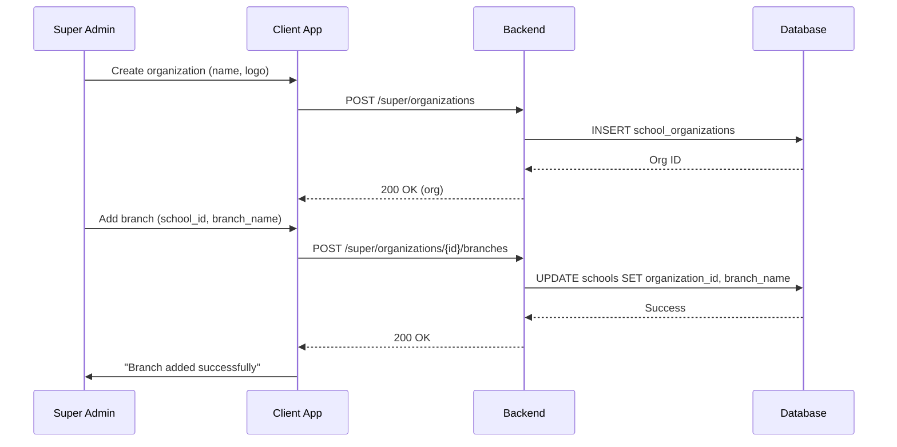
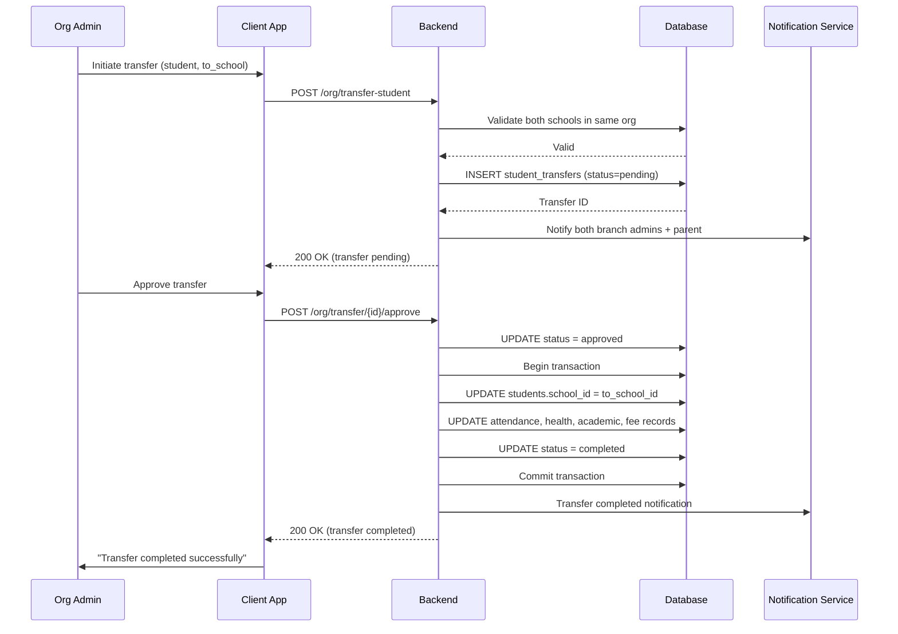
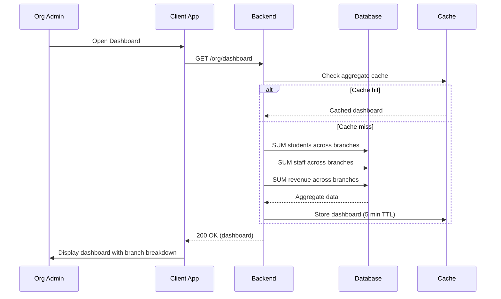
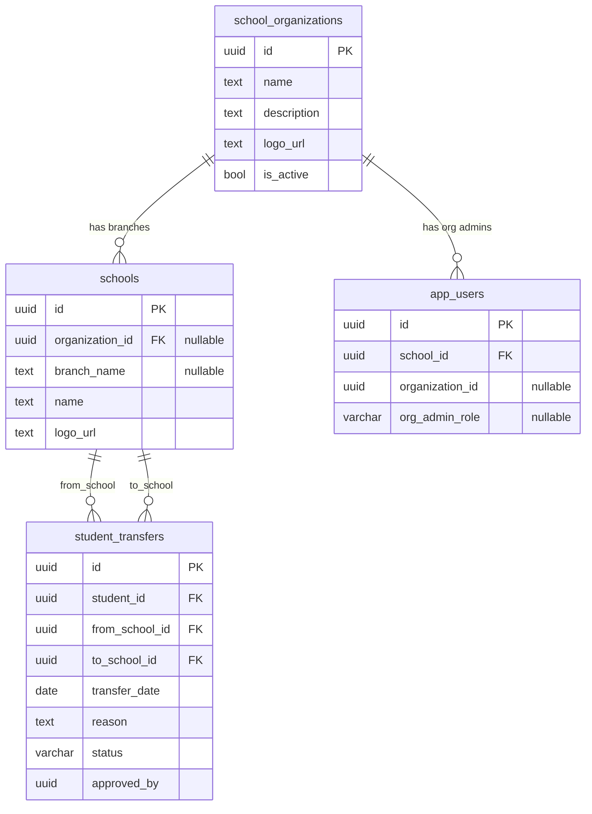

# Multi-Branch / School Chain Support — Technical Specification

> **Document status:** Implementation-ready blueprint
> **Last updated:** 2026-06-27
> **Prerequisites:** None
> **Unblocks:** `MULTI_SCHOOL_MANAGEMENT_SPEC.md`, `SCHOOL_BENCHMARKING_SPEC.md`
> **Template:** `_SPEC_TEMPLATE.md` v1 (25 mandatory + 6 optional sections)

---

## 1. Feature Overview

Support for school chains/franchises: a single admin managing multiple school branches under one organization, with shared configuration, cross-branch reporting, and branch-level autonomy.

### Goals

- Super admin creates an organization (school chain) with multiple branches
- Each branch is a `schools` row linked to a parent organization
- Org-level admin can view all branches, aggregate reports, shared settings
- Branch-level admin manages only their branch
- Cross-branch student transfer
- Aggregate analytics across branches

### Non-goals

- [ ] Franchise fee/revenue sharing automation
- [ ] Cross-organization data sharing
- [ ] Centralized admissions (single application to multiple branches)
- [ ] Multi-tenant SaaS billing per branch

### Dependencies

- `SchoolsTable` — existing school records (modified to add `organization_id`)
- `AppUsersTable` — existing user accounts (modified to add `organization_id`, `org_admin_role`)
- `StudentsTable` — student records for transfer
- `JwtConfig.kt` — JWT configuration for org admin claims

### Related Modules

- `server/.../feature/auth/` — authentication and authorization
- `server/.../feature/school/` — school management
- `server/.../feature/students/` — student management

---

## 2. Current System Assessment

### Existing Code

- `SchoolsTable` — single school per admin, no parent organization concept
- `feature_audit.csv` L156: "Currently single-school per admin"
- `AppUsersTable` — `schoolId` links user to one school
- All data is school-scoped via `school_id`

### Existing Database

- `SchoolsTable` — school records (name, logo, address, settings)
- `AppUsersTable` — user accounts with `schoolId` link
- `StudentsTable` — student records with `schoolId`
- All tables have `school_id` for data isolation

### Existing APIs

- `GET /api/v1/school` — school settings
- `GET /api/v1/school/students` — students (school-scoped)
- `GET /api/v1/school/staff` — staff (school-scoped)
- All APIs are school-scoped via JWT `school_id`

### Existing UI

- Admin: single school dashboard
- No organization-level UI

### Existing Services

- `SchoolService` — school CRUD
- `AuthService` — JWT-based auth with school_id scope
- No organization services

### Existing Documentation

- `feature_audit.csv` — feature audit tracking (multi-branch at 0%)
- `DIFFERENTIATING_FEATURES.md` — multi-branch feature description

### Technical Debt

| # | Gap | Details |
|---|---|---|
| TD-1 | No organization concept | No parent organization for school chains |
| TD-2 | No org admin role | No role for chain-level management |
| TD-3 | No cross-branch transfer | No student transfer between branches |
| TD-4 | No aggregate reporting | No cross-branch analytics |

### Gaps

| # | Gap | Impact | Severity |
|---|---|---|---|
| G1 | No organization management | Cannot group schools into chains | **High** |
| G2 | No org admin role | Cannot manage multiple branches | **High** |
| G3 | No student transfer | Cannot move students between branches | **Medium** |
| G4 | No aggregate reports | No cross-branch visibility | **Medium** |
| G5 | No shared settings | Each branch configures independently | **Low** |

---

## 3. Functional Requirements

### FR-001
| Field | Value |
|---|---|
| **Title** | Create Organization with Branches |
| **Description** | Create organization (chain) with multiple branch schools |
| **Priority** | Critical |
| **User Roles** | Super Admin |
| **Acceptance notes** | Organization created; existing schools linked as branches |

### FR-002
| Field | Value |
|---|---|
| **Title** | Org Admin Role |
| **Description** | Org admin role: view all branches, aggregate dashboard, shared config |
| **Priority** | Critical |
| **User Roles** | Org Admin |
| **Acceptance notes** | JWT claims extended with organization_id and org_admin_role |

### FR-003
| Field | Value |
|---|---|
| **Title** | Branch Admin Autonomy |
| **Description** | Branch admin: manages own branch only (existing behavior) |
| **Priority** | High |
| **User Roles** | School Admin |
| **Acceptance notes** | No change to existing branch admin behavior |

### FR-004
| Field | Value |
|---|---|
| **Title** | Cross-Branch Student Transfer |
| **Description** | Cross-branch student transfer (with academic record portability) |
| **Priority** | High |
| **User Roles** | Org Admin |
| **Acceptance notes** | Student records, academic history, health records transferred |

### FR-005
| Field | Value |
|---|---|
| **Title** | Aggregate Reports |
| **Description** | Aggregate reports: total students, staff, revenue across all branches |
| **Priority** | Medium |
| **User Roles** | Org Admin |
| **Acceptance notes** | Dashboard with totals across all branches |

### FR-006
| Field | Value |
|---|---|
| **Title** | Shared Settings |
| **Description** | Shared settings: fee categories, grading scales, templates can be shared from org to branches |
| **Priority** | Medium |
| **User Roles** | Org Admin |
| **Acceptance notes** | Settings propagated from org to all branches |

### FR-007
| Field | Value |
|---|---|
| **Title** | Branch Comparison Analytics |
| **Description** | Branch comparison analytics |
| **Priority** | Low |
| **User Roles** | Org Admin |
| **Acceptance notes** | Compare branches on key metrics (students, revenue, attendance) |

---

## 4. User Stories

### Super Admin
- [ ] Create a school organization (chain)
- [ ] Link existing schools as branches of an organization
- [ ] Assign org admin role to a user
- [ ] View all organizations

### Org Admin
- [ ] View aggregate dashboard across all branches
- [ ] View list of branches with key metrics
- [ ] Transfer student from one branch to another
- [ ] Push shared settings to all branches (fee categories, grading scales)
- [ ] Compare branches on key metrics
- [ ] View aggregate reports (total students, staff, revenue)

### Branch Admin
- [ ] Manage my branch as before (no change)
- [ ] Receive shared settings from org admin
- [ ] View incoming transfer requests

### System
- [ ] Extend JWT with organization_id and org_admin_role
- [ ] Filter queries by organization_id for org admin
- [ ] Filter queries by school_id for branch admin (existing)
- [ ] Transfer student records between schools
- [ ] Aggregate data across branches for org admin

---

## 5. Business Rules

### BR-001
**Rule:** One organization can have multiple branches (schools).
**Enforcement:** `schools.organization_id` links school to organization.

### BR-002
**Rule:** Org admin sees all branches' data; branch admin sees only own branch.
**Enforcement:** Query scoping based on JWT claims (organization_id vs school_id).

### BR-003
**Rule:** Student transfer requires approval from org admin.
**Enforcement:** `student_transfers.status` transitions: pending → approved → completed.

### BR-004
**Rule:** Student transfer preserves academic records, health records, and attendance history.
**Enforcement:** Transfer service updates `school_id` on all related records.

### BR-005
**Rule:** Shared settings propagate from org to all branches.
**Enforcement:** Org admin pushes settings; branches receive and apply.

### BR-006
**Rule:** A school can only belong to one organization.
**Enforcement:** `schools.organization_id` is a single UUID (not an array).

---

## 6. Database Design

### 6.1 Entity Relationship Summary

New table `school_organizations` (parent entity). Existing `schools` table modified to add `organization_id` and `branch_name`. Existing `app_users` modified to add `organization_id` and `org_admin_role`. New table `student_transfers` for cross-branch transfer tracking.

### 6.2 New Tables

```sql
CREATE TABLE school_organizations (
    id              UUID PRIMARY KEY DEFAULT gen_random_uuid(),
    name            TEXT NOT NULL,                 -- "Delhi Public School Society"
    description     TEXT,
    logo_url        TEXT,
    is_active       BOOLEAN NOT NULL DEFAULT true,
    created_at      TIMESTAMP NOT NULL DEFAULT now(),
    updated_at      TIMESTAMP NOT NULL DEFAULT now()
);

CREATE TABLE student_transfers (
    id              UUID PRIMARY KEY DEFAULT gen_random_uuid(),
    student_id      UUID NOT NULL,
    from_school_id  UUID NOT NULL,
    to_school_id    UUID NOT NULL,
    transfer_date   DATE NOT NULL,
    reason          TEXT,
    status          VARCHAR(16) NOT NULL DEFAULT 'pending', -- pending | approved | completed | rejected
    approved_by     UUID,
    created_at      TIMESTAMP NOT NULL DEFAULT now()
);
```

### 6.3 Modified Tables

```sql
ALTER TABLE schools ADD COLUMN organization_id UUID REFERENCES school_organizations(id);
ALTER TABLE schools ADD COLUMN branch_name TEXT;  -- "DPS RK Puram", "DPS Vasant Kunj"

ALTER TABLE app_users ADD COLUMN organization_id UUID;
ALTER TABLE app_users ADD COLUMN org_admin_role VARCHAR(16); -- org_admin | null
```

### 6.4 Indexes

```sql
CREATE INDEX idx_schools_organization ON schools(organization_id) WHERE organization_id IS NOT NULL;
CREATE INDEX idx_app_users_organization ON app_users(organization_id) WHERE organization_id IS NOT NULL;
CREATE INDEX idx_student_transfers_student ON student_transfers(student_id);
CREATE INDEX idx_student_transfers_status ON student_transfers(status, transfer_date DESC);
```

### 6.5 Constraints

- `school_organizations.name` — NOT NULL
- `student_transfers.student_id` — NOT NULL
- `student_transfers.from_school_id` — NOT NULL
- `student_transfers.to_school_id` — NOT NULL
- `student_transfers.status` — NOT NULL, one of `pending`, `approved`, `completed`, `rejected`
- `schools.organization_id` — nullable (existing schools without org)

### 6.6 Foreign Keys

- `schools.organization_id` → `school_organizations.id`
- `student_transfers.from_school_id` → `schools.id`
- `student_transfers.to_school_id` → `schools.id`

### 6.7 Soft Delete Strategy

- `school_organizations.is_active` — organization deactivated (not deleted)
- Transferred student records are not deleted; `school_id` updated

### 6.8 Audit Fields

- `created_at` — creation timestamp (all tables)
- `updated_at` — last update timestamp (organizations)
- `transfer_date` — student transfer date
- `approved_by` — who approved the transfer

### 6.9 Migration Notes

Migration: `docs/db/migration_051_multi_branch.sql`
- Creates 2 new tables
- Adds columns to existing `schools` and `app_users` tables
- Existing schools remain unlinked (organization_id = NULL)
- No data backfill needed

### 6.10 Exposed Mappings

```kotlin
object SchoolOrganizationsTable : UUIDTable("school_organizations", "id") {
    val name        = text("name")
    val description = text("description").nullable()
    val logoUrl     = text("logo_url").nullable()
    val isActive    = bool("is_active").default(true)
    val createdAt   = timestamp("created_at")
    val updatedAt   = timestamp("updated_at")
}

object StudentTransfersTable : UUIDTable("student_transfers", "id") {
    val studentId     = uuid("student_id")
    val fromSchoolId  = uuid("from_school_id")
    val toSchoolId    = uuid("to_school_id")
    val transferDate  = date("transfer_date")
    val reason        = text("reason").nullable()
    val status        = varchar("status", 16).default("pending")
    val approvedBy    = uuid("approved_by").nullable()
    val createdAt     = timestamp("created_at")
    init {
        index("idx_student_transfers_student", false, studentId)
        index("idx_student_transfers_status", false, status, transferDate)
    }
}
```

### 6.11 Seed Data

N/A — organizations created by super admin.

---

## 7. State Machines

### Student Transfer State Machine

```
PENDING ──org_admin_approves──> APPROVED ──system_completes──> COMPLETED
PENDING ──org_admin_rejects──> REJECTED
APPROVED ──transfer_fails──> PENDING (revert)
```

| Current State | Event | Next State | Guard / Condition |
|---|---|---|---|
| `pending` | Org admin approves | `approved` | Both schools in same organization |
| `approved` | System completes transfer | `completed` | All records updated with new school_id |
| `pending` | Org admin rejects | `rejected` | — |
| `approved` | Transfer fails | `pending` | Error during record migration |

### Organization State Machine

```
ACTIVE ──super_admin_deactivates──> INACTIVE
INACTIVE ──super_admin_reactivates──> ACTIVE
```

| Current State | Event | Next State | Guard / Condition |
|---|---|---|---|
| `active` | Super admin deactivates | `inactive` | `is_active = false` |
| `inactive` | Super admin reactivates | `active` | `is_active = true` |

---

## 8. Backend Architecture

### 8.1 Component Overview

Two main services: `OrganizationService` (org CRUD, branch management, aggregate dashboard) and `StudentTransferService` (cross-branch transfer workflow). `OrganizationRouting` exposes API endpoints. `JwtConfig` modified to include org claims.

### 8.2 Design Principles

1. **Additive changes** — existing school-scoped behavior unchanged for branch admins
2. **Org admin scoping** — queries filtered by `organization_id` for org admins
3. **Transfer workflow** — pending → approved → completed with record migration
4. **Shared settings** — org admin can push settings to all branches
5. **Aggregate queries** — SUM/COUNT across all branches in organization

### 8.3 Core Types

```kotlin
class OrganizationService {
    suspend fun createOrg(name: String, logoUrl: String?): OrgDto
    suspend fun addBranch(orgId: UUID, schoolId: UUID, branchName: String)
    suspend fun getBranches(orgId: UUID): List<SchoolDto>
    suspend fun getAggregateDashboard(orgId: UUID): OrgDashboardDto
    suspend fun transferStudent(studentId: UUID, fromSchoolId: UUID, toSchoolId: UUID): UUID
    suspend fun pushSharedSettings(orgId: UUID, settings: SharedSettingsDto): Unit
    suspend fun getBranchComparison(orgId: UUID): List<BranchComparisonDto>
}

class StudentTransferService {
    suspend fun initiateTransfer(studentId: UUID, fromSchoolId: UUID, toSchoolId: UUID, reason: String?): UUID
    suspend fun approveTransfer(transferId: UUID, approvedBy: UUID): Unit
    suspend fun completeTransfer(transferId: UUID): Unit
    suspend fun rejectTransfer(transferId: UUID): Unit
    suspend fun getTransfers(orgId: UUID, status: String?): List<StudentTransferDto>
}
```

### 8.4 Repositories

- `OrganizationRepository` — CRUD for organizations
- `StudentTransferRepository` — CRUD for transfers

### 8.5 Mappers

- `OrganizationMapper` — maps org DB rows to DTOs
- `StudentTransferMapper` — maps transfer rows to DTOs
- `BranchComparisonMapper` — maps aggregate query results to comparison DTOs

### 8.6 Permission Checks

- Create organization: super admin only
- Add branch to org: super admin only
- Org dashboard: org admin only
- Student transfer: org admin only
- Shared settings: org admin only
- Branch comparison: org admin only
- Branch admin: existing behavior (school_id scoped)

### 8.7 Background Jobs

### Student Transfer Completion Job

| Job | Schedule | Description |
|---|---|---|
| `StudentTransferCompletionJob` | On approval | Migrate student records to new school |

**Implementation:**
1. Get approved transfer record
2. Update `students.school_id` to `to_school_id`
3. Update related records: attendance, health, academic, fee records
4. Update transfer status to `completed`
5. Notify both branch admins and parent

### 8.8 Domain Events

- `OrganizationCreated` — emitted when org created
- `BranchAdded` — emitted when school linked to org
- `StudentTransferInitiated` — emitted when transfer requested
- `StudentTransferApproved` — emitted when transfer approved
- `StudentTransferCompleted` — emitted when transfer completed
- `SharedSettingsPushed` — emitted when settings pushed to branches

### 8.9 Caching

- Organization data cached for 10 minutes (changes infrequently)
- Aggregate dashboard cached for 5 minutes
- Branch list cached for 10 minutes

### 8.10 Transactions

- Student transfer: UPDATE student + UPDATE related records in single transaction
- Shared settings push: UPDATE settings across all branches in batch

### 8.11 Rate Limiting

- Standard API rate limiting
- No special rate limiting needed

### 8.12 Configuration

- `ORG_TRANSFER_AUTO_APPROVE` — default `false` (transfers require approval)
- `ORG_AGGREGATE_CACHE_TTL` — default 300 (seconds)

---

## 9. API Contracts

### 9.1 Super Admin APIs

```
POST /api/v1/super/organizations
POST /api/v1/super/organizations/{id}/branches  { school_id, branch_name }
```

### 9.2 Org Admin APIs

```
GET /api/v1/org/dashboard
GET /api/v1/org/branches
GET /api/v1/org/students?branch_id={uuid}
GET /api/v1/org/reports/aggregate
POST /api/v1/org/transfer-student  { student_id, to_school_id }
POST /api/v1/org/shared-settings  { settings }
GET /api/v1/org/branch-comparison
```

### 9.3 Example Responses

**Org Dashboard Response 200:**
```json
{
  "success": true,
  "data": {
    "organization_id": "uuid",
    "organization_name": "Delhi Public School Society",
    "branch_count": 5,
    "total_students": 3500,
    "total_staff": 280,
    "total_revenue": 12500000,
    "branches": [
      {"school_id": "uuid", "branch_name": "DPS RK Puram", "students": 1200, "revenue": 4500000},
      {"school_id": "uuid", "branch_name": "DPS Vasant Kunj", "students": 800, "revenue": 2800000}
    ]
  }
}
```

**Student Transfer Response 200:**
```json
{
  "success": true,
  "data": {
    "transfer_id": "uuid",
    "student_id": "uuid",
    "student_name": "Aarav Sharma",
    "from_school": "DPS RK Puram",
    "to_school": "DPS Vasant Kunj",
    "status": "pending",
    "transfer_date": "2026-07-01"
  }
}
```

---

## 10. Frontend Architecture

### 10.1 Screens

| Screen | Platform | Role | Description |
|---|---|---|---|
| `OrgDashboardScreen` | All | Org Admin | Aggregate dashboard across branches |
| `BranchListScreen` | All | Org Admin | List of branches with metrics |
| `StudentTransferScreen` | All | Org Admin | Initiate and track student transfers |
| `BranchComparisonScreen` | All | Org Admin | Compare branches on key metrics |
| `SharedSettingsScreen` | All | Org Admin | Push settings to branches |

### 10.2 Navigation

- Org admin portal → Dashboard → `OrgDashboardScreen`
- Org admin portal → Branches → `BranchListScreen`
- Org admin portal → Transfer → `StudentTransferScreen`
- Org admin portal → Comparison → `BranchComparisonScreen`
- Org admin portal → Settings → `SharedSettingsScreen`

### 10.3 UX Flows

#### Org Admin: View Aggregate Dashboard

1. Org admin opens Dashboard
2. Views total students, staff, revenue across all branches
3. Views branch-wise breakdown
4. Clicks branch to drill down

#### Org Admin: Transfer Student

1. Org admin opens Transfer
2. Searches for student
3. Selects destination branch
4. Enters transfer reason
5. Submits transfer request
6. Transfer appears in pending list
7. Org admin approves transfer
8. System completes transfer (records migrated)
9. Both branch admins and parent notified

#### Org Admin: Push Shared Settings

1. Org admin opens Shared Settings
2. Selects settings to push (fee categories, grading scales, templates)
3. Reviews current branch settings
4. Clicks "Push to All Branches"
5. Settings propagated to all branches

### 10.4 State Management

```kotlin
data class OrgDashboardState(
    val dashboard: OrgDashboardDto?,
    val branches: List<SchoolDto>,
    val transfers: List<StudentTransferDto>,
    val isLoading: Boolean,
    val error: String?,
)
```

### 10.5 Offline Support

- Dashboard data cached for offline viewing
- Transfer list cached locally
- Settings push requires network

### 10.6 Loading States

- Loading dashboard: "Loading organization dashboard..."
- Loading branches: "Loading branches..."
- Processing transfer: "Processing student transfer..."

### 10.7 Error Handling (UI)

- No branches: "No branches linked to this organization."
- Transfer failed: "Transfer failed. Please try again."
- Not org admin: "You need org admin access for this view."

### 10.8 Component Integration Guidelines

| Rule | Description |
|---|---|
| **R1** | Dashboard cards for total students, staff, revenue |
| **R2** | Branch-wise table with sortable columns |
| **R3** | Transfer status badges (pending/approved/completed/rejected) |
| **R4** | Branch comparison chart (bar/radar) |
| **R5** | Shared settings diff view (org vs branch) |
| **R6** | Drill-down from org to branch view |

---

## 11. Shared Module Changes (KMP)

### 11.1 DTOs

```kotlin
data class OrgDto(
    val id: UUID,
    val name: String,
    val description: String?,
    val logoUrl: String?,
    val isActive: Boolean,
    val branchCount: Int,
)

data class OrgDashboardDto(
    val organizationId: UUID,
    val organizationName: String,
    val branchCount: Int,
    val totalStudents: Int,
    val totalStaff: Int,
    val totalRevenue: Double,
    val branches: List<BranchSummaryDto>,
)

data class BranchSummaryDto(
    val schoolId: UUID,
    val branchName: String,
    val students: Int,
    val staff: Int,
    val revenue: Double,
)

data class StudentTransferDto(
    val id: UUID,
    val studentId: UUID,
    val studentName: String,
    val fromSchoolId: UUID,
    val fromSchoolName: String,
    val toSchoolId: UUID,
    val toSchoolName: String,
    val transferDate: LocalDate,
    val reason: String?,
    val status: String,
    val approvedBy: UUID?,
)

data class BranchComparisonDto(
    val schoolId: UUID,
    val branchName: String,
    val metrics: Map<String, Double>,
)

data class SharedSettingsDto(
    val feeCategories: List<FeeCategoryDto>?,
    val gradingScales: List<GradingScaleDto>?,
    val idCardTemplate: IdCardTemplateDto?,
)
```

### 11.2 Domain Models

```kotlin
data class SchoolOrganization(
    val id: UUID,
    val name: String,
    val description: String?,
    val logoUrl: String?,
    val isActive: Boolean,
)

data class StudentTransfer(
    val id: UUID,
    val studentId: UUID,
    val fromSchoolId: UUID,
    val toSchoolId: UUID,
    val transferDate: LocalDate,
    val reason: String?,
    val status: String,
    val approvedBy: UUID?,
)
```

### 11.3 Repository Interfaces

```kotlin
interface OrganizationRepository {
    suspend fun create(org: OrganizationEntity): UUID
    suspend fun getById(id: UUID): OrgDto?
    suspend fun addBranch(orgId: UUID, schoolId: UUID, branchName: String): Unit
    suspend fun getBranches(orgId: UUID): List<SchoolDto>
    suspend fun getAggregateData(orgId: UUID): OrgDashboardDto
}

interface StudentTransferRepository {
    suspend fun initiate(transfer: StudentTransferEntity): UUID
    suspend fun approve(transferId: UUID, approvedBy: UUID): Unit
    suspend fun complete(transferId: UUID): Unit
    suspend fun reject(transferId: UUID): Unit
    suspend fun getByOrg(orgId: UUID, status: String?): List<StudentTransferDto>
}
```

### 11.4 UseCases

- `CreateOrganizationUseCase`
- `AddBranchUseCase`
- `GetOrgDashboardUseCase`
- `TransferStudentUseCase`
- `ApproveTransferUseCase`
- `PushSharedSettingsUseCase`
- `GetBranchComparisonUseCase`

### 11.5 Validation

- Organization name: not empty
- Branch name: not empty
- Transfer: from_school and to_school must be in same organization
- Transfer: student must exist in from_school
- Shared settings: valid format for each setting type

### 11.6 Serialization

Standard Kotlinx serialization for DTOs.

### 11.7 Network APIs

Added to `OrganizationApi.kt`:
- `POST /api/v1/super/organizations` — create org
- `POST /api/v1/super/organizations/{id}/branches` — add branch
- `GET /api/v1/org/dashboard` — aggregate dashboard
- `GET /api/v1/org/branches` — branch list
- `GET /api/v1/org/students` — students (with branch_id filter)
- `GET /api/v1/org/reports/aggregate` — aggregate reports
- `POST /api/v1/org/transfer-student` — initiate transfer
- `POST /api/v1/org/shared-settings` — push settings
- `GET /api/v1/org/branch-comparison` — comparison analytics

### 11.8 Database Models (Local Cache)

- Dashboard data cached locally for offline viewing
- Branch list cached locally
- Transfer list cached locally

---

## 12. Permissions Matrix

| Action | Super Admin | Org Admin | School Admin | Teacher | Parent |
|---|---|---|---|---|---|
| Create organization | ✅ | ❌ | ❌ | ❌ | ❌ |
| Add branch to org | ✅ | ❌ | ❌ | ❌ | ❌ |
| View org dashboard | ✅ | ✅ | ❌ | ❌ | ❌ |
| View all branches | ✅ | ✅ | ❌ | ❌ | ❌ |
| View own branch | ✅ | ✅ | ✅ | ❌ | ❌ |
| Transfer student | ✅ | ✅ | ❌ | ❌ | ❌ |
| Approve transfer | ✅ | ✅ | ❌ | ❌ | ❌ |
| Push shared settings | ✅ | ✅ | ❌ | ❌ | ❌ |
| View branch comparison | ✅ | ✅ | ❌ | ❌ | ❌ |
| View aggregate reports | ✅ | ✅ | ❌ | ❌ | ❌ |

---

## 13. Notifications

### Multi-Branch Notifications

| Type | Trigger | Channel | Message |
|---|---|---|---|
| Transfer Initiated | Org admin initiates transfer | In-app (both branch admins, parent) | "Transfer initiated for {studentName} from {fromBranch} to {toBranch}." |
| Transfer Approved | Org admin approves transfer | In-app (both branch admins, parent) | "Transfer approved for {studentName}. Migration in progress." |
| Transfer Completed | System completes transfer | In-app (both branch admins, parent) | "Transfer completed. {studentName} is now enrolled at {toBranch}." |
| Transfer Rejected | Org admin rejects transfer | In-app (requester, parent) | "Transfer rejected for {studentName}." |
| Shared Settings Pushed | Org admin pushes settings | In-app (all branch admins) | "Shared settings updated by organization. Review changes." |
| Branch Added | Super admin links school to org | In-app (org admin) | "New branch added: {branchName}." |

---

## 14. Background Jobs

| Job | Schedule | Description |
|---|---|---|
| `StudentTransferCompletionJob` | On approval | Migrate student records to new school |
| `OrgAggregateCacheJob` | Every 5 minutes | Refresh aggregate dashboard cache |

**Student Transfer Completion:**
1. Get approved transfer record
2. Begin transaction:
   - UPDATE `students.school_id` = `to_school_id`
   - UPDATE `attendance_records.school_id` = `to_school_id` (for student)
   - UPDATE `health_records.school_id` = `to_school_id` (for student)
   - UPDATE `academic_records.school_id` = `to_school_id` (for student)
   - UPDATE `fee_records.school_id` = `to_school_id` (for student)
3. UPDATE transfer status = `completed`
4. Commit transaction
5. Send notifications to both branch admins and parent

**Org Aggregate Cache Refresh:**
1. For each active organization:
   - Query total students across all branches
   - Query total staff across all branches
   - Query total revenue across all branches
   - Update aggregate dashboard cache
2. Log cache refresh count

---

## 15. Integrations

### SchoolsTable
| Field | Value |
|---|---|
| **System** | Existing school management |
| **Purpose** | Branch schools linked to organization via `organization_id` |
| **API / SDK** | Direct DB query |
| **Auth method** | Internal |
| **Fallback** | Schools without organization_id work as standalone (backward compatible) |

### AppUsersTable
| Field | Value |
|---|---|
| **System** | Existing user management |
| **Purpose** | Users with `organization_id` and `org_admin_role` for org-level access |
| **API / SDK** | Direct DB query |
| **Auth method** | Internal |
| **Fallback** | Users without organization_id work as branch-level (backward compatible) |

### StudentsTable
| Field | Value |
|---|---|
| **System** | Existing student management |
| **Purpose** | Student records transferred between branches (school_id updated) |
| **API / SDK** | Direct DB query |
| **Auth method** | Internal |
| **Fallback** | None — student data required for transfer |

### JwtConfig
| Field | Value |
|---|---|
| **System** | Existing JWT authentication |
| **Purpose** | Extended JWT claims with `organization_id` and `org_admin_role` |
| **API / SDK** | Internal JWT library |
| **Auth method** | JWT signing |
| **Fallback** | Existing JWT without org claims works for branch admins |

### Notification Service
| Field | Value |
|---|---|
| **System** | Existing notification infrastructure |
| **Purpose** | Transfer notifications, shared settings notifications |
| **API / SDK** | Internal `NotificationService` |
| **Auth method** | Internal service call |
| **Fallback** | In-app notification if push fails |

---

## 16. Security

### Authentication
- Super admin APIs: JWT with super admin role
- Org admin APIs: JWT with `org_admin_role` = `org_admin` and `organization_id` claim
- Branch admin APIs: JWT with `school_id` (existing, unchanged)

### Authorization
- Create organization: super admin only
- Add branch: super admin only
- Org dashboard, transfers, shared settings: org admin only (verified via `organization_id` claim)
- Branch operations: school admin only (existing, unchanged)

### Encryption
- All API communication over TLS
- JWT signed with server secret
- No additional encryption needed

### Audit Logs
- Organization creation logged
- Branch addition logged
- Student transfer initiation logged
- Student transfer approval logged
- Student transfer completion logged
- Shared settings push logged
- Org admin role assignment logged

### PII Handling
- Student records transferred between branches (same organization)
- Transfer records contain student_id (not direct PII)
- Org admin can view aggregate data (not individual student details unless drilling down)

### Data Isolation
- Branch admin: queries filtered by `school_id` (existing)
- Org admin: queries filtered by `organization_id` (all branches in org)
- Super admin: no filter (all organizations)
- Transfer: both schools must be in same organization

### Rate Limiting
- Standard API rate limiting
- No special rate limiting needed

### Input Validation
- Organization name: not empty
- Branch name: not empty
- Transfer: from_school and to_school must be different
- Transfer: both schools must be in same organization
- Shared settings: valid JSON format

---

## 17. Performance & Scalability

### Expected Scale

| Metric | Small org | Medium org | Large org |
|---|---|---|---|
| Branches | 2-3 | 5-10 | 20-50 |
| Students per branch | ~200 | ~1,000 | ~5,000 |
| Total students | ~600 | ~5,000 | ~100,000 |
| Transfers per year | ~10 | ~50 | ~200 |

### Latency Targets

| Operation | Target |
|---|---|
| Get org dashboard | < 500ms (cached) / < 2s (fresh) |
| Get branch list | < 200ms |
| Initiate transfer | < 200ms |
| Complete transfer | < 5s (includes record migration) |
| Push shared settings | < 1s |
| Branch comparison | < 500ms |

### Optimization Strategy

- Aggregate dashboard cached for 5 minutes
- Branch list cached for 10 minutes
- Transfer completion in single transaction (batch UPDATE)
- Branch comparison uses pre-aggregated data from cache

---

## 18. Edge Cases

| # | Scenario | Expected Behavior |
|---|---|---|
| EC-001 | School not linked to any organization | Works as standalone (backward compatible) |
| EC-002 | Transfer to school in different organization | Return 400: "Cannot transfer across organizations" |
| EC-003 | Transfer to same school | Return 400: "From and to school must be different" |
| EC-004 | Student already has pending transfer | Return 400: "Student already has a pending transfer" |
| EC-005 | Transfer completion fails mid-transaction | Rollback; transfer stays in `approved` status; retry |
| EC-006 | Org admin tries branch admin operation | Allowed (org admin has branch-level access too) |
| EC-007 | Branch admin tries org admin operation | Return 403: "Insufficient permissions" |
| EC-008 | Organization deactivated | Branch admins still work; org admin sees inactive org |

### Risks & Mitigations

| Risk | Likelihood | Impact | Mitigation |
|---|---|---|---|
| Transfer record migration failure | Low | High | Transaction rollback; retry mechanism |
| Cross-org data leak | Low | High | Validate both schools in same org before transfer |
| Aggregate query performance | Medium | Medium | Cache dashboard for 5 minutes |
| JWT claim mismatch | Low | High | Validate org_id in JWT matches requested org |

---

## 19. Error Handling

### Standard Error Codes

| HTTP | Error Code | Description | When |
|---|---|---|---|
| 400 | `CROSS_ORG_TRANSFER` | Cannot transfer across organizations | Transfer |
| 400 | `SAME_SCHOOL_TRANSFER` | From and to school are the same | Transfer |
| 400 | `PENDING_TRANSFER_EXISTS` | Student already has pending transfer | Transfer |
| 400 | `STUDENT_NOT_IN_FROM_SCHOOL` | Student not enrolled in from_school | Transfer |
| 400 | `INVALID_ORG_NAME` | Organization name is empty | Create org |
| 400 | `INVALID_BRANCH_NAME` | Branch name is empty | Add branch |
| 403 | `NOT_ORG_ADMIN` | User is not org admin | Any org endpoint |
| 403 | `NOT_SUPER_ADMIN` | User is not super admin | Super admin endpoints |
| 404 | `ORG_NOT_FOUND` | Organization does not exist | Any org endpoint |
| 404 | `TRANSFER_NOT_FOUND` | Transfer record does not exist | Transfer operations |
| 500 | `TRANSFER_FAILED` | Transfer completion failed | Complete transfer |

### Error Response Format

Same as existing API error format.

### Recovery Strategy

| Error | Client Action | Server Action |
|---|---|---|
| `CROSS_ORG_TRANSFER` | Show "Can only transfer within same organization" | Return 400 |
| `PENDING_TRANSFER_EXISTS` | Show "Student already has a pending transfer" | Return 400 |
| `TRANSFER_FAILED` | Show "Transfer failed. Retrying..." | Auto-retry; stay in approved |

---

## 20. Analytics & Reporting

### Reports

- **Aggregate Dashboard:** Total students, staff, revenue across all branches
- **Branch Comparison:** Side-by-side metrics for all branches
- **Transfer Report:** Student transfers per month, by branch
- **Revenue by Branch:** Fee collection per branch
- **Enrollment by Branch:** Student count trends per branch
- **Staff Distribution:** Staff count by branch and role

### KPIs

- **Total Students (Org):** Sum of students across all branches
- **Total Revenue (Org):** Sum of revenue across all branches
- **Average Students per Branch:** Total students / branch count
- **Transfer Rate:** Transfers per month
- **Branch Performance Index:** Composite metric for branch comparison

### Dashboards

- Org admin: aggregate dashboard with branch breakdown
- Org admin: branch comparison chart
- Org admin: transfer tracking

### Exports

- Aggregate report export (CSV/PDF)
- Branch comparison export (CSV)
- Transfer log export (CSV)

---

## 21. Testing Strategy

### Unit Tests

| Test | What it verifies |
|---|---|
| Organization creation | Correct org stored with name and logo |
| Branch addition | School linked to org with branch_name |
| Aggregate dashboard | Correct SUM across branches |
| Transfer initiation | Transfer record created with pending status |
| Transfer approval | Status changes to approved |
| Transfer completion | All records updated with new school_id |
| Transfer rejection | Status changes to rejected |
| Cross-org transfer prevention | Returns error for different orgs |
| Same school transfer prevention | Returns error for same school |

### Integration Tests

| Test | What it verifies |
|---|---|
| Create org → add branches → view dashboard | Full org setup |
| Initiate transfer → approve → complete | Full transfer lifecycle |
| Push shared settings → verify branch received | Settings propagation |
| Org admin vs branch admin scoping | Correct data isolation |

### Performance Tests

- [ ] Aggregate dashboard with 50 branches < 2s
- [ ] Transfer completion with 1000+ records < 5s
- [ ] Branch comparison with 50 branches < 500ms

### Security Tests

- [ ] Branch admin cannot access org endpoints
- [ ] Org admin cannot access other org's data
- [ ] Cross-org transfer prevented
- [ ] Super admin can access all orgs

### Migration Tests

- [ ] Migration creates 2 new tables
- [ ] ALTER TABLE adds columns correctly
- [ ] Existing schools work without organization_id (backward compatible)
- [ ] Existing users work without org claims (backward compatible)

---

## 22. Acceptance Criteria

- [ ] Organization with multiple branches created
- [ ] Org admin sees aggregate dashboard across branches
- [ ] Branch admin sees only own branch (no change)
- [ ] Student transfer between branches works
- [ ] Shared settings propagate to branches
- [ ] Branch comparison analytics available
- [ ] JWT claims extended for org admin
- [ ] Backward compatibility maintained for standalone schools

---

## 23. Implementation Roadmap

| Phase | Duration | Tasks | Breaking? | Deliverable |
|---|---|---|---|---|
| 1 | 2 days | DB migration, Exposed tables, modify schools + app_users | No (additive) | Schema + tables |
| 2 | 3 days | OrganizationService + aggregate queries | No | Org service |
| 3 | 2 days | Student transfer service | No | Transfer service |
| 4 | 2 days | Auth modification (org admin JWT claims) | No (additive) | JWT extended |
| 5 | 2 days | API endpoints | No | API available |
| 6 | 3 days | Client UI (org dashboard, branch list, transfer flow) | No | UI ready |
| 7 | 2 days | Tests | No | Test coverage |

**Total: ~16 days**

---

## 24. File-Level Impact Analysis

### New Files

| File | Location | Purpose |
|---|---|---|
| `OrganizationService.kt` | `server/.../feature/org/` | Org management |
| `StudentTransferService.kt` | `server/.../feature/org/` | Transfer workflow |
| `OrganizationRouting.kt` | `server/.../feature/org/` | API endpoints |
| `StudentTransferCompletionJob.kt` | `server/.../feature/org/` | Background job |
| `OrgAggregateCacheJob.kt` | `server/.../feature/org/` | Cache refresh job |
| `migration_051_multi_branch.sql` | `docs/db/` | DDL migration |
| `OrganizationApi.kt` | `shared/.../feature/org/` | Client API |
| `OrganizationRepositoryImpl.kt` | `shared/.../feature/org/` | Repository impl |
| `OrganizationDtos.kt` | `shared/.../feature/org/` | DTOs |
| `OrgDashboardViewModel.kt` | `shared/.../feature/org/` | Org admin VM |
| `StudentTransferViewModel.kt` | `shared/.../feature/org/` | Transfer VM |
| `OrgDashboardScreen.kt` | `composeApp/.../ui/v2/screens/admin/` | Org admin dashboard |
| `BranchListScreen.kt` | `composeApp/.../ui/v2/screens/admin/` | Branch list |
| `StudentTransferScreen.kt` | `composeApp/.../ui/v2/screens/admin/` | Transfer flow |
| `BranchComparisonScreen.kt` | `composeApp/.../ui/v2/screens/admin/` | Comparison analytics |
| `SharedSettingsScreen.kt` | `composeApp/.../ui/v2/screens/admin/` | Shared settings |

### Modified Files

| File | Change Type | Lines Changed (est.) | Risk | Description |
|---|---|---|---|---|
| `server/.../db/Tables.kt` | Add + Modify | ~40 | Medium | 2 new table objects + columns on schools, app_users |
| `server/.../db/DatabaseFactory.kt` | Modify | ~2 | Low | Register 2 new tables |
| `server/.../core/JwtConfig.kt` | Modify | ~10 | Medium | Add org_id and org_admin_role claims |
| `server/.../feature/auth/AuthService.kt` | Modify | ~15 | Medium | Org admin auth logic |
| `server/.../core/QueryScoping.kt` | Modify | ~20 | Medium | Add organization_id scoping |

### Files Preserved Unchanged

| File | Reason |
|---|---|
| `StudentsTable` | Modified via ALTER TABLE (additive) |
| `SchoolsTable` | Modified via ALTER TABLE (additive) |
| `AppUsersTable` | Modified via ALTER TABLE (additive) |
| All existing services | Backward compatible (org_id nullable) |

---

## 25. Future Enhancements

### Centralized Admissions

- Single application form for multiple branches
- Branch allocation based on preference and availability
- Waitlist management across branches
- Admission analytics across branches

### Franchise Management

- Franchise fee calculation per branch
- Revenue sharing automation
- Franchise agreement tracking
- Compliance monitoring per branch

### Cross-Branch Resource Sharing

- Shared teaching staff across branches
- Inter-branch event management
- Shared transport routes
- Shared library catalog

### Multi-Tenant SaaS Billing

- Per-branch subscription billing
- Usage-based pricing per branch
- Branch-level feature toggles
- Organization-level billing dashboard

### Organization-Level Roles

- Vice President (multiple orgs)
- Region Manager (subset of branches)
- Branch Group Manager (cluster of branches)
- Custom role hierarchy

### Cross-Organization Benchmarking

- Anonymous benchmarking across organizations
- Industry-standard metrics comparison
- Best practices sharing
- Performance ranking

### Unified Parent App

- Single parent app for multiple children in different branches
- Cross-branch fee payment
- Unified notifications
- Single login for all children

### Organization-Wide Announcements

- Push announcements to all branches
- Branch-specific override
- Announcement scheduling
- Read receipts per branch

### Centralized Exam Management

- Common exam across all branches
- Unified question paper generation
- Cross-branch result comparison
- Standardized grading across branches

### Branch Performance Scoring

- Composite performance index per branch
- Weighted metrics (academic, admin, financial)
- Historical trend analysis
- Branch ranking within organization

---

## A. Sequence Diagrams

### Create Organization and Add Branches



### Student Transfer Flow



### Org Admin Views Dashboard



---

## B. Domain Model / ER Diagram



---

## C. Event Flow

```
OrgCreated -> Complete
BranchAdded -> Complete
TransferInitiated -> NotifyAdmins -> Complete
TransferApproved -> MigrateRecords -> UpdateStatus -> NotifyCompletion -> Complete
TransferApproved -> MigrationFailed -> Rollback -> StayApproved
TransferRejected -> NotifyRejection -> Complete
SharedSettingsPushed -> UpdateAllBranches -> NotifyBranchAdmins -> Complete
```

| Event | Emitted By | Consumed By | Side Effect |
|---|---|---|---|
| `OrganizationCreated` | `OrganizationService.createOrg()` | Analytics | Counter incremented |
| `BranchAdded` | `OrganizationService.addBranch()` | Notification | Org admin notified |
| `StudentTransferInitiated` | `StudentTransferService.initiateTransfer()` | Notification | Admins and parent notified |
| `StudentTransferApproved` | `StudentTransferService.approveTransfer()` | Transfer Job | Record migration triggered |
| `StudentTransferCompleted` | `StudentTransferService.completeTransfer()` | Notification | Completion notified |
| `SharedSettingsPushed` | `OrganizationService.pushSharedSettings()` | Notification | Branch admins notified |

---

## D. Configuration

### Environment Variables

| Variable | Description |
|---|---|
| `ORG_ENABLED` | Enable/disable multi-branch feature (default: `true`) |
| `ORG_TRANSFER_AUTO_APPROVE` | Auto-approve transfers (default: `false`) |
| `ORG_AGGREGATE_CACHE_TTL` | Cache TTL in seconds (default: `300`) |
| `ORG_MAX_BRANCHES` | Max branches per org (default: `100`) |

### Feature Flags

| Flag | Default | Description |
|---|---|---|
| `multi_branch_enabled` | `true` | Master switch for multi-branch |
| `org_transfer_enabled` | `true` | Enable student transfer |
| `org_shared_settings` | `true` | Enable shared settings push |
| `org_benchmarking` | `false` | Enable cross-org benchmarking (future) |

### Client-Side Configuration

| Config | Default | Description |
|---|---|---|
| Dashboard refresh | 5 minutes | Auto-refresh interval |
| Branch comparison chart | Bar chart | Default chart type |
| Transfer list page size | 20 | Items per page |

### Server-Side Configuration

| Config | Default | Description |
|---|---|---|
| Aggregate cache TTL | 300s | Dashboard cache duration |
| Transfer auto-approve | false | Require manual approval |
| Max branches | 100 | Maximum branches per org |

### Infrastructure Requirements

- PostgreSQL with ALTER TABLE support
- Redis or in-memory cache for aggregate dashboard
- Standard JWT signing infrastructure

---

## E. Migration & Rollback

### Deployment Plan

1. [ ] Run `migration_051_multi_branch.sql` — creates 2 new tables, alters 2 existing
2. [ ] Deploy 2 new table objects in `Tables.kt`
3. [ ] Register tables in `DatabaseFactory.kt`
4. [ ] Deploy `OrganizationService` and `StudentTransferService`
5. [ ] Modify `JwtConfig.kt` to include org claims
6. [ ] Modify `AuthService.kt` for org admin auth
7. [ ] Modify `QueryScoping.kt` for org-level scoping
8. [ ] Deploy `OrganizationRouting.kt` (API endpoints)
9. [ ] Deploy client UI (org dashboard, transfer, comparison)
10. [ ] Test backward compatibility (standalone schools)
11. [ ] Deploy to production

### Rollback Plan

1. [ ] Disable feature flag `multi_branch_enabled` → org APIs return 404
2. [ ] Remove client UI → org screens not shown
3. [ ] Database: `DROP TABLE IF EXISTS student_transfers; DROP TABLE IF EXISTS school_organizations;`
4. [ ] Database: `ALTER TABLE schools DROP COLUMN IF EXISTS organization_id; ALTER TABLE schools DROP COLUMN IF EXISTS branch_name;`
5. [ ] Database: `ALTER TABLE app_users DROP COLUMN IF EXISTS organization_id; ALTER TABLE app_users DROP COLUMN IF EXISTS org_admin_role;`
6. [ ] Revert JWT config to remove org claims
7. [ ] No data loss — additive columns are nullable

### Data Backfill

N/A — existing schools remain standalone (organization_id = NULL). Org admin links schools to organization manually.

### Migration SQL

```sql
-- migration_051_multi_branch.sql
CREATE TABLE IF NOT EXISTS school_organizations (
    id              UUID PRIMARY KEY DEFAULT gen_random_uuid(),
    name            TEXT NOT NULL,
    description     TEXT,
    logo_url        TEXT,
    is_active       BOOLEAN NOT NULL DEFAULT true,
    created_at      TIMESTAMP NOT NULL DEFAULT now(),
    updated_at      TIMESTAMP NOT NULL DEFAULT now()
);

CREATE TABLE IF NOT EXISTS student_transfers (
    id              UUID PRIMARY KEY DEFAULT gen_random_uuid(),
    student_id      UUID NOT NULL,
    from_school_id  UUID NOT NULL,
    to_school_id    UUID NOT NULL,
    transfer_date   DATE NOT NULL,
    reason          TEXT,
    status          VARCHAR(16) NOT NULL DEFAULT 'pending',
    approved_by     UUID,
    created_at      TIMESTAMP NOT NULL DEFAULT now()
);

CREATE INDEX IF NOT EXISTS idx_student_transfers_student ON student_transfers(student_id);
CREATE INDEX IF NOT EXISTS idx_student_transfers_status ON student_transfers(status, transfer_date DESC);

-- Additive columns (nullable for backward compatibility)
ALTER TABLE schools ADD COLUMN IF NOT EXISTS organization_id UUID REFERENCES school_organizations(id);
ALTER TABLE schools ADD COLUMN IF NOT EXISTS branch_name TEXT;

ALTER TABLE app_users ADD COLUMN IF NOT EXISTS organization_id UUID;
ALTER TABLE app_users ADD COLUMN IF NOT EXISTS org_admin_role VARCHAR(16);

CREATE INDEX IF NOT EXISTS idx_schools_organization ON schools(organization_id) WHERE organization_id IS NOT NULL;
CREATE INDEX IF NOT EXISTS idx_app_users_organization ON app_users(organization_id) WHERE organization_id IS NOT NULL;

-- ROLLBACK:
-- DROP TABLE IF EXISTS student_transfers;
-- DROP TABLE IF EXISTS school_organizations;
-- ALTER TABLE schools DROP COLUMN IF EXISTS organization_id;
-- ALTER TABLE schools DROP COLUMN IF EXISTS branch_name;
-- ALTER TABLE app_users DROP COLUMN IF EXISTS organization_id;
-- ALTER TABLE app_users DROP COLUMN IF EXISTS org_admin_role;
```

---

## F. Observability

### Logging

- Org created: INFO `org_created` (orgId, name)
- Branch added: INFO `org_branch_added` (orgId, schoolId, branchName)
- Transfer initiated: INFO `org_transfer_initiated` (transferId, studentId, fromSchool, toSchool)
- Transfer approved: INFO `org_transfer_approved` (transferId, approvedBy)
- Transfer completed: INFO `org_transfer_completed` (transferId, studentId, recordsMigrated)
- Transfer failed: ERROR `org_transfer_failed` (transferId, error, stage)
- Transfer rejected: INFO `org_transfer_rejected` (transferId, rejectedBy)
- Shared settings pushed: INFO `org_settings_pushed` (orgId, settingsTypes, branchCount)
- Org dashboard viewed: DEBUG `org_dashboard_viewed` (orgId, adminId)
- Branch comparison viewed: DEBUG `org_comparison_viewed` (orgId, adminId)

### Metrics

| Metric | Type | Description |
|---|---|---|
| `org.organizations_total` | Gauge | Total organizations |
| `org.branches_total` | Gauge | Total branches across all orgs |
| `org.transfers_initiated` | Counter | Total transfers initiated |
| `org.transfers_completed` | Counter | Total transfers completed |
| `org.transfers_failed` | Counter | Transfer failures |
| `org.transfers_pending` | Gauge | Currently pending transfers |
| `org.aggregate_query_time_ms` | Histogram | Aggregate query latency |
| `org.transfer_completion_time_ms` | Histogram | Transfer completion latency |
| `org.shared_settings_pushed` | Counter | Settings push count |

### Health Checks

- `GET /api/v1/health` — existing health check

### Alerts

- Transfer failure rate > 5% → Warning (record migration issues)
- Pending transfers > 20 → Info (admin hasn't approved)
- Aggregate query > 5s → Warning (performance degradation)
- Organization with 0 branches → Info (incomplete setup)
