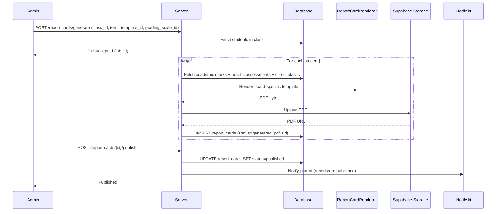
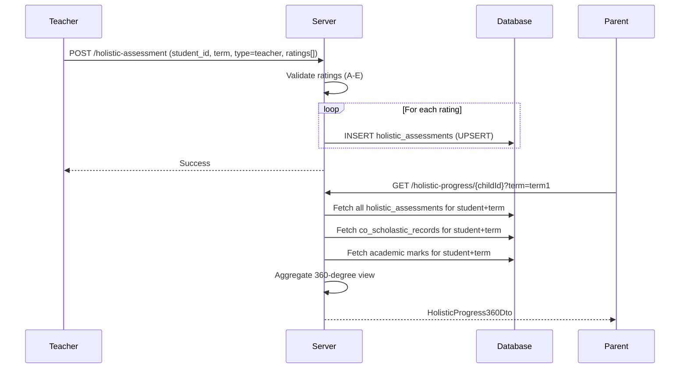

# NEP 2020 Compliance — Technical Specification

> **Document status:** Implementation-ready blueprint
> **Last updated:** 2026-06-28
> **Prerequisites:** None
> **Unblocks:** `AI_REPORT_CARD_SPEC.md`, `CURRICULUM_TEMPLATES_SPEC.md`, `APAAR_ID_SPEC.md`
> **Related specs:** `AI_REPORT_CARD_SPEC.md`, `CURRICULUM_TEMPLATES_SPEC.md`
> **Template:** `_SPEC_TEMPLATE.md` v1 (25 mandatory + 6 optional sections)

---

## 1. Feature Overview

### Purpose

Implementation of NEP 2020 (National Education Policy) compliance features: Holistic Progress Card (HPC), UDISE+ reporting, board-specific report card templates, competency-based grading scales, and 360-degree assessment framework.

### Business Value

- Compliance with NEP 2020 mandates for holistic, competency-based assessment
- Board-specific report cards (CBSE, ICSE, IB, State Boards) — critical for school accreditation
- UDISE+ annual data submission — mandatory for all schools in India
- 360-degree assessment provides comprehensive student evaluation beyond marks
- Co-scholastic tracking aligns with NEP's focus on arts, sports, life skills, values

### Goals

- [ ] Support NEP 2020's Holistic Progress Card with 360-degree assessment (self, peer, teacher, parent)
- [ ] Board-specific report card templates (CBSE, ICSE, IB, State Boards)
- [ ] Competency-based grading scales (replacing marks-only with letter grades + descriptors)
- [ ] UDISE+ annual data submission report generation
- [ ] Multi-lingual report card support
- [ ] Co-scholastic assessment tracking (arts, sports, life skills)

### Non-goals

- [ ] APAAR ID integration — future extensibility
- [ ] DIKSHA content alignment — future extensibility
- [ ] NIPUN Bharat — foundational literacy and numeracy tracking — future extensibility
- [ ] Multi-board comparison analytics — future extensibility
- [ ] Parent-teacher conference integration — future extensibility

### Dependencies

- `AssessmentsTable` + `AssessmentMarksTable` (existing — academic marks)
- `SchoolsTable` (existing — `board` and `gradingSystem` fields)
- `AcademicYearsTable` (existing — academic year management)
- `CurriculumUnitsTable` + `SyllabusProgressTable` (existing — curriculum tracking)
- `ParentAchievementsTable` (existing — partially aligns with HPC)
- Supabase Storage (for report card PDFs)

### Related Modules

- `AssessmentsTable` + `AssessmentMarksTable` — typed marks model
- `ExamResultsTable` (deprecated) — legacy string-scored marks model
- `SchoolsTable` — has `board` field (CBSE/ICSE/IB/State) and `gradingSystem` field
- `AcademicYearsTable` — academic year management
- `CurriculumUnitsTable` + `SyllabusProgressTable` — curriculum tracking
- `ParentAchievementsTable` — badges, competencies, EI metrics, missions

---

## 2. Current System Assessment

### Existing Code

- **`AssessmentsTable`** + **`AssessmentMarksTable`** — typed marks model with `maxMarks`, `marks` (Double), `isAbsent`, `remark`, `status` (draft→published)
- **`ExamResultsTable`** (deprecated) — legacy string-scored marks model
- **`SchoolsTable`** has `board` field (CBSE/ICSE/IB/State) and `gradingSystem` field
- **`AcademicYearsTable`** — academic year management
- **`CurriculumUnitsTable`** + **`SyllabusProgressTable`** — curriculum tracking
- **`ParentAchievementsTable`** — badges, competencies, EI metrics, missions (partially aligns with HPC)
- Report card generation is a **stub** (feature_audit.csv L23: 20%, "Report Cards" stub)

### Existing Database

- `assessments` + `assessment_marks` — typed marks model
- `exam_results` (deprecated) — legacy marks
- `schools` — has `board` and `gradingSystem` fields
- `academic_years` — academic year management
- `curriculum_units` + `syllabus_progress` — curriculum tracking
- `parent_achievements` — badges, competencies, EI metrics

### Existing APIs

- Existing assessment endpoints (marks entry, publishing)
- No HPC, report card, or UDISE+ endpoints exist

### Existing UI

- No HPC, report card, or UDISE+ UI screens exist

### Existing Services

- Assessment service (marks entry, publishing)
- No holistic assessment, report card, or UDISE+ services

### Existing Documentation

- `feature_audit.csv` L23: 20%, "Report Cards" stub

### Technical Debt

- No HPC (Holistic Progress Card) data model
- No 360-degree assessment (self/peer/teacher/parent evaluation)
- No board-specific report card templates
- No competency-based grading scale configuration
- No UDISE+ report generation
- No co-scholastic assessment tracking
- No cognitive/non-cognitive domain tracking
- Report card generation is a stub (20% complete)

### Gaps

| # | Gap | NEP Reference | Impact |
|---|---|---|---|
| G1 | No HPC data model | §4.34 | Non-compliant report cards |
| G2 | No 360-degree assessment | §4.34 | Missing holistic evaluation |
| G3 | No board templates | §4.28 | Cannot generate board-compliant cards |
| G4 | No competency grading | §4.33 | Marks-only, not competency-based |
| G5 | No UDISE+ reporting | MoE mandate | Non-compliance with annual data submission |
| G6 | No co-scholastic tracking | §4.27 | Missing arts/sports/life skills |
| G7 | No cognitive domain tracking | §4.30 | Missing NEP learning domains |

---

## 3. Functional Requirements

### FR-001
| Field | Value |
|---|---|
| **Title** | Grading Scale Configuration |
| **Description** | Admin can configure grading scale per school (letter grades with descriptors + percentage ranges) |
| **Priority** | Critical |
| **User Roles** | School Admin, Super Admin |
| **Acceptance notes** | Grading scale created with non-overlapping percentage ranges; marks → grade conversion works |

### FR-002
| Field | Value |
|---|---|
| **Title** | 360-Degree Assessment |
| **Description** | Support NEP 360-degree assessment: self-assessment, peer-assessment, teacher-assessment, parent-assessment |
| **Priority** | Critical |
| **User Roles** | Teacher, Parent, Student (self) |
| **Acceptance notes** | All four assessment types can be entered per student per term per competency |

### FR-003
| Field | Value |
|---|---|
| **Title** | Co-Scholastic Tracking |
| **Description** | Track co-scholastic domains: arts, sports, life skills, values, attitudes |
| **Priority** | High |
| **User Roles** | Teacher, School Admin |
| **Acceptance notes** | Co-scholastic records created per student per term with grade + evidence |

### FR-004
| Field | Value |
|---|---|
| **Title** | Cognitive Domain Tracking |
| **Description** | Track cognitive domains: language, numeracy, science, social awareness |
| **Priority** | High |
| **User Roles** | Teacher, School Admin |
| **Acceptance notes** | Cognitive competencies linked to assessments; tracked per term |

### FR-005
| Field | Value |
|---|---|
| **Title** | HPC Report Card Generation |
| **Description** | Generate HPC report card per student per term with all assessment dimensions |
| **Priority** | Critical |
| **User Roles** | School Admin, Super Admin |
| **Acceptance notes** | Report card includes academic + holistic + co-scholastic; PDF generated and stored |

### FR-006
| Field | Value |
|---|---|
| **Title** | Board-Specific Templates |
| **Description** | Board-specific template rendering (CBSE, ICSE, IB, State Board formats) |
| **Priority** | High |
| **User Roles** | Super Admin |
| **Acceptance notes** | Templates render correctly per board format with correct sections and layout |

### FR-007
| Field | Value |
|---|---|
| **Title** | UDISE+ Report Generation |
| **Description** | UDISE+ annual data report generation (enrollment, infrastructure, teacher, outcome metrics) |
| **Priority** | High |
| **User Roles** | School Admin, Super Admin |
| **Acceptance notes** | UDISE+ report data matches school's actual enrollment/teacher/infrastructure data |

### FR-008
| Field | Value |
|---|---|
| **Title** | Multi-lingual Report Cards |
| **Description** | Multi-lingual report card (in school's medium of instruction) |
| **Priority** | Medium |
| **User Roles** | School Admin |
| **Acceptance notes** | Report card rendered in school's medium of instruction language |

### FR-009
| Field | Value |
|---|---|
| **Title** | Competency Mapping |
| **Description** | Competency mapping: link assessments to NEP-defined competencies |
| **Priority** | High |
| **User Roles** | Teacher, School Admin |
| **Acceptance notes** | Assessments linked to NEP competencies; competency-level aggregation available |

### FR-010
| Field | Value |
|---|---|
| **Title** | Term-Based Progress Tracking |
| **Description** | Term/semester-based progress tracking with trend analysis |
| **Priority** | Medium |
| **User Roles** | Parent, Teacher, School Admin |
| **Acceptance notes** | Progress tracked across terms; trend analysis shows improvement/decline |

---

## 4. User Stories

### Parent
- [ ] View my child's Holistic Progress Card with 360-degree assessment so I see the complete picture
- [ ] Enter parent-assessment for my child's competencies so my perspective is included
- [ ] Download my child's report card PDF so I can share it
- [ ] View my child's co-scholastic achievements (arts, sports, life skills)
- [ ] See trend analysis across terms to track my child's progress

### Teacher
- [ ] Enter teacher assessment for students per competency so I can evaluate holistically
- [ ] Enter co-scholastic records for students (arts, sports, life skills)
- [ ] View 360-degree assessment results for my students
- [ ] Link assessments to NEP-defined competencies

### School Admin
- [ ] Configure grading scale for my school's board (CBSE/ICSE/IB/State)
- [ ] Generate report cards for an entire class in bulk
- [ ] Generate UDISE+ annual report with data from existing tables
- [ ] Publish report cards so parents can view them
- [ ] Review and submit UDISE+ report

### Super Admin
- [ ] Configure board-specific report card templates
- [ ] Manage NEP competency definitions
- [ ] Seed default grading scales for each board

---

## 5. Business Rules

### BR-001
**Rule:** Grading scale percentage ranges must be non-overlapping and cover 0-100.
**Enforcement:** Validation on `grade_levels` JSON ensures min < max and no overlapping ranges.

### BR-002
**Rule:** 360-degree assessment requires all four types (self, peer, teacher, parent) for a complete HPC.
**Enforcement:** `HolisticAssessmentService.get360View()` returns partial view if not all types present; flag indicates completeness.

### BR-003
**Rule:** Report card is unique per student per academic year per term.
**Enforcement:** `UNIQUE(school_id, student_id, academic_year_id, term)` constraint on `report_cards` table.

### BR-004
**Rule:** Report cards must be generated before publishing.
**Enforcement:** `report_cards.status` must be 'generated' before transition to 'published'.

### BR-005
**Rule:** UDISE+ report is unique per school per academic year.
**Enforcement:** `UNIQUE(school_id, academic_year_id)` constraint on `udise_reports` table.

### BR-006
**Rule:** Competency ratings are one of: A, B, C, D, E.
**Enforcement:** `CHECK` constraint or validation on `holistic_assessments.rating`.

### BR-007
**Rule:** Board templates can only be created/modified by Super Admin.
**Enforcement:** Role check on `POST/PATCH /super/whatsapp/templates` endpoints.

### BR-008
**Rule:** Bulk report card generation is async with progress tracking.
**Enforcement:** `ReportCardService.bulkGenerate()` returns job ID; status checked via endpoint.

### BR-009
**Rule:** Report card PDFs are stored in Supabase Storage and URL is accessible.
**Enforcement:** PDF generated → uploaded to Supabase → URL stored in `report_cards.pdf_url`.

### BR-010
**Rule:** NEP competencies are seeded and maintained in DB (not hardcoded).
**Enforcement:** `nep_competencies` table with `is_active` flag; admin can update without code change.

---

## 6. Database Design

### 6.1 Entity Relationship Summary

```
grading_scales 1───* report_cards (grading_scale_id)
report_card_templates 1───* report_cards (template_id)
nep_competencies 1───* holistic_assessments (competency_id)
nep_competencies 1───* assessments (competency_id, new column)
students 1───* holistic_assessments (student_id)
students 1───* co_scholastic_records (student_id)
students 1───* report_cards (student_id)
academic_years 1───* holistic_assessments (academic_year_id)
academic_years 1───* co_scholastic_records (academic_year_id)
academic_years 1───* report_cards (academic_year_id)
academic_years 1───* udise_reports (academic_year_id)
schools 1───* grading_scales (school_id)
schools 1───* udise_reports (school_id)
```

### 6.2 New Tables

```sql
CREATE TABLE grading_scales (
    id              UUID PRIMARY KEY DEFAULT gen_random_uuid(),
    school_id       UUID NOT NULL,
    name            TEXT NOT NULL,                 -- "CBSE Secondary", "ICSE Primary"
    board           VARCHAR(16) NOT NULL,          -- CBSE | ICSE | IB | STATE
    grade_levels    TEXT NOT NULL,                 -- JSON: [{"grade":"A1","min":91,"max":100,"descriptor":"Outstanding"}, ...]
    is_active       BOOLEAN NOT NULL DEFAULT true,
    created_at      TIMESTAMP NOT NULL DEFAULT now(),
    updated_at      TIMESTAMP NOT NULL DEFAULT now()
);
```

```sql
CREATE TABLE nep_competencies (
    id              UUID PRIMARY KEY DEFAULT gen_random_uuid(),
    code            VARCHAR(32) NOT NULL UNIQUE,   -- "LANG.1", "NUM.3", "ARTS.2"
    domain          VARCHAR(32) NOT NULL,          -- cognitive | co_scholastic
    sub_domain      VARCHAR(32) NOT NULL,          -- language | numeracy | science | arts | sports | life_skills | values
    name            TEXT NOT NULL,
    description     TEXT,
    grade_level     VARCHAR(16),                   -- "Primary", "Upper Primary", "Secondary"
    is_active       BOOLEAN NOT NULL DEFAULT true,
    created_at      TIMESTAMP NOT NULL DEFAULT now()
);
```

```sql
CREATE TABLE holistic_assessments (
    id              UUID PRIMARY KEY DEFAULT gen_random_uuid(),
    school_id       UUID NOT NULL,
    student_id      UUID NOT NULL,                 -- FK students.id
    academic_year_id UUID NOT NULL REFERENCES academic_years(id),
    term            VARCHAR(16) NOT NULL,          -- term1 | term2 | term3 | annual
    assessment_type VARCHAR(16) NOT NULL,          -- self | peer | teacher | parent
    assessor_id     UUID,                          -- FK app_users.id (teacher/parent who assessed)
    competency_id   UUID REFERENCES nep_competencies(id),
    rating          VARCHAR(8) NOT NULL,           -- A | B | C | D | E (or numeric scale)
    evidence        TEXT,                          -- qualitative observation
    created_at      TIMESTAMP NOT NULL DEFAULT now(),
    updated_at      TIMESTAMP NOT NULL DEFAULT now(),
    UNIQUE(school_id, student_id, academic_year_id, term, assessment_type, competency_id)
);
CREATE INDEX idx_holistic_student_term ON holistic_assessments(student_id, term);
```

```sql
CREATE TABLE co_scholastic_records (
    id              UUID PRIMARY KEY DEFAULT gen_random_uuid(),
    school_id       UUID NOT NULL,
    student_id      UUID NOT NULL,
    academic_year_id UUID NOT NULL REFERENCES academic_years(id),
    term            VARCHAR(16) NOT NULL,
    domain          VARCHAR(32) NOT NULL,          -- arts | sports | life_skills | values | attitudes
    sub_domain      TEXT,                          -- "Music", "Football", "Leadership", "Honesty"
    grade           VARCHAR(8),                    -- A | B | C | D
    teacher_remark  TEXT,
    evidence_url    TEXT,                          -- photo/video/document URL
    assessed_by     UUID,
    created_at      TIMESTAMP NOT NULL DEFAULT now(),
    updated_at      TIMESTAMP NOT NULL DEFAULT now()
);
CREATE INDEX idx_cosch_student ON co_scholastic_records(student_id, academic_year_id, term);
```

```sql
CREATE TABLE report_card_templates (
    id              UUID PRIMARY KEY DEFAULT gen_random_uuid(),
    board           VARCHAR(16) NOT NULL,          -- CBSE | ICSE | IB | STATE
    name            TEXT NOT NULL,                 -- "CBSE HPC Secondary 2026"
    template_config TEXT NOT NULL,                 -- JSON: sections, fields, layout, grading_scale_id
    language        VARCHAR(8) NOT NULL DEFAULT 'en',
    is_active       BOOLEAN NOT NULL DEFAULT true,
    created_at      TIMESTAMP NOT NULL DEFAULT now(),
    updated_at      TIMESTAMP NOT NULL DEFAULT now()
);
```

```sql
CREATE TABLE report_cards (
    id              UUID PRIMARY KEY DEFAULT gen_random_uuid(),
    school_id       UUID NOT NULL,
    student_id      UUID NOT NULL,
    academic_year_id UUID NOT NULL REFERENCES academic_years(id),
    term            VARCHAR(16) NOT NULL,
    template_id     UUID REFERENCES report_card_templates(id),
    grading_scale_id UUID REFERENCES grading_scales(id),
    status          VARCHAR(16) NOT NULL DEFAULT 'draft', -- draft | generated | published | archived
    pdf_url         TEXT,                          -- Supabase Storage URL
    generated_by    UUID,
    published_at    TIMESTAMP,
    created_at      TIMESTAMP NOT NULL DEFAULT now(),
    updated_at      TIMESTAMP NOT NULL DEFAULT now(),
    UNIQUE(school_id, student_id, academic_year_id, term)
);
CREATE INDEX idx_report_cards_school_term ON report_cards(school_id, academic_year_id, term);
```

```sql
CREATE TABLE udise_reports (
    id              UUID PRIMARY KEY DEFAULT gen_random_uuid(),
    school_id       UUID NOT NULL,
    academic_year_id UUID NOT NULL REFERENCES academic_years(id),
    report_data     TEXT NOT NULL,                 -- JSON: all UDISE+ fields
    status          VARCHAR(16) NOT NULL DEFAULT 'draft', -- draft | submitted | archived
    submitted_at    TIMESTAMP,
    created_at      TIMESTAMP NOT NULL DEFAULT now(),
    updated_at      TIMESTAMP NOT NULL DEFAULT now(),
    UNIQUE(school_id, academic_year_id)
);
```

### 6.3 Modified Tables

```sql
ALTER TABLE assessments ADD COLUMN competency_id UUID;
ALTER TABLE assessments ADD COLUMN grading_scale_id UUID;
```

### 6.4 Indexes

| Index | Table | Columns | Purpose |
|---|---|---|---|
| `idx_holistic_student_term` | `holistic_assessments` | `student_id, term` | Query assessments by student + term |
| `idx_cosch_student` | `co_scholastic_records` | `student_id, academic_year_id, term` | Query co-scholastic by student |
| `idx_report_cards_school_term` | `report_cards` | `school_id, academic_year_id, term` | Query report cards by school + term |

### 6.5 Constraints

| Constraint | Table | Rule |
|---|---|---|
| `UNIQUE` | `nep_competencies` | `code` — unique competency code |
| `UNIQUE` | `holistic_assessments` | `(school_id, student_id, academic_year_id, term, assessment_type, competency_id)` |
| `UNIQUE` | `report_cards` | `(school_id, student_id, academic_year_id, term)` |
| `UNIQUE` | `udise_reports` | `(school_id, academic_year_id)` |

### 6.6 Foreign Keys

| Table | Column | References |
|---|---|---|
| `grading_scales` | `school_id` | `schools.id` |
| `holistic_assessments` | `academic_year_id` | `academic_years.id` |
| `holistic_assessments` | `competency_id` | `nep_competencies.id` (nullable) |
| `co_scholastic_records` | `academic_year_id` | `academic_years.id` |
| `report_cards` | `academic_year_id` | `academic_years.id` |
| `report_cards` | `template_id` | `report_card_templates.id` (nullable) |
| `report_cards` | `grading_scale_id` | `grading_scales.id` (nullable) |
| `udise_reports` | `academic_year_id` | `academic_years.id` |
| `assessments` (modified) | `competency_id` | `nep_competencies.id` (nullable, new) |
| `assessments` (modified) | `grading_scale_id` | `grading_scales.id` (nullable, new) |

### 6.7 Soft Delete Strategy

- `grading_scales`: Soft delete via `is_active = false`
- `nep_competencies`: Soft delete via `is_active = false`
- `report_card_templates`: Soft delete via `is_active = false`
- `report_cards`: Status `archived` (not deleted)
- `holistic_assessments`: No soft delete (immutable assessment records)
- `co_scholastic_records`: No soft delete (immutable assessment records)
- `udise_reports`: Status `archived` (not deleted)

### 6.8 Audit Fields

| Table | `created_at` | `updated_at` | Other |
|---|---|---|---|
| `grading_scales` | ✅ | ✅ | `is_active` |
| `nep_competencies` | ✅ | — | `is_active` |
| `holistic_assessments` | ✅ | ✅ | `assessor_id` |
| `co_scholastic_records` | ✅ | ✅ | `assessed_by` |
| `report_card_templates` | ✅ | ✅ | `is_active` |
| `report_cards` | ✅ | ✅ | `generated_by`, `published_at`, `status` |
| `udise_reports` | ✅ | ✅ | `submitted_at`, `status` |

### 6.9 Migration Notes

- **Migration file:** `docs/db/migration_035_nep_compliance.sql`
- **Rollback:** See §E. Migration & Rollback
- **Backfill:** No existing data to backfill — new tables start empty
- **Seed data:** NEP competencies (cognitive + co-scholastic), default grading scales (CBSE, ICSE, IB), default report card templates per board

### 6.10 Exposed Mappings

```kotlin
object GradingScalesTable : UUIDTable("grading_scales", "id") {
    val schoolId    = uuid("school_id")
    val name        = text("name")
    val board       = varchar("board", 16)
    val gradeLevels = text("grade_levels")          // JSON
    val isActive    = bool("is_active").default(true)
    val createdAt   = timestamp("created_at")
    val updatedAt   = timestamp("updated_at")
}

object NepCompetenciesTable : UUIDTable("nep_competencies", "id") {
    val code        = varchar("code", 32).uniqueIndex()
    val domain      = varchar("domain", 32)
    val subDomain   = varchar("sub_domain", 32)
    val name        = text("name")
    val description = text("description").nullable()
    val gradeLevel  = varchar("grade_level", 16).nullable()
    val isActive    = bool("is_active").default(true)
    val createdAt   = timestamp("created_at")
}

object HolisticAssessmentsTable : UUIDTable("holistic_assessments", "id") {
    val schoolId       = uuid("school_id")
    val studentId      = uuid("student_id")
    val academicYearId = uuid("academic_year_id")
    val term           = varchar("term", 16)
    val assessmentType = varchar("assessment_type", 16)
    val assessorId     = uuid("assessor_id").nullable()
    val competencyId   = uuid("competency_id").nullable()
    val rating         = varchar("rating", 8)
    val evidence       = text("evidence").nullable()
    val createdAt      = timestamp("created_at")
    val updatedAt      = timestamp("updated_at")
    init {
        uniqueIndex("ux_holistic_unique", schoolId, studentId, academicYearId, term, assessmentType, competencyId)
        index("idx_holistic_student_term", false, studentId, term)
    }
}

object CoScholasticRecordsTable : UUIDTable("co_scholastic_records", "id") {
    val schoolId       = uuid("school_id")
    val studentId      = uuid("student_id")
    val academicYearId = uuid("academic_year_id")
    val term           = varchar("term", 16)
    val domain         = varchar("domain", 32)
    val subDomain      = text("sub_domain").nullable()
    val grade          = varchar("grade", 8).nullable()
    val teacherRemark  = text("teacher_remark").nullable()
    val evidenceUrl    = text("evidence_url").nullable()
    val assessedBy     = uuid("assessed_by").nullable()
    val createdAt      = timestamp("created_at")
    val updatedAt      = timestamp("updated_at")
    init { index("idx_cosch_student", false, studentId, academicYearId, term) }
}

object ReportCardTemplatesTable : UUIDTable("report_card_templates", "id") {
    val board          = varchar("board", 16)
    val name           = text("name")
    val templateConfig = text("template_config")    // JSON
    val language       = varchar("language", 8).default("en")
    val isActive       = bool("is_active").default(true)
    val createdAt      = timestamp("created_at")
    val updatedAt      = timestamp("updated_at")
}

object ReportCardsTable : UUIDTable("report_cards", "id") {
    val schoolId       = uuid("school_id")
    val studentId      = uuid("student_id")
    val academicYearId = uuid("academic_year_id")
    val term           = varchar("term", 16)
    val templateId     = uuid("template_id").nullable()
    val gradingScaleId = uuid("grading_scale_id").nullable()
    val status         = varchar("status", 16).default("draft")
    val pdfUrl         = text("pdf_url").nullable()
    val generatedBy    = uuid("generated_by").nullable()
    val publishedAt    = timestamp("published_at").nullable()
    val createdAt      = timestamp("created_at")
    val updatedAt      = timestamp("updated_at")
    init {
        uniqueIndex("ux_report_cards_unique", schoolId, studentId, academicYearId, term)
        index("idx_report_cards_school_term", false, schoolId, academicYearId, term)
    }
}

object UdiseReportsTable : UUIDTable("udise_reports", "id") {
    val schoolId       = uuid("school_id")
    val academicYearId = uuid("academic_year_id")
    val reportData     = text("report_data")        // JSON
    val status         = varchar("status", 16).default("draft")
    val submittedAt    = timestamp("submitted_at").nullable()
    val createdAt      = timestamp("created_at")
    val updatedAt      = timestamp("updated_at")
    init { uniqueIndex("ux_udise_unique", schoolId, academicYearId) }
}
```

### 6.11 Seed Data

Seed `nep_competencies` with NEP 2020 defined competencies:
- Cognitive: Language & Literacy (LANG.1-5), Numeracy & Math (NUM.1-5), Science (SCI.1-3), Social Awareness (SOC.1-3)
- Co-scholastic: Arts (ARTS.1-3), Sports (SPT.1-3), Life Skills (LS.1-5), Values (VAL.1-5)

Seed default grading scales for CBSE, ICSE, IB.

Seed default report card templates per board.

---

## 7. State Machines

### Report Card State Machine

```
draft ──generate──> generated ──publish──> published ──archive──> archived
                        │
                        └──regenerate──> generated (new PDF)
```

| Current State | Event | Next State | Guard / Condition |
|---|---|---|---|
| `draft` | Generate (bulk or individual) | `generated` | Template + grading scale selected |
| `generated` | Publish | `published` | Admin action; sets `published_at` |
| `generated` | Regenerate | `generated` | New PDF replaces old |
| `published` | Archive | `archived` | Admin action (old term reports) |

### UDISE+ Report State Machine

```
draft ──submit──> submitted ──archive──> archived
```

| Current State | Event | Next State | Guard / Condition |
|---|---|---|---|
| `draft` | Generate draft | `draft` | Data aggregated from existing tables |
| `draft` | Submit | `submitted` | Admin action; sets `submitted_at` |
| `submitted` | Archive | `archived` | New academic year report created |

---

## 8. Backend Architecture

### 8.1 Component Overview

```
┌──────────────────────────────────────────────────────┐
│              Admin / Teacher / Parent                  │
│  (Assessment entry, Report card generation, HPC view) │
└──────────────────┬───────────────────────────────────┘
                   │
                   ▼
┌──────────────────────────────────────────────────────┐
│              NepRouting (API endpoints)                │
│  - Grading Scale CRUD                                 │
│  - Holistic Assessment entry + 360 view               │
│  - Co-Scholastic entry + view                         │
│  - Report Card generate + publish + access            │
│  - UDISE+ report generate + submit                    │
└──────────────────┬───────────────────────────────────┘
                   │
                   ▼
┌──────────────────────────────────────────────────────┐
│              Services                                  │
│  - GradingScaleService (CRUD + marks→grade)           │
│  - HolisticAssessmentService (entry + 360 view)       │
│  - CoScholasticService (entry + view)                 │
│  - ReportCardService (generate + publish + bulk)      │
│  - ReportCardRenderer (board-specific PDF)            │
│  - UdiseReportService (data aggregation + submit)     │
└──────────────────┬───────────────────────────────────┘
                   │
                   ▼
┌──────────────────────────────────────────────────────┐
│              Database (Exposed ORM)                    │
│  - 7 new tables + modified assessments                │
│  - Seed competencies + grading scales + templates     │
└──────────────────────────────────────────────────────┘
```

### 8.2 Repositories

```kotlin
class GradingScaleRepository {
    suspend fun create(scale: GradingScale): GradingScale
    suspend fun getById(id: UUID): GradingScale?
    suspend fun getForSchool(schoolId: UUID): List<GradingScale>
    suspend fun update(id: UUID, scale: GradingScale): GradingScale
}
class HolisticAssessmentRepository {
    suspend fun create(assessment: HolisticAssessment): HolisticAssessment
    suspend fun getForStudent(studentId: UUID, term: String): List<HolisticAssessment>
    suspend fun get360View(studentId: UUID, term: String): List<HolisticAssessment>
}
class CoScholasticRepository {
    suspend fun create(record: CoScholasticRecord): CoScholasticRecord
    suspend fun getForStudent(studentId: UUID, term: String): List<CoScholasticRecord>
}
class ReportCardRepository {
    suspend fun create(card: ReportCard): ReportCard
    suspend fun getById(id: UUID): ReportCard?
    suspend fun getForStudent(studentId: UUID): List<ReportCard>
    suspend fun updateStatus(id: UUID, status: String): ReportCard
    suspend fun getForSchoolAndTerm(schoolId: UUID, term: String): List<ReportCard>
}
class UdiseReportRepository {
    suspend fun create(report: UdiseReport): UdiseReport
    suspend fun getById(id: UUID): UdiseReport?
    suspend fun getForSchool(schoolId: UUID): List<UdiseReport>
    suspend fun updateStatus(id: UUID, status: String): UdiseReport
}
```

### 8.3 Services

```kotlin
class GradingScaleService {
    suspend fun create(schoolId: UUID, request: CreateGradingScaleRequest): GradingScaleDto
    suspend fun getForSchool(schoolId: UUID): List<GradingScaleDto>
    suspend fun convertMarksToGrade(gradingScaleId: UUID, percentage: Double): GradeLevel
}
class HolisticAssessmentService {
    suspend fun enterAssessment(request: HolisticAssessmentRequest): HolisticAssessmentDto
    suspend fun getStudentAssessments(studentId: UUID, term: String): List<HolisticAssessmentDto>
    suspend fun get360View(studentId: UUID, term: String): HolisticProgress360Dto
}
class CoScholasticService {
    suspend fun enterRecord(request: CoScholasticRequest): CoScholasticDto
    suspend fun getStudentRecords(studentId: UUID, term: String): List<CoScholasticDto>
}
class ReportCardService {
    suspend fun generate(schoolId: UUID, studentId: UUID, term: String, templateId: UUID): ReportCardDto
    suspend fun publish(reportCardId: UUID): ReportCardDto
    suspend fun getForStudent(studentId: UUID): List<ReportCardDto>
    suspend fun bulkGenerate(schoolId: UUID, classId: UUID, term: String): UUID  // batch job
}
class UdiseReportService {
    suspend fun generateDraft(schoolId: UUID, academicYearId: UUID): UdiseReportDto
    suspend fun submit(reportId: UUID): UdiseReportDto
    suspend fun getForSchool(schoolId: UUID): List<UdiseReportDto>
}
```

### 8.4 Validators

| Field | Rule |
|---|---|
| `grade_levels` | JSON array, each item has grade, min, max, descriptor; min < max; ranges non-overlapping |
| `rating` | One of: A, B, C, D, E |
| `term` | One of: term1, term2, term3, annual |
| `assessment_type` | One of: self, peer, teacher, parent |
| `domain` (co-scholastic) | One of: arts, sports, life_skills, values, attitudes |
| `board` | One of: CBSE, ICSE, IB, STATE |

### 8.5 Mappers

```kotlin
fun GradingScale.toDto(): GradingScaleDto
fun HolisticAssessment.toDto(): HolisticAssessmentDto
fun CoScholasticRecord.toDto(): CoScholasticDto
fun ReportCard.toDto(): ReportCardDto
fun UdiseReport.toDto(): UdiseReportDto
fun CreateGradingScaleRequest.toEntity(): GradingScale
fun HolisticAssessmentRequest.toEntity(): HolisticAssessment
```

### 8.6 Permission Checks

| Endpoint | Role Check | School Isolation |
|---|---|---|
| `GET/POST/PATCH /school/grading-scales` | School Admin / Super Admin | School ID from JWT |
| `POST /teacher/holistic-assessment` | Teacher / School Admin / Super Admin | School ID from JWT |
| `GET /parent/holistic-progress/{childId}` | Parent only | Own child only |
| `POST /school/report-cards/generate` | School Admin / Super Admin | School ID from JWT |
| `POST /school/report-cards/{id}/publish` | School Admin / Super Admin | School ID from JWT |
| `GET /parent/report-cards/{childId}` | Parent only | Own child only |
| `POST /school/udise-report/generate` | School Admin / Super Admin | School ID from JWT |
| `POST /school/udise-report/{id}/submit` | School Admin / Super Admin | School ID from JWT |

### 8.7 Background Jobs

| Job | Schedule | Description | Error handling |
|---|---|---|---|
| Bulk report card generation | Async (on demand) | Generate report cards for entire class | Batch processing; log per-student failures; continue |
| UDISE+ data aggregation | Async (on demand) | Aggregate data from existing tables | Log errors; partial data if some tables unavailable |

### 8.8 Domain Events

| Event | Emitted By | Consumed By | Side Effect |
|---|---|---|---|
| `ReportCardGenerated` | `ReportCardService.generate()` | `report_cards` INSERT | PDF created, status='generated' |
| `ReportCardPublished` | `ReportCardService.publish()` | `Notify.kt` | Parent notification with deep link |
| `UdiseReportGenerated` | `UdiseReportService.generateDraft()` | `udise_reports` INSERT | Report data aggregated |
| `UdiseReportSubmitted` | `UdiseReportService.submit()` | `udise_reports` UPDATE | Status='submitted', `submitted_at` set |
| `HolisticAssessmentEntered` | `HolisticAssessmentService` | `holistic_assessments` INSERT | Assessment stored |

### 8.9 Caching

- Grading scales cached per school (refreshed on update)
- NEP competencies cached globally (refreshed on update)
- Report card templates cached per board (refreshed on update)

### 8.10 Transactions

| Operation | Transaction Scope |
|---|---|
| Enter holistic assessment | `holistic_assessments` INSERT (batch for multiple competencies) |
| Generate report card | `report_cards` INSERT/UPDATE + Supabase upload (async) |
| Bulk generate | `report_cards` INSERT (batch per student) |
| UDISE+ generate | `udise_reports` INSERT (single JSON blob) |

### 8.11 Report Card Generation Flow

```
1. Admin selects class + term → POST /report-cards/generate
2. For each student:
   a. Fetch academic marks (AssessmentsTable + AssessmentMarksTable)
   b. Fetch holistic assessments (360-degree)
   c. Fetch co-scholastic records
   d. Apply grading scale conversion
   e. Render template (board-specific layout)
   f. Generate PDF → upload to Supabase Storage
   g. Create report_cards row (status='generated')
3. Admin reviews → publishes (status='published')
4. Parent notification sent with deep link to report card
```

### 8.12 UDISE+ Report Generation

Aggregates data from existing tables:
- **Enrollment:** `students` + `enrollments` (total, by gender, by class, by category)
- **Infrastructure:** `schools` fields (type, board, medium, gender)
- **Teachers:** `faculty` + `app_users` (count, by qualification)
- **Outcomes:** `assessments` + `attendance_records` (pass rate, attendance rate)
- **Facilities:** from `schools` extended fields (if available)

Output: JSON matching UDISE+ DCF (Data Capture Format) schema.

---

## 9. API Contracts

### 9.1 Grading Scale

#### `GET /api/v1/school/grading-scales`
| Field | Value |
|---|---|
| **Description** | List grading scales for school |
| **Authorization** | School Admin / Super Admin |
| **Rate Limit** | 60/min |
| **200 Response** | `List<GradingScaleDto>` |

#### `POST /api/v1/school/grading-scales`
| Field | Value |
|---|---|
| **Description** | Create grading scale |
| **Authorization** | School Admin / Super Admin |
| **Rate Limit** | 10/min |
| **201 Response** | `GradingScaleDto` |
| **Errors** | 400 `VALIDATION_ERROR` (overlapping ranges) |

#### `PATCH /api/v1/school/grading-scales/{id}`
| Field | Value |
|---|---|
| **Description** | Update grading scale |
| **Authorization** | School Admin / Super Admin |
| **Rate Limit** | 10/min |

### 9.2 Holistic Assessment

#### `POST /api/v1/teacher/holistic-assessment`
| Field | Value |
|---|---|
| **Description** | Enter holistic assessment (teacher/parent/self/peer) |
| **Authorization** | Teacher / Parent (for parent type) |
| **Rate Limit** | 30/min |
| **201 Response** | `HolisticAssessmentDto` |

```json
{
  "student_id": "uuid",
  "academic_year_id": "uuid",
  "term": "term1",
  "assessment_type": "teacher",
  "ratings": [
    {"competency_id": "uuid", "rating": "A", "evidence": "Excellent language skills"},
    {"competency_id": "uuid", "rating": "B", "evidence": "Good numeracy"}
  ]
}
```

#### `GET /api/v1/parent/holistic-progress/{childId}?term=term1`
| Field | Value |
|---|---|
| **Description** | Get 360-degree holistic progress view for child |
| **Authorization** | Parent only (own child) |
| **Rate Limit** | 60/min |
| **200 Response** | `HolisticProgress360Dto` |

```json
{
  "success": true,
  "data": {
    "student_name": "Aarav Sharma",
    "term": "term1",
    "cognitive": [
      {
        "competency": "Language & Literacy",
        "self": "A",
        "peer": "A",
        "teacher": "A",
        "parent": "A",
        "average": "A"
      }
    ],
    "co_scholastic": [
      {"domain": "Arts", "sub_domain": "Music", "grade": "A", "remark": "Participated in annual day"}
    ],
    "academic_summary": [
      {"subject": "Mathematics", "marks": 85, "grade": "A2", "max_marks": 100}
    ]
  }
}
```

### 9.3 Report Card Generation

#### `POST /api/v1/school/report-cards/generate`
| Field | Value |
|---|---|
| **Description** | Generate report cards for a class (bulk, async) |
| **Authorization** | School Admin / Super Admin |
| **Rate Limit** | 5/min |
| **202 Response** | `{"job_id": "uuid"}` |

```json
{
  "class_id": "uuid",
  "term": "term1",
  "template_id": "uuid",
  "grading_scale_id": "uuid"
}
```

#### `GET /api/v1/school/report-cards/generate/{jobId}/status`
| Field | Value |
|---|---|
| **Description** | Check bulk generation job status |
| **Authorization** | School Admin / Super Admin |
| **Rate Limit** | 30/min |
| **200 Response** | `{"status": "completed", "total": 45, "generated": 45, "failed": 0}` |

### 9.4 Report Card Access

#### `GET /api/v1/parent/report-cards/{childId}`
| Field | Value |
|---|---|
| **Description** | List report cards for child |
| **Authorization** | Parent only (own child) |
| **Rate Limit** | 60/min |
| **200 Response** | `List<ReportCardDto>` |

#### `GET /api/v1/school/report-cards/{studentId}`
| Field | Value |
|---|---|
| **Description** | List report cards for student |
| **Authorization** | School Admin / Super Admin / Teacher |
| **Rate Limit** | 60/min |
| **200 Response** | `List<ReportCardDto>` |

#### `GET /api/v1/school/report-cards/{id}/pdf`
| Field | Value |
|---|---|
| **Description** | Download report card PDF |
| **Authorization** | School Admin / Super Admin / Parent (own child) |
| **Rate Limit** | 30/min |
| **200 Response** | Binary PDF (redirect to Supabase URL) |

#### `POST /api/v1/school/report-cards/{id}/publish`
| Field | Value |
|---|---|
| **Description** | Publish report card (make visible to parent) |
| **Authorization** | School Admin / Super Admin |
| **Rate Limit** | 10/min |
| **200 Response** | `ReportCardDto` (status='published') |

### 9.5 UDISE+ Report

#### `GET /api/v1/school/udise-report?academic_year_id={uuid}`
| Field | Value |
|---|---|
| **Description** | Get UDISE+ report for academic year |
| **Authorization** | School Admin / Super Admin |
| **Rate Limit** | 30/min |
| **200 Response** | `UdiseReportDto` |

#### `POST /api/v1/school/udise-report/generate?academic_year_id={uuid}`
| Field | Value |
|---|---|
| **Description** | Generate UDISE+ report draft (aggregates data) |
| **Authorization** | School Admin / Super Admin |
| **Rate Limit** | 5/min |
| **201 Response** | `UdiseReportDto` (status='draft') |

#### `POST /api/v1/school/udise-report/{id}/submit`
| Field | Value |
|---|---|
| **Description** | Submit UDISE+ report |
| **Authorization** | School Admin / Super Admin |
| **Rate Limit** | 5/min |
| **200 Response** | `UdiseReportDto` (status='submitted') |

---

## 10. Frontend Architecture

### 10.1 Screens

| Screen | Platform | Role | Description |
|---|---|---|---|
| `HolisticAssessmentScreen` | Android/iOS | Teacher | Enter 360-degree assessments per student |
| `HolisticProgressScreen` | Android/iOS | Parent | View child's 360-degree HPC |
| `ReportCardGenerationScreen` | Android/iOS/Web | Admin | Generate + publish report cards for class |
| `ReportCardViewerScreen` | Android/iOS | Parent/Admin | View and download report card PDF |
| `UdiseReportScreen` | Android/iOS/Web | Admin | Generate + submit UDISE+ report |
| `GradingScaleConfigScreen` | Android/iOS/Web | Admin | Configure grading scales |
| `CoScholasticEntryScreen` | Android/iOS | Teacher | Enter co-scholastic records |

### 10.2 Navigation

```
School Portal → Academics → Report Cards → ReportCardGenerationScreen
  → "UDISE+" → UdiseReportScreen
  → "Grading Scales" → GradingScaleConfigScreen

Teacher Portal → Assessments → Holistic Assessment → HolisticAssessmentScreen
  → "Co-Scholastic" → CoScholasticEntryScreen

Parent Portal → Academics → Holistic Progress → HolisticProgressScreen
  → "Report Cards" → ReportCardViewerScreen
```

### 10.3 UX Flows

#### Admin Report Card Generation Flow
```
Report Cards → Select class + term → Select template + grading scale → Generate
  → Wait for batch job → Review generated cards → Publish → Parents notified
```

#### Teacher Holistic Assessment Flow
```
Holistic Assessment → Select student → Select competency → Enter rating + evidence
  → Save → Next competency
```

### 10.4 State Management

```kotlin
sealed class ReportCardGenerationState {
    object Idle : ReportCardGenerationState()
    data class Generating(val jobId: UUID, val progress: Int) : ReportCardGenerationState()
    object Generated : ReportCardGenerationState()
    object Publishing : ReportCardGenerationState()
    object Published : ReportCardGenerationState()
    data class Error(val message: String) : ReportCardGenerationState()
}
```

### 10.5 Offline Support

- HPC view cached locally for offline viewing (read-only)
- Report card PDFs cached locally after download
- Assessment entry requires internet (no offline entry)
- UDISE+ report generation requires internet

### 10.6 Loading States

- HPC: skeleton loaders while fetching 360-degree data
- Report card generation: progress bar with percentage
- UDISE+ report: spinner during data aggregation

### 10.7 Error Handling (UI)

- Grading scale validation: "Percentage ranges overlap" inline error
- Report card already exists: "Report card already generated for this term"
- UDISE+ data incomplete: "Some data sources unavailable. Report may be incomplete."
- PDF generation failed: "Failed to generate PDF. Please retry."

### 10.8 Search & Filtering

- Report cards: filter by term, class, status
- Holistic assessments: filter by term, competency, assessment type
- UDISE+ reports: filter by academic year

### 10.10 Pagination

- Report cards list: cursor-based, 20 per page
- Holistic assessments: no pagination (per student per term, typically < 50)

---

## 11. Shared Module Changes (KMP)

### 11.1 DTOs

```kotlin
@Serializable
data class GradingScaleDto(val id: String, val schoolId: String, val name: String,
    val board: String, val gradeLevels: String, val isActive: Boolean)
@Serializable
data class HolisticAssessmentDto(val id: String, val studentId: String, val term: String,
    val assessmentType: String, val competencyId: String?, val rating: String, val evidence: String?)
@Serializable
data class HolisticProgress360Dto(val studentName: String, val term: String,
    val cognitive: List<CognitiveEntry>, val coScholastic: List<CoScholasticEntry>,
    val academicSummary: List<AcademicSummaryEntry>)
@Serializable
data class CoScholasticDto(val id: String, val studentId: String, val term: String,
    val domain: String, val subDomain: String?, val grade: String?, val teacherRemark: String?)
@Serializable
data class ReportCardDto(val id: String, val studentId: String, val term: String,
    val status: String, val pdfUrl: String?, val publishedAt: String?)
@Serializable
data class UdiseReportDto(val id: String, val schoolId: String, val academicYearId: String,
    val reportData: String, val status: String, val submittedAt: String?)
@Serializable
data class CreateGradingScaleRequest(val name: String, val board: String, val gradeLevels: String)
@Serializable
data class HolisticAssessmentRequest(val studentId: String, val academicYearId: String,
    val term: String, val assessmentType: String, val ratings: List<RatingEntry>)
@Serializable
data class GenerateReportCardRequest(val classId: String, val term: String,
    val templateId: String, val gradingScaleId: String)
```

### 11.2 Domain Models

```kotlin
data class GradingScale(val id: UUID, val schoolId: UUID, val name: String, val board: Board,
    val gradeLevels: List<GradeLevel>, val isActive: Boolean)
data class HolisticAssessment(val id: UUID, val studentId: UUID, val term: Term,
    val assessmentType: AssessmentType, val competencyId: UUID?, val rating: Rating, val evidence: String?)
data class ReportCard(val id: UUID, val studentId: UUID, val term: Term, val status: ReportCardStatus,
    val pdfUrl: String?, val publishedAt: Timestamp?)
data class UdiseReport(val id: UUID, val schoolId: UUID, val academicYearId: UUID,
    val reportData: String, val status: UdiseReportStatus, val submittedAt: Timestamp?)
enum class Board { CBSE, ICSE, IB, STATE }
enum class Term { TERM1, TERM2, TERM3, ANNUAL }
enum class AssessmentType { SELF, PEER, TEACHER, PARENT }
enum class Rating { A, B, C, D, E }
enum class ReportCardStatus { DRAFT, GENERATED, PUBLISHED, ARCHIVED }
enum class UdiseReportStatus { DRAFT, SUBMITTED, ARCHIVED }
```

### 11.3 Repository Interfaces

```kotlin
interface NepRepository {
    suspend fun getGradingScales(): NetworkResult<List<GradingScaleDto>>
    suspend fun createGradingScale(request: CreateGradingScaleRequest): NetworkResult<GradingScaleDto>
    suspend fun getHolisticProgress(childId: String, term: String): NetworkResult<HolisticProgress360Dto>
    suspend fun enterHolisticAssessment(request: HolisticAssessmentRequest): NetworkResult<HolisticAssessmentDto>
    suspend fun getReportCards(childId: String): NetworkResult<List<ReportCardDto>>
    suspend fun generateReportCards(request: GenerateReportCardRequest): NetworkResult<JobStatusDto>
    suspend fun publishReportCard(id: String): NetworkResult<ReportCardDto>
    suspend fun getUdiseReport(academicYearId: String): NetworkResult<UdiseReportDto>
    suspend fun generateUdiseReport(academicYearId: String): NetworkResult<UdiseReportDto>
    suspend fun submitUdiseReport(id: String): NetworkResult<UdiseReportDto>
}
```

### 11.4 UseCases

```kotlin
class GetGradingScalesUseCase(private val repo: NepRepository)
class CreateGradingScaleUseCase(private val repo: NepRepository)
class GetHolisticProgressUseCase(private val repo: NepRepository)
class EnterHolisticAssessmentUseCase(private val repo: NepRepository)
class GetReportCardsUseCase(private val repo: NepRepository)
class GenerateReportCardsUseCase(private val repo: NepRepository)
class PublishReportCardUseCase(private val repo: NepRepository)
class GetUdiseReportUseCase(private val repo: NepRepository)
class GenerateUdiseReportUseCase(private val repo: NepRepository)
class SubmitUdiseReportUseCase(private val repo: NepRepository)
```

### 11.5 Validation

```kotlin
object NepValidator {
    fun validateGradeLevels(json: String): ValidationResult  // non-overlapping ranges
    fun validateRating(rating: String): ValidationResult  // A-E
    fun validateTerm(term: String): ValidationResult  // term1-term3, annual
    fun validateAssessmentType(type: String): ValidationResult  // self, peer, teacher, parent
    fun validateBoard(board: String): ValidationResult  // CBSE, ICSE, IB, STATE
}
```

### 11.6 Serialization

- `kotlinx.serialization` with `@SerialName` for snake_case JSON mapping
- Enums serialized as lowercase strings
- Dates serialized as ISO-8601 strings
- `grade_levels` and `report_data` stored as JSON strings

### 11.7 Network APIs

```kotlin
interface NepApi {
    @GET("api/v1/school/grading-scales") suspend fun getGradingScales(): NetworkResult<List<GradingScaleDto>>
    @POST("api/v1/school/grading-scales") suspend fun createGradingScale(@Body req: CreateGradingScaleRequest): NetworkResult<GradingScaleDto>
    @GET("api/v1/parent/holistic-progress/{childId}") suspend fun getHolisticProgress(@Path("childId") childId: String, @Query("term") term: String): NetworkResult<HolisticProgress360Dto>
    @POST("api/v1/teacher/holistic-assessment") suspend fun enterHolisticAssessment(@Body req: HolisticAssessmentRequest): NetworkResult<HolisticAssessmentDto>
    @GET("api/v1/parent/report-cards/{childId}") suspend fun getReportCards(@Path("childId") childId: String): NetworkResult<List<ReportCardDto>>
    @POST("api/v1/school/report-cards/generate") suspend fun generateReportCards(@Body req: GenerateReportCardRequest): NetworkResult<JobStatusDto>
    @POST("api/v1/school/report-cards/{id}/publish") suspend fun publishReportCard(@Path("id") id: String): NetworkResult<ReportCardDto>
    @GET("api/v1/school/udise-report") suspend fun getUdiseReport(@Query("academic_year_id") yearId: String): NetworkResult<UdiseReportDto>
    @POST("api/v1/school/udise-report/generate") suspend fun generateUdiseReport(@Query("academic_year_id") yearId: String): NetworkResult<UdiseReportDto>
    @POST("api/v1/school/udise-report/{id}/submit") suspend fun submitUdiseReport(@Path("id") id: String): NetworkResult<UdiseReportDto>
}
```

### 11.8 Database Models (Local Cache)

N/A — no local SQLDelight tables for NEP compliance. All data fetched on demand.

---

## 12. Permissions Matrix

| Action | Parent | Teacher | School Admin | Super Admin |
|---|---|---|---|---|
| View child's HPC | ✅ | N/A | ✅ | ✅ |
| Enter teacher assessment | ❌ | ✅ | ✅ | ✅ |
| Enter self-assessment (student) | ❌ | ❌ | ❌ | ❌ |
| Enter parent assessment | ✅ | N/A | N/A | N/A |
| Configure grading scale | ❌ | ❌ | ✅ | ✅ |
| Generate report cards | ❌ | ❌ | ✅ | ✅ |
| Publish report cards | ❌ | ❌ | ✅ | ✅ |
| Generate UDISE+ report | ❌ | ❌ | ✅ | ✅ |
| Submit UDISE+ report | ❌ | ❌ | ✅ | ✅ |
| Configure board template | ❌ | ❌ | ❌ | ✅ |
| Manage NEP competencies | ❌ | ❌ | ❌ | ✅ |
| Enter co-scholastic records | ❌ | ✅ | ✅ | ✅ |
| Download report card PDF | ✅ (own child) | ✅ | ✅ | ✅ |

---

## 13. Notifications

### N-001
| Field | Value |
|---|---|
| **Trigger** | Report card published |
| **Recipient** | Parent of student |
| **Template** | "Report card for {term} is now available. View: {deep_link}" |
| **Channel** | In-app + WhatsApp + FCM |
| **Retry policy** | 3 retries with 5s backoff |
| **Deduplication** | By `report_card_id` — one notification per publish |

### N-002
| Field | Value |
|---|---|
| **Trigger** | Holistic assessment entry requested (teacher) |
| **Recipient** | Teacher |
| **Template** | "Please complete 360-degree assessments for {class} by {date}" |
| **Channel** | In-app + FCM |
| **Retry policy** | 3 retries with 5s backoff |
| **Deduplication** | By `class_id + term` |

### N-003
| Field | Value |
|---|---|
| **Trigger** | Parent assessment pending |
| **Recipient** | Parent |
| **Template** | "Please complete parent assessment for {child_name} for {term}" |
| **Channel** | In-app + WhatsApp + FCM |
| **Retry policy** | 3 retries with 30s backoff |
| **Deduplication** | Throttled (min 24h between reminders) |

### N-004
| Field | Value |
|---|---|
| **Trigger** | UDISE+ report draft generated |
| **Recipient** | School Admin |
| **Template** | "UDISE+ report draft for {academic_year} is ready for review" |
| **Channel** | In-app + FCM |
| **Retry policy** | 3 retries with 5s backoff |
| **Deduplication** | By `udise_report_id` |

---

## 14. Background Jobs

| Job | Schedule | Description | Error handling |
|---|---|---|---|
| Bulk report card generation | Async (on demand) | Generate report cards for entire class | Batch processing; log per-student failures; continue |
| UDISE+ data aggregation | Async (on demand) | Aggregate data from existing tables | Log errors; partial data if some tables unavailable |
| Parent assessment reminder | Daily 9 AM IST | Remind parents with pending parent assessments | Throttled by lastRemindedAt (min 24h) |

---

## 15. Integrations

### Supabase Storage
| Field | Value |
|---|---|
| **System** | Supabase Storage |
| **Purpose** | Store report card PDFs |
| **API / SDK** | Supabase Storage API |
| **Auth method** | Service role key |
| **Fallback** | If upload fails, retry 3x; report card status remains 'generated' without PDF |

### Notify.kt (Existing)
| Field | Value |
|---|---|
| **System** | NotificationService |
| **Purpose** | Send report card published notification to parents |
| **API / SDK** | `Notify.toUser()` (existing) |
| **Auth method** | Internal (server-side) |
| **Fallback** | If notification fails, report card still accessible in-app |

---

## 16. Security

### Authentication
- JWT-based authentication (existing pattern)
- Parent can only view own child's HPC and report cards
- Teacher can enter assessments only for students in their class

### Authorization
- Role-based access control (see §12. Permissions Matrix)
- School isolation: all queries scoped by `school_id` from JWT
- Board template management restricted to Super Admin

### Encryption
- All API communication over HTTPS/TLS
- Report card PDFs stored in Supabase with unguessable UUID URLs
- No sensitive data in report cards beyond academic performance

### Audit Logs
- Report card generation, publishing logged with actor ID
- UDISE+ report generation and submission logged
- Holistic assessment entry logged with assessor ID
- Grading scale configuration changes logged

### PII Handling
- Student name, class, academic performance in report cards
- Holistic assessment evidence may contain teacher observations (PII)
- UDISE+ report contains aggregate data (no individual student PII)
- Report card PDFs accessible via unguessable URLs

### DPDP / GDPR Compliance
- Report cards retained per academic records regulations
- Holistic assessment evidence is teacher observation — retained per school policy
- Parent can request data export of child's assessment data
- UDISE+ reports are aggregate — no individual PII

### Rate Limiting

| Endpoint | Rate Limit |
|---|---|
| `POST /school/grading-scales` | 10/min per admin |
| `POST /teacher/holistic-assessment` | 30/min per teacher |
| `POST /school/report-cards/generate` | 5/min per admin |
| `POST /school/report-cards/{id}/publish` | 10/min per admin |
| `POST /school/udise-report/generate` | 5/min per admin |
| `POST /school/udise-report/{id}/submit` | 5/min per admin |
| `GET /parent/holistic-progress/{childId}` | 60/min per parent |
| `GET /parent/report-cards/{childId}` | 60/min per parent |

### Input Validation
- Server-side validation on all inputs (see §8.4 Validators)
- Grade levels JSON validated for non-overlapping ranges
- Rating validated (A-E only)
- Term validated (term1, term2, term3, annual)
- Assessment type validated (self, peer, teacher, parent)
- Board validated (CBSE, ICSE, IB, STATE)
- SQL injection prevention via Exposed ORM parameterized queries

---

## 17. Performance & Scalability

### Expected Scale

| Metric | 10 schools | 100 schools | 1000 schools |
|---|---|---|---|
| Students | 5,000 | 50,000 | 500,000 |
| Holistic assessments/term | 30,000 | 300,000 | 3,000,000 |
| Report cards/term | 15,000 | 150,000 | 1,500,000 |
| UDISE+ reports/year | 10 | 100 | 1,000 |

### Latency Targets

| Operation | Target |
|---|---|
| Enter holistic assessment | < 500ms |
| Get 360-degree view | < 1s |
| Generate single report card (PDF) | < 5s |
| Bulk generate (class of 50) | < 2 min |
| UDISE+ report generation | < 10s |

### Optimization Strategy
- **Caching:** Grading scales, NEP competencies, and templates cached per school
- **Batching:** Bulk report card generation processes students in batches
- **Async:** PDF generation async; bulk generation async with job tracking
- **Indexes:** `idx_holistic_student_term`, `idx_cosch_student`, `idx_report_cards_school_term`
- **Pagination:** Report cards list cursor-based, 20/page

---

## 18. Edge Cases

| # | Scenario | Expected Behavior |
|---|---|---|
| EC-001 | Student has no holistic assessments | HPC shows academic marks only; 360-degree section shows "Not assessed" |
| EC-002 | Only 2 of 4 assessment types entered | 360-degree view shows partial; flag indicates incomplete |
| EC-003 | Grading scale not configured for school | Report card generation fails with "Configure grading scale first" |
| EC-004 | Template not found for board | Fallback to default template; log warning |
| EC-005 | PDF generation fails for one student in bulk | Log error; continue with other students; mark failed student |
| EC-006 | UDISE+ data source table empty | Report generated with zeros for missing data; log warning |
| EC-007 | Report card already generated for term | Return existing report card (idempotent) |
| EC-008 | Student transferred mid-term | Report card generated for data available at new school |
| EC-009 | Co-scholastic record has no evidence URL | Valid; evidence_url is nullable |
| EC-010 | Board field not set on school | Default to CBSE template |

### Risks & Mitigations

| Risk | Likelihood | Impact | Mitigation |
|---|---|---|---|
| NEP competency definitions change | Medium | Medium | Competencies in DB (not hardcoded); admin can update |
| Board template format changes | Low | Medium | Template config in JSON; update without code change |
| PDF rendering library compatibility | Low | Medium | Use HTML-to-PDF approach (flexible, well-supported) |
| UDISE+ schema changes annually | Medium | Medium | Report data in JSON; schema version tracked |
| Bulk generation for large schools | Low | Medium | Batch job with progress tracking |

---

## 19. Error Handling

### Standard Error Codes

| HTTP | Error Code | Description | When |
|---|---|---|---|
| 400 | `BAD_REQUEST` | Invalid input | Malformed request body or params |
| 400 | `VALIDATION_ERROR` | Validation failed | Overlapping grade ranges, invalid rating, etc. |
| 401 | `UNAUTHORIZED` | Not authenticated | Missing or invalid token |
| 403 | `FORBIDDEN` | Insufficient permissions | Role not allowed |
| 404 | `REPORT_CARD_NOT_FOUND` | Report card not found | Invalid report_card_id |
| 404 | `GRADING_SCALE_NOT_FOUND` | Grading scale not found | Invalid grading_scale_id |
| 404 | `TEMPLATE_NOT_FOUND` | Template not found | Invalid template_id |
| 409 | `REPORT_CARD_EXISTS` | Report card already exists for this term | Duplicate generation |
| 409 | `UDISE_REPORT_EXISTS` | UDISE+ report already exists for this year | Duplicate generation |
| 422 | `UNPROCESSABLE` | Business rule violation | e.g., publishing a draft report card |
| 500 | `INTERNAL` | Server error | Unexpected failure |
| 500 | `PDF_GENERATION_FAILED` | PDF rendering failed | PDF library error |

### Error Response Format

```json
{
  "success": false,
  "error": {
    "code": "REPORT_CARD_EXISTS",
    "message": "Report card already generated for this term",
    "field": "term",
    "details": {}
  }
}
```

### Recovery Strategy

| Error | Client Action |
|---|---|
| `REPORT_CARD_EXISTS` | Show existing report card |
| `GRADING_SCALE_NOT_FOUND` | Redirect to grading scale configuration |
| `PDF_GENERATION_FAILED` | Retry; if still fails, show error to admin |
| `VALIDATION_ERROR` | Show inline validation errors |
| `UDISE_REPORT_EXISTS` | Show existing report |

---

## 20. Analytics & Reporting

### Reports

| Report | Format | Roles | Description |
|---|---|---|---|
| HPC summary report | CSV, PDF | Admin, Super Admin | Per-student HPC summary for a class/term |
| Co-scholastic summary | CSV | Admin | Per-student co-scholastic grades for a class/term |
| UDISE+ report | JSON, CSV | Admin, Super Admin | UDISE+ DCF format report |
| Report card generation log | CSV | Admin | Generation status per student (success/failed) |
| Competency achievement report | CSV | Admin, Teacher | Per-competency achievement levels across class |

### KPIs

- **HPC Completion Rate:** `students_with_complete_360 / total_students`
- **Report Card Generation Rate:** `generated / total_students`
- **Report Card Publishing Rate:** `published / generated`
- **UDISE+ Submission Rate:** `submitted / total_schools`
- **Competency Achievement Distribution:** Percentage of students at each rating level (A-E)

### Dashboards

| Widget | Data Source | Description |
|---|---|---|
| HPC completion cards | `holistic_assessments` aggregate | Total students, complete 360, incomplete |
| Report card status | `report_cards` grouped by status | Draft, generated, published counts |
| Competency distribution | `holistic_assessments` grouped by rating | Bar chart of A/B/C/D/E distribution |
| UDISE+ status | `udise_reports` | Draft, submitted, archived counts |

### Exports

- CSV export of HPC summary per class
- CSV export of competency achievement report
- PDF report card download per student
- JSON export of UDISE+ report data

---

## 21. Testing Strategy

### Unit Tests
- [ ] Grading scale conversion — marks → grade mapping correct
- [ ] 360-degree aggregation — average of self/peer/teacher/parent ratings
- [ ] UDISE+ data aggregation — correct counts from existing tables
- [ ] Report card uniqueness — duplicate generation returns existing
- [ ] Grade levels validation — non-overlapping ranges enforced
- [ ] Rating validation — A-E only accepted
- [ ] Term validation — term1/term2/term3/annual only accepted

### Integration Tests
- [ ] Enter holistic assessment → retrieve 360 view
- [ ] Generate report card → PDF created → publish → parent notified
- [ ] Bulk generate for class → all students have report cards
- [ ] UDISE+ report → data matches school's actual enrollment/teacher counts
- [ ] Co-scholastic record entry → retrieval
- [ ] Grading scale CRUD → marks conversion
- [ ] Board-specific template rendering (CBSE, ICSE, IB, State)

### UI Tests
- [ ] Teacher assessment entry form validates inputs
- [ ] Parent HPC view renders all dimensions
- [ ] Admin report card generation flow works end-to-end
- [ ] Grading scale configuration form validates ranges

### Performance Tests
- [ ] Bulk generate 500 report cards < 10 min
- [ ] 360-degree view query < 1s with 100 competencies
- [ ] UDISE+ report generation < 10s

### Security Tests
- [ ] Parent cannot view another parent's child HPC
- [ ] Teacher cannot enter assessments for students not in their class
- [ ] School A admin cannot view school B's report cards
- [ ] Board template management restricted to Super Admin

### Offline Tests
- [ ] HPC view cached for offline viewing
- [ ] Report card PDF cached after download
- [ ] Assessment entry disabled offline

### Migration Tests
- [ ] Migration up: 7 tables created, columns added to assessments
- [ ] Migration down: tables dropped, columns removed
- [ ] Seed competencies inserted correctly
- [ ] Seed grading scales inserted correctly
- [ ] Seed report card templates inserted correctly

### Regression Tests
- [ ] Existing assessment marks entry unaffected
- [ ] Existing exam results (deprecated) still accessible
- [ ] Existing `SchoolsTable.board` field unaffected

---

## 22. Acceptance Criteria

- [ ] FR-001: Admin can configure grading scales per board
- [ ] FR-002: Teacher can enter 360-degree assessments per student
- [ ] FR-003: Parent can enter parent-assessment for child
- [ ] FR-004: Co-scholastic tracking works for arts, sports, life skills, values
- [ ] FR-005: HPC report card can be generated with all dimensions (academic + holistic + co-scholastic)
- [ ] FR-006: Board-specific templates render correctly (CBSE, ICSE, IB, State)
- [ ] FR-007: Report card PDF is generated and downloadable
- [ ] FR-008: Bulk generation works for entire class
- [ ] FR-009: UDISE+ report can be generated with data from existing tables
- [ ] FR-010: NEP competencies are seeded and linkable to assessments
- [ ] FR-011: Multi-lingual report card support
- [ ] FR-012: Term-based progress tracking with trend analysis

---

## 23. Implementation Roadmap

| Phase | Duration | Tasks | Deliverable |
|---|---|---|---|
| 1 | 2 days | DB migration, Exposed tables, seed competencies + grading scales | Migration script + table classes + seed data |
| 2 | 3 days | GradingScaleService + HolisticAssessmentService | Grading scale + 360-degree assessment working |
| 3 | 2 days | CoScholasticService | Co-scholastic tracking working |
| 4 | 3 days | ReportCardService (generation + PDF + bulk) | Report card generation working |
| 5 | 2 days | Report card template system (board-specific rendering) | Board templates rendering |
| 6 | 3 days | UdiseReportService (data aggregation) | UDISE+ report generation working |
| 7 | 3 days | Client UI (teacher assessment entry, admin generation, parent HPC view) | Screens functional |
| 8 | 2 days | Tests (unit + integration) | All tests passing |

---

## 24. File-Level Impact Analysis

### Server (Ktor backend)

| File | Change Type | Description |
|---|---|---|
| `server/.../db/Tables.kt` | Add + Modify | 7 new tables + columns on AssessmentsTable |
| `server/.../db/DatabaseFactory.kt` | Modify | Register new tables |
| `server/.../feature/nep/GradingScaleService.kt` | New | Grading scale management |
| `server/.../feature/nep/HolisticAssessmentService.kt` | New | 360-degree assessment |
| `server/.../feature/nep/CoScholasticService.kt` | New | Co-scholastic tracking |
| `server/.../feature/nep/ReportCardService.kt` | New | Report card generation |
| `server/.../feature/nep/ReportCardRenderer.kt` | New | Board-specific PDF rendering |
| `server/.../feature/nep/UdiseReportService.kt` | New | UDISE+ report generation |
| `server/.../feature/nep/NepRouting.kt` | New | All NEP API endpoints |
| `server/.../Application.kt` | Modify | Register NEP routes |

### Shared (KMP)

| File | Change Type | Description |
|---|---|---|
| `shared/.../feature/nep/NepApi.kt` | New | Client API interface |
| `shared/.../feature/nep/Dtos.kt` | New | All DTOs for NEP feature |
| `shared/.../feature/nep/Models.kt` | New | Domain models |
| `shared/.../feature/nep/UseCases.kt` | New | UseCases for all NEP operations |

### Android / Compose

| File | Change Type | Description |
|---|---|---|
| `composeApp/.../ui/v2/screens/teacher/HolisticAssessmentScreen.kt` | New | Teacher assessment entry |
| `composeApp/.../ui/v2/screens/teacher/CoScholasticEntryScreen.kt` | New | Co-scholastic record entry |
| `composeApp/.../ui/v2/screens/parent/HolisticProgressScreen.kt` | New | Parent HPC view |
| `composeApp/.../ui/v2/screens/parent/ReportCardViewerScreen.kt` | New | Report card PDF viewer |
| `composeApp/.../ui/v2/screens/admin/ReportCardGenerationScreen.kt` | New | Admin generation UI |
| `composeApp/.../ui/v2/screens/admin/UdiseReportScreen.kt` | New | UDISE+ report UI |
| `composeApp/.../ui/v2/screens/admin/GradingScaleConfigScreen.kt` | New | Grading scale configuration |

### Documentation

| File | Change Type | Description |
|---|---|---|
| `docs/db/migration_035_nep_compliance.sql` | New | DDL + seed data |

### Tests

| File | Change Type | Description |
|---|---|---|
| `server/.../test/.../nep/GradingScaleServiceTest.kt` | New | Unit tests for grading scale |
| `server/.../test/.../nep/HolisticAssessmentServiceTest.kt` | New | Unit tests for holistic assessment |
| `server/.../test/.../nep/ReportCardServiceTest.kt` | New | Unit tests for report card |
| `server/.../test/.../nep/UdiseReportServiceTest.kt` | New | Unit tests for UDISE+ report |
| `server/.../test/.../nep/NepIntegrationTest.kt` | New | Integration tests |

---

## 25. Future Enhancements

- [ ] **APAAR ID integration** — link report cards to APAAR (Automated Permanent Academic Account Registry) wallet
- [ ] **DIKSHA content alignment** — link curriculum units to DIKSHA resources
- [ ] **NIPUN Bharat** — foundational literacy and numeracy tracking for primary grades
- [ ] **Multi-board comparison** — analytics comparing performance across board formats
- [ ] **Parent-teacher conference integration** — HPC data feeds into PTM discussion points
- [ ] **AI-powered HPC insights** — LLM-generated narrative summaries of student progress
- [ ] **Competency-based report card templates** — NEP 2020 fully competency-based format (no marks)

---

## A. Sequence Diagrams

### Report Card Generation Flow



### 360-Degree Assessment Flow



---

## B. Domain Model / ER Diagram

```mermaid
erDiagram
    grading_scales ||--o{ report_cards : "used by"
    report_card_templates ||--o{ report_cards : "rendered with"
    nep_competencies ||--o{ holistic_assessments : "assessed against"
    nep_competencies ||--o{ assessments : "linked to"
    students ||--o{ holistic_assessments : "assessed"
    students ||--o{ co_scholastic_records : "tracked"
    students ||--o{ report_cards : "has"
    academic_years ||--o{ holistic_assessments : "scoped to"
    academic_years ||--o{ co_scholastic_records : "scoped to"
    academic_years ||--o{ report_cards : "scoped to"
    academic_years ||--o{ udise_reports : "scoped to"
    schools ||--o{ grading_scales : "has"
    schools ||--o{ udise_reports : "has"
    grading_scales { uuid id PK, uuid school_id, text name, varchar board, text grade_levels, bool is_active }
    nep_competencies { uuid id PK, varchar code, varchar domain, varchar sub_domain, text name, bool is_active }
    holistic_assessments { uuid id PK, uuid school_id, uuid student_id, uuid academic_year_id, varchar term, varchar assessment_type, uuid competency_id, varchar rating }
    co_scholastic_records { uuid id PK, uuid school_id, uuid student_id, uuid academic_year_id, varchar term, varchar domain, varchar grade }
    report_cards { uuid id PK, uuid school_id, uuid student_id, uuid academic_year_id, varchar term, uuid template_id, uuid grading_scale_id, varchar status, text pdf_url }
    udise_reports { uuid id PK, uuid school_id, uuid academic_year_id, text report_data, varchar status }
```

---

## C. Event Flow

```
ReportCardGenerated ──> report_cards INSERT (status=generated)
ReportCardPublished ──> Notify.kt ──> Parent notification (in-app + WhatsApp + FCM)
UdiseReportGenerated ──> udise_reports INSERT (status=draft)
UdiseReportSubmitted ──> udise_reports UPDATE (status=submitted)
HolisticAssessmentEntered ──> holistic_assessments INSERT
```

| Event | Emitted By | Consumed By | Side Effect |
|---|---|---|---|
| `ReportCardGenerated` | `ReportCardService` | `report_cards` | PDF created, status='generated' |
| `ReportCardPublished` | `ReportCardService` | `Notify.kt` | Parent notification with deep link |
| `UdiseReportGenerated` | `UdiseReportService` | `udise_reports` | Report data aggregated |
| `UdiseReportSubmitted` | `UdiseReportService` | `udise_reports` | Status='submitted' |
| `HolisticAssessmentEntered` | `HolisticAssessmentService` | `holistic_assessments` | Assessment stored |

---

## D. Configuration

### Feature Flags

| Flag | Default | Description |
|---|---|---|
| `NEP_HPC_ENABLED` | false | Enable Holistic Progress Card |
| `NEP_360_ASSESSMENT_ENABLED` | false | Enable 360-degree assessment |
| `NEP_REPORT_CARDS_ENABLED` | false | Enable report card generation |
| `NEP_UDISE_REPORTING_ENABLED` | false | Enable UDISE+ report generation |
| `NEP_CO_SCHOLASTIC_ENABLED` | false | Enable co-scholastic tracking |
| `NEP_COMPETENCY_MAPPING_ENABLED` | false | Enable competency mapping for assessments |

### Environment Variables

N/A — no additional environment variables needed.

### AppConfigTable Keys

| Key | Description |
|---|---|
| `nep_default_board_{schoolId}` | Default board for school (if not set in SchoolsTable) |
| `nep_default_template_{schoolId}` | Default report card template ID |
| `nep_default_grading_scale_{schoolId}` | Default grading scale ID |

### Infrastructure Requirements

- PDF generation library (server-side, HTML-to-PDF approach)
- Supabase Storage bucket for report cards: `{schoolId}/report-cards/`
- No additional server resources needed (uses existing Ktor + Supabase)

---

## E. Migration & Rollback

### Deployment Plan
1. [ ] Run migration `035` on staging
2. [ ] Verify schema (7 tables created, columns added to assessments)
3. [ ] Verify seed data (competencies, grading scales, templates)
4. [ ] Deploy backend with feature flags OFF
5. [ ] Deploy client
6. [ ] Enable `NEP_HPC_ENABLED` flag per school
7. [ ] Monitor for 24h before enabling next flag

### Rollback Plan
1. [ ] Disable all NEP feature flags
2. [ ] Revert backend deployment
3. [ ] Run rollback migration:

```sql
-- ROLLBACK:
-- DROP TABLE IF EXISTS udise_reports;
-- DROP TABLE IF EXISTS report_cards;
-- DROP TABLE IF EXISTS report_card_templates;
-- DROP TABLE IF EXISTS co_scholastic_records;
-- DROP TABLE IF EXISTS holistic_assessments;
-- DROP TABLE IF EXISTS nep_competencies;
-- DROP TABLE IF EXISTS grading_scales;
-- ALTER TABLE assessments DROP COLUMN IF EXISTS competency_id;
-- ALTER TABLE assessments DROP COLUMN IF EXISTS grading_scale_id;
```

4. [ ] Existing assessment functionality unaffected

### Data Backfill
No existing data to backfill — new tables start empty. Seed data inserted via migration.

---

## F. Observability

### Logging
- Report card generation logged at INFO with `school_id`, `class_id`, `term`, `student_count`
- Bulk generation progress logged at DEBUG per student
- Holistic assessment entry logged at INFO with `student_id`, `term`, `assessment_type`
- UDISE+ report generation logged at INFO with `school_id`, `academic_year_id`
- PDF generation errors logged at ERROR

### Metrics

| Metric | Type | Description |
|---|---|---|
| `nep.report_cards.generated_total` | Counter | Total report cards generated |
| `nep.report_cards.published_total` | Counter | Total report cards published |
| `nep.holistic_assessments.entered_total` | Counter | Total holistic assessments entered |
| `nep.udise_reports.generated_total` | Counter | Total UDISE+ reports generated |
| `nep.udise_reports.submitted_total` | Counter | Total UDISE+ reports submitted |
| `nep.report_card_generation_latency_ms` | Histogram | Report card generation time |
| `nep.bulk_generation_progress` | Gauge | Current bulk generation progress |

### Health Checks
- `GET /api/v1/health/nep` — checks DB connectivity for NEP tables

### Alerts

| Alert | Condition | Severity |
|---|---|---|
| Bulk generation failure | Job failed | Warning |
| PDF generation failure rate high | > 5% in 15 min | Warning |
| UDISE+ report not submitted by deadline | Draft exists past deadline | Warning |
| HPC completion rate low | < 50% for a term | Warning |
