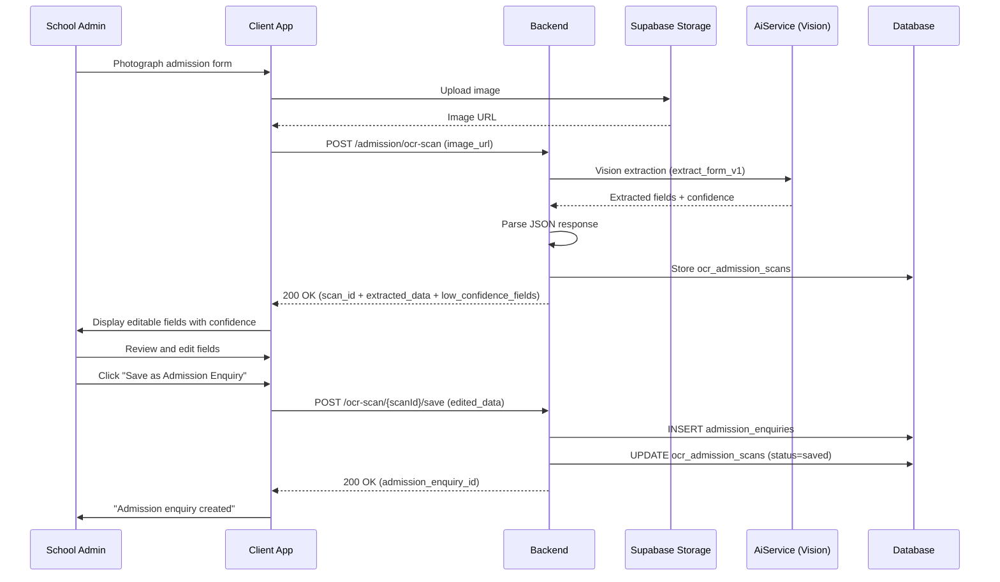
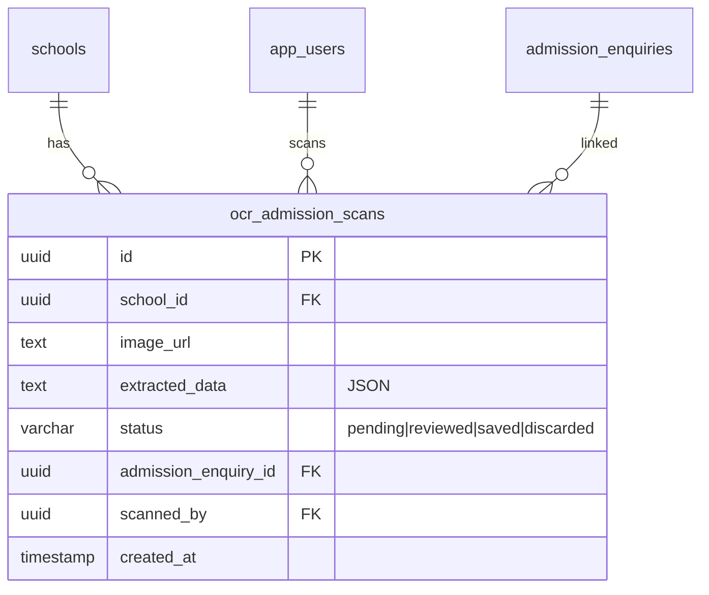

# OCR Admission Form Scanner — Technical Specification

> **Document status:** Implementation-ready blueprint
> **Last updated:** 2026-06-27
> **Prerequisites:** `AI_INFRASTRUCTURE_SPEC.md`
> **Template:** `_SPEC_TEMPLATE.md` v1 (25 mandatory + 6 optional sections)

---

## 1. Feature Overview

OCR-based admission form scanning that extracts student data from photographed paper forms and pre-fills the digital admission enquiry. Uses LLM vision capabilities (GPT-4o vision / Gemini) to read handwritten and printed forms.

### Goals

- Admin/parent photographs admission form → OCR extracts structured data
- Pre-fills `AdmissionEnquiriesTable` with extracted data
- Confidence score per field — low confidence fields flagged for manual review
- Support multiple form layouts (school-specific templates)
- Reduce manual data entry during admission season

### Non-goals

- [ ] Automated admission approval (admin reviews all extracted data)
- [ ] Multi-page form scanning (single page only for v1)
- [ ] Document verification (birth certificate, transfer certificate)
- [ ] Parent-side self-service scanning (admin-only for v1)

### Dependencies

- `AI_INFRASTRUCTURE_SPEC.md` — `AiService` for LLM vision calls
- `AdmissionEnquiriesTable` — existing admission enquiry storage
- `SchoolMediaTable` — existing media storage infrastructure

### Related Modules

- `server/.../feature/ai/AiService.kt` — shared AI service
- `server/.../feature/admissions/` — admission management
- `server/.../db/Tables.kt:330-344` — `AdmissionEnquiriesTable`

---

## 2. Current System Assessment

### Existing Code

- `AdmissionEnquiriesTable` (`Tables.kt:330-344`) — stores admission enquiries with `studentName`, `parentName`, `phone`, `className`, `section`, `status`
- `SchoolMediaTable` — existing media storage infrastructure
- No OCR or image processing exists

### Existing Database

- `AdmissionEnquiriesTable` — student name, parent name, phone, class name, section, status
- `SchoolMediaTable` — media storage (images, documents)

### Existing APIs

- `POST /api/v1/school/admission/enquiries` — create admission enquiry
- `GET /api/v1/school/admission/enquiries` — list enquiries
- `POST /api/v1/school/media/upload` — upload media

### Existing UI

- Admission enquiry management screen
- Media upload component

### Existing Services

- `AdmissionEnquiryService` — admission enquiry CRUD
- `SchoolMediaService` — media upload and storage
- `AiService` — shared AI service (per `AI_INFRASTRUCTURE_SPEC.md`)

### Existing Documentation

- `AI_INFRASTRUCTURE_SPEC.md` — AI infrastructure specification

### Technical Debt

| # | Gap | Details |
|---|---|---|
| TD-1 | No OCR | All admission forms manually entered |
| TD-2 | No image processing | No way to extract data from photos |
| TD-3 | Manual data entry bottleneck | Admission season overwhelms staff |

### Gaps

| # | Gap | Impact | Severity |
|---|---|---|---|
| G1 | No OCR scanning | Manual entry is slow and error-prone | **High** |
| G2 | No confidence scoring | No way to flag uncertain data | **Medium** |
| G3 | No review workflow | No structured review before saving | **Medium** |

---

## 3. Functional Requirements

### FR-001
| Field | Value |
|---|---|
| **Title** | Photo Upload/Capture |
| **Description** | Upload/capture photo of admission form |
| **Priority** | Critical |
| **User Roles** | School Admin |
| **Acceptance notes** | Camera capture or file upload; stored via `SchoolMediaTable` |

### FR-002
| Field | Value |
|---|---|
| **Title** | LLM Vision Extraction |
| **Description** | LLM vision extracts: student name, parent name, phone, date of birth, class, address, previous school |
| **Priority** | Critical |
| **User Roles** | System |
| **Acceptance notes** | Structured JSON with field, value, confidence per extracted field |

### FR-003
| Field | Value |
|---|---|
| **Title** | Confidence Score Per Field |
| **Description** | Confidence score per extracted field (0-1) |
| **Priority** | High |
| **User Roles** | System |
| **Acceptance notes** | Each field has confidence score 0.0 to 1.0 |

### FR-004
| Field | Value |
|---|---|
| **Title** | Low-Confidence Flagging |
| **Description** | Low-confidence fields (< 0.7) highlighted for manual review |
| **Priority** | High |
| **User Roles** | School Admin |
| **Acceptance notes** | Fields with confidence < 0.7 visually highlighted |

### FR-005
| Field | Value |
|---|---|
| **Title** | Admin Review and Edit |
| **Description** | Admin reviews and edits extracted data before saving |
| **Priority** | Critical |
| **User Roles** | School Admin |
| **Acceptance notes** | All fields editable; admin confirms before saving |

### FR-006
| Field | Value |
|---|---|
| **Title** | Save as Admission Enquiry |
| **Description** | Save as admission enquiry in `AdmissionEnquiriesTable` |
| **Priority** | Critical |
| **User Roles** | School Admin |
| **Acceptance notes** | Creates row in `AdmissionEnquiriesTable`; links scan to enquiry |

### FR-007
| Field | Value |
|---|---|
| **Title** | Multi-Language Form Support |
| **Description** | Support English and Hindi forms |
| **Priority** | Medium |
| **User Roles** | System |
| **Acceptance notes** | LLM vision handles both English and Hindi text |

---

## 4. User Stories

### School Admin
- [ ] Photograph an admission form and get pre-filled data
- [ ] Review extracted data with confidence scores
- [ ] Edit fields with low confidence before saving
- [ ] Save extracted data as an admission enquiry
- [ ] See which fields need attention (low confidence highlighted)

### System
- [ ] Call LLM vision with image + extraction prompt
- [ ] Parse structured response (field, value, confidence)
- [ ] Store scan in `ocr_admission_scans`
- [ ] Return for admin review
- [ ] On save: create `AdmissionEnquiriesTable` row and link to scan

---

## 5. Business Rules

### BR-001
**Rule:** Admin must review all extracted data before saving as admission enquiry.
**Enforcement:** Scan status remains `pending` until admin reviews; `reviewed` after review; `saved` after saving as enquiry.

### BR-002
**Rule:** Low-confidence fields (< 0.7) are flagged but not rejected.
**Enforcement:** `low_confidence_fields` list returned in API response; UI highlights these fields.

### BR-003
**Rule:** Admin edits override extracted values.
**Enforcement:** `saveToEnquiry` uses edited data from admin, not raw extracted data.

### BR-004
**Rule:** One scan can create one admission enquiry.
**Enforcement:** `ocr_admission_scans.admission_enquiry_id` is set on save; scan status changes to `saved`.

### BR-005
**Rule:** Scanned image stored in Supabase Storage via `SchoolMediaTable`.
**Enforcement:** Image uploaded via existing media infrastructure before OCR scan.

---

## 6. Database Design

### 6.1 Entity Relationship Summary

New `ocr_admission_scans` table with FKs to `schools`, `app_users` (scanned_by), and `admission_enquiries` (linked after save).

### 6.2 New Tables

```sql
CREATE TABLE ocr_admission_scans (
    id              UUID PRIMARY KEY DEFAULT gen_random_uuid(),
    school_id       UUID NOT NULL,
    image_url       TEXT NOT NULL,                 -- Supabase Storage URL
    extracted_data  TEXT NOT NULL,                 -- JSON: [{"field": "student_name", "value": "...", "confidence": 0.95}]
    status          VARCHAR(16) NOT NULL DEFAULT 'pending', -- pending | reviewed | saved
    admission_enquiry_id UUID,                     -- FK admission_enquiries.id (once saved)
    scanned_by      UUID,
    created_at      TIMESTAMP NOT NULL DEFAULT now()
);
```

### 6.3 Modified Tables

N/A — no existing tables modified. `AdmissionEnquiriesTable` is written to on save but schema unchanged.

### 6.4 Indexes

```sql
CREATE INDEX idx_ocr_scans_school ON ocr_admission_scans(school_id, created_at DESC);
```

### 6.5 Constraints

- `ocr_admission_scans.school_id` — NOT NULL
- `ocr_admission_scans.image_url` — NOT NULL
- `ocr_admission_scans.extracted_data` — NOT NULL (JSON)
- `ocr_admission_scans.status` — NOT NULL, DEFAULT `pending`

### 6.6 Foreign Keys

- `ocr_admission_scans.school_id` → `schools.id` (ON DELETE CASCADE)
- `ocr_admission_scans.scanned_by` → `app_users.id` (ON DELETE SET NULL)
- `ocr_admission_scans.admission_enquiry_id` → `admission_enquiries.id` (ON DELETE SET NULL)

### 6.7 Soft Delete Strategy

N/A — scans are immutable records. No soft delete.

### 6.8 Audit Fields

- `created_at` — scan timestamp
- `scanned_by` — user who initiated scan
- `status` — `pending` → `reviewed` → `saved`
- `admission_enquiry_id` — linked enquiry (set on save)

### 6.9 Migration Notes

Migration: `docs/db/migration_044_ocr_admission.sql`
- Creates `ocr_admission_scans` table with index
- No data backfill needed

### 6.10 Exposed Mappings

```kotlin
object OcrAdmissionScansTable : UUIDTable("ocr_admission_scans", "id") {
    val schoolId           = uuid("school_id")
    val imageUrl           = text("image_url")
    val extractedData      = text("extracted_data") // JSON
    val status             = varchar("status", 16) // pending | reviewed | saved
    val admissionEnquiryId = uuid("admission_enquiry_id").nullable()
    val scannedBy          = uuid("scanned_by").nullable()
    val createdAt          = timestamp("created_at")
    init {
        index("idx_ocr_scans_school", false, schoolId, createdAt)
    }
}
```

### 6.11 Seed Data

N/A — no seed data. Scans created on demand.

---

## 7. State Machines

### OCR Scan Lifecycle State Machine

```
PENDING ──admin_reviews──> REVIEWED ──admin_saves──> SAVED
PENDING ──admin_discards──> DISCARDED
REVIEWED ──admin_edits──> REVIEWED (with edits)
REVIEWED ──admin_discards──> DISCARDED
```

| Current State | Event | Next State | Guard / Condition |
|---|---|---|---|
| `pending` | Admin reviews extracted data | `reviewed` | — |
| `pending` | Admin discards scan | `discarded` | — |
| `reviewed` | Admin edits fields | `reviewed` | Edits applied |
| `reviewed` | Admin saves as enquiry | `saved` | Creates `AdmissionEnquiriesTable` row |
| `reviewed` | Admin discards | `discarded` | — |

### OCR Processing State Machine

```
IMAGE_UPLOADED ──> LLM_VISION_CALL ──> PARSE_RESPONSE ──> STORE_SCAN ──> RETURN_FOR_REVIEW
LLM_VISION_CALL ──> LLM_ERROR ──> RETRY ──> LLM_VISION_CALL
LLM_VISION_CALL ──> LLM_ERROR ──> RETURN_ERROR
PARSE_RESPONSE ──> MALFORMED_JSON ──> RETURN_ERROR
```

| Current State | Event | Next State | Guard / Condition |
|---|---|---|---|
| `image_uploaded` | Start OCR | `llm_vision_call` | Image URL valid |
| `llm_vision_call` | LLM returns data | `parse_response` | Valid response |
| `llm_vision_call` | LLM error | `retry` | Max 3 retries |
| `retry` | Retry attempt | `llm_vision_call` | — |
| `llm_vision_call` | LLM error (max retries) | `return_error` | All retries exhausted |
| `parse_response` | Valid JSON | `store_scan` | — |
| `parse_response` | Malformed JSON | `return_error` | Cannot parse |
| `store_scan` | Stored in DB | `return_for_review` | — |

---

## 8. Backend Architecture

### 8.1 Component Overview

New `OcrAdmissionService` handles LLM vision extraction and save-to-enquiry flow. `OcrRouting` exposes API endpoints. Integrates with existing `SchoolMediaService` for image storage.

### 8.2 Design Principles

1. **LLM vision for extraction** — Uses GPT-4o vision / Gemini for OCR
2. **Confidence-based review** — Low-confidence fields flagged for admin attention
3. **Admin review required** — No auto-save; admin confirms all data
4. **Reuse existing infrastructure** — `SchoolMediaTable` for image storage, `AdmissionEnquiriesTable` for saving
5. **Retry on LLM failure** — Max 3 retries on vision call

### 8.3 Core Types

```kotlin
class OcrAdmissionService(private val aiService: AiService) {
    suspend fun scan(schoolId: UUID, imageUrl: String): OcrScanDto {
        // 1. Call LLM vision with image + extraction prompt
        val result = aiService.complete(schoolId, null, "ocr_admission", "extract_form_v1",
            mapOf("image_url" to imageUrl))
        // 2. Parse structured response (field, value, confidence)
        // 3. Store in ocr_admission_scans
        // 4. Return for admin review
    }

    suspend fun saveToEnquiry(scanId: UUID, editedData: Map<String, String>): UUID {
        // 1. Read scan
        // 2. Apply admin edits
        // 3. Create AdmissionEnquiriesTable row
        // 4. Update scan status = 'saved'
    }
}
```

### 8.4 Vision Prompt

```
System: You are an OCR system extracting data from school admission forms.
Extract the following fields from the image. For each field, provide the value and a confidence score (0-1).
Output JSON: [{"field": "student_name", "value": "...", "confidence": 0.95}, ...]

Fields: student_name, parent_name, phone, date_of_birth, class_applied, address, previous_school, gender

User: [image attached]
```

### 8.5 Repositories

- `OcrAdmissionScanRepository` — CRUD for `ocr_admission_scans` table

### 8.6 Mappers

- `OcrScanMapper` — maps DB row to `OcrScanDto`

### 8.7 Permission Checks

- Scan: school admin only
- Review/Edit: school admin only
- Save: school admin only

### 8.8 Background Jobs

N/A — OCR scan is synchronous (completes within request timeout, typically 5-10s for LLM vision).

### 8.9 Domain Events

- `OcrScanCompleted` — emitted when LLM vision returns extracted data
- `OcrScanSaved` — emitted when admin saves scan as admission enquiry
- `OcrScanDiscarded` — emitted when admin discards scan

### 8.10 Caching

N/A — each scan is unique. No caching.

### 8.11 Transactions

- Scan storage: single INSERT into `ocr_admission_scans`
- Save to enquiry: INSERT into `admission_enquiries` + UPDATE `ocr_admission_scans` in single transaction

---

## 9. API Contracts

### 9.1 OCR Scan

```
POST /api/v1/school/admission/ocr-scan
{
  "image_url": "https://supabase.co/..."
}
```

**Response 200:**
```json
{
  "success": true,
  "data": {
    "scan_id": "uuid",
    "extracted_data": [
      {"field": "student_name", "value": "Aarav Sharma", "confidence": 0.95},
      {"field": "parent_name", "value": "Rajesh Sharma", "confidence": 0.92},
      {"field": "phone", "value": "+919876543210", "confidence": 0.88},
      {"field": "date_of_birth", "value": "2015-06-15", "confidence": 0.65}
    ],
    "low_confidence_fields": ["date_of_birth"]
  }
}
```

### 9.2 Save as Admission Enquiry

```
POST /api/v1/school/admission/ocr-scan/{scanId}/save
{
  "student_name": "Aarav Sharma",
  "parent_name": "Rajesh Sharma",
  "phone": "+919876543210",
  "date_of_birth": "2015-06-15",
  "class_applied": "Grade 1"
}
```

**Response 200:**
```json
{
  "success": true,
  "data": {
    "admission_enquiry_id": "uuid"
  }
}
```

### 9.3 Discard Scan

```
DELETE /api/v1/school/admission/ocr-scan/{scanId}
```

---

## 10. Frontend Architecture

### 10.1 Screens

| Screen | Platform | Role | Description |
|---|---|---|---|
| `OcrScanScreen` | All | School Admin | Camera capture, review, edit, save |
| `OcrReviewScreen` | All | School Admin | Review extracted data with confidence indicators |

### 10.2 Navigation

- Admin portal → Admissions → Scan Form → `OcrScanScreen`
- Admin portal → Admissions → Scan History → `OcrReviewScreen`

### 10.3 UX Flows

#### Scan Admission Form

1. Admin navigates to Admissions → Scan Form
2. Camera opens (or file upload option)
3. Admin photographs admission form
4. Image uploaded to Supabase Storage
5. Loading: "Extracting data from form..."
6. Extracted data displayed in editable fields
7. Low-confidence fields highlighted in yellow/orange
8. Admin reviews and edits as needed
9. Clicks "Save as Admission Enquiry"
10. Confirmation: "Admission enquiry created for Aarav Sharma"

#### Review Saved Scan

1. Admin navigates to Scan History
2. List of past scans with status (pending, reviewed, saved, discarded)
3. Click on scan to review
4. Edit and save, or discard

### 10.4 State Management

```kotlin
data class OcrScanState(
    val imageUrl: String?,
    val scanResult: OcrScanDto?,
    val isLoading: Boolean,
    val isScanning: Boolean,
    val isSaving: Boolean,
    val error: String?,
    val editedFields: Map<String, String>,
)
```

### 10.5 Offline Support

N/A — OCR requires server-side LLM vision call. No offline support.

### 10.6 Loading States

- Uploading: "Uploading image..."
- Scanning: "Extracting data from form..."
- Saving: "Creating admission enquiry..."

### 10.7 Error Handling (UI)

- Scan failed: "Could not extract data. Please ensure the photo is clear and well-lit."
- LLM error: "OCR service unavailable. Please try again."
- Save failed: "Could not save enquiry. Please try again."
- No data extracted: "No data could be extracted from this image. Try a clearer photo."

### 10.8 Component Integration Guidelines

| Rule | Description |
|---|---|
| **R1** | Camera capture with overlay guide (rectangle for form alignment) |
| **R2** | Extracted fields in editable text fields |
| **R3** | Low-confidence fields highlighted with warning color |
| **R4** | Confidence score shown as percentage next to each field |
| **R5** | "Save" button disabled until admin reviews all fields |
| **R6** | Image preview shown alongside extracted data |

---

## 11. Shared Module Changes (KMP)

### 11.1 DTOs

```kotlin
data class OcrScanDto(
    val scanId: UUID,
    val extractedData: List<ExtractedField>,
    val lowConfidenceFields: List<String>,
)

data class ExtractedField(
    val field: String,
    val value: String,
    val confidence: Double,
)

data class SaveOcrScanRequest(
    val studentName: String,
    val parentName: String,
    val phone: String,
    val dateOfBirth: String?,
    val classApplied: String?,
    val address: String?,
    val previousSchool: String?,
    val gender: String?,
)
```

### 11.2 Domain Models

```kotlin
data class OcrAdmissionScan(
    val id: UUID,
    val schoolId: UUID,
    val imageUrl: String,
    val extractedData: List<ExtractedField>,
    val status: OcrScanStatus,
    val admissionEnquiryId: UUID?,
    val scannedBy: UUID?,
    val createdAt: Instant,
)
```

### 11.3 Repository Interfaces

```kotlin
interface OcrScanRepository {
    suspend fun insert(scan: OcrScanEntity): UUID
    suspend fun get(scanId: UUID): OcrScanDto?
    suspend fun updateStatus(scanId: UUID, status: String, enquiryId: UUID?): Unit
    suspend fun listBySchool(schoolId: UUID, limit: Int): List<OcrScanDto>
}
```

### 11.4 UseCases

- `ScanAdmissionFormUseCase`
- `SaveOcrScanAsEnquiryUseCase`
- `DiscardOcrScanUseCase`
- `GetOcrScanHistoryUseCase`

### 11.5 Validation

- Image URL: must be valid URL
- Edited fields: student_name and parent_name not empty
- Phone: valid format

### 11.6 Serialization

Standard Kotlinx serialization for DTOs. `extracted_data` is JSON string in DB, deserialized to list of `ExtractedField`.

### 11.7 Network APIs

Added to `OcrAdmissionApi.kt`:
- `POST /api/v1/school/admission/ocr-scan` — scan
- `POST /api/v1/school/admission/ocr-scan/{scanId}/save` — save as enquiry
- `DELETE /api/v1/school/admission/ocr-scan/{scanId}` — discard
- `GET /api/v1/school/admission/ocr-scan/history` — scan history

### 11.8 Database Models (Local Cache)

N/A — scan data is server-side only. No local cache.

---

## 12. Permissions Matrix

| Action | Super Admin | School Admin | Teacher | Parent |
|---|---|---|---|---|
| Scan admission form | ✅ | ✅ | ❌ | ❌ |
| Review extracted data | ✅ | ✅ | ❌ | ❌ |
| Edit extracted data | ✅ | ✅ | ❌ | ❌ |
| Save as admission enquiry | ✅ | ✅ | ❌ | ❌ |
| Discard scan | ✅ | ✅ | ❌ | ❌ |
| View scan history | ✅ | ✅ | ❌ | ❌ |

---

## 13. Notifications

N/A — OCR scan is an interactive admin feature. No notifications needed.

---

## 14. Background Jobs

N/A — OCR scan is synchronous. LLM vision call completes within request timeout (typically 5-10s).

---

## 15. Integrations

### AiService (Shared)
| Field | Value |
|---|---|
| **System** | AiService (per `AI_INFRASTRUCTURE_SPEC.md`) |
| **Purpose** | LLM vision for OCR extraction |
| **API / SDK** | `AiService.complete()` with vision capability |
| **Auth method** | Internal service call |
| **Fallback** | Retry 3x; if all fail, return error |

### SchoolMediaTable / Supabase Storage
| Field | Value |
|---|---|
| **System** | Existing media storage |
| **Purpose** | Store uploaded form images |
| **API / SDK** | Supabase Storage API |
| **Auth method** | Service role key |
| **Fallback** | None — image must be uploaded before scan |

### AdmissionEnquiriesTable
| Field | Value |
|---|---|
| **System** | Existing admission enquiry storage |
| **Purpose** | Save extracted data as admission enquiry |
| **API / SDK** | Direct DB insert via Exposed |
| **Auth method** | Internal |
| **Fallback** | None — required for save operation |

---

## 16. Security

### Authentication
- All API endpoints require valid JWT with school admin role

### Authorization
- Only school admin can scan, review, edit, save, and discard
- No teacher or parent access to OCR features

### Encryption
- Image URLs are Supabase Storage URLs (access controlled)
- LLM API calls use TLS (handled by `AiService`)
- Extracted data stored as plaintext (non-sensitive admission form data)

### Audit Logs
- Scan creation logged (action: `CREATE`, entity: `ocr_admission_scan`)
- Save to enquiry logged (action: `CREATE`, entity: `admission_enquiry`)
- Discard logged (action: `DELETE`, entity: `ocr_admission_scan`)

### PII Handling
- Admission forms contain student PII (name, DOB, address, phone)
- PII sent to LLM vision for extraction (necessary for functionality)
- PII stored in `ocr_admission_scans.extracted_data` and `admission_enquiries`
- Image stored in Supabase Storage (access controlled)

### Data Isolation
- All queries filtered by `school_id` from JWT
- Scan history scoped to school

### Rate Limiting
- Standard API rate limiting
- LLM vision calls: 1 scan at a time per user

### Input Validation
- Image URL: must be valid URL pointing to Supabase Storage
- Edited fields: student_name and parent_name not empty
- Phone: valid format

---

## 17. Performance & Scalability

### Expected Scale

| Metric | 1 scan | 10 concurrent | 100 concurrent |
|---|---|---|---|
| Image upload | ~1-2s | ~5-10s | ~30-60s |
| LLM vision extraction | ~5-10s | ~10-20s | ~30-60s |
| Total scan latency | ~7-12s | ~15-30s | ~60-120s |

### Latency Targets

| Operation | Target |
|---|---|
| Full scan (upload + extract) | < 15s |
| Save as enquiry | < 200ms |
| Scan history retrieval | < 100ms |

### Optimization Strategy

- Image compression before upload (reduce payload size)
- LLM vision call is the bottleneck (5-10s typical)
- No parallelization possible (single image per scan)
- Scan history uses indexed `school_id` lookup

---

## 18. Edge Cases

| # | Scenario | Expected Behavior |
|---|---|---|
| EC-001 | Blurry or dark photo | LLM may return low confidence or no data; admin prompted to retake |
| EC-002 | Form not in frame | LLM may miss fields; admin prompted to retake |
| EC-003 | Non-admission form image | LLM returns no relevant fields; admin prompted to use admission form |
| EC-004 | Handwritten form (illegible) | Low confidence scores; admin must manually enter data |
| EC-005 | Hindi language form | LLM vision handles Hindi text; extracted in Hindi |
| EC-006 | Form with missing fields | Fields not found returned with null value and 0 confidence |
| EC-007 | LLM returns malformed JSON | Retry 3x; if still malformed, return error |
| EC-008 | Image URL invalid | Return 400: "Invalid image URL" |
| EC-009 | Scan already saved | Return 400: "Scan already saved as enquiry" |

### Risks & Mitigations

| Risk | Likelihood | Impact | Mitigation |
|---|---|---|---|
| LLM misreads handwritten data | Medium | Medium | Confidence scores; admin review required |
| LLM unavailable | Low | Medium | Retry 3x; graceful error message |
| Image quality poor | Medium | Medium | UI prompts for clear, well-lit photos |
| PII exposure to LLM | Low | Medium | LLM provider has data processing agreement |

---

## 19. Error Handling

### Standard Error Codes

| HTTP | Error Code | Description | When |
|---|---|---|---|
| 400 | `INVALID_IMAGE_URL` | Image URL is not valid | Scan request |
| 400 | `NO_DATA_EXTRACTED` | LLM could not extract any fields | Scan |
| 400 | `REQUIRED_FIELDS_EMPTY` | student_name or parent_name empty | Save |
| 400 | `SCAN_ALREADY_SAVED` | Scan already saved as enquiry | Save |
| 403 | `INSUFFICIENT_PERMISSIONS` | Non-admin attempting scan | Any endpoint |
| 404 | `SCAN_NOT_FOUND` | Scan ID does not exist | Save/Discard |
| 500 | `LLM_VISION_ERROR` | LLM vision call failed (all retries) | Scan |
| 500 | `LLM_PARSE_ERROR` | LLM returned malformed JSON | Scan |

### Error Response Format

Same as existing API error format.

### Recovery Strategy

| Error | Client Action | Server Action |
|---|---|---|
| `NO_DATA_EXTRACTED` | Show "Try a clearer photo" | Return 400 |
| `LLM_VISION_ERROR` | Show retry button | Retry 3x; return 500 |
| `LLM_PARSE_ERROR` | Show retry button | Retry 3x; return 500 |

---

## 20. Analytics & Reporting

### Reports

- **OCR Usage Report:** Number of scans per day/week/month
- **Confidence Report:** Average confidence scores per field
- **Save Rate:** % of scans that are saved as enquiries vs discarded
- **Token Usage Report:** LLM token consumption for vision calls

### KPIs

- **Scan Success Rate:** % of scans that extract at least one field
- **Average Confidence:** Mean confidence across all fields
- **Save Conversion Rate:** % of scans saved as enquiries
- **Time Saved:** Estimated manual entry time saved by OCR

### Dashboards

N/A — monitoring via metrics (see section F. Observability).

### Exports

N/A — scan data viewable in-app.

---

## 21. Testing Strategy

### Unit Tests

| Test | What it verifies |
|---|---|
| LLM vision prompt | Correct prompt with image URL |
| Response parsing | JSON parsed into `ExtractedField` list |
| Confidence threshold | Fields < 0.7 flagged as low confidence |
| Save to enquiry | Correct `AdmissionEnquiriesTable` row created |
| Status transition | pending → reviewed → saved |
| Validation | Empty required fields rejected |

### Integration Tests

| Test | What it verifies |
|---|---|
| Upload → scan → review → save → enquiry created | Full flow |
| Scan with low confidence → fields highlighted | Confidence flagging |
| Discard scan → status = discarded | Discard flow |
| LLM error → retry → success | Retry mechanism |
| LLM error → all retries fail → 500 | Error handling |
| Save already-saved scan → 400 | Duplicate save prevention |

### Performance Tests

- [ ] Full scan < 15s
- [ ] Save < 200ms
- [ ] History retrieval < 100ms

### Security Tests

- [ ] Non-admin cannot scan
- [ ] Non-admin cannot save
- [ ] All queries school-scoped

### Migration Tests

- [ ] Migration creates table with correct schema
- [ ] Index created correctly

---

## 22. Acceptance Criteria

- [ ] Photo of admission form → structured data extracted
- [ ] Confidence score per field
- [ ] Low-confidence fields flagged
- [ ] Admin can edit before saving
- [ ] Saved as admission enquiry
- [ ] Works with printed and handwritten forms (English + Hindi)
- [ ] Scan history viewable
- [ ] Discard option works

---

## 23. Implementation Roadmap

| Phase | Duration | Tasks | Breaking? | Deliverable |
|---|---|---|---|---|
| 1 | 1 day | DB migration, Exposed table | No | Schema ready |
| 2 | 2 days | OcrAdmissionService + vision prompt | No | Core service |
| 3 | 2 days | API endpoints | No | API available |
| 4 | 2 days | Client UI (camera capture, review screen, edit fields) | No | UI ready |
| 5 | 1 day | Tests | No | Test coverage |

**Total: ~8 days**

---

## 24. File-Level Impact Analysis

### New Files

| File | Location | Purpose |
|---|---|---|
| `OcrAdmissionService.kt` | `server/.../feature/ai/ocr/` | Core OCR service |
| `OcrRouting.kt` | `server/.../feature/ai/ocr/` | API endpoints |
| `migration_044_ocr_admission.sql` | `docs/db/` | DDL migration |
| `OcrAdmissionApi.kt` | `shared/.../feature/ai/` | Client API |
| `OcrScanScreen.kt` | `composeApp/.../ui/v2/screens/admin/` | Scan + review UI |

### Modified Files

| File | Change Type | Lines Changed (est.) | Risk | Description |
|---|---|---|---|---|
| `server/.../db/Tables.kt` | Add | ~12 | Low | `OcrAdmissionScansTable` |
| `server/.../db/DatabaseFactory.kt` | Modify | ~2 | Low | Register table |

### Files Preserved Unchanged

| File | Reason |
|---|---|
| `AiService.kt` | Used as-is per AI_INFRASTRUCTURE_SPEC |
| `AdmissionEnquiriesTable` | Written to on save but schema unchanged |
| `SchoolMediaTable` | Used as-is for image storage |

---

## 25. Future Enhancements

### Multi-Page Form Scanning

- Scan multiple pages of a single admission form
- Combine extracted data across pages
- Handle multi-page PDFs

### Parent-Side Self-Service

- Parents scan forms from their phone
- Pre-filled enquiry submitted for admin review
- Reduces admin workload further

### Document Verification

- Scan birth certificates, transfer certificates
- Verify document authenticity
- Cross-check DOB across documents

### Auto-Fill from Previous School Records

- Extract data from transfer certificates
- Pre-fill academic history
- Auto-populate previous school details

### Batch Scanning

- Scan multiple forms in one session
- Queue management for batch scanning
- Progress tracking for batch

### Form Template Learning

- Upload school-specific form template
- LLM learns field positions for faster extraction
- Higher accuracy for known form layouts

### Multi-Language Expansion

- Support Marathi, Tamil, Telugu, Bengali forms
- Auto-detect form language
- Regional language extraction

### Integration with Digital Admission Workflow

- Auto-create student record after enquiry approval
- Link enquiry to student enrollment
- Track conversion from enquiry to admission

---

## A. Sequence Diagrams

### OCR Scan Flow



---

## B. Domain Model / ER Diagram



---

## C. Event Flow

```
ImageUploaded -> LlmVisionCall -> ParseResponse -> StoreScan -> ReturnForReview
LlmVisionCall -> LLMError -> Retry -> LlmVisionCall
LlmVisionCall -> LLMError -> ReturnError
ParseResponse -> MalformedJson -> ReturnError
AdminReviews -> AdminEdits -> AdminSaves -> CreateEnquiry -> UpdateScanStatus -> Complete
AdminReviews -> AdminDiscards -> UpdateScanStatus -> Complete
```

| Event | Emitted By | Consumed By | Side Effect |
|---|---|---|---|
| `OcrScanCompleted` | `OcrAdmissionService.scan()` | Analytics | Counter incremented |
| `OcrScanSaved` | `OcrAdmissionService.saveToEnquiry()` | Analytics, Audit | Enquiry created; audit log |
| `OcrScanDiscarded` | `OcrAdmissionService.discard()` | Analytics | Counter incremented |

---

## D. Configuration

### Environment Variables

| Variable | Description |
|---|---|
| `AI_OCR_ADMISSION_ENABLED` | Enable/disable feature (default: `true`) |
| `AI_OCR_CONFIDENCE_THRESHOLD` | Low-confidence threshold (default: `0.7`) |
| `AI_OCR_MAX_RETRIES` | Max LLM retries (default: `3`) |
| `AI_OCR_MAX_IMAGE_SIZE_MB` | Max image upload size (default: `10`) |

### Feature Flags

| Flag | Default | Description |
|---|---|---|
| `ai_ocr_admission_enabled` | `true` | Master switch for OCR admission |
| `ai_ocr_hindi_support` | `true` | Enable Hindi form support |

### Client-Side Configuration

| Config | Default | Description |
|---|---|---|
| Camera quality | High | Photo capture resolution |
| Image compression | true | Compress before upload |
| Overlay guide | true | Rectangle overlay for form alignment |

### Server-Side Configuration

| Config | Default | Description |
|---|---|---|
| LLM model | Per `AiService` config | Vision-capable model |
| Vision prompt template | `extract_form_v1` | Extraction template |
| Confidence threshold | 0.7 | Low-confidence cutoff |
| Max retries | 3 | LLM retry count |
| Max image size | 10 MB | Upload limit |

### Infrastructure Requirements

- `AiService` configured with vision-capable model (GPT-4o vision / Gemini)
- Supabase Storage for image uploads
- Sufficient bandwidth for image upload

---

## E. Migration & Rollback

### Deployment Plan

1. [ ] Run `migration_044_ocr_admission.sql` — creates table + index
2. [ ] Deploy `OcrAdmissionScansTable` in `Tables.kt`
3. [ ] Register table in `DatabaseFactory.kt`
4. [ ] Deploy `OcrAdmissionService.kt`
5. [ ] Deploy `OcrRouting.kt`
6. [ ] Seed prompt template `extract_form_v1`
7. [ ] Deploy client UI
8. [ ] Test with sample form images
9. [ ] Deploy to production

### Rollback Plan

1. [ ] Disable feature flag `ai_ocr_admission_enabled` → API returns 404
2. [ ] Remove client UI → scan screen not shown
3. [ ] Database: `DROP TABLE IF EXISTS ocr_admission_scans;`
4. [ ] No data loss — admission enquiries remain; only scan records removed

### Data Backfill

N/A — scans created on demand. No backfill needed.

### Migration SQL

```sql
-- migration_044_ocr_admission.sql
CREATE TABLE IF NOT EXISTS ocr_admission_scans (
    id              UUID PRIMARY KEY DEFAULT gen_random_uuid(),
    school_id       UUID NOT NULL,
    image_url       TEXT NOT NULL,
    extracted_data  TEXT NOT NULL,
    status          VARCHAR(16) NOT NULL DEFAULT 'pending',
    admission_enquiry_id UUID,
    scanned_by      UUID,
    created_at      TIMESTAMP NOT NULL DEFAULT now()
);

CREATE INDEX IF NOT EXISTS idx_ocr_scans_school ON ocr_admission_scans(school_id, created_at DESC);

-- ROLLBACK:
-- DROP TABLE IF EXISTS ocr_admission_scans;
```

---

## F. Observability

### Logging

- Scan requested: INFO `ocr_scan_requested` (schoolId, userId, imageUrl)
- LLM vision call: DEBUG `ocr_llm_vision_call` (schoolId, model)
- LLM vision success: INFO `ocr_vision_success` (scanId, fieldCount, avgConfidence, durationMs)
- LLM vision failure: WARN `ocr_vision_failure` (schoolId, error, retryCount)
- Low confidence fields: DEBUG `ocr_low_confidence` (scanId, fields)
- Scan saved: INFO `ocr_scan_saved` (scanId, enquiryId)
- Scan discarded: INFO `ocr_scan_discarded` (scanId)

### Metrics

| Metric | Type | Description |
|---|---|---|
| `ai.ocr.scans_total` | Counter | Total scan requests |
| `ai.ocr.scan_successes` | Counter | Successful extractions |
| `ai.ocr.scan_failures` | Counter (by reason) | Failed scans by reason |
| `ai.ocr.scan_latency_ms` | Histogram | Full scan duration |
| `ai.ocr.avg_confidence` | Gauge | Average confidence score |
| `ai.ocr.save_rate` | Gauge | % of scans saved as enquiries |
| `ai.ocr.tokens_used_total` | Counter | Total tokens consumed |
| `ai.ocr.low_confidence_fields_total` | Counter | Total low-confidence fields |

### Health Checks

- `GET /api/v1/health` — existing health check
- LLM provider availability (per `AI_INFRASTRUCTURE_SPEC.md`)

### Alerts

- Scan failure rate > 15% → Warning
- Average confidence < 0.6 → Warning (may need prompt improvement)
- LLM vision latency p95 > 20s → Warning
- Token usage exceeding monthly budget → Warning
