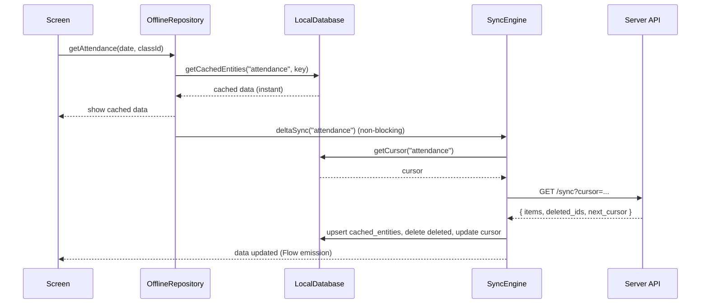
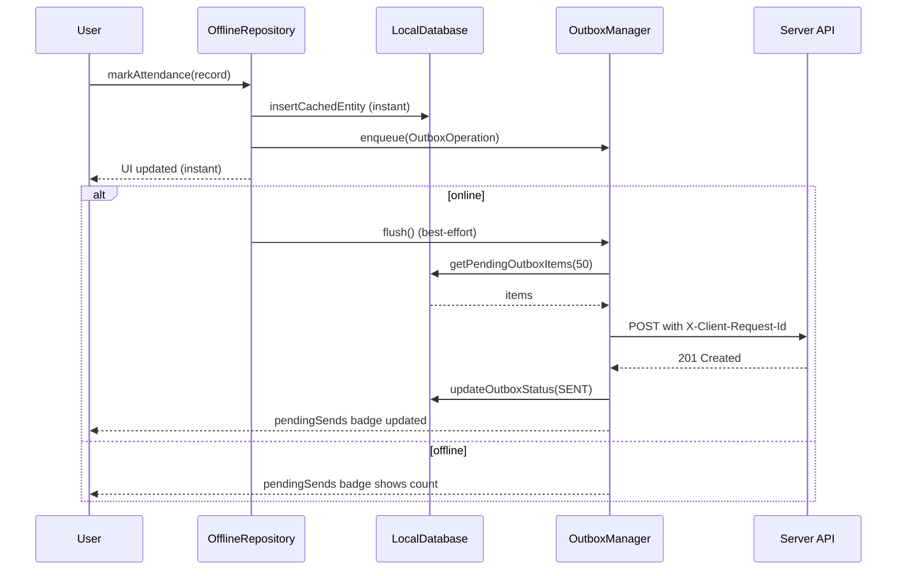

# Offline Mode — Technical Specification

> **Document status:** Implementation-ready blueprint
> **Last updated:** 2026-06-27
> **Prerequisites:** None (but aligns with `MESSAGING_SYSTEM_SPEC.md` §6 offline-first model)
> **Unblocks:** All features benefit; messaging already has a spec for its own offline
> **Related specs:** `MESSAGING_SYSTEM_SPEC.md` (offline-first messaging model)
> **Template:** `_SPEC_TEMPLATE.md` v1 (25 mandatory + 6 optional sections)

---

## 1. Feature Overview

### Purpose

A platform-level offline-first architecture using SQLDelight for client-side local database, a sync engine for delta synchronization, and an outbox pattern for write operations. This spec covers the shared infrastructure that all feature modules use for offline support.

### Business Value

- App remains functional without network connectivity
- Write operations survive network failures via outbox queue
- Delta sync minimizes bandwidth usage
- Transparent to feature modules — repositories read/write local DB, sync engine handles network

### Goals

- All portal data (parent, teacher, admin) cached locally for offline access
- Write operations queued in outbox and synced when connectivity returns
- Delta sync (only fetch changes since last cursor) to minimize bandwidth
- Automatic conflict resolution (LWW + server-authoritative)
- Transparent to feature modules — repositories read/write local DB, sync engine handles network
- Clean logout clears all local data

### Non-goals

- [ ] Real-time collaboration (conflict resolution is LWW, not collaborative editing)
- [ ] Full server-side offline support (server is always online)
- [ ] P2P sync between devices (all sync goes through server)

### Dependencies

- SQLDelight 2.0+ (KMP-native, type-safe SQL)
- WorkManager (Android background sync)
- BGAppRefreshTask (iOS background sync)
- Ktor HttpClient (existing)
- Koin DI (existing)
- `NetworkResult<T>` sealed class (existing)

### Related Modules

- `MESSAGING_SYSTEM_SPEC.md` §6 — already defines SQLDelight + sync engine for messaging; this spec generalizes it
- `NetworkResult<T>` sealed class for network error handling
- Koin DI with `single { HttpClient }` — shared across features
- DataStore stores auth tokens (not business data)

---

## 2. Current System Assessment

### Existing Code

- **No client local DB** — `MESSAGING_SYSTEM_SPEC.md` §1.2.7: "No client local DB — all data fetched fresh per screen load"
- `feature_audit.csv` L146: "Only school discovery has Room cache, no other offline support" — 15% complete
- DataStore stores only auth tokens (not business data)
- `NetworkResult<T>` sealed class for network error handling
- Koin DI with `single { HttpClient }` — shared across features
- `MESSAGING_SYSTEM_SPEC.md` §6 already defines SQLDelight + sync engine for messaging — this spec generalizes it

### Existing Database

- No client-side local database
- Server-side: standard tables with `updated_at` timestamps (supports delta sync)

### Existing APIs

- Standard CRUD endpoints per feature
- No delta sync endpoints
- No idempotency keys for outbox writes

### Existing UI

- No offline indicators
- No syncing indicators
- No pending sends badges

### Existing Services

- Standard repository pattern with direct API calls
- No sync engine
- No outbox manager
- No network monitor

### Existing Documentation

- `MESSAGING_SYSTEM_SPEC.md` §6 — defines offline-first model for messaging
- `feature_audit.csv` — confirms 15% offline support

### Technical Debt

- No SQLDelight setup in shared module
- No local DB schema
- No sync engine
- No outbox pattern
- No background sync (WorkManager/BackgroundTasks)
- No offline indicators in UI

### Gaps

| # | Gap | Impact |
|---|---|---|
| G1 | No local DB | App unusable without network |
| G2 | No sync engine | Data stale after first load |
| G3 | No outbox | Write operations lost on network failure |
| G4 | No conflict resolution | Concurrent edits cause data loss |
| G5 | No background sync | Data not refreshed when app in background |
| G6 | No offline UI indicators | Users confused when data is stale |

---

## 3. Functional Requirements

### FR-001
| Field | Value |
|---|---|
| **Title** | SQLDelight Local DB |
| **Description** | SQLDelight local DB in shared module (Android + iOS + JVM + JS + wasmJs) |
| **Priority** | Critical |
| **User Roles** | System |
| **Acceptance notes** | All KMP targets supported |

### FR-002
| Field | Value |
|---|---|
| **Title** | Local-First Read |
| **Description** | Feature modules read from local DB first (show cached data + "syncing" indicator) |
| **Priority** | Critical |
| **User Roles** | All |
| **Acceptance notes** | Cached data shown instantly; sync runs in background |

### FR-003
| Field | Value |
|---|---|
| **Title** | Outbox Write Pattern |
| **Description** | Write operations go to local DB + outbox first (instant UI feedback) |
| **Priority** | Critical |
| **User Roles** | All |
| **Acceptance notes** | UI updates instantly; outbox syncs when online |

### FR-004
| Field | Value |
|---|---|
| **Title** | Delta Sync |
| **Description** | Sync engine performs delta sync (only changes since last cursor) |
| **Priority** | High |
| **User Roles** | System |
| **Acceptance notes** | Only changed items fetched |

### FR-005
| Field | Value |
|---|---|
| **Title** | Outbox Flush with Retry |
| **Description** | Outbox manager flushes pending writes with retry + backoff |
| **Priority** | High |
| **User Roles** | System |
| **Acceptance notes** | Retry: 1 immediate, 2: +2s, 3: +5s, 4: +15s, 5: +60s, 6+: +300s (cap), max 20 |

### FR-006
| Field | Value |
|---|---|
| **Title** | Conflict Resolution (LWW) |
| **Description** | Conflict resolution: LWW (server-authoritative timestamps) |
| **Priority** | High |
| **User Roles** | System |
| **Acceptance notes** | Server timestamp wins; client receives server version on next sync |

### FR-007
| Field | Value |
|---|---|
| **Title** | Background Sync |
| **Description** | Background sync: WorkManager (Android, 15-min periodic), BackgroundTasks (iOS) |
| **Priority** | Medium |
| **User Roles** | System |
| **Acceptance notes** | 15-min minimum interval; network-constrained |

### FR-008
| Field | Value |
|---|---|
| **Title** | Network Status Monitoring |
| **Description** | Network status monitoring (online/offline transitions) |
| **Priority** | High |
| **User Roles** | System |
| **Acceptance notes** | Platform-specific: ConnectivityManager / NWPathMonitor / navigator.onLine |

### FR-009
| Field | Value |
|---|---|
| **Title** | UI Indicators |
| **Description** | UI indicators: "syncing", "offline", "pending sends (N)" |
| **Priority** | Medium |
| **User Roles** | All |
| **Acceptance notes** | Visible in app bar and feature screens |

### FR-010
| Field | Value |
|---|---|
| **Title** | Logout Clears Local Data |
| **Description** | Logout clears all local data (DB + DataStore) |
| **Priority** | High |
| **User Roles** | All |
| **Acceptance notes** | All cached entities, outbox, cursors cleared |

### FR-011
| Field | Value |
|---|---|
| **Title** | Cache Eviction |
| **Description** | Cache eviction: LRU if local DB exceeds 100MB |
| **Priority** | Low |
| **User Roles** | System |
| **Acceptance notes** | Evict oldest cached_lists entries first |

### FR-012
| Field | Value |
|---|---|
| **Title** | Per-Feature Sync Cursors |
| **Description** | Per-feature sync cursors stored in local DB |
| **Priority** | High |
| **User Roles** | System |
| **Acceptance notes** | Each feature tracks its own sync position |

---

## 4. User Stories

### Parent
- [ ] View my child's attendance, marks, homework even when offline
- [ ] Send messages that queue and send when network returns
- [ ] See offline indicator when app has no connectivity
- [ ] See pending sends badge showing queued messages

### Teacher
- [ ] Mark attendance offline and sync when network returns
- [ ] Enter marks offline and sync when network returns
- [ ] View student roster offline (cached)
- [ ] See syncing indicator when data is being refreshed

### School Admin
- [ ] View dashboard data offline (cached)
- [ ] Create announcements offline (queued in outbox)
- [ ] View fee records offline

### System
- [ ] Sync data automatically on app launch
- [ ] Sync data when network connectivity restored
- [ ] Flush outbox with retry on network restore
- [ ] Run background sync every 15 minutes (Android)
- [ ] Clear all local data on logout

---

## 5. Business Rules

### BR-001
**Rule:** Feature modules read from local DB first, then trigger async delta sync.
**Enforcement:** `OfflineRepository` pattern — `getAttendance()` reads local DB, fires `deltaSync()` non-blocking.

### BR-002
**Rule:** Write operations go to local DB + outbox first for instant UI feedback.
**Enforcement:** `OutboxManager.enqueue()` called after local DB write.

### BR-003
**Rule:** Outbox flush priority is highest — pending writes sync before reads.
**Enforcement:** Sync triggers: 1. Outbox flush, 2. Delta sync current screen, 3. Delta sync other features.

### BR-004
**Rule:** Conflict resolution is LWW (Last Write Wins) — server-authoritative timestamps.
**Enforcement:** Server timestamp wins; client receives server version on next sync.

### BR-005
**Rule:** Outbox writes are idempotent via `client_request_id` header.
**Enforcement:** Server deduplicates: `INSERT INTO ... ON CONFLICT (client_request_id) DO NOTHING`; 409 returns existing entity.

### BR-006
**Rule:** Background sync minimum interval is 15 minutes (battery constraint).
**Enforcement:** WorkManager periodic 15-min; iOS BGAppRefreshTask OS-scheduled.

### BR-007
**Rule:** Logout clears all local data (DB + DataStore).
**Enforcement:** `SyncEngine.clearAll()` called on logout.

### BR-008
**Rule:** Cache eviction triggers when local DB exceeds 100MB.
**Enforcement:** LRU eviction on `cached_lists` entries first.

### BR-009
**Rule:** Delta sync cursor = `updated_at` timestamp of last item returned.
**Enforcement:** Server queries: `WHERE school_id = ? AND updated_at > cursor ORDER BY updated_at ASC LIMIT 100`.

### BR-010
**Rule:** Deleted items tracked via `deleted_at` (soft delete) — returned in `deleted_ids` in sync response.
**Enforcement:** Server returns `deleted_ids` array in delta sync response.

---

## 6. Database Design

### 6.1 Entity Relationship Summary

This is a **client-side** database (SQLDelight). No server-side tables are created by this spec.

```
sync_cursors (standalone — per-feature sync position)
cached_entities (standalone — generic entity cache keyed by feature+type+id)
outbox (standalone — pending write operations queue)
cached_lists (standalone — list response cache keyed by feature+list_key)
```

### 6.2 New Tables (Client-Side SQLDelight)

#### `sync_cursors`

```sql
CREATE TABLE sync_cursors (
    feature TEXT NOT NULL,
    entity_type TEXT NOT NULL,
    cursor TEXT,                    -- server-issued cursor (timestamp or seq)
    last_synced_at INTEGER,         -- epoch millis
    PRIMARY KEY (feature, entity_type)
);
```

#### `cached_entities`

```sql
CREATE TABLE cached_entities (
    feature TEXT NOT NULL,
    entity_type TEXT NOT NULL,
    entity_id TEXT NOT NULL,
    payload TEXT NOT NULL,          -- JSON serialized entity
    updated_at INTEGER NOT NULL,    -- epoch millis (from server)
    PRIMARY KEY (feature, entity_type, entity_id)
);
```

#### `outbox`

```sql
CREATE TABLE outbox (
    id TEXT NOT NULL PRIMARY KEY,   -- client-generated UUID
    feature TEXT NOT NULL,
    operation TEXT NOT NULL,        -- CREATE | UPDATE | DELETE
    entity_type TEXT NOT NULL,
    entity_id TEXT NOT NULL,
    payload TEXT NOT NULL,          -- JSON serialized request body
    status TEXT NOT NULL,           -- PENDING | SENDING | FAILED | SENT
    attempts INTEGER NOT NULL DEFAULT 0,
    next_retry_at INTEGER,          -- epoch millis
    created_at INTEGER NOT NULL,
    updated_at INTEGER NOT NULL
);
```

#### `cached_lists`

```sql
CREATE TABLE cached_lists (
    feature TEXT NOT NULL,
    list_key TEXT NOT NULL,         -- e.g. "attendance:2026-06-27:Grade5A"
    payload TEXT NOT NULL,          -- JSON array of entity IDs or full entities
    cached_at INTEGER NOT NULL,
    PRIMARY KEY (feature, list_key)
);
```

### 6.3 Modified Tables

N/A — no server-side tables modified. Server-side delta sync endpoints use existing `updated_at` columns.

### 6.4 Indexes

| Index | Table | Columns | Purpose |
|---|---|---|---|
| PK | `sync_cursors` | `feature, entity_type` | Composite primary key |
| PK | `cached_entities` | `feature, entity_type, entity_id` | Composite primary key |
| PK | `outbox` | `id` | Primary key |
| PK | `cached_lists` | `feature, list_key` | Composite primary key |

### 6.5 Constraints

| Constraint | Table | Rule |
|---|---|---|
| `CHECK` | `outbox.operation` | One of: CREATE, UPDATE, DELETE |
| `CHECK` | `outbox.status` | One of: PENDING, SENDING, FAILED, SENT |
| `NOT NULL` | `cached_entities.payload` | JSON payload required |
| `NOT NULL` | `outbox.payload` | JSON request body required |

### 6.6 Foreign Keys

N/A — client-side local DB has no foreign keys (denormalized JSON cache).

### 6.7 Soft Delete Strategy

- Server-side: existing `deleted_at` soft delete pattern used for delta sync `deleted_ids`
- Client-side: cached entities removed directly (no soft delete in local DB)

### 6.8 Audit Fields

| Table | `created_at` | `updated_at` | Other |
|---|---|---|---|
| `sync_cursors` | N/A | `last_synced_at` | `cursor` |
| `cached_entities` | N/A | `updated_at` (from server) | — |
| `outbox` | ✅ | ✅ | `attempts`, `next_retry_at`, `status` |
| `cached_lists` | `cached_at` | N/A | — |

### 6.9 Migration Notes

- **No server DB migration needed** — this is a client-side change only
- Server-side delta sync endpoints added incrementally per feature
- SQLDelight schema versioned; migration on schema change
- If schema mismatch on sync: clear local DB + re-sync

### 6.10 Exposed Mappings

N/A — SQLDelight uses `.sq` schema files, not Exposed ORM. See §6.2 for schema.

### 6.11 Seed Data

N/A — local DB starts empty on first launch. `initialSync()` populates from server.

---

## 7. State Machines

### Outbox Item State Machine

```
PENDING ──flush picks up──> SENDING ──success──> SENT ──cleanup──> (deleted)
                                │
                                └──failure──> FAILED ──retry timer──> PENDING
                                                  │
                                                  └──max attempts (20)──> FAILED (permanent)
```

| Current State | Event | Next State | Guard / Condition |
|---|---|---|---|
| `PENDING` | Outbox flush picks item | `SENDING` | Network available |
| `SENDING` | Server returns 200/201 | `SENT` | Success response |
| `SENDING` | Server returns 409 (duplicate) | `SENT` | Idempotent — treat as success |
| `SENDING` | Network error / 5xx | `FAILED` | `attempts < 20` |
| `FAILED` | `next_retry_at <= now` | `PENDING` | Retry timer elapsed |
| `FAILED` | `attempts >= 20` | `FAILED` (permanent) | Max retries reached |
| `SENT` | Cleanup job | (deleted) | Periodic cleanup |

### Sync State Machine

```
IDLE ──trigger──> SYNCING ──success──> IDLE
                       │
                       └──error──> ERROR ──retry──> SYNCING
```

| Current State | Event | Next State | Guard / Condition |
|---|---|---|---|
| `IDLE` | Sync trigger (app launch, network restore, screen open) | `SYNCING` | Network available |
| `SYNCING` | Sync completes | `IDLE` | All features synced |
| `SYNCING` | Sync fails | `ERROR` | Network error or server error |
| `ERROR` | Retry trigger | `SYNCING` | Network available |

---

## 8. Backend Architecture

### 8.1 Component Overview

```
┌───────────────────────────────────────────────────────────────┐
│                    Feature Repositories                         │
│  (Attendance, Homework, Marks, Messaging, ...)                 │
│  Pattern: OfflineRepository — read local, write local+outbox   │
└──────────────────┬────────────────────────────────────────────┘
                   │
         ┌─────────┴─────────┐
         ▼                   ▼
┌─────────────────┐  ┌──────────────────┐
│  LocalDatabase   │  │  OutboxManager    │
│  (SQLDelight)    │  │  (enqueue/flush)  │
│  cached_entities │  │  outbox table     │
│  cached_lists    │  │  retry+backoff    │
│  sync_cursors    │  │                   │
└────────┬────────┘  └────────┬──────────┘
         │                    │
         ▼                    ▼
┌──────────────────────────────────────────────────┐
│                   SyncEngine                       │
│  initialSync() → deltaSync() → backgroundSync()   │
│  Uses cursors for delta sync                       │
└──────────────────┬───────────────────────────────┘
                   │
         ┌─────────┴─────────┐
         ▼                   ▼
┌─────────────────┐  ┌──────────────────┐
│  NetworkMonitor   │  │  HttpClient       │
│  isOnline: Flow   │  │  (Ktor)           │
│  platform-specific│  │  delta sync API   │
└─────────────────┘  └──────────────────┘
```

### 8.2 Repositories

N/A — server-side repositories unchanged. Delta sync endpoints added to existing feature routing files.

### 8.3 Services

#### SyncEngine

```kotlin
class SyncEngine(
    private val localDb: LocalDatabase,
    private val httpClient: HttpClient,
    private val networkMonitor: NetworkMonitor
) {
    suspend fun initialSync(): SyncResult        // on app launch, if online
    suspend fun deltaSync(feature: String): SyncResult  // per-feature delta
    suspend fun flushOutbox(): OutboxFlushResult  // send pending writes
    suspend fun backgroundSync(): SyncResult      // WorkManager periodic
    suspend fun clearAll()                        // on logout
}
```

#### OutboxManager

```kotlin
class OutboxManager(
    private val localDb: LocalDatabase,
    private val httpClient: HttpClient
) {
    suspend fun enqueue(operation: OutboxOperation)
    suspend fun flush(): Int  // returns number of items sent
    // Retry: attempt 1 immediate, 2: +2s, 3: +5s, 4: +15s, 5: +60s, 6+: +300s (cap), max 20
}
```

#### NetworkMonitor

```kotlin
class NetworkMonitor {
    val isOnline: StateFlow<Boolean>
    // Android: ConnectivityManager.NetworkCallback
    // iOS: NWPathMonitor
    // JS/wasmJs: navigator.onLine + window events
}
```

#### OfflineRepository Pattern

Each feature's repository follows this pattern:

```kotlin
class AttendanceRepository(
    private val localDb: LocalDatabase,
    private val api: AttendanceApi,
    private val outbox: OutboxManager,
    private val syncEngine: SyncEngine
) {
    // READ: local first, then sync
    suspend fun getAttendance(date: LocalDate, classId: UUID): List<AttendanceRecord> {
        // 1. Read from local DB (instant)
        val cached = localDb.getCachedEntities("attendance", "records:$date:$classId")
        // 2. Trigger async delta sync (non-blocking)
        if (networkMonitor.isOnline.value) {
            syncEngine.deltaSync("attendance")  // fire-and-forget
        }
        return cached
    }

    // WRITE: local + outbox
    suspend fun markAttendance(record: AttendanceRecord) {
        // 1. Write to local DB (instant UI update)
        localDb.insertCachedEntity("attendance", record.id, Json.encodeToString(record))
        // 2. Enqueue outbox
        outbox.enqueue(OutboxOperation(
            operation = "CREATE",
            entityType = "attendance_record",
            entityId = record.id,
            payload = Json.encodeToString(record)
        ))
        // 3. Try immediate flush if online
        if (networkMonitor.isOnline.value) {
            outbox.flush()  // best-effort
        }
    }
}
```

### 8.4 Mappers

N/A — entities stored as JSON in `cached_entities.payload`. Serialization/deserialization via `kotlinx.serialization`.

### 8.5 Permission Checks

N/A — offline mode is client-side infrastructure. Server-side permission checks unchanged.

### 8.6 Background Jobs

| Job | Platform | Schedule | Description | Error handling |
|---|---|---|---|---|
| Background sync | Android | 15 min (WorkManager) | Delta sync all features + flush outbox | Log errors; retry next cycle |
| Background sync | iOS | OS-determined (BGAppRefreshTask) | Same | Log errors; retry next cycle |
| Outbox retry | All | On network restore | Flush all pending outbox items | Per-item retry with backoff |
| Cache eviction | All | On app launch (if DB > 100MB) | Evict oldest cached_lists | Log count evicted |

### 8.7 Domain Events

| Event | Emitted By | Consumed By | Side Effect |
|---|---|---|---|
| `SyncStarted` | `SyncEngine` | UI | Show syncing indicator |
| `SyncCompleted` | `SyncEngine` | UI | Hide syncing indicator; update data |
| `SyncFailed` | `SyncEngine` | UI | Show error; schedule retry |
| `OutboxItemSent` | `OutboxManager` | UI | Update pending sends badge |
| `OutboxItemFailed` | `OutboxManager` | UI | Show retry button |
| `NetworkRestored` | `NetworkMonitor` | `SyncEngine` | Trigger delta sync + outbox flush |
| `NetworkLost` | `NetworkMonitor` | UI | Show offline indicator |

### 8.8 Caching

- **L1 cache:** In-memory `ConcurrentHashMap` for hot entities (optional, SQLDelight is already fast)
- **L2 cache:** SQLDelight local DB (`cached_entities`, `cached_lists`)
- **Cache eviction:** LRU on `cached_lists` when DB > 100MB
- **Image cache:** Coil disk cache (7-day TTL)

### 8.9 Transactions

| Operation | Transaction Scope |
|---|---|
| Local DB write + outbox enqueue | Single transaction (atomic) |
| Outbox flush batch | Per-item transaction; update status after each |
| Sync cursor advancement | Single transaction after successful sync |
| Clear all (logout) | Single transaction (drop all tables or delete all rows) |

---

## 9. API Contracts

### 9.1 Delta Sync (Per Feature)

#### `GET /api/v1/{role}/{feature}/sync?cursor={ISO8601}&limit=100`
| Field | Value |
|---|---|
| **Description** | Delta sync — fetch changes since cursor |
| **Authorization** | Role-based (parent, teacher, admin) |
| **Rate Limit** | 60/min |
| **200 Response** | `SyncResponseDto` |

**Response:**
```json
{
  "success": true,
  "data": {
    "items": [...],
    "deleted_ids": ["uuid1", "uuid2"],
    "next_cursor": "2026-06-27T10:30:00Z",
    "has_more": false
  }
}
```

### 9.2 Outbox Write (Idempotent)

#### `POST /api/v1/{role}/{feature}`
| Field | Value |
|---|---|
| **Description** | Create entity (idempotent via client_request_id) |
| **Authorization** | Role-based |
| **Rate Limit** | Standard |
| **Header** | `X-Client-Request-Id: {uuid}` |
| **201 Response** | Created entity |
| **409 Response** | Conflict (duplicate client_request_id) — returns existing entity |

### 9.3 Server-Side Cursor Strategy

- Cursor = `updated_at` timestamp of last item returned
- Server queries: `WHERE school_id = ? AND updated_at > cursor ORDER BY updated_at ASC LIMIT 100`
- Deleted items tracked via `deleted_at` (soft delete) — returned in `deleted_ids`
- If no cursor (first sync), returns all data (paginated)

### 9.4 Idempotency for Outbox

Outbox writes include a `client_request_id` (UUID). Server deduplicates:
- `INSERT INTO ... ON CONFLICT (client_request_id) DO NOTHING`
- Returns 409 with existing entity data → client treats as success

---

## 10. Frontend Architecture

### 10.1 Screens

No new screens — offline indicators are overlay components on existing screens.

### 10.2 Navigation

N/A — no new navigation routes.

### 10.3 UX Flows

#### Offline Read Flow
```
User opens screen → Local DB read (instant) → Show cached data
  → If online: trigger deltaSync (non-blocking) → Update data when sync completes
  → If offline: show "Offline" indicator
```

#### Offline Write Flow
```
User performs action → Write to local DB (instant UI update) → Enqueue outbox
  → If online: try immediate flush → Show "Synced" indicator
  → If offline: show "Pending sends (N)" badge → Flush when network restored
```

### 10.4 State Management

```kotlin
sealed class SyncState {
    object Idle : SyncState()
    object Syncing : SyncState()
    object Error : SyncState()
}
data class OfflineUiState(
    val isOnline: Boolean,
    val isSyncing: Boolean,
    val pendingSendsCount: Int
)
```

### 10.5 Offline Support

This **is** the offline support spec. All features using `OfflineRepository` pattern get offline read/write.

### 10.6 Loading States

- **Cached data available:** Show cached data immediately with "syncing" indicator
- **No cached data + offline:** Show "No data available. Connect to internet."
- **No cached data + online:** Show loading spinner while initial sync

### 10.7 Error Handling (UI)

- Sync failed: "Sync failed. Will retry automatically."
- Outbox item failed: "Failed to send. Tap to retry."
- Network lost: Show "Offline" banner
- Network restored: Show "Back online" briefly + auto-sync

### 10.8 Search & Filtering

- Search operates on local cached data (instant results)
- If search yields no local results, optionally query server when online

### 10.9 Pagination

- Local DB returns all cached entities for the query (no pagination needed)
- Server delta sync paginated (50-100 items per page)

### 10.10 UI Components

- **`OfflineIndicator`** — composable showing "Offline" banner when no network
- **`SyncingIndicator`** — small spinner in app bar when sync in progress
- **`PendingSendsBadge`** — badge on outbox-affected screens showing count of pending writes
- **`RetryButton`** — on failed outbox items, manual retry

---

## 11. Shared Module Changes (KMP)

### 11.1 DTOs

```kotlin
@Serializable
data class SyncResponseDto<T>(
    val items: List<T>,
    val deletedIds: List<String>,
    val nextCursor: String?,
    val hasMore: Boolean
)
@Serializable
data class OutboxOperation(
    val id: String, val feature: String, val operation: String,
    val entityType: String, val entityId: String, val payload: String
)
```

### 11.2 Domain Models

```kotlin
data class SyncResult(val features: List<String>, val itemsSynced: Int, val errors: List<SyncError>)
data class OutboxFlushResult(val sent: Int, val failed: Int, val remaining: Int)
data class SyncCursor(val feature: String, val entityType: String, val cursor: String?, val lastSyncedAt: Long)
```

### 11.3 Repository Interfaces

```kotlin
interface OfflineRepository<T> {
    suspend fun getAll(feature: String, entityType: String): List<T>
    suspend fun getById(feature: String, entityType: String, id: String): T?
    suspend fun save(feature: String, entityType: String, id: String, entity: T)
    suspend fun delete(feature: String, entityType: String, id: String)
    suspend fun sync(feature: String): SyncResult
}
```

### 11.4 UseCases

```kotlin
class InitialSyncUseCase(private val syncEngine: SyncEngine)
class DeltaSyncUseCase(private val syncEngine: SyncEngine, private val networkMonitor: NetworkMonitor)
class FlushOutboxUseCase(private val outboxManager: OutboxManager)
class ClearLocalDataUseCase(private val syncEngine: SyncEngine)
```

### 11.5 Validation

N/A — offline mode infrastructure doesn't require user input validation.

### 11.6 Serialization

- `kotlinx.serialization` for JSON payload in `cached_entities` and `outbox`
- Entities serialized as JSON strings in local DB

### 11.7 Network APIs

```kotlin
interface SyncApi {
    @GET("api/v1/{role}/{feature}/sync")
    suspend fun deltaSync(
        @Path("role") role: String, @Path("feature") feature: String,
        @Query("cursor") cursor: String?, @Query("limit") limit: Int = 100
    ): NetworkResult<SyncResponseDto<JsonObject>>
}
```

### 11.8 Database Models (Local Cache)

SQLDelight schema (see §6.2 for full DDL):
- `sync_cursors` — per-feature sync position
- `cached_entities` — generic entity cache
- `outbox` — pending write operations
- `cached_lists` — list response cache

### 11.9 SQLDelight Queries

```sql
-- cached_entities
SELECT * FROM cached_entities WHERE feature = :feature AND entity_type = :type ORDER BY updated_at DESC;
SELECT * FROM cached_entities WHERE feature = :feature AND entity_type = :type AND entity_id = :id;
INSERT OR REPLACE INTO cached_entities (feature, entity_type, entity_id, payload, updated_at) VALUES (:feature, :type, :id, :payload, :updatedAt);
DELETE FROM cached_entities WHERE feature = :feature AND entity_type = :type AND entity_id = :id;

-- outbox
SELECT * FROM outbox WHERE status = 'PENDING' OR (status = 'FAILED' AND next_retry_at <= :now) ORDER BY created_at ASC LIMIT 50;
INSERT INTO outbox (id, feature, operation, entity_type, entity_id, payload, status, created_at, updated_at) VALUES (...);
UPDATE outbox SET status = :status, attempts = :attempts, next_retry_at = :nextRetry, updated_at = :now WHERE id = :id;
DELETE FROM outbox WHERE status = 'SENT';

-- sync_cursors
SELECT * FROM sync_cursors WHERE feature = :feature;
INSERT OR REPLACE INTO sync_cursors (feature, entity_type, cursor, last_synced_at) VALUES (:feature, :type, :cursor, :syncedAt);
```

---

## 12. Permissions Matrix

| Action | Platform Admin | School Admin | Teacher | Parent |
|---|---|---|---|---|
| Use offline mode | ✅ | ✅ | ✅ | ✅ |
| View cached data | ✅ | ✅ | ✅ | ✅ (own child) |
| Write offline (outbox) | ✅ | ✅ | ✅ | ✅ (limited) |
| Background sync | ✅ | ✅ | ✅ | ✅ |
| Clear local data (logout) | ✅ | ✅ | ✅ | ✅ |

---

## 13. Notifications

No server-side notifications for offline mode. UI indicators handle user communication:
- Offline banner
- Syncing spinner
- Pending sends badge
- Sync failed error message

---

## 14. Background Jobs

| Job | Platform | Schedule | Description | Error handling |
|---|---|---|---|---|
| Background sync | Android | 15 min (WorkManager) | Delta sync all features + flush outbox | Log errors; retry next cycle |
| Background sync | iOS | OS-determined (BGAppRefreshTask) | Same | Log errors; retry next cycle |
| Outbox retry | All | On network restore | Flush all pending outbox items | Per-item retry with backoff |
| Cache eviction | All | On app launch (if DB > 100MB) | Evict oldest cached_lists | Log count evicted |

### Sync Triggers

| Trigger | Action |
|---|---|
| App launch | `initialSync()` for all features |
| Network restored | `deltaSync()` for all features + `flushOutbox()` |
| Screen opened | `deltaSync(feature)` for that screen's feature (non-blocking) |
| Pull-to-refresh | `deltaSync(feature)` (blocking, show spinner) |
| Background (WorkManager) | `backgroundSync()` every 15 min (Android) |
| Logout | `clearAll()` |

### Sync Priority

1. Outbox flush (send pending writes) — highest priority
2. Delta sync for current screen's feature
3. Delta sync for other features (background)

---

## 15. Integrations

### SQLDelight
| Field | Value |
|---|---|
| **System** | SQLDelight (app.cash.sqldelight) |
| **Purpose** | Client-side local database for all KMP targets |
| **API / SDK** | SQLDelight 2.0+ with platform-specific drivers |
| **Auth method** | N/A (local DB) |
| **Fallback** | In-memory cache for wasmJs/JS if driver issues |

### WorkManager (Android)
| Field | Value |
|---|---|
| **System** | Android WorkManager |
| **Purpose** | Background sync on Android |
| **API / SDK** | WorkManager API |
| **Schedule** | 15-min periodic, network-constrained |

### BGAppRefreshTask (iOS)
| Field | Value |
|---|---|
| **System** | iOS BackgroundTasks framework |
| **Purpose** | Background sync on iOS |
| **API / SDK** | BGAppRefreshTask |
| **Schedule** | OS-determined |

### Coil (Image Cache)
| Field | Value |
|---|---|
| **System** | Coil image loading library |
| **Purpose** | Disk cache for images (7-day TTL) |
| **API / SDK** | Coil |
| **Fallback** | Network image load if cache miss |

---

## 16. Security

### Authentication
- JWT tokens stored in DataStore (existing pattern)
- Tokens persist across offline sessions
- Token refresh attempted when network restored

### Authorization
- Server-side authorization unchanged — outbox writes go through standard API endpoints with JWT
- Local DB contains only the authenticated user's data (school-scoped)
- No cross-school data in local DB

### Encryption
- Local DB (SQLDelight/SQLite) stored in app-private storage (Android) / app container (iOS)
- No additional encryption for local DB (OS-level app sandbox protection)
- All network communication over HTTPS/TLS (existing)

### Audit Logs
- Server-side audit logs unchanged — outbox writes create audit entries when synced
- No client-side audit log (local DB is ephemeral cache)

### PII Handling
- Local DB may contain PII (student names, attendance, marks) in `cached_entities.payload`
- Local DB cleared on logout (`clearAll()`)
- Local DB in app-private storage (not accessible to other apps)
- No PII logged in sync events

### Data Isolation
- Local DB contains only the authenticated user's school data
- On logout, all local data cleared
- On school switch (multi-school admin), clear + re-sync for new school

### Rate Limiting

| Endpoint | Rate Limit |
|---|---|
| `GET /api/v1/{role}/{feature}/sync` | 60/min |
| `POST /api/v1/{role}/{feature}` (outbox) | Standard per-feature limit |

### Input Validation
- Outbox payload validated before enqueue (JSON schema check)
- Sync cursor validated as ISO8601 timestamp
- Entity IDs validated as UUIDs

---

## 17. Performance & Scalability

### Expected Scale

| Metric | 1 school | 10 schools | 100 schools |
|---|---|---|---|
| Cached entities per device | 500-2,000 | N/A (per-device) | N/A (per-device) |
| Outbox items (peak) | 10-50 | N/A | N/A |
| Delta sync items per sync | < 10 | N/A | N/A |
| Local DB size | 10-50MB | N/A | N/A |

### Latency Targets

| Operation | Target |
|---|---|
| Local DB read | < 5ms |
| Delta sync response | < 50KB typically (< 500ms on 3G) |
| Outbox flush (50 items) | < 5s |
| Background sync (all features) | < 30s |
| Cache eviction | < 1s |

### Optimization Strategy

- Local DB reads < 5ms (SQLite/SQLDelight)
- Delta sync response < 50KB typically (< 500ms on 3G)
- Outbox flush processes 50 items per batch
- Background sync limited to 15-min intervals (battery)
- Cache eviction: if DB > 100MB, evict oldest cached_lists entries first
- SQLDelight queries use indexed columns (feature, entity_type, entity_id)
- Delta sync only fetches changes (typically < 10 items per sync)
- Responses compressed (gzip)
- Images loaded via Coil with disk cache (7-day TTL)
- Large lists paginated (50 items per page)

---

## 18. Edge Cases

| # | Scenario | Expected Behavior |
|---|---|---|
| EC-001 | Same entity edited offline + online | LWW: server timestamp wins; client receives server version on next sync |
| EC-002 | Outbox item conflicts with server state | Server returns 409 with current state; client updates local DB |
| EC-003 | Outbox item references deleted entity | Server returns 410; client marks as deleted locally |
| EC-004 | Duplicate outbox send (same client_request_id) | Server 409; client treats as success |
| EC-005 | Schema mismatch on sync | Clear local DB + re-sync |
| EC-006 | Local DB grows > 100MB | Cache eviction: LRU on cached_lists |
| EC-007 | Logout while outbox has pending items | Clear all local data (pending writes lost) |
| EC-008 | App killed during sync | Sync resumes on next app launch (cursor-based) |
| EC-009 | Network flapping (online/offline rapidly) | Debounce network events (500ms) before triggering sync |
| EC-010 | wasmJs/JS SQLDelight driver issues | Fallback to in-memory cache for web |
| EC-011 | iOS background refresh not triggered | OS controls timing; app handles gracefully; sync on next foreground |
| EC-012 | Token expired during offline session | Attempt token refresh on network restore; if fail, force re-login |

### Risks & Mitigations

| Risk | Likelihood | Impact | Mitigation |
|---|---|---|---|
| SQLDelight schema migration fails | Low | Medium | Version migrations; clear + re-sync on failure |
| Local DB grows unbounded | Medium | Medium | Cache eviction at 100MB; LRU on cached_lists |
| Battery drain from background sync | Medium | Medium | 15-min minimum interval; network-constrained |
| iOS background refresh not triggered | High | Low | OS controls timing; app handles gracefully |
| Conflict resolution loses data | Low | Medium | LWW is simple; audit log captures changes; manual merge for critical cases |
| wasmJs/JS SQLDelight driver issues | Medium | Medium | Test early; fallback to in-memory cache for web |

---

## 19. Error Handling

### Standard Error Codes

| HTTP | Error Code | Description | When |
|---|---|---|---|
| 400 | `BAD_REQUEST` | Invalid sync cursor | Malformed cursor parameter |
| 401 | `UNAUTHORIZED` | Token expired | JWT invalid or expired |
| 409 | `DUPLICATE_REQUEST` | Duplicate client_request_id | Outbox idempotency conflict (treated as success) |
| 410 | `ENTITY_DELETED` | Entity referenced by outbox item was deleted | Server returns 410; client marks deleted |
| 500 | `SYNC_INTERNAL_ERROR` | Server sync error | Server-side failure |

### Error Response Format

```json
{
  "success": false,
  "error": {
    "code": "DUPLICATE_REQUEST",
    "message": "Duplicate client request.",
    "details": {
      "existing_entity": { ... }
    }
  }
}
```

### Recovery Strategy

| Error | Client Action |
|---|---|
| `DUPLICATE_REQUEST` (409) | Treat as success; update local DB with returned entity |
| `ENTITY_DELETED` (410) | Mark entity as deleted in local DB; remove outbox item |
| `UNAUTHORIZED` (401) | Attempt token refresh; if fail, force re-login |
| Network error | Keep outbox item as PENDING; retry with backoff |
| Schema mismatch | Clear local DB + re-sync from scratch |

---

## 20. Analytics & Reporting

### Reports

| Report | Format | Roles | Description |
|---|---|---|---|
| Sync health | JSON | Platform Admin | Sync success rate, items synced, errors per feature |
| Outbox health | JSON | Platform Admin | Outbox flush rate, retry count, permanent failures |

### KPIs

- **Sync Success Rate:** `successful_syncs / total_syncs` — target > 95%
- **Outbox Flush Rate:** `sent_items / total_outbox_items` — target > 99%
- **Average Sync Duration:** `total_sync_time / total_syncs`
- **Cache Hit Rate:** `local_reads / total_reads` — target > 80%
- **Offline Usage:** % of sessions with offline reads/writes

### Dashboards

| Widget | Data Source | Description |
|---|---|---|
| Sync status | Client-side `sync_cursors` | Last sync time per feature |
| Outbox depth | Client-side `outbox` | Pending/failed item counts |
| Cache size | Client-side local DB | Total DB size in MB |

### Exports

N/A — offline mode analytics are client-side only.

---

## 21. Testing Strategy

### Unit Tests
- [ ] SQLDelight CRUD operations
- [ ] Outbox retry with backoff
- [ ] Conflict resolution (LWW)
- [ ] Cache eviction logic
- [ ] Cursor advancement

### Integration Tests
- [ ] Offline read → shows cached data
- [ ] Offline write → outbox queued → network restored → data synced
- [ ] Delta sync → only new items fetched
- [ ] Logout → local DB cleared
- [ ] Background sync → data refreshed

### Platform Tests
- [ ] Android: WorkManager periodic sync fires
- [ ] iOS: BGAppRefreshTask scheduled
- [ ] Network transition: offline → online triggers sync

### UI Tests
- [ ] Offline indicator shows when no network
- [ ] Syncing indicator shows during sync
- [ ] Pending sends badge shows correct count
- [ ] Retry button appears on failed outbox items

### Performance Tests
- [ ] Local DB read < 5ms
- [ ] Delta sync < 500ms on 3G
- [ ] Outbox flush 50 items < 5s
- [ ] Cache eviction < 1s

### Security Tests
- [ ] Local DB in app-private storage (not accessible to other apps)
- [ ] Logout clears all local data
- [ ] No cross-school data in local DB
- [ ] Token refresh on network restore

---

## 22. Acceptance Criteria

- [ ] App shows cached data when offline
- [ ] Write operations queued in outbox when offline
- [ ] Outbox flushed automatically when network restored
- [ ] Delta sync fetches only changes since last cursor
- [ ] UI shows offline/syncing indicators
- [ ] Background sync runs on schedule (Android + iOS)
- [ ] Logout clears all local data
- [ ] Cache eviction prevents unbounded growth
- [ ] Conflict resolution handles concurrent edits
- [ ] Feature modules can opt-in to offline incrementally

---

## 23. Implementation Roadmap

| Phase | Duration | Tasks | Deliverable |
|---|---|---|---|
| 1 | 3 days | SQLDelight setup, driver config for all KMP targets | SQLDelight running on all platforms |
| 2 | 3 days | Local DB schema, queries, LocalDatabase wrapper | Schema + queries |
| 3 | 3 days | SyncEngine (initialSync, deltaSync, backgroundSync) | Sync engine |
| 4 | 2 days | OutboxManager (enqueue, flush, retry with backoff) | Outbox manager |
| 5 | 2 days | NetworkMonitor (platform-specific implementations) | Network monitor |
| 6 | 2 days | OfflineRepository pattern + base classes | Repository pattern |
| 7 | 2 days | UI components (OfflineIndicator, SyncingIndicator, PendingSendsBadge) | UI components |
| 8 | 3 days | Migrate messaging feature (align with MESSAGING_SYSTEM_SPEC.md) | Messaging offline |
| 9 | 3 days | Migrate attendance + homework + marks features | Core features offline |
| 10 | 2 days | Background sync (WorkManager + BGAppRefreshTask) | Background sync |
| 11 | 3 days | Tests (unit + integration + platform) | All tests passing |

**Total: ~28 days**

---

## 24. File-Level Impact Analysis

### Shared (KMP)

| File | Change Type | Description |
|---|---|---|
| `shared/build.gradle.kts` | Modify | Add SQLDelight dependencies + plugin |
| `shared/.../core/local/LocalDatabase.kt` | New | SQLDelight database wrapper |
| `shared/.../core/local/LocalDbSchema.sq` | New | SQLDelight schema |
| `shared/.../core/sync/SyncEngine.kt` | New | Delta sync engine |
| `shared/.../core/sync/OutboxManager.kt` | New | Outbox queue + retry |
| `shared/.../core/sync/NetworkMonitor.kt` | New | Network status monitor |
| `shared/.../core/sync/OfflineRepository.kt` | New | Base offline repository pattern |
| `shared/.../di/Koin.kt` | Modify | Register local DB + sync services |

### Android / Compose

| File | Change Type | Description |
|---|---|---|
| `composeApp/.../ui/v2/components/OfflineIndicator.kt` | New | Offline UI components |
| `composeApp/.../ui/v2/components/SyncingIndicator.kt` | New | Sync status indicator |
| `composeApp/.../ui/v2/components/PendingSendsBadge.kt` | New | Pending sends badge |
| `composeApp/.../ui/v2/components/RetryButton.kt` | New | Retry button for failed outbox items |

### Server (Ktor backend)

| File | Change Type | Description |
|---|---|---|
| `server/.../feature/*/Routing.kt` | Modify | Add delta sync endpoints per feature |

### New Dependencies

| Dependency | Version | Purpose |
|---|---|---|
| `app.cash.sqldelight:android-driver` | 2.0+ | Android SQLite driver |
| `app.cash.sqldelight:native-driver` | 2.0+ | iOS SQLite driver |
| `app.cash.sqldelight:sqljs-driver` | 2.0+ | JS/wasmJs driver |
| `app.cash.sqldelight:coroutines-extensions` | 2.0+ | Flow-based queries |

### Infrastructure Requirements

| Component | Technology | Notes |
|---|---|---|
| Local DB | SQLDelight 2.0+ | KMP-native, type-safe, all targets |
| Background sync (Android) | WorkManager | Periodic 15-min, network-constrained |
| Background sync (iOS) | BGAppRefreshTask | Periodic, OS-scheduled |
| Network monitoring | Platform-specific | ConnectivityManager / NWPathMonitor / navigator.onLine |
| HTTP compression | gzip | Ktor ContentNegotiation supports |

---

## 25. Future Enhancements

- [ ] **Collaborative editing** — CRDT-based conflict resolution for real-time collaboration
- [ ] **P2P sync** — sync between devices without server (Bluetooth/Wi-Fi Direct)
- [ ] **Predictive prefetch** — AI-driven prefetch of likely-needed data
- [ ] **Delta sync compression** — binary diff protocol for even smaller payloads
- [ ] **Offline analytics** — track usage patterns offline and sync analytics data
- [ ] **Multi-account support** — separate local DBs for multiple school accounts
- [ ] **Selective sync** — let users choose which features to cache offline
- [ ] **Bandwidth-aware sync** — adjust sync frequency based on network type (WiFi vs cellular)

---

## A. Sequence Diagrams

### Delta Sync Flow



### Outbox Flush Flow



---

## B. Domain Model / ER Diagram

```mermaid
erDiagram
    sync_cursors { text feature PK, text entity_type PK, text cursor, integer last_synced_at }
    cached_entities { text feature PK, text entity_type PK, text entity_id PK, text payload, integer updated_at }
    outbox { text id PK, text feature, text operation, text entity_type, text entity_id, text payload, text status, integer attempts, integer next_retry_at }
    cached_lists { text feature PK, text list_key PK, text payload, integer cached_at }
```

---

## C. Event Flow

```
SyncStarted ──> UI shows syncing indicator
SyncCompleted ──> UI hides syncing indicator + data updated via Flow
SyncFailed ──> UI shows error + schedule retry
OutboxItemSent ──> UI updates pending sends badge
OutboxItemFailed ──> UI shows retry button
NetworkRestored ──> SyncEngine triggers deltaSync + flushOutbox
NetworkLost ──> UI shows offline indicator
```

| Event | Emitted By | Consumed By | Side Effect |
|---|---|---|---|
| `SyncStarted` | `SyncEngine` | UI | Show syncing indicator |
| `SyncCompleted` | `SyncEngine` | UI | Hide syncing indicator; update data |
| `SyncFailed` | `SyncEngine` | UI | Show error; schedule retry |
| `OutboxItemSent` | `OutboxManager` | UI | Update pending sends badge |
| `OutboxItemFailed` | `OutboxManager` | UI | Show retry button |
| `NetworkRestored` | `NetworkMonitor` | `SyncEngine` | Trigger delta sync + outbox flush |
| `NetworkLost` | `NetworkMonitor` | UI | Show offline indicator |

---

## D. Configuration

### Environment Variables

N/A — offline mode is client-side. No server environment variables needed.

### Feature Flags

| Flag | Default | Description |
|---|---|---|
| `OFFLINE_MODE_ENABLED` | false | Enable offline-first architecture |
| `OFFLINE_BACKGROUND_SYNC_ENABLED` | false | Enable WorkManager background sync |
| `OFFLINE_CACHE_EVICTION_ENABLED` | false | Enable automatic cache eviction |

### Client-Side Configuration

| Config | Default | Description |
|---|---|---|
| `CACHE_MAX_SIZE_MB` | 100 | Max local DB size before eviction |
| `SYNC_BATCH_SIZE` | 50 | Items per outbox flush batch |
| `SYNC_INTERVAL_MIN` | 15 | Background sync interval (Android) |
| `OUTBOX_MAX_RETRIES` | 20 | Max retry attempts for outbox items |
| `IMAGE_CACHE_TTL_DAYS` | 7 | Coil disk cache TTL |

### Infrastructure Requirements

| Component | Technology | Notes |
|---|---|---|
| Local DB | SQLDelight 2.0+ | KMP-native, type-safe, all targets |
| Background sync (Android) | WorkManager | Periodic 15-min, network-constrained |
| Background sync (iOS) | BGAppRefreshTask | Periodic, OS-scheduled |
| Network monitoring | Platform-specific | ConnectivityManager / NWPathMonitor / navigator.onLine |
| HTTP compression | gzip | Ktor ContentNegotiation supports |

---

## E. Migration & Rollback

### Deployment Plan

1. [ ] Add SQLDelight dependencies + plugin to `shared/build.gradle.kts`
2. [ ] Implement LocalDatabase, schema, and queries
3. [ ] Implement SyncEngine + OutboxManager + NetworkMonitor
4. [ ] Implement OfflineRepository pattern + base classes
5. [ ] Add UI components (OfflineIndicator, SyncingIndicator, PendingSendsBadge)
6. [ ] Migrate messaging feature first (align with MESSAGING_SYSTEM_SPEC.md)
7. [ ] Migrate attendance, homework, marks features
8. [ ] Migrate remaining features
9. [ ] Enable background sync (WorkManager + BGAppRefreshTask)
10. [ ] Enable `OFFLINE_MODE_ENABLED` flag
11. [ ] Test on all platforms (Android, iOS, JS/wasmJs)

### Rollback Plan

1. [ ] Disable `OFFLINE_MODE_ENABLED` flag → app reverts to online-only (fetches fresh per screen)
2. [ ] Local DB remains but is not read
3. [ ] No server-side changes to revert (delta sync endpoints are additive)

### Data Backfill

N/A — no server-side data migration. Local DB starts empty on first launch. `initialSync()` populates from server.

### Rollout

1. Add SQLDelight to shared module
2. Implement SyncEngine + OutboxManager + NetworkMonitor
3. Migrate messaging feature first (per MESSAGING_SYSTEM_SPEC.md)
4. Migrate attendance, homework, marks features
5. Migrate remaining features
6. Enable background sync

### Rollback

Disable `OFFLINE_MODE_ENABLED` flag → app reverts to online-only (fetches fresh per screen). Local DB remains but is not read.

---

## F. Observability

### Logging

- Sync events logged at INFO: `sync_started`, `sync_completed`, `sync_failed`
- Outbox events logged at INFO: `outbox_item_sent`, `outbox_item_failed`
- Network transitions logged at INFO: `network_restored`, `network_lost`
- Cache eviction logged at DEBUG: `cache_evicted` (count, size)
- Error details logged at ERROR

### Metrics

| Metric | Type | Description |
|---|---|---|
| `offline.sync_total` | Counter (by feature, status) | Total sync operations |
| `offline.sync_duration_ms` | Histogram (by feature) | Sync duration |
| `offline.sync_items` | Histogram (by feature) | Items synced per operation |
| `offline.outbox_depth` | Gauge | Current outbox pending count |
| `offline.outbox_flush_total` | Counter (by status) | Outbox flush results |
| `offline.outbox_retry_total` | Counter | Outbox retry attempts |
| `offline.cache_size_mb` | Gauge | Local DB size in MB |
| `offline.cache_hit_rate` | Ratio | Local DB read hit rate |
| `offline.network_state` | Gauge (online=1, offline=0) | Network status |

### Health Checks

- Client-side: `SyncEngine.getSyncStatus()` — returns per-feature last sync time and status
- No server-side health check needed (server is always online)

### Alerts

| Alert | Condition | Severity |
|---|---|---|
| Sync failure rate > 10% | `failed_syncs / total_syncs > 0.1` over 1h | Warning |
| Outbox depth > 100 | `outbox_pending > 100` | Warning |
| Outbox permanent failures > 0 | `outbox_failed_permanent > 0` | Warning |
| Local DB size > 80MB | `cache_size > 80MB` | Info (approaching eviction threshold) |
| No sync in 24h | `last_sync > 24h ago` | Warning |
