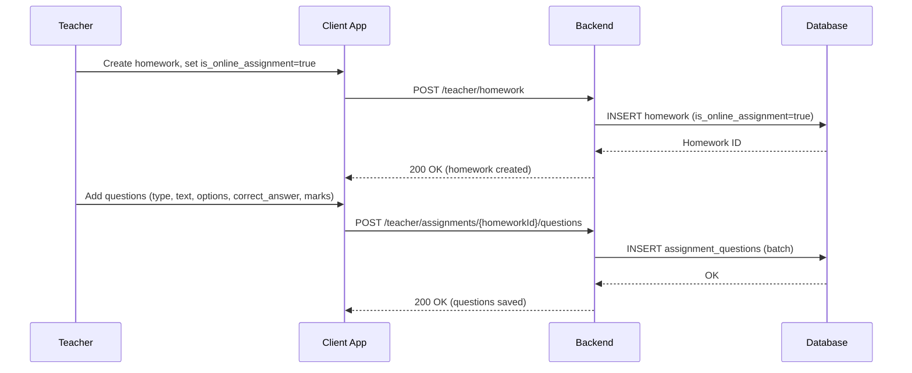
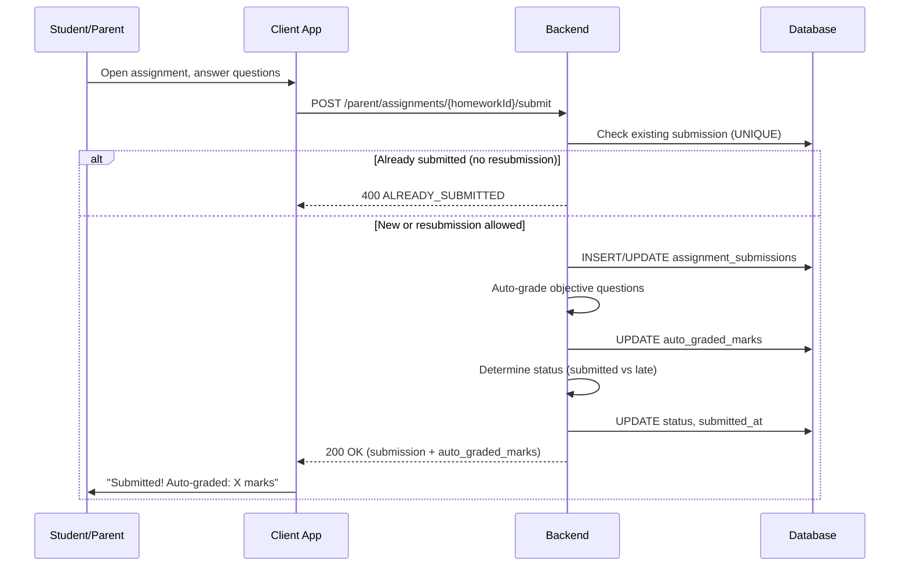
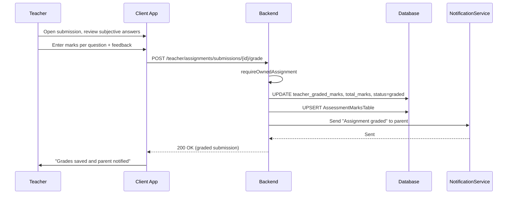
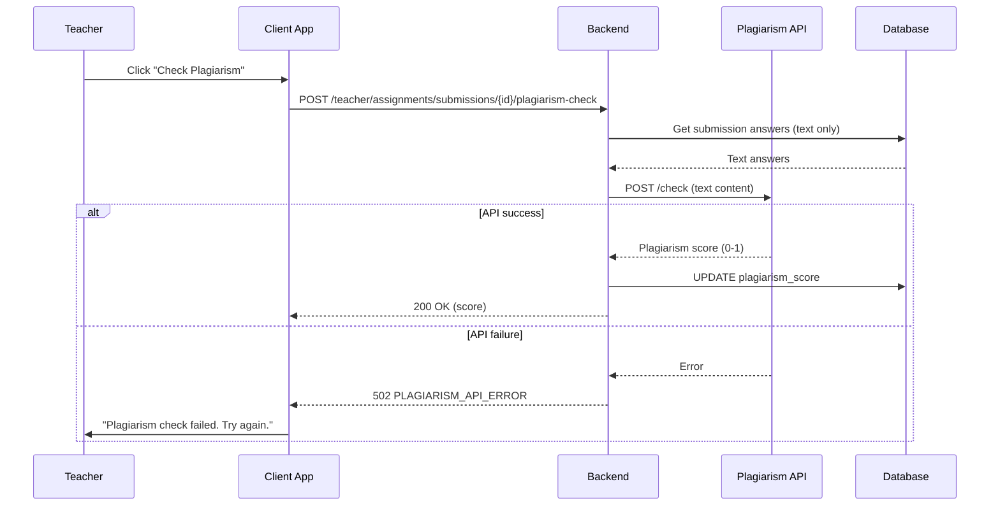
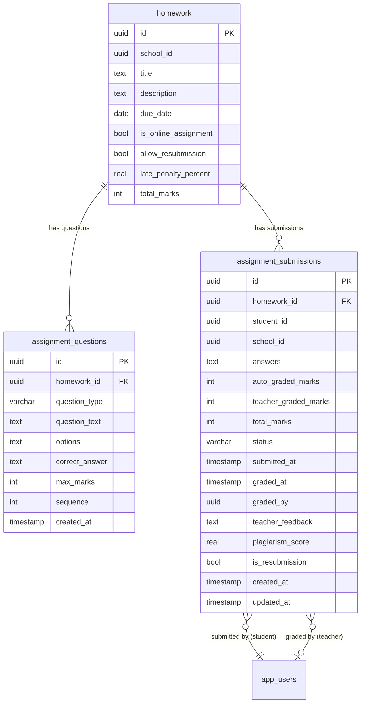

# Online Assignments & Submissions — Technical Specification

> **Document status:** Implementation-ready blueprint
> **Last updated:** 2026-06-27
> **Prerequisites:** None (extends existing homework system)
> **Template:** `_SPEC_TEMPLATE.md` v1 (25 mandatory + 6 optional sections)

---

## 1. Feature Overview

Extend the existing homework system to support online assignment submission: students submit answers/files digitally, teachers review and grade online, with plagiarism check integration and auto-grading for objective questions.

### Goals

- Teacher creates online assignment (objective questions, subjective questions, file upload)
- Student submits answers online (text, file upload, or both)
- Auto-grading for objective questions (MCQ, true/false, fill-in-the-blank)
- Teacher reviews subjective answers and assigns marks
- Plagiarism check for text submissions (optional, via API)
- Submission status tracking (submitted, late, graded, returned)
- Resubmission support (configurable)

### Non-goals

- [ ] Real-time collaborative editing
- [ ] AI-powered auto-grading for subjective answers
- [ ] Proctoring / browser lockdown
- [ ] Peer review / group submissions

### Dependencies

- `HomeworkTable` — existing homework system (extended)
- `HomeworkSubmissionsTable` — existing submissions (extended)
- `HomeworkAttachmentsTable` — existing file attachments
- `AssessmentMarksTable` — results feed into assessment marks
- `NotificationService` — notifications for submission/grading

### Related Modules

- `server/.../feature/homework/` — existing homework module
- `server/.../feature/assignment/` — new assignment module
- `shared/.../homework/` — shared homework DTOs
- `composeApp/.../ui/v2/screens/teacher/` — teacher UI
- `composeApp/.../ui/v2/screens/parent/` — parent/student UI

---

## 2. Current System Assessment

### Existing Code

- `HomeworkTable` (`Tables.kt:920-945`) — homework with `title`, `description`, `dueDate`, `subjectId`, `classId`
- `HomeworkSubmissionsTable` (`Tables.kt:960-975`) — has `submittedAt`, `content`, `status` (SUBMITTED/GRADED/RETURNED), `teacherFeedback`, `marks`
- `HomeworkAttachmentsTable` — file attachments for homework
- `HomeworkExtensionsTable` — extension requests
- Existing system supports text submissions but no structured questions or auto-grading

### Existing Database

- `HomeworkTable` — homework assignments
- `HomeworkSubmissionsTable` — text submissions with status
- `HomeworkAttachmentsTable` — file attachments
- `HomeworkExtensionsTable` — extension requests
- `AssessmentMarksTable` — assessment marks

### Existing APIs

- `GET/POST /api/v1/teacher/homework` — homework management
- `GET/POST /api/v1/parent/homework` — parent homework view
- No structured question or auto-grading APIs

### Existing UI

- Teacher: homework list, homework editor
- Parent: homework list, homework detail
- No question editor, submission, or grading UI

### Existing Services

- `HomeworkService` — homework CRUD
- `NotificationService` — multi-channel notifications

### Existing Documentation

- `feature_audit.csv` — online assignments feature audit
- `IMPLEMENTATION_BACKLOG` — P1-21 entry

### Technical Debt

| # | Gap | Details |
|---|---|---|
| TD-1 | No structured questions | Homework is text-only; no MCQ/true_false/fill_blank |
| TD-2 | No auto-grading | All grading is manual |
| TD-3 | No online submission flow | Students submit text only; no per-question answers |
| TD-4 | No plagiarism check | No integration with plagiarism API |

### Gaps

| # | Gap | Impact | Severity |
|---|---|---|---|
| G1 | No structured questions | Cannot create MCQ/true_false/fill_blank assignments | **High** |
| G2 | No auto-grading | Objective questions must be manually graded | **High** |
| G3 | No per-question submission | Students cannot answer individual questions online | **High** |
| G4 | No plagiarism check | No automated originality verification | **Medium** |
| G5 | No resubmission support | Students cannot redo assignments | **Medium** |

---

## 3. Functional Requirements

### FR-001
| Field | Value |
|---|---|
| **Title** | Create Structured Questions |
| **Description** | Teacher creates assignment with structured questions: MCQ, true/false, fill-in-the-blank, short answer, long answer, file upload |
| **Priority** | Critical |
| **User Roles** | Teacher |
| **Acceptance notes** | Questions stored in `assignment_questions` with type, text, options, correct_answer, max_marks |

### FR-002
| Field | Value |
|---|---|
| **Title** | Student Online Submission |
| **Description** | Student submits answers online per question |
| **Priority** | Critical |
| **User Roles** | Student (via parent app) |
| **Acceptance notes** | Answers stored as JSON in `assignment_submissions.answers` |

### FR-003
| Field | Value |
|---|---|
| **Title** | Auto-Grading |
| **Description** | Auto-grading for objective questions (MCQ, true/false, fill-in) |
| **Priority** | High |
| **User Roles** | System |
| **Acceptance notes** | Compare student answer to `correct_answer`; case-insensitive trim match |

### FR-004
| Field | Value |
|---|---|
| **Title** | Teacher Grading |
| **Description** | Teacher reviews subjective answers, assigns marks, provides feedback |
| **Priority** | High |
| **User Roles** | Teacher |
| **Acceptance notes** | Teacher grades short_answer, long_answer, file_upload questions |

### FR-005
| Field | Value |
|---|---|
| **Title** | Submission Status Tracking |
| **Description** | Submission status: not_started \| in_progress \| submitted \| late \| graded \| returned |
| **Priority** | High |
| **User Roles** | System |
| **Acceptance notes** | Status tracked in `assignment_submissions.status` |

### FR-006
| Field | Value |
|---|---|
| **Title** | Resubmission |
| **Description** | Resubmission allowed (configurable per assignment) |
| **Priority** | Medium |
| **User Roles** | Teacher (config), Student (action) |
| **Acceptance notes** | `homework.allow_resubmission` flag; `is_resubmission` on submission |

### FR-007
| Field | Value |
|---|---|
| **Title** | Late Submission Penalty |
| **Description** | Late submission penalty (configurable: % deduction per day) |
| **Priority** | Medium |
| **User Roles** | Teacher (config), System (calculation) |
| **Acceptance notes** | `homework.late_penalty_percent`; applied to total marks |

### FR-008
| Field | Value |
|---|---|
| **Title** | Plagiarism Check |
| **Description** | Plagiarism check (optional, via external API) |
| **Priority** | Low |
| **User Roles** | Teacher (trigger), System (API call) |
| **Acceptance notes** | `assignment_submissions.plagiarism_score` (0-1); external API integration |

### FR-009
| Field | Value |
|---|---|
| **Title** | Assessment Marks Integration |
| **Description** | Assignment results feed into `AssessmentMarksTable` |
| **Priority** | Medium |
| **User Roles** | System |
| **Acceptance notes** | On grading complete, upsert `AssessmentMarksTable` with total marks |

---

## 4. User Stories

### Teacher
- [ ] Create online assignment with structured questions
- [ ] Add MCQ, true/false, fill-in-the-blank, short answer, long answer, file upload questions
- [ ] Set correct answers for auto-grading
- [ ] Configure resubmission and late penalty
- [ ] View student submissions
- [ ] Grade subjective answers
- [ ] Provide feedback and return submission
- [ ] Trigger plagiarism check

### Student (via Parent App)
- [ ] View online assignment with questions
- [ ] Answer each question (text or file upload)
- [ ] Submit assignment
- [ ] View grades and feedback
- [ ] Resubmit if allowed

### System
- [ ] Auto-grade objective questions on submission
- [ ] Apply late penalty if submitted after due date
- [ ] Track submission status transitions
- [ ] Feed results into AssessmentMarksTable

---

## 5. Business Rules

### BR-001
**Rule:** Auto-grading applies only to objective question types (mcq, true_false, fill_blank).
**Enforcement:** `autoGrade()` checks `question_type` and only grades objective types.

### BR-002
**Rule:** Late submission penalty is a percentage deduction per day from total marks.
**Enforcement:** `late_penalty_percent` applied as `total_marks * (1 - penalty_percent * days_late / 100)`.

### BR-003
**Rule:** Resubmission only allowed if `homework.allow_resubmission = true`.
**Enforcement:** Check flag before allowing resubmission; set `is_resubmission = true`.

### BR-004
**Rule:** One submission per student per assignment (UNIQUE constraint).
**Enforcement:** `UNIQUE(homework_id, student_id)` on `assignment_submissions`.

### BR-005
**Rule:** Plagiarism check is optional and triggered by teacher.
**Enforcement:** `plagiarism_score` nullable; only set when teacher triggers check.

### BR-006
**Rule:** Graded results feed into `AssessmentMarksTable`.
**Enforcement:** On `teacherGrade` completion, upsert `AssessmentMarksTable` with total marks.

---

## 6. Database Design

### 6.1 Entity Relationship Summary

Two new tables: `assignment_questions` (structured questions per homework) and `assignment_submissions` (per-student answers). Existing `homework` table modified with 4 new columns for online assignment configuration.

### 6.2 New Tables

#### `assignment_questions` table

```sql
CREATE TABLE assignment_questions (
    id              UUID PRIMARY KEY DEFAULT gen_random_uuid(),
    homework_id     UUID NOT NULL REFERENCES homework(id) ON DELETE CASCADE,
    question_type   VARCHAR(16) NOT NULL,          -- mcq | true_false | fill_blank | short_answer | long_answer | file_upload
    question_text   TEXT NOT NULL,
    options         TEXT,                          -- JSON array for MCQ: ["Option A", "Option B", ...]
    correct_answer  TEXT,                          -- for auto-grading: "B" or "true" or "Paris"
    max_marks       INTEGER NOT NULL DEFAULT 1,
    sequence        INTEGER NOT NULL,
    created_at      TIMESTAMP NOT NULL DEFAULT now()
);
CREATE INDEX idx_assignment_questions_hw ON assignment_questions(homework_id, sequence);
```

#### `assignment_submissions` table

```sql
CREATE TABLE assignment_submissions (
    id              UUID PRIMARY KEY DEFAULT gen_random_uuid(),
    homework_id     UUID NOT NULL REFERENCES homework(id) ON DELETE CASCADE,
    student_id      UUID NOT NULL,
    school_id       UUID NOT NULL,
    answers         TEXT NOT NULL,                 -- JSON: [{"question_id": "uuid", "answer": "...", "file_url": "..."}]
    auto_graded_marks INTEGER,                     -- marks from auto-graded questions
    teacher_graded_marks INTEGER,                  -- marks from teacher review
    total_marks     INTEGER,                       -- auto + teacher
    status          VARCHAR(16) NOT NULL DEFAULT 'in_progress', -- in_progress | submitted | late | graded | returned
    submitted_at    TIMESTAMP,
    graded_at       TIMESTAMP,
    graded_by       UUID,
    teacher_feedback TEXT,
    plagiarism_score REAL,                         -- 0-1 (if checked)
    is_resubmission BOOLEAN NOT NULL DEFAULT false,
    created_at      TIMESTAMP NOT NULL DEFAULT now(),
    updated_at      TIMESTAMP NOT NULL DEFAULT now(),
    UNIQUE(homework_id, student_id)
);
CREATE INDEX idx_assignment_submissions_hw ON assignment_submissions(homework_id, status);
```

### 6.3 Modified Tables

```sql
ALTER TABLE homework ADD COLUMN is_online_assignment BOOLEAN NOT NULL DEFAULT false;
ALTER TABLE homework ADD COLUMN allow_resubmission BOOLEAN NOT NULL DEFAULT false;
ALTER TABLE homework ADD COLUMN late_penalty_percent REAL NOT NULL DEFAULT 0;
ALTER TABLE homework ADD COLUMN total_marks INTEGER;
```

### 6.4 Indexes

```sql
CREATE INDEX idx_assignment_questions_hw ON assignment_questions(homework_id, sequence);
CREATE INDEX idx_assignment_submissions_hw ON assignment_submissions(homework_id, status);
CREATE INDEX idx_assignment_submissions_student ON assignment_submissions(student_id, status);
```

### 6.5 Constraints

- `assignment_questions.homework_id` — NOT NULL, FK
- `assignment_questions.question_type` — NOT NULL, one of mcq/true_false/fill_blank/short_answer/long_answer/file_upload
- `assignment_questions.question_text` — NOT NULL
- `assignment_questions.sequence` — NOT NULL (question order)
- `assignment_submissions.homework_id` — NOT NULL, FK
- `assignment_submissions.student_id` — NOT NULL
- `assignment_submissions.school_id` — NOT NULL (multi-tenant)
- `assignment_submissions.answers` — NOT NULL (JSON)
- `assignment_submissions.status` — NOT NULL, default 'in_progress'
- UNIQUE(homework_id, student_id) — one submission per student per assignment

### 6.6 Foreign Keys

- `assignment_questions.homework_id` → `homework.id` (ON DELETE CASCADE)
- `assignment_submissions.homework_id` → `homework.id` (ON DELETE CASCADE)
- `assignment_submissions.graded_by` → `app_users.id` (nullable)

### 6.7 Soft Delete Strategy

- No soft delete — assignments and submissions deleted via CASCADE from homework
- Homework soft delete cascades to questions and submissions

### 6.8 Audit Fields

- `created_at` — creation timestamp (both tables)
- `updated_at` — last update timestamp (assignment_submissions)
- `submitted_at` — when student submitted
- `graded_at` — when teacher graded
- `graded_by` — who graded

### 6.9 Migration Notes

Migration: `docs/db/migration_059_online_assignments.sql`
- Creates 2 new tables with indexes
- Alters `homework` table with 4 new columns
- No data backfill needed (new feature)

### 6.10 Exposed Mappings

```kotlin
object AssignmentQuestionsTable : UUIDTable("assignment_questions", "id") {
    val homeworkId    = uuid("homework_id")
    val questionType  = varchar("question_type", 16) // mcq | true_false | fill_blank | short_answer | long_answer | file_upload
    val questionText  = text("question_text")
    val options       = text("options").nullable() // JSON array
    val correctAnswer = text("correct_answer").nullable()
    val maxMarks      = integer("max_marks").default(1)
    val sequence      = integer("sequence")
    val createdAt     = timestamp("created_at")
    init {
        index("idx_assignment_questions_hw", false, homeworkId, sequence)
    }
}

object AssignmentSubmissionsTable : UUIDTable("assignment_submissions", "id") {
    val homeworkId         = uuid("homework_id")
    val studentId          = uuid("student_id")
    val schoolId           = uuid("school_id")
    val answers            = text("answers") // JSON
    val autoGradedMarks    = integer("auto_graded_marks").nullable()
    val teacherGradedMarks = integer("teacher_graded_marks").nullable()
    val totalMarks         = integer("total_marks").nullable()
    val status             = varchar("status", 16).default("in_progress")
    val submittedAt        = timestamp("submitted_at").nullable()
    val gradedAt           = timestamp("graded_at").nullable()
    val gradedBy           = uuid("graded_by").nullable()
    val teacherFeedback    = text("teacher_feedback").nullable()
    val plagiarismScore    = float("plagiarism_score").nullable()
    val isResubmission     = bool("is_resubmission").default(false)
    val createdAt          = timestamp("created_at")
    val updatedAt          = timestamp("updated_at")
    init {
        index("idx_assignment_submissions_hw", false, homeworkId, status)
        index("idx_assignment_submissions_student", false, studentId, status)
        uniqueIndex("idx_assignment_submissions_unique", homeworkId, studentId)
    }
}
```

### 6.11 Seed Data

N/A — questions and submissions created by teachers and students.

---

## 7. State Machines

### Submission Status State Machine

```
NOT_STARTED ──student_opens──> IN_PROGRESS
IN_PROGRESS ──student_submits_before_due──> SUBMITTED
IN_PROGRESS ──student_submits_after_due──> LATE
SUBMITTED ──auto_grade_runs──> SUBMITTED (auto_graded_marks set)
SUBMITTED ──teacher_grades──> GRADED
LATE ──teacher_grades──> GRADED (with penalty)
GRADED ──teacher_returns──> RETURNED
RETURNED ──student_resubmits──> IN_PROGRESS (if allow_resubmission)
```

| Current State | Event | Next State | Guard / Condition |
|---|---|---|---|
| `not_started` | Student opens assignment | `in_progress` | — |
| `in_progress` | Student submits (before due) | `submitted` | `submitted_at = now()` |
| `in_progress` | Student submits (after due) | `late` | `submitted_at = now()`; penalty applies |
| `submitted` | Auto-grade runs | `submitted` | `auto_graded_marks` set |
| `submitted` | Teacher grades | `graded` | `teacher_graded_marks` + `total_marks` set |
| `late` | Teacher grades | `graded` | Late penalty applied to total |
| `graded` | Teacher returns | `returned` | `teacher_feedback` set |
| `returned` | Student resubmits | `in_progress` | `allow_resubmission = true` |

### Auto-Grading Flow

```
SUBMIT_ANSWERS ──parse_answers──> MATCH_QUESTIONS ──grade_objective──> SET_AUTO_MARKS ──COMPLETE
```

| Step | Action | Condition |
|---|---|---|
| 1 | Parse answers JSON | Valid JSON with question_id + answer |
| 2 | Match to questions | By question_id |
| 3 | Grade objective questions | mcq, true_false, fill_blank only |
| 4 | Compare answer to correct_answer | Case-insensitive, trimmed |
| 5 | Sum auto-graded marks | Store in `auto_graded_marks` |

---

## 8. Backend Architecture

### 8.1 Component Overview

`AssignmentService` handles question management, submission processing, auto-grading, teacher grading, plagiarism check, and assessment marks integration. `AssignmentRouting` exposes teacher and student endpoints.

### 8.2 Design Principles

1. **Extend homework system** — online assignments are homework with `is_online_assignment = true`
2. **Auto-grade on submit** — objective questions graded immediately on submission
3. **Teacher grades subjective** — short_answer, long_answer, file_upload require manual review
4. **One submission per student** — UNIQUE constraint prevents duplicates
5. **Configurable policies** — resubmission and late penalty per assignment

### 8.3 Core Types

```kotlin
class AssignmentService {
    suspend fun createQuestions(homeworkId: UUID, questions: List<QuestionDto>)
    suspend fun submitAnswers(homeworkId: UUID, studentId: UUID, answers: List<AnswerDto>): SubmissionDto
    suspend fun autoGrade(submissionId: UUID): Int
    suspend fun teacherGrade(submissionId: UUID, grades: Map<UUID, Int>, feedback: String)
    suspend fun returnSubmission(submissionId: UUID, feedback: String)
    suspend fun checkPlagiarism(submissionId: UUID): Float
}
```

### 8.4 Repositories

- `AssignmentQuestionRepository` — CRUD for questions
- `AssignmentSubmissionRepository` — CRUD for submissions, status queries

### 8.5 Mappers

- `AssignmentQuestionMapper` — maps DB rows to DTOs; parses JSON options
- `AssignmentSubmissionMapper` — maps DB rows to DTOs; parses JSON answers

### 8.6 Permission Checks

- Teacher endpoints: JWT with teacher role + `requireOwnedAssignment`
- Student endpoints: JWT with parent role (child verification)
- Grading: teacher must own the homework's assignment

### 8.7 Background Jobs

- Auto-grading runs synchronously on submission (not background)
- Plagiarism check: async background job (external API call may be slow)

### 8.8 Domain Events

- `AssignmentQuestionsCreated` — emitted when questions added
- `AssignmentSubmitted` — emitted on student submission (triggers auto-grading)
- `AssignmentAutoGraded` — emitted after auto-grading completes
- `AssignmentTeacherGraded` — emitted after teacher grading
- `AssignmentReturned` — emitted when teacher returns submission
- `PlagiarismCheckCompleted` — emitted after plagiarism API returns

### 8.9 Caching

- No caching — submissions are write-once, read-many but low volume
- Question list could be cached per homework (future optimization)

### 8.10 Transactions

- Submit answers: INSERT/UPDATE submission + auto-grade in transaction
- Teacher grade: UPDATE submission + upsert AssessmentMarksTable in transaction
- Create questions: INSERT batch in transaction

### 8.11 Rate Limiting

- Standard API rate limiting
- Plagiarism check: limited to 10 per minute per teacher (external API)

### 8.12 Configuration

- `ASSIGNMENT_PLAGIARISM_API_URL` — external plagiarism API endpoint
- `ASSIGNMENT_PLAGIARISM_API_KEY` — API key for plagiarism service
- `ASSIGNMENT_MAX_QUESTIONS` — default `50` (max questions per assignment)
- `ASSIGNMENT_MAX_FILE_SIZE_MB` — default `25` (max file upload size)

---

## 9. API Contracts

### 9.1 Teacher endpoints

```
POST /api/v1/teacher/assignments/{homeworkId}/questions
GET  /api/v1/teacher/assignments/{homeworkId}/submissions
POST /api/v1/teacher/assignments/submissions/{id}/grade
POST /api/v1/teacher/assignments/submissions/{id}/return
POST /api/v1/teacher/assignments/submissions/{id}/plagiarism-check
```

### 9.2 Student endpoints (via parent app)

```
GET  /api/v1/parent/assignments/{homeworkId}
POST /api/v1/parent/assignments/{homeworkId}/submit
```

### 9.3 Example Responses

**Get Assignment Questions Response 200:**
```json
{
  "success": true,
  "data": {
    "homework_id": "uuid",
    "title": "Math Quiz Chapter 5",
    "is_online_assignment": true,
    "total_marks": 20,
    "allow_resubmission": false,
    "late_penalty_percent": 10,
    "due_date": "2026-07-01",
    "questions": [
      {"id": "uuid", "question_type": "mcq", "question_text": "What is 5+5?", "options": ["8", "9", "10", "11"], "max_marks": 1, "sequence": 1},
      {"id": "uuid", "question_type": "short_answer", "question_text": "Explain photosynthesis", "max_marks": 5, "sequence": 2}
    ]
  }
}
```

**Submit Answers Request:**
```json
{
  "answers": [
    {"question_id": "uuid", "answer": "10"},
    {"question_id": "uuid", "answer": "Photosynthesis is the process by which plants..."}
  ]
}
```

**Submit Answers Response 200:**
```json
{
  "success": true,
  "data": {
    "id": "uuid",
    "status": "submitted",
    "auto_graded_marks": 1,
    "submitted_at": "2026-06-28T10:30:00Z"
  }
}
```

**Teacher Grade Request:**
```json
{
  "grades": {"uuid": 4},
  "feedback": "Good explanation, but include the role of chlorophyll."
}
```

---

## 10. Frontend Architecture

### 10.1 Screens

| Screen | Platform | Role | Description |
|---|---|---|---|
| `AssignmentEditorScreen` | All | Teacher | Question editor (add/edit questions) |
| `AssignmentSubmissionsScreen` | All | Teacher | List of student submissions |
| `AssignmentGradingScreen` | All | Teacher | Grading interface per submission |
| `AssignmentTakeScreen` | All | Student/Parent | Student answer view |
| `AssignmentResultScreen` | All | Student/Parent | View grades and feedback |

### 10.2 Navigation

- Teacher portal → Homework → Online Assignment → `AssignmentEditorScreen`
- Teacher portal → Homework → {assignment} → Submissions → `AssignmentSubmissionsScreen`
- Teacher portal → Homework → {assignment} → {submission} → Grade → `AssignmentGradingScreen`
- Parent portal → Homework → {online assignment} → `AssignmentTakeScreen`
- Parent portal → Homework → {assignment} → Result → `AssignmentResultScreen`

### 10.3 UX Flows

#### Teacher: Create Online Assignment

1. Teacher creates homework (existing flow)
2. Sets `is_online_assignment = true`
3. Opens question editor
4. Adds questions: type, text, options (for MCQ), correct answer (for auto-grade), max marks
5. Sets sequence order
6. Configures resubmission and late penalty
7. Saves assignment

#### Student: Take Assignment

1. Student opens assignment from homework list
2. Views questions one by one or all at once
3. Answers each question (text input or file upload)
4. Saves progress (status = in_progress)
5. Submits assignment (status = submitted/late)
6. Auto-graded questions scored immediately
7. Views auto-graded marks (subjective pending)

#### Teacher: Grade Submissions

1. Teacher opens assignment submissions list
2. Selects a student submission
3. Reviews subjective answers
4. Assigns marks per question
5. Provides overall feedback
6. Submits grades (status = graded)
7. Optionally returns for resubmission (status = returned)

### 10.4 State Management

```kotlin
data class AssignmentState(
    val homework: HomeworkDto?,
    val questions: List<QuestionDto>,
    val submissions: List<SubmissionDto>,
    val currentSubmission: SubmissionDto?,
    val isLoading: Boolean,
    val error: String?,
)
```

### 10.5 Offline Support

- Assignment questions cached locally for offline viewing
- Submission requires network (answers stored server-side)
- Grades and feedback cached after viewing

### 10.6 Loading States

- Loading questions: "Loading assignment questions..."
- Submitting: "Submitting answers..."
- Auto-grading: "Grading objective answers..."
- Teacher grading: "Saving grades..."

### 10.7 Error Handling (UI)

- Past due date: "This assignment is past due. Late penalty will apply."
- Already submitted: "You have already submitted this assignment."
- Resubmission disabled: "Resubmission is not allowed for this assignment."
- No questions: "No questions added to this assignment yet."

### 10.8 Component Integration Guidelines

| Rule | Description |
|---|---|
| **R1** | Question editor with type selector (MCQ, true/false, fill_blank, short_answer, long_answer, file_upload) |
| **R2** | MCQ options editor (add/remove options, mark correct) |
| **R3** | Correct answer field for auto-gradable types |
| **R4** | Max marks per question |
| **R5** | Drag-to-reorder questions (sequence) |
| **R6** | Student answer view: text input for text types, file picker for file_upload |
| **R7** | Save progress button (status = in_progress) |
| **R8** | Submit button with confirmation |
| **R9** | Grading interface: per-question marks input + feedback |
| **R10** | Plagiarism score badge (if checked) |

---

## 11. Shared Module Changes (KMP)

### 11.1 DTOs

```kotlin
data class QuestionDto(
    val id: String,
    val homeworkId: String,
    val questionType: String, // mcq | true_false | fill_blank | short_answer | long_answer | file_upload
    val questionText: String,
    val options: List<String> = emptyList(),
    val correctAnswer: String? = null,
    val maxMarks: Int = 1,
    val sequence: Int,
)

data class AnswerDto(
    val questionId: String,
    val answer: String? = null,
    val fileUrl: String? = null,
)

data class SubmissionDto(
    val id: String,
    val homeworkId: String,
    val studentId: String,
    val answers: List<AnswerDto>,
    val autoGradedMarks: Int?,
    val teacherGradedMarks: Int?,
    val totalMarks: Int?,
    val status: String,
    val submittedAt: String?,
    val gradedAt: String?,
    val teacherFeedback: String?,
    val plagiarismScore: Float?,
    val isResubmission: Boolean,
)
```

### 11.2 Domain Models

```kotlin
data class AssignmentQuestion(
    val id: UUID,
    val homeworkId: UUID,
    val type: QuestionType,
    val text: String,
    val options: List<String>,
    val correctAnswer: String?,
    val maxMarks: Int,
    val sequence: Int,
)

enum class QuestionType {
    MCQ, TRUE_FALSE, FILL_BLANK, SHORT_ANSWER, LONG_ANSWER, FILE_UPLOAD
}

data class AssignmentSubmission(
    val id: UUID,
    val homeworkId: UUID,
    val studentId: UUID,
    val answers: List<StudentAnswer>,
    val autoGradedMarks: Int?,
    val teacherGradedMarks: Int?,
    val totalMarks: Int?,
    val status: SubmissionStatus,
    val submittedAt: Instant?,
    val teacherFeedback: String?,
    val plagiarismScore: Float?,
)

enum class SubmissionStatus {
    NOT_STARTED, IN_PROGRESS, SUBMITTED, LATE, GRADED, RETURNED
}
```

### 11.3 Repository Interfaces

```kotlin
interface AssignmentRepository {
    suspend fun getQuestions(homeworkId: String): NetworkResult<QuestionListResponse>
    suspend fun createQuestions(homeworkId: String, questions: List<QuestionDto>): NetworkResult<ApiResponse<Unit>>
    suspend fun getSubmissions(homeworkId: String): NetworkResult<SubmissionListResponse>
    suspend fun submitAnswers(homeworkId: String, answers: List<AnswerDto>): NetworkResult<SubmissionResponse>
    suspend fun gradeSubmission(submissionId: String, grades: Map<String, Int>, feedback: String): NetworkResult<SubmissionResponse>
    suspend fun returnSubmission(submissionId: String, feedback: String): NetworkResult<SubmissionResponse>
    suspend fun checkPlagiarism(submissionId: String): NetworkResult<PlagiarismResponse>
}
```

### 11.4 UseCases

- `CreateQuestionsUseCase`
- `GetQuestionsUseCase`
- `SubmitAnswersUseCase`
- `GetSubmissionsUseCase`
- `GradeSubmissionUseCase`
- `ReturnSubmissionUseCase`
- `CheckPlagiarismUseCase`

### 11.5 Validation

- Question text: not empty
- MCQ: at least 2 options
- Correct answer: required for mcq, true_false, fill_blank
- Max marks: positive integer
- Answer: not empty for text types; valid URL for file_upload
- Submission: at least one answer

### 11.6 Serialization

Standard Kotlinx serialization. JSON fields (`options`, `answers`) stored as JSON text in DB, parsed to typed lists in DTOs.

### 11.7 Network APIs

Ktor `@Resource` route definitions:
- `TeacherAssignmentApi` — question CRUD, submission list, grading, return, plagiarism
- `ParentAssignmentApi` — get questions, submit answers

### 11.8 Database Models (Local Cache)

- Questions cached locally per homework
- Submission status cached locally
- Grades cached after viewing

---

## 12. Permissions Matrix

| Action | Super Admin | School Admin | Teacher | Parent |
|---|---|---|---|---|
| Create/edit questions | ✅ | ✅ | ✅ (own assignments) | ❌ |
| View submissions | ✅ | ✅ | ✅ (own assignments) | ❌ |
| Grade submissions | ✅ | ❌ | ✅ (own assignments) | ❌ |
| Return submissions | ✅ | ❌ | ✅ (own assignments) | ❌ |
| Trigger plagiarism check | ✅ | ❌ | ✅ | ❌ |
| View assignment questions | ✅ | ✅ | ✅ | ✅ (own child) |
| Submit answers | ❌ | ❌ | ❌ | ✅ (own child) |
| View grades/feedback | ✅ | ✅ | ✅ | ✅ (own child) |

---

## 13. Notifications

### Assignment Notifications

| Type | Trigger | Channel | Message |
|---|---|---|---|
| Assignment Published (Student) | Teacher publishes online assignment | Push + In-app (parent) | "New online assignment: {title}. Due: {date}." |
| Assignment Submitted (Teacher) | Student submits answers | In-app (teacher) | "{student_name} submitted {assignment_title}." |
| Assignment Graded (Student) | Teacher completes grading | Push + In-app (parent) | "Your assignment '{title}' has been graded. Marks: {total}/{max}." |
| Assignment Returned (Student) | Teacher returns submission | Push + In-app (parent) | "Your assignment '{title}' has been returned with feedback." |
| Late Submission (Teacher) | Student submits after due | In-app (teacher) | "{student_name} submitted late: {assignment_title}." |

---

## 14. Background Jobs

### Plagiarism Check Job

| Field | Value |
|---|---|
| **Name** | `PlagiarismCheckJob` |
| **Trigger** | Teacher triggers plagiarism check on submission |
| **Frequency** | On-demand |
| **Description** | Calls external plagiarism API with student text answers |
| **Timeout** | 30 seconds |
| **Retry** | 2 retries with exponential backoff |
| **On failure** | `plagiarism_score` remains null; teacher notified |

---

## 15. Integrations

### HomeworkTable
| Field | Value |
|---|---|
| **System** | Existing homework system |
| **Purpose** | Extended with `is_online_assignment`, `allow_resubmission`, `late_penalty_percent`, `total_marks` |
| **API / SDK** | Direct DB via Exposed |
| **Auth method** | Internal |
| **Fallback** | None — homework is the base entity |

### HomeworkSubmissionsTable
| Field | Value |
|---|---|
| **System** | Existing submissions |
| **Purpose** | Reference for existing text submission pattern |
| **API / SDK** | Direct DB via Exposed |
| **Auth method** | Internal |
| **Fallback** | N/A — pattern reference |

### AssessmentMarksTable
| Field | Value |
|---|---|
| **System** | Existing assessment marks |
| **Purpose** | Feed graded assignment results into assessment marks |
| **API / SDK** | Direct DB via Exposed |
| **Auth method** | Internal |
| **Fallback** | None — upsert on grading complete |

### NotificationService
| Field | Value |
|---|---|
| **System** | Existing notification infrastructure |
| **Purpose** | Send assignment published/submitted/graded/returned notifications |
| **API / SDK** | Internal `NotificationService` |
| **Auth method** | Internal service call |
| **Fallback** | In-app notification if push fails |

### Plagiarism API (External)
| Field | Value |
|---|---|
| **System** | External plagiarism detection service |
| **Purpose** | Check text submissions for originality |
| **API / SDK** | REST API (configurable URL + API key) |
| **Auth method** | API key |
| **Fallback** | `plagiarism_score` remains null; teacher notified of failure |

### File Storage
| Field | Value |
|---|---|
| **System** | Existing file storage (S3 or similar) |
| **Purpose** | Store file upload answers |
| **API / SDK** | Internal file upload service |
| **Auth method** | Internal |
| **Fallback** | None — file storage required for file_upload questions |

---

## 16. Security

### Authentication
- Teacher endpoints: JWT with teacher role
- Student endpoints: JWT with parent role (child verification)

### Authorization
- Question management: teacher must own the homework's assignment
- Grading: teacher must own the homework's assignment
- Submission: parent can only submit for own child
- View grades: parent can only view own child's grades

### Encryption
- All API communication over TLS
- File uploads encrypted at rest (S3 server-side encryption)

### Audit Logs
- Question creation logged (homeworkId, questionCount, teacherId)
- Submission logged (homeworkId, studentId, status, submittedAt)
- Auto-grading logged (submissionId, autoGradedMarks)
- Teacher grading logged (submissionId, teacherGradedMarks, totalMarks, gradedBy)
- Return logged (submissionId, feedback)
- Plagiarism check logged (submissionId, score, apiResponseTime)

### PII Handling
- Student answers may contain student-generated content
- File uploads may contain student work
- Plagiarism API receives student text (data sharing consent required)

### Data Isolation
- All queries filtered by `school_id` (multi-tenant)
- Parent queries filtered by child_id (verified parent-child relationship)
- Teacher queries filtered by assignment ownership

### Rate Limiting
- Standard API rate limiting
- Plagiarism check: 10 per minute per teacher

### Input Validation
- Question text: not empty
- MCQ options: at least 2
- Correct answer: required for auto-gradable types
- Max marks: positive integer
- Answer text: max 10,000 characters
- File upload: max 25 MB, allowed MIME types

---

## 17. Performance & Scalability

### Expected Scale

| Metric | Small school | Medium school | Large school |
|---|---|---|---|
| Online assignments per month | ~50 | ~200 | ~500 |
| Questions per assignment | ~10 | ~20 | ~30 |
| Students per assignment | ~30 | ~60 | ~100 |
| Submissions per assignment | ~25 | ~50 | ~90 |
| Concurrent submissions (peak) | ~10 | ~50 | ~200 |

### Latency Targets

| Operation | Target |
|---|---|
| Get questions | < 100ms |
| Submit answers (with auto-grade) | < 200ms |
| Get submissions list | < 100ms |
| Teacher grade | < 100ms |
| Plagiarism check | < 30s (external API) |

### Optimization Strategy

- Questions indexed by (homework_id, sequence) for ordered retrieval
- Submissions indexed by (homework_id, status) for teacher review
- Submissions indexed by (student_id, status) for student view
- Auto-grading runs inline (synchronous, < 50ms for 30 questions)
- UNIQUE constraint prevents duplicate submissions

---

## 18. Edge Cases

| # | Scenario | Expected Behavior |
|---|---|---|
| EC-001 | Student submits after due date | Status = late; penalty applied |
| EC-002 | Student submits twice (no resubmission) | Rejected: "Already submitted" |
| EC-003 | Student submits twice (resubmission allowed) | Previous submission overwritten; `is_resubmission = true` |
| EC-004 | No correct answer set for objective question | Question skipped in auto-grading; 0 marks |
| EC-005 | File upload fails | Submission saved without file; student can retry |
| EC-006 | Plagiarism API unavailable | `plagiarism_score` = null; teacher notified |
| EC-007 | Teacher grades before student submits | Rejected: "No submission to grade" |
| EC-008 | All questions are objective | `teacher_graded_marks` = 0; `total_marks` = `auto_graded_marks` |

### Risks & Mitigations

| Risk | Likelihood | Impact | Mitigation |
|---|---|---|---|
| Plagiarism API downtime | Medium | Low | Graceful degradation; null score |
| Concurrent submissions | Low | Low | UNIQUE constraint + transaction |
| Large file uploads | Medium | Medium | 25 MB limit; async upload |
| Auto-grading edge cases | Low | Low | Case-insensitive trim comparison |

---

## 19. Error Handling

### Standard Error Codes

| HTTP | Error Code | Description | When |
|---|---|---|---|
| 400 | `ALREADY_SUBMITTED` | Student already submitted and resubmission disabled | Submit |
| 400 | `NO_QUESTIONS` | Assignment has no questions | Submit |
| 400 | `NO_SUBMISSION_TO_GRADE` | No submission exists for grading | Grade |
| 400 | `INVALID_ANSWER_FORMAT` | Answer JSON malformed | Submit |
| 400 | `FILE_TOO_LARGE` | File upload exceeds 25 MB | Submit |
| 400 | `INVALID_FILE_TYPE` | File MIME type not allowed | Submit |
| 403 | `ASSIGNMENT_NOT_OWNED` | Teacher doesn't own the assignment | Teacher endpoints |
| 403 | `NOT_CHILD_PARENT` | Parent doesn't own the child | Student endpoints |
| 404 | `HOMEWORK_NOT_FOUND` | Homework doesn't exist | Any endpoint |
| 404 | `SUBMISSION_NOT_FOUND` | Submission doesn't exist | Grade/return |
| 502 | `PLAGIARISM_API_ERROR` | External plagiarism API failed | Plagiarism check |

### Error Response Format

Same as existing API error format.

### Recovery Strategy

| Error | Client Action | Server Action |
|---|---|---|
| `ALREADY_SUBMITTED` | Show "You have already submitted this assignment." | Return 400 |
| `PLAGIARISM_API_ERROR` | Show "Plagiarism check failed. Please try again." | Return 502; log API error |
| `FILE_TOO_LARGE` | Show "File exceeds 25 MB limit." | Return 400 |

---

## 20. Analytics & Reporting

### Reports

- **Assignment Performance Report:** Average marks per assignment
- **Question Difficulty Report:** % correct per question (for objective questions)
- **Submission Rate Report:** % of students who submitted on time vs late
- **Grading Turnaround Report:** Time from submission to grading
- **Plagiarism Report:** Submissions with high plagiarism scores

### KPIs

- **Submission Rate:** % of students who submitted
- **On-Time Rate:** % of submissions before due date
- **Auto-Grade Coverage:** % of marks from auto-grading
- **Average Grade:** Mean total marks per assignment
- **Grading Turnaround:** Average hours from submission to grading

### Dashboards

- Teacher: submissions list with status and marks
- Admin: school-wide assignment performance overview

### Exports

- Submission results CSV export
- Question performance CSV export
- Grade report PDF export

---

## 21. Testing Strategy

### Unit Tests

| Test | What it verifies |
|---|---|
| Create questions | Questions stored with correct fields and sequence |
| Auto-grade MCQ | Correct answer gets marks; wrong answer gets 0 |
| Auto-grade true_false | Boolean comparison works |
| Auto-grade fill_blank | Case-insensitive trim comparison |
| Auto-grade subjective | Skipped (no auto-grade for subjective) |
| Submit answers | Submission stored with correct status |
| Submit late | Status = late; penalty applied |
| Resubmission disabled | Rejected with error |
| Resubmission enabled | Previous overwritten; is_resubmission = true |
| Teacher grade | Marks and feedback stored; status = graded |
| Return submission | Status = returned; feedback stored |
| Assessment marks integration | AssessmentMarksTable upserted on grading |

### Integration Tests

| Test | What it verifies |
|---|---|
| Create assignment → add questions → student submits → auto-grade → teacher grades | Full lifecycle |
| Create assignment → student submits late → penalty applied | Late penalty flow |
| Create assignment → student submits → teacher returns → student resubmits | Resubmission flow |
| Plagiarism check → score stored | Plagiarism integration |

### Performance Tests

- [ ] Auto-grading 30 questions < 50ms
- [ ] Submit answers with 30 questions < 200ms
- [ ] Get submissions list for 100 students < 100ms

### Security Tests

- [ ] Teacher cannot grade unowned assignment
- [ ] Parent can only submit for own child
- [ ] Parent can only view own child's grades
- [ ] All queries school-scoped

### Migration Tests

- [ ] Migration creates 2 tables with correct schema
- [ ] ALTER TABLE adds 4 columns to homework
- [ ] CASCADE delete works (homework → questions, submissions)

---

## 22. Acceptance Criteria

- [ ] Teacher creates assignments with structured questions (MCQ, true/false, fill-in, short/long answer, file upload)
- [ ] Student submits answers online
- [ ] Auto-grading works for objective questions
- [ ] Teacher reviews and grades subjective answers
- [ ] Submission status tracked correctly
- [ ] Late submission penalty applied
- [ ] Resubmission supported when enabled
- [ ] Results can feed into assessment marks

---

## 23. Implementation Roadmap

| Phase | Duration | Tasks | Breaking? | Deliverable |
|---|---|---|---|---|
| 1 | 1 day | DB migration, Exposed tables | No | Schema ready |
| 2 | 2 days | AssignmentService (questions, submissions, auto-grading) | No | Service ready |
| 3 | 2 days | Teacher grading + return workflow | No | Grading ready |
| 4 | 1 day | Plagiarism check integration (optional) | No | Plagiarism ready |
| 5 | 2 days | API endpoints | No | APIs available |
| 6 | 3 days | Client UI (question editor, student answer view, grading interface) | No | UI ready |
| 7 | 2 days | Tests | No | Test coverage |

**Total: ~13 days**

---

## 24. File-Level Impact Analysis

### New Files

| File | Location | Purpose |
|---|---|---|
| `AssignmentService.kt` | `server/.../feature/assignment/` | Core service |
| `AssignmentRouting.kt` | `server/.../feature/assignment/` | API endpoints |
| `migration_059_online_assignments.sql` | `docs/db/` | DDL migration |
| `AssignmentApi.kt` | `shared/.../assignment/` | Client API |
| `AssignmentDtos.kt` | `shared/.../assignment/` | DTOs |
| `AssignmentRepository.kt` | `shared/.../assignment/` | Repository interface |
| `AssignmentRepositoryImpl.kt` | `shared/.../assignment/` | Repository impl |
| `AssignmentEditorScreen.kt` | `composeApp/.../ui/v2/screens/teacher/` | Question editor |
| `AssignmentGradingScreen.kt` | `composeApp/.../ui/v2/screens/teacher/` | Grading interface |
| `AssignmentSubmissionsScreen.kt` | `composeApp/.../ui/v2/screens/teacher/` | Submissions list |
| `AssignmentTakeScreen.kt` | `composeApp/.../ui/v2/screens/parent/` | Student submission UI |
| `AssignmentResultScreen.kt` | `composeApp/.../ui/v2/screens/parent/` | Result view |
| `AssignmentViewModel.kt` | `composeApp/.../ui/v2/viewmodel/` | MVI state |

### Modified Files

| File | Change Type | Lines Changed (est.) | Risk | Description |
|---|---|---|---|---|
| `server/.../db/Tables.kt` | Add + Modify | ~50 | Low | 2 new table objects + 4 columns on HomeworkTable |
| `server/.../db/DatabaseFactory.kt` | Modify | ~4 | Low | Register 2 tables |
| `server/.../feature/homework/HomeworkService.kt` | Modify | ~10 | Low | Set `is_online_assignment` flag |
| `shared/.../homework/HomeworkModels.kt` | Add | ~20 | Low | Add online assignment fields to homework DTO |

### Files Preserved Unchanged

| File | Reason |
|---|---|
| `HomeworkSubmissionsTable` | Reference only; new `AssignmentSubmissionsTable` is separate |
| `HomeworkAttachmentsTable` | Used as-is for homework attachments |
| `AssessmentMarksTable` | Upserted on grading (schema unchanged) |
| `NotificationService` | Used as-is for notifications |

---

## 25. Future Enhancements

### AI-Powered Auto-Grading

- AI grades subjective answers (short_answer, long_answer)
- Rubric-based AI grading with confidence scores
- Teacher review of AI grades with override capability
- AI-generated feedback suggestions

### Proctoring / Browser Lockdown

- Browser lockdown during assignment (no tabs, no copy-paste)
- Webcam monitoring for identity verification
- Screen recording for review
- Tab-switch detection and flagging

### Question Bank / Reusable Questions

- School-wide question bank
- Tag questions by topic, difficulty, subject
- Reuse questions across assignments
- Import/export question bank

### Timed Assignments

- Set time limit per assignment (e.g., 60 minutes)
- Auto-submit when time expires
- Per-question time tracking
- Pause/resume for accommodations

### Group / Peer Submissions

- Group assignments with shared submission
- Peer review workflow (students grade each other)
- Group member contribution tracking
- Peer review rubrics

### Question Randomization

- Shuffle question order per student
- Shuffle MCQ options per student
- Random question selection from pool
- Prevent answer sharing between students

### Rich Media Questions

- Images in questions (diagrams, charts)
- Video questions (watch and answer)
- Audio questions (listen and answer)
- Interactive questions (drag-and-drop, matching)

### Assignment Analytics

- Per-question difficulty analysis
- Common wrong answers analysis
- Student performance trends over time
- Question effectiveness metrics

### Bulk Grading

- Grade multiple submissions at once
- Spreadsheet-like grading interface
- Bulk feedback templates
- Grade distribution visualization

### Assignment Templates

- Save assignment structure as template
- Quick-create from template
- Template library management
- Share templates across teachers

---

## A. Sequence Diagrams

### Create Online Assignment with Questions Flow



### Student Submit Answers Flow



### Teacher Grade Submission Flow



### Plagiarism Check Flow



---

## B. Domain Model / ER Diagram



---

## C. Event Flow

```
QuestionsCreated -> Complete
AssignmentSubmitted -> AutoGrade -> SetAutoMarks -> Complete
AssignmentSubmitted (late) -> AutoGrade -> ApplyPenalty -> Complete
TeacherGraded -> SetTotalMarks -> UpsertAssessmentMarks -> NotifyParent -> Complete
AssignmentReturned -> NotifyParent -> Complete
PlagiarismCheck -> CallExternalAPI -> SetScore -> Complete
```

| Event | Emitted By | Consumed By | Side Effect |
|---|---|---|---|
| `AssignmentQuestionsCreated` | AssignmentService.createQuestions() | Analytics | Counter incremented |
| `AssignmentSubmitted` | AssignmentService.submitAnswers() | AutoGrader | Auto-grading triggered |
| `AssignmentAutoGraded` | AssignmentService.autoGrade() | Analytics | Auto-graded marks recorded |
| `AssignmentTeacherGraded` | AssignmentService.teacherGrade() | Notification, Assessment | Parent notified; marks upserted |
| `AssignmentReturned` | AssignmentService.returnSubmission() | Notification | Parent notified |
| `PlagiarismCheckCompleted` | AssignmentService.checkPlagiarism() | Analytics | Score recorded |

---

## D. Configuration

### Environment Variables

| Variable | Description |
|---|---|
| `ASSIGNMENT_PLAGIARISM_API_URL` | External plagiarism API endpoint |
| `ASSIGNMENT_PLAGIARISM_API_KEY` | API key for plagiarism service |
| `ASSIGNMENT_MAX_QUESTIONS` | Max questions per assignment (default: `50`) |
| `ASSIGNMENT_MAX_FILE_SIZE_MB` | Max file upload size (default: `25`) |
| `ASSIGNMENT_PLAGIARISM_RATE_LIMIT` | Plagiarism checks per minute (default: `10`) |

### Feature Flags

| Flag | Default | Description |
|---|---|---|
| `online_assignments_enabled` | `true` | Master switch for online assignments |
| `assignment_auto_grading` | `true` | Enable auto-grading for objective questions |
| `assignment_plagiarism_check` | `false` | Enable plagiarism check integration |
| `assignment_resubmission` | `true` | Enable resubmission feature |
| `assignment_file_upload` | `true` | Enable file upload questions |

### Client-Side Configuration

| Config | Default | Description |
|---|---|---|
| Question list page size | 50 | Questions per page |
| Submission list page size | 50 | Submissions per page |
| Auto-save interval | 30s | Auto-save in-progress answers |
| Max answer length | 10,000 | Max characters per text answer |

### Server-Side Configuration

| Config | Default | Description |
|---|---|---|
| Max questions | 50 | Max questions per assignment |
| Max file size | 25 MB | Max file upload size |
| Plagiarism rate limit | 10/min | Plagiarism API calls per teacher |
| Plagiarism timeout | 30s | External API timeout |
| Plagiarism retries | 2 | Retry count with backoff |

### Infrastructure Requirements

- PostgreSQL with JSON text support (for options and answers)
- File storage (S3 or similar) for file upload questions
- External plagiarism API (optional, configurable)
- Standard notification infrastructure

---

## E. Migration & Rollback

### Deployment Plan

1. [ ] Run `migration_059_online_assignments.sql` — creates 2 tables + alters homework
2. [ ] Deploy 2 assignment table objects in `Tables.kt`
3. [ ] Add 4 columns to `HomeworkTable` in `Tables.kt`
4. [ ] Register tables in `DatabaseFactory.kt`
5. [ ] Deploy `AssignmentService` and `AssignmentRouting`
6. [ ] Modify `HomeworkService` for `is_online_assignment` flag
7. [ ] Deploy shared KMP layer (DTOs, repository, API)
8. [ ] Deploy client UI (question editor, submission, grading)
9. [ ] Configure plagiarism API (if enabled)
10. [ ] Deploy to production

### Rollback Plan

1. [ ] Disable feature flag `online_assignments_enabled` → APIs return 404
2. [ ] Remove client UI → assignment screens not shown
3. [ ] Database: `DROP TABLE IF EXISTS assignment_submissions; DROP TABLE IF EXISTS assignment_questions; ALTER TABLE homework DROP COLUMN IF EXISTS is_online_assignment, DROP COLUMN IF EXISTS allow_resubmission, DROP COLUMN IF EXISTS late_penalty_percent, DROP COLUMN IF EXISTS total_marks;`
4. [ ] No data loss — existing homework unaffected (columns are additive)

### Data Backfill

N/A — online assignments created by teachers. Existing homework has `is_online_assignment = false` (default).

### Migration SQL

```sql
-- migration_059_online_assignments.sql
CREATE TABLE IF NOT EXISTS assignment_questions (
    id              UUID PRIMARY KEY DEFAULT gen_random_uuid(),
    homework_id     UUID NOT NULL REFERENCES homework(id) ON DELETE CASCADE,
    question_type   VARCHAR(16) NOT NULL,
    question_text   TEXT NOT NULL,
    options         TEXT,
    correct_answer  TEXT,
    max_marks       INTEGER NOT NULL DEFAULT 1,
    sequence        INTEGER NOT NULL,
    created_at      TIMESTAMP NOT NULL DEFAULT now()
);

CREATE INDEX IF NOT EXISTS idx_assignment_questions_hw ON assignment_questions(homework_id, sequence);

CREATE TABLE IF NOT EXISTS assignment_submissions (
    id              UUID PRIMARY KEY DEFAULT gen_random_uuid(),
    homework_id     UUID NOT NULL REFERENCES homework(id) ON DELETE CASCADE,
    student_id      UUID NOT NULL,
    school_id       UUID NOT NULL,
    answers         TEXT NOT NULL,
    auto_graded_marks INTEGER,
    teacher_graded_marks INTEGER,
    total_marks     INTEGER,
    status          VARCHAR(16) NOT NULL DEFAULT 'in_progress',
    submitted_at    TIMESTAMP,
    graded_at       TIMESTAMP,
    graded_by       UUID,
    teacher_feedback TEXT,
    plagiarism_score REAL,
    is_resubmission BOOLEAN NOT NULL DEFAULT false,
    created_at      TIMESTAMP NOT NULL DEFAULT now(),
    updated_at      TIMESTAMP NOT NULL DEFAULT now(),
    UNIQUE(homework_id, student_id)
);

CREATE INDEX IF NOT EXISTS idx_assignment_submissions_hw ON assignment_submissions(homework_id, status);
CREATE INDEX IF NOT EXISTS idx_assignment_submissions_student ON assignment_submissions(student_id, status);

ALTER TABLE homework ADD COLUMN IF NOT EXISTS is_online_assignment BOOLEAN NOT NULL DEFAULT false;
ALTER TABLE homework ADD COLUMN IF NOT EXISTS allow_resubmission BOOLEAN NOT NULL DEFAULT false;
ALTER TABLE homework ADD COLUMN IF NOT EXISTS late_penalty_percent REAL NOT NULL DEFAULT 0;
ALTER TABLE homework ADD COLUMN IF NOT EXISTS total_marks INTEGER;

-- ROLLBACK:
-- ALTER TABLE homework DROP COLUMN IF EXISTS total_marks;
-- ALTER TABLE homework DROP COLUMN IF EXISTS late_penalty_percent;
-- ALTER TABLE homework DROP COLUMN IF EXISTS allow_resubmission;
-- ALTER TABLE homework DROP COLUMN IF EXISTS is_online_assignment;
-- DROP TABLE IF EXISTS assignment_submissions;
-- DROP TABLE IF EXISTS assignment_questions;
```

---

## F. Observability

### Logging

- Questions created: INFO `assignment_questions_created` (homeworkId, questionCount, teacherId)
- Assignment submitted: INFO `assignment_submitted` (homeworkId, studentId, status, submittedAt)
- Auto-graded: INFO `assignment_auto_graded` (submissionId, autoGradedMarks, questionCount)
- Teacher graded: INFO `assignment_teacher_graded` (submissionId, teacherGradedMarks, totalMarks, gradedBy)
- Assignment returned: INFO `assignment_returned` (submissionId, feedback)
- Plagiarism check: INFO `assignment_plagiarism_checked` (submissionId, score, apiResponseTimeMs)
- Plagiarism API error: WARN `assignment_plagiarism_error` (submissionId, errorCode, errorMessage)
- Late submission: INFO `assignment_late_submission` (homeworkId, studentId, daysLate, penaltyApplied)
- Resubmission: INFO `assignment_resubmission` (homeworkId, studentId, resubmissionCount)

### Metrics

| Metric | Type | Description |
|---|---|---|
| `assignment.questions_total` | Gauge | Total questions created |
| `assignment.submissions_total` | Gauge | Total submissions |
| `assignment.submitted` | Counter | Total submissions submitted |
| `assignment.auto_graded` | Counter | Total auto-graded submissions |
| `assignment.teacher_graded` | Counter | Total teacher-graded submissions |
| `assignment.returned` | Counter | Total returned submissions |
| `assignment.late_submissions` | Counter | Total late submissions |
| `assignment.resubmissions` | Counter | Total resubmissions |
| `assignment.plagiarism_checks` | Counter | Total plagiarism checks |
| `assignment.auto_grade_time_ms` | Histogram | Auto-grading latency |
| `assignment.plagiarism_api_time_ms` | Histogram | Plagiarism API response time |
| `assignment.grading_turnaround_hours` | Histogram | Submission to grading time |

### Health Checks

- `GET /api/v1/health` — existing health check

### Alerts

- Plagiarism API error rate > 20% → Warning (external service issues)
- Auto-grading failure rate > 5% → Warning (correct_answer data issues)
- Grading turnaround > 7 days → Info (teachers may be behind on grading)
- Late submission rate > 50% → Info (due dates may need adjustment)
