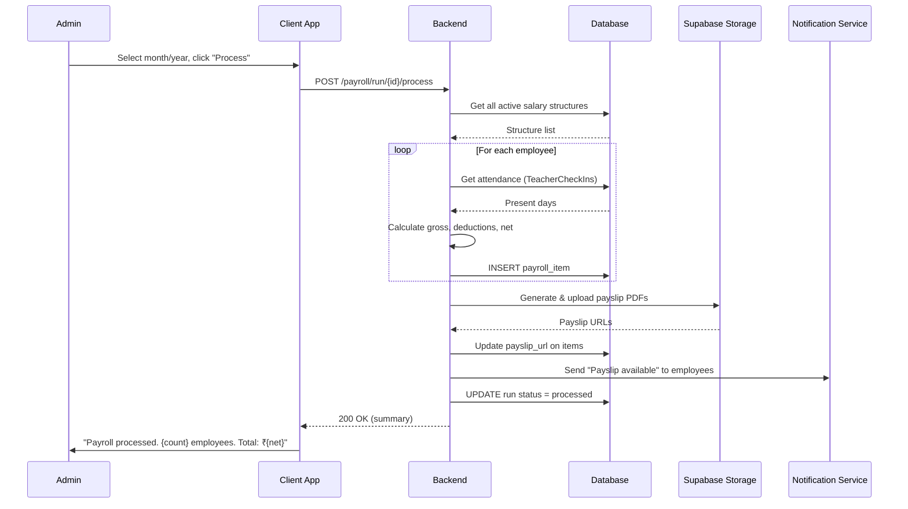
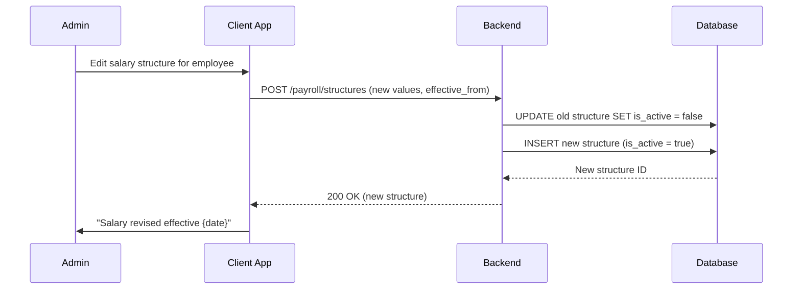
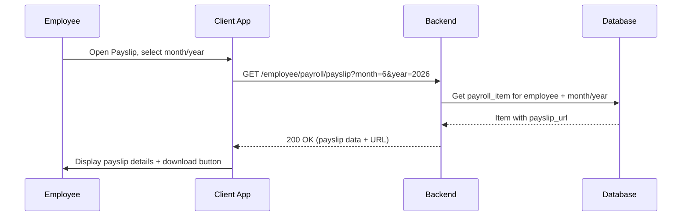
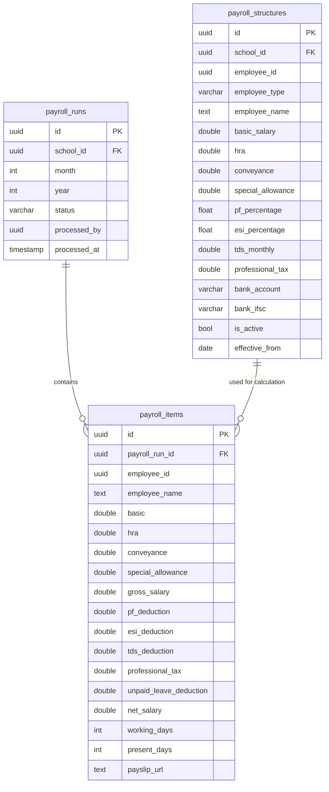

# Payroll Management — Technical Specification

> **Document status:** Implementation-ready blueprint
> **Last updated:** 2026-06-27
> **Prerequisites:** None
> **Template:** `_SPEC_TEMPLATE.md` v1 (25 mandatory + 6 optional sections)

---

## 1. Feature Overview

Staff payroll management: salary structure, payslip generation, attendance-linked calculation, deductions (PF, ESI, TDS), and payroll reports.

### Goals

- Admin defines salary structure per staff (basic, HRA, allowances, deductions)
- Monthly payroll calculation based on attendance
- Payslip PDF generation
- PF, ESI, TDS deduction support
- Payroll register and bank statement export

### Non-goals

- [ ] Direct bank integration / auto-disbursement
- [ ] Leave management system (uses attendance data only)
- [ ] Performance-linked incentive calculation
- [ ] Multi-currency support

### Dependencies

- `NonTeachingStaffTable` — non-teaching staff records
- `FacultyTable` + `AppUsersTable` — teacher records
- `TeacherCheckInsTable` — staff attendance for deduction calculation
- PDF generation library for payslip creation

### Related Modules

- `server/.../feature/staff/` — staff management
- `server/.../feature/attendance/` — attendance tracking
- `server/.../feature/notifications/` — payslip notifications

---

## 2. Current System Assessment

### Existing Code

- `feature_audit.csv` L137: Payroll missing (0%)
- `NonTeachingStaffTable` exists for non-teaching staff
- `FacultyTable` + `AppUsersTable` for teachers
- `AttendanceRecordsTable` for student attendance (not staff)
- `TeacherCheckInsTable` — teacher check-in records (can be used for staff attendance)

### Existing Database

- `NonTeachingStaffTable` — non-teaching staff (name, role, phone, salary)
- `FacultyTable` — teacher assignments
- `AppUsersTable` — user accounts (teachers are app_users)
- `TeacherCheckInsTable` — teacher check-in/check-out records
- No payroll tables exist

### Existing APIs

- `GET /api/v1/school/staff` — staff management
- `GET /api/v1/school/faculty` — faculty management
- No payroll APIs exist

### Existing UI

- Admin: staff management, faculty management
- No payroll UI

### Existing Services

- `StaffService` — staff CRUD
- No payroll services

### Existing Documentation

- `feature_audit.csv` — feature audit tracking (payroll at 0%)
- `DIFFERENTIATING_FEATURES.md` — payroll feature description

### Technical Debt

| # | Gap | Details |
|---|---|---|
| TD-1 | No payroll management | 0% implementation |
| TD-2 | No payroll tables | No DB schema for structures, runs, items |
| TD-3 | No staff attendance integration | TeacherCheckInsTable exists but not used for payroll |
| TD-4 | No payslip generation | No PDF generation for payslips |

### Gaps

| # | Gap | Impact | Severity |
|---|---|---|---|
| G1 | No salary structure | Cannot define salary components per employee | **High** |
| G2 | No payroll calculation | Cannot calculate monthly payroll | **High** |
| G3 | No payslip generation | Employees don't receive payslips | **High** |
| G4 | No deductions support | PF/ESI/TDS not calculated | **Medium** |
| G5 | No bank statement export | Manual bank transfer preparation | **Medium** |

---

## 3. Functional Requirements

### FR-001
| Field | Value |
|---|---|
| **Title** | Salary Structure Definition |
| **Description** | Define salary structure: basic, HRA, conveyance, special allowance, PF, ESI, TDS, professional tax |
| **Priority** | Critical |
| **User Roles** | School Admin |
| **Acceptance notes** | All components configurable per employee; effective_from date for revisions |

### FR-002
| Field | Value |
|---|---|
| **Title** | Monthly Payroll Calculation |
| **Description** | Monthly payroll calculation: gross = basic + allowances; net = gross - deductions |
| **Priority** | Critical |
| **User Roles** | School Admin |
| **Acceptance notes** | Automatic calculation with all components; per-employee payroll items |

### FR-003
| Field | Value |
|---|---|
| **Title** | Attendance-Linked Deductions |
| **Description** | Attendance-linked: deductions for unpaid leave |
| **Priority** | High |
| **User Roles** | System |
| **Acceptance notes** | Uses TeacherCheckInsTable for teachers; working_days vs present_days calculation |

### FR-004
| Field | Value |
|---|---|
| **Title** | Payslip PDF Generation |
| **Description** | Generate payslip PDF per employee per month |
| **Priority** | High |
| **User Roles** | School Admin |
| **Acceptance notes** | PDF with all components, deductions, net salary; stored in Supabase Storage |

### FR-005
| Field | Value |
|---|---|
| **Title** | Payroll Register |
| **Description** | Payroll register: all employees, monthly summary |
| **Priority** | Medium |
| **User Roles** | School Admin |
| **Acceptance notes** | Summary view of all payroll items for a run |

### FR-006
| Field | Value |
|---|---|
| **Title** | Bank Statement Export |
| **Description** | Bank statement export (CSV with account details for bank transfer) |
| **Priority** | Medium |
| **User Roles** | School Admin |
| **Acceptance notes** | CSV with employee name, account number, IFSC, net amount |

### FR-007
| Field | Value |
|---|---|
| **Title** | Salary Revision History |
| **Description** | Salary revision history |
| **Priority** | Low |
| **User Roles** | School Admin |
| **Acceptance notes** | History of salary structure changes with effective dates |

---

## 4. User Stories

### School Admin
- [ ] Define salary structure for a teacher or non-teaching staff
- [ ] Run monthly payroll for all employees
- [ ] Review payroll items before processing
- [ ] Generate payslip PDFs for all employees
- [ ] Export bank statement CSV for bank transfer
- [ ] View payroll register for any month
- [ ] Revise salary structure with effective date
- [ ] View salary revision history for an employee

### Employee (Teacher / Non-Teaching Staff)
- [ ] View my payslip for any month
- [ ] See my salary structure components
- [ ] Download payslip PDF

### System
- [ ] Calculate gross salary (basic + HRA + conveyance + special allowance)
- [ ] Calculate PF deduction (basic * pf_percentage)
- [ ] Calculate ESI deduction (gross * esi_percentage)
- [ ] Calculate unpaid leave deduction based on attendance
- [ ] Calculate net salary (gross - all deductions)
- [ ] Generate payslip PDF
- [ ] Track payroll run status (draft → processed → paid)

---

## 5. Business Rules

### BR-001
**Rule:** One active salary structure per employee.
**Enforcement:** `payroll_structures` has `is_active = true` for only one record per employee.

### BR-002
**Rule:** Payroll run is unique per school per month per year.
**Enforcement:** `payroll_runs` has `UNIQUE(school_id, month, year)`.

### BR-003
**Rule:** PF deduction = basic_salary * pf_percentage (typically 12%).
**Enforcement:** Calculated during payroll processing.

### BR-004
**Rule:** ESI deduction = gross_salary * esi_percentage (typically 0.75%).
**Enforcement:** Calculated during payroll processing; applicable only if gross <= ₹21,000/month.

### BR-005
**Rule:** Unpaid leave deduction = (basic / working_days) * unpaid_days.
**Enforcement:** Calculated from attendance data; `working_days - present_days = unpaid_days`.

### BR-006
**Rule:** Net salary = gross - PF - ESI - TDS - professional_tax - unpaid_leave_deduction.
**Enforcement:** Calculated during payroll processing.

### BR-007
**Rule:** Salary structure changes create a new record with new `effective_from` date.
**Enforcement:** Old structure deactivated; new structure created with `is_active = true`.

---

## 6. Database Design

### 6.1 Entity Relationship Summary

Three tables: `payroll_structures` (salary config per employee), `payroll_runs` (monthly run per school), `payroll_items` (per-employee calculation within a run). Structures are linked to employees (teachers or non-teaching staff). Runs contain items.

### 6.2 New Tables

```sql
CREATE TABLE payroll_structures (
    id              UUID PRIMARY KEY DEFAULT gen_random_uuid(),
    school_id       UUID NOT NULL,
    employee_id     UUID NOT NULL,                 -- FK app_users.id or non_teaching_staff.id
    employee_type   VARCHAR(16) NOT NULL,          -- teacher | non_teaching
    employee_name   TEXT NOT NULL,
    basic_salary    DOUBLE PRECISION NOT NULL,
    hra             DOUBLE PRECISION NOT NULL DEFAULT 0,
    conveyance      DOUBLE PRECISION NOT NULL DEFAULT 0,
    special_allowance DOUBLE PRECISION NOT NULL DEFAULT 0,
    pf_percentage   REAL NOT NULL DEFAULT 0,       -- 12% = 0.12
    esi_percentage  REAL NOT NULL DEFAULT 0,       -- 0.75% = 0.0075
    tds_monthly     DOUBLE PRECISION NOT NULL DEFAULT 0,
    professional_tax DOUBLE PRECISION NOT NULL DEFAULT 0,
    bank_account    VARCHAR(32),
    bank_ifsc       VARCHAR(16),
    is_active       BOOLEAN NOT NULL DEFAULT true,
    effective_from  DATE NOT NULL,
    created_at      TIMESTAMP NOT NULL DEFAULT now(),
    updated_at      TIMESTAMP NOT NULL DEFAULT now()
);

CREATE TABLE payroll_runs (
    id              UUID PRIMARY KEY DEFAULT gen_random_uuid(),
    school_id       UUID NOT NULL,
    month           INTEGER NOT NULL,              -- 1-12
    year            INTEGER NOT NULL,
    status          VARCHAR(16) NOT NULL DEFAULT 'draft', -- draft | processed | paid
    processed_by    UUID,
    processed_at    TIMESTAMP,
    created_at      TIMESTAMP NOT NULL DEFAULT now(),
    UNIQUE(school_id, month, year)
);

CREATE TABLE payroll_items (
    id              UUID PRIMARY KEY DEFAULT gen_random_uuid(),
    payroll_run_id  UUID NOT NULL REFERENCES payroll_runs(id) ON DELETE CASCADE,
    employee_id     UUID NOT NULL,
    employee_name   TEXT NOT NULL,
    basic           DOUBLE PRECISION NOT NULL,
    hra             DOUBLE PRECISION NOT NULL,
    conveyance      DOUBLE PRECISION NOT NULL,
    special_allowance DOUBLE PRECISION NOT NULL,
    gross_salary    DOUBLE PRECISION NOT NULL,
    pf_deduction    DOUBLE PRECISION NOT NULL,
    esi_deduction   DOUBLE PRECISION NOT NULL,
    tds_deduction   DOUBLE PRECISION NOT NULL,
    professional_tax DOUBLE PRECISION NOT NULL,
    unpaid_leave_deduction DOUBLE PRECISION NOT NULL DEFAULT 0,
    net_salary      DOUBLE PRECISION NOT NULL,
    working_days     INTEGER NOT NULL,
    present_days     INTEGER NOT NULL,
    payslip_url      TEXT,
    created_at       TIMESTAMP NOT NULL DEFAULT now()
);
```

### 6.3 Modified Tables

N/A — no existing tables modified.

### 6.4 Indexes

```sql
CREATE INDEX idx_payroll_structures_employee ON payroll_structures(employee_id, is_active);
CREATE INDEX idx_payroll_items_run ON payroll_items(payroll_run_id);
CREATE INDEX idx_payroll_items_employee ON payroll_items(employee_id);
```

### 6.5 Constraints

- `payroll_structures.basic_salary` — NOT NULL, >= 0
- `payroll_structures.employee_id` — NOT NULL
- `payroll_structures.effective_from` — NOT NULL
- `payroll_runs` — UNIQUE(school_id, month, year)
- `payroll_runs.month` — 1-12
- `payroll_items.payroll_run_id` — NOT NULL, FK
- `payroll_items.net_salary` — NOT NULL

### 6.6 Foreign Keys

- `payroll_items.payroll_run_id` → `payroll_runs.id` (ON DELETE CASCADE)
- `payroll_structures.employee_id` → `app_users.id` or `non_teaching_staff.id` (polymorphic via `employee_type`)

### 6.7 Soft Delete Strategy

- `payroll_structures.is_active` — old structures deactivated on revision (not deleted)

### 6.8 Audit Fields

- `created_at` — creation timestamp (all tables)
- `updated_at` — last update timestamp (structures only)
- `effective_from` — salary structure effective date
- `processed_at` — payroll run processing timestamp
- `payslip_url` — generated payslip PDF URL

### 6.9 Migration Notes

Migration: `docs/db/migration_048_payroll.sql`
- Creates 3 payroll tables with indexes
- No data backfill needed (new feature)

### 6.10 Exposed Mappings

```kotlin
object PayrollStructuresTable : UUIDTable("payroll_structures", "id") {
    val schoolId          = uuid("school_id")
    val employeeId        = uuid("employee_id")
    val employeeType      = varchar("employee_type", 16) // teacher | non_teaching
    val employeeName      = text("employee_name")
    val basicSalary       = double("basic_salary")
    val hra               = double("hra").default(0.0)
    val conveyance        = double("conveyance").default(0.0)
    val specialAllowance  = double("special_allowance").default(0.0)
    val pfPercentage      = float("pf_percentage").default(0f)
    val esiPercentage     = float("esi_percentage").default(0f)
    val tdsMonthly        = double("tds_monthly").default(0.0)
    val professionalTax   = double("professional_tax").default(0.0)
    val bankAccount       = varchar("bank_account", 32).nullable()
    val bankIfsc          = varchar("bank_ifsc", 16).nullable()
    val isActive          = bool("is_active").default(true)
    val effectiveFrom     = date("effective_from")
    val createdAt         = timestamp("created_at")
    val updatedAt         = timestamp("updated_at")
    init {
        index("idx_payroll_structures_employee", false, employeeId, isActive)
    }
}

object PayrollRunsTable : UUIDTable("payroll_runs", "id") {
    val schoolId    = uuid("school_id")
    val month       = integer("month")
    val year        = integer("year")
    val status      = varchar("status", 16).default("draft") // draft | processed | paid
    val processedBy = uuid("processed_by").nullable()
    val processedAt = timestamp("processed_at").nullable()
    val createdAt   = timestamp("created_at")
    init {
        uniqueIndex("idx_payroll_runs_unique", schoolId, month, year)
    }
}

object PayrollItemsTable : UUIDTable("payroll_items", "id") {
    val payrollRunId           = uuid("payroll_run_id")
    val employeeId             = uuid("employee_id")
    val employeeName           = text("employee_name")
    val basic                  = double("basic")
    val hra                    = double("hra")
    val conveyance             = double("conveyance")
    val specialAllowance       = double("special_allowance")
    val grossSalary            = double("gross_salary")
    val pfDeduction            = double("pf_deduction")
    val esiDeduction           = double("esi_deduction")
    val tdsDeduction           = double("tds_deduction")
    val professionalTax        = double("professional_tax")
    val unpaidLeaveDeduction   = double("unpaid_leave_deduction").default(0.0)
    val netSalary              = double("net_salary")
    val workingDays            = integer("working_days")
    val presentDays            = integer("present_days")
    val payslipUrl             = text("payslip_url").nullable()
    val createdAt              = timestamp("created_at")
    init {
        index("idx_payroll_items_run", false, payrollRunId)
        index("idx_payroll_items_employee", false, employeeId)
    }
}
```

### 6.11 Seed Data

N/A — salary structures created by admin per employee.

---

## 7. State Machines

### Payroll Run State Machine

```
DRAFT ──admin_processes──> PROCESSED ──admin_marks_paid──> PAID
DRAFT ──admin_discards──> DRAFT (can re-run)
PROCESSED ──admin_reverts──> DRAFT
```

| Current State | Event | Next State | Guard / Condition |
|---|---|---|---|
| `draft` | Admin processes payroll | `processed` | All items calculated |
| `processed` | Admin marks as paid | `paid` | Bank transfer confirmed |
| `processed` | Admin reverts | `draft` | Allows recalculation |
| `paid` | (terminal state) | — | Cannot revert from paid |

### Salary Structure State Machine

```
ACTIVE ──admin_revises──> INACTIVE (old) + ACTIVE (new)
ACTIVE ──employee_terminated──> INACTIVE
```

| Current State | Event | Next State | Guard / Condition |
|---|---|---|---|
| `active` | Admin revises salary | `inactive` (old) | New structure created with `is_active = true` |
| `active` | Employee terminated | `inactive` | `is_active = false` |

---

## 8. Backend Architecture

### 8.1 Component Overview

Two main services: `PayrollStructureService` (salary config CRUD) and `PayrollRunService` (monthly calculation, payslip generation, bank export). `PayrollRouting` exposes API endpoints.

### 8.2 Design Principles

1. **Configurable salary components** — all components per-employee configurable
2. **Attendance-linked** — uses TeacherCheckInsTable for attendance-based deductions
3. **Three-phase run** — draft → processed → paid
4. **Payslip PDF generation** — per-employee PDF stored in Supabase Storage
5. **Bank statement export** — CSV for easy bank transfer

### 8.3 Core Types

```kotlin
class PayrollStructureService {
    suspend fun create(structure: PayrollStructureDto): UUID
    suspend fun getActive(employeeId: UUID): PayrollStructureDto?
    suspend fun revise(employeeId: UUID, newStructure: PayrollStructureDto): UUID  // deactivate old, create new
    suspend fun getHistory(employeeId: UUID): List<PayrollStructureDto>
}

class PayrollRunService {
    suspend fun createRun(schoolId: UUID, month: Int, year: Int): UUID  // creates draft run
    suspend fun processRun(runId: UUID): Unit  // calculate all items, generate payslips
    suspend fun markPaid(runId: UUID): Unit
    suspend fun getRun(runId: UUID): PayrollRunDto
    suspend fun getRunItems(runId: UUID): List<PayrollItemDto>
    suspend fun getPayslip(runId: UUID, employeeId: UUID): String  // PDF URL
    suspend fun getBankStatement(runId: UUID): ByteArray  // CSV
    suspend fun getRegister(schoolId: UUID, month: Int, year: Int): PayrollRegisterDto
}
```

### 8.4 Repositories

- `PayrollStructureRepository` — CRUD for salary structures
- `PayrollRunRepository` — CRUD for payroll runs
- `PayrollItemRepository` — CRUD for payroll items

### 8.5 Mappers

- `PayrollStructureMapper` — maps DB rows to DTOs
- `PayrollRunMapper` — maps run rows to DTOs
- `PayrollItemMapper` — maps item rows to DTOs

### 8.6 Permission Checks

- All payroll operations: school admin only
- Payslip view: school admin or employee (own payslip only)

### 8.7 Background Jobs

### Payslip Generation Job

| Job | Schedule | Description |
|---|---|---|
| `PayslipGenerationJob` | On payroll process | Generate PDF payslips for all employees in run |

**Implementation:**
1. For each payroll item in the run, generate PDF payslip
2. Upload to Supabase Storage
3. Update `payslip_url` on payroll item
4. Send notification to employee

### 8.8 Domain Events

- `PayrollRunCreated` — emitted when draft run created
- `PayrollRunProcessed` — emitted when run processed (all items calculated)
- `PayrollRunPaid` — emitted when run marked as paid
- `PayslipGenerated` — emitted when payslip PDF created
- `SalaryStructureCreated` — emitted when structure defined
- `SalaryStructureRevised` — emitted when salary revised

### 8.9 Caching

- Active salary structures cached per employee (changes infrequently)
- Payroll register cached for 5 minutes after processing

### 8.10 Transactions

- Salary revision: Deactivate old + INSERT new in single transaction
- Payroll processing: INSERT all items + generate payslips in batch
- Mark paid: UPDATE run status (single operation)

### 8.11 Rate Limiting

- Standard API rate limiting
- No special rate limiting needed

### 8.12 Configuration

- `PAYROLL_PF_PERCENTAGE_DEFAULT` — default 0.12 (12%)
- `PAYROLL_ESI_PERCENTAGE_DEFAULT` — default 0.0075 (0.75%)
- `PAYROLL_ESI_MAX_GROSS` — default 21000 (ESI applicable only below this)
- `PAYROLL_WORKING_DAYS_PER_MONTH` — default 26

---

## 9. API Contracts

### 9.1 Admin APIs

```
GET/POST /api/v1/school/payroll/structures
POST /api/v1/school/payroll/run  { month, year }
GET /api/v1/school/payroll/run/{id}
POST /api/v1/school/payroll/run/{id}/process
POST /api/v1/school/payroll/run/{id}/mark-paid
GET /api/v1/school/payroll/run/{id}/payslip/{employeeId}
GET /api/v1/school/payroll/run/{id}/bank-statement
```

### 9.2 Employee APIs

```
GET /api/v1/employee/payroll/payslip?month={}&year={}
GET /api/v1/employee/payroll/structure
```

### 9.3 Example Responses

**Payroll Run Response 200:**
```json
{
  "success": true,
  "data": {
    "id": "uuid",
    "month": 6,
    "year": 2026,
    "status": "processed",
    "item_count": 25,
    "total_gross": 750000,
    "total_net": 620000,
    "processed_at": "2026-06-28T10:00:00Z"
  }
}
```

**Payroll Item Response 200:**
```json
{
  "success": true,
  "data": {
    "employee_name": "Priya Sharma",
    "basic": 30000,
    "hra": 12000,
    "conveyance": 2000,
    "special_allowance": 5000,
    "gross_salary": 49000,
    "pf_deduction": 3600,
    "esi_deduction": 0,
    "tds_deduction": 2000,
    "professional_tax": 200,
    "unpaid_leave_deduction": 1154,
    "net_salary": 42046,
    "working_days": 26,
    "present_days": 25,
    "payslip_url": "https://storage.supabase.co/payslips/uuid.pdf"
  }
}
```

---

## 10. Frontend Architecture

### 10.1 Screens

| Screen | Platform | Role | Description |
|---|---|---|---|
| `PayrollScreen` | All | Admin | Salary structure, payroll run, register |
| `PayslipViewScreen` | All | Admin, Employee | View payslip PDF |
| `SalaryStructureScreen` | All | Admin | Define/edit salary structure per employee |

### 10.2 Navigation

- Admin portal → Payroll → `PayrollScreen`
- Admin portal → Payroll → Employee → `SalaryStructureScreen`
- Employee portal → Payslip → `PayslipViewScreen`

### 10.3 UX Flows

#### Admin: Define Salary Structure

1. Admin selects employee (teacher or non-teaching staff)
2. Enters basic salary, HRA, conveyance, special allowance
3. Sets PF percentage (default 12%), ESI percentage (default 0.75%)
4. Enters TDS monthly, professional tax
5. Enters bank account and IFSC
6. Sets effective from date
7. Saves structure

#### Admin: Run Monthly Payroll

1. Admin opens Payroll → New Run
2. Selects month and year
3. System creates draft run
4. Admin clicks "Process"
5. System calculates all items (gross, deductions, net)
6. Admin reviews payroll register
7. Admin clicks "Mark as Paid" after bank transfer
8. Payslips generated and employees notified

#### Employee: View Payslip

1. Employee opens Payslip
2. Selects month/year
3. Views payslip details (components, deductions, net)
4. Downloads PDF

### 10.4 State Management

```kotlin
data class PayrollState(
    val currentRun: PayrollRunDto?,
    val items: List<PayrollItemDto>,
    val structures: List<PayrollStructureDto>,
    val isLoading: Boolean,
    val error: String?,
)
```

### 10.5 Offline Support

- Payslip PDFs cached for offline viewing after download
- Salary structure data cached locally
- Payroll run requires network connection

### 10.6 Loading States

- Processing payroll: "Processing payroll for {month} {year}..."
- Generating payslips: "Generating payslips..."
- Loading register: "Loading payroll register..."

### 10.7 Error Handling (UI)

- No structure: "No salary structure defined. Create one first."
- Already processed: "Payroll already processed for this month."
- Already paid: "Payroll already marked as paid. Cannot modify."
- Bank details missing: "Bank account details missing for export."

### 10.8 Component Integration Guidelines

| Rule | Description |
|---|---|
| **R1** | Salary structure form with all components and live net calculation |
| **R2** | Payroll register table with all employees, gross, deductions, net |
| **R3** | Status badge for run (draft/processed/paid) |
| **R4** | Payslip PDF viewer with download button |
| **R5** | Bank statement export button (CSV download) |
| **R6** | Salary revision history timeline |

---

## 11. Shared Module Changes (KMP)

### 11.1 DTOs

```kotlin
data class PayrollStructureDto(
    val id: UUID,
    val employeeId: UUID,
    val employeeType: String,
    val employeeName: String,
    val basicSalary: Double,
    val hra: Double,
    val conveyance: Double,
    val specialAllowance: Double,
    val pfPercentage: Float,
    val esiPercentage: Float,
    val tdsMonthly: Double,
    val professionalTax: Double,
    val bankAccount: String?,
    val bankIfsc: String?,
    val isActive: Boolean,
    val effectiveFrom: LocalDate,
)

data class PayrollRunDto(
    val id: UUID,
    val schoolId: UUID,
    val month: Int,
    val year: Int,
    val status: String,
    val itemCount: Int,
    val totalGross: Double,
    val totalNet: Double,
    val processedAt: Instant?,
)

data class PayrollItemDto(
    val id: UUID,
    val employeeId: UUID,
    val employeeName: String,
    val basic: Double,
    val hra: Double,
    val conveyance: Double,
    val specialAllowance: Double,
    val grossSalary: Double,
    val pfDeduction: Double,
    val esiDeduction: Double,
    val tdsDeduction: Double,
    val professionalTax: Double,
    val unpaidLeaveDeduction: Double,
    val netSalary: Double,
    val workingDays: Int,
    val presentDays: Int,
    val payslipUrl: String?,
)

data class PayrollRegisterDto(
    val run: PayrollRunDto,
    val items: List<PayrollItemDto>,
    val totalGross: Double,
    val totalDeductions: Double,
    val totalNet: Double,
)
```

### 11.2 Domain Models

```kotlin
data class PayrollStructure(
    val id: UUID,
    val schoolId: UUID,
    val employeeId: UUID,
    val employeeType: String,
    val employeeName: String,
    val basicSalary: Double,
    val hra: Double,
    val conveyance: Double,
    val specialAllowance: Double,
    val pfPercentage: Float,
    val esiPercentage: Float,
    val tdsMonthly: Double,
    val professionalTax: Double,
    val bankAccount: String?,
    val bankIfsc: String?,
    val isActive: Boolean,
    val effectiveFrom: LocalDate,
)

data class PayrollItem(
    val id: UUID,
    val payrollRunId: UUID,
    val employeeId: UUID,
    val employeeName: String,
    val grossSalary: Double,
    val totalDeductions: Double,
    val netSalary: Double,
    val workingDays: Int,
    val presentDays: Int,
)
```

### 11.3 Repository Interfaces

```kotlin
interface PayrollStructureRepository {
    suspend fun create(structure: PayrollStructureEntity): UUID
    suspend fun getActive(employeeId: UUID): PayrollStructureDto?
    suspend fun deactivate(employeeId: UUID): Unit
    suspend fun getHistory(employeeId: UUID): List<PayrollStructureDto>
    suspend fun getAllActive(schoolId: UUID): List<PayrollStructureDto>
}

interface PayrollRunRepository {
    suspend fun create(schoolId: UUID, month: Int, year: Int): UUID
    suspend fun getById(id: UUID): PayrollRunDto?
    suspend fun updateStatus(id: UUID, status: String): Unit
}

interface PayrollItemRepository {
    suspend fun insertBatch(items: List<PayrollItemEntity>): Unit
    suspend fun getByRun(runId: UUID): List<PayrollItemDto>
    suspend fun updatePayslipUrl(itemId: UUID, url: String): Unit
}
```

### 11.4 UseCases

- `CreateSalaryStructureUseCase`
- `ReviseSalaryStructureUseCase`
- `CreatePayrollRunUseCase`
- `ProcessPayrollRunUseCase`
- `MarkPayrollPaidUseCase`
- `GetPayrollRegisterUseCase`
- `GeneratePayslipUseCase`
- `ExportBankStatementUseCase`
- `GetEmployeePayslipUseCase`

### 11.5 Validation

- Basic salary: >= 0
- PF percentage: 0 to 0.15 (0% to 15%)
- ESI percentage: 0 to 0.02 (0% to 2%)
- Month: 1-12
- Year: >= 2020
- Bank account: valid format if provided
- IFSC: valid format if provided

### 11.6 Serialization

Standard Kotlinx serialization for DTOs.

### 11.7 Network APIs

Added to `PayrollApi.kt`:
- `GET/POST /api/v1/school/payroll/structures` — salary structure CRUD
- `POST /api/v1/school/payroll/run` — create payroll run
- `GET /api/v1/school/payroll/run/{id}` — get run details
- `POST /api/v1/school/payroll/run/{id}/process` — process run
- `POST /api/v1/school/payroll/run/{id}/mark-paid` — mark as paid
- `GET /api/v1/school/payroll/run/{id}/payslip/{employeeId}` — get payslip
- `GET /api/v1/school/payroll/run/{id}/bank-statement` — bank export
- `GET /api/v1/employee/payroll/payslip` — employee payslip view
- `GET /api/v1/employee/payroll/structure` — employee structure view

### 11.8 Database Models (Local Cache)

- Salary structure cached locally for offline viewing
- Payslip PDFs cached after download

---

## 12. Permissions Matrix

| Action | Super Admin | School Admin | Teacher | Non-Teaching Staff | Parent |
|---|---|---|---|---|---|
| Define/edit salary structure | ✅ | ✅ | ❌ | ❌ | ❌ |
| Create payroll run | ✅ | ✅ | ❌ | ❌ | ❌ |
| Process payroll run | ✅ | ✅ | ❌ | ❌ | ❌ |
| Mark payroll as paid | ✅ | ✅ | ❌ | ❌ | ❌ |
| View payroll register | ✅ | ✅ | ❌ | ❌ | ❌ |
| Export bank statement | ✅ | ✅ | ❌ | ❌ | ❌ |
| View all payslips | ✅ | ✅ | ❌ | ❌ | ❌ |
| View own payslip | ✅ | ✅ | ✅ (own) | ✅ (own) | ❌ |
| View own salary structure | ✅ | ✅ | ✅ (own) | ✅ (own) | ❌ |
| View salary revision history | ✅ | ✅ | ❌ | ❌ | ❌ |

---

## 13. Notifications

### Payroll Notifications

| Type | Trigger | Channel | Message |
|---|---|---|---|
| Payslip Generated | Payroll run processed | Push + In-app (employee) | "Your payslip for {month} {year} is available. Net: ₹{netSalary}" |
| Payroll Processed | Admin processes run | In-app (admin) | "Payroll for {month} {year} processed. {itemCount} employees. Total net: ₹{totalNet}" |
| Payroll Paid | Admin marks as paid | In-app (admin) | "Payroll for {month} {year} marked as paid." |
| Salary Revised | Admin revises structure | In-app (employee) | "Your salary structure has been revised effective {date}." |

---

## 14. Background Jobs

| Job | Schedule | Description |
|---|---|---|
| `PayslipGenerationJob` | On payroll process | Generate PDF payslips for all employees |
| `PayrollReminderJob` | 25th of each month | Remind admin to process payroll if not done |

**Payslip Generation:**
1. For each payroll item in the run:
   - Generate PDF with all components, deductions, net salary
   - Upload to Supabase Storage
   - Update `payslip_url` on item
2. Send notification to each employee
3. Log total payslips generated

**Payroll Reminder:**
1. Check if payroll run exists for current month
2. If no run or run is in `draft` status:
   - Send in-app notification to admin: "Payroll for {month} {year} is pending."
3. Log reminder sent

---

## 15. Integrations

### TeacherCheckInsTable
| Field | Value |
|---|---|
| **System** | Existing teacher attendance |
| **Purpose** | Calculate present_days for attendance-linked deductions |
| **API / SDK** | Direct DB query |
| **Auth method** | Internal |
| **Fallback** | If no check-in data, assume all working days present |

### NonTeachingStaffTable
| Field | Value |
|---|---|
| **System** | Existing non-teaching staff management |
| **Purpose** | Employee lookup for non-teaching staff payroll |
| **API / SDK** | Direct DB query |
| **Auth method** | Internal |
| **Fallback** | None — staff data required |

### AppUsersTable / FacultyTable
| Field | Value |
|---|---|
| **System** | Existing teacher management |
| **Purpose** | Employee lookup for teacher payroll |
| **API / SDK** | Direct DB query |
| **Auth method** | Internal |
| **Fallback** | None — teacher data required |

### Supabase Storage
| Field | Value |
|---|---|
| **System** | Existing file storage |
| **Purpose** | Store generated payslip PDFs |
| **API / SDK** | Supabase Storage API |
| **Auth method** | Service role key |
| **Fallback** | If upload fails, payslip URL is null; retry on next job |

### Notification Service
| Field | Value |
|---|---|
| **System** | Existing notification infrastructure |
| **Purpose** | Payslip availability, salary revision notifications |
| **API / SDK** | Internal `NotificationService` |
| **Auth method** | Internal service call |
| **Fallback** | In-app notification if push fails |

---

## 16. Security

### Authentication
- Admin APIs: JWT with school admin role
- Employee APIs: JWT with teacher or non-teaching staff role

### Authorization
- All payroll management: school admin only
- Payslip view: admin (all) or employee (own only)
- Salary structure view: admin (all) or employee (own only)

### Encryption
- All API communication over TLS
- Bank account numbers and IFSC codes are sensitive financial data
- Payslip PDFs stored in private Supabase Storage bucket

### Audit Logs
- Salary structure creation logged
- Salary structure revision logged
- Payroll run creation logged
- Payroll run processing logged
- Payroll run marked as paid logged
- Payslip download logged
- Bank statement export logged

### PII Handling
- Bank account numbers are sensitive financial PII
- Salary amounts are sensitive employee data
- Access restricted to school admin and employee (own data)
- Bank statement export contains account numbers — admin-only access

### Data Isolation
- All queries filtered by `school_id` from JWT
- Employee queries filtered by `employee_id` = JWT user ID

### Rate Limiting
- Standard API rate limiting
- Bank statement export: rate limited to prevent abuse

### Input Validation
- Basic salary: >= 0
- PF percentage: 0 to 0.15
- ESI percentage: 0 to 0.02
- Month: 1-12
- Year: >= 2020
- Bank account: valid format if provided
- IFSC: valid format (4 letters + 0 + 6 alphanumeric) if provided

---

## 17. Performance & Scalability

### Expected Scale

| Metric | Small school | Medium school | Large school |
|---|---|---|---|
| Employees | ~20 | ~80 | ~300 |
| Payroll runs/year | ~12 | ~12 | ~12 |
| Items per run | ~20 | ~80 | ~300 |
| Payslips per run | ~20 | ~80 | ~300 |

### Latency Targets

| Operation | Target |
|---|---|
| Create payroll run | < 200ms |
| Process payroll run | < 5s (includes payslip generation) |
| Get payroll register | < 200ms |
| Get payslip | < 100ms (URL retrieval) |
| Bank statement export | < 500ms |

### Optimization Strategy

- Active structures indexed by employee_id + is_active
- Payroll items indexed by run_id
- Payslip generation batched (parallel PDF generation)
- Register cached for 5 minutes after processing

---

## 18. Edge Cases

| # | Scenario | Expected Behavior |
|---|---|---|
| EC-001 | No salary structure for employee | Skip employee in payroll run; log warning |
| EC-002 | Employee joined mid-month | Prorated basic salary based on days employed |
| EC-003 | Employee left mid-month | Prorated for days employed; included in run |
| EC-004 | No attendance data for employee | Assume all working days present (no deduction) |
| EC-005 | Duplicate payroll run for same month | Return 400: "Payroll run already exists for {month}/{year}" |
| EC-006 | Process already processed run | Return 400: "Run already processed" |
| EC-007 | Mark draft run as paid | Return 400: "Run must be processed first" |
| EC-008 | ESI not applicable (gross > ₹21,000) | ESI deduction = 0 |
| EC-009 | Bank account missing for export | Skip employee in CSV; log warning |

### Risks & Mitigations

| Risk | Likelihood | Impact | Mitigation |
|---|---|---|---|
| Incorrect salary calculation | Low | High | Unit tests for all calculation components |
| Payslip generation failure | Medium | Medium | Retry mechanism; null URL if all retries fail |
| Bank account data leak | Low | High | Admin-only access; encrypted at rest |
| Duplicate run creation | Low | Low | UNIQUE constraint on (school_id, month, year) |

---

## 19. Error Handling

### Standard Error Codes

| HTTP | Error Code | Description | When |
|---|---|---|---|
| 400 | `NO_SALARY_STRUCTURE` | Employee has no active salary structure | Process run |
| 400 | `RUN_ALREADY_EXISTS` | Payroll run already exists for month/year | Create run |
| 400 | `RUN_ALREADY_PROCESSED` | Run is already in processed state | Process run |
| 400 | `RUN_ALREADY_PAID` | Run is already marked as paid | Process/mark paid |
| 400 | `RUN_NOT_PROCESSED` | Run is in draft, cannot mark as paid | Mark paid |
| 400 | `INVALID_PF_PERCENTAGE` | PF percentage out of valid range | Structure CRUD |
| 400 | `INVALID_ESI_PERCENTAGE` | ESI percentage out of valid range | Structure CRUD |
| 400 | `BANK_DETAILS_MISSING` | Bank account/IFSC missing for export | Bank statement |
| 403 | `INSUFFICIENT_PERMISSIONS` | Non-admin attempting payroll operation | Any admin endpoint |
| 403 | `NOT_OWN_PAYSLIP` | Employee attempting to view another's payslip | Employee payslip |
| 404 | `RUN_NOT_FOUND` | Payroll run does not exist | Any run endpoint |
| 404 | `EMPLOYEE_NOT_FOUND` | Employee does not exist | Structure CRUD |

### Error Response Format

Same as existing API error format.

### Recovery Strategy

| Error | Client Action | Server Action |
|---|---|---|
| `NO_SALARY_STRUCTURE` | Show "Define salary structure first" | Return 400 |
| `RUN_ALREADY_EXISTS` | Show "Payroll already created for this month" | Return 400 |
| `RUN_ALREADY_PROCESSED` | Show "Payroll already processed" | Return 400 |
| `BANK_DETAILS_MISSING` | Show "Bank details missing for some employees" | Return 400 with list |

---

## 20. Analytics & Reporting

### Reports

- **Payroll Register:** All employees, monthly summary with gross, deductions, net
- **Payslip:** Per-employee, per-month detailed breakdown
- **Bank Statement:** CSV with account details for bank transfer
- **Salary Revision History:** Per-employee history of salary changes
- **Annual Payroll Summary:** Month-by-month totals for the year
- **Deduction Summary:** PF, ESI, TDS, professional tax totals per month
- **Attendance Impact:** Unpaid leave deductions per employee per month

### KPIs

- **Total Payroll Cost:** Gross salary paid per month
- **Total Deductions:** PF + ESI + TDS + professional tax per month
- **Net Payroll:** Net salary paid per month
- **Employee Count:** Active employees on payroll
- **Average Salary:** Mean net salary per employee
- **Unpaid Leave Cost:** Total deduction from unpaid leave per month
- **PF Liability:** Total PF deduction (employer + employee) per month

### Dashboards

- Admin: monthly payroll summary, total cost, deduction breakdown
- Admin: employee count, average salary, payroll trend

### Exports

- Payroll register export (CSV/PDF)
- Bank statement export (CSV)
- Payslip export (PDF, per employee)
- Annual payroll summary export (CSV/PDF)
- Deduction summary export (CSV)

---

## 21. Testing Strategy

### Unit Tests

| Test | What it verifies |
|---|---|
| Salary structure creation | Correct structure stored with all components |
| Salary revision | Old structure deactivated; new created |
| Gross calculation | basic + HRA + conveyance + special_allowance |
| PF deduction | basic * pf_percentage |
| ESI deduction | gross * esi_percentage (if gross <= 21000) |
| ESI exemption | ESI = 0 if gross > 21000 |
| Unpaid leave deduction | (basic / working_days) * unpaid_days |
| Net salary | gross - all deductions |
| Payroll run creation | Draft run created with correct month/year |
| Duplicate run prevention | UNIQUE constraint enforced |

### Integration Tests

| Test | What it verifies |
|---|---|
| Create structure → create run → process → mark paid | Full lifecycle |
| Salary revision mid-month | Old structure used for pre-revision; new for post |
| Attendance-linked deduction | Present days < working days → deduction applied |
| Payslip generation | PDF created and URL stored |
| Bank statement export | CSV with correct account details |

### Performance Tests

- [ ] Process run with 300 employees < 5s
- [ ] Get register < 200ms
- [ ] Bank statement export < 500ms

### Security Tests

- [ ] Non-admin cannot access payroll endpoints
- [ ] Employee can only view own payslip
- [ ] Employee cannot view other employees' salary
- [ ] Bank statement export admin-only

### Migration Tests

- [ ] Migration creates 3 tables with correct schema
- [ ] Indexes created correctly
- [ ] UNIQUE constraint on payroll_runs enforced

---

## 22. Acceptance Criteria

- [ ] Salary structure defined per employee
- [ ] Monthly payroll calculated with all components
- [ ] Attendance-linked deductions
- [ ] Payslip PDF generated
- [ ] Payroll register available
- [ ] Bank statement CSV export
- [ ] Salary revision history tracked
- [ ] Employees can view own payslip
- [ ] Payroll run status tracked (draft → processed → paid)

---

## 23. Implementation Roadmap

| Phase | Duration | Tasks | Breaking? | Deliverable |
|---|---|---|---|---|
| 1 | 2 days | DB migration, Exposed tables | No | Schema + tables |
| 2 | 3 days | PayrollService (calculation, deductions) | No | Calculation engine |
| 3 | 2 days | Payslip PDF generation | No | PDF generation |
| 4 | 2 days | API endpoints | No | API available |
| 5 | 3 days | Client UI (salary structure, payroll run, payslip view, register) | No | UI ready |
| 6 | 1 day | Tests | No | Test coverage |

**Total: ~13 days**

---

## 24. File-Level Impact Analysis

### New Files

| File | Location | Purpose |
|---|---|---|
| `PayrollStructureService.kt` | `server/.../feature/payroll/` | Salary structure CRUD |
| `PayrollRunService.kt` | `server/.../feature/payroll/` | Payroll calculation, payslip, export |
| `PayrollRouting.kt` | `server/.../feature/payroll/` | API endpoints |
| `PayslipGenerator.kt` | `server/.../feature/payroll/` | PDF generation |
| `PayslipGenerationJob.kt` | `server/.../feature/payroll/` | Background job |
| `PayrollReminderJob.kt` | `server/.../feature/payroll/` | Monthly reminder job |
| `migration_048_payroll.sql` | `docs/db/` | DDL migration |
| `PayrollApi.kt` | `shared/.../feature/payroll/` | Client API |
| `PayrollRepositoryImpl.kt` | `shared/.../feature/payroll/` | Repository impl |
| `PayrollDtos.kt` | `shared/.../feature/payroll/` | DTOs |
| `PayrollViewModel.kt` | `shared/.../feature/payroll/` | Admin VM |
| `EmployeePayslipViewModel.kt` | `shared/.../feature/payroll/` | Employee VM |
| `PayrollScreen.kt` | `composeApp/.../ui/v2/screens/admin/` | Payroll management |
| `SalaryStructureScreen.kt` | `composeApp/.../ui/v2/screens/admin/` | Salary structure form |
| `PayslipViewScreen.kt` | `composeApp/.../ui/v2/screens/admin/` | Payslip viewer |
| `EmployeePayslipScreen.kt` | `composeApp/.../ui/v2/screens/employee/` | Employee payslip view |

### Modified Files

| File | Change Type | Lines Changed (est.) | Risk | Description |
|---|---|---|---|---|
| `server/.../db/Tables.kt` | Add | ~50 | Low | 3 payroll table objects |
| `server/.../db/DatabaseFactory.kt` | Modify | ~3 | Low | Register 3 tables |

### Files Preserved Unchanged

| File | Reason |
|---|---|
| `TeacherCheckInsTable` | Read-only (attendance data) |
| `NonTeachingStaffTable` | Read-only (employee lookup) |
| `FacultyTable` | Read-only (teacher lookup) |
| `AppUsersTable` | Read-only (user lookup) |
| `NotificationService` | Used as-is |

---

## 25. Future Enhancements

### Direct Bank Integration

- Auto-disburse salary via bank API (NEFT/IMPS)
- Bank API integration (RazorpayX, Cashfree)
- Disbursement status tracking
- Failed transfer retry

### Leave Management Integration

- Track approved leave (paid vs unpaid)
- Automatic leave deduction based on leave type
- Leave balance tracking
- Leave encashment on exit

### Performance-Linked Incentives

- Define incentive criteria (student feedback, exam results)
- Automatic incentive calculation
- Incentive approval workflow
- Separate incentive payslip

### Form 16 / TDS Certificate

- Generate Form 16 annually
- TDS calculation with tax slabs
- Investment declaration (80C, 80D, etc.)
- Tax saving calculator

### Gratuity Calculation

- Calculate gratuity as per Payment of Gratuity Act
- Track gratuity liability per employee
- Gratuity settlement on exit

### Multi-Currency Support

- Support USD, AED for international schools
- Exchange rate integration
- Dual-currency payslips

### Payroll Analytics Dashboard

- Salary distribution by department
- Payroll cost trends over time
- Deduction breakdown analysis
- Cost per student (payroll / student count)

### Employee Self-Service Portal

- Investment declaration submission
- Form 16 download
- Salary revision requests
- Bank details update request

### Bonus and Incentive Management

- Festival bonus management
- Performance bonus workflow
- One-time bonus processing
- Bonus payslip generation

### Exit Settlement

- Full and final settlement calculation
- Gratuity, leave encashment, bonus proration
- Settlement payslip generation
- Exit checklist integration

---

## A. Sequence Diagrams

### Process Payroll Run Flow



### Salary Revision Flow



### Employee Views Payslip



---

## B. Domain Model / ER Diagram



---

## C. Event Flow

```
StructureCreated -> Complete
StructureRevised -> DeactivateOld -> CreateNew -> Complete
RunCreated -> Complete
RunProcessed -> CalculateItems -> GeneratePayslips -> NotifyEmployees -> Complete
RunPaid -> Complete
PayslipGenerated -> UploadToStorage -> UpdateUrl -> Complete
```

| Event | Emitted By | Consumed By | Side Effect |
|---|---|---|---|
| `PayrollRunCreated` | `PayrollRunService.createRun()` | Analytics | Counter incremented |
| `PayrollRunProcessed` | `PayrollRunService.processRun()` | Notification | Employees notified |
| `PayrollRunPaid` | `PayrollRunService.markPaid()` | Analytics | Counter incremented |
| `PayslipGenerated` | `PayslipGenerationJob` | Notification | Employee notified |
| `SalaryStructureCreated` | `PayrollStructureService.create()` | Analytics | Counter incremented |
| `SalaryStructureRevised` | `PayrollStructureService.revise()` | Notification | Employee notified |

---

## D. Configuration

### Environment Variables

| Variable | Description |
|---|---|
| `PAYROLL_ENABLED` | Enable/disable feature (default: `true`) |
| `PAYROLL_PF_PERCENTAGE_DEFAULT` | Default PF percentage (default: `0.12`) |
| `PAYROLL_ESI_PERCENTAGE_DEFAULT` | Default ESI percentage (default: `0.0075`) |
| `PAYROLL_ESI_MAX_GROSS` | Max gross for ESI applicability (default: `21000`) |
| `PAYROLL_WORKING_DAYS_PER_MONTH` | Default working days (default: `26`) |
| `PAYROLL_REMINDER_DAY` | Day of month for reminder (default: `25`) |
| `PAYROLL_STORAGE_BUCKET` | Supabase bucket for payslips (default: `payslips`) |

### Feature Flags

| Flag | Default | Description |
|---|---|---|
| `payroll_enabled` | `true` | Master switch for payroll |
| `payroll_esi_enabled` | `true` | Enable ESI deduction |
| `payroll_pf_enabled` | `true` | Enable PF deduction |
| `payroll_payslip_auto_notify` | `true` | Auto-notify employees on payslip generation |

### Client-Side Configuration

| Config | Default | Description |
|---|---|---|
| Currency symbol | ₹ | Display currency |
| Decimal places | 2 | Salary display precision |
| Payslip PDF viewer | In-app | PDF viewer component |

### Server-Side Configuration

| Config | Default | Description |
|---|---|---|
| PF percentage | 12% | Default PF rate |
| ESI percentage | 0.75% | Default ESI rate |
| ESI max gross | ₹21,000 | ESI applicability threshold |
| Working days/month | 26 | Default working days |
| Reminder day | 25th | Payroll reminder day |
| Storage bucket | `payslips` | Supabase bucket name |

### Infrastructure Requirements

- PostgreSQL with DOUBLE PRECISION support
- Supabase Storage for payslip PDFs
- PDF generation library (e.g., Apache PDFBox, iText)

---

## E. Migration & Rollback

### Deployment Plan

1. [ ] Run `migration_048_payroll.sql` — creates 3 tables + indexes
2. [ ] Deploy 3 payroll table objects in `Tables.kt`
3. [ ] Register tables in `DatabaseFactory.kt`
4. [ ] Deploy payroll services (structure, run)
5. [ ] Deploy `PayrollRouting.kt` (API endpoints)
6. [ ] Deploy payslip generator and background jobs
7. [ ] Deploy client UI (admin, employee)
8. [ ] Test with sample salary structures
9. [ ] Deploy to production

### Rollback Plan

1. [ ] Disable feature flag `payroll_enabled` → API returns 404
2. [ ] Remove client UI → payroll screens not shown
3. [ ] Database: `DROP TABLE IF EXISTS payroll_items; DROP TABLE IF EXISTS payroll_runs; DROP TABLE IF EXISTS payroll_structures;`
4. [ ] Clean up Supabase Storage payslips bucket
5. [ ] No data loss — payroll is additive feature

### Data Backfill

N/A — salary structures created by admin per employee.

### Migration SQL

```sql
-- migration_048_payroll.sql
CREATE TABLE IF NOT EXISTS payroll_structures (
    id              UUID PRIMARY KEY DEFAULT gen_random_uuid(),
    school_id       UUID NOT NULL,
    employee_id     UUID NOT NULL,
    employee_type   VARCHAR(16) NOT NULL,
    employee_name   TEXT NOT NULL,
    basic_salary    DOUBLE PRECISION NOT NULL,
    hra             DOUBLE PRECISION NOT NULL DEFAULT 0,
    conveyance      DOUBLE PRECISION NOT NULL DEFAULT 0,
    special_allowance DOUBLE PRECISION NOT NULL DEFAULT 0,
    pf_percentage   REAL NOT NULL DEFAULT 0,
    esi_percentage  REAL NOT NULL DEFAULT 0,
    tds_monthly     DOUBLE PRECISION NOT NULL DEFAULT 0,
    professional_tax DOUBLE PRECISION NOT NULL DEFAULT 0,
    bank_account    VARCHAR(32),
    bank_ifsc       VARCHAR(16),
    is_active       BOOLEAN NOT NULL DEFAULT true,
    effective_from  DATE NOT NULL,
    created_at      TIMESTAMP NOT NULL DEFAULT now(),
    updated_at      TIMESTAMP NOT NULL DEFAULT now()
);

CREATE INDEX IF NOT EXISTS idx_payroll_structures_employee ON payroll_structures(employee_id, is_active);

CREATE TABLE IF NOT EXISTS payroll_runs (
    id              UUID PRIMARY KEY DEFAULT gen_random_uuid(),
    school_id       UUID NOT NULL,
    month           INTEGER NOT NULL,
    year            INTEGER NOT NULL,
    status          VARCHAR(16) NOT NULL DEFAULT 'draft',
    processed_by    UUID,
    processed_at    TIMESTAMP,
    created_at      TIMESTAMP NOT NULL DEFAULT now(),
    UNIQUE(school_id, month, year)
);

CREATE TABLE IF NOT EXISTS payroll_items (
    id              UUID PRIMARY KEY DEFAULT gen_random_uuid(),
    payroll_run_id  UUID NOT NULL REFERENCES payroll_runs(id) ON DELETE CASCADE,
    employee_id     UUID NOT NULL,
    employee_name   TEXT NOT NULL,
    basic           DOUBLE PRECISION NOT NULL,
    hra             DOUBLE PRECISION NOT NULL,
    conveyance      DOUBLE PRECISION NOT NULL,
    special_allowance DOUBLE PRECISION NOT NULL,
    gross_salary    DOUBLE PRECISION NOT NULL,
    pf_deduction    DOUBLE PRECISION NOT NULL,
    esi_deduction   DOUBLE PRECISION NOT NULL,
    tds_deduction   DOUBLE PRECISION NOT NULL,
    professional_tax DOUBLE PRECISION NOT NULL,
    unpaid_leave_deduction DOUBLE PRECISION NOT NULL DEFAULT 0,
    net_salary      DOUBLE PRECISION NOT NULL,
    working_days     INTEGER NOT NULL,
    present_days     INTEGER NOT NULL,
    payslip_url      TEXT,
    created_at       TIMESTAMP NOT NULL DEFAULT now()
);

CREATE INDEX IF NOT EXISTS idx_payroll_items_run ON payroll_items(payroll_run_id);
CREATE INDEX IF NOT EXISTS idx_payroll_items_employee ON payroll_items(employee_id);

-- ROLLBACK:
-- DROP TABLE IF EXISTS payroll_items;
-- DROP TABLE IF EXISTS payroll_runs;
-- DROP TABLE IF EXISTS payroll_structures;
```

---

## F. Observability

### Logging

- Structure created: INFO `payroll_structure_created` (employeeId, basicSalary, effectiveFrom)
- Structure revised: INFO `payroll_structure_revised` (employeeId, oldBasic, newBasic, effectiveFrom)
- Run created: INFO `payroll_run_created` (runId, month, year)
- Run processed: INFO `payroll_run_processed` (runId, itemCount, totalGross, totalNet)
- Run paid: INFO `payroll_run_paid` (runId, month, year)
- Payslip generated: INFO `payroll_payslip_generated` (itemId, employeeId, url)
- Payslip generation failed: ERROR `payroll_payslip_failed` (itemId, employeeId, error)
- Bank statement exported: INFO `payroll_bank_statement_exported` (runId, employeeCount)
- Payroll reminder sent: INFO `payroll_reminder_sent` (adminId, month, year)
- Employee viewed payslip: DEBUG `payroll_payslip_viewed` (employeeId, month, year)

### Metrics

| Metric | Type | Description |
|---|---|---|
| `payroll.runs_total` | Counter | Total payroll runs created |
| `payroll.runs_processed` | Counter | Total runs processed |
| `payroll.runs_paid` | Counter | Total runs marked as paid |
| `payroll.items_total` | Counter | Total payroll items calculated |
| `payroll.payslips_generated` | Counter | Total payslips generated |
| `payroll.payslip_generation_failures` | Counter | Payslip generation failures |
| `payroll.total_gross` | Gauge (per run) | Total gross salary per run |
| `payroll.total_net` | Gauge (per run) | Total net salary per run |
| `payroll.total_deductions` | Gauge (per run) | Total deductions per run |
| `payroll.processing_time_ms` | Histogram | Payroll processing latency |
| `payroll.employees_on_payroll` | Gauge | Active employees with salary structures |

### Health Checks

- `GET /api/v1/health` — existing health check

### Alerts

- Payslip generation failure rate > 5% → Warning (PDF generation issues)
- Payroll not processed by 28th → Warning (admin hasn't run payroll)
- ESI deduction calculated for gross > ₹21,000 → Error (calculation bug)
- Net salary negative → Error (deductions exceed gross)
