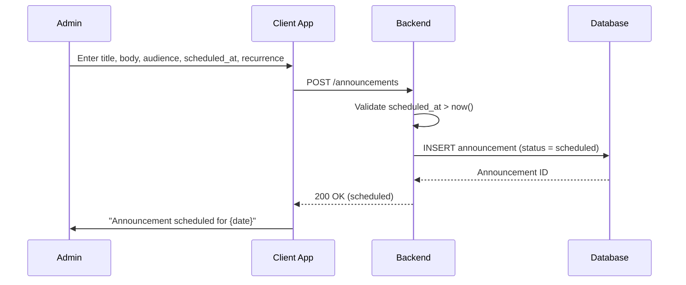
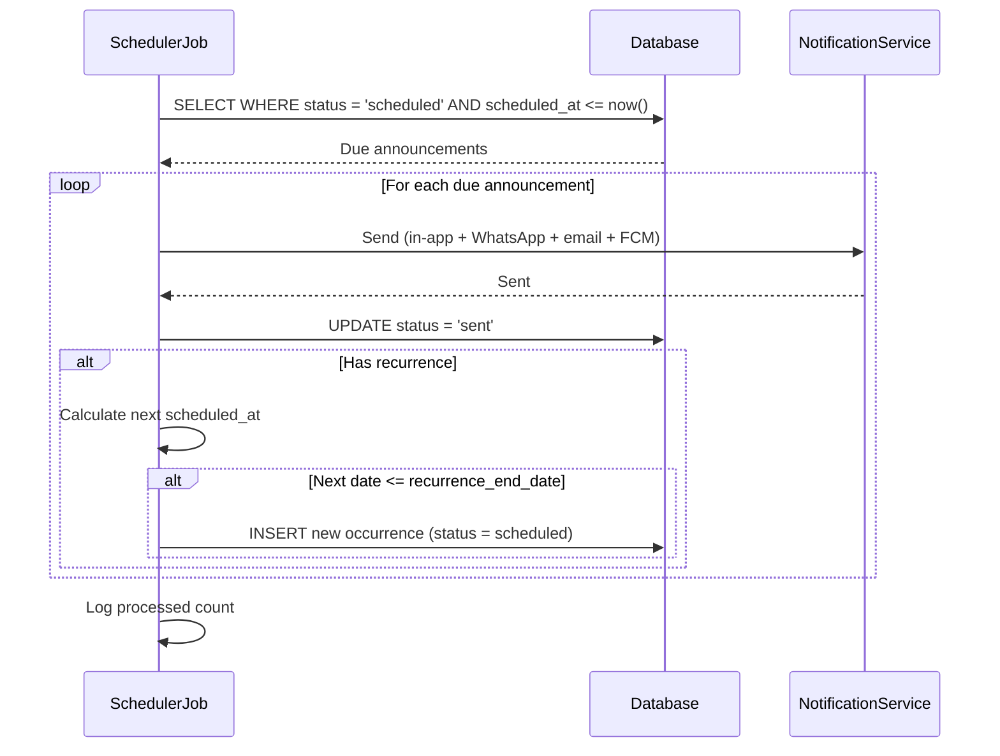
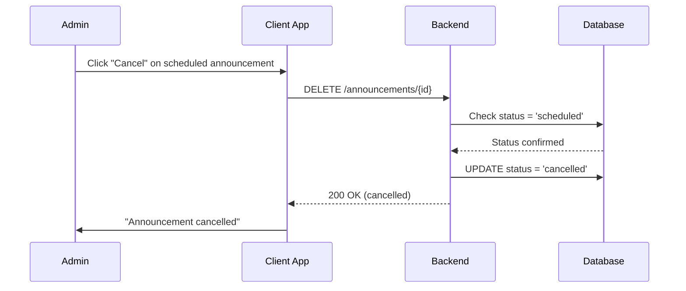
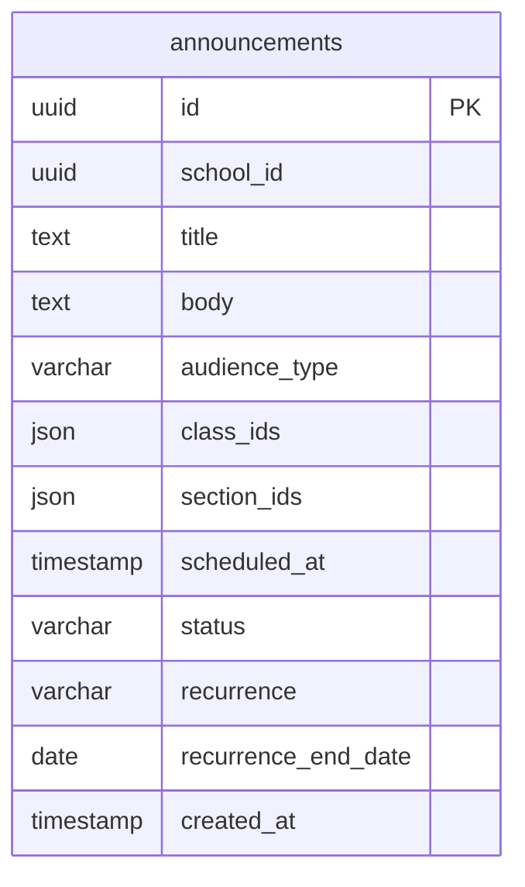

# Scheduled Announcements — Technical Specification

> **Document status:** Implementation-ready blueprint
> **Last updated:** 2026-06-27
> **Prerequisites:** `WHATSAPP_INTEGRATION_SPEC.md` (for WhatsApp delivery)
> **Template:** `_SPEC_TEMPLATE.md` v1 (25 mandatory + 6 optional sections)

---

## 1. Feature Overview

Allow school admins to schedule announcements for future delivery at a specific date/time, with multi-channel distribution (in-app, WhatsApp, email, FCM).

### Goals

- Admin creates announcement with scheduled send time
- Announcement stored with `scheduled_at` timestamp
- Background job picks up due announcements and sends them
- Admin can edit/cancel before sent
- Recurring announcements (daily, weekly, monthly)

### Non-goals

- [ ] AI-powered announcement generation
- [ ] A/B testing of announcement content
- [ ] Announcement templates with variables
- [ ] Multi-language auto-translation

### Dependencies

- `AnnouncementsTable` — existing announcements table (modified)
- `WHATSAPP_INTEGRATION_SPEC.md` — WhatsApp delivery channel
- `NotificationService` — in-app + FCM + email notifications

### Related Modules

- `server/.../feature/announcements/` — existing announcement feature
- `server/.../feature/notifications/` — notification service
- `server/.../feature/whatsapp/` — WhatsApp integration

---

## 2. Current System Assessment

### Existing Code

- `AnnouncementsTable` (`Tables.kt:310-328`) — has `createdAt`, `syncedToWa`, `audienceType`, `classIds`, `sectionIds`
- No scheduling field — announcements are sent immediately on creation
- `feature_audit.csv` L160: Scheduled Announcements missing (0%)

### Existing Database

- `AnnouncementsTable` — announcements with title, body, audience type, class/section IDs
- No `scheduled_at`, `status`, `recurrence` columns

### Existing APIs

- `POST /api/v1/school/announcements` — create announcement (sends immediately)
- `GET /api/v1/school/announcements` — list announcements

### Existing UI

- Admin: `AnnouncementComposerScreen` — compose and send immediately
- Parent/Teacher: announcement list view

### Existing Services

- `AnnouncementService` — creates and sends announcements
- `NotificationService` — multi-channel notifications

### Existing Documentation

- `feature_audit.csv` — feature audit tracking (scheduled announcements at 0%)
- `DIFFERENTIATING_FEATURES.md` — scheduled announcements feature description

### Technical Debt

| # | Gap | Details |
|---|---|---|
| TD-1 | No scheduling | Announcements sent immediately on creation |
| TD-2 | No status tracking | No draft/scheduled/sent/cancelled states |
| TD-3 | No recurrence | No recurring announcement support |

### Gaps

| # | Gap | Impact | Severity |
|---|---|---|---|
| G1 | No scheduled sending | Cannot plan announcements in advance | **High** |
| G2 | No recurrence | Must manually recreate recurring announcements | **Medium** |
| G3 | No edit/cancel before send | Cannot modify once created | **Medium** |
| G4 | No status tracking | Cannot distinguish draft/scheduled/sent | **Medium** |

---

## 3. Functional Requirements

### FR-001
| Field | Value |
|---|---|
| **Title** | Scheduled Send Time |
| **Description** | Add `scheduled_at` column to `AnnouncementsTable` |
| **Priority** | Critical |
| **User Roles** | School Admin |
| **Acceptance notes** | Announcement stored with future timestamp; sent at that time |

### FR-002
| Field | Value |
|---|---|
| **Title** | Announcement Status |
| **Description** | Announcement status: draft | scheduled | sent | cancelled |
| **Priority** | Critical |
| **User Roles** | School Admin |
| **Acceptance notes** | Status transitions managed by service and background job |

### FR-003
| Field | Value |
|---|---|
| **Title** | Background Job |
| **Description** | Background job checks every minute for due announcements |
| **Priority** | Critical |
| **User Roles** | System |
| **Acceptance notes** | Job runs every 1 minute; sends due announcements |

### FR-004
| Field | Value |
|---|---|
| **Title** | Edit/Cancel Before Send |
| **Description** | Admin can edit/cancel scheduled announcements before send time |
| **Priority** | High |
| **User Roles** | School Admin |
| **Acceptance notes** | Only `scheduled` status can be edited or cancelled |

### FR-005
| Field | Value |
|---|---|
| **Title** | Recurring Schedule |
| **Description** | Recurring schedule: daily, weekly (specific day), monthly (specific date) |
| **Priority** | Medium |
| **User Roles** | School Admin |
| **Acceptance notes** | Next occurrence auto-created after send |

### FR-006
| Field | Value |
|---|---|
| **Title** | Multi-Channel Delivery |
| **Description** | Multi-channel: in-app notification + WhatsApp + email + FCM |
| **Priority** | High |
| **User Roles** | System |
| **Acceptance notes** | All channels used when announcement sent |

---

## 4. User Stories

### School Admin
- [ ] Create an announcement scheduled for a future date/time
- [ ] Set recurrence (daily, weekly, monthly) with end date
- [ ] Edit a scheduled announcement before it's sent
- [ ] Cancel a scheduled announcement before it's sent
- [ ] View list of scheduled announcements
- [ ] View sent announcements history

### System
- [ ] Check for due announcements every minute
- [ ] Send due announcements via all channels (in-app, WhatsApp, email, FCM)
- [ ] Update status to `sent` after delivery
- [ ] Create next occurrence for recurring announcements
- [ ] Stop recurrence after end date

---

## 5. Business Rules

### BR-001
**Rule:** `scheduled_at` must be in the future when creating.
**Enforcement:** Validate `scheduled_at > now()` on creation.

### BR-002
**Rule:** Only `scheduled` status announcements can be edited or cancelled.
**Enforcement:** Check status before edit/cancel; reject if `sent` or `cancelled`.

### BR-003
**Rule:** Background job sends announcements where `status = 'scheduled' AND scheduled_at <= now()`.
**Enforcement:** Job query filters by status and time.

### BR-004
**Rule:** Recurring announcements create next occurrence after send.
**Enforcement:** After sending, if `recurrence` is set and `scheduled_at + interval <= recurrence_end_date`, create new announcement with next `scheduled_at`.

### BR-005
**Rule:** Recurrence stops after `recurrence_end_date`.
**Enforcement:** No new occurrence created if next `scheduled_at > recurrence_end_date`.

### BR-006
**Rule:** Default status is `sent` for backward compatibility (existing announcements).
**Enforcement:** `ALTER TABLE` adds `status` with default `sent`.

---

## 6. Database Design

### 6.1 Entity Relationship Summary

Modifies existing `AnnouncementsTable` with 4 new columns: `scheduled_at`, `status`, `recurrence`, `recurrence_end_date`. No new tables needed.

### 6.2 New Tables

N/A — no new tables.

### 6.3 Modified Tables

```sql
ALTER TABLE announcements ADD COLUMN scheduled_at TIMESTAMP;
ALTER TABLE announcements ADD COLUMN status VARCHAR(16) NOT NULL DEFAULT 'sent';
ALTER TABLE announcements ADD COLUMN recurrence VARCHAR(16); -- null | daily | weekly | monthly
ALTER TABLE announcements ADD COLUMN recurrence_end_date DATE;
```

### 6.4 Indexes

```sql
CREATE INDEX idx_announcements_scheduled ON announcements(status, scheduled_at) WHERE status = 'scheduled';
```

### 6.5 Constraints

- `scheduled_at` — nullable (null = sent immediately, backward compatible)
- `status` — NOT NULL, default `sent` (backward compatible)
- `recurrence` — nullable (null = one-time)
- `recurrence_end_date` — nullable (null = no end for recurrence)

### 6.6 Foreign Keys

N/A — no new foreign keys.

### 6.7 Soft Delete Strategy

Existing announcement soft delete (if any) unchanged. `cancelled` status is distinct from soft delete.

### 6.8 Audit Fields

- `scheduled_at` — when announcement is scheduled to send
- `status` — current state (draft, scheduled, sent, cancelled)
- Existing `created_at` — creation timestamp

### 6.9 Migration Notes

Migration: `docs/db/migration_055_scheduled_announcements.sql`
- ALTER TABLE adds 4 columns (all nullable or defaulted for backward compatibility)
- Existing announcements get `status = 'sent'` (default)
- No data backfill needed

### 6.10 Exposed Mappings

```kotlin
// Modified AnnouncementsTable (additions)
object AnnouncementsTable : UUIDTable("announcements", "id") {
    // ... existing columns ...
    val scheduledAt      = timestamp("scheduled_at").nullable()
    val status           = varchar("status", 16).default("sent") // draft | scheduled | sent | cancelled
    val recurrence       = varchar("recurrence", 16).nullable() // null | daily | weekly | monthly
    val recurrenceEndDate = date("recurrence_end_date").nullable()
    init {
        index("idx_announcements_scheduled", false, status, scheduledAt)
    }
}
```

### 6.11 Seed Data

N/A — no seed data needed.

---

## 7. State Machines

### Announcement Status State Machine

```
DRAFT ──admin_schedules──> SCHEDULED ──job_sends──> SENT
SCHEDULED ──admin_cancels──> CANCELLED
SCHEDULED ──admin_edits──> SCHEDULED (updated)
```

| Current State | Event | Next State | Guard / Condition |
|---|---|---|---|
| `draft` | Admin sets `scheduled_at` | `scheduled` | `scheduled_at > now()` |
| `scheduled` | Background job sends | `sent` | `scheduled_at <= now()` |
| `scheduled` | Admin cancels | `cancelled` | Before `scheduled_at` |
| `scheduled` | Admin edits | `scheduled` | Before `scheduled_at` |
| `sent` | Recurrence creates next | `scheduled` (new record) | `recurrence` set and next date <= `recurrence_end_date` |
| `cancelled` | — | — | Terminal state |

### Recurrence Flow

```
SENT ──has_recurrence──> CREATE_NEXT_OCCURRENCE ──next_date<=end_date──> SCHEDULED (new)
SENT ──has_recurrence──> CREATE_NEXT_OCCURRENCE ──next_date>end_date──> STOP
```

| Step | Action | Condition |
|---|---|---|
| 1 | Announcement sent | `status = sent` |
| 2 | Check recurrence | `recurrence IS NOT NULL` |
| 3 | Calculate next date | `scheduled_at + interval` (daily: +1d, weekly: +7d, monthly: +1month) |
| 4 | Check end date | `next_date <= recurrence_end_date` |
| 5 | Create new announcement | New record with `status = scheduled`, `scheduled_at = next_date` |

---

## 8. Backend Architecture

### 8.1 Component Overview

Modifies existing `AnnouncementService` to support scheduling. New `AnnouncementScheduler` job handles due announcements and recurrence creation. `AnnouncementRouting` modified for scheduling params.

### 8.2 Design Principles

1. **Backward compatible** — existing announcements work (status defaults to `sent`)
2. **Polling job** — 1-minute interval checks for due announcements
3. **Atomic send** — send + status update in transaction
4. **Recurrence creation** — new record created after send (not inline update)
5. **Multi-channel** — same channels as immediate announcements

### 8.3 Core Types

```kotlin
class AnnouncementService {
    suspend fun create(announcement: AnnouncementDto): UUID
    suspend fun update(id: UUID, announcement: AnnouncementDto): Unit
    suspend fun cancel(id: UUID): Unit
    suspend fun getScheduled(schoolId: UUID): List<AnnouncementDto>
    suspend fun getById(id: UUID): AnnouncementDto?
}

class AnnouncementScheduler {
    suspend fun processDueAnnouncements(): Unit
    suspend fun createNextOccurrence(announcement: AnnouncementDto): UUID?
}
```

### 8.4 Repositories

- `AnnouncementRepository` — existing, modified to support scheduling fields

### 8.5 Mappers

- `AnnouncementMapper` — existing, extended for new fields

### 8.6 Permission Checks

- Create/edit/cancel scheduled announcements: school admin only
- Process due announcements: system (background job)

### 8.7 Background Jobs

### Announcement Scheduler Job

| Job | Schedule | Description |
|---|---|---|
| `AnnouncementSchedulerJob` | Every 1 minute | Find due announcements, send, handle recurrence |

**Implementation:**
1. `SELECT * FROM announcements WHERE status = 'scheduled' AND scheduled_at <= now()`
2. For each due announcement:
   - Send via `NotificationService` (in-app + WhatsApp + email + FCM)
   - Update `status = 'sent'`
   - If `recurrence` is set:
     - Calculate next `scheduled_at` based on recurrence type
     - If next date <= `recurrence_end_date` (or no end date):
       - Create new announcement with `status = 'scheduled'`, `scheduled_at = next_date`
     - Else: stop recurrence
3. Log processed count

### 8.8 Domain Events

- `AnnouncementScheduled` — emitted when announcement scheduled
- `AnnouncementSent` — emitted when announcement sent by job
- `AnnouncementCancelled` — emitted when admin cancels
- `AnnouncementEdited` — emitted when admin edits scheduled announcement
- `RecurrenceCreated` — emitted when next occurrence created

### 8.9 Caching

- Scheduled announcements list cached for 1 minute (changes frequently with job)
- No caching for individual announcements

### 8.10 Transactions

- Send announcement: send notifications + UPDATE status in transaction
- Recurrence creation: INSERT new announcement (separate from send transaction)

### 8.11 Rate Limiting

- Standard API rate limiting
- Job processes announcements sequentially (no concurrent send for same announcement)

### 8.12 Configuration

- `ANNOUNCEMENT_SCHEDULER_INTERVAL_MS` — default `60000` (1 minute)
- `ANNOUNCEMENT_MAX_RECURRENCE` — default `365` (max occurrences)

---

## 9. API Contracts

### 9.1 Admin APIs

```
POST /api/v1/school/announcements
{
  "title": "Annual Day Reminder",
  "body": "...",
  "audience_type": "ALL_SCHOOL",
  "scheduled_at": "2026-07-15T09:00:00Z",
  "recurrence": "weekly",
  "recurrence_end_date": "2026-08-15"
}
```

```
PATCH /api/v1/school/announcements/{id}  -- edit before sent
DELETE /api/v1/school/announcements/{id}  -- cancel
GET /api/v1/school/announcements/scheduled
```

### 9.2 Example Responses

**Create Scheduled Announcement Response 200:**
```json
{
  "success": true,
  "data": {
    "id": "uuid",
    "title": "Annual Day Reminder",
    "status": "scheduled",
    "scheduled_at": "2026-07-15T09:00:00Z",
    "recurrence": "weekly",
    "recurrence_end_date": "2026-08-15"
  }
}
```

**Scheduled List Response 200:**
```json
{
  "success": true,
  "data": [
    {"id": "uuid", "title": "Annual Day Reminder", "scheduled_at": "2026-07-15T09:00:00Z", "recurrence": "weekly", "status": "scheduled"},
    {"id": "uuid", "title": "PTM Notice", "scheduled_at": "2026-07-10T18:00:00Z", "recurrence": null, "status": "scheduled"}
  ]
}
```

---

## 10. Frontend Architecture

### 10.1 Screens

| Screen | Platform | Role | Description |
|---|---|---|---|
| `AnnouncementComposerScreen` | All | Admin | Compose with scheduling options (modified) |
| `ScheduledAnnouncementsScreen` | All | Admin | List of scheduled announcements |

### 10.2 Navigation

- Admin portal → Announcements → New → `AnnouncementComposerScreen`
- Admin portal → Announcements → Scheduled → `ScheduledAnnouncementsScreen`

### 10.3 UX Flows

#### Admin: Schedule Announcement

1. Admin opens Announcements → New
2. Enters title, body, audience
3. Toggles "Schedule for later"
4. Selects date/time picker for `scheduled_at`
5. Optionally selects recurrence (daily/weekly/monthly)
6. If recurrence: selects end date
7. Saves announcement (status = scheduled)

#### Admin: Edit Scheduled Announcement

1. Admin opens Scheduled list
2. Clicks announcement to edit
3. Modifies title, body, audience, or scheduled time
4. Saves changes (only if status = scheduled)

#### Admin: Cancel Scheduled Announcement

1. Admin opens Scheduled list
2. Clicks "Cancel" on announcement
3. Confirms cancellation
4. Status changes to cancelled

### 10.4 State Management

```kotlin
data class ScheduledAnnouncementState(
    val scheduledAnnouncements: List<AnnouncementDto>,
    val isLoading: Boolean,
    val error: String?,
)
```

### 10.5 Offline Support

- Scheduled list cached locally
- Creating/editing requires network

### 10.6 Loading States

- Loading scheduled list: "Loading scheduled announcements..."
- Scheduling: "Scheduling announcement..."
- Cancelling: "Cancelling announcement..."

### 10.7 Error Handling (UI)

- Past date selected: "Scheduled time must be in the future."
- Edit sent announcement: "Cannot edit an already sent announcement."
- Cancel sent announcement: "Cannot cancel an already sent announcement."

### 10.8 Component Integration Guidelines

| Rule | Description |
|---|---|
| **R1** | Date/time picker for scheduled_at |
| **R2** | Recurrence dropdown (None, Daily, Weekly, Monthly) |
| **R3** | Recurrence end date picker (shown when recurrence selected) |
| **R4** | Status badge (scheduled=blue, sent=green, cancelled=red) |
| **R5** | Edit/Cancel buttons only for scheduled status |
| **R6** | Scheduled list sorted by scheduled_at ascending |

---

## 11. Shared Module Changes (KMP)

### 11.1 DTOs

```kotlin
data class AnnouncementDto(
    val id: UUID,
    val schoolId: UUID,
    val title: String,
    val body: String,
    val audienceType: String,
    val classIds: List<UUID>?,
    val sectionIds: List<UUID>?,
    val scheduledAt: Instant?,
    val status: String, // draft | scheduled | sent | cancelled
    val recurrence: String?, // null | daily | weekly | monthly
    val recurrenceEndDate: LocalDate?,
    val createdAt: Instant,
)
```

### 11.2 Domain Models

```kotlin
data class ScheduledAnnouncement(
    val id: UUID,
    val schoolId: UUID,
    val title: String,
    val body: String,
    val audienceType: String,
    val classIds: List<UUID>?,
    val sectionIds: List<UUID>?,
    val scheduledAt: Instant,
    val status: String,
    val recurrence: String?,
    val recurrenceEndDate: LocalDate?,
)
```

### 11.3 Repository Interfaces

```kotlin
interface AnnouncementRepository {
    suspend fun create(announcement: AnnouncementEntity): UUID
    suspend fun update(id: UUID, announcement: AnnouncementEntity): Unit
    suspend fun cancel(id: UUID): Unit
    suspend fun getScheduled(schoolId: UUID): List<AnnouncementDto>
    suspend fun getDueAnnouncements(): List<AnnouncementDto>
    suspend fun updateStatus(id: UUID, status: String): Unit
    suspend fun createNextOccurrence(announcement: AnnouncementDto): UUID
}
```

### 11.4 UseCases

- `ScheduleAnnouncementUseCase`
- `EditScheduledAnnouncementUseCase`
- `CancelScheduledAnnouncementUseCase`
- `GetScheduledAnnouncementsUseCase`
- `ProcessDueAnnouncementsUseCase`

### 11.5 Validation

- `scheduled_at` must be in the future (when status = scheduled)
- `recurrence` must be one of: null, daily, weekly, monthly
- `recurrence_end_date` must be after `scheduled_at` (if recurrence set)
- Title: not empty
- Body: not empty

### 11.6 Serialization

Standard Kotlinx serialization for DTOs.

### 11.7 Network APIs

Added/modified in `AnnouncementApi.kt`:
- `POST /api/v1/school/announcements` — create (with scheduling params)
- `PATCH /api/v1/school/announcements/{id}` — edit scheduled
- `DELETE /api/v1/school/announcements/{id}` — cancel
- `GET /api/v1/school/announcements/scheduled` — list scheduled

### 11.8 Database Models (Local Cache)

- Scheduled announcements list cached locally
- Individual announcement cached for offline view

---

## 12. Permissions Matrix

| Action | Super Admin | School Admin | Teacher | Parent |
|---|---|---|---|---|
| Schedule announcement | ✅ | ✅ | ❌ | ❌ |
| Edit scheduled announcement | ✅ | ✅ | ❌ | ❌ |
| Cancel scheduled announcement | ✅ | ✅ | ❌ | ❌ |
| View scheduled list | ✅ | ✅ | ❌ | ❌ |
| View sent announcements | ✅ | ✅ | ✅ | ✅ |
| Process due (job) | System | System | System | System |

---

## 13. Notifications

### Scheduled Announcement Notifications

| Type | Trigger | Channel | Message |
|---|---|---|---|
| Announcement Sent | Job sends due announcement | In-app + WhatsApp + Email + FCM | (Announcement title and body) |
| Announcement Cancelled | Admin cancels | In-app (admin) | "Announcement '{title}' has been cancelled." |
| Recurrence Created | Job creates next occurrence | In-app (admin) | "Next occurrence of '{title}' scheduled for {date}." |

---

## 14. Background Jobs

| Job | Schedule | Description |
|---|---|---|
| `AnnouncementSchedulerJob` | Every 1 minute | Find due announcements, send, handle recurrence |

**Announcement Scheduler:**
1. Query: `SELECT * FROM announcements WHERE status = 'scheduled' AND scheduled_at <= now()`
2. For each due announcement:
   - Send via `NotificationService` (in-app + WhatsApp + email + FCM)
   - UPDATE `status = 'sent'`
   - If `recurrence` is set:
     - Calculate next `scheduled_at`:
       - daily: `scheduled_at + 1 day`
       - weekly: `scheduled_at + 7 days`
       - monthly: `scheduled_at + 1 month`
     - If `recurrence_end_date` is null OR `next_date <= recurrence_end_date`:
       - INSERT new announcement with same content, `status = 'scheduled'`, `scheduled_at = next_date`
     - Else: stop recurrence (no new occurrence)
3. Log processed count and recurrence creations

---

## 15. Integrations

### AnnouncementsTable
| Field | Value |
|---|---|
| **System** | Existing announcement infrastructure |
| **Purpose** | Modified to support scheduling columns |
| **API / SDK** | Direct DB via Exposed |
| **Auth method** | Internal |
| **Fallback** | None — core table |

### NotificationService
| Field | Value |
|---|---|
| **System** | Existing notification infrastructure |
| **Purpose** | Multi-channel delivery (in-app, FCM, email) |
| **API / SDK** | Internal `NotificationService` |
| **Auth method** | Internal service call |
| **Fallback** | In-app notification if push fails |

### WhatsApp Integration
| Field | Value |
|---|---|
| **System** | `WHATSAPP_INTEGRATION_SPEC.md` |
| **Purpose** | WhatsApp delivery channel |
| **API / SDK** | WhatsApp Business API |
| **Auth method** | API key |
| **Fallback** | Skip WhatsApp if API unavailable; send via other channels |

### FCM/APNs
| Field | Value |
|---|---|
| **System** | Existing push notification infrastructure |
| **Purpose** | Push notifications to mobile devices |
| **API / SDK** | FCM (Android), APNs (iOS) |
| **Auth method** | Server-side keys |
| **Fallback** | In-app notification if push fails |

---

## 16. Security

### Authentication
- All announcement APIs: JWT with school admin role

### Authorization
- Schedule/edit/cancel: school admin only
- Process due (job): system internal

### Encryption
- All API communication over TLS

### Audit Logs
- Announcement scheduled logged (title, scheduled_at, audience)
- Announcement sent logged (id, channels, recipient count)
- Announcement cancelled logged (id, admin)
- Announcement edited logged (id, fields changed)
- Recurrence created logged (parent_id, next_date)

### PII Handling
- Announcement content may contain student-related information
- Audience targeting (class/section IDs) maps to student groups
- No individual student PII in announcement body (best practice)

### Data Isolation
- All queries filtered by `school_id` from JWT

### Rate Limiting
- Standard API rate limiting
- Job processes sequentially

### Input Validation
- `scheduled_at`: must be in the future
- `recurrence`: one of null, daily, weekly, monthly
- `recurrence_end_date`: must be after `scheduled_at`
- Title: not empty
- Body: not empty

---

## 17. Performance & Scalability

### Expected Scale

| Metric | Small school | Medium school | Large school |
|---|---|---|---|
| Scheduled announcements | ~10 | ~50 | ~200 |
| Recurring announcements | ~5 | ~20 | ~50 |
| Due announcements per minute | ~1 | ~5 | ~10 |
| Recipients per announcement | ~200 | ~1,000 | ~5,000 |

### Latency Targets

| Operation | Target |
|---|---|
| Schedule announcement | < 100ms |
| Get scheduled list | < 100ms |
| Cancel announcement | < 50ms |
| Job: process due announcement | < 2s per announcement (including multi-channel send) |

### Optimization Strategy

- Partial index on `status = 'scheduled' AND scheduled_at` for job query
- Job runs every 1 minute (low latency for due announcements)
- Multi-channel send parallelized where possible
- Scheduled list cached for 1 minute

---

## 18. Edge Cases

| # | Scenario | Expected Behavior |
|---|---|---|
| EC-001 | `scheduled_at` in the past | Rejected: "Scheduled time must be in the future" |
| EC-002 | Edit sent announcement | Rejected: "Cannot edit sent announcement" |
| EC-003 | Cancel sent announcement | Rejected: "Cannot cancel sent announcement" |
| EC-004 | Recurrence with no end date | Continues indefinitely until cancelled |
| EC-005 | Recurrence end date before scheduled_at | Rejected: "End date must be after scheduled time" |
| EC-006 | Job runs but notification service is down | Announcement marked sent; notification retry logged |
| EC-007 | Recurrence creates occurrence but original is cancelled | New occurrence still created (independent records) |
| EC-008 | Multiple due announcements at same time | Processed sequentially by job |

### Risks & Mitigations

| Risk | Likelihood | Impact | Mitigation |
|---|---|---|---|
| Job failure | Low | Medium | Job retried next minute; announcements sent with delay |
| Notification service down | Medium | Medium | Announcement marked sent; notification retried |
| Recurrence infinite loop | Low | Low | Max recurrence count (365); end date validation |
| Time zone mismatch | Medium | Medium | All times stored in UTC; client converts to local |

---

## 19. Error Handling

### Standard Error Codes

| HTTP | Error Code | Description | When |
|---|---|---|---|
| 400 | `PAST_SCHEDULED_TIME` | `scheduled_at` is in the past | Create/update |
| 400 | `INVALID_RECURRENCE` | Recurrence type not valid | Create/update |
| 400 | `INVALID_END_DATE` | End date before scheduled_at | Create/update |
| 400 | `CANNOT_EDIT_SENT` | Attempting to edit sent announcement | Update |
| 400 | `CANNOT_CANCEL_SENT` | Attempting to cancel sent announcement | Cancel |
| 403 | `INSUFFICIENT_PERMISSIONS` | Non-admin attempting operation | Any endpoint |
| 404 | `ANNOUNCEMENT_NOT_FOUND` | Announcement does not exist | Update/cancel |

### Error Response Format

Same as existing API error format.

### Recovery Strategy

| Error | Client Action | Server Action |
|---|---|---|
| `PAST_SCHEDULED_TIME` | Show "Select a future date and time." | Return 400 |
| `CANNOT_EDIT_SENT` | Show "This announcement has already been sent." | Return 400 |
| `CANNOT_CANCEL_SENT` | Show "This announcement has already been sent." | Return 400 |

---

## 20. Analytics & Reporting

### Reports

- **Scheduled Announcements Report:** Upcoming scheduled announcements with dates
- **Sent Announcements Report:** History of sent announcements
- **Recurrence Report:** Active recurring announcements with next occurrence
- **Delivery Report:** Channel-wise delivery status per announcement

### KPIs

- **Scheduled Count:** Number of pending scheduled announcements
- **On-Time Delivery Rate:** % of announcements sent within 1 minute of scheduled time
- **Recurrence Active Count:** Number of active recurring announcements
- **Cancellation Rate:** % of scheduled announcements cancelled before send

### Dashboards

- Admin: scheduled announcements list with countdown to send time
- Admin: sent announcements history

### Exports

- Scheduled announcements export (CSV)
- Sent announcements history export (CSV)

---

## 21. Testing Strategy

### Unit Tests

| Test | What it verifies |
|---|---|
| Schedule announcement | Announcement stored with `status = scheduled` and `scheduled_at` |
| Edit scheduled announcement | Fields updated; status remains `scheduled` |
| Cancel scheduled announcement | Status changes to `cancelled` |
| Edit sent announcement | Rejected with error |
| Cancel sent announcement | Rejected with error |
| Recurrence daily | Next occurrence = scheduled_at + 1 day |
| Recurrence weekly | Next occurrence = scheduled_at + 7 days |
| Recurrence monthly | Next occurrence = scheduled_at + 1 month |
| Recurrence end date | No new occurrence after end date |
| Past scheduled_at | Rejected with error |

### Integration Tests

| Test | What it verifies |
|---|---|
| Schedule → wait → job sends → status = sent | Full lifecycle |
| Recurring → job sends → next occurrence created | Recurrence flow |
| Recurring → end date reached → no new occurrence | Recurrence stop |
| Cancel before send → status = cancelled | Cancel flow |

### Performance Tests

- [ ] Job processes 100 due announcements < 30s
- [ ] Scheduled list query < 100ms with 500 announcements

### Security Tests

- [ ] Non-admin cannot schedule announcements
- [ ] School A admin cannot see School B scheduled announcements

### Migration Tests

- [ ] ALTER TABLE adds 4 columns without data loss
- [ ] Existing announcements get `status = 'sent'` (default)
- [ ] Index on scheduled announcements created

---

## 22. Acceptance Criteria

- [ ] Admin can schedule announcement for future date/time
- [ ] Announcement sent automatically at scheduled time
- [ ] Admin can edit/cancel before send
- [ ] Recurring announcements create next occurrence
- [ ] Multi-channel delivery (in-app + WhatsApp + email + FCM)

---

## 23. Implementation Roadmap

| Phase | Duration | Tasks | Breaking? | Deliverable |
|---|---|---|---|---|
| 1 | 1 day | DB migration (add columns to announcements) | No (backward compatible) | Schema updated |
| 2 | 2 days | Scheduled job + recurrence logic | No | Job running |
| 3 | 1 day | API modifications (edit/cancel scheduled) | No | API available |
| 4 | 1 day | Client UI (date/time picker, recurrence options, scheduled list) | No | UI ready |
| 5 | 1 day | Tests | No | Test coverage |

**Total: ~6 days**

---

## 24. File-Level Impact Analysis

### New Files

| File | Location | Purpose |
|---|---|---|
| `AnnouncementScheduler.kt` | `server/.../feature/announcements/` | Scheduled job |
| `migration_055_scheduled_announcements.sql` | `docs/db/` | ALTER TABLE migration |
| `ScheduledAnnouncementsScreen.kt` | `composeApp/.../ui/v2/screens/admin/` | Scheduled list screen |

### Modified Files

| File | Change Type | Lines Changed (est.) | Risk | Description |
|---|---|---|---|---|
| `server/.../db/Tables.kt` | Modify | ~4 | Low | Add 4 columns to AnnouncementsTable |
| `server/.../feature/announcements/AnnouncementRouting.kt` | Modify | ~20 | Low | Add scheduling params to create/update |
| `server/.../feature/announcements/AnnouncementService.kt` | Modify | ~30 | Low | Add scheduling logic |
| `composeApp/.../ui/v2/screens/admin/AnnouncementComposerScreen.kt` | Modify | ~40 | Low | Add scheduling UI (date picker, recurrence) |

### Files Preserved Unchanged

| File | Reason |
|---|---|
| `NotificationService` | Used as-is for multi-channel delivery |
| `WhatsAppService` | Used as-is for WhatsApp delivery |

---

## 25. Future Enhancements

### Announcement Templates

- Pre-defined templates for common announcements
- Variable substitution (school name, date, event)
- Template library management
- Custom template creation

### A/B Testing

- Create multiple variants of announcement
- Test which variant gets more engagement
- Open/read rate tracking per variant
- Automatic winner selection

### AI-Powered Announcement Generation

- AI suggests announcement content based on context
- Tone adjustment (formal, casual, urgent)
- Multi-language generation
- Content optimization recommendations

### Announcement Analytics

- Open rate tracking (in-app)
- Read time tracking
- Engagement metrics per announcement
- Channel-wise delivery success rate

### Approval Workflow

- Teacher creates → Admin approves → Scheduled
- Multi-level approval for important announcements
- Approval history and audit trail
- Email notifications for pending approvals

### Announcement Drafts

- Save drafts without scheduling
- Auto-save drafts
- Draft preview
- Draft to scheduled conversion

### Multi-Language Announcements

- Create announcement in multiple languages
- Auto-detect recipient language preference
- Send in recipient's preferred language
- Translation review workflow

### Announcement Scheduling Conflicts

- Detect scheduling conflicts (too many at same time)
- Suggest alternative times
- Rate limiting per audience (avoid notification fatigue)
- Quiet hours enforcement

### Calendar Integration

- Link announcements to calendar events
- Auto-create calendar event from announcement
- Reminder schedule based on event date
- Calendar-based scheduling suggestions

### Announcement Archiving

- Auto-archive old announcements
- Archive search and retrieval
- Retention policy configuration
- Archive export for compliance

---

## A. Sequence Diagrams

### Schedule Announcement Flow



### Job Processes Due Announcement Flow



### Cancel Scheduled Announcement Flow



---

## B. Domain Model / ER Diagram



---

## C. Event Flow

```
AnnouncementScheduled -> Complete
AnnouncementEdited -> Complete
AnnouncementCancelled -> Complete
SchedulerJob -> QueryDue -> SendAnnouncement -> UpdateStatusSent -> CheckRecurrence -> CreateNextOccurrence -> Complete
SchedulerJob -> QueryDue -> SendAnnouncement -> UpdateStatusSent -> NoRecurrence -> Complete
```

| Event | Emitted By | Consumed By | Side Effect |
|---|---|---|---|
| `AnnouncementScheduled` | `AnnouncementService.create()` | Analytics | Counter incremented |
| `AnnouncementSent` | `AnnouncementSchedulerJob` | Analytics | Counter incremented |
| `AnnouncementCancelled` | `AnnouncementService.cancel()` | Analytics | Counter incremented |
| `AnnouncementEdited` | `AnnouncementService.update()` | Analytics | Counter incremented |
| `RecurrenceCreated` | `AnnouncementSchedulerJob` | Analytics | Counter incremented |

---

## D. Configuration

### Environment Variables

| Variable | Description |
|---|---|
| `ANNOUNCEMENT_SCHEDULER_ENABLED` | Enable/disable scheduler job (default: `true`) |
| `ANNOUNCEMENT_SCHEDULER_INTERVAL_MS` | Job interval in ms (default: `60000`) |
| `ANNOUNCEMENT_MAX_RECURRENCE` | Max recurrence occurrences (default: `365`) |

### Feature Flags

| Flag | Default | Description |
|---|---|---|
| `scheduled_announcements_enabled` | `true` | Master switch for scheduling |
| `announcement_recurrence` | `true` | Enable recurring announcements |
| `announcement_whatsapp_delivery` | `true` | Enable WhatsApp channel |

### Client-Side Configuration

| Config | Default | Description |
|---|---|---|
| Date picker format | `yyyy-MM-dd` | Date format for picker |
| Time picker format | `HH:mm` | Time format for picker |
| Min scheduled time | `now + 1 minute` | Minimum future time |
| Recurrence options | None, Daily, Weekly, Monthly | Available recurrence types |

### Server-Side Configuration

| Config | Default | Description |
|---|---|---|
| Scheduler interval | 60s | How often job runs |
| Max recurrence | 365 | Maximum occurrences |
| Time zone | UTC | All times stored in UTC |

### Infrastructure Requirements

- Standard notification infrastructure (FCM/APNs)
- WhatsApp Business API (if WhatsApp delivery enabled)
- No additional infrastructure needed

---

## E. Migration & Rollback

### Deployment Plan

1. [ ] Run `migration_055_scheduled_announcements.sql` — ALTER TABLE adds 4 columns
2. [ ] Update `AnnouncementsTable` in `Tables.kt` (add 4 columns)
3. [ ] Deploy `AnnouncementScheduler.kt` (background job)
4. [ ] Modify `AnnouncementService.kt` (scheduling logic)
5. [ ] Modify `AnnouncementRouting.kt` (scheduling params)
6. [ ] Deploy `ScheduledAnnouncementsScreen.kt` (client UI)
7. [ ] Modify `AnnouncementComposerScreen.kt` (scheduling UI)
8. [ ] Deploy to production

### Rollback Plan

1. [ ] Disable feature flag `scheduled_announcements_enabled` → scheduling disabled
2. [ ] Remove scheduling UI → composer returns to immediate send
3. [ ] Database: `ALTER TABLE announcements DROP COLUMN scheduled_at; DROP COLUMN status; DROP COLUMN recurrence; DROP COLUMN recurrence_end_date;`
4. [ ] No data loss — existing announcements unaffected (columns are nullable/defaulted)

### Data Backfill

N/A — existing announcements get `status = 'sent'` via column default. No backfill needed.

### Migration SQL

```sql
-- migration_055_scheduled_announcements.sql
ALTER TABLE announcements ADD COLUMN IF NOT EXISTS scheduled_at TIMESTAMP;
ALTER TABLE announcements ADD COLUMN IF NOT EXISTS status VARCHAR(16) NOT NULL DEFAULT 'sent';
ALTER TABLE announcements ADD COLUMN IF NOT EXISTS recurrence VARCHAR(16);
ALTER TABLE announcements ADD COLUMN IF NOT EXISTS recurrence_end_date DATE;

CREATE INDEX IF NOT EXISTS idx_announcements_scheduled
    ON announcements(status, scheduled_at) WHERE status = 'scheduled';

-- ROLLBACK:
-- DROP INDEX IF EXISTS idx_announcements_scheduled;
-- ALTER TABLE announcements DROP COLUMN IF EXISTS recurrence_end_date;
-- ALTER TABLE announcements DROP COLUMN IF EXISTS recurrence;
-- ALTER TABLE announcements DROP COLUMN IF EXISTS status;
-- ALTER TABLE announcements DROP COLUMN IF EXISTS scheduled_at;
```

---

## F. Observability

### Logging

- Announcement scheduled: INFO `announcement_scheduled` (id, schoolId, title, scheduledAt, recurrence)
- Announcement sent: INFO `announcement_sent` (id, channels, recipientCount, sentAt)
- Announcement cancelled: INFO `announcement_cancelled` (id, schoolId, cancelledBy)
- Announcement edited: INFO `announcement_edited` (id, fieldsChanged)
- Recurrence created: INFO `announcement_recurrence_created` (parentId, newId, nextScheduledAt)
- Job run: DEBUG `announcement_scheduler_job` (dueCount, processedCount, recurrenceCreatedCount)
- Job error: ERROR `announcement_scheduler_error` (announcementId, error)

### Metrics

| Metric | Type | Description |
|---|---|---|
| `announcement.scheduled_total` | Counter | Total announcements scheduled |
| `announcement.sent_by_job` | Counter | Total announcements sent by scheduler job |
| `announcement.cancelled_total` | Counter | Total announcements cancelled |
| `announcement.recurrence_created` | Counter | Total recurrence occurrences created |
| `announcement.scheduled_pending` | Gauge | Currently pending scheduled announcements |
| `announcement.job_run_time_ms` | Histogram | Job execution time |
| `announcement.send_latency_ms` | Histogram | Latency between scheduled_at and actual send |

### Health Checks

- `GET /api/v1/health` — existing health check
- Scheduler job heartbeat (last run timestamp)

### Alerts

- Job not running for 5 minutes → Warning (scheduler may be down)
- Send latency > 5 minutes → Warning (announcements sent late)
- Recurrence creation failure → Warning (recurrence logic issue)
- Notification service failure rate > 10% → Warning (delivery issues)
