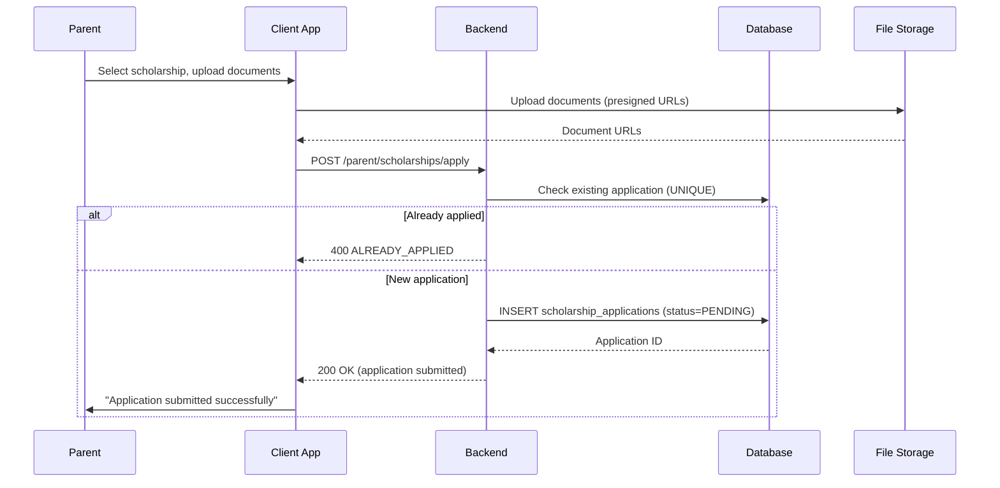
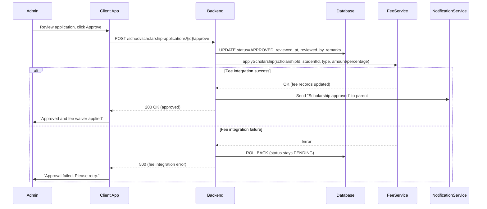
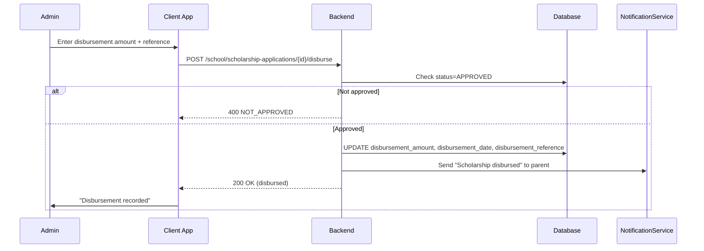
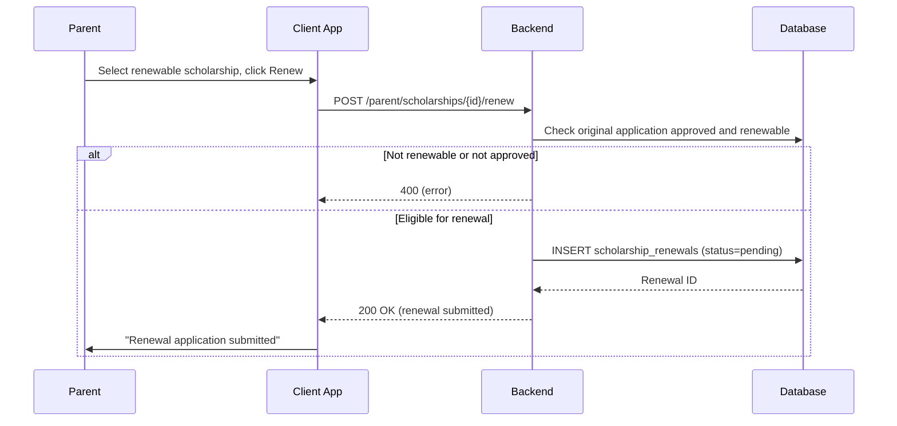
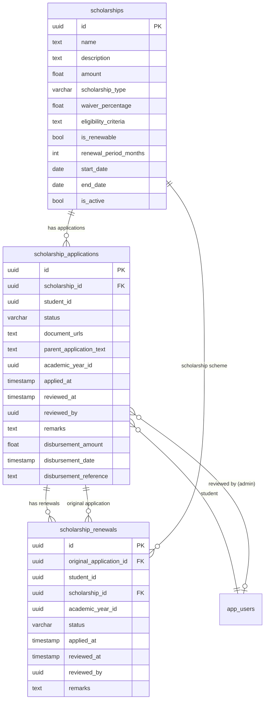

# Scholarship Workflow — Technical Specification

> **Document status:** Implementation-ready blueprint
> **Last updated:** 2026-06-27
> **Prerequisites:** None (extends existing scholarship tables)
> **Template:** `_SPEC_TEMPLATE.md` v1 (25 mandatory + 6 optional sections)

---

## 1. Feature Overview

Complete scholarship management lifecycle: scholarship schemes, student applications, approval workflow, disbursement tracking, and renewal management.

### Goals

- Admin creates scholarship schemes (merit, need-based, category-based)
- Students/parents apply for scholarships with required documents
- Admin reviews applications, approves/rejects with remarks
- Approved scholarships linked to fee records (waiver/discount)
- Disbursement tracking: amount, date, reference number
- Renewal tracking for multi-year scholarships

### Non-goals

- [ ] External scholarship portal integration
- [ ] Government scholarship scheme sync
- [ ] Scholarship eligibility auto-screening
- [ ] Scholarship analytics dashboard

### Dependencies

- `ScholarshipsTable` — existing scholarship scheme table (extended)
- `ScholarshipApplicationsTable` — existing applications table (extended)
- `FeeRecordsTable` — fee records for waiver/discount application
- `AcademicYearTable` — academic year for renewal tracking
- `NotificationService` — notifications for approval/rejection
- File storage (S3) — document upload

### Related Modules

- `server/.../feature/scholarship/` — new scholarship service module
- `server/.../feature/fee/` — fee management module (integration)
- `shared/.../scholarship/` — shared scholarship DTOs
- `composeApp/.../ui/v2/screens/admin/` — admin UI
- `composeApp/.../ui/v2/screens/parent/` — parent UI

---

## 2. Current System Assessment

### Existing Code

- `ScholarshipsTable` (`Tables.kt:1233-1250`) — exists with `name`, `description`, `amount`, `eligibilityCriteria`, `startDate`, `endDate`, `isActive`
- `ScholarshipApplicationsTable` (`Tables.kt:1255-1270`) — exists with `studentId`, `scholarshipId`, `status` (PENDING/APPROVED/REJECTED), `appliedAt`, `reviewedAt`, `reviewedBy`, `remarks`
- `feature_audit.csv` L138: Scholarship Applications partially implemented (40%)
- Missing: document upload, disbursement tracking, renewal, fee integration

### Existing Database

- `ScholarshipsTable` — scholarship schemes (basic fields)
- `ScholarshipApplicationsTable` — applications with status (PENDING/APPROVED/REJECTED)
- `FeeRecordsTable` — fee records (for waiver integration)
- `AcademicYearTable` — academic year tracking

### Existing APIs

- Basic scholarship CRUD (admin)
- Basic application submission (parent)
- No approval workflow, disbursement, or renewal APIs

### Existing UI

- Admin: basic scholarship scheme list
- Parent: basic scholarship list
- No application form, review queue, or disbursement UI

### Existing Services

- `NotificationService` — multi-channel notifications
- `FeeService` — fee management (for integration)

### Existing Documentation

- `feature_audit.csv` — scholarship applications at 40%
- `IMPLEMENTATION_BACKLOG` — P1-22 entry

### Technical Debt

| # | Gap | Details |
|---|---|---|
| TD-1 | No document upload | Applications have no document attachment support |
| TD-2 | No disbursement tracking | No amount, date, or reference number fields |
| TD-3 | No renewal | No multi-year scholarship renewal support |
| TD-4 | No fee integration | Approved scholarships don't auto-apply to fee records |
| TD-5 | No scholarship type | No distinction between fixed, full_waiver, partial_waiver |

### Gaps

| # | Gap | Impact | Severity |
|---|---|---|---|
| G1 | No document upload | Parents cannot attach required documents | **High** |
| G2 | No disbursement tracking | No record of scholarship disbursement | **High** |
| G3 | No renewal | Multi-year scholarships require manual re-application | **Medium** |
| G4 | No fee integration | Approved scholarships don't reduce fees | **High** |
| G5 | No scholarship type | Cannot distinguish waiver vs fixed amount | **Medium** |

---

## 3. Functional Requirements

### FR-001
| Field | Value |
|---|---|
| **Title** | Create Scholarship Schemes |
| **Description** | Admin creates scholarship schemes with eligibility criteria, amount, type (full/partial waiver, fixed amount) |
| **Priority** | Critical |
| **User Roles** | School Admin |
| **Acceptance notes** | Scheme stored with `scholarship_type`, `waiver_percentage`, `is_renewable`, `renewal_period_months` |

### FR-002
| Field | Value |
|---|---|
| **Title** | Parent Applies with Documents |
| **Description** | Parent applies on behalf of student with documents (income proof, caste cert, mark sheet) |
| **Priority** | Critical |
| **User Roles** | Parent |
| **Acceptance notes** | Application stored with `document_urls` (JSON array), `parent_application_text` |

### FR-003
| Field | Value |
|---|---|
| **Title** | Admin Reviews Applications |
| **Description** | Admin reviews applications, approves/rejects with remarks |
| **Priority** | Critical |
| **User Roles** | School Admin |
| **Acceptance notes** | Status transitions: PENDING → APPROVED/REJECTED; `reviewedAt`, `reviewedBy`, `remarks` set |

### FR-004
| Field | Value |
|---|---|
| **Title** | Fee Integration |
| **Description** | Approved scholarship auto-applies to fee records (waiver or discount) |
| **Priority** | High |
| **User Roles** | System |
| **Acceptance notes** | On approval: `FeeService.applyScholarship()` applies waiver/discount to fee records |

### FR-005
| Field | Value |
|---|---|
| **Title** | Disbursement Tracking |
| **Description** | Disbursement tracking: amount, date, reference number |
| **Priority** | High |
| **User Roles** | School Admin |
| **Acceptance notes** | `disbursement_amount`, `disbursement_date`, `disbursement_reference` on application |

### FR-006
| Field | Value |
|---|---|
| **Title** | Renewal |
| **Description** | Renewal: multi-year scholarships require annual renewal application |
| **Priority** | Medium |
| **User Roles** | Parent (apply), School Admin (review) |
| **Acceptance notes** | `scholarship_renewals` table; linked to original application; same approval workflow |

### FR-007
| Field | Value |
|---|---|
| **Title** | Notifications |
| **Description** | Notification to parent on approval/rejection |
| **Priority** | High |
| **User Roles** | System |
| **Acceptance notes** | Push + in-app notification on status change |

---

## 4. User Stories

### School Admin
- [ ] Create scholarship scheme with type, eligibility, amount
- [ ] Set scholarship as renewable with renewal period
- [ ] View all scholarship applications (filterable by status)
- [ ] Review application with documents
- [ ] Approve/reject application with remarks
- [ ] Record disbursement (amount, date, reference)
- [ ] View renewal applications
- [ ] Approve/reject renewals

### Parent
- [ ] View available scholarships
- [ ] Apply for scholarship with documents and application text
- [ ] View child's scholarship applications and status
- [ ] Receive notification on approval/rejection
- [ ] Apply for renewal of renewable scholarship

### System
- [ ] Auto-apply fee waiver/discount on approval
- [ ] Send notification on status change
- [ ] Track disbursement details

---

## 5. Business Rules

### BR-001
**Rule:** Scholarship type determines fee impact: `fixed` (fixed amount reduction), `full_waiver` (100% waiver), `partial_waiver` (percentage-based).
**Enforcement:** `FeeService.applyScholarship()` reads `scholarship_type` and `waiver_percentage` to calculate fee reduction.

### BR-002
**Rule:** Only one active application per student per scholarship per academic year.
**Enforcement:** UNIQUE constraint on `(student_id, scholarship_id, academic_year_id)` where status != REJECTED.

### BR-003
**Rule:** Renewable scholarships require annual renewal application.
**Enforcement:** `is_renewable = true` + `renewal_period_months` defines renewal cycle; renewal entries in `scholarship_renewals`.

### BR-004
**Rule:** Disbursement recorded separately from approval.
**Enforcement:** Approval sets status=APPROVED; disbursement is a separate action setting `disbursement_amount`, `disbursement_date`, `disbursement_reference`.

### BR-005
**Rule:** Rejected applications can be re-applied.
**Enforcement:** Rejected application status=REJECTED; new application allowed for same scholarship.

---

## 6. Database Design

### 6.1 Entity Relationship Summary

Two existing tables modified (`scholarships`, `scholarship_applications`) with new columns. One new table (`scholarship_renewals`) for renewal tracking. Fee integration via `FeeRecordsTable`.

### 6.2 New Tables

#### `scholarship_renewals` table

```sql
CREATE TABLE scholarship_renewals (
    id              UUID PRIMARY KEY DEFAULT gen_random_uuid(),
    original_application_id UUID NOT NULL REFERENCES scholarship_applications(id),
    student_id      UUID NOT NULL,
    scholarship_id  UUID NOT NULL REFERENCES scholarships(id),
    academic_year_id UUID NOT NULL,
    status          VARCHAR(16) NOT NULL DEFAULT 'pending',
    applied_at      TIMESTAMP NOT NULL DEFAULT now(),
    reviewed_at     TIMESTAMP,
    reviewed_by     UUID,
    remarks         TEXT
);
```

### 6.3 Modified Tables

#### `scholarships` table

```sql
ALTER TABLE scholarships ADD COLUMN scholarship_type VARCHAR(16) NOT NULL DEFAULT 'fixed'; -- fixed | full_waiver | partial_waiver
ALTER TABLE scholarships ADD COLUMN waiver_percentage REAL;  -- for partial_waiver
ALTER TABLE scholarships ADD COLUMN is_renewable BOOLEAN NOT NULL DEFAULT false;
ALTER TABLE scholarships ADD COLUMN renewal_period_months INTEGER; -- 12 for annual
```

#### `scholarship_applications` table

```sql
ALTER TABLE scholarship_applications ADD COLUMN document_urls TEXT; -- JSON array of Supabase URLs
ALTER TABLE scholarship_applications ADD COLUMN academic_year_id UUID;
ALTER TABLE scholarship_applications ADD COLUMN disbursement_amount DOUBLE PRECISION;
ALTER TABLE scholarship_applications ADD COLUMN disbursement_date TIMESTAMP;
ALTER TABLE scholarship_applications ADD COLUMN disbursement_reference TEXT;
ALTER TABLE scholarship_applications ADD COLUMN parent_application_text TEXT;
```

### 6.4 Indexes

```sql
CREATE INDEX idx_scholarship_renewals_original ON scholarship_renewals(original_application_id);
CREATE INDEX idx_scholarship_renewals_student ON scholarship_renewals(student_id, academic_year_id);
CREATE INDEX idx_scholarship_applications_status ON scholarship_applications(status, academic_year_id);
```

### 6.5 Constraints

- `scholarships.scholarship_type` — NOT NULL, one of fixed/full_waiver/partial_waiver
- `scholarships.is_renewable` — NOT NULL, default false
- `scholarship_renewals.original_application_id` — NOT NULL, FK
- `scholarship_renewals.student_id` — NOT NULL
- `scholarship_renewals.scholarship_id` — NOT NULL, FK
- `scholarship_renewals.academic_year_id` — NOT NULL
- `scholarship_renewals.status` — NOT NULL, default 'pending'

### 6.6 Foreign Keys

- `scholarship_renewals.original_application_id` → `scholarship_applications.id`
- `scholarship_renewals.scholarship_id` → `scholarships.id`
- `scholarship_applications.academic_year_id` → `academic_years.id` (nullable)

### 6.7 Soft Delete Strategy

- No soft delete — scholarships deactivated via `isActive = false`
- Applications are permanent records (audit trail)

### 6.8 Audit Fields

- `applied_at` — application submission timestamp
- `reviewed_at` — review timestamp
- `reviewed_by` — reviewer (admin) ID
- `disbursement_date` — disbursement timestamp
- `remarks` — review remarks

### 6.9 Migration Notes

Migration: `docs/db/migration_060_scholarship_workflow.sql`
- Alters 2 existing tables with new columns
- Creates 1 new table with indexes
- No data backfill needed (new columns have defaults)

### 6.10 Exposed Mappings

```kotlin
// Modified: ScholarshipsTable
val scholarshipType = varchar("scholarship_type", 16).default("fixed")
val waiverPercentage = float("waiver_percentage").nullable()
val isRenewable = bool("is_renewable").default(false)
val renewalPeriodMonths = integer("renewal_period_months").nullable()

// Modified: ScholarshipApplicationsTable
val documentUrls = text("document_urls").nullable() // JSON array
val academicYearId = uuid("academic_year_id").nullable()
val disbursementAmount = double("disbursement_amount").nullable()
val disbursementDate = timestamp("disbursement_date").nullable()
val disbursementReference = text("disbursement_reference").nullable()
val parentApplicationText = text("parent_application_text").nullable()

// New: ScholarshipRenewalsTable
object ScholarshipRenewalsTable : UUIDTable("scholarship_renewals", "id") {
    val originalApplicationId = uuid("original_application_id")
    val studentId = uuid("student_id")
    val scholarshipId = uuid("scholarship_id")
    val academicYearId = uuid("academic_year_id")
    val status = varchar("status", 16).default("pending")
    val appliedAt = timestamp("applied_at")
    val reviewedAt = timestamp("reviewed_at").nullable()
    val reviewedBy = uuid("reviewed_by").nullable()
    val remarks = text("remarks").nullable()
    init {
        index("idx_scholarship_renewals_original", false, originalApplicationId)
        index("idx_scholarship_renewals_student", false, studentId, academicYearId)
    }
}
```

### 6.11 Seed Data

N/A — scholarships created by admins.

---

## 7. State Machines

### Application Status State Machine

```
PENDING ──admin_approves──> APPROVED ──disburse──> DISBURSED
PENDING ──admin_rejects──> REJECTED
APPROVED ──fee_waiver_applied──> APPROVED (fee records updated)
REJECTED ──parent_reapplies──> PENDING (new application)
```

| Current State | Event | Next State | Guard / Condition |
|---|---|---|---|
| `PENDING` | Admin approves | `APPROVED` | `reviewedAt`, `reviewedBy`, `remarks` set |
| `PENDING` | Admin rejects | `REJECTED` | `reviewedAt`, `reviewedBy`, `remarks` set |
| `APPROVED` | Admin disburses | `DISBURSED` | `disbursement_amount`, `disbursement_date`, `disbursement_reference` set |
| `APPROVED` | Fee waiver applied | `APPROVED` | Fee records updated (side effect, no status change) |
| `REJECTED` | Parent re-applies | `PENDING` | New application record created |

### Renewal Status State Machine

```
PENDING ──admin_approves──> APPROVED ──fee_waiver_applied──> APPROVED (fee updated)
PENDING ──admin_rejects──> REJECTED
```

| Current State | Event | Next State | Guard / Condition |
|---|---|---|---|
| `pending` | Admin approves | `approved` | `reviewedAt`, `reviewedBy`, `remarks` set |
| `pending` | Admin rejects | `rejected` | `reviewedAt`, `reviewedBy`, `remarks` set |

---

## 8. Backend Architecture

### 8.1 Component Overview

`ScholarshipService` handles scheme management, application workflow, approval/rejection, disbursement, renewal, and fee integration. `ScholarshipRouting` exposes admin and parent endpoints.

### 8.2 Design Principles

1. **Extend existing tables** — add columns to `scholarships` and `scholarship_applications` rather than creating new tables
2. **Separate approval and disbursement** — approval sets status; disbursement is a separate action
3. **Fee integration on approval** — `FeeService.applyScholarship()` called on approval
4. **Renewal as separate flow** — `scholarship_renewals` table with same approval workflow
5. **Document URLs as JSON** — flexible document attachment via JSON array of URLs

### 8.3 Core Types

```kotlin
class ScholarshipService {
    suspend fun createScheme(request: ScholarshipSchemeDto): ScholarshipDto
    suspend fun applyScholarship(request: ApplyScholarshipRequest): ApplicationDto
    suspend fun approveApplication(applicationId: UUID, remarks: String, disbursementAmount: Double?)
    suspend fun rejectApplication(applicationId: UUID, remarks: String)
    suspend fun disburse(applicationId: UUID, amount: Double, reference: String)
    suspend fun applyRenewal(request: RenewalRequest): RenewalDto
    suspend fun approveRenewal(renewalId: UUID, remarks: String)
    suspend fun rejectRenewal(renewalId: UUID, remarks: String)
}
```

### 8.4 Repositories

- `ScholarshipRepository` — scheme CRUD
- `ScholarshipApplicationRepository` — application CRUD, status queries
- `ScholarshipRenewalRepository` — renewal CRUD, status queries

### 8.5 Mappers

- `ScholarshipMapper` — maps DB rows to DTOs; parses JSON eligibility criteria
- `ApplicationMapper` — maps DB rows to DTOs; parses JSON document_urls
- `RenewalMapper` — maps DB rows to DTOs

### 8.6 Permission Checks

- Admin endpoints: JWT with `requireSchoolContext()` — school-scoped
- Parent endpoints: JWT with parent role — child verification required
- Approval/rejection: school admin only
- Disbursement: school admin only

### 8.7 Background Jobs

- Fee waiver application: synchronous on approval (not background)
- Notification sending: async via `NotificationService`

### 8.8 Domain Events

- `ScholarshipSchemeCreated` — emitted when admin creates scheme
- `ScholarshipApplied` — emitted when parent submits application
- `ScholarshipApproved` — emitted on approval (triggers fee integration + notification)
- `ScholarshipRejected` — emitted on rejection (triggers notification)
- `ScholarshipDisbursed` — emitted on disbursement recording
- `ScholarshipRenewalApplied` — emitted when parent submits renewal
- `ScholarshipRenewalApproved` — emitted on renewal approval
- `ScholarshipRenewalRejected` — emitted on renewal rejection

### 8.9 Caching

- Active scholarship schemes cached per school (low change frequency)
- Application status not cached (real-time needed)

### 8.10 Transactions

- Approve application: UPDATE status + call FeeService.applyScholarship() in transaction
- Disburse: UPDATE disbursement fields (single operation)
- Create scheme: INSERT scholarships (single operation)

### 8.11 Rate Limiting

- Standard API rate limiting

### 8.12 Configuration

- `SCHOLARSHIP_MAX_DOCUMENTS` — default `10` (max documents per application)
- `SCHOLARSHIP_MAX_DOCUMENT_SIZE_MB` — default `10` (max document file size)
- `SCHOLARSHIP_APPLICATION_WINDOW` — default `30` (days before/after scheme end date for applications)

---

## 9. API Contracts

### 9.1 Admin endpoints

```
GET/POST /api/v1/school/scholarships
GET     /api/v1/school/scholarship-applications?status={status}
POST    /api/v1/school/scholarship-applications/{id}/approve   { disbursement_amount, remarks }
POST    /api/v1/school/scholarship-applications/{id}/reject    { remarks }
POST    /api/v1/school/scholarship-applications/{id}/disburse  { amount, reference }
GET     /api/v1/school/scholarship-renewals?status={status}
POST    /api/v1/school/scholarship-renewals/{id}/approve       { remarks }
POST    /api/v1/school/scholarship-renewals/{id}/reject        { remarks }
```

### 9.2 Parent endpoints

```
GET  /api/v1/parent/scholarships                     -- available scholarships
POST /api/v1/parent/scholarships/apply               { scholarship_id, child_id, documents, application_text }
GET  /api/v1/parent/scholarships/applications         -- child's applications
POST /api/v1/parent/scholarships/{id}/renew           { academic_year_id, documents }
```

### 9.3 Example Responses

**Get Available Scholarships Response 200:**
```json
{
  "success": true,
  "data": [
    {
      "id": "uuid",
      "name": "Merit Scholarship 2026",
      "description": "For students with >90% marks",
      "amount": 5000.00,
      "scholarship_type": "fixed",
      "waiver_percentage": null,
      "eligibility_criteria": "Marks > 90%",
      "is_renewable": true,
      "renewal_period_months": 12,
      "start_date": "2026-01-01",
      "end_date": "2026-12-31",
      "is_active": true
    }
  ]
}
```

**Apply Request:**
```json
{
  "scholarship_id": "uuid",
  "child_id": "uuid",
  "documents": ["https://storage.url/income_proof.pdf", "https://storage.url/marksheet.pdf"],
  "application_text": "My child has consistently scored above 90%..."
}
```

**Approve Request:**
```json
{
  "disbursement_amount": 5000.00,
  "remarks": "Approved based on merit. Disburse to fee account."
}
```

---

## 10. Frontend Architecture

### 10.1 Screens

| Screen | Platform | Role | Description |
|---|---|---|---|
| `ScholarshipSchemeListScreen` | All | Admin | List of scholarship schemes (CRUD) |
| `ScholarshipSchemeEditorScreen` | All | Admin | Create/edit scheme |
| `ScholarshipReviewScreen` | All | Admin | Application review queue |
| `ScholarshipApplicationDetailScreen` | All | Admin | View application with documents |
| `ScholarshipDisbursementScreen` | All | Admin | Record disbursement |
| `ScholarshipListScreen` | All | Parent | Available scholarships |
| `ScholarshipApplyScreen` | All | Parent | Application form with document upload |
| `ScholarshipStatusScreen` | All | Parent | View child's applications and status |

### 10.2 Navigation

- Admin portal → Academics → Scholarships → `ScholarshipSchemeListScreen`
- Admin portal → Academics → Scholarships → Applications → `ScholarshipReviewScreen`
- Admin portal → Academics → Scholarships → {application} → `ScholarshipApplicationDetailScreen`
- Parent portal → Scholarships → `ScholarshipListScreen`
- Parent portal → Scholarships → {scholarship} → Apply → `ScholarshipApplyScreen`
- Parent portal → Scholarships → My Applications → `ScholarshipStatusScreen`

### 10.3 UX Flows

#### Admin: Create Scholarship Scheme

1. Admin opens Scholarships → New Scheme
2. Enters name, description, amount, type (fixed/full_waiver/partial_waiver)
3. If partial_waiver, enters waiver_percentage
4. Enters eligibility criteria
5. Sets start/end dates
6. Configures renewable (is_renewable, renewal_period_months)
7. Saves scheme

#### Parent: Apply for Scholarship

1. Parent opens Scholarships list
2. Selects a scholarship
3. Reads eligibility criteria
4. Clicks "Apply"
5. Uploads documents (income proof, mark sheet, etc.)
6. Writes application text
7. Submits application
8. Receives confirmation

#### Admin: Review Application

1. Admin opens scholarship applications review queue
2. Filters by status (PENDING)
3. Opens application detail
4. Reviews documents and application text
5. Approves (with remarks + disbursement amount) or rejects (with remarks)
6. On approval, fee waiver auto-applied
7. Parent notified

### 10.4 State Management

```kotlin
data class ScholarshipState(
    val schemes: List<ScholarshipDto>,
    val applications: List<ApplicationDto>,
    val currentApplication: ApplicationDto?,
    val renewals: List<RenewalDto>,
    val isLoading: Boolean,
    val error: String?,
)
```

### 10.5 Offline Support

- Scholarship list cached locally
- Application status cached after viewing
- Application submission requires network

### 10.6 Loading States

- Loading schemes: "Loading scholarships..."
- Submitting application: "Submitting application..."
- Approving: "Approving application..."
- Disbursing: "Recording disbursement..."

### 10.7 Error Handling (UI)

- Not eligible: "Your child does not meet the eligibility criteria."
- Already applied: "You have already applied for this scholarship."
- Scheme inactive: "This scholarship scheme is no longer active."
- Application not found: "Application not found."

### 10.8 Component Integration Guidelines

| Rule | Description |
|---|---|
| **R1** | Scheme editor with type selector (fixed, full_waiver, partial_waiver) |
| **R2** | Conditional waiver_percentage field for partial_waiver |
| **R3** | Renewable toggle with renewal period input |
| **R4** | Application form with document upload (multi-file) |
| **R5** | Application text textarea |
| **R6** | Review queue with status filter (PENDING, APPROVED, REJECTED) |
| **R7** | Document viewer (PDF/image preview) in application detail |
| **R8** | Approve button with remarks + disbursement amount input |
| **R9** | Reject button with remarks |
| **R10** | Disbursement form (amount, date, reference number) |
| **R11** | Status badge: PENDING=yellow, APPROVED=green, REJECTED=red, DISBURSED=blue |

---

## 11. Shared Module Changes (KMP)

### 11.1 DTOs

```kotlin
data class ScholarshipDto(
    val id: String,
    val name: String,
    val description: String,
    val amount: Double,
    val scholarshipType: String, // fixed | full_waiver | partial_waiver
    val waiverPercentage: Float?,
    val eligibilityCriteria: String,
    val isRenewable: Boolean,
    val renewalPeriodMonths: Int?,
    val startDate: String,
    val endDate: String,
    val isActive: Boolean,
)

data class ApplicationDto(
    val id: String,
    val scholarshipId: String,
    val scholarshipName: String,
    val studentId: String,
    val studentName: String,
    val status: String, // PENDING | APPROVED | REJECTED
    val documentUrls: List<String>,
    val parentApplicationText: String?,
    val appliedAt: String,
    val reviewedAt: String?,
    val reviewedBy: String?,
    val remarks: String?,
    val disbursementAmount: Double?,
    val disbursementDate: String?,
    val disbursementReference: String?,
    val academicYearId: String?,
)

data class RenewalDto(
    val id: String,
    val originalApplicationId: String,
    val studentId: String,
    val scholarshipId: String,
    val academicYearId: String,
    val status: String,
    val appliedAt: String,
    val reviewedAt: String?,
    val remarks: String?,
)
```

### 11.2 Domain Models

```kotlin
data class Scholarship(
    val id: UUID,
    val name: String,
    val amount: Double,
    val type: ScholarshipType,
    val waiverPercentage: Float?,
    val isRenewable: Boolean,
    val renewalPeriodMonths: Int?,
    val isActive: Boolean,
)

enum class ScholarshipType {
    FIXED, FULL_WAIVER, PARTIAL_WAIVER
}

data class ScholarshipApplication(
    val id: UUID,
    val scholarshipId: UUID,
    val studentId: UUID,
    val status: ApplicationStatus,
    val documents: List<String>,
    val applicationText: String?,
    val disbursement: Disbursement?,
)

enum class ApplicationStatus {
    PENDING, APPROVED, REJECTED, DISBURSED
}

data class Disbursement(
    val amount: Double,
    val date: Instant,
    val reference: String,
)
```

### 11.3 Repository Interfaces

```kotlin
interface ScholarshipRepository {
    suspend fun getSchemes(): NetworkResult<ScholarshipListResponse>
    suspend fun createScheme(request: CreateSchemeRequest): NetworkResult<ScholarshipDto>
    suspend fun getApplications(status: String?): NetworkResult<ApplicationListResponse>
    suspend fun applyScholarship(request: ApplyRequest): NetworkResult<ApplicationDto>
    suspend fun approveApplication(id: String, remarks: String, disbursementAmount: Double?): NetworkResult<ApplicationDto>
    suspend fun rejectApplication(id: String, remarks: String): NetworkResult<ApplicationDto>
    suspend fun disburse(id: String, amount: Double, reference: String): NetworkResult<ApplicationDto>
    suspend fun getRenewals(status: String?): NetworkResult<RenewalListResponse>
    suspend fun applyRenewal(scholarshipId: String, academicYearId: String, documents: List<String>): NetworkResult<RenewalDto>
    suspend fun approveRenewal(id: String, remarks: String): NetworkResult<RenewalDto>
    suspend fun rejectRenewal(id: String, remarks: String): NetworkResult<RenewalDto>
}
```

### 11.4 UseCases

- `CreateScholarshipSchemeUseCase`
- `GetScholarshipSchemesUseCase`
- `ApplyScholarshipUseCase`
- `GetApplicationsUseCase`
- `ApproveApplicationUseCase`
- `RejectApplicationUseCase`
- `DisburseUseCase`
- `ApplyRenewalUseCase`
- `ApproveRenewalUseCase`
- `RejectRenewalUseCase`

### 11.5 Validation

- Scheme name: not empty
- Amount: positive (for fixed type)
- Waiver percentage: 0-100 (for partial_waiver)
- Eligibility criteria: not empty
- Start date < end date
- Application: at least one document or application text
- Renewal: original application must be approved and renewable

### 11.6 Serialization

Standard Kotlinx serialization. JSON fields (`document_urls`, `eligibilityCriteria`) stored as JSON text, parsed to typed lists in DTOs.

### 11.7 Network APIs

Ktor `@Resource` route definitions:
- `SchoolScholarshipApi` — admin endpoints (schemes, applications, renewals)
- `ParentScholarshipApi` — parent endpoints (list, apply, status, renew)

### 11.8 Database Models (Local Cache)

- Scholarship schemes cached locally
- Application status cached after viewing

---

## 12. Permissions Matrix

| Action | Super Admin | School Admin | Teacher | Parent |
|---|---|---|---|---|
| Create/edit scholarship schemes | ✅ | ✅ | ❌ | ❌ |
| View scholarship schemes | ✅ | ✅ | ✅ | ✅ |
| Apply for scholarship | ❌ | ❌ | ❌ | ✅ (own child) |
| View own applications | ✅ | ✅ | ❌ | ✅ (own child) |
| Review applications | ✅ | ✅ | ❌ | ❌ |
| Approve/reject applications | ✅ | ✅ | ❌ | ❌ |
| Record disbursement | ✅ | ✅ | ❌ | ❌ |
| Apply for renewal | ❌ | ❌ | ❌ | ✅ (own child) |
| Review renewals | ✅ | ✅ | ❌ | ❌ |
| Approve/reject renewals | ✅ | ✅ | ❌ | ❌ |

---

## 13. Notifications

### Scholarship Notifications

| Type | Trigger | Channel | Message |
|---|---|---|---|
| Scholarship Approved (Parent) | Admin approves application | Push + In-app (parent) | "Scholarship '{name}' approved for {student_name}. Amount: {amount}." |
| Scholarship Rejected (Parent) | Admin rejects application | Push + In-app (parent) | "Scholarship '{name}' application rejected. Remarks: {remarks}." |
| Scholarship Disbursed (Parent) | Admin records disbursement | Push + In-app (parent) | "Scholarship '{name}' disbursed. Amount: {amount}. Reference: {ref}." |
| Renewal Approved (Parent) | Admin approves renewal | Push + In-app (parent) | "Scholarship renewal approved for {student_name}." |
| Renewal Rejected (Parent) | Admin rejects renewal | Push + In-app (parent) | "Scholarship renewal rejected. Remarks: {remarks}." |
| New Scholarship Available (Parent) | Admin creates new scheme | In-app (parent) | "New scholarship available: {name}. Apply before {end_date}." |
| Renewal Due (Parent) | Renewal period approaching | Push + In-app (parent) | "Scholarship '{name}' renewal due. Apply before {deadline}." |

---

## 14. Background Jobs

### Renewal Reminder Job

| Field | Value |
|---|---|
| **Name** | `ScholarshipRenewalReminderJob` |
| **Trigger** | Daily at 9:00 AM |
| **Frequency** | Daily |
| **Description** | Checks renewable scholarships with upcoming renewal deadlines and sends reminders to parents |
| **Timeout** | 60 seconds |
| **Retry** | None |
| **On failure** | Logged; retried next day |

---

## 15. Integrations

### FeeRecordsTable
| Field | Value |
|---|---|
| **System** | Existing fee management |
| **Purpose** | Auto-apply scholarship waiver/discount on approval |
| **API / SDK** | `FeeService.applyScholarship()` |
| **Auth method** | Internal service call |
| **Fallback** | None — fee integration is mandatory on approval |

### AcademicYearTable
| Field | Value |
|---|---|
| **System** | Existing academic year management |
| **Purpose** | Track academic year for applications and renewals |
| **API / SDK** | Direct DB via Exposed |
| **Auth method** | Internal |
| **Fallback** | None — academic year required for renewals |

### NotificationService
| Field | Value |
|---|---|
| **System** | Existing notification infrastructure |
| **Purpose** | Send approval/rejection/disbursement/renewal notifications |
| **API / SDK** | Internal `NotificationService` |
| **Auth method** | Internal service call |
| **Fallback** | In-app notification if push fails |

### File Storage (S3)
| Field | Value |
|---|---|
| **System** | Existing file storage |
| **Purpose** | Store scholarship application documents |
| **API / SDK** | Internal file upload service |
| **Auth method** | Internal |
| **Fallback** | None — file storage required for document upload |

### StudentTable
| Field | Value |
|---|---|
| **System** | Existing student management |
| **Purpose** | Student information for application verification |
| **API / SDK** | Direct DB via Exposed |
| **Auth method** | Internal |
| **Fallback** | None — student must exist |

---

## 16. Security

### Authentication
- Admin endpoints: JWT with `requireSchoolContext()`
- Parent endpoints: JWT with parent role + child verification

### Authorization
- Scheme management: school admin only
- Application review/approval/rejection: school admin only
- Disbursement: school admin only
- Application submission: parent for own child only
- Renewal submission: parent for own child only

### Encryption
- All API communication over TLS
- Document files encrypted at rest (S3 server-side encryption)

### Audit Logs
- Scheme creation logged (name, type, amount, adminId)
- Application submission logged (scholarshipId, studentId, parentId)
- Approval logged (applicationId, remarks, disbursementAmount, adminId)
- Rejection logged (applicationId, remarks, adminId)
- Disbursement logged (applicationId, amount, reference, adminId)
- Renewal application logged (originalApplicationId, studentId, parentId)
- Renewal approval/rejection logged (renewalId, remarks, adminId)

### PII Handling
- Application documents may contain sensitive PII (income proof, caste certificate)
- Documents stored in S3 with restricted access
- Only school admin can view application documents
- Document URLs not exposed to other parents

### Data Isolation
- All queries filtered by `school_id` (multi-tenant)
- Parent queries filtered by child_id (verified parent-child relationship)
- Admin queries auto-scoped to school from JWT

### Rate Limiting
- Standard API rate limiting

### Input Validation
- Scheme name: not empty
- Amount: positive (for fixed type)
- Waiver percentage: 0-100 (for partial_waiver)
- Eligibility criteria: not empty
- Start date < end date
- Documents: valid URLs, max 10 files, max 10 MB each
- Application text: max 5,000 characters

---

## 17. Performance & Scalability

### Expected Scale

| Metric | Small school | Medium school | Large school |
|---|---|---|---|
| Scholarship schemes | ~5 | ~15 | ~30 |
| Applications per year | ~50 | ~200 | ~500 |
| Renewals per year | ~10 | ~50 | ~100 |
| Review queue queries per day | ~10 | ~30 | ~100 |
| Parent application queries per day | ~20 | ~100 | ~300 |

### Latency Targets

| Operation | Target |
|---|---|
| List schemes | < 100ms |
| Submit application | < 200ms (with document upload) |
| List applications (filtered) | < 100ms |
| Approve/reject | < 100ms |
| Disburse | < 100ms |
| Fee integration | < 200ms (FeeService call) |

### Optimization Strategy

- Schemes cached per school (low change frequency)
- Applications indexed by (status, academic_year_id) for review queue
- Renewals indexed by (student_id, academic_year_id) for parent queries
- Document upload async (S3 presigned URL)

---

## 18. Edge Cases

| # | Scenario | Expected Behavior |
|---|---|---|
| EC-001 | Parent applies for inactive scholarship | Rejected: "This scholarship scheme is no longer active." |
| EC-002 | Parent applies twice for same scholarship (same year) | Rejected: "Already applied for this scholarship." |
| EC-003 | Parent applies for expired scholarship (past end date) | Rejected: "Application window closed." |
| EC-004 | Admin approves already-approved application | No-op (idempotent) |
| EC-005 | Admin disburses without approval | Rejected: "Application must be approved first." |
| EC-006 | Parent applies for renewal of non-renewable scholarship | Rejected: "This scholarship is not renewable." |
| EC-007 | Parent applies for renewal when original was rejected | Rejected: "Original application must be approved." |
| EC-008 | Fee integration fails on approval | Transaction rolled back; application stays PENDING |

### Risks & Mitigations

| Risk | Likelihood | Impact | Mitigation |
|---|---|---|---|
| Fee integration failure | Low | High | Transaction; application stays PENDING on failure |
| Document upload failure | Medium | Medium | Async upload; retry; application saved without failed docs |
| Concurrent approval | Low | Low | Transaction; first approval wins |
| Renewal deadline missed | Medium | Low | Daily reminder job; manual override by admin |

---

## 19. Error Handling

### Standard Error Codes

| HTTP | Error Code | Description | When |
|---|---|---|---|
| 400 | `SCHEME_INACTIVE` | Scholarship scheme is not active | Apply |
| 400 | `ALREADY_APPLIED` | Student already has active application for this scholarship | Apply |
| 400 | `APPLICATION_WINDOW_CLOSED` | Scholarship end date has passed | Apply |
| 400 | `NOT_RENEWABLE` | Scholarship is not renewable | Renew |
| 400 | `ORIGINAL_NOT_APPROVED` | Original application was not approved | Renew |
| 400 | `NOT_APPROVED` | Application is not in APPROVED status | Disburse |
| 400 | `INVALID_WAIVER_PERCENT` | Waiver percentage not 0-100 | Create scheme |
| 403 | `NOT_CHILD_PARENT` | Parent doesn't own the child | Parent endpoints |
| 403 | `INSUFFICIENT_PERMISSIONS` | Non-admin trying admin action | Admin endpoints |
| 404 | `SCHEME_NOT_FOUND` | Scholarship scheme not found | Any |
| 404 | `APPLICATION_NOT_FOUND` | Application not found | Review/approve/reject/disburse |
| 404 | `RENEWAL_NOT_FOUND` | Renewal not found | Approve/reject renewal |

### Error Response Format

Same as existing API error format.

### Recovery Strategy

| Error | Client Action | Server Action |
|---|---|---|
| `SCHEME_INACTIVE` | Show "This scholarship is no longer active." | Return 400 |
| `ALREADY_APPLIED` | Show "You have already applied for this scholarship." | Return 400 |
| `NOT_APPROVED` | Show "Application must be approved before disbursement." | Return 400 |
| Fee integration failure | Show "Approval failed due to fee system error. Please retry." | Return 500; log error |

---

## 20. Analytics & Reporting

### Reports

- **Scholarship Distribution Report:** Scholarships awarded per category/type
- **Disbursement Report:** Total disbursed amount per month/term
- **Application Rate Report:** Applications received vs approved vs rejected
- **Renewal Rate Report:** Renewal applications vs approvals
- **Fee Impact Report:** Total fee waivers/discounts applied from scholarships

### KPIs

- **Application Count:** Total applications per year
- **Approval Rate:** % of applications approved
- **Disbursement Rate:** % of approved scholarships disbursed
- **Total Disbursed:** Sum of disbursement amounts
- **Renewal Rate:** % of renewable scholarships renewed
- **Fee Impact:** Total fee reduction from scholarships

### Dashboards

- Admin: scholarship overview with application counts and disbursement totals
- Admin: review queue with pending count

### Exports

- Scholarship applications CSV export
- Disbursement report PDF export
- Fee impact report CSV export

---

## 21. Testing Strategy

### Unit Tests

| Test | What it verifies |
|---|---|
| Create scheme | Scheme stored with correct type and fields |
| Apply for scholarship | Application stored with documents and status=PENDING |
| Apply for inactive scholarship | Rejected with SCHEME_INACTIVE |
| Apply twice | Rejected with ALREADY_APPLIED |
| Approve application | Status=APPROVED; fee integration called |
| Reject application | Status=REJECTED; remarks set |
| Disburse | Disbursement fields set; status=DISBURSED |
| Disburse without approval | Rejected with NOT_APPROVED |
| Apply renewal (non-renewable) | Rejected with NOT_RENEWABLE |
| Apply renewal (original rejected) | Rejected with ORIGINAL_NOT_APPROVED |
| Approve renewal | Status=approved; fee integration called |
| Fee integration failure | Transaction rolled back; status stays PENDING |

### Integration Tests

| Test | What it verifies |
|---|---|
| Create scheme → parent applies → admin approves → fee waiver applied | Full lifecycle |
| Create scheme → parent applies → admin rejects → parent re-applies | Rejection flow |
| Create renewable scheme → parent applies → approved → renewal applied → approved | Renewal flow |
| Approve → disburse → notification sent | Disbursement flow |

### Performance Tests

- [ ] List 500 applications < 100ms
- [ ] Submit application with 10 documents < 200ms
- [ ] Approve with fee integration < 200ms

### Security Tests

- [ ] Parent cannot view other children's applications
- [ ] Parent cannot approve/reject applications
- [ ] Teacher cannot access scholarship admin endpoints
- [ ] All queries school-scoped

### Migration Tests

- [ ] ALTER TABLE adds columns with correct defaults
- [ ] New table created with correct schema
- [ | Existing data preserved (no data loss)

---

## 22. Acceptance Criteria

- [ ] Admin creates scholarship schemes with type and eligibility
- [ ] Parent applies with document upload
- [ ] Admin reviews and approves/rejects
- [ ] Approved scholarship auto-applies fee waiver/discount
- [ ] Disbursement tracked with amount and reference
- [ ] Renewable scholarships support annual renewal
- [ ] Parent notified on approval/rejection

---

## 23. Implementation Roadmap

| Phase | Duration | Tasks | Breaking? | Deliverable |
|---|---|---|---|---|
| 1 | 1 day | DB migration, modify existing tables | No | Schema ready |
| 2 | 2 days | ScholarshipService (application workflow, approval) | No | Service ready |
| 3 | 1 day | Fee integration (auto-apply waiver) | No | Fee integration ready |
| 4 | 1 day | Renewal service | No | Renewal ready |
| 5 | 2 days | API endpoints | No | APIs available |
| 6 | 2 days | Client UI (scheme list, application form, admin review queue) | No | UI ready |
| 7 | 1 day | Tests | No | Test coverage |

**Total: ~10 days**

---

## 24. File-Level Impact Analysis

### New Files

| File | Location | Purpose |
|---|---|---|
| `ScholarshipService.kt` | `server/.../feature/scholarship/` | Core service |
| `ScholarshipRouting.kt` | `server/.../feature/scholarship/` | API endpoints |
| `migration_060_scholarship_workflow.sql` | `docs/db/` | DDL migration |
| `ScholarshipApi.kt` | `shared/.../scholarship/` | Client API |
| `ScholarshipDtos.kt` | `shared/.../scholarship/` | DTOs |
| `ScholarshipRepository.kt` | `shared/.../scholarship/` | Repository interface |
| `ScholarshipRepositoryImpl.kt` | `shared/.../scholarship/` | Repository impl |
| `ScholarshipSchemeListScreen.kt` | `composeApp/.../ui/v2/screens/admin/` | Scheme list |
| `ScholarshipSchemeEditorScreen.kt` | `composeApp/.../ui/v2/screens/admin/` | Scheme editor |
| `ScholarshipReviewScreen.kt` | `composeApp/.../ui/v2/screens/admin/` | Admin review queue |
| `ScholarshipApplicationDetailScreen.kt` | `composeApp/.../ui/v2/screens/admin/` | Application detail |
| `ScholarshipDisbursementScreen.kt` | `composeApp/.../ui/v2/screens/admin/` | Disbursement form |
| `ScholarshipListScreen.kt` | `composeApp/.../ui/v2/screens/parent/` | Parent scholarship list |
| `ScholarshipApplyScreen.kt` | `composeApp/.../ui/v2/screens/parent/` | Parent application form |
| `ScholarshipStatusScreen.kt` | `composeApp/.../ui/v2/screens/parent/` | Application status |
| `ScholarshipViewModel.kt` | `composeApp/.../ui/v2/viewmodel/` | MVI state |

### Modified Files

| File | Change Type | Lines Changed (est.) | Risk | Description |
|---|---|---|---|---|
| `server/.../db/Tables.kt` | Modify + Add | ~40 | Low | Columns on scholarships/applications + ScholarshipRenewalsTable |
| `server/.../db/DatabaseFactory.kt` | Modify | ~2 | Low | Register renewals table |
| `server/.../feature/fee/FeeService.kt` | Modify | ~20 | Medium | Add `applyScholarship()` method |
| `shared/.../scholarship/ScholarshipModels.kt` | Add | ~60 | Low | New DTOs |

### Files Preserved Unchanged

| File | Reason |
|---|---|
| `FeeRecordsTable` | Modified by FeeService (schema unchanged) |
| `AcademicYearTable` | Read-only reference |
| `NotificationService` | Used as-is for notifications |
| `StudentTable` | Read-only reference |

---

## 25. Future Enhancements

### External Scholarship Portal Integration

- Sync with government scholarship portals
- Auto-import eligible schemes
- Submit applications to external portals
- Track external application status

### Scholarship Eligibility Auto-Screening

- Auto-check student marks against eligibility criteria
- Flag ineligible applications before review
- Suggest eligible scholarships to parents
- Auto-populate application from student records

### Scholarship Analytics Dashboard

- Visual analytics for scholarship distribution
- Trend analysis for approval rates
- Disbursement timeline visualization
- Category-wise scholarship breakdown

### Scholarship Fund Management

- Track scholarship fund sources (donors, government, trust)
- Fund utilization tracking
- Budget vs actual disbursement
- Fund balance alerts

### Multi-Installment Disbursement

- Disburse scholarship in installments
- Track each installment separately
- Installment schedule with due dates
- Auto-trigger next installment on conditions

### Scholarship Recommendation Engine

- Recommend scholarships to eligible students
- Based on academic performance, category, financial need
- Parent sees "Recommended for your child" section
- One-click apply from recommendations

### Document Verification

- Auto-verify document authenticity
- OCR for mark sheet extraction
- Income certificate verification with external API
- Flag suspicious documents

### Scholarship Expiry Alerts

- Alert admin when scholarship schemes are about to expire
- Alert parents when application deadlines approach
- Auto-deactivate expired schemes
- Renewal deadline countdown

### Scholarship Reports for Audits

- Audit-ready scholarship disbursement reports
- Beneficiary lists with amounts
- Government compliance reports
- Tax exemption documentation

---

## A. Sequence Diagrams

### Apply for Scholarship Flow



### Approve Application Flow



### Disbursement Flow



### Renewal Flow



---

## B. Domain Model / ER Diagram



---

## C. Event Flow

```
SchemeCreated -> Complete
ScholarshipApplied -> Complete
ScholarshipApproved -> ApplyFeeWaiver -> NotifyParent -> Complete
ScholarshipRejected -> NotifyParent -> Complete
ScholarshipDisbursed -> NotifyParent -> Complete
RenewalApplied -> Complete
RenewalApproved -> ApplyFeeWaiver -> NotifyParent -> Complete
RenewalRejected -> NotifyParent -> Complete
```

| Event | Emitted By | Consumed By | Side Effect |
|---|---|---|---|
| `ScholarshipSchemeCreated` | ScholarshipService.createScheme() | Notification | New scholarship notification to parents |
| `ScholarshipApplied` | ScholarshipService.applyScholarship() | Analytics | Counter incremented |
| `ScholarshipApproved` | ScholarshipService.approveApplication() | FeeService, Notification | Fee waiver applied; parent notified |
| `ScholarshipRejected` | ScholarshipService.rejectApplication() | Notification | Parent notified |
| `ScholarshipDisbursed` | ScholarshipService.disburse() | Notification | Parent notified |
| `ScholarshipRenewalApplied` | ScholarshipService.applyRenewal() | Analytics | Counter incremented |
| `ScholarshipRenewalApproved` | ScholarshipService.approveRenewal() | FeeService, Notification | Fee waiver applied; parent notified |
| `ScholarshipRenewalRejected` | ScholarshipService.rejectRenewal() | Notification | Parent notified |

---

## D. Configuration

### Environment Variables

| Variable | Description |
|---|---|
| `SCHOLARSHIP_MAX_DOCUMENTS` | Max documents per application (default: `10`) |
| `SCHOLARSHIP_MAX_DOCUMENT_SIZE_MB` | Max document file size (default: `10`) |
| `SCHOLARSHIP_APPLICATION_WINDOW_DAYS` | Days before/after scheme end date for applications (default: `30`) |
| `SCHOLARSHIP_RENEWAL_REMINDER_DAYS` | Days before renewal deadline to send reminder (default: `30`) |

### Feature Flags

| Flag | Default | Description |
|---|---|---|
| `scholarship_workflow_enabled` | `true` | Master switch for scholarship workflow |
| `scholarship_document_upload` | `true` | Enable document upload |
| `scholarship_disbursement_tracking` | `true` | Enable disbursement tracking |
| `scholarship_renewal` | `true` | Enable renewal feature |
| `scholarship_fee_integration` | `true` | Enable auto fee waiver on approval |
| `scholarship_renewal_reminders` | `true` | Enable renewal reminder job |

### Client-Side Configuration

| Config | Default | Description |
|---|---|---|
| Scheme list page size | 20 | Schemes per page |
| Application list page size | 50 | Applications per page |
| Max document size | 10 MB | Max file upload size |
| Allowed document types | pdf, jpg, png | Allowed MIME types |

### Server-Side Configuration

| Config | Default | Description |
|---|---|---|
| Max documents | 10 | Max documents per application |
| Max document size | 10 MB | Max file upload size |
| Application window | 30 days | Days before/after end date |
| Renewal reminder | 30 days | Days before deadline |

### Infrastructure Requirements

- PostgreSQL with JSON text support (for document_urls)
- File storage (S3) for document uploads
- Standard notification infrastructure
- Daily job scheduler (for renewal reminders)

---

## E. Migration & Rollback

### Deployment Plan

1. [ ] Run `migration_060_scholarship_workflow.sql` — alters 2 tables + creates renewals table
2. [ ] Update `ScholarshipsTable` and `ScholarshipApplicationsTable` in `Tables.kt`
3. [ ] Add `ScholarshipRenewalsTable` to `Tables.kt`
4. [ ] Register renewals table in `DatabaseFactory.kt`
5. [ ] Deploy `ScholarshipService` and `ScholarshipRouting`
6. [ ] Modify `FeeService` to add `applyScholarship()` method
7. [ ] Deploy shared KMP layer (DTOs, repository, API)
8. [ ] Deploy client UI (admin + parent screens)
9. [ ] Configure renewal reminder job
10. [ ] Deploy to production

### Rollback Plan

1. [ ] Disable feature flag `scholarship_workflow_enabled` → new APIs return 404
2. [ ] Remove client UI → scholarship screens revert to basic view
3. [ ] Database: `DROP TABLE IF EXISTS scholarship_renewals; ALTER TABLE scholarships DROP COLUMN IF EXISTS scholarship_type, DROP COLUMN IF EXISTS waiver_percentage, DROP COLUMN IF EXISTS is_renewable, DROP COLUMN IF EXISTS renewal_period_months; ALTER TABLE scholarship_applications DROP COLUMN IF EXISTS document_urls, DROP COLUMN IF EXISTS academic_year_id, DROP COLUMN IF EXISTS disbursement_amount, DROP COLUMN IF EXISTS disbursement_date, DROP COLUMN IF EXISTS disbursement_reference, DROP COLUMN IF EXISTS parent_application_text;`
4. [ ] No data loss — existing scholarships/applications preserved (columns are additive)

### Data Backfill

N/A — existing scholarships get default values (`scholarship_type = 'fixed'`, `is_renewable = false`).

### Migration SQL

```sql
-- migration_060_scholarship_workflow.sql
ALTER TABLE scholarships ADD COLUMN IF NOT EXISTS scholarship_type VARCHAR(16) NOT NULL DEFAULT 'fixed';
ALTER TABLE scholarships ADD COLUMN IF NOT EXISTS waiver_percentage REAL;
ALTER TABLE scholarships ADD COLUMN IF NOT EXISTS is_renewable BOOLEAN NOT NULL DEFAULT false;
ALTER TABLE scholarships ADD COLUMN IF NOT EXISTS renewal_period_months INTEGER;

ALTER TABLE scholarship_applications ADD COLUMN IF NOT EXISTS document_urls TEXT;
ALTER TABLE scholarship_applications ADD COLUMN IF NOT EXISTS academic_year_id UUID;
ALTER TABLE scholarship_applications ADD COLUMN IF NOT EXISTS disbursement_amount DOUBLE PRECISION;
ALTER TABLE scholarship_applications ADD COLUMN IF NOT EXISTS disbursement_date TIMESTAMP;
ALTER TABLE scholarship_applications ADD COLUMN IF NOT EXISTS disbursement_reference TEXT;
ALTER TABLE scholarship_applications ADD COLUMN IF NOT EXISTS parent_application_text TEXT;

CREATE TABLE IF NOT EXISTS scholarship_renewals (
    id              UUID PRIMARY KEY DEFAULT gen_random_uuid(),
    original_application_id UUID NOT NULL REFERENCES scholarship_applications(id),
    student_id      UUID NOT NULL,
    scholarship_id  UUID NOT NULL REFERENCES scholarships(id),
    academic_year_id UUID NOT NULL,
    status          VARCHAR(16) NOT NULL DEFAULT 'pending',
    applied_at      TIMESTAMP NOT NULL DEFAULT now(),
    reviewed_at     TIMESTAMP,
    reviewed_by     UUID,
    remarks         TEXT
);

CREATE INDEX IF NOT EXISTS idx_scholarship_renewals_original ON scholarship_renewals(original_application_id);
CREATE INDEX IF NOT EXISTS idx_scholarship_renewals_student ON scholarship_renewals(student_id, academic_year_id);
CREATE INDEX IF NOT EXISTS idx_scholarship_applications_status ON scholarship_applications(status, academic_year_id);

-- ROLLBACK:
-- DROP TABLE IF EXISTS scholarship_renewals;
-- ALTER TABLE scholarship_applications DROP COLUMN IF EXISTS parent_application_text;
-- ALTER TABLE scholarship_applications DROP COLUMN IF EXISTS disbursement_reference;
-- ALTER TABLE scholarship_applications DROP COLUMN IF EXISTS disbursement_date;
-- ALTER TABLE scholarship_applications DROP COLUMN IF EXISTS disbursement_amount;
-- ALTER TABLE scholarship_applications DROP COLUMN IF EXISTS academic_year_id;
-- ALTER TABLE scholarship_applications DROP COLUMN IF EXISTS document_urls;
-- ALTER TABLE scholarships DROP COLUMN IF EXISTS renewal_period_months;
-- ALTER TABLE scholarships DROP COLUMN IF EXISTS is_renewable;
-- ALTER TABLE scholarships DROP COLUMN IF EXISTS waiver_percentage;
-- ALTER TABLE scholarships DROP COLUMN IF EXISTS scholarship_type;
```

---

## F. Observability

### Logging

- Scheme created: INFO `scholarship_scheme_created` (name, type, amount, adminId)
- Application submitted: INFO `scholarship_applied` (scholarshipId, studentId, parentId, documentCount)
- Application approved: INFO `scholarship_approved` (applicationId, remarks, disbursementAmount, adminId)
- Application rejected: INFO `scholarship_rejected` (applicationId, remarks, adminId)
- Disbursement recorded: INFO `scholarship_disbursed` (applicationId, amount, reference, adminId)
- Renewal applied: INFO `scholarship_renewal_applied` (originalApplicationId, studentId, parentId)
- Renewal approved: INFO `scholarship_renewal_approved` (renewalId, remarks, adminId)
- Renewal rejected: INFO `scholarship_renewal_rejected` (renewalId, remarks, adminId)
- Fee integration failure: ERROR `scholarship_fee_integration_failed` (applicationId, error)
- Renewal reminder sent: DEBUG `scholarship_renewal_reminder_sent` (studentId, scholarshipId, daysUntilDeadline)

### Metrics

| Metric | Type | Description |
|---|---|---|
| `scholarship.schemes_total` | Gauge | Total active scholarship schemes |
| `scholarship.applications_total` | Gauge | Total applications |
| `scholarship.applications_pending` | Gauge | Pending applications |
| `scholarship.applications_approved` | Counter | Total approved applications |
| `scholarship.applications_rejected` | Counter | Total rejected applications |
| `scholarship.disbursed_total` | Counter | Total disbursements |
| `scholarship.disbursement_amount` | Histogram | Disbursement amounts |
| `scholarship.renewals_total` | Gauge | Total renewals |
| `scholarship.renewals_approved` | Counter | Total approved renewals |
| `scholarship.fee_waiver_applied` | Counter | Total fee waivers applied |
| `scholarship.fee_integration_failures` | Counter | Fee integration failures |

### Health Checks

- `GET /api/v1/health` — existing health check

### Alerts

- Pending applications > 50 → Info (admin may need to review)
- Fee integration failure rate > 5% → Warning (FeeService issues)
- Renewal reminder job failure → Warning (job scheduler issues)
- Disbursement turnaround > 30 days → Info (admin may be behind on disbursements)
