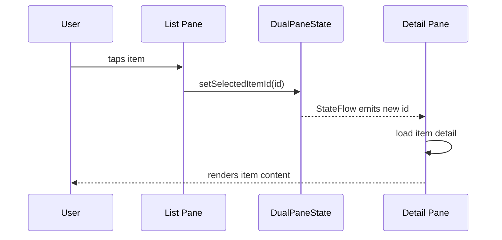
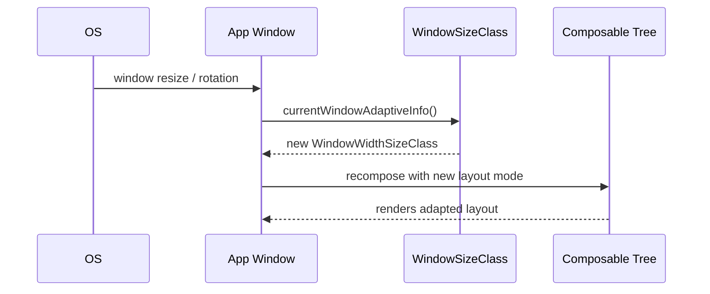
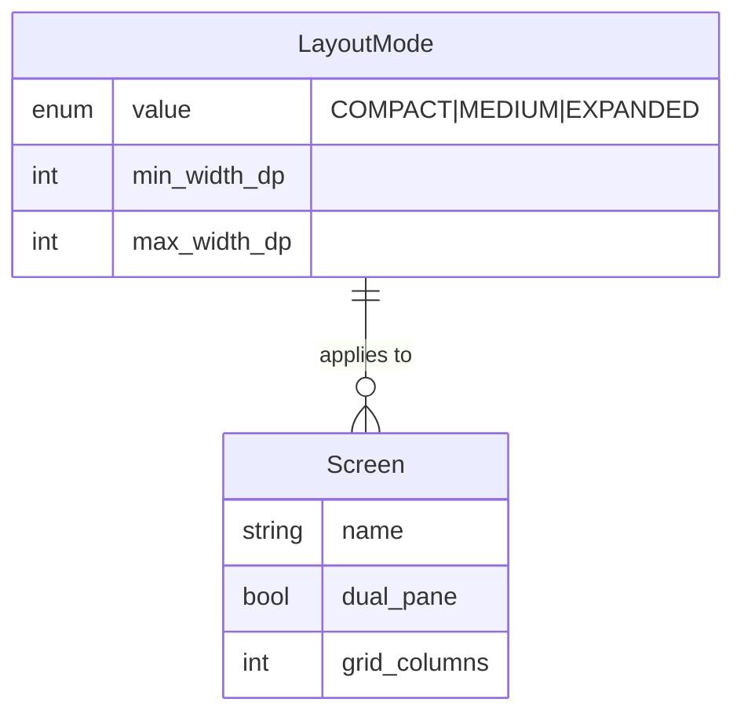

# Tablet Layout Adaptivity — Technical Specification

> **Document status:** Implementation-ready blueprint
> **Last updated:** 2026-06-27
> **Prerequisites:** None
> **Template:** `_SPEC_TEMPLATE.md` v1 (25 mandatory + 6 optional sections)

---

## 1. Feature Overview

Responsive layout system that adapts UI for tablets (7-12 inch) and large screens. Uses Compose Multiplatform's `WindowSizeClass` to switch between single-pane (phone) and dual-pane (tablet) layouts, with adaptive grids, expanded navigation, and optimized content density.

### Goals

- Dual-pane (master-detail) layouts on tablets for list+detail screens
- Adaptive grid layouts for card-based screens
- Expanded side navigation on tablets (rail → drawer)
- Optimized content density (more items visible without scrolling)
- Smooth transitions at window size breakpoints

### Non-goals

- [ ] Desktop-specific layouts (handled by WEB_APP_SPEC)
- [ ] Foldable device hinge awareness (future enhancement)
- [ ] Custom layouts per tablet manufacturer

### Dependencies

- Compose Multiplatform 1.10.3+ (`WindowSizeClass` API)
- Existing `VBottomBar`, `VNavigationRail`, `VPermanentDrawer` components
- Existing screen composables (Messages, Announcements, Attendance, Homework, Fees, Calendar)

### Related Modules

- All screen modules in `composeApp/.../ui/v2/screens/`
- Navigation components in `composeApp/.../ui/v2/components/`
- `NavGraphV2.kt` — root navigation

---

## 2. Current System Assessment

### Existing Code

- All screens currently designed for phone width (single-pane)
- No tablet-specific layouts or breakpoints
- `feature_audit.csv` L148: "Some widthIn(max) constraints, no true responsive layouts" — 20% complete
- Compose Multiplatform 1.10.3 supports `WindowSizeClass` API

### Existing Database

N/A — layout adaptivity is a frontend-only concern. No database changes needed.

### Existing APIs

N/A — no API changes needed for layout adaptivity.

### Existing UI

- All screens use single-pane layout designed for phone width
- Navigation uses bottom bar (`VBottomBar`) on all form factors
- No `WindowSizeClass` detection currently in use
- Some `widthIn(max)` constraints exist but no true responsive layouts

### Existing Services

N/A — no service-layer changes needed.

### Existing Documentation

- `feature_audit.csv` references the gap at L148

### Technical Debt

| # | Gap | Details |
|---|---|---|
| TD-1 | No dual-pane layouts | Tablet users navigate back-and-forth between list and detail |
| TD-2 | No adaptive grids | Cards too large on tablet — wasted space |
| TD-3 | No expanded navigation | Hamburger menu / bottom bar on tablet is suboptimal |
| TD-4 | No content density adaptation | Wasted screen space on tablets |
| TD-5 | No `WindowSizeClass` usage | API available but not integrated |

### Gaps

| # | Gap | Impact | Severity |
|---|---|---|---|
| G1 | No dual-pane layouts | Tablet users navigate back-and-forth | **High** |
| G2 | No adaptive grids | Cards too large on tablet | **Medium** |
| G3 | No expanded navigation | Hamburger menu on tablet is suboptimal | **Medium** |
| G4 | No content density adaptation | Wasted screen space on tablets | **Medium** |

---

## 3. Functional Requirements

### FR-001
| Field | Value |
|---|---|
| **Title** | WindowSizeClass Detection |
| **Description** | Use `WindowSizeClass` to detect compact/medium/expanded window sizes |
| **Priority** | Critical |
| **User Roles** | All |
| **Acceptance notes** | `currentWindowAdaptiveInfo().windowSizeClass` integrated |

### FR-002
| Field | Value |
|---|---|
| **Title** | Dual-Pane Layouts |
| **Description** | Dual-pane layout for: Messages, Announcements, Attendance, Homework, Fees, Calendar |
| **Priority** | High |
| **User Roles** | All |
| **Acceptance notes** | Master-detail pattern on medium and expanded widths |

### FR-003
| Field | Value |
|---|---|
| **Title** | Adaptive Grid |
| **Description** | Adaptive grid: 1 column (compact), 2 columns (medium), 3 columns (expanded) |
| **Priority** | Medium |
| **User Roles** | All |
| **Acceptance notes** | `LazyVerticalGrid` with `GridCells.Fixed(columns)` |

### FR-004
| Field | Value |
|---|---|
| **Title** | Adaptive Navigation |
| **Description** | Navigation: bottom bar (compact) → navigation rail (medium) → permanent drawer (expanded) |
| **Priority** | High |
| **User Roles** | All |
| **Acceptance notes** | Three navigation modes based on window width |

### FR-005
| Field | Value |
|---|---|
| **Title** | Content Density |
| **Description** | Content density: increase padding/spacing on larger screens |
| **Priority** | Medium |
| **User Roles** | All |
| **Acceptance notes** | More items visible without scrolling on tablets |

### FR-006
| Field | Value |
|---|---|
| **Title** | Orientation Support |
| **Description** | Support orientation changes (portrait ↔ landscape) |
| **Priority** | High |
| **User Roles** | All |
| **Acceptance notes** | Layout recomposes correctly on rotation |

### FR-007
| Field | Value |
|---|---|
| **Title** | Multi-Window Support |
| **Description** | Support split-screen and multi-window on Android |
| **Priority** | Medium |
| **User Roles** | All |
| **Acceptance notes** | Window size changes trigger recomposition |

---

## 4. User Stories

### Parent
- [ ] View messages in dual-pane on tablet (list on left, conversation on right)
- [ ] See more announcement cards at once on tablet (adaptive grid)
- [ ] Navigate via side rail on tablet instead of bottom bar

### Teacher
- [ ] Take attendance in dual-pane on tablet (student list + attendance form side by side)
- [ ] View homework submissions in dual-pane (list + detail)
- [ ] Navigate via permanent drawer on large tablet

### School Admin
- [ ] Manage fees in dual-pane on tablet (list + invoice detail)
- [ ] View calendar in dual-pane (month view + event detail)
- [ ] See more content per screen on tablet

### System
- [ ] Detect window size class changes and recompose accordingly
- [ ] Handle orientation changes smoothly without state loss
- [ ] Support multi-window mode on Android

---

## 5. Business Rules

### BR-001
**Rule:** Dual-pane layouts activate at medium width (600dp+) and above.
**Enforcement:** `WindowSizeClass.windowWidthSizeClass >= WindowWidthSizeClass.Medium`

### BR-002
**Rule:** Navigation mode is determined by window width, not user preference.
**Enforcement:** Compact → bottom bar, Medium → rail, Expanded → permanent drawer

### BR-003
**Rule:** Grid column count is determined by window width class.
**Enforcement:** Compact → 1, Medium → 2, Expanded → 3

### BR-004
**Rule:** State is preserved across window size changes and orientation rotations.
**Enforcement:** ViewModel survives configuration changes; `rememberSaveable` for scroll position

### BR-005
**Rule:** Dual-pane detail pane shows empty state when no item is selected.
**Enforcement:** Default placeholder composable in detail pane

### BR-006
**Rule:** In dual-pane, selecting an item in the list updates the detail pane without navigation.
**Enforcement:** Shared `StateFlow<SelectedItem?>` between list and detail composables

---

## 6. Database Design

### 6.1 Entity Relationship Summary

N/A — tablet layout adaptivity is a frontend-only concern. No database changes needed.

### 6.2 New Tables

N/A

### 6.3 Modified Tables

N/A

### 6.4 Indexes

N/A

### 6.5 Constraints

N/A

### 6.6 Foreign Keys

N/A

### 6.7 Soft Delete Strategy

N/A

### 6.8 Audit Fields

N/A

### 6.9 Migration Notes

N/A — no database migration needed.

### 6.10 Exposed Mappings

N/A

### 6.11 Seed Data

N/A

---

## 7. State Machines

### Window Size State Machine

```
COMPACT (< 600dp) ──resize──> MEDIUM (600-840dp) ──resize──> EXPANDED (> 840dp)
     ▲                                                              │
     └───────────────────resize──────────────────────────────────────┘
```

| Current State | Event | Next State | Guard / Condition |
|---|---|---|---|
| `compact` | Window resize | `medium` | Width >= 600dp |
| `compact` | Window resize | `expanded` | Width > 840dp |
| `medium` | Window resize | `compact` | Width < 600dp |
| `medium` | Window resize | `expanded` | Width > 840dp |
| `expanded` | Window resize | `medium` | Width <= 840dp |
| `expanded` | Window resize | `compact` | Width < 600dp |
| any | Orientation change | re-evaluate | Width may change on rotation |

### Dual-Pane Selection State

```
NO_SELECTION ──user taps item──> ITEM_SELECTED
ITEM_SELECTED ──user taps different item──> ITEM_SELECTED (updated)
ITEM_SELECTED ──list becomes empty──> NO_SELECTION
```

| Current State | Event | Next State | Guard / Condition |
|---|---|---|---|
| `no_selection` | User taps list item | `item_selected` | Dual-pane mode active |
| `item_selected` | User taps different item | `item_selected` | New item id set |
| `item_selected` | List filtered/emptied | `no_selection` | Selected item no longer in list |

---

## 8. Backend Architecture

### 8.1 Component Overview

N/A — tablet layout adaptivity is entirely a frontend concern. No backend changes needed.

### 8.2 Design Principles

1. **Adaptive, not separate** — One codebase adapts to different screen sizes; no separate tablet app
2. **WindowSizeClass-driven** — Use Compose Multiplatform's `WindowSizeClass` API for breakpoints
3. **State preservation** — UI state survives window size changes and orientation rotations
4. **Progressive enhancement** — Phone layout is the baseline; tablet features are layered on

### 8.3 Core Types

```kotlin
enum class LayoutMode {
    COMPACT,   // < 600dp — single-pane, bottom nav
    MEDIUM,    // 600-840dp — dual-pane optional, navigation rail
    EXPANDED,  // > 840dp — dual-pane, permanent drawer
}

data class DualPaneState(
    val selectedItemId: String? = null,
    val showDetail: Boolean = false,
)
```

### 8.4 Breakpoints

| Class | Width | Layout |
|---|---|---|
| Compact | < 600dp | Single-pane, bottom nav |
| Medium | 600-840dp | Dual-pane optional, navigation rail |
| Expanded | > 840dp | Dual-pane, permanent drawer |

### 8.5 Repositories

N/A — no repository changes needed.

### 8.6 Mappers

N/A

### 8.7 Permission Checks

N/A — layout adaptivity has no permission requirements.

### 8.8 Background Jobs

N/A — no background jobs needed.

### 8.9 Domain Events

N/A — no domain events for layout changes.

### 8.10 Caching

N/A — layout mode is computed from `WindowSizeClass` at runtime.

### 8.11 Transactions

N/A

---

## 9. API Contracts

N/A — tablet layout adaptivity requires no API changes. All existing APIs work as-is; the frontend simply renders differently based on window size.

---

## 10. Frontend Architecture

### 10.1 Screens

| Screen | Platform | Role | Description |
|---|---|---|---|
| Messages | All | All | Dual-pane: conversation list + message thread |
| Announcements | All | All | Dual-pane: announcement list + detail; adaptive grid for cards |
| Attendance | All | Teacher | Dual-pane: student list + attendance form |
| Homework | All | Teacher/Parent | Dual-pane: homework list + submission detail |
| Fees | All | All | Dual-pane: fee list + invoice detail |
| Calendar | All | All | Dual-pane: month view + event detail |

### 10.2 Navigation

Navigation adapts based on window size class:

| Width Class | Navigation Component |
|---|---|
| Compact | `VBottomBar` (bottom navigation bar) |
| Medium | `VNavigationRail` (side rail) |
| Expanded | `VPermanentDrawer` (permanent side drawer) |

### 10.3 UX Flows

#### Dual-Pane Selection Flow

1. User sees list pane on left (40%) and detail pane on right (60%)
2. Detail pane shows empty state placeholder initially
3. User taps an item in the list → detail pane updates with item content
4. User taps another item → detail pane updates again (no navigation)
5. On compact width → list fills screen, tapping item navigates to detail screen

### 10.4 State Management

```kotlin
data class AdaptiveLayoutState(
    val layoutMode: LayoutMode,
    val selectedItemId: String?,  // for dual-pane selection
    val isDualPane: Boolean,      // layoutMode >= MEDIUM
)
```

### 10.5 Offline Support

N/A — layout adaptivity works the same online and offline.

### 10.6 Loading States

- List pane: existing loading states (skeleton/shimmer)
- Detail pane: loading state when fetching selected item
- Empty detail: placeholder when no item selected

### 10.7 Error Handling (UI)

- List pane: existing error states
- Detail pane: error state if selected item fails to load

### 10.8 Search & Filtering

- In dual-pane: search/filter affects list pane only; detail pane stays or shows empty state if no results

### 10.9 Pagination

- List pane: existing pagination behavior
- Detail pane: no pagination (single item)

### 10.10 UI Components

#### AdaptiveLayout Composable

```kotlin
@Composable
fun AdaptiveLayout(
    list: @Composable () -> Unit,
    detail: @Composable () -> Unit
) {
    val windowSizeClass = currentWindowAdaptiveInfo().windowSizeClass
    when (windowSizeClass.windowWidthSizeClass) {
        WindowWidthSizeClass.Compact -> {
            // Single-pane: list fills screen, detail opens as new screen
            list()
        }
        WindowWidthSizeClass.Medium,
        WindowWidthSizeClass.Expanded -> {
            // Dual-pane: list on left (40%), detail on right (60%)
            Row {
                Box(modifier = Modifier.weight(0.4f)) { list() }
                Box(modifier = Modifier.weight(0.6f)) { detail() }
            }
        }
    }
}
```

#### AdaptiveGrid Composable

```kotlin
@Composable
fun AdaptiveGrid(
    items: List<T>,
    content: @Composable (T) -> Unit
) {
    val columns = when (currentWindowWidthSizeClass()) {
        WindowWidthSizeClass.Compact -> 1
        WindowWidthSizeClass.Medium -> 2
        else -> 3
    }
    LazyVerticalGrid(columns = GridCells.Fixed(columns)) {
        items(items) { content(it) }
    }
}
```

#### AdaptiveNavigation

```kotlin
@Composable
fun AdaptiveNavigation(
    items: List<NavItem>,
    content: @Composable () -> Unit
) {
    val widthClass = currentWindowWidthSizeClass()
    when (widthClass) {
        WindowWidthSizeClass.Compact -> {
            Scaffold(bottomBar = { VBottomBar(items) }) { content() }
        }
        WindowWidthSizeClass.Medium -> {
            Scaffold { padding ->
                Row {
                    VNavigationRail(items)
                    Box(modifier = Modifier.padding(padding)) { content() }
                }
            }
        }
        else -> {
            Scaffold { padding ->
                Row {
                    VPermanentDrawer(items)
                    Box(modifier = Modifier.padding(padding)) { content() }
                }
            }
        }
    }
}
```

### 10.11 Component Integration Guidelines

#### Rules for All Screens

| Rule | Description |
|---|---|
| **R1** | All list+detail screens must use `AdaptiveLayout` |
| **R2** | All card-based screens must use `AdaptiveGrid` |
| **R3** | Navigation must use `AdaptiveNavigation` at the portal level |
| **R4** | State must survive window size changes (`rememberSaveable` for scroll position) |
| **R5** | Dual-pane detail must show empty state placeholder when no item selected |

---

## 11. Shared Module Changes (KMP)

### 11.1 DTOs

N/A — no DTO changes needed.

### 11.2 Domain Models

```kotlin
enum class LayoutMode { COMPACT, MEDIUM, EXPANDED }
data class DualPaneState(val selectedItemId: String? = null, val showDetail: Boolean = false)
```

### 11.3 Repository Interfaces

N/A — no repository changes.

### 11.4 UseCases

N/A — layout mode is computed directly from `WindowSizeClass`.

### 11.5 Validation

N/A

### 11.6 Serialization

N/A

### 11.7 Network APIs

N/A

### 11.8 Database Models (Local Cache)

N/A

---

## 12. Permissions Matrix

| Action | Platform Admin | School Admin | Teacher | Parent |
|---|---|---|---|---|
| Use adaptive layouts | ✅ | ✅ | ✅ | ✅ |
| Use dual-pane on tablet | ✅ | ✅ | ✅ | ✅ |
| Use adaptive navigation | ✅ | ✅ | ✅ | ✅ |

---

## 13. Notifications

N/A — layout adaptivity does not generate notifications.

---

## 14. Background Jobs

N/A — no background jobs needed for layout adaptivity.

---

## 15. Integrations

### Compose Multiplatform WindowSizeClass
| Field | Value |
|---|---|
| **System** | Compose Multiplatform |
| **Purpose** | Detect window size class for responsive layouts |
| **API / SDK** | `currentWindowAdaptiveInfo().windowSizeClass` |
| **Auth method** | N/A |
| **Fallback** | Compact layout (single-pane) if API unavailable |

### Android Multi-Window
| Field | Value |
|---|---|
| **System** | Android WindowManager |
| **Purpose** | Support split-screen and multi-window mode |
| **API / SDK** | `Activity.onMultiWindowModeChanged` |
| **Fallback** | Compact layout |

---

## 16. Security

### Authentication
N/A — layout adaptivity has no authentication implications.

### Authorization
N/A — all users get adaptive layouts.

### Encryption
N/A

### Audit Logs
N/A

### PII Handling
N/A

### Data Isolation
N/A

### Rate Limiting
N/A

### Input Validation
N/A

---

## 17. Performance & Scalability

### Expected Scale

| Metric | Phone (compact) | Tablet (medium) | Tablet (expanded) |
|---|---|---|---|
| Layout recomposition | Minimal | Moderate | Moderate |
| Grid columns | 1 | 2 | 3 |
| Visible items | 5-8 | 8-14 | 12-20 |
| Memory (dual-pane) | N/A | +1 composable tree | +1 composable tree |

### Latency Targets

| Operation | Target |
|---|---|
| Window size class detection | < 1ms |
| Layout mode switch recomposition | < 50ms |
| Orientation change recomposition | < 100ms |

### Optimization Strategy

- `WindowSizeClass` is computed once per window size change — no per-frame overhead
- Dual-pane uses `Row` with `weight` modifiers — efficient layout pass
- `LazyVerticalGrid` only composes visible items — efficient for large lists
- State preservation via `rememberSaveable` avoids re-fetching data on rotation

---

## 18. Edge Cases

| # | Scenario | Expected Behavior |
|---|---|---|
| EC-001 | Window resized from compact to expanded rapidly | Layout transitions smoothly; state preserved |
| EC-002 | Orientation change while item selected in dual-pane | Selected item preserved; detail pane updates |
| EC-003 | Multi-window mode on Android | Window size class recomputes; layout adapts |
| EC-004 | Very large screen (> 1200dp) | Expanded layout with 3-column grid; dual-pane with wider detail |
| EC-005 | Split-screen with very narrow width | Compact layout (single-pane, bottom nav) |
| EC-006 | List empty in dual-pane | List pane shows empty state; detail pane shows placeholder |
| EC-007 | Item selected then list filtered out | Detail pane returns to empty state |

### Risks & Mitigations

| Risk | Likelihood | Impact | Mitigation |
|---|---|---|---|
| State loss on orientation change | Medium | High | `rememberSaveable` + ViewModel retention |
| Layout overflow on unusual aspect ratios | Low | Medium | `WindowSizeClass` handles edge cases; test with various emulators |
| Performance regression from dual-pane | Low | Low | Lazy composition; only visible items rendered |
| Navigation confusion (rail vs drawer) | Low | Low | Consistent navigation items across all modes |

---

## 19. Error Handling

### Standard Error Codes

N/A — layout adaptivity has no error codes. Errors are handled by individual screens.

### Error Response Format

N/A

### Recovery Strategy

| Error | Client Action |
|---|---|
| `WindowSizeClass` API unavailable | Fall back to compact layout |
| Layout recomposition failure | Existing error handling per screen |

---

## 20. Analytics & Reporting

### Reports

N/A — layout adaptivity does not generate reports.

### KPIs

- **Tablet Usage:** % of sessions on tablet-width devices
- **Dual-Pane Engagement:** % of tablet users using dual-pane vs single-pane

### Dashboards

N/A

### Exports

N/A

---

## 21. Testing Strategy

### Unit Tests

| Test | What it verifies |
|---|---|
| `LayoutMode` from width < 600dp | Returns `COMPACT` |
| `LayoutMode` from width 600-840dp | Returns `MEDIUM` |
| `LayoutMode` from width > 840dp | Returns `EXPANDED` |
| `DualPaneState` selection | Selected item id updates correctly |
| `DualPaneState` clearing | Returns to `no_selection` when list empties |

### UI Tests

| Test | What it verifies |
|---|---|
| Messages screen in compact | Single-pane layout |
| Messages screen in medium | Dual-pane layout (40/60 split) |
| Messages screen in expanded | Dual-pane layout (40/60 split) |
| AdaptiveGrid in compact | 1 column |
| AdaptiveGrid in medium | 2 columns |
| AdaptiveGrid in expanded | 3 columns |
| Navigation in compact | Bottom bar visible |
| Navigation in medium | Navigation rail visible |
| Navigation in expanded | Permanent drawer visible |
| Orientation change | State preserved, layout correct |

### Visual Regression

Screenshot tests for each screen at compact/medium/expanded widths. Use `paparazzi` or `roborazzi` for Compose Multiplatform screenshot testing.

### Performance Tests

- [ ] Layout mode switch recomposition < 50ms
- [ ] Orientation change recomposition < 100ms
- [ ] Dual-pane scroll performance smooth (60fps)

### Security Tests

N/A — no security implications.

### Migration Tests

N/A — no data migration.

---

## 22. Acceptance Criteria

- [ ] Dual-pane layout for Messages, Announcements, Attendance, Homework, Fees, Calendar
- [ ] Adaptive grid for card-based screens (1/2/3 columns)
- [ ] Navigation adapts: bottom bar → rail → drawer
- [ ] Orientation changes handled smoothly with state preservation
- [ ] No layout overflow or clipping on tablets
- [ ] Multi-window mode supported on Android
- [ ] Empty state placeholder in dual-pane detail when no item selected
- [ ] Content density increased on larger screens

---

## 23. Implementation Roadmap

| Phase | Duration | Tasks | Breaking? | Deliverable |
|---|---|---|---|---|
| 1 | 2 days | `AdaptiveLayout` + `AdaptiveGrid` + `AdaptiveNavigation` composables | No | Core adaptive components |
| 2 | 3 days | Apply dual-pane to Messages, Announcements, Attendance | No | First 3 dual-pane screens |
| 3 | 3 days | Apply dual-pane to Homework, Fees, Calendar | No | Remaining 3 dual-pane screens |
| 4 | 2 days | Apply adaptive grid to all card screens | No | Adaptive grids |
| 5 | 2 days | Navigation adaptation (rail + permanent drawer) | No | Adaptive navigation |
| 6 | 2 days | Tests (UI + visual regression) | No | Test coverage |

**Total: ~14 days**

---

## 24. File-Level Impact Analysis

### New Files

| File | Location | Purpose |
|---|---|---|
| `AdaptiveLayout.kt` | `composeApp/.../ui/v2/components/` | Dual-pane composable |
| `AdaptiveGrid.kt` | `composeApp/.../ui/v2/components/` | Adaptive grid composable |
| `AdaptiveNavigation.kt` | `composeApp/.../ui/v2/components/` | Adaptive navigation |
| `VNavigationRail.kt` | `composeApp/.../ui/v2/components/` | Navigation rail component |
| `VPermanentDrawer.kt` | `composeApp/.../ui/v2/components/` | Permanent drawer component |

### Modified Files

| File | Change Type | Lines Changed (est.) | Risk | Description |
|---|---|---|---|---|
| `composeApp/.../ui/v2/screens/**/*.kt` | Modify | ~10-20 per screen | Low | Apply adaptive layouts to each screen |
| `NavGraphV2.kt` | Modify | ~15 | Medium | Wrap portals in `AdaptiveNavigation` |
| `TeacherPortalV2.kt` | Modify | ~10 | Low | Use `AdaptiveNavigation` |
| `ParentPortalV2.kt` | Modify | ~10 | Low | Use `AdaptiveNavigation` |
| `SchoolPortalV2.kt` | Modify | ~10 | Low | Use `AdaptiveNavigation` |

### Files Preserved Unchanged

| File | Reason |
|---|---|
| All ViewModels | Logic unchanged; only UI layout adapts |
| All repositories | No data layer changes |
| All API clients | No API changes |
| `VColors.kt`, `VTheme.kt` | Theme system unchanged |

---

## 25. Future Enhancements

### Foldable Device Support

For foldable devices with a hinge (e.g. Galaxy Z Fold), use `WindowInfoTracker` to detect hinge position and avoid placing content across the fold:

```kotlin
val windowInfo = WindowInfoTracker.getOrCreate(context).windowLayoutInfo()
// Adjust layout to avoid hinge area
```

### Desktop Layouts

For desktop/web large screens (> 1200dp), consider:
- 3-pane layouts (list + detail + side panel)
- Wider permanent drawer with sub-menu items
- Keyboard shortcuts for navigation

### Per-Screen Dual-Pane Toggle

Allow users to force single-pane on tablet if they prefer the phone experience:
- Setting: "Use single-pane layout on tablet"
- Stored in `PreferenceRepository`

### Adaptive Typography

Scale typography based on window size class:
- Compact: existing type scale
- Medium: +1pt for headings
- Expanded: +2pt for headings

### Drag-to-Resize Panes

Allow users to drag the divider between list and detail panes to adjust the split ratio:
- Default 40/60
- User-adjustable from 30/70 to 50/50
- Preference persisted per screen

---

## A. Sequence Diagrams

### Dual-Pane Selection Flow



### Window Size Change Flow



---

## B. Domain Model / ER Diagram

N/A — tablet layout adaptivity has no database entities. Layout mode is computed at runtime from `WindowSizeClass`.



---

## C. Event Flow

```
WindowResized ──> WindowSizeClass re-evaluates ──> LayoutMode changes ──> UI recomposes
ItemSelected ──> DualPaneState updates ──> Detail pane recomposes
OrientationChanged ──> WindowSizeClass re-evaluates ──> State preserved via rememberSaveable
```

| Event | Emitted By | Consumed By | Side Effect |
|---|---|---|---|
| `WindowResized` | OS / WindowManager | `WindowSizeClass` | Layout mode re-evaluated |
| `ItemSelected` | List pane | `DualPaneState` | Detail pane updates |
| `OrientationChanged` | OS | `WindowSizeClass` | Layout recomposes; state preserved |

---

## D. Configuration

### Environment Variables

N/A — layout adaptivity is determined at runtime. No environment variables needed.

### Feature Flags

| Flag | Default | Description |
|---|---|---|
| `tablet_dual_pane_enabled` | `true` | Enable dual-pane layouts on medium/expanded widths |
| `tablet_adaptive_grid_enabled` | `true` | Enable adaptive grid columns |
| `tablet_adaptive_nav_enabled` | `true` | Enable adaptive navigation (rail/drawer) |

### Client-Side Configuration

| Config | Default | Description |
|---|---|---|
| Compact breakpoint | < 600dp | Single-pane, bottom nav |
| Medium breakpoint | 600-840dp | Dual-pane optional, navigation rail |
| Expanded breakpoint | > 840dp | Dual-pane, permanent drawer |
| Dual-pane list weight | 0.4f (40%) | List pane width fraction |
| Dual-pane detail weight | 0.6f (60%) | Detail pane width fraction |

### Server-Side Configuration

N/A

### Infrastructure Requirements

- Compose Multiplatform 1.10.3+ (`WindowSizeClass` API)
- Android Multi-Window support (existing)

---

## E. Migration & Rollback

### Deployment Plan

1. [ ] Create `AdaptiveLayout.kt`, `AdaptiveGrid.kt`, `AdaptiveNavigation.kt`
2. [ ] Create `VNavigationRail.kt`, `VPermanentDrawer.kt`
3. [ ] Wrap portals in `AdaptiveNavigation`
4. [ ] Apply `AdaptiveLayout` to Messages, Announcements, Attendance
5. [ ] Apply `AdaptiveLayout` to Homework, Fees, Calendar
6. [ ] Apply `AdaptiveGrid` to all card-based screens
7. [ ] Test on tablet emulators (7", 10", 12")
8. [ ] Test orientation changes and multi-window

### Rollback Plan

1. [ ] Revert frontend deployment → app reverts to single-pane layouts
2. [ ] No data loss — layout adaptivity is UI-only
3. [ ] No database rollback needed

### Data Backfill

N/A — no data migration needed.

### Migration SQL

N/A — no database changes.

---

## F. Observability

### Logging

- Layout mode changes logged at DEBUG: `layout_mode_changed` (old → new, width dp)
- Dual-pane selection logged at TRACE: `dual_pane_item_selected` (screen, itemId)
- Orientation changes logged at DEBUG: `orientation_changed` (portrait ↔ landscape)

### Metrics

| Metric | Type | Description |
|---|---|---|
| `layout.mode_distribution` | Gauge (by mode: compact, medium, expanded) | Distribution of layout modes in use |
| `layout.orientation_changes_total` | Counter | Total orientation changes |
| `layout.dual_pane_usage` | Gauge | % of tablet sessions using dual-pane |

### Health Checks

N/A — layout adaptivity is a client-side UI concern.

### Alerts

N/A — no operational alerts needed.
