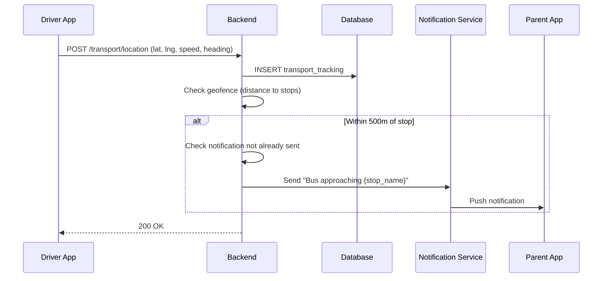
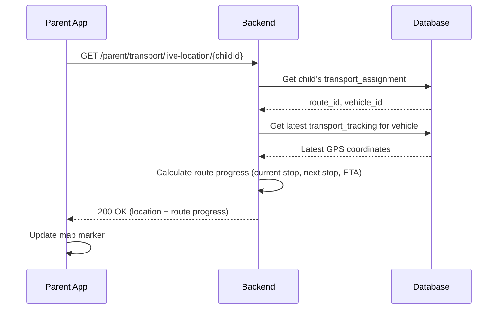
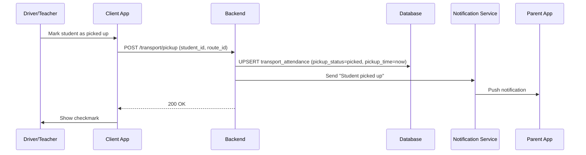
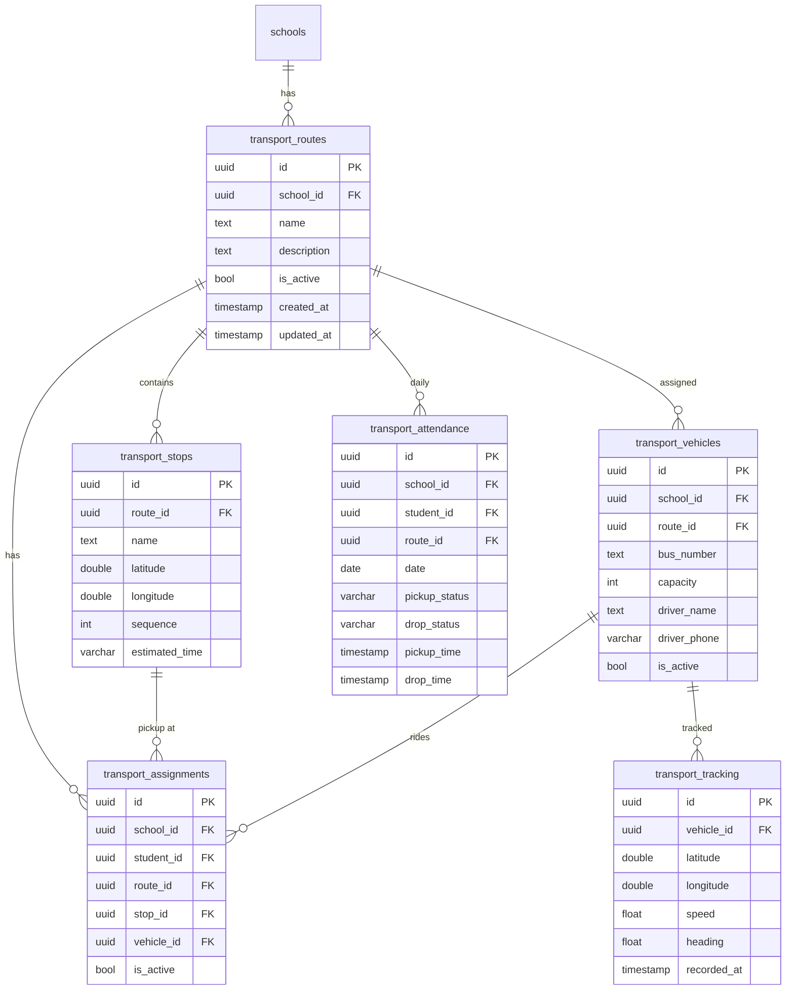

# Transport Tracking — Technical Specification

> **Document status:** Implementation-ready blueprint
> **Last updated:** 2026-06-27
> **Prerequisites:** None
> **Template:** `_SPEC_TEMPLATE.md` v1 (25 mandatory + 6 optional sections)

---

## 1. Feature Overview

GPS bus tracking and transport management: route creation, vehicle/driver management, real-time location tracking, student pickup/drop status, and transport fee integration.

### Goals

- Admin manages routes, vehicles, drivers, and student assignments
- Parent sees real-time bus location on map
- Parent receives notification when bus approaches pickup/drop
- Driver app (or teacher proxy) marks pickup/drop per stop
- Transport fee linked to `FeeRecordsTable`
- Route optimization suggestions

### Non-goals

- [ ] Live driver-to-parent chat (future enhancement)
- [ ] Automated route optimization (suggestions only for v1)
- [ ] Fuel tracking and vehicle maintenance logs
- [ ] Multi-school shared transport

### Dependencies

- `FeeRecordsTable` — transport fee integration
- Google Maps API (or OpenStreetMap) — map rendering
- FCM/APNs — push notifications for bus approaching

### Related Modules

- `server/.../feature/fees/` — fee management
- `server/.../feature/notifications/` — notification service
- `shared/.../feature/transport/` — shared transport DTOs

---

## 2. Current System Assessment

### Existing Code

- `feature_audit.csv` L117-118: Transport tracking missing (0%)
- `DIFFERENTIATING_FEATURES.md` §6.2: Transport Tracking, effort L
- No transport tables in `Tables.kt`
- Google Maps integration not present (but Ktor Client can call Maps API)

### Existing Database

- `FeeRecordsTable` — fee records (for transport fee integration)
- `StudentsTable` — student records
- `SchoolsTable` — school records
- No transport-related tables

### Existing APIs

- `POST /api/v1/school/fees` — fee creation (for transport fee)
- `GET /api/v1/school/students` — student management
- No transport APIs exist

### Existing UI

- Admin: fee management, student management
- Parent: dashboard, fee payment
- No transport UI

### Existing Services

- `FeeService` — fee management
- `NotificationService` — push notifications (FCM/APNs)
- No transport services

### Existing Documentation

- `DIFFERENTIATING_FEATURES.md` §6.2 — Transport Tracking feature description
- `feature_audit.csv` — feature audit tracking

### Technical Debt

| # | Gap | Details |
|---|---|---|
| TD-1 | No transport tracking | 0% implementation |
| TD-2 | No transport tables | No DB schema for routes, vehicles, stops |
| TD-3 | No GPS tracking | No real-time location infrastructure |
| TD-4 | No map integration | No map SDK integrated |

### Gaps

| # | Gap | Impact | Severity |
|---|---|---|---|
| G1 | No route management | Cannot create or manage bus routes | **High** |
| G2 | No real-time tracking | Parents cannot see bus location | **High** |
| G3 | No pickup/drop tracking | No record of student boarding/alighting | **High** |
| G4 | No transport fee integration | Transport fees managed manually | **Medium** |
| G5 | No geofence notifications | Parents not alerted when bus approaches | **Medium** |

---

## 3. Functional Requirements

### FR-001
| Field | Value |
|---|---|
| **Title** | Route Creation |
| **Description** | Admin creates routes with stops (name, lat/lng, sequence, estimated time) |
| **Priority** | Critical |
| **User Roles** | School Admin |
| **Acceptance notes** | Route with ordered stops, each with GPS coordinates and estimated time |

### FR-002
| Field | Value |
|---|---|
| **Title** | Vehicle Management |
| **Description** | Admin assigns vehicles (bus number, capacity, driver) to routes |
| **Priority** | Critical |
| **User Roles** | School Admin |
| **Acceptance notes** | Vehicle with bus number, capacity, driver name/phone, assigned to route |

### FR-003
| Field | Value |
|---|---|
| **Title** | Student Assignment |
| **Description** | Admin assigns students to routes/stops |
| **Priority** | Critical |
| **User Roles** | School Admin |
| **Acceptance notes** | Student assigned to route + stop + vehicle |

### FR-004
| Field | Value |
|---|---|
| **Title** | Real-Time GPS Tracking |
| **Description** | Real-time GPS tracking: vehicle location updated every 30 seconds |
| **Priority** | Critical |
| **User Roles** | System |
| **Acceptance notes** | Location update every 30s from driver app; stored in `transport_tracking` |

### FR-005
| Field | Value |
|---|---|
| **Title** | Parent Live Map View |
| **Description** | Parent views live bus location on map |
| **Priority** | High |
| **User Roles** | Parent |
| **Acceptance notes** | Map with bus marker, route polyline, stop markers |

### FR-006
| Field | Value |
|---|---|
| **Title** | Geofence Notification |
| **Description** | Notification when bus is 5 minutes from pickup/drop |
| **Priority** | High |
| **User Roles** | Parent |
| **Acceptance notes** | Push notification when vehicle within 500m of stop |

### FR-007
| Field | Value |
|---|---|
| **Title** | Pickup/Drop Marking |
| **Description** | Driver marks pickup/drop per student per stop |
| **Priority** | Critical |
| **User Roles** | Driver, Teacher (proxy) |
| **Acceptance notes** | Per-student pickup and drop status recorded |

### FR-008
| Field | Value |
|---|---|
| **Title** | Transport Fee Integration |
| **Description** | Transport fee auto-created in `FeeRecordsTable` |
| **Priority** | Medium |
| **User Roles** | System |
| **Acceptance notes** | Fee record created when student assigned to route |

### FR-009
| Field | Value |
|---|---|
| **Title** | Route History and Attendance |
| **Description** | Route history and attendance (who rode which day) |
| **Priority** | Medium |
| **User Roles** | School Admin |
| **Acceptance notes** | Daily transport attendance report per route |

---

## 4. User Stories

### School Admin
- [ ] Create a bus route with stops and estimated times
- [ ] Assign a vehicle and driver to a route
- [ ] Assign students to specific stops on a route
- [ ] View daily transport attendance for any route
- [ ] See which students were picked up, missed, or absent

### Parent
- [ ] See my child's bus location on a map in real-time
- [ ] Get notified when the bus is approaching my child's stop
- [ ] Know if my child was picked up and dropped off
- [ ] View my child's transport route and stop details

### Driver / Teacher
- [ ] View list of stops for my route
- [ ] Mark students as picked up at each stop
- [ ] Mark students as dropped off at each stop
- [ ] Send my current GPS location automatically

### System
- [ ] Update vehicle GPS location every 30 seconds
- [ ] Trigger geofence notification when vehicle within 500m of stop
- [ ] Auto-create transport fee in `FeeRecordsTable` on assignment
- [ ] Generate daily transport attendance records

---

## 5. Business Rules

### BR-001
**Rule:** One vehicle per route (one-to-one assignment).
**Enforcement:** `transport_vehicles.route_id` references `transport_routes.id`.

### BR-002
**Rule:** Student assigned to one route + stop + vehicle.
**Enforcement:** `transport_assignments` has `student_id`, `route_id`, `stop_id`, `vehicle_id`.

### BR-003
**Rule:** GPS location updated every 30 seconds from driver app.
**Enforcement:** Driver app sends location update via `POST /api/v1/transport/location` every 30s.

### BR-004
**Rule:** Geofence notification triggered when vehicle within 500m of stop.
**Enforcement:** Server checks distance between vehicle GPS and stop coordinates; triggers notification if < 500m.

### BR-005
**Rule:** Transport fee auto-created when student assigned to route.
**Enforcement:** `TransportAssignmentService.assign()` creates `FeeRecordsTable` entry with transport fee amount.

### BR-006
**Rule:** One transport attendance record per student per day.
**Enforcement:** `transport_attendance` has `UNIQUE(school_id, student_id, date)`.

---

## 6. Database Design

### 6.1 Entity Relationship Summary

Six new tables: `transport_routes`, `transport_stops`, `transport_vehicles`, `transport_assignments`, `transport_tracking`, `transport_attendance`. Routes have stops, vehicles assigned to routes, students assigned to routes/stops/vehicles, tracking records for GPS, attendance for daily records.

### 6.2 New Tables

```sql
CREATE TABLE transport_routes (
    id              UUID PRIMARY KEY DEFAULT gen_random_uuid(),
    school_id       UUID NOT NULL,
    name            TEXT NOT NULL,                 -- "Route A - North Zone"
    description     TEXT,
    is_active       BOOLEAN NOT NULL DEFAULT true,
    created_at      TIMESTAMP NOT NULL DEFAULT now(),
    updated_at      TIMESTAMP NOT NULL DEFAULT now()
);

CREATE TABLE transport_stops (
    id              UUID PRIMARY KEY DEFAULT gen_random_uuid(),
    route_id        UUID NOT NULL REFERENCES transport_routes(id) ON DELETE CASCADE,
    name            TEXT NOT NULL,                 -- "Sector 12 Bus Stop"
    latitude        DOUBLE PRECISION NOT NULL,
    longitude       DOUBLE PRECISION NOT NULL,
    sequence        INTEGER NOT NULL,              -- order in route
    estimated_time  VARCHAR(8),                    -- "07:15"
    created_at      TIMESTAMP NOT NULL DEFAULT now()
);

CREATE TABLE transport_vehicles (
    id              UUID PRIMARY KEY DEFAULT gen_random_uuid(),
    school_id       UUID NOT NULL,
    route_id        UUID REFERENCES transport_routes(id),
    bus_number      TEXT NOT NULL,
    capacity        INTEGER NOT NULL DEFAULT 40,
    driver_name     TEXT,
    driver_phone    VARCHAR(32),
    driver_license  TEXT,
    is_active       BOOLEAN NOT NULL DEFAULT true,
    created_at      TIMESTAMP NOT NULL DEFAULT now(),
    updated_at      TIMESTAMP NOT NULL DEFAULT now()
);

CREATE TABLE transport_assignments (
    id              UUID PRIMARY KEY DEFAULT gen_random_uuid(),
    school_id       UUID NOT NULL,
    student_id      UUID NOT NULL,
    route_id        UUID NOT NULL REFERENCES transport_routes(id),
    stop_id         UUID NOT NULL REFERENCES transport_stops(id),
    vehicle_id      UUID NOT NULL REFERENCES transport_vehicles(id),
    is_active       BOOLEAN NOT NULL DEFAULT true,
    created_at      TIMESTAMP NOT NULL DEFAULT now()
);

CREATE TABLE transport_tracking (
    id              UUID PRIMARY KEY DEFAULT gen_random_uuid(),
    vehicle_id      UUID NOT NULL REFERENCES transport_vehicles(id),
    latitude        DOUBLE PRECISION NOT NULL,
    longitude       DOUBLE PRECISION NOT NULL,
    speed           REAL,                          -- km/h
    heading         REAL,                          -- degrees
    recorded_at     TIMESTAMP NOT NULL DEFAULT now()
);

CREATE TABLE transport_attendance (
    id              UUID PRIMARY KEY DEFAULT gen_random_uuid(),
    school_id       UUID NOT NULL,
    student_id      UUID NOT NULL,
    route_id        UUID NOT NULL,
    date            DATE NOT NULL,
    pickup_status   VARCHAR(16),                   -- picked | missed | absent
    drop_status     VARCHAR(16),                   -- dropped | missed
    pickup_time     TIMESTAMP,
    drop_time       TIMESTAMP,
    created_at      TIMESTAMP NOT NULL DEFAULT now(),
    UNIQUE(school_id, student_id, date)
);
```

### 6.3 Modified Tables

N/A — no existing tables modified. `FeeRecordsTable` is written to on assignment but schema unchanged.

### 6.4 Indexes

```sql
CREATE INDEX idx_transport_tracking_vehicle ON transport_tracking(vehicle_id, recorded_at DESC);
CREATE INDEX idx_transport_assignments_student ON transport_assignments(student_id, is_active);
CREATE INDEX idx_transport_attendance_route_date ON transport_attendance(route_id, date);
```

### 6.5 Constraints

- `transport_routes.school_id` — NOT NULL
- `transport_routes.name` — NOT NULL
- `transport_stops.route_id` — NOT NULL, FK
- `transport_stops.latitude` / `longitude` — NOT NULL
- `transport_stops.sequence` — NOT NULL
- `transport_vehicles.bus_number` — NOT NULL
- `transport_assignments.student_id` — NOT NULL
- `transport_attendance` — UNIQUE(school_id, student_id, date)

### 6.6 Foreign Keys

- `transport_stops.route_id` → `transport_routes.id` (ON DELETE CASCADE)
- `transport_vehicles.route_id` → `transport_routes.id`
- `transport_assignments.route_id` → `transport_routes.id`
- `transport_assignments.stop_id` → `transport_stops.id`
- `transport_assignments.vehicle_id` → `transport_vehicles.id`
- `transport_tracking.vehicle_id` → `transport_vehicles.id`

### 6.7 Soft Delete Strategy

- `transport_routes.is_active` — soft delete via boolean flag
- `transport_vehicles.is_active` — soft delete via boolean flag
- `transport_assignments.is_active` — soft delete via boolean flag

### 6.8 Audit Fields

- `created_at` — creation timestamp (all tables)
- `updated_at` — last update timestamp (routes, vehicles)
- `recorded_at` — GPS recording timestamp (tracking)
- `pickup_time` / `drop_time` — actual pickup/drop times (attendance)

### 6.9 Migration Notes

Migration: `docs/db/migration_045_transport.sql`
- Creates 6 transport tables with indexes
- No data backfill needed (new feature)

### 6.10 Exposed Mappings

```kotlin
object TransportRoutesTable : UUIDTable("transport_routes", "id") {
    val schoolId   = uuid("school_id")
    val name       = text("name")
    val description = text("description").nullable()
    val isActive   = bool("is_active").default(true)
    val createdAt  = timestamp("created_at")
    val updatedAt  = timestamp("updated_at")
}

object TransportStopsTable : UUIDTable("transport_stops", "id") {
    val routeId      = uuid("route_id")
    val name         = text("name")
    val latitude     = double("latitude")
    val longitude    = double("longitude")
    val sequence     = integer("sequence")
    val estimatedTime = varchar("estimated_time", 8).nullable()
    val createdAt    = timestamp("created_at")
}

object TransportVehiclesTable : UUIDTable("transport_vehicles", "id") {
    val schoolId     = uuid("school_id")
    val routeId      = uuid("route_id").nullable()
    val busNumber    = text("bus_number")
    val capacity     = integer("capacity").default(40)
    val driverName   = text("driver_name").nullable()
    val driverPhone  = varchar("driver_phone", 32).nullable()
    val driverLicense = text("driver_license").nullable()
    val isActive     = bool("is_active").default(true)
    val createdAt    = timestamp("created_at")
    val updatedAt    = timestamp("updated_at")
}

object TransportAssignmentsTable : UUIDTable("transport_assignments", "id") {
    val schoolId  = uuid("school_id")
    val studentId = uuid("student_id")
    val routeId   = uuid("route_id")
    val stopId    = uuid("stop_id")
    val vehicleId = uuid("vehicle_id")
    val isActive  = bool("is_active").default(true)
    val createdAt = timestamp("created_at")
}

object TransportTrackingTable : UUIDTable("transport_tracking", "id") {
    val vehicleId = uuid("vehicle_id")
    val latitude  = double("latitude")
    val longitude = double("longitude")
    val speed     = float("speed").nullable()
    val heading   = float("heading").nullable()
    val recordedAt = timestamp("recorded_at")
    init {
        index("idx_transport_tracking_vehicle", false, vehicleId, recordedAt)
    }
}

object TransportAttendanceTable : UUIDTable("transport_attendance", "id") {
    val schoolId     = uuid("school_id")
    val studentId    = uuid("student_id")
    val routeId      = uuid("route_id")
    val date         = date("date")
    val pickupStatus = varchar("pickup_status", 16).nullable()
    val dropStatus   = varchar("drop_status", 16).nullable()
    val pickupTime   = timestamp("pickup_time").nullable()
    val dropTime     = timestamp("drop_time").nullable()
    val createdAt    = timestamp("created_at")
    init {
        uniqueIndex("idx_transport_attendance_unique", schoolId, studentId, date)
    }
}
```

### 6.11 Seed Data

N/A — routes, vehicles, and assignments created by admin.

---

## 7. State Machines

### Vehicle Tracking State Machine

```
IDLE ──start_tracking──> TRACKING ──stop_tracking──> IDLE
TRACKING ──at_stop──> AT_STOP ──leave_stop──> TRACKING
TRACKING ──gps_timeout──> STALE ──gps_resume──> TRACKING
```

| Current State | Event | Next State | Guard / Condition |
|---|---|---|---|
| `idle` | Driver starts trip | `tracking` | — |
| `tracking` | Vehicle within 500m of stop | `at_stop` | Geofence triggered |
| `at_stop` | Vehicle leaves stop | `tracking` | Distance > 500m |
| `tracking` | No GPS update for 5 min | `stale` | Timeout |
| `stale` | GPS update received | `tracking` | — |
| `tracking` | Driver ends trip | `idle` | — |

### Student Pickup/Drop State Machine

```
NOT_PICKED ──driver_marks_pickup──> PICKED ──driver_marks_drop──> DROPPED
NOT_PICKED ──no_pickup_by_end──> MISSED
PICKED ──no_drop_by_end──> MISSED_DROP
```

| Current State | Event | Next State | Guard / Condition |
|---|---|---|---|
| `not_picked` | Driver marks pickup | `picked` | At student's stop |
| `picked` | Driver marks drop | `dropped` | At student's stop |
| `not_picked` | End of day, no pickup | `missed` | Auto at end of route |
| `picked` | End of day, no drop | `missed_drop` | Auto at end of route |

### Route Lifecycle State Machine

```
DRAFT ──admin_publishes──> ACTIVE ──admin_deactivates──> INACTIVE
INACTIVE ──admin_reactivates──> ACTIVE
```

| Current State | Event | Next State | Guard / Condition |
|---|---|---|---|
| `draft` | Admin activates | `active` | Has stops + vehicle assigned |
| `active` | Admin deactivates | `inactive` | `is_active = false` |
| `inactive` | Admin reactivates | `active` | `is_active = true` |

---

## 8. Backend Architecture

### 8.1 Component Overview

Six services handle transport management: `TransportRouteService`, `TransportVehicleService`, `TransportAssignmentService`, `TransportTrackingService`, `TransportAttendanceService`, and geofence notification logic.

### 8.2 Design Principles

1. **Real-time GPS** — 30s update interval from driver app
2. **Geofence-based notifications** — 500m proximity triggers push
3. **Driver or teacher proxy** — Either can mark pickup/drop
4. **Fee integration** — Auto-create transport fee on assignment
5. **Map SDK per platform** — Google Maps for Android/iOS, Leaflet for web

### 8.3 Core Types

```kotlin
class TransportRouteService { /* CRUD routes, stops */ }
class TransportVehicleService { /* CRUD vehicles, assign to routes */ }
class TransportAssignmentService { /* assign students to routes */ }
class TransportTrackingService {
    suspend fun updateLocation(vehicleId: UUID, lat: Double, lng: Double, speed: Float, heading: Float)
    suspend fun getLiveLocation(vehicleId: UUID): TransportTrackingDto
    suspend fun getRouteProgress(routeId: UUID): RouteProgressDto  // current stop, next stop, ETA
}
class TransportAttendanceService {
    suspend fun markPickup(studentId: UUID, routeId: UUID, date: LocalDate)
    suspend fun markDrop(studentId: UUID, routeId: UUID, date: LocalDate)
    suspend fun getDailyAttendance(routeId: UUID, date: LocalDate): List<TransportAttendanceDto>
}
```

### 8.4 Geofence Notification

When vehicle GPS is within 500m of a stop, trigger notification to parents assigned to that stop:
- "Bus arriving at {stop_name} in ~5 minutes"

**Implementation:**
1. On each GPS update, check distance to all stops on route
2. If distance < 500m and notification not already sent for this stop today
3. Send push notification to all parents with students assigned to that stop
4. Mark notification as sent (prevent duplicates)

### 8.5 Repositories

- `TransportRouteRepository` — CRUD for routes and stops
- `TransportVehicleRepository` — CRUD for vehicles
- `TransportAssignmentRepository` — CRUD for student assignments
- `TransportTrackingRepository` — GPS tracking records
- `TransportAttendanceRepository` — daily attendance records

### 8.6 Mappers

- `TransportRouteMapper` — maps DB rows to DTOs
- `TransportTrackingMapper` — maps tracking records to DTOs
- `TransportAttendanceMapper` — maps attendance records to DTOs

### 8.7 Permission Checks

- Route/Vehicle/Assignment management: school admin only
- Location update: driver or teacher (proxy)
- Pickup/drop marking: driver or teacher (proxy)
- Live location view: parent (own child only)
- Attendance view: school admin, teacher (own class)

### 8.8 Background Jobs

### GPS Staleness Check

| Job | Schedule | Description |
|---|---|---|
| `GpsStalenessCheckJob` | Every 5 minutes | Check for vehicles with no GPS update in 5 min; mark as stale |

### Daily Attendance Finalization

| Job | Schedule | Description |
|---|---|---|
| `DailyAttendanceFinalizationJob` | End of school day | Mark students not picked as `missed`; mark picked but not dropped as `missed_drop` |

### 8.9 Domain Events

- `VehicleLocationUpdated` — emitted on each GPS update
- `BusApproachingStop` — emitted when geofence triggered
- `StudentPickedUp` — emitted when driver marks pickup
- `StudentDroppedOff` — emitted when driver marks drop
- `StudentMissedPickup` — emitted by finalization job
- `TransportFeeCreated` — emitted when fee auto-created on assignment

### 8.10 Caching

- Live vehicle location cached in memory (last known position per vehicle)
- Route/stop data cached (changes infrequently)

### 8.11 Transactions

- Assignment creation: INSERT assignment + INSERT fee record in single transaction
- Attendance marking: UPSERT into `transport_attendance`
- GPS tracking: single INSERT (no transaction needed)

### 8.12 Rate Limiting

- GPS updates: expected 1 per 30s per vehicle (not rate-limited, but throttled client-side)
- API endpoints: standard rate limiting

---

## 9. API Contracts

### 9.1 Admin APIs

```
GET/POST /api/v1/school/transport/routes
GET/POST /api/v1/school/transport/vehicles
POST /api/v1/school/transport/assignments
GET /api/v1/school/transport/attendance?route_id={uuid}&date={YYYY-MM-DD}
```

### 9.2 Driver APIs

```
POST /api/v1/transport/location  { vehicle_id, lat, lng, speed, heading }
POST /api/v1/transport/pickup    { student_id, route_id }
POST /api/v1/transport/drop      { student_id, route_id }
```

### 9.3 Parent APIs

```
GET /api/v1/parent/transport/live-location/{childId}
GET /api/v1/parent/transport/route/{childId}
```

**Live Location Response 200:**
```json
{
  "success": true,
  "data": {
    "vehicle_id": "uuid",
    "latitude": 28.6139,
    "longitude": 77.2090,
    "speed": 32.5,
    "heading": 180.0,
    "recorded_at": "2026-06-27T07:15:00Z",
    "route_progress": {
      "current_stop": "Sector 12 Bus Stop",
      "next_stop": "Sector 18 Bus Stop",
      "eta_next_stop": "2026-06-27T07:25:00Z"
    }
  }
}
```

---

## 10. Frontend Architecture

### 10.1 Screens

| Screen | Platform | Role | Description |
|---|---|---|---|
| `BusTrackingScreen` | All | Parent | Map view with bus marker, route, stops |
| `TransportManagementScreen` | All | Admin | Route/vehicle/assignment management |
| `TransportAttendanceScreen` | All | Driver, Teacher | Stop list with pickup/drop buttons |

### 10.2 Navigation

- Parent portal → Transport → Track Bus → `BusTrackingScreen`
- Admin portal → Transport → Routes/Vehicles → `TransportManagementScreen`
- Driver/Teacher → Transport → Attendance → `TransportAttendanceScreen`

### 10.3 UX Flows

#### Parent: Track Bus

1. Parent opens Transport → Track Bus
2. Map loads with child's route polyline and stop markers
3. Bus marker shows real-time location (updates every 30s)
4. ETA to child's stop displayed
5. Notification received when bus approaches stop

#### Admin: Create Route

1. Admin opens Transport → Routes → New Route
2. Enter route name and description
3. Add stops: name, GPS coordinates (or tap on map), sequence, estimated time
4. Save route
5. Assign vehicle to route
6. Assign students to stops

#### Driver: Mark Attendance

1. Driver opens Transport → Attendance
2. Selects route
3. List of stops with students displayed
4. At each stop, marks each student as picked up
5. In evening, marks each student as dropped off

### 10.4 State Management

```kotlin
data class BusTrackingState(
    val vehicleLocation: TransportTrackingDto?,
    val routeStops: List<TransportStopDto>,
    val routeProgress: RouteProgressDto?,
    val isLoading: Boolean,
    val error: String?,
)
```

### 10.5 Offline Support

- Route and stop data cached for offline viewing
- Live GPS tracking requires network connection
- Attendance marking works offline (syncs when online)

### 10.6 Loading States

- Loading map: "Loading route map..."
- Loading location: "Fetching bus location..."
- No GPS data: "Bus location unavailable. May be offline."

### 10.7 Error Handling (UI)

- No GPS data: "Bus location not available right now."
- No route assigned: "Your child is not assigned to a transport route."
- Map load failed: "Could not load map. Check internet connection."
- Attendance mark failed: "Could not update status. Try again."

### 10.8 Component Integration Guidelines

| Rule | Description |
|---|---|
| **R1** | Map with bus marker (icon), route polyline, stop markers |
| **R2** | Bus marker updates position every 30s (smooth animation) |
| **R3** | ETA displayed below map |
| **R4** | Stop list with student names and pickup/drop toggle buttons |
| **R5** | Route management with map for stop placement |
| **R6** | Vehicle capacity vs assigned count displayed |

### 10.9 Map Integration

- **Android:** Google Maps Compose (`com.google.maps.android:maps-compose`)
- **iOS:** Google Maps SDK for iOS
- **Web:** Google Maps JS API or Leaflet (OpenStreetMap, no API key needed)

---

## 11. Shared Module Changes (KMP)

### 11.1 DTOs

```kotlin
data class TransportRouteDto(
    val id: UUID,
    val name: String,
    val description: String?,
    val stops: List<TransportStopDto>,
    val isActive: Boolean,
)

data class TransportStopDto(
    val id: UUID,
    val routeId: UUID,
    val name: String,
    val latitude: Double,
    val longitude: Double,
    val sequence: Int,
    val estimatedTime: String?,
)

data class TransportVehicleDto(
    val id: UUID,
    val busNumber: String,
    val capacity: Int,
    val driverName: String?,
    val driverPhone: String?,
    val routeId: UUID?,
    val isActive: Boolean,
)

data class TransportTrackingDto(
    val vehicleId: UUID,
    val latitude: Double,
    val longitude: Double,
    val speed: Float?,
    val heading: Float?,
    val recordedAt: Instant,
)

data class RouteProgressDto(
    val currentStop: String?,
    val nextStop: String?,
    val etaNextStop: Instant?,
)

data class TransportAttendanceDto(
    val studentId: UUID,
    val studentName: String,
    val date: LocalDate,
    val pickupStatus: String?,
    val dropStatus: String?,
    val pickupTime: Instant?,
    val dropTime: Instant?,
)
```

### 11.2 Domain Models

```kotlin
data class TransportRoute(
    val id: UUID,
    val schoolId: UUID,
    val name: String,
    val description: String?,
    val stops: List<TransportStop>,
    val isActive: Boolean,
)

data class TransportAssignment(
    val id: UUID,
    val schoolId: UUID,
    val studentId: UUID,
    val routeId: UUID,
    val stopId: UUID,
    val vehicleId: UUID,
    val isActive: Boolean,
)
```

### 11.3 Repository Interfaces

```kotlin
interface TransportRouteRepository {
    suspend fun create(route: TransportRouteEntity): UUID
    suspend fun getBySchool(schoolId: UUID): List<TransportRouteDto>
    suspend fun getById(id: UUID): TransportRouteDto?
}

interface TransportTrackingRepository {
    suspend fun insert(tracking: TransportTrackingEntity): Unit
    suspend fun getLatest(vehicleId: UUID): TransportTrackingDto?
}
```

### 11.4 UseCases

- `CreateRouteUseCase`
- `AssignVehicleUseCase`
- `AssignStudentUseCase`
- `UpdateLocationUseCase`
- `GetLiveLocationUseCase`
- `MarkPickupUseCase`
- `MarkDropUseCase`
- `GetDailyAttendanceUseCase`

### 11.5 Validation

- Route name: not empty
- Stop coordinates: valid lat/lng
- Stop sequence: unique within route
- Vehicle capacity: > 0
- Student assignment: student not already assigned to active route

### 11.6 Serialization

Standard Kotlinx serialization for DTOs.

### 11.7 Network APIs

Added to `TransportApi.kt`:
- `GET/POST /api/v1/school/transport/routes` — route management
- `GET/POST /api/v1/school/transport/vehicles` — vehicle management
- `POST /api/v1/school/transport/assignments` — student assignment
- `GET /api/v1/school/transport/attendance` — attendance report
- `POST /api/v1/transport/location` — GPS update
- `POST /api/v1/transport/pickup` — mark pickup
- `POST /api/v1/transport/drop` — mark drop
- `GET /api/v1/parent/transport/live-location/{childId}` — live location
- `GET /api/v1/parent/transport/route/{childId}` — route info

### 11.8 Database Models (Local Cache)

- Route and stop data cached locally for offline viewing
- Attendance records cached for offline marking (sync when online)

---

## 12. Permissions Matrix

| Action | Super Admin | School Admin | Teacher | Parent | Driver |
|---|---|---|---|---|---|
| Create/manage routes | ✅ | ✅ | ❌ | ❌ | ❌ |
| Create/manage vehicles | ✅ | ✅ | ❌ | ❌ | ❌ |
| Assign students to routes | ✅ | ✅ | ❌ | ❌ | ❌ |
| View transport attendance | ✅ | ✅ | ✅ (own class) | ❌ | ✅ (own route) |
| Update GPS location | ❌ | ❌ | ✅ (proxy) | ❌ | ✅ |
| Mark pickup/drop | ❌ | ❌ | ✅ (proxy) | ❌ | ✅ |
| View live bus location | ✅ | ✅ | ✅ | ✅ (own child) | ✅ (own vehicle) |
| View child's route | ✅ | ✅ | ❌ | ✅ (own child) | ❌ |

---

## 13. Notifications

### Transport Notifications

| Type | Trigger | Channel | Message |
|---|---|---|---|
| Bus Approaching | Vehicle within 500m of stop | Push (parent) | "Bus arriving at {stop_name} in ~5 minutes" |
| Student Picked Up | Driver marks pickup | Push + In-app (parent) | "{studentName} picked up at {stopName} at {time}" |
| Student Dropped Off | Driver marks drop | Push + In-app (parent) | "{studentName} dropped off at {stopName} at {time}" |
| Student Missed Pickup | Finalization job | Push + In-app (parent) | "{studentName} was not picked up today" |
| Student Missed Drop | Finalization job | Push + In-app (parent) | "{studentName} was not dropped off. Please contact school." |
| GPS Stale | No GPS update for 5 min | In-app (admin) | "Vehicle {busNumber} has not updated location in 5 minutes" |

---

## 14. Background Jobs

| Job | Schedule | Description |
|---|---|---|
| `GpsStalenessCheckJob` | Every 5 minutes | Check for stale GPS; notify admin |
| `DailyAttendanceFinalizationJob` | End of school day | Mark missed pickups/drops; notify parents |
| `TransportFeeCreationJob` | On assignment | Auto-create transport fee in `FeeRecordsTable` |

**GPS Staleness Check:**
1. Query `transport_tracking` for last update per active vehicle
2. If last update > 5 minutes ago, mark vehicle as stale
3. Notify admin

**Daily Attendance Finalization:**
1. For each active route, check `transport_attendance` for today
2. Students with `pickup_status = null` → set to `missed`
3. Students with `pickup_status = picked` and `drop_status = null` → set to `missed_drop`
4. Send notifications to parents of missed students

---

## 15. Integrations

### Google Maps API
| Field | Value |
|---|---|
| **System** | Google Maps Platform |
| **Purpose** | Map rendering, geocoding, route optimization |
| **API / SDK** | Google Maps Compose (Android), Maps SDK (iOS), JS API (web) |
| **Auth method** | API key |
| **Fallback** | OpenStreetMap / Leaflet for web (no API key needed) |

### FeeRecordsTable
| Field | Value |
|---|---|
| **System** | Existing fee management |
| **Purpose** | Transport fee auto-creation on assignment |
| **API / SDK** | Direct DB insert via Exposed |
| **Auth method** | Internal |
| **Fallback** | None — fee integration is required |

### Notification Service (FCM/APNs)
| Field | Value |
|---|---|
| **System** | Existing notification infrastructure |
| **Purpose** | Push notifications for bus approaching, pickup/drop |
| **API / SDK** | FCM (Android), APNs (iOS) |
| **Auth method** | Server-side keys |
| **Fallback** | In-app notification if push fails |

---

## 16. Security

### Authentication
- Admin APIs: JWT with school admin role
- Driver APIs: JWT with driver or teacher role
- Parent APIs: JWT with parent role

### Authorization
- Route/vehicle/assignment management: school admin only
- GPS update: driver or teacher (proxy) only
- Pickup/drop marking: driver or teacher (proxy) only
- Live location: parent (own child only), admin, teacher
- Attendance: school admin, teacher (own class), driver (own route)

### Encryption
- GPS coordinates stored as plaintext (non-sensitive)
- Driver phone stored as plaintext (needed for contact)
- API communication over TLS

### Audit Logs
- Route creation/modification logged
- Vehicle assignment logged
- Student assignment logged
- Pickup/drop marking logged

### PII Handling
- Student location (via bus GPS) is sensitive
- Driver phone number stored (needed for contact)
- Parent receives child's pickup/drop status (own child only)

### Data Isolation
- All admin queries filtered by `school_id` from JWT
- Parent queries filtered by `child_id` (verified parent-child relationship)
- Driver queries filtered by assigned vehicle

### Rate Limiting
- GPS updates: throttled client-side (1 per 30s)
- API endpoints: standard rate limiting

### Input Validation
- GPS coordinates: valid lat (-90 to 90) / lng (-180 to 180)
- Stop sequence: positive integer, unique within route
- Vehicle capacity: positive integer
- Driver phone: valid format

---

## 17. Performance & Scalability

### Expected Scale

| Metric | 1 vehicle | 10 vehicles | 50 vehicles |
|---|---|---|---|
| GPS updates (per 30s) | 1 | 10 | 50 |
| GPS inserts per minute | 2 | 20 | 100 |
| Geofence checks per update | ~10 stops | ~100 stops | ~500 stops |
| Parent concurrent viewers | ~40 | ~400 | ~2000 |

### Latency Targets

| Operation | Target |
|---|---|
| GPS update (insert) | < 50ms |
| Live location retrieval | < 100ms |
| Geofence check | < 50ms |
| Route progress calculation | < 200ms |
| Attendance marking | < 100ms |

### Optimization Strategy

- GPS tracking table indexed by (vehicle_id, recorded_at DESC)
- Live location cached in memory (last known position)
- Geofence check: only check stops on vehicle's route (not all stops)
- Old tracking records archived after 7 days (keep DB small)
- Route/stop data cached (changes infrequently)

---

## 18. Edge Cases

| # | Scenario | Expected Behavior |
|---|---|---|
| EC-001 | GPS signal lost | Last known position shown; marked as stale after 5 min |
| EC-002 | Driver forgets to start tracking | No GPS data; parents see "location unavailable" |
| EC-003 | Student not at stop for pickup | Driver marks as `missed`; parent notified |
| EC-004 | Vehicle breaks down | Admin deactivates route; parents notified |
| EC-005 | Student assigned to wrong stop | Admin reassigns; fee unchanged |
| EC-006 | Route has no vehicle assigned | Route cannot be activated |
| EC-007 | Vehicle over capacity | Warning shown; admin must reassign students |
| EC-008 | GPS coordinates invalid | Rejected with 400 error |
| EC-009 | Duplicate GPS update | Accepted (idempotent inserts) |

### Risks & Mitigations

| Risk | Likelihood | Impact | Mitigation |
|---|---|---|---|
| GPS accuracy poor | Medium | Medium | Show last known position; note "approximate" |
| Driver app crashes | Medium | High | Teacher proxy can mark attendance |
| Map API key exhausted | Low | Medium | Fallback to OpenStreetMap for web |
| High GPS insert volume | Medium | Low | Archive old records; indexed queries |

---

## 19. Error Handling

### Standard Error Codes

| HTTP | Error Code | Description | When |
|---|---|---|---|
| 400 | `INVALID_COORDINATES` | Lat/lng out of valid range | GPS update |
| 400 | `ROUTE_NOT_READY` | Route has no stops or no vehicle | Route activation |
| 400 | `STUDENT_ALREADY_ASSIGNED` | Student already on active route | Assignment |
| 400 | `VEHICLE_OVER_CAPACITY` | More students than capacity | Assignment |
| 403 | `INSUFFICIENT_PERMISSIONS` | Unauthorized role | Any endpoint |
| 404 | `ROUTE_NOT_FOUND` | Route does not exist | Any route endpoint |
| 404 | `VEHICLE_NOT_FOUND` | Vehicle does not exist | Any vehicle endpoint |
| 404 | `NO_GPS_DATA` | No tracking data for vehicle | Live location |

### Error Response Format

Same as existing API error format.

### Recovery Strategy

| Error | Client Action | Server Action |
|---|---|---|
| `NO_GPS_DATA` | Show "Location unavailable" | Return 404 |
| `ROUTE_NOT_READY` | Show "Add stops and vehicle first" | Return 400 |
| `VEHICLE_OVER_CAPACITY` | Show "Capacity exceeded" | Return 400 |

---

## 20. Analytics & Reporting

### Reports

- **Transport Usage Report:** Number of students using transport per route
- **Daily Attendance Report:** Pickup/drop status per route per day
- **Route Efficiency Report:** On-time performance, average delays
- **GPS Tracking Report:** Tracking uptime, stale instances per vehicle
- **Fee Collection Report:** Transport fee collection status

### KPIs

- **Transport Adoption Rate:** % of students using transport
- **On-Time Performance:** % of stops reached within estimated time
- **Pickup Success Rate:** % of assigned students picked up daily
- **Drop Success Rate:** % of picked-up students dropped off
- **GPS Uptime:** % of active tracking time vs expected
- **Average Route Duration:** Mean time from first stop to last stop

### Dashboards

- Admin: transport overview dashboard with route status, vehicle status, attendance summary
- Admin: daily attendance report per route

### Exports

- Daily transport attendance export (CSV/PDF)
- Route summary export

---

## 21. Testing Strategy

### Unit Tests

| Test | What it verifies |
|---|---|
| Route creation | Correct route + stops stored |
| Vehicle assignment | Vehicle linked to route |
| Student assignment | Student linked to route + stop + vehicle; fee created |
| GPS update | Tracking record inserted with correct data |
| Geofence check | Distance calculation correct; notification triggered |
| Pickup marking | Attendance record updated with pickup status + time |
| Drop marking | Attendance record updated with drop status + time |
| Capacity check | Over-capacity assignment rejected |

### Integration Tests

| Test | What it verifies |
|---|---|
| Create route → add stops → assign vehicle → assign student → fee created | Full flow |
| GPS update → geofence triggered → notification sent | Geofence flow |
| Driver marks pickup → parent notified → attendance recorded | Pickup flow |
| Daily finalization → missed students marked → parents notified | Finalization |
| GPS staleness → admin notified | Staleness check |

### Performance Tests

- [ ] GPS insert < 50ms
- [ ] Live location retrieval < 100ms
- [ ] Geofence check < 50ms
- [ ] 50 concurrent GPS updates handled

### Security Tests

- [ ] Non-admin cannot manage routes
- [ ] Parent can only see own child's location
- [ ] Driver can only update own vehicle's GPS
- [ ] All admin queries school-scoped

### Migration Tests

- [ ] Migration creates all 6 tables with correct schema
- [ ] Indexes created correctly
- [ ] Unique constraint on attendance enforced

---

## 22. Acceptance Criteria

- [ ] Admin can create routes with stops and assign vehicles
- [ ] Students can be assigned to routes/stops
- [ ] Vehicle location updates in real-time (≤30s delay)
- [ ] Parent sees live bus location on map
- [ ] Notification sent when bus approaches stop
- [ ] Driver can mark pickup/drop per student
- [ ] Transport fee auto-created in fee_records
- [ ] Daily transport attendance report available
- [ ] GPS staleness detection and admin notification
- [ ] Missed pickup/drop detection and parent notification

---

## 23. Implementation Roadmap

| Phase | Duration | Tasks | Breaking? | Deliverable |
|---|---|---|---|---|
| 1 | 2 days | DB migration, Exposed tables | No | Schema ready |
| 2 | 3 days | Route/Vehicle/Assignment services + API | No | Management APIs |
| 3 | 2 days | Tracking service + geofence notifications | No | GPS tracking |
| 4 | 2 days | Transport attendance service | No | Attendance |
| 5 | 3 days | Client UI (admin route management, parent map view, driver attendance) | No | UI ready |
| 6 | 2 days | Map SDK integration (Android + iOS) | No | Maps working |
| 7 | 2 days | Tests | No | Test coverage |

**Total: ~16 days**

---

## 24. File-Level Impact Analysis

### New Files

| File | Location | Purpose |
|---|---|---|
| `TransportRouteService.kt` | `server/.../feature/transport/` | Route CRUD |
| `TransportVehicleService.kt` | `server/.../feature/transport/` | Vehicle CRUD |
| `TransportAssignmentService.kt` | `server/.../feature/transport/` | Student assignment |
| `TransportTrackingService.kt` | `server/.../feature/transport/` | GPS tracking |
| `TransportAttendanceService.kt` | `server/.../feature/transport/` | Attendance |
| `TransportRouting.kt` | `server/.../feature/transport/` | API endpoints |
| `GpsStalenessCheckJob.kt` | `server/.../feature/transport/` | Staleness job |
| `DailyAttendanceFinalizationJob.kt` | `server/.../feature/transport/` | Finalization job |
| `migration_045_transport.sql` | `docs/db/` | DDL migration |
| `TransportApi.kt` | `shared/.../feature/transport/` | Client API |
| `BusTrackingScreen.kt` | `composeApp/.../ui/v2/screens/parent/` | Parent map view |
| `TransportManagementScreen.kt` | `composeApp/.../ui/v2/screens/admin/` | Admin management |
| `TransportAttendanceScreen.kt` | `composeApp/.../ui/v2/screens/teacher/` | Driver/teacher attendance |

### Modified Files

| File | Change Type | Lines Changed (est.) | Risk | Description |
|---|---|---|---|---|
| `server/.../db/Tables.kt` | Add | ~60 | Low | 6 new transport table objects |
| `server/.../db/DatabaseFactory.kt` | Modify | ~6 | Low | Register 6 tables |

### Files Preserved Unchanged

| File | Reason |
|---|---|
| `FeeRecordsTable` | Written to on assignment but schema unchanged |
| `NotificationService` | Used as-is for push notifications |

---

## 25. Future Enhancements

### Automated Route Optimization

- AI-powered route optimization based on student locations
- Suggest optimal stop placement and route order
- Minimize total travel time

### Live Driver-to-Parent Chat

- In-app messaging between driver and parent
- "Your child forgot their lunchbox" type messages
- Pre-defined quick messages

### Fuel Tracking and Vehicle Maintenance

- Track fuel consumption per vehicle
- Maintenance schedule and reminders
- Vehicle health monitoring

### Multi-Trip Support

- One vehicle for multiple trips (morning + afternoon)
- Trip-based scheduling
- Different routes for different trips

### Walk-to-Stop Directions

- Walking directions from home to stop for parent
- Distance and walking time shown
- Safe route suggestions

### Transport Analytics Dashboard

- Route efficiency metrics
- Cost per student analysis
- Vehicle utilization reports
- On-time performance trends

### Emergency Alerts

- Panic button for driver
- Instant alert to admin and all parents on route
- Real-time emergency notification

### Student Bus Pass QR Codes

- Digital bus pass with QR code
- Scan on boarding for automatic pickup marking
- Eliminates manual marking

### Weather-Aware Notifications

- Delay notifications during bad weather
- Route modification suggestions based on weather
- Safety alerts for severe conditions

---

## A. Sequence Diagrams

### GPS Tracking and Geofence Notification Flow



### Parent Live Location View



### Pickup/Drop Marking Flow



---

## B. Domain Model / ER Diagram



---

## C. Event Flow

```
GpsUpdate -> StoreTracking -> CheckGeofence -> Within500m -> SendNotification -> Complete
GpsUpdate -> StoreTracking -> CheckGeofence -> NotNearStop -> Complete
DriverMarksPickup -> UpdateAttendance -> NotifyParent -> Complete
DriverMarksDrop -> UpdateAttendance -> NotifyParent -> Complete
EndOfDay -> FinalizeAttendance -> MarkMissed -> NotifyParents -> Complete
NoGpsFor5Min -> MarkStale -> NotifyAdmin -> Complete
StudentAssigned -> CreateAssignment -> CreateTransportFee -> Complete
```

| Event | Emitted By | Consumed By | Side Effect |
|---|---|---|---|
| `VehicleLocationUpdated` | `TransportTrackingService.updateLocation()` | Geofence checker | Geofence check triggered |
| `BusApproachingStop` | Geofence checker | Notification service | Push to parents at stop |
| `StudentPickedUp` | `TransportAttendanceService.markPickup()` | Notification service | Push to parent |
| `StudentDroppedOff` | `TransportAttendanceService.markDrop()` | Notification service | Push to parent |
| `StudentMissedPickup` | `DailyAttendanceFinalizationJob` | Notification service | Push to parent |
| `StudentMissedDrop` | `DailyAttendanceFinalizationJob` | Notification service | Push to parent |
| `GpsStale` | `GpsStalenessCheckJob` | Notification service | In-app to admin |
| `TransportFeeCreated` | `TransportAssignmentService.assign()` | Fee service | Fee record created |

---

## D. Configuration

### Environment Variables

| Variable | Description |
|---|---|
| `TRANSPORT_TRACKING_ENABLED` | Enable/disable feature (default: `true`) |
| `TRANSPORT_GPS_UPDATE_INTERVAL_MS` | GPS update interval (default: `30000`) |
| `TRANSPORT_GEOFENCE_RADIUS_M` | Geofence radius in meters (default: `500`) |
| `TRANSPORT_GPS_STALE_TIMEOUT_MS` | GPS staleness timeout (default: `300000`) |
| `TRANSPORT_TRACKING_RETENTION_DAYS` | Days to keep tracking records (default: `7`) |
| `GOOGLE_MAPS_API_KEY` | Google Maps API key |

### Feature Flags

| Flag | Default | Description |
|---|---|---|
| `transport_tracking_enabled` | `true` | Master switch for transport |
| `transport_geofence_notifications` | `true` | Enable geofence push notifications |
| `transport_fee_auto_create` | `true` | Auto-create transport fee on assignment |

### Client-Side Configuration

| Config | Default | Description |
|---|---|---|
| GPS update interval | 30s | How often driver app sends location |
| Map zoom level | 15 | Default map zoom |
| Bus marker icon | Bus icon | Custom marker for vehicle |

### Server-Side Configuration

| Config | Default | Description |
|---|---|---|
| Geofence radius | 500m | Distance to trigger notification |
| GPS stale timeout | 5 min | Time without update before stale |
| Tracking retention | 7 days | Days before archiving tracking records |
| Finalization time | End of school day | When to run attendance finalization |
| Staleness check interval | 5 min | How often to check for stale GPS |

### Infrastructure Requirements

- Google Maps API key (for Android/iOS/web map rendering)
- Sufficient DB storage for GPS tracking data
- Push notification infrastructure (FCM/APNs)

---

## E. Migration & Rollback

### Deployment Plan

1. [ ] Run `migration_045_transport.sql` — creates 6 tables + indexes
2. [ ] Deploy 6 transport table objects in `Tables.kt`
3. [ ] Register tables in `DatabaseFactory.kt`
4. [ ] Deploy transport services (route, vehicle, assignment, tracking, attendance)
5. [ ] Deploy `TransportRouting.kt` (API endpoints)
6. [ ] Deploy background jobs (staleness check, attendance finalization)
7. [ ] Deploy client UI (admin, parent, driver/teacher)
8. [ ] Configure Google Maps API key
9. [ ] Test with mock GPS data
10. [ ] Deploy to production

### Rollback Plan

1. [ ] Disable feature flag `transport_tracking_enabled` → API returns 404
2. [ ] Remove client UI → transport screens not shown
3. [ ] Database: `DROP TABLE IF EXISTS transport_attendance; DROP TABLE IF EXISTS transport_tracking; DROP TABLE IF EXISTS transport_assignments; DROP TABLE IF EXISTS transport_vehicles; DROP TABLE IF EXISTS transport_stops; DROP TABLE IF EXISTS transport_routes;`
4. [ ] No data loss — transport is additive feature; existing data unaffected

### Data Backfill

N/A — new feature. No backfill needed.

### Migration SQL

```sql
-- migration_045_transport.sql
CREATE TABLE IF NOT EXISTS transport_routes (
    id              UUID PRIMARY KEY DEFAULT gen_random_uuid(),
    school_id       UUID NOT NULL,
    name            TEXT NOT NULL,
    description     TEXT,
    is_active       BOOLEAN NOT NULL DEFAULT true,
    created_at      TIMESTAMP NOT NULL DEFAULT now(),
    updated_at      TIMESTAMP NOT NULL DEFAULT now()
);

CREATE TABLE IF NOT EXISTS transport_stops (
    id              UUID PRIMARY KEY DEFAULT gen_random_uuid(),
    route_id        UUID NOT NULL REFERENCES transport_routes(id) ON DELETE CASCADE,
    name            TEXT NOT NULL,
    latitude        DOUBLE PRECISION NOT NULL,
    longitude       DOUBLE PRECISION NOT NULL,
    sequence        INTEGER NOT NULL,
    estimated_time  VARCHAR(8),
    created_at      TIMESTAMP NOT NULL DEFAULT now()
);

CREATE TABLE IF NOT EXISTS transport_vehicles (
    id              UUID PRIMARY KEY DEFAULT gen_random_uuid(),
    school_id       UUID NOT NULL,
    route_id        UUID REFERENCES transport_routes(id),
    bus_number      TEXT NOT NULL,
    capacity        INTEGER NOT NULL DEFAULT 40,
    driver_name     TEXT,
    driver_phone    VARCHAR(32),
    driver_license  TEXT,
    is_active       BOOLEAN NOT NULL DEFAULT true,
    created_at      TIMESTAMP NOT NULL DEFAULT now(),
    updated_at      TIMESTAMP NOT NULL DEFAULT now()
);

CREATE TABLE IF NOT EXISTS transport_assignments (
    id              UUID PRIMARY KEY DEFAULT gen_random_uuid(),
    school_id       UUID NOT NULL,
    student_id      UUID NOT NULL,
    route_id        UUID NOT NULL REFERENCES transport_routes(id),
    stop_id         UUID NOT NULL REFERENCES transport_stops(id),
    vehicle_id      UUID NOT NULL REFERENCES transport_vehicles(id),
    is_active       BOOLEAN NOT NULL DEFAULT true,
    created_at      TIMESTAMP NOT NULL DEFAULT now()
);

CREATE TABLE IF NOT EXISTS transport_tracking (
    id              UUID PRIMARY KEY DEFAULT gen_random_uuid(),
    vehicle_id      UUID NOT NULL REFERENCES transport_vehicles(id),
    latitude        DOUBLE PRECISION NOT NULL,
    longitude       DOUBLE PRECISION NOT NULL,
    speed           REAL,
    heading         REAL,
    recorded_at     TIMESTAMP NOT NULL DEFAULT now()
);

CREATE INDEX IF NOT EXISTS idx_transport_tracking_vehicle ON transport_tracking(vehicle_id, recorded_at DESC);

CREATE TABLE IF NOT EXISTS transport_attendance (
    id              UUID PRIMARY KEY DEFAULT gen_random_uuid(),
    school_id       UUID NOT NULL,
    student_id      UUID NOT NULL,
    route_id        UUID NOT NULL,
    date            DATE NOT NULL,
    pickup_status   VARCHAR(16),
    drop_status     VARCHAR(16),
    pickup_time     TIMESTAMP,
    drop_time       TIMESTAMP,
    created_at      TIMESTAMP NOT NULL DEFAULT now(),
    UNIQUE(school_id, student_id, date)
);

CREATE INDEX IF NOT EXISTS idx_transport_assignments_student ON transport_assignments(student_id, is_active);
CREATE INDEX IF NOT EXISTS idx_transport_attendance_route_date ON transport_attendance(route_id, date);

-- ROLLBACK:
-- DROP TABLE IF EXISTS transport_attendance;
-- DROP TABLE IF EXISTS transport_tracking;
-- DROP TABLE IF EXISTS transport_assignments;
-- DROP TABLE IF EXISTS transport_vehicles;
-- DROP TABLE IF EXISTS transport_stops;
-- DROP TABLE IF EXISTS transport_routes;
```

---

## F. Observability

### Logging

- GPS update: DEBUG `transport_gps_update` (vehicleId, lat, lng, speed, heading)
- Geofence triggered: INFO `transport_geofence_triggered` (vehicleId, stopName, distance)
- Notification sent: INFO `transport_notification_sent` (vehicleId, stopName, parentCount)
- Pickup marked: INFO `transport_pickup_marked` (studentId, routeId, stopName, time)
- Drop marked: INFO `transport_drop_marked` (studentId, routeId, stopName, time)
- Student missed: WARN `transport_student_missed` (studentId, type, routeId)
- GPS stale: WARN `transport_gps_stale` (vehicleId, lastUpdateAgo)
- Route created: INFO `transport_route_created` (routeId, name, stopCount)
- Vehicle assigned: INFO `transport_vehicle_assigned` (vehicleId, routeId)
- Student assigned: INFO `transport_student_assigned` (studentId, routeId, stopId)
- Transport fee created: INFO `transport_fee_created` (studentId, amount)

### Metrics

| Metric | Type | Description |
|---|---|---|
| `transport.gps_updates_total` | Counter | Total GPS updates received |
| `transport.gps_stale_total` | Counter | Total stale GPS instances |
| `transport.geofence_notifications_total` | Counter | Total geofence notifications sent |
| `transport.pickups_total` | Counter | Total pickups marked |
| `transport.drops_total` | Counter | Total drops marked |
| `transport.missed_pickups_total` | Counter | Total missed pickups |
| `transport.missed_drops_total` | Counter | Total missed drops |
| `transport.active_routes` | Gauge | Number of active routes |
| `transport.active_vehicles` | Gauge | Number of active vehicles |
| `transport.assigned_students` | Gauge | Total students assigned to transport |
| `transport.gps_update_latency_ms` | Histogram | GPS insert latency |
| `transport.live_location_latency_ms` | Histogram | Live location retrieval latency |

### Health Checks

- `GET /api/v1/health` — existing health check
- Google Maps API availability (optional)

### Alerts

- GPS stale rate > 20% → Warning (driver app may have issues)
- Missed pickup rate > 10% → Warning (students missing bus)
- Geofence notification failure rate > 5% → Warning
- GPS insert latency p95 > 200ms → Warning (DB may need optimization)
