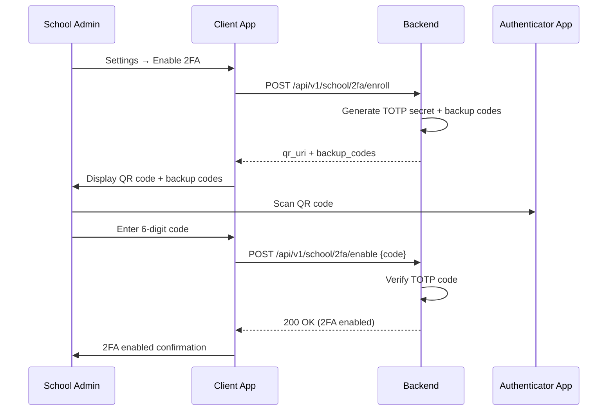
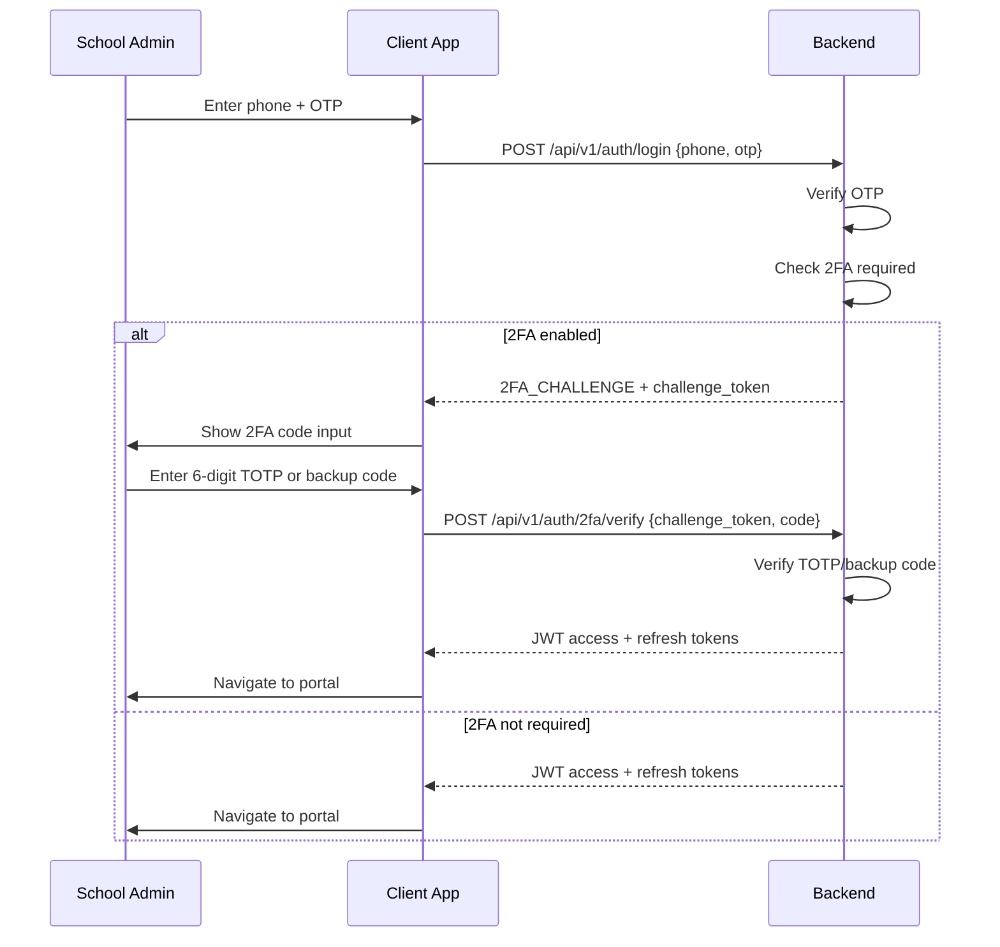
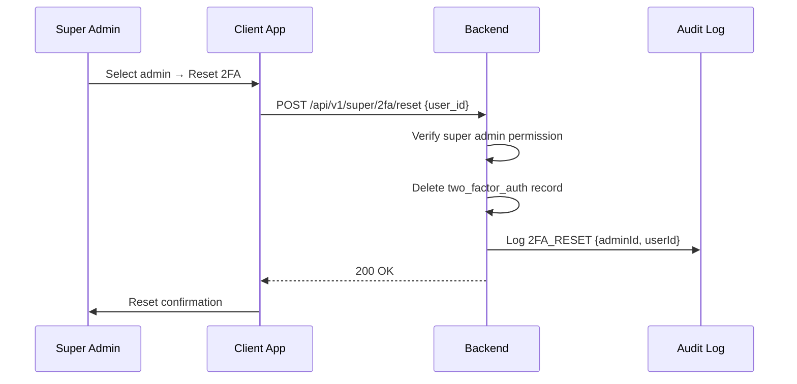
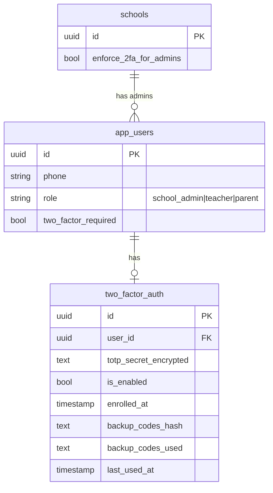

# Two-Factor Authentication — Technical Specification

> **Document status:** Implementation-ready blueprint
> **Last updated:** 2026-06-27
> **Prerequisites:** None (extends existing OTP auth system)
> **Template:** `_SPEC_TEMPLATE.md` v1 (25 mandatory + 6 optional sections)

---

## 1. Feature Overview

Time-based One-Time Password (TOTP) second factor for school admin accounts, using authenticator apps (Google Authenticator, Microsoft Authenticator, Authy). Extends the existing JWT auth flow with an optional 2FA step.

### Goals

- Admin can enable 2FA via TOTP (RFC 6238)
- QR code provisioning for authenticator app enrollment
- Backup codes for recovery
- Enforce 2FA for school admin role (configurable per school)
- Graceful fallback: if 2FA device lost, admin can use backup code or request super admin reset

### Non-goals

- [ ] SMS-based 2FA (existing OTP system handles SMS)
- [ ] Hardware security keys (YubiKey, FIDO2) — future enhancement
- [ ] Biometric 2FA — handled by device-level biometrics
- [ ] 2FA for parent/teacher accounts (optional, not enforced)

### Dependencies

- Existing OTP auth system (`AuthOtpsTable`, `OtpService`)
- `AppUsersTable` with `role` field
- `EncryptionService` for AES-256 encryption
- TOTP library: `dev.samstevens.totp:totp` 1.7.1

### Related Modules

- `server/.../feature/auth/AuthService.kt` — login flow
- `server/.../feature/auth/AuthRouting.kt` — auth API routes
- `server/.../db/Tables.kt` — database table definitions
- `DPDP_COMPLIANCE_SPEC.md` — data protection requirements
- `AUDIT_LOG_SPEC.md` — audit logging for 2FA reset

---

## 2. Current System Assessment

### Existing Code

- `feature_audit.csv` L149: "🔴 Missing, 0%"
- Existing OTP system (`AuthOtpsTable`, `OtpService`) is SMS/WhatsApp-based for login — separate from TOTP
- `AppUsersTable` has `role` field (school_admin, teacher, parent)
- JWT auth flow: phone+OTP → JWT access+refresh tokens
- No TOTP library, no 2FA table

### Existing Database

- `AppUsersTable`: has `role` field (school_admin, teacher, parent)
- `AuthOtpsTable`: existing OTP records for SMS/WhatsApp login
- `schools` table: school-level configuration

### Existing APIs

- `POST /api/v1/auth/login` — phone + OTP login
- `POST /api/v1/auth/refresh` — refresh JWT token
- `POST /api/v1/auth/logout` — logout

### Existing UI

- `LoginScreen.kt` — phone + OTP input
- No 2FA UI screens exist

### Existing Services

- `AuthService.kt` — login flow, JWT generation
- `OtpService.kt` — SMS/WhatsApp OTP generation and verification
- `EncryptionService` — AES-256 encryption (existing)

### Existing Documentation

- `feature_audit.csv` references the gap at L149

### Technical Debt

| # | Gap | Details |
|---|---|---|
| TD-1 | No TOTP enrollment | Cannot set up 2FA |
| TD-2 | No 2FA verification step | No second factor check |
| TD-3 | No backup codes | Account lockout if device lost |
| TD-4 | No 2FA enforcement | Admins can skip 2FA |

### Gaps

| # | Gap | Impact | Severity |
|---|---|---|---|
| G1 | No TOTP enrollment | Cannot set up 2FA | **Critical** |
| G2 | No 2FA verification step | No second factor check | **Critical** |
| G3 | No backup codes | Account lockout if device lost | **High** |
| G4 | No 2FA enforcement | Admins can skip 2FA | **High** |

---

## 3. Functional Requirements

### FR-001
| Field | Value |
|---|---|
| **Title** | TOTP Enrollment |
| **Description** | Admin can enable 2FA: generate TOTP secret, display QR code |
| **Priority** | Critical |
| **User Roles** | School Admin, Super Admin |
| **Acceptance notes** | QR code scannable by Google Authenticator, Microsoft Authenticator, Authy |

### FR-002
| Field | Value |
|---|---|
| **Title** | TOTP Verification |
| **Description** | Admin verifies 2FA by entering 6-digit code from authenticator app |
| **Priority** | Critical |
| **User Roles** | School Admin, Super Admin |
| **Acceptance notes** | RFC 6238 compliant; ±1 time step for clock skew |

### FR-003
| Field | Value |
|---|---|
| **Title** | Backup Codes |
| **Description** | Generate 10 single-use backup codes on enrollment |
| **Priority** | High |
| **User Roles** | School Admin, Super Admin |
| **Acceptance notes** | Codes shown once; hashed with bcrypt |

### FR-004
| Field | Value |
|---|---|
| **Title** | Login 2FA Challenge |
| **Description** | Login flow: after OTP verification, if 2FA enabled, prompt for TOTP code |
| **Priority** | Critical |
| **User Roles** | School Admin, Super Admin |
| **Acceptance notes** | JWT not issued until 2FA verified; challenge token is short-lived |

### FR-005
| Field | Value |
|---|---|
| **Title** | Backup Code Login |
| **Description** | Backup code accepted as alternative to TOTP code |
| **Priority** | High |
| **User Roles** | School Admin, Super Admin |
| **Acceptance notes** | Single-use; marked as used after successful verification |

### FR-006
| Field | Value |
|---|---|
| **Title** | Disable 2FA |
| **Description** | Admin can disable 2FA (requires current TOTP code) |
| **Priority** | Medium |
| **User Roles** | School Admin, Super Admin |
| **Acceptance notes** | Requires current TOTP code to prevent unauthorized disabling |

### FR-007
| Field | Value |
|---|---|
| **Title** | Super Admin Reset |
| **Description** | Super admin can reset 2FA for a locked-out admin |
| **Priority** | High |
| **User Roles** | Super Admin |
| **Acceptance notes** | Reset logged in audit log |

### FR-008
| Field | Value |
|---|---|
| **Title** | School-Level 2FA Enforcement |
| **Description** | School can enforce 2FA for all admin accounts (config flag) |
| **Priority** | Medium |
| **User Roles** | Super Admin |
| **Acceptance notes** | `enforce_2fa_for_admins` flag on `schools` table |

### FR-009
| Field | Value |
|---|---|
| **Title** | TOTP Secret Encryption |
| **Description** | TOTP secret stored encrypted (AES-256) |
| **Priority** | Critical |
| **User Roles** | System |
| **Acceptance notes** | AES-256-GCM encryption via `EncryptionService` |

---

## 4. User Stories

### School Admin
- [ ] Enable 2FA on my account by scanning QR code with authenticator app
- [ ] Save backup codes in case I lose my device
- [ ] Enter 6-digit code from authenticator app at login
- [ ] Use backup code at login if I lose my device
- [ ] Disable 2FA on my account (requires current code)
- [ ] If locked out, request super admin to reset my 2FA

### Super Admin
- [ ] Enable 2FA on my own account
- [ ] Enforce 2FA for all admin accounts in a school
- [ ] Reset 2FA for a locked-out admin
- [ ] View audit log of 2FA resets

### Teacher/Parent (Optional)
- [ ] Optionally enable 2FA on my account
- [ ] Enter 6-digit code at login if 2FA enabled

### System
- [ ] Generate TOTP secret on enrollment
- [ ] Verify TOTP code with ±30s clock skew tolerance
- [ ] Generate and hash 10 backup codes
- [ ] Enforce 2FA challenge in login flow
- [ ] Rate limit failed 2FA attempts
- [ ] Encrypt TOTP secret at rest

---

## 5. Business Rules

### BR-001
**Rule:** TOTP is RFC 6238 compliant — 6 digits, 30-second period, HMAC-SHA1.
**Enforcement:** `TotpGenerator` implements RFC 6238 test vectors.

### BR-002
**Rule:** TOTP verification accepts ±1 time step (±30s) for clock skew.
**Enforcement:** `TotpGenerator.verify()` checks current, previous, and next time step.

### BR-003
**Rule:** Backup codes are single-use — once used, marked as used and cannot be reused.
**Enforcement:** `backup_codes_used` JSON array tracks used code indices.

### BR-004
**Rule:** JWT is not issued until 2FA is verified at login.
**Enforcement:** Login flow returns `2FA_CHALLENGE` with short-lived `challenge_token` instead of JWT.

### BR-005
**Rule:** Challenge token expires after 5 minutes and is single-use.
**Enforcement:** `challenge_token` stored with expiry timestamp; deleted after verification.

### BR-006
**Rule:** Disabling 2FA requires the current TOTP code to prevent unauthorized disabling.
**Enforcement:** `POST /api/v1/school/2fa/disable` requires valid `code` field.

### BR-007
**Rule:** 10 backup codes generated on enrollment, shown once, and hashed with bcrypt.
**Enforcement:** `backup_codes_hash` stores bcrypt hash; codes never returned again after enrollment.

### BR-008
**Rule:** Rate limiting: max 5 failed 2FA attempts per 5 minutes → 15-minute lockout.
**Enforcement:** Failed attempt counter per user; lockout timestamp stored.

### BR-009
**Rule:** Super admin 2FA reset is logged in audit log.
**Enforcement:** `AuditLogService.log()` called with action `2FA_RESET`, adminId, userId.

---

## 6. Database Design

### 6.1 Entity Relationship Summary

New `two_factor_auth` table with 1:1 relationship to `app_users`. Modified `app_users` and `schools` tables with new boolean columns.

### 6.2 New Tables

```sql
CREATE TABLE two_factor_auth (
    id              UUID PRIMARY KEY DEFAULT gen_random_uuid(),
    user_id         UUID NOT NULL UNIQUE,          -- FK app_users.id
    totp_secret_encrypted TEXT NOT NULL,           -- AES-256 encrypted base32 secret
    is_enabled      BOOLEAN NOT NULL DEFAULT false,
    enrolled_at     TIMESTAMP,
    backup_codes_hash TEXT NOT NULL,               -- bcrypt-hashed JSON array of backup codes
    backup_codes_used TEXT NOT NULL DEFAULT '[]',  -- JSON array of used code indices
    last_used_at    TIMESTAMP,
    created_at      TIMESTAMP NOT NULL DEFAULT now(),
    updated_at      TIMESTAMP NOT NULL DEFAULT now()
);
```

### 6.3 Modified Tables

```sql
ALTER TABLE app_users ADD COLUMN two_factor_required BOOLEAN NOT NULL DEFAULT false;
```

```sql
ALTER TABLE schools ADD COLUMN enforce_2fa_for_admins BOOLEAN NOT NULL DEFAULT false;
```

### 6.4 Indexes

- `two_factor_auth.user_id` — UNIQUE index (1:1 with app_users)

### 6.5 Constraints

- `two_factor_auth.user_id` — UNIQUE, NOT NULL, FK to `app_users.id`
- `two_factor_auth.is_enabled` — DEFAULT false
- `app_users.two_factor_required` — DEFAULT false
- `schools.enforce_2fa_for_admins` — DEFAULT false

### 6.6 Foreign Keys

- `two_factor_auth.user_id` → `app_users.id` (ON DELETE CASCADE)

### 6.7 Soft Delete Strategy

N/A — 2FA records are deleted when user disables 2FA or super admin resets. No soft delete needed.

### 6.8 Audit Fields

- `created_at` — timestamp when 2FA record created
- `updated_at` — timestamp when 2FA record last modified
- `enrolled_at` — timestamp when 2FA enrollment completed
- `last_used_at` — timestamp of last successful 2FA verification

### 6.9 Migration Notes

Migration: `docs/db/migration_038_two_factor_auth.sql`
- Creates `two_factor_auth` table
- Adds `two_factor_required` column to `app_users`
- Adds `enforce_2fa_for_admins` column to `schools`
- All new columns default to `false` — no backfill needed

### 6.10 Exposed Mappings

```kotlin
object TwoFactorAuthTable : UUIDTable("two_factor_auth", "id") {
    val userId              = uuid("user_id").uniqueIndex()
    val totpSecretEncrypted = text("totp_secret_encrypted")
    val isEnabled           = bool("is_enabled").default(false)
    val enrolledAt          = timestamp("enrolled_at").nullable()
    val backupCodesHash     = text("backup_codes_hash")
    val backupCodesUsed     = text("backup_codes_used").default("[]")
    val lastUsedAt          = timestamp("last_used_at").nullable()
    val createdAt           = timestamp("created_at")
    val updatedAt           = timestamp("updated_at")
}
```

### 6.11 Seed Data

N/A — no seed data for 2FA.

---

## 7. State Machines

### 2FA Enrollment State Machine

```
NOT_ENROLLED ──enroll()──> PENDING_VERIFICATION ──verify(code)──> ENABLED
PENDING_VERIFICATION ──timeout (5 min)──> NOT_ENROLLED
ENABLED ──disable(code)──> NOT_ENROLLED
ENABLED ──super admin reset──> NOT_ENROLLED
```

| Current State | Event | Next State | Guard / Condition |
|---|---|---|---|
| `not_enrolled` | User calls enroll | `pending_verification` | TOTP secret generated, QR shown |
| `pending_verification` | User verifies code | `enabled` | TOTP code valid |
| `pending_verification` | 5 min timeout | `not_enrolled` | Secret discarded |
| `enabled` | User disables with code | `not_enrolled` | TOTP code valid |
| `enabled` | Super admin resets | `not_enrolled` | Admin has reset permission |

### Login 2FA Flow State Machine

```
OTP_VERIFIED ──2FA required──> 2FA_CHALLENGE ──verify(code)──> JWT_ISSUED
2FA_CHALLENGE ──verify(backup_code)──> JWT_ISSUED
2FA_CHALLENGE ──5 failed attempts──> LOCKED_OUT (15 min)
2FA_CHALLENGE ──challenge token expired (5 min)──> LOGIN_FAILED
```

| Current State | Event | Next State | Guard / Condition |
|---|---|---|---|
| `otp_verified` | 2FA enabled or enforced | `2fa_challenge` | `two_factor_required` or `enforce_2fa_for_admins` |
| `2fa_challenge` | User enters valid TOTP | `jwt_issued` | Code verified |
| `2fa_challenge` | User enters valid backup code | `jwt_issued` | Backup code verified, marked used |
| `2fa_challenge` | 5 failed attempts | `locked_out` | Rate limit exceeded |
| `locked_out` | 15 min elapsed | `2fa_challenge` | Lockout expired |
| `2fa_challenge` | Challenge token expired | `login_failed` | 5 min timeout |

---

## 8. Backend Architecture

### 8.1 Component Overview

New `TwoFactorService` handles enrollment, verification, backup codes, and reset. `TotpGenerator` implements RFC 6238. Login flow in `AuthService` is modified to insert 2FA challenge step.

### 8.2 Design Principles

1. **RFC 6238 compliance** — TOTP follows standard; compatible with all authenticator apps
2. **Defense in depth** — TOTP secret encrypted at rest; backup codes hashed with bcrypt
3. **Graceful recovery** — Backup codes + super admin reset prevent permanent lockout
4. **Rate limiting** — Prevent brute force on 6-digit codes

### 8.3 Core Types

```kotlin
class TwoFactorService(
    private val encryptionService: EncryptionService,
    private val totpGenerator: TotpGenerator
) {
    suspend fun enroll(userId: UUID): TotpEnrollmentDto {
        // 1. Generate random base32 secret (20 bytes)
        val secret = Base32.encode(ByteArray(20).also { SecureRandom().nextBytes(it) })
        // 2. Encrypt and store
        val encrypted = encryptionService.encrypt(secret)
        // 3. Generate otpauth URI for QR code
        val uri = "otpauth://totp/VidyaPrayag:${userEmail}?secret=$secret&issuer=VidyaPrayag"
        // 4. Generate 10 backup codes
        val backupCodes = (1..10).map { generateBackupCode() }
        // 5. Store hash of backup codes
        // 6. Return QR URI + backup codes (shown once)
        return TotpEnrollmentDto(qrUri = uri, backupCodes = backupCodes)
    }

    suspend fun verify(userId: UUID, code: String): Boolean {
        val tfa = repository.get(userId)
        val secret = encryptionService.decrypt(tfa.totpSecretEncrypted)
        // Check TOTP code (±1 time step for clock skew)
        if (totpGenerator.verify(secret, code)) return true
        // Check backup codes
        if (verifyBackupCode(tfa, code)) return true
        return false
    }

    suspend fun enable(userId: UUID, verificationCode: String): Boolean
    suspend fun disable(userId: UUID, verificationCode: String): Boolean
    suspend fun reset(userId: UUID, adminId: UUID): Unit  // super admin only
}
```

### 8.4 TotpGenerator

```kotlin
class TotpGenerator {
    fun generate(secret: String, time: Long = System.currentTimeMillis() / 1000): String {
        // RFC 6238 TOTP
        // HMAC-SHA1, 6 digits, 30-second period
    }

    fun verify(secret: String, code: String, time: Long = System.currentTimeMillis() / 1000): Boolean {
        // Check current, previous, and next time step (±30s clock skew)
        val currentCode = generate(secret, time)
        val prevCode = generate(secret, time - 30)
        val nextCode = generate(secret, time + 30)
        return code == currentCode || code == prevCode || code == nextCode
    }
}
```

### 8.5 Login Flow Modification

```
1. Phone + OTP → verify (existing)
2. If user.two_factor_required OR school.enforce_2fa_for_admins:
   a. Check if 2FA enrolled
   b. If not enrolled → return 2FA_ENROLLMENT_REQUIRED (force enrollment)
   c. If enrolled → return 2FA_CHALLENGE (don't issue JWT yet)
3. POST /auth/2fa/verify { code } → verify TOTP → issue JWT
```

### 8.6 Repositories

- `TwoFactorAuthRepository` — CRUD for `two_factor_auth` table

### 8.7 Mappers

N/A — direct entity-to-DTO mapping.

### 8.8 Permission Checks

- Enroll/disable: user can only manage own 2FA
- Reset: only super admin can reset another user's 2FA
- Enforce: only super admin can set `enforce_2fa_for_admins` on school

### 8.9 Background Jobs

N/A — no background jobs for 2FA.

### 8.10 Domain Events

- `TwoFactorEnrolled` — emitted when user completes 2FA enrollment
- `TwoFactorDisabled` — emitted when user disables 2FA
- `TwoFactorReset` — emitted when super admin resets 2FA

### 8.11 Caching

- Challenge tokens stored in memory or Redis with 5-minute TTL
- Failed attempt counter stored in Redis with 5-minute sliding window

### 8.12 Transactions

- Enrollment: single transaction (insert `two_factor_auth` record)
- Enable: single transaction (update `is_enabled`, `enrolled_at`)
- Disable: single transaction (delete `two_factor_auth` record)

### 8.13 New Dependencies

| Dependency | Version | Purpose |
|---|---|---|
| `dev.samstevens.totp:totp` | 1.7.1 | TOTP generation/verification |

---

## 9. API Contracts

### 9.1 Enroll 2FA

```
POST /api/v1/school/2fa/enroll
```

**Response 200:**
```json
{
  "success": true,
  "data": {
    "qr_uri": "otpauth://totp/VidyaPrayag:admin@school.com?secret=JBSWY3DPEHPK3PXP&issuer=VidyaPrayag",
    "backup_codes": ["12345678", "87654321", ...]
  }
}
```

### 9.2 Verify and Enable

```
POST /api/v1/school/2fa/enable
{
  "code": "123456"
}
```

### 9.3 Login 2FA Challenge

```
POST /api/v1/auth/login
{ "phone": "...", "otp": "..." }
```

**Response 200 (2FA required):**
```json
{
  "success": true,
  "data": {
    "status": "2FA_CHALLENGE",
    "challenge_token": "temp-uuid"
  }
}
```

### 9.4 Verify 2FA at Login

```
POST /api/v1/auth/2fa/verify
{
  "challenge_token": "temp-uuid",
  "code": "123456"
}
```

**Response 200:**
```json
{
  "success": true,
  "data": {
    "access_token": "...",
    "refresh_token": "..."
  }
}
```

### 9.5 Disable 2FA

```
POST /api/v1/school/2fa/disable
{
  "code": "123456"
}
```

### 9.6 Reset 2FA (Super Admin)

```
POST /api/v1/super/2fa/reset
{
  "user_id": "uuid"
}
```

---

## 10. Frontend Architecture

### 10.1 Screens

| Screen | Platform | Role | Description |
|---|---|---|---|
| `TwoFactorEnrollScreen` | All | Admin | QR code display + backup codes |
| `TwoFactorVerifyScreen` | All | Admin | 6-digit code input at login |
| `SecuritySettingsScreen` | All | Admin | 2FA management in settings |

### 10.2 Navigation

- After login OTP verification, if `2FA_CHALLENGE` returned → navigate to `TwoFactorVerifyScreen`
- From settings → `SecuritySettingsScreen` → enroll/disable 2FA

### 10.3 UX Flows

#### Enrollment Flow

1. Admin goes to Settings → Security → Enable 2FA
2. `TwoFactorEnrollScreen` shows QR code
3. Admin scans QR with authenticator app
4. Admin enters 6-digit code to verify
5. Backup codes displayed — admin saves them
6. 2FA enabled

#### Login Flow

1. Admin enters phone + OTP → verified
2. If 2FA enabled → `TwoFactorVerifyScreen` shown
3. Admin enters 6-digit TOTP code or backup code
4. If valid → JWT issued → navigate to portal

### 10.4 State Management

```kotlin
data class TwoFactorState(
    val isEnrolled: Boolean,
    val isEnabled: Boolean,
    val qrUri: String?,
    val backupCodes: List<String>?,
    val challengeToken: String?,
    val failedAttempts: Int,
    val isLockedOut: Boolean,
)
```

### 10.5 Offline Support

N/A — 2FA requires server communication.

### 10.6 Loading States

- Enrollment: loading while generating TOTP secret
- Verification: loading while verifying code

### 10.7 Error Handling (UI)

- Invalid TOTP code: "Invalid code. Please try again."
- Backup code already used: "This backup code has already been used."
- Locked out: "Too many attempts. Please try again in 15 minutes."
- Challenge token expired: "Session expired. Please log in again."

### 10.8 Component Integration Guidelines

| Rule | Description |
|---|---|
| **R1** | QR code rendered via `QRCodeComposable` (existing or new) |
| **R2** | Backup codes displayed in a copyable list with "Save these now" warning |
| **R3** | 2FA code input: 6-digit OTP field with auto-submit |
| **R4** | Settings screen shows 2FA status (enabled/disabled) with enable/disable actions |

---

## 11. Shared Module Changes (KMP)

### 11.1 DTOs

```kotlin
data class TotpEnrollmentDto(
    val qrUri: String,
    val backupCodes: List<String>
)

data class TwoFactorChallengeDto(
    val status: String,  // "2FA_CHALLENGE" or "2FA_ENROLLMENT_REQUIRED"
    val challengeToken: String
)

data class TwoFactorVerifyRequest(
    val challengeToken: String,
    val code: String
)
```

### 11.2 Domain Models

```kotlin
data class TwoFactorAuth(
    val userId: UUID,
    val isEnabled: Boolean,
    val enrolledAt: Instant?,
    val lastUsedAt: Instant?,
)
```

### 11.3 Repository Interfaces

```kotlin
interface TwoFactorAuthRepository {
    suspend fun get(userId: UUID): TwoFactorAuth?
    suspend fun insert(entity: TwoFactorAuthEntity): Unit
    suspend fun update(entity: TwoFactorAuthEntity): Unit
    suspend fun delete(userId: UUID): Unit
}
```

### 11.4 UseCases

- `EnrollTwoFactorUseCase`
- `VerifyTwoFactorUseCase`
- `DisableTwoFactorUseCase`
- `ResetTwoFactorUseCase`

### 11.5 Validation

- TOTP code: exactly 6 digits
- Backup code: exactly 8 alphanumeric characters

### 11.6 Serialization

N/A — standard Kotlinx serialization for DTOs.

### 11.7 Network APIs

Added to `AuthApi.kt`:
- `POST /api/v1/school/2fa/enroll`
- `POST /api/v1/school/2fa/enable`
- `POST /api/v1/school/2fa/disable`
- `POST /api/v1/auth/2fa/verify`
- `POST /api/v1/super/2fa/reset`

### 11.8 Database Models (Local Cache)

N/A — 2FA state is server-side only. No local caching.

---

## 12. Permissions Matrix

| Action | Platform Admin | School Admin | Super Admin | Teacher | Parent |
|---|---|---|---|---|---|
| Enable 2FA on own account | ✅ | ✅ | ✅ | ✅ (optional) | ✅ (optional) |
| Disable 2FA on own account | ✅ | ✅ | ✅ | ✅ | ✅ |
| Reset 2FA for another admin | ❌ | ❌ | ✅ | ❌ | ❌ |
| Enforce 2FA for school | ❌ | ❌ | ✅ | ❌ | ❌ |
| View 2FA audit logs | ✅ | ✅ | ✅ | ❌ | ❌ |

---

## 13. Notifications

### 2FA-Related Notifications

| Type | Trigger | Channel | Message |
|---|---|---|---|
| 2FA Enabled | User completes enrollment | In-app | "Two-factor authentication has been enabled on your account." |
| 2FA Disabled | User disables 2FA | In-app + SMS | "Two-factor authentication has been disabled. If this wasn't you, contact support immediately." |
| 2FA Reset | Super admin resets 2FA | SMS + Email | "Your 2FA was reset by an administrator. Please re-enroll." |
| 2FA Lockout | 5 failed attempts | SMS | "Too many 2FA attempts. Account locked for 15 minutes." |

---

## 14. Background Jobs

N/A — no background jobs for 2FA. All operations are synchronous.

---

## 15. Integrations

### Authenticator Apps
| Field | Value |
|---|---|
| **System** | Google Authenticator, Microsoft Authenticator, Authy |
| **Purpose** | TOTP code generation on user device |
| **API / SDK** | Standard `otpauth://` URI (RFC 6238) |
| **Auth method** | N/A — no API; QR code provisioning |
| **Fallback** | Backup codes |

### EncryptionService
| Field | Value |
|---|---|
| **System** | AES-256-GCM encryption (existing) |
| **Purpose** | Encrypt TOTP secrets at rest |
| **API / SDK** | `EncryptionService.encrypt()` / `decrypt()` |
| **Auth method** | Server-side encryption key |
| **Fallback** | None |

### AuditLogService
| Field | Value |
|---|---|
| **System** | Audit logging (existing or per AUDIT_LOG_SPEC) |
| **Purpose** | Log 2FA reset events |
| **API / SDK** | `AuditLogService.log()` |
| **Auth method** | Internal service call |
| **Fallback** | None |

---

## 16. Security

### Authentication
- 2FA is a second factor on top of existing phone+OTP authentication
- TOTP secret encrypted at rest (AES-256-GCM)
- Backup codes hashed with bcrypt (never stored in plaintext)
- Challenge token is short-lived (5 min) and single-use

### Authorization
- Users can only manage own 2FA
- Only super admin can reset another user's 2FA
- Only super admin can enforce 2FA for a school

### Encryption
- TOTP secret: AES-256-GCM via `EncryptionService`
- Backup codes: bcrypt hash
- Challenge token: random UUID (not encrypted, but short-lived)

### Audit Logs
- 2FA enrollment: logged with action `2FA_ENROLLED`
- 2FA disable: logged with action `2FA_DISABLED`
- 2FA reset: logged with action `2FA_RESET` (includes adminId, userId)
- Failed 2FA attempts: logged at WARN level

### PII Handling
- TOTP secret is not PII but is sensitive (encrypted at rest)
- Backup codes are not PII but are sensitive (hashed)
- No PII in QR code URI (uses email, which is already in system)

### Data Isolation
- 2FA records are per-user; no cross-school access
- Super admin reset is logged with both admin and target user IDs

### Rate Limiting
- Max 5 failed 2FA attempts per 5 minutes → 15-minute lockout
- Failed attempt counter stored in Redis (or in-memory)

### Input Validation
- TOTP code: exactly 6 digits, numeric only
- Backup code: exactly 8 alphanumeric characters
- Challenge token: valid UUID format

---

## 17. Performance & Scalability

### Expected Scale

| Metric | 1 user | 1,000 users | 10,000 users |
|---|---|---|---|
| TOTP generation | < 1ms | < 1ms | < 1ms |
| TOTP verification | < 1ms | < 1ms | < 1ms |
| Enrollment (DB insert) | < 10ms | < 10ms | < 20ms |
| Login 2FA challenge | < 5ms | < 5ms | < 10ms |

### Latency Targets

| Operation | Target |
|---|---|
| TOTP generate | < 1ms |
| TOTP verify | < 1ms |
| 2FA enroll API | < 100ms |
| 2FA verify API | < 50ms |
| Backup code verify | < 50ms (bcrypt comparison) |

### Optimization Strategy

- TOTP computation is CPU-only (HMAC-SHA1) — negligible overhead
- bcrypt for backup codes is intentionally slow (~100ms) — acceptable for single verification
- Challenge token stored in Redis for fast lookup
- `two_factor_auth` table indexed on `user_id` (unique) — O(1) lookup

---

## 18. Edge Cases

| # | Scenario | Expected Behavior |
|---|---|---|
| EC-001 | User loses authenticator device | Use backup code at login; then re-enroll with new device |
| EC-002 | All backup codes used | User must request super admin reset |
| EC-003 | Clock skew > 30s | TOTP verification fails; user must sync device clock |
| EC-004 | User enrolled but never enabled | `is_enabled = false`; login does not require 2FA |
| EC-005 | School enforces 2FA but admin not enrolled | Login returns `2FA_ENROLLMENT_REQUIRED` |
| EC-006 | Super admin resets own 2FA | Allowed; logged in audit log |
| EC-007 | Challenge token used twice | Second attempt rejected; token deleted after first use |
| EC-008 | User locked out during 2FA | 15-minute lockout; can still use backup code after lockout expires |

### Risks & Mitigations

| Risk | Likelihood | Impact | Mitigation |
|---|---|---|---|
| TOTP secret compromised | Low | Critical | AES-256 encryption at rest |
| Backup codes guessed | Low | High | 8-char alphanumeric; bcrypt hash; rate limiting |
| User permanently locked out | Medium | High | Super admin reset; backup codes |
| Authenticator app not installed | Medium | Low | QR code includes app store links; instructions in UI |
| Clock skew > 30s | Low | Medium | ±1 time step tolerance; user education |

---

## 19. Error Handling

### Standard Error Codes

| HTTP | Error Code | Description | When |
|---|---|---|---|
| 400 | `INVALID_TOTP_CODE` | TOTP code is invalid or expired | 2FA verification |
| 400 | `BACKUP_CODE_USED` | Backup code already used | 2FA verification |
| 400 | `BACKUP_CODE_INVALID` | Backup code does not match | 2FA verification |
| 401 | `CHALLENGE_TOKEN_EXPIRED` | Challenge token expired (> 5 min) | 2FA verification at login |
| 401 | `CHALLENGE_TOKEN_INVALID` | Challenge token not found or already used | 2FA verification at login |
| 403 | `2FA_NOT_ENROLLED` | 2FA required but user not enrolled | Login flow |
| 429 | `2FA_LOCKED_OUT` | Too many failed attempts | Rate limiting |
| 403 | `INSUFFICIENT_PERMISSIONS` | Non-super-admin attempting reset | 2FA reset |

### Error Response Format

Same as existing API error format.

### Recovery Strategy

| Error | Client Action | Server Action |
|---|---|---|
| `INVALID_TOTP_CODE` | Show error; increment failed counter | Return 400 |
| `CHALLENGE_TOKEN_EXPIRED` | Redirect to login | Return 401 |
| `2FA_LOCKED_OUT` | Show lockout message with countdown | Return 429 |
| `2FA_NOT_ENROLLED` | Navigate to enrollment screen | Return 403 |

---

## 20. Analytics & Reporting

### Reports

N/A — no specific reports for 2FA.

### KPIs

- **2FA Enrollment Rate:** % of admins with 2FA enabled
- **2FA Login Success Rate:** % of 2FA challenges successfully verified
- **2FA Reset Rate:** Number of super admin resets per month
- **2FA Lockout Rate:** % of users locked out due to failed attempts
- **Backup Code Usage:** Number of backup codes used per month

### Dashboards

N/A — monitoring via audit logs.

### Exports

N/A

---

## 21. Testing Strategy

### Unit Tests

| Test | What it verifies |
|---|---|
| TOTP generation matches RFC 6238 test vectors | Correct code for known secret + time |
| TOTP verification with ±1 time step | Accepts current, prev, next; rejects others |
| Backup code generation | 10 codes, 8 chars each, alphanumeric |
| Backup code hashing | bcrypt hash matches |
| Backup code single-use enforcement | Used code rejected on second attempt |
| Encryption/decryption of TOTP secret | Round-trip correct |

### Integration Tests

| Test | What it verifies |
|---|---|
| Enroll → verify → enable → login requires 2FA → verify → JWT issued | Full flow |
| Backup code used at login | Accepted, marked as used |
| Backup code reused | Rejected |
| Disable 2FA → login no longer requires 2FA | Disabled correctly |
| School enforces 2FA → admin without 2FA forced to enroll | Enforcement works |
| Rate limiting: 5 failed attempts → lockout | Lockout enforced |
| Super admin reset → admin can re-enroll | Reset works |
| Challenge token expired after 5 min | Rejected |
| Challenge token single-use | Second attempt rejected |

### Performance Tests

- [ ] TOTP generation < 1ms
- [ ] 2FA enroll API < 100ms
- [ ] 2FA verify API < 50ms

### Security Tests

- [ ] TOTP secret encrypted at rest (verify in DB)
- [ ] Backup codes hashed with bcrypt (verify in DB)
- [ ] Rate limiting prevents brute force
- [ ] Challenge token expires after 5 min
- [ ] Non-super-admin cannot reset 2FA
- [ ] User cannot disable 2FA without valid code

### Migration Tests

- [ ] Migration adds columns with default `false`
- [ ] Existing users unaffected (no 2FA required by default)

---

## 22. Acceptance Criteria

- [ ] Admin can enroll 2FA via QR code + authenticator app
- [ ] 10 backup codes generated and shown once
- [ ] Login flow requires 2FA code after OTP verification
- [ ] Backup codes accepted as alternative to TOTP
- [ ] Backup codes are single-use
- [ ] Admin can disable 2FA (requires current code)
- [ ] Super admin can reset 2FA for locked-out admin
- [ ] School can enforce 2FA for all admin accounts
- [ ] Rate limiting prevents brute force
- [ ] TOTP secret encrypted at rest
- [ ] TOTP verification accepts ±30s clock skew
- [ ] Challenge token expires after 5 minutes
- [ ] 2FA reset logged in audit log

---

## 23. Implementation Roadmap

| Phase | Duration | Tasks | Breaking? | Deliverable |
|---|---|---|---|---|
| 1 | 1 day | DB migration, Exposed table | No | Schema ready |
| 2 | 2 days | `TotpGenerator` + `TwoFactorService` | No | Core 2FA logic |
| 3 | 2 days | Login flow modification (2FA challenge) | No | 2FA login flow |
| 4 | 1 day | Rate limiting for 2FA attempts | No | Brute force protection |
| 5 | 2 days | API endpoints (enroll, enable, disable, verify, reset) | No | 2FA API |
| 6 | 2 days | Client UI (QR code, 2FA input, backup codes, settings) | No | 2FA UI |
| 7 | 2 days | Tests (unit + integration) | No | Test coverage |

**Total: ~12 days**

---

## 24. File-Level Impact Analysis

### New Files

| File | Location | Purpose |
|---|---|---|
| `TwoFactorService.kt` | `server/.../feature/auth/` | 2FA enrollment, verification, backup codes |
| `TotpGenerator.kt` | `server/.../feature/auth/` | TOTP RFC 6238 implementation |
| `migration_038_two_factor_auth.sql` | `docs/db/` | DDL for new table + column additions |
| `TwoFactorEnrollScreen.kt` | `composeApp/.../ui/v2/screens/auth/` | QR code + backup codes UI |
| `TwoFactorVerifyScreen.kt` | `composeApp/.../ui/v2/screens/auth/` | 2FA code input at login |
| `SecuritySettingsScreen.kt` | `composeApp/.../ui/v2/screens/settings/` | 2FA management in settings |

### Modified Files

| File | Change Type | Lines Changed (est.) | Risk | Description |
|---|---|---|---|---|
| `server/.../db/Tables.kt` | Add + Modify | ~15 | Low | `TwoFactorAuthTable` + columns on `app_users`, `schools` |
| `server/.../feature/auth/AuthRouting.kt` | Modify | ~30 | Medium | Add 2FA challenge + verify endpoints |
| `server/.../feature/auth/AuthService.kt` | Modify | ~20 | High | Add 2FA check in login flow |
| `server/build.gradle.kts` | Modify | ~1 | Low | Add totp dependency |
| `shared/.../feature/auth/AuthApi.kt` | Modify | ~15 | Low | Add 2FA endpoints |

### Files Preserved Unchanged

| File | Reason |
|---|---|
| `OtpService.kt` | SMS/WhatsApp OTP unchanged; separate from TOTP |
| `AuthOtpsTable` | No schema changes |
| All non-auth screens | No 2FA impact |

---

## 25. Future Enhancements

### Hardware Security Keys (WebAuthn/FIDO2)

- Support YubiKey and other FIDO2 hardware keys
- More secure than TOTP (phishing-resistant)
- Requires WebAuthn API integration

### Push-Based 2FA

- Approve/deny login via push notification to enrolled device
- More user-friendly than TOTP code entry
- Requires push notification infrastructure

### Biometric 2FA

- Use device biometrics (Face ID, fingerprint) as second factor
- Requires platform-specific biometric API integration

### 2FA for All Roles

- Extend 2FA enforcement to teachers and parents
- Per-school configuration for which roles require 2FA

### TOTP Secret Rotation

- Periodic rotation of TOTP secrets for enhanced security
- Re-enrollment flow with old + new code verification

### Geographic 2FA Trigger

- Require 2FA only when login from new location/device
- Reduces friction for regular logins

---

## A. Sequence Diagrams

### 2FA Enrollment Flow



### Login with 2FA Flow



### Super Admin Reset Flow



---

## B. Domain Model / ER Diagram



---

## C. Event Flow

```
EnrollRequested -> GenerateSecret -> EncryptSecret -> GenerateBackupCodes -> StoreRecord -> ReturnQR+Codes
EnableRequested -> VerifyTOTP -> SetEnabled -> LogEvent -> ReturnSuccess
LoginOTPVerified -> Check2FARequired -> IssueChallengeToken -> Return2FAChallenge
2FAVerifyRequested -> VerifyTOTPOrBackup -> IssueJWT -> LogEvent -> ReturnTokens
DisableRequested -> VerifyTOTP -> DeleteRecord -> LogEvent -> ReturnSuccess
ResetRequested -> CheckPermission -> DeleteRecord -> LogAudit -> ReturnSuccess
```

| Event | Emitted By | Consumed By | Side Effect |
|---|---|---|---|
| `TwoFactorEnrolled` | `TwoFactorService.enable()` | Notification service | In-app notification sent |
| `TwoFactorDisabled` | `TwoFactorService.disable()` | Notification service, Audit log | SMS + in-app notification; audit entry |
| `TwoFactorReset` | `TwoFactorService.reset()` | Notification service, Audit log | SMS + email to user; audit entry |
| `TwoFactorLockout` | Rate limiter | Notification service | SMS notification to user |

---

## D. Configuration

### Environment Variables

| Variable | Description |
|---|---|
| `TOTP_ISSUER` | Issuer name in otpauth URI (default: `VidyaPrayag`) |
| `2FA_CHALLENGE_TOKEN_TTL` | Challenge token TTL in seconds (default: `300`) |
| `2FA_MAX_FAILED_ATTEMPTS` | Max failed attempts before lockout (default: `5`) |
| `2FA_LOCKOUT_DURATION` | Lockout duration in seconds (default: `900`) |

### Feature Flags

| Flag | Default | Description |
|---|---|---|
| `two_factor_auth_enabled` | `true` | Enable 2FA feature |
| `two_factor_enforcement_enabled` | `true` | Allow schools to enforce 2FA for admins |

### Client-Side Configuration

| Config | Default | Description |
|---|---|---|
| TOTP period | 30 seconds | RFC 6238 standard |
| TOTP digits | 6 | RFC 6238 standard |
| TOTP clock skew | ±1 time step (±30s) | Tolerance for clock drift |
| Backup code count | 10 | Number of backup codes generated |
| Backup code length | 8 characters | Alphanumeric |

### Server-Side Configuration

| Config | Default | Description |
|---|---|---|
| TOTP secret encryption | AES-256-GCM | Via `EncryptionService` |
| Backup code hashing | bcrypt | Cost factor 12 |
| Challenge token TTL | 5 minutes | Short-lived, single-use |
| Rate limit window | 5 minutes | Sliding window for failed attempts |
| Rate limit max | 5 attempts | Before lockout |
| Lockout duration | 15 minutes | User cannot attempt 2FA |

### Infrastructure Requirements

- Redis (optional) for challenge token storage and rate limiting
- `EncryptionService` with AES-256-GCM key management (existing)

---

## E. Migration & Rollback

### Deployment Plan

1. [ ] Run `migration_038_two_factor_auth.sql` — creates table + adds columns
2. [ ] Deploy `TotpGenerator.kt` + `TwoFactorService.kt`
3. [ ] Deploy `AuthRouting.kt` changes (new endpoints)
4. [ ] Deploy `AuthService.kt` changes (2FA check in login)
5. [ ] Deploy client UI (enroll, verify, settings screens)
6. [ ] Test enrollment + login flow
7. [ ] Enable feature flag `two_factor_auth_enabled`
8. [ ] Deploy to production

### Rollback Plan

1. [ ] Disable feature flag `two_factor_auth_enabled` → 2FA endpoints return 404
2. [ ] Revert `AuthService.kt` → login skips 2FA check
3. [ ] Revert client UI → no 2FA screens shown
4. [ ] Database tables can remain (no harm; `is_enabled = false` for all)
5. [ ] No data loss — users' TOTP secrets remain but unused

### Data Backfill

N/A — all new columns default to `false`. No backfill needed. Existing users are unaffected.

### Migration SQL

```sql
-- migration_038_two_factor_auth.sql
CREATE TABLE two_factor_auth (
    id              UUID PRIMARY KEY DEFAULT gen_random_uuid(),
    user_id         UUID NOT NULL UNIQUE,
    totp_secret_encrypted TEXT NOT NULL,
    is_enabled      BOOLEAN NOT NULL DEFAULT false,
    enrolled_at     TIMESTAMP,
    backup_codes_hash TEXT NOT NULL,
    backup_codes_used TEXT NOT NULL DEFAULT '[]',
    last_used_at    TIMESTAMP,
    created_at      TIMESTAMP NOT NULL DEFAULT now(),
    updated_at      TIMESTAMP NOT NULL DEFAULT now()
);

ALTER TABLE app_users ADD COLUMN two_factor_required BOOLEAN NOT NULL DEFAULT false;
ALTER TABLE schools ADD COLUMN enforce_2fa_for_admins BOOLEAN NOT NULL DEFAULT false;
```

---

## F. Observability

### Logging

- 2FA enrollment: INFO `2fa_enrolled` (userId, timestamp)
- 2FA disable: INFO `2fa_disabled` (userId, timestamp)
- 2FA reset: WARN `2fa_reset` (adminId, userId, timestamp)
- 2FA verification success: DEBUG `2fa_verify_success` (userId, method: totp|backup)
- 2FA verification failure: WARN `2fa_verify_failed` (userId, reason: invalid_code|backup_used|token_expired)
- 2FA lockout: WARN `2fa_lockout` (userId, failedAttempts, lockoutDuration)
- Challenge token issued: DEBUG `2fa_challenge_issued` (userId, tokenExpiry)

### Metrics

| Metric | Type | Description |
|---|---|---|
| `auth.2fa.enrollments_total` | Counter | Total 2FA enrollments |
| `auth.2fa.disables_total` | Counter | Total 2FA disables |
| `auth.2fa.resets_total` | Counter | Total super admin resets |
| `auth.2fa.verify_success_total` | Counter (by method: totp, backup) | Successful verifications |
| `auth.2fa.verify_failures_total` | Counter (by reason) | Failed verifications |
| `auth.2fa.lockouts_total` | Counter | Total lockouts |
| `auth.2fa.enrollment_rate` | Gauge | % of admins with 2FA enabled |

### Health Checks

- `GET /api/v1/health` — existing health check (covers auth service)

### Alerts

- 2FA reset rate > 5/month → alert security team (possible abuse)
- 2FA lockout rate > 10% → alert dev team (possible UX issue)
- 2FA verify failure rate > 20% → alert dev team (possible clock sync issue)
- Encryption service unavailable → critical alert (2FA cannot function)
