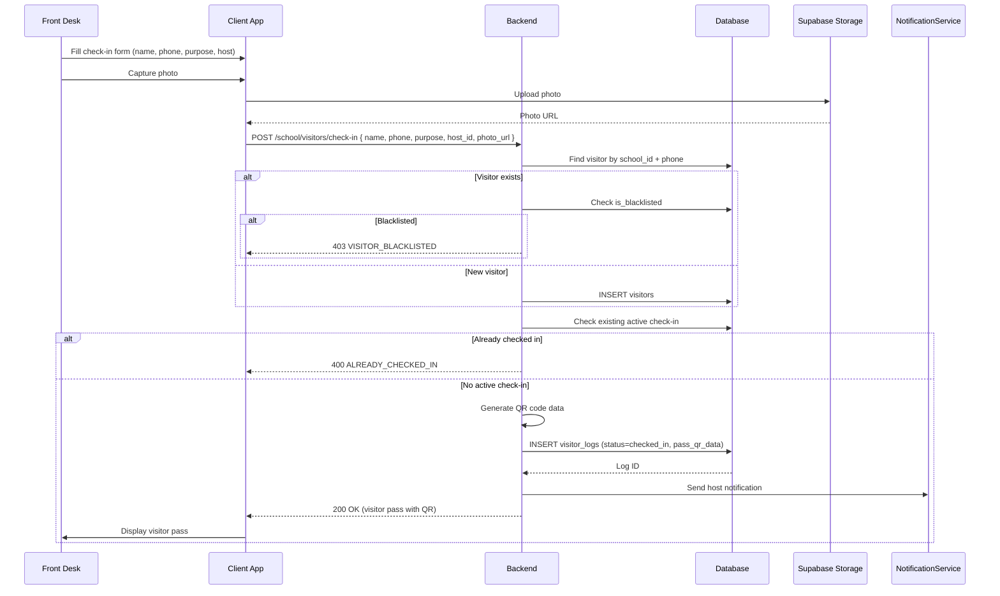
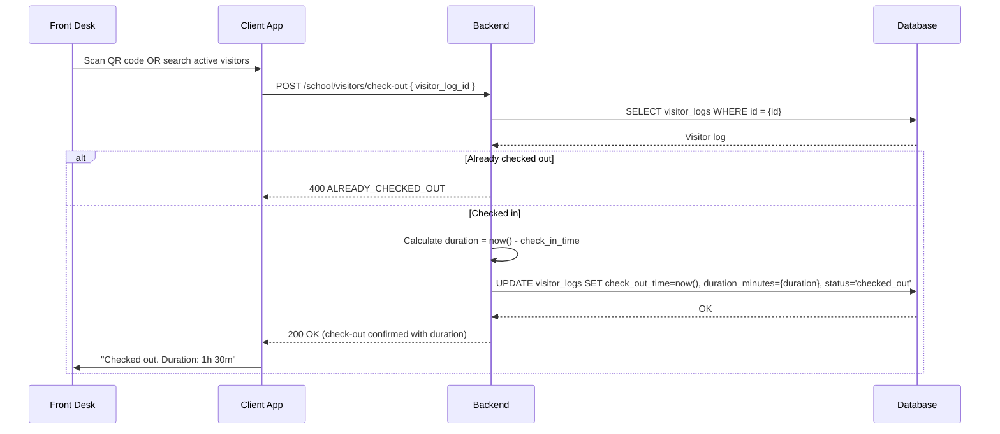
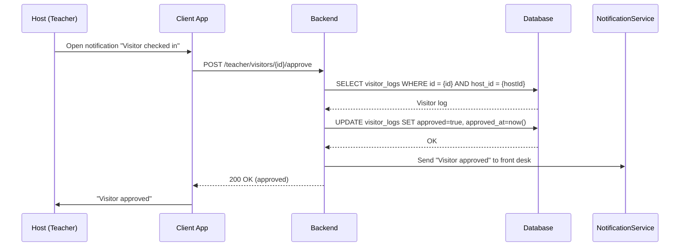
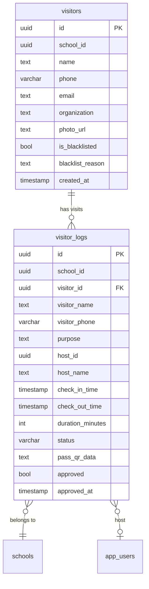

# Visitor Management — Technical Specification

> **Document status:** Implementation-ready blueprint
> **Last updated:** 2026-06-27
> **Prerequisites:** None
> **Template:** `_SPEC_TEMPLATE.md` v1 (25 mandatory + 6 optional sections)

---

## 1. Feature Overview

Digital visitor management for schools: visitor check-in/check-out, purpose tracking, host approval, visitor pass generation, and visitor log reports.

### Goals

- Front desk checks in visitors (name, phone, purpose, host person, photo)
- Host (teacher/admin) receives approval notification
- Visitor pass generated (QR code or printed badge)
- Check-out tracking with duration
- Visitor log with search and filters
- Blacklist management (blocked visitors)

### Non-goals

- [ ] Pre-scheduled visitor appointments
- [ ] Visitor identity verification (Aadhaar/government ID)
- [ ] Visitor access control (door/gate integration)
- [ ] Visitor vehicle tracking

### Dependencies

- `NotificationService` — for host approval notifications
- `Supabase Storage` — for visitor photo storage
- QR code generation library

### Related Modules

- `server/.../feature/visitor/` — new visitor management module
- `shared/.../visitor/` — shared visitor DTOs
- `composeApp/.../ui/v2/screens/admin/` — admin/front desk UI

---

## 2. Current System Assessment

### Existing Code

- `feature_audit.csv` L140: Visitor Management missing (0%)
- No visitor tables in `Tables.kt`

### Existing Database

- No visitor-related tables exist
- `app_users` table — for host lookup (teachers/admins)

### Existing APIs

- No visitor management APIs

### Existing UI

- No visitor management UI

### Existing Services

- `NotificationService` — multi-channel notifications (reusable)
- `FileStorageService` — Supabase Storage integration (reusable for photos)

### Existing Documentation

- `feature_audit.csv` — visitor management at 0%
- `IMPLEMENTATION_BACKLOG` — P1-27 entry

### Technical Debt

| # | Gap | Details |
|---|---|---|
| TD-1 | No visitor tracking | No digital visitor log |
| TD-2 | Paper-based visitor register | Manual paper log at front desk |
| TD-3 | No host approval | Visitors enter without host confirmation |
| TD-4 | No blacklist | No way to block unwanted visitors |

### Gaps

| # | Gap | Impact | Severity |
|---|---|---|---|
| G1 | No digital check-in | Manual process; no records | **High** |
| G2 | No host approval | Visitors unannounced | **Medium** |
| G3 | No visitor pass | No identification for visitors | **Medium** |
| G4 | No blacklist | Security risk | **High** |

---

## 3. Functional Requirements

### FR-001
| Field | Value |
|---|---|
| **Title** | Visitor Check-in |
| **Description** | Check-in: visitor name, phone, email, purpose, host person, photo, organization |
| **Priority** | Critical |
| **User Roles** | School Admin, Front Desk |
| **Acceptance notes** | `visitor_logs` row created with `status='checked_in'`; visitor pass QR generated |

### FR-002
| Field | Value |
|---|---|
| **Title** | Host Approval Notification |
| **Description** | Host receives notification for approval (FCM + in-app) |
| **Priority** | High |
| **User Roles** | Teacher, School Admin (as host) |
| **Acceptance notes** | Notification sent to host; host can approve/reject |

### FR-003
| Field | Value |
|---|---|
| **Title** | Visitor Pass |
| **Description** | Visitor pass: QR code + name + host + purpose + check-in time |
| **Priority** | High |
| **User Roles** | Front Desk |
| **Acceptance notes** | `pass_qr_data` generated; QR code displayed/printed |

### FR-004
| Field | Value |
|---|---|
| **Title** | Check-out |
| **Description** | Check-out: scan QR or manual, records duration |
| **Priority** | Critical |
| **User Roles** | School Admin, Front Desk |
| **Acceptance notes** | `check_out_time` set; `duration_minutes` calculated; `status='checked_out'` |

### FR-005
| Field | Value |
|---|---|
| **Title** | Visitor Log |
| **Description** | Visitor log: searchable by date, name, purpose, host |
| **Priority** | High |
| **User Roles** | School Admin |
| **Acceptance notes** | Paginated, filterable visitor log endpoint |

### FR-006
| Field | Value |
|---|---|
| **Title** | Blacklist |
| **Description** | Blacklist: blocked visitors flagged at check-in |
| **Priority** | High |
| **User Roles** | School Admin |
| **Acceptance notes** | `is_blacklisted=true` on visitor; check-in blocked with warning |

### FR-007
| Field | Value |
|---|---|
| **Title** | Visitor Reports |
| **Description** | Daily/weekly/monthly visitor report |
| **Priority** | Medium |
| **User Roles** | School Admin |
| **Acceptance notes** | Report endpoint with date range; counts by purpose, host, duration |

---

## 4. User Stories

### Front Desk / School Admin
- [ ] Check in visitor with photo, purpose, host selection
- [ ] Generate visitor pass (QR code)
- [ ] Check out visitor (QR scan or manual)
- [ ] View visitor log (searchable)
- [ ] Add/remove visitor from blacklist
- [ ] Generate visitor reports

### Host (Teacher / Admin)
- [ ] Receive notification when visitor checks in
- [ ] Approve or reject visitor
- [ ] View pending visitor approvals

### System
- [ ] Generate QR code for visitor pass
- [ ] Calculate visit duration on check-out
- [ ] Flag blacklisted visitors at check-in
- [ ] Send host approval notifications

---

## 5. Business Rules

### BR-001
**Rule:** Blacklisted visitors cannot be checked in.
**Enforcement:** Check `visitors.is_blacklisted` before creating visitor log; return 403 if blacklisted.

### BR-002
**Rule:** Host approval is optional but recommended.
**Enforcement:** `approved=false` by default; host can approve/reject; visitor can be checked in without approval.

### BR-003
**Rule:** One active check-in per visitor per school.
**Enforcement:** Check for existing `status='checked_in'` log for visitor+school before allowing new check-in.

### BR-004
**Rule:** Duration calculated on check-out.
**Enforcement:** `duration_minutes = (check_out_time - check_in_time) / 60` calculated server-side.

### BR-005
**Rule:** Visitor photos stored in Supabase Storage.
**Enforcement:** Photo uploaded to Supabase; URL stored in `visitors.photo_url`.

---

## 6. Database Design

### 6.1 Entity Relationship Summary

Two new tables: `visitors` (visitor master records with blacklist) and `visitor_logs` (individual visit records with check-in/out tracking).

### 6.2 New Tables

#### `visitors` table

```sql
CREATE TABLE visitors (
    id              UUID PRIMARY KEY DEFAULT gen_random_uuid(),
    school_id       UUID NOT NULL,
    name            TEXT NOT NULL,
    phone           VARCHAR(32),
    email           TEXT,
    organization    TEXT,
    photo_url       TEXT,
    is_blacklisted  BOOLEAN NOT NULL DEFAULT false,
    blacklist_reason TEXT,
    created_at      TIMESTAMP NOT NULL DEFAULT now()
);
```

#### `visitor_logs` table

```sql
CREATE TABLE visitor_logs (
    id              UUID PRIMARY KEY DEFAULT gen_random_uuid(),
    school_id       UUID NOT NULL,
    visitor_id      UUID NOT NULL REFERENCES visitors(id),
    visitor_name    TEXT NOT NULL,
    visitor_phone   VARCHAR(32),
    purpose         TEXT NOT NULL,
    host_id         UUID,
    host_name       TEXT NOT NULL,
    check_in_time   TIMESTAMP NOT NULL,
    check_out_time  TIMESTAMP,
    duration_minutes INTEGER,
    status          VARCHAR(16) NOT NULL DEFAULT 'checked_in',
    pass_qr_data    TEXT NOT NULL,
    approved        BOOLEAN NOT NULL DEFAULT false,
    approved_at     TIMESTAMP,
    created_at      TIMESTAMP NOT NULL DEFAULT now()
);
CREATE INDEX idx_visitor_logs_school_date ON visitor_logs(school_id, check_in_time DESC);
CREATE INDEX idx_visitor_logs_host ON visitor_logs(host_id, status);
```

### 6.3 Modified Tables

N/A — no existing tables modified.

### 6.4 Indexes

```sql
CREATE INDEX idx_visitors_school_phone ON visitors(school_id, phone);
CREATE INDEX idx_visitor_logs_school_date ON visitor_logs(school_id, check_in_time DESC);
CREATE INDEX idx_visitor_logs_host ON visitor_logs(host_id, status);
CREATE INDEX idx_visitor_logs_status ON visitor_logs(school_id, status);
```

### 6.5 Constraints

- `visitors.school_id` — NOT NULL
- `visitors.name` — NOT NULL
- `visitors.is_blacklisted` — NOT NULL, default false
- `visitor_logs.school_id` — NOT NULL
- `visitor_logs.visitor_id` — NOT NULL, FK
- `visitor_logs.visitor_name` — NOT NULL
- `visitor_logs.purpose` — NOT NULL
- `visitor_logs.host_name` — NOT NULL
- `visitor_logs.check_in_time` — NOT NULL
- `visitor_logs.status` — NOT NULL, one of checked_in/checked_out
- `visitor_logs.pass_qr_data` — NOT NULL
- `visitor_logs.approved` — NOT NULL, default false

### 6.6 Foreign Keys

- `visitor_logs.visitor_id` → `visitors.id`
- `visitor_logs.school_id` → `schools.id`
- `visitor_logs.host_id` → `app_users.id` (nullable)

### 6.7 Soft Delete Strategy

- Visitors: not deleted (historical records); blacklisted instead
- Visitor logs: not deleted (audit trail)

### 6.8 Audit Fields

- `visitors.created_at` — first visit timestamp
- `visitor_logs.check_in_time` — check-in timestamp
- `visitor_logs.check_out_time` — check-out timestamp
- `visitor_logs.approved_at` — approval timestamp
- `visitor_logs.created_at` — log creation timestamp

### 6.9 Migration Notes

Migration: `docs/db/migration_065_visitor_management.sql`
- Creates 2 new tables with indexes
- No data backfill needed (new feature)

### 6.10 Exposed Mappings

```kotlin
object VisitorsTable : UUIDTable("visitors", "id") {
    val schoolId        = uuid("school_id")
    val name            = text("name")
    val phone           = varchar("phone", 32).nullable()
    val email           = text("email").nullable()
    val organization    = text("organization").nullable()
    val photoUrl        = text("photo_url").nullable()
    val isBlacklisted   = bool("is_blacklisted").default(false)
    val blacklistReason = text("blacklist_reason").nullable()
    val createdAt       = timestamp("created_at")
    init {
        index("idx_visitors_school_phone", false, schoolId, phone)
    }
}

object VisitorLogsTable : UUIDTable("visitor_logs", "id") {
    val schoolId        = uuid("school_id")
    val visitorId       = uuid("visitor_id")
    val visitorName     = text("visitor_name")
    val visitorPhone    = varchar("visitor_phone", 32).nullable()
    val purpose         = text("purpose")
    val hostId          = uuid("host_id").nullable()
    val hostName        = text("host_name")
    val checkInTime     = timestamp("check_in_time")
    val checkOutTime    = timestamp("check_out_time").nullable()
    val durationMinutes = integer("duration_minutes").nullable()
    val status          = varchar("status", 16).default("checked_in")
    val passQrData      = text("pass_qr_data")
    val approved        = bool("approved").default(false)
    val approvedAt      = timestamp("approved_at").nullable()
    val createdAt       = timestamp("created_at")
    init {
        index("idx_visitor_logs_school_date", false, schoolId, checkInTime)
        index("idx_visitor_logs_host", false, hostId, status)
    }
}
```

### 6.11 Seed Data

N/A — visitors created on check-in.

---

## 7. State Machines

### Visitor Check-in State Machine

```
ARRIVED ──front_desk_checks_in──> CHECKED_IN ──host_approves──> APPROVED
CHECKED_IN ──host_rejects──> REJECTED (still checked in; admin decides)
CHECKED_IN ──visitor_checks_out──> CHECKED_OUT
APPROVED ──visitor_checks_out──> CHECKED_OUT
```

| Current State | Event | Next State | Guard / Condition |
|---|---|---|---|
| `arrived` | Front desk checks in | `checked_in` | Not blacklisted |
| `checked_in` | Host approves | `approved` | Host responds |
| `checked_in` | Host rejects | `rejected` | Host responds (visitor still on premises) |
| `checked_in` | Visitor checks out | `checked_out` | QR scan or manual |
| `approved` | Visitor checks out | `checked_out` | QR scan or manual |

### Blacklist State Machine

```
ACTIVE ──admin_blacklists──> BLACKLISTED ──admin_removes──> ACTIVE
```

| Current State | Event | Next State | Guard / Condition |
|---|---|---|---|
| `active` | Admin blacklists | `blacklisted` | Reason required |
| `blacklisted` | Admin removes blacklist | `active` | Admin action |

---

## 8. Backend Architecture

### 8.1 Component Overview

`VisitorService` handles check-in/out, approval, blacklist, and reporting. `VisitorRouting` exposes admin/front desk and host endpoints.

### 8.2 Design Principles

1. **Visitor master + visit logs** — separate visitor identity from individual visits
2. **QR-based pass** — QR code for easy check-out and identification
3. **Host approval optional** — check-in doesn't block on approval; host notified
4. **Blacklist enforcement** — blocked visitors flagged at check-in
5. **Audit trail** — all visits logged permanently

### 8.3 Core Types

```kotlin
class VisitorService {
    suspend fun checkIn(schoolId: UUID, request: CheckInRequest): VisitorLogDto
    suspend fun checkOut(schoolId: UUID, visitorLogId: UUID): VisitorLogDto
    suspend fun getLogs(schoolId: UUID, filter: VisitorLogFilter): List<VisitorLogDto>
    suspend fun getReport(schoolId: UUID, from: Instant, to: Instant): VisitorReportDto
    suspend fun approve(visitorLogId: UUID, hostId: UUID): VisitorLogDto
    suspend fun reject(visitorLogId: UUID, hostId: UUID): VisitorLogDto
    suspend fun blacklist(schoolId: UUID, visitorId: UUID, reason: String): VisitorDto
    suspend fun removeBlacklist(schoolId: UUID, visitorId: UUID): VisitorDto
    suspend fun findOrCreateVisitor(schoolId: UUID, name: String, phone: String?): Visitor
}
```

### 8.4 Repositories

- `VisitorRepository` — visitor CRUD, blacklist, lookup by phone
- `VisitorLogRepository` — log CRUD, filter, report queries

### 8.5 Mappers

- `VisitorMapper` — maps DB rows to DTOs
- `VisitorLogMapper` — maps DB rows to DTOs

### 8.6 Permission Checks

- Check-in/out: school admin or front desk with `requireSchoolContext()`
- Host approval: host user (teacher/admin) matching `host_id`
- Blacklist: school admin only
- Reports: school admin only

### 8.7 Background Jobs

N/A — all operations are synchronous/user-triggered.

### 8.8 Domain Events

- `VisitorCheckedIn` — emitted on check-in
- `VisitorCheckedOut` — emitted on check-out
- `VisitorApproved` — emitted on host approval
- `VisitorRejected` — emitted on host rejection
- `VisitorBlacklisted` — emitted on blacklist addition
- `VisitorBlacklistRemoved` — emitted on blacklist removal

### 8.9 Caching

- No caching (real-time data needed for security)

### 8.10 Transactions

- Check-in: find-or-create visitor + create visitor log in transaction
- Check-out: update visitor log (single operation)
- Blacklist: update visitor (single operation)

### 8.11 Rate Limiting

- Standard API rate limiting

### 8.12 Configuration

- `VISITOR_PASS_QR_PREFIX` — QR code prefix (default: `VP-`)
- `VISITOR_PHOTO_REQUIRED` — require photo at check-in (default: `false`)
- `VISITOR_APPROVAL_REQUIRED` — require host approval before entry (default: `false`)
- `VISITOR_LOG_RETENTION_DAYS` — log retention period (default: `365`)

---

## 9. API Contracts

### 9.1 Admin/Front Desk endpoints

```
POST /api/v1/school/visitors/check-in    { name, phone, purpose, host_id, photo_url, organization }
POST /api/v1/school/visitors/check-out   { visitor_log_id }
GET  /api/v1/school/visitors/logs?date={YYYY-MM-DD}&host_id={uuid}
GET  /api/v1/school/visitors/report?from={}&to={}
```

### 9.2 Host approval endpoints

```
POST /api/v1/teacher/visitors/{id}/approve
POST /api/v1/teacher/visitors/{id}/reject
```

### 9.3 Blacklist endpoints

```
POST   /api/v1/school/visitors/{id}/blacklist   { reason }
DELETE /api/v1/school/visitors/{id}/blacklist
```

### 9.4 Example Responses

**Check-in Request:**
```json
{
  "name": "Rajesh Kumar",
  "phone": "+919876543210",
  "email": "rajesh@example.com",
  "organization": "ABC Suppliers",
  "purpose": "Delivery",
  "host_id": "uuid",
  "photo_url": "https://supabase.co/storage/v1/object/visitor-photos/uuid.jpg"
}
```

**Check-in Response 200:**
```json
{
  "success": true,
  "data": {
    "id": "uuid",
    "visitor_id": "uuid",
    "visitor_name": "Rajesh Kumar",
    "purpose": "Delivery",
    "host_name": "Priya Sharma",
    "check_in_time": "2026-06-28T10:00:00Z",
    "status": "checked_in",
    "pass_qr_data": "VP-uuid-20260628",
    "approved": false
  }
}
```

**Check-out Response 200:**
```json
{
  "success": true,
  "data": {
    "id": "uuid",
    "check_out_time": "2026-06-28T11:30:00Z",
    "duration_minutes": 90,
    "status": "checked_out"
  }
}
```

**Visitor Log Response 200:**
```json
{
  "success": true,
  "data": [
    {
      "id": "uuid",
      "visitor_name": "Rajesh Kumar",
      "visitor_phone": "+919876543210",
      "purpose": "Delivery",
      "host_name": "Priya Sharma",
      "check_in_time": "2026-06-28T10:00:00Z",
      "check_out_time": "2026-06-28T11:30:00Z",
      "duration_minutes": 90,
      "status": "checked_out",
      "approved": true
    }
  ]
}
```

**Visitor Report Response 200:**
```json
{
  "success": true,
  "data": {
    "from": "2026-06-01",
    "to": "2026-06-28",
    "total_visits": 145,
    "unique_visitors": 89,
    "avg_duration_minutes": 45,
    "by_purpose": {
      "Parent Meeting": 40,
      "Delivery": 55,
      "Inspection": 10,
      "Other": 40
    },
    "by_host": {
      "Priya Sharma": 30,
      "Rahul Verma": 25
    }
  }
}
```

---

## 10. Frontend Architecture

### 10.1 Screens

| Screen | Platform | Role | Description |
|---|---|---|---|
| `VisitorCheckInScreen` | All | Admin, Front Desk | Check-in form with photo capture |
| `VisitorPassScreen` | All | Front Desk | Visitor pass with QR code |
| `VisitorLogScreen` | All | Admin | Searchable visitor log |
| `VisitorReportScreen` | All | Admin | Visitor reports with charts |
| `VisitorBlacklistScreen` | All | Admin | Blacklist management |
| `HostApprovalScreen` | All | Teacher, Admin | Approve/reject visitor notifications |

### 10.2 Navigation

- Admin portal → Visitors → Check-in → `VisitorCheckInScreen`
- Admin portal → Visitors → Pass → `VisitorPassScreen`
- Admin portal → Visitors → Log → `VisitorLogScreen`
- Admin portal → Visitors → Report → `VisitorReportScreen`
- Admin portal → Visitors → Blacklist → `VisitorBlacklistScreen`
- Teacher portal → Notifications → Visitor Approval → `HostApprovalScreen`

### 10.3 UX Flows

#### Check-in Flow

1. Front desk opens Visitors → Check-in
2. Enters visitor name, phone, organization
3. Selects purpose from dropdown (Parent Meeting, Delivery, Inspection, Other)
4. Selects host person (teacher/admin)
5. Captures photo (optional)
6. Clicks "Check In"
7. Visitor pass displayed with QR code
8. Print or show QR to visitor
9. Host receives notification

#### Check-out Flow

1. Front desk opens Visitors → Check-out
2. Option A: Scan QR code from visitor pass
3. Option B: Search by name/phone in active visitors
4. Clicks "Check Out"
5. Duration displayed
6. Visit marked as checked_out

### 10.4 State Management

```kotlin
data class VisitorState(
    val activeVisitors: List<VisitorLogDto>,
    val visitorLog: List<VisitorLogDto>,
    val currentPass: VisitorPassDto?,
    val report: VisitorReportDto?,
    val blacklist: List<VisitorDto>,
    val filter: VisitorLogFilter,
    val isLoading: Boolean,
    val error: String?,
)
```

### 10.5 Offline Support

- Check-in works offline (syncs when online)
- QR code generated locally
- Check-out queued for sync

### 10.6 Loading States

- Checking in: "Checking in visitor..."
- Checking out: "Checking out..."
- Loading log: "Loading visitor log..."
- Generating report: "Generating report..."

### 10.7 Error Handling (UI)

- Blacklisted visitor: "This visitor is blacklisted: {reason}. Check-in not allowed."
- Already checked in: "This visitor is already checked in."
- Host not found: "Please select a valid host."
- No visitors: "No visitors found for selected filters."

### 10.8 Component Integration Guidelines

| Rule | Description |
|---|---|
| **R1** | Check-in form with name, phone, purpose dropdown, host selector |
| **R2** | Photo capture button (camera or upload) |
| **R3** | Visitor pass card: QR code, name, host, purpose, check-in time |
| **R4** | QR code scanner for check-out |
| **R5** | Active visitors list (checked_in status) |
| **R6** | Visitor log table with date/name/purpose/host filters |
| **R7** | Report with bar chart (by purpose) and table (by host) |
| **R8** | Blacklist toggle with reason input |
| **R9** | Host approval card: visitor info + approve/reject buttons |
| **R10** | Duration display in human-readable format (e.g., "1h 30m") |

---

## 11. Shared Module Changes (KMP)

### 11.1 DTOs

```kotlin
data class VisitorDto(
    val id: String,
    val name: String,
    val phone: String?,
    val email: String?,
    val organization: String?,
    val photoUrl: String?,
    val isBlacklisted: Boolean,
    val blacklistReason: String?,
)

data class VisitorLogDto(
    val id: String,
    val visitorId: String,
    val visitorName: String,
    val visitorPhone: String?,
    val purpose: String,
    val hostId: String?,
    val hostName: String,
    val checkInTime: String,
    val checkOutTime: String?,
    val durationMinutes: Int?,
    val status: String,
    val passQrData: String,
    val approved: Boolean,
    val approvedAt: String?,
)

data class VisitorReportDto(
    val from: String,
    val to: String,
    val totalVisits: Int,
    val uniqueVisitors: Int,
    val avgDurationMinutes: Int,
    val byPurpose: Map<String, Int>,
    val byHost: Map<String, Int>,
)

data class CheckInRequest(
    val name: String,
    val phone: String?,
    val email: String?,
    val organization: String?,
    val purpose: String,
    val hostId: String?,
    val photoUrl: String?,
)
```

### 11.2 Domain Models

```kotlin
data class Visitor(
    val id: UUID,
    val schoolId: UUID,
    val name: String,
    val phone: String?,
    val isBlacklisted: Boolean,
    val blacklistReason: String?,
)

data class VisitorLog(
    val id: UUID,
    val visitorId: UUID,
    val visitorName: String,
    val purpose: String,
    val hostId: UUID?,
    val hostName: String,
    val checkInTime: Instant,
    val checkOutTime: Instant?,
    val durationMinutes: Int?,
    val status: VisitorStatus,
)

enum class VisitorStatus {
    CHECKED_IN, CHECKED_OUT
}
```

### 11.3 Repository Interfaces

```kotlin
interface VisitorRepository {
    suspend fun checkIn(request: CheckInRequest): NetworkResult<VisitorLogDto>
    suspend fun checkOut(visitorLogId: String): NetworkResult<VisitorLogDto>
    suspend fun getLogs(filter: VisitorLogFilter): NetworkResult<List<VisitorLogDto>>
    suspend fun getReport(from: String, to: String): NetworkResult<VisitorReportDto>
    suspend fun approve(visitorLogId: String): NetworkResult<VisitorLogDto>
    suspend fun reject(visitorLogId: String): NetworkResult<VisitorLogDto>
    suspend fun blacklist(visitorId: String, reason: String): NetworkResult<VisitorDto>
    suspend fun removeBlacklist(visitorId: String): NetworkResult<VisitorDto>
}
```

### 11.4 UseCases

- `CheckInVisitorUseCase`
- `CheckOutVisitorUseCase`
- `GetVisitorLogsUseCase`
- `GetVisitorReportUseCase`
- `ApproveVisitorUseCase`
- `RejectVisitorUseCase`
- `BlacklistVisitorUseCase`
- `RemoveBlacklistUseCase`

### 11.5 Validation

- Name: not empty, max 200 characters
- Phone: valid format (if provided)
- Purpose: not empty
- Host ID: must be valid app_user (teacher/admin)
- Blacklist reason: not empty (when blacklisting)

### 11.6 Serialization

Standard Kotlinx serialization.

### 11.7 Network APIs

Ktor `@Resource` route definitions:
- `SchoolVisitorApi` — check-in/out, logs, report, blacklist
- `TeacherVisitorApi` — host approval/reject

### 11.8 Database Models (Local Cache)

- Active visitors (checked_in) cached locally
- Visitor log cached for offline viewing

---

## 12. Permissions Matrix

| Action | Super Admin | School Admin | Teacher | Parent |
|---|---|---|---|---|
| Check in visitor | ✅ | ✅ | ❌ | ❌ |
| Check out visitor | ✅ | ✅ | ❌ | ❌ |
| View visitor log | ✅ | ✅ | ❌ | ❌ |
| View visitor report | ✅ | ✅ | ❌ | ❌ |
| Approve/reject visitor | ✅ | ✅ | ✅ (as host) | ❌ |
| Blacklist visitor | ✅ | ✅ | ❌ | ❌ |
| Remove blacklist | ✅ | ✅ | ❌ | ❌ |
| View own visitor pass | N/A | N/A | N/A | N/A |

---

## 13. Notifications

### Visitor Management Notifications

| Type | Trigger | Channel | Message |
|---|---|---|---|
| Visitor Checked In (Host) | Visitor checks in with host | Push + In-app | "Visitor {name} from {organization} is here to see you. Purpose: {purpose}." |
| Visitor Approved (Front Desk) | Host approves visitor | In-app | "Host {host_name} approved visitor {visitor_name}." |
| Visitor Rejected (Front Desk) | Host rejects visitor | In-app | "Host {host_name} rejected visitor {visitor_name}. Please ask visitor to leave." |
| Visitor Checked Out (Host) | Visitor checks out | In-app | "Visitor {name} has checked out. Duration: {duration}." |
| Blacklist Alert (Admin) | Blacklisted visitor attempts check-in | In-app | "ALERT: Blacklisted visitor {name} attempted check-in. Reason: {reason}." |

---

## 14. Background Jobs

N/A — all visitor management operations are synchronous/user-triggered. No scheduled jobs required.

---

## 15. Integrations

### NotificationService
| Field | Value |
|---|---|
| **System** | Existing notification infrastructure |
| **Purpose** | Send host approval notifications, blacklist alerts |
| **API / SDK** | Internal `NotificationService` |
| **Auth method** | Internal service call |
| **Fallback** | In-app notification if push fails |

### Supabase Storage
| Field | Value |
|---|---|
| **System** | Existing file storage |
| **Purpose** | Store visitor photos |
| **API / SDK** | Supabase Storage REST API |
| **Auth method** | Service role key (server-side) |
| **Fallback** | Check-in without photo if upload fails |

### QR Code Generation
| Field | Value |
|---|---|
| **System** | QR code library (e.g., ZXing) |
| **Purpose** | Generate QR code for visitor pass |
| **API / SDK** | Library (server-side and client-side) |
| **Auth method** | N/A |
| **Fallback** | Manual check-out by name search |

---

## 16. Security

### Authentication
- Admin/front desk endpoints: JWT with `requireSchoolContext()`
- Host approval endpoints: JWT with teacher or admin role

### Authorization
- Check-in/out: school admin only
- Host approval: matching host only (or admin)
- Blacklist: school admin only
- Reports: school admin only

### Encryption
- All API communication over TLS
- Photo URLs are signed/time-limited (Supabase signed URLs)

### Audit Logs
- Check-in logged (visitorName, hostName, purpose, checkInTime, adminId)
- Check-out logged (visitorLogId, checkOutTime, duration, adminId)
- Host approval logged (visitorLogId, hostId, approved/rejected)
- Blacklist added logged (visitorId, reason, adminId)
- Blacklist removed logged (visitorId, adminId)
- Blacklisted visitor check-in attempt logged (visitorName, reason)

### PII Handling
- Visitor name, phone, email, photo are PII
- Photos stored in Supabase with access control
- Phone/email used for visitor identification only
- Reports contain aggregate data (no individual PII in summary)

### Data Isolation
- All queries filtered by `school_id` (multi-tenant)
- Host can only see/approve visitors assigned to them

### Rate Limiting
- Standard API rate limiting

### Input Validation
- Name: not empty, max 200 characters
- Phone: valid format (if provided)
- Email: valid format (if provided)
- Purpose: not empty, max 500 characters
- Host ID: must be valid app_user (teacher/admin)
- Blacklist reason: not empty, max 500 characters
- Photo URL: valid URL (if provided)

---

## 17. Performance & Scalability

### Expected Scale

| Metric | Small school | Medium school | Large school |
|---|---|---|---|
| Visitors per day | ~10 | ~30 | ~100 |
| Active visitors (checked in) | ~5 | ~15 | ~50 |
| Visitor logs per year | ~2,000 | ~6,000 | ~20,000 |
| Report queries per month | ~5 | ~20 | ~50 |

### Latency Targets

| Operation | Target |
|---|---|
| Check-in | < 200ms (including photo upload) |
| Check-out | < 100ms |
| Get logs (filtered) | < 100ms |
| Get report | < 200ms |
| Approve/reject | < 50ms |

### Optimization Strategy

- Visitor logs indexed by (school_id, check_in_time DESC) for fast log queries
- Visitor lookup by phone indexed for find-or-create
- Report queries use aggregate functions with date range index
- Photo upload async (non-blocking check-in)

---

## 18. Edge Cases

| # | Scenario | Expected Behavior |
|---|---|---|
| EC-001 | Blacklisted visitor check-in | 403 VISITOR_BLACKLISTED with reason |
| EC-002 | Already checked-in visitor | 400 ALREADY_CHECKED_IN |
| EC-003 | Check-out already checked-out visitor | 400 ALREADY_CHECKED_OUT |
| EC-004 | Check-out with invalid QR | 404 VISITOR_LOG_NOT_FOUND |
| EC-005 | Host not found | 400 INVALID_HOST |
| EC-006 | Photo upload fails | Check-in proceeds without photo; warning logged |
| EC-007 | No visitor logs for filter | Empty list returned |
| EC-008 | Duplicate visitor (same name+phone) | Reuse existing visitor record |

### Risks & Mitigations

| Risk | Likelihood | Impact | Mitigation |
|---|---|---|---|
| Photo upload failure | Medium | Low | Non-blocking; check-in proceeds |
| QR code scan failure | Low | Low | Manual search fallback |
| Blacklist bypass | Low | High | Server-side check; not just UI |
| Large log dataset | Low | Low | Indexed queries; pagination |

---

## 19. Error Handling

### Standard Error Codes

| HTTP | Error Code | Description | When |
|---|---|---|---|
| 400 | `ALREADY_CHECKED_IN` | Visitor already has active check-in | Check-in |
| 400 | `ALREADY_CHECKED_OUT` | Visitor log already checked out | Check-out |
| 400 | `INVALID_HOST` | Host ID is not a valid teacher/admin | Check-in |
| 400 | `BLACKLIST_REASON_REQUIRED` | Reason not provided for blacklist | Blacklist |
| 403 | `VISITOR_BLACKLISTED` | Visitor is blacklisted | Check-in |
| 403 | `INSUFFICIENT_PERMISSIONS` | Non-admin trying admin action | Admin endpoints |
| 404 | `VISITOR_LOG_NOT_FOUND` | Visitor log not found | Check-out/approve |
| 404 | `VISITOR_NOT_FOUND` | Visitor not found | Blacklist |

### Error Response Format

Same as existing API error format.

### Recovery Strategy

| Error | Client Action | Server Action |
|---|---|---|
| `VISITOR_BLACKLISTED` | Show "This visitor is blacklisted: {reason}." | Return 403 |
| `ALREADY_CHECKED_IN` | Show "This visitor is already checked in." | Return 400 |
| `VISITOR_LOG_NOT_FOUND` | Show "Invalid QR code. Please search manually." | Return 404 |

---

## 20. Analytics & Reporting

### Reports

- **Daily Visitor Report:** Total visitors, by purpose, by host, avg duration
- **Weekly Visitor Report:** Aggregated weekly stats with trends
- **Monthly Visitor Report:** Monthly summary with comparison to previous month
- **Purpose Distribution:** Visitors by purpose category
- **Host Workload:** Visitors per host (who receives most visitors)
- **Peak Hours:** Visitor check-in time distribution

### KPIs

- **Total Visitors:** Count per day/week/month
- **Unique Visitors:** Distinct visitors per period
- **Average Duration:** Average visit duration
- **Approval Rate:** Percentage of visitors approved by host
- **Blacklist Rate:** Percentage of visitors blacklisted

### Dashboards

- Admin: visitor overview with today's stats
- Admin: visitor log with real-time active visitors

### Exports

- Visitor log CSV export (filtered)
- Visitor report CSV export
- Blacklist CSV export

---

## 21. Testing Strategy

### Unit Tests

| Test | What it verifies |
|---|---|
| Check-in (new visitor) | Visitor created; log created; QR generated |
| Check-in (existing visitor) | Visitor reused; log created |
| Check-in (blacklisted) | 403 VISITOR_BLACKLISTED |
| Check-in (already checked in) | 400 ALREADY_CHECKED_IN |
| Check-out (QR) | check_out_time set; duration calculated; status=checked_out |
| Check-out (already checked out) | 400 ALREADY_CHECKED_OUT |
| Host approve | approved=true; approved_at set |
| Host reject | approved=false; notification sent |
| Blacklist visitor | is_blacklisted=true; reason stored |
| Remove blacklist | is_blacklisted=false; reason cleared |
| Get logs (filtered by date) | Only logs for date returned |
| Get report | Correct aggregate counts |

### Integration Tests

| Test | What it verifies |
|---|---|
| Check-in → host notification → approve → check-out → report | Full lifecycle |
| Check-in → blacklist attempt → blocked | Blacklist enforcement |
| Check-in → check-out by QR | QR-based check-out |

### Performance Tests

- [ ] Check-in < 200ms
- [ ] Get 1000 logs < 100ms
- [ ] Report generation < 200ms

### Security Tests

- [ ] Teacher cannot check in visitors
- [ ] Parent cannot access visitor endpoints
- [ ] Host can only approve own visitors
- [ ] All queries school-scoped
- [ ] Blacklist enforced server-side

### Migration Tests

- [ ] Migration creates 2 tables with correct schema
- [ ] Indexes created correctly

---

## 22. Acceptance Criteria

- [ ] Visitor check-in with photo, purpose, host
- [ ] Host receives approval notification
- [ ] Visitor pass with QR code generated
- [ ] Check-out records duration
- [ ] Visitor log searchable
- [ ] Blacklist prevents check-in
- [ ] Reports available (daily/weekly/monthly)

---

## 23. Implementation Roadmap

| Phase | Duration | Tasks | Breaking? | Deliverable |
|---|---|---|---|---|
| 1 | 1 day | DB migration, Exposed tables | No | Schema ready |
| 2 | 2 days | VisitorService (check-in/out, approval, blacklist) | No | Service ready |
| 3 | 1 day | QR code generation for visitor pass | No | QR generation ready |
| 4 | 1 day | API endpoints | No | APIs available |
| 5 | 2 days | Client UI (check-in form, visitor pass, log, reports) | No | UI ready |
| 6 | 1 day | Tests | No | Test coverage |

**Total: ~8 days**

---

## 24. File-Level Impact Analysis

### New Files

| File | Location | Purpose |
|---|---|---|
| `VisitorService.kt` | `server/.../feature/visitor/` | Core service |
| `VisitorRouting.kt` | `server/.../feature/visitor/` | API endpoints |
| `migration_065_visitor_management.sql` | `docs/db/` | DDL |
| `VisitorApi.kt` | `shared/.../visitor/` | Client API |
| `VisitorDtos.kt` | `shared/.../visitor/` | DTOs |
| `VisitorRepository.kt` | `shared/.../visitor/` | Repository interface |
| `VisitorRepositoryImpl.kt` | `shared/.../visitor/` | Repository impl |
| `VisitorCheckInScreen.kt` | `composeApp/.../ui/v2/screens/admin/` | Check-in form |
| `VisitorPassScreen.kt` | `composeApp/.../ui/v2/screens/admin/` | Visitor pass with QR |
| `VisitorLogScreen.kt` | `composeApp/.../ui/v2/screens/admin/` | Visitor log |
| `VisitorReportScreen.kt` | `composeApp/.../ui/v2/screens/admin/` | Reports |
| `VisitorBlacklistScreen.kt` | `composeApp/.../ui/v2/screens/admin/` | Blacklist management |
| `HostApprovalScreen.kt` | `composeApp/.../ui/v2/screens/teacher/` | Host approval |
| `VisitorViewModel.kt` | `composeApp/.../ui/v2/viewmodel/` | MVI state |

### Modified Files

| File | Change Type | Lines Changed (est.) | Risk | Description |
|---|---|---|---|---|
| `server/.../db/Tables.kt` | Add | ~30 | Low | 2 new table objects |
| `server/.../db/DatabaseFactory.kt` | Modify | ~2 | Low | Register 2 tables |

### Files Preserved Unchanged

| File | Reason |
|---|---|
| `NotificationService` | Used as-is for notifications |
| `FileStorageService` | Used as-is for photo storage |

---

## 25. Future Enhancements

### Pre-Scheduled Visitor Appointments

- Schedule visitor appointments in advance
- Host pre-approval for scheduled visitors
- Appointment calendar integration
- Automated reminder to host and visitor

### Visitor Identity Verification

- Government ID verification (Aadhaar, PAN)
- ID photo upload and OCR
- Verified badge on visitor pass
- ID verification history

### Visitor Access Control

- Integration with electronic door/gate systems
- QR code-based gate entry
- Time-limited access tokens
- Restricted area access management

### Visitor Vehicle Tracking

- Vehicle number plate capture
- Parking slot assignment
- Vehicle log with visitor log
- Parking duration tracking

### Visitor Self Check-in Kiosk

- Tablet/kiosk at front desk for self check-in
- Touch screen form for visitor details
- Auto photo capture
- Host auto-notification from kiosk

### Visitor Analytics Dashboard

- Real-time visitor dashboard
- Peak hour analysis
- Purpose trend analysis
- Host heatmap (who gets most visitors)

### Visitor Badge Printing

- Thermal printer integration for badge printing
- Customizable badge templates
- School logo on badge
- Auto-cut badge printing

### Recurring Visitor Recognition

- Auto-fill details for returning visitors
- Visit history per visitor
- Frequent visitor badge
- VIP visitor handling

### Visitor Emergency Contact

- Emergency contact number for visitor
- Emergency notification to visitor
- Emergency evacuation list
- Visitor safety tracking

### Multi-School Visitor Management

- Org-level visitor dashboard
- Cross-school visitor tracking
- Shared blacklist across branches
- Org-level visitor reports

### Visitor Feedback

- Post-visit feedback form
- Service rating
- Improvement suggestions
- Feedback analytics

---

## A. Sequence Diagrams

### Visitor Check-in Flow



### Visitor Check-out Flow



### Host Approval Flow



---

## B. Domain Model / ER Diagram



---

## C. Event Flow

```
VisitorCheckedIn -> NotifyHost -> Complete
HostApproves -> NotifyFrontDesk -> Complete
HostRejects -> NotifyFrontDesk -> Complete
VisitorCheckedOut -> NotifyHost -> Complete
VisitorBlacklisted -> Complete
VisitorBlacklistRemoved -> Complete
BlacklistedVisitorAttempt -> NotifyAdmin -> Complete
```

| Event | Emitted By | Consumed By | Side Effect |
|---|---|---|---|
| `VisitorCheckedIn` | VisitorService.checkIn() | Notification | Host notified |
| `VisitorCheckedOut` | VisitorService.checkOut() | Notification | Host notified of checkout |
| `VisitorApproved` | VisitorService.approve() | Notification | Front desk notified |
| `VisitorRejected` | VisitorService.reject() | Notification | Front desk notified |
| `VisitorBlacklisted` | VisitorService.blacklist() | Analytics | Blacklist counter incremented |
| `VisitorBlacklistRemoved` | VisitorService.removeBlacklist() | Analytics | Blacklist counter decremented |

---

## D. Configuration

### Environment Variables

| Variable | Description |
|---|---|
| `VISITOR_PASS_QR_PREFIX` | QR code prefix (default: `VP-`) |
| `VISITOR_PHOTO_REQUIRED` | Require photo at check-in (default: `false`) |
| `VISITOR_APPROVAL_REQUIRED` | Require host approval before entry (default: `false`) |
| `VISITOR_LOG_RETENTION_DAYS` | Log retention period in days (default: `365`) |

### Feature Flags

| Flag | Default | Description |
|---|---|---|
| `visitor_management_enabled` | `true` | Master switch for visitor management |
| `visitor_photo_capture` | `true` | Enable photo capture at check-in |
| `visitor_qr_pass` | `true` | Enable QR code visitor pass |
| `visitor_host_approval` | `true` | Enable host approval workflow |
| `visitor_blacklist` | `true` | Enable blacklist management |

### Client-Side Configuration

| Config | Default | Description |
|---|---|---|
| QR scan timeout | 10s | QR scanner timeout |
| Log page size | 50 | Visitor log entries per page |
| Photo quality | medium | Photo capture quality |

### Server-Side Configuration

| Config | Default | Description |
|---|---|---|
| QR prefix | VP- | QR code data prefix |
| Photo required | false | Photo mandatory at check-in |
| Approval required | false | Host approval mandatory |
| Log retention | 365 days | Visitor log retention |

### Infrastructure Requirements

- PostgreSQL with standard indexing
- Supabase Storage (for visitor photos)
- QR code generation library (ZXing or similar)
- Standard notification infrastructure

---

## E. Migration & Rollback

### Deployment Plan

1. [ ] Run `migration_065_visitor_management.sql` — creates 2 tables + indexes
2. [ ] Deploy 2 table objects in `Tables.kt`
3. [ ] Register tables in `DatabaseFactory.kt`
4. [ ] Deploy `VisitorService` and `VisitorRouting`
5. [ ] Deploy shared KMP layer (DTOs, repository, API)
6. [ ] Deploy client UI (check-in, pass, log, report, blacklist, host approval screens)
7. [ ] Deploy to production

### Rollback Plan

1. [ ] Disable feature flag `visitor_management_enabled` → APIs return 404
2. [ ] Remove client UI → visitor screens not shown
3. [ ] Database: `DROP TABLE IF EXISTS visitor_logs; DROP TABLE IF EXISTS visitors;`
4. [ ] No data loss — new feature, no existing data affected

### Data Backfill

N/A — new feature. No existing visitor data to backfill.

### Migration SQL

```sql
-- migration_065_visitor_management.sql
CREATE TABLE IF NOT EXISTS visitors (
    id              UUID PRIMARY KEY DEFAULT gen_random_uuid(),
    school_id       UUID NOT NULL,
    name            TEXT NOT NULL,
    phone           VARCHAR(32),
    email           TEXT,
    organization    TEXT,
    photo_url       TEXT,
    is_blacklisted  BOOLEAN NOT NULL DEFAULT false,
    blacklist_reason TEXT,
    created_at      TIMESTAMP NOT NULL DEFAULT now()
);

CREATE INDEX IF NOT EXISTS idx_visitors_school_phone ON visitors(school_id, phone);

CREATE TABLE IF NOT EXISTS visitor_logs (
    id              UUID PRIMARY KEY DEFAULT gen_random_uuid(),
    school_id       UUID NOT NULL,
    visitor_id      UUID NOT NULL REFERENCES visitors(id),
    visitor_name    TEXT NOT NULL,
    visitor_phone   VARCHAR(32),
    purpose         TEXT NOT NULL,
    host_id         UUID,
    host_name       TEXT NOT NULL,
    check_in_time   TIMESTAMP NOT NULL,
    check_out_time  TIMESTAMP,
    duration_minutes INTEGER,
    status          VARCHAR(16) NOT NULL DEFAULT 'checked_in',
    pass_qr_data    TEXT NOT NULL,
    approved        BOOLEAN NOT NULL DEFAULT false,
    approved_at     TIMESTAMP,
    created_at      TIMESTAMP NOT NULL DEFAULT now()
);

CREATE INDEX IF NOT EXISTS idx_visitor_logs_school_date ON visitor_logs(school_id, check_in_time DESC);
CREATE INDEX IF NOT EXISTS idx_visitor_logs_host ON visitor_logs(host_id, status);
CREATE INDEX IF NOT EXISTS idx_visitor_logs_status ON visitor_logs(school_id, status);

-- ROLLBACK:
-- DROP TABLE IF EXISTS visitor_logs;
-- DROP TABLE IF EXISTS visitors;
```

---

## F. Observability

### Logging

- Check-in: INFO `visitor_checked_in` (visitorName, hostName, purpose, checkInTime, adminId)
- Check-out: INFO `visitor_checked_out` (visitorLogId, duration, adminId)
- Host approve: INFO `visitor_approved` (visitorLogId, hostId)
- Host reject: INFO `visitor_rejected` (visitorLogId, hostId)
- Blacklist added: WARN `visitor_blacklisted` (visitorId, reason, adminId)
- Blacklist removed: INFO `visitor_blacklist_removed` (visitorId, adminId)
- Blacklisted check-in attempt: WARN `blacklisted_checkin_attempt` (visitorName, reason)
- Photo upload failed: WARN `visitor_photo_upload_failed` (visitorName, error)

### Metrics

| Metric | Type | Description |
|---|---|---|
| `visitor.checkins` | Counter | Total visitor check-ins |
| `visitor.checkouts` | Counter | Total visitor check-outs |
| `visitor.active` | Gauge | Currently checked-in visitors |
| `visitor.blacklisted` | Gauge | Total blacklisted visitors |
| `visitor.avg_duration_minutes` | Histogram | Average visit duration |
| `visitor.checkin_time_ms` | Histogram | Check-in operation latency |
| `visitor.checkout_time_ms` | Histogram | Check-out operation latency |
| `visitor.approval_rate` | Gauge | Percentage of approved visitors |

### Health Checks

- `GET /api/v1/health` — existing health check

### Alerts

- Blacklisted visitor check-in attempt → Warning (security alert)
- Photo upload failure rate > 20% → Info (Supabase Storage issues)
- Average visit duration > 4 hours → Info (long visits; may need follow-up)
- Host approval rate < 50% → Info (hosts not responding to approvals)
