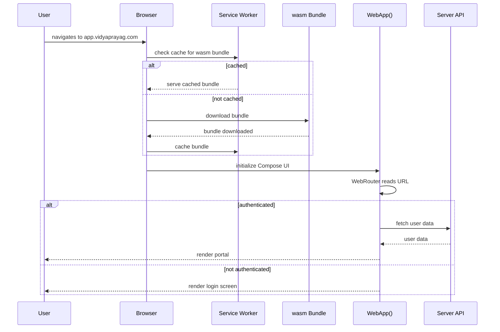
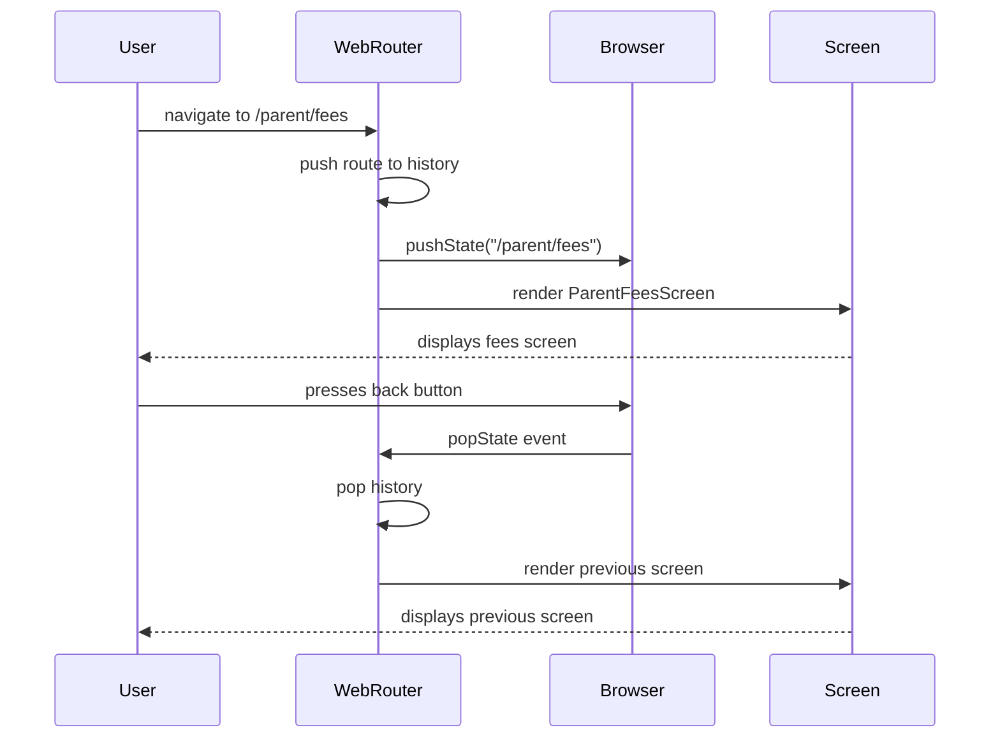
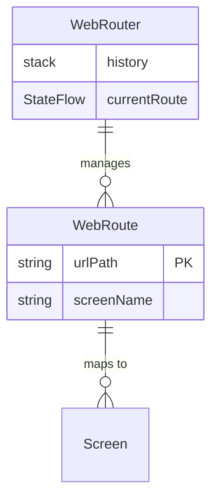

# Web App — Technical Specification

> **Document status:** Implementation-ready blueprint
> **Last updated:** 2026-06-27
> **Prerequisites:** None (benefits from `TABLET_LAYOUT_SPEC.md` for responsive layouts)
> **Template:** `_SPEC_TEMPLATE.md` v1 (25 mandatory + 6 optional sections)

---

## 1. Feature Overview

Browser-based web application providing access to all Vidya Prayag portals (Parent, Teacher, School Admin) via the existing KMP wasmJs/JS target. Reuses Compose Multiplatform UI for web rendering, with SEO-optimized landing page and responsive layouts.

### Goals

- All three portals accessible via web browser (Chrome, Firefox, Safari, Edge)
- URL-based routing (deep links, bookmarkable pages)
- Responsive layouts (desktop, tablet, mobile browser)
- SEO-optimized landing page (server-side rendered or static)
- Web-specific features: file download, print, keyboard shortcuts
- PWA support (installable, offline shell)

### Non-goals

- [ ] Native desktop app (Electron/Tauri) — web app covers desktop via browser
- [ ] Server-side rendering of Compose UI — landing page only is SSR'd
- [ ] Offline full functionality — PWA offline shell only (not full offline mode)

### Dependencies

- Compose Multiplatform wasmJs/JS target (existing build config)
- `TABLET_LAYOUT_SPEC.md` adaptive components (for responsive layouts)
- `website/` Next.js project (existing, for landing page)
- Koin dependency injection (existing)

### Related Modules

- `composeApp/src/wasmJsMain/` — web entry point
- `shared/.../core/platform/` — platform abstractions
- `shared/.../core/prefs/` — preference/token storage
- `NavGraphV2.kt` — existing navigation graph

---

## 2. Current System Assessment

### Existing Code

- `settings.gradle.kts` and `composeApp/build.gradle.kts` already configure wasmJs/js targets
- `website/` directory exists with Next.js project (separate from KMP app)
- No web entry point for the KMP Compose app
- No URL routing for web
- `feature_audit.csv` L145: "KMP targets wasmJs/js but no web-specific UI" — 40% complete

### Existing Database

N/A — web app uses the same server-side database as mobile. No database changes needed.

### Existing APIs

- All existing REST APIs work for web client (JWT auth, same endpoints)
- No API changes needed

### Existing UI

- All screens designed for Compose Multiplatform (shared across platforms)
- No web-specific UI adaptations
- No URL-based routing (mobile uses in-app navigation)

### Existing Services

- `PreferenceRepository` with `LocalStoragePreferenceManager` for JS/wasmJs (existing)
- Koin DI configured for all platforms

### Existing Documentation

- `feature_audit.csv` references the gap at L145

### Technical Debt

| # | Gap | Details |
|---|---|---|
| TD-1 | No web entry point for KMP app | Cannot access portals via browser |
| TD-2 | No URL routing | No deep links, no bookmarkable pages |
| TD-3 | No web-specific adaptations | File download, print, keyboard not handled |
| TD-4 | No PWA manifest | Not installable |
| TD-5 | Compose web performance | wasm bundle size, initial load time |

### Gaps

| # | Gap | Impact | Severity |
|---|---|---|---|
| G1 | No web entry point for KMP app | Cannot access portals via browser | **Critical** |
| G2 | No URL routing | No deep links, no bookmarkable pages | **High** |
| G3 | No web-specific adaptations | File download, print, keyboard not handled | **Medium** |
| G4 | No PWA manifest | Not installable | **Low** |
| G5 | Compose web performance | wasm bundle size, initial load time | **High** |

---

## 3. Functional Requirements

### FR-001
| Field | Value |
|---|---|
| **Title** | Web Entry Point |
| **Description** | Web entry point (`composeApp/src/wasmJsMain/`) rendering Compose UI in browser |
| **Priority** | Critical |
| **User Roles** | All |
| **Acceptance notes** | `CanvasBasedWindow` renders Compose UI |

### FR-002
| Field | Value |
|---|---|
| **Title** | URL-Based Routing |
| **Description** | URL-based routing: `/parent/fees`, `/teacher/attendance`, `/admin/dashboard` |
| **Priority** | High |
| **User Roles** | All |
| **Acceptance notes** | Browser URL reflects current screen; deep links work |

### FR-003
| Field | Value |
|---|---|
| **Title** | Browser Navigation |
| **Description** | Browser back/forward navigation works |
| **Priority** | High |
| **User Roles** | All |
| **Acceptance notes** | `window.history` API integration |

### FR-004
| Field | Value |
|---|---|
| **Title** | Responsive Layouts |
| **Description** | Responsive layouts (reuse `TABLET_LAYOUT_SPEC.md` adaptive components) |
| **Priority** | High |
| **User Roles** | All |
| **Acceptance notes** | Desktop, tablet, mobile browser layouts |

### FR-005
| Field | Value |
|---|---|
| **Title** | File Download & Print |
| **Description** | Web-specific: file download (receipts, report cards), print (report cards) |
| **Priority** | Medium |
| **User Roles** | All |
| **Acceptance notes** | Browser download dialog; print dialog |

### FR-006
| Field | Value |
|---|---|
| **Title** | PWA Support |
| **Description** | PWA: manifest.json, service worker for offline shell |
| **Priority** | Low |
| **User Roles** | All |
| **Acceptance notes** | Installable; offline shell loads |

### FR-007
| Field | Value |
|---|---|
| **Title** | Keyboard Shortcuts |
| **Description** | Keyboard shortcuts (e.g., Ctrl+S for save, Esc for back) |
| **Priority** | Low |
| **User Roles** | All |
| **Acceptance notes** | Common shortcuts mapped |

### FR-008
| Field | Value |
|---|---|
| **Title** | Favicon & Meta Tags |
| **Description** | Favicon and meta tags for web |
| **Priority** | Low |
| **User Roles** | All |
| **Acceptance notes** | Browser tab shows icon and title |

### FR-009
| Field | Value |
|---|---|
| **Title** | wasm Bundle Optimization |
| **Description** | wasm bundle optimized (code splitting, lazy loading) |
| **Priority** | High |
| **User Roles** | System |
| **Acceptance notes** | Bundle < 5MB; initial load < 5s |

### FR-010
| Field | Value |
|---|---|
| **Title** | Web Auth |
| **Description** | Auth: JWT stored in localStorage (web) instead of DataStore |
| **Priority** | Critical |
| **User Roles** | All |
| **Acceptance notes** | `LocalStoragePreferenceManager` handles token storage |

---

## 4. User Stories

### Parent
- [ ] Access parent portal via web browser at `https://app.vidyaprayag.com/parent`
- [ ] Download fee receipts from web browser
- [ ] Bookmark specific pages (e.g., fees, academics)
- [ ] Use browser back/forward to navigate

### Teacher
- [ ] Access teacher portal via web browser at `https://app.vidyaprayag.com/teacher`
- [ ] Take attendance from desktop browser
- [ ] Print report cards from web browser
- [ ] Use keyboard shortcuts for common actions

### School Admin
- [ ] Access admin dashboard via web browser at `https://app.vidyaprayag.com/admin`
- [ ] Manage school settings from desktop
- [ ] Download reports from web browser

### System
- [ ] Render Compose UI in browser via wasmJs
- [ ] Route based on URL path
- [ ] Handle browser back/forward events
- [ ] Cache wasm bundle via service worker
- [ ] Optimize bundle size for fast initial load

---

## 5. Business Rules

### BR-001
**Rule:** Web app uses the same server-side APIs as mobile.
**Enforcement:** Shared Ktor client + same API endpoints; no web-specific API.

### BR-002
**Rule:** JWT token stored in localStorage on web, DataStore on mobile.
**Enforcement:** `LocalStoragePreferenceManager` (web) vs `PreferenceManager` (mobile) — both implement `PreferenceRepository`.

### BR-003
**Rule:** URL routing must reflect the current screen and support deep links.
**Enforcement:** `WebRouter` syncs with `window.history.pushState()`; URL path maps to `WebRoute`.

### BR-004
**Rule:** Web app must be responsive — no separate mobile web vs desktop web.
**Enforcement:** Reuse `TABLET_LAYOUT_SPEC.md` adaptive components (`AdaptiveLayout`, `AdaptiveGrid`, `AdaptiveNavigation`).

### BR-005
**Rule:** PWA offline shell caches the wasm bundle and static assets, not user data.
**Enforcement:** Service worker caches `vidyaprayag.js`, `index.html`, `manifest.json`, icons. User data fetched from API when online.

### BR-006
**Rule:** wasm bundle must be < 5MB for acceptable initial load time.
**Enforcement:** Kotlin/JS IR compiler optimizations; code splitting for admin features.

---

## 6. Database Design

### 6.1 Entity Relationship Summary

N/A — web app uses the same server-side database as mobile. No database changes needed.

### 6.2 New Tables

N/A

### 6.3 Modified Tables

N/A

### 6.4 Indexes

N/A

### 6.5 Constraints

N/A

### 6.6 Foreign Keys

N/A

### 6.7 Soft Delete Strategy

N/A

### 6.8 Audit Fields

N/A

### 6.9 Migration Notes

N/A — no database migration needed.

### 6.10 Exposed Mappings

N/A

### 6.11 Seed Data

N/A

---

## 7. State Machines

### URL Routing State Machine

```
LOGIN ──auth success──> PORTAL_HOME ──navigate──> SCREEN ──back──> PREVIOUS_SCREEN
```

| Current State | Event | Next State | Guard / Condition |
|---|---|---|---|
| `/login` | Auth success | `/parent` or `/teacher` or `/admin` | Role-based redirect |
| `/parent` | Navigate to fees | `/parent/fees` | — |
| `/parent/fees` | Browser back | `/parent` | History stack |
| any | Browser back | Previous route | History not empty |
| any | Browser back | `/login` | History empty + not authenticated |
| any | Deep link | Target route | Valid URL + authenticated |

### Auth State Machine (Web)

```
UNAUTHENTICATED ──login──> AUTHENTICATED ──logout──> UNAUTHENTICATED
AUTHENTICATED ──token expired──> UNAUTHENTICATED ──redirect──> LOGIN
```

| Current State | Event | Next State | Guard / Condition |
|---|---|---|---|
| `unauthenticated` | Login success | `authenticated` | JWT in localStorage |
| `authenticated` | Logout | `unauthenticated` | localStorage cleared |
| `authenticated` | Token expired | `unauthenticated` | 401 response |
| `unauthenticated` | Page load | `/login` route | No JWT in localStorage |

---

## 8. Backend Architecture

### 8.1 Component Overview

N/A — web app is a frontend-only concern. No backend changes needed. The web app connects to the same server as the mobile app.

### 8.2 Design Principles

1. **Reuse, don't rebuild** — Web app uses the same Compose Multiplatform UI as mobile
2. **URL-first** — Every screen has a URL; browser navigation works naturally
3. **Progressive enhancement** — PWA features layered on top of core web app
4. **Shared auth** — Same JWT-based auth as mobile; stored in localStorage on web

### 8.3 Core Types

```kotlin
sealed class WebRoute(val urlPath: String) {
    object Login : WebRoute("/login")
    object ParentHome : WebRoute("/parent")
    object ParentFees : WebRoute("/parent/fees")
    object ParentAcademics : WebRoute("/parent/academics")
    object TeacherHome : WebRoute("/teacher")
    object TeacherAttendance : WebRoute("/teacher/attendance")
    object AdminDashboard : WebRoute("/admin/dashboard")
    // ... all routes
}

class WebRouter {
    private val history = Stack<WebRoute>()
    val currentRoute: StateFlow<WebRoute>
    fun navigate(route: WebRoute)
    fun back()
}
```

### 8.4 Repositories

N/A — uses existing `PreferenceRepository` with `LocalStoragePreferenceManager` for web.

### 8.5 Mappers

N/A

### 8.6 Permission Checks

N/A — same permission system as mobile. JWT token contains role info.

### 8.7 Background Jobs

N/A — no background jobs for web app.

### 8.8 Domain Events

N/A

### 8.9 Caching

- Service worker caches wasm bundle + static assets
- Browser HTTP cache for API responses (existing cache headers)

### 8.10 Transactions

N/A

---

## 9. API Contracts

N/A — web app uses the same REST API as mobile. No new endpoints needed. All existing endpoints work with JWT auth from localStorage.

---

## 10. Frontend Architecture

### 10.1 Screens

| Screen | Platform | Role | URL Path |
|---|---|---|---|
| Login | Web | All | `/login` |
| Parent Home | Web | Parent | `/parent` |
| Parent Fees | Web | Parent | `/parent/fees` |
| Parent Academics | Web | Parent | `/parent/academics` |
| Teacher Home | Web | Teacher | `/teacher` |
| Teacher Attendance | Web | Teacher | `/teacher/attendance` |
| Admin Dashboard | Web | Admin | `/admin/dashboard` |

### 10.2 Navigation

URL-based routing via `WebRouter`:

```kotlin
class WebRouter {
    private val history = Stack<WebRoute>()
    val currentRoute: StateFlow<WebRoute>

    fun navigate(route: WebRoute) {
        history.push(route)
        updateBrowserUrl(route)
    }

    fun back() {
        history.pop()
        updateBrowserUrl(history.peek())
    }

    private fun updateBrowserUrl(route: WebRoute) {
        // window.history.pushState(null, "", route.urlPath)
    }
}
```

### 10.3 UX Flows

#### Web App Entry Flow

1. User navigates to `https://app.vidyaprayag.com`
2. Browser loads `index.html` → shows loading spinner
3. wasm bundle downloads and initializes
4. `WebApp()` composable renders
5. `WebRouter` reads current URL → routes to appropriate screen
6. If not authenticated → redirect to `/login`
7. If authenticated → show portal based on role

### 10.4 State Management

```kotlin
data class WebAppState(
    val currentRoute: WebRoute,
    val isAuthenticated: Boolean,
    val userRole: String?,
    val isLoading: Boolean,
)
```

### 10.5 Offline Support

- PWA service worker caches wasm bundle + static assets
- Offline shell loads (but API calls fail without network)
- Full offline mode is handled by `OFFLINE_MODE_SPEC.md` (separate concern)

### 10.6 Loading States

- Initial load: loading spinner in `index.html` before wasm initializes
- Screen loading: existing skeleton/shimmer states
- Route transition: brief loading state during route change

### 10.7 Error Handling (UI)

- 404 route: "Page not found" screen with link to home
- Auth failure: redirect to `/login`
- Network error: existing error states per screen

### 10.8 Search & Filtering

- URL query params for search/filter state (e.g. `/parent/fees?status=paid`)
- Bookmarkable filtered views

### 10.9 Pagination

- URL query params for page number (e.g. `/parent/fees?page=2`)
- Existing pagination UI

### 10.10 UI Components

#### Web Entry Point

```kotlin
// composeApp/src/wasmJsMain/kotlin/Main.kt
fun main() {
    CanvasBasedWindow(
        title = "Vidya Prayag",
        canvasId = "ComposeTarget"
    ) {
        VidyaPrayagTheme {
            WebApp()
        }
    }
}

@Composable
fun WebApp() {
    val router = rememberWebRouter()
    WebNavHost(router) { route ->
        when (route) {
            is WebRoute.Login -> LoginScreen()
            is WebRoute.ParentFees -> ParentFeesScreen()
            is WebRoute.TeacherAttendance -> TeacherAttendanceScreen()
            is WebRoute.AdminDashboard -> AdminDashboardScreen()
            // ... all routes
        }
    }
}
```

#### Platform-Specific Adaptations

```kotlin
// shared/.../core/platform/PlatformCapabilities.kt
expect class PlatformCapabilities() {
    val isWeb: Boolean
    val canDownloadFiles: Boolean
    val canPrint: Boolean
    fun downloadFile(url: String, fileName: String)
    fun print()
}

// wasmJsMain
actual class PlatformCapabilities {
    actual val isWeb = true
    actual val canDownloadFiles = true
    actual val canPrint = true
    actual fun downloadFile(url: String, fileName: String) {
        // Create <a> element, set href, download attribute, click
        val a = js("document.createElement('a')")
        a.href = url
        a.download = fileName
        a.click()
    }
    actual fun print() {
        js("window.print()")
    }
}
```

#### PWA Configuration

```json
// composeApp/src/wasmJsMain/resources/manifest.json
{
  "name": "Vidya Prayag",
  "short_name": "VidyaPrayag",
  "start_url": "/",
  "display": "standalone",
  "background_color": "#0F172A",
  "theme_color": "#2563EB",
  "icons": [
    {"src": "/icon-192.png", "sizes": "192x192", "type": "image/png"},
    {"src": "/icon-512.png", "sizes": "512x512", "type": "image/png"}
  ]
}
```

#### HTML Template

```html
<!-- composeApp/src/wasmJsMain/resources/index.html -->
<!DOCTYPE html>
<html>
<head>
    <meta charset="UTF-8">
    <meta name="viewport" content="width=device-width, initial-scale=1.0">
    <title>Vidya Prayag — School Management</title>
    <link rel="manifest" href="/manifest.json">
    <link rel="icon" href="/favicon.ico">
    <meta name="theme-color" content="#2563EB">
    <style>
        html, body { margin: 0; padding: 0; width: 100%; height: 100%; overflow: hidden; }
        #ComposeTarget { width: 100%; height: 100%; }
        .loading { display: flex; justify-content: center; align-items: center; height: 100vh; }
    </style>
</head>
<body>
    <div id="ComposeTarget">
        <div class="loading">Loading Vidya Prayag...</div>
    </div>
    <script src="vidyaprayag.js"></script>
</body>
</html>
```

### 10.11 Component Integration Guidelines

| Rule | Description |
|---|---|
| **R1** | All screens must work with URL routing — no screen-only navigation |
| **R2** | Use `PlatformCapabilities` for web-specific actions (download, print) |
| **R3** | Reuse `AdaptiveLayout`, `AdaptiveGrid`, `AdaptiveNavigation` from `TABLET_LAYOUT_SPEC.md` |
| **R4** | Keyboard shortcuts must not conflict with browser shortcuts |
| **R5** | File downloads use `PlatformCapabilities.downloadFile()` — not platform-specific code in screens |

---

## 11. Shared Module Changes (KMP)

### 11.1 DTOs

N/A — no new DTOs needed. Web app uses existing DTOs.

### 11.2 Domain Models

```kotlin
sealed class WebRoute(val urlPath: String)
class WebRouter
expect class PlatformCapabilities()
```

### 11.3 Repository Interfaces

N/A — existing `PreferenceRepository` with `LocalStoragePreferenceManager` handles web storage.

### 11.4 UseCases

N/A — existing use cases work for web.

### 11.5 Validation

N/A — existing validation works for web.

### 11.6 Serialization

N/A — existing serialization works for web.

### 11.7 Network APIs

N/A — existing Ktor client works for web. JWT stored in localStorage.

### 11.8 Database Models (Local Cache)

- Web: `localStorage` for JWT token, theme preference, and other prefs (existing `LocalStoragePreferenceManager`)
- No local database on web (no SQLDelight on wasmJs)

---

## 12. Permissions Matrix

| Action | Platform Admin | School Admin | Teacher | Parent |
|---|---|---|---|---|
| Access web app | ✅ | ✅ | ✅ | ✅ |
| Download files | ✅ | ✅ | ✅ | ✅ |
| Print | ✅ | ✅ | ✅ | ✅ |
| Install PWA | ✅ | ✅ | ✅ | ✅ |
| Use keyboard shortcuts | ✅ | ✅ | ✅ | ✅ |

---

## 13. Notifications

N/A — web app does not support push notifications in this phase. Browser push notifications are a future enhancement.

---

## 14. Background Jobs

N/A — web app does not have background jobs. Service worker handles caching only.

---

## 15. Integrations

### Compose Multiplatform wasmJs
| Field | Value |
|---|---|
| **System** | Compose Multiplatform |
| **Purpose** | Render Compose UI in browser via wasm |
| **API / SDK** | `CanvasBasedWindow` |
| **Auth method** | N/A |
| **Fallback** | Loading spinner if wasm fails to load |

### Browser History API
| Field | Value |
|---|---|
| **System** | Browser `window.history` |
| **Purpose** | URL-based routing with back/forward support |
| **API / SDK** | `pushState()`, `popState` event |
| **Auth method** | N/A |
| **Fallback** | In-app navigation if API unavailable |

### Service Worker (PWA)
| Field | Value |
|---|---|
| **System** | Browser Service Worker API |
| **Purpose** | Cache wasm bundle + static assets for offline shell |
| **API / SDK** | `navigator.serviceWorker.register()` |
| **Auth method** | N/A |
| **Fallback** | No offline shell if SW unavailable |

### Next.js (Landing Page)
| Field | Value |
|---|---|
| **System** | Next.js |
| **Purpose** | SEO-optimized landing page (separate from KMP app) |
| **API / SDK** | Existing `website/` project |
| **Auth method** | N/A |
| **Fallback** | KMP app loads directly if landing page unavailable |

---

## 16. Security

### Authentication
- JWT-based authentication (same as mobile)
- JWT stored in `localStorage` on web (via `LocalStoragePreferenceManager`)
- Token refreshed via existing refresh token mechanism

### Authorization
- Same role-based access control as mobile
- JWT contains role info; server validates on each request

### Encryption
- All API communication over HTTPS/TLS
- `localStorage` is subject to same-origin policy

### Audit Logs
- Same audit logging as mobile (server-side)

### PII Handling
- Same as mobile — PII handled server-side; web client displays only
- `localStorage` stores JWT only (no PII)

### Data Isolation
- Same as mobile — JWT-scoped data access

### Rate Limiting
- Same API rate limits as mobile

### Input Validation
- Same validation as mobile (client + server)

### Web-Specific Security Considerations

- **CORS:** Server must allow `app.vidyaprayag.com` origin
- **CSP:** Content Security Policy header to prevent XSS
- **XSS:** Compose web renders to canvas — not vulnerable to traditional DOM XSS
- **CSRF:** JWT in `localStorage` (not cookies) — CSRF not applicable
- `localStorage` JWT is accessible to JavaScript on same origin — ensure no third-party scripts loaded

---

## 17. Performance & Scalability

### Expected Scale

| Metric | 1 user | 1,000 concurrent | 10,000 concurrent |
|---|---|---|---|
| wasm bundle size | < 5MB | < 5MB | < 5MB |
| Initial load (broadband) | < 5s | < 5s | < 5s |
| Initial load (3G) | < 15s | < 15s | < 15s |
| Subsequent load (cached) | < 1s | < 1s | < 1s |
| Memory per tab | ~100-200MB | ~100-200MB | ~100-200MB |

### Latency Targets

| Operation | Target |
|---|---|
| wasm bundle download (broadband) | < 3s |
| wasm initialization | < 2s |
| Route change (client-side) | < 100ms |
| API call (same as mobile) | < 500ms |

### Optimization Strategy

- **wasm bundle size:** Target < 5MB (use Kotlin/JS IR compiler optimizations)
- **Initial load:** Show loading spinner while wasm downloads
- **Code splitting:** Lazy-load less-used screens (admin features loaded on demand)
- **Image optimization:** WebP format, lazy loading via Coil
- **Service worker:** Cache wasm bundle + static assets for fast subsequent loads
- **Compose web performance:** Avoid heavy recomposition; use `derivedStateOf` for computed values

---

## 18. Edge Cases

| # | Scenario | Expected Behavior |
|---|---|---|
| EC-001 | User navigates to invalid URL | 404 "Page not found" screen |
| EC-002 | User navigates to authenticated route without login | Redirect to `/login` |
| EC-003 | wasm bundle fails to download | Error message with retry button |
| EC-004 | Browser doesn't support wasm | Fallback message ("Please use a modern browser") |
| EC-005 | Service worker registration fails | App still works (no offline shell) |
| EC-006 | User opens multiple tabs | Each tab has independent state; JWT shared in localStorage |
| EC-007 | User goes back past login | Redirect to `/login` if not authenticated |
| EC-008 | Deep link to specific screen while logged in | Route directly to that screen |
| EC-009 | Deep link to specific screen while logged out | Redirect to `/login`, then to target screen after auth |

### Risks & Mitigations

| Risk | Likelihood | Impact | Mitigation |
|---|---|---|---|
| wasm bundle too large | Medium | High | Code splitting; IR compiler optimizations; lazy loading |
| Initial load too slow | Medium | High | Service worker caching; loading spinner; CDN |
| Browser compatibility issues | Low | Medium | Test on Chrome, Firefox, Safari, Edge; graceful degradation |
| Compose web rendering bugs | Medium | Medium | Thorough browser testing; fallback to Next.js for critical pages |
| localStorage cleared by user | Low | Low | Redirect to login; no data loss (server-side) |
| CORS issues | Low | High | Configure server CORS for web origin |
| SEO not possible with wasm | High | Medium | Landing page is SSR'd via Next.js; app pages not SEO-critical |

---

## 19. Error Handling

### Standard Error Codes

| HTTP | Error Code | Description | When |
|---|---|---|---|
| 401 | `UNAUTHORIZED` | JWT expired or invalid | Token refresh fails |
| 403 | `FORBIDDEN` | Role doesn't have access | Wrong portal access |
| 404 | `NOT_FOUND` | Invalid URL route | Unknown URL path |
| 500 | `INTERNAL_ERROR` | Server error | Unexpected exception |

### Error Response Format

Same as mobile — standard API error response.

### Recovery Strategy

| Error | Client Action |
|---|---|
| 401 | Redirect to `/login` |
| 403 | Show "Access denied" screen |
| 404 (route) | Show "Page not found" screen |
| wasm load failure | Show error with retry button |
| Network error | Show offline banner; retry on reconnect |

---

## 20. Analytics & Reporting

### Reports

N/A — web app uses the same analytics as mobile (if implemented).

### KPIs

- **Web Usage:** % of sessions via web vs mobile
- **Web Initial Load Time:** Average time to first render
- **PWA Install Rate:** % of web users who install PWA
- **Browser Distribution:** Chrome / Firefox / Safari / Edge breakdown

### Dashboards

N/A — no operational dashboard needed for web app.

### Exports

N/A

---

## 21. Testing Strategy

### Unit Tests

| Test | What it verifies |
|---|---|
| `WebRouter.navigate()` | Route changes and history updated |
| `WebRouter.back()` | History pop and URL update |
| `WebRoute` URL path mapping | Each route has correct URL path |
| `PlatformCapabilities.isWeb` | Returns true on wasmJs |

### UI Tests

| Test | What it verifies |
|---|---|
| Login screen renders in browser | No crash, UI visible |
| URL routing works | URL changes when navigating |
| Browser back/forward | Navigation matches browser history |
| Responsive layout | Desktop, tablet, mobile layouts correct |
| File download | Download dialog appears |
| Print | Print dialog appears |

### Browser Testing

- Chrome (latest)
- Firefox (latest)
- Safari (latest)
- Edge (latest)

### Responsive Testing

- Desktop (1920px)
- Laptop (1366px)
- Tablet (768px)
- Mobile (375px)

### PWA Testing

- Installable on desktop (Chrome, Edge)
- Offline shell loads when offline
- Service worker caches correct assets

### Performance Tests

- [ ] wasm bundle < 5MB
- [ ] Initial load < 5s on broadband
- [ ] Subsequent load < 1s (cached)
- [ ] Route change < 100ms

### Security Tests

- [ ] CORS configured correctly
- [ ] CSP header prevents XSS
- [ ] No third-party scripts loaded
- [ ] JWT in localStorage not accessible cross-origin

### Migration Tests

N/A — no data migration.

---

## 22. Acceptance Criteria

- [ ] Web app loads in browser at `https://app.vidyaprayag.com`
- [ ] All three portals (Parent, Teacher, Admin) accessible via web
- [ ] URL routing works (back/forward, bookmarkable)
- [ ] Responsive layouts adapt to screen size
- [ ] File download works for receipts and report cards
- [ ] Print works for report cards
- [ ] PWA installable on desktop
- [ ] wasm bundle < 5MB
- [ ] Initial load < 5 seconds on broadband
- [ ] Keyboard shortcuts work (Ctrl+S, Esc)
- [ ] Favicon and meta tags displayed
- [ ] Deep links work (authenticated and unauthenticated)

---

## 23. Implementation Roadmap

| Phase | Duration | Tasks | Breaking? | Deliverable |
|---|---|---|---|---|
| 1 | 2 days | Web entry point, HTML template, wasmJs build config | No | Web app boots |
| 2 | 3 days | URL router + browser navigation integration | No | URL routing works |
| 3 | 2 days | Platform-specific capabilities (download, print) | No | Web-specific features |
| 4 | 2 days | Auth adaptation (localStorage for web) | No | Web auth works |
| 5 | 3 days | Apply responsive layouts (reuse TABLET_LAYOUT_SPEC.md) | No | Responsive UI |
| 6 | 1 day | PWA manifest + service worker | No | PWA support |
| 7 | 2 days | Performance optimization (bundle size, lazy loading) | No | Bundle < 5MB |
| 8 | 2 days | Deploy + CDN configuration | No | Live at app.vidyaprayag.com |
| 9 | 2 days | Browser testing + responsive testing | No | Cross-browser verified |

**Total: ~19 days**

---

## 24. File-Level Impact Analysis

### New Files

| File | Location | Purpose |
|---|---|---|
| `Main.kt` | `composeApp/src/wasmJsMain/kotlin/` | Web entry point |
| `index.html` | `composeApp/src/wasmJsMain/resources/` | HTML template |
| `manifest.json` | `composeApp/src/wasmJsMain/resources/` | PWA manifest |
| `WebRouter.kt` | `composeApp/src/wasmJsMain/kotlin/` | URL routing |
| `PlatformCapabilities.kt` | `shared/.../core/platform/` | Platform abstraction (expect/actual) |
| `service-worker.js` | `composeApp/src/wasmJsMain/resources/` | PWA service worker |

### Modified Files

| File | Change Type | Lines Changed (est.) | Risk | Description |
|---|---|---|---|---|
| `composeApp/build.gradle.kts` | Modify | ~15 | Medium | wasmJs build config, optimizations |
| `shared/.../core/prefs/TokenStorage.kt` | Modify | ~10 | Low | Web: localStorage, Mobile: DataStore |
| `NavGraphV2.kt` | Modify | ~20 | Medium | Integrate `WebRouter` for web platform |

### Files Preserved Unchanged

| File | Reason |
|---|---|
| All screen composables | Reused as-is; routing handled at nav level |
| All ViewModels | Platform-agnostic |
| All API clients | Same endpoints for web and mobile |
| All DTOs | Shared across platforms |

---

## 25. Future Enhancements

### Browser Push Notifications

- Web Push API for browser notifications
- Requires user permission
- Same notification content as mobile push

### Offline Full Mode

- Integrate `OFFLINE_MODE_SPEC.md` with web
- IndexedDB for local data cache on web
- Background sync API for deferred sync

### SEO for App Pages

- Server-side rendering of key pages (e.g., public school profile)
- Or pre-render static pages for SEO

### Web-Specific UI Patterns

- Right-click context menus
- Drag-and-drop for file uploads
- Mouse hover states
- Tab-based multi-view (open multiple students in tabs)

### Desktop App (Tauri/Electron)

- Package web app as desktop app
- Native window controls
- System tray integration
- Auto-update mechanism

### WebRTC for Video Calls

- Integrate `VOICE_VIDEO_CALLS_SPEC.md` via WebRTC on web
- Camera/microphone access via browser APIs

---

## A. Sequence Diagrams

### Web App Initialization



### URL Navigation Flow



---

## B. Domain Model / ER Diagram

N/A — web app has no database entities. It uses the same server-side database as mobile.



---

## C. Event Flow

```
PageLoad ──> wasm initializes ──> WebRouter reads URL ──> Route to screen
Navigate ──> WebRouter.push() ──> pushState() ──> Render new screen
BrowserBack ──> popState event ──> WebRouter.pop() ──> Render previous screen
TokenExpired ──> 401 response ──> Redirect to /login
```

| Event | Emitted By | Consumed By | Side Effect |
|---|---|---|---|
| `PageLoad` | Browser | `WebApp()` | wasm init + route resolution |
| `Navigate` | User action | `WebRouter` | URL change + screen render |
| `BrowserBack` | Browser | `WebRouter` | History pop + screen render |
| `TokenExpired` | API (401) | Auth interceptor | Redirect to `/login` |

---

## D. Configuration

### Environment Variables

| Variable | Description |
|---|---|
| `WEB_BASE_URL` | Base URL for web app (e.g. `https://app.vidyaprayag.com`) |
| `CORS_ALLOWED_ORIGINS` | Server CORS config (must include web origin) |

### Feature Flags

| Flag | Default | Description |
|---|---|---|
| `web_app_enabled` | `true` | Enable web app entry point |
| `web_pwa_enabled` | `true` | Enable PWA manifest + service worker |
| `web_keyboard_shortcuts_enabled` | `true` | Enable keyboard shortcuts |

### Client-Side Configuration

| Config | Default | Description |
|---|---|---|
| wasm bundle target | < 5MB | Maximum bundle size |
| Service worker cache | wasm + static assets | Cached resources for offline shell |
| Loading spinner | "Loading Vidya Prayag..." | Text shown during wasm download |

### Server-Side Configuration

| Config | Default | Description |
|---|---|---|
| CORS | `app.vidyaprayag.com` | Allowed web origin |
| CSP | `default-src 'self'` | Content Security Policy |

### Infrastructure Requirements

- CDN for wasm bundle + static assets (e.g., Cloudflare, CloudFront)
- HTTPS certificate for `app.vidyaprayag.com`
- Server CORS configuration for web origin

---

## E. Migration & Rollback

### Deployment Plan

1. [ ] Create `Main.kt` web entry point + `index.html` template
2. [ ] Configure wasmJs build in `build.gradle.kts`
3. [ ] Implement `WebRouter` with URL routing
4. [ ] Implement `PlatformCapabilities` (expect/actual)
5. [ ] Adapt auth for localStorage (web)
6. [ ] Apply responsive layouts (reuse `TABLET_LAYOUT_SPEC.md`)
7. [ ] Add PWA manifest + service worker
8. [ ] Optimize wasm bundle size
9. [ ] Configure CDN + HTTPS
10. [ ] Configure server CORS
11. [ ] Deploy to staging (`staging.app.vidyaprayag.com`)
12. [ ] Browser testing (Chrome, Firefox, Safari, Edge)
13. [ ] Deploy to production (`app.vidyaprayag.com`)

### Rollback Plan

1. [ ] Remove web app from CDN → users can't access web app
2. [ ] Mobile app unaffected — no shared changes
3. [ ] No database rollback needed
4. [ ] No data loss — web app is stateless (server-side data)

### Data Backfill

N/A — no data migration needed.

### Migration SQL

N/A — no database changes.

---

## F. Observability

### Logging

- Web app initialization logged at INFO: `web_app_initialized` (browser, version)
- Route changes logged at DEBUG: `web_route_changed` (from → to)
- Auth events logged at INFO: `web_auth_success` / `web_auth_failure`
- wasm load time logged at INFO: `wasm_load_time` (ms)
- Service worker registration logged at DEBUG: `sw_registered` / `sw_failed`
- File downloads logged at DEBUG: `web_file_downloaded` (fileName)
- Print events logged at DEBUG: `web_print` (screen)

### Metrics

| Metric | Type | Description |
|---|---|---|
| `web.active_sessions` | Gauge | Active web sessions |
| `web.initial_load_time` | Histogram | Time to first render (ms) |
| `web.wasm_bundle_size` | Gauge | Current wasm bundle size (bytes) |
| `web.pwa_install_total` | Counter | PWA installations |
| `web.browser_distribution` | Gauge (by browser) | Browser usage breakdown |
| `web.route_navigation_total` | Counter (by route) | Route visits |

### Health Checks

- `GET /api/v1/health` — existing server health check (web uses same endpoint)

### Alerts

- wasm bundle size > 5MB → alert development team
- Initial load time > 10s (p95) → alert ops team
- Service worker registration failure rate > 5% → alert dev team
