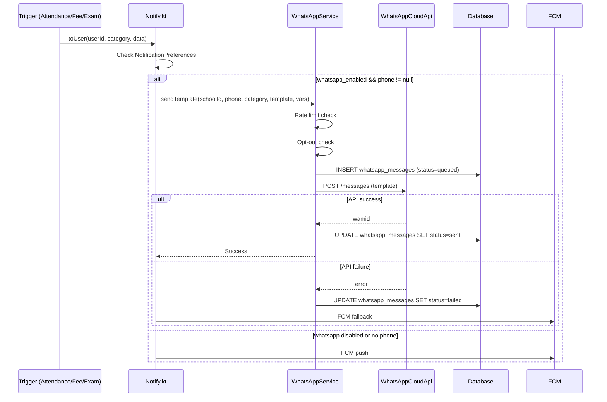
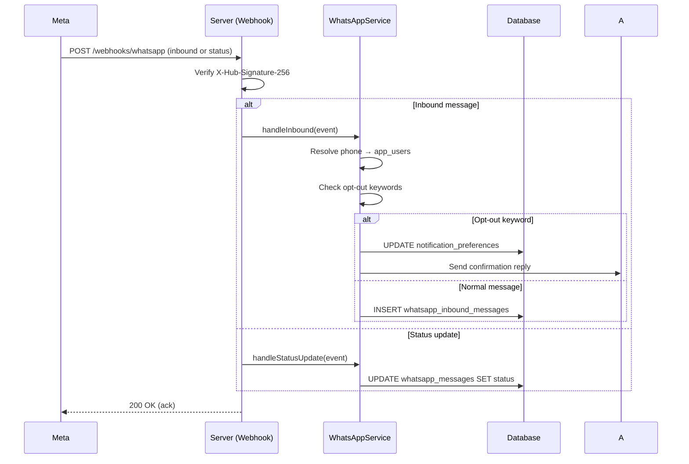

# WhatsApp Business API Integration — Technical Specification

> **Document status:** Implementation-ready blueprint
> **Last updated:** 2026-06-28
> **Prerequisites:** None
> **Unblocks:** `SMART_NOTIFICATIONS_SPEC.md`, `FEE_PAYMENT_SPEC.md` (payment links), `SCHEDULED_ANNOUNCEMENTS_SPEC.md`
> **Related specs:** `FEE_PAYMENT_SPEC.md`, `NOTIFICATION_SYSTEM_SPEC.md`, `AI_INFRASTRUCTURE_SPEC.md`
> **Template:** `_SPEC_TEMPLATE.md` v1 (25 mandatory + 6 optional sections)

---

## 1. Feature Overview

### Purpose

Extend the existing WhatsApp Cloud API integration from OTP-only delivery to a full multi-channel notification system. This enables sending announcements, fee reminders, attendance alerts, exam results, PTM invitations, and payment links via WhatsApp Business API, with template management, two-way messaging, and delivery tracking.

### Business Value

- WhatsApp is the most popular channel in India — higher open rates than SMS or email
- Replaces/supplements FCM push for high-priority notifications
- Enables offline parents to receive critical alerts without the app
- Two-way messaging creates a direct communication channel between parents and schools
- Media messages enable sending receipts, report cards, and circulars as PDFs

### Goals

- [ ] Replace/supplement FCM push with WhatsApp for high-priority notifications in India
- [ ] Support WhatsApp template messages (pre-approved by Meta) for transactional alerts
- [ ] Support two-way messaging (parent replies routed to school admin inbox)
- [ ] Template management UI for admins to create and submit templates for approval
- [ ] Delivery status tracking (sent, delivered, read) via webhooks
- [ ] Per-category opt-out (parent can stop specific WhatsApp notification types)
- [ ] Rate limit compliance with WhatsApp Business API (tier-based messaging limits)

### Non-goals

- [ ] WhatsApp Interactive Messages (buttons, list messages) — future extensibility
- [ ] WhatsApp Flows (in-chat forms) — future extensibility
- [ ] WhatsApp Business Catalog — future extensibility
- [ ] AI auto-reply — future extensibility (requires `AI_INFRASTRUCTURE_SPEC.md`)
- [ ] WhatsApp Communities — future extensibility

### Dependencies

- WhatsApp Business API account (Meta Business Suite)
- Meta app with WhatsApp Business integration
- `WhatsAppCloudProvider` (existing — OTP delivery)
- `NotificationsTable` + `Notify.kt` (existing notification system)
- `NotificationPreferencesTable` (existing per-user preferences)
- `WhatsappLogsTable` (existing WhatsApp send logs)
- Supabase Storage (for media messages)
- `AppConfigTable` (for access token + configuration)

### Related Modules

- `WhatsAppCloudProvider` — existing OTP-only WhatsApp integration
- `WhatsappLogsTable` (`Tables.kt:345-354`) — existing WhatsApp send logs
- `NotificationsTable` — per-recipient notification rows
- `NotificationPreferencesTable` (`Tables.kt:1675-1687`) — per-user per-category enable/disable
- `AnnouncementsTable` — has `syncedToWa` flag
- `Notify.kt` — notification dispatch service
- `AppConfigTable` — gateway configuration

---

## 2. Current System Assessment

### Existing Code

- **`WhatsAppCloudProvider`** — exists but only for OTP delivery (`feature_audit.csv` L143: "WhatsAppCloudProvider exists but only for OTP delivery")
- **`WhatsappLogsTable`** (`Tables.kt:345-354`) — logs WhatsApp sends with `status` (QUEUED/sent/failed), `providerMessageId`, `errorMessage`
- **`AnnouncementsTable`** has `syncedToWa` flag and `POST /announcements/{id}/sync-whatsapp` endpoint
- **`NotificationsTable`** — per-recipient notification rows with category, deepLink, actorId
- **`NotificationPreferencesTable`** (`Tables.kt:1675-1687`) — per-user per-category enable/disable + sound
- OTP gateway infrastructure: `OtpGatewayDevicesTable`, `SmsRequestsTable` (SMS via OTPSender Android app)

### Existing Database

- `whatsapp_logs` table — logs WhatsApp sends with status, providerMessageId, errorMessage
- `notification_preferences` table — per-user per-category enable/disable + sound
- `notifications` table — per-recipient notification rows
- `announcements` table — has `syncedToWa` flag

### Existing APIs

- `POST /announcements/{id}/sync-whatsapp` — sync announcement to WhatsApp (existing)

### Existing UI

- No WhatsApp-specific UI screens exist

### Existing Services

- `WhatsAppCloudProvider` — OTP delivery only
- `Notify.kt` — notification dispatch (FCM + in-app, no WhatsApp integration)

### Existing Documentation

- `feature_audit.csv` L143: "WhatsAppCloudProvider exists but only for OTP delivery"
- `MESSAGING_SYSTEM_SPEC.md` — existing messaging system spec
- `NOTIFICATION_SYSTEM_SPEC.md` — existing notification system spec

### Technical Debt

- WhatsApp limited to OTP only — most popular channel in India unused for notifications
- No template management — cannot send structured transactional messages
- No inbound message handling — parent replies lost
- No delivery tracking — cannot measure WhatsApp effectiveness
- No media messages — cannot send report cards, receipts as PDF
- No rate limiting — risk of WhatsApp API throttling/ban

### Gaps

| # | Gap | Impact |
|---|---|---|
| G1 | WhatsApp limited to OTP only | Most popular channel in India unused for notifications |
| G2 | No template management | Cannot send structured transactional messages |
| G3 | No inbound message handling | Parent replies lost |
| G4 | No delivery tracking | Cannot measure WhatsApp effectiveness |
| G5 | No media messages | Cannot send report cards, receipts as PDF |
| G6 | No rate limiting | Risk of WhatsApp API throttling/ban |

---

## 3. Functional Requirements

### FR-001
| Field | Value |
|---|---|
| **Title** | Send Template Messages |
| **Description** | Send template messages for: attendance alerts, fee reminders, exam results, PTM invitations, announcement broadcasts, payment links |
| **Priority** | Critical |
| **User Roles** | System (via Notify.kt), School Admin, Super Admin |
| **Acceptance notes** | Template messages sent with correct variable injection for each category |

### FR-002
| Field | Value |
|---|---|
| **Title** | Template Management |
| **Description** | Admin can create, submit, and manage WhatsApp message templates (Meta approval workflow) |
| **Priority** | High |
| **User Roles** | Super Admin |
| **Acceptance notes** | Super admin can create template, submit to Meta, track approval status |

### FR-003
| Field | Value |
|---|---|
| **Title** | Media Messages |
| **Description** | Send media messages (image + caption, document) for receipts, report cards, circulars |
| **Priority** | High |
| **User Roles** | System (via Notify.kt), School Admin |
| **Acceptance notes** | Media message sent with Supabase URL; delivered to parent's WhatsApp |

### FR-004
| Field | Value |
|---|---|
| **Title** | Two-Way Messaging |
| **Description** | Two-way messaging: inbound messages from parents routed to admin inbox or auto-reply |
| **Priority** | Medium |
| **User Roles** | Parent, School Admin |
| **Acceptance notes** | Parent reply received via webhook; stored in whatsapp_inbound_messages; admin can view and respond |

### FR-005
| Field | Value |
|---|---|
| **Title** | Delivery Status Tracking |
| **Description** | Delivery status tracking via webhook (sent, delivered, read, failed) |
| **Priority** | High |
| **User Roles** | System |
| **Acceptance notes** | Webhook updates whatsapp_messages.status in real-time; stats available in admin dashboard |

### FR-006
| Field | Value |
|---|---|
| **Title** | Per-Category Opt-Out |
| **Description** | Parent can opt out of specific WhatsApp categories via reply ("STOP FEES", "STOP ATTENDANCE") |
| **Priority** | Medium |
| **User Roles** | Parent |
| **Acceptance notes** | Opt-out reply processed immediately; preference updated; subsequent sends skipped for that category |

### FR-007
| Field | Value |
|---|---|
| **Title** | Rate Limiting |
| **Description** | Rate limiting per school based on WhatsApp tier (1000/10000/unlimited per 24h) |
| **Priority** | Critical |
| **User Roles** | System |
| **Acceptance notes** | Rate limiter prevents exceeding tier limit; excess messages queued for next day |

### FR-008
| Field | Value |
|---|---|
| **Title** | Bulk Broadcast |
| **Description** | Bulk broadcast to class/section/all-school via WhatsApp (respecting template + opt-out) |
| **Priority** | High |
| **User Roles** | School Admin, Super Admin |
| **Acceptance notes** | Admin can broadcast to filtered audience; opt-out preferences respected; rate limit checked |

### FR-009
| Field | Value |
|---|---|
| **Title** | Notification Preferences Integration |
| **Description** | WhatsApp notification preference integrated with existing `NotificationPreferencesTable` |
| **Priority** | High |
| **User Roles** | Parent |
| **Acceptance notes** | Parent can toggle WhatsApp per category in preferences; Notify.kt checks before sending |

### FR-010
| Field | Value |
|---|---|
| **Title** | FCM Fallback |
| **Description** | Fallback to FCM push if WhatsApp send fails |
| **Priority** | Critical |
| **User Roles** | System |
| **Acceptance notes** | If WhatsApp send fails, FCM push sent automatically; logged in whatsapp_messages with status=failed |

---

## 4. User Stories

### Parent
- [ ] Receive WhatsApp notification when my child is absent so I know immediately
- [ ] Receive fee reminder on WhatsApp with a payment link so I can pay easily
- [ ] Receive exam results on WhatsApp so I don't need to check the app
- [ ] Receive PTM invitation on WhatsApp so I can plan to attend
- [ ] Opt out of specific WhatsApp categories by replying "STOP FEES"
- [ ] Reply to school messages on WhatsApp and have them reach the admin
- [ ] Receive report card PDF on WhatsApp so I can view it without the app

### School Admin
- [ ] Broadcast WhatsApp message to a class for an announcement
- [ ] View WhatsApp delivery stats (sent, delivered, read, failed) so I can measure effectiveness
- [ ] View and reply to inbound WhatsApp messages from parents
- [ ] See which parents have opted out of WhatsApp categories

### Super Admin
- [ ] Create and submit WhatsApp templates for Meta approval
- [ ] Check template approval status from Meta
- [ ] Configure WhatsApp tier per school
- [ ] Enable/disable WhatsApp feature flags per school

---

## 5. Business Rules

### BR-001
**Rule:** Only Meta-approved templates can be sent as template messages.
**Enforcement:** `whatsapp_templates.meta_status` must be 'approved' before sending; service checks status before dispatch.

### BR-002
**Rule:** Rate limiting is per school per 24-hour rolling window, based on WhatsApp tier.
**Enforcement:** `WhatsAppRateLimiter.checkLimit()` counts messages sent in last 24h per school; rejects if exceeding tier limit.

### BR-003
**Rule:** Parents can opt out of specific WhatsApp categories but not critical categories (e.g., emergency alerts).
**Enforcement:** `notification_preferences.whatsapp_enabled` per category; critical categories cannot be disabled.

### BR-004
**Rule:** All WhatsApp messages must be logged in `whatsapp_messages` with status tracking.
**Enforcement:** Service writes to `whatsapp_messages` before API call; webhook updates status.

### BR-005
**Rule:** Media messages must use publicly accessible HTTPS URLs.
**Enforcement:** Media uploaded to Supabase Storage first; URL passed to WhatsApp API.

### BR-006
**Rule:** Inbound messages from unknown numbers are stored with `school_id = null` for manual assignment.
**Enforcement:** Inbound handler resolves phone → app_users; if no match, stores with null school_id.

### BR-007
**Rule:** Bulk broadcast processes recipients in batches of 100 (WhatsApp API limit).
**Enforcement:** `WhatsAppService.broadcast()` chunks recipients into 100-per-batch groups.

### BR-008
**Rule:** Template variables count must match template placeholder count.
**Enforcement:** Service validates `variables.size == template.placeholderCount` before sending.

### BR-009
**Rule:** Inbound message PII (message body) is purged after 90 days.
**Enforcement:** Daily job deletes `whatsapp_inbound_messages` older than 90 days.

### BR-010
**Rule:** FCM fallback is mandatory — if WhatsApp send fails, FCM push must be sent.
**Enforcement:** `Notify.kt` wraps WhatsApp send in try-catch; FCM sent on exception.

---

## 6. Database Design

### 6.1 Entity Relationship Summary

```
whatsapp_templates 1───* whatsapp_messages (template_id)
notifications       1───* whatsapp_messages (notification_id)
app_users           1───* whatsapp_messages (recipient_user_id)
app_users           1───* whatsapp_inbound_messages (sender_user_id)
whatsapp_messages   1───* whatsapp_inbound_messages (replied_to_message_id)
whatsapp_logs       1───1 whatsapp_messages (whatsapp_message_id)
notification_preferences 1───1 app_users (per-user per-category)
```

### 6.2 New Tables

```sql
CREATE TABLE whatsapp_templates (
    id              UUID PRIMARY KEY DEFAULT gen_random_uuid(),
    school_id       UUID,                          -- null = global template
    template_name   TEXT NOT NULL,                 -- unique per WhatsApp Business account
    language        VARCHAR(8) NOT NULL DEFAULT 'en', -- en | hi | bn | ta | te | mr | gu | kn | ml
    category        VARCHAR(32) NOT NULL,          -- TRANSACTIONAL | MARKETING | UTILITY
    body_text       TEXT NOT NULL,                 -- template body with {{1}}, {{2}} placeholders
    header_type     VARCHAR(16),                   -- text | image | document | null
    header_text     TEXT,
    footer_text     TEXT,
    buttons         TEXT NOT NULL DEFAULT '[]',    -- JSON array: [{"type":"quick_reply","text":"Yes"}, {"type":"url","text":"Pay","url":"{{1}}"}]
    meta_status     VARCHAR(16) NOT NULL DEFAULT 'pending', -- pending | approved | rejected
    meta_template_id TEXT,                         -- WhatsApp template ID from Meta
    created_at      TIMESTAMP NOT NULL DEFAULT now(),
    updated_at      TIMESTAMP NOT NULL DEFAULT now(),
    UNIQUE(template_name, language)
);
CREATE INDEX idx_wa_templates_school ON whatsapp_templates(school_id, meta_status);
```

```sql
CREATE TABLE whatsapp_messages (
    id              UUID PRIMARY KEY DEFAULT gen_random_uuid(),
    school_id       UUID NOT NULL,
    recipient_phone VARCHAR(32) NOT NULL,
    recipient_name  TEXT,
    recipient_user_id UUID,                        -- FK app_users.id (if known)
    template_id     UUID,                          -- FK whatsapp_templates.id (if template message)
    category        VARCHAR(32) NOT NULL,          -- attendance | fees | exam | ptm | announcement | payment | otp | general
    message_type    VARCHAR(16) NOT NULL,          -- template | text | media
    body            TEXT,                          -- rendered message text
    media_url       TEXT,                          -- Supabase Storage URL for media messages
    media_type      VARCHAR(16),                   -- image | document | audio
    wamid           TEXT,                          -- WhatsApp message ID (from API response)
    status          VARCHAR(16) NOT NULL DEFAULT 'queued', -- queued | sent | delivered | read | failed
    error_code      INTEGER,
    error_message   TEXT,
    notification_id UUID,                          -- FK notifications.id (if triggered by notification)
    sent_at         TIMESTAMP,
    delivered_at    TIMESTAMP,
    read_at         TIMESTAMP,
    created_at      TIMESTAMP NOT NULL DEFAULT now()
);
CREATE INDEX idx_wa_messages_school_status ON whatsapp_messages(school_id, status, created_at DESC);
CREATE INDEX idx_wa_messages_phone ON whatsapp_messages(recipient_phone, created_at DESC);
```

```sql
CREATE TABLE whatsapp_inbound_messages (
    id              UUID PRIMARY KEY DEFAULT gen_random_uuid(),
    school_id       UUID,                          -- resolved from sender's phone → app_users
    sender_phone    VARCHAR(32) NOT NULL,
    sender_user_id  UUID,                          -- FK app_users.id (resolved)
    sender_name     TEXT,
    message_body    TEXT,
    message_type    VARCHAR(16),                   -- text | image | document | audio | button_reply
    media_url       TEXT,
    wamid           TEXT,
    replied_to_message_id UUID,                    -- FK whatsapp_messages.id (if reply to outbound)
    is_processed    BOOLEAN NOT NULL DEFAULT false,
    created_at      TIMESTAMP NOT NULL DEFAULT now()
);
CREATE INDEX idx_wa_inbound_school ON whatsapp_inbound_messages(school_id, created_at DESC);
CREATE INDEX idx_wa_inbound_unprocessed ON whatsapp_inbound_messages(is_processed, created_at);
```

### 6.3 Modified Tables

```sql
ALTER TABLE whatsapp_logs ADD COLUMN whatsapp_message_id UUID;
ALTER TABLE notification_preferences ADD COLUMN whatsapp_enabled BOOLEAN NOT NULL DEFAULT true;
```

### 6.4 Indexes

| Index | Table | Columns | Purpose |
|---|---|---|---|
| `idx_wa_templates_school` | `whatsapp_templates` | `school_id, meta_status` | Query templates by school + approval status |
| `idx_wa_messages_school_status` | `whatsapp_messages` | `school_id, status, created_at DESC` | Delivery stats + filtering |
| `idx_wa_messages_phone` | `whatsapp_messages` | `recipient_phone, created_at DESC` | Message history per phone |
| `idx_wa_inbound_school` | `whatsapp_inbound_messages` | `school_id, created_at DESC` | Admin inbox view |
| `idx_wa_inbound_unprocessed` | `whatsapp_inbound_messages` | `is_processed, created_at` | Process unprocessed messages |

### 6.5 Constraints

| Constraint | Table | Rule |
|---|---|---|
| `UNIQUE` | `whatsapp_templates` | `(template_name, language)` — unique template per language |
| `CHECK` | `whatsapp_messages.amount` | N/A (no amount field) |
| `FK` | `whatsapp_messages.template_id` | Must reference valid `whatsapp_templates.id` |
| `FK` | `whatsapp_messages.notification_id` | Must reference valid `notifications.id` |
| `FK` | `whatsapp_inbound_messages.replied_to_message_id` | Must reference valid `whatsapp_messages.id` |

### 6.6 Foreign Keys

| Table | Column | References |
|---|---|---|
| `whatsapp_templates` | `school_id` | `schools.id` (nullable — null = global template) |
| `whatsapp_messages` | `template_id` | `whatsapp_templates.id` (nullable) |
| `whatsapp_messages` | `recipient_user_id` | `app_users.id` (nullable) |
| `whatsapp_messages` | `notification_id` | `notifications.id` (nullable) |
| `whatsapp_inbound_messages` | `sender_user_id` | `app_users.id` (nullable) |
| `whatsapp_inbound_messages` | `replied_to_message_id` | `whatsapp_messages.id` (nullable) |
| `whatsapp_logs` | `whatsapp_message_id` | `whatsapp_messages.id` (new, nullable) |

### 6.7 Soft Delete Strategy

- `whatsapp_templates`: No soft delete — use `meta_status` to track rejected templates
- `whatsapp_messages`: No soft delete — financial/audit trail (immutable)
- `whatsapp_inbound_messages`: Hard delete after 90 days (PII purge job)

### 6.8 Audit Fields

| Table | `created_at` | `updated_at` | Other |
|---|---|---|---|
| `whatsapp_templates` | ✅ | ✅ | `meta_status`, `meta_template_id` |
| `whatsapp_messages` | ✅ | — | `sent_at`, `delivered_at`, `read_at` |
| `whatsapp_inbound_messages` | ✅ | — | `is_processed` |

### 6.9 Migration Notes

- **Migration file:** `docs/db/migration_033_whatsapp_integration.sql`
- **Rollback:** See §E. Migration & Rollback
- **Backfill:** No existing data to backfill — new tables start empty
- **Seed data:** 5 seed templates inserted with `meta_status='pending'` (must be submitted to Meta for approval)

### 6.10 Exposed Mappings

```kotlin
object WhatsappTemplatesTable : UUIDTable("whatsapp_templates", "id") {
    val schoolId       = uuid("school_id").nullable()
    val templateName   = text("template_name")
    val language       = varchar("language", 8).default("en")
    val category       = varchar("category", 32)
    val bodyText       = text("body_text")
    val headerType     = varchar("header_type", 16).nullable()
    val headerText     = text("header_text").nullable()
    val footerText     = text("footer_text").nullable()
    val buttons        = text("buttons").default("[]")
    val metaStatus     = varchar("meta_status", 16).default("pending")
    val metaTemplateId = text("meta_template_id").nullable()
    val createdAt      = timestamp("created_at")
    val updatedAt      = timestamp("updated_at")
    init { uniqueIndex("idx_wa_templates_school", false, schoolId, metaStatus) }
}

object WhatsappMessagesTable : UUIDTable("whatsapp_messages", "id") {
    val schoolId         = uuid("school_id")
    val recipientPhone   = varchar("recipient_phone", 32)
    val recipientName    = text("recipient_name").nullable()
    val recipientUserId  = uuid("recipient_user_id").nullable()
    val templateId       = uuid("template_id").nullable()
    val category         = varchar("category", 32)
    val messageType      = varchar("message_type", 16)
    val body             = text("body").nullable()
    val mediaUrl         = text("media_url").nullable()
    val mediaType        = varchar("media_type", 16).nullable()
    val wamid            = text("wamid").nullable()
    val status           = varchar("status", 16).default("queued")
    val errorCode        = integer("error_code").nullable()
    val errorMessage     = text("error_message").nullable()
    val notificationId   = uuid("notification_id").nullable()
    val sentAt           = timestamp("sent_at").nullable()
    val deliveredAt      = timestamp("delivered_at").nullable()
    val readAt           = timestamp("read_at").nullable()
    val createdAt        = timestamp("created_at")
    init {
        index("idx_wa_messages_school_status", false, schoolId, status, createdAt)
        index("idx_wa_messages_phone", false, recipientPhone, createdAt)
    }
}

object WhatsappInboundMessagesTable : UUIDTable("whatsapp_inbound_messages", "id") {
    val schoolId            = uuid("school_id").nullable()
    val senderPhone         = varchar("sender_phone", 32)
    val senderUserId        = uuid("sender_user_id").nullable()
    val senderName          = text("sender_name").nullable()
    val messageBody         = text("message_body").nullable()
    val messageType         = varchar("message_type", 16).nullable()
    val mediaUrl            = text("media_url").nullable()
    val wamid               = text("wamid").nullable()
    val repliedToMessageId  = uuid("replied_to_message_id").nullable()
    val isProcessed         = bool("is_processed").default(false)
    val createdAt           = timestamp("created_at")
    init {
        index("idx_wa_inbound_school", false, schoolId, createdAt)
        index("idx_wa_inbound_unprocessed", false, isProcessed, createdAt)
    }
}
```

### 6.11 Seed Templates

```sql
INSERT INTO whatsapp_templates (id, school_id, template_name, language, category, body_text, meta_status, created_at, updated_at)
VALUES
  (gen_random_uuid(), NULL, 'attendance_alert_en', 'en', 'TRANSACTIONAL',
   'Dear Parent, your child {{1}} was marked {{2}} on {{3}}. - {{4}}', 'pending', now(), now()),
  (gen_random_uuid(), NULL, 'fee_reminder_en', 'en', 'UTILITY',
   'Dear Parent, fee of ₹{{1}} for {{2}} is due on {{3}}. Pay now: {{4}} - {{5}}', 'pending', now(), now()),
  (gen_random_uuid(), NULL, 'exam_result_en', 'en', 'TRANSACTIONAL',
   'Dear Parent, {{1}} scored {{2}}/{{3}} in {{4}} ({{5}}). - {{6}}', 'pending', now(), now()),
  (gen_random_uuid(), NULL, 'ptm_invitation_en', 'en', 'UTILITY',
   'Dear Parent, PTM is scheduled on {{1}} from {{2}}. Please attend. - {{3}}', 'pending', now(), now()),
  (gen_random_uuid(), NULL, 'announcement_en', 'en', 'UTILITY',
   '{{1}}: {{2}} - {{3}}', 'pending', now(), now())
ON CONFLICT (template_name, language) DO NOTHING;
```

**Note:** Templates must be submitted to Meta for approval before use. The seed inserts them with `meta_status='pending'`; admin must submit via API.

---

## 7. State Machines

### WhatsApp Message State Machine

```
queued ──API call success──> sent ──webhook: delivered──> delivered ──webhook: read──> read
  │                            │
  │                            └──API error──> failed
  │
  └──rate limited──> queued (retry)
```

| Current State | Event | Next State | Guard / Condition |
|---|---|---|---|
| `queued` | API call success | `sent` | WhatsApp API returns wamid |
| `queued` | API error | `failed` | API returns error |
| `queued` | Rate limited | `queued` | Retry after delay |
| `sent` | Webhook: delivered | `delivered` | Valid webhook signature |
| `sent` | Webhook: failed | `failed` | Valid webhook signature |
| `delivered` | Webhook: read | `read` | Valid webhook signature |
| `failed` | Retry job | `queued` | Retry count < 3 |

### Template Approval State Machine

```
pending ──Meta approves──> approved
pending ──Meta rejects───> rejected
rejected ──admin edits + resubmits──> pending
approved ──admin deactivates──> inactive (via is_active flag, future)
```

| Current State | Event | Next State | Guard / Condition |
|---|---|---|---|
| `pending` | Meta approves | `approved` | Template sync job detects status |
| `pending` | Meta rejects | `rejected` | Template sync job detects status |
| `rejected` | Admin edits + resubmits | `pending` | Admin resubmits to Meta |
| `approved` | Admin deactivates | `inactive` | Future: `is_active` flag |

### Inbound Message State Machine

```
received ──processed──> processed
received ──opt-out keyword──> processed (preference updated)
received ──auto-reply──> processed (reply sent)
```

| Current State | Event | Next State | Guard / Condition |
|---|---|---|---|
| `received` (is_processed=false) | Admin views + responds | `processed` (is_processed=true) | Admin action |
| `received` | Opt-out keyword detected | `processed` | "STOP" or "STOP {category}" detected |
| `received` | Auto-reply triggered | `processed` | Known query pattern matched |

---

## 8. Backend Architecture

### 8.1 Component Overview

```
┌──────────────────────────────────────────────────────┐
│              Notification Triggers                    │
│  (Attendance, Fees, Exams, Announcements, PTM)        │
└──────────────────┬───────────────────────────────────┘
                   │ Notify.toUser() / Notify.toClass()
                   ▼
┌──────────────────────────────────────────────────────┐
│              NotificationService (existing)            │
│  - Checks NotificationPreferencesTable                │
│  - If whatsapp_enabled → enqueue WhatsApp send        │
│  - Always writes NotificationsTable row               │
│  - FCM push as fallback                               │
└──────────────────┬───────────────────────────────────┘
                   │
                   ▼
┌──────────────────────────────────────────────────────┐
│              WhatsAppService                           │
│  - Template resolution + variable injection           │
│  - Rate limiter check                                  │
│  - Opt-out check                                       │
│  - Media upload (if needed)                            │
│  - Call WhatsAppCloudApi                               │
│  - Log to whatsapp_messages                            │
│  - Update delivery status from webhook                 │
└──────────────────┬───────────────────────────────────┘
                   │
                   ▼
┌──────────────────────────────────────────────────────┐
│              WhatsAppCloudApi                          │
│  - POST /messages (send template/text/media)           │
│  - POST /templates (create template)                   │
│  - GET /templates (check status)                       │
│  - Webhook handler (inbound + status)                  │
└──────────────────────────────────────────────────────┘
```

### 8.2 Repositories

```kotlin
class WhatsAppTemplateRepository {
    suspend fun create(template: WhatsAppTemplate): WhatsAppTemplate
    suspend fun getById(id: UUID): WhatsAppTemplate?
    suspend fun getBySchoolAndStatus(schoolId: UUID?, status: String): List<WhatsAppTemplate>
    suspend fun updateMetaStatus(id: UUID, status: String, metaTemplateId: String?): WhatsAppTemplate
    suspend fun getByNameAndLanguage(name: String, language: String): WhatsAppTemplate?
}
class WhatsAppMessageRepository {
    suspend fun create(message: WhatsAppMessage): WhatsAppMessage
    suspend fun getById(id: UUID): WhatsAppMessage?
    suspend fun getByWamid(wamid: String): WhatsAppMessage?
    suspend fun updateStatus(id: UUID, status: String, timestamp: Timestamp?): WhatsAppMessage
    suspend fun countBySchoolAndDate(schoolId: UUID, date: LocalDate): Int
    suspend fun getBySchool(schoolId: UUID, filters: MessageFilters): List<WhatsAppMessage>
}
class WhatsAppInboundRepository {
    suspend fun create(message: WhatsAppInboundMessage): WhatsAppInboundMessage
    suspend fun getUnprocessed(): List<WhatsAppInboundMessage>
    suspend fun markProcessed(id: UUID): Boolean
    suspend fun getBySchool(schoolId: UUID): List<WhatsAppInboundMessage>
    suspend fun deleteOlderThan(days: Int): Int
}
```

### 8.3 Services

```kotlin
class WhatsAppService(
    private val api: WhatsAppCloudApi,
    private val templates: WhatsAppTemplateRepository,
    private val messages: WhatsAppMessageRepository,
    private val rateLimiter: WhatsAppRateLimiter,
    private val preferences: NotificationPreferenceRepository
) {
    suspend fun sendTemplate(schoolId: UUID, recipientPhone: String, recipientUserId: UUID?,
        category: String, templateName: String, language: String, variables: List<String>,
        notificationId: UUID? = null): WhatsAppSendResult
    suspend fun sendText(schoolId: UUID, recipientPhone: String, category: String,
        body: String, notificationId: UUID? = null): WhatsAppSendResult
    suspend fun sendMedia(schoolId: UUID, recipientPhone: String, category: String,
        mediaType: String, mediaUrl: String, caption: String, notificationId: UUID? = null): WhatsAppSendResult
    suspend fun broadcast(schoolId: UUID, recipients: List<String>, category: String,
        templateName: String, variablesPerRecipient: Map<String, List<String>>): BatchResult
    suspend fun handleInbound(message: WhatsAppInboundEvent): UUID
    suspend fun handleStatusUpdate(status: WhatsAppStatusEvent)
    suspend fun createTemplate(request: CreateTemplateRequest): WhatsAppTemplateDto
    suspend fun syncTemplateStatus(): Int
}
```

```kotlin
class WhatsAppCloudApi(
    httpClient: HttpClient,
    phoneNumberId: String,
    accessToken: String,
    apiVersion: String = "v21.0"
) {
    suspend fun sendTemplateMessage(to: String, templateName: String, language: String,
        components: List<TemplateComponent>): WhatsAppApiResponse
    suspend fun sendTextMessage(to: String, body: String): WhatsAppApiResponse
    suspend fun sendMediaMessage(to: String, mediaType: String, mediaUrl: String, caption: String?): WhatsAppApiResponse
    suspend fun createTemplate(template: TemplateDefinition): String
    suspend fun getTemplateStatus(templateId: String): MetaTemplateStatus
    // Base URL: https://graph.facebook.com/v21.0/{phoneNumberId}/messages
}
```

### 8.4 Validators

```kotlin
object WhatsAppValidator {
    fun validatePhone(phone: String): ValidationResult {
        // E.164 format, +91 prefix for India
    }
    fun validateTemplateName(name: String): ValidationResult {
        // Alphanumeric + underscores, ≤ 512 chars
    }
    fun validateBody(body: String): ValidationResult {
        // ≤ 4096 chars
    }
    fun validateVariables(template: WhatsAppTemplate, variables: List<String>): ValidationResult {
        // variables.size must match template placeholder count
    }
    fun validateMediaUrl(url: String): ValidationResult {
        // Must be publicly accessible HTTPS URL
    }
    fun validateMediaSize(mediaType: String, sizeBytes: Long): ValidationResult {
        // Image ≤ 5MB, Document ≤ 100MB, Audio ≤ 16MB
    }
}
```

| Field | Rule |
|---|---|
| `recipient_phone` | E.164 format, +91 prefix for India |
| `template_name` | Alphanumeric + underscores, ≤ 512 chars |
| `body` (text message) | ≤ 4096 chars |
| `variables count` | Must match template placeholder count |
| `media_url` | Must be publicly accessible HTTPS URL |
| `media_size` | Image ≤ 5MB, Document ≤ 100MB, Audio ≤ 16MB |

### 8.5 Mappers

```kotlin
fun WhatsAppTemplate.toDto(): WhatsAppTemplateDto
fun WhatsAppMessage.toDto(): WhatsAppMessageDto
fun WhatsAppInboundMessage.toDto(): WhatsAppInboundMessageDto
fun CreateTemplateRequest.toEntity(): WhatsAppTemplate
```

### 8.6 Permission Checks

| Endpoint | Role Check | School Isolation |
|---|---|---|
| `POST /school/whatsapp/broadcast` | School Admin / Super Admin | School ID from JWT |
| `GET /school/whatsapp/stats` | School Admin / Super Admin | School ID from JWT |
| `GET/POST/PATCH/DELETE /super/whatsapp/templates` | Super Admin only | N/A (global templates) |
| `POST /super/whatsapp/templates/sync-status` | Super Admin only | N/A |
| `GET/PATCH /parent/whatsapp/preferences` | Parent only | Own preferences only |
| `POST /webhooks/whatsapp` | Webhook signature verification | School ID resolved from sender |

### 8.7 Background Jobs

| Job | Schedule | Description |
|---|---|---|
| Template status sync | Every 6 hours | Poll Meta for pending template approval status |
| Retry failed sends | Every 5 min | Retry `status=failed` messages (max 3 attempts) |
| Inbound message routing | Real-time (webhook) | Route inbound to admin inbox or auto-reply |
| Opt-out keyword processing | Real-time (webhook) | Process STOP/START replies |
| Daily stats aggregation | Daily 2 AM IST | Aggregate delivery stats per school |
| Purge old inbound messages | Daily 3 AM IST | Delete inbound messages older than 90 days |

### 8.8 Domain Events

| Event | Emitted By | Consumed By | Side Effect |
|---|---|---|---|
| `WhatsAppMessageSent` | `WhatsAppService.sendTemplate()` | `whatsapp_messages` UPDATE | Status updated to `sent` |
| `WhatsAppMessageDelivered` | Webhook handler | `whatsapp_messages` UPDATE | Status updated to `delivered` |
| `WhatsAppMessageRead` | Webhook handler | `whatsapp_messages` UPDATE | Status updated to `read` |
| `WhatsAppMessageFailed` | `WhatsAppService` or webhook | `Notify.kt` | FCM fallback triggered |
| `WhatsAppInboundReceived` | Webhook handler | `WhatsAppService.handleInbound()` | Stored + routed to admin |
| `WhatsAppOptOut` | Inbound handler | `NotificationPreferenceRepository` | Preference updated |
| `WhatsAppTemplateApproved` | Template sync job | `whatsapp_templates` UPDATE | Status updated to `approved` |

### 8.9 Caching

- Rate limiter counts cached in-memory (ConcurrentHashMap with TTL or Redis)
- Template cache: approved templates cached per school (refreshed on approval)
- Access token cached with expiry monitoring

### 8.10 Transactions

| Operation | Transaction Scope |
|---|---|
| Send message | `whatsapp_messages` INSERT (before API call) + UPDATE (after response) |
| Inbound message | `whatsapp_inbound_messages` INSERT + `notification_preferences` UPDATE (if opt-out) |
| Template status sync | `whatsapp_templates` UPDATE (batch) |

### 8.11 Rate Limiter

WhatsApp Business API has tier-based limits:
- Tier 1: 1,000 messages per 24h
- Tier 2: 10,000 messages per 24h
- Tier 3: 100,000 messages per 24h
- Tier 4: Unlimited

```kotlin
class WhatsAppRateLimiter {
    suspend fun checkLimit(schoolId: UUID, messageCount: Int): Boolean {
        val today = LocalDate.now()
        val sentToday = messageRepository.countBySchoolAndDate(schoolId, today)
        val limit = getSchoolTierLimit(schoolId)
        return sentToday + messageCount <= limit
    }
}
```

### 8.12 Opt-Out Handling

Parents can reply with keywords:
- "STOP" → disable all WhatsApp notifications
- "STOP FEES" → disable fee category
- "STOP ATTENDANCE" → disable attendance category
- "START" → re-enable all

Inbound message handler checks for opt-out keywords and updates `notification_preferences.whatsapp_enabled`.

### 8.13 Template Resolution

```kotlin
fun resolveTemplate(template: WhatsAppTemplate, variables: List<String>): String {
    var body = template.bodyText
    for ((index, value) in variables.withIndex()) {
        body = body.replace("{{${index + 1}}}", value)
    }
    return body
}
```

---

## 9. API Contracts

### 9.1 Admin: Send Broadcast

#### `POST /api/v1/school/whatsapp/broadcast`
| Field | Value |
|---|---|
| **Description** | Send WhatsApp broadcast to class/section/all-school |
| **Authorization** | School Admin / Super Admin |
| **Rate Limit** | 10/min |
| **Request body** | `category`, `template_name`, `language`, `audience_type`, `audience_filter`, `variables_per_recipient` |
| **200 Response** | `BatchResult` |
| **Errors** | 400 `WA_TEMPLATE_NOT_APPROVED`, 429 `WA_RATE_LIMITED`, 502 `WA_API_ERROR` |

```json
{
  "category": "announcement",
  "template_name": "announcement_alert",
  "language": "hi",
  "audience_type": "CLASS",
  "audience_filter": {"class_name": "Grade 5", "section": "A"},
  "variables_per_recipient": {
    "phone1": ["Annual Day", "15 July"],
    "phone2": ["Annual Day", "15 July"]
  }
}
```

### 9.2 Admin: Template Management

#### `GET /api/v1/super/whatsapp/templates`
| Field | Value |
|---|---|
| **Description** | List all WhatsApp templates |
| **Authorization** | Super Admin only |
| **Rate Limit** | 60/min |
| **200 Response** | `List<WhatsAppTemplateDto>` |

#### `POST /api/v1/super/whatsapp/templates`
| Field | Value |
|---|---|
| **Description** | Create and submit a new WhatsApp template to Meta |
| **Authorization** | Super Admin only |
| **Rate Limit** | 10/min |
| **201 Response** | `WhatsAppTemplateDto` |
| **Errors** | 400 `VALIDATION_ERROR`, 502 `WA_API_ERROR` |

#### `PATCH /api/v1/super/whatsapp/templates/{id}`
| Field | Value |
|---|---|
| **Description** | Update template (resubmit to Meta if body changed) |
| **Authorization** | Super Admin only |
| **Rate Limit** | 10/min |

#### `DELETE /api/v1/super/whatsapp/templates/{id}`
| Field | Value |
|---|---|
| **Description** | Delete template (only if not in use) |
| **Authorization** | Super Admin only |
| **Rate Limit** | 10/min |

#### `POST /api/v1/super/whatsapp/templates/sync-status`
| Field | Value |
|---|---|
| **Description** | Poll Meta for pending template approval status |
| **Authorization** | Super Admin only |
| **Rate Limit** | 5/min |
| **200 Response** | `{"synced": 5}` |

### 9.3 Admin: Delivery Stats

#### `GET /api/v1/school/whatsapp/stats?date_from={YYYY-MM-DD}&date_to={YYYY-MM-DD}`
| Field | Value |
|---|---|
| **Description** | WhatsApp delivery statistics for a school |
| **Authorization** | School Admin / Super Admin |
| **Rate Limit** | 30/min |
| **200 Response** | `WhatsAppStatsDto` |

```json
{
  "success": true,
  "data": {
    "total_sent": 5000,
    "delivered": 4800,
    "read": 3200,
    "failed": 200,
    "delivery_rate": 0.96,
    "read_rate": 0.64,
    "by_category": [
      {"category": "attendance", "sent": 2000, "delivered": 1950},
      {"category": "fees", "sent": 1000, "delivered": 980}
    ]
  }
}
```

### 9.4 WhatsApp Webhook (Inbound + Status)

#### `POST /api/v1/webhooks/whatsapp`
| Field | Value |
|---|---|
| **Description** | Receive inbound messages and delivery status updates from WhatsApp |
| **Authorization** | Webhook signature verification (X-Hub-Signature-256, HMAC-SHA256) |
| **Rate Limit** | N/A (Meta IP) |
| **200 Response** | Empty (ack immediately, process async) |
| **Errors** | 401 `INVALID_SIGNATURE` |

**Verification:**
```
GET /api/v1/webhooks/whatsapp?hub.mode=subscribe&hub.challenge={challenge}&hub.verify_token={token}
```

**Inbound message event:**
```json
{
  "entry": [{
    "changes": [{
      "value": {
        "messages": [{
          "from": "919876543210",
          "id": "wamid.xxx",
          "text": {"body": "STOP FEES"},
          "timestamp": "1719475200"
        }]
      }
    }]
  }]
}
```

**Status update event:**
```json
{
  "entry": [{
    "changes": [{
      "value": {
        "statuses": [{
          "id": "wamid.xxx",
          "status": "delivered",
          "recipient_id": "919876543210",
          "timestamp": "1719475300"
        }]
      }
    }]
  }]
}
```

### 9.5 Parent: WhatsApp Preferences

#### `GET /api/v1/parent/whatsapp/preferences`
| Field | Value |
|---|---|
| **Description** | Get parent's WhatsApp notification preferences |
| **Authorization** | Parent only |
| **Rate Limit** | 60/min |
| **200 Response** | `WhatsAppPreferencesDto` |

#### `PATCH /api/v1/parent/whatsapp/preferences`
| Field | Value |
|---|---|
| **Description** | Update WhatsApp notification preferences per category |
| **Authorization** | Parent only |
| **Rate Limit** | 10/min |
| **Request body** | `categories` map of category → boolean |

```json
{
  "categories": {
    "attendance": true,
    "fees": false,
    "exam": true,
    "announcement": true,
    "ptm": true
  }
}
```

---

## 10. Frontend Architecture

### 10.1 Screens

| Screen | Platform | Role | Description |
|---|---|---|---|
| `WhatsAppStatsScreen` | Android/iOS/Web | Admin | Delivery stats dashboard with charts |
| `WhatsAppTemplatesScreen` | Android/iOS/Web | Super Admin | Template management (create, view status, edit) |
| `WhatsAppInboxScreen` | Android/iOS/Web | Admin | Inbound message inbox with reply capability |
| `WhatsAppPreferencesScreen` | Android/iOS | Parent | Per-category WhatsApp opt-out toggles |
| `WhatsAppBroadcastScreen` | Android/iOS/Web | Admin | Broadcast composition with audience selector |

### 10.2 Navigation

```
School Portal → WhatsApp tab → WhatsAppStatsScreen
  → "Templates" → WhatsAppTemplatesScreen
  → "Inbox" → WhatsAppInboxScreen
  → "New Broadcast" → WhatsAppBroadcastScreen

Parent Portal → Settings → WhatsApp Preferences → WhatsAppPreferencesScreen
```

### 10.3 UX Flows

#### Admin Broadcast Flow
```
WhatsApp tab → "New Broadcast" → Select template → Select audience (class/section/all)
  → Preview message → Send → View delivery stats
```

#### Parent Opt-Out Flow
```
Parent receives WhatsApp message → Replies "STOP FEES"
  → System processes opt-out → Confirmation reply sent
  → Parent stops receiving fee WhatsApp messages
```

### 10.4 State Management

```kotlin
sealed class WhatsAppBroadcastState {
    object Idle : WhatsAppBroadcastState()
    object Loading : WhatsAppBroadcastState()
    data class AudienceResolved(val recipients: List<String>) : WhatsAppBroadcastState()
    object Sending : WhatsAppBroadcastState()
    data class Sent(val batchResult: BatchResult) : WhatsAppBroadcastState()
    data class Error(val message: String) : WhatsAppBroadcastState()
}
```

### 10.5 Offline Support

- WhatsApp stats cached locally for offline viewing (read-only)
- Broadcast and template management require internet
- Parent preferences cached locally; synced on reconnect

### 10.6 Loading States

- Stats: skeleton loaders while fetching
- Template list: progressive loading
- Broadcast: spinner during audience resolution + sending

### 10.7 Error Handling (UI)

- Template not approved: "Template pending Meta approval" message
- Rate limited: "Daily WhatsApp limit reached. Messages will be sent tomorrow."
- API error: "WhatsApp temporarily unavailable. Using push notifications."
- Webhook verification failed: logged for admin review

### 10.8 Search & Filtering

- Stats: filter by date range, category
- Templates: filter by status (pending/approved/rejected), language, category
- Inbound messages: filter by processed/unprocessed, date

### 10.10 Pagination

- Inbound messages: cursor-based, 50 per page
- Message log: cursor-based, 50 per page
- Templates: no pagination (typically < 50 templates)

---

## 11. Shared Module Changes (KMP)

### 11.1 DTOs

```kotlin
@Serializable
data class WhatsAppTemplateDto(
    val id: String, val schoolId: String?, val templateName: String, val language: String,
    val category: String, val bodyText: String, val headerType: String?, val headerText: String?,
    val footerText: String?, val buttons: String, val metaStatus: String, val metaTemplateId: String?
)
@Serializable
data class WhatsAppMessageDto(
    val id: String, val schoolId: String, val recipientPhone: String, val recipientName: String?,
    val category: String, val messageType: String, val body: String?, val status: String,
    val sentAt: String?, val deliveredAt: String?, val readAt: String?
)
@Serializable
data class WhatsAppStatsDto(
    val totalSent: Int, val delivered: Int, val read: Int, val failed: Int,
    val deliveryRate: Double, val readRate: Double, val byCategory: List<CategoryStats>
)
@Serializable
data class WhatsAppPreferencesDto(val categories: Map<String, Boolean>)
@Serializable
data class CreateTemplateRequest(
    val templateName: String, val language: String, val category: String,
    val bodyText: String, val headerType: String?, val headerText: String?,
    val footerText: String?, val buttons: String
)
@Serializable
data class BroadcastRequest(
    val category: String, val templateName: String, val language: String,
    val audienceType: String, val audienceFilter: Map<String, String>,
    val variablesPerRecipient: Map<String, List<String>>
)
```

### 11.2 Domain Models

```kotlin
data class WhatsAppTemplate(val id: UUID, val schoolId: UUID?, val templateName: String,
    val language: String, val category: WhatsAppTemplateCategory, val bodyText: String,
    val metaStatus: WhatsAppTemplateStatus, val metaTemplateId: String?)
data class WhatsAppMessage(val id: UUID, val schoolId: UUID, val recipientPhone: String,
    val category: String, val messageType: WhatsAppMessageType, val status: WhatsAppMessageStatus,
    val wamid: String?, val sentAt: Timestamp?, val deliveredAt: Timestamp?, val readAt: Timestamp?)
enum class WhatsAppTemplateStatus { PENDING, APPROVED, REJECTED }
enum class WhatsAppMessageStatus { QUEUED, SENT, DELIVERED, READ, FAILED }
enum class WhatsAppMessageType { TEMPLATE, TEXT, MEDIA }
enum class WhatsAppTemplateCategory { TRANSACTIONAL, MARKETING, UTILITY }
```

### 11.3 Repository Interfaces

```kotlin
interface WhatsAppRepository {
    suspend fun getStats(dateFrom: String, dateTo: String): NetworkResult<WhatsAppStatsDto>
    suspend fun broadcast(request: BroadcastRequest): NetworkResult<BatchResult>
}
interface WhatsAppTemplateRepository {
    suspend fun getTemplates(): NetworkResult<List<WhatsAppTemplateDto>>
    suspend fun createTemplate(request: CreateTemplateRequest): NetworkResult<WhatsAppTemplateDto>
    suspend fun syncStatus(): NetworkResult<Int>
}
interface WhatsAppPreferencesRepository {
    suspend fun getPreferences(): NetworkResult<WhatsAppPreferencesDto>
    suspend fun updatePreferences(request: WhatsAppPreferencesDto): NetworkResult<Unit>
}
```

### 11.4 UseCases

```kotlin
class GetWhatsAppStatsUseCase(private val repo: WhatsAppRepository)
class SendBroadcastUseCase(private val repo: WhatsAppRepository)
class GetTemplatesUseCase(private val repo: WhatsAppTemplateRepository)
class CreateTemplateUseCase(private val repo: WhatsAppTemplateRepository)
class SyncTemplateStatusUseCase(private val repo: WhatsAppTemplateRepository)
class GetWhatsAppPreferencesUseCase(private val repo: WhatsAppPreferencesRepository)
class UpdateWhatsAppPreferencesUseCase(private val repo: WhatsAppPreferencesRepository)
```

### 11.5 Validation

```kotlin
object WhatsAppValidator {
    fun validateTemplateName(name: String): ValidationResult
    fun validateBody(body: String): ValidationResult
    fun validatePhone(phone: String): ValidationResult
}
```

### 11.6 Serialization

- `kotlinx.serialization` with `@SerialName` for snake_case JSON mapping
- Enums serialized as lowercase strings
- Dates serialized as ISO-8601 strings

### 11.7 Network APIs

```kotlin
interface WhatsAppApi {
    @GET("api/v1/school/whatsapp/stats") suspend fun getStats(@Query("date_from") from: String, @Query("date_to") to: String): NetworkResult<WhatsAppStatsDto>
    @POST("api/v1/school/whatsapp/broadcast") suspend fun broadcast(@Body request: BroadcastRequest): NetworkResult<BatchResult>
}
interface WhatsAppTemplateApi {
    @GET("api/v1/super/whatsapp/templates") suspend fun getTemplates(): NetworkResult<List<WhatsAppTemplateDto>>
    @POST("api/v1/super/whatsapp/templates") suspend fun createTemplate(@Body request: CreateTemplateRequest): NetworkResult<WhatsAppTemplateDto>
    @POST("api/v1/super/whatsapp/templates/sync-status") suspend fun syncStatus(): NetworkResult<Int>
}
interface WhatsAppPreferencesApi {
    @GET("api/v1/parent/whatsapp/preferences") suspend fun getPreferences(): NetworkResult<WhatsAppPreferencesDto>
    @PATCH("api/v1/parent/whatsapp/preferences") suspend fun updatePreferences(@Body request: WhatsAppPreferencesDto): NetworkResult<Unit>
}
```

### 11.8 Database Models (Local Cache)

N/A — no local SQLDelight tables for WhatsApp. Stats and preferences fetched on demand.

---

## 12. Permissions Matrix

| Action | Parent | School Admin | Super Admin | Teacher |
|---|---|---|---|---|
| Receive WhatsApp notifications | ✅ | ✅ | ✅ | ✅ |
| Opt out of categories | ✅ | ✅ | ✅ | ✅ |
| Send WhatsApp broadcast | ❌ | ✅ | ✅ | ❌ |
| Create/edit templates | ❌ | ❌ | ✅ | ❌ |
| View delivery stats | ❌ | ✅ | ✅ | ❌ |
| Reply to inbound messages | ❌ | ✅ | ✅ | ❌ |
| View inbound inbox | ❌ | ✅ | ✅ | ❌ |
| Configure WhatsApp tier | ❌ | ❌ | ✅ | ❌ |
| Sync template status | ❌ | ❌ | ✅ | ❌ |

---

## 13. Notifications

WhatsApp IS the notification channel. Integration with existing `Notify.kt`:

```kotlin
// In Notify.toUser()
if (preferences.whatsappEnabled(category) && user.phone != null) {
    try {
        whatsAppService.sendTemplate(...)
    } catch (e: Exception) {
        // Fallback to FCM
        fcmService.send(...)
    }
} else {
    fcmService.send(...)
}
```

### N-001
| Field | Value |
|---|---|
| **Trigger** | Attendance marked (absent/late) |
| **Recipient** | Parent of student |
| **Template** | `attendance_alert_en`: "Dear Parent, your child {{1}} was marked {{2}} on {{3}}. - {{4}}" |
| **Channel** | WhatsApp (fallback: FCM) |
| **Retry policy** | 3 retries with 5s backoff; FCM fallback on final failure |
| **Deduplication** | By `notification_id` — one WhatsApp per notification |

### N-002
| Field | Value |
|---|---|
| **Trigger** | Fee due reminder (daily job) |
| **Recipient** | Parent of student with DUE fee |
| **Template** | `fee_reminder_en`: "Dear Parent, fee of ₹{{1}} for {{2}} is due on {{3}}. Pay now: {{4}} - {{5}}" |
| **Channel** | WhatsApp (fallback: FCM) |
| **Retry policy** | 3 retries with 30s backoff; FCM fallback |
| **Deduplication** | Throttled by `fee_records.lastRemindedAt` (min 24h) |

### N-003
| Field | Value |
|---|---|
| **Trigger** | Exam result published |
| **Recipient** | Parent of student |
| **Template** | `exam_result_en`: "Dear Parent, {{1}} scored {{2}}/{{3}} in {{4}} ({{5}}). - {{6}}" |
| **Channel** | WhatsApp (fallback: FCM) |
| **Retry policy** | 3 retries with 5s backoff; FCM fallback |
| **Deduplication** | By `notification_id` |

### N-004
| Field | Value |
|---|---|
| **Trigger** | PTM scheduled |
| **Recipient** | Parent of student |
| **Template** | `ptm_invitation_en`: "Dear Parent, PTM is scheduled on {{1}} from {{2}}. Please attend. - {{3}}" |
| **Channel** | WhatsApp (fallback: FCM) |
| **Retry policy** | 3 retries with 5s backoff; FCM fallback |
| **Deduplication** | By `notification_id` |

### N-005
| Field | Value |
|---|---|
| **Trigger** | Announcement broadcast |
| **Recipient** | All parents in audience |
| **Template** | `announcement_en`: "{{1}}: {{2}} - {{3}}" |
| **Channel** | WhatsApp (fallback: FCM) |
| **Retry policy** | 3 retries with 5s backoff; FCM fallback |
| **Deduplication** | By `announcement_id + parent_id` |

### N-006
| Field | Value |
|---|---|
| **Trigger** | Payment link sent |
| **Recipient** | Parent of student with DUE fee |
| **Template** | `fee_reminder_en` with payment link variable |
| **Channel** | WhatsApp (fallback: FCM) |
| **Retry policy** | 3 retries with 5s backoff; FCM fallback |
| **Deduplication** | By `fee_record_id` |

### N-007
| Field | Value |
|---|---|
| **Trigger** | Opt-out confirmation |
| **Recipient** | Parent who replied with STOP keyword |
| **Template** | "You will no longer receive {category} messages. Reply START to resume." |
| **Channel** | WhatsApp (auto-reply) |
| **Retry policy** | 3 retries with 5s backoff |
| **Deduplication** | By `inbound_message_id` |

---

## 14. Background Jobs

| Job | Schedule | Description | Error handling |
|---|---|---|---|
| Template status sync | Every 6 hours | Poll Meta for pending template approval status | Log errors per template; continue |
| Retry failed sends | Every 5 min | Retry `status=failed` messages (max 3 attempts) | Log failures; mark as permanently failed after 3 retries |
| Inbound message routing | Real-time (webhook) | Route inbound to admin inbox or auto-reply | Log unprocessable messages; store for manual review |
| Opt-out keyword processing | Real-time (webhook) | Process STOP/START replies | Log errors; default to no action on failure |
| Daily stats aggregation | Daily 2 AM IST | Aggregate delivery stats per school | Log errors per school; continue |
| Purge old inbound messages | Daily 3 AM IST | Delete inbound messages older than 90 days | Log count deleted; continue on error |

---

## 15. Integrations

### WhatsApp Business Cloud API
| Field | Value |
|---|---|
| **System** | Meta WhatsApp Business Cloud API |
| **Purpose** | Send and receive WhatsApp messages (template, text, media) |
| **API / SDK** | WhatsApp Cloud REST API v21.0 |
| **Auth method** | Bearer token (access token) |
| **Base URL** | `https://graph.facebook.com/v21.0/{phoneNumberId}/messages` |
| **Fallback** | FCM push notification if WhatsApp send fails |

### Supabase Storage
| Field | Value |
|---|---|
| **System** | Supabase Storage |
| **Purpose** | Store media files (images, documents) for WhatsApp media messages |
| **API / SDK** | Supabase Storage API |
| **Auth method** | Service role key |
| **Fallback** | If upload fails, skip media; send text-only message |

### Firebase Cloud Messaging (FCM)
| Field | Value |
|---|---|
| **System** | FCM |
| **Purpose** | Fallback push notification when WhatsApp send fails |
| **API / SDK** | Firebase Admin SDK |
| **Auth method** | Service account |
| **Fallback** | If FCM also fails, in-app notification still visible |

### Meta Business Suite
| Field | Value |
|---|---|
| **System** | Meta Business Suite |
| **Purpose** | Template approval workflow |
| **API / SDK** | Meta Graph API |
| **Auth method** | Bearer token |
| **Fallback** | If Meta API unavailable, templates remain in pending status |

---

## 16. Security

### Authentication
- WhatsApp Business Access Token stored encrypted in `AppConfigTable`
- Webhook verify token stored in environment variable
- Admin endpoints require JWT auth with appropriate role

### Authorization
- Role-based access control (see §12. Permissions Matrix)
- School isolation: one school cannot send to another school's parents
- Super Admin only for template management

### Encryption
- Access token encrypted at rest (AES-256)
- Webhook signature verification (X-Hub-Signature-256 header, HMAC-SHA256)
- All API communication over HTTPS/TLS

### Audit Logs
- All WhatsApp sends logged in `whatsapp_messages` with full metadata
- Template creation, approval, rejection logged
- Inbound messages logged with sender phone and body
- Admin broadcast actions logged with actor ID

### PII Handling
- Recipient phone numbers stored in `whatsapp_messages`
- Inbound message bodies stored but purged after 90 days
- No sensitive financial data sent via WhatsApp (only amounts, not card details)
- Parent name and phone passed to Meta for template delivery

### DPDP / GDPR Compliance
- Inbound message PII (message body) purged after 90 days
- Parent can request data export of WhatsApp message history
- Opt-out mechanism respects user consent
- No marketing messages without explicit opt-in (UTILITY/TRANSACTIONAL only)

### Rate Limiting

| Endpoint | Rate Limit |
|---|---|
| `POST /school/whatsapp/broadcast` | 10/min per admin |
| `POST /super/whatsapp/templates` | 10/min per super admin |
| `POST /super/whatsapp/templates/sync-status` | 5/min |
| `PATCH /parent/whatsapp/preferences` | 10/min per parent |
| `POST /webhooks/whatsapp` | N/A (Meta IP) |
| WhatsApp API per school | Tier-based (1000/10000/100000/unlimited per 24h) |

### Input Validation
- Server-side validation on all inputs (see §8.4 Validators)
- Phone numbers validated (E.164 format)
- Template variables count matched
- Media URL validated (HTTPS, publicly accessible)
- Media size validated (Image ≤ 5MB, Document ≤ 100MB, Audio ≤ 16MB)
- SQL injection prevention via Exposed ORM parameterized queries

---

## 17. Performance & Scalability

### Expected Scale

| Metric | 10 schools | 100 schools | 1000 schools |
|---|---|---|---|
| Parents | 5,000 | 50,000 | 500,000 |
| WhatsApp messages/day | 2,000 | 20,000 | 200,000 |
| Inbound messages/day | 200 | 2,000 | 20,000 |
| Templates per school | 5-10 | 5-10 | 5-10 |

### Latency Targets

| Operation | Target |
|---|---|
| Send template message (backend → WhatsApp API → response) | < 5s |
| Webhook processing (inbound + status) | < 200ms (ack immediately, process async) |
| Stats aggregation query | < 1s (cached) / < 3s (uncached) |
| Broadcast to 100 recipients | < 30s (batched) |
| Template sync (poll Meta) | < 10s per template |

### Optimization Strategy
- **Caching:** Rate limiter counts in-memory; template cache per school; access token cached
- **Batching:** Bulk broadcast processes 100 recipients per batch (WhatsApp API limit)
- **Async:** WhatsApp API calls always async; webhook processing async
- **Timeouts:** WhatsApp API calls have 10s timeout
- **Pagination:** Message log and inbound messages cursor-based, 50/page

---

## 18. Edge Cases

| # | Scenario | Expected Behavior |
|---|---|---|
| EC-001 | Parent has no phone number | Skip WhatsApp, send FCM only |
| EC-002 | Template pending approval | Queue message, send when approved (or fall back to FCM) |
| EC-003 | WhatsApp API throttling (429) | Exponential backoff retry (3 attempts), then FCM fallback |
| EC-004 | Inbound message from unknown number | Store in `whatsapp_inbound_messages` with `school_id = null`, admin can manually assign |
| EC-005 | Opt-out reply | Process immediately, confirm with "You will no longer receive {category} messages. Reply START to resume." |
| EC-006 | Media message with expired URL | WhatsApp caches media; if URL expires before send, re-upload |
| EC-007 | Multi-language | Template sent in parent's `languagePref` if available, else English |
| EC-008 | Access token expired | Auto-refresh via Meta API; if refresh fails, FCM fallback |
| EC-009 | Webhook missed events | Poll API for status if webhook gap detected |
| EC-010 | Parent marks as spam | Opt-out mechanism; only send approved categories; respect preferences |
| EC-011 | Broadcast to 0 recipients (all opted out) | Valid, no error; return empty batch result |
| EC-012 | Template rejected by Meta | Admin notified; template can be edited and resubmitted |

### Risks & Mitigations

| Risk | Likelihood | Impact | Mitigation |
|---|---|---|---|
| Meta rejects templates | Medium | Medium | Follow template guidelines; have admin review before submission |
| WhatsApp API throttling | Medium | Medium | Rate limiter; batch processing; FCM fallback |
| Access token expiry | Medium | High | Monitor token expiry; auto-refresh via Meta API |
| Parents mark as spam | Low | High | Opt-out mechanism; only send approved categories; respect preferences |
| Webhook missed events | Low | Medium | Poll API for status if webhook gap detected |
| Media URL expired before WhatsApp fetch | Low | Low | Re-upload to Supabase with long-lived URL |

---

## 19. Error Handling

### Standard Error Codes

| HTTP | Error Code | Description | When |
|---|---|---|---|
| 400 | `BAD_REQUEST` | Invalid input | Malformed request body or params |
| 400 | `WA_TEMPLATE_NOT_APPROVED` | Template not approved by Meta | Template meta_status != approved |
| 400 | `WA_INVALID_PHONE` | Invalid phone number format | Phone not E.164 format |
| 401 | `UNAUTHORIZED` | Not authenticated | Missing or invalid token |
| 403 | `FORBIDDEN` | Insufficient permissions | Role not allowed |
| 403 | `WA_RECIPIENT_OPTED_OUT` | Recipient has opted out of this category | Preference check failed |
| 404 | `WA_TEMPLATE_NOT_FOUND` | Template not found | Invalid template_name |
| 429 | `WA_RATE_LIMITED` | WhatsApp daily limit reached for this school | Rate limiter rejected |
| 500 | `WA_MEDIA_UPLOAD_FAILED` | Failed to upload media | Supabase upload error |
| 502 | `WA_API_ERROR` | WhatsApp API error | Meta API returned error |

### Error Response Format

```json
{
  "success": false,
  "error": {
    "code": "WA_RATE_LIMITED",
    "message": "WhatsApp daily limit reached for this school",
    "field": "school_id",
    "details": {"limit": 1000, "sent_today": 1000}
  }
}
```

### Recovery Strategy

| Error | Client Action |
|---|---|
| `WA_TEMPLATE_NOT_APPROVED` | Show "Template pending approval" to admin |
| `WA_RATE_LIMITED` | Queue for next day; show "Daily limit reached" to admin |
| `WA_RECIPIENT_OPTED_OUT` | Skip silently; log for analytics |
| `WA_API_ERROR` | FCM fallback; show "WhatsApp temporarily unavailable" |
| `WA_MEDIA_UPLOAD_FAILED` | Retry upload 3x; if still fails, send text-only |
| Network timeout | Retry with backoff; FCM fallback |

---

## 20. Analytics & Reporting

### Reports

| Report | Format | Roles | Description |
|---|---|---|---|
| WhatsApp delivery report | CSV | Admin, Super Admin | Date, category, sent, delivered, read, failed |
| Template performance report | CSV | Super Admin | Template name, usage count, delivery rate, read rate |
| Inbound message log | CSV | Admin | Date, sender, body, processed status |
| Opt-out report | CSV | Admin | Parent, category opted out, date |

### KPIs

- **Delivery Rate:** `delivered / total_sent`
- **Read Rate:** `read / total_sent`
- **Failure Rate:** `failed / total_sent`
- **Opt-Out Rate:** `opt_outs / total_recipients`
- **FCM Fallback Rate:** `fcm_fallbacks / total_attempts`

### Dashboards

| Widget | Data Source | Description |
|---|---|---|
| Delivery summary cards | `whatsapp_messages` aggregate | Total sent, delivered, read, failed, delivery rate |
| Daily delivery chart | `whatsapp_messages` grouped by date | Line chart of sent vs delivered vs read |
| Category breakdown | `whatsapp_messages` grouped by category | Bar chart of sent/delivered by category |
| Recent inbound messages | `whatsapp_inbound_messages` ORDER BY created_at DESC | Last 10 inbound messages |

### Exports

- CSV export of delivery stats with date range filter
- CSV export of inbound message log
- CSV export of opt-out list

---

## 21. Testing Strategy

### Unit Tests
- [ ] Template resolution — variables correctly injected
- [ ] Rate limiter — over-limit rejected, under-limit allowed
- [ ] Opt-out keyword parsing — "STOP FEES" → correct category disabled
- [ ] Phone validation — E.164 format enforcement
- [ ] Fallback logic — WhatsApp fail → FCM sent
- [ ] Media size validation — limits enforced
- [ ] Template variable count validation

### Integration Tests
- [ ] Send template message via WhatsApp test API
- [ ] Webhook inbound → stored in `whatsapp_inbound_messages`
- [ ] Webhook status update → `whatsapp_messages.status` updated
- [ ] Broadcast to 100 recipients → all queued, rate limit checked
- [ ] Opt-out reply → preference updated, next send skipped
- [ ] Template creation → Meta API called with correct payload
- [ ] FCM fallback on WhatsApp failure

### UI Tests
- [ ] Admin stats screen renders charts correctly
- [ ] Template management screen shows approval status
- [ ] Parent preferences screen toggles work
- [ ] Broadcast composition form validates inputs

### Performance Tests
- [ ] Broadcast to 1000 recipients < 5 min (batched)
- [ ] Stats aggregation query < 1s with 100,000 messages
- [ ] Webhook processes 100 events/min

### Security Tests
- [ ] Webhook with invalid signature rejected
- [ ] School A admin cannot view school B's stats
- [ ] Parent cannot view another parent's preferences
- [ ] Access token not exposed in any API response

### Offline Tests
- [ ] Stats cached for offline viewing
- [ ] Preferences cached and synced on reconnect
- [ ] Broadcast disabled offline

### Migration Tests
- [ ] Migration up: tables created, columns added
- [ ] Migration down: tables dropped, columns removed
- [ ] Seed templates inserted correctly

### Regression Tests
- [ ] Existing OTP WhatsApp functionality unaffected
- [ ] Existing `Notify.kt` FCM notifications still work
- [ ] Existing announcement sync-whatsapp endpoint still works

### WhatsApp Test Number
Use WhatsApp Business test number (+1 555-555-5555) for development. Production requires verified business account.

---

## 22. Acceptance Criteria

- [ ] FR-001: WhatsApp template messages can be sent for attendance, fees, exams, PTM, announcements
- [ ] FR-002: Admin can create and submit templates for Meta approval
- [ ] FR-003: Media messages (receipts, report cards) can be sent
- [ ] FR-004: Two-way messaging routes inbound to admin inbox
- [ ] FR-005: Delivery status (sent/delivered/read/failed) tracked via webhook
- [ ] FR-006: Parent can opt out of specific categories via reply
- [ ] FR-007: Rate limiting prevents exceeding WhatsApp tier limits
- [ ] FR-008: Admin can broadcast WhatsApp messages to class/section/all-school
- [ ] FR-009: WhatsApp preferences integrated with NotificationPreferencesTable
- [ ] FR-010: FCM fallback works when WhatsApp send fails
- [ ] Delivery stats available in admin dashboard
- [ ] Multi-language templates supported
- [ ] All feature flags default to false (safe rollout)

---

## 23. Implementation Roadmap

| Phase | Duration | Tasks | Deliverable |
|---|---|---|---|
| 1 | 2 days | DB migration, Exposed tables | Migration script + table classes |
| 2 | 3 days | WhatsAppCloudApi (send template/text/media, template CRUD) | API client working |
| 3 | 3 days | WhatsAppService (template resolution, rate limiter, opt-out, fallback) | Core service working |
| 4 | 2 days | Webhook handler (inbound + status) | Webhook receiving + processing |
| 5 | 2 days | NotificationService integration (extend Notify.kt) | WhatsApp integrated with Notify |
| 6 | 2 days | Broadcast endpoint + audience expansion (reuse announcement segmentation) | Broadcast working |
| 7 | 2 days | Seed templates + Meta submission workflow | Templates submitted to Meta |
| 8 | 3 days | Client UI (admin WhatsApp stats, template management, parent preferences) | Screens functional |
| 9 | 2 days | Background jobs (retry, template sync, purge) | Jobs running |
| 10 | 3 days | Tests (unit + integration with WhatsApp test API) | All tests passing |

---

## 24. File-Level Impact Analysis

### Server (Ktor backend)

| File | Change Type | Description |
|---|---|---|
| `server/.../db/Tables.kt` | Add + Modify | 3 new tables + columns on whatsapp_logs + notification_preferences |
| `server/.../db/DatabaseFactory.kt` | Modify | Register new tables |
| `server/.../feature/whatsapp/WhatsAppCloudApi.kt` | New | Meta API client |
| `server/.../feature/whatsapp/WhatsAppService.kt` | New | Core service |
| `server/.../feature/whatsapp/WhatsAppRateLimiter.kt` | New | Tier-based rate limiting |
| `server/.../feature/whatsapp/WhatsAppWebhookRouting.kt` | New | Inbound + status webhook |
| `server/.../feature/whatsapp/WhatsAppRouting.kt` | New | Admin endpoints (broadcast, templates, stats) |
| `server/.../feature/notifications/Notify.kt` | Modify | Integrate WhatsApp send + FCM fallback |
| `server/.../Application.kt` | Modify | Register WhatsApp routes + webhook |

### Shared (KMP)

| File | Change Type | Description |
|---|---|---|
| `shared/.../feature/whatsapp/WhatsAppApi.kt` | New | Client API interfaces |
| `shared/.../feature/whatsapp/Dtos.kt` | New | All DTOs for WhatsApp feature |
| `shared/.../feature/whatsapp/Models.kt` | New | Domain models |
| `shared/.../feature/whatsapp/UseCases.kt` | New | UseCases for stats, broadcast, templates, preferences |

### Android / Compose

| File | Change Type | Description |
|---|---|---|
| `composeApp/.../ui/v2/screens/admin/WhatsAppStatsScreen.kt` | New | Delivery stats dashboard |
| `composeApp/.../ui/v2/screens/admin/WhatsAppTemplatesScreen.kt` | New | Template management |
| `composeApp/.../ui/v2/screens/admin/WhatsAppInboxScreen.kt` | New | Inbound message inbox |
| `composeApp/.../ui/v2/screens/admin/WhatsAppBroadcastScreen.kt` | New | Broadcast composition |
| `composeApp/.../ui/v2/screens/parent/WhatsAppPreferencesScreen.kt` | New | Parent opt-out preferences |

### Documentation

| File | Change Type | Description |
|---|---|---|
| `docs/db/migration_033_whatsapp_integration.sql` | New | DDL + seed templates |

### Tests

| File | Change Type | Description |
|---|---|---|
| `server/.../test/.../whatsapp/WhatsAppServiceTest.kt` | New | Unit tests for WhatsApp service |
| `server/.../test/.../whatsapp/WhatsAppCloudApiTest.kt` | New | Unit tests for API client |
| `server/.../test/.../whatsapp/WhatsAppRateLimiterTest.kt` | New | Unit tests for rate limiter |
| `server/.../test/.../whatsapp/WhatsAppIntegrationTest.kt` | New | Integration tests with WhatsApp test API |

---

## 25. Future Enhancements

- [ ] **WhatsApp Interactive Messages:** buttons, list messages for PTM slot booking
- [ ] **WhatsApp Flows:** in-chat forms for admission enquiry, feedback surveys
- [ ] **WhatsApp Business Catalog:** school services/fee structure catalog
- [ ] **AI auto-reply:** LLM-powered responses to common parent queries (requires `AI_INFRASTRUCTURE_SPEC.md`)
- [ ] **WhatsApp Communities:** broadcast groups for class/section parent groups
- [ ] **WhatsApp Pay:** in-chat payment for fee collection (when available in India)
- [ ] **Rich media templates:** video messages for school events

---

## A. Sequence Diagrams

### WhatsApp Template Send Flow



### WhatsApp Inbound + Status Webhook Flow



---

## B. Domain Model / ER Diagram

```mermaid
erDiagram
    whatsapp_templates ||--o{ whatsapp_messages : "used by"
    notifications ||--o{ whatsapp_messages : "triggers"
    app_users ||--o{ whatsapp_messages : "receives"
    app_users ||--o{ whatsapp_inbound_messages : "sends"
    whatsapp_messages ||--o{ whatsapp_inbound_messages : "replied to"
    whatsapp_templates { uuid id PK, uuid school_id, text template_name, varchar language, varchar category, text body_text, varchar meta_status, text meta_template_id }
    whatsapp_messages { uuid id PK, uuid school_id, varchar recipient_phone, uuid template_id FK, varchar category, varchar message_type, varchar status, text wamid, timestamp sent_at, timestamp delivered_at, timestamp read_at }
    whatsapp_inbound_messages { uuid id PK, uuid school_id, varchar sender_phone, uuid sender_user_id FK, text message_body, varchar message_type, bool is_processed }
```

---

## C. Event Flow

```
WhatsAppMessageSent ──> whatsapp_messages UPDATE (status=sent)
WhatsAppMessageDelivered ──> whatsapp_messages UPDATE (status=delivered)
WhatsAppMessageRead ──> whatsapp_messages UPDATE (status=read)
WhatsAppMessageFailed ──> Notify.kt ──> FCM fallback
WhatsAppInboundReceived ──> WhatsAppService.handleInbound()
     ├──> Opt-out keyword? ──> notification_preferences UPDATE
     └──> Normal message? ──> whatsapp_inbound_messages INSERT
WhatsAppTemplateApproved ──> whatsapp_templates UPDATE (meta_status=approved)
```

| Event | Emitted By | Consumed By | Side Effect |
|---|---|---|---|
| `WhatsAppMessageSent` | `WhatsAppService` | `whatsapp_messages` | Status updated to `sent` |
| `WhatsAppMessageDelivered` | Webhook handler | `whatsapp_messages` | Status updated to `delivered` |
| `WhatsAppMessageRead` | Webhook handler | `whatsapp_messages` | Status updated to `read` |
| `WhatsAppMessageFailed` | `WhatsAppService` or webhook | `Notify.kt` | FCM fallback triggered |
| `WhatsAppInboundReceived` | Webhook handler | `WhatsAppService.handleInbound()` | Stored + routed |
| `WhatsAppOptOut` | Inbound handler | `NotificationPreferenceRepository` | Preference updated |
| `WhatsAppTemplateApproved` | Template sync job | `whatsapp_templates` | Status updated to `approved` |

---

## D. Configuration

### Feature Flags

| Flag | Default | Description |
|---|---|---|
| `WHATSAPP_GENERAL_ENABLED` | false | Enable WhatsApp for general notifications (beyond OTP) |
| `WHATSAPP_TWO_WAY_ENABLED` | false | Enable inbound message handling |
| `WHATSAPP_MEDIA_ENABLED` | false | Enable media message sending |
| `WHATSAPP_BROADCAST_ENABLED` | false | Enable bulk broadcast |

### Environment Variables

| Variable | Description |
|---|---|
| `WHATSAPP_ACCESS_TOKEN` | Meta WhatsApp Business API access token |
| `WHATSAPP_PHONE_NUMBER_ID` | WhatsApp Business phone number ID |
| `WHATSAPP_BUSINESS_ID` | WhatsApp Business account ID |
| `WHATSAPP_WEBHOOK_VERIFY_TOKEN` | Webhook verification token |
| `WHATSAPP_APP_SECRET` | App secret for webhook signature verification |

### AppConfigTable Keys

| Key | Description |
|---|---|
| `whatsapp_tier_{schoolId}` | School's WhatsApp tier (1/2/3/4) |
| `whatsapp_daily_limit_{schoolId}` | Override daily message limit |

### Infrastructure Requirements

- Meta Business account with WhatsApp Business API enabled
- WhatsApp Business phone number (verified)
- Webhook URL configured in Meta: `https://api.vidyaprayag.com/api/v1/webhooks/whatsapp`
- Supabase Storage bucket for media: `{schoolId}/whatsapp-media/`
- No additional server resources needed (uses existing Ktor + Supabase)

---

## E. Migration & Rollback

### Deployment Plan
1. [ ] Run migration `033` on staging
2. [ ] Verify schema (tables created, columns added)
3. [ ] Verify seed templates inserted
4. [ ] Deploy backend with feature flags OFF
5. [ ] Deploy client
6. [ ] Submit seed templates to Meta for approval
7. [ ] Enable `WHATSAPP_GENERAL_ENABLED` flag per school
8. [ ] Monitor for 24h before enabling next flag

### Rollback Plan
1. [ ] Disable all WhatsApp feature flags
2. [ ] Revert backend deployment
3. [ ] Run rollback migration:

```sql
-- ROLLBACK:
-- DROP TABLE IF EXISTS whatsapp_inbound_messages;
-- DROP TABLE IF EXISTS whatsapp_messages;
-- DROP TABLE IF EXISTS whatsapp_templates;
-- ALTER TABLE whatsapp_logs DROP COLUMN IF EXISTS whatsapp_message_id;
-- ALTER TABLE notification_preferences DROP COLUMN IF EXISTS whatsapp_enabled;
```

4. [ ] Existing OTP WhatsApp functionality unaffected

### Data Backfill
No existing data to backfill — new tables start empty. Seed templates inserted with `meta_status='pending'`.

---

## F. Observability

### Logging
- WhatsApp send attempts logged at INFO with structured fields (`school_id`, `recipient_phone`, `category`, `template_name`, `status`)
- Webhook events logged at INFO with `wamid`, `event_type`
- WhatsApp API errors logged at ERROR with full response
- Rate limit hits logged at WARN
- Opt-out processing logged at INFO

### Metrics

| Metric | Type | Description |
|---|---|---|
| `whatsapp.sent_total` | Counter (by category, school) | Total messages sent |
| `whatsapp.delivered_total` | Counter | Total messages delivered |
| `whatsapp.read_total` | Counter | Total messages read |
| `whatsapp.failed_total` | Counter | Total failed sends |
| `whatsapp.api_latency_ms` | Histogram | WhatsApp API call latency |
| `whatsapp.rate_limit_hits` | Counter | Rate limit rejections |
| `whatsapp.inbound_total` | Counter | Inbound messages received |
| `whatsapp.opt_outs_total` | Counter | Opt-out events |
| `whatsapp.template_pending` | Gauge | Templates pending Meta approval |
| `whatsapp.fcm_fallbacks_total` | Counter | FCM fallback events |

### Health Checks
- `GET /api/v1/health/whatsapp` — checks WhatsApp API reachability + DB connectivity for WhatsApp tables

### Alerts

| Alert | Condition | Severity |
|---|---|---|
| Failure rate high | > 10% in 15 min | Warning |
| Rate limit hit frequently | > 5x in 1 hour | Warning |
| Template stuck in pending | > 48h in pending | Warning |
| Webhook not received in 24h | No webhooks received | Critical |
| Access token expired | Token refresh failed | Critical |
