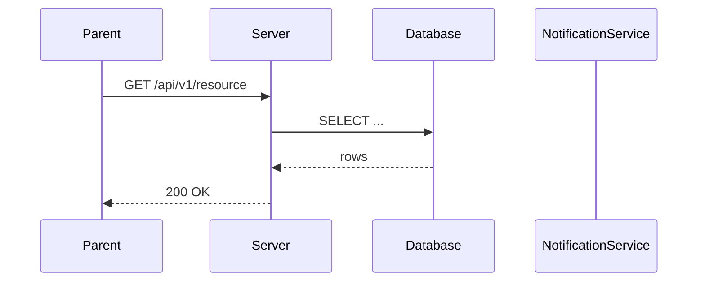
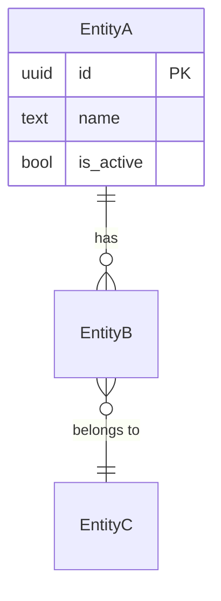

<!--
╔══════════════════════════════════════════════════════════════════╗
║  VIDYA PRAYAG — STANDARD FEATURE SPECIFICATION TEMPLATE          ║
║  Copy this file, rename to FEATURE_NAME_SPEC.md, fill in.        ║
║  Every section is mandatory. Mark N/A if genuinely not applicable.║
║  Do NOT delete a section — write "N/A — reason" instead.         ║
╚══════════════════════════════════════════════════════════════════╝
-->

# [Feature Name] — Technical Specification

> **Document status:** Draft | Review | Implementation-ready
> **Last updated:** YYYY-MM-DD
> **Author:** [name]
> **Prerequisites:** [comma-separated spec names or "None"]
> **Related specs:** [comma-separated or "None"]

---

## 1. Feature Overview

### Purpose
<!-- One-paragraph description of what this feature does. -->

### Business Value
<!-- Why this matters. What problem it solves for schools/parents/teachers. -->

### Goals
- [ ] Goal 1
- [ ] Goal 2

### Non-goals
<!-- Explicitly out of scope for this spec. -->
- [ ] Non-goal 1

### Dependencies
<!-- Internal modules, external services, other specs this depends on. -->
- Dependency 1

### Related Modules
<!-- Which existing system modules this feature touches. -->
- Module 1

---

## 2. Current System Assessment

<!-- What exists today? Be specific — cite files, tables, APIs. -->

### Existing Code
<!-- File paths and what they do. -->

### Existing Database
<!-- Relevant tables in Tables.kt or migrations. -->

### Existing APIs
<!-- Endpoints that already exist. -->

### Existing UI
<!-- Screens that already exist. -->

### Existing Services
<!-- Backend services already in place. -->

### Existing Documentation
<!-- Specs, docs, audit references. -->

### Technical Debt
<!-- Known debt that affects this feature. -->

### Gaps
<!-- What's missing that this spec addresses. -->

---

## 3. Functional Requirements

<!-- Every business requirement. Each FR gets a unique ID. -->

### FR-001
| Field | Value |
|---|---|
| **Title** | [short title] |
| **Description** | [detailed description] |
| **Priority** | Critical / High / Medium / Low |
| **User Roles** | Admin, Teacher, Parent, Driver, ... |
| **Acceptance notes** | [how to verify this is met] |

### FR-002
| Field | Value |
|---|---|
| **Title** | [short title] |
| **Description** | [detailed description] |
| **Priority** | [priority] |
| **User Roles** | [roles] |
| **Acceptance notes** | [notes] |

<!-- Add more FR-NNN as needed. -->

---

## 4. User Stories

<!-- Group by role. Each story is a concrete user action. -->

### Admin
- [ ] Create [entity]
- [ ] Assign [entity]
- [ ] Deactivate [entity]

### Teacher
- [ ] View [entity]
- [ ] Mark [action]

### Parent
- [ ] View [entity]
- [ ] Receive notification for [event]

### Driver / Other Roles
- [ ] [action]

---

## 5. Business Rules

<!-- The most forgotten section. Invariants and constraints. -->

### BR-001
**Rule:** [description]
**Enforcement:** [DB constraint / service validation / UI guard]

### BR-002
**Rule:** [description]
**Enforcement:** [how enforced]

<!-- Add more BR-NNN as needed. -->

---

## 6. Database Design

### 6.1 Entity Relationship Summary
<!-- Text-based ER overview. List entities and their relationships. -->
```
EntityA 1───* EntityB
EntityB *───1 EntityC
```

### 6.2 New Tables

```sql
-- Table: [name]
CREATE TABLE [name] (
    id              UUID PRIMARY KEY DEFAULT gen_random_uuid(),
    school_id       UUID NOT NULL,
    -- columns...
    is_active       BOOLEAN NOT NULL DEFAULT true,
    created_at      TIMESTAMP NOT NULL DEFAULT now(),
    updated_at      TIMESTAMP NOT NULL DEFAULT now(),
    deleted_at      TIMESTAMP                          -- soft delete
);
```

### 6.3 Modified Tables
<!-- Existing tables that get new columns or constraints. -->

### 6.4 Indexes
```sql
CREATE INDEX idx_[table]_[col] ON [table]([col]);
```

### 6.5 Constraints
<!-- UNIQUE, CHECK, FK constraints. -->

### 6.6 Foreign Keys
<!-- List all FK relationships. -->

### 6.7 Soft Delete Strategy
<!-- Which tables use soft delete (deleted_at) vs hard delete. -->

### 6.8 Audit Fields
<!-- All tables should have created_at, updated_at. List any extra audit fields. -->

### 6.9 Migration Notes
<!-- Migration file name, rollback strategy, data backfill if needed. -->
- **Migration file:** `docs/db/migration_0XX_[name].sql`
- **Rollback:** [how to undo]
- **Backfill:** [if existing data needs migration]

---

## 7. State Machines

<!-- For every entity with a lifecycle, show states and transitions. -->

### [Entity A] State Machine
```
[State1] ──event──> [State2] ──event──> [State3]
                                    ↓
                              [State4]
```
| Current State | Event | Next State | Guard / Condition |
|---|---|---|---|
| State1 | event_x | State2 | [condition] |

### [Entity B] State Machine
```
[State1] ──> [State2] ──> [State3]
```

---

## 8. Backend Architecture

### 8.1 Repositories
<!-- Exposed ORM table DAOs and query functions. -->
```kotlin
class [Name]Repository {
    // CRUD + custom queries
}
```

### 8.2 Services
<!-- Business logic layer. -->
```kotlin
class [Name]Service {
    suspend fun [method](): [ReturnType]
}
```

### 8.3 Validators
<!-- Input validation logic. -->
```kotlin
object [Name]Validator {
    fun validate[Entity](input: [Dto]): ValidationResult
}
```

### 8.4 Mappers
<!-- DTO ↔ Entity mappers. -->
```kotlin
fun [Entity].toDto(): [Dto]
fun [Dto].toEntity(): [Entity]
```

### 8.5 Permission Checks
<!-- Where authorization is enforced per endpoint/service. -->

### 8.6 Background Jobs
<!-- Scheduled or queued jobs. -->
- Job 1: [description], runs every [interval]

### 8.7 Domain Events
<!-- Events emitted by this feature. -->
- `[EventName]` — emitted when [condition], consumed by [handler]

### 8.8 Caching
<!-- What is cached, TTL, invalidation strategy. -->

### 8.9 Transactions
<!-- Which operations require DB transactions. -->

---

## 9. API Contracts

<!-- Every endpoint. Use the format below for each. -->

### 9.1 [Endpoint Group Name]

#### `GET /api/v1/[resource]`
| Field | Value |
|---|---|
| **Description** | [what it does] |
| **Authorization** | [role(s) allowed] |
| **Rate Limit** | [e.g. 60/min] |
| **Query params** | `param` (type, required, description) |
| **200 Response** | [JSON schema or DTO] |
| **Errors** | 400, 401, 403, 404, 500 |

```json
// Request
{}

// 200 Response
{}
```

#### `POST /api/v1/[resource]`
| Field | Value |
|---|---|
| **Description** | [what it does] |
| **Authorization** | [role(s)] |
| **Rate Limit** | [limit] |
| **Request body** | [fields] |
| **201 Response** | [DTO] |
| **Errors** | 400, 401, 403, 409, 422, 500 |

```json
// Request
{}

// 201 Response
{}
```

#### `PUT /api/v1/[resource]/{id}`
<!-- Same table format. -->

#### `PATCH /api/v1/[resource]/{id}`
<!-- Same table format. -->

#### `DELETE /api/v1/[resource]/{id}`
<!-- Same table format. -->

<!-- Repeat for every endpoint. -->

---

## 10. Frontend Architecture

### 10.1 Screens
| Screen | Platform | Role | Description |
|---|---|---|---|
| `[Name]Screen.kt` | Android/iOS/Web | [role] | [description] |

### 10.2 Navigation
<!-- How user reaches these screens. Route paths. -->

### 10.3 State Management
<!-- ViewModels, state holders, observable patterns. -->
```kotlin
class [Name]ViewModel : ViewModel() {
    // state + actions
}
```

### 10.4 Offline Support
<!-- What works offline, sync strategy, conflict resolution. -->

### 10.5 Loading States
<!-- Skeletons, spinners, progressive loading. -->

### 10.6 Error Handling (UI)
<!-- Error banners, retry buttons, empty states. -->

### 10.7 Search & Filtering
<!-- Search fields, filter options, sort options. -->

### 10.8 Pagination
<!-- Offset/cursor pagination, page size, infinite scroll. -->

---

## 11. Shared Module Changes (KMP)

### 11.1 DTOs
```kotlin
@Serializable
data class [Name]Dto(
    // fields
)
```

### 11.2 Domain Models
```kotlin
data class [Name](
    // fields
)
```

### 11.3 Repository Interfaces
```kotlin
interface [Name]Repository {
    suspend fun [method](): [ReturnType]
}
```

### 11.4 UseCases
```kotlin
class [Name]UseCase(
    private val repo: [Name]Repository
) {
    suspend operator fun invoke(): [ReturnType]
}
```

### 11.5 Validation
```kotlin
object [Name]Validator {
    // shared validation rules
}
```

### 11.6 Serialization
<!-- kotlinx.serialization config, custom serializers, polymorphism. -->

### 11.7 Network APIs
```kotlin
interface [Name]Api {
    @GET("[path]")
    suspend fun [method](): [ReturnType]
}
```

### 11.8 Database Models (if SQLDelight/local DB)
<!-- Local table definitions for offline cache. -->

---

## 12. Permissions Matrix

| Action | Admin | Teacher | Parent | Driver | Student |
|---|---|---|---|---|---|
| Create [entity] | ✅ | ❌ | ❌ | ❌ | ❌ |
| View [entity] | ✅ | ✅ | ✅ | ✅ | ❌ |
| Update [entity] | ✅ | ❌ | ❌ | ❌ | ❌ |
| Delete [entity] | ✅ | ❌ | ❌ | ❌ | ❌ |

---

## 13. Notifications

<!-- Every notification this feature triggers. -->

### N-001
| Field | Value |
|---|---|
| **Trigger** | [event that fires this] |
| **Recipient** | [role / user group] |
| **Template** | "[message template with {placeholders}]" |
| **Channel** | Push / WhatsApp / SMS / Email / In-app |
| **Retry policy** | [max retries, backoff] |
| **Deduplication** | [how duplicates are prevented] |

### N-002
<!-- Repeat for each notification. -->

---

## 14. Background Jobs

| Job | Schedule | Description | Error handling |
|---|---|---|---|
| [name] | [cron / interval] | [what it does] | [on failure behavior] |

---

## 15. Integrations

<!-- Every external system this feature connects to. -->

### [Integration Name]
| Field | Value |
|---|---|
| **System** | [e.g. Google Maps, Firebase, Supabase, SMS Gateway] |
| **Purpose** | [why we need it] |
| **API / SDK** | [library or endpoint] |
| **Auth method** | [API key / OAuth / service account] |
| **Fallback** | [what happens if this service is down] |

---

## 16. Security

### Authentication
<!-- How users are authenticated for this feature. -->

### Authorization
<!-- Role-based access, school-scoped data isolation. -->

### Encryption
<!-- Data at rest, data in transit, sensitive field encryption. -->

### Audit Logs
<!-- What actions are logged for audit trail. -->

### PII Handling
<!-- What PII is collected, stored, and how it's protected. -->

### DPDP / GDPR Compliance
<!-- Consent, data export, right to erasure considerations. -->

### Rate Limiting
<!-- API rate limits for this feature's endpoints. -->

### Input Validation
<!-- Server-side validation, sanitization, SQL injection prevention. -->

---

## 17. Performance & Scalability

### Expected Scale
| Metric | 10 schools | 100 schools | 1000 schools |
|---|---|---|---|
| [entity count] | [N] | [N] | [N] |
| [requests/day] | [N] | [N] | [N] |

### Latency Targets
| Operation | Target |
|---|---|
| [API call] | < [N]ms |
| [query] | < [N]ms |

### Optimization Strategy
- **Caching:** [what / where / TTL]
- **Indexes:** [which indexes]
- **Batching:** [bulk operations]
- **Pagination:** [strategy]

---

## 18. Edge Cases

| # | Scenario | Expected Behavior |
|---|---|---|
| EC-001 | [scenario] | [behavior] |
| EC-002 | [scenario] | [behavior] |
| EC-003 | [scenario] | [behavior] |

<!-- Common edge cases to consider:
- Network failure / no internet
- Duplicate submission
- Concurrent edits
- Partial data / null fields
- User has multiple children / roles
- Holiday / non-school day
- Half day
- Entity transferred / deactivated mid-operation
- Bulk operation partial failure
-->

---

## 19. Error Handling

### Standard Error Codes
| HTTP | Error Code | Description | When |
|---|---|---|---|
| 400 | `BAD_REQUEST` | Invalid input | Malformed request body or params |
| 401 | `UNAUTHORIZED` | Not authenticated | Missing or invalid token |
| 403 | `FORBIDDEN` | Insufficient permissions | Role not allowed |
| 404 | `NOT_FOUND` | Resource doesn't exist | Invalid ID |
| 409 | `CONFLICT` | State conflict | Duplicate or state violation |
| 422 | `UNPROCESSABLE` | Validation failed | Business rule violation |
| 500 | `INTERNAL` | Server error | Unexpected failure |

### Error Response Format
```json
{
  "error": {
    "code": "ERROR_CODE",
    "message": "Human-readable message",
    "field": "field_name",
    "details": {}
  }
}
```

### Recovery Strategy
<!-- What the client should do on each error. Retry, show message, redirect, etc. -->

---

## 20. Analytics & Reporting

### Reports
| Report | Format | Roles | Description |
|---|---|---|---|
| [name] | CSV / PDF | [roles] | [description] |

### KPIs
- KPI 1: [metric name] — [how measured]

### Dashboards
<!-- Dashboard widgets, charts, data sources. -->

### Exports
<!-- CSV/PDF export capabilities, columns included. -->

---

## 21. Testing Strategy

### Unit Tests
<!-- What to unit test. Service logic, validators, mappers. -->
- [ ] [test description]

### Integration Tests
<!-- API endpoint tests, DB interaction tests. -->
- [ ] [test description]

### UI Tests
<!-- Compose UI tests, screenshot tests. -->
- [ ] [test description]

### Performance Tests
<!-- Load testing, stress testing. -->
- [ ] [test description]

### Security Tests
<!-- Auth bypass, injection, access control tests. -->
- [ ] [test description]

### Offline Tests
<!-- Offline behavior, sync conflict tests. -->
- [ ] [test description]

### Migration Tests
<!-- Schema migration up/down tests. -->
- [ ] [test description]

### Regression Tests
<!-- Existing functionality that must not break. -->
- [ ] [test description]

---

## 22. Acceptance Criteria

<!-- One checkbox per functional requirement. -->

- [ ] FR-001: [summary]
- [ ] FR-002: [summary]
- [ ] FR-003: [summary]
<!-- Add one per FR. -->

---

## 23. Implementation Roadmap

| Phase | Duration | Tasks | Deliverable |
|---|---|---|---|
| 1 | [N] days | DB migration, Exposed tables | Migration script + table classes |
| 2 | [N] days | Backend services + API | Endpoints working |
| 3 | [N] days | Shared module (KMP) | DTOs, models, API interfaces |
| 4 | [N] days | Client UI | Screens functional |
| 5 | [N] days | Notifications + background jobs | Notifications firing |
| 6 | [N] days | Testing | All tests passing |

---

## 24. File-Level Impact Analysis

### Server (Ktor backend)
| File | Change Type | Description |
|---|---|---|
| `server/.../db/Tables.kt` | Modified/Added | [description] |
| `server/.../feature/[name]/*.kt` | New | [description] |
| `docs/db/migration_0XX_[name].sql` | New | DDL |

### Shared (KMP)
| File | Change Type | Description |
|---|---|---|
| `shared/.../feature/[name]/*.kt` | New | DTOs, models, repos, usecases |
| `shared/.../feature/[name]/[Name]Api.kt` | New | Network API interface |

### Android / Compose
| File | Change Type | Description |
|---|---|---|
| `composeApp/.../ui/v2/screens/[role]/[Name]Screen.kt` | New | [description] |
| `composeApp/.../ui/v2/screens/[role]/[Name]ViewModel.kt` | New | [description] |

### iOS
| File | Change Type | Description |
|---|---|---|
| `iosApp/...` | Modified/Added | [description] |

### Web (if applicable)
| File | Change Type | Description |
|---|---|---|
| `website/src/...` | Modified/Added | [description] |

### Documentation
| File | Change Type | Description |
|---|---|---|
| [path] | Modified/Added | [description] |

### Migration
| File | Change Type | Description |
|---|---|---|
| `docs/db/migration_0XX_[name].sql` | New | Schema DDL |

### Tests
| File | Change Type | Description |
|---|---|---|
| `server/.../test/...` | New | [description] |
| `shared/.../commonTest/...` | New | [description] |

---

## 25. Future Enhancements

<!-- Explicitly out-of-scope items that could be future phases. -->

- [ ] Enhancement 1
- [ ] Enhancement 2
- [ ] Enhancement 3

---

## A. Sequence Diagrams (Optional but Recommended)

<!-- Key request flows. Use text-based or mermaid. -->

### [Flow Name]
```
Client ──request──> Server ──query──> DB
                        │
                        ├──event──> NotificationService
                        │
                   response──> Client
```



---

## B. Domain Model / ER Diagram (Optional but Recommended)



---

## C. Event Flow (Optional but Recommended)

<!-- Document emitted events and their consumers. -->

```
[EventA] ──> [HandlerX] ──> [EventB] ──> [HandlerY] ──> [SideEffect]
```

| Event | Emitted By | Consumed By | Side Effect |
|---|---|---|---|
| [EventName] | [service] | [handler] | [description] |

---

## D. Configuration (Optional but Recommended)

<!-- Feature flags, thresholds, API keys, polling intervals. -->

| Key | Type | Default | Description |
|---|---|---|---|
| `[feature]_enabled` | Boolean | `false` | Feature flag |
| `[feature]_poll_interval` | Int | `30` | Seconds between polls |
| `[feature]_threshold` | Double | `500.0` | Geofence radius in meters |

---

## E. Migration & Rollback (Optional but Recommended)

### Deployment Plan
1. [ ] Run migration `0XX` on staging
2. [ ] Verify schema
3. [ ] Deploy backend
4. [ ] Deploy client
5. [ ] Enable feature flag

### Rollback Plan
1. [ ] Disable feature flag
2. [ ] Revert backend deployment
3. [ ] Run rollback migration `0XX_rollback.sql`
4. [ ] Verify data integrity

### Data Backfill
<!-- If existing data needs to be transformed. -->
```sql
-- Backfill script
```

---

## F. Observability (Optional but Recommended)

### Logging
<!-- What to log, log level, structured fields. -->

### Metrics
| Metric | Type | Description |
|---|---|---|
| `[feature]_requests_total` | Counter | Total API requests |
| `[feature]_latency_ms` | Histogram | Request latency |
| `[feature]_errors_total` | Counter | Error count |

### Health Checks
<!-- Endpoint or function to verify feature health. -->

### Alerts
| Alert | Condition | Severity |
|---|---|---|
| [name] | [condition] | Critical / Warning |

---

<!--
END OF TEMPLATE
Usage:
  1. Copy this file to newreviewdocs/specs/FEATURE_NAME_SPEC.md
  2. Replace all [placeholders] with actual content
  3. Delete this comment block when done
  4. Mark sections N/A if truly not applicable — never delete a section
  5. Update IMPLEMENTATION_BACKLOG.md with the new spec file reference
-->
